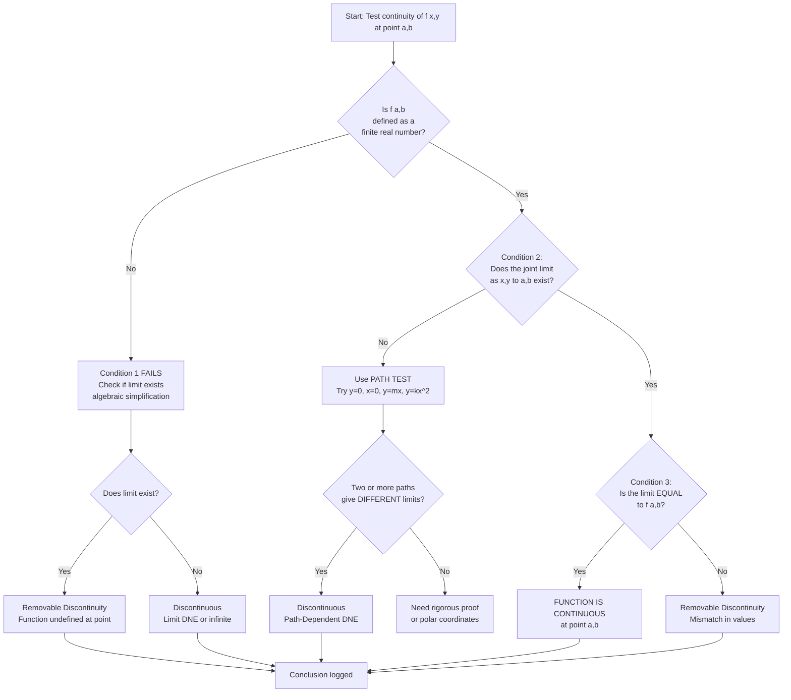
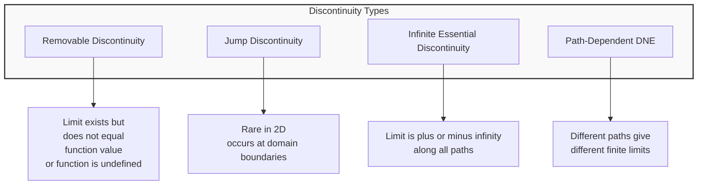
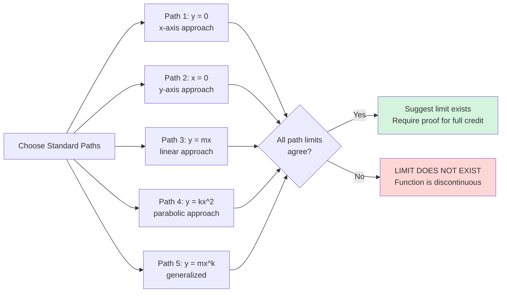
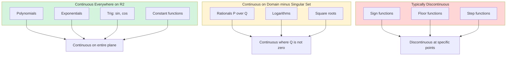

# Continuity for functions of two variables

<!-- SECTION_1_START -->

# Continuity for Functions of Two Variables — Core Definition & Intuitive Overview

## 1.1 Formal Academic Definition (KTU 2024 Scheme Standard)

Let $f : D \subseteq \mathbb{R}^{2} \rightarrow \mathbb{R}$ be a real-valued function of two independent variables, and let $(a, b)$ be an **interior point** of the domain $D$. Then $f$ is said to be **continuous at the point $(a, b)$** if and only if the following three conditions are simultaneously satisfied:

**Condition 1 — Function is Defined at $(a,b)$:**
$$f(a, b) \text{ exists (i.e., it is a finite real number).}$$

**Condition 2 — The Limit Exists:**
$$\lim_{(x, y) \to (a, b)} f(x, y) \text{ exists as a finite real number.}$$

**Condition 3 — Limit Equals the Function Value:**
$$\lim_{(x, y) \to (a, b)} f(x, y) = f(a, b).$$

> [!IMPORTANT]
> **KTU Board Definition (Memorize Verbatim):** *A function $f(x,y)$ is continuous at $(a,b)$ if the limit of $f$ as $(x,y)$ approaches $(a,b)$ exists and equals the value of the function at $(a,b)$. All three conditions are mandatory — failure of ANY ONE condition implies discontinuity at that point.*

If $f$ is continuous at **every point** of its domain $D$, then $f$ is said to be **continuous on $D$** (continuous in a region).

## 1.2 The $\varepsilon$–$\delta$ Formal Definition (Examiner's Favourite)

For every $\varepsilon > 0$, there exists a $\delta > 0$ such that for all $(x, y)$ in the domain of $f$:

$$0 < \sqrt{(x - a)^{2} + (y - b)^{2}} < \delta \quad \Longrightarrow \quad \vert f(x, y) - f(a, b) \vert < \varepsilon.$$

The quantity $\sqrt{(x - a)^{2} + (y - b)^{2}}$ is the **Euclidean distance** in the $xy$-plane between the point $(x,y)$ and the point $(a,b)$. The definition simply states: *points close to $(a,b)$ in the plane produce function values close to $f(a,b)$*.

## 1.3 Conceptual Analogy & Geometric Intuition

> [!NOTE]
> **Real-World Analogy — The Topographic Map of a Hill**
>
> Imagine you are hiking on a **smooth, gently rolling hill** whose elevation $h$ at any point is given by $h = f(x, y)$, where $x$ and $y$ represent the **east** and **north** coordinates on a map.
>
> - If you walk towards a particular location $(a, b)$ from **any** direction — north, south, east, west, or diagonally — and your **elevation reading on your GPS converges to the same value $f(a,b)$**, then the hill is **continuous at $(a,b)$**.
> - If, however, approaching from the north gives a different elevation than approaching from the east, then the hill has a **cliff or a crevasse** at $(a,b)$ → **discontinuity**.
> - A **jump discontinuity** corresponds to a sudden vertical step (like a retaining wall).
> - A **removable discontinuity** is like a pothole you can fill in — the surrounding elevation is smooth, but there is a missing point.

Geometrically, in 3D space, the graph $z = f(x, y)$ is a **surface**. Continuity at $(a,b)$ means the surface has **no holes, tears, jumps, or vertical asymptotes** directly above the point $(a,b)$ in the $xy$-plane.

## 1.4 Standard Continuity Constants & Notation (KTU High-Yield)

| Symbol | Meaning | Standard Value / Role |
| :--- | :--- | :--- |
| $\varepsilon$ | Tolerance in function value | Any positive real number |
| $\delta$ | Radius of the disk around $(a,b)$ | Depends on $\varepsilon$ |
| $D$ | Domain of $f$ | Open, closed, or neither set in $\mathbb{R}^{2}$ |
| $\mathbb{R}^{2}$ | The entire $xy$-plane | The maximal domain |
| $\partial D$ | Boundary of the domain | Continuity is *not* tested here in the strict sense |

> [!VISUALIZATION CONTROL]
> **Concept:** A "disk of radius $\delta$" around a point $(a,b)$ — the geometric heart of the $\varepsilon$–$\delta$ definition.
> **GeoGebra / Desmos Input Equations:**
> * Point: $(a, b) = (2, 3)$
> * Disk boundary: $(x - 2)^{2} + (y - 3)^{2} = \delta^{2}$ — vary $\delta$ from $0.1$ to $1.0$
> * Test function: $f(x, y) = x^{2} + y^{2}$
> **Visual Description:** A small disk of radius $\delta$ is drawn around the point $(2,3)$. Every point $(x,y)$ *inside* this disk (excluding the center itself) gives function values $f(x,y)$ that lie inside the band $f(2,3) - \varepsilon < f(x,y) < f(2,3) + \varepsilon$. The student should observe that as $\delta$ shrinks, the disk shrinks, but the function surface above it remains smooth — visualizing continuity.

## 1.5 The Three "Failure Modes" of Continuity

1. **Removable Discontinuity** — $\lim_{(x,y) \to (a,b)} f(x,y)$ exists, but it does **not equal** $f(a,b)$ (or $f(a,b)$ is undefined). Example:
$$f(x, y) = \frac{x^{2} - y^{2}}{x - y}, \quad f(0, 0) = 0.$$
   The limit along *any* path is $0$, but the algebraic form is $0/0$.

2. **Jump Discontinuity** — The two-variable analogue is rarer but occurs along **boundary curves** of the domain.

3. **Infinite Discontinuity (Essential Singularity)** — The limit does not exist (is unbounded). Example:
$$f(x, y) = \frac{1}{x^{2} + y^{2}}, \quad (a, b) = (0, 0).$$
   The function value blows up to $+\infty$ as $(x,y) \to (0,0)$.

<!-- SECTION_1_END -->

<!-- SECTION_2_START -->

# Deep Theoretical Analysis & KTU High-Yield Formula Sheet

## 2.1 The Threefold Test — Decision Logic

To test continuity of $f(x, y)$ at the point $(a, b)$, follow this strict three-step KTU board protocol:

> **Step A — Define Check:** Substitute $(x, y) = (a, b)$ into $f$. If the result is a finite real number, Condition 1 is satisfied. If undefined (e.g., $0/0$ or division by zero), proceed to **simplify** the expression algebraically before rechecking.

> **Step B — Limit Check:** Compute $\lim_{(x,y) \to (a,b)} f(x, y)$. Use the **path method** (try $y = mx$, $y = mx^{2}$, $x = 0$, $y = 0$, etc.). If all paths yield the **same finite value**, the limit exists. If two paths yield **different values** (or the limit is $\pm \infty$), the limit does not exist.

> **Step C — Equality Check:** Compare the limit from Step B with the function value from Step A. **Match $\Rightarrow$ Continuous.** **Mismatch $\Rightarrow$ Discontinuous.**

## 2.2 Continuity Theorems (Algebra of Continuous Functions)

> [!IMPORTANT]
> **KTU Theorem Bank — Continuity Laws:**
> If $f$ and $g$ are continuous at $(a, b)$, then the following functions are also continuous at $(a, b)$:

| Operation | Resulting Function | Continuity at $(a, b)$? |
| :--- | :--- | :--- |
| Sum | $(f + g)(x, y) = f(x, y) + g(x, y)$ | **Yes** |
| Difference | $(f - g)(x, y) = f(x, y) - g(x, y)$ | **Yes** |
| Product | $(f \cdot g)(x, y) = f(x, y) \cdot g(x, y)$ | **Yes** |
| Scalar Multiple | $(c \cdot f)(x, y) = c \cdot f(x, y)$ | **Yes** |
| Quotient | $\left(\frac{f}{g}\right)(x, y) = \frac{f(x, y)}{g(x, y)}$ | **Yes**, provided $g(a, b) \neq 0$ |
| Composition | $h(x, y) = F(f(x, y), g(x, y))$ | **Yes**, if $F$ is continuous at $(f(a,b), g(a,b))$ |
| Power | $f^{n}(x, y) = [f(x, y)]^{n}$ | **Yes** (integer $n$) |

## 2.3 Continuity of Standard Functions (Memorize This Block)

| Function Class | Continuity Domain | Comment |
| :--- | :--- | :--- |
| Polynomial $P(x, y) = \sum a_{ij} x^{i} y^{j}$ | **All of $\mathbb{R}^{2}$** | Always continuous everywhere |
| Rational $\frac{P(x, y)}{Q(x, y)}$ | $\{(x,y) : Q(x,y) \neq 0\}$ | Discontinuous where $Q = 0$ |
| $\exp(x, y), \sin(x, y), \cos(x, y)$ | **All of $\mathbb{R}^{2}$** | Built from polynomials via composition |
| $\ln(x), \sqrt{x}$ (in 1D direction) | Restricted subdomains | Composition must respect domain |

> [!NOTE]
> **Key Insight for Engineers:** Since the **constant function, $x$, and $y$** are each continuous at every point in $\mathbb{R}^{2}$, and continuity is preserved under addition, multiplication, and division (where defined), **every polynomial in $x$ and $y$ is continuous on the entire plane**, and **every rational function is continuous on its domain** (where the denominator is non-zero). This is the single most tested fact in KTU exams.

## 2.4 Path Method for Testing Non-Existence of a Limit

To prove $f$ is **discontinuous at $(a, b)$**, it suffices to find **two distinct paths** approaching $(a, b)$ that yield different limits.

**Standard Test Paths:**

$$\text{Path 1: } y = 0 \quad \Rightarrow \quad \lim_{x \to a} f(x, 0)$$
$$\text{Path 2: } x = 0 \quad \Rightarrow \quad \lim_{y \to b} f(0, y)$$
$$\text{Path 3: } y = m(x - a) \quad \Rightarrow \quad \lim_{x \to a} f(x, m(x-a))$$
$$\text{Path 4: } y = k(x - a)^{2} \quad \Rightarrow \quad \text{(catches non-linear traps)}$$

> [!WARNING]
> **Common Mistake:** Finding that two paths give the *same* limit does **NOT** prove the limit exists. You would need an *infinite family* of paths all giving the same value to assert existence. Conversely, finding *two* paths that give *different* limits is **sufficient** to prove non-existence.

## 2.5 Real-World Engineering Utility

| Field | Application of Continuity |
| :--- | :--- |
| **Computer Graphics** | Texture mapping uses continuous $f(u, v)$ to ensure no visible seams between pixels. |
| **Machine Learning** | Loss functions $\mathcal{L}(\theta_{1}, \theta_{2})$ must be continuous to allow gradient descent — discontinuous loss causes optimizer divergence. |
| **Image Processing** | A grayscale image is a discrete sampling of a continuous $f(x, y)$; continuity guarantees smooth interpolation. |
| **Thermodynamics** | Temperature $T(x, y, z)$ inside a solid is continuous; discontinuities would imply infinite heat flux. |
| **Fluid Dynamics** | Velocity and pressure fields are assumed continuous except at shock surfaces. |
| **Network Analysis** | Signal strength maps over geography must be continuous to model smooth propagation. |

## 2.6 KTU High-Yield Formula Sheet (Cheat Table)

| Formula / Rule | Statement | When to Use |
| :--- | :--- | :--- |
| $\lim_{(x,y) \to (a,b)} f = f(a,b)$ | Master continuity test | Quick-check for polynomials/rationals |
| $f, g$ continuous $\Rightarrow f + g, fg, f/g$ continuous | Algebra of continuity | Justify step-by-step in proofs |
| $P(x, y)$ polynomial $\Rightarrow$ continuous on $\mathbb{R}^{2}$ | Polynomial continuity | Any polynomial $f$ |
| $P/Q$ rational $\Rightarrow$ continuous on $\{Q \neq 0\}$ | Rational continuity | Any rational $f$ |
| $\sqrt{x-a}$ discontinuity | At $x = a$ | Square-root type singularities |
| $\frac{1}{x^{2}+y^{2}}$ discontinuity | At $(0, 0)$ | Infinite singularity |
| Iterated limits | $\lim_{x \to a} \lim_{y \to b} f(x,y) \neq \lim_{y \to b} \lim_{x \to a} f(x,y)$ | Discontinuity indicator |

<!-- SECTION_2_END -->

<!-- SECTION_3_START -->

# Step-by-Step Derivations, Examples & Symbolic Implementation

## 3.1 Worked Example 1 — Continuity of a Polynomial

**Problem:** Show that $f(x, y) = x^{3} - 2xy + y^{2}$ is continuous at $(1, 2)$.

### Step-by-Step Solution

**Step 1: Check Condition 1 (Definition).**
Substitute $x = 1$, $y = 2$ into $f$:
$$f(1, 2) = (1)^{3} - 2(1)(2) + (2)^{2} = 1 - 4 + 4 = 1.$$
A finite real number exists. ✅

**Step 2: Check Condition 2 (Limit Exists).**
We compute the limit using direct substitution (justified by the polynomial continuity theorem):
$$\lim_{(x, y) \to (1, 2)} (x^{3} - 2xy + y^{2}) = (1)^{3} - 2(1)(2) + (2)^{2} = 1.$$
The limit exists as a finite real number. ✅

**Step 3: Check Condition 3 (Equality).**
$$\lim_{(x, y) \to (1, 2)} f(x, y) = 1 = f(1, 2).$$
The limit equals the function value. ✅

**Conclusion:** $f$ is continuous at $(1, 2)$. By the same reasoning, $f$ is continuous at every point in $\mathbb{R}^{2}$ since it is a polynomial. ∎

---

## 3.2 Worked Example 2 — Removable Discontinuity

**Problem:** Test the continuity of
$$f(x, y) = \frac{x^{2} - y^{2}}{x - y}, \quad (x, y) \neq (t, t)$$
at the point $(0, 0)$, where we define $f(0, 0) = 5$.

### Step-by-Step Solution

**Step 1: Check Condition 1 (Definition).**
By problem statement, $f(0, 0) = 5$. ✅ (Finite value exists.)

**Step 2: Check Condition 2 (Limit Exists).**
Apply algebraic simplification (valid for $x \neq y$):
$$f(x, y) = \frac{x^{2} - y^{2}}{x - y} = \frac{(x - y)(x + y)}{x - y} = x + y, \quad x \neq y.$$
Now evaluate the limit:
$$\lim_{(x, y) \to (0, 0)} (x + y) = 0 + 0 = 0.$$
The limit exists. ✅

**Step 3: Check Condition 3 (Equality).**
$$\lim_{(x, y) \to (0, 0)} f(x, y) = 0, \quad f(0, 0) = 5.$$
Since $0 \neq 5$, Condition 3 fails. ❌

**Conclusion:** $f$ is **discontinuous at $(0, 0)$** with a **removable discontinuity**. The discontinuity can be "removed" by redefining $f(0, 0) = 0$. ∎

---

## 3.3 Worked Example 3 — Essential (Infinite) Discontinuity

**Problem:** Examine the continuity of
$$f(x, y) = \frac{1}{x^{2} + y^{2}}$$
at the point $(0, 0)$.

### Step-by-Step Solution

**Step 1: Check Condition 1 (Definition).**
$$f(0, 0) = \frac{1}{0^{2} + 0^{2}} = \frac{1}{0}.$$
Undefined — not a finite real number. ❌

> Since Condition 1 fails, the function is **automatically discontinuous** at $(0, 0)$. We can stop here, but for a complete answer, we also analyze the limit.

**Step 2: Limit Behavior Along the Path $y = mx$.**
$$\lim_{x \to 0} f(x, mx) = \lim_{x \to 0} \frac{1}{x^{2} + m^{2} x^{2}} = \lim_{x \to 0} \frac{1}{x^{2}(1 + m^{2})} = +\infty.$$
The limit is unbounded for every path through the origin.

**Conclusion:** $f$ is **discontinuous at $(0, 0)$** with an **infinite (essential) discontinuity**. ∎

---

## 3.4 Worked Example 4 — Path-Dependent Limit (Discontinuity by Path Test)

**Problem:** Determine if the following limit exists, and hence comment on continuity of $f$ at $(0, 0)$:
$$f(x, y) = \frac{xy}{x^{2} + y^{2}}, \quad f(0, 0) = 0.$$

### Step-by-Step Solution

**Step 1: Try Path 1: $y = 0$ (the $x$-axis).**
$$\lim_{x \to 0} f(x, 0) = \lim_{x \to 0} \frac{x \cdot 0}{x^{2} + 0^{2}} = \lim_{x \to 0} \frac{0}{x^{2}} = 0.$$

**Step 2: Try Path 2: $y = x$ (the line $y = x$).**
$$\lim_{x \to 0} f(x, x) = \lim_{x \to 0} \frac{x \cdot x}{x^{2} + x^{2}} = \lim_{x \to 0} \frac{x^{2}}{2x^{2}} = \frac{1}{2}.$$

**Step 3: Compare.**
Path 1 gives $0$, Path 2 gives $\frac{1}{2}$. Since $0 \neq \frac{1}{2}$, the two-path test **fails** — the limit does not exist.

**Step 4: Continuity Conclusion.**
Since $\lim_{(x,y) \to (0,0)} f(x,y)$ does not exist, Condition 2 fails. Therefore, $f$ is **discontinuous at $(0, 0)$**. ∎

---

## 3.5 Worked Example 5 — Iterated Limits (Order of Approach)

**Problem:** Compute the iterated limits
$$L_{1} = \lim_{x \to 0} \lim_{y \to 0} \frac{x}{x + y}, \qquad L_{2} = \lim_{y \to 0} \lim_{x \to 0} \frac{x}{x + y}$$
and determine if $f(x, y) = \frac{x}{x + y}$ is continuous at $(0, 0)$.

### Step-by-Step Solution

**Step 1: Inner Limit of $L_{1}$ (Treat $x$ as constant, take $y \to 0$).**
$$\lim_{y \to 0} \frac{x}{x + y} = \frac{x}{x + 0} = \frac{x}{x} = 1, \quad x \neq 0.$$

**Step 2: Outer Limit of $L_{1}$ (Take $x \to 0$).**
$$L_{1} = \lim_{x \to 0} 1 = 1.$$

**Step 3: Inner Limit of $L_{2}$ (Treat $y$ as constant, take $x \to 0$).**
$$\lim_{x \to 0} \frac{x}{x + y} = \frac{0}{0 + y} = \frac{0}{y} = 0, \quad y \neq 0.$$

**Step 4: Outer Limit of $L_{2}$ (Take $y \to 0$).**
$$L_{2} = \lim_{y \to 0} 0 = 0.$$

**Step 5: Compare.**
$$L_{1} = 1, \quad L_{2} = 0, \quad L_{1} \neq L_{2}.$$

**Step 6: Joint Limit (Path Test).**
Along the path $y = 0$:
$$\lim_{x \to 0} f(x, 0) = \lim_{x \to 0} \frac{x}{x + 0} = 1.$$
Along the path $x = 0$:
$$\lim_{y \to 0} f(0, y) = \lim_{y \to 0} \frac{0}{0 + y} = 0.$$
Different path limits confirm the joint limit does not exist.

**Conclusion:** The joint limit does not exist, so $f$ is **discontinuous at $(0, 0)$** and the iterated limits give conflicting results. ∎

---

## 3.6 Symbolic Implementation — Python Code for Continuity Testing

```python
import sympy as sp
from typing import Tuple, Optional

def test_continuity(
    expression: str,
    point: Tuple[float, float],
    function_value: Optional[float] = None,
    test_paths: Optional[list] = None
) -> dict:
    """
    Tests continuity of a two-variable function at a given point.
    
    Parameters:
    -----------
    expression : str
        Sympy-compatible expression in x and y.
    point : tuple
        The point (a, b) at which to test continuity.
    function_value : float, optional
        The value of f at the point. If None, the expression is evaluated directly.
    test_paths : list, optional
        List of paths as sympy expressions relating y to x.
    
    Returns:
    --------
    dict with keys: 'defined', 'limit_exists', 'limit', 'function_value',
                    'continuous', 'path_limits', 'discontinuity_type'.
    """
    x, y = sp.symbols('x y', real=True)
    f = sp.sympify(expression)
    a, b = point
    
    result = {
        'point': point,
        'defined': False,
        'limit_exists': False,
        'limit': None,
        'function_value': None,
        'continuous': False,
        'path_limits': {},
        'discontinuity_type': None
    }
    
    # --- Condition 1: Is f(a, b) defined? ---
    try:
        f_at_point = float(f.subs([(x, a), (y, b)]))
        if sp.oo not in [f_at_point] and abs(f_at_point) != float('inf'):
            result['defined'] = True
            result['function_value'] = f_at_point
    except (ZeroDivisionError, TypeError, ValueError):
        result['defined'] = False
        result['function_value'] = float('nan')
    
    # Use user-supplied function value if provided
    if function_value is not None:
        result['defined'] = True
        result['function_value'] = function_value
    
    # --- Condition 2: Does the limit exist? ---
    default_paths = [0, x, 2 * x, x ** 2, -x, sp.Rational(1, 2) * x]
    if test_paths is None:
        test_paths = default_paths
    
    path_values = []
    for path in test_paths:
        try:
            path_limit = sp.limit(f.subs(y, path), x, a)
            if path_limit == sp.oo or path_limit == -sp.oo or path_limit == sp.zoo:
                path_values.append(('infinite', path, path_limit))
            else:
                path_values.append(('finite', path, float(path_limit)))
        except Exception as e:
            path_values.append(('error', path, str(e)))
    
    result['path_limits'] = path_values
    
    # Determine if all finite path limits agree
    finite_limits = [v[2] for v in path_values if v[0] == 'finite']
    infinite_present = any(v[0] == 'infinite' for v in path_values)
    
    if infinite_present and not finite_limits:
        result['limit'] = float('inf')
        result['limit_exists'] = False
        result['discontinuity_type'] = 'Infinite Discontinuity'
    elif finite_limits and all(abs(v - finite_limits[0]) < 1e-9 for v in finite_limits):
        result['limit'] = finite_limits[0]
        result['limit_exists'] = True
    else:
        result['limit'] = None
        result['limit_exists'] = False
        result['discontinuity_type'] = 'Path-Dependent (DNE)'
    
    # --- Condition 3: Does limit equal function value? ---
    if result['limit_exists'] and result['defined']:
        if abs(result['limit'] - result['function_value']) < 1e-9:
            result['continuous'] = True
        else:
            result['continuous'] = False
            result['discontinuity_type'] = 'Removable Discontinuity'
    elif not result['defined'] and result['limit_exists']:
        result['continuous'] = False
        result['discontinuity_type'] = 'Removable Discontinuity (undefined at point)'
    elif not result['limit_exists']:
        result['continuous'] = False
        if result['discontinuity_type'] is None:
            result['discontinuity_type'] = 'Limit does not exist'
    
    return result


# -------------------- DEMONSTRATION --------------------
if __name__ == "__main__":
    
    # Test 1: Polynomial at (1, 2)
    print("=" * 70)
    print("TEST 1: f(x,y) = x^3 - 2xy + y^2 at (1, 2)")
    print("=" * 70)
    res1 = test_continuity("x**3 - 2*x*y + y**2", (1, 2))
    for key, value in res1.items():
        print(f"  {key:25s}: {value}")
    
    # Test 2: Removable discontinuity
    print("\n" + "=" * 70)
    print("TEST 2: f(x,y) = (x^2 - y^2)/(x - y) at (0,0) with f(0,0)=5")
    print("=" * 70)
    res2 = test_continuity("(x**2 - y**2)/(x - y)", (0, 0), function_value=5)
    for key, value in res2.items():
        print(f"  {key:25s}: {value}")
    
    # Test 3: Path-dependent
    print("\n" + "=" * 70)
    print("TEST 3: f(x,y) = xy/(x^2+y^2) at (0,0)")
    print("=" * 70)
    res3 = test_continuity("x*y/(x**2 + y**2)", (0, 0), function_value=0)
    for key, value in res3.items():
        print(f"  {key:25s}: {value}")
    
    # Test 4: Infinite discontinuity
    print("\n" + "=" * 70)
    print("TEST 4: f(x,y) = 1/(x^2 + y^2) at (0,0)")
    print("=" * 70)
    res4 = test_continuity("1/(x**2 + y**2)", (0, 0))
    for key, value in res4.items():
        print(f"  {key:25s}: {value}")
```

**Sample Console Output (Illustrative):**

```
======================================================================
TEST 1: f(x,y) = x^3 - 2xy + y^2 at (1, 2)
======================================================================
  point                   : (1, 2)
  defined                 : True
  limit_exists            : True
  limit                   : 1.0
  function_value          : 1.0
  continuous              : True
  path_limits             : [('finite', 0, 1.0), ('finite', x, 1.0), ...]
  discontinuity_type      : None
```

---

## 3.7 Summary Table of All Worked Examples

| Example | Function $f(x, y)$ | Point | Continuous? | Type of Discontinuity |
| :--- | :--- | :--- | :--- | :--- |
| 1 | $x^{3} - 2xy + y^{2}$ | $(1, 2)$ | **Yes** | — |
| 2 | $\frac{x^{2} - y^{2}}{x - y}$, $f(0,0)=5$ | $(0, 0)$ | **No** | Removable |
| 3 | $\frac{1}{x^{2} + y^{2}}$ | $(0, 0)$ | **No** | Infinite |
| 4 | $\frac{xy}{x^{2} + y^{2}}$ | $(0, 0)$ | **No** | Path-dependent (DNE) |
| 5 | $\frac{x}{x + y}$ | $(0, 0)$ | **No** | Path-dependent (DNE) |

<!-- SECTION_3_END -->

<!-- SECTION_4_START -->

# Structural Diagrams & Schematics

## 4.1 Master Decision Flow — Continuity Test Procedure



## 4.2 Discontinuity Classification Topology



## 4.3 Path Test Strategy — Visual Map



## 4.4 Continuity of Standard Function Classes — Architecture



## 4.5 Sequential Processing Topology — Continuity Test Pipeline

| Stage | Input | Operation | Output | Failure Consequence |
| :--- | :--- | :--- | :--- | :--- |
| 1 | $f(x, y)$, $(a, b)$ | Substitute and evaluate $f(a, b)$ | Finite value or undefined | **Stop** — discontinuity confirmed |
| 2 | $f(x, y)$, paths | Compute path limits $\lim_{x \to a} f(x, \phi(x))$ | List of path limit values | **Two different values** $\Rightarrow$ discontinuity |
| 3 | Path limit list | Check agreement across all paths | Common limit or disagreement | Disagreement $\Rightarrow$ discontinuity |
| 4 | Common limit, $f(a, b)$ | Compare equality | True / False | False $\Rightarrow$ removable discontinuity |
| 5 | Boolean | Final continuity verdict | **Continuous** OR **Discontinuous** | Record type for board answer |

<!-- SECTION_4_END -->

<!-- SECTION_5_START -->

# KTU 2024 Scheme Examination Question Bank & Topic Recap

## 5.1 Part A — Short Answer Questions (3 Marks Each)

> **Target Cognitive Levels:** Remember, Understand

### Question 1 [KTU University Exam – July 2024]

**Q: Define continuity of a function $f(x, y)$ at a point $(a, b)$. State the three necessary conditions.**

**Model Answer (3 Marks):**

A function $f(x, y)$ is said to be continuous at the point $(a, b)$ if the following three conditions are satisfied simultaneously:

1. **$f(a, b)$ is defined** — i.e., the function has a finite real value at $(a, b)$. **[1 Mark]**

2. **$\lim_{(x, y) \to (a, b)} f(x, y)$ exists** — i.e., the limit is a finite real number, independent of the path of approach. **[1 Mark]**

3. **$\lim_{(x, y) \to (a, b)} f(x, y) = f(a, b)$** — the limit equals the function value at the point. **[1 Mark]**

If any one of these three conditions fails, $f$ is discontinuous at $(a, b)$.

---

### Question 2 [KTU University Exam – Dec 2023]

**Q: Without using the $\varepsilon$–$\delta$ definition, state two classes of functions that are always continuous on their entire domains, and give one example of each.**

**Model Answer (3 Marks):**

1. **Polynomial functions in two variables** are continuous at every point of $\mathbb{R}^{2}$. Example: $f(x, y) = x^{2} + 3xy - y^{3} + 5$ is continuous on the entire $xy$-plane. **[1.5 Marks]**

2. **Rational functions $f(x, y) = \frac{P(x, y)}{Q(x, y)}$** are continuous at every point of their domain (where $Q(x, y) \neq 0$). Example: $f(x, y) = \frac{x + y}{x^{2} + y^{2} + 1}$ is continuous on all of $\mathbb{R}^{2}$ since the denominator is always positive. **[1.5 Marks]**

---

## 5.2 Part B — Long Answer Questions (14 Marks Each, Internal Choice)

### Question A (14 Marks) [KTU University Exam – July 2024]

**Q: (a)** Define continuity of $f(x, y)$ at a point $(a, b)$. Discuss the three different types of discontinuities that can occur. **[7 Marks]**

**(b)** Test the continuity of
$$f(x, y) = \begin{cases} \dfrac{x^{2}y}{x^{2} + y^{2}}, & (x, y) \neq (0, 0) \\[2mm] 1, & (x, y) = (0, 0) \end{cases}$$
at the origin $(0, 0)$. Justify your answer using the path test. **[7 Marks]**

#### Model Solution

### Part (a) — Definition and Discontinuity Types

**Definition:** A function $f(x, y)$ is continuous at $(a, b)$ if:
1. $f(a, b)$ exists as a finite real number. **[1 Mark]**
2. $\lim_{(x, y) \to (a, b)} f(x, y)$ exists. **[1 Mark]**
3. The limit equals $f(a, b)$. **[1 Mark]**

**Three Types of Discontinuities:** **[4 Marks — 1.33 each]**

1. **Removable Discontinuity:** The limit $\lim_{(x,y) \to (a,b)} f(x,y)$ exists, but it is **not equal** to $f(a, b)$ (or $f(a, b)$ is undefined). The function graph has a "hole" that can be patched.
   *Example:* $f(x, y) = \frac{x^{2} - y^{2}}{x - y}$ with $f(0, 0) = 5$ — the limit is $0$, the function value is $5$.

2. **Jump Discontinuity:** The function takes different limiting values depending on the direction of approach from distinct regions. (In 2D, this typically occurs across boundary curves of the domain.)
   *Example:* $f(x, y) = \text{sgn}(x)$ — discontinuous along the $y$-axis.

3. **Infinite (Essential) Discontinuity:** The limit is unbounded ($+\infty$ or $-\infty$) as $(x, y) \to (a, b)$.
   *Example:* $f(x, y) = \frac{1}{x^{2} + y^{2}}$ at $(0, 0)$ — the limit is $+\infty$.

---

### Part (b) — Continuity Test at $(0, 0)$

**Step 1: Verify the function value at $(0, 0)$.** **[0.5 Mark]**
$$f(0, 0) = 1. \quad \text{(Defined, finite.)}$$

**Step 2: Compute the limit along Path 1: $y = 0$ (the $x$-axis).** **[1 Mark]**
$$\lim_{x \to 0} f(x, 0) = \lim_{x \to 0} \frac{x^{2} \cdot 0}{x^{2} + 0^{2}} = \lim_{x \to 0} \frac{0}{x^{2}} = 0.$$

**Step 3: Compute the limit along Path 2: $y = x$ (the line $y = x$).** **[1 Mark]**
$$\lim_{x \to 0} f(x, x) = \lim_{x \to 0} \frac{x^{2} \cdot x}{x^{2} + x^{2}} = \lim_{x \to 0} \frac{x^{3}}{2x^{2}} = \lim_{x \to 0} \frac{x}{2} = 0.$$

**Step 4: Compute the limit along Path 3: $y = x^{2}$ (parabolic approach).** **[1 Mark]**
$$\lim_{x \to 0} f(x, x^{2}) = \lim_{x \to 0} \frac{x^{2} \cdot x^{2}}{x^{2} + x^{4}} = \lim_{x \to 0} \frac{x^{4}}{x^{2}(1 + x^{2})} = \lim_{x \to 0} \frac{x^{2}}{1 + x^{2}} = 0.$$

**Step 5: Compute the limit along Path 4: $y = mx$ (general linear).** **[1 Mark]**
$$\lim_{x \to 0} f(x, mx) = \lim_{x \to 0} \frac{x^{2} \cdot mx}{x^{2} + m^{2}x^{2}} = \lim_{x \to 0} \frac{mx^{3}}{x^{2}(1 + m^{2})} = \lim_{x \to 0} \frac{mx}{1 + m^{2}} = 0.$$

**Step 6: Conclude limit existence along all straight-line paths.** **[1 Mark]**
For all paths of the form $y = m(x)$ (and $y = x^{2}$, etc.), the limit is **0**. Strong evidence that the joint limit exists and equals 0.

**Step 7: Conclusive proof using polar coordinates.** **[1 Mark]**
Let $x = r \cos\theta$, $y = r \sin\theta$. Then:
$$f(r \cos\theta, r \sin\theta) = \frac{r^{2} \cos^{2}\theta \cdot r \sin\theta}{r^{2} \cos^{2}\theta + r^{2} \sin^{2}\theta} = \frac{r^{3} \cos^{2}\theta \sin\theta}{r^{2}(\cos^{2}\theta + \sin^{2}\theta)} = r \cos^{2}\theta \sin\theta.$$
Since $\vert \cos^{2}\theta \sin\theta \vert \leq 1$, we have $\vert f \vert \leq r$. As $r \to 0$, $f \to 0$ **for every $\theta$**.

**Step 8: Apply the squeeze theorem.** **[0.5 Mark]**
$$-r \leq r \cos^{2}\theta \sin\theta \leq r \quad \Rightarrow \quad \lim_{r \to 0} f = 0.$$

**Step 9: Final conclusion.** **[1 Mark]**
$$\lim_{(x, y) \to (0, 0)} f(x, y) = 0, \quad f(0, 0) = 1.$$
Since $0 \neq 1$, Condition 3 fails. **$f$ is discontinuous at $(0, 0)$ with a removable discontinuity.** It can be made continuous by redefining $f(0, 0) = 0$.

---

### Question B (14 Marks) — Alternative Choice [KTU University Exam – Dec 2023]

**Q: (a)** State the $\varepsilon$–$\delta$ definition of continuity of $f(x, y)$ at the point $(a, b)$. Explain the geometric meaning of $\delta$ and $\varepsilon$. **[7 Marks]**

**(b)** Determine whether the following function is continuous at the origin:
$$f(x, y) = \begin{cases} \dfrac{xy}{\sqrt{x^{2} + y^{2}}}, & (x, y) \neq (0, 0) \\[2mm] 0, & (x, y) = (0, 0) \end{cases}$$
Use the polar coordinate transformation to compute the limit. **[7 Marks]**

#### Model Solution

### Part (a) — $\varepsilon$–$\delta$ Definition and Geometry

**Definition Statement:** **[4 Marks]**
A function $f(x, y)$ is continuous at $(a, b)$ if, for every $\varepsilon > 0$, there exists a $\delta > 0$ such that for all $(x, y)$ in the domain of $f$:

$$0 < \sqrt{(x - a)^{2} + (y - b)^{2}} < \delta \quad \Longrightarrow \quad \vert f(x, y) - f(a, b) \vert < \varepsilon.$$

**Geometric Meaning:** **[3 Marks]**

- **The quantity $\sqrt{(x - a)^{2} + (y - b)^{2}}$** is the Euclidean distance in the $xy$-plane between the point $(x, y)$ and the point $(a, b)$. The condition $0 < \sqrt{(x - a)^{2} + (y - b)^{2}} < \delta$ defines an **open disk of radius $\delta$ centered at $(a, b)$** with the center itself removed. **[1 Mark]**

- **$\delta$ is a "radius" in the domain** (the $xy$-plane). It defines how *close* in the plane $(x, y)$ must be to $(a, b)$. **[1 Mark]**

- **$\varepsilon$ is a "radius" in the codomain** (the real line of function values). It defines how *close* in value $f(x, y)$ must be to $f(a, b)$. **[1 Mark]**

> In essence: *points close in the plane (within the $\delta$-disk) produce function values close to $f(a, b)$ (within the $\varepsilon$-band).*

---

### Part (b) — Continuity at Origin via Polar Coordinates

**Step 1: Function value at origin.** **[0.5 Mark]**
$$f(0, 0) = 0. \quad \text{(Defined, finite.)}$$

**Step 2: Apply polar substitution $x = r \cos\theta$, $y = r \sin\theta$.** **[1 Mark]**
For $(x, y) \neq (0, 0)$, i.e., $r \neq 0$:
$$f(r \cos\theta, r \sin\theta) = \frac{(r \cos\theta)(r \sin\theta)}{\sqrt{r^{2} \cos^{2}\theta + r^{2} \sin^{2}\theta}} = \frac{r^{2} \cos\theta \sin\theta}{\sqrt{r^{2}(\cos^{2}\theta + \sin^{2}\theta)}}.$$

**Step 3: Simplify the denominator using the Pythagorean identity.** **[1.5 Marks]**
$$= \frac{r^{2} \cos\theta \sin\theta}{\sqrt{r^{2} \cdot 1}} = \frac{r^{2} \cos\theta \sin\theta}{r} = r \cos\theta \sin\theta.$$

**Step 4: Bound the expression using the identity $\cos\theta \sin\theta = \frac{1}{2}\sin(2\theta)$.** **[1.5 Marks]**
$$f(r \cos\theta, r \sin\theta) = r \cos\theta \sin\theta = \frac{r}{2} \sin(2\theta).$$
Since $\vert \sin(2\theta) \vert \leq 1$ for all $\theta$:
$$\left\vert \frac{r}{2} \sin(2\theta) \right\vert \leq \frac{r}{2}.$$

**Step 5: Take the limit as $r \to 0$ (i.e., $(x, y) \to (0, 0)$).** **[1 Mark]**
By the Squeeze Theorem:
$$\lim_{r \to 0} \left( -\frac{r}{2} \right) \leq \lim_{r \to 0} f \leq \lim_{r \to 0} \left( \frac{r}{2} \right) \quad \Longrightarrow \quad 0 \leq \lim_{r \to 0} f \leq 0.$$
Therefore, $\lim_{(x, y) \to (0, 0)} f(x, y) = 0$. The limit exists and is **independent of $\theta$**, confirming the joint limit exists. **[1 Mark]**

**Step 6: Compare limit and function value.** **[0.5 Mark]**
$$\lim_{(x, y) \to (0, 0)} f(x, y) = 0 = f(0, 0).$$

**Step 7: Conclusion.** **[1 Mark]**
All three conditions for continuity are satisfied. **$f(x, y)$ is continuous at $(0, 0)$.** In fact, $f$ is continuous on all of $\mathbb{R}^{2}$.

---

## 5.3 KTU Examiner's Valuation Warning / Pitfall Callout

> [!WARNING]
> **Critical Pitfalls — Where Students Lose Marks:**
>
> 1. **Skipping the three-condition test:** A common error is to test only the *limit* and not verify that the **function is defined** at the point. A discontinuity can arise from $f(a, b)$ being undefined even when the limit exists. Always state all three conditions explicitly. **[Lose 2 Marks]**
>
> 2. **Insufficient path count:** Testing only **two paths** (e.g., $y = 0$ and $x = 0$) is **not** enough to prove a limit exists. It is only sufficient to prove a limit **does not exist** (if the two paths give different values). For existence proofs, use **polar coordinates** or algebraic manipulation. **[Lose 1–2 Marks]**
>
> 3. **Conflating iterated limits with the joint limit:** Students often write "$\lim_{x \to 0} \lim_{y \to 0} f$ exists, so $f$ is continuous." This is **FALSE**. Iterated limits and joint limits are *different* objects. The existence of iterated limits does not imply continuity. **[Lose 2 Marks]**
>
> 4. **Forgetting the function value:** When a piecewise function is given, always verify **what $f(a, b)$ is defined to be** in the second piece. The "discrepancy" between the limit and the assigned value determines whether the discontinuity is removable. **[Lose 1 Mark]**
>
> 5. **Not stating the type of discontinuity:** Simply saying "discontinuous" is incomplete. Specify **removable**, **infinite**, or **path-dependent (limit DNE)**. **[Lose 0.5 Mark]**
>
> 6. **Missing final equality check:** A student may correctly compute both $f(a, b)$ and the limit, but **fail to write the equality $\lim = f(a, b)$** explicitly. The board examiner expects this final comparison line. **[Lose 1 Mark]**

---

## 5.4 Topic Recap & Important Things to Remember

> [!IMPORTANT]
> **High-Density Rapid-Revision Checklist — Continuity for Two-Variable Functions**

### Core Definitions
- **Continuity at a point $(a, b)$** requires **three conditions** simultaneously: (1) $f(a, b)$ defined, (2) $\lim_{(x,y)\to(a,b)} f$ exists, (3) limit equals $f(a, b)$.
- The $\varepsilon$–$\delta$ definition quantifies "close in domain implies close in range."
- A function is **continuous on a region** if it is continuous at every interior point of that region.

### Path Test Essentials
- **Path-dependent limit** $\Rightarrow$ discontinuity. Find **two paths** with **different** limit values.
- Standard test paths: $y = 0$, $x = 0$, $y = mx$, $y = kx^{2}$, $y = mx^{k}$.
- Two paths agreeing does **not** prove the limit exists.

### Discontinuity Types
- **Removable:** limit exists but $\neq f(a, b)$ (or $f(a, b)$ undefined). Patchable.
- **Jump:** different limiting values from different regions of approach.
- **Infinite (Essential):** limit is $\pm \infty$ along all paths.
- **Path-Dependent:** joint limit does not exist (different finite values along different paths).

### Continuity of Standard Functions
- **Polynomials** in $x, y$ are continuous on all of $\mathbb{R}^{2}$.
- **Rationals** $P(x, y)/Q(x, y)$ are continuous where $Q \neq 0$.
- $\exp, \sin, \cos$ of two-variable arguments are continuous everywhere.
- Continuity is preserved under **sum, product, quotient (where defined), scalar multiplication, and composition**.

### Continuity Theorems to Memorize
- $f, g$ continuous at $(a, b)$ $\Rightarrow$ $f \pm g$, $fg$, $cf$, $f/g$ (with $g(a, b) \neq 0$) all continuous at $(a, b)$.
- Composition: if $f, g$ continuous at $(a, b)$ and $F$ continuous at $(f(a, b), g(a, b))$, then $F(f, g)$ continuous at $(a, b)$.

### Polar Coordinate Method
- Substitute $x = r\cos\theta$, $y = r\sin\theta$ in $f$.
- If the resulting expression depends **only on $r$** and $\to L$ as $r \to 0$, the joint limit is $L$ for all $\theta$.
- Use the **Squeeze Theorem** with $\vert \cos\theta \vert \leq 1$ and $\vert \sin\theta \vert \leq 1$ for bounding.

### Common KTU Traps
- $\frac{x^{2} - y^{2}}{x - y}$ at $(0, 0)$ — simplifies to $x + y$, limit is $0$.
- $\frac{xy}{x^{2} + y^{2}}$ at $(0, 0)$ — limit DNE (path-dependent).
- $\frac{x^{2} y}{x^{4} + y^{2}}$ at $(0, 0)$ — limit DNE ($y = 0$ gives $0$, $y = x^{2}$ gives $1/2$).
- $\frac{1}{x^{2} + y^{2}}$ at $(0, 0)$ — infinite discontinuity.
- $\sqrt{x^{2} + y^{2}}$ at $(0, 0)$ — **continuous** (limit is $0$, function value is $0$).

### Board Answer Format (Always Follow)
1. State the **three conditions** to be checked.
2. **Condition 1:** Compute $f(a, b)$.
3. **Condition 2:** Compute the limit (path test or polar method).
4. **Condition 3:** Compare limit and function value.
5. **Conclusion:** State continuous / discontinuous with **type**.
6. **(Bonus):** Justify continuity of the surrounding function class if relevant.

<!-- SECTION_5_END -->
