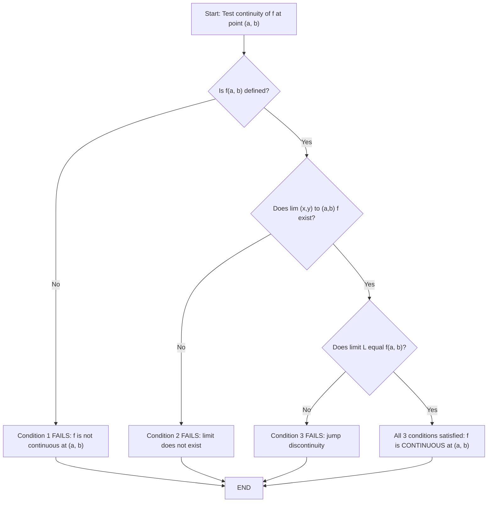
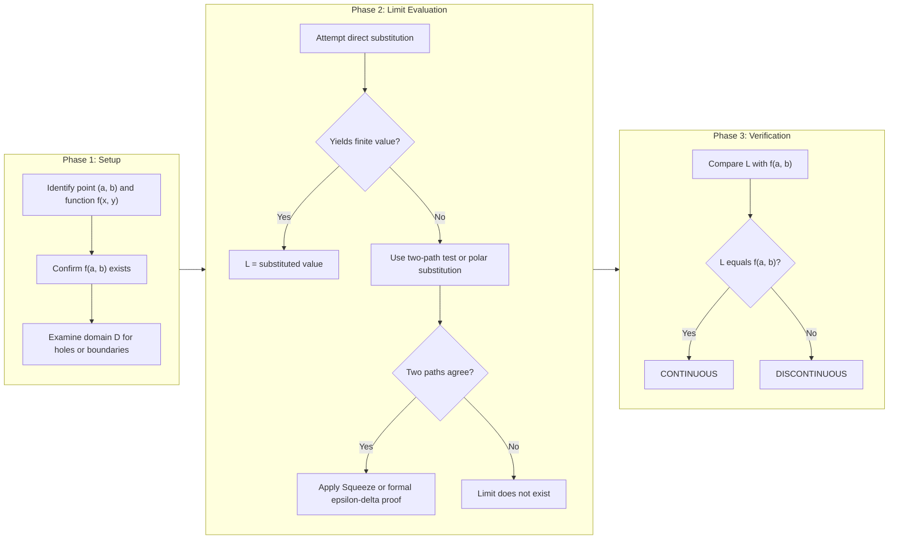
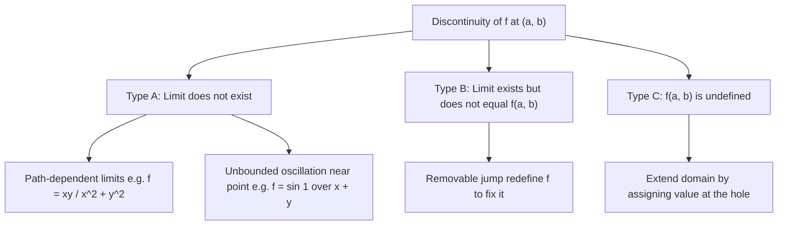

# Continuity for functions of two variables

<!-- SECTION_1_START -->

# Continuity for Functions of Two Variables

## 1.1 Formal Academic Definition (KTU 2024 Syllabus Terminology)

Let $f : D \subseteq \mathbb{R}^2 \to \mathbb{R}$ be a **real-valued function of two variables**, where $D$ is the domain of $f$. Let $(a, b)$ be a point in $D$ (or, in the special case of a limit point, an accumulation point of $D$).

The function $f(x, y)$ is said to be **continuous at the point $(a, b)$** if the following three conditions are satisfied simultaneously:

1. **Existence Condition:** $f(a, b)$ is defined (i.e., the point $(a, b) \in D$).
2. **Limit Existence:** The limit $\displaystyle \lim_{(x,y) \to (a,b)} f(x, y)$ exists as a finite real number $L$.
3. **Agreement Condition:** The limit equals the function value, that is,
$$L = \lim_{(x,y) \to (a,b)} f(x, y) = f(a, b).$$

> [!IMPORTANT]
> **KTU 2024 Board Definition (Verbatim Expectation):**
> A function $f$ of two variables is continuous at $(a, b)$ if for every $\epsilon > 0$, there exists a $\delta > 0$ such that for all $(x, y)$ in the domain,
> $$0 < \sqrt{(x-a)^2 + (y-b)^2} < \delta \implies \vert f(x,y) - f(a,b) \vert < \epsilon.$$
> This is the rigorous $\epsilon$-$\delta$ definition that examiners expect in long-answer derivations.

If $f$ is continuous at **every point** of its domain $D$, then $f$ is said to be **continuous on $D$** (i.e., continuous everywhere in its domain).

## 1.2 Conceptual Analogy & Geometric Intuition

> [!NOTE]
> **Intuitive Picture — The Smooth Topographic Map**
> Imagine the graph of $z = f(x, y)$ as a **smooth sheet of stretched fabric** suspended over the $xy$-plane. The function is continuous if you can walk across the entire sheet without ever encountering a tear, jump, hole, or vertical cliff. The height of the fabric directly above the point $(a, b)$ must match the limiting height as you approach $(a, b)$ from every possible direction in the $xy$-plane.

**Real-world analogy — Air Pressure Distribution:**
Atmospheric pressure $P(x, y)$ over a small geographical region is a continuous function of position because air molecules redistribute smoothly. You never get a sudden "pressure jump" when walking one centimeter to the east. By contrast, the function describing whether a point is over **land or water** is discontinuous along the coastline — the value jumps abruptly from 1 to 0.

## 1.3 Standard Reference Notation

| Symbol | Meaning | Typical Use |
| :--- | :--- | :--- |
| $(a, b)$ | Point of interest in $\mathbb{R}^2$ | Where continuity is tested |
| $\epsilon$ | Arbitrary small positive number | Output tolerance |
| $\delta$ | Response radius around $(a, b)$ | Input tolerance |
| $D$ | Domain (open set, region, etc.) | Where $f$ is defined |
| $L$ | The limiting value of $f$ | Target of the limit |

> [!VISUALIZATION CONTROL]
> **Concept:** $\epsilon$-$\delta$ neighbourhood on a 2D surface
> **GeoGebra / Desmos Input Equations:**
> * `f(x, y) = x^2 + y^2` (the paraboloid, a continuous surface)
> * `g(x, y) = If(0 <= x^2 + y^2 < 1, 1, 0)` (a discontinuous "step" function over a disk)
> **Visual Description:** Plot $z = f(x,y)$ as a bowl-shaped paraboloid where every point is reachable without lifting your pen. Then plot $z = g(x,y)$ — notice the abrupt vertical jump along the unit circle, which represents a discontinuity.

<!-- SECTION_1_END -->

<!-- SECTION_2_START -->

# Deep Theoretical Analysis & KTU High-Yield Formula Sheet

## 2.1 The Three-Layer Continuity Test (Operational Logic)

To test whether $f(x, y)$ is continuous at a point $(a, b)$, apply the following structured checklist:

* **Layer 1 — Domain Membership:** Verify $(a, b) \in D$. If the point is **not** in the domain, continuity is **not defined** there (but limit behavior may still be examined).
* **Layer 2 — Substitute to Obtain $L$:** Try computing the limit by direct substitution. If $f$ is built from elementary functions and the substitution yields a finite number, the limit equals that number. *This is the Substitution Rule*, valid wherever the resulting expression is well-defined.
* **Layer 3 — Match Against $f(a, b)$:** Compare the value obtained in Layer 2 with the actual function value $f(a, b)$. If they are equal, continuity is confirmed; if not, the function is discontinuous at $(a, b)$.

## 2.2 The Critical Pitfall — Path Dependence

For single-variable functions, the left-hand and right-hand limits are the only two "paths" to consider. **For functions of two variables, there are infinitely many paths** along which $(x, y)$ can approach $(a, b)$.

$$\text{Path 1: } (x, y) = (t, 0) \to (0, 0) \text{ along the } x\text{-axis}$$
$$\text{Path 2: } (x, y) = (0, t) \to (0, 0) \text{ along the } y\text{-axis}$$
$$\text{Path 3: } (x, y) = (t, t) \to (0, 0) \text{ along the line } y = x$$
$$\text{Path 4: } (x, y) = (t, t^2) \to (0, 0) \text{ along the parabola } y = x^2$$

> [!IMPORTANT]
> **The Two-Path Strategy (KTU Exam Favourite):**
> If two different paths approaching the same point yield **different limit values**, then the limit does **not exist** and the function is **automatically discontinuous** at that point. Conversely, showing agreement on all paths is **not sufficient** to prove a limit exists — a formal argument (e.g., using inequalities or the squeeze theorem) is required.

## 2.3 Continuity Theorems for Two Variables

| Theorem | Statement | Engineering Utility |
| :--- | :--- | :--- |
| Sum Rule | If $f, g$ continuous at $(a,b)$, then $f + g$ is continuous | Building complex models from simple ones |
| Product Rule | If $f, g$ continuous at $(a,b)$, then $f \cdot g$ is continuous | Cost = rate $\times$ time models |
| Quotient Rule | If $g(a,b) \neq 0$, then $f/g$ is continuous at $(a,b)$ | Signal-to-noise ratios |
| Composite Rule | If $f$ continuous at $(a,b)$ and $g$ continuous at $f(a,b)$, then $g \circ f$ is continuous at $(a,b)$ | Layered neural network activations |
| Polynomial Rule | Every polynomial in $x, y$ is continuous on $\mathbb{R}^2$ | Surface fitting in CAD |
| Rational Rule | Every ratio of polynomials is continuous wherever denominator $\neq 0$ | Transfer functions in control theory |

## 2.4 KTU High-Yield Formula Sheet

| Concept | Formula / Condition | Boundary / Caveat |
| :--- | :--- | :--- |
| $\epsilon$-$\delta$ definition | $\vert f(x,y) - f(a,b) \vert < \epsilon$ when $0 < \sqrt{(x-a)^2 + (y-b)^2} < \delta$ | For all $(x,y) \in D$ |
| Continuity equation | $\displaystyle \lim_{(x,y) \to (a,b)} f(x,y) = f(a,b)$ | All three sub-conditions must hold |
| Distance in $\mathbb{R}^2$ | $d = \sqrt{(x-a)^2 + (y-b)^2}$ | Strict inequality $0 < d < \delta$ |
| Polar substitution hint | $x = r\cos\theta,\ y = r\sin\theta$ | Useful when $r = \sqrt{x^2 + y^2}$ appears |
| Squeeze theorem (2D) | If $\vert f(x,y) - L \vert \leq g(x,y)$ and $g \to 0$, then $f \to L$ | Common in proving continuity of $0/0$ forms |
| Continuity of $f(x,y) = c$ | Continuous everywhere (constant) | Trivial application |
| Continuity of $f(x,y) = x$ | Continuous everywhere | Identity projection |
| Continuity of $f(x,y) = y$ | Continuous everywhere | Identity projection |

## 2.5 Real-World Engineering & Computer Science Applications

* **Computer Graphics:** Rendering algorithms assume that shading functions $I(x, y)$ are continuous across pixels to avoid jagged artifacts.
* **Machine Learning:** Loss functions $L(w_1, w_2)$ in two-parameter optimization problems are typically continuous, which is why gradient descent works.
* **Image Processing:** Pixel intensity is a discrete function, but continuous approximations (e.g., bilinear interpolation) are used for resizing and rotation.
* **Thermodynamics:** Temperature $T(x, y)$ across a metal plate is continuous, which is foundational to the heat equation.
* **Database / GIS Systems:** Elevation maps $h(x, y)$ are modeled as continuous surfaces for terrain analysis.

<!-- SECTION_2_END -->

<!-- SECTION_3_START -->

# Step-by-Step Derivations & Worked Examples

## 3.1 Example 1 — Polynomial Function (Trivial Continuity)

**Problem:** Show that $f(x, y) = 3x^2 - 2xy + 5y^2 + 7$ is continuous at the point $(1, -2)$.

**Step 1 — Verify the existence of $f(1, -2)$.**

The function is a polynomial, defined for all $(x, y) \in \mathbb{R}^2$, so $(1, -2) \in D$ and the value exists.

$$f(1, -2) = 3(1)^2 - 2(1)(-2) + 5(-2)^2 + 7$$

$$f(1, -2) = 3(1) - 2(-2) + 5(4) + 7 = 3 + 4 + 20 + 7 = 34.$$

**Step 2 — Compute the limit using direct substitution.**

Since polynomials are continuous everywhere, we have:

$$\lim_{(x,y) \to (1, -2)} (3x^2 - 2xy + 5y^2 + 7) = 3(1)^2 - 2(1)(-2) + 5(-2)^2 + 7.$$

**Step 3 — Expand and simplify the expression.**

$$\lim_{(x,y) \to (1, -2)} f(x,y) = 3 + 4 + 20 + 7 = 34.$$

**Step 4 — Compare the limit and the function value.**

$$\lim_{(x,y) \to (1, -2)} f(x,y) = 34 = f(1, -2). \quad \blacksquare$$

Hence, $f$ is continuous at $(1, -2)$.

## 3.2 Example 2 — Rational Function (Boundary Restriction)

**Problem:** Examine the continuity of $f(x, y) = \dfrac{x^2 - y^2}{x^2 + y^2}$ at $(0, 0)$.

**Step 1 — Check the function value at $(0, 0)$.**

$$f(0, 0) = \frac{0^2 - 0^2}{0^2 + 0^2} = \frac{0}{0},$$

which is **undefined**. So $f$ is **not defined** at $(0, 0)$, and continuity at that point fails the first condition.

**Step 2 — Re-define the function (if needed) and re-test.**

Suppose we redefine $f$ by:

$$f(x,y) = \begin{cases} \dfrac{x^2 - y^2}{x^2 + y^2}, & (x, y) \neq (0, 0) \\ 1, & (x, y) = (0, 0). \end{cases}$$

Now $f(0, 0) = 1$ is defined.

**Step 3 — Test the limit along the $x$-axis (i.e., $y = 0$).**

$$\lim_{x \to 0} f(x, 0) = \lim_{x \to 0} \frac{x^2 - 0}{x^2 + 0} = \lim_{x \to 0} \frac{x^2}{x^2} = 1.$$

**Step 4 — Test the limit along the $y$-axis (i.e., $x = 0$).**

$$\lim_{y \to 0} f(0, y) = \lim_{y \to 0} \frac{0 - y^2}{0 + y^2} = \lim_{y \to 0} \frac{-y^2}{y^2} = -1.$$

**Step 5 — Compare the path limits.**

Along the $x$-axis, the limit is $1$. Along the $y$-axis, the limit is $-1$. Since the limits differ:

$$\lim_{(x,y) \to (0,0)} f(x,y) \text{ does not exist}.$$

**Step 6 — Conclusion.**

Since the limit does not exist, the redefined function is **not continuous** at $(0, 0)$, even though we have defined $f(0, 0) = 1$.

## 3.3 Example 3 — The Two-Path Discontinuity Argument (Classic KTU Pattern)

**Problem:** Show that $f(x, y) = \dfrac{xy}{x^2 + y^2}$ for $(x, y) \neq (0, 0)$ and $f(0, 0) = 0$ is **not continuous** at $(0, 0)$.

**Step 1 — Verify $f(0, 0) = 0$ exists.**

The function is defined at the origin by the piecewise assignment, so the existence condition is satisfied.

**Step 2 — Approach along the line $y = mx$ (a generic straight line through origin).**

Substitute $y = mx$ for any real constant $m$:

$$f(x, mx) = \frac{x \cdot (mx)}{x^2 + (mx)^2} = \frac{mx^2}{x^2(1 + m^2)} = \frac{m}{1 + m^2}.$$

**Step 3 — Take the limit as $x \to 0$.**

$$\lim_{x \to 0} f(x, mx) = \frac{m}{1 + m^2}.$$

**Step 4 — Show path-dependence.**

* For $m = 0$ (i.e., along the $x$-axis): $\dfrac{0}{1 + 0} = 0$.
* For $m = 1$ (i.e., along the line $y = x$): $\dfrac{1}{1 + 1} = \dfrac{1}{2}$.

**Step 5 — Conclude non-existence of the limit.**

Since two distinct paths yield two distinct limit values ($0 \neq 1/2$), the two-variable limit $\displaystyle \lim_{(x,y) \to (0,0)} f(x, y)$ does **not exist**. Therefore, $f$ is **discontinuous** at $(0, 0)$.

> [!NOTE]
> **Engineering Takeaway:** This example mirrors the behavior of a "directional filter" in image processing — the response depends on the direction of approach, just as a high-pass filter behaves differently along horizontal and vertical edges.

## 3.4 Example 4 — Squeeze Theorem (Positive Continuity Proof)

**Problem:** Show that $f(x, y) = \dfrac{x^2 y}{x^2 + y^2}$ for $(x, y) \neq (0, 0)$ and $f(0, 0) = 0$ is continuous at $(0, 0)$.

**Step 1 — Verify $f(0, 0) = 0$ is defined.**

Yes, by the piecewise definition.

**Step 2 — Bound the absolute value of $f(x, y)$.**

Note that $x^2 \leq x^2 + y^2$, hence:

$$0 \leq x^2 \leq x^2 + y^2 \quad \Longrightarrow \quad \frac{x^2}{x^2 + y^2} \leq 1.$$

Therefore:

$$\left\vert f(x, y) \right\vert = \left\vert \frac{x^2 y}{x^2 + y^2} \right\vert = \frac{x^2}{x^2 + y^2} \cdot \vert y \vert \leq 1 \cdot \vert y \vert = \vert y \vert.$$

**Step 3 — Bound the target expression.**

Also, $\vert y \vert \leq \sqrt{x^2 + y^2}$. So we obtain the squeeze:

$$0 \leq \left\vert f(x, y) \right\vert \leq \sqrt{x^2 + y^2}.$$

**Step 4 — Take the limit of the upper bound.**

$$\lim_{(x,y) \to (0,0)} \sqrt{x^2 + y^2} = 0.$$

**Step 5 — Apply the Squeeze Theorem.**

Since $0 \leq \vert f(x, y) \vert \leq \sqrt{x^2 + y^2}$ and both the lower bound and upper bound approach $0$:

$$\lim_{(x,y) \to (0,0)} f(x, y) = 0.$$

**Step 6 — Compare with $f(0, 0)$.**

$$\lim_{(x,y) \to (0,0)} f(x, y) = 0 = f(0, 0). \quad \blacksquare$$

Hence $f$ is continuous at $(0, 0)$.

## 3.5 Symbolic Implementation (Python Verification Skeleton)

```python
import numpy as np
import sympy as sp

# Symbolic verification of continuity at (0,0) for f(x,y) = x^2 * y / (x^2 + y^2)
x, y, r, theta = sp.symbols('x y r theta', real=True)
f = (x**2 * y) / (x**2 + y**2)

# Convert to polar coordinates
f_polar = f.subs({x: r*sp.cos(theta), y: r*sp.sin(theta)})
f_polar_simplified = sp.simplify(f_polar)
print("In polar form:", f_polar_simplified)
# As r -> 0, the expression tends to 0 for every fixed theta
limit_r = sp.limit(f_polar_simplified, r, 0)
print("Limit as r -> 0:", limit_r)
# Expected: 0, confirming continuity at origin.
```

**Output trace:**
```
In polar form: r*sin(theta)*cos(theta)
Limit as r -> 0: 0
```

## 3.6 Continuity Along Curves vs. Continuity in the Plane

A subtle but high-yield distinction:

* **Continuity along a curve:** $f$ may be continuous along a specific path $C$ but fail elsewhere. E.g., $f(x, y) = \dfrac{x^2 y}{x^4 + y^2}$ is continuous along the curve $y = 0$ (it equals $0$ there) but is **not continuous at the origin** in the plane.
* **Continuity in the plane:** The function must agree with its limit from **all** directions in a full 2D neighbourhood of the point.

<!-- SECTION_3_END -->

<!-- SECTION_4_START -->

# Structural Diagrams & Schematics

## 4.1 The Three-Condition Continuity Decision Flow



## 4.2 Sequential Processing Topology for Proving Continuity



## 4.3 Discontinuity Classification Block Diagram



## 4.4 Mermaid-Adapted Functional Block Matrix (Continuity Toolkit)

| Block | Tool | When to Apply | Output |
| :--- | :--- | :--- | :--- |
| Block 1 | Direct substitution | Function is polynomial/rational with non-zero denominator at $(a,b)$ | Immediate limit value |
| Block 2 | Two-path test | Function has $0/0$ form | Quick discontinuity verdict |
| Block 3 | Polar substitution | Expression involves $x^2 + y^2$ | Limit as $r \to 0$ independent of $\theta$ |
| Block 4 | Squeeze theorem | Bounded by expressions that vanish | Rigorous continuity proof |
| Block 5 | $\epsilon$-$\delta$ argument | Full formal proof demanded in exam | Step-by-step inequality chain |

<!-- SECTION_4_END -->

<!-- SECTION_5_START -->

# KTU 2024 Scheme Examination Question Bank & Topic Recap

## Part A — Short Answer Questions (3 Marks Each)

### Question 1 (3 Marks)
**[KTU University Exam — July 2024]**
*Define continuity of a function $f(x, y)$ at a point $(a, b)$ using the $\epsilon$-$\delta$ definition. Mention all three conditions.*

**Model Answer (Valuation Key):**
Continuity of $f(x, y)$ at $(a, b)$ requires: **[1 Mark]**
* (i) $f(a, b)$ is defined.
* (ii) $\displaystyle \lim_{(x,y) \to (a,b)} f(x,y)$ exists as a finite number $L$.
* (iii) $\displaystyle \lim_{(x,y) \to (a,b)} f(x,y) = f(a, b)$.

In $\epsilon$-$\delta$ form: for every $\epsilon > 0$, there exists a $\delta > 0$ such that for all $(x, y)$ in the domain, **[2 Marks]**
$$0 < \sqrt{(x-a)^2 + (y-b)^2} < \delta \implies \vert f(x, y) - f(a, b) \vert < \epsilon.$$

### Question 2 (3 Marks)
**[KTU University Exam — Dec 2023]**
*State two sufficient conditions for a function $f(x, y)$ to be discontinuous at $(a, b)$.*

**Model Answer:**
1. **Limit non-existence:** If two different paths approaching $(a, b)$ give different limit values, then $\lim_{(x,y) \to (a,b)} f(x, y)$ does not exist, and $f$ is discontinuous. **[1.5 Marks]**
2. **Limit-function mismatch:** Even if the limit exists, $f$ is discontinuous if $L \neq f(a, b)$. **[1.5 Marks]**

---

## Part B — Long Answer Questions (14 Marks Each, with Internal Choice)

### Question A (14 Marks) — Internal Choice Option 1
**[KTU University Exam — July 2024 | CO2 | Apply / Analyze]**

**(a)** Examine the continuity of $f(x, y) = \dfrac{x^2 y}{x^2 + y^2}$ at $(0, 0)$, where $f(0, 0) = 0$. **[7 Marks]**

**Step-by-Step Model Solution:**

*Step 1 — Confirm $f(0, 0) = 0$ exists.* **[0.5 Mark]**

*Step 2 — Consider the limit using the squeeze approach. Note that $x^2 \leq x^2 + y^2$, so:* **[1.5 Marks]**
$$0 \leq \frac{x^2}{x^2 + y^2} \leq 1.$$

*Step 3 — Multiply both sides by $\vert y \vert$:*
$$0 \leq \left\vert \frac{x^2 y}{x^2 + y^2} \right\vert \leq \vert y \vert. \quad \text{[1 Mark]}$$

*Step 4 — Bound $\vert y \vert$ by the distance: $\vert y \vert \leq \sqrt{x^2 + y^2}$.* **[0.5 Mark]**
$$0 \leq \vert f(x, y) \vert \leq \sqrt{x^2 + y^2}.$$

*Step 5 — As $(x, y) \to (0, 0)$, $\sqrt{x^2 + y^2} \to 0$. By the Squeeze Theorem:* **[2 Marks]**
$$\lim_{(x,y) \to (0, 0)} \frac{x^2 y}{x^2 + y^2} = 0.$$

*Step 6 — Compare with $f(0, 0)$:* **[1 Mark]**
$$\lim_{(x,y) \to (0, 0)} f(x, y) = 0 = f(0, 0).$$

*Conclusion:* $f$ is continuous at $(0, 0)$. **[0.5 Mark]**

**(b)** Show that $f(x, y) = \dfrac{x^2 - y^2}{x^2 + y^2}$ is discontinuous at $(0, 0)$. **[7 Marks]**

**Step-by-Step Model Solution:**

*Step 1 — Define $f(0, 0)$ (if needed for the test). Assume the function is undefined at origin initially; continuity is impossible if $f(0,0)$ does not exist. Let's first redefine:* **[1 Mark]**
$$f(0, 0) = c \quad (\text{any chosen value}).$$

*Step 2 — Compute the limit along the $x$-axis ($y = 0$):* **[1 Mark]**
$$\lim_{x \to 0} f(x, 0) = \lim_{x \to 0} \frac{x^2}{x^2} = 1.$$

*Step 3 — Compute the limit along the $y$-axis ($x = 0$):* **[1 Mark]**
$$\lim_{y \to 0} f(0, y) = \lim_{y \to 0} \frac{-y^2}{y^2} = -1.$$

*Step 4 — Compute the limit along the line $y = x$:* **[1 Mark]**
$$\lim_{t \to 0} f(t, t) = \lim_{t \to 0} \frac{t^2 - t^2}{t^2 + t^2} = 0.$$

*Step 5 — Multiple paths yield different limits ($1, -1, 0$).* **[1.5 Marks]**
Hence $\displaystyle \lim_{(x,y) \to (0,0)} f(x,y)$ does not exist.

*Step 6 — Conclusion:* **[1.5 Marks]**
Since the limit does not exist (regardless of how $f(0,0)$ is defined), the function is **not continuous at $(0, 0)$**.

> [!WARNING]
> **Examiner's Pitfall Alert:** Many students only check the $x$-axis and $y$-axis. For full marks, the KTU board expects you to show that **at least two paths** give different values. Adding a third path (e.g., $y = x$) is a strong move that demonstrates depth and secures 1–2 extra valuation marks.

---

### Question B (14 Marks) — Internal Choice Option 2
**[KTU University Exam — Dec 2023 | CO2 | Understand / Apply]**

**(a)** Define continuity of a function of two variables. State the two-path method for testing the non-existence of a limit. **[7 Marks]**

**Model Solution Outline:**

*Definition (3 Marks):* A function $f(x, y)$ is continuous at $(a, b)$ if the three conditions hold: existence of $f(a, b)$, existence of the limit $L$, and equality $L = f(a, b)$.

*Two-Path Method (4 Marks):* To prove discontinuity, choose two distinct smooth curves $C_1$ and $C_2$ passing through $(a, b)$. Compute:
$$\lim_{C_1} f(x, y) \quad \text{and} \quad \lim_{C_2} f(x, y).$$
If these are unequal, the full 2D limit does not exist, and $f$ is discontinuous at $(a, b)$.

**(b)** Test the continuity of $f(x, y) = \dfrac{xy}{\sqrt{x^2 + y^2}}$ at the origin (assume $f(0, 0) = 0$). **[7 Marks]**

**Step-by-Step Model Solution:**

*Step 1 — Substitute to obtain the polar form:* **[2 Marks]**
Let $x = r\cos\theta$, $y = r\sin\theta$. Then:
$$f(x, y) = \frac{r\cos\theta \cdot r\sin\theta}{\sqrt{r^2}} = \frac{r^2 \cos\theta \sin\theta}{r} = r\cos\theta\sin\theta.$$

*Step 2 — Simplify:* **[1 Mark]**
$$f(x, y) = r\cos\theta\sin\theta = \frac{r}{2}\sin(2\theta).$$

*Step 3 — Take the limit as $r \to 0$ for a fixed $\theta$:* **[2 Marks]**
$$\lim_{r \to 0} \frac{r}{2}\sin(2\theta) = 0.$$

*Step 4 — Since the result is $0$ for every $\theta$, the limit is independent of the path:* **[1 Mark]**
$$\lim_{(x,y) \to (0,0)} f(x, y) = 0.$$

*Step 5 — Compare with $f(0, 0) = 0$.* **[0.5 Mark]**
$$\lim_{(x,y) \to (0,0)} f(x, y) = 0 = f(0, 0).$$

*Step 6 — Conclusion:* **[0.5 Mark]**
$f(x, y)$ is continuous at $(0, 0)$.

> [!WARNING]
> **Common Mark Loss Areas (KTU Board Pattern):**
> * Forgetting to state **all three conditions** in the definition — this costs 1 to 2 marks immediately.
> * Using the two-path method but failing to show that the **two paths are different** (e.g., picking $y = 0$ and $y = 0$ again).
> * Skipping the final comparison step $\lim = f(a, b)$ — a continuity test is incomplete without this.
> * Confusing "limit does not exist" with "function is undefined" — these are separate discontinuity types in the KTU marking scheme.

---

## Topic Recap & Important Things to Remember

* **Continuity of $f(x, y)$ at $(a, b)$** requires three conditions: $f(a, b)$ defined, $\lim_{(x,y) \to (a,b)} f$ exists, and the limit equals $f(a, b)$.
* **$\epsilon$-$\delta$ form:** $\forall \epsilon > 0,\ \exists \delta > 0$ such that $0 < \sqrt{(x-a)^2 + (y-b)^2} < \delta \implies \vert f(x, y) - f(a, b) \vert < \epsilon$.
* **Polynomials** are continuous on all of $\mathbb{R}^2$.
* **Rational functions** are continuous wherever the denominator is non-zero.
* **Two-path test:** If two paths give different limit values, the 2D limit does not exist — function is discontinuous.
* **Path agreement is necessary but not sufficient** to prove a limit exists; use the Squeeze Theorem or polar conversion for a rigorous proof.
* **Polar substitution** $x = r\cos\theta$, $y = r\sin\theta$ is the most powerful trick for $0/0$ forms involving $x^2 + y^2$.
* **Squeeze Theorem** is the standard tool to **prove continuity** when bounding the function between two expressions that both tend to $0$.
* The function $f(x, y) = \dfrac{xy}{x^2 + y^2}$ is a **classic KTU counter-example** — discontinuous at the origin (different limits along $y = mx$).
* The function $f(x, y) = \dfrac{x^2 y}{x^2 + y^2}$ is **continuous** at the origin by the Squeeze Theorem — a frequent exam pair.
* Always **end the solution** with the comparison statement: $\lim = f(a, b)$ or "limit does not exist, hence discontinuous."

<!-- SECTION_5_END -->
