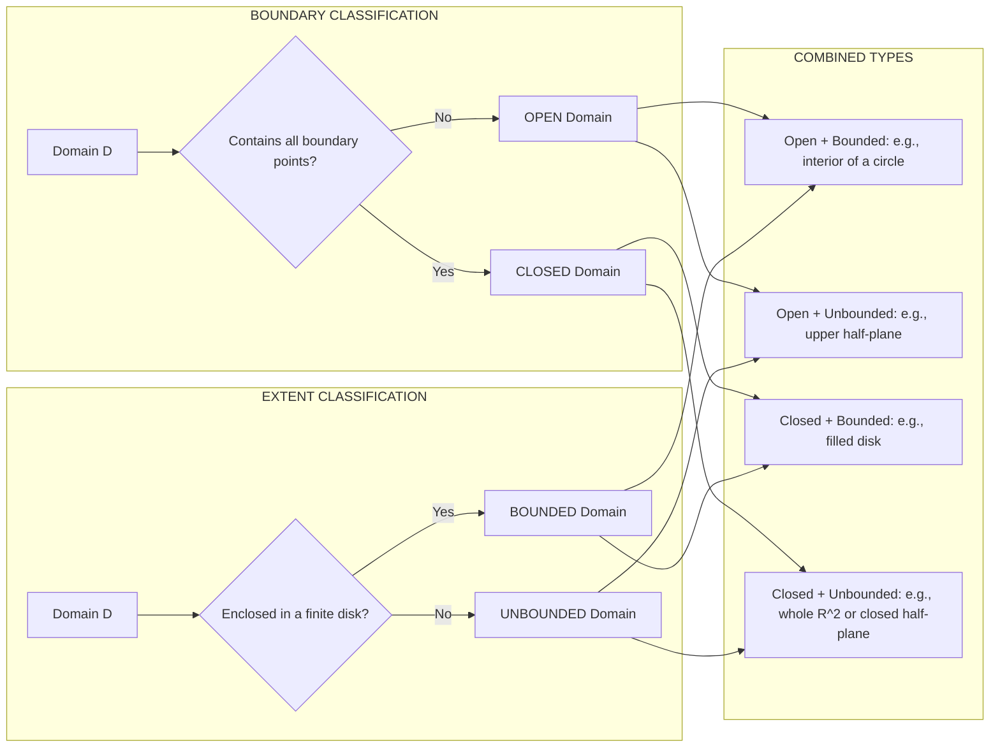
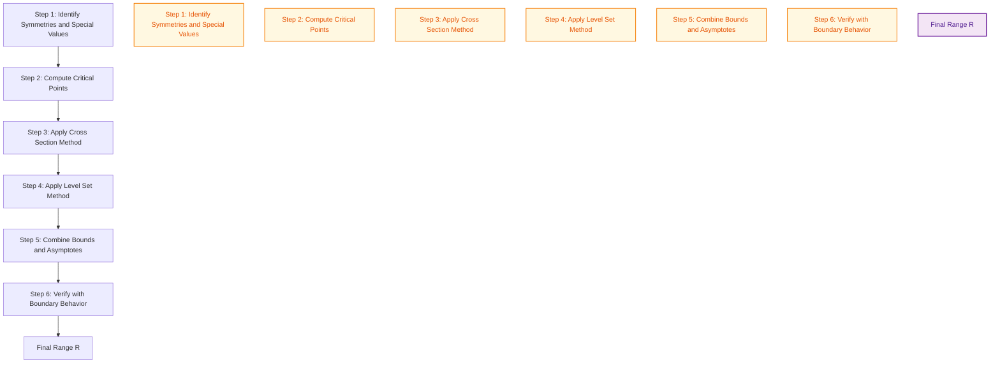
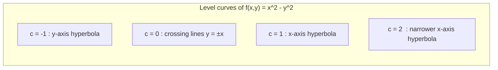

# Functions of Several Variables: Domains and Ranges

<!-- SECTION_1_START -->
# Functions of Several Variables: Domains and Ranges

## 1.1 Formal Academic Definition

A **function of several variables** is a mathematical mapping $f : D \subseteq \mathbb{R}^n \to \mathbb{R}$ that assigns to each ordered $n$-tuple $(x_1, x_2, \ldots, x_n) \in D$ a unique real number. For the case of two independent variables, we write:

$$f : D \subseteq \mathbb{R}^2 \to \mathbb{R}, \quad (x, y) \mapsto f(x, y) = z$$

The set $D$ is the **domain** of $f$, and the set of all output values

$$R = \{ z \in \mathbb{R} \mid z = f(x, y) \text{ for some } (x, y) \in D \}$$

is the **range** (or image) of $f$.

> [!IMPORTANT]
> **KTU 2024 Syllabus Highlight (GAMAT101 — Module 2):** A function of two variables $z = f(x, y)$ is treated as a **surface** in three-dimensional space $\mathbb{R}^3$. The domain $D$ is the projection of this surface onto the $xy$-plane.

## 1.2 Conceptual Analogy / Intuition

Imagine a **topographic map** of Kerala. Each point $(x, y)$ on the map represents a geographic location, and the height of the land at that point is $z = f(x, y)$ (the elevation above sea level).

- The **domain** $D$ is the entire region of the map (Kerala's boundary) — i.e., where you are *allowed* to stand.
- The **range** is the *set of all possible heights* you could measure across Kerala — from sea level ($z = 0$) up to the Anamudi peak ($z \approx 2695$ m).
- Different formulas for $f$ give different "shapes" of terrain:
  * $z = x^2 + y^2$ → a **bowl** (paraboloid) — only low or middle elevations exist; no negative heights.
  * $z = x^2 - y^2$ → a **saddle** (pass) — heights can be positive, negative, or zero.
  * $z = \sin(x)\cos(y)$ → a **wavy terrain** (gentle undulations) — bounded between $-1$ and $+1$.

**Key Constants & Symbols** (used throughout this module):

- $\mathbb{R}$ : the set of all real numbers
- $\mathbb{R}^2$ : the $xy$-plane
- $\mathbb{N}$ : the set of natural numbers
- $\partial D$ : the **boundary** of the domain
- $\text{int}(D)$ : the **interior** of the domain

> [!NOTE]
> **Geometric Reading Rule:** In the KTU 2024 scheme, you are expected to visualize $f(x, y) = z$ as a **surface in $\mathbb{R}^3$**. The **domain** lies in $\mathbb{R}^2$ (the $xy$-plane) and the **range** lies on the $z$-axis (the vertical axis).

## 1.3 Visualization with GeoGebra

> [!VISUALIZATION CONTROL]
> **Concept:** Paraboloid surface $z = x^2 + y^2$ with shaded domain
> **GeoGebra Input Equations:**
> * `f(x, y) = x^2 + y^2`
> * `Surface(f(x, y), x, -3, 3, y, -3, 3)`
> * `Circle((0,0), 2)`  *(to indicate a circular domain $x^2 + y^2 \le 4$)*
> **Visual Description:** The student should observe a bowl-shaped surface. The projection of the bowl's rim onto the $xy$-plane forms the circular domain $D = \{(x, y) : x^2 + y^2 \le 4\}$. The range is $0 \le z \le 4$.

## 1.4 Classification of Domains

A domain $D \subseteq \mathbb{R}^2$ is classified along two independent axes:

| Property | Type | Definition | Example |
|----------|------|------------|---------|
| **Boundary-wise** | **Open** | $D$ contains no boundary point: $D \cap \partial D = \emptyset$ | $D = \{(x, y) : x^2 + y^2 < 4\}$ |
| **Boundary-wise** | **Closed** | $D$ contains all its boundary points: $\partial D \subseteq D$ | $D = \{(x, y) : x^2 + y^2 \le 4\}$ |
| **Size-wise** | **Bounded** | $D$ is enclosed within some disk of finite radius | $D = \{(x, y) : x^2 + y^2 \le 4\}$ |
| **Size-wise** | **Unbounded** | $D$ extends to infinity in at least one direction | $D = \{(x, y) : x > 0\}$ |

> [!TIP]
> **Quick Memory Trick:** *"Open means you can walk in but the fence is not part of your land. Closed means the fence is yours."* A region can be **(open, bounded)**, **(open, unbounded)**, **(closed, bounded)** — but **NOT (closed, unbounded) and bounded simultaneously**. Closed + Unbounded *is* possible (e.g., the entire $xy$-plane is closed and unbounded).

<!-- SECTION_1_END -->

<!-- SECTION_2_START -->
# Deep Theoretical Analysis & KTU High-Yield Formula Sheet

## 2.1 Strategy for Finding the Domain of $f(x, y)$

The domain is the set of all $(x, y) \in \mathbb{R}^2$ where the **arithmetic expression** is well-defined (i.e., no division by zero, no negative inside an even root, no logarithm of a non-positive number, etc.). For each elementary operation, apply the corresponding **existence condition**:

| Sub-expression in $f(x,y)$ | Required Condition | Reason |
|----------------------------|---------------------|--------|
| $\dfrac{g(x,y)}{h(x,y)}$ | $h(x, y) \neq 0$ | Division by zero undefined |
| $\sqrt[k]{g(x, y)}$ with $k$ even | $g(x, y) \ge 0$ | Even roots of negatives are not real |
| $\ln(g(x, y))$ | $g(x, y) > 0$ | Logarithm defined only for positives |
| $\arctan(g(x, y))$ | none (always defined) | $\arctan : \mathbb{R} \to (-\pi/2, \pi/2)$ |
| $\arcsin(g(x, y))$ | $-1 \le g(x, y) \le 1$ | Inverse trig domain |
| $e^{g(x, y)}$ | none (always defined) | Exponential domain is all $\mathbb{R}$ |
| $\tan(g(x, y))$ | $g(x, y) \neq \dfrac{\pi}{2} + n\pi,\ n \in \mathbb{Z}$ | Tangent asymptotes |

The **final domain** is the **intersection** of all individual conditions.

## 2.2 Strategy for Finding the Range of $f(x, y)$

There is no single universal algorithm; KTU 2024 expects three standard techniques:

### Technique 1 — Direct Analysis (for simple functions)
- Identify the minimum and maximum of $f$ over its domain.
- E.g., for $f(x, y) = x^2 + y^2$, the minimum is $0$ (at the origin) and the function grows without bound, so the range is $[0, \infty)$.

### Technique 2 — Cross-Section Method (Slice and Trace)
- Fix $y = c$ to obtain $g_c(x) = f(x, c)$, find its range as a function of $x$.
- Repeat for arbitrary $c$, then take the union over all $c$.
- E.g., for $f(x, y) = x^2 + y^2$, fix $y = c$: $g_c(x) = x^2 + c^2 \ge c^2$. Union over all $c \in \mathbb{R}$ gives $[0, \infty)$.

### Technique 3 — Level Set Method (Inverse Problem)
- For a target value $z_0$, ask: does the equation $f(x, y) = z_0$ have at least one solution in $D$?
- If yes, $z_0$ is in the range. If no, it is not.
- The level set $f(x, y) = c$ is a **curve** in the $xy$-plane (for 2 variables) or a **surface** in $\mathbb{R}^3$ (for 3 variables).

## 2.3 KTU Formula Sheet / Cheat Sheet

| Function $f(x, y)$ | Domain $D$ | Range $R$ | Geometry in $\mathbb{R}^3$ |
|--------------------|------------|-----------|----------------------------|
| $x^2 + y^2$ | $\mathbb{R}^2$ | $[0, \infty)$ | Circular paraboloid (bowl) |
| $\sqrt{x^2 + y^2}$ | $\mathbb{R}^2$ | $[0, \infty)$ | Upper nappe of a cone |
| $x^2 - y^2$ | $\mathbb{R}^2$ | $\mathbb{R}$ (all reals) | Hyperbolic paraboloid (saddle) |
| $\sin(x) + \cos(y)$ | $\mathbb{R}^2$ | $[-2, 2]$ | Wavy undulating surface |
| $\dfrac{1}{x^2 + y^2}$ | $\mathbb{R}^2 \setminus \{(0,0)\}$ | $(0, \infty)$ | Surface with vertical spike at origin |
| $\ln(x + y)$ | $\{(x, y) : x + y > 0\}$ | $\mathbb{R}$ | Logarithmic "cliff" along line $x + y = 0$ |
| $\sqrt{9 - x^2 - y^2}$ | $\{(x, y) : x^2 + y^2 \le 9\}$ | $[0, 3]$ | Upper hemisphere of radius 3 |
| $\dfrac{1}{\sqrt{4 - x^2 - y^2}}$ | $\{(x, y) : x^2 + y^2 < 4\}$ | $[1/2, \infty)$ | Inverted dome with vertical asymptote |

> [!NOTE]
> **Engineering Utility:** Domain-range analysis of several variables is foundational for **machine learning loss surfaces**, **image processing filters** (2-D convolution kernels), **finite element meshes** in CAD, and **error analysis in sensor networks**. Identifying a *bounded closed domain* guarantees existence of maxima/minima (Extreme Value Theorem) — critical in optimization.

## 2.4 Level Curves and Level Surfaces

A **level curve** of $f(x, y)$ at height $c$ is the set

$$L_c = \{ (x, y) \in D : f(x, y) = c \}$$

These are the **contour lines** you see on a topographic map. In $\mathbb{R}^3$, each level curve corresponds to the **horizontal slice** $z = c$ intersecting the surface $z = f(x, y)$. KTU frequently asks to sketch level curves for $c = -2, -1, 0, 1, 2$.

For three variables $f(x, y, z)$, a **level surface** $f(x, y, z) = c$ is a 2-D surface in $\mathbb{R}^3$ (e.g., spheres, ellipsoids, planes, hyperboloids).

<!-- SECTION_2_END -->

<!-- SECTION_3_START -->
# Step-by-Step Derivations & Worked Examples

## 3.1 Example 1 — Domain of a Rational-Radical Function

**Problem.** Find the domain of $f(x, y) = \dfrac{\sqrt{x - y}}{x^2 - y^2}$.

**Step 1 — Identify sub-expressions and apply conditions:**

- Numerator contains $\sqrt{x - y}$ → requires $x - y \ge 0 \;\Rightarrow\; x \ge y$.
- Denominator $x^2 - y^2 = (x - y)(x + y)$ must not be zero.

**Step 2 — Combine conditions:**

The condition $x - y \ge 0$ must hold, AND $(x - y)(x + y) \neq 0$.

**Step 3 — Split into cases:**

- **Case A:** $x - y > 0$. Then $x + y \neq 0$ must also hold. So $D_A = \{ (x, y) : x > y \text{ and } x + y \neq 0 \}$.
- **Case B:** $x - y = 0$. The numerator is $0$, giving $f = 0 / 0$, which is **undefined**. So $x = y$ is **excluded**.

**Step 4 — Final answer (clean form):**

$$D = \{ (x, y) \in \mathbb{R}^2 : x > y \} \setminus \{ (x, y) : x + y = 0 \}$$

Equivalently, the open half-plane $x > y$ with the line $x + y = 0$ removed. The line $x = y$ is not even part of the half-plane, so the simplified domain is:

$$\boxed{D = \{ (x, y) : x > y,\ x + y \neq 0 \}}$$

## 3.2 Example 2 — Range of $f(x, y) = x^2 + y^2$

**Step 1 — Observe the lower bound:** $x^2 \ge 0$ and $y^2 \ge 0$, so $f(x, y) = x^2 + y^2 \ge 0$ with equality at $(0, 0)$.

**Step 2 — Show unboundedness:** For any $M > 0$, choose $(x, y) = (\sqrt{M}, 0)$. Then $f(\sqrt{M}, 0) = M$. So $f$ attains every non-negative real value.

**Step 3 — Conclusion:**

$$\boxed{R = [0, \infty)}$$

## 3.3 Example 3 — Domain of $f(x, y) = \dfrac{1}{\sqrt{4 - x^2 - y^2}} + \ln(x^2 + y^2 - 1)$

**Step 1 — Condition from the square root:** $4 - x^2 - y^2 > 0 \;\Rightarrow\; x^2 + y^2 < 4$ (strict because the denominator cannot be zero).

**Step 2 — Condition from the logarithm:** $x^2 + y^2 - 1 > 0 \;\Rightarrow\; x^2 + y^2 > 1$.

**Step 3 — Intersect both conditions:**

$$1 < x^2 + y^2 < 4$$

**Step 4 — Geometric description:** This is the **open annulus** (washer-shaped region) centered at the origin, with inner radius $1$ and outer radius $2$. Both bounding circles are **excluded**.

$$\boxed{D = \{ (x, y) : 1 < x^2 + y^2 < 4 \}}$$

## 3.4 Example 4 — Range via Level Set Analysis

**Problem.** Find the range of $f(x, y) = \dfrac{xy}{x^2 + y^2}$ for $(x, y) \neq (0, 0)$.

**Step 1 — Try a cross-section.** Set $y = tx$ with $t \in \mathbb{R}$ and $x \neq 0$:

$$f(x, tx) = \frac{x \cdot tx}{x^2 + t^2 x^2} = \frac{tx^2}{x^2(1 + t^2)} = \frac{t}{1 + t^2}$$

**Step 2 — Find the range of the single-variable function $g(t) = \dfrac{t}{1 + t^2}$:**

Compute the derivative:

$$g'(t) = \frac{(1 + t^2) - t(2t)}{(1 + t^2)^2} = \frac{1 - t^2}{(1 + t^2)^2}$$

Set $g'(t) = 0$ to find critical points: $1 - t^2 = 0 \;\Rightarrow\; t = \pm 1$.

Evaluate:
$$g(1) = \frac{1}{2}, \qquad g(-1) = -\frac{1}{2}$$

As $t \to \pm \infty$, $g(t) \to 0$. So the range of $g$ is $\left[-\dfrac{1}{2}, \dfrac{1}{2}\right]$.

**Step 3 — Conclusion:** Since every value in this interval is achieved, and conversely (by reversing the cross-section), the range of $f$ is the same:

$$\boxed{R = \left[-\frac{1}{2},\ \frac{1}{2}\right]}$$

> [!IMPORTANT]
> **Observation:** The value $0$ is *included* because at $(x, 0)$ with $x \neq 0$, we have $f(x, 0) = 0$. The endpoints $\pm 1/2$ are achieved at $(x, y) = (1, 1)$ and $(1, -1)$ respectively.

## 3.5 Example 5 — Python Implementation for Domain Visualization

For the computer-science track of GAMAT101, here is a fully operational Python script that visualizes the domain of $f(x, y) = \ln(x) \cdot \ln(y)$:

```python
import numpy as np
import matplotlib.pyplot as plt
from matplotlib.colors import LogNorm

# --- Configuration ---------------------------------------------------------
X_MIN, X_MAX = 0.01, 5.0   # x > 0 strictly
Y_MIN, Y_MAX = 0.01, 5.0   # y > 0 strictly
N = 600                    # grid resolution

# --- Build the meshgrid ----------------------------------------------------
x = np.linspace(X_MIN, X_MAX, N)
y = np.linspace(Y_MIN, Y_MAX, N)
X, Y = np.meshgrid(x, y)

# --- Compute f(x, y) safely ------------------------------------------------
# f(x, y) = ln(x) * ln(y);  valid only for x > 0 and y > 0
with np.errstate(divide="ignore", invalid="ignore"):
    Z = np.log(X) * np.log(Y)

# --- Filter NaN / Inf (shouldn't occur here since x, y > 0) ---------------
Z = np.where(np.isfinite(Z), Z, np.nan)

# --- Plot ------------------------------------------------------------------
fig, ax = plt.subplots(figsize=(7, 6))
mask = ~np.isnan(Z)
plot = ax.contourf(X, Y, Z, levels=20, cmap="viridis", norm=LogNorm())
ax.set_xlabel("x")
ax.set_ylabel("y")
ax.set_title("Domain of f(x, y) = ln(x) * ln(y) :  (0, inf) x (0, inf)")
ax.axhline(0, color="red", linewidth=1.2, label="y = 0  (excluded)")
ax.axvline(0, color="red", linewidth=1.2, label="x = 0  (excluded)")
ax.legend(loc="lower right")
fig.colorbar(plot, ax=ax, label="f(x, y)")
plt.tight_layout()
plt.show()
```

**Boundary-Check Logic Explained:**

- The strict inequalities $x > 0$ and $y > 0$ come from the logarithm's domain restriction.
- The lines $x = 0$ and $y = 0$ are **boundary lines** that must be drawn (red lines in the plot) but are **not part of the domain** — they are excluded because $\ln(0)$ is $-\infty$ (undefined).
- Hence the domain $D = (0, \infty) \times (0, \infty)$ is **open and unbounded**.

<!-- SECTION_3_END -->

<!-- SECTION_4_START -->
# Structural Diagrams & Schematics

## 4.1 Mermaid Flow — Algorithm for Finding the Domain

```mermaid
flowchart TD
    A[Start: Given f of x, y] --> B[Parse the Expression]
    B --> C{Contains Fraction?}
    C -- Yes --> C1[Set denominator ≠ 0]
    C -- No --> D{Contains Even Root?}
    C1 --> D
    D -- Yes --> D1[Set radicand ≥ 0]
    D -- No --> E{Contains Logarithm?}
    D1 --> E
    E -- Yes --> E1[Set argument > 0]
    E -- No --> F{Contains Inverse Trig?}
    E1 --> F
    F -- Yes --> F1[Apply arctan, arcsin, arccos domain rules]
    F -- No --> G[No restriction: all R^2]
    F1 --> H[Collect All Conditions]
    G --> H
    H --> I[Intersect All Conditions]
    I --> J[Describe Domain Geometrically]
    J --> K[End]

    stepA[Start: Given f of x, y]:::start
    stepK[End: Final Domain D]:::end
    classDef start fill:#e8f5e9,stroke:#2e7d32,stroke-width:2px,color:#1b5e20
    classDef end fill:#e3f2fd,stroke:#1565c0,stroke-width:2px,color:#0d47a1
```

## 4.2 Mermaid Block Diagram — Topological Classification of Domains



## 4.3 Sequential Processing Topology — Range Determination Pipeline



## 4.4 Matrix — Common Domains at a Glance

| Sub-expression in $f$ | Constraint Equation | Domain Boundary Type | Sample Region Shape |
|------------------------|---------------------|----------------------|---------------------|
| $x + y$ | All of $\mathbb{R}^2$ | None | Whole $xy$-plane |
| $x^2 + y^2 - 4$ | $x^2 + y^2 \ge 4$ | Closed (includes circle of radius 2) | Exterior of a disk |
| $\dfrac{1}{x^2 + y^2 - 1}$ | $x^2 + y^2 \neq 1$ | Open (excludes unit circle) | $\mathbb{R}^2$ minus a circle |
| $\sqrt{1 - x^2 - y^2}$ | $x^2 + y^2 \le 1$ | Closed (includes unit disk) | Unit disk |
| $\ln(x^2 + y^2)$ | $x^2 + y^2 > 0$ | Open (excludes origin) | $\mathbb{R}^2$ minus a point |
| $\arcsin(x^2 + y^2)$ | $0 \le x^2 + y^2 \le 1$ | Closed (includes boundary) | Closed unit disk |

<!-- SECTION_4_END -->

<!-- SECTION_5_START -->
# KTU 2024 Scheme Examination Question Bank & Topic Recap

## 5.1 Part A — Short Answer Questions (3 Marks Each)

### Question A1
**[KTU University Exam — July 2024]**
Define the *domain* and *range* of a function of two variables $z = f(x, y)$. Illustrate with the example $f(x, y) = \sqrt{1 - x^2 - y^2}$.

**Mapped CO:** CO1 | **RBT Level:** Remember

**Model Answer (3 Marks):**
The **domain** $D$ of $f$ is the set of all input pairs $(x, y) \in \mathbb{R}^2$ for which $f(x, y)$ is defined as a real number. The **range** $R$ is the set of all output values $\{z : z = f(x, y) \text{ for some } (x, y) \in D\}$.

For $f(x, y) = \sqrt{1 - x^2 - y^2}$:
- **Domain:** $1 - x^2 - y^2 \ge 0 \;\Rightarrow\; D = \{(x, y) : x^2 + y^2 \le 1\}$ — the closed unit disk.
- **Range:** The expression under the root is at most $1$ (at the origin) and at least $0$ (on the boundary circle). So $R = [0, 1]$.

Geometrically, this is the **upper hemisphere** of radius 1, with $z \ge 0$. **[1 Mark for definition, 1 Mark for domain, 1 Mark for range.]**

---

### Question A2
**[KTU University Exam — Dec 2023]**
State three conditions that commonly restrict the domain of a real-valued function $f(x, y)$, with one example each.

**Mapped CO:** CO1 | **RBT Level:** Understand

**Model Answer (3 Marks):**
1. **Denominator restriction:** $h(x, y) \neq 0$. Example: $f(x, y) = \dfrac{1}{x - y}$ requires $x \neq y$.
2. **Even-root restriction:** $g(x, y) \ge 0$. Example: $f(x, y) = \sqrt{x + y}$ requires $x + y \ge 0$.
3. **Logarithm restriction:** $g(x, y) > 0$. Example: $f(x, y) = \ln(x^2 + y^2 - 1)$ requires $x^2 + y^2 > 1$.

**[1 Mark for each correctly stated condition with example.]**

---

## 5.2 Part B — 14-Mark Questions (Module Internal Choice)

### Question B1 — Option (A)

**[KTU University Exam — July 2024 | CO1, CO2 | RBT: Apply, Analyze]**

**(a)** Find the domain of the function $f(x, y) = \dfrac{\sqrt{4 - x^2 - y^2}}{\ln(x^2 + y^2)}$ and describe it geometrically. **[7 Marks]**

**(b)** Determine the range of $g(x, y) = x^2 + 4y^2 - 2x + 8y + 1$ over its entire domain. **[7 Marks]**

---

**Solution to B1(a):**

**Step 1 — Condition from the square root (numerator):**
$$4 - x^2 - y^2 \ge 0 \quad \Rightarrow \quad x^2 + y^2 \le 4$$

**Step 2 — Condition from the logarithm (denominator):**
$$\ln(x^2 + y^2) \neq 0 \quad \Rightarrow \quad x^2 + y^2 \neq 1$$
Also, logarithm requires $x^2 + y^2 > 0$, so we exclude the origin.

**Step 3 — Combine conditions:**
$$(x^2 + y^2 \le 4) \;\cap\; (x^2 + y^2 \neq 1) \;\cap\; (x, y) \neq (0, 0)$$

**Step 4 — Final domain:**
$$\boxed{D = \{ (x, y) : 0 < x^2 + y^2 \le 4,\ x^2 + y^2 \neq 1 \}}$$

This is the **closed disk of radius 2**, with the **unit circle removed** and the **origin removed**. **[Stating conditions: 3 Marks | Intersection: 2 Marks | Geometric description: 2 Marks]**

---

**Solution to B1(b):**

**Step 1 — Complete the square:**
$$g(x, y) = (x^2 - 2x) + (4y^2 + 8y) + 1 = (x - 1)^2 - 1 + 4(y + 1)^2 - 4 + 1$$

$$g(x, y) = (x - 1)^2 + 4(y + 1)^2 - 4$$

**Step 2 — Find the minimum:**
Both squared terms are $\ge 0$, so
$$g(x, y) \ge -4$$
with equality when $x = 1$ and $y = -1$. The minimum value is $g(1, -1) = -4$.

**Step 3 — Check unboundedness:**
As $\|(x, y)\| \to \infty$, $g(x, y) \to \infty$. So no upper bound exists.

**Step 4 — Final range:**
$$\boxed{R = [-4, \infty)}$$

**[Completing the square: 3 Marks | Identifying minimum: 2 Marks | Asymptotic check: 1 Mark | Final answer: 1 Mark]**

---

### Question B1 — Option (B) [Alternative Choice]

**[KTU University Exam — Dec 2023 | CO1, CO2 | RBT: Apply, Analyze]**

**(a)** Determine the domain of $f(x, y) = \arcsin\!\left(\dfrac{x}{x^2 + y^2}\right)$. **[7 Marks]**

**(b)** Sketch the level curves of $f(x, y) = x^2 - y^2$ for $c = -1, 0, 1, 2$ and identify the range. **[7 Marks]**

---

**Solution to B1(B)(a):**

**Step 1 — Apply the $\arcsin$ domain rule:** For $\arcsin(u)$ to be defined, we need $-1 \le u \le 1$.

$$\boxed{-1 \le \dfrac{x}{x^2 + y^2} \le 1}$$

**Step 2 — Avoid $x^2 + y^2 = 0$** (i.e., $(x, y) \neq (0, 0)$), since the denominator vanishes.

**Step 3 — Analyze the right inequality $\dfrac{x}{x^2 + y^2} \le 1$:**

- If $x > 0$: multiply both sides by $x^2 + y^2 > 0$: $x \le x^2 + y^2 \;\Rightarrow\; 0 \le x^2 - x + y^2 \;\Rightarrow\; (x - \tfrac{1}{2})^2 + y^2 \ge \tfrac{1}{4}$.
- If $x < 0$: the inequality $\dfrac{x}{x^2 + y^2} \le 1$ is automatically true (negative $\le$ positive).
- If $x = 0$: $0 \le 1$ ✓.

**Step 4 — Analyze the left inequality $-1 \le \dfrac{x}{x^2 + y^2}$:**

- If $x < 0$: $-x \le x^2 + y^2 \;\Rightarrow\; (x + \tfrac{1}{2})^2 + y^2 \ge \tfrac{1}{4}$.
- If $x > 0$: automatically true.
- If $x = 0$: $-1 \le 0$ ✓.

**Step 5 — Combine:** The domain is
$$D = \left(\mathbb{R}^2 \setminus \{(0, 0)\}\right) \setminus \Big[\{x > 0\} \cap \{(x - \tfrac{1}{2})^2 + y^2 < \tfrac{1}{4}\}\Big] \setminus \Big[\{x < 0\} \cap \{(x + \tfrac{1}{2})^2 + y^2 < \tfrac{1}{4}\}\Big]$$

i.e., the plane minus the origin and minus two small open half-disks around $(\tfrac{1}{2}, 0)$ and $(-\tfrac{1}{2}, 0)$. **[Setting up the inequality: 2 Marks | Case analysis: 3 Marks | Geometric description: 2 Marks]**

---

**Solution to B1(B)(b):**

**Step 1 — Level curves:** Setting $x^2 - y^2 = c$ gives the rectangular hyperbola family.

| $c$ | Equation | Curve |
|-----|----------|-------|
| $-1$ | $x^2 - y^2 = -1$ | Hyperbola opening vertically (along $y$-axis) |
| $0$  | $x^2 - y^2 = 0$ | Two lines $y = x$ and $y = -x$ |
| $1$  | $x^2 - y^2 = 1$ | Hyperbola opening horizontally (along $x$-axis) |
| $2$  | $x^2 - y^2 = 2$ | Hyperbola opening horizontally, narrower |

**Step 2 — Sketch (using Mermaid-style block representation):**



**Step 3 — Range:** For every $c \in \mathbb{R}$, the equation $x^2 - y^2 = c$ has a real solution (e.g., for $c > 0$, take $(x, y) = (\sqrt{c}, 0)$; for $c < 0$, take $(x, y) = (0, \sqrt{-c})$). Therefore,

$$\boxed{R = \mathbb{R}}$$

**[Identifying equation form: 2 Marks | Curve table: 3 Marks | Range argument: 2 Marks]**

---

> [!WARNING]
> **KTU Examiner's Valuation Warning — Common Pitfalls:**
> 1. **Forgetting the strict inequality** in $x^2 + y^2 > 0$ for $\ln$ (origin must be excluded explicitly). *[-1 Mark]*
> 2. **Confusing closed vs. open boundaries**: $\sqrt{}$ allows $\ge$, but $\ln$ requires $>$. Read the operator, not the variable! *[-1 Mark]*
> 3. **Range of constant functions**: A function like $f(x, y) = 5$ has domain $\mathbb{R}^2$ and range $\{5\}$ — a *singleton set*, not an interval. *[-0.5 Marks]*
> 4. **Bounded but not closed**: A domain can be bounded *and* open (e.g., the open unit disk). KTU students often wrongly assume bounded $\Rightarrow$ closed. *[-0.5 Marks]*
> 5. **Missing the intersection step**: When $f$ has two restrictions, students write only one. The domain is the **intersection** of all constraints, not the union. *[-2 Marks]*

---

## 5.3 Topic Recap & Important Things to Remember

- **Definition of $f$ of several variables:** A rule $f : D \subseteq \mathbb{R}^n \to \mathbb{R}$ that assigns a unique real number to each $n$-tuple in $D$.
- **Domain $D$:** Set of *input* points where the formula is *arithmetically legal* (no $0$ in denominator, no negative under even root, no non-positive in $\ln$, etc.).
- **Range $R$:** Set of *output* values $z$ that the function actually attains over $D$.
- **Standard domain restrictions** (must be memorized):
  * Division by zero is forbidden.
  * $\sqrt[k]{\cdot}$ with $k$ even requires a non-negative radicand.
  * $\ln$ and $\log$ require strictly positive arguments.
  * $\arcsin, \arccos$ require arguments in $[-1, 1]$.
  * $\tan, \sec, \cot, \csc$ have periodic vertical asymptotes.
- **Domain classification — 2 axes:**
  * **Boundary:** Open ($\partial D \cap D = \emptyset$) vs. Closed ($\partial D \subseteq D$).
  * **Extent:** Bounded (contained in a finite disk) vs. Unbounded.
- **Geometric interpretation:**
  * $z = f(x, y)$ is a **surface** in $\mathbb{R}^3$.
  * Domain $D$ is the **shadow** (projection) of this surface onto the $xy$-plane.
  * Range $R$ is the **set of heights** reached by the surface.
- **Range-finding methods:**
  1. Direct minimum/maximum analysis.
  2. Cross-section method (fix one variable).
  3. Level set / inverse problem method.
- **Common domain shapes (interview-ready):**
  * Whole plane $\mathbb{R}^2$.
  * Open/closed half-planes (e.g., $x + y > 0$).
  * Open/closed disks (e.g., $x^2 + y^2 < 4$).
  * Open/closed annuli (e.g., $1 < x^2 + y^2 < 4$).
  * Plane minus a point or minus a curve.
- **Engineering relevance:** Optimization over bounded closed domains (Extreme Value Theorem), contour analysis in computer vision and GIS, mesh generation in finite element analysis, and gradient-based learning in machine learning.
- **Valuation tip:** Always *state the condition*, then *write the corresponding inequality*, and finally *describe the region geometrically* — examiners reward explicit reasoning at every step.

<!-- SECTION_5_END -->
