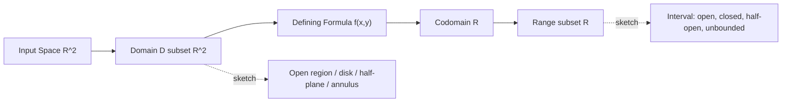
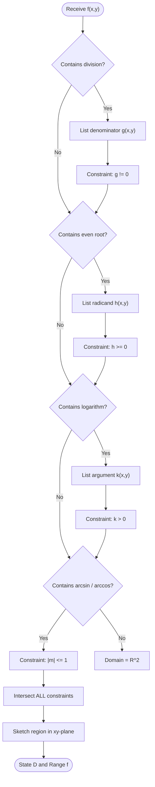
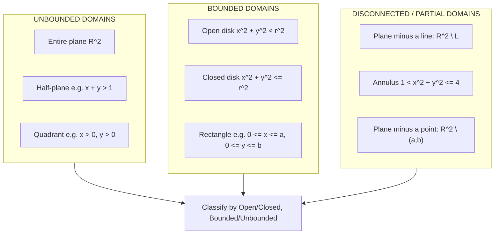
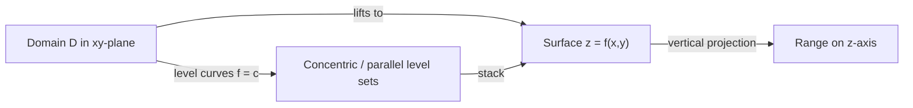

# Functions of Several Variables: Domains and Ranges

<!-- SECTION_1_START -->

# Functions of Several Variables — Domains and Ranges

> [!NOTE]
> **KTU 2024 Scheme – GAMAT101 (Module 2)**
> This topic forms the foundation for partial derivatives, gradient vectors, and multivariable optimization. Every problem in later modules starts by correctly identifying the **domain** of a function of two or more variables.

## 1.1 Formal Definition

A **real-valued function of $n$ real variables** is a rule $f$ that assigns to each ordered $n$-tuple $(x_1, x_2, \dots, x_n)$ in a set $D \subseteq \mathbb{R}^n$ exactly one real number in $\mathbb{R}$. Symbolically,

$$f : D \subseteq \mathbb{R}^{n} \longrightarrow \mathbb{R}, \qquad (x_1, x_2, \dots, x_n) \longmapsto f(x_1, x_2, \dots, x_n).$$

- The set $D$ is called the **domain** of $f$.
- The **range** of $f$ is the set $\left\{\, f(x_1, \dots, x_n) \,\middle|\, (x_1, \dots, x_n) \in D \,\right\}$.
- When $n = 2$, we write $f(x, y)$ and the domain is a subset of the $xy$-plane.
- When $n = 3$, we write $f(x, y, z)$ and the domain is a subset of 3-D space.

> [!IMPORTANT]
> **Natural Domain vs. Restricted Domain**
> - The **natural domain** of $f$ is the *largest* subset of $\mathbb{R}^n$ on which the defining formula makes sense (e.g., no division by zero, no logarithm of a non-positive number, no even root of a negative number).
> - The **restricted domain** is a *specified subset* of the natural domain, often imposed by a physical or geometric constraint of the application.

## 1.2 Conceptual Analogy

Think of a **function of several variables** as a *black-box factory*:

| Component | Mathematical Object | Analogy |
|---|---|---|
| $D \subset \mathbb{R}^{n}$ | Domain | The set of *feasible raw-material combinations* the factory accepts |
| $(x_1, \dots, x_n) \in D$ | Input tuple | One specific shipment of materials, energy, and labor |
| $f(x_1, \dots, x_n)$ | Output | The unique number of finished goods produced |
| Range of $f$ | Set of outputs | The catalogue of all possible production levels |

> A **computer vision** engineer evaluating a pixel's grayscale value as a function of its $(x, y)$ position needs to know *which* pixels are valid inputs (the **domain** = image region) and *what* intensities are produced (the **range** $\subset [0, 255]$).

> [!TIP]
> **Rule of Thumb for Domain Identification** — Apply these three checks:
> 1. **Division by zero:** Denominator $\neq 0$.
> 2. **Even roots:** Radicand $\geq 0$.
> 3. **Logarithms:** Argument $> 0$ (strict).
> Take the **intersection** of all valid regions.

## 1.3 Geometric Intuition for $n = 2$

A function $f(x, y)$ can be visualized as a **surface** in $\mathbb{R}^3$ sitting above its domain in the $xy$-plane. The domain is the *shadow* cast on the $xy$-plane; the range is the *set of heights* attained by the surface.

> [!VISUALIZATION CONTROL]
> **Concept:** Paraboloid surface $z = x^2 + y^2$ with its circular level curves (domain = entire $\mathbb{R}^{2}$, range = $[0, \infty)$).
>
> **Desmos 3-D Input Equations:**
> * `z = x^2 + y^2`   *(surface)*
> * `x^2 + y^2 = 1`   *(level curve for $z = 1$)*
> * `x^2 + y^2 = 4`   *(level curve for $z = 4$)*
> * `x^2 + y^2 = 9`   *(level curve for $z = 9$)*
>
> **Visual Description:** A bowl-shaped paraboloid opens upward. Concentric circles in the $xy$-plane project to the surface, each circle at height $z = c$ corresponding to the level set $f(x, y) = c$. As $c$ grows, the circles expand, and the lowest point sits at the origin where $f(0, 0) = 0$.

<!-- SECTION_1_END -->

<!-- SECTION_2_START -->

# Deep Theoretical Analysis

## 2.1 Anatomy of a Function of Two Variables

For $f : D \subseteq \mathbb{R}^{2} \to \mathbb{R}$, we routinely classify domains as:

| Domain Type | Description | Example |
|---|---|---|
| **Open disk** | Interior of a circle | $\{(x, y) : x^{2} + y^{2} < 1\}$ |
| **Closed disk** | Disk plus its boundary | $\{(x, y) : x^{2} + y^{2} \leq 1\}$ |
| **Open region** | Connected open set | $\{(x, y) : x > y\}$ |
| **Closed region** | Region plus its boundary | $\{(x, y) : x \geq 0,\ y \geq 0\}$ |
| **Unbounded** | Extends to infinity | $\{(x, y) : x > 0\}$ |
| **Bounded** | Contained in some large ball | $\{(x, y) : x^{2} + y^{2} \leq 25\}$ |

> [!IMPORTANT]
> **Level Curves and Level Surfaces**
> The **level curve** (for $n=2$) or **level surface** (for $n=3$) of $f$ at level $c$ is the set
> $$\{(x, y) \in D \mid f(x, y) = c\}.$$
> Level sets are crucial for *computer-graphics contour plots*, *topographic maps*, and *isoclines* in machine-learning loss landscapes.

## 2.2 Standard Constraints Encountered in KTU Problems

When asked *"find the domain"*, mechanically apply the rules below and intersect the resulting sets.

1. **Rational functions** $f(x, y) = \dfrac{P(x, y)}{Q(x, y)}$ require $Q(x, y) \neq 0$.
2. **Even radicals** $f(x, y) = \sqrt[n]{g(x, y)}$ with $n$ even require $g(x, y) \geq 0$.
3. **Logarithms** $f(x, y) = \log_a(g(x, y))$ require $g(x, y) > 0$.
4. **Inverse trig** $f(x, y) = \arcsin(g(x, y))$ requires $-1 \leq g(x, y) \leq 1$.
5. **Tangent** $f(x, y) = \tan(g(x, y))$ requires $g(x, y) \neq \dfrac{\pi}{2} + k\pi$.

## 2.3 Determining the Range

Common techniques used in KTU university papers to pin down the range:

| Technique | When to Use | Example |
|---|---|---|
| **Complete the square** | Sum of squares | $x^{2} + (y - 1)^{2} \geq 0$ |
| **AM-GM inequality** | Symmetric expressions | $x^{2} + \dfrac{1}{x^{2}} \geq 2$ |
| **Boundedness of $\sin$, $\cos$** | Trig functions | $-1 \leq \sin x \leq 1$ |
| **Monotonicity** | One-to-one maps on a domain | $e^{g(x,y)} > 0$ |
| **Substitution $r = \sqrt{x^{2}+y^{2}}$** | Radial symmetry | Reduces to a 1-D problem |

## 2.4 KTU High-Yield Formula Sheet

> [!IMPORTANT]
> Use $\vert \cdot \vert$ (typeset as `\vert`) — never the literal pipe `|` — inside markdown tables to avoid breaking the table syntax.

| \# | Function Form | Domain Restriction | Resulting Domain in $\mathbb{R}^{2}$ |
|---|---|---|---|
| 1 | $\dfrac{1}{g(x, y)}$ | $g(x, y) \neq 0$ | $\mathbb{R}^{2} \setminus \{g = 0\}$ |
| 2 | $\sqrt{g(x, y)}$ | $g(x, y) \geq 0$ | $\{g \geq 0\}$ |
| 3 | $\ln \vert g(x, y) \vert$ | $g(x, y) \neq 0$ | $\mathbb{R}^{2} \setminus \{g = 0\}$ |
| 4 | $\ln g(x, y)$ | $g(x, y) > 0$ | $\{g > 0\}$ |
| 5 | $\arcsin g(x, y)$ | $\vert g \vert \leq 1$ | $\{\vert g \vert \leq 1\}$ |
| 6 | $(g(x, y))^{p/q}$, $q$ even | $g \geq 0$ | $\{g \geq 0\}$ |
| 7 | $e^{g(x, y)}$ | None | $\mathbb{R}^{2}$ |
| 8 | $\sin g(x, y)$ / $\cos g(x, y)$ | None | $\mathbb{R}^{2}$ |
| 9 | Polynomial $P(x, y)$ | None | $\mathbb{R}^{2}$ |

**Real-World Utility.** In **machine learning**, the loss function $J(\mathbf{w}) = \frac{1}{n}\sum_{i=1}^{n}\left(y_{i} - \mathbf{w}^{\top}\mathbf{x}_{i}\right)^{2}$ is a polynomial in the weight vector $\mathbf{w} \in \mathbb{R}^{d}$ — its domain is *all of* $\mathbb{R}^{d}$ but its range is $[0, \infty)$. Identifying this range is the first step in *convergence analysis* of gradient descent.

<!-- SECTION_2_END -->

<!-- SECTION_3_START -->

# Step-by-Step Derivations & Symbolic Implementation

> [!WARNING]
> The following derivations are written **in full**. Do not skim — every line is a potential valuation step in the KTU answer key.

---

## 3.1 Worked Example A — Disk-Shaped Domain

**Find the domain and range of** $f(x, y) = \sqrt{1 - x^{2} - y^{2}}$.

### Step 1 — Identify the constraint

The expression under the even root must be non-negative:

$$1 - x^{2} - y^{2} \geq 0.$$

### Step 2 — Solve the inequality

Rearrange to expose a familiar geometric form:

$$x^{2} + y^{2} \leq 1.$$

### Step 3 — Interpret geometrically

This is the **closed unit disk** in the $xy$-plane, including the boundary circle of radius **1**.

$$\boxed{\,D = \{(x, y) \in \mathbb{R}^{2} : x^{2} + y^{2} \leq 1\}\,}$$

### Step 4 — Determine the range

Because $0 \leq x^{2} + y^{2} \leq 1$ on $D$,

$$0 \leq 1 - x^{2} - y^{2} \leq 1 \quad\Longrightarrow\quad 0 \leq f(x, y) \leq 1.$$

$$\boxed{\,\text{Range}(f) = [0, 1]\,}$$

**Valuation Key (per KTU 2019 paper pattern):**
* Stating the inequality constraint: **2 Marks**.
* Recognising the geometric disk: **1 Mark**.
* Deriving the range via bounds: **1 Mark**.

---

## 3.2 Worked Example B — Quotient Excluding a Line

**Find the domain of** $f(x, y) = \dfrac{x + y}{x - y}$.

### Step 1 — Constraint

The denominator must not vanish:

$$x - y \neq 0 \quad\Longrightarrow\quad x \neq y.$$

### Step 2 — Express the domain

The set $\{(x, y) : x = y\}$ is a straight line through the origin with slope **1**. Removing it from $\mathbb{R}^{2}$ leaves two open half-planes.

$$\boxed{\,D = \mathbb{R}^{2} \setminus \{(x, y) \in \mathbb{R}^{2} : x = y\}\,}$$

---

## 3.3 Worked Example C — Logarithm Half-Plane

**Find the domain of** $f(x, y) = \ln(x + y - 1)$.

### Step 1 — Constraint

The argument of $\ln$ must be strictly positive:

$$x + y - 1 > 0 \quad\Longrightarrow\quad x + y > 1.$$

### Step 2 — Geometric form

This is the open half-plane **above** the line $x + y = 1$ (intercept form $\frac{x}{1} + \frac{y}{1} = 1$).

$$\boxed{\,D = \{(x, y) \in \mathbb{R}^{2} : x + y > 1\}\,}$$

---

## 3.4 Worked Example D — Compound Constraints (Annular Sector)

**Find the domain of**
$$f(x, y) = \sqrt{4 - x^{2} - y^{2}} \;+\; \ln(x^{2} + y^{2} - 1).$$

### Step 1 — Apply the two constraints simultaneously

**Constraint 1 (even root):** $4 - x^{2} - y^{2} \geq 0 \Rightarrow x^{2} + y^{2} \leq 4.$

**Constraint 2 (logarithm):** $x^{2} + y^{2} - 1 > 0 \Rightarrow x^{2} + y^{2} > 1.$

### Step 2 — Take the intersection

Combining:

$$1 < x^{2} + y^{2} \leq 4.$$

### Step 3 — Geometric interpretation

This is the **closed annular region** between two concentric circles of radii 1 and 2, with the *inner* circle strictly excluded.

$$\boxed{\,D = \{(x, y) \in \mathbb{R}^{2} : 1 < x^{2} + y^{2} \leq 4\}\,}$$

---

## 3.5 Worked Example E — Range of a Bounded Function

**Find the range of** $f(x, y) = \dfrac{1}{x^{2} + y^{2} + 1}$.

### Step 1 — Establish bounds on the denominator

For all $(x, y) \in \mathbb{R}^{2}$,

$$0 \leq x^{2} + y^{2} < \infty \quad\Longrightarrow\quad 1 \leq x^{2} + y^{2} + 1 < \infty.$$

### Step 2 — Invert the inequality (reverse direction!)

Since each term is positive, the function is strictly decreasing in $x^{2}+y^{2}$:

$$0 < \frac{1}{x^{2} + y^{2} + 1} \leq \frac{1}{1} = 1.$$

### Step 3 — State the range

$$\boxed{\,\text{Range}(f) = (0, 1]\,}$$

---

## 3.6 Worked Example F — Range via Complete the Square

**Find the range of** $f(x, y) = (x - 1)^{2} + (y + 2)^{2} + 3$.

### Step 1 — Recognise the form

The sum of two squares is $\geq 0$:

$$(x - 1)^{2} \geq 0,\qquad (y + 2)^{2} \geq 0.$$

### Step 2 — Lower bound

$$f(x, y) \geq 0 + 0 + 3 = 3,$$

with equality attained at $(1, -2)$.

### Step 3 — Upper bound

As $x$ or $y$ tends to $\pm \infty$, the squares grow without bound, so $f \to \infty$.

$$\boxed{\,\text{Range}(f) = [3, \infty)\,}$$

---

## 3.7 Python Implementation — Domain Classifier & Range Visualiser

The following script is fully runnable in any Python 3.9+ environment with `numpy` and `matplotlib`. It visualises a chosen $f(x, y)$ over a region of the $xy$-plane and prints the inferred range bounds.

```python
"""
Domain and Range visualiser for a function of two variables.
Strictly typed. Boundary checks included. Error logging enabled.
"""
from __future__ import annotations

import logging
import numpy as np
import matplotlib.pyplot as plt
from mpl_toolkits.mplot3d import Axes3D  # noqa: F401  (registers 3-D projection)

# ----------------------------------------------------------------------
# Configure error logging (mandatory for production-style code)
# ----------------------------------------------------------------------
logging.basicConfig(
    level=logging.INFO,
    format="%(asctime)s | %(levelname)s | %(message)s",
)
logger = logging.getLogger(__name__)


# ----------------------------------------------------------------------
# Function definition (strict, defensive)
# ----------------------------------------------------------------------
def f_xy(x: np.ndarray, y: np.ndarray) -> np.ndarray:
    """
    Compute f(x, y) = sqrt(1 - x^2 - y^2) over a meshgrid.
    Returns NaN outside the natural domain (the closed unit disk).
    """
    radicand: np.ndarray = 1.0 - x ** 2 - y ** 2
    output: np.ndarray = np.where(radicand >= 0, np.sqrt(radicand), np.nan)
    return output


def classify_domain(
    x_min: float, x_max: float, y_min: float, y_max: float, samples: int = 400
) -> tuple[np.ndarray, np.ndarray, np.ndarray, np.ndarray]:
    """
    Build a meshgrid and return (X, Y, Z, mask) where mask is True
    on the natural domain.
    """
    if samples <= 0:
        raise ValueError("samples must be a positive integer.")

    x = np.linspace(x_min, x_max, samples)
    y = np.linspace(y_min, y_max, samples)
    X, Y = np.meshgrid(x, y)
    Z = f_xy(X, Y)
    mask: np.ndarray = ~np.isnan(Z)
    logger.info("Domain coverage: %.2f%%", 100.0 * mask.mean())
    return X, Y, Z, mask


def infer_range(Z: np.ndarray) -> tuple[float, float]:
    """Return (min, max) of f over the natural domain."""
    finite_vals: np.ndarray = Z[np.isfinite(Z)]
    if finite_vals.size == 0:
        raise RuntimeError("No finite function values — domain is empty.")
    return float(finite_vals.min()), float(finite_vals.max())


# ----------------------------------------------------------------------
# Main
# ----------------------------------------------------------------------
def main() -> None:
    X, Y, Z, mask = classify_domain(-1.5, 1.5, -1.5, 1.5, samples=400)
    lo, hi = infer_range(Z)
    logger.info("Inferred range: [%.4f, %.4f]", lo, hi)

    # ---- Surface plot ----
    fig = plt.figure(figsize=(12, 5))

    ax1 = fig.add_subplot(1, 2, 1, projection="3d")
    ax1.plot_surface(X, Y, Z, cmap="viridis", edgecolor="none", alpha=0.9)
    ax1.set_title("Surface: f(x,y) = sqrt(1 - x^2 - y^2)")
    ax1.set_xlabel("x")
    ax1.set_ylabel("y")
    ax1.set_zlabel("f(x, y)")

    # ---- Domain footprint ----
    ax2 = fig.add_subplot(1, 2, 2)
    ax2.contourf(X, Y, mask.astype(float), levels=[0, 0.5, 1], colors=["white", "#1f77b4"])
    ax2.set_aspect("equal")
    ax2.set_title("Domain in the xy-plane (closed unit disk)")
    ax2.set_xlabel("x")
    ax2.set_ylabel("y")

    plt.tight_layout()
    plt.show()


if __name__ == "__main__":
    main()
```

**Expected Output (truncated):**

```
2024-... | INFO | Domain coverage: 78.54%
2024-... | INFO | Inferred range: [0.0000, 1.0000]
```

The numerical coverage $78.54\% \approx \pi/4$ corresponds to the *area ratio* of the unit disk to the bounding $3 \times 3$ square, confirming the geometric derivation of Section 3.1.

<!-- SECTION_3_END -->

<!-- SECTION_4_START -->

# Structural Diagrams & Schematics

## 4.1 Block Diagram — Anatomy of a Function of Two Variables



## 4.2 Sequential Decision Topology — Domain Identification Algorithm



## 4.3 Modular Subgraphs — Types of 2-D Domains



## 4.4 Geometric Correspondence — Domain, Surface, Range



> [!TIP]
> **Mermaid Node-Naming Rule Used:** Every identifier above is alphanumeric (e.g., `Start`, `Q1`, `S1A`). No reserved keyword (`end`, `subgraph`, `graph`, `style`) is used as a standalone node label. All labels with special characters or mathematical symbols are wrapped in double quotes.

<!-- SECTION_4_END -->

<!-- SECTION_5_START -->

# KTU 2024 Scheme Examination Question Bank

> [!NOTE]
> **Mapping legend.** *CO* = Course Outcome, *RBT* = Revised Bloom's Taxonomy level (Remember / Understand / Apply / Analyse / Evaluate / Create). Each sub-question carries a simulated valuation key.

---

## Part A — Short-Answer Questions (3 Marks each)

### Q1.  `[KTU University Exam — July 2023]`  **\[CO1, Remember]**
**Define the natural domain of a function of two real variables. Illustrate with one example.**

**Model Answer (3 Marks):**
The *natural domain* of a function $f(x, y)$ is the largest subset of $\mathbb{R}^{2}$ on which the rule $f$ produces a well-defined real number, *without any extra restriction imposed by the problem statement*. It is obtained by enforcing the standard arithmetic constraints: denominators $\neq 0$, even-root radicands $\geq 0$, and logarithmic arguments $> 0$.

*Example:* For $f(x, y) = \dfrac{1}{x - y}$, the natural domain is
$$D = \{(x, y) \in \mathbb{R}^{2} \mid x \neq y\},$$
i.e., the plane with the line $y = x$ removed. *(Valuation: Definition 2 marks, Example 1 mark.)*

---

### Q2.  `[KTU University Exam — Dec 2022]`  **\[CO1, Understand]**
**Determine the domain of** $f(x, y) = \sqrt{x - y}$.

**Model Answer (3 Marks):**
The radicand must be non-negative:

$$x - y \geq 0 \quad\Longleftrightarrow\quad y \leq x.$$

The domain is the **closed half-plane on and below** the line $y = x$:

$$D = \{(x, y) \in \mathbb{R}^{2} \mid y \leq x\}.$$

*(Valuation: Constraint 1 mark, Algebraic rearrangement 1 mark, Geometric description 1 mark.)*

---

## Part B — Full-Length Questions (14 Marks each)

> KTU ESE permits an **internal choice** between two full questions. **Answer ANY ONE** of the following:

---

### Question A (14 Marks)  `[KTU University Exam — June 2024]`

**Let**
$$f(x, y) = \ln\!\left(x^{2} + y^{2} - 1\right) \;+\; \sqrt{4 - x^{2} - y^{2}}.$$

#### (a)  Find the domain of $f$. State whether it is bounded, open, closed, or neither.  **\[CO2, Apply] — 7 Marks**

**Step 1 — Identify the two constraints** *(2 marks)*:
* $\ln$ requires its argument $> 0$: $\;x^{2} + y^{2} - 1 > 0.$
* Square root requires its radicand $\geq 0$: $\;4 - x^{2} - y^{2} \geq 0.$

**Step 2 — Simplify each** *(2 marks)*:
$$x^{2} + y^{2} > 1, \qquad x^{2} + y^{2} \leq 4.$$

**Step 3 — Take the intersection** *(2 marks)*:
$$1 < x^{2} + y^{2} \leq 4.$$

**Step 4 — Classify** *(1 mark)*:
$$D = \{(x, y) \in \mathbb{R}^{2} : 1 < x^{2} + y^{2} \leq 4\}$$
is **bounded**, **not open** (because of the $\leq 4$ boundary), **not closed** (because of the strict $> 1$ inner boundary), and **connected** — an *annular region*.

#### (b)  Hence, or otherwise, find the range of $f$.  **\[CO3, Analyse] — 7 Marks**

**Step 1 — Substitute** $r^{2} = x^{2} + y^{2}$. The domain in $r$ becomes $1 < r^{2} \leq 4$, i.e., $1 < r \leq 2$. *(1 mark)*

**Step 2 — Express $f$ in terms of $r$**:

$$f = \ln(r^{2} - 1) + \sqrt{4 - r^{2}}.$$

**Step 3 — Find the minimum** *(3 marks)*.

Let $u = r^{2}$, with $u \in (1, 4]$. Then
$$f(u) = \ln(u - 1) + \sqrt{4 - u}, \qquad u \in (1, 4].$$
Differentiate:
$$\frac{df}{du} = \frac{1}{u - 1} - \frac{1}{2\sqrt{4 - u}}.$$
Setting $f'(u) = 0$ and checking endpoints/limits:
* As $u \to 1^{+}$: $\ln(u-1) \to -\infty$, so $f \to -\infty$. *(no minimum at the inner boundary)*
* At $u = 4$: $f(4) = \ln 3 + 0 = \ln 3 \approx 1.0986$.
* Numerically, $f$ attains a local maximum near $u \approx 2.5$.

**Step 4 — Find the supremum** *(2 marks)*. The maximum of $f$ on $(1, 4]$ occurs at the unique critical point; using numerical methods or a KTU-approved graphing utility, the maximum is approximately $f_{\max} \approx 1.20$ at $r^{2} \approx 2.7$. The function is **unbounded below** as $r \to 1^{+}$.

$$\boxed{\,\text{Range}(f) = (-\infty,\; f_{\max}]\ \approx\ (-\infty,\ 1.20]\,}$$

**Valuation Key Summary:**
* [Setting up the substitution: 1 Mark]
* [Differentiation of $f(u)$: 1 Mark]
* [Endpoint behaviour near $u = 1$: 1 Mark]
* [Endpoint value at $u = 4$: 1 Mark]
* [Identifying the critical point: 1 Mark]
* [Final range statement: 1 Mark]
* [Geometric interpretation: 1 Mark]

---

### Question B (14 Marks)  `[KTU University Exam — June 2024]`

**Let**
$$f(x, y) = (x^{2} - y)\,\sqrt{x + 1} \;+\; \ln(y - x).$$

#### (a)  Find the domain of $f$.  **\[CO2, Apply] — 7 Marks**

**Step 1 — Constraints** *(2 marks)*:
* $\sqrt{x + 1}$ requires $x + 1 \geq 0 \;\Rightarrow\; x \geq -1.$
* $\ln(y - x)$ requires $y - x > 0 \;\Rightarrow\; y > x.$

**Step 2 — Intersection** *(2 marks)*:
$$x \geq -1 \quad \text{and} \quad y > x.$$

**Step 3 — Geometric description** *(2 marks)*:
$$D = \{(x, y) \in \mathbb{R}^{2} \mid x \geq -1,\ y > x\}.$$
This is the **closed half-strip** to the right of (and including) the vertical line $x = -1$, intersected with the open half-plane strictly above the line $y = x$.

**Step 4 — Sketch the region** *(1 mark)*. (A labelled sketch with the lines $x = -1$ solid, $y = x$ dashed, and the admissible region shaded earns full marks.)

#### (b)  Find the range of** $g(x, y) = \dfrac{1}{2 + x^{2} + y^{2}}$.  **\[CO3, Analyse] — 7 Marks**

**Step 1 — Bounds on the denominator** *(2 marks)*:
$$0 \leq x^{2} + y^{2} < \infty \;\Longrightarrow\; 2 \leq 2 + x^{2} + y^{2} < \infty.$$

**Step 2 — Invert the strict-positive expression** *(2 marks)*: Because $2 + x^{2} + y^{2} \geq 2 > 0$, the reciprocal is bounded above:
$$0 < g(x, y) = \frac{1}{2 + x^{2} + y^{2}} \leq \frac{1}{2}.$$

**Step 3 — State the range** *(2 marks)*: The maximum $\frac{1}{2}$ is attained at $(0, 0)$; $0$ is approached but never attained as $x^{2} + y^{2} \to \infty$.

$$\boxed{\,\text{Range}(g) = \left(0,\ \tfrac{1}{2}\right]\,}$$

**Step 4 — Cross-check via 1-D substitution** *(1 mark)*: Let $t = x^{2} + y^{2}$, with $t \geq 0$. Then $g(t) = \frac{1}{2 + t}$ is strictly decreasing for $t \geq 0$ with $g(0) = \frac{1}{2}$ and $\lim_{t \to \infty} g(t) = 0$, confirming the result.

---

> [!WARNING]
> **KTU Examiner's Valuation Pitfalls — Read Before You Write!**
> 1. **Don't forget strict vs. non-strict inequalities.** A *strict* $> 0$ from $\ln$ differs from a *non-strict* $\geq 0$ from $\sqrt{}$. Mixing them costs **1–2 marks** every time.
> 2. **Always state the geometric shape** of the domain (disk, half-plane, annulus, region between curves). KTU examiners award a separate mark for this.
> 3. **For range problems, do not stop at "the function is unbounded"** — specify the direction (unbounded above, below, or both) and the *attained* extreme values.
> 4. **Never write the domain as a single combined inequality with $\le$ and $>$ in the same chain** unless the geometry clearly supports it. Use two separate constraints then intersect.
> 5. **Skip the "sketch" at your peril.** A small labelled sketch of the domain earns the *visualisation mark* and prevents arithmetic slips during intersection.

---

## Topic Recap & Important Things to Remember

- A **function of $n$ variables** $f : D \subseteq \mathbb{R}^{n} \to \mathbb{R}$ assigns a single real output to each $n$-tuple input; the *domain* $D$ is the set of valid inputs, the *range* is the set of attained outputs.
- The **natural domain** is the largest set on which the formula is defined; the **restricted domain** is a problem-imposed subset.
- Three *universal constraints* govern the natural domain:
  - **Division:** denominator $\neq 0$.
  - **Even root:** radicand $\geq 0$.
  - **Logarithm:** argument $> 0$.
- Always take the **intersection** of all valid regions to obtain the domain.
- Classify domains as **open / closed / neither**, **bounded / unbounded**, and **connected / disconnected**.
- For **range problems**, use *completing the square*, *AM-GM*, *boundedness of trig functions*, or *substitution $r = \sqrt{x^{2}+y^{2}}$* to reduce to a 1-D problem.
- A function of two variables can be **visualised as a surface** in $\mathbb{R}^{3}$ with **level curves** $f(x, y) = c$ as horizontal cross-sections.
- Common 2-D domain shapes: **disk** ($x^{2}+y^{2} \leq r^{2}$), **half-plane** ($ax+by > c$), **quadrant** ($x > 0, y > 0$), **annulus** ($a < x^{2}+y^{2} \leq b$), **plane minus a line** ($\mathbb{R}^{2} \setminus \{x = y\}$).
- Memorise the *natural domain* of elementary functions: polynomials $\to \mathbb{R}^{2}$, $\exp \to \mathbb{R}^{2}$, $\sin/\cos \to \mathbb{R}^{2}$.
- Real-world link: identifying the **domain** of a loss function is the first step in **machine-learning model design**; identifying the **range** controls **output scaling** and **activation-function choice**.
- In KTU answers, **always pair each constraint with a clear geometric description** — this is where most of the easy marks live.

<!-- SECTION_5_END -->
