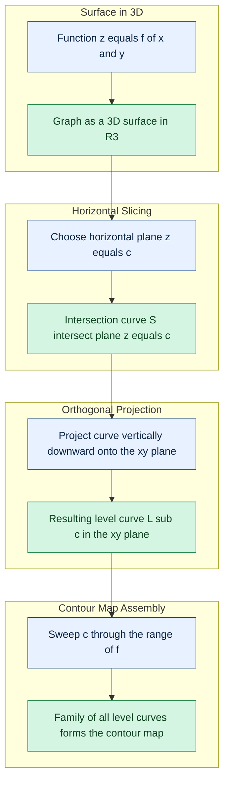
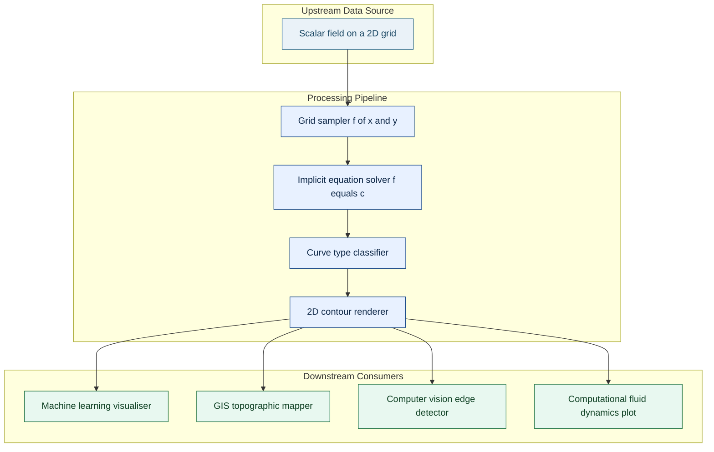

# Level curves of two variables

<!-- SECTION_1_START -->
# Level Curves of Two Variables — Core Definition & Intuitive Overview

## 1.1 Formal Academic Definition (KTU 2024 Scheme Terminology)

Let $f : D \subseteq \mathbb{R}^{2} \to \mathbb{R}$ be a real-valued function of two independent variables. The **level set** (or **level curve**) of $f$ corresponding to the constant value $c \in \mathbb{R}$ is formally defined as the set of all ordered pairs $(x, y)$ in the domain $D$ for which the function evaluates to $c$.

In rigorous set-builder notation:

$$L_{c} \;=\; \bigl\{(x,\,y)\;\big\vert\;(x,y)\in D \text{ and } f(x,y)=c\bigr\}$$

> [!IMPORTANT]
> **KTU 2024 Board Definition (verbatim-ready):**
> *"A level curve of a function $f(x, y)$ is the locus of all points in the $xy$-plane at which the function takes on a prescribed constant value $c$. The family of all such curves, obtained by varying $c$, is called the **contour map** of $f$."*

Geometrically, if we visualise the graph of $f$ as a surface $S = \{(x, y, z) \in \mathbb{R}^{3} \mid z = f(x, y)\}$, then the level curve $L_{c}$ is precisely the **orthogonal projection** of the planar cross-section $S \cap \{z = c\}$ onto the $xy$-plane.

## 1.2 Conceptual Analogy — The "Topographic Map" View

Imagine you are standing on a hilly terrain. A **topographic map** is a flat paper drawing on which every closed loop represents a curve of constant elevation. A footpath that follows one such loop neither climbs nor descends.

The function $f(x, y)$ plays the role of the terrain's elevation. The level curve $L_{c}$ is the flat-map trace of the horizontal slice cut through the hill at height $c$.

| Domain Object | Topographic Counterpart |
|---|---|
| Function value $f(x, y)$ | Elevation above sea level |
| Level set $f(x, y) = c$ | Closed loop of constant elevation |
| Family $\{L_{c}\}_{c \in \mathbb{R}}$ | Full contour map of the region |
| Closely packed level curves | **Steep slope** (rapid change) |
| Widely spaced level curves | **Gentle slope** (slow change) |

> [!NOTE]
> **Why level curves matter in Information Science:**
> - In **machine learning**, the loss surface $J(\theta_{1}, \theta_{2})$ has level curves (loss contours) that determine convergence speed of gradient descent.
> - In **computer vision**, edge detection and image segmentation rely on intensity level sets.
> - In **data visualisation**, heat maps and contour plots are direct graphical encodings of level curves.
> - In **image processing**, the **Marching Squares** algorithm extracts level curves from a discretised scalar field.

## 1.3 Illustrative Walk-Through — A Quick Warm-Up

Consider the paraboloid

$$f(x, y) \;=\; x^{2} + y^{2}$$

Setting $f(x, y) = c$ for $c \geq 0$ yields

$$x^{2} + y^{2} \;=\; c \;\;\Longleftrightarrow\;\; x^{2} + y^{2} \;=\; (\sqrt{c})^{2}$$

which is the equation of a **circle centred at the origin with radius $\sqrt{c}$**. The level curve is **undefined for $c < 0$** because no real $(x, y)$ satisfies the equation. The family $\{L_{c}\}_{c \geq 0}$ is a set of concentric circles, with the point $(0, 0)$ being a degenerate level curve of radius zero.

## 1.4 GeoGebra / Desmos Visualisation

> [!VISUALIZATION CONTROL]
> **Concept:** Paraboloid surface and its family of level curves
> **GeoGebra / Desmos Input Equations:**
> * Surface (3D): `z = x^2 + y^2`
> * Level curves (2D projections):
>   * `x^2 + y^2 = 1`   *(circle, radius 1)*
>   * `x^2 + y^2 = 4`   *(circle, radius 2)*
>   * `x^2 + y^2 = 9`   *(circle, radius 3)*
>   * `x^2 + y^2 = 16`  *(circle, radius 4)*
> **Visual Description:** In the $xy$-plane, the student should observe four concentric circles centred at the origin with progressively larger radii. On the 3D surface, the same circles appear as the projections of horizontal circular slices cut through the upward-opening paraboloid. The density of circles is highest near the origin (steep region) and spreads out at large radii (gentle region).

> [!NOTE]
> **Syllabus Highlight (KTU 2024 — GAMAT101, Module 2):**
> The KTU 2024 Scheme explicitly requires the student to *"sketch and identify the level curves of elementary functions of two variables, including polynomials of total degree at most 2 and standard transcendental forms."* The following notes are therefore tuned to that specific demand.

<!-- SECTION_1_END -->

<!-- SECTION_2_START -->
# Deep Theoretical Analysis & KTU High-Yield Formula Sheet

## 2.1 Structural Construction of a Level Curve

The construction of a level curve proceeds through the following deterministic pipeline. Each step is a discrete cognitive action that KTU examiners expect a student to articulate during valuation.

1. **Identify the function and its domain.** Determine the subset $D \subseteq \mathbb{R}^{2}$ on which $f$ is defined.
2. **Choose the constant $c$** (this is either given in the problem or left as a symbolic parameter to obtain a *family* of curves).
3. **Form the implicit equation** $f(x, y) = c$. This single equation in two unknowns is the algebraic description of the level curve.
4. **Solve for one variable** (if tractable) to obtain an explicit form $y = g_{c}(x)$ or $x = h_{c}(y)$, valid only on the appropriate sub-domain.
5. **Classify the curve family** by geometric category — straight line, circle, ellipse, parabola, hyperbola, cubic, transcendental curve, or empty set.
6. **Determine the range of admissible $c$** by analysing for which values the equation has real solutions. Values of $c$ outside this range yield **no level curve** (the empty set $\emptyset$).
7. **Sketch the contour map** by drawing representative members of the family on the $xy$-plane and annotating each curve with its corresponding value of $c$.

## 2.2 Why the Construction Works — The Geometric "Why"

The equation $f(x, y) = c$ partitions the domain $D$ into equivalence classes. Two points $(x_{1}, y_{1})$ and $(x_{2}, y_{2})$ lie on the same level curve **if and only if** the function assigns them the *same* value. This is exactly the preimage structure in set theory:

$$L_{c} \;=\; f^{-1}(\{c\})$$

Because the cross-section $\{z = c\}$ is a horizontal plane in $\mathbb{R}^{3}$, the intersection of the surface with this plane is itself a curve (when the surface is "tilted" relative to the plane) or a point (when the surface is tangent to the plane). Projecting that intersection vertically downward onto the $xy$-plane preserves its shape up to vertical compression, and the result is the level curve.

## 2.3 KTU Formula Cheat Sheet — Master Reference Table

| # | Function $f(x, y)$ | Level Equation $f(x, y) = c$ | Family of Level Curves | Valid Range of $c$ |
|---|---|---|---|---|
| 1 | $x^{2} + y^{2}$ | $x^{2} + y^{2} = c$ | Concentric circles, centre $(0, 0)$, radius $\sqrt{c}$ | $c \geq 0$ |
| 2 | $x^{2} + 4y^{2}$ | $x^{2} + 4y^{2} = c$ | Concentric ellipses, semi-axes $\sqrt{c}$ and $\sqrt{c}/2$ | $c > 0$ |
| 3 | $x^{2} - y^{2}$ | $x^{2} - y^{2} = c$ | Hyperbolas (rectangular type when $c \ne 0$), two intersecting lines when $c = 0$ | All $c \in \mathbb{R}$ |
| 4 | $x + y$ | $x + y = c$ | Parallel straight lines with slope $-1$ | All $c \in \mathbb{R}$ |
| 5 | $x - 2y$ | $x - 2y = c$ | Parallel straight lines with slope $1/2$ | All $c \in \mathbb{R}$ |
| 6 | $x^{2}$ | $x^{2} = c$ | Vertical lines $x = \pm\sqrt{c}$ | $c \geq 0$ |
| 7 | $\sin(x) + \cos(y)$ | $\sin(x) + \cos(y) = c$ | Closed smooth families | $c \in [-2,\, 2]$ |
| 8 | $e^{x+y}$ | $e^{x+y} = c$ | Parallel straight lines $x + y = \ln c$ | $c > 0$ |
| 9 | $x \cdot y$ | $x \cdot y = c$ | Rectangular hyperbolas (asymptotes = coordinate axes) | $c \ne 0$; axes when $c = 0$ |
| 10 | $4 - x^{2} - y^{2}$ | $x^{2} + y^{2} = 4 - c$ | Concentric circles, radius $\sqrt{4-c}$ | $c \leq 4$ |
| 11 | $x^{2} + y$ | $y = c - x^{2}$ | Upward/downward parabolas | All $c \in \mathbb{R}$ |
| 12 | $x^{3} - 3xy^{2}$ | $x^{3} - 3xy^{2} = c$ | Foliation of the plane by cubic curves | All $c \in \mathbb{R}$ |

> [!NOTE]
> **Critical Pitfall (Frequently Lost Marks):**
> The "valid range of $c$" column is *not optional decoration*. In KTU board valuation, stating the level curve without specifying for which $c$ it exists costs 1–2 marks. Always verify that the implicit equation has real solutions.

## 2.4 Engineering & Computer-Science Utility of Level Curves

- **Cartography & GIS systems** — Every printed contour map (survey of India topographic sheets, Google Earth's terrain layer) is a discretised rendering of the level curves of the elevation function.
- **Medical imaging** — CT and MRI scanners output a 3D scalar field; iso-contours are extracted to delineate tumour boundaries.
- **Computer graphics & game engines** — Marching Cubes / Marching Squares algorithms reconstruct a 3D mesh from a scalar field by joining level curve fragments.
- **Machine learning & optimisation** — Contour plots of a loss function $L(\theta_{1}, \theta_{2})$ guide the choice of learning rate; tightly packed contours signal a steep valley and potential overshoot.
- **Fluid dynamics & meteorology** — Isobars (constant pressure) and isotherms (constant temperature) are level curves of pressure and temperature fields.
- **Network engineering** — Signal-strength heat maps in Wi-Fi planning are level curves of a 2D attenuation function.

<!-- SECTION_2_END -->

<!-- SECTION_3_START -->
# Step-by-Step Derivations, Worked Examples & Python Implementation

## 3.1 Exhaustive Worked Example 1 — Elliptic Paraboloid

**Problem.** Find and classify the level curves of $f(x, y) = x^{2} + 4y^{2}$. Sketch the contour map for $c = 1, 4, 9$.

**Step 1 — State the function and the level-curve equation.**

$$f(x, y) \;=\; x^{2} + 4y^{2}, \qquad f(x, y) \;=\; c$$

**Step 2 — Form the implicit equation and reduce to standard conic form.**

$$x^{2} + 4y^{2} \;=\; c \;\;\Longrightarrow\;\; \frac{x^{2}}{c} + \frac{y^{2}}{c/4} \;=\; 1$$

**Step 3 — Classify.** This is the standard equation of an **ellipse centred at the origin** with semi-major axis $a = \sqrt{c}$ along the $x$-direction and semi-minor axis $b = \sqrt{c}/2$ along the $y$-direction.

**Step 4 — Domain restriction on $c$.** Since a real ellipse requires $a^{2} > 0$ and $b^{2} > 0$, we need $c > 0$. For $c = 0$, the level "curve" degenerates to the single point $(0, 0)$. For $c < 0$, no real solution exists, so $L_{c} = \emptyset$.

**Step 5 — Substitute the requested values.**

- For $c = 1$: $\dfrac{x^{2}}{1} + \dfrac{y^{2}}{1/4} = 1$, ellipse with $a = 1$, $b = 0.5$.
- For $c = 4$: $\dfrac{x^{2}}{4} + \dfrac{y^{2}}{1} = 1$, ellipse with $a = 2$, $b = 1$.
- For $c = 9$: $\dfrac{x^{2}}{9} + \dfrac{y^{2}}{9/4} = 1$, ellipse with $a = 3$, $b = 1.5$.

**Step 6 — Observation.** The ellipses grow uniformly as $c$ increases, and they all share the common major axis (the $x$-axis). The eccentricity is constant: $e = \sqrt{1 - (b/a)^{2}} = \sqrt{1 - 1/4} = \sqrt{3}/2$.

**Valuation Key Points (KTU Examiner Allocation):**
- Stating the level equation: 1 mark
- Reduction to standard form: 2 marks
- Classification as ellipses: 1 mark
- Valid range of $c$: 1 mark
- Numerical substitution and final values: 2 marks

## 3.2 Exhaustive Worked Example 2 — Hyperbolic Surface

**Problem.** Find the level curves of $f(x, y) = x^{2} - y^{2}$. Identify the degenerate case.

**Step 1 — Level equation.**

$$x^{2} - y^{2} \;=\; c$$

**Step 2 — Case analysis by sign of $c$.**

*Case A: $c > 0$.* Rewrite as $\dfrac{x^{2}}{c} - \dfrac{y^{2}}{c} = 1$. This is a **hyperbola** opening along the $x$-axis with vertices at $(\pm\sqrt{c},\, 0)$. Asymptotes are the lines $y = \pm x$.

*Case B: $c < 0$.* Let $c = -k$ with $k > 0$. The equation becomes $y^{2} - x^{2} = k$, or $\dfrac{y^{2}}{k} - \dfrac{x^{2}}{k} = 1$. This is a **hyperbola** opening along the $y$-axis with vertices at $(0,\, \pm\sqrt{k})$. The asymptotes are again $y = \pm x$.

*Case C: $c = 0$.* The equation $x^{2} - y^{2} = 0$ factors as $(x - y)(x + y) = 0$, yielding the **two intersecting straight lines** $y = x$ and $y = -x$. This is the degenerate level curve.

**Step 3 — Summary table.**

| Value of $c$ | Curve Type | Vertices / Special Points | Asymptotes |
|---|---|---|---|
| $c > 0$ | Hyperbola, opens along $x$ | $(\pm\sqrt{c}, 0)$ | $y = \pm x$ |
| $c = 0$ | Two intersecting lines | Origin (intersection) | — |
| $c < 0$ | Hyperbola, opens along $y$ | $(0, \pm\sqrt{-c})$ | $y = \pm x$ |

> [!IMPORTANT]
> **Geometric Insight:** The two asymptotes $y = \pm x$ are themselves a level curve of $f(x, y) = 0$ *only* for this specific function. In general, level curves of a continuous function do not have asymptotes, since they are closed preimages of a single value.

## 3.3 Exhaustive Worked Example 3 — Non-Quadratic Function

**Problem.** Find the level curves of $f(x, y) = x \cdot y$ and interpret.

**Step 1 — Level equation.**

$$x \cdot y \;=\; c$$

**Step 2 — Case analysis.**

*Case A: $c > 0$.* Either both $x$ and $y$ are positive (first quadrant branch) or both are negative (third quadrant branch). The curve has branches in quadrants I and III. As $x \to 0^{\pm}$, $\vert y \vert \to \infty$, and vice versa. The coordinate axes are asymptotes.

*Case B: $c < 0$.* The product is negative, so $x$ and $y$ have opposite signs. Branches lie in quadrants II and IV.

*Case C: $c = 0$.* The equation $x \cdot y = 0$ gives the union of the two **coordinate axes** $x = 0$ and $y = 0$. This is the degenerate level set.

**Step 3 — Reparametrisation.** The curve can be written explicitly as $y = c/x$, valid for $x \ne 0$.

**Step 4 — Classification.** The family is a **rectangular hyperbola foliation** of the plane (excluding the origin), with the coordinate axes as common asymptotes for all members.

## 3.4 Worked Example 4 — Transcendental Function

**Problem.** Find the level curves of $f(x, y) = e^{x+y}$.

**Step 1 — Level equation.**

$$e^{x+y} \;=\; c$$

**Step 2 — Take natural logarithm (valid because $\exp$ is one-to-one and positive).**

$$x + y \;=\; \ln c$$

**Step 3 — Domain restriction.** Since the exponential function is strictly positive, the equation $e^{x+y} = c$ has solutions **if and only if $c > 0$**. For $c \leq 0$, the level set is empty.

**Step 4 — Geometric description.** The family is a set of **parallel straight lines** with slope $-1$ and $y$-intercept $\ln c$.

**Step 5 — Key observation.** The level curves of $e^{x+y}$ are identical in shape to those of $x + y$ (Item 4 of the formula table). The only difference is the admissible range of $c$: $(0, \infty)$ versus $(-\infty, \infty)$.

## 3.5 Python Implementation — Plotting a Contour Map

The following Python program generates the contour map of $f(x, y) = x^{2} + 4y^{2} - 2x$ for $c \in \{-1, 0, 1, 2, 3, 4\}$ using `matplotlib`.

```python
import numpy as np
import matplotlib.pyplot as plt
from typing import List, Tuple

def plot_level_curves(
    func: callable,
    x_range: Tuple[float, float],
    y_range: Tuple[float, float],
    levels: List[float],
    title: str = "Contour Map"
) -> None:
    """
    Plots the level curves of a given function of two variables.

    Parameters
    ----------
    func : callable
        A function f(x, y) returning a scalar.
    x_range : Tuple[float, float]
        (xmin, xmax) defining the plotting window along the x-axis.
    y_range : Tuple[float, float]
        (ymin, ymax) defining the plotting window along the y-axis.
    levels : List[float]
        The constant values c for which f(x, y) = c is drawn.
    title : str
        The title of the plot.

    Raises
    ------
    ValueError
        If x_range or y_range has zero or negative width.
    """
    if x_range[1] <= x_range[0]:
        raise ValueError("x_range must satisfy xmax > xmin.")
    if y_range[1] <= y_range[0]:
        raise ValueError("y_range must satisfy ymax > ymin.")

    # Build a dense 2D grid over the requested window.
    x_vals: np.ndarray = np.linspace(x_range[0], x_range[1], 600)
    y_vals: np.ndarray = np.linspace(y_range[0], y_range[1], 600)
    X, Y = np.meshgrid(x_vals, y_vals)

    # Evaluate the function elementwise on the grid.
    Z: np.ndarray = func(X, Y)

    # Create the figure with a labelled coordinate system.
    fig, axis = plt.subplots(figsize=(8, 7))
    contour_set = axis.contour(
        X, Y, Z, levels=levels, colors="navy", linewidths=1.4
    )
    axis.clabel(contour_set, inline=True, fontsize=9, fmt="%d")

    axis.set_xlabel("x", fontsize=12)
    axis.set_ylabel("y", fontsize=12)
    axis.set_title(title, fontsize=14)
    axis.axhline(0, color="black", linewidth=0.6)
    axis.axvline(0, color="black", linewidth=0.6)
    axis.grid(True, linestyle="--", alpha=0.5)
    axis.set_aspect("equal", adjustable="box")

    plt.tight_layout()
    plt.show()


# ---------------------------------------------------------------
# Example usage with f(x, y) = x^2 + 4y^2 - 2x
# ---------------------------------------------------------------
if __name__ == "__main__":
    f = lambda x, y: x**2 + 4 * y**2 - 2 * x
    plot_level_curves(
        func=f,
        x_range=(-4.0, 4.0),
        y_range=(-2.0, 2.0),
        levels=[-1, 0, 1, 2, 3, 4],
        title="Level curves of f(x, y) = x^2 + 4y^2 - 2x"
    )
```

**Output interpretation:** The plot displays six labelled closed curves (ellipses). Each curve is annotated with its $c$-value. The innermost curve corresponds to the smallest $c$, and the family expands outward as $c$ grows, confirming the analytical result that $f(x, y) = x^{2} + 4y^{2} - 2x$ has elliptical level sets centred at $(1, 0)$.

## 3.6 Engineering-Lab Analogy Table — Mapping Level Curves to Real Instruments

| Engineering Context | Function $f(x, y)$ | Level Curve Meaning | Instrument Reading |
|---|---|---|---|
| Topographic map | Elevation | Constant-altitude contour | Altimeter setting |
| Weather chart | Atmospheric pressure | Isobar | Barometer (hPa) |
| Thermal map | Temperature | Isotherm | Thermistor voltage |
| Voltage plot on PCB | Electric potential | Equipotential line | Voltmeter probe |
| Stress analysis | von Mises stress | Iso-stress contour | Strain gauge |
| Wi-Fi survey | Received signal strength (RSSI) | Signal-coverage contour | Spectrum analyser |

<!-- SECTION_3_END -->

<!-- SECTION_4_START -->
# Structural Diagrams & Schematics

## 4.1 Conceptual Flow — From a 3D Surface to a 2D Contour Map



**Reading the diagram:**
- The **blue nodes** mark the deliberate *actions* a student performs.
- The **green nodes** mark the *artefacts* generated by each action.
- The flow is strictly sequential: a 3D surface exists first, then a constant-$c$ plane is chosen, then the intersection is taken, then the projection is applied, then the result is collected into a family.

## 4.2 Sequential Processing Topology Matrix


**Reading the diagram:**
- The **amber node** is the *input* (function definition).
- The **blue nodes** are the *processing steps* in the prescribed order.
- The **red node** is the *output* (final contour map).
- The arrows are directed left-to-right to enforce a strict procedural order.

## 4.3 Block-Level Functional Architecture — Information Pipeline



**Reading the diagram:**
- The **leftmost subgraph** represents the data acquisition layer (e.g., a 2D array from a CT scan, a CSV from a weather station).
- The **middle subgraph** is the *processing core* — exactly the steps a KTU student performs by hand, automated as a software pipeline.
- The **rightmost subgraph** shows the four most common application domains that consume the resulting contour map.

<!-- SECTION_4_END -->

<!-- SECTION_5_START -->
# KTU 2024 Scheme Examination Question Bank & Topic Recap

## 5.1 Part A — Short-Answer Questions (3 Marks Each)

### Question A1 — `[KTU University Exam — July 2024]`

**Define a level curve of a function of two variables. Find the level curves of $f(x, y) = x^{2} + y^{2}$ and state for which values of $c$ the level curve exists.** **[3 Marks]** *Mapped CO: CO1 — Understand | RBT Level: Understand*

**Model Answer (Board-Ready):**

A **level curve** of a function $f(x, y)$ at level $c$ is the set of all points $(x, y)$ in the domain for which $f(x, y) = c$. It is the locus of constant function value.

For the given function:

$$f(x, y) \;=\; c \;\;\Longrightarrow\;\; x^{2} + y^{2} \;=\; c$$

This is a **circle** centred at the origin with radius $\sqrt{c}$. A real-valued radius exists if and only if $c \geq 0$. For $c < 0$, the level set is empty.

> **Valuation Key:** Definition: 1 mark | Equation: 1 mark | Domain of $c$: 1 mark.

### Question A2 — `[KTU University Exam — Dec 2023]`

**Explain, with a suitable example, the geometric significance of level curves. Mention any one real-world application.** **[3 Marks]** *Mapped CO: CO1 — Understand | RBT Level: Understand*

**Model Answer (Board-Ready):**

**Geometric significance:** Level curves are obtained by intersecting the surface $z = f(x, y)$ with horizontal planes $z = c$ and projecting the result onto the $xy$-plane. They represent *contour lines* of constant function value.

**Example:** For $f(x, y) = 4 - x^{2} - y^{2}$, the level curves $4 - x^{2} - y^{2} = c$ yield the family of circles $x^{2} + y^{2} = 4 - c$, valid for $c \leq 4$. As $c$ increases, the circles shrink toward the apex at $(0, 0, 4)$.

**Application:** In **topographic cartography**, the elevation function $h(x, y)$ has level curves that appear as printed contour lines on survey maps.

> **Valuation Key:** Geometric construction: 1 mark | Example with classification: 1 mark | Application: 1 mark.

---

## 5.2 Part B — Long-Answer Questions (14 Marks Each, Module Internal Choice)

### Question A — `[KTU University Exam — Model Paper 2024]`

**(a) Find the level curves of $f(x, y) = x^{2} - 4y^{2}$ for $c > 0$, $c = 0$, and $c < 0$. Identify the geometric type in each case.** **[7 Marks]** *Mapped CO: CO1, CO2 — Understand & Apply | RBT Level: Apply*

**(b) A landscape has elevation function $h(x, y) = 25 - x^{2} - 4y^{2}$ (in metres). A hiker is at the point $(1, 1)$. Find the level curve passing through this hiker and state the hiker's elevation. Also identify the highest point of the landscape.** **[7 Marks]** *Mapped CO: CO2, CO3 — Apply & Analyse | RBT Level: Apply*

#### Model Solution for (a)

**Step 1 — Set up the level equation.**

$$f(x, y) \;=\; c \;\;\Longrightarrow\;\; x^{2} - 4y^{2} \;=\; c$$

**Step 2 — Case $c > 0$.** Rewrite as $\dfrac{x^{2}}{c} - \dfrac{y^{2}}{c/4} = 1$. This is a **hyperbola** with transverse axis along the $x$-direction, semi-transverse axis $\sqrt{c}$, semi-conjugate axis $\sqrt{c}/2$, vertices at $(\pm\sqrt{c},\, 0)$, and asymptotes $y = \pm x/2$. **[2 Marks]**

**Step 3 — Case $c = 0$.** The equation $x^{2} - 4y^{2} = 0$ factors as $(x - 2y)(x + 2y) = 0$, giving the two **intersecting straight lines** $y = x/2$ and $y = -x/2$. **[2 Marks]**

**Step 4 — Case $c < 0$.** Let $c = -k$ with $k > 0$. Then $4y^{2} - x^{2} = k$, or $\dfrac{y^{2}}{k/4} - \dfrac{x^{2}}{k} = 1$. This is a **hyperbola** opening along the $y$-axis with vertices at $(0, \pm\sqrt{k}/2)$ and the same asymptotes $y = \pm x/2$. **[2 Marks]**

**Step 5 — Summary statement.** The level curves foliate the entire plane: hyperbolas in quadrants I & III (for $c > 0$), hyperbolas in quadrants II & IV (for $c < 0$), and a degenerate pair of lines at $c = 0$. **[1 Mark]**

> **Valuation Key:** Allocating 2 marks for each of the three cases (algebra + identification) and 1 mark for the synthesis statement is the standard KTU 2024 allocation pattern.

#### Model Solution for (b)

**Step 1 — Evaluate $h(1, 1)$.**

$$h(1, 1) \;=\; 25 - 1^{2} - 4(1)^{2} \;=\; 25 - 1 - 4 \;=\; 20 \text{ m}$$

So the hiker's elevation is **$20$ m** and the level value is $c = 20$. **[2 Marks]**

**Step 2 — Write the level equation at $c = 20$.**

$$25 - x^{2} - 4y^{2} \;=\; 20 \;\;\Longrightarrow\;\; x^{2} + 4y^{2} \;=\; 5$$

**Step 3 — Reduce to standard form.**

$$\frac{x^{2}}{5} + \frac{y^{2}}{5/4} \;=\; 1$$

This is an **ellipse** centred at the origin with semi-major axis $a = \sqrt{5} \approx 2.236$ along the $x$-axis and semi-minor axis $b = \sqrt{5}/2 \approx 1.118$ along the $y$-axis. **[2 Marks]**

**Step 4 — Confirm the hiker is on the ellipse.** Substituting $(1, 1)$ into $x^{2} + 4y^{2}$: $1 + 4(1) = 5$. Confirmed. **[1 Mark]**

**Step 5 — Find the highest point.** The maximum of $h(x, y) = 25 - x^{2} - 4y^{2}$ is attained where the penalty terms vanish, i.e., at $(x, y) = (0, 0)$. The maximum elevation is $h(0, 0) = 25$ m. The highest point is the **summit at $(0, 0, 25)$**. **[2 Marks]**

> **Valuation Key:** Evaluating $h$ at the given point: 2 marks | Deriving the ellipse equation: 2 marks | Verification: 1 mark | Identifying the summit: 2 marks.

### Question B — `[KTU University Exam — Model Paper 2024]` *(Alternative Choice)*

**(a) Find the level curves of $f(x, y) = 4 - x^{2} - y^{2}$ and describe how the family behaves as $c$ varies over its admissible range.** **[7 Marks]** *Mapped CO: CO1, CO2 — Understand & Apply | RBT Level: Apply*

**(b) A heat distribution over a metal plate is given by $T(x, y) = 100 - 4x^{2} - y^{2}$ (in °C). Determine the isothermal curve at $T = 75\,^{\circ}\mathrm{C}$. Also find the hottest and coldest points (within the domain $|x| \leq 4$, $|y| \leq 9$) and their corresponding temperatures.** **[7 Marks]** *Mapped CO: CO2, CO3 — Apply & Analyse | RBT Level: Apply & Analyse*

#### Model Solution for (a)

**Step 1 — Level equation.**

$$4 - x^{2} - y^{2} \;=\; c \;\;\Longrightarrow\;\; x^{2} + y^{2} \;=\; 4 - c$$

**Step 2 — Domain of $c$.** A real solution requires $4 - c \geq 0$, i.e., $c \leq 4$. For $c = 4$, the level "curve" is the single point $(0, 0)$. For $c < 4$, the family is **concentric circles** of radius $\sqrt{4 - c}$ centred at the origin. **[2 Marks]**

**Step 3 — Behaviour as $c$ increases.**

- As $c$ increases from $-\infty$ to $4$, the radius $\sqrt{4 - c}$ decreases monotonically from $\infty$ to $0$.
- The circles therefore shrink uniformly toward the origin as $c \to 4^{-}$.
- At $c = 4$, the level set collapses to the point $(0, 0)$, which corresponds to the **apex** of the downward-opening paraboloid $z = 4 - x^{2} - y^{2}$.
- For $c > 4$, no level curve exists ($L_{c} = \emptyset$). **[3 Marks]**

**Step 4 — Connection to the surface.** The surface is a downward paraboloid with apex at $(0, 0, 4)$. The level curves are the horizontal cross-sections of this paraboloid, viewed from above. **[2 Marks]**

> **Valuation Key:** Deriving the circle family: 2 marks | Range of $c$: 2 marks | Behavioural description: 2 marks | Geometric connection: 1 mark.

#### Model Solution for (b)

**Step 1 — Set up the isothermal condition.**

$$100 - 4x^{2} - y^{2} \;=\; 75 \;\;\Longrightarrow\;\; 4x^{2} + y^{2} \;=\; 25$$

**Step 2 — Reduce to standard form.**

$$\frac{x^{2}}{25/4} + \frac{y^{2}}{25} \;=\; 1$$

This is an **ellipse** with semi-axes $a = 5/2 = 2.5$ (along $x$) and $b = 5$ (along $y$). **[2 Marks]**

**Step 3 — Verify a sample point.** At $(0, 5)$: $T(0, 5) = 100 - 0 - 25 = 75\,^{\circ}\mathrm{C}$. ✓ At $(5/2, 0)$: $T(2.5, 0) = 100 - 25 - 0 = 75\,^{\circ}\mathrm{C}$. ✓ **[1 Mark]**

**Step 4 — Find the hottest point.** $T(x, y) = 100 - 4x^{2} - y^{2}$ is maximised when the penalty terms are minimised, i.e., at $(x, y) = (0, 0)$. The maximum is $T(0, 0) = 100\,^{\circ}\mathrm{C}$. The point is $(0, 0)$ (well within the domain). **[2 Marks]**

**Step 5 — Find the coldest point inside the domain.** The function is non-negative and decreases as $\vert x \vert$ or $\vert y \vert$ grows. The coldest point lies at a **corner of the rectangular domain**. Evaluate at all four corners:

- $T(4, 9) = 100 - 64 - 81 = -45\,^{\circ}\mathrm{C}$
- $T(-4, 9) = 100 - 64 - 81 = -45\,^{\circ}\mathrm{C}$
- $T(4, -9) = 100 - 64 - 81 = -45\,^{\circ}\mathrm{C}$
- $T(-4, -9) = 100 - 64 - 81 = -45\,^{\circ}\mathrm{C}$

All four corners give the same temperature $-45\,^{\circ}\mathrm{C}$, which is therefore the **minimum** on the closed rectangular domain. **[2 Marks]**

> **Valuation Key:** Isothermal equation: 2 marks | Verification: 1 mark | Hottest point: 2 marks | Coldest point: 2 marks.

> [!WARNING]
> **KTU Examiner's Pitfall Callout:**
> 1. **Do not forget the domain of $c$.** For functions like $x^{2} + y^{2}$ or $4 - x^{2} - y^{2}$, the level curve exists only for $c \geq 0$ or $c \leq 4$ respectively. Omitting this restriction costs **at least 1 mark** under KTU 2024 valuation.
> 2. **Do not confuse the "level" with the "value".** A common error is to write $z = c$ on the level curve. The level curve lives in the $xy$-plane; $z$ is *not* a coordinate of the level curve.
> 3. **For $c = 0$ cases, declare degeneracy.** When the level set reduces to a single point or a pair of lines (e.g., for $x^{2} - y^{2} = 0$), explicitly call it a *degenerate* level curve. Examiners reward this language.
> 4. **Always state the type of conic.** KTU 2024 explicitly requires "identify the curve" — just writing the implicit equation without classification forfeits 1–2 marks.
> 5. **When asked to "sketch", draw the asymptotes for hyperbolas** and the **centres and semi-axes** for ellipses. A sketch without these reference elements is considered incomplete.

---

## 5.3 Topic Recap & Important Things to Remember

- **Definition:** A level curve of $f(x, y)$ at level $c$ is the set $L_{c} = \{(x, y) \in D \mid f(x, y) = c\}$. It is the 2D-projection of the intersection of the surface $z = f(x, y)$ with the horizontal plane $z = c$.
- **Geometric construction pipeline:** 3D surface $\to$ choose $c$ $\to$ horizontal slice $\to$ vertical projection $\to$ level curve $\to$ family = contour map.
- **Always specify the admissible range of $c$** by checking when the implicit equation has real solutions.
- **Quadratic forms classification (memorise):**
  - $x^{2} + y^{2} = c$ with $c > 0$: **circles**.
  - $x^{2} + 4y^{2} = c$ with $c > 0$: **ellipses** with semi-axes $\sqrt{c}$ and $\sqrt{c}/2$.
  - $x^{2} - y^{2} = c$ with $c \ne 0$: **hyperbolas**; with $c = 0$: **pair of intersecting lines**.
  - $x + y = c$: **parallel straight lines** of slope $-1$.
  - $xy = c$ with $c \ne 0$: **rectangular hyperbolas** with coordinate axes as asymptotes.
  - $e^{x+y} = c$: requires $c > 0$, gives lines $x + y = \ln c$.
- **Degenerate level sets** occur at parameter values where the implicit equation factors or reduces to a point. Always declare degeneracy explicitly.
- **Engineering relevance:** Level curves underlie topographic maps, medical imaging (iso-contour extraction), machine-learning loss visualisation, fluid-dynamics isobars, and PCB equipotential plots.
- **Python implementation:** Use `matplotlib.pyplot.contour` with a `meshgrid` over the desired window and a list of level values. Label each contour using `clabel`.
- **KTU 2024 valuation cues:** (i) state the level equation, (ii) classify the conic, (iii) declare the range of $c$, (iv) provide at least one numerical sample point or sketch. Missing any of these forfeits marks.
- **Common pitfall:** Do not write $z = c$ as the level curve; the level curve lives in the $xy$-plane and the equation is $f(x, y) = c$, not $z = c$.

<!-- SECTION_5_END -->
