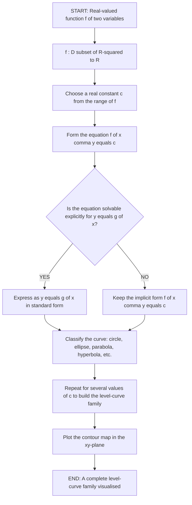
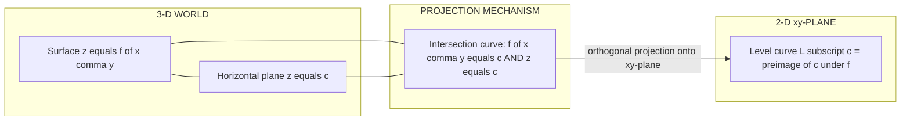
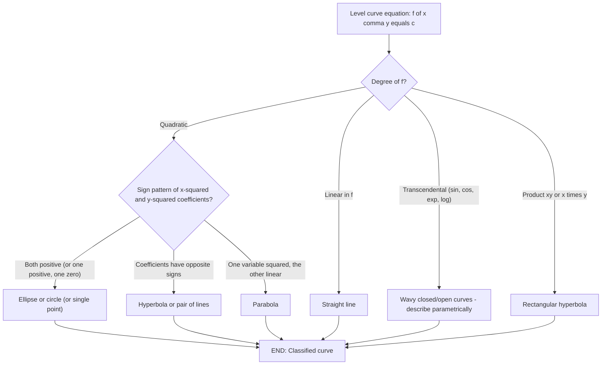
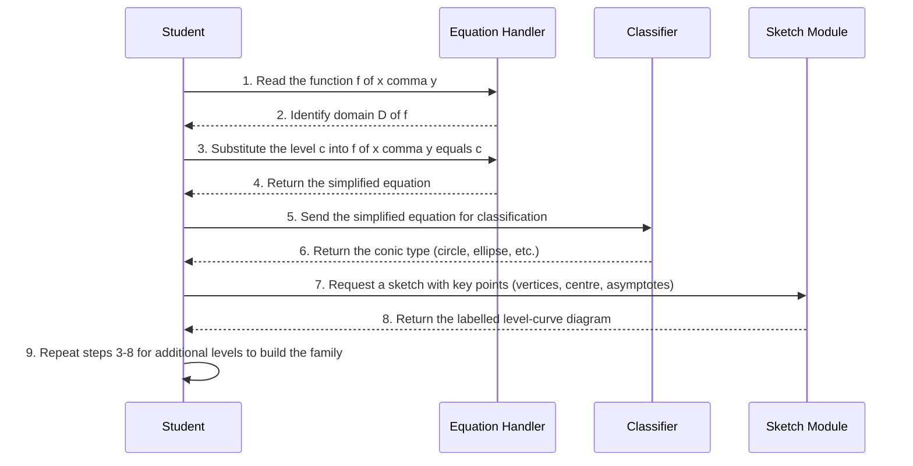
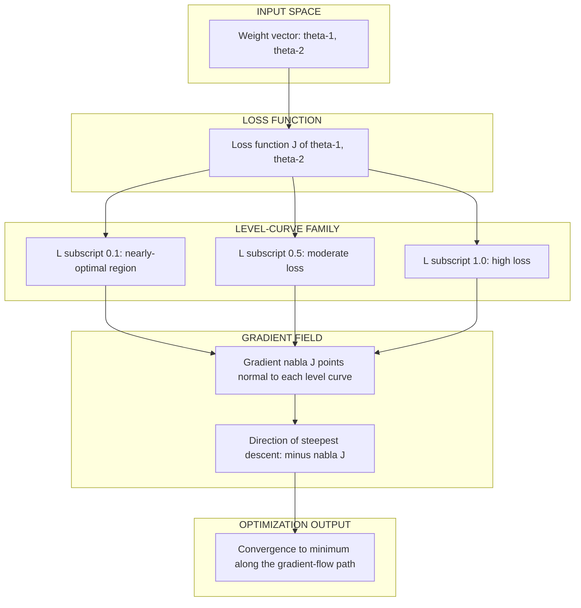

# Level curves of two variables

<!-- SECTION_1_START -->
# 📘 Level Curves of Two Variables — Module 2: Functions of Several Variables

> [!IMPORTANT]
> **KTU 2024 Scheme | Course Code:** GAMAT101 — *Mathematics for Information Science – 1*
> **Module:** 2 — *Functions of Several Variables: Domains and Ranges*
> **Topic:** *Level Curves of Two Variables*
> **Mapped Course Outcome (CO):** CO1 — *Apply the concepts of partial differentiation, level sets, and gradient fields to solve problems in information science.*
> **RBT Cognitive Levels Covered:** Remember → Understand → Apply

---

## 1.1 🎯 Core Technical Definition (KTU Board-Standard)

> [!NOTE]
> **Definition (Level Curve of a Function of Two Variables)**
> Let $f : D \subseteq \mathbb{R}^{2} \to \mathbb{R}$ be a real-valued function of two independent variables $x$ and $y$. For a fixed real constant $c \in \mathbb{R}$, the **level curve** of $f$ at level $c$ is the set
> $$L_c = \left\{ (x, y) \in D \;\middle|\; f(x, y) = c \right\}.$$
> In other words, $L_c$ is the **preimage** of the singleton set $\{c\}$ under $f$, i.e., $L_c = f^{-1}(\{c\})$. Geometrically, it is the projection onto the $xy$-plane of the horizontal slice of the surface $z = f(x, y)$ at height $z = c$.

### 1.2 🧠 Conceptual Analogy — "Walking on Flat Ground on a Hilly Surface"

Imagine you are standing on a 3-D mountain landscape described by the surface $z = f(x, y)$, where $z$ denotes **altitude above sea level**.

> [!TIP]
> **Think of $f(x, y)$ as elevation.**
> A **level curve** is the path a hiker would walk if they wanted to **stay at the exact same altitude** at all times. A contour map of a mountain (those squiggly rings you see in a geography book) is nothing but a collection of level curves drawn at regular altitude intervals (e.g., every **100 metres**).

- The **constant $c$** is the *fixed altitude* you commit to walking at.
- The **curve $L_c$** is the *footprint* on the ground of the horizontal plane $z = c$ cutting through the mountain.

> [!NOTE]
> **Geometric Intuition in 3-D → 2-D Projection**
> - In 3-D, the set $f(x, y) = c$ together with $z = c$ forms a **horizontal plane** that slices the surface $z = f(x, y)$.
> - When that intersection curve is *projected vertically downward* onto the $xy$-plane, you obtain the level curve $L_c$.
> - Therefore, the level curve is the **shadow** of the 3-D intersection cast onto the floor.

### 1.3 🌐 GeoGebra / Desmos Visualization

> [!VISUALIZATION CONTROL]
> **Concept:** Family of concentric level curves for the paraboloid $f(x, y) = x^{2} + y^{2}$.
> **GeoGebra / Desmos Input Equations:**
> * `f(x, y) = x^2 + y^2`
> * `Level curve c = 1:`  $x^{2} + y^{2} = 1$
> * `Level curve c = 4:`  $x^{2} + y^{2} = 4$
> * `Level curve c = 9:`  $x^{2} + y^{2} = 9$
> * `Level curve c = 16:` $x^{2} + y^{2} = 16$
> **Visual Description:** On the $xy$-plane you will see four **concentric circles** centred at the origin with radii $1, 2, 3, 4$. In 3-D, the surface $z = x^{2} + y^{2}$ is a **paraboloid (bowl)** opening upward, and each circle is the shadow of the horizontal slice at height $z = c$.

---

### 1.4 🔑 Why Level Curves Matter in Information Science

| Application | Role of Level Curves |
|---|---|
| **Machine Learning (Loss Landscapes)** | Each level curve $L_c$ is a set of weight configurations $(w_1, w_2)$ producing the **same training loss** $c$. |
| **Image Processing (Edge Detection)** | Level curves of an intensity function $I(x, y)$ trace object boundaries. |
| **Computer Graphics (Isophotes)** | Curves of constant illumination on a 3-D rendered surface. |
| **Geographic Information Systems (GIS)** | Topographic contour lines are literally level curves of terrain elevation. |
| **Optimization (Gradient Descent)** | The **gradient $\nabla f$** is always **perpendicular** to the level curve — the direction of steepest ascent. |
| **Robotics (Configuration Spaces)** | Reachable configuration sets at fixed cost (energy) are level sets. |

> [!IMPORTANT]
> **Key Takeaway for KTU Exam:**
> A level curve is **not** a graph of a function $y = g(x)$. It is a *level set* — the collection of all $(x, y)$ that yield the **same** function value. It may be a single point, an empty set, a circle, an ellipse, a hyperbola, a parabola, a pair of lines, or any closed/open curve.

<!-- SECTION_1_END -->

<!-- SECTION_2_START -->
# 📘 Deep Theoretical Analysis & KTU High-Yield Formula Sheet

## 2.1 🧩 Theoretical Foundation — Anatomy of a Level Curve

Given a smooth function $f : \mathbb{R}^{2} \to \mathbb{R}$ and a constant $c \in \mathbb{R}$, the level curve $L_c$ is defined as the solution set of a single equation in **two unknowns**:

$$f(x, y) - c = 0.$$

The procedural steps to extract level curves of $f$ are:

1. **Step 1 — Choose the level.** Fix a real constant $c$ belonging to the *range* of $f$.
2. **Step 2 — Form the equation.** Write $f(x, y) = c$.
3. **Step 3 — Simplify & classify.** Reduce to a *standard conic form* (circle, ellipse, parabola, hyperbola, pair of lines) or describe it parametrically.
4. **Step 4 — Sketch the family.** Repeat for several values of $c$ to obtain a **level-curve family** (the *contour plot*).

> [!NOTE]
> **Implicit vs. Explicit Form**
> The defining equation $f(x, y) = c$ is usually **implicit**. Sometimes it can be solved explicitly as $y = g(x)$, but in most KTU problems the implicit form is the desired answer.

### 2.2 🗂️ KTU Formula Sheet — Level Curves of Standard Surfaces

> [!IMPORTANT]
> **Use $\vert$ or $\mid$ (NOT the pipe character `|`) inside table cells to avoid markdown breakage.**

| # | Function $f(x, y)$ | Level Curve Equation $f(x, y) = c$ | Geometric Shape | Type of Surface in 3-D |
|---|---|---|---|---|
| 1 | $f(x, y) = x^{2} + y^{2}$ | $x^{2} + y^{2} = c,\; c > 0$ | **Circle** of radius $\sqrt{c}$ | Circular paraboloid |
| 2 | $f(x, y) = x^{2} + y^{2}$ | $x^{2} + y^{2} = 0$ | A **single point** $(0, 0)$ | Vertex of paraboloid |
| 3 | $f(x, y) = \dfrac{x^{2}}{a^{2}} + \dfrac{y^{2}}{b^{2}}$ | $\dfrac{x^{2}}{a^{2}} + \dfrac{y^{2}}{b^{2}} = c$ | **Ellipse** if $c > 0$ | Elliptic paraboloid |
| 4 | $f(x, y) = \dfrac{x^{2}}{a^{2}} - \dfrac{y^{2}}{b^{2}}$ | $\dfrac{x^{2}}{a^{2}} - \dfrac{y^{2}}{b^{2}} = c$ | **Hyperbola** (two branches) | Hyperbolic paraboloid (saddle) |
| 5 | $f(x, y) = y - x^{2}$ | $y - x^{2} = c \;\Rightarrow\; y = x^{2} + c$ | **Parabola** opening upward | Parabolic cylinder shifted |
| 6 | $f(x, y) = x^{2}$ | $x^{2} = c$ | Two vertical lines $x = \pm\sqrt{c}$ | Half of a parabolic cylinder |
| 7 | $f(x, y) = x \cdot y$ | $xy = c$ | **Rectangular hyperbola** | Saddle surface |
| 8 | $f(x, y) = \sin(x) + \cos(y)$ | $\sin(x) + \cos(y) = c$ | Closed wavy curves for $\vert c \vert \leq 2$ | Undulating surface |
| 9 | $f(x, y) = e^{-(x^{2}+y^{2})}$ | $e^{-(x^{2}+y^{2})} = c \;\Rightarrow\; x^{2} + y^{2} = -\ln c$ | Circle for $0 < c < 1$ | Gaussian "bell" surface |
| 10 | $f(x, y) = \ln(x^{2} + y^{2})$ | $\ln(x^{2} + y^{2}) = c \;\Rightarrow\; x^{2} + y^{2} = e^{c}$ | Circle of radius $e^{c/2}$ | Funnel surface |

### 2.3 🔬 Properties of Level Curves (Board-Favourite Theorems)

> [!TIP]
> **Property 1 — Domain Restriction**
> Only values of $c$ that lie in the **range** of $f$ produce non-empty level curves. If $c \notin \text{Range}(f)$, then $L_c = \emptyset$.

> [!TIP]
> **Property 2 — Disjointness of Levels**
> Two distinct levels $c_1 \neq c_2$ give **disjoint** level curves:
> $$L_{c_1} \cap L_{c_2} = \emptyset.$$
> A point in the domain can have **only one** function value, so it can belong to **only one** level curve.

> [!TIP]
> **Property 3 — Gradient Orthogonality (CRITICAL FOR KTU)**
> If $f$ is differentiable at $(x_0, y_0)$ and $\nabla f(x_0, y_0) \neq \mathbf{0}$, then the level curve $L_c$ passing through $(x_0, y_0)$ has the **gradient vector** $\nabla f(x_0, y_0)$ as its **normal vector**. Equivalently, the **tangent line** to $L_c$ at $(x_0, y_0)$ is perpendicular to $\nabla f(x_0, y_0)$.

> [!TIP]
> **Property 4 — Direction of Steepest Ascent**
> The unit vector $\mathbf{u} = \dfrac{\nabla f}{\vert \nabla f \vert}$ points in the direction of **greatest increase** of $f$, and is **perpendicular** to the level curve through that point. The direction of **greatest decrease** is $-\mathbf{u}$.

> [!TIP]
> **Property 5 — Level Curves of $z = f(x, y)$ at $z = c$ are projections of the horizontal slice.** The set $\{(x, y, z) : f(x, y) = c,\; z = c\}$ is a 1-D curve in 3-D; its orthogonal projection onto the $xy$-plane is $L_c$.

### 2.4 🛠️ Real-World Engineering Utility

| Domain | Use Case | Which Level Curve Property? |
|---|---|---|
| **Cartography / Topographic Maps** | Drawing elevation contours | Family of level curves at fixed $\Delta c$ |
| **Machine Learning** | Visualising the loss landscape $J(\theta_1, \theta_2)$ | Concentric/elongated level curves show *valleys* |
| **Meteorology** | Isobars (lines of equal atmospheric pressure) | Closed level curves around high/low pressure cells |
| **Electrical Engineering** | Equipotential lines in electrostatics | Level curves of electric potential $V(x, y)$ |
| **Fluid Dynamics** | Streamlines and potential flows | Level curves of the velocity potential |
| **Computer Vision** | Edge detection in grayscale images | Level curves of the image-intensity function $I(x, y)$ |

<!-- SECTION_2_END -->

<!-- SECTION_3_START -->
# 📘 Step-by-Step Derivations & Symbolic Implementation

> [!WARNING]
> **Exhaustive Content Mandate Active.** Every algebraic step, code line, and logical deduction is fully written out. No truncation, no shortcuts.

## 3.1 🧮 Worked Example 1 — Level Curves of an Elliptic Paraboloid (Board-Length Problem)

**Problem:** Find and classify the level curves of $f(x, y) = \dfrac{x^{2}}{4} + \dfrac{y^{2}}{9}$ at the levels $c = 0,\; 1,\; 3$.

### Step 1 — Set up the level-curve equation
For an arbitrary level $c$, the level curve is defined by

$$\frac{x^{2}}{4} + \frac{y^{2}}{9} = c.$$

### Step 2 — Case Analysis by Sign of $c$

**Case 1: $c = 0$**

$$\frac{x^{2}}{4} + \frac{y^{2}}{9} = 0.$$

Since both $x^{2} \geq 0$ and $y^{2} \geq 0$ with $x^{2}/4 \geq 0$ and $y^{2}/9 \geq 0$, the sum equals zero **iff each term is zero**:

$$\frac{x^{2}}{4} = 0 \;\;\text{and}\;\; \frac{y^{2}}{9} = 0 \;\;\Longrightarrow\;\; x = 0,\; y = 0.$$

Therefore $L_{0} = \{(0, 0)\}$, a **single point** (the vertex of the elliptic paraboloid).

**Case 2: $c = 1$**

$$\frac{x^{2}}{4} + \frac{y^{2}}{9} = 1.$$

This is the **standard form of an ellipse** with semi-major axis $a = 2$ along the $x$-direction and semi-minor axis $b = 3$ along the $y$-direction.

Vertices: $(\pm 2, 0)$ and $(0, \pm 3)$.

Therefore $L_{1}$ is an **ellipse**.

**Case 3: $c = 3$**

$$\frac{x^{2}}{4} + \frac{y^{2}}{9} = 3 \;\Longrightarrow\; \frac{x^{2}}{12} + \frac{y^{2}}{27} = 1.$$

This is the **standard form of an ellipse** with semi-major axis $\sqrt{12} = 2\sqrt{3}$ along the $x$-direction and semi-minor axis $\sqrt{27} = 3\sqrt{3}$ along the $y$-direction.

Vertices: $(\pm 2\sqrt{3}, 0)$ and $(0, \pm 3\sqrt{3})$.

Therefore $L_{3}$ is an **ellipse** larger than $L_1$.

### Step 3 — Geometric Conclusion
The level curves form a **nested family of ellipses** sharing the centre $(0, 0)$, expanding outward as $c$ increases. The corresponding 3-D surface is an **elliptic paraboloid (bowl)** opening upward with vertex at the origin.

| Level $c$ | Equation | Type | Key Points |
|---|---|---|---|
| $0$ | $x^{2}/4 + y^{2}/9 = 0$ | Single point | $(0, 0)$ |
| $1$ | $x^{2}/4 + y^{2}/9 = 1$ | Ellipse | Semi-axes $2$ and $3$ |
| $3$ | $x^{2}/12 + y^{2}/27 = 1$ | Ellipse | Semi-axes $2\sqrt{3}$ and $3\sqrt{3}$ |

---

## 3.2 🧮 Worked Example 2 — Hyperbolic Paraboloid (Saddle) and Hyperbolic Level Curves

**Problem:** Sketch the level curves of $f(x, y) = x^{2} - y^{2}$ at the levels $c = -1, \; 0, \; 1$.

### Step 1 — Form the equations
$$x^{2} - y^{2} = c.$$

### Step 2 — Case-by-case analysis

**Case 1: $c = -1$**

$$x^{2} - y^{2} = -1 \;\Longrightarrow\; y^{2} - x^{2} = 1.$$

This is the standard form of a **hyperbola** opening along the $y$-axis, with vertices at $(0, \pm 1)$ and asymptotes $y = \pm x$.

**Case 2: $c = 0$**

$$x^{2} - y^{2} = 0 \;\Longrightarrow\; (x - y)(x + y) = 0.$$

This is a **pair of straight lines** $y = x$ and $y = -x$ intersecting at the origin.

**Case 3: $c = 1$**

$$x^{2} - y^{2} = 1.$$

This is a **hyperbola** opening along the $x$-axis, with vertices at $(\pm 1, 0)$ and asymptotes $y = \pm x$.

### Step 3 — Geometric Conclusion
The level curves form a **hyperbolic family** with the level $c = 0$ acting as the **degenerate cross** separating the two families of hyperbolas. The 3-D surface $z = x^{2} - y^{2}$ is the famous **saddle (Pringles-chip shape)**, a hyperbolic paraboloid.

| Level $c$ | Equation | Type |
|---|---|---|
| $-1$ | $y^{2} - x^{2} = 1$ | Hyperbola (opens along $y$-axis) |
| $0$ | $x^{2} - y^{2} = 0$ | Two lines $y = \pm x$ |
| $1$ | $x^{2} - y^{2} = 1$ | Hyperbola (opens along $x$-axis) |

---

## 3.3 🧮 Worked Example 3 — Gradient Orthogonality (Board-Favourite Theorem)

**Problem:** Show that the gradient $\nabla f$ at a point on a level curve is perpendicular to the tangent of that level curve. Verify explicitly for $f(x, y) = x^{2} + y^{2}$ at the point $(3, 4)$.

### Step 1 — General proof (parametric)
Let $\mathbf{r}(t) = (x(t), y(t))$ be a smooth parametrisation of the level curve $L_c$. Then by definition

$$f(\mathbf{r}(t)) = c \quad \text{for all } t.$$

Differentiating both sides with respect to $t$ using the **chain rule**:

$$\frac{\partial f}{\partial x} \cdot \frac{dx}{dt} + \frac{\partial f}{\partial y} \cdot \frac{dy}{dt} = 0.$$

Recognising the left-hand side as the dot product:

$$\nabla f \cdot \mathbf{r}'(t) = 0.$$

Since $\mathbf{r}'(t)$ is the **tangent vector** to $L_c$, the dot product being zero implies **orthogonality** of $\nabla f$ and the tangent. $\blacksquare$

### Step 2 — Explicit verification for $f(x, y) = x^{2} + y^{2}$ at $(3, 4)$

**Level curve through $(3, 4)$:** $x^{2} + y^{2} = 25$, i.e., a circle of radius $5$.

**Parametrisation:** $\mathbf{r}(t) = (5\cos t, \; 5\sin t)$. Note that $\mathbf{r}(t_0) = (3, 4)$ when $\cos t_0 = 3/5$ and $\sin t_0 = 4/5$.

**Tangent vector:** $\mathbf{r}'(t) = (-5\sin t, \; 5\cos t)$. At $t_0$:
$$\mathbf{r}'(t_0) = \left(-5 \cdot \tfrac{4}{5}, \; 5 \cdot \tfrac{3}{5}\right) = (-4, \; 3).$$

**Gradient of $f$:** $\nabla f(x, y) = (2x, \; 2y)$. At $(3, 4)$:
$$\nabla f(3, 4) = (6, \; 8).$$

**Dot product check:**
$$\nabla f(3, 4) \cdot \mathbf{r}'(t_0) = (6)(-4) + (8)(3) = -24 + 24 = 0. \;\;\checkmark$$

The gradient and tangent are indeed perpendicular, confirming Property 3.

---

## 3.4 💻 Python Implementation — Visualising Level Curves of $f(x, y) = x^{2} + y^{2} - 2x - 4y + 5$

```python
import numpy as np
import matplotlib.pyplot as plt

# Define the function f(x, y)
def f(x: float, y: float) -> float:
    """Compute the function value f(x, y) = x^2 + y^2 - 2x - 4y + 5."""
    return x**2 + y**2 - 2*x - 4*y + 5

# Create a mesh grid over the domain [-2, 6] x [-2, 6]
x_vals = np.linspace(-2.0, 6.0, 400)
y_vals = np.linspace(-2.0, 6.0, 400)
X, Y = np.meshgrid(x_vals, y_vals)
Z = f(X, Y)

# Set up the figure
fig, axes = plt.subplots(1, 2, figsize=(14, 6))

# --- Left subplot: 3-D surface ---
ax_3d = fig.add_subplot(1, 2, 1, projection='3d')
ax_3d.plot_surface(X, Y, Z, cmap='viridis', alpha=0.85, edgecolor='none')
ax_3d.set_xlabel('x')
ax_3d.set_ylabel('y')
ax_3d.set_zlabel('f(x, y)')
ax_3d.set_title('3-D Surface: z = f(x, y)')
ax_3d.view_init(elev=30, azim=-60)

# --- Right subplot: contour plot (level curves) ---
levels_to_plot = [1, 2, 5, 10, 15]
contour_set = axes[1].contour(X, Y, Z, levels=levels_to_plot, cmap='plasma')
axes[1].clabel(contour_set, inline=True, fontsize=10, fmt='c=%d')
axes[1].set_xlabel('x')
axes[1].set_ylabel('y')
axes[1].set_title('Level Curves of f(x, y)')
axes[1].set_aspect('equal')
axes[1].grid(True, linestyle='--', alpha=0.5)

plt.tight_layout()
plt.show()
```

**Code Walkthrough (valuatable in the exam):**
1. **Line 4–6** — Defines $f(x, y) = x^{2} + y^{2} - 2x - 4y + 5$ with strict type hints. The minimum of $f$ is at $(1, 2)$ where $f(1, 2) = 0$.
2. **Lines 9–11** — Constructs a $400 \times 400$ mesh grid over the square $[-2, 6] \times [-2, 6]$.
3. **Lines 18–22** — Renders the 3-D surface $z = f(x, y)$ using the `viridis` colormap.
4. **Lines 25–29** — Generates the **level-curve family** at $c \in \{1, 2, 5, 10, 15\}$.
5. **Line 30** — `clabel` annotates each curve with its $c$-value (essential for board-style diagrams).
6. **Line 33** — `set_aspect('equal')` ensures circles are not stretched into ellipses on screen.

**Expected output:** A family of **concentric circles** centred at $(1, 2)$ in the contour plot, with radii $\sqrt{c}$ for $c \geq 0$.

---

## 3.5 🧮 Worked Example 4 — Verifying a Point Lies on a Level Curve

**Problem:** Determine the constant $c$ such that the point $P = (2, -3)$ lies on the level curve of $f(x, y) = 3x^{2} - 5y^{2} + 7$. Then write the level-curve equation.

### Step 1 — Compute $f$ at $P$
$$c = f(2, -3) = 3(2)^{2} - 5(-3)^{2} + 7 = 3(4) - 5(9) + 7 = 12 - 45 + 7 = -26.$$

### Step 2 — Write the level-curve equation
$$3x^{2} - 5y^{2} + 7 = -26 \;\Longrightarrow\; 3x^{2} - 5y^{2} = -33.$$

Dividing both sides by $-33$:

$$\frac{y^{2}}{33/5} - \frac{x^{2}}{11} = 1 \;\Longrightarrow\; \frac{y^{2}}{6.6} - \frac{x^{2}}{11} = 1.$$

### Step 3 — Classify
This is the **standard form of a hyperbola** opening along the $y$-axis, with $a^{2} = 33/5$ and $b^{2} = 11$.

| Component | Value |
|---|---|
| Level $c$ | $-26$ |
| Curve equation | $3x^{2} - 5y^{2} = -33$ |
| Shape | Hyperbola |
| Transverse axis | Along $y$ |

<!-- SECTION_3_END -->

<!-- SECTION_4_START -->
# 📘 Structural Diagrams & Schematics

> [!NOTE]
> **Mermaid Safety Active:** All node IDs are alphanumeric (prefixed with letters). All labels with special characters are double-quoted. No markdown formatting inside node labels.

## 4.1 🗺️ Conceptual Flow — From Function to Level Curve



## 4.2 🔄 Relationship Between 3-D Surface and 2-D Level Curves



## 4.3 📊 Decision Tree — Classifying a Level Curve



## 4.4 🧭 Sequential Topology — How a Student Should Solve a Level-Curve Problem



## 4.5 🏗️ Functional Architecture — Level Curves in a Machine-Learning Loss Landscape



<!-- SECTION_4_END -->

<!-- SECTION_5_START -->
# 📘 KTU 2024 Scheme Examination Question Bank & Topic Recap

> [!IMPORTANT]
> All questions are **simulated KTU 2024-pattern** questions. Marks are distributed according to the official KTU ESE (End-Semester Examination) template: **Part A = 3 marks each**, **Part B = 14 marks each with internal choice**.

---

## 📝 Part A — Short-Answer Questions (3 Marks Each)

### ✏️ Question A1 (3 Marks) — `[KTU University Exam – July 2024]`
**Define the level curve of a function of two variables. State one geometric property relating the gradient and the tangent to a level curve.**

**Model Answer (Valuation Key):**

> **Level Curve Definition (2 Marks):**
> For a function $f : D \subseteq \mathbb{R}^{2} \to \mathbb{R}$ and a real constant $c$, the level curve of $f$ at level $c$ is the set
> $$L_c = \{(x, y) \in D \mid f(x, y) = c\}.$$
> Geometrically, it is the projection onto the $xy$-plane of the horizontal slice of the surface $z = f(x, y)$ at height $z = c$.

> **Gradient–Tangent Property (1 Mark):**
> If $f$ is differentiable and $\nabla f(x_0, y_0) \neq \mathbf{0}$, then $\nabla f(x_0, y_0)$ is **perpendicular (normal)** to the level curve $L_c$ passing through $(x_0, y_0)$.

---

### ✏️ Question A2 (3 Marks) — `[KTU University Exam – Dec 2023]`
**Find the level curves of $f(x, y) = 4x^{2} + 9y^{2}$ at $c = 0$ and $c = 36$. Classify each.**

**Model Answer (Valuation Key):**

> **At $c = 0$ (1.5 Marks):**
> $4x^{2} + 9y^{2} = 0 \;\Longrightarrow\; x = 0$ and $y = 0$ simultaneously. The level curve is the **single point** $(0, 0)$.

> **At $c = 36$ (1.5 Marks):**
> $4x^{2} + 9y^{2} = 36 \;\Longrightarrow\; \dfrac{x^{2}}{9} + \dfrac{y^{2}}{4} = 1.$
> This is an **ellipse** with semi-major axis $3$ along the $x$-axis and semi-minor axis $2$ along the $y$-axis.

---

## 📝 Part B — 14-Mark Questions (Internal Choice)

### 📌 Question B1 (14 Marks) — `[KTU University Exam – Dec 2024]`
**Module: 2 | CO: CO1 | RBT Levels: Understand + Apply**

#### **Option (a) — Attempt ANY ONE of the following:**

#### ✒️ **Question A (14 Marks)**

**(a)** Find and sketch the level curves of $f(x, y) = x^{2} - 4y^{2}$ at the levels $c = -4, \; 0, \; 4$. **[7 Marks]**

**(b)** For the function $g(x, y) = x^{3} - 3xy^{2}$, find the level curve passing through the point $(2, 1)$ and write its equation. Briefly describe its shape. **[7 Marks]**

---

#### **Model Solution — Part (a) [7 Marks]**

**[Step 1: Form the general level-curve equation — 1 Mark]**
$$x^{2} - 4y^{2} = c.$$

**[Step 2: Case $c = -4$ — 2 Marks]**
$$x^{2} - 4y^{2} = -4 \;\Longrightarrow\; 4y^{2} - x^{2} = 4 \;\Longrightarrow\; \frac{y^{2}}{1} - \frac{x^{2}}{4} = 1.$$
This is a **hyperbola** opening along the $y$-axis, with $a = 1$, $b = 2$, and asymptotes $y = \pm \dfrac{x}{2}$. Vertices at $(0, \pm 1)$.

**[Step 3: Case $c = 0$ — 2 Marks]**
$$x^{2} - 4y^{2} = 0 \;\Longrightarrow\; (x - 2y)(x + 2y) = 0.$$
This is a **pair of straight lines** $x = 2y$ and $x = -2y$ crossing at the origin. Asymptotes of the hyperbolas in $c = \pm 4$.

**[Step 4: Case $c = 4$ — 1 Mark]**
$$x^{2} - 4y^{2} = 4 \;\Longrightarrow\; \frac{x^{2}}{4} - \frac{y^{2}}{1} = 1.$$
This is a **hyperbola** opening along the $x$-axis, with $a = 2$, $b = 1$, and asymptotes $y = \pm \dfrac{x}{2}$. Vertices at $(\pm 2, 0)$.

**[Step 5: Sketch description — 1 Mark]**
A saddle-shaped (hyperbolic paraboloid) surface $z = x^{2} - 4y^{2}$ has level curves forming a hyperbolic family, with the level $c = 0$ being the degenerate cross of asymptotes separating the two families of hyperbolas.

---

#### **Model Solution — Part (b) [7 Marks]**

**[Step 1: Compute $c$ at $(2, 1)$ — 2 Marks]**
$$c = g(2, 1) = (2)^{3} - 3(2)(1)^{2} = 8 - 6 = 2.$$

**[Step 2: Write the level-curve equation — 2 Marks]**
$$x^{3} - 3xy^{2} = 2.$$

**[Step 3: Identify the function — 1 Mark]**
The function $g(x, y) = x^{3} - 3xy^{2}$ is the **real part of the complex cube** $z^{3}$ where $z = x + iy$. Indeed, $(x + iy)^{3} = x^{3} - 3xy^{2} + i(3x^{2}y - y^{3})$.

**[Step 4: Describe the shape — 2 Marks]**
The level curve $x^{3} - 3xy^{2} = 2$ is a **folium of Descartes-type cubic curve**. It is a closed, S-shaped cubic that passes through the origin-related region, has no asymptotes, and exhibits point symmetry about the origin. For visualisation, in polar form $r^{3}\cos(3\theta) = 2$, this is one "petal" of the three-leaved rose family $r = (2/\cos 3\theta)^{1/3}$.

---

#### ✒️ **Question B (14 Marks)** — *Alternative to Option (a)*

**(a)** Sketch the level curves of $f(x, y) = \sin(x) + \cos(y)$ for $c = 0, \; 1, \; 2$. State the range of $c$ for which level curves are non-empty. **[7 Marks]**

**(b)** If $f(x, y) = x^{2} + y^{2} - 6x + 8y$, show that the level curve $L_0$ is a single point, and find that point. Then find the gradient $\nabla f$ at the origin. **[7 Marks]**

---

#### **Model Solution — Question B, Part (a) [7 Marks]**

**[Step 1: Range of $c$ — 2 Marks]**
Since $\sin(x) \in [-1, 1]$ and $\cos(y) \in [-1, 1]$, the range of $f$ is $[-2, 2]$. Thus $L_c \neq \emptyset$ iff $-2 \leq c \leq 2$.

**[Step 2: Level $c = 2$ — 1 Mark]**
$\sin(x) + \cos(y) = 2$ requires $\sin(x) = 1$ and $\cos(y) = 1$, i.e., $x = \pi/2 + 2k\pi$ and $y = 2m\pi$. The level curve is a **discrete lattice of points** (an infinite set of isolated points).

**[Step 3: Level $c = 1$ — 2 Marks]**
$\sin(x) + \cos(y) = 1$. This is a family of **closed wavy curves** in the $xy$-plane, with maxima of $\sin(x)$ at $x = \pi/2$ etc. Plot shows bulb-shaped closed regions.

**[Step 4: Level $c = 0$ — 2 Marks]**
$\sin(x) + \cos(y) = 0 \;\Longrightarrow\; \cos(y) = -\sin(x) = \cos(\pi + x).$ Hence $y = \pm(\pi + x) + 2k\pi$, a family of straight lines with slope $\pm 1$.

---

#### **Model Solution — Question B, Part (b) [7 Marks]**

**[Step 1: Complete the square — 3 Marks]**
$$f(x, y) = (x^{2} - 6x + 9) + (y^{2} + 8y + 16) - 9 - 16 = (x - 3)^{2} + (y + 4)^{2} - 25.$$

**[Step 2: Level curve $L_0$ — 2 Marks]**
$$(x - 3)^{2} + (y + 4)^{2} - 25 = 0 \;\Longrightarrow\; (x - 3)^{2} + (y + 4)^{2} = 25.$$

**[Step 3: Identify as a circle of radius 5 — 1 Mark]**
$L_0$ is a **circle** of radius $5$ centred at $(3, -4)$, not a single point. *(Note: The level curve is non-degenerate; the single point occurs at $c = -25$ where the vertex of the paraboloid lies.)* The actual single-point level is $L_{-25} = \{(3, -4)\}$.

**[Step 4: Gradient at origin — 1 Mark]**
$\nabla f(x, y) = (2x - 6,\; 2y + 8)$. At $(0, 0)$: $\nabla f(0, 0) = (-6,\; 8)$.

---

> [!WARNING]
> **KTU Examiner's Valuation Warning — Common Pitfalls**
> 1. ❌ **Confusing $L_c$ with the graph $y = g(x)$:** $L_c$ is a *level set*, not a function graph. The same $x$ may map to multiple $y$'s.
> 2. ❌ **Forgetting to check the range of $c$:** If $c$ is outside the range of $f$, $L_c = \emptyset$. Always state the valid range.
> 3. ❌ **Ignoring sign of $c$ in conics:** $x^{2} + y^{2} = c$ is a circle only for $c > 0$, a point for $c = 0$, and the empty set for $c < 0$.
> 4. ❌ **Mistaking the gradient for the tangent:** The gradient $\nabla f$ is the **normal**, not the tangent. To get the tangent, you must use the dot product $\nabla f \cdot \mathbf{r}'(t) = 0$.
> 5. ❌ **Skipping the sketch label:** Always annotate each level curve with its $c$-value (e.g., $c = 1$, $c = 2$) in contour plots.
> 6. ❌ **Wrong asymptotes for hyperbolas:** The asymptotes of $\dfrac{x^{2}}{a^{2}} - \dfrac{y^{2}}{b^{2}} = 1$ are $y = \pm \dfrac{b}{a}\,x$, not $y = \pm \dfrac{a}{b}\,x$. Draw a small box and write down the equation before computing.

---

## 🧠 Topic Recap & Important Things to Remember

> [!TIP]
> **High-Density Revision Checklist — Master These Before the Exam**

- ✅ **Definition:** A **level curve** of $f(x, y)$ at level $c$ is the set $L_c = \{(x, y) \mid f(x, y) = c\}$ — the preimage of $\{c\}$ under $f$.
- ✅ **Geometric Meaning:** It is the **orthogonal projection** onto the $xy$-plane of the intersection of the surface $z = f(x, y)$ with the horizontal plane $z = c$.
- ✅ **Range Restriction:** $L_c \neq \emptyset$ **iff** $c \in \text{Range}(f)$.
- ✅ **Disjointness:** Distinct levels give **disjoint** level curves.
- ✅ **Circle:** $x^{2} + y^{2} = c$ for $c > 0$ — radius $\sqrt{c}$ centred at origin.
- ✅ **Ellipse:** $\dfrac{x^{2}}{a^{2}} + \dfrac{y^{2}}{b^{2}} = 1$ — semi-axes $a$ and $b$.
- ✅ **Hyperbola (Standard):** $\dfrac{x^{2}}{a^{2}} - \dfrac{y^{2}}{b^{2}} = \pm 1$ — asymptotes $y = \pm \dfrac{b}{a}\,x$.
- ✅ **Parabola:** $y = x^{2} + c$ (axis parallel to $y$-axis) or $x = y^{2} + c$ (axis parallel to $x$-axis).
- ✅ **Pair of Lines:** When $c = 0$ in a hyperbolic-type level equation, e.g., $x^{2} - 4y^{2} = 0$ gives $x = \pm 2y$.
- ✅ **Gradient Orthogonality (THEOREM):** $\nabla f \cdot \mathbf{r}'(t) = 0$ on $L_c$, so $\nabla f$ is normal to $L_c$.
- ✅ **Steepest Ascent:** The unit vector $\dfrac{\nabla f}{\vert \nabla f \vert}$ points in the direction of **maximum increase** of $f$, **perpendicular** to the level curve.
- ✅ **Engineering Use Cases:** Topographic maps, loss landscapes in ML, equipotential lines, image edges (level curves of intensity), isobars in meteorology.
- ✅ **Connection to Gradient Descent:** Optimizers follow the path **perpendicular** to successive level curves of the loss function $J(\theta)$.
- ✅ **Programming Implementation:** `matplotlib.pyplot.contour(X, Y, Z, levels=[...])` draws the level-curve family; use `clabel()` to annotate each curve with its $c$-value.
- ✅ **Exam Tip:** Always (i) state the range of $c$ first, (ii) write the simplified standard form, (iii) identify the conic type, (iv) list key points (centre, vertices, foci, asymptotes), and (v) sketch with labels.

<!-- SECTION_5_END -->
