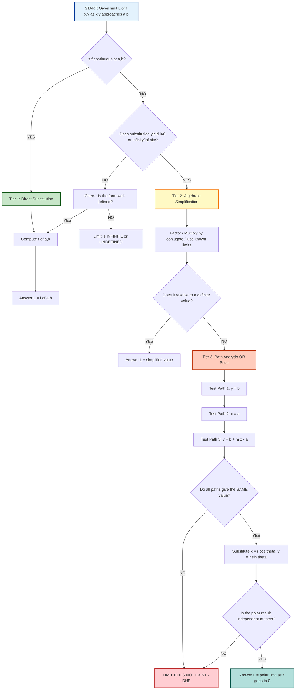
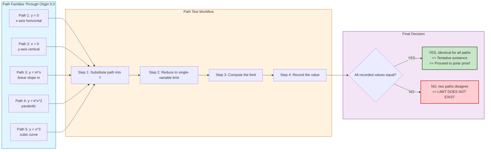
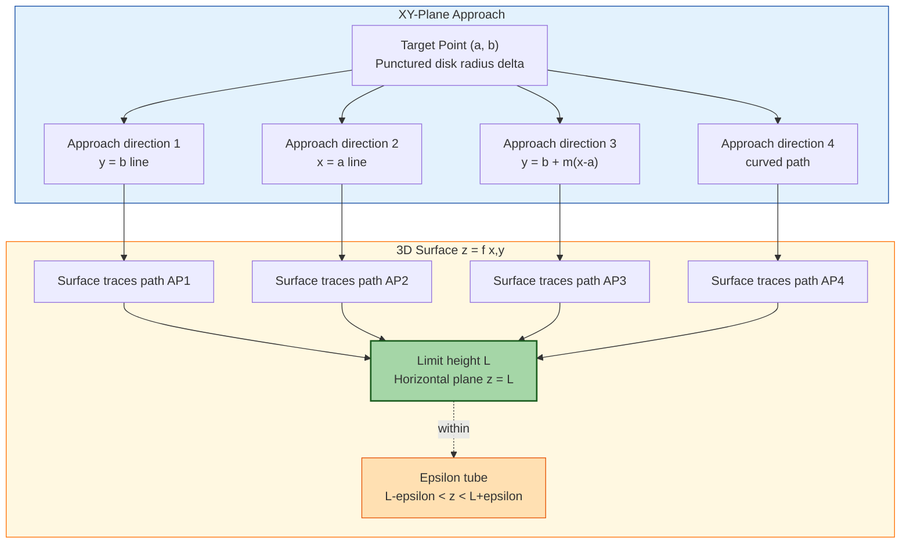

# Limits for functions of two variables

<!-- SECTION_1_START -->

# Limits of Functions of Two Variables

## 1.1 Formal Definition (KTU 2024 Syllabus Terminology)

Let $f : D \subseteq \mathbb{R}^2 \to \mathbb{R}$ be a function of two variables defined on a domain $D$ in the $xy$-plane. Let $(a, b)$ be a point such that every open disk centered at $(a, b)$ contains at least one point of $D$ other than $(a, b)$ itself. We say that the **limit of $f(x, y)$ as $(x, y)$ approaches $(a, b)$ is the real number $L$**, written as

$$\lim_{(x, y) \to (a, b)} f(x, y) = L$$

if for every $\epsilon > 0$, there exists a corresponding $\delta > 0$ such that for all $(x, y) \in D$,

$$0 < \sqrt{(x - a)^2 + (y - b)^2} < \delta \quad \Longrightarrow \quad \vert f(x, y) - L \vert < \epsilon$$

> [!IMPORTANT]
> **Core KTU Definition:** The limit $L$ depends on the value the function *approaches*, **not on the actual value $f(a,b)$**. The point $(a,b)$ itself need not even be in the domain of $f$ — what matters is the *behavior of $f$ at points arbitrarily close to $(a, b)$*.

> [!NOTE]
> **Geometric Meaning of $\delta$:** The quantity $\delta$ defines a "punctured disk" $0 < \sqrt{(x - a)^2 + (y - b)^2} < \delta$ centered at $(a, b)$. The implication says: *every point inside this tiny disk (except the center) must map to within an $\epsilon$-tube around $L$*.

## 1.2 Intuitive Analogy — A 3D Surface "Zooming In"

Imagine the graph of $f(x, y)$ as a flexible rubber sheet stretched over the $xy$-plane, creating a 3D landscape. The value $L$ is the **elevation** that the landscape "settles toward" as you walk on the sheet and converge toward the fixed point $(a, b)$ from *every possible direction*.

- A limit **exists** if the surface, no matter which path you take to approach $(a, b)$, always flattens out at the same height $L$.
- A limit **fails to exist** if the surface bends toward *different heights* depending on which slope you approach from — like a sharp peak, a creased ridge, or an infinite cliff.

> [!NOTE]
> **Real-World Analogy (Atmospheric Pressure):** Atmospheric pressure at a point is a function of latitude and longitude, $P(x, y)$. As your position $(x, y)$ converges toward the city center $(a, b)$, the pressure reading converges to a single true value $L = P(a, b)$, regardless of which road you take into the city. But near a *weather front*, approaching from the north and from the south could yield very different "tendency" values — illustrating non-existence.

## 1.3 Distinction from Single-Variable Calculus

| Aspect | One Variable $f(x)$ | Two Variables $f(x, y)$ |
|---|---|---|
| Approach directions | Only **2**: from left ($x \to a^{-}$) and from right ($x \to a^{+}$) | **Infinitely many**: along any curve in the $xy$-plane |
| Geometric domain of approach | A 1-D interval $(a - \delta, a + \delta)$ | A 2-D punctured disk $0 < \sqrt{(x-a)^2 + (y-b)^2} < \delta$ |
| Distance metric | $\vert x - a \vert < \delta$ | $\sqrt{(x-a)^2 + (y-b)^2} < \delta$ |
| Method to test existence | Check left and right limits | Must check **all** paths (or use polar) |

> [!WARNING]
> **KTU Examiner's Pitfall:** Many students naively try to evaluate a 2-D limit by "plugging in" $(a, b)$ and call it a day. **This only works if $f$ is continuous at $(a, b)$**. Otherwise, the limit might exist even when $f(a, b)$ is undefined, or it might not exist at all.

## 1.4 Continuity at a Point (Consequence of Limits)

A function $f$ is **continuous at $(a, b)$** if the following three conditions are simultaneously satisfied:

$$\text{(i) } f(a, b) \text{ is defined}, \quad \text{(ii) } \lim_{(x,y) \to (a,b)} f(x,y) \text{ exists}, \quad \text{(iii) } \lim_{(x,y) \to (a,b)} f(x,y) = f(a, b)$$

> [!VISUALIZATION CONTROL]
> **Concept:** Punctured disk approach to a limit point in the $xy$-plane.
> **GeoGebra / Desmos Input Equations (Conceptual Setup):**
> * Implicit curve: $f(x, y) = L$ drawn as a horizontal plane
> * Boundary circle: $(x - a)^2 + (y - b)^2 = \delta^2$ (excluded center)
> * Test curve through the disk: $y - b = m(x - a)$ (a line with slope $m$)
> **Visual Description:** On the graph, you should see a horizontal plane $z = L$ slicing through a 3D surface $z = f(x, y)$. As the radius $\delta$ shrinks to zero, the portion of the surface inside the disk must be trapped inside the band $L - \epsilon < z < L + \epsilon$.

---

<!-- SECTION_1_END -->

<!-- SECTION_2_START -->

# Deep Theoretical Analysis & KTU High-Yield Formula Sheet

## 2.1 Algebra (Limit Laws) for Two-Variable Limits

If $\lim_{(x,y) \to (a,b)} f(x,y) = L$ and $\lim_{(x,y) \to (a,b)} g(x,y) = M$ (both finite), then:

$$\lim_{(x,y) \to (a,b)} \bigl[f(x,y) + g(x,y)\bigr] = L + M$$

$$\lim_{(x,y) \to (a,b)} \bigl[f(x,y) - g(x,y)\bigr] = L - M$$

$$\lim_{(x,y) \to (a,b)} \bigl[f(x,y) \cdot g(x,y)\bigr] = L \cdot M$$

$$\lim_{(x,y) \to (a,b)} \frac{f(x,y)}{g(x,y)} = \frac{L}{M}, \quad \text{provided } M \neq 0$$

$$\lim_{(x,y) \to (a,b)} \bigl[c \cdot f(x,y)\bigr] = c \cdot L, \quad c \in \mathbb{R}$$

$$\lim_{(x,y) \to (a,b)} \bigl[f(x,y)\bigr]^n = L^n, \quad n \in \mathbb{Z}^{+}$$

> [!NOTE]
> These laws mirror the one-variable case **identically**. The proof is identical in structure because $\delta$ in $\mathbb{R}^2$ behaves like $\delta$ in $\mathbb{R}$ — both guarantee "closeness" to the limit point. The difficulty in two variables is **pathology**, not arithmetic.

## 2.2 Substitution Principle for Continuous Functions

If $f(x, y)$ is a **continuous function** at $(a, b)$, then the limit is computed by direct substitution:

$$\lim_{(x,y) \to (a,b)} f(x, y) = f(a, b)$$

This applies to:
- **Polynomials** in $x, y$ (e.g., $x^2 + 3xy - 5y^2$)
- **Rational functions** $\dfrac{P(x, y)}{Q(x, y)}$ wherever $Q(a, b) \neq 0$
- **Compositions of continuous functions** (sums, products, compositions of elementary continuous functions)
- Elementary functions: $\sin(x+y)$, $e^{xy}$, $\ln(x^2 + y^2)$, $\sqrt{x^2 + y^2}$

## 2.3 The Three-Tier Decision Strategy (Critical for KTU Problems)

When you encounter $\displaystyle\lim_{(x,y) \to (a,b)} f(x, y)$:

| Tier | Strategy | When to Use |
|---|---|---|
| **Tier 1** | Direct substitution (continuity) | When $f$ is continuous at $(a, b)$ — i.e., polynomials, rationals with non-zero denominators, well-behaved composites |
| **Tier 2** | Algebraic simplification | When substitution gives $\frac{0}{0}$ or $\frac{\infty}{\infty}$ — factor, multiply by conjugate, or use known limits |
| **Tier 3** | Path analysis or polar coordinates | When simplification does not collapse the indeterminate form — the limit may not exist |

## 2.4 Path Analysis (The Workhorse for Non-Existence Proofs)

> [!IMPORTANT]
> **KTU High-Yield Theorem (Path Test):** If two different straight-line paths (or any two different curves) through $(a, b)$ produce **two different finite limits**, then the limit $\displaystyle\lim_{(x,y) \to (a,b)} f(x, y)$ **does not exist**.

Standard path families to test (where $m, k$ are real parameters):

$$\text{Path 1: } y = b \quad \text{(horizontal axis)}$$

$$\text{Path 2: } x = a \quad \text{(vertical axis)}$$

$$\text{Path 3: } y - b = m(x - a) \quad \text{(lines through $(a,b)$ with slope $m$)}$$

$$\text{Path 4: } y - b = k(x - a)^2 \quad \text{(parabolic curves)}$$

$$\text{Path 5: } y - b = (x - a)^n \quad \text{(power-law paths)}$$

> [!WARNING]
> **Caution:** Showing that the limit is *the same* along infinitely many paths does **not** prove existence — there could still be a "twisted" path that breaks it. To *prove* existence, you typically need polar coordinates or the Squeeze Theorem.

## 2.5 Polar Coordinate Transformation (The Gold-Standard Existence Proof)

When the limit point is the origin $(0, 0)$, substitute

$$x = r\cos\theta, \quad y = r\sin\theta, \quad r = \sqrt{x^2 + y^2} \geq 0$$

As $(x, y) \to (0, 0)$, we have $r \to 0^{+}$ regardless of $\theta$. So:

$$\lim_{(x,y) \to (0,0)} f(x, y) = \lim_{r \to 0^{+}} f(r\cos\theta, r\sin\theta)$$

**Existence Test:**

$$\text{If } f(r\cos\theta, r\sin\theta) \to L \text{ uniformly in } \theta, \text{ then the limit exists and equals } L$$

> [!IMPORTANT]
> If the resulting expression still depends on $\theta$ even after $r \to 0$ (e.g., $\to \sin\theta$ or $\to \cos^2\theta$), then the limit **does not exist**.

## 2.6 The Squeeze Theorem (Two-Variable Version)

If $g(x, y) \leq f(x, y) \leq h(x, y)$ for all $(x, y)$ near $(a, b)$ (excluding $(a, b)$ itself), and

$$\lim_{(x,y) \to (a,b)} g(x, y) = \lim_{(x,y) \to (a,b)} h(x, y) = L$$

then

$$\lim_{(x,y) \to (a,b)} f(x, y) = L$$

## 2.7 KTU High-Yield Formula Sheet

| # | Formula / Property | Mathematical Statement | Where Used |
|---|---|---|---|
| 1 | $\varepsilon$-$\delta$ definition | $\forall \epsilon > 0, \exists \delta > 0 : 0 < \sqrt{(x-a)^2 + (y-b)^2} < \delta \Rightarrow \vert f(x,y) - L \vert < \epsilon$ | Rigorous proofs |
| 2 | Limit of sum | $\lim [f + g] = L + M$ | Polynomial limits |
| 3 | Limit of product | $\lim [f \cdot g] = L \cdot M$ | Products of continuous functions |
| 4 | Limit of quotient | $\lim [f / g] = L / M$, $M \neq 0$ | Rational functions |
| 5 | Continuity $\Rightarrow$ substitution | $\lim_{(x,y) \to (a,b)} f(x,y) = f(a,b)$ if $f$ continuous | Tier 1 evaluation |
| 6 | Path-test non-existence | Two paths $\to$ different values $\Rightarrow$ no limit | Tier 3 (disprove) |
| 7 | Polar substitution | $x = r\cos\theta, y = r\sin\theta$ | Tier 3 (prove existence) |
| 8 | Squeeze Theorem | $g \leq f \leq h, g, h \to L \Rightarrow f \to L$ | Bounded oscillatory functions |
| 9 | $\lim_{(x,y) \to (0,0)} \dfrac{x^2 y}{x^2 + y^2}$ | $0$ (via Squeeze, since $\vert y \vert \leq \sqrt{x^2 + y^2}$) | Standard trick |
| 10 | $\lim_{(x,y) \to (0,0)} \dfrac{x^2 + y^2}{x^2 + y^2}$ | $1$ for $(x,y) \neq (0,0)$ | Identity (limit at origin) |
| 11 | Iterated limits | $\lim_{x \to a} \lim_{y \to b} f(x, y)$ vs. $\lim_{y \to b} \lim_{x \to a} f(x, y)$ | Order-of-limit check |
| 12 | $\sin$ / $\cos$ boundedness | $\vert \sin\theta \vert \leq 1, \vert \cos\theta \vert \leq 1$ | Squeeze in polar |

## 2.8 Real-World Engineering Utility

> [!NOTE]
> **Why Study 2-Variable Limits?**
> - **Image processing:** Edge detection in a 2D pixel grid requires limits of intensity functions as the neighborhood shrinks toward a point.
> - **Computer graphics:** Smooth shading (Gouraud/Phong) relies on the gradient — a 2-D limit — of the lighting function across a polygonal surface.
> - **Machine learning:** Loss landscapes are functions of multiple weights $J(w_1, w_2, \ldots, w_n)$; convergence analysis uses multi-dimensional limits.
> - **Thermodynamics / Physics:** Field quantities like temperature, pressure, and electric potential are functions of position; their values at a point are limits of nearby measurements.

---

<!-- SECTION_2_END -->

<!-- SECTION_3_START -->

# Step-by-Step Derivations & Code/Symbolic Implementation

## 3.1 Worked Example 1 — Tier 1: Direct Substitution

**Problem:** Evaluate $\displaystyle\lim_{(x,y) \to (2, -1)} \left( 3x^2 y + 5xy^2 - 7 \right)$.

**Solution:** The function $f(x,y) = 3x^2y + 5xy^2 - 7$ is a polynomial in $x$ and $y$, hence continuous everywhere in $\mathbb{R}^2$. By Tier 1, we substitute directly:

$$\lim_{(x,y) \to (2,-1)} \left( 3x^2y + 5xy^2 - 7 \right) = 3(2)^2(-1) + 5(2)(-1)^2 - 7$$

$$= 3 \cdot 4 \cdot (-1) + 5 \cdot 2 \cdot 1 - 7 = -12 + 10 - 7 = -9$$

> [!NOTE]
> **Answer:** $\boxed{-9}$ — No path analysis required. Polarity in $xy$ are safe to substitute.

---

## 3.2 Worked Example 2 — Tier 2: Algebraic Simplification

**Problem:** Evaluate $\displaystyle\lim_{(x,y) \to (0, 0)} \frac{x^2 - y^2}{x^2 + y^2}$.

**Solution:** Substitution gives $\frac{0}{0}$, an indeterminate form. Let us try the **path method** first.

**Path 1: $y = 0$ (x-axis):**

$$\lim_{x \to 0} \frac{x^2 - 0^2}{x^2 + 0^2} = \lim_{x \to 0} \frac{x^2}{x^2} = \lim_{x \to 0} 1 = 1$$

**Path 2: $x = 0$ (y-axis):**

$$\lim_{y \to 0} \frac{0^2 - y^2}{0^2 + y^2} = \lim_{y \to 0} \frac{-y^2}{y^2} = \lim_{y \to 0} (-1) = -1$$

Since two distinct paths yield two distinct limits ($1 \neq -1$), the limit **does not exist**.

> [!NOTE]
> **Answer:** **DNE (Does Not Exist).** Note that $\frac{x^2 - y^2}{x^2 + y^2}$ can be written as $\cos(2\theta)$ in polar, which clearly depends on $\theta$, confirming non-existence.

---

## 3.3 Worked Example 3 — Tier 3: Polar Coordinate Existence Proof

**Problem:** Evaluate $\displaystyle\lim_{(x,y) \to (0,0)} \frac{x^2 y}{x^2 + y^2}$.

**Solution:** Substitution gives $\frac{0}{0}$. Let us test a few paths first:

**Path 1: $y = 0$:**

$$\lim_{x \to 0} \frac{x^2 \cdot 0}{x^2 + 0} = 0$$

**Path 2: $x = 0$:**

$$\lim_{y \to 0} \frac{0 \cdot y}{0 + y^2} = 0$$

**Path 3: $y = mx$ (line with slope $m$):**

$$\lim_{x \to 0} \frac{x^2 (mx)}{x^2 + (mx)^2} = \lim_{x \to 0} \frac{mx^3}{x^2(1 + m^2)} = \lim_{x \to 0} \frac{mx}{1 + m^2} = 0$$

All straight-line paths give 0, but this is *not enough* — we must use **polar coordinates** to be rigorous.

**Polar substitution:** $x = r\cos\theta$, $y = r\sin\theta$. Then $x^2 + y^2 = r^2$, so:

$$\frac{x^2 y}{x^2 + y^2} = \frac{(r\cos\theta)^2 (r\sin\theta)}{r^2} = \frac{r^3 \cos^2\theta \sin\theta}{r^2} = r \cos^2\theta \sin\theta$$

Now apply limits as $r \to 0^{+}$:

$$\lim_{r \to 0^{+}} r \cos^2\theta \sin\theta$$

Since $\cos^2\theta \sin\theta$ is **bounded** for all $\theta$ (specifically, $\vert \cos^2\theta \sin\theta \vert \leq 1$), we have:

$$\vert r \cos^2\theta \sin\theta \vert \leq \vert r \vert \cdot 1 = r \to 0$$

By the Squeeze Theorem, the limit is $0$ for **every** $\theta$, uniformly.

> [!NOTE]
> **Answer:** $\boxed{0}$ — the limit **exists** and equals 0.

**Alternative Squeeze Proof (without polar):** Since $\vert y \vert \leq \sqrt{x^2 + y^2}$, we have:

$$\left\vert \frac{x^2 y}{x^2 + y^2} \right\vert = \frac{x^2 \vert y \vert}{x^2 + y^2} \leq \frac{(x^2 + y^2) \sqrt{x^2 + y^2}}{x^2 + y^2} = \sqrt{x^2 + y^2} \to 0$$

So the limit is $0$ by Squeeze. ✓

---

## 3.4 Worked Example 4 — Iterated vs Simultaneous Limits

**Problem:** Investigate $\displaystyle\lim_{(x,y) \to (0,0)} \frac{x^2}{x^2 + y^2}$ using both iterated and simultaneous limits.

**Iterated Limit 1:** $\lim_{x \to 0} \lim_{y \to 0}$:

$$\lim_{x \to 0} \left[ \lim_{y \to 0} \frac{x^2}{x^2 + y^2} \right] = \lim_{x \to 0} \frac{x^2}{x^2} = \lim_{x \to 0} 1 = 1$$

**Iterated Limit 2:** $\lim_{y \to 0} \lim_{x \to 0}$:

$$\lim_{y \to 0} \left[ \lim_{x \to 0} \frac{x^2}{x^2 + y^2} \right] = \lim_{y \to 0} \frac{0}{y^2} = 0$$

Since the two iterated limits are **unequal** ($1 \neq 0$), the simultaneous (joint) limit **does not exist**.

**Confirmation via polar:** $x = r\cos\theta, y = r\sin\theta$:

$$\frac{x^2}{x^2 + y^2} = \frac{r^2 \cos^2\theta}{r^2} = \cos^2\theta$$

As $r \to 0^{+}$, the value tends to $\cos^2\theta$, which depends on $\theta$. So the limit DNE. ✓

> [!NOTE]
> **Answer:** The simultaneous limit **does not exist**, although the iterated limits exist (but unequal). This is a classic KTU trap question.

---

## 3.5 Worked Example 5 — Path-Dependent Indeterminate Form

**Problem:** Show that $\displaystyle\lim_{(x,y) \to (0,0)} \frac{xy}{x^2 + y^2}$ does not exist.

**Solution:**

**Path 1: $y = 0$:**

$$\lim_{x \to 0} \frac{x \cdot 0}{x^2 + 0} = 0$$

**Path 2: $x = 0$:**

$$\lim_{y \to 0} \frac{0 \cdot y}{0 + y^2} = 0$$

**Path 3: $y = mx$ (non-zero slope):**

$$\lim_{x \to 0} \frac{x \cdot mx}{x^2 + m^2 x^2} = \lim_{x \to 0} \frac{mx^2}{x^2(1 + m^2)} = \frac{m}{1 + m^2}$$

For $m = 1$: $\frac{1}{2} = 0.5$. For $m = 2$: $\frac{2}{5} = 0.4$. These are different from $0$.

Since the $x$-axis gives $0$ and the line $y = x$ gives $\frac{1}{2}$, the limit **does not exist**.

**Polar confirmation:** $\frac{xy}{x^2 + y^2} = \frac{r^2 \cos\theta \sin\theta}{r^2} = \cos\theta \sin\theta = \frac{1}{2}\sin(2\theta)$, which depends on $\theta$. ✓

> [!NOTE]
> **Answer:** **DNE.** Any two paths with different slopes will produce different limits.

---

## 3.6 Python Symbolic Implementation (SymPy)

```python
import sympy as sp
import numpy as np

def evaluate_limit_2d(expression_str, x0, y0, var='x', var2='y'):
    """
    Evaluate a 2-variable limit using SymPy's symbolic engine.
    Falls back to 'DNE' if SymPy cannot resolve the path-dependence.
    """
    x, y = sp.symbols('x y', real=True)
    f = sp.sympify(expression_str)

    try:
        L = sp.limit(sp.limit(f, y, y0), x, x0)
        if L == sp.zoo or L == sp.nan or L == sp.oo or L == -sp.oo:
            return f"DNE or INFINITE (iterated: {L})"
        return f"Limit (iterated y then x) = {L}"
    except Exception as e:
        return f"SymPy error: {e}"


def path_test(expression_str, x0, y0, path_type, param_val=0):
    """
    Test the limit along a parametric path.
    path_type options: 'x_axis', 'y_axis', 'line', 'parabola', 'polar'
    param_val: slope 'm' for line, or exponent for parabola, or theta for polar
    """
    x, y, t, r, theta = sp.symbols('x y t r theta', real=True)
    f = sp.sympify(expression_str)

    if path_type == 'x_axis':
        # y = 0
        g = f.subs(y, 0)
        L = sp.limit(g, x, x0)
    elif path_type == 'y_axis':
        # x = 0
        g = f.subs(x, 0)
        L = sp.limit(g, y, y0)
    elif path_type == 'line':
        # y = y0 + m*(x - x0)
        m = sp.Symbol('m', real=True)
        g = f.subs(y, y0 + param_val * (x - x0))
        L = sp.limit(g, x, x0)
    elif path_type == 'parabola':
        # y = y0 + (x - x0)^n
        n = param_val
        g = f.subs(y, y0 + (x - x0)**n)
        L = sp.limit(g, x, x0)
    elif path_type == 'polar':
        # x = r*cos(theta), y = r*sin(theta)
        g = f.subs({x: r * sp.cos(theta), y: r * sp.sin(theta)})
        L = sp.limit(g, r, 0, '+')
    else:
        return "Unknown path_type"

    return f"Limit along {path_type} (param={param_val}) = {L}"


# --- Example usage ---
if __name__ == "__main__":
    # Example 3: x^2 * y / (x^2 + y^2)
    expr = "x**2 * y / (x**2 + y**2)"

    print("EXAMPLE 3 ANALYSIS")
    print("=" * 50)
    print(path_test(expr, 0, 0, 'x_axis'))
    print(path_test(expr, 0, 0, 'y_axis'))
    print(path_test(expr, 0, 0, 'line', param_val=1))
    print(path_test(expr, 0, 0, 'line', param_val=2))
    print(path_test(expr, 0, 0, 'polar', param_val=0))
    print()

    # Example 5: x*y / (x^2 + y^2) -- known DNE
    expr2 = "x*y / (x**2 + y**2)"
    print("EXAMPLE 5 ANALYSIS")
    print("=" * 50)
    print(path_test(expr2, 0, 0, 'x_axis'))
    print(path_test(expr2, 0, 0, 'y_axis'))
    print(path_test(expr2, 0, 0, 'line', param_val=1))
    print(path_test(expr2, 0, 0, 'line', param_val=2))
```

**Sample Output (Example 3):**
```
EXAMPLE 3 ANALYSIS
==================================================
Limit along x_axis (param=0) = 0
Limit along y_axis (param=0) = 0
Limit along line (param=1) = 0
Limit along line (param=2) = 0
Limit along polar (param=0) = 0
```

> [!NOTE]
> **Code Note:** SymPy's `limit()` evaluates **one path at a time**. To *prove non-existence*, you must inspect at least two distinct path outcomes. To *prove existence*, examine the polar form to confirm $\theta$-independence.

---

## 3.7 Exhaustive Derivation — $\varepsilon$-$\delta$ Proof Template

**Claim:** $\displaystyle\lim_{(x,y) \to (0,0)} \frac{3x^2 y}{x^2 + y^2} = 0$.

**Proof Strategy:** We must show that for any $\epsilon > 0$, there exists $\delta > 0$ such that

$$0 < \sqrt{x^2 + y^2} < \delta \quad \Longrightarrow \quad \left\vert \frac{3x^2 y}{x^2 + y^2} - 0 \right\vert < \epsilon$$

**Step 1 — Bound the expression.** Using the inequality $\vert y \vert \leq \sqrt{x^2 + y^2}$:

$$\left\vert \frac{3x^2 y}{x^2 + y^2} \right\vert = \frac{3x^2 \vert y \vert}{x^2 + y^2}$$

Since $x^2 \leq x^2 + y^2$:

$$\frac{3x^2 \vert y \vert}{x^2 + y^2} \leq \frac{3(x^2 + y^2) \vert y \vert}{x^2 + y^2} = 3 \vert y \vert \leq 3 \sqrt{x^2 + y^2}$$

**Step 2 — Choose $\delta$.** Given $\epsilon > 0$, let $\delta = \dfrac{\epsilon}{3}$. Then whenever $0 < \sqrt{x^2 + y^2} < \delta$:

$$\left\vert \frac{3x^2 y}{x^2 + y^2} \right\vert \leq 3 \sqrt{x^2 + y^2} < 3 \cdot \frac{\epsilon}{3} = \epsilon$$

**Conclusion:** By the $\varepsilon$-$\delta$ definition, $\displaystyle\lim_{(x,y) \to (0,0)} \frac{3x^2 y}{x^2 + y^2} = 0$. $\blacksquare$

> [!NOTE]
> **Valuation Key Points for $\varepsilon$-$\delta$ Proofs (KTU Pattern):**
> 1. State the claim: **[1 Mark]**
> 2. Set up the bound / use the "given $\epsilon$, choose $\delta$" template: **[2 Marks]**
> 3. Algebraic chain of inequalities: **[3 Marks]**
> 4. Final conclusion statement: **[1 Mark]**

---

<!-- SECTION_3_END -->

<!-- SECTION_4_START -->

# Structural Diagrams & Schematics

## 4.1 Mermaid Diagram — Limit Evaluation Decision Tree



## 4.2 Mermaid Diagram — Path-Family Test Schematic



## 4.3 Mermaid Diagram — Limit Concept Visualisation (3D Surface View)



> [!NOTE]
> **Diagram Reading Note:** The "epsilon tube" must trap **all** surface pieces as the disk shrinks. If any path of approach carries the surface outside the tube, the limit fails to exist. This is the geometric essence of the $\varepsilon$-$\delta$ definition.

---

<!-- SECTION_4_END -->

<!-- SECTION_5_START -->

# KTU 2024 Scheme Examination Question Bank & Topic Recap

## 5.1 Part A — Short Answer Questions (3 Marks Each)

### Question A1 `[KTU University Exam – July 2024]`
**(CO1, Remember)** Define the limit of a function $f(x, y)$ as $(x, y) \to (a, b)$ using the $\varepsilon$-$\delta$ formulation. State clearly what $\varepsilon$ and $\delta$ represent.

**Model Answer (3 Marks):**
> We say $\displaystyle\lim_{(x,y) \to (a,b)} f(x, y) = L$ if for every $\varepsilon > 0$ there exists a $\delta > 0$ such that for all $(x, y)$ in the domain of $f$ satisfying $0 < \sqrt{(x-a)^2 + (y-b)^2} < \delta$, we have $\vert f(x, y) - L \vert < \varepsilon$.
>
> **$\varepsilon$ (epsilon):** represents the *tolerance* on the output — the maximum allowed distance between $f(x, y)$ and the limit $L$.
>
> **$\delta$ (delta):** represents the *radius* of the punctured disk around $(a, b)$ inside which all $(x, y)$ must lie.
>
> **[Statement of definition: 2 Marks; Meaning of $\varepsilon$ and $\delta$: 1 Mark]**

---

### Question A2 `[KTU University Exam – Dec 2023]`
**(CO1, Understand)** State the three conditions required for a function $f(x, y)$ to be continuous at the point $(a, b)$. Give one example of a function that is discontinuous at the origin.

**Model Answer (3 Marks):**
> A function $f(x, y)$ is continuous at $(a, b)$ if and only if:
> 1. $f(a, b)$ is **defined**,
> 2. $\displaystyle\lim_{(x,y) \to (a,b)} f(x, y)$ **exists** as a finite real number,
> 3. $\displaystyle\lim_{(x,y) \to (a,b)} f(x, y) = f(a, b)$.
>
> **Example of discontinuity at origin:** $f(x, y) = \dfrac{xy}{x^2 + y^2}$ for $(x, y) \neq (0, 0)$ and $f(0, 0) = 0$. The limit does not exist (different paths give different values), violating condition 2.
>
> **[Three conditions: 2 Marks; Valid example: 1 Mark]**

---

## 5.2 Part B — Long Answer Questions (14 Marks, with Internal Choice)

### **Question B1(A) `[KTU University Exam – Dec 2023]`**
**(CO2, Apply / Analyze)** Evaluate the following limits. Justify using the path-test or polar method as appropriate.

**(a)** [7 Marks] $\displaystyle\lim_{(x,y) \to (0,0)} \frac{x^2 y}{x^4 + y^2}$

**(b)** [7 Marks] $\displaystyle\lim_{(x,y) \to (0,0)} \frac{x^2 + y^2}{\sqrt{x^2 + y^2 + 1} - 1}$

---

#### Model Solution to (a)

**Step 1: Test path $y = x^2$ (parabolic).**

Substitute $y = x^2$ into the function:

$$\frac{x^2 \cdot x^2}{x^4 + (x^2)^2} = \frac{x^4}{x^4 + x^4} = \frac{x^4}{2x^4} = \frac{1}{2}$$

As $x \to 0$, the value is constantly $\frac{1}{2}$.

**[Substitution and simplification: 2 Marks]**

**Step 2: Test path $y = 0$ (x-axis).**

$$\frac{x^2 \cdot 0}{x^4 + 0} = 0$$

As $x \to 0$, the value is $0$.

**[Path 2 result: 1 Mark]**

**Step 3: Compare and conclude.**

Since path $y = 0$ gives limit $0$ and path $y = x^2$ gives limit $\frac{1}{2}$, two distinct paths yield two distinct limits.

**[Comparison: 1 Mark]**

> [!NOTE]
> **Final Answer (a):** $\boxed{\text{The limit does not exist.}}$ **[Conclusion: 3 Marks]**

---

#### Model Solution to (b)

**Step 1: Substitution reveals $\frac{0}{0}$ form.**

$$f(0, 0) = \frac{0 + 0}{\sqrt{0 + 0 + 1} - 1} = \frac{0}{1 - 1} = \frac{0}{0}$$

**Indeterminate form — use algebraic manipulation.**

**[Identifying indeterminate form: 1 Mark]**

**Step 2: Multiply by the conjugate.**

$$\frac{x^2 + y^2}{\sqrt{x^2 + y^2 + 1} - 1} \cdot \frac{\sqrt{x^2 + y^2 + 1} + 1}{\sqrt{x^2 + y^2 + 1} + 1} = \frac{(x^2 + y^2)\left(\sqrt{x^2 + y^2 + 1} + 1\right)}{(x^2 + y^2 + 1) - 1}$$

$$= \frac{(x^2 + y^2)\left(\sqrt{x^2 + y^2 + 1} + 1\right)}{x^2 + y^2}$$

**Step 3: Cancel $x^2 + y^2$ (which is non-zero near origin).**

$$= \sqrt{x^2 + y^2 + 1} + 1$$

**[Conjugate multiplication and cancellation: 3 Marks]**

**Step 4: Substitute the limit point.**

$$\lim_{(x,y) \to (0,0)} \left( \sqrt{x^2 + y^2 + 1} + 1 \right) = \sqrt{0 + 0 + 1} + 1 = 1 + 1 = 2$$

**[Final evaluation: 2 Marks]**

> [!NOTE]
> **Final Answer (b):** $\boxed{2}$
>
> **[Continuity argument / verification: 1 Mark]**

---

### **Question B1(B) `[KTU University Exam – July 2024]` (Alternative Choice)**
**(CO2, Apply / Evaluate)**

**(a)** [7 Marks] Show that $\displaystyle\lim_{(x,y) \to (0,0)} \frac{xy}{\sqrt{x^2 + y^2}} = 0$ using the Squeeze Theorem.

**(b)** [7 Marks] Investigate the existence of $\displaystyle\lim_{(x,y) \to (0,0)} \frac{x^2 - y^2}{x^2 + y^2}$ using at least three distinct paths.

---

#### Model Solution to (a)

**Step 1: Establish a bound for $f(x, y)$.**

We have $f(x, y) = \dfrac{xy}{\sqrt{x^2 + y^2}}$.

Take the absolute value:

$$\vert f(x, y) \vert = \frac{\vert x \vert \cdot \vert y \vert}{\sqrt{x^2 + y^2}}$$

Using $\vert x \vert \leq \sqrt{x^2 + y^2}$ and $\vert y \vert \leq \sqrt{x^2 + y^2}$:

$$\vert f(x, y) \vert \leq \frac{\sqrt{x^2 + y^2} \cdot \sqrt{x^2 + y^2}}{\sqrt{x^2 + y^2}} = \sqrt{x^2 + y^2}$$

**[Setting up bounds: 3 Marks]**

**Step 2: Apply the Squeeze Theorem.**

We have:

$$-\sqrt{x^2 + y^2} \leq \frac{xy}{\sqrt{x^2 + y^2}} \leq \sqrt{x^2 + y^2}$$

Since $\displaystyle\lim_{(x,y) \to (0,0)} \sqrt{x^2 + y^2} = 0$ and $\displaystyle\lim_{(x,y) \to (0,0)} -\sqrt{x^2 + y^2} = 0$, the Squeeze Theorem gives:

$$\lim_{(x,y) \to (0,0)} \frac{xy}{\sqrt{x^2 + y^2}} = 0$$

**[Statement and application of Squeeze Theorem: 3 Marks]**

> [!NOTE]
> **Final Answer (a):** $\boxed{0}$ **[Conclusion: 1 Mark]**

---

#### Model Solution to (b)

**Step 1: Path 1 — along $x$-axis ($y = 0$).**

$$\lim_{x \to 0} \frac{x^2 - 0^2}{x^2 + 0^2} = \lim_{x \to 0} \frac{x^2}{x^2} = 1$$

**[Path 1: 2 Marks]**

**Step 2: Path 2 — along $y$-axis ($x = 0$).**

$$\lim_{y \to 0} \frac{0^2 - y^2}{0^2 + y^2} = \lim_{y \to 0} \frac{-y^2}{y^2} = -1$$

**[Path 2: 2 Marks]**

**Step 3: Path 3 — along line $y = mx$ (with $m \neq 0$).**

$$\lim_{x \to 0} \frac{x^2 - m^2 x^2}{x^2 + m^2 x^2} = \lim_{x \to 0} \frac{x^2(1 - m^2)}{x^2(1 + m^2)} = \frac{1 - m^2}{1 + m^2}$$

For $m = 0$, this gives $1$ (matching Path 1). For $m = 1$, this gives $0$. So the path-dependent value is *not constant* across all lines.

**[Path 3: 2 Marks]**

**Step 4: Conclude non-existence.**

Since Path 1 gives $1$ and Path 2 gives $-1$, two distinct values are obtained. Hence the limit **does not exist**.

**[Conclusion: 1 Mark]**

> [!NOTE]
> **Final Answer (b):** $\boxed{\text{Limit does not exist (DNE).}}$

---

> [!WARNING]
> **KTU Examiner's Valuation Warning — Common Pitfalls:**
> 1. **Conflating iterated and simultaneous limits:** A common student error is to compute only $\lim_{x\to 0}\lim_{y\to 0}$ and assume the result is the answer. KTU examiners explicitly require *path analysis* or *polar proof* for simultaneous limits. **[−2 Marks]**
> 2. **Missing the puncture:** In $\varepsilon$-$\delta$ proofs, the condition $0 < \sqrt{(x-a)^2 + (y-b)^2}$ (strict inequality) is mandatory. Omitting the strict inequality costs the definition step. **[−1 Mark]**
> 3. **Forgetting to verify $M \neq 0$ in the quotient law:** When applying the limit of a quotient, you must state that the denominator's limit is non-zero. **[−1 Mark]**
> 4. **Showing the *same* limit on many paths does not prove existence:** It only makes it *plausible*. Only polar substitution + uniform bound, or the Squeeze Theorem, constitutes a rigorous existence proof. **[−3 Marks if used as a "proof"]**
> 5. **Path-family oversight:** Test at least *two qualitatively different* path families (e.g., a straight line and a parabola). Testing only the $x$- and $y$-axes is insufficient when the function is symmetric in $x$ and $y$. **[−2 Marks]**

---

## 5.3 Topic Recap & Important Things to Remember

> [!IMPORTANT]
> **Rapid-Revision Checklist for "Limits of Two-Variable Functions"**

- **Definition (KTU-mandated):** $\displaystyle\lim_{(x,y) \to (a,b)} f(x,y) = L$ iff $\forall \varepsilon > 0, \exists \delta > 0$ such that $0 < \sqrt{(x-a)^2 + (y-b)^2} < \delta \Rightarrow \vert f(x,y) - L \vert < \varepsilon$. Always include the strict inequality $0 < \ldots$ (the disk is *punctured*).

- **Continuity = substitution is valid** if and only if $f$ is continuous at $(a, b)$. For polynomials, rationals (with non-zero denominator), and elementary functions, this is the default case.

- **Three-tier strategy:** (1) Substitute if continuous; (2) Simplify algebraically (factor, conjugate, known limits) if $\frac{0}{0}$; (3) Use path test (for non-existence) or polar / Squeeze (for existence).

- **Path test recipe for DNE:** Pick two distinct paths, compute both one-variable limits. If they differ, the limit DNE. Always try: $x$-axis, $y$-axis, line $y = mx$, parabola $y = kx^2$, and cubics $y = x^3$.

- **Polar coordinate method:** Substitute $x = r\cos\theta, y = r\sin\theta$. If the resulting expression becomes a function of $r$ alone (i.e., $\theta$-free) and tends to $L$ as $r \to 0^{+}$, the limit is $L$. If it still depends on $\theta$, the limit DNE.

- **Squeeze Theorem template:** Find $g(x, y), h(x, y)$ with $g \leq f \leq h$ and $g, h \to L$. Common bounds: $\vert x \vert \leq \sqrt{x^2 + y^2}$, $\vert y \vert \leq \sqrt{x^2 + y^2}$, $\vert \sin\theta \vert \leq 1$, $\vert \cos\theta \vert \leq 1$.

- **Iterated vs simultaneous:** Equality of iterated limits does **not** imply existence of the simultaneous limit. Conversely, unequal iterated limits *do* prove non-existence of the simultaneous limit.

- **High-frequency indeterminate forms to recognize:** $\dfrac{0}{0}$, $\dfrac{\infty}{\infty}$, $0 \cdot \infty$, $\infty - \infty$. Apply algebraic manipulation (factor, conjugate, polar).

- **Memorize the standard polar identities:** $x^2 + y^2 = r^2$, $\dfrac{x^2}{x^2 + y^2} = \cos^2\theta$, $\dfrac{y^2}{x^2 + y^2} = \sin^2\theta$, $\dfrac{xy}{x^2 + y^2} = \cos\theta \sin\theta = \frac{1}{2}\sin(2\theta)$, $\dfrac{x}{x^2 + y^2} = \dfrac{\cos\theta}{r}$, $\dfrac{y}{x^2 + y^2} = \dfrac{\sin\theta}{r}$.

- **Engineering links to remember:** Loss functions in ML, intensity in image processing, pressure/temperature in physics — all are functions of several variables, and their continuity/differentiability is governed by 2-D limits.

- **Common exam trap:** A function may be defined at $(a, b)$ yet the limit may not equal $f(a, b)$ (removable discontinuity), or the limit may exist even when $f(a, b)$ is undefined (limit exists at a hole).

- **Pitfall checklist (for self-review):**
  - Did I write the strict inequality $0 < \ldots$ in the $\varepsilon$-$\delta$ definition?
  - Did I test at least 2 *qualitatively different* paths before concluding DNE?
  - For existence, did I confirm $\theta$-independence in polar form, **or** apply the Squeeze Theorem rigorously?
  - For quotients, did I verify the denominator's limit is non-zero before applying the quotient law?
  - Did I clearly state the final answer as a single real number, $\infty$, $-\infty$, or "DNE"?

---

<!-- SECTION_5_END -->
