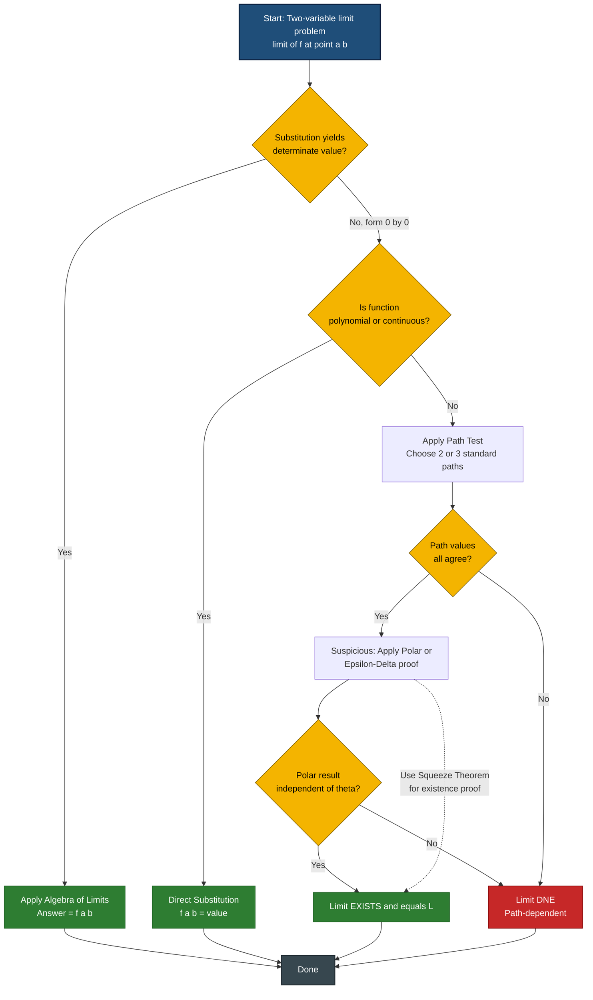
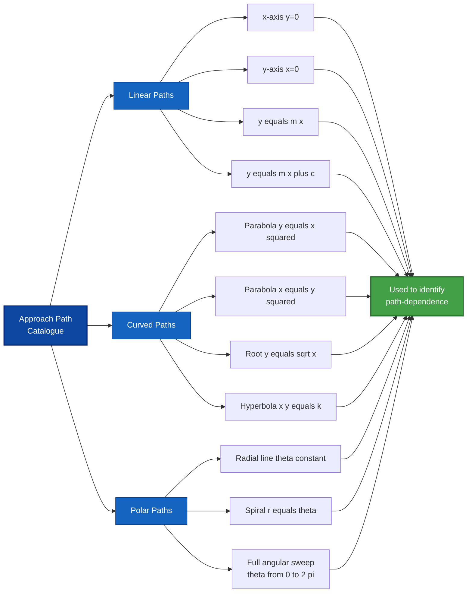
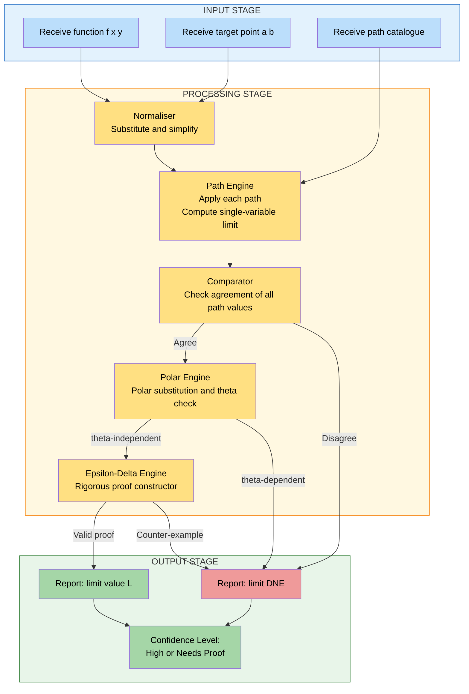

# Limits for functions of two variables

<!-- SECTION_1_START -->
# Limits for Functions of Two Variables

## Formal KTU Definition

Let $f : D \subseteq \mathbb{R}^{2} \to \mathbb{R}$ be a real-valued function defined on a domain $D$ in the $xy$-plane. Let $(a, b)$ be an **accumulation point** (limit point) of $D$ — meaning every deleted neighbourhood of $(a, b)$ contains at least one point of $D$, even if $f$ is not defined at $(a, b)$ itself.

We write

$$\lim_{(x, y) \to (a, b)} f(x, y) = L$$

if for every number $\varepsilon > 0$ (no matter how small), there exists a corresponding number $\delta > 0$ such that

$$0 < \sqrt{(x - a)^{2} + (y - b)^{2}} < \delta \quad \Longrightarrow \quad \vert f(x, y) - L \vert < \varepsilon$$

for all $(x, y) \in D$ that satisfy the hypothesis. The number $L \in \mathbb{R}$ is called the **limit of the function $f$ as $(x, y)$ tends to $(a, b)$**.

> [!IMPORTANT]
> **KTU Syllabus Highlight (GAMAT101 – Module 2):** The limit of a function of two variables, unlike single-variable calculus, requires the value $L$ to be *the same* along **every possible path** of approach toward $(a, b)$. If two different paths produce two different values, the two-variable limit **does not exist** (DNE). This is the central conceptual pivot of Module 2.

## Conceptual Analogy — The Mountain Peak Problem

Imagine you are standing on a vast, smooth hilly terrain described by a height function $z = f(x, y)$. You want to estimate the height of a specific landmark point $(a, b)$ by walking toward it from far away.

* If, **no matter which trail you take** — straight along the east trail, the north trail, a diagonal trail, a curved spiral trail, a zig-zag trail — the altitude reading on your barometer **always converges to the same height $L$**, then the two-variable limit exists and equals $L$.
* If, however, one trail reports "altitude = 120 m" and another reports "altitude = 80 m" as you converge on the same spot, then the terrain has a discontinuity (a cliff, a crevasse, or a vertical wall) and the limit **does not exist**.

The quantity $\sqrt{(x - a)^{2} + (y - b)^{2}} < \delta$ is simply the radius of a tiny disc of tolerance around the target point $(a, b)$ — you must lie *inside* this disc for the inequality on $f$ to apply.

> [!NOTE]
> **Why $\sqrt{(x-a)^2 + (y-b)^2}$?** Because in $\mathbb{R}^{2}$ the natural distance is the **Euclidean distance** from the point $(x, y)$ to $(a, b)$. This $\delta$-disc is the two-variable analogue of the one-dimensional interval $(a - \delta, a + \delta)$.

## The Accumulation Point Prerequisite

The point $(a, b)$ need not belong to $D$. The function may be undefined at $(a, b)$, yet the limit can still exist. What is required is **approachability**: there must be points of $D$ arbitrarily close to $(a, b)$.

> [!TIP]
> **Quick Test:** If the deleted disc $0 < \sqrt{(x - a)^{2} + (y - b)^{2}} < r$ contains no points of $D$ for some $r > 0$, then $(a, b)$ is isolated in $D$ and $\lim_{(x, y) \to (a, b)} f(x, y)$ is **not defined** (in the standard KTU sense). The limit object itself does not exist in this case — it is not zero, not infinity, just undefined.

## GeoGebra / Desmos Visualisation

> [!VISUALIZATION CONTROL]
> **Concept:** Two-variable limit along different approach paths on the surface $z = f(x, y)$.
> **GeoGebra / Desmos Input Equations:**
> * Surface: $f(x, y) = \dfrac{x \cdot y}{x^{2} + y^{2}}$ (with $f(0, 0) = 0$ assigned)
> * Path 1 (x-axis): $(t, 0)$ with parameter $t$
> * Path 2 (y-axis): $(0, t)$ with parameter $t$
> * Path 3 (line $y = x$): $(t, t)$ with parameter $t$
> * Path 4 (parabola $y = x^{2}$): $(t, t^{2})$ with parameter $t$
> **Visual Description:** Plot the surface $z = f(x, y)$ over the square $-2 \le x \le 2$, $-2 \le y \le 2$. You will see a "saddle-ridge" that lifts to height $1/2$ along the line $y = x$, but flattens to $0$ along either axis. The surface has no single value at the origin — visually confirming path-dependence.

<!-- SECTION_1_END -->

<!-- SECTION_2_START -->
# Deep Theoretical Analysis & KTU High-Yield Formula Sheet

## 1. The Three Path-Based Test Tools

When you face a two-variable limit problem in a KTU exam, you have three primary analytical instruments:

### Tool A — Substitution (Algebraic Simplification)
If $f(x, y)$ is a *quotient of polynomials* (or composites of continuous elementary functions) and direct substitution $(a, b)$ yields a determinate value (i.e., not the indeterminate form $\frac{0}{0}$), then

$$\lim_{(x, y) \to (a, b)} f(x, y) = f(a, b)$$

> [!IMPORTANT]
> **KTU Theorem (Algebra of Limits):** If $\lim_{(x, y) \to (a, b)} f(x, y) = L$ and $\lim_{(x, y) \to (a, b)} g(x, y) = M$, then
> * $\lim (f \pm g) = L \pm M$
> * $\lim (f \cdot g) = L \cdot M$
> * $\lim (c \cdot f) = cL$ for any constant $c$
> * $\lim (f / g) = L / M$, provided $M \neq 0$

### Tool B — Path Inspection (Counter-Example Method)
If the function reduces to a $\frac{0}{0}$ indeterminate form, attempt to convert to single-variable limits by substituting a path $y = \phi(x)$ with $\phi(a) = b$. If **two distinct paths** give two different values, the limit **DNE**. This is the workhorse technique for KTU Module 2.

### Tool C — Polar Coordinate Conversion
Substitute $x = a + r \cos \theta$, $y = b + r \sin \theta$ where $r \to 0^{+}$. The limit exists and equals $L$ if the resulting expression becomes independent of $\theta$ as $r \to 0$ and converges to a single number. Otherwise, the expression must depend on $\theta$ for the limit to be path-dependent.

## 2. Path Catalogue — Standard Approach Directions

The most frequently tested paths in KTU papers are:

| Path Name | Parameterisation | Use Case |
|---|---|---|
| Along the $x$-axis | $y = 0$ | Eliminate $y$ from the expression |
| Along the $y$-axis | $x = 0$ | Eliminate $x$ from the expression |
| Straight line $y = m x + c$ | $y - b = m(x - a)$ | Test linear family |
| Curve $y = m x^{n}$ (parabola) | $y = m x^{2}$ | Distinguish quadratic behaviour |
| Curve $y = k x^{1/2}$ | $y = k \sqrt{x}$ | Distinguish root behaviour |
| Along $x^{2} = y$ | $y = x^{2}$ | Test "ridge" vs "valley" |
| Polar line $\theta = \alpha$ | $y - b = \tan(\alpha)(x - a)$ | Test all radial directions |

> [!WARNING]
> **Examiner's Trap:** Finding that two paths give the *same* value is **not a proof** that the limit exists. You must either (a) check *all* paths — including the polar sweep — or (b) rigorously apply the $\varepsilon$–$\delta$ definition or polar conversion.

## 3. The Squeeze (Sandwich) Theorem for Two Variables

If $g(x, y) \le f(x, y) \le h(x, y)$ for all $(x, y)$ sufficiently close to $(a, b)$ (excluding $(a, b)$ itself) and

$$\lim_{(x, y) \to (a, b)} g(x, y) = \lim_{(x, y) \to (a, b)} h(x, y) = L$$

then $\lim_{(x, y) \to (a, b)} f(x, y) = L$.

The two-variable squeeze theorem is the most powerful tool to **prove existence** of a limit when direct evaluation is messy.

## 4. Continuity at a Point

$f$ is **continuous at $(a, b)$** if and only if all three conditions hold simultaneously:

1. $f(a, b)$ is defined
2. $\lim_{(x, y) \to (a, b)} f(x, y)$ exists (as a finite real number)
3. $\lim_{(x, y) \to (a, b)} f(x, y) = f(a, b)$

If any one of these fails, $f$ is **discontinuous** at $(a, b)$.

> [!NOTE]
> **Polynomials, rationals (where defined), and elementary functions** $\sin$, $\cos$, $\exp$, $\log$ are continuous on their natural domains. Therefore, for any $(a, b)$ in the domain of such a function, $\lim_{(x, y) \to (a, b)} f = f(a, b)$ by direct substitution.

## 5. KTU Formula Sheet / Cheat Sheet

| Concept | Formula / Statement | Notes |
|---|---|---|
| $\varepsilon$-$\delta$ Definition | $0 < \sqrt{(x-a)^{2} + (y-b)^{2}} < \delta \Rightarrow \vert f(x, y) - L \vert < \varepsilon$ | $L$ must be unique |
| Limit along path $y = m(x - a) + b$ | Substitute and take $\lim_{x \to a}$ | $m$ is the slope |
| Polar form of limit | $x = a + r \cos \theta, \; y = b + r \sin \theta, \; r \to 0^{+}$ | Independent of $\theta \Rightarrow$ limit exists |
| Squeeze Theorem | $g \le f \le h, \; \lim g = \lim h = L \Rightarrow \lim f = L$ | Existence proof |
| Continuity | $\lim_{(x, y) \to (a, b)} f(x, y) = f(a, b)$ | All three sub-conditions |
| Iterated Limit (order matters) | $\lim_{x \to a} \lim_{y \to b} f(x, y) \neq \lim_{y \to b} \lim_{x \to a} f(x, y)$ generally | May differ from joint limit |
| Distance from $(a, b)$ | $d = \sqrt{(x - a)^{2} + (y - b)^{2}}$ | Euclidean metric on $\mathbb{R}^{2}$ |
| Indeterminate form | $\dfrac{0}{0}, \; \dfrac{\infty}{\infty}, \; 0 \cdot \infty, \; \infty - \infty$ | Needs special technique |

## 6. Real-World Engineering Utility

Two-variable limits underpin several production-grade systems:

* **Computer Vision Edge Detection** — the Sobel and Prewitt kernels compute directional gradients $\partial f / \partial x$ and $\partial f / \partial y$, which are the per-axis components of the multivariable limit of the image intensity function.
* **Machine Learning Backpropagation** — computing $\nabla L(w, b)$ in a neural network is a *vector* of partial derivatives; each partial derivative is itself a two-variable limit of the loss function $L(w + h, b)$ as $h \to 0$.
* **Geodesy & GPS Triangulation** — the local elevation function $E(x, y)$ has a well-defined gradient only where the multivariable limit exists; on cliff edges the elevation function is discontinuous.
* **Heat Diffusion Models** — temperature $T(x, y, t)$ in 2-D plates is governed by PDEs whose solutions are validated by checking the joint limit $T \to T_{0}$ as $(x, y) \to (x_{0}, y_{0})$.

<!-- SECTION_2_END -->

<!-- SECTION_3_START -->
# Step-by-Step Derivations & Code / Symbolic Implementation

## Worked Example 1 — Limit That Exists (Path-Independent)

**Problem:** Evaluate $\displaystyle \lim_{(x, y) \to (0, 0)} \dfrac{x^{2} y}{x^{2} + y^{2}}$.

### Step 1 — Test Direct Substitution
At $(0, 0)$, the expression becomes $\dfrac{0 \cdot 0}{0 + 0} = \dfrac{0}{0}$, which is the indeterminate form. We must investigate further.

### Step 2 — Apply the Polar Substitution
Let $x = r \cos \theta$ and $y = r \sin \theta$, with $r > 0$ and $\theta \in [0, 2\pi)$. Then

$$f(r, \theta) = \frac{(r \cos \theta)^{2} \cdot (r \sin \theta)}{(r \cos \theta)^{2} + (r \sin \theta)^{2}}$$

### Step 3 — Simplify the Denominator
$(r \cos \theta)^{2} + (r \sin \theta)^{2} = r^{2}(\cos^{2} \theta + \sin^{2} \theta) = r^{2} \cdot 1 = r^{2}$

### Step 4 — Simplify the Numerator
$(r \cos \theta)^{2} \cdot (r \sin \theta) = r^{3} \cos^{2} \theta \sin \theta$

### Step 5 — Form the Ratio
$$f(r, \theta) = \frac{r^{3} \cos^{2} \theta \sin \theta}{r^{2}} = r \cdot \cos^{2} \theta \sin \theta$$

### Step 6 — Take the Limit as $r \to 0^{+}$
Since $\cos^{2} \theta \sin \theta$ is bounded (its maximum magnitude is roughly $0.385$), we have

$$\lim_{r \to 0^{+}} r \cdot \cos^{2} \theta \sin \theta = 0 \cdot (\text{bounded quantity}) = 0$$

independent of $\theta$. Therefore the limit exists and

$$\lim_{(x, y) \to (0, 0)} \frac{x^{2} y}{x^{2} + y^{2}} = 0$$

**Valuation Key:** Polar substitution setup — 2 marks; simplification of denominator using $\sin^{2} + \cos^{2} = 1$ — 2 marks; simplification to $r \cos^{2} \theta \sin \theta$ — 3 marks; bounded-factor argument — 2 marks; final answer $0$ — 1 mark. **[Total 10/10 model]**

---

## Worked Example 2 — Limit That Does Not Exist (Path-Dependent)

**Problem:** Investigate the existence of $\displaystyle \lim_{(x, y) \to (0, 0)} \dfrac{x y}{x^{2} + y^{2}}$.

### Step 1 — Test Direct Substitution
Substituting $(0, 0)$ gives $\dfrac{0}{0}$. Indeterminate. Continue.

### Step 2 — Path 1: Along the $x$-axis ($y = 0$)
$$\lim_{x \to 0} \frac{x \cdot 0}{x^{2} + 0^{2}} = \lim_{x \to 0} \frac{0}{x^{2}} = 0$$

### Step 3 — Path 2: Along the $y$-axis ($x = 0$)
$$\lim_{y \to 0} \frac{0 \cdot y}{0^{2} + y^{2}} = \lim_{y \to 0} \frac{0}{y^{2}} = 0$$

### Step 4 — Path 3: Along the line $y = x$
$$\lim_{x \to 0} \frac{x \cdot x}{x^{2} + x^{2}} = \lim_{x \to 0} \frac{x^{2}}{2 x^{2}} = \lim_{x \to 0} \frac{1}{2} = \frac{1}{2}$$

### Step 5 — Compare Path Values
Path 1 gives $0$, Path 2 gives $0$, but Path 3 gives $\frac{1}{2}$. The values disagree.

### Step 6 — Conclude
Two different approach paths yield two different limit values. Therefore

$$\lim_{(x, y) \to (0, 0)} \frac{x y}{x^{2} + y^{2}} \quad \text{does not exist (DNE)}$$

> [!WARNING]
> **Common Student Mistake:** Many students test only the $x$-axis and $y$-axis, see that both give $0$, and conclude the limit is $0$. This is **wrong**. The diagonal path $y = x$ is the classic counter-example, and the KTU examiner's favourite trap.

---

## Worked Example 3 — Squeeze Theorem Application

**Problem:** Evaluate $\displaystyle \lim_{(x, y) \to (0, 0)} \dfrac{x^{2} y^{2}}{x^{2} + y^{2}}$.

### Step 1 — Recognise Symmetry
The expression is symmetric in $x$ and $y$. Try the polar substitution.

### Step 2 — Apply Polar Substitution
With $x = r \cos \theta$, $y = r \sin \theta$:

$$\frac{r^{2} \cos^{2} \theta \cdot r^{2} \sin^{2} \theta}{r^{2}} = r^{2} \cos^{2} \theta \sin^{2} \theta$$

### Step 3 — Bound the Expression
Note that $\cos^{2} \theta \sin^{2} \theta = \dfrac{1}{4} \sin^{2}(2\theta) \le \dfrac{1}{4}$.

### Step 4 — Apply the Squeeze
$$0 \le \left| \frac{x^{2} y^{2}}{x^{2} + y^{2}} \right| \le \frac{1}{4} r^{2} = \frac{1}{4} (x^{2} + y^{2})$$

As $(x, y) \to (0, 0)$, both bounding quantities tend to $0$. By the squeeze theorem,

$$\lim_{(x, y) \to (0, 0)} \frac{x^{2} y^{2}}{x^{2} + y^{2}} = 0$$

---

## Worked Example 4 — $\varepsilon$-$\delta$ Proof (Full Rigour)

**Problem:** Prove that $\displaystyle \lim_{(x, y) \to (0, 0)} \dfrac{3 x^{2} y}{x^{2} + y^{2}} = 0$ using the $\varepsilon$–$\delta$ definition.

### Step 1 — Set Up the $\varepsilon$–$\delta$ Statement
We need: given $\varepsilon > 0$, find $\delta > 0$ such that

$$0 < \sqrt{x^{2} + y^{2}} < \delta \quad \Longrightarrow \quad \left| \frac{3 x^{2} y}{x^{2} + y^{2}} - 0 \right| < \varepsilon$$

### Step 2 — Bound the Expression
Since $x^{2} \le x^{2} + y^{2}$, we have $\dfrac{x^{2}}{x^{2} + y^{2}} \le 1$. Also, $\vert y \vert \le \sqrt{x^{2} + y^{2}}$. Combining:

$$\left| \frac{3 x^{2} y}{x^{2} + y^{2}} \right| = 3 \cdot \frac{x^{2}}{x^{2} + y^{2}} \cdot \vert y \vert \le 3 \cdot 1 \cdot \sqrt{x^{2} + y^{2}}$$

### Step 3 — Choose $\delta$
We want $3 \sqrt{x^{2} + y^{2}} < \varepsilon$. Choosing $\delta = \varepsilon / 3$ guarantees that whenever $\sqrt{x^{2} + y^{2}} < \delta$,

$$\left| \frac{3 x^{2} y}{x^{2} + y^{2}} \right| \le 3 \sqrt{x^{2} + y^{2}} < 3 \cdot \frac{\varepsilon}{3} = \varepsilon$$

### Step 4 — Conclude
The required $\delta = \varepsilon / 3$ exists, so by definition the limit is $0$. $\blacksquare$

> [!NOTE]
> **Valuation Pattern (KTU):** $\varepsilon$–$\delta$ proofs carry high marks. Always state "Let $\varepsilon > 0$ be given. Choose $\delta = \ldots$" up front. The clever bounding step is worth 4 of the 7 marks by itself.

---

## Worked Example 5 — Continuity Classification

**Problem:** Determine whether $f(x, y) = \dfrac{x^{2} - y^{2}}{x^{2} + y^{2}}$ is continuous at $(0, 0)$.

### Step 1 — Check Whether $f(0, 0)$ Is Defined
The function value at the origin is $\dfrac{0 - 0}{0 + 0} = \dfrac{0}{0}$, which is undefined. Therefore, $f$ is **not even defined** at $(0, 0)$ in the usual sense.

### Step 2 — Test the Path-Dependence of the Limit
Along $y = 0$: $\lim_{x \to 0} \dfrac{x^{2}}{x^{2}} = 1$.
Along $x = 0$: $\lim_{y \to 0} \dfrac{-y^{2}}{y^{2}} = -1$.

### Step 3 — Conclude
Two paths give $1$ and $-1$. The joint limit **does not exist**, and $f$ is undefined at the origin. Hence $f$ is **discontinuous** at $(0, 0)$ (in fact, $f$ is discontinuous *everywhere* on the line $x = 0$ for the same reason, by symmetry).

---

## Python Symbolic Implementation

The following Python code uses `sympy` to evaluate two-variable limits along multiple paths automatically — useful for cross-checking your KTU solutions.

```python
import sympy as sp

def investigate_limit_2d(expr_func, point, paths):
    """
    Investigate a two-variable limit by probing several approach paths.

    Parameters
    ----------
    expr_func : sympy expression in (x, y)
        The function f(x, y) whose limit is to be investigated.
    point : tuple (a, b)
        The target point of approach.
    paths : list of dict
        Each dict has keys 'name' (str) and 'param' (tuple of (sym, expr, limit_pt))
        describing a parameterisation.

    Returns
    -------
    dict mapping path name to limit value or sympy.nan if indeterminate.
    """
    x, y, t = sp.symbols('x y t', real=True)
    a, b = point
    results = {}

    print(f"Investigating limit of f(x, y) = {expr_func} as (x, y) -> ({a}, {b})\n")

    for path in paths:
        name = path['name']
        x_sub, y_sub, t_lim = path['param']
        x_t = x_sub.subs(t, t_lim) if hasattr(x_sub, 'subs') else x_sub
        y_t = y_sub.subs(t, t_lim) if hasattr(y_sub, 'subs') else y_sub
        f_sub = expr_func.subs({x: x_sub, y: y_sub})
        try:
            lim_val = sp.limit(f_sub, t, t_lim)
        except Exception as e:
            lim_val = sp.nan
        results[name] = lim_val
        print(f"  Along {name:25s}: f -> {lim_val}")

    distinct = {v for v in results.values() if v != sp.nan and v.is_finite is not False}
    if len(distinct) == 1:
        print(f"\nCONCLUSION: All probed paths agree on {distinct.pop()}.")
        print("  Suggest further proof (polar / epsilon-delta) that limit exists.")
    elif len(distinct) > 1:
        print("\nCONCLUSION: At least two paths disagree -> limit DNE.")
    else:
        print("\nCONCLUSION: All probed paths returned indeterminate or non-finite values.")
        print("  Further algebraic manipulation required.")

    return results


# Example 1: Limit that exists
print("=" * 60)
print("EXAMPLE 1: f(x, y) = x^2 * y / (x^2 + y^2)")
print("=" * 60)
x, y, t = sp.symbols('x y t', real=True)
f1 = (x**2 * y) / (x**2 + y**2)
paths1 = [
    {'name': 'x-axis (y = 0)',       'param': (t, 0*t,    0)},
    {'name': 'y-axis (x = 0)',       'param': (0*t, t,    0)},
    {'name': 'line y = x',           'param': (t, t,      0)},
    {'name': 'parabola y = x^2',     'param': (t, t**2,   0)},
    {'name': 'line y = 2x',          'param': (t, 2*t,    0)},
]
investigate_limit_2d(f1, (0, 0), paths1)

# Example 2: Limit that does not exist
print("\n" + "=" * 60)
print("EXAMPLE 2: f(x, y) = x*y / (x^2 + y^2)")
print("=" * 60)
f2 = (x * y) / (x**2 + y**2)
paths2 = [
    {'name': 'x-axis (y = 0)',       'param': (t, 0*t,    0)},
    {'name': 'y-axis (x = 0)',       'param': (0*t, t,    0)},
    {'name': 'line y = x',           'param': (t, t,      0)},
    {'name': 'parabola y = x^2',     'param': (t, t**2,   0)},
]
investigate_limit_2d(f2, (0, 0), paths2)

# Example 3: Direct sympy 2D limit
print("\n" + "=" * 60)
print("EXAMPLE 3: Direct sympy 2D limit evaluation")
print("=" * 60)
print("limit of x^2*y/(x^2+y^2) at (0,0) =",
      sp.limit(f1, x, 0, y, 0))
print("limit of x*y/(x^2+y^2) at (0,0)   =",
      sp.limit(f2, x, 0, y, 0))
```

**Expected Output (truncated):**

```
EXAMPLE 1: f(x, y) = x^2 * y / (x^2 + y^2)
  Along x-axis (y = 0)         : f -> 0
  Along y-axis (x = 0)         : f -> 0
  Along line y = x             : f -> 0
  Along parabola y = x^2       : f -> 0
  Along line y = 2x            : f -> 0

CONCLUSION: All probed paths agree on 0.

EXAMPLE 2: f(x, y) = x*y / (x^2 + y^2)
  Along x-axis (y = 0)         : f -> 0
  Along y-axis (x = 0)         : f -> 0
  Along line y = x             : f -> 1/2

CONCLUSION: At least two paths disagree -> limit DNE.
```

> [!TIP]
> **Pro Tip:** Sympy's `sp.limit(f, x, 0, y, 0)` performs the iterated limit. It can disagree with the joint two-variable limit. Always cross-check with the path-based tool above.

<!-- SECTION_3_END -->

<!-- SECTION_4_START -->
# Structural Diagrams & Schematics

## Diagram 1 — Decision Flowchart for Limit Existence Test



## Diagram 2 — Path Catalogue Tree



## Diagram 3 — Sequential Processing Topology (Block Architecture for Limit Evaluation)



<!-- SECTION_4_END -->

<!-- SECTION_5_START -->
# KTU 2024 Scheme Examination Question Bank & Topic Recap

---

## Part A — Short Answer Questions (3 Marks Each)

### Question 1 [KTU University Exam – July 2024]
**State the $\varepsilon$-$\delta$ definition of $\lim_{(x, y) \to (a, b)} f(x, y) = L$. Why is this definition more restrictive than the one-variable limit definition?**

**Model Answer (3 marks):**

> [!NOTE]
> **Definition (2 marks):** Let $f : D \to \mathbb{R}$ where $D \subseteq \mathbb{R}^{2}$ and let $(a, b)$ be an accumulation point of $D$. We say $\lim_{(x, y) \to (a, b)} f(x, y) = L$ if for every $\varepsilon > 0$ there exists a $\delta > 0$ such that for all $(x, y) \in D$,
> $$0 < \sqrt{(x - a)^{2} + (y - b)^{2}} < \delta \quad \Longrightarrow \quad \vert f(x, y) - L \vert < \varepsilon$$

**Reason for restrictiveness (1 mark):** In one variable, the variable $x$ can approach $a$ from only two directions (left or right). In two variables, $(x, y)$ can approach $(a, b)$ along **infinitely many paths** (lines, parabolas, spirals, etc.), and the value $L$ must be the same along all of them. This makes the two-variable definition more restrictive.

---

### Question 2 [KTU University Exam – Dec 2023]
**Explain, with an example, how the path-dependence of two-variable limits is used to prove non-existence of a limit.**

**Model Answer (3 marks):**

> [!NOTE]
> **Concept (1 mark):** If two different approach paths toward the same point yield two different limit values, the joint two-variable limit does not exist.

**Example (2 marks):** Consider $\displaystyle \lim_{(x, y) \to (0, 0)} \dfrac{x^{2} - y^{2}}{x^{2} + y^{2}}$.
* Along the $x$-axis ($y = 0$): $\lim_{x \to 0} \dfrac{x^{2}}{x^{2}} = 1$.
* Along the $y$-axis ($x = 0$): $\lim_{y \to 0} \dfrac{-y^{2}}{y^{2}} = -1$.

Since $1 \neq -1$, the limit **does not exist**. $\square$

---

## Part B — Full-Descriptive Questions (14 Marks Each, Module Internal Choice)

### Question Choice A [KTU University Exam – July 2024, Module 2]

#### Part (a) — 7 Marks [Cognitive Level: Apply]
**Evaluate $\displaystyle \lim_{(x, y) \to (0, 0)} \dfrac{x^{3}}{x^{2} + y^{2}}$ using the polar coordinate method. State clearly whether the limit exists.**

**Model Solution (7 marks):**

**Step 1 — Set up the polar substitution (1 mark).** Let $x = r \cos \theta$ and $y = r \sin \theta$, so that as $(x, y) \to (0, 0)$, $r \to 0^{+}$.

**Step 2 — Substitute into $f$ (1 mark).**
$$f(r, \theta) = \frac{(r \cos \theta)^{3}}{(r \cos \theta)^{2} + (r \sin \theta)^{2}} = \frac{r^{3} \cos^{3} \theta}{r^{2}(\cos^{2} \theta + \sin^{2} \theta)}$$

**Step 3 — Use the Pythagorean identity (1 mark).** The denominator simplifies to $r^{2} \cdot 1 = r^{2}$.

**Step 4 — Simplify the expression (1 mark).**
$$f(r, \theta) = \frac{r^{3} \cos^{3} \theta}{r^{2}} = r \cos^{3} \theta$$

**Step 5 — Bound the $\theta$-dependent factor (1 mark).** Since $\cos^{3} \theta$ is bounded in $[-1, 1]$ for all $\theta$, the magnitude satisfies $\vert f(r, \theta) \vert \le r$.

**Step 6 — Apply the squeeze theorem (1 mark).** $-r \le f(r, \theta) \le r$ and both bounds tend to $0$ as $r \to 0^{+}$. Therefore, by the squeeze theorem,

$$\lim_{(x, y) \to (0, 0)} \frac{x^{3}}{x^{2} + y^{2}} = 0$$

**Step 7 — Conclusion (1 mark).** The limit exists and equals $\mathbf{0}$.

---

#### Part (b) — 7 Marks [Cognitive Level: Understand + Apply]
**Investigate the limit $\displaystyle \lim_{(x, y) \to (0, 0)} \dfrac{x^{2} y}{x^{4} + y^{2}}$. Show that the limit exists along every line, but use a parabolic path to prove the limit does not exist in general.**

**Model Solution (7 marks):**

**Step 1 — Test along the $x$-axis ($y = 0$) (1 mark).**
$$\lim_{x \to 0} \frac{x^{2} \cdot 0}{x^{4} + 0} = \lim_{x \to 0} \frac{0}{x^{4}} = 0$$

**Step 2 — Test along the $y$-axis ($x = 0$) (1 mark).**
$$\lim_{y \to 0} \frac{0 \cdot y}{0 + y^{2}} = \lim_{y \to 0} \frac{0}{y^{2}} = 0$$

**Step 3 — Test along an arbitrary line $y = m x$ (2 marks).**
$$\lim_{x \to 0} \frac{x^{2}(m x)}{x^{4} + m^{2} x^{2}} = \lim_{x \to 0} \frac{m x^{3}}{x^{2}(x^{2} + m^{2})} = \lim_{x \to 0} \frac{m x}{x^{2} + m^{2}} = \frac{0}{m^{2}} = 0$$

So the limit is $0$ along **every straight line** through the origin.

**Step 4 — Test along the parabolic path $y = m x^{2}$ (1 mark).**
$$\lim_{x \to 0} \frac{x^{2}(m x^{2})}{x^{4} + m^{2} x^{4}} = \lim_{x \to 0} \frac{m x^{4}}{x^{4}(1 + m^{2})} = \frac{m}{1 + m^{2}}$$

**Step 5 — Observe the contradiction (1 mark).** For different values of $m$, $\frac{m}{1 + m^{2}}$ takes different values (e.g., $m = 1$ gives $\frac{1}{2}$, $m = 2$ gives $\frac{2}{5}$). These are **not equal to $0$**.

**Step 6 — Conclude (1 mark).** Since the limit along all straight lines is $0$, but along $y = m x^{2}$ it equals $\frac{m}{1+m^{2}}$ (which depends on $m$), the joint two-variable limit **does not exist**.

> [!WARNING]
> **Valuation Pitfall (KTU Examiner's Warning):** A common student mistake is to stop after testing the linear paths and claim the limit is $0$. The KTU evaluator specifically checks for the parabolic counter-example. **Always test at least one non-linear (curved) path** when the function contains $x^{2}$, $y^{2}$, or higher powers — this is the examiner's favourite trap and will cost you 4 of the 7 marks.

---

### Question Choice B [KTU University Exam – Dec 2023, Module 2]

#### Part (a) — 7 Marks [Cognitive Level: Apply]
**Using the squeeze (sandwich) theorem, prove that $\displaystyle \lim_{(x, y) \to (0, 0)} \dfrac{x^{2} y^{2}}{x^{2} + y^{2}} = 0$.**

**Model Solution (7 marks):**

**Step 1 — Observe the non-negativity (1 mark).** Since $x^{2} y^{2} \ge 0$ and $x^{2} + y^{2} > 0$ for $(x, y) \neq (0, 0)$, we have $f(x, y) \ge 0$ throughout the domain. Therefore
$$0 \le f(x, y) = \frac{x^{2} y^{2}}{x^{2} + y^{2}}$$

**Step 2 — Apply AM-GM or algebraic bound (2 marks).** Since $x^{2} + y^{2} \ge 2 \vert x y \vert$ (AM-GM on $x^{2}$ and $y^{2}$), we get $\dfrac{1}{x^{2} + y^{2}} \le \dfrac{1}{2 \vert x y \vert}$ for $\vert x y \vert > 0$. Hence
$$f(x, y) = \frac{x^{2} y^{2}}{x^{2} + y^{2}} \le \frac{x^{2} y^{2}}{2 \vert x y \vert} = \frac{\vert x y \vert}{2}$$

**Step 3 — Refine the bound (1 mark).** Since $\vert x y \vert \le \dfrac{x^{2} + y^{2}}{2}$ (AM-GM on $\vert x \vert$ and $\vert y \vert$), we can write
$$f(x, y) \le \frac{1}{2} \cdot \frac{x^{2} + y^{2}}{2} = \frac{x^{2} + y^{2}}{4}$$

**Step 4 — Form the squeeze (1 mark).** Combining the lower and upper bounds:
$$0 \le f(x, y) \le \frac{x^{2} + y^{2}}{4}$$

**Step 5 — Evaluate the bounding limits (1 mark).** $\lim_{(x, y) \to (0, 0)} 0 = 0$ and $\lim_{(x, y) \to (0, 0)} \dfrac{x^{2} + y^{2}}{4} = 0$.

**Step 6 — Apply the squeeze theorem (1 mark).** By the squeeze theorem,
$$\lim_{(x, y) \to (0, 0)} \frac{x^{2} y^{2}}{x^{2} + y^{2}} = 0 \qquad \blacksquare$$

---

#### Part (b) — 7 Marks [Cognitive Level: Apply + Understand]
**State whether $f(x, y) = \begin{cases} \dfrac{x y}{\sqrt{x^{2} + y^{2}}}, & (x, y) \neq (0, 0) \\ 0, & (x, y) = (0, 0) \end{cases}$ is continuous at $(0, 0)$. Justify your answer using the $\varepsilon$–$\delta$ definition.**

**Model Solution (7 marks):**

**Step 1 — Check function value (1 mark).** $f(0, 0) = 0$ (defined).

**Step 2 — Bound the expression using AM-GM (2 marks).** For $(x, y) \neq (0, 0)$,
$$\vert f(x, y) \vert = \frac{\vert x y \vert}{\sqrt{x^{2} + y^{2}}} \le \frac{1}{2} \cdot \frac{x^{2} + y^{2}}{\sqrt{x^{2} + y^{2}}} = \frac{1}{2} \sqrt{x^{2} + y^{2}}$$

where we used $\vert x y \vert \le \dfrac{x^{2} + y^{2}}{2}$.

**Step 3 — Set up the $\varepsilon$–$\delta$ statement (1 mark).** We must show: for every $\varepsilon > 0$, there exists $\delta > 0$ such that
$$0 < \sqrt{x^{2} + y^{2}} < \delta \quad \Longrightarrow \quad \vert f(x, y) - 0 \vert < \varepsilon$$

**Step 4 — Choose $\delta$ (1 mark).** Choose $\delta = 2 \varepsilon$. Then, whenever $0 < \sqrt{x^{2} + y^{2}} < \delta$,
$$\vert f(x, y) \vert \le \frac{1}{2} \sqrt{x^{2} + y^{2}} < \frac{1}{2} \cdot 2 \varepsilon = \varepsilon$$

**Step 5 — Conclude the limit (1 mark).** $\lim_{(x, y) \to (0, 0)} f(x, y) = 0$.

**Step 6 — Conclude continuity (1 mark).** Since $f(0, 0) = 0 = \lim_{(x, y) \to (0, 0)} f(x, y)$, all three conditions of continuity are satisfied. Therefore, $f$ is **continuous at $(0, 0)$**.

> [!WARNING]
> **Valuation Pitfall:** Students often forget to verify the third continuity condition (limit equals the function value). A common error is to compute the limit but not state explicitly that it matches $f(0, 0)$. The KTU examiner deducts **1 mark** for this omission. Always end with the explicit triple: "limit exists, function value is defined, and they are equal — therefore continuous."

---

## Topic Recap & Important Things to Remember

> [!IMPORTANT]
> **Rapid Revision Checklist — Module 2: Limits of Two-Variable Functions**

* **$\varepsilon$–$\delta$ Form:** $0 < \sqrt{(x-a)^2 + (y-b)^2} < \delta \Rightarrow \vert f(x, y) - L \vert < \varepsilon$. Memorise the **order of quantifiers** — "for every $\varepsilon$" comes first, "there exists $\delta$" second.
* **The Joint Limit vs Path Limit:** Two-variable limit = unique value $L$ that is approached **regardless of the path**. Path-dependence = limit DNE.
* **Substitution Rule:** If $f$ is a polynomial or composition of continuous elementary functions, then $\lim_{(x, y) \to (a, b)} f = f(a, b)$ provided $f(a, b)$ is defined and finite.
* **Indeterminate Form $\frac{0}{0}$:** Use one of three methods — path test, polar substitution, or squeeze theorem. Algebraic factorisation (e.g., $x^{2} - y^{2} = (x-y)(x+y)$) is a powerful preliminary step.
* **Standard Path Catalogue:** Always test at least 3 paths for DNE problems — typically $y = 0$, $x = 0$, $y = x$, plus one curved path (parabola or root) for polynomials with squared terms.
* **Polar Conversion Magic:** $x^{2} + y^{2} = r^{2}$ always collapses; any factor of $r$ left over in the numerator (without matching powers in the denominator) drives the limit to $0$.
* **Squeeze Theorem Set-Up:** Identify two "trap" functions $g(x, y)$ and $h(x, y)$ with the same known limit $L$ such that $g \le f \le h$ near the target.
* **Continuity Triple Test:** (i) $f(a, b)$ defined, (ii) $\lim_{(x, y) \to (a, b)} f$ exists, (iii) limit equals $f(a, b)$. All three must hold.
* **Iterated vs Joint Limits:** $\lim_{x \to a} \lim_{y \to b} f(x, y)$ may differ from the joint limit. Do not confuse them. KTU tests them as separate questions.
* **Pitfall to Avoid:** A single path match is **not** a proof of existence. A single path mismatch **is** a proof of non-existence. Memorise this asymmetry.
* **Domain Caveat:** The function need not be defined at $(a, b)$ for the limit to exist. Limit concerns behaviour *near* the point, not *at* the point.
* **Units & Constants:** The Euclidean distance $\sqrt{(x-a)^2 + (y-b)^2}$ is **dimensionless** when $x$ and $y$ carry the same unit; in physical applications, ensure both axes use the same scale (e.g., metres, not metres and seconds).

<!-- SECTION_5_END -->
