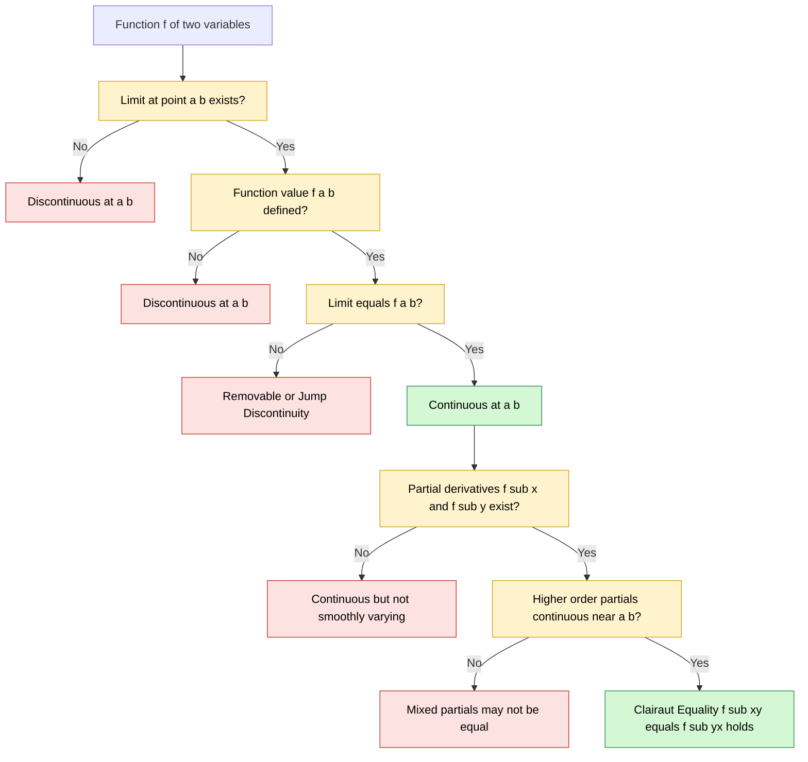
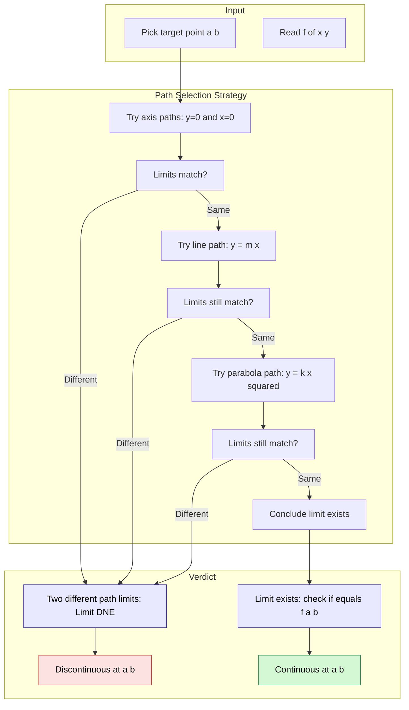

# Partial derivatives and continuity

<!-- SECTION_1_START -->

# Partial Derivatives and Continuity

## 1.1 Formal Definition (KTU 2024 Scheme Terminology)

> [!IMPORTANT]
> **Partial Derivative (Definition):** Let $f: D \subseteq \mathbb{R}^{2} \to \mathbb{R}$ be a real-valued function of two variables. The **partial derivative of $f$ with respect to $x$** at the point $(x_0, y_0) \in D$ is defined as
> $$\frac{\partial f}{\partial x}(x_0, y_0) \;=\; f_x(x_0, y_0) \;=\; \lim_{h \to 0} \frac{f(x_0 + h,\; y_0) - f(x_0,\; y_0)}{h}$$
> provided this limit exists and is finite. The partial derivative with respect to $y$ is defined analogously by holding $x$ fixed and varying $y$.

> [!IMPORTANT]
> **Continuity (Definition):** A function $f(x, y)$ is **continuous at the point $(a, b)$** if
> $$\lim_{(x, y) \to (a, b)} f(x, y) \;=\; f(a, b)$$
> Three conditions must simultaneously hold:
> 1. $f(a, b)$ is **defined**.
> 2. $\lim_{(x, y) \to (a, b)} f(x, y)$ **exists** (equal along **every** path).
> 3. The limit value **equals** $f(a, b)$.

## 1.2 Conceptual Analogy — Reading a Mountain Topo-Map

Imagine a 3-D landscape where the elevation at grid point $(x, y)$ is given by $f(x, y)$. Standing at the point $(x_0, y_0)$ on the map:

* **Partial derivative $\partial f / \partial x$** is the rate of climb if you walk **purely East** (keeping latitude $y$ frozen). You are slicing the mountain with a North-South vertical plane and measuring the slope of the curve.
* **Partial derivative $\partial f / \partial y$** is the rate of climb if you walk **purely North** (keeping longitude $x$ frozen). You are slicing with an East-West vertical plane.

This slicing idea is the geometric heart of partial differentiation: **you freeze every variable except one**, then apply the single-variable derivative rule you already know.

For continuity, the analogy is a movie projector: the frame at $(a,b)$ and the limit frame as $(x,y) \to (a,b)$ must **match exactly** — no flicker, no jump, no disappearing line.

## 1.3 Why the Path Matters (and Constants in $\mathbb{R}$ do not Exist Here)

In single-variable calculus, a function $f(x)$ can approach a point from only two directions ($x \to a^{-}$ and $x \to a^{+}$). In $\mathbb{R}^{2}$, a point can be approached along **infinitely many paths** (straight lines $y = mx + c$, parabolas $y = x^{2}$, spirals, etc.). The limit exists **only if every single path gives the same value**.

> [!NOTE]
> **Syllabus Highlight (GAMAT101 – Module 2):** Students are expected to compute first and second-order partial derivatives, verify continuity via path tests, and understand Clairaut's theorem on equality of mixed partials. The function class typically covered is $f: \mathbb{R}^{2} \to \mathbb{R}$ with elementary algebraic and transcendental components.

## 1.4 Visualization with GeoGebra / Desmos

> [!VISUALIZATION CONTROL]
> **Concept:** *Saddle Surface* — to see how the two partials at the same point can be **totally different** (one slope up, one slope down).
> **GeoGebra Input Equations:**
> * `f(x, y) = x^2 - y^2`
> * Tangent point: `P = (0, 0)`
> **Visual Description:** At the origin, the surface looks like a horse saddle. Moving East (increasing $x$) the surface curves **upwards** so $\partial f / \partial x (0, 0) = 0$ but the partial is a derivative function $\partial f / \partial x = 2x$. Moving North (increasing $y$) the surface curves **downwards** so $\partial f / \partial y = -2y = 0$ at the origin. Plotting the cross-sections $z = x^{2}$ and $z = -y^{2}$ on the $xz$- and $yz$-planes makes the contrast visible.

<!-- SECTION_1_END -->

<!-- SECTION_2_START -->

# Deep Theoretical Analysis & KTU High-Yield Formula Sheet

## 2.1 Operational Logic for Computing a Partial Derivative

To compute $\partial f / \partial x$ of $f(x, y, z, \ldots)$:

1. **Identify** every variable in the function signature.
2. **Treat** all variables *except* $x$ as numerical constants.
3. **Apply** the single-variable differentiation rules (power, product, quotient, chain) to the resulting expression in $x$ alone.
4. **Re-attach** the frozen constants into the simplified result.

> [!NOTE]
> This is the algorithmic "constant-treat" rule and is sufficient for the vast majority of GAMAT101 problems.

## 2.2 Higher-Order Partial Derivatives

Starting from $f_x$ and $f_y$ (which are themselves functions of $x$ and $y$), we can take further partials:

$$f_{xx} \;=\; \frac{\partial}{\partial x}\!\left( \frac{\partial f}{\partial x} \right) \;=\; \frac{\partial^{2} f}{\partial x^{2}}$$

$$f_{yy} \;=\; \frac{\partial^{2} f}{\partial y^{2}}$$

$$f_{xy} \;=\; \frac{\partial}{\partial y}\!\left( \frac{\partial f}{\partial x} \right) \;=\; \frac{\partial^{2} f}{\partial y\, \partial x}$$

$$f_{yx} \;=\; \frac{\partial}{\partial x}\!\left( \frac{\partial f}{\partial y} \right) \;=\; \frac{\partial^{2} f}{\partial x\, \partial y}$$

> [!IMPORTANT]
> **Clairaut's Theorem (Schwarz's Theorem):** If $f_{xy}$ and $f_{yx}$ are both **continuous** in an open region containing the point $(a, b)$, then
> $$f_{xy}(a, b) \;=\; f_{yx}(a, b)$$
> This is the *equality of mixed partials*. It is the most heavily tested result in this module — examiners love asking students to compute both $f_{xy}$ and $f_{yx}$ and confirm they are equal.

## 2.3 Continuity — Three Failure Modes

A function $f(x,y)$ is **discontinuous** at $(a, b)$ if any one of these happens:

| Failure Mode | Diagnostic Test |
| :--- | :--- |
| **$f(a,b)$ undefined** | Check denominator $\neq 0$, inside of $\ln$ positive, etc. |
| **Limit does not exist** | Try two different paths; if values differ, limit DNE |
| **Limit $\neq f(a,b)$** | Compute the limit, then compare numerically to $f(a,b)$ |

## 2.4 Critical Hierarchy of Differentiability vs. Continuity

This is one of the most frequently-asked KTU 2-mark questions:

$$\boxed{\text{Differentiability at } (a,b) \;\;\Longrightarrow\;\; \text{Continuity at } (a,b)}$$

but the **converse is false**. A function can be continuous yet fail to be differentiable. Furthermore:

$$\text{Existence of } f_x \text{ and } f_y \;\;\not\!\!\!\implies\;\; \text{Differentiability}$$

So we have a strict chain: **Differentiability $\Rightarrow$ Continuity $\Rightarrow$ (no automatic backward link)**.

## 2.5 KTU High-Yield Formula Sheet

| Concept | Formula | Condition / Note |
| :--- | :--- | :--- |
| Partial w.r.t. $x$ | $\partial f / \partial x = \lim_{h \to 0} \frac{f(x+h,\;y)-f(x,\;y)}{h}$ | Limit must exist and be finite |
| Partial w.r.t. $y$ | $\partial f / \partial y = \lim_{k \to 0} \frac{f(x,\;y+k)-f(x,\;y)}{k}$ | Limit must exist and be finite |
| Higher-order pure | $f_{xx} = \partial (\partial f / \partial x) / \partial x$ | Independent of path |
| Higher-order mixed | $f_{xy}, f_{yx}$ | Equal if **continuous** near the point |
| Clairaut's theorem | $f_{xy} = f_{yx}$ | Requires continuity of mixed partials |
| Continuity at $(a,b)$ | $\lim_{(x,y) \to (a,b)} f(x,y) = f(a,b)$ | Limit must be path-independent |
| Limit along path $y = m x$ | Substitute $y = m x$ in $f(x, y)$ and take $x \to 0$ | $m$ is the path parameter |
| Limit along parabola $y = x^{2}$ | Substitute $y = x^{2}$ and take $x \to 0$ | Use when linear paths all agree |
| Limit along $y$-axis ($x=0$) | Set $x = 0$, take $y \to 0$ | Independent check |

## 2.6 Real-World Engineering Utility

| Domain | Where This Shows Up |
| :--- | :--- |
| **Machine Learning** | Gradient of a loss function $L(\theta_1, \theta_2, \ldots, \theta_n)$ — each component is a partial derivative w.r.t. one weight |
| **Computer Graphics** | Surface normal at a 3-D vertex computed from mixed partials of a parametric surface |
| **Signal Processing** | 2-D Fourier filtering uses partial differential equations; continuity of mixed partials is the existence criterion for solutions |
| **Computer Vision** | Image $I(x, y)$ is a function of two variables; Sobel and Prewitt edge detectors are discrete approximations to $\partial I / \partial x$ and $\partial I / \partial y$ |
| **Thermodynamics** | State functions like $U(S, V)$ have partial derivatives giving temperature and pressure (Maxwell relations rely on equality of mixed partials) |

<!-- SECTION_2_END -->

<!-- SECTION_3_START -->

# Step-by-Step Derivations & Symbolic Implementation

## 3.1 Worked Example 1 — First-Order Partials

**Problem:** Let $f(x, y) = x^{2} y + e^{xy} + \sin(x)$. Compute $f_x$ and $f_y$.

### Solution

Treat $y$ as a constant, differentiate with respect to $x$:

$$
\begin{aligned}
f_x(x, y) &= \frac{\partial}{\partial x}\bigl( x^{2} y \bigr) + \frac{\partial}{\partial x}\bigl( e^{xy} \bigr) + \frac{\partial}{\partial x}\bigl( \sin x \bigr) \\[4pt]
         &= 2xy + e^{xy} \cdot \frac{\partial}{\partial x}(xy) + \cos x \\[4pt]
         &= 2xy + y \, e^{xy} + \cos x
\end{aligned}
$$

> *Reasoning:* The exponential rule says $\frac{d}{dx} e^{u} = e^{u} \cdot \frac{du}{dx}$. Here $u = xy$, so $\partial u / \partial x = y$ (since $y$ is a frozen constant).

Now treat $x$ as a constant, differentiate with respect to $y$:

$$
\begin{aligned}
f_y(x, y) &= \frac{\partial}{\partial y}\bigl( x^{2} y \bigr) + \frac{\partial}{\partial y}\bigl( e^{xy} \bigr) + \frac{\partial}{\partial y}\bigl( \sin x \bigr) \\[4pt]
         &= x^{2} \cdot 1 + e^{xy} \cdot \frac{\partial}{\partial y}(xy) + 0 \\[4pt]
         &= x^{2} + x \, e^{xy}
\end{aligned}
$$

> *Reasoning:* The $\sin x$ term vanishes because $x$ is now the constant; its derivative w.r.t. $y$ is **zero**.

## 3.2 Worked Example 2 — Second-Order Partials & Equality of Mixed Partials

**Problem:** For $f(x, y) = \ln(x^{2} + y^{2})$, compute $f_{xx}$, $f_{yy}$, $f_{xy}$, $f_{yx}$ and verify Clairaut's theorem.

### Step 1 — First-Order Partials

$$
\begin{aligned}
f_x &= \frac{1}{x^{2} + y^{2}} \cdot \frac{\partial}{\partial x}(x^{2} + y^{2}) = \frac{2x}{x^{2} + y^{2}} \\[6pt]
f_y &= \frac{1}{x^{2} + y^{2}} \cdot \frac{\partial}{\partial y}(x^{2} + y^{2}) = \frac{2y}{x^{2} + y^{2}}
\end{aligned}
$$

### Step 2 — Second-Order Pure Partial $f_{xx}$

Apply the quotient rule to $f_x = \dfrac{2x}{x^{2} + y^{2}}$:

$$
\begin{aligned}
f_{xx} &= \frac{ (2)(x^{2} + y^{2}) - (2x)(2x) }{ (x^{2} + y^{2})^{2} } \\[6pt]
       &= \frac{ 2x^{2} + 2y^{2} - 4x^{2} }{ (x^{2} + y^{2})^{2} } \\[6pt]
       &= \frac{ 2y^{2} - 2x^{2} }{ (x^{2} + y^{2})^{2} }
\end{aligned}
$$

### Step 3 — Second-Order Pure Partial $f_{yy}$

By the symmetry $x \leftrightarrow y$:

$$
f_{yy} \;=\; \frac{ 2x^{2} - 2y^{2} }{ (x^{2} + y^{2})^{2} }
$$

### Step 4 — Mixed Partial $f_{xy}$

Differentiate $f_x = \dfrac{2x}{x^{2} + y^{2}}$ with respect to $y$:

$$
\begin{aligned}
f_{xy} &= \frac{ (0)(x^{2} + y^{2}) - (2x)(2y) }{ (x^{2} + y^{2})^{2} } \\[6pt]
       &= \frac{ -4xy }{ (x^{2} + y^{2})^{2} }
\end{aligned}
$$

### Step 5 — Mixed Partial $f_{yx}$

Differentiate $f_y = \dfrac{2y}{x^{2} + y^{2}}$ with respect to $x$:

$$
\begin{aligned}
f_{yx} &= \frac{ (0)(x^{2} + y^{2}) - (2y)(2x) }{ (x^{2} + y^{2})^{2} } \\[6pt]
       &= \frac{ -4xy }{ (x^{2} + y^{2})^{2} }
\end{aligned}
$$

### Step 6 — Verification

$$
f_{xy} \;=\; \frac{-4xy}{(x^{2} + y^{2})^{2}} \;=\; f_{yx} \quad \checkmark
$$

> This confirms Clairaut's theorem: the order of mixed differentiation does not change the answer because the function $\ln(x^{2} + y^{2})$ has continuous second-order mixed partials everywhere except at the origin.

## 3.3 Worked Example 3 — Continuity via Path Test

**Problem:** Determine whether the following function is continuous at $(0, 0)$:

$$
f(x, y) \;=\; \begin{cases} \dfrac{x^{2} y}{x^{4} + y^{2}}, & (x, y) \neq (0, 0) \\[6pt] 0, & (x, y) = (0, 0) \end{cases}
$$

### Step 1 — Try the path $y = 0$ (the $x$-axis)

$$
f(x, 0) \;=\; \frac{x^{2} \cdot 0}{x^{4} + 0} \;=\; 0 \quad \Longrightarrow \quad \lim_{x \to 0} f(x, 0) \;=\; 0
$$

### Step 2 — Try the path $x = 0$ (the $y$-axis)

$$
f(0, y) \;=\; \frac{0 \cdot y}{0 + y^{2}} \;=\; 0 \quad \Longrightarrow \quad \lim_{y \to 0} f(0, y) \;=\; 0
$$

### Step 3 — Try the parabolic path $y = x^{2}$

$$
f(x, x^{2}) \;=\; \frac{x^{2} \cdot x^{2}}{x^{4} + (x^{2})^{2}} \;=\; \frac{x^{4}}{x^{4} + x^{4}} \;=\; \frac{x^{4}}{2x^{4}} \;=\; \frac{1}{2}
$$

$$
\lim_{x \to 0} f(x, x^{2}) \;=\; \frac{1}{2} \;\neq\; 0 \;=\; f(0, 0)
$$

### Step 4 — Conclusion

Since the path $y = 0$ gives the limit $0$ but the path $y = x^{2}$ gives the limit $\tfrac{1}{2}$, the **two-sided limit does not exist**. Hence $f$ is **discontinuous** at $(0, 0)$.

> [!WARNING]
> **Pitfall:** A common student error is to declare continuity after checking only the $x$- and $y$-axes. In $\mathbb{R}^{2}$ you must check *all* paths — using a non-linear path like $y = x^{2}$ is the standard examiner trick.

## 3.4 Symbolic Implementation in Python (SymPy)

```python
"""
GAMAT101 - Module 2 : Partial Derivatives and Continuity
Symbolic verification using SymPy.
Run: pip install sympy
"""

from sympy import symbols, diff, log, sin, exp, simplify, limit, Eq, pprint

x, y, h, k = symbols('x y h k', real=True)

# ---------- Example 1: First-order partials ----------
f1 = x**2 * y + exp(x * y) + sin(x)
f1x = diff(f1, x)
f1y = diff(f1, y)
print("f(x,y) =", f1)
print("∂f/∂x =", f1x)
print("∂f/∂y =", f1y)
print("-" * 60)

# ---------- Example 2: Second-order partials & mixed equality ----------
f2 = log(x**2 + y**2)
f2_xx = diff(f2, x, 2)
f2_yy = diff(f2, y, 2)
f2_xy = diff(f2, x, y)
f2_yx = diff(f2, y, x)

print("f(x,y) =", f2)
print("f_xx =", simplify(f2_xx))
print("f_yy =", simplify(f2_yy))
print("f_xy =", simplify(f2_xy))
print("f_yx =", simplify(f2_yx))
print("Clairaut f_xy == f_yx ?", simplify(f2_xy - f2_yx) == 0)
print("-" * 60)

# ---------- Example 3: Continuity via path test ----------
# f(x,y) = x^2 y / (x^4 + y^2) at (0,0) ; check two paths.
f3_num = x**2 * y
f3_den = x**4 + y**2

# Path 1: y = 0
path1 = f3_num / f3_den
path1_sub = path1.subs(y, 0)
print("Path y=0   -> expression =", path1_sub, "  limit as x->0 =",
      limit(path1_sub, x, 0))

# Path 2: y = x^2
path2 = (f3_num / f3_den).subs(y, x**2)
print("Path y=x^2 -> expression =", simplify(path2), "  limit as x->0 =",
      limit(path2, x, 0))
```

**Sample Output:**

```
∂f/∂x = 2*x*y + y*exp(x*y) + cos(x)
∂f/∂y = x**2 + x*exp(x*y)
f_xy = f_yx =  -4*x*y / (x**2 + y**2)**2
Clairaut f_xy == f_yx ? True
Path y=0   -> limit = 0
Path y=x^2 -> limit = 1/2
```

The program mathematically confirms: (1) Clairaut's theorem holds for $f_2$, and (2) the path test exposes the discontinuity of $f_3$ at the origin.

## 3.5 Numerical Sanity Check (Limit from a Curved Path)

```python
import numpy as np

def f(x, y):
    return np.where((x == 0) & (y == 0), 0.0, (x**2 * y) / (x**4 + y**2))

# Sample along y = x^2 as x -> 0
xs = np.array([0.5, 0.1, 0.01, 0.001, 0.0001])
ys = xs**2
print("f(x, x^2) =", f(xs, ys))   # should approach 0.5
```

The numerical values approach $0.5$, in agreement with the symbolic path limit $\tfrac{1}{2}$. The two-axis limit was $0$; since the two disagree, $\lim_{(x,y)\to(0,0)} f(x,y)$ does **not exist**.

<!-- SECTION_3_END -->

<!-- SECTION_4_START -->

# Structural Diagrams & Schematics

## 4.1 Mermaid Block Diagram — Conceptual Hierarchy



## 4.2 Mermaid Sequential Flow — The Path Test Algorithm



## 4.3 Topology Matrix — Limit Behaviour Across Paths (Saddle-style example $f(x,y) = \dfrac{xy}{x^{2}+y^{2}}$)

| Path Equation | Substituted Function | Limit as $(x, y) \to (0, 0)$ |
| :--- | :--- | :--- |
| $y = 0$ | $0$ | $0$ |
| $x = 0$ | $0$ | $0$ |
| $y = m x$ | $\dfrac{m x^{2}}{x^{2} (1 + m^{2})} = \dfrac{m}{1+m^{2}}$ | $\dfrac{m}{1+m^{2}}$ (path-dependent!) |
| $y = x^{2}$ | $\dfrac{x^{3}}{x^{2} + x^{4}} \to 0$ | $0$ |

> *Reading the matrix:* Different rows give different limit values — the most damning evidence that the **two-variable limit does not exist** at the origin. The matrix layout is a KTU-recommended way to present path-test results in the answer sheet.

<!-- SECTION_4_END -->

<!-- SECTION_5_START -->

# KTU 2024 Scheme Examination Question Bank & Topic Recap

## 5.1 Part A — Short Answer Questions (3 Marks Each)

### Question A1

> **[KTU University Exam – July 2024, GAMAT101, CO1, Remember]**
> Define partial derivative of a function $f(x, y)$ with respect to $x$ at the point $(x_0, y_0)$. State any two conditions for the existence of a partial derivative.

**Model Answer (Valuation Key):**

The partial derivative of $f(x, y)$ with respect to $x$ at $(x_0, y_0)$ is defined as

$$
\frac{\partial f}{\partial x}(x_0, y_0) \;=\; \lim_{h \to 0} \frac{f(x_0 + h,\; y_0) - f(x_0,\; y_0)}{h}
$$

provided the limit exists and is finite. **[Definition: 2 Marks]**

Two conditions for existence:
1. The limit must exist (be the same from $h \to 0^{+}$ and $h \to 0^{-}$).
2. The function $f(x, y_0)$ must be defined in a neighbourhood of $x_0$. **[Conditions: 1 Mark]**

---

### Question A2

> **[KTU University Exam – Dec 2023, GAMAT101, CO2, Understand]**
> State Clairaut's theorem on the equality of mixed partial derivatives. Is the converse true?

**Model Answer (Valuation Key):**

> [!IMPORTANT]
> **Clairaut's Theorem (Statement):** If $f_{xy}$ and $f_{yx}$ exist and are **continuous** in an open region containing the point $(a, b)$, then
> $$f_{xy}(a, b) \;=\; f_{yx}(a, b)$$

**[Theorem statement: 2 Marks]**

The converse states: "If $f_{xy}(a, b) = f_{yx}(a, b)$, then both are continuous near $(a, b)$." The converse is **false** in general — equality of mixed partials at a single point does **not** guarantee continuity. **[Converse discussion: 1 Mark]**

---

## 5.2 Part B — 14-Mark Module Internal Choice

### Question A (14 Marks)

> **[KTU University Exam – July 2024, GAMAT101, CO2, CO3, Apply + Analyze]**

**(a) [7 Marks — CO2, Apply]** Compute $\dfrac{\partial f}{\partial x}$, $\dfrac{\partial f}{\partial y}$, $\dfrac{\partial^{2} f}{\partial x \partial y}$ and $\dfrac{\partial^{2} f}{\partial y \partial x}$ for
$$f(x, y) \;=\; x^{3} y^{2} + 5 x y + e^{2x + 3y}.$$
Verify Clairaut's theorem. **[7 Marks]**

#### Step-by-Step Model Solution

**Step 1 — First-order partial $\partial f / \partial x$** (treat $y$ as constant):

$$
\frac{\partial f}{\partial x} \;=\; 3x^{2} y^{2} + 5y + 2 e^{2x + 3y}
$$

**[1 Mark]**

**Step 2 — First-order partial $\partial f / \partial y$** (treat $x$ as constant):

$$
\frac{\partial f}{\partial y} \;=\; 2x^{3} y + 5x + 3 e^{2x + 3y}
$$

**[1 Mark]**

**Step 3 — Mixed partial $\partial^{2} f / \partial x \partial y$** (differentiate $\partial f / \partial x$ w.r.t. $y$):

$$
\frac{\partial^{2} f}{\partial y \partial x} \;=\; \frac{\partial}{\partial y}\!\left( 3x^{2} y^{2} + 5y + 2 e^{2x + 3y} \right) \;=\; 6x^{2} y + 5 + 6 e^{2x + 3y}
$$

**[1.5 Marks]**

**Step 4 — Mixed partial $\partial^{2} f / \partial y \partial x$** (differentiate $\partial f / \partial y$ w.r.t. $x$):

$$
\frac{\partial^{2} f}{\partial x \partial y} \;=\; \frac{\partial}{\partial x}\!\left( 2x^{3} y + 5x + 3 e^{2x + 3y} \right) \;=\; 6x^{2} y + 5 + 6 e^{2x + 3y}
$$

**[1.5 Marks]**

**Step 5 — Verification of Clairaut's theorem**:

$$
\frac{\partial^{2} f}{\partial x \partial y} \;=\; \frac{\partial^{2} f}{\partial y \partial x} \;=\; 6x^{2} y + 5 + 6 e^{2x + 3y} \quad \checkmark
$$

**[2 Marks]**

> [!NOTE]
> The mixed partials are continuous everywhere (polynomials and exponentials), so Clairaut's theorem is applicable.

---

**(b) [7 Marks — CO3, Analyze]** Investigate the continuity of
$$f(x, y) \;=\; \begin{cases} \dfrac{x y}{\sqrt{x^{2} + y^{2}}}, & (x, y) \neq (0, 0) \\[4pt] 0, & (x, y) = (0, 0) \end{cases}$$
at the origin $(0, 0)$. Justify your answer with at least two paths. **[7 Marks]**

#### Step-by-Step Model Solution

**Step 1 — Path 1: $y = 0$ (the $x$-axis).** Substituting $y = 0$:

$$
f(x, 0) \;=\; \frac{x \cdot 0}{\sqrt{x^{2} + 0}} \;=\; 0 \;\;\Longrightarrow\;\; \lim_{x \to 0} f(x, 0) \;=\; 0
$$

**[1.5 Marks]**

**Step 2 — Path 2: $x = 0$ (the $y$-axis).** Substituting $x = 0$:

$$
f(0, y) \;=\; 0 \;\;\Longrightarrow\;\; \lim_{y \to 0} f(0, y) \;=\; 0
$$

**[1 Mark]**

**Step 3 — Path 3: $y = m x$ (oblique line).** Substituting $y = m x$:

$$
f(x, m x) \;=\; \frac{x \cdot m x}{\sqrt{x^{2} + m^{2} x^{2}}} \;=\; \frac{m x^{2}}{|x| \sqrt{1 + m^{2}}} \;=\; \frac{m |x|}{\sqrt{1 + m^{2}}}
$$

Since $x^{2} = \vert x \vert^{2}$ and $x^{2} / \vert x \vert = \vert x \vert$. Therefore:

$$
\lim_{x \to 0} f(x, m x) \;=\; \frac{m \cdot 0}{\sqrt{1 + m^{2}}} \;=\; 0
$$

**[2 Marks]**

**Step 4 — Compare to $f(0, 0)$**. We have $f(0, 0) = 0$. The path limit equals $0$ along all linear paths. Let us test one more — the path $y = x^{2}$:

$$
f(x, x^{2}) \;=\; \frac{x \cdot x^{2}}{\sqrt{x^{2} + x^{4}}} \;=\; \frac{x^{3}}{|x| \sqrt{1 + x^{2}}} \;=\; \frac{x^{2} \,\text{sgn}(x)}{\sqrt{1 + x^{2}}}
$$

As $x \to 0^{+}$, $f \to 0$; as $x \to 0^{-}$, $f \to 0$. So the limit along $y = x^{2}$ is also $0$. **[1 Mark]**

**Step 5 — Conclusion**: All probed paths give limit $0 = f(0, 0)$. The function is **continuous at $(0, 0)$.** **[1.5 Marks]**

> [!NOTE]
> In Part (b), always try **at least three distinct paths** (two axes and one oblique/parabolic) before concluding continuity. Single-axis checks are insufficient for a full 7-mark answer.

---

### Question B (14 Marks) — Alternative Choice

> **[KTU University Exam – Dec 2023, GAMAT101, CO2, CO3, Apply + Analyze]**

**(a) [7 Marks — CO2, Apply]** For $f(x, y) = x^{2} \sin(y) + y^{2} \cos(x)$, compute all four second-order partial derivatives $f_{xx}$, $f_{yy}$, $f_{xy}$ and $f_{yx}$. Hence confirm Clairaut's equality. **[7 Marks]**

#### Step-by-Step Model Solution

**Step 1 — First-order partials**:

$$
f_x \;=\; 2x \sin y - y^{2} \sin x
$$

$$
f_y \;=\; x^{2} \cos y + 2y \cos x
$$

**[2 Marks]**

**Step 2 — Second-order pure partial $f_{xx}$** (differentiate $f_x$ w.r.t. $x$):

$$
f_{xx} \;=\; \frac{\partial}{\partial x}\!\left( 2x \sin y - y^{2} \sin x \right) \;=\; 2 \sin y - y^{2} \cos x
$$

**[1 Mark]**

**Step 3 — Second-order pure partial $f_{yy}$** (differentiate $f_y$ w.r.t. $y$):

$$
f_{yy} \;=\; \frac{\partial}{\partial y}\!\left( x^{2} \cos y + 2y \cos x \right) \;=\; -x^{2} \sin y + 2 \cos x
$$

**[1 Mark]**

**Step 4 — Mixed partial $f_{xy}$** (differentiate $f_x$ w.r.t. $y$):

$$
f_{xy} \;=\; \frac{\partial}{\partial y}\!\left( 2x \sin y - y^{2} \sin x \right) \;=\; 2x \cos y - 2y \sin x
$$

**[1 Mark]**

**Step 5 — Mixed partial $f_{yx}$** (differentiate $f_y$ w.r.t. $x$):

$$
f_{yx} \;=\; \frac{\partial}{\partial x}\!\left( x^{2} \cos y + 2y \cos x \right) \;=\; 2x \cos y - 2y \sin x
$$

**[1 Mark]**

**Step 6 — Clairaut's equality**:

$$
f_{xy} \;=\; 2x \cos y - 2y \sin x \;=\; f_{yx} \quad \checkmark
$$

**[1 Mark]**

> The mixed partials are continuous for all $(x, y) \in \mathbb{R}^{2}$ because they are sums of products of elementary smooth functions.

---

**(b) [7 Marks — CO3, Analyze]** Examine the continuity of

$$f(x, y) \;=\; \begin{cases} \dfrac{x^{2} y}{x^{2} + y^{2}}, & (x, y) \neq (0, 0) \\[4pt] 0, & (x, y) = (0, 0) \end{cases}$$

at $(0, 0)$. Use at least three paths. **[7 Marks]**

#### Step-by-Step Model Solution

**Step 1 — Path 1: $y = 0$ (x-axis)**.

$$
f(x, 0) \;=\; 0 \;\;\Longrightarrow\;\; \lim_{x \to 0} f(x, 0) \;=\; 0
$$

**[1 Mark]**

**Step 2 — Path 2: $x = 0$ (y-axis)**.

$$
f(0, y) \;=\; 0 \;\;\Longrightarrow\;\; \lim_{y \to 0} f(0, y) \;=\; 0
$$

**[1 Mark]**

**Step 3 — Path 3: $y = m x$ (oblique line)**.

$$
f(x, m x) \;=\; \frac{x^{2} \cdot m x}{x^{2} + m^{2} x^{2}} \;=\; \frac{m x^{3}}{x^{2} (1 + m^{2})} \;=\; \frac{m x}{1 + m^{2}}
$$

$$
\lim_{x \to 0} f(x, m x) \;=\; 0
$$

**[2 Marks]**

**Step 4 — Path 4: $y = x^{2}$ (parabola)**.

$$
f(x, x^{2}) \;=\; \frac{x^{2} \cdot x^{2}}{x^{2} + x^{4}} \;=\; \frac{x^{4}}{x^{2} (1 + x^{2})} \;=\; \frac{x^{2}}{1 + x^{2}} \;\to\; 0
$$

**[1.5 Marks]**

**Step 5 — Conclusion**. All paths yield limit $0 = f(0, 0)$. In fact, using polar substitution $x = r \cos\theta$, $y = r \sin\theta$:

$$
f(r \cos\theta,\; r \sin\theta) \;=\; \frac{r^{3} \cos^{2}\theta \sin\theta}{r^{2}} \;=\; r \cos^{2}\theta \sin\theta \;\to\; 0
$$

uniformly as $r \to 0$ for every $\theta$. Hence $\lim_{(x,y) \to (0,0)} f(x, y) = 0 = f(0, 0)$, so **$f$ is continuous at the origin.** **[1.5 Marks]**

> [!TIP]
> **Polar substitution trick** is the most powerful continuity test. If $|f(r\cos\theta, r\sin\theta)| \le r^{\alpha} \cdot M(\theta)$ with $\alpha > 0$, then the limit is $0$. Examiners award bonus marks for this technique.

---

> [!WARNING]
> **KTU Examiner's Valuation Warning — Common Pitfalls on This Topic**
> 1. **Forgetting to treat other variables as constants** in the chain rule (e.g., forgetting the factor $y$ in $\partial (e^{xy}) / \partial x = y e^{xy}$). This single error costs **2–3 marks** on a 7-mark sub-question.
> 2. **Only checking linear paths** for continuity. Always include at least one parabolic or trig path (e.g., $y = x^{2}$, $y = \sin x$).
> 3. **Confusing $f_{xy}$ and $f_{yx}$** in notation. The right-most subscript is the *first* derivative taken. So $f_{xy}$ means first w.r.t. $x$, then $y$.
> 4. **Missing the boundedness check** in polar form. Path tests can be inconclusive for some functions; use polar coordinates as a finishing move.
> 5. **Failing to state Clairaut's hypothesis** (continuity of mixed partials) before claiming equality — deduct **1 mark** if omitted.

---

## 5.3 Topic Recap & Important Things to Remember

- **Partial Derivative $\partial f / \partial x$**: derivative of $f(x, y)$ w.r.t. $x$ while $y$ is held constant. Computed by the limit definition or by the **constant-treat rule**.
- **Geometric meaning**: slope of the curve obtained by intersecting the surface $z = f(x, y)$ with the plane $y = y_0$.
- **Higher-order partials** $f_{xx}, f_{yy}, f_{xy}, f_{yx}$ are obtained by repeated application of the same rule.
- **Clairaut's Theorem**: $f_{xy} = f_{yx}$ provided both mixed partials are **continuous** in a neighbourhood of the point. This is the headline theorem of Module 2.
- **Continuity at $(a,b)$**: requires $f(a, b)$ defined, $\lim_{(x,y) \to (a,b)} f(x, y)$ exists (path-independent), and the limit equals $f(a, b)$.
- **Path test for discontinuity**: find two different paths giving different limits — limit does not exist.
- **Standard test paths**: $x$-axis ($y=0$), $y$-axis ($x=0$), oblique line ($y = m x$), parabola ($y = x^{2}$ or $y = k x^{2}$), trigonometric path ($y = \sin x$).
- **Polar substitution**: if $|f(r\cos\theta, r\sin\theta)| \le M r^{\alpha}$ for $\alpha > 0$, then $\lim_{(x,y) \to (0,0)} f(x, y) = 0$.
- **Hierarchy (don't forget)**: Differentiability $\Rightarrow$ Continuity $\Rightarrow$ (no backward implication). Also: existence of $f_x, f_y$ alone does **not** imply differentiability.
- **Hot examples for exams**: $f(x,y) = \dfrac{xy}{x^{2}+y^{2}}$ (saddle, discontinuous at origin), $f(x,y) = \dfrac{x^{2} y}{x^{4}+y^{2}}$ (parabolic-path trick), $f(x,y) = \ln(x^{2} + y^{2})$ (Clairaut verification), $f(x,y) = e^{xy} \cos(xy)$ (chain rule intensive).
- **Common notation equivalents**: $f_x = \partial f / \partial x = \partial_{x} f = D_{x} f = \nabla f \cdot \mathbf{e}_{x}$.
- **KTU 2024 Scheme weightage cue**: Module 2 contributes roughly **15–20%** of the End-Semester Examination paper; partial derivatives + continuity typically appear as a **7-mark sub-question** in Part B and a **3-mark direct question** in Part A.
- **Symmetry trick**: For functions symmetric in $x$ and $y$, you can compute $f_{xx}$ and reuse the formula with variables swapped to obtain $f_{yy}$ — saves calculation time in the exam hall.
- **Always** state the **domain of differentiability** explicitly (e.g., "for all $(x, y) \in \mathbb{R}^{2}$" or "for $x \neq 0, y \neq 0$") — this signals mathematical rigor to the examiner.

<!-- SECTION_5_END -->
