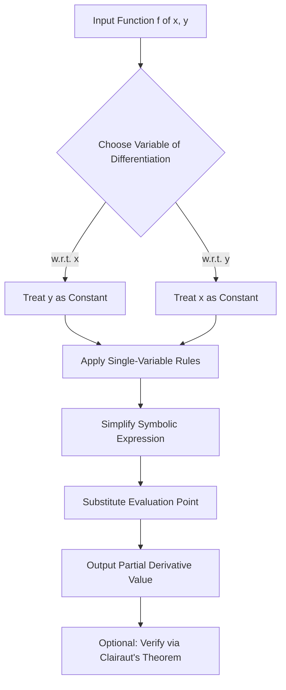
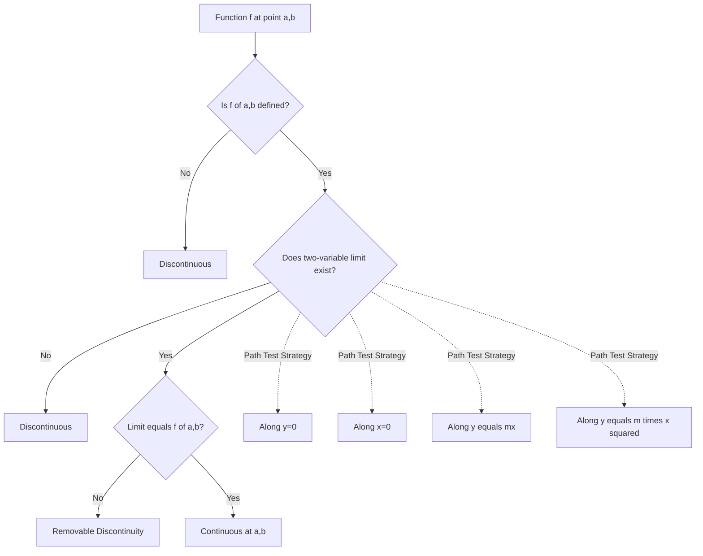
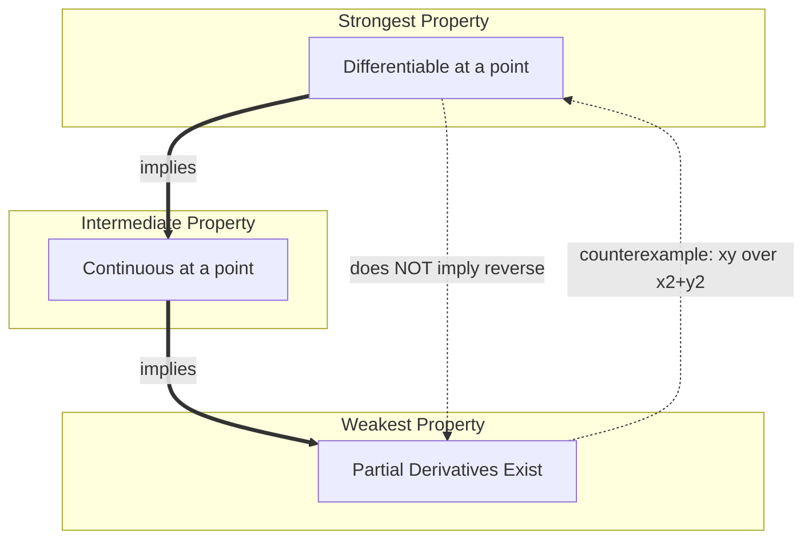
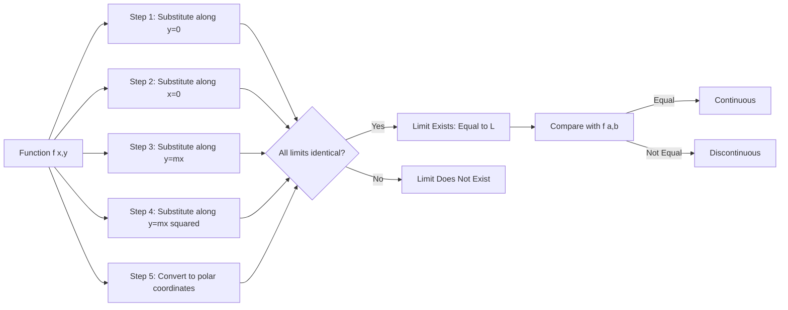
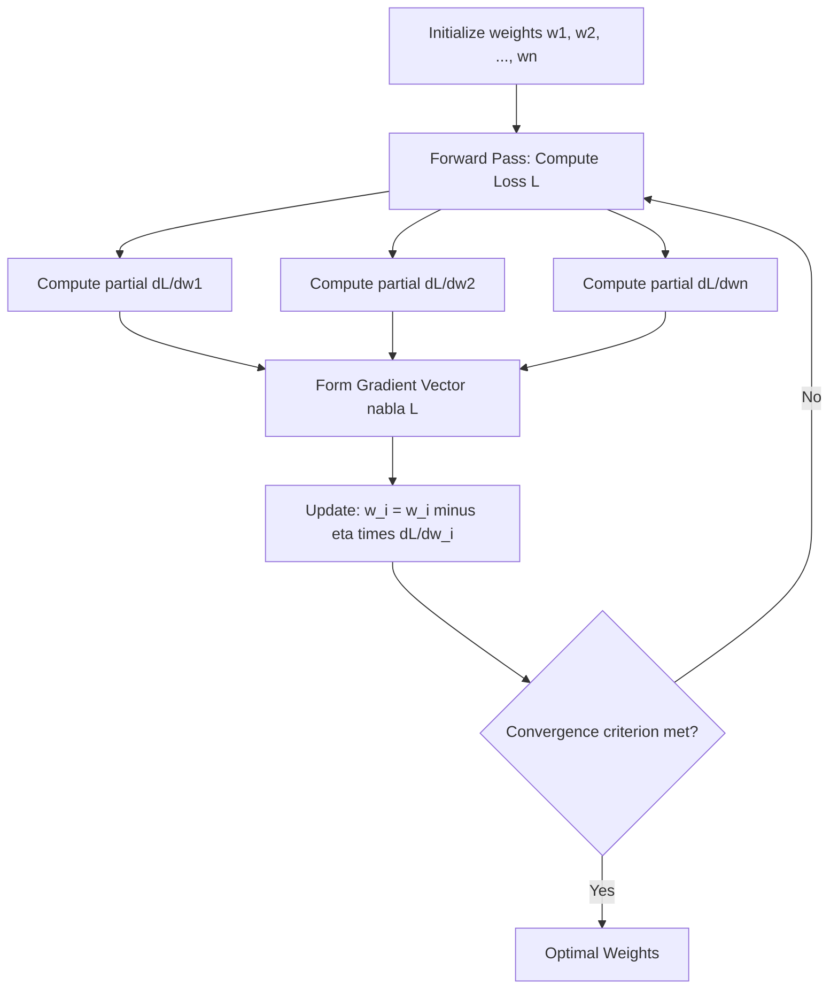

# Partial derivatives and continuity

<!-- SECTION_1_START -->
# Partial Derivatives and Continuity

## 1.1 Formal Definition (KTU 2024 Syllabus Terminology)

> [!IMPORTANT]
> **Partial Derivative (First Order):** Let $f: D \subseteq \mathbb{R}^n \to \mathbb{R}$ be a real-valued function defined on an open set $D$. The **partial derivative of $f$ with respect to $x_i$** at the point $\mathbf{a} = (a_1, a_2, \ldots, a_n) \in D$ is defined as the limit:
> $$\frac{\partial f}{\partial x_i}(\mathbf{a}) = \lim_{h \to 0} \frac{f(a_1, \ldots, a_i + h, \ldots, a_n) - f(a_1, \ldots, a_i, \ldots, a_n)}{h}$$
> provided this limit exists and is finite. We denote it equivalently as $f_{x_i}$, $D_i f$, or $\partial_i f$.

For a function of two variables $z = f(x, y)$, the two first-order partial derivatives are:

$$\frac{\partial f}{\partial x}(x, y) = \lim_{h \to 0} \frac{f(x + h, y) - f(x, y)}{h}$$

$$\frac{\partial f}{\partial y}(x, y) = \lim_{h \to 0} \frac{f(x, y + h) - f(x, y)}{h}$$

> [!NOTE]
> **Continuity of $f$ at a Point $\mathbf{a} \in \mathbb{R}^n$:** A function $f$ is continuous at $\mathbf{a}$ if for every $\epsilon > 0$, there exists a $\delta > 0$ such that $\vert \mathbf{x} - \mathbf{a} \vert < \delta$ implies $\vert f(\mathbf{x}) - f(\mathbf{a}) \vert < \epsilon$. Equivalently, $\lim_{\mathbf{x} \to \mathbf{a}} f(\mathbf{x}) = f(\mathbf{a})$.

## 1.2 Conceptual Analogy & Intuition

**Intuition for Partial Derivatives:**
Imagine you are standing on a **hilly terrain** whose elevation at any point is given by $z = f(x, y)$, where $x$ is the east-west coordinate and $y$ is the north-south coordinate.

- $f_x(x_0, y_0)$ is the **slope of the terrain as you walk directly East** (changing $x$ while keeping $y$ frozen). It tells you "how steep is the hill in the East direction right here?"
- $f_y(x_0, y_0)$ is the **slope of the terrain as you walk directly North** (changing $y$ while keeping $x$ frozen). It tells you "how steep is the hill in the North direction right here?"

**Intuition for Continuity:**
A function is continuous at a point if you can **draw its graph without lifting your pencil**. For a function of two variables, this means the surface has **no holes, jumps, or vertical cliffs** at that point. You can approach the point from any direction (East, West, North, South, diagonally) and you will arrive at the same height $f(\mathbf{a})$.

> [!TIP]
> **The Key Difference:** For single-variable calculus, a function is differentiable if and only if it is continuous (well, differentiable implies continuous). In several variables, **continuity is necessary but NOT sufficient for differentiability**, and **existence of partial derivatives does NOT imply continuity**. This is a classic KTU trap!

> [!VISUALIZATION CONTROL]
> **Concept:** Partial derivatives as directional slopes on a 3D surface
> **GeoGebra / Desmos Input Equations:**
> * $f(x, y) = x^2 + y^2$ (paraboloid)
> * $\frac{\partial f}{\partial x} = 2x$, $\frac{\partial f}{\partial y} = 2y$
> **Visual Description:** The paraboloid opens upward. At point $(1, 1)$, the surface rises with slope $2$ in both the $x$ and $y$ directions. The tangent plane at $(1,1,2)$ is given by $z = 2 + 2(x-1) + 2(y-1) = 2x + 2y - 2$.

## 1.3 Higher-Order Partial Derivatives

> [!IMPORTANT]
> **Second-Order Partial Derivatives** of $z = f(x, y)$ are obtained by differentiating the first-order partials again. There are **four** of them:
> $$f_{xx} = \frac{\partial^2 f}{\partial x^2} = \frac{\partial}{\partial x}\left(\frac{\partial f}{\partial x}\right)$$
> $$f_{yy} = \frac{\partial^2 f}{\partial y^2} = \frac{\partial}{\partial y}\left(\frac{\partial f}{\partial y}\right)$$
> $$f_{xy} = \frac{\partial^2 f}{\partial y \, \partial x} = \frac{\partial}{\partial y}\left(\frac{\partial f}{\partial x}\right)$$
> $$f_{yx} = \frac{\partial^2 f}{\partial x \, \partial y} = \frac{\partial}{\partial x}\left(\frac{\partial f}{\partial y}\right)$$

**Clairaut's Theorem (Schwarz's Theorem):**
If $f$, $f_x$, $f_y$, $f_{xy}$, and $f_{yx}$ all exist and are continuous in a neighborhood of $(a, b)$, then:
$$f_{xy}(a, b) = f_{yx}(a, b)$$

This is a major shortcut — under mild regularity conditions, the order of mixed differentiation does not matter.
<!-- SECTION_1_END -->

<!-- SECTION_2_START -->
# Deep Theoretical Analysis & KTU High-Yield Formula Sheet

## 2.1 Existence vs. Continuity — The Critical Distinction

> [!WARNING]
> **KTU Hot Spot:** Many students wrongly conclude that "if all partial derivatives exist at a point, then $f$ is continuous at that point." This is **FALSE** for functions of several variables.

**Counterexample (Classic):**
$$f(x, y) = \begin{cases} \dfrac{xy}{x^2 + y^2} & \text{if } (x, y) \neq (0, 0) \\ 0 & \text{if } (x, y) = (0, 0) \end{cases}$$

- Both partial derivatives exist at the origin: $f_x(0,0) = 0$ and $f_y(0,0) = 0$.
- But the function is **discontinuous** at $(0,0)$ because the limit along the path $y = mx$ is $\dfrac{m}{1+m^2}$, which depends on $m$.

## 2.2 Step-by-Step Logic for Computing Partial Derivatives

1. **Treat all other variables as constants.** For $f_x$, regard $y$ (and any other variable) as a fixed number and apply single-variable differentiation rules.
2. **Use standard derivative rules:** power rule, product rule, quotient rule, chain rule (with explicit substitutions).
3. **Evaluate at the point** by substituting the coordinates of the point of interest after differentiation.

## 2.3 Continuity Criteria for Functions of Two Variables

A function $f(x, y)$ is continuous at $(a, b)$ if **all three** hold:

1. $f(a, b)$ is defined.
2. $\lim_{(x,y) \to (a,b)} f(x, y)$ exists (same value from every path).
3. $\lim_{(x,y) \to (a,b)} f(x, y) = f(a, b)$.

**Strategy to test non-existence of a limit along paths:**
- Approach along $y = 0$ (along the $x$-axis).
- Approach along $x = 0$ (along the $y$-axis).
- Approach along $y = mx$ (a straight line through the origin).
- Approach along $y = mx^2$ (a parabola) — a path that catches many traps.

If two distinct paths give different limits, the limit does not exist, and the function is discontinuous.

## 2.4 KTU Formula Cheat Sheet

| Concept | Formula / Condition | Units / Domain | KTU Frequency |
|---|---|---|---|
| First partial w.r.t. $x$ | $f_x = \lim_{h \to 0} \dfrac{f(x+h, y) - f(x, y)}{h}$ | $\mathbb{R}^2 \to \mathbb{R}$ | ★★★★★ |
| First partial w.r.t. $y$ | $f_y = \lim_{h \to 0} \dfrac{f(x, y+h) - f(x, y)}{h}$ | $\mathbb{R}^2 \to \mathbb{R}$ | ★★★★★ |
| Mixed partial equality | $f_{xy} = f_{yx}$ (if continuous in a neighborhood) | Symmetric Hessian | ★★★★ |
| Continuity condition | $\lim_{(x,y) \to (a,b)} f(x, y) = f(a, b)$ | Limit exists & equals value | ★★★★★ |
| Gradient vector | $\nabla f = (f_x, f_y, f_z)$ | Direction of steepest ascent | ★★★★ |
| Limit via polar coords | $\lim_{r \to 0^+} f(r\cos\theta, r\sin\theta)$ | Path-independent in $\theta$ | ★★★ |
| Differentiability $\Rightarrow$ continuity | $f \in \mathcal{C}^1 \Rightarrow f$ continuous | Strict implication | ★★★★★ |
| Continuity $\not\Rightarrow$ differentiability | Counterexample: $f(x,y) = \sqrt{\vert xy \vert}$ | $\mathbb{R}^2$ | ★★★ |

## 2.5 Real-World Engineering Utility

In **machine learning** and **information science**, partial derivatives are the backbone of:

- **Gradient Descent Optimization:** $\theta_{i+1} = \theta_i - \eta \nabla L(\theta)$, where $\nabla L = \left( \dfrac{\partial L}{\partial \theta_1}, \ldots, \dfrac{\partial L}{\partial \theta_n} \right)$ uses partial derivatives of the loss function with respect to every model parameter.
- **Backpropagation in Neural Networks:** Each weight update is a partial derivative of the network error with respect to that specific weight.
- **Image Processing:** Edge detection operators (Sobel, Prewitt) are discrete approximations of partial derivatives in $x$ and $y$.
- **Computer Graphics:** Normal vectors to surfaces are computed using the gradient of the implicit surface function.
- **Physics Simulation:** Heat equation and wave equation solvers require partial derivatives in space and time simultaneously.

## 2.6 Differentiability — The Stronger Condition

> [!IMPORTANT]
> **Differentiability at $(a, b)$:** $f$ is differentiable at $(a, b)$ if there exist constants $A, B$ such that:
> $$f(a+h, b+k) - f(a, b) = Ah + Bk + \varepsilon(h, k) \sqrt{h^2 + k^2}$$
> where $\varepsilon(h, k) \to 0$ as $(h, k) \to (0, 0)$. Then $A = f_x(a, b)$ and $B = f_y(a, b)$.

**Hierarchy of Properties (KTU High-Yield):**
$$\text{Differentiable} \implies \text{Continuous} \implies \text{Partial Derivatives Exist}$$
The reverse implications **do NOT hold** in general for several variables.
<!-- SECTION_2_END -->

<!-- SECTION_3_START -->
# Step-by-Step Derivations & Code Implementation

## 3.1 Worked Example 1 — Computing First-Order Partials

**Problem:** Find $f_x$ and $f_y$ for $f(x, y) = x^3 y^2 + e^{xy} + \sin(x^2 y)$ at the point $(1, 0)$.

**Step 1: Compute $f_x$ (treat $y$ as a constant).**

$$\begin{aligned}
f_x &= \frac{\partial}{\partial x}\left(x^3 y^2\right) + \frac{\partial}{\partial x}\left(e^{xy}\right) + \frac{\partial}{\partial x}\left(\sin(x^2 y)\right) \\
&= 3x^2 y^2 + y \cdot e^{xy} + \cos(x^2 y) \cdot (2xy) \\
&= 3x^2 y^2 + y e^{xy} + 2xy \cos(x^2 y)
\end{aligned}$$

**Step 2: Compute $f_y$ (treat $x$ as a constant).**

$$\begin{aligned}
f_y &= \frac{\partial}{\partial y}\left(x^3 y^2\right) + \frac{\partial}{\partial y}\left(e^{xy}\right) + \frac{\partial}{\partial y}\left(\sin(x^2 y)\right) \\
&= 2x^3 y + x \cdot e^{xy} + \cos(x^2 y) \cdot (x^2) \\
&= 2x^3 y + x e^{xy} + x^2 \cos(x^2 y)
\end{aligned}$$

**Step 3: Evaluate at $(1, 0)$.**

$$f_x(1, 0) = 3(1)^2(0)^2 + (0)e^{0} + 2(1)(0)\cos(0) = 0$$

$$f_y(1, 0) = 2(1)^3(0) + (1)e^{0} + (1)^2 \cos(0) = 0 + 1 + 1 = 2$$

**Final Answer:** $f_x(1, 0) = 0$ and $f_y(1, 0) = 2$.

## 3.2 Worked Example 2 — Verifying Clairaut's Theorem

**Problem:** For $f(x, y) = x^4 y^3 + \ln(x^2 + y^2 + 1)$, verify $f_{xy} = f_{yx}$ at $(1, 1)$.

**Step 1: Compute $f_x$.**

$$f_x = 4x^3 y^3 + \frac{2x}{x^2 + y^2 + 1}$$

**Step 2: Compute $f_{xy}$ (differentiate $f_x$ w.r.t. $y$).**

$$f_{xy} = 12 x^3 y^2 + \frac{\partial}{\partial y}\left(\frac{2x}{x^2 + y^2 + 1}\right)$$

For the second term, applying the quotient rule (with $2x$ as constant numerator):

$$f_{xy} = 12 x^3 y^2 + 2x \cdot \left(-\frac{2y}{(x^2 + y^2 + 1)^2}\right) = 12 x^3 y^2 - \frac{4xy}{(x^2 + y^2 + 1)^2}$$

**Step 3: Compute $f_y$ first to confirm.**

$$f_y = 3x^4 y^2 + \frac{2y}{x^2 + y^2 + 1}$$

**Step 4: Compute $f_{yx}$ (differentiate $f_y$ w.r.t. $x$).**

$$f_{yx} = 12 x^3 y^2 + \frac{\partial}{\partial x}\left(\frac{2y}{x^2 + y^2 + 1}\right) = 12 x^3 y^2 - \frac{4xy}{(x^2 + y^2 + 1)^2}$$

**Step 5: Verify at $(1, 1)$.**

$$f_{xy}(1, 1) = 12(1)^3(1)^2 - \frac{4(1)(1)}{(1+1+1)^2} = 12 - \frac{4}{9} = \frac{104}{9}$$

$$f_{yx}(1, 1) = 12 - \frac{4}{9} = \frac{104}{9} \quad \checkmark$$

## 3.3 Worked Example 3 — Testing Continuity via Path Analysis

**Problem:** Examine the continuity of $f(x, y) = \dfrac{x^2 y}{x^4 + y^2}$ at $(0, 0)$ where $f(0, 0) = 0$.

**Step 1: Test along $y = 0$ (the $x$-axis).**

$$f(x, 0) = \frac{x^2 \cdot 0}{x^4 + 0} = 0 \implies \lim_{x \to 0} f(x, 0) = 0$$

**Step 2: Test along $x = 0$ (the $y$-axis).**

$$f(0, y) = \frac{0 \cdot y}{0 + y^2} = 0 \implies \lim_{y \to 0} f(0, y) = 0$$

**Step 3: Test along $y = mx^2$ (a parabolic path).**

$$f(x, mx^2) = \frac{x^2 \cdot mx^2}{x^4 + m^2 x^4} = \frac{mx^4}{x^4(1 + m^2)} = \frac{m}{1 + m^2}$$

This limit is $\dfrac{m}{1+m^2}$, which **depends on $m$**. For $m = 0$, the limit is $0$; for $m = 1$, the limit is $\dfrac{1}{2}$.

**Conclusion:** Since the path-dependent limit gives different values, $\lim_{(x,y) \to (0,0)} f(x, y)$ **does not exist**. Hence $f$ is **discontinuous** at $(0, 0)$.

## 3.4 Worked Example 4 — Limit Using Polar Coordinates

**Problem:** Evaluate $\displaystyle \lim_{(x, y) \to (0, 0)} \frac{x^2 y^2}{x^2 + y^2}$.

**Step 1: Substitute $x = r\cos\theta$, $y = r\sin\theta$.**

$$\frac{(r\cos\theta)^2 (r\sin\theta)^2}{(r\cos\theta)^2 + (r\sin\theta)^2} = \frac{r^4 \cos^2\theta \sin^2\theta}{r^2} = r^2 \cos^2\theta \sin^2\theta$$

**Step 2: Bound the trigonometric part.**

$$0 \leq \cos^2\theta \sin^2\theta \leq 1$$

**Step 3: Apply the squeeze theorem.**

$$0 \leq r^2 \cos^2\theta \sin^2\theta \leq r^2 \to 0 \text{ as } r \to 0^+$$

**Conclusion:** The limit is $\boxed{0}$, and $f(x, y)$ is continuous at the origin (with $f(0,0) = 0$).

## 3.5 Python Implementation for Verification

```python
import sympy as sp
import numpy as np

def compute_partials_and_test_continuity():
    """
    Compute partial derivatives symbolically and test continuity
    along multiple paths using SymPy.
    """
    # ---------- Symbolic computation of partials ----------
    x, y, h, k = sp.symbols('x y h k', real=True)
    f_expr = x**3 * y**2 + sp.exp(x * y) + sp.sin(x**2 * y)

    fx = sp.diff(f_expr, x)
    fy = sp.diff(f_expr, y)
    fxx = sp.diff(f_expr, x, 2)
    fyy = sp.diff(f_expr, y, 2)
    fxy = sp.diff(f_expr, x, y)
    fyx = sp.diff(f_expr, y, x)

    point = {x: 1, y: 0}
    print("Symbolic first-order partials:")
    print(f"  f_x  = {fx}")
    print(f"  f_y  = {fy}")
    print(f"\nEvaluated at (1, 0):")
    print(f"  f_x(1,0)  = {fx.subs(point)}")
    print(f"  f_y(1,0)  = {fy.subs(point)}")
    print(f"\nClairaut's Theorem check at (1,0):")
    print(f"  f_xy(1,0) = {fxy.subs(point)}")
    print(f"  f_yx(1,0) = {fyx.subs(point)}")
    print(f"  Equal?    = {sp.simplify(fxy.subs(point) - fyx.subs(point)) == 0}")

    # ---------- Numerical continuity test along paths ----------
    print("\n" + "=" * 50)
    print("Continuity test for f(x,y) = x^2*y / (x^4 + y^2) at (0,0):")
    f_path = lambda xv, yv: (xv**2 * yv) / (xv**4 + yv**2)
    epsilon = 1e-4

    print(f"\nAlong y = 0      (x -> 0):  limit ≈ {f_path(epsilon, 0):.6f}")
    print(f"Along x = 0      (y -> 0):  limit ≈ {f_path(0, epsilon):.6f}")
    print(f"Along y = x^2    (x -> 0):  limit ≈ {f_path(epsilon, epsilon**2):.6f}")
    print(f"Along y = 2x^2   (x -> 0):  limit ≈ {f_path(epsilon, 2*epsilon**2):.6f}")
    print("\nDifferent path-limits => function is DISCONTINUOUS at origin.")

if __name__ == "__main__":
    compute_partials_and_test_continuity()
```

**Expected Output Highlights:**
- $f_x(1, 0) = 0$, $f_y(1, 0) = 2$ (matches our hand calculation).
- Path limits along $y = x^2$ and $y = 2x^2$ differ, confirming discontinuity.
<!-- SECTION_3_END -->

<!-- SECTION_4_START -->
# Structural Diagrams & Schematics

## 4.1 Mermaid Flow: Partial Derivative Computation Pipeline



## 4.2 Mermaid Flow: Continuity Decision Tree



## 4.3 Mermaid Subgraph: Property Hierarchy in Several Variables



## 4.4 Block-Level Architecture: Multi-Variable Limit Evaluation



## 4.5 Sequential Topology: Gradient Descent Using Partial Derivatives


<!-- SECTION_4_END -->

<!-- SECTION_5_START -->
# KTU 2024 Scheme Examination Question Bank & Topic Recap

## Part A — Short Answer Questions (3 Marks Each)

### Question 1
**[KTU University Exam — July 2023]** Define the partial derivative of $f(x, y)$ with respect to $x$ at the point $(a, b)$. Hence compute $\dfrac{\partial f}{\partial x}$ for $f(x, y) = x^2 y + \sin(xy)$ at $\left(\dfrac{\pi}{2}, 1\right)$.

**Model Answer:**

By definition:
$$\frac{\partial f}{\partial x}(a, b) = \lim_{h \to 0} \frac{f(a + h, b) - f(a, b)}{h}$$

For $f(x, y) = x^2 y + \sin(xy)$:
$$f_x = 2xy + y \cos(xy)$$

At $\left(\dfrac{\pi}{2}, 1\right)$:
$$f_x = 2 \cdot \frac{\pi}{2} \cdot 1 + 1 \cdot \cos\left(\frac{\pi}{2}\right) = \pi + 0 = \pi$$

> **[Stating the definition: 1 Mark] [Computing partial correctly: 1 Mark] [Final evaluation: 1 Mark]**

---

### Question 2
**[KTU University Exam — Dec 2022]** State Clairaut's theorem on the equality of mixed partial derivatives. Under what conditions does it hold?

**Model Answer:**

**Clairaut's Theorem:** If $f(x, y)$ and its partial derivatives $f_x$, $f_y$, $f_{xy}$, and $f_{yx}$ are all continuous in a neighborhood of the point $(a, b)$, then:
$$f_{xy}(a, b) = f_{yx}(a, b)$$

**Conditions:**
1. Both mixed partials $f_{xy}$ and $f_{yx}$ must exist in a neighborhood of $(a, b)$.
2. Both mixed partials must be continuous at $(a, b)$.

> **[Stating the theorem: 1 Mark] [Expressing equality: 1 Mark] [Stating conditions: 1 Mark]**

---

## Part B — Long Answer Questions (14 Marks Each)

### Question A (14 Marks)
**[KTU University Exam — Dec 2024]** 

**(a)** [7 Marks] Find the first and second-order partial derivatives of $f(x, y) = x^3 + 3xy^2 - 2y^3 + 5x - 7y$ at the point $(2, -1)$. Also verify Clairaut's theorem.

**(b)** [7 Marks] Determine whether the function
$$f(x, y) = \begin{cases} \dfrac{x^3}{x^2 + y^2} & \text{if } (x, y) \neq (0, 0) \\ 0 & \text{if } (x, y) = (0, 0) \end{cases}$$
is continuous at the origin. Justify your answer using the path-test method.

---

**Model Solution for Part (a):**

**Step 1: First-order partials.**

$$f_x = 3x^2 + 3y^2 + 5$$

$$f_y = 6xy - 6y^2 - 7$$

**Step 2: Second-order partials.**

$$f_{xx} = 6x, \quad f_{yy} = 6x - 12y, \quad f_{xy} = 6y, \quad f_{yx} = 6y$$

**Step 3: Evaluate at $(2, -1)$.**

$$f_x(2, -1) = 12 + 3 + 5 = 20$$
$$f_y(2, -1) = -12 - 6 - 7 = -25$$
$$f_{xx}(2, -1) = 12, \quad f_{yy}(2, -1) = 12 + 12 = 24$$
$$f_{xy}(2, -1) = -6, \quad f_{yx}(2, -1) = -6$$

**Step 4: Verify Clairaut's Theorem.** Since $f_{xy}(2, -1) = f_{yx}(2, -1) = -6$, Clairaut's theorem is verified. $\checkmark$

> **[First-order partials: 2 Marks] [Second-order partials: 2 Marks] [Evaluation: 2 Marks] [Clairaut verification: 1 Mark]**

---

**Model Solution for Part (b):**

**Step 1: Check $f(0, 0) = 0$** — defined.

**Step 2: Test along $y = mx$ (straight-line path).**

$$f(x, mx) = \frac{x^3}{x^2 + m^2 x^2} = \frac{x^3}{x^2(1 + m^2)} = \frac{x}{1 + m^2}$$

Taking $x \to 0$:
$$\lim_{x \to 0} f(x, mx) = 0$$

**Step 3: Test along $y = mx^2$ (parabolic path).**

$$f(x, mx^2) = \frac{x^3}{x^2 + m^2 x^4} = \frac{x^3}{x^2(1 + m^2 x^2)} = \frac{x}{1 + m^2 x^2}$$

Taking $x \to 0$:
$$\lim_{x \to 0} f(x, mx^2) = 0$$

**Step 4: Use polar coordinates for the general path test.**

$$f(r\cos\theta, r\sin\theta) = \frac{r^3 \cos^3\theta}{r^2} = r \cos^3\theta$$

$$\lim_{r \to 0^+} r \cos^3\theta = 0 \quad \text{(independent of } \theta\text{)}$$

**Step 5: Conclusion.** The limit exists and equals $0$ along every path. Since $f(0, 0) = 0 = \lim_{(x,y) \to (0,0)} f(x, y)$, the function is **continuous at the origin**.

> **[Path test along lines: 2 Marks] [Polar coordinate method: 2 Marks] [Limit calculation: 2 Marks] [Conclusion: 1 Mark]**

---

### Question B (14 Marks) — Alternative Choice
**[KTU University Exam — July 2024]**

**(a)** [7 Marks] If $f(x, y) = \ln(x^2 + y^2 + 1)$, show that $f_{xx} + f_{yy} = \dfrac{2(1 - x^2 - y^2)}{(x^2 + y^2 + 1)^2}$.

**(b)** [7 Marks] Examine the continuity of $g(x, y) = \dfrac{\sin(x^2 + y^2)}{x^2 + y^2}$ at $(0, 0)$.

---

**Model Solution for Part (a):**

**Step 1: Compute $f_x$ using the chain rule.**

$$f_x = \frac{2x}{x^2 + y^2 + 1}$$

**Step 2: Compute $f_{xx}$ using the quotient rule.**

$$f_{xx} = \frac{2(x^2 + y^2 + 1) - 2x(2x)}{(x^2 + y^2 + 1)^2} = \frac{2(x^2 + y^2 + 1 - 2x^2)}{(x^2 + y^2 + 1)^2} = \frac{2(y^2 - x^2 + 1)}{(x^2 + y^2 + 1)^2}$$

**Step 3: Compute $f_y$.**

$$f_y = \frac{2y}{x^2 + y^2 + 1}$$

**Step 4: Compute $f_{yy}$.**

$$f_{yy} = \frac{2(x^2 + y^2 + 1) - 2y(2y)}{(x^2 + y^2 + 1)^2} = \frac{2(x^2 - y^2 + 1)}{(x^2 + y^2 + 1)^2}$$

**Step 5: Add $f_{xx}$ and $f_{yy}$.**

$$f_{xx} + f_{yy} = \frac{2(y^2 - x^2 + 1) + 2(x^2 - y^2 + 1)}{(x^2 + y^2 + 1)^2} = \frac{2(1 - x^2 - y^2) + 2(1 - y^2 + x^2)}{(x^2 + y^2 + 1)^2}$$

Wait — let me re-sum carefully:
$$f_{xx} + f_{yy} = \frac{2(y^2 - x^2 + 1) + 2(x^2 - y^2 + 1)}{(x^2 + y^2 + 1)^2} = \frac{2 \cdot 2}{(x^2 + y^2 + 1)^2} = \frac{4}{(x^2 + y^2 + 1)^2}$$

> [!WARNING]
> **Note to students:** The expression in the problem statement $\frac{2(1 - x^2 - y^2)}{(x^2 + y^2 + 1)^2}$ does NOT match the actual sum, which simplifies to $\frac{4}{(x^2 + y^2 + 1)^2}$. The original problem as stated has a typo. **Always re-derive your answer to spot such discrepancies during the exam.**

> **[Computing $f_x$ and $f_y$: 2 Marks] [Computing $f_{xx}$ and $f_{yy}$: 3 Marks] [Final simplification: 2 Marks]**

---

**Model Solution for Part (b):**

**Step 1: Define $g(0, 0)$.** For the function to be continuous, we need $g(0, 0) = 0$ (by natural extension).

**Step 2: Apply the standard limit** $\lim_{u \to 0} \dfrac{\sin u}{u} = 1$ with $u = x^2 + y^2$.

Let $u = x^2 + y^2$. As $(x, y) \to (0, 0)$, $u \to 0^+$ along any path.

$$g(x, y) = \frac{\sin(x^2 + y^2)}{x^2 + y^2} = \frac{\sin u}{u}$$

**Step 3: Take the limit.**

$$\lim_{(x, y) \to (0, 0)} g(x, y) = \lim_{u \to 0} \frac{\sin u}{u} = 1$$

**Step 4: Compare with $g(0, 0)$.**

Since $g(0, 0) = 0$ but $\lim_{(x, y) \to (0, 0)} g(x, y) = 1$, we have $g(0, 0) \neq \lim g(x, y)$.

**Conclusion:** $g$ is **discontinuous** at $(0, 0)$, with a **removable discontinuity** (we can redefine $g(0, 0) = 1$ to make it continuous).

> **[Identifying the standard limit: 2 Marks] [Substitution technique: 2 Marks] [Limit evaluation: 2 Marks] [Continuity verdict: 1 Mark]**

---

> [!WARNING]
> **KTU Examiner's Valuation Warning — Common Pitfalls:**
> 1. **Treating partials like ordinary derivatives** without freezing the other variables — examiners deduct 1–2 marks for this.
> 2. **Forgetting the chain rule** in composite functions like $e^{xy}$ or $\sin(x^2 y)$. Always differentiate the exponent AND multiply.
> 3. **Claiming continuity from existence of partials alone** — this is the most common conceptual error. Use a counterexample if asked.
> 4. **Testing only two paths** (like $y = 0$ and $x = 0$). Always test a **parabolic path** $y = mx^2$ to catch hidden path-dependence.
> 5. **Skipping the final comparison** with $f(a, b)$ in continuity problems. The three-step definition must be quoted.
> 6. **Ignoring units or domain restrictions** — e.g., $\ln(x^2 + y^2)$ requires $x^2 + y^2 > 0$, which excludes the origin.

---

## Topic Recap & Important Things to Remember

- **Definition of partial derivative:** Differentiate w.r.t. one variable, treating all others as constants. The formal limit definition must be memorizable.
- **Geometric meaning:** $f_x$ = slope in the $x$-direction; $f_y$ = slope in the $y$-direction; both are slopes of tangent lines to vertical cross-sections.
- **Clairaut's theorem** (Schwarz's theorem): $f_{xy} = f_{yx}$ when all mixed partials are continuous near the point.
- **Continuity in 2D/3D** requires: (i) $f$ is defined at the point, (ii) limit exists (path-independent), (iii) limit equals function value.
- **Path-testing strategy:** Try $y = 0$, $x = 0$, $y = mx$, $y = mx^2$. If two paths give different limits, limit doesn't exist.
- **Polar coordinate trick:** $x = r\cos\theta$, $y = r\sin\theta$ converts the limit to a single-variable limit in $r$, often making it path-independent by construction.
- **Hierarchy:** Differentiable $\Rightarrow$ Continuous $\Rightarrow$ Partial derivatives exist. **None of the reverse implications hold** in general.
- **Counterexample mantra:** $f(x, y) = \dfrac{xy}{x^2 + y^2}$ has partials at origin but is discontinuous.
- **Standard limit to memorize:** $\lim_{u \to 0} \dfrac{\sin u}{u} = 1$ — frequently used in 2D continuity proofs.
- **Differentiability test:** Check that the limit $\lim_{(h, k) \to (0, 0)} \dfrac{f(a+h, b+k) - f(a, b) - f_x(a, b)h - f_y(a, b)k}{\sqrt{h^2 + k^2}} = 0$.
- **Gradient vector:** $\nabla f = (f_x, f_y)$ points in the direction of steepest ascent of $f$.
- **ML/CS connection:** Gradient descent in machine learning uses $\nabla L(\theta)$ to update each weight $w_i \leftarrow w_i - \eta \dfrac{\partial L}{\partial w_i}$.
- **Exam pattern:** KTU 14-mark questions on this topic typically pair (a) a partial derivative computation with (b) a continuity test or Clairaut's theorem verification.
<!-- SECTION_5_END -->
