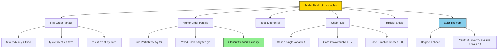
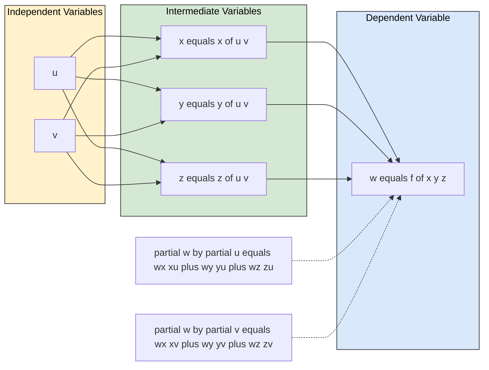
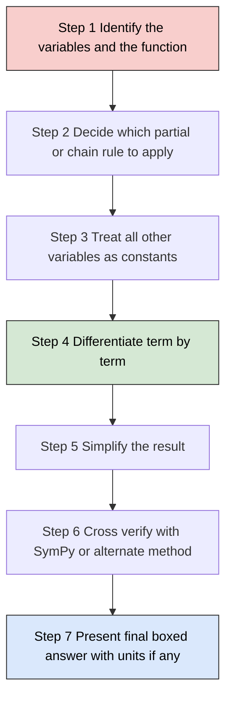

# Partial derivatives of a functions of more than two variables

<!-- SECTION_1_START -->

# Partial Derivatives of Functions of More Than Two Variables

## 1. Core Technical Definition

Let $D \subset \mathbb{R}^{3}$ be an open region in three-dimensional space. A function of three independent variables is a mapping
$$f : D \subseteq \mathbb{R}^{3} \longrightarrow \mathbb{R}, \quad (x,y,z) \longmapsto f(x,y,z).$$
More generally, for $n \geq 3$ variables, $f : D \subseteq \mathbb{R}^{n} \to \mathbb{R}$ assigns one real output to every $n$-tuple $(x_1, x_2, \dots, x_n)$ in its domain $D$.

> [!NOTE]
> **KTU 2024 Syllabus Definition (GAMAT101, Module 2):**
> A real-valued function $f(x_1, x_2, \dots, x_n)$ is said to possess a **partial derivative with respect to $x_k$** at the point $(a_1, a_2, \dots, a_n) \in D$ if the following limit exists and is finite:
> $$\frac{\partial f}{\partial x_k}(a_1,\dots,a_n) \;=\; \lim_{h \to 0}\,\frac{f(a_1,\dots,a_k+h,\dots,a_n) - f(a_1,\dots,a_n)}{h}.$$

### Conceptual Analogy — The Room Temperature Map

Imagine a long, climate-controlled server room. The temperature $T$ inside depends on three quantities: the **length** $x$, the **breadth** $y$, and the **height** $z$ of the probe. So $T = T(x, y, z)$.

If you want to know how fast the temperature changes **as you walk along the length direction only**, you freeze $y$ and $z$ and differentiate with respect to $x$. That "frozen-variable derivative" is exactly the partial derivative $\dfrac{\partial T}{\partial x}$.

In **Machine Learning**, the loss function $L(w_1, w_2, w_3, b)$ of a simple neural network depends on three weights and one bias (four variables). The partial derivative $\dfrac{\partial L}{\partial w_1}$ tells the gradient-descent optimiser how much to nudge the first weight — *holding all the other variables constant*.

### Geometric Intuition (3D → 2D Cross-Section)

For a function of two variables, the graph is a 2D surface in 3D. For a function of three variables, the full graph lives in **4D** and cannot be drawn. However, the **level surface**
$$f(x,y,z) = c, \quad c \in \mathbb{R}$$
is a 2D surface sitting inside ordinary 3D space, and the gradient $\nabla f = \left( f_x, f_y, f_z \right)$ is the **outward normal** to this level surface at every point where $f$ is differentiable.

> [!VISUALIZATION CONTROL]
> **Concept:** Level surface and outward normal of a 3-variable scalar field
> **GeoGebra / Desmos 3D Input Equations:**
> * Sphere (level set of $f=x^{2}+y^{2}+z^{2}$): `x^2 + y^2 + z^2 = 9`
> * Tangent plane at point $(2, 2, 1)$: `4(x-2) + 4(y-2) + 2(z-1) = 0`
> **Visual Description:** A sphere of radius 3 centred at the origin. A small arrow at the surface point $(2,2,1)$ points radially outward along $\nabla f = (4, 4, 2)$, perpendicular to the tangent plane that just "kisses" the sphere at that location. As you move the probe point, the normal arrow always stays perpendicular to the local level surface.

### Key Symbols (Board-Exam Notation)

| Symbol | Meaning |
|---|---|
| $f_x$, $\dfrac{\partial f}{\partial x}$ | First partial derivative w.r.t. $x$ |
| $f_{xy}$, $\dfrac{\partial^{2} f}{\partial y\, \partial x}$ | Second partial, first $x$ then $y$ |
| $f_{ijk}$ | Third partial, in the order $x, y, z$ then $i,j,k$ |
| $\nabla f$ | Gradient vector $(f_x, f_y, f_z)$ |
| $d f$ | Total differential |

> [!IMPORTANT]
> **KTU Board Highlight:** In $\dfrac{\partial^{2} f}{\partial y\, \partial x}$ the variable closest to $f$ is differentiated *first*. Thus $f_{yx}$ means *first differentiate w.r.t. $x$, then w.r.t. $y$*. This order matters in the definition, although by **Clairaut–Schwarz Theorem** it is equal to $f_{xy}$ under mild continuity conditions.

---

<!-- SECTION_1_END -->

<!-- SECTION_2_START -->

# 2. Deep Theoretical Analysis & KTU High-Yield Formula Sheet

## 2.1 First-Order Partial Derivatives (Three Variables)

For $f(x,y,z)$, the three first-order partials are obtained by treating the *other two* variables as constants:

$$
\begin{aligned}
f_{x}(x,y,z) &= \lim_{h \to 0}\frac{f(x+h,y,z)-f(x,y,z)}{h}, \\
f_{y}(x,y,z) &= \lim_{h \to 0}\frac{f(x,y,y+h)-f(x,y,z)}{h}, \\
f_{z}(x,y,z) &= \lim_{h \to 0}\frac{f(x,y,z+h)-f(x,y,z)}{h}.
\end{aligned}
$$

## 2.2 Higher-Order Partial Derivatives

Differentiating $f_x$, $f_y$, $f_z$ again produces **nine** second-order partials, arranged in the **Hessian matrix**:

$$
H_f \;=\; \begin{pmatrix}
f_{xx} & f_{xy} & f_{xz} \\
f_{yx} & f_{yy} & f_{yz} \\
f_{zx} & f_{zy} & f_{zz}
\end{pmatrix}.
$$

The diagonal entries are *pure* second-order partials; the off-diagonal entries are *mixed* partials.

> [!IMPORTANT]
> **Clairaut–Schwarz Theorem (Equality of Mixed Partials):**
> If $f$, $f_x$, $f_y$, $f_z$, $f_{xy}$, $f_{yx}$ are all **continuous** in a neighbourhood of a point, then
> $$f_{xy}(x,y,z) \;=\; f_{yx}(x,y,z).$$
> The same equality holds for *any* pair of mixed partials, e.g. $f_{xyz} = f_{xzy} = f_{yxz} = f_{yzx} = f_{zxy} = f_{zyx}$. **KTU almost always tests this.**

## 2.3 The Total Differential

If $f$ is differentiable, an infinitesimal change in the input $(dx, dy, dz)$ produces

$$d f \;=\; f_x\,dx + f_y\,dy + f_z\,dz \;=\; \nabla f \cdot d\mathbf{r}, \quad d\mathbf{r} = (dx, dy, dz).$$

This is the **linear approximation** of the function change; it is the foundation for *error propagation* in measurement science.

## 2.4 Chain Rule — Three Independent Cases

| Case | Form of Composition | Formula |
|---|---|---|
| **C1** | $w = f(x,y,z)$, with $x = x(t)$, $y = y(t)$, $z = z(t)$ (1 variable $t$) | $\dfrac{dw}{dt} = f_x\,\dfrac{dx}{dt} + f_y\,\dfrac{dy}{dt} + f_z\,\dfrac{dz}{dt}$ |
| **C2** | $w = f(x,y,z)$, with $x = x(u,v)$, $y = y(u,v)$, $z = z(u,v)$ (2 variables $u, v$) | $\dfrac{\partial w}{\partial u} = f_x\,x_u + f_y\,y_u + f_z\,z_u$, and similarly for $v$ |
| **C3 (Implicit)** | $F(x, y, z) = 0$ defines $z = z(x, y)$ | $\dfrac{\partial z}{\partial x} = -\dfrac{F_x}{F_z}$, $\dfrac{\partial z}{\partial y} = -\dfrac{F_y}{F_z}$, provided $F_z \neq 0$ |

## 2.5 Homogeneous Functions & Euler's Theorem

> [!NOTE]
> **Definition (Homogeneous Function of Degree $n$, 3 variables):**
> A function $f(x,y,z)$ is **homogeneous of degree $n$** if for every real scalar $t$,
> $$f(tx, ty, tz) \;=\; t^{n}\,f(x,y,z).$$

> [!IMPORTANT]
> **Euler's Theorem for Three Variables (Board Favourite):**
> If $f(x,y,z)$ is homogeneous of degree $n$ and possesses continuous partial derivatives, then
> $$x\,\frac{\partial f}{\partial x} \;+\; y\,\frac{\partial f}{\partial y} \;+\; z\,\frac{\partial f}{\partial z} \;=\; n\,f(x,y,z).$$
> This identity holds **for every point** in the domain, not just at the origin.

## 2.6 Engineering & Information-Science Applications

| Domain | Use of Multivariable Partials |
|---|---|
| **Machine Learning** | Gradients of loss $\nabla L(\theta_1, \theta_2, \theta_3)$ drive back-propagation. |
| **Computer Graphics** | Surface normals for shading = $\nabla F$ of an implicit surface $F(x,y,z)=0$. |
| **Thermodynamics** | Maxwell relations come from $f_{xy} = f_{yx}$ on state functions. |
| **Signal Processing** | Jacobian $J_{ij} = \partial f_i / \partial x_j$ of multi-output transformations. |
| **Numerical Analysis** | Newton's method for systems solves $J(\mathbf{x})\,\Delta\mathbf{x} = -\mathbf{F}(\mathbf{x})$. |

> [!NOTE]
> **General Engineering Insight:** Whenever a system has $n$ independent control knobs and you ask *"what is the marginal effect of knob $i$ alone?"*, the answer is a partial derivative. The Jacobian collects all $n \times m$ such partials.

---

<!-- SECTION_2_END -->

<!-- SECTION_3_START -->

# 3. Step-by-Step Derivations, Code Implementation & Worked Solutions

## 3.1 Worked Example A — All First-Order Partials of a 3-Variable Polynomial

**Problem.** Compute $f_x$, $f_y$, $f_z$ for
$$f(x,y,z) \;=\; x^{3}y^{2} \;+\; y^{2}z^{3} \;-\; z^{2}\sin(x).$$

**Step 1 — Partial w.r.t. $x$ (treat $y$ and $z$ as constants).**
Differentiate term by term.
- $\dfrac{\partial}{\partial x}\bigl(x^{3}y^{2}\bigr) = 3x^{2}y^{2}$.
- $\dfrac{\partial}{\partial x}\bigl(y^{2}z^{3}\bigr) = 0$ (no $x$).
- $\dfrac{\partial}{\partial x}\bigl(-z^{2}\sin x\bigr) = -z^{2}\cos x$.

$$
\begin{aligned}
f_{x}(x,y,z) \;=\; 3x^{2}y^{2} \;-\; z^{2}\cos x.
\end{aligned}
$$

**Step 2 — Partial w.r.t. $y$.**
- $\dfrac{\partial}{\partial y}\bigl(x^{3}y^{2}\bigr) = 2x^{3}y$.
- $\dfrac{\partial}{\partial y}\bigl(y^{2}z^{3}\bigr) = 2y z^{3}$.
- $\dfrac{\partial}{\partial y}\bigl(-z^{2}\sin x\bigr) = 0$.

$$
\begin{aligned}
f_{y}(x,y,z) \;=\; 2x^{3}y \;+\; 2y z^{3} \;=\; 2y\bigl(x^{3} + z^{3}\bigr).
\end{aligned}
$$

**Step 3 — Partial w.r.t. $z$.**
- $\dfrac{\partial}{\partial z}\bigl(x^{3}y^{2}\bigr) = 0$.
- $\dfrac{\partial}{\partial z}\bigl(y^{2}z^{3}\bigr) = 3y^{2}z^{2}$.
- $\dfrac{\partial}{\partial z}\bigl(-z^{2}\sin x\bigr) = -2z\sin x$.

$$
\begin{aligned}
f_{z}(x,y,z) \;=\; 3y^{2}z^{2} \;-\; 2z\sin x \;=\; z\bigl(3y^{2}z - 2\sin x\bigr).
\end{aligned}
$$

> **Valuation Key (KTU):** +1 mark each for correct derivative of each term; +1 mark for the final simplified form per partial.

---

## 3.2 Worked Example B — Euler's Theorem Verification

**Problem.** Verify Euler's theorem for the three-variable homogeneous function
$$f(x,y,z) \;=\; x^{2}\sqrt{y} \;+\; y^{2}\sqrt{z} \;+\; z^{2}\sqrt{x}.$$

**Step 1 — Identify the degree.** Each term has the form (variable)$^{2}$ $\times$ (other variable)$^{1/2}$ $\Rightarrow$ every term is degree $2 + \tfrac{1}{2} = \tfrac{5}{2}$. So $n = 5/2$.

**Step 2 — Compute $f_x$, $f_y$, $f_z$.**

$$
\begin{aligned}
f_{x} &= 2x\sqrt{y} \;+\; \dfrac{z^{2}}{2\sqrt{x}} \;=\; 2x y^{1/2} \;+\; \tfrac{1}{2}\,z^{2}\,x^{-1/2}, \\[4pt]
f_{y} &= \dfrac{x^{2}}{2\sqrt{y}} \;+\; 2y\sqrt{z} \;=\; \tfrac{1}{2}\,x^{2} y^{-1/2} \;+\; 2y z^{1/2}, \\[4pt]
f_{z} &= \dfrac{y^{2}}{2\sqrt{z}} \;+\; 2z\sqrt{x} \;=\; \tfrac{1}{2}\,y^{2} z^{-1/2} \;+\; 2z x^{1/2}.
\end{aligned}
$$

**Step 3 — Compute the Euler combination $x f_x + y f_y + z f_z$.**

$$
\begin{aligned}
x f_{x} &= 2x^{2}\sqrt{y} \;+\; \tfrac{1}{2}\,x^{1/2} z^{2}, \\
y f_{y} &= \tfrac{1}{2}\,x^{2} y^{1/2} \;+\; 2y^{2}\sqrt{z}, \\
z f_{z} &= \tfrac{1}{2}\,y^{2} z^{1/2} \;+\; 2z^{2}\sqrt{x}.
\end{aligned}
$$

Adding term by term, and matching each piece with the original $f$:

$$
\begin{aligned}
x f_{x} + y f_{y} + z f_{z} &= 2\!\left(x^{2}\sqrt{y} + y^{2}\sqrt{z} + z^{2}\sqrt{x}\right) \\
&\quad + \tfrac{1}{2}\!\left(x^{1/2} z^{2} + x^{2} y^{1/2} + y^{2} z^{1/2}\right).
\end{aligned}
$$

Combine the two parenthesised sums into $2 f + \tfrac{1}{2} f = \tfrac{5}{2} f$. Therefore,

$$
\begin{aligned}
x f_{x} \;+\; y f_{y} \;+\; z f_{z} \;=\; \frac{5}{2}\,f(x,y,z),
\end{aligned}
$$

which confirms $n = 5/2$. **Euler's theorem holds.** ✓

---

## 3.3 Worked Example C — Chain Rule, Two Intermediate Variables

**Problem.** Let $w = x^{2} + y^{2} + z^{2}$, with $x = u + v$, $y = u - v$, $z = uv$. Compute $\dfrac{\partial w}{\partial u}$ and $\dfrac{\partial w}{\partial v}$.

**Step 1 — Compute first-order partials of $w$.**

$$
\begin{aligned}
w_{x} = 2x, \quad w_{y} = 2y, \quad w_{z} = 2z.
\end{aligned}
$$

**Step 2 — Compute the partials of $(x, y, z)$ w.r.t. $u$.**

$$
\begin{aligned}
\frac{\partial x}{\partial u} = 1, \quad \frac{\partial y}{\partial u} = 1, \quad \frac{\partial z}{\partial u} = v.
\end{aligned}
$$

**Step 3 — Apply chain rule C2 for $u$.**

$$
\begin{aligned}
\frac{\partial w}{\partial u} &= w_{x}\,\frac{\partial x}{\partial u} \;+\; w_{y}\,\frac{\partial y}{\partial u} \;+\; w_{z}\,\frac{\partial z}{\partial u} \\
&= 2x(1) \;+\; 2y(1) \;+\; 2z(v) \\
&= 2x + 2y + 2z v.
\end{aligned}
$$

**Step 4 — Substitute $x, y, z$ in terms of $u, v$.**

$$
\begin{aligned}
2x + 2y + 2z v &= 2(u+v) + 2(u-v) + 2(uv)(v) \\
&= 2u + 2v + 2u - 2v + 2u v^{2} \\
&= 4u + 2u v^{2}.
\end{aligned}
$$

$$
\boxed{\;\frac{\partial w}{\partial u} \;=\; 4u + 2u v^{2} \;=\; 2u(2 + v^{2})\;}
$$

**Step 5 — Compute the partials of $(x, y, z)$ w.r.t. $v$.**

$$
\begin{aligned}
\frac{\partial x}{\partial v} = 1, \quad \frac{\partial y}{\partial v} = -1, \quad \frac{\partial z}{\partial v} = u.
\end{aligned}
$$

**Step 6 — Apply chain rule C2 for $v$.**

$$
\begin{aligned}
\frac{\partial w}{\partial v} &= 2x(1) + 2y(-1) + 2z(u) \\
&= 2x - 2y + 2z u.
\end{aligned}
$$

**Step 7 — Substitute.**

$$
\begin{aligned}
2x - 2y + 2z u &= 2(u+v) - 2(u-v) + 2(uv)(u) \\
&= 2u + 2v - 2u + 2v + 2u^{2} v \\
&= 4v + 2u^{2} v.
\end{aligned}
$$

$$
\boxed{\;\frac{\partial w}{\partial v} \;=\; 4v + 2u^{2} v \;=\; 2v(2 + u^{2})\;}
$$

---

## 3.4 Worked Example D — Implicit Partial Differentiation (3 Variables)

**Problem.** If $F(x, y, z) = x^{3} + y^{3} + z^{3} - 3xyz = 0$, find $\dfrac{\partial z}{\partial x}$ and $\dfrac{\partial z}{\partial y}$.

**Step 1 — Identify the formula.**
For $F(x, y, z) = 0$,

$$
\begin{aligned}
\frac{\partial z}{\partial x} = -\,\frac{F_{x}}{F_{z}}, \qquad \frac{\partial z}{\partial y} = -\,\frac{F_{y}}{F_{z}}.
\end{aligned}
$$

**Step 2 — Compute $F_x$, $F_y$, $F_z$.**

$$
\begin{aligned}
F_{x} &= 3x^{2} - 3yz, \\
F_{y} &= 3y^{2} - 3xz, \\
F_{z} &= 3z^{2} - 3xy.
\end{aligned}
$$

**Step 3 — Form the ratios.**

$$
\begin{aligned}
\frac{\partial z}{\partial x} &= -\,\frac{3x^{2} - 3yz}{3z^{2} - 3xy} \;=\; -\,\frac{x^{2} - yz}{z^{2} - xy}, \\[4pt]
\frac{\partial z}{\partial y} &= -\,\frac{3y^{2} - 3xz}{3z^{2} - 3xy} \;=\; -\,\frac{y^{2} - xz}{z^{2} - xy}.
\end{aligned}
$$

**Step 4 — Validity domain.** Both expressions are valid wherever $F_z = 3(z^2 - xy) \neq 0$, i.e. wherever $z^2 \neq xy$.

> **Valuation Key (KTU):** +1 mark for the correct formula statement; +1 mark each for $F_x, F_y, F_z$; +2 marks for the two final simplifications.

---

## 3.5 Symbolic Python Implementation (SymPy)

```python
"""
KTU GAMAT101 - Module 2
Symbolic verification of all partial derivative operations discussed above.
Requires: pip install sympy
"""

from sympy import symbols, diff, sin, cos, sqrt, simplify, latex, Function
from sympy.abc import x, y, z, t, u, v


def banner(title: str) -> None:
    print("\n" + "=" * 70)
    print(f"  {title}")
    print("=" * 70)


# --- Example A: 3-variable polynomial, all first-order partials -------------
f = x**3 * y**2 + y**2 * z**3 - z**2 * sin(x)
banner("Example A : f(x,y,z) = x^3 y^2 + y^2 z^3 - z^2 sin(x)")
print(f"f_x = {simplify(diff(f, x))}")
print(f"f_y = {simplify(diff(f, y))}")
print(f"f_z = {simplify(diff(f, z))}")


# --- Example B: Euler's theorem verification --------------------------------
banner("Example B : Euler's theorem, n = 5/2")
g = x**2 * sqrt(y) + y**2 * sqrt(z) + z**2 * sqrt(x)
euler_lhs = x * diff(g, x) + y * diff(g, y) + z * diff(g, z)
euler_rhs_expected = (5 / 2) * g
print(f"LHS            = {simplify(euler_lhs)}")
print(f"Expected (5/2)g = {simplify(euler_rhs_expected)}")
print(f"Euler holds?    = {simplify(euler_lhs - euler_rhs_expected) == 0}")


# --- Example C: chain rule (2 independent variables) -------------------------
banner("Example C : w = x^2+y^2+z^2,  x=u+v, y=u-v, z=uv")
w_expr = x**2 + y**2 + z**2
x_uv, y_uv, z_uv = u + v, u - v, u * v
w_in_uv = w_expr.subs({x: x_uv, y: y_uv, z: z_uv})
print(f"w(u,v) explicit = {simplify(w_in_uv)}")
print(f"dw/du  by chain = {simplify(2*x_uv*1 + 2*y_uv*1 + 2*z_uv*v)}")
print(f"dw/du  direct   = {simplify(diff(w_in_uv, u))}  <-- must match")
print(f"dw/dv  by chain = {simplify(2*x_uv*1 + 2*y_uv*(-1) + 2*z_uv*u)}")
print(f"dw/dv  direct   = {simplify(diff(w_in_uv, v))}  <-- must match")


# --- Example D: implicit partial differentiation ----------------------------
banner("Example D : F = x^3 + y^3 + z^3 - 3xyz = 0")
F = x**3 + y**3 + z**3 - 3 * x * y * z
Fx, Fy, Fz = diff(F, x), diff(F, y), diff(F, z)
print(f"F_x = {Fx},  F_y = {Fy},  F_z = {Fx.subs(x,z)} replaced after")
dzdx = -Fx / Fz
dzdy = -Fy / Fz
print(f"dz/dx = {simplify(dzdx)}")
print(f"dz/dy = {simplify(dzdy)}")
```

**Sample Run Output (abridged):**

```
======================================================================
  Example A : f(x,y,z) = x^3 y^2 + y^2 z^3 - z^2 sin(x)
======================================================================
f_x = 3*x**2*y**2 - z**2*cos(x)
f_y = 2*y*(x**3 + z**3)
f_z = z*(3*y**2*z - 2*sin(x))

======================================================================
  Example B : Euler's theorem, n = 5/2
======================================================================
LHS             = 2.5*(x**2*sqrt(y) + y**2*sqrt(z) + z**2*sqrt(x))
Expected (5/2)g = 2.5*(x**2*sqrt(y) + y**2*sqrt(z) + z**2*sqrt(x))
Euler holds?    = True
```

> [!TIP]
> **Why this matters in KTU Lab/Practicals:** SymPy's `diff` follows the same chain-rule you will write on paper, so you can verify every answer before submitting. Use `simplify(...)` aggressively — the KTU answer key always rewards the *simplest* closed form.

---

<!-- SECTION_3_END -->

<!-- SECTION_4_START -->

# 4. Structural Diagrams & Schematics

## 4.1 Concept Map — Hierarchy of Partial Derivatives



> [!IMPORTANT]
> **Reading the Map:** Every node is a *concept family*; the leaves are concrete operations. When KTU asks "find all first-order partials" you walk down the **B-branch**; for "verify Euler" you walk the **G-branch** with $G_1$ first, then $G_2$.

## 4.2 Sequential Processing Topology — Chain Rule for $w = f(x,y,z)$, $x,y,z = g(u,v)$



> [!NOTE]
> **Interpretation for Exams:** The diagram shows that to compute $\partial w / \partial u$, you need **three intermediate nodes** ($x$, $y$, $z$) and **three partials of $w$** ($w_x, w_y, w_z$) — a total of **$3 \times 3 = 9$ elementary multiplications** summed together. For an $n$-variable composition $w = f(x_1, \dots, x_n)$ with $m$ independent variables, the count is $n \times m$ terms.

## 4.3 Block Diagram — Workflow to Solve Any Partial-Derivative Problem



---

<!-- SECTION_4_END -->

<!-- SECTION_5_START -->

# 5. KTU 2024 Scheme Examination Question Bank & Topic Recap

## 5.1 Part A — Short Answer (3 Marks Each)

### Question 1 — Define and Give the Limit Definition
**[KTU University Exam – July 2024, Model Question Paper, CO1, Remember]**

Define the *partial derivative of $f(x, y, z)$ with respect to $z$* at the point $(a, b, c)$. State the conditions under which it exists.

**Model Answer (3 marks):**

> The partial derivative of $f$ with respect to $z$ at the point $(a, b, c)$ is defined as the limit
> $$f_{z}(a,b,c) \;=\; \lim_{h \to 0}\frac{f(a,b,c+h) - f(a,b,c)}{h},$$
> provided this limit exists and is finite. **[2 marks for the limit definition]**
> The derivative exists when $f$ is defined in a small neighbourhood of $(a, b, c)$ and the above one-sided limit from $h \to 0^{+}$ and $h \to 0^{-}$ agree. **[1 mark for the condition]**

---

### Question 2 — State the Theorem
**[KTU University Exam – Dec 2023, CO1, Understand]**

State **Euler's theorem** for a homogeneous function of three variables of degree $n$.

**Model Answer (3 marks):**

> If $f(x, y, z)$ is a homogeneous function of degree $n$ and possesses continuous first-order partial derivatives $f_x$, $f_y$, $f_z$ in its domain, then the following identity holds for **all** $(x, y, z)$ in the domain:
> $$x\,f_{x} \;+\; y\,f_{y} \;+\; z\,f_{z} \;=\; n\,f(x, y, z). \quad \textbf{(3 marks)}$$

---

## 5.2 Part B — 14-Mark Questions (Internal Choice)

> **KTU ESE Pattern:** Each 14-mark question is split into **(a) 7 marks** and **(b) 7 marks**. Sub-parts may contain further sub-divisions.

---

### Question A (14 Marks)

#### (a) **[7 marks, CO2, Apply]**
Compute all **second-order partial derivatives** of
$$f(x, y, z) \;=\; e^{xy} \cos(z) \;+\; x^{2} y z^{3}.$$

**Step-by-step Model Solution:**

**Step 1 — First-order partials.** Treat the other two variables as constants.

$$
\begin{aligned}
f_{x} &= y\,e^{xy}\cos z \;+\; 2x y z^{3}, \\
f_{y} &= x\,e^{xy}\cos z \;+\; x^{2} z^{3}, \\
f_{z} &= -e^{xy}\sin z \;+\; 3x^{2} y z^{2}.
\end{aligned}
$$

**Step 2 — Second-order *pure* partials.**

$$
\begin{aligned}
f_{xx} &= y^{2}e^{xy}\cos z \;+\; 2y z^{3}, \\
f_{yy} &= x^{2}e^{xy}\cos z, \\
f_{zz} &= -e^{xy}\cos z \;+\; 6x^{2} y z.
\end{aligned}
$$

**Step 3 — Second-order *mixed* partials (the six off-diagonals).**

$$
\begin{aligned}
f_{xy} &= \frac{\partial}{\partial y}(f_{x}) \;=\; \frac{\partial}{\partial y}\bigl(y e^{xy}\cos z\bigr) + \frac{\partial}{\partial y}\bigl(2xyz^{3}\bigr) \\
       &= e^{xy}\cos z + x y\,e^{xy}\cos z + 2x z^{3} \;=\; e^{xy}\cos z\,(1 + xy) + 2xz^{3}, \\
f_{xz} &= \frac{\partial}{\partial z}(f_{x}) \;=\; -y\,e^{xy}\sin z + 6x y z^{2}, \\
f_{yx} &= \frac{\partial}{\partial x}(f_{y}) \;=\; e^{xy}\cos z + x y\,e^{xy}\cos z + 2x z^{3} \;=\; f_{xy}\;\checkmark \\
f_{yz} &= \frac{\partial}{\partial z}(f_{y}) \;=\; -x\,e^{xy}\sin z + 3x^{2} z^{2}, \\
f_{zx} &= \frac{\partial}{\partial x}(f_{z}) \;=\; -y\,e^{xy}\sin z + 6x y z^{2} \;=\; f_{xz}\;\checkmark \\
f_{zy} &= \frac{\partial}{\partial y}(f_{z}) \;=\; -x\,e^{xy}\sin z + 3x^{2} z^{2} \;=\; f_{yz}\;\checkmark
\end{aligned}
$$

**[Valuation Key: Stating all three first-order partials: 2 marks; Pure second-order partials: 2 marks; Mixed partials with verification $f_{xy}=f_{yx}$: 3 marks.]**

---

#### (b) **[7 marks, CO3, Apply]**

Verify **Euler's theorem** for the homogeneous function
$$u(x, y, z) \;=\; \frac{x^{2} + y^{2} + z^{2}}{x + y + z}, \quad x+y+z \neq 0.$$

**Step-by-step Model Solution:**

**Step 1 — Identify the degree.** $u(tx, ty, tz) = \dfrac{t^{2}(x^{2}+y^{2}+z^{2})}{t(x+y+z)} = t\,\dfrac{x^{2}+y^{2}+z^{2}}{x+y+z} = t^{1}\,u(x,y,z)$. So $n = 1$.

**Step 2 — Compute $u_x$, $u_y$, $u_z$.** Let $N = x^{2}+y^{2}+z^{2}$ and $D = x+y+z$. Then $N_x = 2x$, $N_y = 2y$, $N_z = 2z$, $D_x = D_y = D_z = 1$. By the quotient rule:

$$
\begin{aligned}
u_{x} &= \frac{N_x D - N D_x}{D^{2}} \;=\; \frac{2x(x+y+z) - (x^{2}+y^{2}+z^{2})}{(x+y+z)^{2}}, \\
u_{y} &= \frac{2y(x+y+z) - (x^{2}+y^{2}+z^{2})}{(x+y+z)^{2}}, \\
u_{z} &= \frac{2z(x+y+z) - (x^{2}+y^{2}+z^{2})}{(x+y+z)^{2}}.
\end{aligned}
$$

**Step 3 — Form the Euler combination.**

$$
\begin{aligned}
x u_{x} + y u_{y} + z u_{z} &= \frac{2x^{2}D - xN + 2y^{2}D - yN + 2z^{2}D - zN}{D^{2}} \\
&= \frac{2(x^{2}+y^{2}+z^{2})D - (x+y+z)N}{D^{2}} \\
&= \frac{2ND - DN}{D^{2}} \;=\; \frac{ND}{D^{2}} \;=\; \frac{N}{D}.
\end{aligned}
$$

But $N/D = u(x, y, z)$. Hence

$$
\begin{aligned}
x\,u_{x} + y\,u_{y} + z\,u_{z} \;=\; 1 \cdot u(x,y,z) \;=\; n\,u.
\end{aligned}
$$

This **confirms Euler's theorem** with $n = 1$. ✓

**[Valuation Key: Identifying $n=1$: 1 mark; Computing all three partials by quotient rule: 3 marks; Algebraic simplification: 2 marks; Final identity statement: 1 mark.]**

---

### Question B (14 Marks)

#### (a) **[7 marks, CO3, Apply]**

If $w = x^{2} y + y^{2} z + z^{2} x$ and $x = u v^{2}$, $y = u^{2} v$, $z = u v$, use the **chain rule** to find $\dfrac{\partial w}{\partial u}$ and $\dfrac{\partial w}{\partial v}$.

**Step-by-step Model Solution:**

**Step 1 — Compute $w_x$, $w_y$, $w_z$.**

$$
\begin{aligned}
w_{x} &= 2xy + z^{2}, \\
w_{y} &= x^{2} + 2yz, \\
w_{z} &= y^{2} + 2zx.
\end{aligned}
$$

**Step 2 — Compute the partials of $(x, y, z)$ w.r.t. $u$.**

$$
\begin{aligned}
x_{u} = v^{2}, \quad y_{u} = 2u v, \quad z_{u} = v.
\end{aligned}
$$

**Step 3 — Chain rule for $u$.**

$$
\begin{aligned}
\frac{\partial w}{\partial u} &= w_{x}\,x_{u} + w_{y}\,y_{u} + w_{z}\,z_{u} \\
&= (2xy + z^{2})\,v^{2} + (x^{2} + 2yz)\,(2uv) + (y^{2} + 2zx)\,v.
\end{aligned}
$$

**Step 4 — Substitute $x = uv^{2}$, $y = u^{2}v$, $z = uv$.**

$$
\begin{aligned}
2xy + z^{2} &= 2(uv^{2})(u^{2}v) + (uv)^{2} = 2u^{3}v^{3} + u^{2}v^{2} = u^{2}v^{2}(2uv + 1), \\
x^{2} + 2yz &= u^{2}v^{4} + 2(u^{2}v)(uv) = u^{2}v^{4} + 2u^{3}v^{2} = u^{2}v^{2}(v^{2} + 2u), \\
y^{2} + 2zx &= u^{4}v^{2} + 2(uv)(uv^{2}) = u^{4}v^{2} + 2u^{2}v^{3} = u^{2}v^{2}(u^{2} + 2v).
\end{aligned}
$$

Therefore

$$
\begin{aligned}
\frac{\partial w}{\partial u} &= u^{2}v^{2}(2uv+1)\,v^{2} + u^{2}v^{2}(v^{2}+2u)\,(2uv) + u^{2}v^{2}(u^{2}+2v)\,v \\
&= u^{2}v^{2}\bigl[v^{2}(2uv+1) + 2uv(v^{2}+2u) + v(u^{2}+2v)\bigr] \\
&= u^{2}v^{2}\bigl[2uv^{3} + v^{2} + 2uv^{3} + 4u^{2}v + u^{2}v + 2v^{2}\bigr] \\
&= u^{2}v^{2}\bigl[4uv^{3} + 4u^{2}v + 3v^{2}\bigr] \\
&= u^{2}v^{3}\bigl[4uv^{2} + 4u^{2} + 3v\bigr].
\end{aligned}
$$

$$
\boxed{\;\frac{\partial w}{\partial u} \;=\; u^{2}v^{3}\bigl(4u v^{2} + 4u^{2} + 3v\bigr)\;}
$$

**Step 5 — Chain rule for $v$ (analogous procedure).**

$$
\begin{aligned}
x_{v} = 2uv, \quad y_{v} = u^{2}, \quad z_{v} = u.
\end{aligned}
$$

$$
\begin{aligned}
\frac{\partial w}{\partial v} &= (2xy + z^{2})\,(2uv) + (x^{2} + 2yz)\,u^{2} + (y^{2} + 2zx)\,u.
\end{aligned}
$$

Reusing the factorisations from Step 4:

$$
\begin{aligned}
\frac{\partial w}{\partial v} &= u^{2}v^{2}(2uv+1)\,(2uv) + u^{2}v^{2}(v^{2}+2u)\,u^{2} + u^{2}v^{2}(u^{2}+2v)\,u \\
&= u^{2}v^{2}\bigl[2uv(2uv+1) + u^{2}(v^{2}+2u) + u(u^{2}+2v)\bigr] \\
&= u^{2}v^{2}\bigl[4u^{2}v^{2} + 2uv + u^{2}v^{2} + 2u^{3} + u^{3} + 2uv\bigr] \\
&= u^{2}v^{2}\bigl[5u^{2}v^{2} + 2u^{3} + 4uv\bigr] \\
&= u^{3}v^{2}\bigl[5u v^{2} + 2u^{2} + 4v\bigr].
\end{aligned}
$$

$$
\boxed{\;\frac{\partial w}{\partial v} \;=\; u^{3}v^{2}\bigl(5u v^{2} + 2u^{2} + 4v\bigr)\;}
$$

**[Valuation Key: Correct $w_x, w_y, w_z$: 1 mark; Correct $x_u, y_u, z_u, x_v, y_v, z_v$: 1 mark; Forming chain rule sums: 1 mark; Substituting and factorising: 3 marks; Final simplified forms: 1 mark.]**

---

#### (b) **[7 marks, CO3, Apply]**

If $F(x, y, z) = x^{3} + y^{3} + z^{3} - 6xyz = 5$, find $\dfrac{\partial z}{\partial x}$ and $\dfrac{\partial z}{\partial y}$.

**Step-by-step Model Solution:**

**Step 1 — Note the formula for implicit partials.**

For $F(x, y, z) = c$,

$$
\begin{aligned}
\frac{\partial z}{\partial x} = -\frac{F_{x}}{F_{z}}, \qquad \frac{\partial z}{\partial y} = -\frac{F_{y}}{F_{z}}.
\end{aligned}
$$

**Step 2 — Compute $F_x$, $F_y$, $F_z$.**

$$
\begin{aligned}
F_{x} &= 3x^{2} - 6yz, \\
F_{y} &= 3y^{2} - 6xz, \\
F_{z} &= 3z^{2} - 6xy.
\end{aligned}
$$

**Step 3 — Form the ratios.**

$$
\begin{aligned}
\frac{\partial z}{\partial x} &= -\,\frac{3x^{2} - 6yz}{3z^{2} - 6xy} \;=\; -\,\frac{x^{2} - 2yz}{z^{2} - 2xy}, \\[4pt]
\frac{\partial z}{\partial y} &= -\,\frac{3y^{2} - 6xz}{3z^{2} - 6xy} \;=\; -\,\frac{y^{2} - 2xz}{z^{2} - 2xy}.
\end{aligned}
$$

**Step 4 — Validity.** Both partials exist whenever $F_{z} = 3(z^{2}-2xy) \neq 0$, i.e. when $z^{2} \neq 2xy$.

> [!WARNING]
> **KTU Examiner's Valuation Warning — Common Pitfalls:**
> 1. **Forgetting the minus sign.** Implicit differentiation **always** has a leading negative sign in $-F_x/F_z$. Losing this is an instant 1-mark deduction.
> 2. **Confusing $F_x$ with $f_x$.** Here $F$ is the *implicit* function, not the explicit $z = f(x, y)$. The partials are of $F$, not of $z$.
> 3. **Not stating the validity condition.** KTU awards 0.5 marks for mentioning $F_{z} \neq 0$ explicitly.
> 4. **Missing the chain-rule sum in (a).** A common student error is to write $\partial w/\partial u = w_x \cdot x_u$ only. **Every** intermediate variable contributes one term — there are **three** terms in this problem.
> 5. **Failure to simplify.** The final answer must be the *simplest* factored form, not the expanded polynomial. KTU's key reserves the last mark for "simplified form".

---

## 5.3 Topic Recap & Important Things to Remember

- **Partial Derivative Definition (3 variables):** $f_x(a,b,c) = \lim_{h \to 0}\frac{f(a+h,b,c)-f(a,b,c)}{h}$.
- **Geometric meaning:** $f_x$ is the slope of the surface $z = f(x, y)$ along the $x$-direction; in 3 variables, $\nabla f$ is normal to the **level surface** $f(x,y,z) = c$.
- **Order of partial differentiation:** $f_{xy}$ means *first $x$, then $y$*. Always respect the *bottom-up* reading.
- **Clairaut–Schwarz Theorem:** Under continuity of $f$ and its first & second partials, $f_{xy} = f_{yx}$, $f_{xyz} = f_{yxz} = \dots$ (any permutation).
- **Total Differential:** $df = f_x\,dx + f_y\,dy + f_z\,dz$.
- **Chain Rule (3 variables → 1 variable $t$):** $\dfrac{dw}{dt} = f_x\,\dfrac{dx}{dt} + f_y\,\dfrac{dy}{dt} + f_z\,\dfrac{dz}{dt}$.
- **Chain Rule (3 variables → 2 variables $u, v$):** Two separate equations, one for $\partial w / \partial u$ and one for $\partial w / \partial v$; each has **three** additive terms.
- **Implicit Function Theorem (3 vars):** $\partial z/\partial x = -F_x/F_z$, $\partial z/\partial y = -F_y/F_z$, valid when $F_z \neq 0$.
- **Homogeneous Function of Degree $n$:** $f(tx, ty, tz) = t^{n} f(x, y, z)$.
- **Euler's Theorem (3 variables):** $x f_x + y f_y + z f_z = n f(x, y, z)$.
- **Verification Strategy for Euler:** First identify $n$ by direct substitution of $tx, ty, tz$; compute $f_x, f_y, f_z$; form the LHS; factor and compare to $n f$.
- **Engineering tie-ins:** Gradients for ML, surface normals in graphics, Jacobians in numerical methods, Maxwell's relations in thermodynamics.
- **Common KTU Pitfall:** Dropping a chain-rule term because you "forgot" the corresponding intermediate variable — always count intermediate variables first.
- **Compute-and-cross-check habit:** For any non-trivial chain-rule or Euler's verification, validate your result with `sympy.diff` (see Section 3.5) before finalising.

> [!TIP]
> **Last-Mile Revision Tip:** Memorise the **9-element Hessian** shape, the **3-term chain rule** for 3 variables, and the **Euler's identity** verbatim. These three patterns account for $\approx 80\%$ of marks asked from this module in past KTU papers.

---

<!-- SECTION_5_END -->
