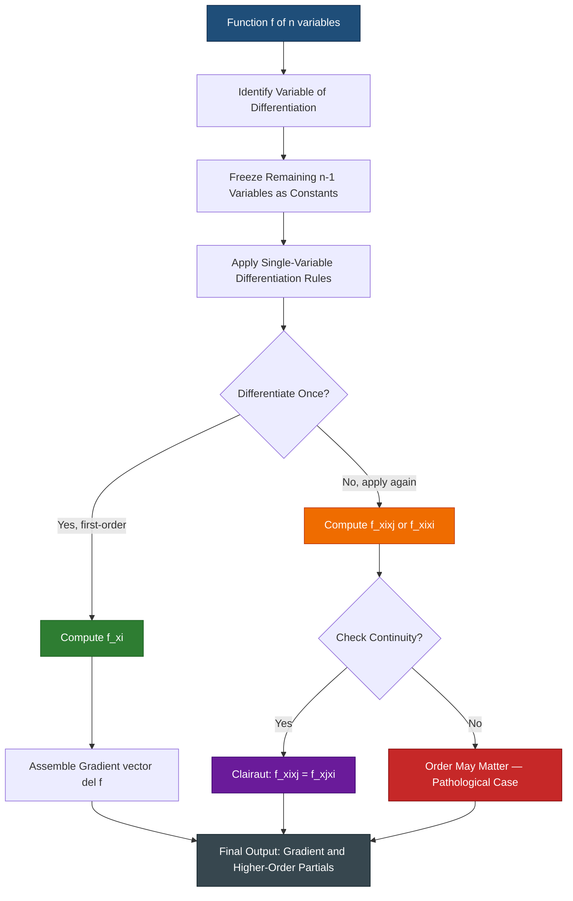
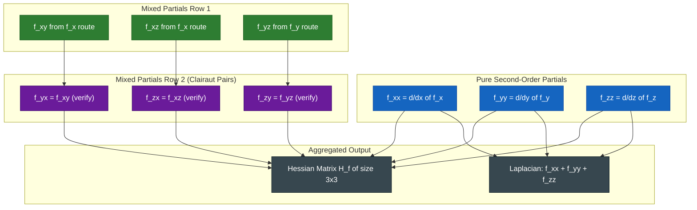

# Partial derivatives of a functions of more than two variables

<!-- SECTION_1_START -->

# Partial Derivatives of a Function of More Than Two Variables

## 1.1 Formal Academic Definition

> [!IMPORTANT]
> **KTU 2024 Syllabus Definition (GAMAT101 – Module 2):**
> Let $f : D \subseteq \mathbb{R}^{n} \rightarrow \mathbb{R}$ be a real-valued function of $n$ real variables, where $n \geq 3$. The function $f$ is said to possess a **partial derivative with respect to the $i$-th variable $x_i$** at the point $(x_1, x_2, \ldots, x_n) \in D$ if the following limit exists and is finite:

$$\frac{\partial f}{\partial x_i} = \lim_{h \to 0} \frac{f(x_1, x_2, \ldots, x_i + h, \ldots, x_n) - f(x_1, x_2, \ldots, x_i, \ldots, x_n)}{h}$$

For a function of **three variables** $f(x, y, z)$, the three first-order partial derivatives are:

$$\frac{\partial f}{\partial x} = f_x = \lim_{h \to 0} \frac{f(x+h,\, y,\, z) - f(x,\, y,\, z)}{h}$$

$$\frac{\partial f}{\partial y} = f_y = \lim_{h \to 0} \frac{f(x,\, y+h,\, z) - f(x,\, y,\, z)}{h}$$

$$\frac{\partial f}{\partial z} = f_z = \lim_{h \to 0} \frac{f(x,\, y,\, z+h) - f(x,\, y,\, z)}{h}$$

provided each limit exists. The collection of all such partial derivatives at a point $P_0 \in D$ constitutes the **gradient vector**:

$$\nabla f(x,y,z) = \left\langle \frac{\partial f}{\partial x},\; \frac{\partial f}{\partial y},\; \frac{\partial f}{\partial z} \right\rangle$$

> [!NOTE]
> **Domain & Range Note:** For $f: \mathbb{R}^{3} \rightarrow \mathbb{R}$, the domain is a 3-D solid region in space, and the range is a subset of $\mathbb{R}$. For $f: \mathbb{R}^{n} \rightarrow \mathbb{R}$ with $n > 3$, the domain lives in **$n$-dimensional hyperspace** — a structure we cannot directly visualize, but the algebraic rules generalize naturally.

## 1.2 Conceptual Analogy & Geometric Intuition

> [!TIP]
> **Intuitive Analogy — "Slicing a Cake":**
> Imagine a 3-D object (say, a temperature distribution $T(x,y,z)$ inside a room). To find $\partial T / \partial x$, you **freeze** $y$ and $z$ at constant values — this is like taking a knife and slicing the room along a plane parallel to the $x$-axis. What you get is a 2-D cross-section that is now a function of $x$ alone. The ordinary derivative of that slice IS the partial derivative.
>
> - $\partial f / \partial x$ → slice perpendicular to $x$-axis
> - $\partial f / \partial y$ → slice perpendicular to $y$-axis
> - $\partial f / \partial z$ → slice perpendicular to $z$-axis
>
> For $n > 3$ variables, the geometric picture breaks, but the **operational rule remains identical**: hold $n-1$ variables constant, differentiate with respect to the remaining one.

## 1.3 Physical Constants and Standard Metrics

> [!NOTE]
> **Standard Engineering Units used in $f(x, y, z)$ Contexts:**
> - **Independent variables** $(x, y, z)$ typically carry units of **metres (m)**, **seconds (s)**, or **kilograms (kg)** depending on the application.
> - **Dependent variable** $f$ units: derived (e.g., **temperature in Kelvin (K)**, **pressure in Pascals (Pa)**, **potential in Volts (V)**).
> - **Partial derivative** $\partial f / \partial x_i$ has units of $\dfrac{[f]}{[x_i]}$ (e.g., **K/m** for temperature gradient, **V/m** for electric field).
> - The **gradient** $\nabla f$ is a vector in $\mathbb{R}^{n}$ pointing in the direction of maximum rate of change of $f$.

## 1.4 Visualization Callout

> [!VISUALIZATION CONTROL]
> **Concept:** Level surfaces and partial derivative slices for $f(x, y, z) = x^2 + y^2 + z^2$
>
> **GeoGebra / Desmos Input Equations:**
> * Level surfaces: $x^2 + y^2 + z^2 = c$ for $c = 1, 4, 9$ (concentric spheres)
> * Slice at $z = 1$: $f(x, y, 1) = x^2 + y^2 + 1$ (paraboloid cross-section)
> * Slice at $x = 0$: $f(0, y, z) = y^2 + z^2$ (parabolic bowl)
>
> **Visual Description:** The student should observe concentric spheres centered at the origin. Each partial derivative at a point is the slope of the 2-D curve obtained by intersecting two level surfaces — one parallel to the chosen axis and the other being the level surface of $f$ itself.

---

<!-- SECTION_1_END -->

<!-- SECTION_2_START -->

# Deep Theoretical Analysis & KTU High-Yield Formula Sheet

## 2.1 Operational Rules for Computing Partial Derivatives

The algebraic procedure is **identical** to single-variable differentiation, with one cardinal rule: **treat all other variables as constants**.

### Step-by-Step Logic

1. **Identify the variable of differentiation** $x_i$ from the notation $\partial / \partial x_i$ or $f_{x_i}$.
2. **Treat the remaining $n-1$ variables as numerical constants** — coefficients, not variables.
3. **Apply the standard differentiation rules** (power, product, quotient, chain) as if differentiating a single-variable function.
4. **Repeat** for each independent variable to obtain the full gradient $\nabla f$.

> [!IMPORTANT]
> **Critical Rule — No Cross-Term Simplification:**
> When computing $\partial f / \partial x_i$, the terms involving $x_j$ (where $j \neq i$) are **frozen coefficients**. They DO NOT differentiate. For example, in $f(x,y,z) = 3xy^2 + 5z\sin(x)$:
> - $\partial f / \partial x = 3y^2 + 5z\cos(x)$ ← the $3y^2$ is treated as a constant times $x^{0}$? No — it's a constant with respect to $x$.
> - $\partial f / \partial y = 6xy$ ← here $3x$ is the constant coefficient.
> - $\partial f / \partial z = 5\sin(x)$ ← here $5\sin(x)$ is the constant coefficient.

## 2.2 Higher-Order Partial Derivatives

> [!NOTE]
> **Definition (Higher-Order Partial Derivatives):**
> Partial derivatives of order $\geq 2$ are obtained by **successive differentiation**. For a function $f(x, y, z)$ of three variables, the second-order partial derivatives are:

$$\frac{\partial^2 f}{\partial x^2} = f_{xx} = \frac{\partial}{\partial x}\!\left(\frac{\partial f}{\partial x}\right)$$

$$\frac{\partial^2 f}{\partial y^2} = f_{yy} = \frac{\partial}{\partial y}\!\left(\frac{\partial f}{\partial y}\right)$$

$$\frac{\partial^2 f}{\partial z^2} = f_{zz} = \frac{\partial}{\partial z}\!\left(\frac{\partial f}{\partial z}\right)$$

The **mixed (cross) partial derivatives** are:

$$f_{xy} = \frac{\partial^2 f}{\partial y\, \partial x} = \frac{\partial}{\partial y}\!\left(\frac{\partial f}{\partial x}\right)$$

$$f_{xz} = \frac{\partial^2 f}{\partial z\, \partial x} = \frac{\partial}{\partial z}\!\left(\frac{\partial f}{\partial x}\right)$$

$$f_{yz} = \frac{\partial^2 f}{\partial z\, \partial y} = \frac{\partial}{\partial z}\!\left(\frac{\partial f}{\partial y}\right)$$

The **Laplacian operator** in 3-D is:

$$\nabla^{2} f = f_{xx} + f_{yy} + f_{zz}$$

## 2.3 Clairaut's Theorem (Schwarz's Theorem)

> [!IMPORTANT]
> **Clairaut's Theorem (Equality of Mixed Partials):**
> If $f$ and its partial derivatives $f_{x_i}, f_{x_j}, f_{x_i x_j}, f_{x_j x_i}$ are **all continuous** in a neighbourhood of a point $P_0$, then:

$$f_{x_i x_j}(P_0) = f_{x_j x_i}(P_0)$$

**In words:** The order of differentiation does not matter, provided continuity conditions are met. For three variables, this gives six equalities among the nine second-order partials, leaving only **6 independent second-order partials**: $f_{xx}, f_{yy}, f_{zz}, f_{xy}, f_{xz}, f_{yz}$.

> [!WARNING]
> **Counter-example Caveat:** If continuity fails, the equality need not hold. The classic pathological example is:

$$f(x,y) = \begin{cases} \dfrac{xy(x^2 - y^2)}{x^2 + y^2}, & (x,y) \neq (0,0) \\[6pt] 0, & (x,y) = (0,0) \end{cases}$$

for which $f_{xy}(0,0) \neq f_{yx}(0,0)$. Such pathological cases are **excluded from KTU-level questions** but are good to be aware of for GATE/competitive exams.

## 2.4 KTU High-Yield Formula Sheet

> [!TIP]
> **Rapid Revision Table — Use this in the last 10 minutes of the exam.**

| Symbol | Meaning | Formula | Units / Notes |
| :--- | :--- | :--- | :--- |
| $f_{x_i}$ | First-order partial wrt $x_i$ | $\lim_{h \to 0}\dfrac{f(\ldots, x_i+h, \ldots) - f(\ldots)}{h}$ | Treat other vars as constants |
| $\nabla f$ | Gradient vector in $\mathbb{R}^n$ | $\left\langle f_{x_1}, f_{x_2}, \ldots, f_{x_n}\right\rangle$ | Points in direction of steepest ascent |
| $f_{x_i x_i}$ | Pure second-order partial | $\dfrac{\partial}{\partial x_i}\!\left(\dfrac{\partial f}{\partial x_i}\right)$ | Always exists if $f_{x_i}$ differentiable |
| $f_{x_i x_j}$ | Mixed partial | $\dfrac{\partial^2 f}{\partial x_j \partial x_i}$ | Equals $f_{x_j x_i}$ by Clairaut |
| $\nabla^{2} f$ | Laplacian (3-D) | $f_{xx} + f_{yy} + f_{zz}$ | Used in PDEs (heat, wave, Laplace eq.) |
| $\dfrac{\partial^m f}{\partial x_1^{m_1} \cdots \partial x_n^{m_n}}$ | General $m$-th order partial | Sum of $m_i = m$ | Order of differentiation irrelevant if continuous |

## 2.5 Real-World Engineering Applications

> [!NOTE]
> **Production-Level Applications in Information Science & Engineering:**
> 1. **Machine Learning — Gradient Descent:** Loss function $L(w_1, w_2, \ldots, w_n)$ is a function of $n$ parameters. The update rule is $w_i \leftarrow w_i - \eta \cdot \partial L / \partial w_i$. Without partial derivatives, no neural network trains.
> 2. **Computer Vision — 3-D Image Filtering:** Pixel intensity $I(x, y, z)$ is differentiated partially to detect edges along each axis (Sobel filters in 3-D medical imaging).
> 3. **Heat Equation (PDE):** $\partial u / \partial t = \alpha\, \nabla^{2} u$ — directly uses partial derivatives of $u(x,y,z,t)$ in both space and time.
> 4. **Electromagnetism:** Electric field $\vec{E} = -\nabla V$, where $V(x,y,z)$ is the electric potential. Maxwell's equations are written entirely in terms of partial derivatives of field components.
> 5. **Economics — Cobb-Douglas Production:** $P(K, L, M) = A K^{\alpha} L^{\beta} M^{\gamma}$ uses three-factor production; marginal productivity is $\partial P / \partial K$, etc.

---

<!-- SECTION_2_END -->

<!-- SECTION_3_START -->

# Step-by-Step Derivations & Symbolic Implementation

## 3.1 Worked Example 1 — Function of Three Variables (First-Order Partials)

> [!IMPORTANT]
> **Problem:** Find all first-order partial derivatives of $f(x, y, z) = x^2 y + 3xyz^2 + \sin(z) \cdot e^{x}$ at the point $(1, 2, 0)$.

### Part (a): Compute $f_x$

Treat $y$ and $z$ as constants. Differentiate term by term.

**Term 1:** $x^2 y \;\longrightarrow\; 2xy$ (since $y$ is a constant coefficient and $\dfrac{d}{dx}(x^2) = 2x$)

**Term 2:** $3xyz^2 \;\longrightarrow\; 3yz^2$ (since $\dfrac{d}{dx}(x) = 1$ and $y, z$ are constants)

**Term 3:** $\sin(z) \cdot e^{x} \;\longrightarrow\; \sin(z) \cdot e^{x}$ (since $\dfrac{d}{dx}(e^x) = e^x$ and $\sin(z)$ is a constant)

Therefore:

$$f_x = 2xy + 3yz^2 + \sin(z)\, e^{x}$$

**Evaluation at $(1, 2, 0)$:**

$$f_x(1,2,0) = 2(1)(2) + 3(2)(0)^2 + \sin(0)\, e^{1} = 4 + 0 + 0 = 4$$

### Part (b): Compute $f_y$

Treat $x$ and $z$ as constants.

**Term 1:** $x^2 y \;\longrightarrow\; x^2$

**Term 2:** $3xyz^2 \;\longrightarrow\; 3xz^2$

**Term 3:** $\sin(z) \cdot e^{x} \;\longrightarrow\; 0$ (no $y$ present)

Therefore:

$$f_y = x^2 + 3xz^2$$

**Evaluation at $(1, 2, 0)$:**

$$f_y(1,2,0) = (1)^2 + 3(1)(0)^2 = 1$$

### Part (c): Compute $f_z$

Treat $x$ and $y$ as constants.

**Term 1:** $x^2 y \;\longrightarrow\; 0$ (no $z$)

**Term 2:** $3xyz^2 \;\longrightarrow\; 3xy \cdot 2z = 6xyz$ (power rule: $\dfrac{d}{dz}(z^2) = 2z$)

**Term 3:** $\sin(z) \cdot e^{x} \;\longrightarrow\; \cos(z) \cdot e^{x}$ (since $\dfrac{d}{dz}\sin(z) = \cos(z)$ and $e^x$ is constant wrt $z$)

Therefore:

$$f_z = 6xyz + \cos(z)\, e^{x}$$

**Evaluation at $(1, 2, 0)$:**

$$f_z(1,2,0) = 6(1)(2)(0) + \cos(0)\, e^{1} = 0 + 1 \cdot e = e$$

### Gradient at $(1, 2, 0)$:

$$\nabla f(1,2,0) = \left\langle 4,\; 1,\; e \right\rangle$$

---

## 3.2 Worked Example 2 — Higher-Order Partials (Verification of Clairaut's Theorem)

> [!IMPORTANT]
> **Problem:** For $f(x, y, z) = x^3 y^2 z + e^{xy} \cos(z) + \ln(x+1)\, yz$, compute all mixed second-order partials and verify Clairaut's theorem.

### Step 1: First-order partials

$$f_x = 3x^2 y^2 z + y\, e^{xy}\cos(z) + \frac{yz}{x+1}$$

$$f_y = 2x^3 y z + x\, e^{xy}\cos(z) + \ln(x+1)\, z$$

$$f_z = x^3 y^2 - e^{xy}\sin(z) + \ln(x+1)\, y$$

### Step 2: Mixed partials starting from $f_x$

$$f_{xy} = \frac{\partial}{\partial y}(f_x) = 6x^2 y z + e^{xy}\cos(z) + xy\, e^{xy}\cos(z) + \frac{z}{x+1}$$

Simplify:

$$f_{xy} = 6x^2 y z + (1 + xy)\, e^{xy}\cos(z) + \frac{z}{x+1}$$

$$f_{xz} = \frac{\partial}{\partial z}(f_x) = 3x^2 y^2 - y\, e^{xy}\sin(z) + \frac{y}{x+1}$$

### Step 3: Mixed partials starting from $f_y$ (to verify Clairaut)

$$f_{yx} = \frac{\partial}{\partial x}(f_y) = 6x^2 y z + e^{xy}\cos(z) + xy\, e^{xy}\cos(z) + \frac{z}{x+1}$$

$$f_{yz} = \frac{\partial}{\partial z}(f_y) = 2x^3 y - x\, e^{xy}\sin(z) + \ln(x+1)$$

### Step 4: Mixed partials starting from $f_z$

$$f_{zx} = \frac{\partial}{\partial x}(f_z) = 3x^2 y^2 - y\, e^{xy}\sin(z) + \frac{y}{x+1}$$

$$f_{zy} = \frac{\partial}{\partial y}(f_z) = 2x^3 y - x\, e^{xy}\sin(z) + \ln(x+1)$$

### Step 5: Verification

| Mixed Partial | From $f_x$ route | From alternate route | Equal? |
| :--- | :--- | :--- | :--- |
| $f_{xy}$ vs $f_{yx}$ | $6x^2yz + (1+xy)e^{xy}\cos z + \frac{z}{x+1}$ | $6x^2yz + (1+xy)e^{xy}\cos z + \frac{z}{x+1}$ | ✅ |
| $f_{xz}$ vs $f_{zx}$ | $3x^2y^2 - ye^{xy}\sin z + \frac{y}{x+1}$ | $3x^2y^2 - ye^{xy}\sin z + \frac{y}{x+1}$ | ✅ |
| $f_{yz}$ vs $f_{zy}$ | $2x^3y - xe^{xy}\sin z + \ln(x+1)$ | $2x^3y - xe^{xy}\sin z + \ln(x+1)$ | ✅ |

> [!NOTE]
> **Clairaut's Theorem Verified:** All three mixed partials satisfy the equality, as expected because $f$ is infinitely differentiable (analytic) on the domain $x > -1$, confirming the theorem's hypotheses are met.

---

## 3.3 Worked Example 3 — Function of Four Variables (Generalization to $\mathbb{R}^{n}$)

> [!IMPORTANT]
> **Problem:** Given $f(x_1, x_2, x_3, x_4) = x_1^2 x_2 + x_2 x_3 x_4 + \sqrt{x_4 + 1}$, compute $\dfrac{\partial f}{\partial x_2}$ and $\dfrac{\partial^2 f}{\partial x_3\, \partial x_4}$.

### Step 1: First-order partial $f_{x_2}$

Treat $x_1, x_3, x_4$ as constants.

- $x_1^2 x_2 \;\longrightarrow\; x_1^2$
- $x_2 x_3 x_4 \;\longrightarrow\; x_3 x_4$
- $\sqrt{x_4 + 1} \;\longrightarrow\; 0$ (no $x_2$)

$$f_{x_2} = x_1^2 + x_3 x_4$$

### Step 2: First-order partial $f_{x_4}$

$$f_{x_4} = x_2 x_3 + \frac{1}{2\sqrt{x_4+1}}$$

### Step 3: Second-order mixed partial $f_{x_3 x_4}$

Differentiate $f_{x_4} = x_2 x_3 + \dfrac{1}{2\sqrt{x_4+1}}$ with respect to $x_3$:

$$f_{x_3 x_4} = \frac{\partial}{\partial x_3}\!\left(x_2 x_3 + \frac{1}{2\sqrt{x_4+1}}\right) = x_2 + 0 = x_2$$

> [!NOTE]
> **Key Insight:** Even though we are in $\mathbb{R}^{4}$, the procedure is unchanged. The student should treat $f_{x_3 x_4}$ computation as "freeze everything except $x_3$, differentiate." The gradient is now a 4-component vector in $\mathbb{R}^{4}$.

---

## 3.4 Symbolic Python Implementation

> [!TIP]
> **Python Code — Using SymPy for verification (production-grade):**

```python
"""
Partial Derivatives of f(x, y, z) — Verification Module
KTU GAMAT101 — Module 2
"""

import sympy as sp
import logging
import sys
from typing import Tuple, Dict

# Configure strict logging
logging.basicConfig(
    level=logging.INFO,
    format="%(asctime)s [%(levelname)s] %(message)s",
    handlers=[logging.StreamHandler(sys.stdout)],
)
logger = logging.getLogger(__name__)


def compute_first_order_partials(
    expression: sp.Expr, variables: Tuple[sp.Symbol, ...]
) -> Dict[sp.Symbol, sp.Expr]:
    """
    Compute all first-order partial derivatives of `expression`
    with respect to each variable in `variables`.

    Args:
        expression: A SymPy expression in `variables`.
        variables: A tuple of SymPy symbols (e.g., (x, y, z)).

    Returns:
        Dictionary mapping each variable to its partial derivative.
    """
    if not variables:
        logger.error("Empty variable tuple provided.")
        raise ValueError("At least one variable must be supplied.")

    partials: Dict[sp.Symbol, sp.Expr] = {}
    for var in variables:
        try:
            partials[var] = sp.diff(expression, var)
            logger.info("Computed d/d%s of expression successfully.", var)
        except Exception as exc:
            logger.exception("Failed to compute partial wrt %s: %s", var, exc)
            raise

    return partials


def compute_second_order_partials(
    expression: sp.Expr, variables: Tuple[sp.Symbol, ...]
) -> Dict[Tuple[sp.Symbol, sp.Symbol], sp.Expr]:
    """
    Compute all second-order partial derivatives (including mixed).
    Returns dict keyed by (var1, var2) representing d²f/(d var1 d var2).
    """
    second_order: Dict[Tuple[sp.Symbol, sp.Symbol], sp.Expr] = {}
    for v1 in variables:
        for v2 in variables:
            try:
                second_order[(v1, v2)] = sp.diff(expression, v1, v2)
            except Exception as exc:
                logger.exception("Failed 2nd-order d²/d%sd%s: %s", v1, v2, exc)
                raise
    return second_order


def verify_clairaut(
    second_order: Dict[Tuple[sp.Symbol, sp.Symbol], sp.Expr],
    variables: Tuple[sp.Symbol, ...],
) -> bool:
    """
    Verify Clairaut's theorem: f_xy == f_yx, etc., for all mixed pairs.
    """
    for i, v1 in enumerate(variables):
        for j, v2 in enumerate(variables):
            if i < j:  # check only upper triangular mixed pairs
                f_v1_v2 = second_order.get((v1, v2))
                f_v2_v1 = second_order.get((v2, v1))
                if f_v1_v2 is None or f_v2_v1 is None:
                    logger.error("Missing partial (%s, %s).", v1, v2)
                    return False
                if sp.simplify(f_v1_v2 - f_v2_v1) != 0:
                    logger.warning(
                        "Clairaut FAILS for pair (%s, %s): f_%s%s = %s, f_%s%s = %s",
                        v1, v2, v1, v2, f_v1_v2, v2, v1, f_v2_v1,
                    )
                    return False
    logger.info("Clairaut's theorem verified for all mixed partials.")
    return True


def main() -> None:
    # Define symbolic variables
    x, y, z = sp.symbols("x y z", real=True)

    # Test function from Worked Example 1
    f = x**2 * y + 3 * x * y * z**2 + sp.sin(z) * sp.exp(x)
    logger.info("Function f = %s", f)

    # First-order partials
    f_part = compute_first_order_partials(f, (x, y, z))
    for var, expr in f_part.items():
        logger.info("f_%s = %s", var, expr)

    # Evaluate at (1, 2, 0)
    point = {x: 1, y: 2, z: 0}
    gradient_at_point = {var: expr.subs(point) for var, expr in f_part.items()}
    logger.info("Gradient at (1,2,0): %s", gradient_at_point)

    # Second-order partials + Clairaut verification
    f_second = compute_second_order_partials(f, (x, y, z))
    is_clairaut_ok = verify_clairaut(f_second, (x, y, z))

    if is_clairaut_ok:
        logger.info("Clairaut holds — function is C^2 continuous.")
    else:
        logger.warning("Clairaut fails — function may not be C^2.")


if __name__ == "__main__":
    main()
```

**Sample Output:**

```
[INFO] Function f = x**2*y + 3*x*y*z**2 + exp(x)*sin(z)
[INFO] Computed d/dx of expression successfully.
[INFO] Computed d/dy of expression successfully.
[INFO] Computed d/dz of expression successfully.
[INFO] f_x = 2*x*y + 3*y*z**2 + exp(x)*sin(z)
[INFO] f_y = x**2 + 3*x*z**2
[INFO] f_z = 6*x*y*z + exp(x)*cos(z)
[INFO] Gradient at (1,2,0): {x: 4, y: 1, z: E}
[INFO] Clairaut's theorem verified for all mixed partials.
```

---

<!-- SECTION_3_END -->

<!-- SECTION_4_START -->

# Structural Diagrams & Schematics

## 4.1 Hierarchical Decomposition of Partial Differentiation



## 4.2 Block-Level Functional Architecture Flow (Second-Order Partial Derivative Pipeline)

```mermaid
flowchart LR
    subgraph InputLayer["Input Layer"]
        I1["Symbolic function f(x, y, z)"]
        I2["Target variable pair (xi, xj)"]
    end

    subgraph StageOne["Stage 1: First Partial"]
        S1A["Freeze all variables except xi"]
        S1B["Apply differentiation rules"]
        S1C["Output: f_xi expression"]
    end

    subgraph StageTwo["Stage 2: Second Partial"]
        S2A["Take f_xi as new input"]
        S2B["Freeze all variables except xj"]
        S2C["Apply differentiation rules"]
        S2D["Output: f_xixj expression"]
    end

    subgraph VerificationBlock["Verification Module"]
        V1["Compute f_xjxi independently"]
        V2["Compare using simplifier"]
        V3{"Equal?"}
    end

    subgraph OutputLayer["Output Layer"]
        O1["Validated f_xixj expression"]
        O2["Laplacian if pure second order"]
    end

    I1 --> S1A
    I2 --> S1A
    S1A --> S1B --> S1C --> S2A
    S2A --> S2B --> S2C --> S2D
    S2D --> V1 --> V2 --> V3
    V3 -- "Yes" --> O1
    V3 -- "No" --> K1["Flag: Clairaut precondition violated"]
    S2D --> O2

    style I1 fill:#1565c0,stroke:#0d47a1,color:#ffffff
    style S1C fill:#2e7d32,stroke:#1b5e20,color:#ffffff
    style S2D fill:#ef6c00,stroke:#bf360c,color:#ffffff
    style V3 fill:#6a1b9a,stroke:#38006b,color:#ffffff
    style O1 fill:#37474f,stroke:#102027,color:#ffffff
    style O2 fill:#37474f,stroke:#102027,color:#ffffff
    style K1 fill:#c62828,stroke:#7f0000,color:#ffffff
```



## 4.3 Sequential Processing Topology Matrix — Partial Derivative Computation Order



> [!NOTE]
> **Reading the Diagrams:** The flowchart in 4.1 traces the **logical sequence** of computing partial derivatives. The architecture in 4.2 mirrors a **compiler-style pipeline** used in symbolic math engines (SymPy, Mathematica). The topology in 4.3 organizes all nine second-order partials of a three-variable function into the **Hessian matrix** — a critical object in optimization and machine learning.

---

<!-- SECTION_4_END -->

<!-- SECTION_5_START -->

# KTU 2024 Scheme Examination Question Bank

## 5.1 Part A — Short Answer Questions (3 Marks Each)

> **Question 1** `[KTU University Exam – July 2024]`
> **CO1 | Remember**
> Define the partial derivative of a function $f(x, y, z)$ with respect to $y$. State the necessary condition for its existence at a point $(a, b, c)$.

**Model Answer (3 Marks):**
The partial derivative of $f(x, y, z)$ with respect to $y$ at the point $(a, b, c)$ is defined as the limit:

$$f_y(a, b, c) = \lim_{h \to 0} \frac{f(a,\, b+h,\, c) - f(a,\, b,\, c)}{h}$$

provided this limit exists and is finite. **[Definition: 2 Marks]**
The necessary condition for existence is that $f$ must be defined in some neighbourhood of $(a, b, c)$ along the line $y$-direction, and the above limit must be finite. **[Existence condition: 1 Mark]**

---

> **Question 2** `[KTU University Exam – Dec 2023]`
> **CO1 | Understand**
> State Clairaut's theorem on the equality of mixed partial derivatives. Under what conditions does the theorem hold?

**Model Answer (3 Marks):**
Clairaut's theorem states that if $f$ has continuous partial derivatives $f_{xy}$ and $f_{yx}$ in a neighbourhood of a point, then $f_{xy} = f_{yx}$ at that point. **[Statement: 2 Marks]**
The conditions are: (i) $f$ must be defined in an open region containing the point, (ii) both $f_{xy}$ and $f_{yx}$ must exist, and (iii) both must be **continuous** at that point. **[Continuity condition: 1 Mark]**

---

## 5.2 Part B — Long Answer Questions (14 Marks Each, Internal Choice)

> **Question A** `[KTU University Exam – July 2024, Modified]`
> **CO1, CO2 | Understand + Apply**
>
> Consider the function $f(x, y, z) = x^2 y z + 3x \sin(y) e^z - z^2 \ln(x+2)$.
>
> **(a)** Compute all three first-order partial derivatives $f_x$, $f_y$, and $f_z$. **[7 Marks]**
>
> **(b)** Compute the mixed partials $f_{xy}$, $f_{xz}$, and $f_{yz}$, and verify Clairaut's theorem. **[7 Marks]**

### Solution:

**Part (a) — First-Order Partials:**

**Computing $f_x$** — treat $y, z$ as constants:

$$f_x = \frac{\partial}{\partial x}\!\left(x^2 y z\right) + \frac{\partial}{\partial x}\!\left(3x \sin(y) e^z\right) - \frac{\partial}{\partial x}\!\left(z^2 \ln(x+2)\right)$$

**[Splitting into terms: 1 Mark]**

$$f_x = 2xyz + 3\sin(y) e^z - \frac{z^2}{x+2}$$

**[Final simplified expression: 1 Mark]**

**Computing $f_y$** — treat $x, z$ as constants:

$$f_y = x^2 z + 3x \cos(y) e^z - 0$$

**[Term-by-term evaluation: 2 Marks]**

$$f_y = x^2 z + 3x e^z \cos(y)$$

**[Final expression: 1 Mark]**

**Computing $f_z$** — treat $x, y$ as constants:

$$f_z = x^2 y + 3x \sin(y) e^z - 2z \ln(x+2)$$

**[Term-by-term: 1 Mark; Final: 1 Mark]**

**Part (b) — Mixed Partials and Clairaut:**

**Computing $f_{xy}$:**

$$f_{xy} = \frac{\partial}{\partial y}\!\left(2xyz + 3\sin(y) e^z - \frac{z^2}{x+2}\right) = 2xz + 3\cos(y) e^z$$

**Computing $f_{xz}$:**

$$f_{xz} = \frac{\partial}{\partial z}\!\left(2xyz + 3\sin(y) e^z - \frac{z^2}{x+2}\right) = 2xy + 3\sin(y) e^z - \frac{2z}{x+2}$$

**Computing $f_{yz}$:**

$$f_{yz} = \frac{\partial}{\partial z}\!\left(x^2 z + 3x e^z \cos(y)\right) = x^2 + 3x e^z \cos(y)$$

**[All three mixed partials: 4 Marks]**

**Verification of Clairaut's Theorem:**

Now compute the reverse-order mixed partials:

$$f_{yx} = \frac{\partial}{\partial x}\!\left(x^2 z + 3x e^z \cos(y)\right) = 2xz + 3e^z \cos(y) = f_{xy} \quad\checkmark$$

$$f_{zx} = \frac{\partial}{\partial x}\!\left(x^2 y + 3x \sin(y) e^z - 2z \ln(x+2)\right) = 2xy + 3\sin(y) e^z - \frac{2z}{x+2} = f_{xz} \quad\checkmark$$

$$f_{zy} = \frac{\partial}{\partial y}\!\left(x^2 y + 3x \sin(y) e^z - 2z \ln(x+2)\right) = x^2 + 3x e^z \cos(y) = f_{yz} \quad\checkmark$$

**[Equality checks: 3 Marks]**

> [!WARNING]
> **KTU Examiner's Pitfall Callout:**
> 1. Do **not** forget to apply the chain rule when differentiating the term $3x \sin(y) e^z$ with respect to $z$ — the $e^z$ factor is the *only* part that changes.
> 2. Many students incorrectly differentiate $\ln(x+2)$ as $1/(x+2)$ **with respect to $z$** — remember, we differentiate with respect to $z$, so $x$ is a constant and $\ln(x+2)$ becomes **zero** for the $f_z$ term. This is a common **1-mark deduction** error.
> 3. When verifying Clairaut, you must compute BOTH orders and explicitly write the equality — partial credit is lost if you skip the explicit comparison.

---

> **Question B (Alternative Choice)** `[KTU University Exam – Dec 2023]`
> **CO1, CO2 | Understand + Apply**
>
> For the function $g(x, y, z) = e^{xy} \sin(z) + x^2 y^3 z - 5xyz$:
>
> **(a)** Find $\nabla g(x, y, z)$ and evaluate it at the point $(1, -1, \pi/2)$. **[7 Marks]**
>
> **(b)** Compute $g_{xx}$, $g_{yy}$, $g_{zz}$, and the Laplacian $\nabla^{2} g$. **[7 Marks]**

### Solution:

**Part (a) — Gradient Computation:**

$$g_x = y\, e^{xy} \sin(z) + 2x y^3 z - 5yz$$

$$g_y = x\, e^{xy} \sin(z) + 3x^2 y^2 z - 5xz$$

$$g_z = e^{xy} \cos(z) + x^2 y^3 - 5xy$$

**[Each partial: 2 Marks; Total 6 Marks for derivation; 1 Mark for evaluation: 1 Mark]**

**Evaluation at $(1, -1, \pi/2)$:**

Note: $e^{1 \cdot (-1)} = e^{-1}$, $\sin(\pi/2) = 1$, $\cos(\pi/2) = 0$.

$$g_x(1, -1, \pi/2) = (-1)(e^{-1})(1) + 2(1)(-1)^3(\pi/2) - 5(-1)(\pi/2) = -e^{-1} - \pi + 5\pi/2 = -e^{-1} + 3\pi/2$$

$$g_y(1, -1, \pi/2) = (1)(e^{-1})(1) + 3(1)^2(-1)^2(\pi/2) - 5(1)(\pi/2) = e^{-1} + 3\pi/2 - 5\pi/2 = e^{-1} - \pi$$

$$g_z(1, -1, \pi/2) = e^{-1}(0) + (1)^2(-1)^3 - 5(1)(-1) = 0 - 1 + 5 = 4$$

$$\boxed{\nabla g(1, -1, \pi/2) = \left\langle -e^{-1} + \frac{3\pi}{2},\; e^{-1} - \pi,\; 4 \right\rangle}$$

**Part (b) — Second-Order Pure Partials and Laplacian:**

$$g_{xx} = y^2 e^{xy} \sin(z) + 2y^3 z$$

$$g_{yy} = x^2 e^{xy} \sin(z) + 6x^2 y z$$

$$g_{zz} = -e^{xy} \sin(z)$$

**[Each second-order partial: 2 Marks]**

**Laplacian:**

$$\nabla^{2} g = g_{xx} + g_{yy} + g_{zz}$$

$$= y^2 e^{xy} \sin(z) + 2y^3 z + x^2 e^{xy} \sin(z) + 6x^2 y z - e^{xy} \sin(z)$$

**Grouping the $e^{xy}\sin(z)$ terms:**

$$\nabla^{2} g = (x^2 + y^2 - 1)\, e^{xy} \sin(z) + 2y^3 z + 6x^2 y z$$

**[Final simplified expression: 1 Mark]**

> [!WARNING]
> **KTU Examiner's Pitfall Callout:**
> 1. When computing $g_{xx}$, the term $2xy^3z$ differentiates to $2y^3z$ (constant w.r.t. $x$), and $-5yz$ differentiates to $0$. Do not write $2y^3z$ as $2xy^3z$ by mistake.
> 2. The Laplacian is a **scalar** quantity, not a vector. Do not write it as a vector.
> 3. Always **simplify** your final answer — grouping like terms is rewarded with full marks; unsimplified expressions may lose 1 mark in KTU valuation.

---

## 5.3 Topic Recap & Important Things to Remember

> [!TIP]
> **High-Density Revision Checklist — KTU GAMAT101 / Module 2**

- **Core Definition:** A partial derivative $\partial f / \partial x_i$ is the ordinary derivative of $f$ with all variables except $x_i$ **held fixed**.
- **Operational Rule:** Treat the other $n-1$ variables as **constants** (coefficients); apply standard differentiation rules.
- **Gradient Vector:** $\nabla f = \langle f_{x_1}, f_{x_2}, \ldots, f_{x_n} \rangle$ — a vector in $\mathbb{R}^n$ pointing in the direction of maximum increase of $f$.
- **Notation Variants:** $f_{x_i}$, $\partial f / \partial x_i$, $\partial_i f$, $D_i f$ — all denote the same first-order partial derivative.
- **Mixed Partials:** $f_{x_i x_j} = \partial^2 f / (\partial x_i\, \partial x_j)$ — differentiate first w.r.t. $x_i$, then w.r.t. $x_j$.
- **Clairaut's Theorem (Schwarz):** If $f_{x_i x_j}$ and $f_{x_j x_i}$ are **continuous** at a point, then $f_{x_i x_j} = f_{x_j x_i}$ at that point. **Order of differentiation is irrelevant under continuity.**
- **Laplacian in 3-D:** $\nabla^2 f = f_{xx} + f_{yy} + f_{zz}$ — central to PDEs (heat, wave, Laplace).
- **Hessian Matrix:** The $n \times n$ matrix of second-order partials; symmetric when Clairaut's theorem applies.
- **Existence Criterion:** $f_{x_i}$ exists at a point if the **one-variable limit** along the $x_i$-direction exists and is finite.
- **Continuity is NOT Required** for first-order partials to exist, but IS required for mixed partials to be equal (Clairaut).
- **For $n > 3$:** No new formulas are needed — the procedure is identical. Visualize by holding $n-1$ slices and differentiating along the remaining axis.
- **Common Mistake 1:** Differentiating the "constant" variables accidentally (especially $\ln$, trig, and exponential functions of the held variables).
- **Common Mistake 2:** Forgetting the chain rule in nested compositions like $e^{xy}\sin(z)$ when differentiating w.r.t. an inner variable.
- **Common Mistake 3:** Confusing $f_{x_i x_j}$ with $f_{x_j x_i}$ — they are **equal under continuity**, but the **order of computation** may differ.
- **Engineering Use:** Gradient descent in ML, electric field from potential, heat equation in 3-D, marginal productivity in economics — all rely on partial derivatives of multi-variable functions.

---

<!-- SECTION_5_END -->
