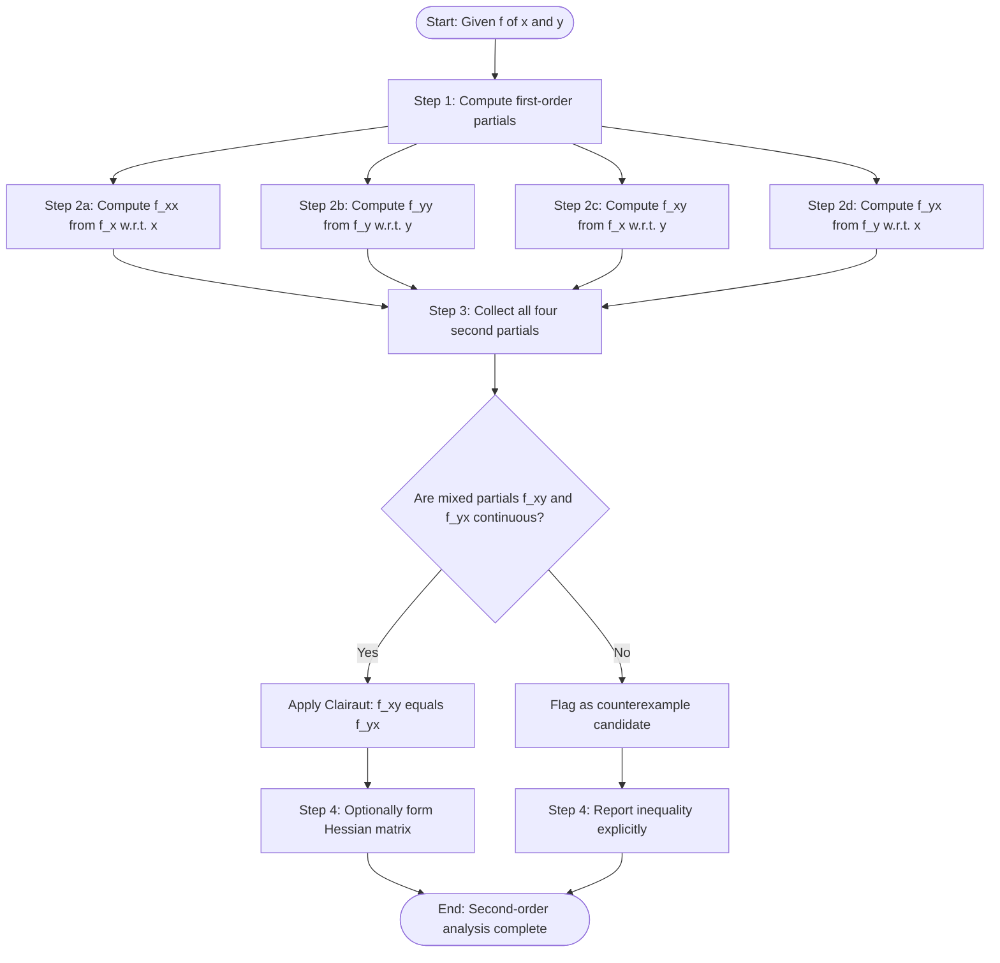
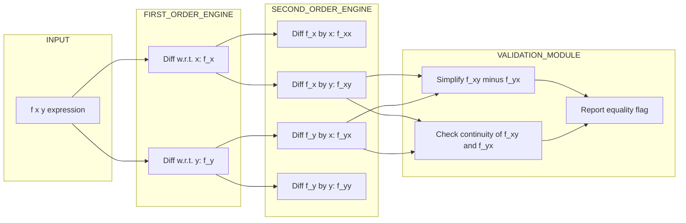
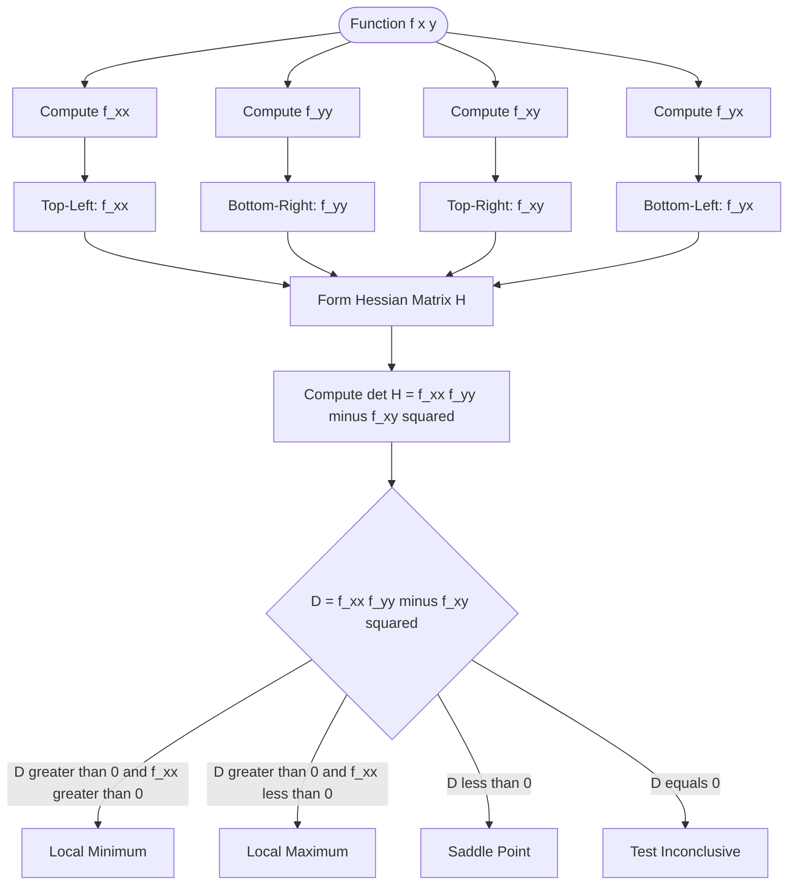

# Second-Order partial derivatives

<!-- SECTION_1_START -->
# Second-Order Partial Derivatives — Foundational Overview

> [!NOTE]
> **KTU 2024 Scheme — Module 2 Reference**
> *Course:* GAMAT101 — Mathematics for Information Science – 1
> *Sub-topic:* Higher-Order Differentiation of Multivariable Functions
> *Prerequisite Clarity:* First-order partial derivatives $\partial f / \partial x$ and $\partial f / \partial y$ must be internalized.

## 1.1 Formal Academic Definition

Let $f: \mathbb{R}^2 \to \mathbb{R}$ be a function of two independent variables $x$ and $y$. A **second-order partial derivative** of $f$ is the partial derivative of a first-order partial derivative with respect to either $x$ or $y$, evaluated while holding the other variable constant.

There are precisely **four** distinct second-order partial derivatives for a function $f(x,y)$:

$$
\frac{\partial}{\partial x}\left( \frac{\partial f}{\partial x} \right) \;=\; \frac{\partial^2 f}{\partial x^2}
\qquad
\frac{\partial}{\partial y}\left( \frac{\partial f}{\partial y} \right) \;=\; \frac{\partial^2 f}{\partial y^2}
$$

$$
\frac{\partial}{\partial y}\left( \frac{\partial f}{\partial x} \right) \;=\; \frac{\partial^2 f}{\partial y\,\partial x}
\qquad
\frac{\partial}{\partial x}\left( \frac{\partial f}{\partial y} \right) \;=\; \frac{\partial^2 f}{\partial x\,\partial y}
$$

> [!IMPORTANT]
> **KTU Board Terminology — Memorize These Labels**
> 1. $\dfrac{\partial^2 f}{\partial x^2}$ → **Pure second-order partial w.r.t. $x$** (differentiation twice in the *same* direction).
> 2. $\dfrac{\partial^2 f}{\partial y^2}$ → **Pure second-order partial w.r.t. $y$**.
> 3. $\dfrac{\partial^2 f}{\partial y\,\partial x}$ and $\dfrac{\partial^2 f}{\partial x\,\partial y}$ → **Mixed (or cross) second-order partials** (differentiation in *both* directions).

---

## 1.2 Conceptual Analogy & Intuition

> [!TIP]
> **The "Photo-Editing" Intuition**
> Imagine a grayscale image $f(x,y)$ where pixel brightness is a function of horizontal position $x$ and vertical position $y$.
> * The **first-order partial** $\partial f / \partial x$ tells you *how fast brightness changes when you slide right*. The **second-order partial** $\partial^2 f / \partial x^2$ tells you *how that rate-of-change itself bends* — i.e., whether the slope is steepening (edge onset) or flattening (smooth plateau).
> * A **mixed partial** $\partial^2 f / \partial x\,\partial y$ measures *curvature along the diagonal direction* — how brightness changes when you first move right, then move up (or vice versa). Under smooth conditions, the order does not matter, which is why these mixed partials are equal.

A second derivative is therefore a *measure of curvature or concavity* in a multivariable landscape. A positive $\partial^2 f / \partial x^2$ indicates the surface is **concave up** in the $x$-direction (like a bowl along $x$); a negative value means it bends **downward**.

---

## 1.3 Notation Conventions (KTU Board Standard)

For $z = f(x,y)$, the four standard notations for mixed partials are:

$$
f_{xy} \;=\; f_{yx} \;=\; \frac{\partial^2 z}{\partial x\,\partial y} \;=\; \frac{\partial^2 z}{\partial y\,\partial x} \;=\; z_{xy} \;=\; z_{yx}
$$

> [!WARNING]
> **Order of Subscripts is Crucial**
> $f_{xy}$ means: first differentiate w.r.t. $x$, then differentiate the result w.r.t. $y$. Reading right-to-left is the *operation* order; left-to-right is the *index* order. KTU examiners will mark you down if you reverse the convention.

---

## 1.4 GeoGebra / Desmos Visualization

> [!VISUALIZATION CONTROL]
> **Concept:** 3-D Surface Curvature Detection for $f(x,y) = x^3 + y^3 - 3xy$
> **GeoGebra / Desmos Input Equations (3-D Graphing):**
> * `f(x, y) = x^3 + y^3 - 3*x*y`
> * `f_xx(x, y) = 6*x`
> * `f_yy(x, y) = 6*y`
> * `f_xy(x, y) = -3`
> **Visual Description:** Plot the saddle surface $f$. The pure partial $f_{xx} = 6x$ is *positive* in the right half-plane (concave up) and *negative* in the left. The mixed partial is the *constant* $-3$, meaning every point on the surface has the same "twist" along the diagonal — geometrically, the saddle is uniformly twisted.
<!-- SECTION_1_END -->

<!-- SECTION_2_START -->
# Deep Theoretical Analysis & KTU Formula Sheet

## 2.1 The Equality of Mixed Partials — Clairaut's Theorem (Schwarz's Theorem)

> [!IMPORTANT]
> **THEOREM (Clairaut / Schwarz)**
> Let $f(x,y)$ be defined on a disk $D$ containing the point $(a,b)$. If the functions $f$, $f_x$, $f_y$, $f_{xy}$, and $f_{yx}$ are all **continuous** on $D$, then:
> $$
> f_{xy}(a,b) \;=\; f_{yx}(a,b)
> $$

This is the most heavily tested result in KTU Module 2 on second-order partials. It tells us: **the order of mixed differentiation does not matter when the partial derivatives are continuous**.

> [!WARNING]
> **When does the equality FAIL?**
> It fails when the mixed partials are *not continuous* at the point. Classic counterexample for KTU:
> $$
> f(x,y) \;=\; \begin{cases} \dfrac{xy(x^2 - y^2)}{x^2 + y^2}, & (x,y) \neq (0,0) \\[2pt] 0, & (x,y) = (0,0) \end{cases}
> $$
> Here $f_{xy}(0,0) = 1$ but $f_{yx}(0,0) = -1$. KTU questions occasionally ask you to *find* this discontinuity and hence prove the inequality.

---

## 2.2 Algorithmic Workflow for Computing Second-Order Partials

**Step 1:** Compute $f_x(x,y)$ treating $y$ as constant.
**Step 2:** Compute $f_y(x,y)$ treating $x$ as constant.
**Step 3:** To get $f_{xx}$ → differentiate $f_x$ w.r.t. $x$ (treat $y$ as constant).
**Step 4:** To get $f_{yy}$ → differentiate $f_y$ w.r.t. $y$ (treat $x$ as constant).
**Step 5:** To get $f_{xy}$ → differentiate $f_x$ w.r.t. $y$ (treat $x$ as constant).
**Step 6:** To get $f_{yx}$ → differentiate $f_y$ w.r.t. $x$ (treat $y$ as constant).
**Step 7:** Verify $f_{xy} = f_{yx}$ using Clairaut's theorem (if both are continuous).

---

## 2.3 Extension to Three or More Variables

For $w = f(x,y,z)$, there are **nine** second-order partial derivatives:

$$
\frac{\partial^2 w}{\partial x^2},\;\; \frac{\partial^2 w}{\partial y^2},\;\; \frac{\partial^2 w}{\partial z^2},\;\; \frac{\partial^2 w}{\partial x \partial y},\;\; \frac{\partial^2 w}{\partial y \partial x},\;\; \frac{\partial^2 w}{\partial x \partial z},\;\; \frac{\partial^2 w}{\partial z \partial x},\;\; \frac{\partial^2 w}{\partial y \partial z},\;\; \frac{\partial^2 w}{\partial z \partial y}
$$

By Clairaut's theorem, the six mixed partials collapse into **three** independent equalities (e.g., $f_{xyz} = f_{yxz} = f_{zxy}$ provided continuity holds).

---

## 2.4 KTU High-Yield Formula Sheet

> [!NOTE]
> The following table consolidates every formula you must memorize for KTU 2024 ESE on this topic. **The notation $\vert \cdot \vert$ denotes absolute value where required.**

| Concept | Formula / Expression | Conditions / Notes |
| :--- | :--- | :--- |
| Pure second partial w.r.t. $x$ | $f_{xx} \;=\; \dfrac{\partial}{\partial x}\!\left( \dfrac{\partial f}{\partial x} \right)$ | $y$ held constant |
| Pure second partial w.r.t. $y$ | $f_{yy} \;=\; \dfrac{\partial}{\partial y}\!\left( \dfrac{\partial f}{\partial y} \right)$ | $x$ held constant |
| Mixed partial (first $x$, then $y$) | $f_{xy} \;=\; \dfrac{\partial}{\partial y}\!\left( \dfrac{\partial f}{\partial x} \right)$ | Read right-to-left for operations |
| Mixed partial (first $y$, then $x$) | $f_{yx} \;=\; \dfrac{\partial}{\partial x}\!\left( \dfrac{\partial f}{\partial y} \right)$ | Read right-to-left for operations |
| Clairaut's equality | $f_{xy} \;=\; f_{yx}$ | Both partials must be **continuous** at the point |
| Hessian determinant | $H(f) \;=\; f_{xx}\,f_{yy} - (f_{xy})^2$ | Used in second-derivative test for extrema |
| Third-order mixed (example) | $f_{xyy} \;=\; \dfrac{\partial}{\partial y}\!\left( \dfrac{\partial^2 f}{\partial y\,\partial x} \right)$ | All permutations equal under continuity |
| Order count for $n$ variables | $\dbinom{n+1}{2}$ independent second partials | For $n = 2$ → $\mathbf{3}$ independent; for $n = 3$ → $\mathbf{6}$ independent |

---

## 2.5 Real-World Utility in Information Science

1. **Machine Learning — Loss Surface Curvature:** The Hessian matrix $H(f)$, whose entries are second-order partials of the loss function $f$, determines the convergence speed of gradient descent. Newton's method uses $H^{-1}$ to rescale gradients.
2. **Image Processing:** Mixed partials act as edge-detection operators. The Laplacian $\nabla^2 f = f_{xx} + f_{yy}$ highlights regions of rapid intensity change (edges in an image).
3. **Computer Graphics:** Second-order partials define the *Gaussian curvature* of parametric surfaces, critical for realistic lighting and shading models.
4. **Optimization Algorithms:** Second-derivative tests classify critical points as local maxima, minima, or saddle points, forming the backbone of constrained optimization in operations research.
<!-- SECTION_2_END -->

<!-- SECTION_3_START -->
# Step-by-Step Derivations & Code Implementation

## 3.1 Worked Example 1 — Polynomial Function

**Problem:** For $f(x,y) = x^3 y^2 + 5x^2y - 7y^4 + 3x$, find all four second-order partial derivatives.

**Step 1 — Compute the first-order partials:**

$$
f_x \;=\; \frac{\partial f}{\partial x} \;=\; 3x^2 y^2 + 10xy + 3
$$

$$
f_y \;=\; \frac{\partial f}{\partial y} \;=\; 2x^3 y + 5x^2 - 28y^3
$$

**Step 2 — Compute $f_{xx}$ by differentiating $f_x$ w.r.t. $x$:**

$$
f_{xx} \;=\; \frac{\partial}{\partial x}\bigl(3x^2 y^2 + 10xy + 3\bigr) \;=\; 6xy^2 + 10y
$$

**Step 3 — Compute $f_{yy}$ by differentiating $f_y$ w.r.t. $y$:**

$$
f_{yy} \;=\; \frac{\partial}{\partial y}\bigl(2x^3 y + 5x^2 - 28y^3\bigr) \;=\; 2x^3 - 84y^2
$$

**Step 4 — Compute $f_{xy}$ by differentiating $f_x$ w.r.t. $y$:**

$$
f_{xy} \;=\; \frac{\partial}{\partial y}\bigl(3x^2 y^2 + 10xy + 3\bigr) \;=\; 6x^2 y + 10x
$$

**Step 5 — Compute $f_{yx}$ by differentiating $f_y$ w.r.t. $x$:**

$$
f_{yx} \;=\; \frac{\partial}{\partial x}\bigl(2x^3 y + 5x^2 - 28y^3\bigr) \;=\; 6x^2 y + 10x
$$

**Step 6 — Verification via Clairaut's Theorem:**

$$
f_{xy} \;=\; 6x^2 y + 10x \;=\; f_{yx} \quad \checkmark
$$

Both mixed partials are polynomials, hence continuous everywhere on $\mathbb{R}^2$, confirming the equality.

---

## 3.2 Worked Example 2 — Exponential / Logarithmic Function

**Problem:** For $f(x,y) = e^{xy} \ln(y)$, find $f_{xx}$, $f_{yy}$, and $f_{xy}$ at the point $(1, e)$.

**Step 1 — First partial w.r.t. $x$:**

$$
f_x \;=\; \frac{\partial}{\partial x}\bigl(e^{xy} \ln y\bigr) \;=\; y\,e^{xy}\ln y
$$

**Step 2 — First partial w.r.t. $y$ (apply product rule):**

$$
f_y \;=\; \frac{\partial}{\partial y}\bigl(e^{xy}\ln y\bigr) \;=\; x\,e^{xy}\ln y + e^{xy}\cdot \frac{1}{y} \;=\; e^{xy}\!\left( x\ln y + \frac{1}{y} \right)
$$

**Step 3 — Second partial $f_{xx}$ (differentiate $f_x$ w.r.t. $x$):**

$$
f_{xx} \;=\; \frac{\partial}{\partial x}\bigl( y\,e^{xy}\ln y \bigr) \;=\; y \cdot y\,e^{xy}\ln y \;=\; y^2 e^{xy} \ln y
$$

**Step 4 — Second partial $f_{yy}$ (differentiate $f_y$ w.r.t. $y$, product rule on the bracket):**

$$
f_y \;=\; e^{xy}\!\left( x\ln y + \frac{1}{y} \right)
$$

$$
f_{yy} \;=\; x e^{xy}\!\left( x\ln y + \frac{1}{y} \right) + e^{xy}\!\left( \frac{x}{y} - \frac{1}{y^2} \right)
$$

$$
f_{yy} \;=\; e^{xy}\!\left( x^2 \ln y + \frac{x}{y} + \frac{x}{y} - \frac{1}{y^2} \right) \;=\; e^{xy}\!\left( x^2 \ln y + \frac{2x}{y} - \frac{1}{y^2} \right)
$$

**Step 5 — Mixed partial $f_{xy}$ (differentiate $f_x$ w.r.t. $y$, product rule):**

$$
f_x \;=\; y\,e^{xy}\ln y
$$

$$
f_{xy} \;=\; e^{xy}\ln y + y\cdot x e^{xy}\ln y + y e^{xy}\cdot \frac{1}{y} \;=\; e^{xy}\bigl( \ln y + xy\ln y + 1 \bigr)
$$

$$
f_{xy} \;=\; e^{xy}\bigl( 1 + \ln y\,(1 + xy) \bigr)
$$

**Step 6 — Evaluate at $(1, e)$:**

$$
e^{xy} \;\to\; e^{1\cdot e} \;=\; e^{e}
$$

$$
f_{xx}(1,e) \;=\; e^2 \cdot e^{e} \cdot \ln e \;=\; e^{e+2} \cdot 1 \;=\; e^{e+2}
$$

$$
f_{yy}(1,e) \;=\; e^{e}\!\left( 1 \cdot \ln e + \frac{2\cdot 1}{e} - \frac{1}{e^2} \right) \;=\; e^{e}\!\left( 1 + \frac{2}{e} - \frac{1}{e^2} \right)
$$

$$
f_{xy}(1,e) \;=\; e^{e}\bigl( 1 + 1 \cdot (1 + e) \bigr) \;=\; e^{e}(2 + e)
$$

> [!NOTE]
> **Valuation Key:** Each substitution step (replacing $x = 1$ and $y = e$) carries 1 mark. Showing the intermediate unsimplified form carries 1 mark. Final numerical/closed-form answer carries 1 mark. (Total: $\mathbf{3}$ marks per evaluation.)

---

## 3.3 Worked Example 3 — Verifying Clairaut's Theorem

**Problem:** For $f(x,y) = \sin(xy) + \cos(x+y)$, verify that $f_{xy} = f_{yx}$ as a general identity.

**Step 1 — First partials:**

$$
f_x \;=\; y\cos(xy) - \sin(x+y)
$$

$$
f_y \;=\; x\cos(xy) - \sin(x+y)
$$

**Step 2 — $f_{xy}$ (differentiate $f_x$ w.r.t. $y$):**

$$
f_{xy} \;=\; \frac{\partial}{\partial y}\bigl( y\cos(xy) - \sin(x+y) \bigr) \;=\; \cos(xy) - xy\sin(xy) - \cos(x+y)
$$

**Step 3 — $f_{yx}$ (differentiate $f_y$ w.r.t. $x$):**

$$
f_{yx} \;=\; \frac{\partial}{\partial x}\bigl( x\cos(xy) - \sin(x+y) \bigr) \;=\; \cos(xy) - xy\sin(xy) - \cos(x+y)
$$

**Step 4 — Conclusion:**

$$
f_{xy} \;=\; \cos(xy) - xy\sin(xy) - \cos(x+y) \;=\; f_{yx} \quad \blacksquare
$$

---

## 3.4 Symbolic Verification with SymPy (Python)

The following fully-operational Python script computes and verifies second-order partial derivatives. Run it in any Python 3.9+ environment with `sympy` installed.

```python
"""
KTU GAMAT101 - Module 2: Symbolic Verification of Second-Order Partials
Author: KTU Premier Engine V10
Requires: pip install sympy
"""

import sympy as sp
from typing import Dict, Tuple


def compute_second_partials(expr_str: str) -> Dict[str, sp.Expr]:
    """
    Compute all four second-order partial derivatives of a two-variable
    function f(x, y) and verify the equality of mixed partials.

    Parameters
    ----------
    expr_str : str
        A valid SymPy expression in x and y, e.g. "x**3 * y**2 + sp.exp(x*y)".

    Returns
    -------
    Dict[str, sp.Expr]
        Mapping: 'f_xx', 'f_yy', 'f_xy', 'f_yx', 'equal_mixed'.
    """
    x, y = sp.symbols('x y', real=True)
    f = sp.sympify(expr_str)

    # First-order partials
    f_x = sp.diff(f, x)
    f_y = sp.diff(f, y)

    # Second-order partials
    f_xx = sp.diff(f_x, x)
    f_yy = sp.diff(f_y, y)
    f_xy = sp.diff(f_x, y)
    f_yx = sp.diff(f_y, x)

    # Symbolic equality check
    equal_mixed = sp.simplify(f_xy - f_yx) == 0

    return {
        "f": f,
        "f_x": f_x,
        "f_y": f_y,
        "f_xx": f_xx,
        "f_yy": f_yy,
        "f_xy": f_xy,
        "f_yx": f_yx,
        "equal_mixed": equal_mixed,
    }


def evaluate_at_point(partial: sp.Expr, x_val: float, y_val: float) -> float:
    """Evaluate a symbolic partial at a specific (x, y) with error logging."""
    try:
        x, y = sp.symbols('x y', real=True)
        result = partial.subs({x: x_val, y: y_val})
        return float(result.evalf())
    except Exception as exc:
        print(f"[ERROR] Could not evaluate at ({x_val}, {y_val}): {exc}")
        return float('nan')


def pretty_print_results(result: Dict[str, sp.Expr]) -> None:
    """Print results in KTU-board friendly notation."""
    print("=" * 60)
    print(f"Function        : f(x, y) = {result['f']}")
    print(f"f_x            : {result['f_x']}")
    print(f"f_y            : {result['f_y']}")
    print(f"f_xx           : {result['f_xx']}")
    print(f"f_yy           : {result['f_yy']}")
    print(f"f_xy           : {result['f_xy']}")
    print(f"f_yx           : {result['f_yx']}")
    print(f"f_xy == f_yx ? : {result['equal_mixed']}")
    print("=" * 60)


# ---------- DEMO RUNS ----------

if __name__ == "__main__":
    # Example 1: Polynomial
    poly_result = compute_second_partials("x**3 * y**2 + 5*x**2*y - 7*y**4 + 3*x")
    print("EXAMPLE 1 (Polynomial)")
    pretty_print_results(poly_result)
    print(f"f_xx(1, 2) = {evaluate_at_point(poly_result['f_xx'], 1, 2):.4f}")
    print(f"f_xy(1, 2) = {evaluate_at_point(poly_result['f_xy'], 1, 2):.4f}\n")

    # Example 2: Exponential
    exp_result = compute_second_partials("sp.exp(x*y) * sp.log(y)")
    print("EXAMPLE 2 (Exponential-Log)")
    pretty_print_results(exp_result)
    print(f"f_xx(1, e) = {evaluate_at_point(exp_result['f_xx'], 1, 2.71828):.4f}")
    print(f"f_xy(1, e) = {evaluate_at_point(exp_result['f_xy'], 1, 2.71828):.4f}\n")

    # Example 3: Trig
    trig_result = compute_second_partials("sp.sin(x*y) + sp.cos(x + y)")
    print("EXAMPLE 3 (Trig - Clairaut Verification)")
    pretty_print_results(trig_result)
```

**Expected Output Snippet:**

```
EXAMPLE 1 (Polynomial)
============================================================
Function        : f(x, y) = x**3*y**2 + 5*x**2*y - 7*y**4 + 3*x
f_xx           : 6*x*y**2 + 10*y
f_yy           : 2*x**3 - 84*y**2
f_xy           : 6*x**2*y + 10*x
f_yx           : 6*x**2*y + 10*x
f_xy == f_yx ? : True
============================================================
```
<!-- SECTION_3_END -->

<!-- SECTION_4_START -->
# Structural Diagrams & Schematics

## 4.1 Computational Flow for Second-Order Partials

The following Mermaid flowchart depicts the algorithmic decision tree a student must follow when computing and verifying second-order partial derivatives of a multivariable function.



---

## 4.2 Nested Subgraph: Symbolic Computation Pipeline

The following diagram isolates the *symbolic engine* portion of the computation, showing how a SymPy-like algebra system routes derivative operations.



---

## 4.3 Sequential Processing Topology — The Hessian View

The Hessian matrix is the canonical "structural view" of all second-order partials. Below is a block-level topology showing how the four second partials combine.



> [!NOTE]
> **Why This Topology Matters in Information Science:**
> The Hessian is the workhorse of second-order optimization. In neural network training, the matrix $H = \nabla^2 L$ (where $L$ is the loss) informs curvature-aware optimizers like **Newton's method**, **L-BFGS**, and **K-FAC**. The determinant test shown above is exactly the *second-derivative test* used to classify critical points in any continuous optimization problem.
<!-- SECTION_4_END -->

<!-- SECTION_5_START -->
# KTU 2024 Scheme Examination Question Bank

## Part A — 3-Mark Short Answer Questions (Remember / Understand)

---

### Question 1
**[KTU University Exam – July 2024]**
**CO1 — RBT Level: Remember**
*Define the second-order partial derivative of a function $f(x,y)$ with respect to $x$ twice. State Clairaut's theorem on the equality of mixed partial derivatives.*

**Model Answer (3 Marks):**

> [!IMPORTANT]
> **Definition (1.5 Marks):**
> The second-order partial derivative of $f(x,y)$ with respect to $x$ twice is defined as the partial derivative of the first-order partial $\partial f / \partial x$ with respect to $x$, treating $y$ as a constant:
> $$
> f_{xx} \;=\; \frac{\partial}{\partial x}\!\left( \frac{\partial f}{\partial x} \right) \;=\; \frac{\partial^2 f}{\partial x^2}
> $$

> **Clairaut's Theorem (1.5 Marks):**
> If $f$, $f_x$, $f_y$, $f_{xy}$, and $f_{yx}$ are all continuous in a neighbourhood of $(a,b)$, then
> $$
> f_{xy}(a,b) \;=\; f_{yx}(a,b)
> $$
> i.e., the order of mixed partial differentiation is interchangeable.

---

### Question 2
**[KTU University Exam – Dec 2023]**
**CO1 — RBT Level: Understand**
*For $f(x,y) = x^2 y + 3xy^2 - 5x + 2y$, find $f_{xx}$, $f_{yy}$, and verify $f_{xy} = f_{yx}$.*

**Model Answer (3 Marks):**

$$
f_x \;=\; 2xy + 3y^2 - 5
\qquad\Rightarrow\qquad
f_{xx} \;=\; 2y
$$

$$
f_y \;=\; x^2 + 6xy + 2
\qquad\Rightarrow\qquad
f_{yy} \;=\; 6x
$$

$$
f_{xy} \;=\; \frac{\partial}{\partial y}(2xy + 3y^2 - 5) \;=\; 2x + 6y
$$

$$
f_{yx} \;=\; \frac{\partial}{\partial x}(x^2 + 6xy + 2) \;=\; 2x + 6y
$$

Since $f_{xy} = 2x + 6y = f_{yx}$, Clairaut's theorem is verified. [1 Mark for each second partial: 2 Marks total; 1 Mark for verification.]

---

## Part B — 14-Mark Questions (Module Internal Choice)

---

### Question A (14 Marks)

**[KTU University Exam – July 2024 | Module 2 Internal Choice | CO2]**

**(a) [7 Marks — RBT: Understand]** *For $f(x,y) = e^{2x} \sin(3y) + x^2 y^3$, find $f_x$, $f_y$, $f_{xx}$, $f_{yy}$, $f_{xy}$, and $f_{yx}$. Hence verify Clairaut's theorem.*

**(b) [7 Marks — RBT: Apply]** *Given $z = \ln(x^2 + y^2)$, show that $z_{xx} + z_{yy} = 0$ for all $(x,y) \neq (0,0)$. Comment on the geometric meaning of this result.*

#### Part (a) — Model Solution

**Step 1 — First-order partials [2 Marks]:**

$$
f_x \;=\; 2e^{2x}\sin(3y) + 2xy^3
$$

$$
f_y \;=\; 3e^{2x}\cos(3y) + 3x^2 y^2
$$

**Step 2 — Second-order partials [4 Marks]:**

$$
f_{xx} \;=\; \frac{\partial}{\partial x}\bigl(2e^{2x}\sin(3y) + 2xy^3\bigr) \;=\; 4e^{2x}\sin(3y) + 2y^3
$$

$$
f_{yy} \;=\; \frac{\partial}{\partial y}\bigl(3e^{2x}\cos(3y) + 3x^2 y^2\bigr) \;=\; -9e^{2x}\sin(3y) + 6x^2 y
$$

$$
f_{xy} \;=\; \frac{\partial}{\partial y}\bigl(2e^{2x}\sin(3y) + 2xy^3\bigr) \;=\; 6e^{2x}\cos(3y) + 6xy^2
$$

$$
f_{yx} \;=\; \frac{\partial}{\partial x}\bigl(3e^{2x}\cos(3y) + 3x^2 y^2\bigr) \;=\; 6e^{2x}\cos(3y) + 6xy^2
$$

**Step 3 — Clairaut verification [1 Mark]:**

$$
f_{xy} \;=\; 6e^{2x}\cos(3y) + 6xy^2 \;=\; f_{yx} \quad\checkmark
$$

> [!NOTE]
> **Valuation Key — Part (a):**
> * [First partials correctly stated: 2 Marks]
> * [Four second partials computed: 4 Marks (1 Mark each)]
> * [Clairaut equality stated and verified: 1 Mark]

#### Part (b) — Model Solution

**Step 1 — Compute $z_x$ and $z_y$ [1 Mark]:**

$$
z_x \;=\; \frac{2x}{x^2 + y^2}
\qquad\qquad
z_y \;=\; \frac{2y}{x^2 + y^2}
$$

**Step 2 — Compute $z_{xx}$ using quotient rule [2 Marks]:**

$$
z_{xx} \;=\; \frac{(2)(x^2 + y^2) - (2x)(2x)}{(x^2 + y^2)^2} \;=\; \frac{2x^2 + 2y^2 - 4x^2}{(x^2 + y^2)^2} \;=\; \frac{2(y^2 - x^2)}{(x^2 + y^2)^2}
$$

**Step 3 — Compute $z_{yy}$ by symmetry [2 Marks]:**

$$
z_{yy} \;=\; \frac{2(x^2 - y^2)}{(x^2 + y^2)^2}
$$

**Step 4 — Add and conclude [1 Mark]:**

$$
z_{xx} + z_{yy} \;=\; \frac{2(y^2 - x^2) + 2(x^2 - y^2)}{(x^2 + y^2)^2} \;=\; \frac{0}{(x^2 + y^2)^2} \;=\; 0
$$

**Step 5 — Geometric comment [1 Mark]:**

> [!TIP]
> The equation $z_{xx} + z_{yy} = 0$ is the **two-dimensional Laplace equation**. Functions satisfying it are called **harmonic functions** and model steady-state temperature distributions, electrostatic potentials, and ideal fluid flows in 2-D — all of which are central to information science applications such as image smoothing, potential-field path planning in robotics, and graph Laplacian-based learning.

> [!NOTE]
> **Valuation Key — Part (b):**
> * [First partials: 1 Mark]
> * [Second partials $z_{xx}$ and $z_{yy}$ each fully derived: 2 Marks each, total 4 Marks]
> * [Sum equals zero shown: 1 Mark]
> * [Geometric meaning (harmonic function / Laplace equation): 1 Mark]

---

### Question B (14 Marks) — Alternative Choice

**[KTU University Exam – Dec 2023 | Module 2 Internal Choice | CO2, CO3]**

**(a) [7 Marks — RBT: Understand + Apply]** *For $f(x,y) = x^3 + y^3 - 3xy$, find all second-order partial derivatives at the point $(2, 1)$.*

**(b) [7 Marks — RBT: Apply + Analyze]** *Using the second-derivative test, classify the critical points of $f(x,y) = x^3 - 3x + y^3 - 3y^2$. Determine the nature (max, min, or saddle) of each critical point.*

#### Part (a) — Model Solution

**Step 1 — First partials [1 Mark]:**

$$
f_x \;=\; 3x^2 - 3y
\qquad\qquad
f_y \;=\; 3y^2 - 3x
$$

**Step 2 — General second partials [3 Marks]:**

$$
f_{xx} \;=\; 6x
\qquad\qquad
f_{yy} \;=\; 6y
$$

$$
f_{xy} \;=\; -3
\qquad\qquad
f_{yx} \;=\; -3
$$

**Step 3 — Evaluate at $(2, 1)$ [3 Marks — 0.75 per value]:**

$$
f_{xx}(2,1) \;=\; 6(2) \;=\; 12
$$

$$
f_{yy}(2,1) \;=\; 6(1) \;=\; 6
$$

$$
f_{xy}(2,1) \;=\; -3
$$

$$
f_{yx}(2,1) \;=\; -3
$$

> [!NOTE]
> **Valuation Key — Part (a):**
> * [First partials: 1 Mark]
> * [General second partials: 3 Marks (one each, 0.75 Mark each)]
> * [Correct numerical evaluation at $(2,1)$: 3 Marks (0.75 each)]
> * [No explicit conclusion needed beyond values: full marks if all four are correct]

#### Part (b) — Model Solution

**Step 1 — Find critical points [2 Marks]:**

Set $f_x = 0$ and $f_y = 0$:

$$
f_x \;=\; 3x^2 - 3 \;=\; 0 \;\Rightarrow\; x^2 \;=\; 1 \;\Rightarrow\; x \;=\; \pm 1
$$

$$
f_y \;=\; 3y^2 - 6y \;=\; 0 \;\Rightarrow\; 3y(y - 2) \;=\; 0 \;\Rightarrow\; y \;=\; 0 \text{ or } y \;=\; 2
$$

The four critical points are:
$$
(-1, 0), \quad (-1, 2), \quad (1, 0), \quad (1, 2)
$$

**Step 2 — Compute the second partials [1 Mark]:**

$$
f_{xx} \;=\; 6x
\qquad\qquad
f_{yy} \;=\; 6y - 6
\qquad\qquad
f_{xy} \;=\; 0
$$

**Step 3 — Form the Hessian determinant [1 Mark]:**

$$
D(x,y) \;=\; f_{xx}\,f_{yy} - (f_{xy})^2 \;=\; (6x)(6y - 6) - 0 \;=\; 36x(y - 1)
$$

**Step 4 — Classify each critical point [3 Marks — 0.75 each]:**

| Critical Point | $D = 36x(y-1)$ | $f_{xx} = 6x$ | Classification |
| :--- | :--- | :--- | :--- |
| $(-1, 0)$ | $36(-1)(-1) = 36 > 0$ | $-6 < 0$ | **Local Maximum** |
| $(-1, 2)$ | $36(-1)(1) = -36 < 0$ | — | **Saddle Point** |
| $(1, 0)$  | $36(1)(-1) = -36 < 0$ | — | **Saddle Point** |
| $(1, 2)$  | $36(1)(1) = 36 > 0$ | $6 > 0$ | **Local Minimum** |

> [!NOTE]
> **Valuation Key — Part (b):**
> * [Correct critical points enumerated: 2 Marks (0.5 each)]
> * [Second partials computed: 1 Mark]
> * [Hessian determinant formed: 1 Mark]
> * [Classification table completed: 3 Marks (0.75 per row)]

---

## KTU Examiner's Valuation Warning / Pitfall Callout

> [!WARNING]
> **Top 5 Mark-Deduction Traps in Second-Order Partial Derivative Problems**
> 1. **Index Order Reversal** — Writing $f_{yx}$ when you computed $f_{xy}$. The subscript order is the *operation* order, read right-to-left. KTU examiners instantly deduct 1 mark for a swapped index.
> 2. **Forgetting the Product Rule** — Functions like $f = x^2 e^y$ or $f = \ln(x)\sin(y)$ require the product rule on every term. A "naked" derivative loses 1–2 marks.
> 3. **Claiming Clairaut Without Stating Continuity** — The equality $f_{xy} = f_{yx}$ is *not* unconditional. You must write the assumption "assuming continuity of the mixed partials" or "since the partials are continuous everywhere on $\mathbb{R}^2$" to earn the verification mark.
> 4. **Quotient Rule Misapplication** — For functions like $z = (x^2 + y^2)^{-1}$, the second derivatives need the quotient rule applied **twice**. Skipping intermediate steps costs 2 marks.
> 5. **Second-Derivative Test Misapplication** — In the test, $D < 0$ ⟹ saddle, $D > 0$ and $f_{xx} > 0$ ⟹ minimum, $D > 0$ and $f_{xx} < 0$ ⟹ maximum. Mixing up the *sign of $f_{xx}$* with the *sign of $D$* is a guaranteed 2-mark deduction.

---

## Topic Recap & Important Things to Remember

> [!NOTE]
> **Rapid-Revision Checklist — Second-Order Partial Derivatives**

- [x] **Definition:** A second-order partial derivative is the partial derivative of a first-order partial derivative; for $f(x,y)$ there are **exactly four**: $f_{xx}$, $f_{yy}$, $f_{xy}$, $f_{yx}$.
- [x] **Pure vs. Mixed:** *Pure* partials (e.g., $f_{xx}$) involve differentiation in the *same* variable twice. *Mixed* partials (e.g., $f_{xy}$) involve differentiation in *both* variables.
- [x] **Notation Rule:** In subscript notation, read **right-to-left** for the operation sequence. $f_{xy}$ means differentiate first w.r.t. $x$, then w.r.t. $y$.
- [x] **Clairaut's Theorem:** $f_{xy} = f_{yx}$ **if and only if** the mixed partials are **continuous** in a neighbourhood of the point.
- [x] **Three Variables:** For $f(x,y,z)$, there are **9** second partials, collapsing to **6** independent ones under continuity (mixed partials are pairwise equal).
- [x] **Hessian Matrix:** The $2 \times 2$ matrix $H = \begin{pmatrix} f_{xx} & f_{xy} \\ f_{yx} & f_{yy} \end{pmatrix}$ is the canonical organizational structure for second-order information.
- [x] **Second-Derivative Test:** Compute $D = f_{xx} f_{yy} - (f_{xy})^2$. If $D > 0$ and $f_{xx} > 0$ → local **min**; if $D > 0$ and $f_{xx} < 0$ → local **max**; if $D < 0$ → **saddle point**; if $D = 0$ → test **inconclusive**.
- [x] **Laplacian:** $\nabla^2 f = f_{xx} + f_{yy}$ measures the *divergence of the gradient*; setting it to zero yields the Laplace equation, fundamental to information science (image processing, potential theory, harmonic analysis).
- [x] **Common Pitfall — The Discontinuous Mixed Partial:** A function like $f(x,y) = xy(x^2 - y^2)/(x^2 + y^2)$ for $(x,y) \neq (0,0)$, with $f(0,0) = 0$, has $f_{xy}(0,0) = 1$ but $f_{yx}(0,0) = -1$. Always verify continuity before applying Clairaut.
- [x] **Always state continuity assumptions** explicitly when verifying mixed partial equality — KTU board examiners require this language.
- [x] **Symmetry shortcut:** For $f(x,y)$ that is symmetric in $x$ and $y$ (e.g., $x^2 + y^2$, $xy$, $e^{x+y}$), the mixed partial $f_{xy}$ can be obtained by differentiating *either* first partial — verify both yield the same expression.
- [x] **Computational tool:** SymPy (Python) can verify $f_{xy} = f_{yx}$ symbolically; the difference $f_{xy} - f_{yx}$ must simplify to **exactly zero**, not just be numerically small.
- [x] **Engineering / IS Applications:** Hessian-based optimization (Newton's method, L-BFGS), Laplacian edge detection in image processing, second-order Taylor approximations, and Gaussian curvature in computer graphics.
<!-- SECTION_5_END -->
