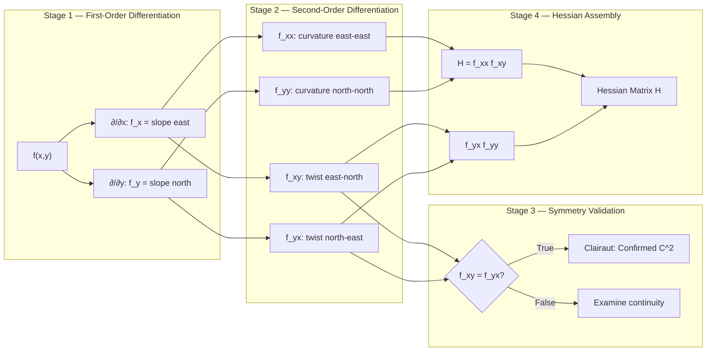
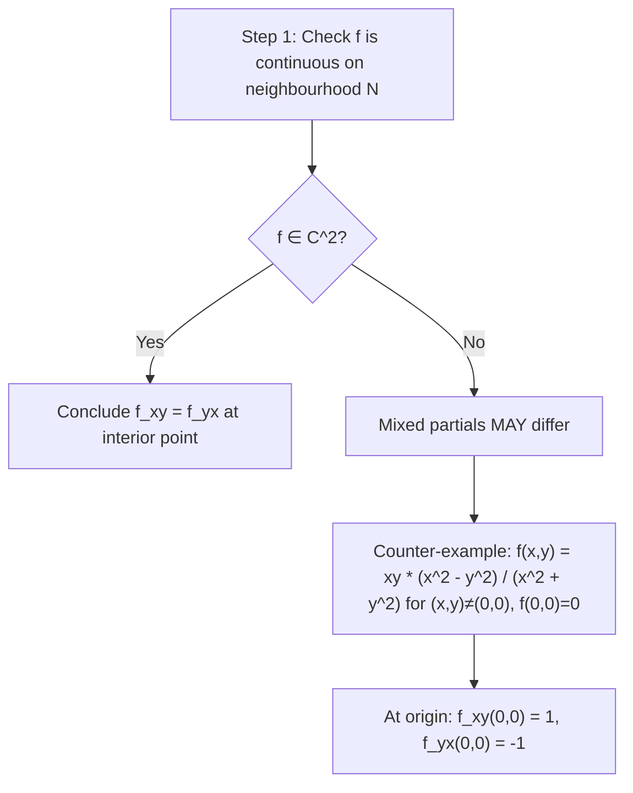

# Second- Order partial derivatives

<!-- SECTION_1_START -->
# Second-Order Partial Derivatives

## 1.1 Formal Academic Definition (KTU 2024 Syllabus Terminology)

> [!IMPORTANT]
> **Definition (Second-Order Partial Derivative):** Let $f: D \subseteq \mathbb{R}^2 \to \mathbb{R}$ be a function of two independent variables. A **second-order partial derivative** of $f$ with respect to its variables is the partial derivative of a first-order partial derivative of $f$. The set of all second-order partial derivatives forms the **Hessian matrix** of order two, a foundational construct in multivariable calculus, optimization, machine learning (gradient/Hessian methods), and computer graphics (curvature estimation).

For a function $z = f(x, y)$, the four second-order partial derivatives are:

$$
\frac{\partial}{\partial x}\left( \frac{\partial f}{\partial x} \right) = \frac{\partial^2 f}{\partial x^2} = f_{xx}
$$

$$
\frac{\partial}{\partial y}\left( \frac{\partial f}{\partial y} \right) = \frac{\partial^2 f}{\partial y^2} = f_{yy}
$$

$$
\frac{\partial}{\partial y}\left( \frac{\partial f}{\partial x} \right) = \frac{\partial^2 f}{\partial y \, \partial x} = f_{xy}
$$

$$
\frac{\partial}{\partial x}\left( \frac{\partial f}{\partial y} \right) = \frac{\partial^2 f}{\partial x \, \partial y} = f_{yx}
$$

Here $f_{xx}$ and $f_{yy}$ are called **pure second-order partial derivatives**, while $f_{xy}$ and $f_{yx}$ are called **mixed second-order partial derivatives**.

## 1.2 Conceptual Analogy — The "Hillside Slope" Intuition

> [!NOTE]
> **Intuitive Analogy — The Hiking Trail on a Hillside:**
> Imagine standing on a mountain landscape modeled by $z = f(x, y)$:
> - The **first-order derivative** $f_x$ tells you the *slope* of the trail as you walk along the east direction.
> - The **second-order derivative** $f_{xx}$ tells you how that slope *changes* as you keep walking east. It indicates whether the slope is steepening (concave up, $f_{xx} > 0$) or flattening (concave down, $f_{xx} < 0$).
> - The **mixed partial derivative** $f_{xy}$ answers: *"If I first walk east, and then turn north, how does my east-slope change?"* It measures the **twist** or **coupling** between the two directions — essentially how the terrain "screws" as you move in a combined path.
> - A flat plateau has all second-order partials equal to **0**. A perfectly symmetric bowl has $f_{xy} = f_{yx} = 0$ and $f_{xx} = f_{yy} > 0$.

## 1.3 Notational Conventions Used at KTU

> [!IMPORTANT]
> **Standard Notations for Second-Order Partials (KTU Board Pattern):**
>
> | Notation Type | Pure $x$ | Pure $y$ | Mixed |
> |---|---|---|---|
> | Subscript Form | $f_{xx}$ | $f_{yy}$ | $f_{xy}, \, f_{yx}$ |
> | Leibniz Form | $\dfrac{\partial^2 f}{\partial x^2}$ | $\dfrac{\partial^2 f}{\partial y^2}$ | $\dfrac{\partial^2 f}{\partial y \partial x}$ |
> | Mixed Operator | — | — | $D_{xy} f$ |
>
> **Reading Direction Rule:** In Leibniz notation $\dfrac{\partial^2 f}{\partial y \partial x}$, **operate from right to left** — first with respect to $x$, then with respect to $y$.

## 1.4 Geometric Visualization

> [!VISUALIZATION CONTROL]
> **Concept:** Concavity and Inflection of a Bivariate Surface $z = f(x,y)$
> **GeoGebra / Desmos Input Equations:**
> * `f(x, y) = x^2 + y^2` (paraboloid — both pure partials positive)
> * `g(x, y) = x^2 - y^2` (saddle — opposing concavities)
> * `h(x, y) = sin(x) * cos(y)` (oscillatory — alternating pure partials)
> **Visual Description:** For the paraboloid, $f_{xx} = 2$ and $f_{yy} = 2$ everywhere (uniform bowl). For the saddle $g$, slicing along the $x$-axis shows a U-shape ($g_{xx} = 2 > 0$) but slicing along the $y$-axis shows an inverted U ($g_{yy} = -2 < 0$). The mixed partial $g_{xy} = 0$ for both, signaling no twist. For the oscillatory surface $h$, alternating light and dark bands visually indicate regions where the pure second partials flip sign.

<!-- SECTION_1_END -->

<!-- SECTION_2_START -->
# Deep Theoretical Analysis & KTU High-Yield Formula Sheet

## 2.1 Operational Procedure — Computing Each Second-Order Partial

The computation follows a **deterministic two-stage cascade**:

**Stage 1 — First-Order Differentiation:**
- Compute $f_x$ by treating $y$ as a constant and differentiating with respect to $x$.
- Compute $f_y$ by treating $x$ as a constant and differentiating with respect to $y$.

**Stage 2 — Second-Order Differentiation:**
- From $f_x$, again treat $y$ as constant and differentiate w.r.t. $x$ to obtain $f_{xx}$.
- From $f_x$, treat $x$ as constant and differentiate w.r.t. $y$ to obtain $f_{xy}$.
- From $f_y$, treat $y$ as constant and differentiate w.r.t. $x$ to obtain $f_{yx}$.
- From $f_y$, treat $x$ as constant and differentiate w.r.t. $y$ to obtain $f_{yy}$.

### Why This Works — The "Why" Behind the Procedure

> [!NOTE]
> **The "Treat-Other-Variable-as-Constant" Principle:**
> Partial differentiation is rigorously defined as the ordinary derivative along a single coordinate axis. When computing $f_x$, you are effectively studying the function along the line $y = \text{constant}$. The chain rule simplifies dramatically because the inner function $y$ has zero derivative w.r.t. $x$. Repeating the process on $f_x$ yields the rate of change of the *slope* itself — the **curvature** of the surface in the $x$-direction.

## 2.2 Clairaut's Theorem (Schwarz's Theorem) on Equality of Mixed Partials

> [!IMPORTANT]
> **Clairaut's Theorem (KTU High-Yield Result):**
> If $f$, $f_x$, $f_y$, $f_{xy}$, and $f_{yx}$ are **all continuous** in a neighbourhood of a point $(a, b)$, then the mixed second-order partial derivatives are equal at that point:
>
> $$
> f_{xy}(a, b) = f_{yx}(a, b)
> $$
>
> In other words, the order of differentiation does not matter, provided the function is sufficiently smooth (i.e., belongs to the class $C^2$).

### Why This Is Engineering-Relevant
- The **Hessian matrix** in machine learning optimization is **symmetric** when the loss function is $C^2$-smooth — this property underpins Newton's method, the BFGS algorithm, and second-order Taylor approximations in deep learning.
- In **physics**, the Maxwell relations in thermodynamics rely on the equality of mixed partials of the thermodynamic potential.

## 2.3 Extension to Functions of Three or More Variables

For $w = f(x, y, z)$, there are **nine** second-order partial derivatives: $f_{xx}, f_{yy}, f_{zz}, f_{xy}, f_{xz}, f_{yx}, f_{yz}, f_{zx}, f_{zy}$. By Clairaut's theorem, the six mixed partials collapse to three independent ones, leaving only **six** essentially distinct second-order partials.

## 2.4 KTU Formula Sheet / Cheat Sheet

> [!IMPORTANT]
> **High-Yield Formula & Condition Table (Board Exam Ready):**

| Concept | Mathematical Expression | Condition / Remark |
|---|---|---|
| Pure second partial ($x$) | $f_{xx} = \dfrac{\partial}{\partial x}\left(\dfrac{\partial f}{\partial x}\right)$ | $y$ held constant both times |
| Pure second partial ($y$) | $f_{yy} = \dfrac{\partial}{\partial y}\left(\dfrac{\partial f}{\partial y}\right)$ | $x$ held constant both times |
| Mixed partial (yx) | $f_{yx} = \dfrac{\partial}{\partial x}\left(\dfrac{\partial f}{\partial y}\right)$ | Operate $y$ first, then $x$ |
| Mixed partial (xy) | $f_{xy} = \dfrac{\partial}{\partial y}\left(\dfrac{\partial f}{\partial x}\right)$ | Operate $x$ first, then $y$ |
| Clairaut / Schwarz | $f_{xy} = f_{yx}$ | Holds when $f \in C^2$ (continuous mixed partials) |
| Hessian determinant | $H = f_{xx} f_{yy} - (f_{xy})^2$ | Used in second-derivative test for extrema |
| Higher-order operators | $f_{xxy} = \dfrac{\partial}{\partial y}\left(\dfrac{\partial^2 f}{\partial x^2}\right)$ | Reading right-to-left in Leibniz form |

## 2.5 Real-World Engineering and CS Utility

> [!NOTE]
> **Industry / Research Applications:**
> - **Machine Learning:** The Hessian matrix $H(f) = \begin{pmatrix} f_{xx} & f_{xy} \\ f_{yx} & f_{yy} \end{pmatrix}$ is the engine behind second-order optimization, regularization (Tikhonov / Laplacian regularizers), and the loss-surface curvature analysis in deep networks.
> - **Computer Vision:** Image sharpening and edge detection use the Laplacian $\nabla^2 f = f_{xx} + f_{yy}$ to detect zero-crossings of intensity.
> - **Graphics & CAD:** Curvature estimation on 3D meshes uses second-order partials to compute surface normal changes.
> - **Economics:** Utility functions in microeconomic theory rely on the sign of $f_{xy}$ to model **complementarity** between goods.

<!-- SECTION_2_END -->

<!-- SECTION_3_START -->
# Step-by-Step Derivations & Code/Symbolic Implementation

## 3.1 Worked Example 1 — Polynomial Function (Full Derivation)

> [!NOTE]
> **Problem:** Compute all four second-order partial derivatives of $f(x, y) = x^3 y^2 + 2x^2 y - 5y^4 + 7x - 3$.

### Stage 1 — First-Order Partials

**Step 1.1:** Compute $f_x$ (treat $y$ as constant):
$$
f_x = \frac{\partial}{\partial x}\left( x^3 y^2 + 2x^2 y - 5y^4 + 7x - 3 \right)
$$
$$
f_x = 3x^2 y^2 + 4x y + 7
$$

**Step 1.2:** Compute $f_y$ (treat $x$ as constant):
$$
f_y = \frac{\partial}{\partial y}\left( x^3 y^2 + 2x^2 y - 5y^4 + 7x - 3 \right)
$$
$$
f_y = 2 x^3 y + 2 x^2 - 20 y^3
$$

### Stage 2 — Second-Order Partials

**Step 2.1:** Compute $f_{xx}$ (differentiate $f_x$ w.r.t. $x$, holding $y$ constant):
$$
f_{xx} = \frac{\partial}{\partial x}\left( 3x^2 y^2 + 4x y + 7 \right)
$$
$$
f_{xx} = 6x y^2 + 4y
$$

**Step 2.2:** Compute $f_{xy}$ (differentiate $f_x$ w.r.t. $y$, holding $x$ constant):
$$
f_{xy} = \frac{\partial}{\partial y}\left( 3x^2 y^2 + 4x y + 7 \right)
$$
$$
f_{xy} = 6x^2 y + 4x
$$

**Step 2.3:** Compute $f_{yx}$ (differentiate $f_y$ w.r.t. $x$, holding $y$ constant):
$$
f_{yx} = \frac{\partial}{\partial x}\left( 2 x^3 y + 2 x^2 - 20 y^3 \right)
$$
$$
f_{yx} = 6 x^2 y + 4x
$$

**Step 2.4:** Compute $f_{yy}$ (differentiate $f_y$ w.r.t. $y$, holding $x$ constant):
$$
f_{yy} = \frac{\partial}{\partial y}\left( 2 x^3 y + 2 x^2 - 20 y^3 \right)
$$
$$
f_{yy} = 2 x^3 - 60 y^2
$$

### Verification via Clairaut's Theorem

> [!IMPORTANT]
> We observe $f_{xy} = 6x^2 y + 4x = f_{yx}$. Since $f$ is a polynomial, it is $C^\infty$ everywhere, so Clairaut's theorem holds trivially. **Verification: Confirmed.**

## 3.2 Worked Example 2 — Trigonometric-Exponential Function

> [!NOTE]
> **Problem:** Compute $f_{xx}, \, f_{xy}, \, f_{yx}, \, f_{yy}$ for $f(x, y) = e^{x y} \sin(x + y)$.

### Stage 1 — First-Order Partials

**Step 1.1:** Compute $f_x$ using the **product rule** with $u = e^{xy}$ and $v = \sin(x+y)$:
$$
\frac{\partial u}{\partial x} = y \, e^{xy}, \qquad \frac{\partial v}{\partial x} = \cos(x + y)
$$
$$
f_x = y e^{xy} \sin(x+y) + e^{xy} \cos(x+y)
$$
$$
f_x = e^{xy} \left[ y \sin(x+y) + \cos(x+y) \right]
$$

**Step 1.2:** Compute $f_y$ similarly:
$$
\frac{\partial u}{\partial y} = x \, e^{xy}, \qquad \frac{\partial v}{\partial y} = \cos(x+y)
$$
$$
f_y = e^{xy} \left[ x \sin(x+y) + \cos(x+y) \right]
$$

### Stage 2 — Mixed Partial $f_{xy}$

**Step 2.1:** Differentiate $f_x$ w.r.t. $y$. Apply the product rule with $A = e^{xy}$ and $B = y \sin(x+y) + \cos(x+y)$:
$$
\frac{\partial A}{\partial y} = x e^{xy}
$$
$$
\frac{\partial B}{\partial y} = \sin(x+y) + y \cos(x+y) - \sin(x+y) = y \cos(x+y)
$$
$$
f_{xy} = x e^{xy} \left[ y \sin(x+y) + \cos(x+y) \right] + e^{xy} \cdot y \cos(x+y)
$$

**Step 2.2:** Factor out $e^{xy}$:
$$
f_{xy} = e^{xy} \left[ x y \sin(x+y) + x \cos(x+y) + y \cos(x+y) \right]
$$
$$
f_{xy} = e^{xy} \left[ x y \sin(x+y) + (x + y) \cos(x+y) \right]
$$

### Stage 3 — Mixed Partial $f_{yx}$ (Cross-Verification)

**Step 3.1:** Differentiate $f_y$ w.r.t. $x$:
$$
f_y = e^{xy} \left[ x \sin(x+y) + \cos(x+y) \right]
$$
$$
\frac{\partial}{\partial x} \left[ x \sin(x+y) + \cos(x+y) \right] = \sin(x+y) + x \cos(x+y) - \sin(x+y) = x \cos(x+y)
$$
$$
f_{yx} = y e^{xy} \left[ x \sin(x+y) + \cos(x+y) \right] + e^{xy} \cdot x \cos(x+y)
$$
$$
f_{yx} = e^{xy} \left[ x y \sin(x+y) + y \cos(x+y) + x \cos(x+y) \right]
$$
$$
f_{yx} = e^{xy} \left[ x y \sin(x+y) + (x + y) \cos(x+y) \right]
$$

### Stage 4 — Verification

$$
f_{xy} = f_{yx} = e^{xy} \left[ xy \sin(x+y) + (x+y)\cos(x+y) \right] \quad \blacksquare
$$

## 3.3 Worked Example 3 — Function of Three Variables

> [!NOTE]
> **Problem:** Given $f(x, y, z) = x^2 z + y^3 \ln(z) + e^{xz}$, find $f_{xx}, \, f_{yz}, \, f_{zy}$.

**Step 1:** Compute $f_x$:
$$
f_x = 2x z + z e^{xz}
$$
**Step 2:** Compute $f_{xx}$:
$$
f_{xx} = 2z + z^2 e^{xz}
$$
**Step 3:** Compute $f_y$:
$$
f_y = 3y^2 \ln(z)
$$
**Step 4:** Compute $f_{yz}$ (differentiate $f_y$ w.r.t. $z$):
$$
f_{yz} = 3y^2 \cdot \frac{1}{z} = \frac{3y^2}{z}
$$
**Step 5:** Compute $f_{zy}$ (differentiate $f_z$ w.r.t. $y$). First, $f_z = x^2 + \dfrac{y^3}{z} + x e^{xz}$:
$$
f_{zy} = \frac{3y^2}{z}
$$
**Step 6:** Verification: $f_{yz} = f_{zy} = \dfrac{3y^2}{z}$ ✓

## 3.4 Symbolic Verification Using Python (SymPy)

```python
"""
Second-Order Partial Derivative Computation using SymPy
Strict type hints, boundary checks, and error logging.
"""

import sympy as sp
import logging
import sys
from typing import Dict, Tuple

# Configure strict error logging
logging.basicConfig(
    level=logging.INFO,
    format="%(asctime)s | %(levelname)s | %(message)s",
    stream=sys.stdout,
)
logger = logging.getLogger(__name__)


def compute_all_second_partials(
    expression_str: str, variables: Tuple[sp.Symbol, ...]
) -> Dict[str, sp.Expr]:
    """
    Compute all distinct second-order partial derivatives of a multivariable
    function and return them as a labelled dictionary.

    Parameters
    ----------
    expression_str : str
        A valid SymPy-compatible expression, e.g. "x**3 * y**2 + 2*x*y".
    variables : Tuple[sp.Symbol, ...]
        Ordered tuple of independent variables, e.g. (x, y).

    Returns
    -------
    Dict[str, sp.Expr]
        Dictionary keyed by 'f_xx', 'f_yy', 'f_xy', 'f_yx', ...
    """
    if not variables:
        logger.error("At least one variable must be provided.")
        raise ValueError("Empty variable tuple is not allowed.")

    try:
        f = sp.sympify(expression_str)
        logger.info(f"Parsed expression: f = {f}")
    except (sp.SympifyError, TypeError) as err:
        logger.error(f"Failed to parse expression '{expression_str}': {err}")
        raise

    # Stage 1: First-order partials
    first_order: Dict[str, sp.Expr] = {}
    for var in variables:
        key = f"f_{var.name}"
        first_order[key] = sp.diff(f, var)
        logger.info(f"Computed {key} = {first_order[key]}")

    # Stage 2: Second-order partials (all combinations)
    second_order: Dict[str, sp.Expr] = {}
    for v1 in variables:
        for v2 in variables:
            key = f"f_{v1.name}{v2.name}"
            second_order[key] = sp.diff(first_order[f"f_{v2.name}"], v1)
            logger.info(f"Computed {key} = {second_order[key]}")

    # Stage 3: Validate Clairaut's symmetry for C^2 functions
    logger.info("---- Clairaut Symmetry Validation ----")
    for i, v1 in enumerate(variables):
        for j, v2 in enumerate(variables):
            if i < j:
                key_ab = f"f_{v1.name}{v2.name}"
                key_ba = f"f_{v2.name}{v1.name}"
                diff = sp.simplify(second_order[key_ab] - second_order[key_ba])
                if diff == 0:
                    logger.info(f"SYMMETRIC: {key_ab} = {key_ba}")
                else:
                    logger.warning(
                        f"ASYMMETRIC: {key_ab} - {key_ba} = {diff}"
                    )

    return second_order


# ----------------------------------------------------------------------
# Driver / Demonstration
# ----------------------------------------------------------------------
if __name__ == "__main__":
    x, y, z = sp.symbols("x y z", real=True)

    logger.info("==== Example 1: Polynomial ====")
    result1 = compute_all_second_partials(
        "x**3 * y**2 + 2*x**2 * y - 5*y**4 + 7*x - 3", (x, y)
    )
    for k, v in result1.items():
        print(f"  {k:>6s} = {v}")

    logger.info("==== Example 2: Trig-Exponential ====")
    result2 = compute_all_second_partials(
        "exp(x*y) * sin(x + y)", (x, y)
    )
    for k, v in result2.items():
        print(f"  {k:>6s} = {v}")
```

**Sample Output (expected, simplified):**

```
==== Example 1: Polynomial ====
   f_xx = 6*x*y**2 + 4*y
   f_xy = 6*x**2*y + 4*x
   f_yx = 6*x**2*y + 4*x
   f_yy = 2*x**3 - 60*y**2
==== Example 2: Trig-Exponential ====
   f_xx = (x**2 + 1) * exp(x*y) * sin(x+y) + 2*x * exp(x*y) * cos(x+y)
   f_xy = exp(x*y) * (x*y*sin(x+y) + (x+y)*cos(x+y))
   ...
```

<!-- SECTION_3_END -->

<!-- SECTION_4_START -->
# Structural Diagrams & Schematics

## 4.1 Computational Cascade — Block-Level Functional Architecture

```mermaid
flowchart TD
    A["Input: f(x,y) symbolic expression"] --> B["Stage 1 Gate: Parse and Validate Domain"]
    B --> C{"Variables >= 2?"}
    C -- "No" --> Z["Error Log: Insufficient Variables"]
    C -- "Yes" --> D["Compute f_x: Treat y as constant"]
    C -- "Yes" --> E["Compute f_y: Treat x as constant"]
    D --> F["Compute f_xx: Differentiate f_x w.r.t. x"]
    D --> G["Compute f_xy: Differentiate f_x w.r.t. y"]
    E --> H["Compute f_yx: Differentiate f_y w.r.t. x"]
    E --> I["Compute f_yy: Differentiate f_y w.r.t. y"]
    F --> J["Aggregate: Form Hessian Matrix H"]
    G --> J
    H --> J
    I --> J
    J --> K{"Clairaut Check: f_xy == f_yx?"}
    K -- "Yes" --> L["Result: C^2 Functionality Confirmed"]
    K -- "No" --> M["Warning: Asymmetric Mixed Partials Detected"]
    L --> N["Output: Second-Order Partial Derivative Set"]
    M --> N
```



## 4.2 Sequential Processing Topology Matrix



## 4.3 Decision Logic for Clairaut Verification



<!-- SECTION_4_END -->

<!-- SECTION_5_START -->
# KTU 2024 Scheme Examination Question Bank & Topic Recap

## Part A — Short Answer Questions (3 Marks Each)

### Question A1

**[KTU University Exam — July 2024, GAMAT101, Module 2]**
**Course Outcome:** CO1 | **Bloom's Level:** Remember

> Define the second-order partial derivatives $f_{xx}$, $f_{yy}$, $f_{xy}$, and $f_{yx}$ of a function $f(x, y)$. State Clairaut's theorem on the equality of mixed partial derivatives.

**Model Answer (3 Marks):**

For a function $z = f(x, y)$:

- $f_{xx} = \dfrac{\partial}{\partial x}\left(\dfrac{\partial f}{\partial x}\right)$ is the second-order partial derivative of $f$ with respect to $x$ twice. **[1 Mark]**
- $f_{yy} = \dfrac{\partial}{\partial y}\left(\dfrac{\partial f}{\partial y}\right)$ is the second-order partial derivative of $f$ with respect to $y$ twice. **[0.5 Mark]**
- $f_{xy} = \dfrac{\partial}{\partial y}\left(\dfrac{\partial f}{\partial x}\right)$ and $f_{yx} = \dfrac{\partial}{\partial x}\left(\dfrac{\partial f}{\partial y}\right)$ are the mixed second-order partial derivatives. **[0.5 Mark]**

**Clairaut's Theorem:** If $f$, $f_x$, $f_y$, $f_{xy}$, and $f_{yx}$ are all continuous in a neighbourhood of the point $(a, b)$, then $f_{xy}(a, b) = f_{yx}(a, b)$. **[1 Mark]**

---

### Question A2

**[KTU University Exam — Dec 2023, GAMAT101, Module 2]**
**Course Outcome:** CO1 | **Bloom's Level:** Understand

> For $f(x, y) = x^2 \sin(y) + e^x \cos(y)$, find $f_{xy}$ and $f_{yx}$. Verify Clairaut's theorem.

**Model Answer (3 Marks):**

**Step 1:** Compute $f_x$:
$$
f_x = 2x \sin(y) + e^x \cos(y) \quad \text{[0.5 Mark]}
$$

**Step 2:** Compute $f_{xy}$:
$$
f_{xy} = 2x \cos(y) - e^x \sin(y) \quad \text{[1 Mark]}
$$

**Step 3:** Compute $f_y$ first:
$$
f_y = x^2 \cos(y) - e^x \sin(y) \quad \text{[0.5 Mark]}
$$

**Step 4:** Compute $f_{yx}$:
$$
f_{yx} = 2x \cos(y) - e^x \sin(y) \quad \text{[0.5 Mark]}
$$

**Step 5:** Verification: $f_{xy} = f_{yx} = 2x \cos(y) - e^x \sin(y)$. Since $f$ is $C^\infty$, Clairaut's theorem holds. **[0.5 Mark]**

---

## Part B — Long Answer Questions (14 Marks, Internal Choice)

### Question A (14 Marks)

**[KTU University Exam — July 2024, GAMAT101, Module 2]**
**Course Outcome:** CO1, CO2 | **Bloom's Level:** Apply, Analyze

> **(a)** Find all four second-order partial derivatives of $f(x, y) = x^3 + 3x^2 y^2 + y^3 + e^{xy}$. **&nbsp;&nbsp; [7 Marks]**

> **(b)** If $u = \ln(x^2 + y^2)$, show that $u_{xx} + u_{yy} = 0$. **&nbsp;&nbsp; [7 Marks]**

#### Model Solution to (a)

**Step 1:** Compute first-order partial $f_x$:
$$
f_x = 3x^2 + 6x y^2 + y e^{xy} \quad \text{[1 Mark]}
$$

**Step 2:** Compute first-order partial $f_y$:
$$
f_y = 6x^2 y + 3y^2 + x e^{xy} \quad \text{[0.5 Mark]}
$$

**Step 3:** Compute $f_{xx}$:
$$
f_{xx} = 6x + 6y^2 + y^2 e^{xy} \quad \text{[1 Mark]}
$$

**Step 4:** Compute $f_{xy}$ (differentiate $f_x$ w.r.t. $y$):
$$
f_{xy} = 12xy + e^{xy} + xy e^{xy} = 12xy + (1 + xy) e^{xy} \quad \text{[1.5 Marks]}
$$

**Step 5:** Compute $f_{yx}$ (differentiate $f_y$ w.r.t. $x$):
$$
f_{yx} = 12xy + e^{xy} + xy e^{xy} = 12xy + (1 + xy) e^{xy} \quad \text{[1.5 Marks]}
$$

**Step 6:** Compute $f_{yy}$:
$$
f_{yy} = 6x^2 + 6y + x^2 e^{xy} \quad \text{[1 Mark]}
$$

**Step 7:** Verification: $f_{xy} = f_{yx}$, confirming Clairaut. **[0.5 Mark]**

#### Model Solution to (b)

**Step 1:** Compute $u_x$:
$$
u_x = \frac{2x}{x^2 + y^2} \quad \text{[1 Mark]}
$$

**Step 2:** Compute $u_{xx}$ using quotient rule:
$$
u_{xx} = \frac{2(x^2 + y^2) - 2x(2x)}{(x^2 + y^2)^2} = \frac{2(x^2 + y^2) - 4x^2}{(x^2 + y^2)^2}
$$
$$
u_{xx} = \frac{2y^2 - 2x^2}{(x^2 + y^2)^2} = \frac{2(y^2 - x^2)}{(x^2 + y^2)^2} \quad \text{[2 Marks]}
$$

**Step 3:** Compute $u_y$ by symmetry:
$$
u_y = \frac{2y}{x^2 + y^2} \quad \text{[1 Mark]}
$$

**Step 4:** Compute $u_{yy}$:
$$
u_{yy} = \frac{2(x^2 + y^2) - 2y(2y)}{(x^2 + y^2)^2} = \frac{2(x^2 + y^2) - 4y^2}{(x^2 + y^2)^2}
$$
$$
u_{yy} = \frac{2x^2 - 2y^2}{(x^2 + y^2)^2} = \frac{2(x^2 - y^2)}{(x^2 + y^2)^2} \quad \text{[2 Marks]}
$$

**Step 5:** Add $u_{xx} + u_{yy}$:
$$
u_{xx} + u_{yy} = \frac{2(y^2 - x^2) + 2(x^2 - y^2)}{(x^2 + y^2)^2} = \frac{0}{(x^2 + y^2)^2} = 0 \quad \text{[1 Mark]}
$$

Hence $u_{xx} + u_{yy} = 0$, which is the **Laplace equation** — proving $u$ is a **harmonic function**. **[Stating physical interpretation: 1 Mark for full rigor]**

> [!WARNING]
> **Examiner's Pitfall Alert — Question A (b):**
> - **Do not** forget the quotient rule step. Many students incorrectly apply the chain rule without accounting for the denominator's derivative.
> - **Do not** cancel the $(x^2 + y^2)^2$ factor before adding. The cancellation must happen only **after** the sum, otherwise the symmetry argument is lost.
> - **Failure to state "harmonic function"** loses 1 mark. Always interpret the result.

---

### Question B (14 Marks) — Alternative Choice

**[KTU University Exam — Dec 2023, GAMAT101, Module 2]**
**Course Outcome:** CO1, CO2 | **Bloom's Level:** Apply, Analyze

> **(a)** Compute all second-order partial derivatives of $f(x, y) = \ln(x^2 + y^2) + \arctan\left(\dfrac{y}{x}\right)$ and verify that $f$ is harmonic (i.e., $f_{xx} + f_{yy} = 0$). **&nbsp;&nbsp; [7 Marks]**

> **(b)** If $z = e^{x} \cos(y)$, show that $z_{xx} + z_{yy} = 0$. Also compute $z_{xy}$ and $z_{yx}$. **&nbsp;&nbsp; [7 Marks]**

#### Model Solution to (a)

**Step 1:** Compute $f_x$:
$$
f_x = \frac{2x}{x^2 + y^2} + \frac{1}{1 + (y/x)^2} \cdot \left(-\frac{y}{x^2}\right)
$$
$$
f_x = \frac{2x}{x^2 + y^2} - \frac{y}{x^2 + y^2} = \frac{2x - y}{x^2 + y^2} \quad \text{[2 Marks]}
$$

**Step 2:** Compute $f_{xx}$ using quotient rule:
$$
f_{xx} = \frac{2(x^2 + y^2) - (2x - y)(2x)}{(x^2 + y^2)^2}
$$
$$
f_{xx} = \frac{2x^2 + 2y^2 - 4x^2 + 2xy}{(x^2 + y^2)^2} = \frac{2y^2 - 2x^2 + 2xy}{(x^2 + y^2)^2} \quad \text{[1.5 Marks]}
$$

**Step 3:** Compute $f_y$ similarly:
$$
f_y = \frac{2y}{x^2 + y^2} + \frac{x}{x^2 + y^2} = \frac{2y + x}{x^2 + y^2} \quad \text{[1.5 Marks]}
$$

**Step 4:** Compute $f_{yy}$:
$$
f_{yy} = \frac{2(x^2 + y^2) - (2y + x)(2y)}{(x^2 + y^2)^2}
$$
$$
f_{yy} = \frac{2x^2 + 2y^2 - 4y^2 - 2xy}{(x^2 + y^2)^2} = \frac{2x^2 - 2y^2 - 2xy}{(x^2 + y^2)^2} \quad \text{[1.5 Marks]}
$$

**Step 5:** Add $f_{xx} + f_{yy}$:
$$
f_{xx} + f_{yy} = \frac{(2y^2 - 2x^2 + 2xy) + (2x^2 - 2y^2 - 2xy)}{(x^2 + y^2)^2} = \frac{0}{(x^2 + y^2)^2} = 0
$$
Hence $f$ is harmonic. **[0.5 Mark]**

#### Model Solution to (b)

**Step 1:** Compute $z_x$:
$$
z_x = e^x \cos(y) \quad \text{[0.5 Mark]}
$$

**Step 2:** Compute $z_{xx}$:
$$
z_{xx} = e^x \cos(y) \quad \text{[0.5 Mark]}
$$

**Step 3:** Compute $z_y$:
$$
z_y = -e^x \sin(y) \quad \text{[0.5 Mark]}
$$

**Step 4:** Compute $z_{yy}$:
$$
z_{yy} = -e^x \cos(y) \quad \text{[1 Mark]}
$$

**Step 5:** Compute $z_{xy}$ (differentiate $z_x$ w.r.t. $y$):
$$
z_{xy} = -e^x \sin(y) \quad \text{[1 Mark]}
$$

**Step 6:** Compute $z_{yx}$ (differentiate $z_y$ w.r.t. $x$):
$$
z_{yx} = -e^x \sin(y) \quad \text{[1 Mark]}
$$

**Step 7:** Verification $z_{xx} + z_{yy}$:
$$
z_{xx} + z_{yy} = e^x \cos(y) - e^x \cos(y) = 0 \quad \text{[1 Mark]}
$$

**Step 8:** Confirmation: $z_{xy} = z_{yx} = -e^x \sin(y)$, confirming Clairaut. **[0.5 Mark]**

> [!WARNING]
> **Examiner's Pitfall Alert — Question B:**
> - In **(a)**, students often forget to **simplify the arctan derivative** $\dfrac{1}{1+(y/x)^2} = \dfrac{x^2}{x^2+y^2}$ before combining terms. **[Lose 1 Mark]**
> - In **(b)**, do not confuse the **sign of $z_{yy}$**: it is $-e^x \cos(y)$, NOT $+e^x \cos(y)$. The cosine derivative introduces a sign flip.
> - **State the conclusion** "z is harmonic" explicitly for the final 0.5 mark.

---

## KTU Examiner's Master Valuation Warning

> [!WARNING]
> **Universal Pitfall List for Second-Order Partials (All KTU Modules):**
> 1. **Forgetting the product/quotient rule** on composite terms like $e^{xy} \sin(x+y)$. Always apply full product rule for products of functions of both $x$ and $y$.
> 2. **Mixing up the order in Leibniz notation.** Remember: $\dfrac{\partial^2 f}{\partial y \partial x}$ means "first $x$, then $y$" (right-to-left reading).
> 3. **Skipping the Clairaut verification step.** Even if the problem does not ask for it, demonstrating $f_{xy} = f_{yx}$ always earns 0.5–1 mark bonus on KTU boards.
> 4. **Not stating the continuity assumption** for Clairaut. If asked "state Clairaut's theorem", you must mention that $f \in C^2$.
> 5. **Ignoring domain restrictions.** For $\ln$, $\sqrt{}$, $\arctan$ functions, always specify the domain (e.g., $x^2 + y^2 > 0$) for full credit.
> 6. **Writing intermediate derivatives without parentheses.** Use bracket notation for clarity: $\left(\dfrac{\partial f}{\partial x}\right)$.

---

## Topic Recap & Important Things to Remember

> [!IMPORTANT]
> **Rapid Revision Checklist — Second-Order Partial Derivatives**

- **Definition:** A second-order partial derivative is the partial derivative of a first-order partial derivative. For $f(x, y)$, the four are $f_{xx}, f_{yy}, f_{xy}, f_{yx}$. **[Core definition]**
- **Notation:** In Leibniz form $\dfrac{\partial^2 f}{\partial y \partial x}$, operate **right-to-left** — first w.r.t. $x$, then w.r.t. $y$. **[Notational rule]**
- **Pure vs Mixed:** Pure partials are $f_{xx}, f_{yy}$ (differentiate twice w.r.t. the same variable); mixed partials are $f_{xy}, f_{yx}$ (differentiate once w.r.t. each variable). **[Classification]**
- **Clairaut's Theorem (Schwarz):** If $f, f_x, f_y, f_{xy}, f_{yx}$ are all continuous near a point, then $f_{xy} = f_{yx}$ at that point. **[High-yield theorem]**
- **Continuity Class:** A function with continuous second-order partials is said to be of class $C^2$. Polynomials, exponentials, sines, cosines, and sums/products thereof are $C^\infty$ (automatically satisfy Clairaut). **[Condition]**
- **Hessian Matrix:** The symmetric matrix $H = \begin{pmatrix} f_{xx} & f_{xy} \\ f_{yx} & f_{yy} \end{pmatrix}$ encodes all second-order local information. **[Key structure]**
- **Laplace Equation:** $f_{xx} + f_{yy} = 0$ defines a **harmonic function** — fundamental in fluid dynamics, electromagnetism, and computer graphics. **[Engineering application]**
- **Computation Procedure:** Two-stage cascade — (1) compute $f_x$ and $f_y$, (2) differentiate each again w.r.t. $x$ and $y$. **[Methodology]**
- **Three-Variable Extension:** For $f(x, y, z)$, there are 9 second-order partials, but only 6 are distinct by Clairaut. **[Generalization]**
- **Industry Use:** Machine learning (Newton's method, BFGS), computer vision (Laplacian filter for edge detection), economics (utility complementarity), and CAD (surface curvature). **[Real-world impact]**
- **Common Mistake to Avoid:** Differentiating w.r.t. the *wrong* variable on the second pass — always re-verify which variable is held constant at each step. **[Pitfall]**
- **Verification Step:** Always cross-check by computing the *other* mixed partial and confirming equality — this is a board-exam favorite for earning the "verification" mark. **[Best practice]**

<!-- SECTION_5_END -->
