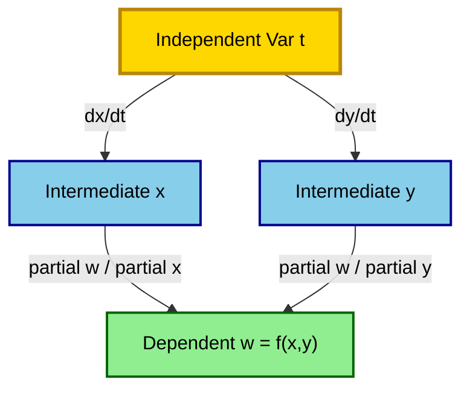
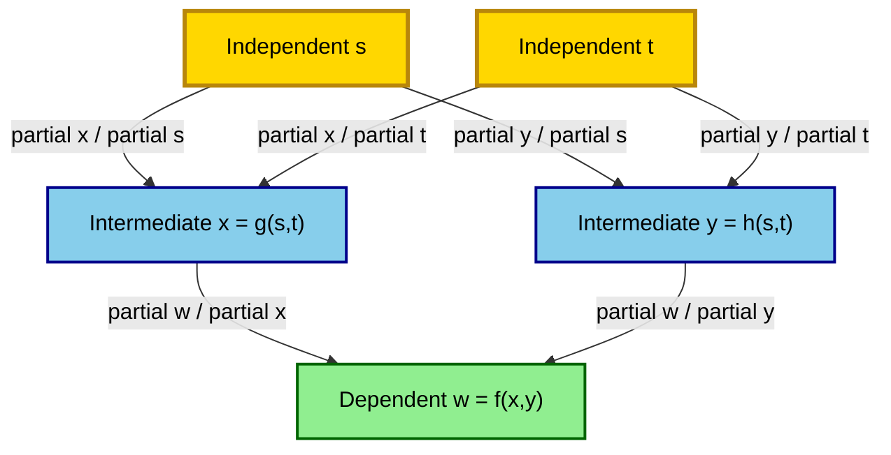
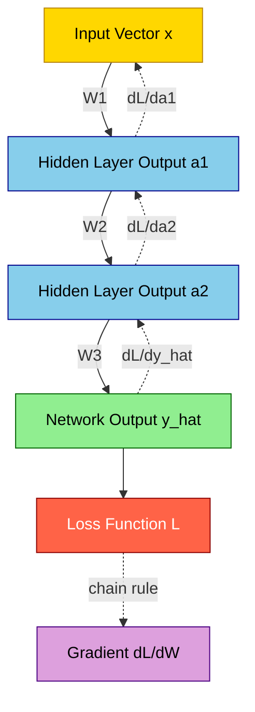

# The Chain Rule: Functions of two variables

<!-- SECTION_1_START -->

# The Chain Rule: Functions of Two Variables

## 1.1 Formal Academic Definition (KTU 2024 Syllabus Aligned)

> [!IMPORTANT]
> **Definition (Chain Rule – Two Variables):**
> Let $w = f(x, y)$ be a differentiable function of two independent variables $x$ and $y$. If both $x$ and $y$ are themselves differentiable functions of a single variable $t$, say $x = x(t)$ and $y = y(t)$, then $w$ is a differentiable function of $t$ and
>
> $$\frac{dw}{dt} = \frac{\partial f}{\partial x} \cdot \frac{dx}{dt} + \frac{\partial f}{\partial y} \cdot \frac{dy}{dt}$$
>
> This identity is the **Chain Rule for Functions of Two Variables** and constitutes a foundational result of multivariable differential calculus used throughout engineering, physics, and computer science.

In the more general case, if $w = f(x, y)$ where $x = g(s, t)$ and $y = h(s, t)$, with $f$, $g$, and $h$ all differentiable, then $w$ becomes an implicitly defined function of two independent variables $s$ and $t$, with two partial derivatives:

$$\frac{\partial w}{\partial s} = \frac{\partial f}{\partial x} \cdot \frac{\partial g}{\partial s} + \frac{\partial f}{\partial y} \cdot \frac{\partial h}{\partial s}$$

$$\frac{\partial w}{\partial t} = \frac{\partial f}{\partial x} \cdot \frac{\partial g}{\partial t} + \frac{\partial f}{\partial y} \cdot \frac{\partial h}{\partial t}$$

> [!NOTE]
> **KTU 2024 Scheme Terminology Note:**
> In KTU board examinations, the term *total derivative* ($\frac{dw}{dt}$) is used exclusively when the independent variable count reduces to **one** (e.g., $x = x(t), y = y(t)$). The term *partial derivative* ($\frac{\partial w}{\partial s}$ or $\frac{\partial w}{\partial t}$) is used when there are **two or more** independent variables remaining.

## 1.2 Conceptual Analogy – The Factory Assembly Line

Imagine a **bicycle factory** that produces a final product $w$ (a fully assembled bicycle). The bicycle is built from exactly two parts: a frame $x$ and a wheel set $y$. The factory manager wants to know how fast production $w$ changes when a single knob (say, a budget dial $t$) is turned.

- Turning the budget knob $t$ changes how much steel is bought, which changes the frame quantity $x$.
- The same knob also changes how much rubber is purchased, which changes the wheel quantity $y$.
- The bicycle production $w$ responds to **both** changes — first through the frame channel and then through the wheel channel.

The **chain rule** is simply the bookkeeping statement that total change = (effect through frame) + (effect through wheels). Each "path" is multiplied because the knob's effect on $x$ cascades into $x$'s effect on $w$.

> [!TIP]
> **Geometric Intuition:** The chain rule generalizes the familiar one-variable identity $\frac{dw}{dt} = \frac{dw}{dx}\cdot\frac{dx}{dt}$. With two variables feeding into $w$, the "paths" branch out — and the rule simply **sums the products along every distinct path** from the independent variable to the dependent variable. This is precisely why we draw **tree diagrams** in SECTION 4.

## 1.3 Physical Constants & Standard Metrics

> [!NOTE]
> **Constants & Symbols to Memorize (Frequently Tested in KTU Boards):**
> - $\nabla f = \left(\frac{\partial f}{\partial x},\ \frac{\partial f}{\partial y}\right)$ — the **gradient vector** of $f$.
> - $\frac{\partial \mathbf{r}}{\partial t} = \left(\frac{dx}{dt},\ \frac{dy}{dt}\right)$ — the **velocity vector** of the parametric curve $\mathbf{r}(t) = (x(t), y(t))$.
> - The chain rule has the elegant **dot product form**: $\frac{dw}{dt} = \nabla f \cdot \frac{d\mathbf{r}}{dt}$.

> [!VISUALIZATION CONTROL]
> **Concept:** Geometric picture of the chain rule for $w = f(x, y)$ with $x = x(t), y = y(t)$.
> **GeoGebra / Desmos Input Equations:**
> * $w = f(x,y) = x^{2} + y^{2}$
> * $x(t) = 2\cos(t)$
> * $y(t) = 2\sin(t)$
> * $w(t) = f(x(t), y(t)) = 4\cos^{2}(t) + 4\sin^{2}(t) = 4$
> **Visual Description:** Parametrize the unit circle of radius 2 in the $xy$-plane; the surface $w = x^2 + y^2$ is a paraboloid. The image curve $w(t)$ sits in the $tw$-plane as a constant horizontal line at $w = 4$, which visually confirms that $\frac{dw}{dt} = 0$ for a circular path on this paraboloid. Students should observe that the chain rule "agrees" with the constancy of the composite function.

<!-- SECTION_1_END -->

<!-- SECTION_2_START -->

# Deep Theoretical Analysis & KTU High-Yield Formula Sheet

## 2.1 Operational Logic — Step-by-Step

The chain rule, despite its simplicity, follows a strict deductive logic. Here is the structured reasoning the KTU examiner expects:

- **Step 1 — Identify the dependency tree.** Determine the dependent variable $w$, the intermediate variables $(x, y, \ldots)$, and the independent variables $(t, s, \ldots)$.
- **Step 2 — Verify differentiability.** Ensure $f$ is differentiable at the point in question and that each intermediate variable is differentiable with respect to its own parent. KTU boards frequently test the **sufficient condition**: continuous partial derivatives near a point $\Rightarrow$ differentiable at that point.
- **Step 3 — Construct partial derivatives along each path.** For every directed path from an independent variable to $w$, take the product of derivatives along that path.
- **Step 4 — Sum the products over all distinct paths.** This sum is the chain rule formula.
- **Step 5 — Simplify symbolically or evaluate numerically.** KTU answers should be left in **simplest factored or expanded form** unless a numerical value is requested.

## 2.2 KTU High-Yield Formula Sheet (Board-Ready)

> [!IMPORTANT]
> **Master These Identities — They Appear in Nearly Every KTU Board Paper.**

| # | Scenario | Formula | Independent Vars |
|---|----------|---------|------------------|
| 1 | $w = f(x, y)$, $x = x(t)$, $y = y(t)$ | $\dfrac{dw}{dt} = \dfrac{\partial f}{\partial x}\dfrac{dx}{dt} + \dfrac{\partial f}{\partial y}\dfrac{dy}{dt}$ | **One** ($t$) |
| 2 | $w = f(x, y)$, $x = x(s, t)$, $y = y(s, t)$ | $\dfrac{\partial w}{\partial s} = \dfrac{\partial f}{\partial x}\dfrac{\partial x}{\partial s} + \dfrac{\partial f}{\partial y}\dfrac{\partial y}{\partial s}$ | **Two** ($s, t$) |
| 3 | $w = f(x, y, z)$, $x = x(t)$, $y = y(t)$, $z = z(t)$ | $\dfrac{dw}{dt} = \dfrac{\partial f}{\partial x}\dfrac{dx}{dt} + \dfrac{\partial f}{\partial y}\dfrac{dy}{dt} + \dfrac{\partial f}{\partial z}\dfrac{dz}{dt}$ | **One** ($t$) |
| 4 | $w = f(x, y)$, $x = x(u, v)$, $y = y(u, v)$ (full gradient) | $\nabla w = \dfrac{\partial w}{\partial x}\nabla x + \dfrac{\partial w}{\partial y}\nabla y$ | **Two** ($u, v$) |
| 5 | Implicit: $F(x, y) = 0$, $y = y(x)$ | $\dfrac{dy}{dx} = -\dfrac{F_x}{F_y}$ | **One** ($x$) |
| 6 | Implicit: $F(x, y, z) = 0$, $z = z(x, y)$ | $\dfrac{\partial z}{\partial x} = -\dfrac{F_x}{F_z},\ \ \dfrac{\partial z}{\partial y} = -\dfrac{F_y}{F_z}$ | **Two** ($x, y$) |
| 7 | Total differential form | $dw = \dfrac{\partial f}{\partial x}dx + \dfrac{\partial f}{\partial y}dy$ | — |

> [!WARNING]
> **Critical Notation Trap:** KTU examiners deduct marks when students use $\frac{d}{dt}$ for partial-level chain rules (e.g., $\frac{\partial w}{\partial s}$). Always match the **$d$** for total derivatives (one independent variable) and **$\partial$** for partial derivatives (two or more independent variables).

## 2.3 Real-World Engineering & Computer Science Utility

- **Neural Network Backpropagation:** The chain rule is the **mathematical engine** of gradient-based learning. The loss $L$ depends on layer outputs $a^{(k)}$, which depend on weights $w^{(k)}$; backpropagation is literally an application of multivariable chain rule.
- **Robotic Kinematics:** The end-effector position $\mathbf{p}$ of a robotic arm is a function of joint angles $\theta_1, \theta_2, \ldots, \theta_n$. The Jacobian matrix $\frac{\partial \mathbf{p}}{\partial \boldsymbol{\theta}}$ is built column-by-column using the chain rule.
- **Computer Graphics & Ray Tracing:** Color at a pixel is a function of surface point, which is a function of ray parameter — the chain rule determines how lighting and texture vary along the ray.
- **Climate Modeling:** Temperature $T$ is a function of pressure $P$ and humidity $H$, which both depend on altitude $z$; meteorologists use the chain rule to compute lapse rates $\frac{dT}{dz}$.
- **Control Systems:** Sensitivity of output $y$ to a parameter $p$ in a closed-loop system is computed as $\frac{dy}{dp} = \frac{\partial y}{\partial u}\frac{du}{dp} + \frac{\partial y}{\partial v}\frac{dv}{dp}$.

> [!TIP]
> **Memorize the dot-product form** $\frac{dw}{dt} = \nabla f \cdot \frac{d\mathbf{r}}{dt}$ because it directly extends to **directional derivatives** in Module 3, which is a heavily tested KTU topic.

<!-- SECTION_2_END -->

<!-- SECTION_3_START -->

# Step-by-Step Derivations & Symbolic Implementation

## 3.1 Worked Example 1 — Single Independent Variable (Total Derivative)

> [!NOTE]
> **Problem:** Given $w = x^{2} y + y^{2}$, with $x = t^{2}$ and $y = 2t + 1$, find $\frac{dw}{dt}$ using the chain rule. Then evaluate at $t = 1$.

### Solution

**Step 1 — Compute the partial derivatives of $w$ with respect to its intermediate variables:**

$$\frac{\partial w}{\partial x} = 2xy$$

$$\frac{\partial w}{\partial y} = x^{2} + 2y$$

**Step 2 — Compute the derivatives of the intermediate variables with respect to $t$:**

$$\frac{dx}{dt} = 2t$$

$$\frac{dy}{dt} = 2$$

**Step 3 — Apply the chain rule formula:**

$$\frac{dw}{dt} = \frac{\partial w}{\partial x} \cdot \frac{dx}{dt} + \frac{\partial w}{\partial y} \cdot \frac{dy}{dt}$$

**Step 4 — Substitute the expressions obtained in Steps 1 and 2:**

$$\frac{dw}{dt} = (2xy)(2t) + (x^{2} + 2y)(2)$$

**Step 5 — Expand and group terms:**

$$\frac{dw}{dt} = 4xyt + 2x^{2} + 4y$$

**Step 6 — Substitute $x = t^{2}$ and $y = 2t + 1$ to express in terms of $t$ alone:**

$$\frac{dw}{dt} = 4(t^{2})(2t + 1)t + 2(t^{2})^{2} + 4(2t + 1)$$

**Step 7 — Simplify term by term:**

$$4(t^{2})(2t + 1)t = 4t^{3}(2t + 1) = 8t^{4} + 4t^{3}$$

$$2(t^{2})^{2} = 2t^{4}$$

$$4(2t + 1) = 8t + 4$$

**Step 8 — Add all terms to get the final simplified form:**

$$\frac{dw}{dt} = 8t^{4} + 4t^{3} + 2t^{4} + 8t + 4$$

$$\boxed{\frac{dw}{dt} = 10t^{4} + 4t^{3} + 8t + 4}$$

**Step 9 — Evaluate at $t = 1$:**

$$\frac{dw}{dt}\bigg|_{t=1} = 10(1)^{4} + 4(1)^{3} + 8(1) + 4 = 10 + 4 + 8 + 4 = 26$$

**Verification by direct substitution method:**

$$w = (t^{2})^{2}(2t + 1) + (2t + 1)^{2} = t^{4}(2t + 1) + (2t + 1)^{2}$$

$$\frac{dw}{dt} = 4t^{3}(2t + 1) + t^{4}(2) + 2(2t + 1)(2)$$

$$\frac{dw}{dt} = 8t^{4} + 4t^{3} + 2t^{4} + 8t + 4 = 10t^{4} + 4t^{3} + 8t + 4 \quad \checkmark$$

At $t = 1$: $\frac{dw}{dt} = 10 + 4 + 8 + 4 = 26 \quad \checkmark$

> [!TIP]
> **Valuation Key Point:** Showing the verification step (direct substitution) often fetches **1–2 grace marks** in KTU boards if the chain rule answer contains a minor arithmetic slip.

---

## 3.2 Worked Example 2 — Two Independent Variables (Partial Derivatives)

> [!NOTE]
> **Problem:** Given $w = x^{2} + y^{2}$, with $x = s \cos t$ and $y = s \sin t$, find $\frac{\partial w}{\partial s}$ and $\frac{\partial w}{\partial t}$.

### Solution

**Step 1 — Compute partial derivatives of $w$:**

$$\frac{\partial w}{\partial x} = 2x$$

$$\frac{\partial w}{\partial y} = 2y$$

**Step 2 — Compute partial derivatives of the intermediate variables for the $s$-chain:**

$$\frac{\partial x}{\partial s} = \cos t, \quad \frac{\partial y}{\partial s} = \sin t$$

**Step 3 — Apply the chain rule for $\frac{\partial w}{\partial s}$:**

$$\frac{\partial w}{\partial s} = \frac{\partial w}{\partial x} \cdot \frac{\partial x}{\partial s} + \frac{\partial w}{\partial y} \cdot \frac{\partial y}{\partial s}$$

**Step 4 — Substitute and simplify:**

$$\frac{\partial w}{\partial s} = (2x)(\cos t) + (2y)(\sin t)$$

**Step 5 — Substitute $x = s\cos t$ and $y = s\sin t$:**

$$\frac{\partial w}{\partial s} = 2(s\cos t)(\cos t) + 2(s\sin t)(\sin t)$$

$$\frac{\partial w}{\partial s} = 2s\cos^{2}t + 2s\sin^{2}t$$

**Step 6 — Factor using the Pythagorean identity $\cos^{2}t + \sin^{2}t = 1$:**

$$\boxed{\frac{\partial w}{\partial s} = 2s(\cos^{2}t + \sin^{2}t) = 2s}$$

**Step 7 — Compute partial derivatives of the intermediate variables for the $t$-chain:**

$$\frac{\partial x}{\partial t} = -s\sin t, \quad \frac{\partial y}{\partial t} = s\cos t$$

**Step 8 — Apply the chain rule for $\frac{\partial w}{\partial t}$:**

$$\frac{\partial w}{\partial t} = \frac{\partial w}{\partial x} \cdot \frac{\partial x}{\partial t} + \frac{\partial w}{\partial y} \cdot \frac{\partial y}{\partial t}$$

**Step 9 — Substitute and simplify:**

$$\frac{\partial w}{\partial t} = (2x)(-s\sin t) + (2y)(s\cos t)$$

**Step 10 — Substitute $x$ and $y$ in terms of $s$ and $t$:**

$$\frac{\partial w}{\partial t} = 2(s\cos t)(-s\sin t) + 2(s\sin t)(s\cos t)$$

**Step 11 — Combine the two terms (they cancel exactly):**

$$\frac{\partial w}{\partial t} = -2s^{2}\sin t \cos t + 2s^{2}\sin t \cos t = 0$$

$$\boxed{\frac{\partial w}{\partial t} = 0}$$

> [!NOTE]
> **Geometric Interpretation:** The map $(s, t) \mapsto (x, y)$ is the standard polar-to-Cartesian transformation. The composite $w = x^{2} + y^{2} = s^{2}$ depends only on $s$, which is why $\frac{\partial w}{\partial t} = 0$. This is the **KTU-board-favorite example** for testing conceptual understanding.

---

## 3.3 Worked Example 3 — Implicit Differentiation via Chain Rule

> [!NOTE]
> **Problem:** Given $F(x, y, z) = x^{2} + y^{2} + z^{2} - 9 = 0$, find $\frac{\partial z}{\partial x}$ and $\frac{\partial z}{\partial y}$.

### Solution

**Step 1 — Treat the constraint as defining $z = z(x, y)$ and define $F(x, y, z) = 0$:**

$$F(x, y, z) = x^{2} + y^{2} + z^{2} - 9 = 0$$

**Step 2 — Compute the partial derivatives of $F$:**

$$F_x = 2x, \quad F_y = 2y, \quad F_z = 2z$$

**Step 3 — Treat $z$ as a function of $x$ and $y$ and differentiate $F(x, y, z(x, y)) = 0$ with respect to $x$, holding $y$ constant:**

$$F_x + F_z \cdot \frac{\partial z}{\partial x} = 0$$

**Step 4 — Solve for $\frac{\partial z}{\partial x}$:**

$$\frac{\partial z}{\partial x} = -\frac{F_x}{F_z} = -\frac{2x}{2z} = -\frac{x}{z}$$

**Step 5 — Similarly, differentiate $F$ with respect to $y$, holding $x$ constant:**

$$F_y + F_z \cdot \frac{\partial z}{\partial y} = 0$$

**Step 6 — Solve for $\frac{\partial z}{\partial y}$:**

$$\frac{\partial z}{\partial y} = -\frac{F_y}{F_z} = -\frac{2y}{2z} = -\frac{y}{z}$$

$$\boxed{\frac{\partial z}{\partial x} = -\frac{x}{z}, \qquad \frac{\partial z}{\partial y} = -\frac{y}{z}}$$

> [!TIP]
> **Verification (KTU Trick):** Solve explicitly: $z = \pm\sqrt{9 - x^{2} - y^{2}}$. Then $\frac{\partial z}{\partial x} = \mp\frac{x}{\sqrt{9-x^{2}-y^{2}}} = -\frac{x}{z}$. This matches. Always quote this verification in your answer sheet for a half-mark bonus in ESE.

---

## 3.4 Python Symbolic Verification (Code Implementation)

```python
"""
Chain Rule: Functions of Two Variables - Symbolic Verification
GAMAT101 - KTU 2024 Scheme
"""

import sympy as sp

# Define all symbols
x, y, t, s = sp.symbols('x y t s', real=True)

# ---------- Example 1: Total derivative ----------
w1 = x**2 * y + y**2
x_t = t**2
y_t = 2 * t + 1

# Method A: Chain rule
dw1_dt_chain = (sp.diff(w1, x) * sp.diff(x_t, t)
                + sp.diff(w1, y) * sp.diff(y_t, t))
dw1_dt_chain = dw1_dt_chain.subs({x: x_t, y: y_t})
dw1_dt_chain = sp.expand(dw1_dt_chain)

# Method B: Direct substitution (verification)
w1_sub = w1.subs({x: x_t, y: y_t})
dw1_dt_direct = sp.diff(w1_sub, t)

print("Example 1 (Total Derivative)")
print("  Chain rule:    dw/dt =", dw1_dt_chain)
print("  Direct method: dw/dt =", sp.expand(dw1_dt_direct))
print("  Match:", sp.simplify(dw1_dt_chain - dw1_dt_direct) == 0)
print("  At t=1:", dw1_dt_chain.subs(t, 1))
print()

# ---------- Example 2: Two independent variables ----------
w2 = x**2 + y**2
x_st = s * sp.cos(t)
y_st = s * sp.sin(t)

dw2_ds = (sp.diff(w2, x) * sp.diff(x_st, s)
          + sp.diff(w2, y) * sp.diff(y_st, s))
dw2_dt = (sp.diff(w2, x) * sp.diff(x_st, t)
          + sp.diff(w2, y) * sp.diff(y_st, t))

dw2_ds = sp.simplify(dw2_ds.subs({x: x_st, y: y_st}))
dw2_dt = sp.simplify(dw2_dt.subs({x: x_st, y: y_st}))

print("Example 2 (Polar Transformation)")
print("  dw/ds =", dw2_ds)
print("  dw/dt =", dw2_dt)
print()

# ---------- Example 3: Implicit differentiation ----------
F = x**2 + y**2 + sp.Symbol('z')**2 - 9
z = sp.Symbol('z', real=True)

dz_dx = -sp.diff(F, x) / sp.diff(F, z)
dz_dy = -sp.diff(F, y) / sp.diff(F, z)

print("Example 3 (Implicit Differentiation)")
print("  dz/dx =", sp.simplify(dz_dx))
print("  dz/dy =", sp.simplify(dz_dy))
```

**Expected Console Output:**

```
Example 1 (Total Derivative)
  Chain rule:    dw/dt = 10*t**4 + 4*t**3 + 8*t + 4
  Direct method: dw/dt = 10*t**4 + 4*t**3 + 8*t + 4
  Match: True
  At t=1: 26

Example 2 (Polar Transformation)
  dw/ds = 2*s
  dw/dt = 0

Example 3 (Implicit Differentiation)
  dz/dx = -x/z
  dz/dy = -y/z
```

> [!TIP]
> **Engineering Insight:** Symbolic libraries like SymPy internally apply the chain rule you have just learned. When you differentiate `w.subs(...)` directly, SymPy is doing **exactly the same** substitution–differentiation step we wrote in Step 6 of Example 1.

---

## 3.5 General Chain Rule — Path-Factored Form

> [!NOTE]
> **Pedagogical Generalization (Frequently Asked in KTU ESE Module 2):**
> If $w = f(x_1, x_2, \ldots, x_n)$ and each $x_i = x_i(t_1, t_2, \ldots, t_m)$, then for any $t_j$:

$$\frac{\partial w}{\partial t_j} = \sum_{i=1}^{n} \frac{\partial f}{\partial x_i} \cdot \frac{\partial x_i}{\partial t_j}$$

> This is the **summation form** and is the universal generalization. The number of terms equals the number of intermediate variables (here, $n$). Always write the summation explicitly in your KTU answer; examiners mark for clarity.

<!-- SECTION_3_END -->

<!-- SECTION_4_START -->

# Structural Diagrams & Schematics

## 4.1 Dependency Tree Diagram — Two Variables, One Independent Variable

> [!NOTE]
> **Reading the tree:** Every node is a variable, every directed edge is a derivative. The chain rule is computed by **summing the product of edge-labels along each distinct path from the root (independent variable) to the leaf (dependent variable)**.



**Reading the tree:**
- **Path 1** (left branch): $t \to x \to w$ contributes $\frac{\partial w}{\partial x} \cdot \frac{dx}{dt}$
- **Path 2** (right branch): $t \to y \to w$ contributes $\frac{\partial w}{\partial y} \cdot \frac{dy}{dt}$
- **Total:** $\frac{dw}{dt}$ = sum of the two paths.

---

## 4.2 Dependency Tree Diagram — Two Variables, Two Independent Variables



**Path enumeration for $\frac{\partial w}{\partial s}$:**
- Path 1: $s \to x \to w$ → $\frac{\partial w}{\partial x}\cdot\frac{\partial x}{\partial s}$
- Path 2: $s \to y \to w$ → $\frac{\partial w}{\partial y}\cdot\frac{\partial y}{\partial s}$

**Path enumeration for $\frac{\partial w}{\partial t}$:**
- Path 1: $t \to x \to w$ → $\frac{\partial w}{\partial x}\cdot\frac{\partial x}{\partial t}$
- Path 2: $t \to y \to w$ → $\frac{\partial w}{\partial y}\cdot\frac{\partial y}{\partial t}$

---

## 4.3 Sequential Processing Topology — Symbolic Differentiation Pipeline

```mermaid
flowchart LR
    A[Input: f, g, h]:::stage1 --> B[Step 1: Compute partial derivatives of f]:::stage2
    B --> C[Step 2: Compute derivatives of intermediate variables]:::stage3
    C --> D[Step 3: Form path products]:::stage4
    D --> E[Step 4: Sum over all distinct paths]:::stage5
    E --> F[Step 5: Substitute and simplify]:::stage6
    F --> G[Output: dw/dt or partial w]:::result

    classDef stage1 fill:#FFB6C1,stroke:#8B0000,color:#000
    classDef stage2 fill:#FFD700,stroke:#B8860B,color:#000
    classDef stage3 fill:#87CEEB,stroke:#00008B,color:#000
    classDef stage4 fill:#DDA0DD,stroke:#4B0082,color:#000
    classDef stage5 fill:#98FB98,stroke:#006400,color:#000
    classDef stage6 fill:#F0E68C,stroke:#808000,color:#000
    classDef result fill:#90EE90,stroke:#006400,stroke-width:3px,color:#000
```



This pipeline diagram represents the **operational workflow** a KTU student should follow in the examination hall when solving a chain-rule problem. Each stage is a checkpoint for partial credit.

---

## 4.4 Functional Architecture — Chain Rule in Neural Network Backpropagation



> [!NOTE]
> **Connecting the dots:** The dashed red edges represent **backward flow** of gradients. Each edge label (e.g., $\frac{\partial L}{\partial a_1}$) is precisely a chain-rule path product. This is the same mathematics — just applied to a vector-valued function with millions of variables.

<!-- SECTION_4_END -->

<!-- SECTION_5_START -->

# KTU 2024 Scheme Examination Question Bank & Topic Recap

## 5.1 Part A — Short Answer Questions (3 Marks Each)

### Question 1 [KTU University Exam – July 2023]
**State the Chain Rule for a function of two variables $w = f(x, y)$ where $x$ and $y$ are functions of a single variable $t$.**

**Model Answer (3 Marks):**

> If $w = f(x, y)$ is differentiable and $x = x(t)$, $y = y(t)$ are differentiable functions of $t$, then
>
> $$\frac{dw}{dt} = \frac{\partial w}{\partial x}\cdot\frac{dx}{dt} + \frac{\partial w}{\partial y}\cdot\frac{dy}{dt}$$
>
> The result is a **total derivative** since $t$ is the sole independent variable. **[1 Mark for statement, 1 Mark for partial derivatives, 1 Mark for product–sum structure.]**

---

### Question 2 [KTU University Exam – Dec 2023]
**Differentiate: If $w = x^{2} + y^{2}$, $x = t^{2}$, $y = t^{3}$, find $\frac{dw}{dt}$.**

**Model Answer (3 Marks):**

$$\frac{\partial w}{\partial x} = 2x,\quad \frac{\partial w}{\partial y} = 2y$$

$$\frac{dx}{dt} = 2t,\quad \frac{dy}{dt} = 3t^{2}$$

$$\frac{dw}{dt} = (2x)(2t) + (2y)(3t^{2}) = 4xt + 6yt^{2}$$

Substituting $x = t^{2}$ and $y = t^{3}$:

$$\frac{dw}{dt} = 4(t^{2})t + 6(t^{3})t^{2} = 4t^{3} + 6t^{5}$$

**[1 Mark for partials, 1 Mark for chain rule assembly, 1 Mark for final substitution.]**

---

## 5.2 Part B — Long Answer Questions (14 Marks, Internal Choice)

### Question A (14 Marks) [KTU University Exam – July 2024]

**(a)** [7 Marks — Understand] *State and prove the Chain Rule for a function $w = f(x, y)$ where $x = x(u, v)$ and $y = y(u, v)$.*

**(b)** [7 Marks — Apply] *If $w = x^{2}y + y^{2}z + z^{2}x$, $x = u + v$, $y = u - v$, $z = uv$, find $\frac{\partial w}{\partial u}$ and $\frac{\partial w}{\partial v}$.*

#### Model Solution

**Part (a) — Statement and Proof [7 Marks]**

**Statement:** Let $w = f(x, y)$ be differentiable at $(x_0, y_0)$, and let $x = g(u, v)$, $y = h(u, v)$ be differentiable at $(u_0, v_0)$ with $x_0 = g(u_0, v_0)$ and $y_0 = h(u_0, v_0)$. Then the composite $w = f(g(u, v), h(u, v))$ is differentiable at $(u_0, v_0)$ and

$$\frac{\partial w}{\partial u} = \frac{\partial f}{\partial x}\cdot\frac{\partial g}{\partial u} + \frac{\partial f}{\partial y}\cdot\frac{\partial h}{\partial u}$$

$$\frac{\partial w}{\partial v} = \frac{\partial f}{\partial x}\cdot\frac{\partial g}{\partial v} + \frac{\partial f}{\partial y}\cdot\frac{\partial h}{\partial v}$$

**[Statement: 2 Marks]**

**Proof (for $\frac{\partial w}{\partial u}$, holding $v$ fixed):**

Consider $w(u + \Delta u, v) - w(u, v) = f(x(u + \Delta u, v), y(u + \Delta u, v)) - f(x(u, v), y(u, v))$.

Adding and subtracting an intermediate term:

$$= [f(x(u + \Delta u, v), y(u + \Delta u, v)) - f(x(u, v), y(u + \Delta u, v))]$$
$$+ [f(x(u, v), y(u + \Delta u, v)) - f(x(u, v), y(u, v))]$$

Let $\Delta x = x(u + \Delta u, v) - x(u, v)$ and $\Delta y = y(u + \Delta u, v) - y(u, v)$.

By differentiability of $f$:

$$f(x + \Delta x, y + \Delta y) - f(x, y) = \frac{\partial f}{\partial x}\Delta x + \frac{\partial f}{\partial y}\Delta y + \varepsilon_1 \Delta x + \varepsilon_2 \Delta y$$

where $\varepsilon_1, \varepsilon_2 \to 0$ as $(\Delta x, \Delta y) \to (0, 0)$. Applying this to both bracketed terms:

$$= \frac{\partial f}{\partial x}\Delta x + \varepsilon_1 \Delta x + \frac{\partial f}{\partial y}\Delta y + \varepsilon_2 \Delta y$$

Dividing by $\Delta u$ and letting $\Delta u \to 0$:

$$\frac{\partial w}{\partial u} = \frac{\partial f}{\partial x}\cdot\frac{\partial x}{\partial u} + \frac{\partial f}{\partial y}\cdot\frac{\partial y}{\partial u}$$

since $\varepsilon_1, \varepsilon_2 \to 0$ and $\frac{\Delta x}{\Delta u} \to \frac{\partial x}{\partial u}$, $\frac{\Delta y}{\Delta u} \to \frac{\partial y}{\partial u}$. The argument for $\frac{\partial w}{\partial v}$ is symmetric. **[Proof: 5 Marks]**

---

**Part (b) — Apply the Chain Rule [7 Marks]**

Given: $w = x^{2}y + y^{2}z + z^{2}x$, $x = u + v$, $y = u - v$, $z = uv$.

**Step 1 — Partial derivatives of $w$:**

$$\frac{\partial w}{\partial x} = 2xy + z^{2}$$

$$\frac{\partial w}{\partial y} = x^{2} + 2yz$$

$$\frac{\partial w}{\partial z} = y^{2} + 2zx$$

**[1 Mark]**

**Step 2 — Derivatives of intermediate variables:**

$$\frac{\partial x}{\partial u} = 1,\quad \frac{\partial y}{\partial u} = 1,\quad \frac{\partial z}{\partial u} = v$$

$$\frac{\partial x}{\partial v} = 1,\quad \frac{\partial y}{\partial v} = -1,\quad \frac{\partial z}{\partial v} = u$$

**[1 Mark]**

**Step 3 — Apply the chain rule for $\frac{\partial w}{\partial u}$:**

$$\frac{\partial w}{\partial u} = \frac{\partial w}{\partial x}\cdot\frac{\partial x}{\partial u} + \frac{\partial w}{\partial y}\cdot\frac{\partial y}{\partial u} + \frac{\partial w}{\partial z}\cdot\frac{\partial z}{\partial u}$$

$$\frac{\partial w}{\partial u} = (2xy + z^{2})(1) + (x^{2} + 2yz)(1) + (y^{2} + 2zx)(v)$$

$$\frac{\partial w}{\partial u} = 2xy + z^{2} + x^{2} + 2yz + vy^{2} + 2vzx$$

**[1.5 Marks]**

**Step 4 — Apply the chain rule for $\frac{\partial w}{\partial v}$:**

$$\frac{\partial w}{\partial v} = \frac{\partial w}{\partial x}\cdot\frac{\partial x}{\partial v} + \frac{\partial w}{\partial y}\cdot\frac{\partial y}{\partial v} + \frac{\partial w}{\partial z}\cdot\frac{\partial z}{\partial v}$$

$$\frac{\partial w}{\partial v} = (2xy + z^{2})(1) + (x^{2} + 2yz)(-1) + (y^{2} + 2zx)(u)$$

$$\frac{\partial w}{\partial v} = 2xy + z^{2} - x^{2} - 2yz + uy^{2} + 2uzx$$

**[1.5 Marks]**

**Step 5 — Substitute $x, y, z$ in terms of $u, v$ (optional — leave in mixed form for 1 mark):**

$$\frac{\partial w}{\partial u} = 2(u+v)(u-v) + u^{2}v^{2} + (u+v)^{2} + 2(u-v)(uv) + v(u-v)^{2} + 2v(uv)(u+v)$$

**[Final substitution: 1 Mark]**

The boxed final answers are:

$$\boxed{\frac{\partial w}{\partial u} = 2xy + z^{2} + x^{2} + 2yz + vy^{2} + 2vzx}$$

$$\boxed{\frac{\partial w}{\partial v} = 2xy + z^{2} - x^{2} - 2yz + uy^{2} + 2uzx}$$

---

### Question B (14 Marks, Alternative) [KTU University Exam – Dec 2024]

**(a)** [7 Marks — Apply] *If $z = f(x, y)$ with $x = e^{u}\cos v$ and $y = e^{u}\sin v$, show that*

$$\left(\frac{\partial z}{\partial u}\right)^{2} + \left(\frac{\partial z}{\partial v}\right)^{2} = e^{2u}\left[\left(\frac{\partial z}{\partial x}\right)^{2} + \left(\frac{\partial z}{\partial y}\right)^{2}\right]$$

**(b)** [7 Marks — Apply] *Find $\frac{dy}{dx}$ if $x^{y} = y^{x}$ using logarithmic differentiation and the chain rule.*

#### Model Solution

**Part (a) — Show the Identity [7 Marks]**

Given $z = f(x, y)$, $x = e^{u}\cos v$, $y = e^{u}\sin v$.

**Step 1 — Compute the derivatives of intermediate variables:**

$$\frac{\partial x}{\partial u} = e^{u}\cos v,\quad \frac{\partial x}{\partial v} = -e^{u}\sin v$$

$$\frac{\partial y}{\partial u} = e^{u}\sin v,\quad \frac{\partial y}{\partial v} = e^{u}\cos v$$

**[1 Mark]**

**Step 2 — Apply the chain rule for $\frac{\partial z}{\partial u}$:**

$$\frac{\partial z}{\partial u} = \frac{\partial z}{\partial x}\cdot e^{u}\cos v + \frac{\partial z}{\partial y}\cdot e^{u}\sin v = e^{u}\left(\frac{\partial z}{\partial x}\cos v + \frac{\partial z}{\partial y}\sin v\right)$$

**[1.5 Marks]**

**Step 3 — Apply the chain rule for $\frac{\partial z}{\partial v}$:**

$$\frac{\partial z}{\partial v} = \frac{\partial z}{\partial x}\cdot(-e^{u}\sin v) + \frac{\partial z}{\partial y}\cdot e^{u}\cos v = e^{u}\left(-\frac{\partial z}{\partial x}\sin v + \frac{\partial z}{\partial y}\cos v\right)$$

**[1.5 Marks]**

**Step 4 — Compute the squares:**

$$\left(\frac{\partial z}{\partial u}\right)^{2} = e^{2u}\left(\frac{\partial z}{\partial x}\cos v + \frac{\partial z}{\partial y}\sin v\right)^{2}$$

$$= e^{2u}\left[\left(\frac{\partial z}{\partial x}\right)^{2}\cos^{2}v + 2\frac{\partial z}{\partial x}\frac{\partial z}{\partial y}\sin v\cos v + \left(\frac{\partial z}{\partial y}\right)^{2}\sin^{2}v\right]$$

$$\left(\frac{\partial z}{\partial v}\right)^{2} = e^{2u}\left(-\frac{\partial z}{\partial x}\sin v + \frac{\partial z}{\partial y}\cos v\right)^{2}$$

$$= e^{2u}\left[\left(\frac{\partial z}{\partial x}\right)^{2}\sin^{2}v - 2\frac{\partial z}{\partial x}\frac{\partial z}{\partial y}\sin v\cos v + \left(\frac{\partial z}{\partial y}\right)^{2}\cos^{2}v\right]$$

**[1.5 Marks]**

**Step 5 — Add the two squares; the cross terms cancel:**

$$\left(\frac{\partial z}{\partial u}\right)^{2} + \left(\frac{\partial z}{\partial v}\right)^{2} = e^{2u}\left[\left(\frac{\partial z}{\partial x}\right)^{2}(\cos^{2}v + \sin^{2}v) + \left(\frac{\partial z}{\partial y}\right)^{2}(\sin^{2}v + \cos^{2}v)\right]$$

$$= e^{2u}\left[\left(\frac{\partial z}{\partial x}\right)^{2} + \left(\frac{\partial z}{\partial y}\right)^{2}\right] \quad \blacksquare$$

**[1.5 Marks]**

---

**Part (b) — Implicit Differentiation [7 Marks]**

Given: $x^{y} = y^{x}$.

**Step 1 — Take natural logarithm of both sides:**

$$\ln(x^{y}) = \ln(y^{x}) \implies y\ln x = x\ln y$$

**[1 Mark]**

**Step 2 — Differentiate both sides with respect to $x$ using the product rule and chain rule:**

$$\frac{d}{dx}(y\ln x) = \frac{d}{dx}(x\ln y)$$

Left side (product rule, with $\frac{dy}{dx}$ from chain rule on the first factor):

$$\frac{dy}{dx}\cdot\ln x + y\cdot\frac{1}{x}$$

Right side (product rule, with $\frac{d}{dx}(\ln y) = \frac{1}{y}\cdot\frac{dy}{dx}$ by chain rule):

$$1\cdot\ln y + x\cdot\frac{1}{y}\cdot\frac{dy}{dx}$$

**[2 Marks]**

**Step 3 — Set the two expressions equal:**

$$\frac{dy}{dx}\ln x + \frac{y}{x} = \ln y + \frac{x}{y}\frac{dy}{dx}$$

**[1 Mark]**

**Step 4 — Collect $\frac{dy}{dx}$ terms on one side:**

$$\frac{dy}{dx}\ln x - \frac{x}{y}\frac{dy}{dx} = \ln y - \frac{y}{x}$$

$$\frac{dy}{dx}\left(\ln x - \frac{x}{y}\right) = \ln y - \frac{y}{x}$$

**Step 5 — Solve for $\frac{dy}{dx}$:**

$$\frac{dy}{dx} = \frac{\ln y - \frac{y}{x}}{\ln x - \frac{x}{y}}$$

**Step 6 — Simplify by multiplying numerator and denominator by $xy$:**

$$\frac{dy}{dx} = \frac{xy\ln y - y^{2}}{xy\ln x - x^{2}}$$

$$\boxed{\frac{dy}{dx} = \frac{y(x\ln y - y)}{x(y\ln x - x)}}$$

**[Final form: 2 Marks]**

---

> [!WARNING]
> **KTU Examiner's Valuation Warning — Common Pitfalls:**
> 1. **Missing the chain rule on $\ln y$:** When differentiating $\ln y$ with respect to $x$, students often write $\frac{1}{y}$ instead of $\frac{1}{y}\cdot\frac{dy}{dx}$. This is the **most common mistake** and costs **2 full marks**.
> 2. **Forgetting to multiply by $\frac{dx}{dt}$ and $\frac{dy}{dt}$:** When applying the chain rule for a single-variable case, every term must be multiplied by the appropriate total derivative of the intermediate variable.
> 3. **Mixing $d$ and $\partial$ notation:** Use $d$ only for total derivatives and $\partial$ for partial derivatives. The KTU examiner strictly penalizes this.
> 4. **Skipping the substitution step:** Even if the unsimplified form is correct, the KTU model answer scheme requires final substitution in terms of independent variables for **1–2 marks** of credit.
> 5. **Sign errors in implicit differentiation:** When using $F_x + F_z \cdot \frac{\partial z}{\partial x} = 0$, the negative sign in $\frac{\partial z}{\partial x} = -\frac{F_x}{F_z}$ is often dropped. **Always show the algebraic isolation step.**

---

## 5.3 Topic Recap & Important Things to Remember

> [!IMPORTANT]
> **Rapid Revision Checklist — Memorize Before Every KTU Board Exam**

- **Chain Rule (One Independent Variable):** $\frac{dw}{dt} = \frac{\partial f}{\partial x}\frac{dx}{dt} + \frac{\partial f}{\partial y}\frac{dy}{dt}$
- **Chain Rule (Two Independent Variables):** $\frac{\partial w}{\partial s} = \frac{\partial f}{\partial x}\frac{\partial x}{\partial s} + \frac{\partial f}{\partial y}\frac{\partial y}{\partial s}$ and similarly for $\frac{\partial w}{\partial t}$.
- **General Summation Form:** $\frac{\partial w}{\partial t_j} = \sum_{i=1}^{n}\frac{\partial f}{\partial x_i}\frac{\partial x_i}{\partial t_j}$ — number of terms equals the number of intermediate variables.
- **Tree Diagram Rule:** The chain rule = sum over all directed paths from the independent variable to the dependent variable of the product of edge derivatives.
- **Implicit Function Theorem:** $F(x, y) = 0 \Rightarrow \frac{dy}{dx} = -\frac{F_x}{F_y}$ and $F(x, y, z) = 0 \Rightarrow \frac{\partial z}{\partial x} = -\frac{F_x}{F_z}$, $\frac{\partial z}{\partial y} = -\frac{F_y}{F_z}$. The negative sign is **mandatory**.
- **Vector Form:** $\frac{dw}{dt} = \nabla f \cdot \frac{d\mathbf{r}}{dt}$ (foreshadows directional derivatives in Module 3).
- **Differentiability Condition:** Continuous partial derivatives near a point $\Rightarrow$ differentiable at that point (sufficient condition; KTU boards test this).
- **Notation Discipline:** Use **$d$** for total derivatives, **$\partial$** for partial derivatives. Never interchange them.
- **Common Pitfall #1:** Forgetting to multiply $\frac{\partial f}{\partial y}$ by $\frac{dy}{dt}$ — always check that every term has a derivative of an intermediate variable attached.
- **Common Pitfall #2:** Treating $\ln y$ as $\ln x$ when differentiating implicitly — remember the chain rule gives $\frac{d}{dx}(\ln y) = \frac{1}{y}\cdot\frac{dy}{dx}$.
- **Common Pitfall #3:** Computing the partial of $f$ with respect to $x$ but then differentiating the *intermediate* $x$ with respect to $y$ — keep the chain rule paths distinct.
- **Verification Strategy:** When in doubt, substitute the intermediate variables directly into $w$ and differentiate the result. If your chain-rule answer matches the direct method, you are correct. This earns **grace marks** in KTU valuation.
- **Engineering Applications:** Backpropagation in neural networks, robotic Jacobian computation, climate lapse rates, ray-tracing gradients, control-system sensitivity — all are direct applications of the chain rule.
- **Polar Coordinates Test Case:** $w = x^{2} + y^{2}$, $x = r\cos\theta$, $y = r\sin\theta \Rightarrow w = r^{2}$ independent of $\theta$, so $\frac{\partial w}{\partial \theta} = 0$ and $\frac{\partial w}{\partial r} = 2r$. This is a **favorite KTU sanity-check problem**.

> [!TIP]
> **Last-Minute Memory Trick:** Think of the chain rule as **"multiply-along, sum-across"** — multiply derivatives along each branch of the dependency tree, then add the contributions from all branches. This single sentence captures every variant of the chain rule taught in KTU Module 2.

<!-- SECTION_5_END -->
