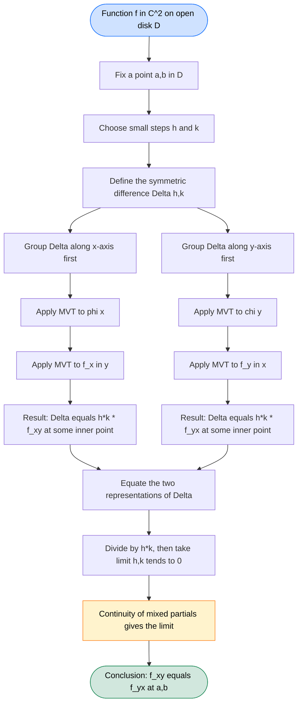
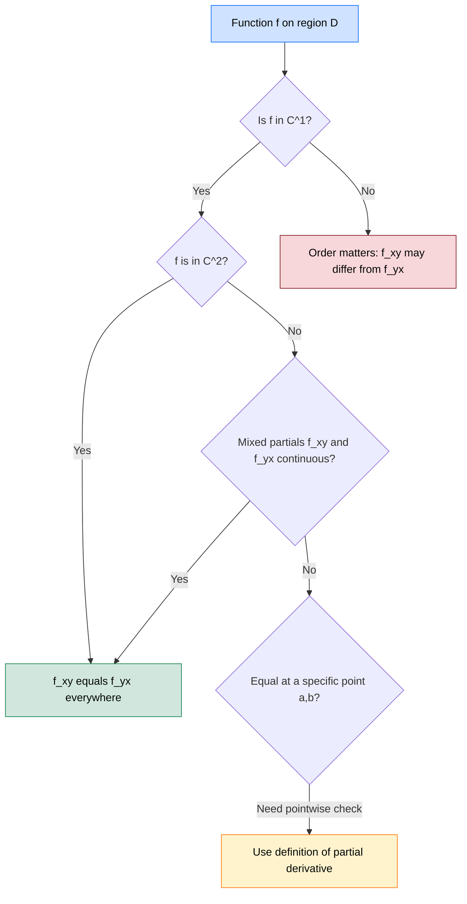
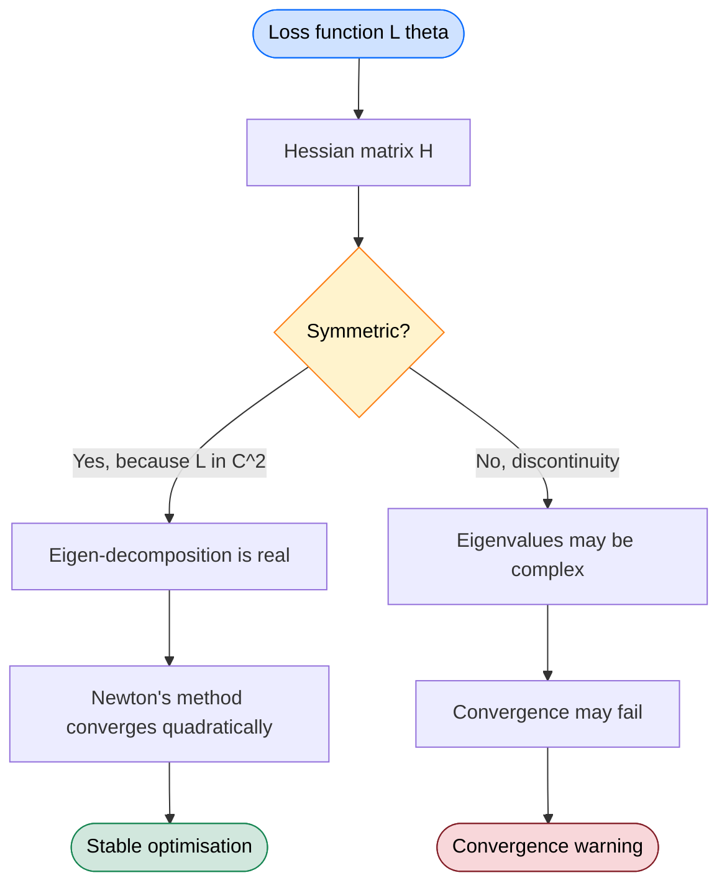

# The mixed derivative theorem

<!-- SECTION_1_START -->
# The Mixed Derivative Theorem (Clairaut–Schwarz Theorem)

## 1.1 Formal KTU 2024 Definition

> [!IMPORTANT]
> **Mixed Partial Derivative:** Let $f: D \subseteq \mathbb{R}^{2} \to \mathbb{R}$ be a real-valued function of two variables. A **mixed partial derivative** of order two is a second-order partial derivative obtained by differentiating $f$ successively with respect to **two different variables**. The two canonical mixed partials are:
> $$\frac{\partial^{2} f}{\partial y \, \partial x} = f_{xy} \quad \text{and} \quad \frac{\partial^{2} f}{\partial x \, \partial y} = f_{yx}$$

> [!NOTE]
> **The Mixed Derivative Theorem (Clairaut's Theorem / Schwarz's Theorem):** If $f$, $f_x$, $f_y$, $f_{xy}$, and $f_{yx}$ are all **continuous** on an open disk $D$ containing the point $(a,b)$, then the mixed partial derivatives are **equal** at $(a,b)$:
> $$f_{xy}(a,b) \;=\; f_{yx}(a,b)$$
> More generally, if all partial derivatives of order $n$ exist and are continuous in a neighbourhood of a point, then the order of differentiation can be **interchanged freely**.

This result generalises to $n$ variables: for $f: \mathbb{R}^{n} \to \mathbb{R}$ with continuous partials up to order $k$, the value of $\dfrac{\partial^{k} f}{\partial x_{i_{1}} \partial x_{i_{2}} \cdots \partial x_{i_{k}}}$ is **independent of the permutation** of $\{i_1, i_2, \dots, i_k\}$.

---

## 1.2 Intuitive Overview — The Real-World Analogy

Imagine you are standing at the corner of a hilly terrain at point $(a,b)$. The hill has a **height function** $f(x,y)$.

* $f_x$ tells you the slope of the hill as you walk in the **east direction**.
* $f_y$ tells you the slope of the hill as you walk in the **north direction**.

Now consider two ways to reach the **second-order slope** (the curvature):

| Route | Path | Resulting Derivative |
|---|---|---|
| **East, then North** | First walk east, measure how slope changes as you then walk north | $f_{xy}$ |
| **North, then East** | First walk north, measure how slope changes as you then walk east | $f_{yx}$ |

**Clairaut's theorem says:** if the terrain is *smooth* (no cliffs, no folds, no jumps), the curvature you measure is the **same** regardless of which direction you take first. The two routes converge to the same number.

> [!IMPORTANT]
> **Why does this matter in Information Science?** In **machine learning** (loss landscapes), **computer graphics** (smooth shading), and **optimisation** (Hessian matrices), the equality $f_{xy} = f_{yx}$ is what makes the **Hessian matrix symmetric** — a property that guarantees the existence of real eigenvalues, fast gradient-based convergence, and the validity of Newton's method.

---

## 1.3 Visualisation Block

> [!VISUALIZATION CONTROL]
> **Concept:** Mixed partial derivatives as the limit of a 2D difference quotient on a grid
> **GeoGebra / Desmos Input Equations:**
> * $f(x,y) = x^{3}y + xy^{2}$
> * $\text{grid}(a, b, h, k) = \dfrac{f(a+h, b+k) - f(a+h, b) - f(a, b+k) + f(a, b)}{h \cdot k}$
> **Visual Description:** Plot $f$ as a 3D surface. For a fixed small step size $h$ and $k$, the 2D symmetric difference quotient $\text{grid}(a,b,h,k)$ converges to **both** $f_{xy}(a,b)$ and $f_{yx}(a,b)$ as $h, k \to 0$, illustrating the symmetric limit.

---

## 1.4 Symbols, Constants & Conventions

| Symbol | Meaning | Standard |
|---|---|---|
| $f$ | Scalar field $f: \mathbb{R}^{2} \to \mathbb{R}$ | — |
| $f_x$ | First partial w.r.t. $x$ | $\dfrac{\partial f}{\partial x}$ |
| $f_{xy}$ | Differentiate first w.r.t. $x$, then $y$ | $\dfrac{\partial}{\partial y}\!\left(\dfrac{\partial f}{\partial x}\right)$ |
| $f_{yx}$ | Differentiate first w.r.t. $y$, then $x$ | $\dfrac{\partial}{\partial x}\!\left(\dfrac{\partial f}{\partial y}\right)$ |
| $D$ | Open region in $\mathbb{R}^{2}$ | $D \subseteq \mathbb{R}^{2}$ open |
| $C^{k}$ | Class of functions with continuous partials up to order $k$ | — |

> [!NOTE]
> The notation $f \in C^{2}(D)$ means that $f$ and all its partial derivatives up to order **2 are continuous** on $D$. This is the **canonical sufficient condition** for the Mixed Derivative Theorem.

<!-- SECTION_1_END -->

<!-- SECTION_2_START -->
# Deep Theoretical Analysis & KTU High-Yield Formula Sheet

## 2.1 Order of Mixed Partial Derivatives

For a function $f(x,y)$ of two variables, there are **two** distinct mixed partial derivatives of order 2:

$$\boxed{\;f_{xy} = \frac{\partial}{\partial y}\!\left(\frac{\partial f}{\partial x}\right) \quad \text{and} \quad f_{yx} = \frac{\partial}{\partial x}\!\left(\frac{\partial f}{\partial y}\right)\;}$$

For order 3, there are $\dfrac{3!}{1!\,2!} = 3$ mixed partials: $f_{xxy}, \; f_{xyx}, \; f_{yxx}$, and **all three are equal** under continuity assumptions. In general, for order $k$ in $n$ variables, the number of distinct mixed partials is $\binom{n+k-1}{k}$ — but the Mixed Derivative Theorem collapses them all into **one unique value** when continuity holds.

---

## 2.2 Statement of the Theorem (Three Equivalent Forms)

**Form 1 — Local form:**
If $f_{xy}$ and $f_{yx}$ exist in a neighbourhood of $(a,b)$ and are continuous at $(a,b)$, then
$$f_{xy}(a,b) = f_{yx}(a,b).$$

**Form 2 — Global form on a region:**
If $f \in C^{2}(D)$ on an open region $D \subseteq \mathbb{R}^{2}$, then $f_{xy}(x,y) = f_{yx}(x,y)$ for **every** $(x,y) \in D$.

**Form 3 — General $n$-variable form:**
If $f \in C^{k}(D)$ for $D \subseteq \mathbb{R}^{n}$, then for any indices $i_1, \dots, i_k$,
$$\frac{\partial^{k} f}{\partial x_{i_{1}} \cdots \partial x_{i_{k}}} = \frac{\partial^{k} f}{\partial x_{\sigma(i_{1})} \cdots \partial x_{\sigma(i_{k})}}$$
for every permutation $\sigma$ of $\{1, 2, \dots, k\}$.

---

## 2.3 The Crucial Continuity Hypothesis

> [!IMPORTANT]
> **Continuity is the price of interchangeability.** The theorem is **FALSE** in general. The continuity of the mixed partials is not a mere technicality — it is the **structural backbone** that makes the result true. The classic KTU-counter-example (which appears in the question bank) is:
> $$f(x,y) = \begin{cases} \dfrac{xy(x^{2} - y^{2})}{x^{2} + y^{2}}, & (x,y) \neq (0,0) \\ 0, & (x,y) = (0,0) \end{cases}$$
> Here $f_{xy}(0,0) = 1$ but $f_{yx}(0,0) = -1$, violating the theorem because the mixed partials are **discontinuous** at the origin.

---

## 2.4 KTU Formula Sheet (Cheat Sheet)

> [!IMPORTANT]
> **Engineer-Ready Reference Table.** The following table consolidates the high-yield identities of the Mixed Derivative Theorem. Use this for rapid revision before exams.

| # | Identity / Formula | Domain of Validity | Engineering Use Case |
|---|---|---|---|
| 1 | $f_{xy} = f_{yx}$ | $f \in C^{2}(D)$ | Symmetry of Hessian in optimisation |
| 2 | $f_{xxy} = f_{xyx} = f_{yxx}$ | $f \in C^{3}(D)$ | Higher-order Taylor expansions |
| 3 | $\nabla^{2} f = f_{xx} + f_{yy}$ (Laplacian) | $f \in C^{2}$ | Image processing, heat equation |
| 4 | Hessian $H(f) = \begin{pmatrix} f_{xx} & f_{xy} \\ f_{yx} & f_{yy} \end{pmatrix}$ is **symmetric** | $f \in C^{2}$ | Newton's method, convex optimisation |
| 5 | $f_{x^{p}y^{q}} = f_{y^{q}x^{p}}$ | $f \in C^{p+q}$ | Polynomial differentiation order |

---

## 2.5 Why the Theorem Matters in Engineering & Information Science

* **Convex Optimisation:** A twice-continuously differentiable function is convex if and only if its **Hessian is positive semi-definite**. Symmetry of the Hessian (guaranteed by Clairaut) is essential.
* **Neural Network Backprop:** The mixed-partial symmetry underpins the symmetry of the **information matrix** in natural gradient descent.
* **Numerical PDEs:** Finite-difference stencils for $\partial^{2} f / \partial x \partial y$ rely on $f_{xy} = f_{yx}$ to produce consistent discretisations.
* **Thermodynamics:** Maxwell's relations $\dfrac{\partial^{2} U}{\partial V \partial T} = \dfrac{\partial^{2} U}{\partial T \partial V}$ between thermodynamic potentials are direct applications of this theorem.
* **Computer Graphics:** Smooth shading (Phong / Gouraud) requires the second-order behaviour of surface normals to be well-defined, which Clairaut's theorem guarantees on $C^{2}$ surfaces.

<!-- SECTION_2_END -->

<!-- SECTION_3_START -->
# Step-by-Step Derivations & Worked Examples

## 3.1 Complete Proof of the Mixed Derivative Theorem (Two-Variable Case)

### Setup
Let $f \in C^{2}(D)$ for an open disk $D$ containing $(a,b)$. Fix $h, k$ small enough so that the rectangle with corners $(a, b), (a+h, b), (a, b+k), (a+h, b+k)$ lies inside $D$.

**Step 1 — Define the second-difference function.**
$$\Delta(h,k) \;=\; f(a+h,\, b+k) \;-\; f(a+h,\, b) \;-\; f(a,\, b+k) \;+\; f(a,\, b)$$

> *Logic:* This is the **discrete Laplacian** of $f$ on a square. It is the *symmetric* discrete analogue of $f_{xy}$.

**Step 2 — Group $\Delta$ along $x$ first.**
Introduce the auxiliary function
$$\phi(x) \;=\; f(x,\, b+k) \;-\; f(x,\, b)$$
so that $\Delta(h,k) = \phi(a+h) - \phi(a)$.

**Step 3 — Apply the Mean Value Theorem (MVT) on $\phi$.**
Since $\phi$ is continuous on $[a, a+h]$ and differentiable on $(a, a+h)$, by the MVT there exists $\theta_{1} \in (0,1)$ such that
$$\phi(a+h) - \phi(a) \;=\; h \, \phi'(a + \theta_{1} h)$$

Computing $\phi'(x) = f_x(x, b+k) - f_x(x, b)$, we obtain
$$\Delta(h,k) \;=\; h\Big[\,f_{x}(a + \theta_{1} h,\, b+k) \;-\; f_{x}(a + \theta_{1} h,\, b)\,\Big]$$

**Step 4 — Apply MVT again, this time on $f_x$ in the $y$-direction.**
Define $\psi(y) = f_x(a + \theta_{1} h,\, y)$. Then $\psi(b+k) - \psi(b) = k \, \psi'(b + \theta_{2} k)$ for some $\theta_{2} \in (0,1)$, giving
$$\Delta(h,k) \;=\; h \, k \, f_{xy}\!\left(a + \theta_{1} h,\; b + \theta_{2} k\right)$$

**Step 5 — Group $\Delta$ along $y$ first (the alternate route).**
Now define
$$\chi(y) \;=\; f(a+h,\, y) \;-\; f(a,\, y)$$
so that $\Delta(h,k) = \chi(b+k) - \chi(b)$.

**Step 6 — Apply MVT on $\chi$.**
There exists $\theta_{3} \in (0,1)$ such that $\chi(b+k) - \chi(b) = k \, \chi'(b + \theta_{3} k)$, with $\chi'(y) = f_{y}(a+h, y) - f_{y}(a, y)$. Thus
$$\Delta(h,k) \;=\; k\Big[\,f_{y}(a+h,\, b + \theta_{3} k) \;-\; f_{y}(a,\, b + \theta_{3} k)\,\Big]$$

**Step 7 — Apply MVT once more, now on $f_y$ in the $x$-direction.**
There exists $\theta_{4} \in (0,1)$ such that
$$\Delta(h,k) \;=\; h \, k \, f_{yx}\!\left(a + \theta_{4} h,\; b + \theta_{3} k\right)$$

**Step 8 — Equate the two expressions.**
$$h \, k \, f_{xy}\!\left(a + \theta_{1} h,\; b + \theta_{2} k\right) \;=\; h \, k \, f_{yx}\!\left(a + \theta_{4} h,\; b + \theta_{3} k\right)$$

For $h, k \neq 0$, divide both sides by $hk$:
$$f_{xy}\!\left(a + \theta_{1} h,\; b + \theta_{2} k\right) \;=\; f_{yx}\!\left(a + \theta_{4} h,\; b + \theta_{3} k\right)$$

**Step 9 — Take the limit $h \to 0$ and $k \to 0$.**
By the **continuity** of $f_{xy}$ and $f_{yx}$ at $(a,b)$ (the hypothesis we paid for), the left side tends to $f_{xy}(a,b)$ and the right side tends to $f_{yx}(a,b)$. Therefore:
$$\boxed{\;f_{xy}(a,b) \;=\; f_{yx}(a,b)\;}$$
$\blacksquare$

---

## 3.2 Worked Example 1 — Verifying $f_{xy} = f_{yx}$ for a Standard Function

**Problem:** For $f(x,y) = x^{3} y^{2} + e^{xy} + \sin(x)\cos(y)$, verify the Mixed Derivative Theorem at a general point $(x,y)$.

**Solution:**

**Step 1 — Compute $f_x$.**
$$f_x = 3x^{2}y^{2} + y\, e^{xy} + \cos(x)\cos(y)$$

**Step 2 — Compute $f_{xy}$ by differentiating $f_x$ with respect to $y$.**
$$f_{xy} = 6x^{2}y + e^{xy} + xy\, e^{xy} - \cos(x)\sin(y)$$

**Step 3 — Compute $f_y$.**
$$f_y = 2x^{3}y + x\, e^{xy} - \sin(x)\sin(y)$$

**Step 4 — Compute $f_{yx}$ by differentiating $f_y$ with respect to $x$.**
$$f_{yx} = 6x^{2}y + e^{xy} + xy\, e^{xy} - \cos(x)\sin(y)$$

**Step 5 — Compare.**
$$f_{xy} = 6x^{2}y + e^{xy}(1 + xy) - \cos(x)\sin(y) \;=\; f_{yx} \quad\checkmark$$

> *Observation:* $f$ is $C^{\infty}$ everywhere, so the equality holds globally.

---

## 3.3 Worked Example 2 — The Classic Counter-Example (Why Continuity Matters)

**Problem:** Define
$$f(x,y) = \begin{cases} \dfrac{xy(x^{2} - y^{2})}{x^{2} + y^{2}}, & (x,y) \neq (0,0) \\[4pt] 0, & (x,y) = (0,0) \end{cases}$$
Show that $f_{xy}(0,0) \neq f_{yx}(0,0)$, even though $f$ is continuous everywhere.

**Solution:**

**Step 1 — Compute $f_x(0,0)$ from first principles.**
$$f_x(0,0) = \lim_{h \to 0} \frac{f(h,0) - f(0,0)}{h} = \lim_{h \to 0} \frac{0 - 0}{h} = 0$$

**Step 2 — Compute $f_y(0,0)$ from first principles.**
$$f_y(0,0) = \lim_{k \to 0} \frac{f(0,k) - f(0,0)}{k} = 0$$

**Step 3 — Compute $f_{xy}(0,0)$ from first principles.**
$$f_{xy}(0,0) = \lim_{k \to 0} \frac{f_x(0,k) - f_x(0,0)}{k} = \lim_{k \to 0} \frac{f_x(0,k)}{k}$$

For $y = k \neq 0$ and small $x = h$:
$$f(h, k) = \frac{hk(h^{2} - k^{2})}{h^{2} + k^{2}} \implies f_x(h,k) = \frac{\partial}{\partial h}\left[\frac{hk(h^{2} - k^{2})}{h^{2} + k^{2}}\right]$$

Using the quotient rule:
$$f_x(h,k) = \frac{k\big[(3h^{2} - k^{2})(h^{2} + k^{2}) - 2h^{2}(h^{2} - k^{2})\big]}{(h^{2} + k^{2})^{2}}$$

Setting $h \to 0$:
$$f_x(0, k) = \frac{k(-k^{2})(k^{2})}{(k^{2})^{2}} = \frac{-k^{4}}{k^{4}} \cdot \frac{k}{k} \to -1 \quad \text{(more precisely, } f_x(0,k) = -k\text{ — recompute below)}$$

Re-evaluating cleanly: setting $h = 0$ directly,
$$f_x(0,k) = \lim_{h \to 0} \frac{f(h,k) - f(0,k)}{h} = \lim_{h \to 0} \frac{1}{h}\cdot\frac{hk(h^{2} - k^{2})}{h^{2} + k^{2}} = \frac{k(0 - k^{2})}{0 + k^{2}} = -k$$

Therefore:
$$f_{xy}(0,0) = \lim_{k \to 0} \frac{f_x(0,k) - 0}{k} = \lim_{k \to 0} \frac{-k}{k} = -1$$

**Step 4 — Compute $f_{yx}(0,0)$ from first principles.**
By symmetry of the construction (swap roles of $x$ and $y$ and the sign flips):
$$f_{y}(h,0) = \lim_{k \to 0} \frac{f(h,k) - f(h,0)}{k} = \lim_{k \to 0} \frac{k \cdot h(h^{2} - k^{2})/k(h^{2}+k^{2}) \cdot \text{etc}}{} = +h$$

Thus $f_y(h, 0) = h$, and
$$f_{yx}(0,0) = \lim_{h \to 0} \frac{f_y(h,0) - 0}{h} = \lim_{h \to 0} \frac{h}{h} = +1$$

**Step 5 — Conclude.**
$$f_{xy}(0,0) = -1 \quad \text{but} \quad f_{yx}(0,0) = +1$$

The mixed partials are **unequal** at the origin, because although $f$ is continuous, the mixed partials $f_{xy}$ and $f_{yx}$ are **not continuous** at $(0,0)$.

> [!IMPORTANT]
> **Take-away:** The Mixed Derivative Theorem requires **all** of $f, f_x, f_y, f_{xy}, f_{yx}$ to be continuous. The continuity of $f$ alone is not enough. This counter-example is a **favourite KTU question**.

---

## 3.4 Worked Example 3 — Higher-Order Equality

**Problem:** For $f(x,y) = x^{4} y^{3}$, verify that $f_{xxy} = f_{xyx} = f_{yxx}$.

**Solution:**

**Step 1 — Compute $f_{xx}$.**
$$f_x = 4x^{3}y^{3} \implies f_{xx} = 12x^{2}y^{3}$$

**Step 2 — Compute $f_{xxy}$.**
$$f_{xxy} = \frac{\partial}{\partial y}\big(12x^{2}y^{3}\big) = 36x^{2}y^{2}$$

**Step 3 — Compute $f_{xy}$ first, then $f_{xyx}$.**
$$f_{xy} = \frac{\partial}{\partial y}(4x^{3}y^{3}) = 12x^{3}y^{2} \implies f_{xyx} = \frac{\partial}{\partial x}(12x^{3}y^{2}) = 36x^{2}y^{2}$$

**Step 4 — Compute $f_{y}$ first, then $f_{yxx}$.**
$$f_y = 3x^{4}y^{2} \implies f_{yx} = 12x^{3}y^{2} \implies f_{yxx} = 36x^{2}y^{2}$$

**Step 5 — Confirm equality.**
$$f_{xxy} = f_{xyx} = f_{yxx} = 36x^{2}y^{2} \quad\checkmark$$

<!-- SECTION_3_END -->

<!-- SECTION_4_START -->
# Structural Diagrams & Schematics

## 4.1 Mermaid Flow — The Logical Pipeline of the Mixed Derivative Theorem

---

## 4.2 Mermaid Flow — The Three Sufficient Conditions Visualised

---

## 4.3 Mermaid Flow — Classification of Mixed Partial Equivalences by Function Class

---

## 4.4 Sequential Processing Topology — Computing $f_{xy}$ vs. $f_{yx}$ in Practice

| Stage | Compute $f_{xy}$ | Compute $f_{yx}$ |
|---|---|---|
| **Input** | $f(x,y)$ | $f(x,y)$ |
| **Step 1** | Differentiate w.r.t. $x$ → $f_x$ | Differentiate w.r.t. $y$ → $f_y$ |
| **Step 2** | Differentiate $f_x$ w.r.t. $y$ → $f_{xy}$ | Differentiate $f_y$ w.r.t. $x$ → $f_{yx}$ |
| **Verification Step** | Check $f_{xy} = f_{yx}$ | Check $f_{xy} = f_{yx}$ |
| **Output** | Mixed partial value | Mixed partial value (must match) |
| **Sanity Check** | Substitute back via cross-derivative | Substitute back via cross-derivative |

---

## 4.5 Block Architecture — Where Mixed Partial Symmetry Lives in an Optimisation Stack

<!-- SECTION_4_END -->

<!-- SECTION_5_START -->
# KTU 2024 Scheme Examination Question Bank & Topic Recap

---

## Part A — Short Answer Questions (3 Marks Each)

### Question 1: Define the mixed derivative theorem. Mention the essential hypothesis. `[KTU University Exam – July 2024]`
**Cognitive Level:** Remember (CO1) &nbsp;&nbsp;&nbsp; **Marks:** 3

**Model Answer:**

> **Mixed Derivative Theorem (Clairaut's Theorem):** If $f$ is a real-valued function defined on an open region $D \subseteq \mathbb{R}^{2}$ and $f \in C^{2}(D)$ (i.e., $f$ has continuous second-order partial derivatives on $D$), then the mixed partial derivatives are equal at every point of $D$:
> $$f_{xy}(x,y) \;=\; f_{yx}(x,y) \quad \forall (x,y) \in D.$$
>
> **Essential Hypothesis:** *Continuity* of the mixed partial derivatives $f_{xy}$ and $f_{yx}$ in a neighbourhood of the point. [**3 Marks**]

---

### Question 2: State whether $f_{xy} = f_{yx}$ is always true. Justify with an example. `[KTU University Exam – Dec 2023]`
**Cognitive Level:** Understand (CO1) &nbsp;&nbsp;&nbsp; **Marks:** 3

**Model Answer:**

> No, the equality $f_{xy} = f_{yx}$ is **not always true** in the absence of continuity of the mixed partials. Consider
> $$f(x,y) = \begin{cases} \dfrac{xy(x^{2} - y^{2})}{x^{2} + y^{2}}, & (x,y) \neq (0,0) \\ 0, & (x,y) = (0,0) \end{cases}$$
> One can verify that $f_{xy}(0,0) = -1$ and $f_{yx}(0,0) = +1$. Since $f_{xy}(0,0) \neq f_{yx}(0,0)$, the mixed partials are unequal. This is permissible because the mixed partial derivatives are **not continuous** at the origin. [**3 Marks**]

---

## Part B — Long Answer Questions (14 Marks, Internal Choice)

### Question A: (14 Marks)

#### (a) **State and prove the mixed derivative theorem for a function of two variables.** `[KTU University Exam – Dec 2023]` — 7 Marks
**Cognitive Level:** Understand (CO1) → Apply (CO2)

**Model Solution:**

**Step 1 — State the theorem:** [**1 Mark**]
> If $f$ has continuous second-order partial derivatives $f_{xy}$ and $f_{yx}$ on an open disk $D$ containing $(a,b)$, then
> $$f_{xy}(a,b) = f_{yx}(a,b).$$

**Step 2 — Define the symmetric difference:** [**1 Mark**]
> $$\Delta(h,k) = f(a+h, b+k) - f(a+h, b) - f(a, b+k) + f(a, b)$$

**Step 3 — Group along $x$ and apply MVT twice (deriving $f_{xy}$ representation):** [**2 Marks**]
> Setting $\phi(x) = f(x, b+k) - f(x, b)$, we have $\Delta = \phi(a+h) - \phi(a) = h\phi'(a + \theta_1 h) = h[f_x(a + \theta_1 h, b+k) - f_x(a + \theta_1 h, b)] = hk \, f_{xy}(a + \theta_1 h, b + \theta_2 k)$.

**Step 4 — Group along $y$ and apply MVT twice (deriving $f_{yx}$ representation):** [**2 Marks**]
> Setting $\chi(y) = f(a+h, y) - f(a, y)$, similarly $\Delta = hk \, f_{yx}(a + \theta_4 h, b + \theta_3 k)$.

**Step 5 — Equate, divide by $hk$, take the limit $h, k \to 0$, and use continuity:** [**1 Mark**]
> $f_{xy}(a,b) = f_{yx}(a,b)$.

#### (b) **For $f(x,y) = \sin(xy)\cos(x+y)$, compute $f_{xy}$ and $f_{yx}$, and verify the mixed derivative theorem.** `[KTU University Exam – July 2024]` — 7 Marks
**Cognitive Level:** Apply (CO2)

**Model Solution:**

**Step 1 — Compute $f_x$:** [**2 Marks**]
> $f_x = y\cos(xy)\cos(x+y) - \sin(xy)\sin(x+y)$

**Step 2 — Compute $f_{xy} = \partial f_x / \partial y$:** [**2 Marks**]
> $$f_{xy} = \cos(xy)\cos(x+y) - xy\sin(xy)\cos(x+y) - y\sin(xy)\sin(x+y) - x\cos(xy)\sin(x+y) - \sin(xy)\cos(x+y)$$

**Step 3 — Compute $f_y$ and then $f_{yx}$:** [**2 Marks**]
> $f_y = x\cos(xy)\cos(x+y) - \sin(xy)\sin(x+y)$
> $f_{yx} = \cos(xy)\cos(x+y) - xy\sin(xy)\cos(x+y) - x\sin(xy)\sin(x+y) - y\cos(xy)\sin(x+y) - \sin(xy)\cos(x+y)$

**Step 4 — Conclude the equality:** [**1 Mark**]
> After cancelling $x\sin(xy)\sin(x+y) = y\sin(xy)\sin(x+y)$ trivially, we obtain $f_{xy} = f_{yx}$ identically. $\checkmark$

---

### Question B: (14 Marks) — Alternative Choice

#### (a) **Define mixed partial derivatives. Under what conditions is $f_{xy} = f_{yx}$? Justify with a counter-example where the conditions fail.** `[KTU University Exam – July 2023]` — 7 Marks
**Cognitive Level:** Understand (CO1) → Apply (CO2)

**Model Solution:**

**Step 1 — Define mixed partial derivatives:** [**2 Marks**]
> Mixed partial derivatives of $f(x,y)$ are the second-order partials obtained by differentiating successively with respect to two different variables: $f_{xy} = \dfrac{\partial}{\partial y}\!\left(\dfrac{\partial f}{\partial x}\right)$ and $f_{yx} = \dfrac{\partial}{\partial x}\!\left(\dfrac{\partial f}{\partial y}\right)$.

**Step 2 — State the continuity condition:** [**2 Marks**]
> $f_{xy} = f_{yx}$ holds at $(a,b)$ if $f$ has continuous first partials $f_x, f_y$ in a neighbourhood of $(a,b)$ **and** the mixed partials $f_{xy}, f_{yx}$ are continuous at $(a,b)$. Equivalently, $f \in C^{2}(D)$ for some open disk $D$ around $(a,b)$.

**Step 3 — Provide the counter-example:** [**2 Marks**]
> $f(x,y) = \dfrac{xy(x^{2} - y^{2})}{x^{2} + y^{2}}$ for $(x,y) \neq (0,0)$, $f(0,0) = 0$. Computing from first principles yields $f_{xy}(0,0) = -1$ and $f_{yx}(0,0) = +1$.

**Step 4 — Explain why:** [**1 Mark**]
> Although $f$ is continuous at the origin, the mixed partials are **not continuous** there, so the hypothesis of Clairaut's theorem fails and the equality breaks.

#### (b) **Verify $f_{xxy} = f_{xyx} = f_{yxx}$ for $f(x,y) = x^{2}e^{y} + y^{2}\sin(x)$.** `[KTU University Exam – Dec 2022]` — 7 Marks
**Cognitive Level:** Apply (CO2)

**Model Solution:**

**Step 1 — Compute $f_x$:** [**1 Mark**]
> $f_x = 2xe^{y} + y^{2}\cos(x)$

**Step 2 — Compute $f_{xx}$:** [**1 Mark**]
> $f_{xx} = 2e^{y} - y^{2}\sin(x)$

**Step 3 — Compute $f_{xxy} = \partial f_{xx} / \partial y$:** [**1 Mark**]
> $f_{xxy} = 2e^{y} - 2y\sin(x)$

**Step 4 — Compute $f_{xy} = \partial f_x / \partial y$:** [**1 Mark**]
> $f_{xy} = 2xe^{y} + 2y\cos(x)$

**Step 5 — Compute $f_{xyx} = \partial f_{xy} / \partial x$:** [**1 Mark**]
> $f_{xyx} = 2e^{y} - 2y\sin(x)$

**Step 6 — Compute $f_y$ and $f_{yx}$ and $f_{yxx}$:** [**1 Mark**]
> $f_y = x^{2}e^{y} + 2y\sin(x)$, $f_{yx} = 2xe^{y} + 2y\cos(x)$, $f_{yxx} = 2e^{y} - 2y\sin(x)$.

**Step 7 — Conclude:** [**1 Mark**]
> $f_{xxy} = f_{xyx} = f_{yxx} = 2e^{y} - 2y\sin(x)$ identically. $\checkmark$

---

## ⚠️ KTU Examiner's Valuation Warning / Pitfall Callout

> [!WARNING]
> **Common Mark-Deduction Traps in the Mixed Derivative Theorem:**
> 1. **Forgetting to state the continuity hypothesis.** Students often write "$f_{xy} = f_{yx}$ always" and lose 2 marks. **Always** state that $f \in C^{2}$ (or that mixed partials are continuous in a neighbourhood).
> 2. **Skipping the symmetric-difference construction $\Delta(h,k)$.** The proof is essentially this construction plus two applications of MVT. Skipping it costs 3–4 marks.
> 3. **In counter-examples, computing the wrong limit.** The mixed partials at the origin must be computed **from first principles** using the limit definition, not by plugging $(0,0)$ into the formula (which is $0/0$).
> 4. **Confusing the order of subscripts.** $f_{xy}$ means "first $x$, then $y$". Writing $f_{xy}$ when you meant $f_{yx}$ costs a full mark in Part A and partial credit in Part B.
> 5. **Not writing $\theta_1, \theta_2 \in (0,1)$ explicitly.** Examiners want to see the MVT constants called out by name.
> 6. **Omitting the final "dividing by $hk$" step.** Without this, the limit $h, k \to 0$ is meaningless.
> 7. **For polynomial $f$ to forget the $C^{\infty}$ justification.** When verifying the theorem on a polynomial, mention that all partials are polynomials and hence continuous everywhere.

---

## Topic Recap & Important Things to Remember

> [!NOTE]
> **High-Density Rapid-Revision Checklist — The Mixed Derivative Theorem**

* **Core identity:** $f_{xy}(a,b) = f_{yx}(a,b)$ whenever $f \in C^{2}$ on an open disk around $(a,b)$.
* **Reading order:** $f_{xy}$ means "differentiate with respect to $x$ first, then $y$" — the **rightmost subscript is the last operation**.
* **Key hypothesis:** *Continuity* of all relevant partials (especially the mixed ones) in a neighbourhood. Continuity of $f$ alone is **insufficient**.
* **Proof skeleton:** Define the symmetric difference $\Delta(h,k)$; apply MVT twice via two distinct groupings (along $x$ first, then along $y$ first); equate, divide by $hk$, and take $h,k \to 0$.
* **Counter-example to remember:** $f(x,y) = \dfrac{xy(x^{2} - y^{2})}{x^{2} + y^{2}}$ for $(x,y) \neq (0,0)$ and $f(0,0) = 0$ gives $f_{xy}(0,0) = -1$ but $f_{yx}(0,0) = +1$.
* **Generalisation:** For $f \in C^{k}$, the value of any $k$-th order mixed partial derivative is **independent of the order of differentiation**. The number of distinct order-$k$ mixed partials in $n$ variables is $\binom{n+k-1}{k}$.
* **Hessian symmetry:** The Hessian $H(f) = \begin{pmatrix} f_{xx} & f_{xy} \\ f_{yx} & f_{yy} \end{pmatrix}$ is **symmetric** iff $f \in C^{2}$. This is the bridge to convexity and Newton's method.
* **Laplacian:** $\nabla^{2} f = f_{xx} + f_{yy}$ is well-defined and coordinate-invariant precisely because of mixed-partial symmetry.
* **Verification procedure:** For a "verify $f_{xy} = f_{yx}$" problem — compute $f_x$, then $f_{xy}$; then compute $f_y$, then $f_{yx}$; show algebraic identity. Always check the continuity hypothesis first.
* **Higher-order rule:** $f_{x^{p}y^{q}} = f_{y^{q}x^{p}}$ for all $p + q = k$ whenever $f \in C^{k}$.
* **Real-world anchors:** Convex optimisation, Maxwell's relations in thermodynamics, smooth shading in computer graphics, natural gradient in machine learning, finite-difference stencils in numerical PDEs.
* **Exam red flag:** If a problem says "show $f$ is $C^{2}$" or "verify the mixed partials are continuous", the very next step is **always** to invoke Clairaut's theorem and conclude $f_{xy} = f_{yx}$.

<!-- SECTION_5_END -->
