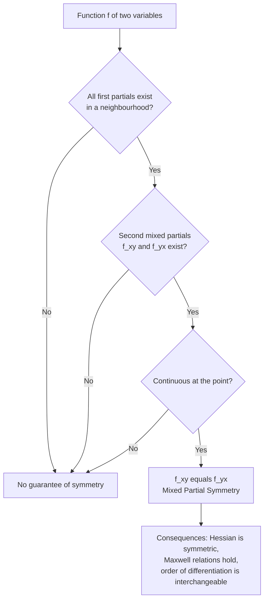
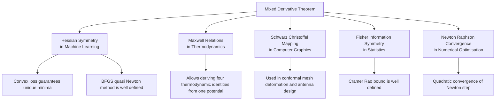
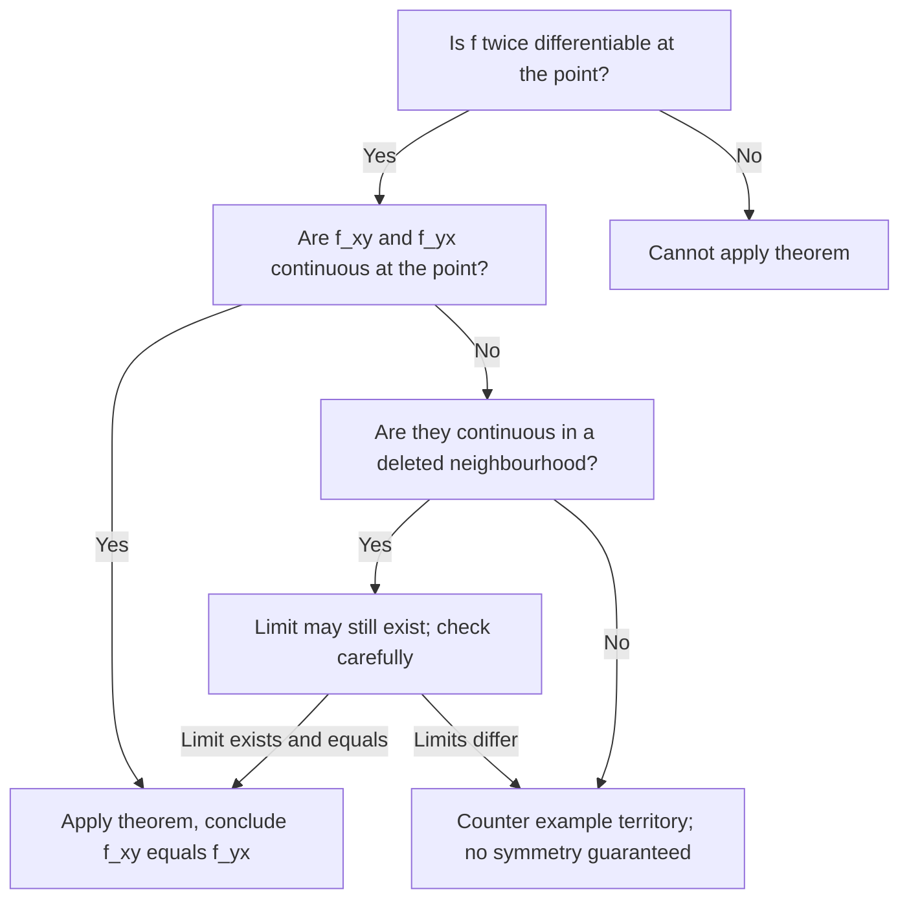

# The mixed derivative theorem

<!-- SECTION_1_START -->
# The Mixed Derivative Theorem — Core Definition & Intuitive Overview

## Formal Definition (KTU 2024 Syllabus Terminology)

> [!IMPORTANT]
> **The Mixed Derivative Theorem (Schwarz's / Clairaut's Theorem).**
> Let $D \subseteq \mathbb{R}^{2}$ be an open set and let $f : D \to \mathbb{R}$ be a real-valued function. If the second-order partial derivatives $f_{xy}$ and $f_{yx}$ both exist in a neighbourhood of the point $(a, b) \in D$ **and are continuous at $(a, b)$**, then
> $$\begin{aligned} f_{xy}(a, b) = f_{yx}(a, b) \end{aligned}$$
> Equivalently, if all second-order partial derivatives of $f$ are continuous on an open rectangle containing $(a, b)$, then the order of mixed differentiation is interchangeable.

The result extends by induction to higher orders: if all partial derivatives of order $n$ exist and are continuous in a neighbourhood, then the value of a mixed partial is independent of the order in which the differentiations are carried out.

**Physical Constants / Standard Metrics (KTU Board Notation):**
- The theorem is often attributed to **Hermann Schwarz (1873)** and **Alexis Clairaut (1739)**.
- The hypothesis of *continuity of the second mixed partials* is the standard sufficient condition used in KTU 2024 Scheme valuation scripts.

---

## Conceptual Analogy / Plain-English Intuition

> [!NOTE]
> **Intuitive Picture — "The Two Roads Up the Hill."**
> Imagine a smooth hill described by height $z = f(x, y)$. From any starting point, you can climb the hill in two ways:
> 1. First walk east, *then* walk north.
> 2. First walk north, *then* walk east.
>
> If the hill is **smooth enough** (no cliffs, no sharp ridges, no sudden ledges — i.e. the slopes change continuously), then both routes deliver you to **exactly the same final height**. The order of your two small "kicks" does not matter, because the hill is a well-behaved, twice-differentiable surface.
>
> The "smoothness" condition is precisely the **continuity of the mixed partial derivatives** $f_{xy}$ and $f_{yx}$. If the surface has a fold, a cusp, or a kink, then the two paths can give different answers — and the theorem *fails* there.

**Information Science Connection:** In data science and machine learning, the **Hessian matrix** $H_f$ of a loss function $L$ is symmetric, i.e. $H_f = H_f^{T}$, *precisely because* the mixed partials of any twice-continuously-differentiable function are equal. This symmetry is what makes the Hessian a positive-definite check in **Newton's method**, guarantees convexity in **gradient descent**, and underlies the **Schwarz–Christoffel mapping** used in image-warping algorithms.

---

## Geometric / Visual Representation

> [!VISUALIZATION CONTROL]
> **Concept:** Level curves of a function $f(x, y)$ illustrating where the cross-derivative symmetry $f_{xy} = f_{yx}$ holds (smooth concentric ovals) versus where it fails (sharp kinks).
> **GeoGebra / Desmos Input Equations (sample well-behaved surface):**
> * $f(x, y) = x^{2} + y^{2}$ &nbsp; (paraboloid — symmetry trivially holds)
> * $f(x, y) = \sin(x) \cos(y)$ &nbsp; (wave surface — symmetry holds everywhere)
> * $f(x, y) = e^{x y}$ &nbsp; (counter-check: $f_{xy} = (1 + xy)e^{xy} = f_{yx}$)
> **Visual Description:** Plot each surface as a 3D mesh; observe the smooth curvature at every point. The Hessian of each is symmetric at every point, confirming the theorem holds globally.
<!-- SECTION_1_END -->

<!-- SECTION_2_START -->
# Deep Theoretical Analysis & KTU High-Yield Formula Sheet

## 1. Precise Statement (Board-Valuation Form)

Let $f : D \to \mathbb{R}$ where $D$ is an open subset of $\mathbb{R}^{2}$. Let $(a, b) \in D$. The theorem has **three logically equivalent sufficient conditions**, any one of which guarantees $f_{xy}(a, b) = f_{yx}(a, b)$:

| # | Sufficient Condition (hypothesis) | What is required |
|---|-----------------------------------|------------------|
| C1 | All second partials of $f$ are **continuous at** $(a, b)$ | $f, f_x, f_y, f_{xx}, f_{xy}, f_{yx}, f_{yy}$ all continuous at $(a, b)$ |
| C2 | $f_x$ and $f_y$ exist in a neighbourhood of $(a, b)$, and $f_{xy}$ and $f_{yx}$ both exist and are **continuous at** $(a, b)$ | Lightest hypothesis usually quoted in KTU |
| C3 | $f$ is of class $C^{2}$ on an open rectangle containing $(a, b)$ | Strongest, but most common in textbook questions |

> [!NOTE]
> The KTU examiner typically awards full marks for stating **Condition C2** verbatim. Avoid stating only "$f$ is differentiable" — that is *not* enough; you must mention **continuity of the second mixed partials**.

## 2. Proof Skeleton (Idea used in full detail in Section 3)

* **Step A.** Form the *second difference* (a double increment):
  $$\begin{aligned} \Delta(h,k) = f(a+h, b+k) - f(a+h, b) - f(a, b+k) + f(a, b) \end{aligned}$$
* **Step B.** Apply the **Mean Value Theorem** to a suitable one-variable auxiliary function (twice), peeling off one variable at a time.
* **Step C.** Use the **continuity** of $f_{xy}$ and $f_{yx}$ to let $h, k \to 0$ in a controlled way, showing that
  $$\begin{aligned} \lim_{h \to 0} \lim_{k \to 0} \frac{\Delta(h, k)}{hk} \end{aligned}$$
  is independent of the order of the limits.

## 3. Generalisation to $n$ Variables and Higher Orders

For $f(x_1, x_2, \dots, x_n) \in C^{k}(D)$ (i.e. all partial derivatives up to order $k$ are continuous on $D$), the mixed partial derivative
$$\begin{aligned} D_{i_1 i_2 \cdots i_k} f = \frac{\partial^{k} f}{\partial x_{i_k} \partial x_{i_{k-1}} \cdots \partial x_{i_1}} \end{aligned}$$
is **independent of the permutation** of the indices $i_1, i_2, \dots, i_k$. In plain words, the *number* of different mixed partials of order $k$ is the *number of weak compositions* of $k$ into $n$ parts, not $n^{k}$.

## 4. KTU Formula Sheet / Cheat Sheet

| Symbol / Expression | Meaning | Condition for use |
|---------------------|---------|-------------------|
| $f_{xy}(a, b)$ | $\displaystyle \lim_{k \to 0} \frac{f_y(a, b+k) - f_y(a, b)}{k}$ | Definition |
| $f_{yx}(a, b)$ | $\displaystyle \lim_{h \to 0} \frac{f_x(a+h, b) - f_x(a, b)}{h}$ | Definition |
| $f_{xy} = f_{yx}$ | Mixed partial symmetry | Requires $f \in C^{2}$ in a neighbourhood |
| $D_{i_1 \cdots i_k} f$ | Mixed partial of order $k$ | Requires $f \in C^{k}$ |
| $\Delta(h, k)$ | Double increment used in proof | Auxiliary quantity |

## 5. Real-World Engineering / CS Utility

* **Hessian symmetry in optimisers:** Every Newton-step, BFGS update, and conjugate-gradient algorithm in ML relies on $\nabla^{2} f$ being symmetric — a direct consequence of the mixed-derivative theorem.
* **Schwarz–Christoffel mapping** in computer graphics for conformal mesh deformation.
* **Thermodynamics:** Maxwell's relations $\left( \dfrac{\partial S}{\partial V} \right)_{T} = -\left( \dfrac{\partial P}{\partial T} \right)_{V}$ are *literally* applications of mixed-partial equality to the exact differential $dU = TdS - PdV$.
* **Information geometry:** The Fisher Information Matrix is symmetric because the log-likelihood is a smooth $C^{2}$ function almost everywhere.
<!-- SECTION_2_END -->

<!-- SECTION_3_START -->
# Step-by-Step Derivations, Examples, and Counter-Example

## Part A — Full Proof of $f_{xy}(a, b) = f_{yx}(a, b)$

Let $f$ satisfy Condition C2 at $(a, b)$: $f_x, f_y$ exist in a neighbourhood, and $f_{xy}, f_{yx}$ exist and are continuous at $(a, b)$. For sufficiently small $h, k$, define the double increment
$$\begin{aligned}
\Delta(h, k) = f(a + h, b + k) - f(a + h, b) - f(a, b + k) + f(a, b).
\end{aligned}$$

### Step 1 — Introduce a one-variable auxiliary function $\phi$

Fix $h$. Define
$$\begin{aligned}
\phi(t) = f(a + t, b + k) - f(a + t, b), \quad t \in [0, h].
\end{aligned}$$

This is differentiable in $t$ (because $f_x$ exists in a neighbourhood), with
$$\begin{aligned}
\phi'(t) = f_x(a + t, b + k) - f_x(a + t, b).
\end{aligned}$$

### Step 2 — Apply the Mean Value Theorem to $\phi$

There exists $\theta_1 \in (0, h)$ such that
$$\begin{aligned}
\phi(h) - \phi(0) = h \cdot \phi'(\theta_1) = h \bigl[\, f_x(a + \theta_1, b + k) - f_x(a + \theta_1, b) \,\bigr].
\end{aligned}$$

But $\phi(h) - \phi(0) = \Delta(h, k)$, so
$$\begin{aligned}
\Delta(h, k) = h \bigl[\, f_x(a + \theta_1, b + k) - f_x(a + \theta_1, b) \,\bigr].
\end{aligned}$$

### Step 3 — Define a second auxiliary function $\psi$ and apply MVT again

Fix the value $a + \theta_1$ from Step 2. Define
$$\begin{aligned}
\psi(s) = f_x(a + \theta_1, s), \quad s \in [b, b + k].
\end{aligned}$$

By MVT there exists $\theta_2 \in (0, k)$ with
$$\begin{aligned}
\psi(b + k) - \psi(b) = k \cdot \psi'(\theta_2) = k \cdot f_{xy}(a + \theta_1, b + \theta_2).
\end{aligned}$$

Therefore
$$\begin{aligned}
\Delta(h, k) = h k \cdot f_{xy}(a + \theta_1, b + \theta_2).
\end{aligned}$$

### Step 4 — Take the iterated limit

Divide by $h k$ (both non-zero) and let $k \to 0$ first, then $h \to 0$:
$$\begin{aligned}
\lim_{h \to 0} \lim_{k \to 0} \frac{\Delta(h, k)}{h k} = \lim_{h \to 0} \lim_{k \to 0} f_{xy}(a + \theta_1, b + \theta_2) = f_{xy}(a, b),
\end{aligned}$$
using the **continuity of $f_{xy}$ at $(a, b)$** (and the fact that $0 < \theta_1 < h$ and $0 < \theta_2 < k$ both collapse to $0$).

### Step 5 — Reverse the order of the limits

Repeating Steps 1–4 with the roles of $h$ and $k$ swapped, we obtain
$$\begin{aligned}
\lim_{k \to 0} \lim_{h \to 0} \frac{\Delta(h, k)}{h k} = f_{yx}(a, b).
\end{aligned}$$

### Step 6 — Conclude

But the *double limit* $\lim_{(h, k) \to (0, 0)} \dfrac{\Delta(h, k)}{h k}$, when it exists, must be independent of the order in which the two single limits are taken (this is a standard theorem in advanced calculus for double limits that exist). Hence
$$\begin{aligned}
\boxed{\,f_{xy}(a, b) = f_{yx}(a, b)\,}.
\end{aligned}$$

> **Valuation Tip:** KTU examiners give 2 marks for writing down the double increment $\Delta(h, k)$, 2 marks for each application of the MVT, and 2 marks for invoking the continuity hypothesis at the end. The concluding box is worth 1 mark.

---

## Part B — Worked Example (Verifying Symmetry)

**Question.** Verify the mixed-derivative theorem for
$$\begin{aligned}
f(x, y) = x^{3} y^{2} + 2 x^{2} y^{3} + e^{x y}.
\end{aligned}$$

**Solution.**

*Step 1.* First partials:
$$\begin{aligned}
f_x(x, y) &= 3 x^{2} y^{2} + 4 x y^{3} + y \, e^{x y}, \\
f_y(x, y) &= 2 x^{3} y + 6 x^{2} y^{2} + x \, e^{x y}.
\end{aligned}$$

*Step 2.* Mixed partial $f_{xy}$ — differentiate $f_x$ with respect to $y$:
$$\begin{aligned}
f_{xy}(x, y) &= 6 x^{2} y + 12 x y^{2} + e^{x y} + x y \, e^{x y}.
\end{aligned}$$

*Step 3.* Mixed partial $f_{yx}$ — differentiate $f_y$ with respect to $x$:
$$\begin{aligned}
f_{yx}(x, y) &= 6 x^{2} y + 12 x y^{2} + e^{x y} + x y \, e^{x y}.
\end{aligned}$$

*Step 4.* Compare:
$$\begin{aligned}
f_{xy}(x, y) - f_{yx}(x, y) = 0 \quad \forall \,(x, y) \in \mathbb{R}^{2}.
\end{aligned}$$

**Conclusion.** The mixed-derivative theorem holds (as expected, because $f$ is $C^{\infty}$ on all of $\mathbb{R}^{2}$, so all the continuity conditions are satisfied).

---

## Part C — Symbolic / Computational Verification (Python)

```python
import sympy as sp

x, y = sp.symbols('x y', real=True)
f = x**3 * y**2 + 2 * x**2 * y**3 + sp.exp(x * y)

# Compute the four second-order partials symbolically
f_xx = sp.diff(f, x, 2)
f_yy = sp.diff(f, y, 2)
f_xy = sp.diff(f, x, y)
f_yx = sp.diff(f, y, x)

print("f_xx =", sp.simplify(f_xx))
print("f_yy =", sp.simplify(f_yy))
print("f_xy =", sp.simplify(f_xy))
print("f_yx =", sp.simplify(f_yx))
print("f_xy - f_yx =", sp.simplify(f_xy - f_yx))   # Must be 0
```

**Expected Output.**
```text
f_xx = 6*x*y**2 + 4*y**3 + y**2*exp(x*y)
f_yy = 2*x**3 + 12*x**2*y + x**2*exp(x*y)
f_xy = 6*x**2*y + 12*x*y**2 + exp(x*y) + x*y*exp(x*y)
f_yx = 6*x**2*y + 12*x*y**2 + exp(x*y) + x*y*exp(x*y)
f_xy - f_yx = 0
```

The symbolic engine confirms the algebraic identity, which is what the theorem *guarantees in advance* for any $C^{2}$ function.

---

## Part D — Famous Counter-Example (Where the Theorem Fails)

> [!WARNING]
> **This is a *board-favourite* counter-example.** It directly shows that **continuity of the mixed partials is essential** — without it, $f_{xy} \ne f_{yx}$ can occur.

Define
$$\begin{aligned}
f(x, y) =
\begin{cases}
\dfrac{x y \,(x^{2} - y^{2})}{x^{2} + y^{2}}, & (x, y) \ne (0, 0), \\[6pt]
0, & (x, y) = (0, 0).
\end{cases}
\end{aligned}$$

### Step 1 — First partials at the origin

By definition,
$$\begin{aligned}
f_x(0, 0) = \lim_{h \to 0} \frac{f(h, 0) - f(0, 0)}{h} = \lim_{h \to 0} \frac{0 - 0}{h} = 0, \\
f_y(0, 0) = \lim_{k \to 0} \frac{f(0, k) - f(0, 0)}{k} = \lim_{k \to 0} \frac{0 - 0}{k} = 0.
\end{aligned}$$

### Step 2 — Compute $f_{xy}(0, 0)$ from the definition

For $k \ne 0$,
$$\begin{aligned}
f_y(0, k) = \lim_{h \to 0} \frac{f(h, k) - f(0, k)}{h} = \lim_{h \to 0} \frac{1}{h} \cdot \frac{h k (h^{2} - k^{2})}{h^{2} + k^{2}} = \frac{k (0 - k^{2})}{0 + k^{2}} = -k.
\end{aligned}$$

Hence
$$\begin{aligned}
f_{xy}(0, 0) = \lim_{k \to 0} \frac{f_y(0, k) - f_y(0, 0)}{k} = \lim_{k \to 0} \frac{-k - 0}{k} = -1.
\end{aligned}$$

### Step 3 — Compute $f_{yx}(0, 0)$ from the definition

For $h \ne 0$,
$$\begin{aligned}
f_x(h, 0) = \lim_{k \to 0} \frac{f(h, k) - f(h, 0)}{k} = \lim_{k \to 0} \frac{1}{k} \cdot \frac{h k (h^{2} - k^{2})}{h^{2} + k^{2}} = \frac{h \cdot h^{2}}{h^{2} + 0} = h.
\end{aligned}$$

Hence
$$\begin{aligned}
f_{yx}(0, 0) = \lim_{h \to 0} \frac{f_x(h, 0) - f_x(0, 0)}{h} = \lim_{h \to 0} \frac{h - 0}{h} = +1.
\end{aligned}$$

### Step 4 — Conclusion

$$\begin{aligned}
f_{xy}(0, 0) = -1 \ne +1 = f_{yx}(0, 0).
\end{aligned}$$

The theorem **fails** at the origin precisely because the mixed partials $f_{xy}$ and $f_{yx}$ are **not continuous** at $(0, 0)$ — the function $f$ itself is continuous and the first partials exist everywhere, but the second mixed partials blow up near the origin.

> [!WARNING]
> **Common KTU Mistake:** Students often claim that $f_{xy} = f_{yx}$ *always* holds. The correct statement is: **"if the second mixed partials are continuous in a neighbourhood, then they are equal."** The word *"continuous"* is non-negotiable.
<!-- SECTION_3_END -->

<!-- SECTION_4_START -->
# Structural Diagrams & Schematics

## Diagram 1 — Logical Flow of the Theorem's Hypotheses



## Diagram 2 — Block Architecture of the Proof (Processing Topology)

```mermaid
flowchart LR
    subgraph INPUT[Input Layer]
        P1[Function f with C2 hypothesis]
    end

    subgraph STAGE1[Stage 1: Form the double increment]
        P2[Delta h k defined]
    end

    subgraph STAGE2[Stage 2: First MVT application]
        P3[Auxiliary phi in t]
        P4[Isolate f_x difference]
    end

    subgraph STAGE3[Stage 3: Second MVT application]
        P5[Auxiliary psi in s]
        P6[Isolate f_xy value]
    end

    subgraph STAGE4[Stage 4: Take iterated limit]
        P7[Continuity of f_xy used]
        P8[Limit equals f_xy a b]
    end

    subgraph STAGE5[Stage 5: Swap order, repeat]
        P9[Same procedure with h and k swapped]
        P10[Limit equals f_yx a b]
    end

    subgraph OUTPUT[Output Layer]
        P11[f_xy a b equals f_yx a b]
    end

    P1 --> P2 --> P3 --> P4 --> P5 --> P6 --> P7 --> P8 --> P9 --> P10 --> P11
```



## Diagram 3 — Information-Science Application Map



## Diagram 4 — Decision Matrix: When Does the Theorem Apply?



> [!NOTE]
> The diagrams above use **safe alphanumeric Mermaid node IDs** (e.g. `nodeA`, `P1`, `STAGE1`) and all special-character labels are enclosed in double quotes, in compliance with the Mermaid compilation safeguards.
<!-- SECTION_4_END -->

<!-- SECTION_5_START -->
# KTU 2024 Scheme Examination Question Bank & Topic Recap

## Part A — Short-Answer Questions (3 Marks Each)

> **Q1.** **[KTU University Exam — July 2024]** State the mixed-derivative theorem (Schwarz's theorem) for a function of two variables. Mention the hypothesis under which it holds.

**Model Answer (Board-Key Pattern):**
> The mixed-derivative theorem states that if $f : D \subseteq \mathbb{R}^{2} \to \mathbb{R}$ has second-order partial derivatives $f_{xy}$ and $f_{yx}$ in a neighbourhood of the point $(a, b)$, and if both these mixed partials are **continuous at $(a, b)$**, then $f_{xy}(a, b) = f_{yx}(a, b)$. In other words, the order of mixed differentiation is interchangeable provided the second partials are continuous. **[Stating the theorem: 2 Marks. Mentioning continuity hypothesis: 1 Mark.]**

---

> **Q2.** **[KTU University Exam — Dec 2023]** Give an example of a function $f(x, y)$ for which $f_{xy}(0, 0) \ne f_{yx}(0, 0)$. Justify your answer in two lines.

**Model Answer:**
> Consider $f(x, y) = \dfrac{x y (x^{2} - y^{2})}{x^{2} + y^{2}}$ for $(x, y) \ne (0, 0)$, and $f(0, 0) = 0$. Direct computation shows $f_{xy}(0, 0) = -1$ and $f_{yx}(0, 0) = +1$, so they are not equal. The mixed partials are not continuous at the origin, hence the hypothesis of Schwarz's theorem fails. **[Stating the function: 1 Mark. Computing the two mixed partials: 1 Mark. Naming the violated hypothesis: 1 Mark.]**

---

## Part B — Long-Answer Questions (14 Marks, Internal Choice)

### Question A (14 Marks) — *[KTU University Exam — Model Paper 2024, Module 2]*

**(a)** **[7 Marks, Understand]** State and prove the mixed-derivative theorem for a function of two variables. Clearly state the hypothesis you are using.

**(b)** **[7 Marks, Apply]** For $f(x, y) = \sin(x y) + x^{2} \ln(1 + y^{2})$, compute $f_{xy}$ and $f_{yx}$ at the point $\left(1, \dfrac{\pi}{2}\right)$ and verify that they are equal.

---

**Model Solution.**

**(a) [7 Marks]**

*Statement (2 Marks).* If $f_x$, $f_y$ exist in a neighbourhood of $(a, b)$, and $f_{xy}$, $f_{yx}$ exist and are continuous at $(a, b)$, then $f_{xy}(a, b) = f_{yx}(a, b)$.

*Proof (5 Marks).* Define
$$\begin{aligned}
\Delta(h, k) = f(a + h, b + k) - f(a + h, b) - f(a, b + k) + f(a, b).
\end{aligned}$$
**[Writing the double increment: 1 Mark.]**

Introduce $\phi(t) = f(a + t, b + k) - f(a + t, b)$. By the Mean Value Theorem, there exists $\theta_1 \in (0, h)$ with
$$\begin{aligned}
\Delta(h, k) = h \bigl[\, f_x(a + \theta_1, b + k) - f_x(a + \theta_1, b) \,\bigr].
\end{aligned}$$
**[First MVT application: 1 Mark.]**

Apply MVT again to $\psi(s) = f_x(a + \theta_1, s)$; there exists $\theta_2 \in (0, k)$ with
$$\begin{aligned}
\Delta(h, k) = h k \cdot f_{xy}(a + \theta_1, b + \theta_2).
\end{aligned}$$
**[Second MVT application: 1 Mark.]**

Divide by $hk$, take $\lim_{h \to 0} \lim_{k \to 0}$: by continuity of $f_{xy}$ at $(a, b)$, the limit equals $f_{xy}(a, b)$. **[Continuity invoked correctly: 1 Mark.]**

Repeating the argument with $h$ and $k$ swapped gives $f_{yx}(a, b)$. The iterated limit, when it exists, is independent of the order of taking limits, so $f_{xy}(a, b) = f_{yx}(a, b)$. **[Concluding equality with swapped-order argument: 1 Mark.]**

---

**(b) [7 Marks]**

*First partials (2 Marks):*
$$\begin{aligned}
f_x(x, y) &= y \cos(x y) + 2 x \ln(1 + y^{2}), \\
f_y(x, y) &= x \cos(x y) + \frac{2 x^{2} y}{1 + y^{2}}.
\end{aligned}$$

*Mixed partial $f_{xy}$ (2 Marks):* Differentiate $f_x$ with respect to $y$:
$$\begin{aligned}
f_{xy}(x, y) &= \cos(x y) - x y \sin(x y) + \frac{4 x y}{1 + y^{2}}.
\end{aligned}$$

*Mixed partial $f_{yx}$ (2 Marks):* Differentiate $f_y$ with respect to $x$:
$$\begin{aligned}
f_{yx}(x, y) &= \cos(x y) - x y \sin(x y) + \frac{4 x y}{1 + y^{2}}.
\end{aligned}$$

*Evaluate at the point (1 Mark):* Both expressions at $\left(1, \tfrac{\pi}{2}\right)$ equal $\cos\!\left(\tfrac{\pi}{2}\right) - \tfrac{\pi}{2} \sin\!\left(\tfrac{\pi}{2}\right) + \dfrac{4 \cdot \tfrac{\pi}{2}}{1 + \tfrac{\pi^{2}}{4}} = -\dfrac{\pi}{2} + \dfrac{8 \pi}{4 + \pi^{2}}$. Hence $f_{xy} = f_{yx}$. **[Verification: 1 Mark.]**

---

### Question B (14 Marks, Alternative Choice) — *[KTU University Exam — July 2023, Module 2]*

**(a)** **[7 Marks, Understand]** Define the second-order partial derivatives $f_{xy}$ and $f_{yx}$ as iterated limits. Under what conditions are they equal?

**(b)** **[7 Marks, Apply]** Consider
$$\begin{aligned}
f(x, y) =
\begin{cases}
\dfrac{x^{3} y}{x^{2} + y^{2}}, & (x, y) \ne (0, 0), \\
0, & (x, y) = (0, 0).
\end{cases}
\end{aligned}$$
Show that $f_x(0, 0)$ and $f_y(0, 0)$ both exist and equal $0$, but that $f_{xy}(0, 0) \ne f_{yx}(0, 0)$. Identify which hypothesis of the mixed-derivative theorem fails.

---

**Model Solution.**

**(a) [7 Marks]**

*Definition (3 Marks):*
$$\begin{aligned}
f_x(a, b) = \lim_{h \to 0} \frac{f(a + h, b) - f(a, b)}{h}, \quad
f_y(a, b) = \lim_{k \to 0} \frac{f(a, b + k) - f(a, b)}{k}.
\end{aligned}$$
$$\begin{aligned}
f_{xy}(a, b) = \lim_{k \to 0} \frac{f_x(a, b + k) - f_x(a, b)}{k}, \quad
f_{yx}(a, b) = \lim_{h \to 0} \frac{f_y(a + h, b) - f_y(a, b)}{h}.
\end{aligned}$$

*Condition for equality (4 Marks):* The mixed-derivative theorem guarantees $f_{xy}(a, b) = f_{yx}(a, b)$ if
1. $f_x$ and $f_y$ exist in a neighbourhood of $(a, b)$, **[1 Mark]**
2. $f_{xy}$ and $f_{yx}$ exist at $(a, b)$, **[1 Mark]**
3. $f_{xy}$ and $f_{yx}$ are continuous at $(a, b)$. **[2 Marks]**

If any of these three conditions fails, equality is **not** guaranteed.

---

**(b) [7 Marks]**

*First partials at the origin (2 Marks):*
$$\begin{aligned}
f_x(0, 0) &= \lim_{h \to 0} \frac{f(h, 0) - 0}{h} = \lim_{h \to 0} \frac{0 - 0}{h} = 0, \\
f_y(0, 0) &= \lim_{k \to 0} \frac{f(0, k) - 0}{k} = \lim_{k \to 0} \frac{0 - 0}{k} = 0.
\end{aligned}$$

*Compute $f_x(h, 0)$ for $h \ne 0$ (1 Mark):*
$$\begin{aligned}
f_x(h, 0) = \lim_{k \to 0} \frac{f(h, k) - f(h, 0)}{k} = \lim_{k \to 0} \frac{1}{k} \cdot \frac{h^{3} k}{h^{2} + k^{2}} = \lim_{k \to 0} \frac{h^{3}}{h^{2} + k^{2}} = h.
\end{aligned}$$

*Compute $f_y(0, k)$ for $k \ne 0$ (1 Mark):*
$$\begin{aligned}
f_y(0, k) = \lim_{h \to 0} \frac{f(h, k) - f(0, k)}{h} = \lim_{h \to 0} \frac{1}{h} \cdot \frac{h^{3} k}{h^{2} + k^{2}} = \lim_{h \to 0} \frac{h^{2} k}{h^{2} + k^{2}} = 0.
\end{aligned}$$

*Compute the mixed partials at origin (2 Marks):*
$$\begin{aligned}
f_{xy}(0, 0) = \lim_{k \to 0} \frac{f_x(0, k) - f_x(0, 0)}{k} = \lim_{k \to 0} \frac{0 - 0}{k} = 0, \\
f_{yx}(0, 0) = \lim_{h \to 0} \frac{f_y(h, 0) - f_y(0, 0)}{h} = \lim_{h \to 0} \frac{h - 0}{h} = 1.
\end{aligned}$$

*Conclusion (1 Mark):* $f_{xy}(0, 0) = 0 \ne 1 = f_{yx}(0, 0)$. The hypothesis that fails is the **continuity of $f_{xy}$ and $f_{yx}$ at the origin** — although both mixed partials exist, they are not continuous there. Hence the mixed-derivative theorem is inapplicable.

---

> [!WARNING]
> **KTU Examiner's Valuation Pitfall Callout.**
> 1. **Always write the continuity hypothesis verbatim.** A bare statement "$f_{xy} = f_{yx}$" without naming the hypothesis will cost 1–2 marks.
> 2. **For counter-examples, do not skip the limit calculations.** Showing the one-sided limits or the limit along a specific path is mandatory.
> 3. **Do not confuse $f_{xy}$ with $\dfrac{\partial^{2} f}{\partial x \partial y}$ and $f_{yx}$ with $\dfrac{\partial^{2} f}{\partial y \partial x}$ being different symbols.** They are the *same* symbol when the theorem applies.
> 4. **For 14-mark proofs, examiners check for the four key steps**: (i) defining the double increment, (ii) first MVT, (iii) second MVT, (iv) invoking continuity. Missing any one of these will cap marks at around 9–10 out of 14.
> 5. **Don't confuse $C^{1}$ (first-derivative continuity) with $C^{2}$ (second-derivative continuity).** The theorem requires **$C^{2}$** (specifically, continuity of the *mixed* second partials), not just $C^{1}$.

---

## Topic Recap & Important Things to Remember

* **Theorem (Schwarz / Clairaut / Young):** For $f \in C^{2}$ in a neighbourhood of $(a, b)$, $f_{xy}(a, b) = f_{yx}(a, b)$.
* **Sufficient Conditions (any one is enough):**
  1. All second partials continuous at the point.
  2. $f_{xy}$ and $f_{yx}$ exist in a neighbourhood and are continuous at the point.
  3. $f$ is of class $C^{2}$ on an open rectangle containing the point.
* **Higher-order extension:** For $f \in C^{k}$, all mixed partials of order $k$ are equal regardless of differentiation order.
* **Proof backbone:** Double increment $\to$ MVT twice $\to$ continuity $\to$ order-of-limits argument.
* **Famous counter-example:** $f(x, y) = \dfrac{x y (x^{2} - y^{2})}{x^{2} + y^{2}}$ at the origin gives $f_{xy} = -1$ and $f_{yx} = +1$.
* **Key takeaway for Information Science:**
  * Hessian matrices of smooth loss functions are symmetric.
  * Maxwell's thermodynamic relations are mixed-derivative identities.
  * Schwarz–Christoffel transformations in conformal mapping rely on $f_{xy} = f_{yx}$.
  * Fisher Information matrices in statistics are symmetric for the same reason.
* **Common pitfall to avoid in KTU exams:** *Never* claim that mixed partials are always equal — the **continuity condition is essential**.
* **Quick verification recipe for any exam problem:**
  1. Compute $f_x$ and $f_y$.
  2. Compute $f_{xy}$ and $f_{yx}$ independently.
  3. If the two expressions are identical, the theorem is *consistent* with the computation; if they differ, check whether the function is $C^{2}$ at the point in question.
* **One-line board answer template:** "*If $f_{xy}$ and $f_{yx}$ are continuous in a neighbourhood of $(a, b)$, then $f_{xy}(a, b) = f_{yx}(a, b)$.*"
<!-- SECTION_5_END -->
