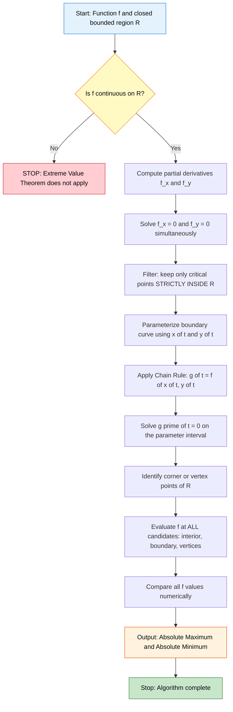
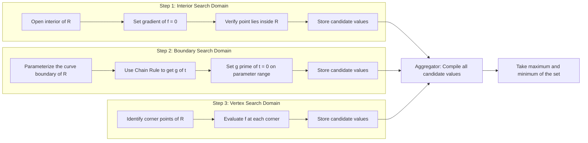
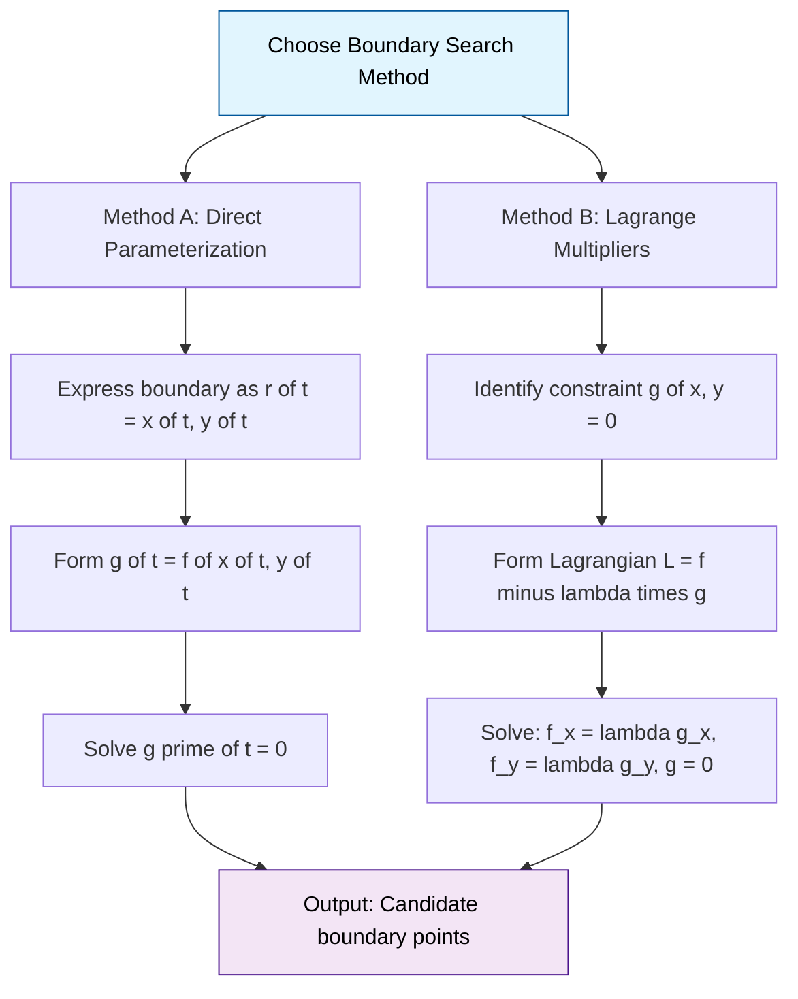

# Absolute Maxima and Minima on Closed Bounded Regions

<!-- SECTION_1_START -->
# Absolute Maxima and Minima on Closed Bounded Regions

## 1.1 Formal Academic Definition (KTU 2024 Syllabus Terminology)

> [!IMPORTANT]
> **Absolute (Global) Maxima and Minima — Rigorous Definition**
>
> Let $f: D \subseteq \mathbb{R}^{2} \to \mathbb{R}$ be a real-valued function defined on a region $D$. The function $f$ attains an **absolute maximum** at the point $(x_{0}, y_{0}) \in D$ if
>
> $$f(x_{0}, y_{0}) \geq f(x, y) \quad \text{for all } (x, y) \in D.$$
>
> Similarly, $f$ attains an **absolute minimum** at $(x_{1}, y_{1}) \in D$ if
>
> $$f(x_{1}, y_{1}) \leq f(x, y) \quad \text{for all } (x, y) \in D.$$
>
> The points $(x_{0}, y_{0})$ and $(x_{1}, y_{1})$ are called the **global extreme points** of $f$ on $D$.

> [!NOTE]
> **Closed Bounded Region (Compact Set in $\mathbb{R}^{2}$)**
>
> A region $R \subset \mathbb{R}^{2}$ is called a **closed bounded region** if it is:
> 1. **Closed:** It contains all of its boundary points, and
> 2. **Bounded:** It can be enclosed within a disk of finite radius $r > 0$.
>
> In KTU notation, such regions are typically written as $R = \{(x, y) : a \leq x \leq b, \, c \leq y \leq d\}$ for a rectangle, or any polygon with finite area.

## 1.2 Conceptual Analogy — The "Island & Mountain" Intuition

Imagine you are standing on a **hilly island** of finite size (a closed bounded region). The terrain is described by a height function $f(x, y)$ — the elevation at each point on the island.

* The **highest peak** on the island is the **absolute maximum** of $f$.
* The **deepest valley** is the **absolute minimum** of $f$.
* The island has both **interior regions** (open plains inside) and a **coastline** (the boundary).

To find the highest peak, you must check:
1. **Interior hilltops** (where the slope is zero in every direction — a true summit).
2. **Coastline peaks** (a cliff that drops directly into the sea).
3. **Corners** of irregular coastlines (where two cliffs meet).

This is precisely the algorithm for finding absolute extrema on a closed bounded region.

> [!TIP]
> **Why this matters in Computer Science:** Finding global maxima/minima of cost functions over constrained regions is the backbone of **optimization algorithms** in machine learning (loss landscapes), **resource allocation** in operations research, and **signal processing** (filter design over bounded frequency bands).

> [!VISUALIZATION CONTROL]
> **Concept:** Paraboloid surface $f(x, y) = x^{2} + 2y^{2}$ over a square region with a tilted plane showing the global minimum.
> **GeoGebra / Desmos Input Equations:**
> * Surface: `f(x, y) = x^2 + 2y^2 - 4x - 4y + 5`
> * Contour projection on $xy$-plane: set of points $(x, y)$ with $f(x, y) = c$ — nested ellipses centered at $(2, 1)$.
> **Visual Description:** Students should observe concentric elliptical level curves shrinking toward the interior point $(2, 1)$, which is the bowl's bottom (the absolute minimum), and corners $(0, 4)$ and $(4, 4)$ shooting upward as the absolute maximum.

---

## 1.3 The Extreme Value Theorem (Weierstrass) — The Guarantee

> [!IMPORTANT]
> **Theorem: Extreme Value Theorem for Functions of Two Variables**
>
> If $f$ is **continuous** on a **closed bounded region** $R \subset \mathbb{R}^{2}$, then $f$ attains both an **absolute maximum** value and an **absolute minimum** value on $R$.
>
> *This theorem is non-constructive — it guarantees existence but does not tell us WHERE the extrema occur. We need an algorithm to locate them.*

The three conditions — **continuity**, **closedness**, and **boundedness** — are all essential. Dropping any one of them can cause the extrema to fail to exist (think of $\tan(x)$ near $\pi/2$, or $f(x) = x$ on the open interval $(0, 1)$).

<!-- SECTION_1_END -->

<!-- SECTION_2_START -->
# Deep Theoretical Analysis & KTU High-Yield Formula Sheet

## 2.1 The Three-Step Search Strategy

To systematically locate absolute extrema on a closed bounded region, we partition the problem into three disjoint sets of candidate points:

### Step 1 — Interior Critical Points (Open Region)

A point $(x_{0}, y_{0})$ is a **critical point** of $f$ if:

$$\nabla f(x_{0}, y_{0}) = \mathbf{0} \quad \Longleftrightarrow \quad f_{x}(x_{0}, y_{0}) = 0 \text{ and } f_{y}(x_{0}, y_{0}) = 0$$

**OR** if one of the partial derivatives $f_{x}$ or $f_{y}$ **fails to exist** at $(x_{0}, y_{0})$.

Only critical points lying **strictly inside** the region (not on the boundary) are considered here.

### Step 2 — Boundary Critical Points (1D Optimization)

The boundary $\partial R$ is a **one-dimensional curve**. We have two equivalent techniques:

**Method A: Direct Parameterization**
Express the boundary as $\mathbf{r}(t) = (x(t), y(t))$ for $t \in [a, b]$, and reduce to a single-variable problem:

$$g(t) = f(x(t), y(t)), \quad \text{find critical points where } g'(t) = 0.$$

**Method B: Lagrange Multipliers (Advanced)**
For an implicit boundary $g(x, y) = 0$, solve the system:

$$\nabla f = \lambda \, \nabla g, \quad g(x, y) = 0.$$

### Step 3 — Vertices / Corner Points

For a **polygonal** region, the **vertices** (corners) are also candidate points because the boundary is not smooth there.

> [!NOTE]
> **The "Is the point inside?" Test**
>
> A point $(x_{0}, y_{0})$ lies inside the region $R$ if there exists $\varepsilon > 0$ such that the open disk $B_{\varepsilon}(x_{0}, y_{0})$ is fully contained in $R$. Boundary points fail this test — no matter how small $\varepsilon$ is, the disk pokes outside $R$.

## 2.2 KTU Formula Sheet — Complete Reference

> [!TIP]
> Memorize this table — every KTU question on absolute extrema is a direct application of these formulas.

| Concept | Formula / Condition | Geometric Meaning | Used In |
|---|---|---|---|
| Gradient vector | $\nabla f = \langle f_{x}, f_{y} \rangle$ | Direction of steepest ascent | All critical point problems |
| Interior critical point | $f_{x} = 0$ and $f_{y} = 0$ | Horizontal tangent plane | Step 1 of algorithm |
| Boundary via parameterization | $g'(t) = f_{x} \cdot x'(t) + f_{y} \cdot y'(t) = 0$ | Chain rule applied along curve | Step 2 — Method A |
| Lagrange condition | $f_{x} = \lambda \, g_{x}$ and $f_{y} = \lambda \, g_{y}$ | $\nabla f \parallel \nabla g$ | Step 2 — Method B |
| Second Derivative Test | $D = f_{xx} f_{yy} - (f_{xy})^{2}$ | Classifies critical points | Pre-screening interior points |
| Absolute max/min values | $\max/\min \{f(P_{i})\}$ over all candidates $P_{i}$ | Compare function values | Final step |

> [!IMPORTANT]
> **The Second Derivative Test (Pre-Check)**
>
> At a critical point $(a, b)$ where $f_{x} = f_{y} = 0$:
>
> $$\text{Let } D(a, b) = f_{xx}(a, b) \cdot f_{yy}(a, b) - \left[ f_{xy}(a, b) \right]^{2}.$$
>
> * If $D > 0$ and $f_{xx}(a, b) > 0$: **local minimum** at $(a, b)$.
> * If $D > 0$ and $f_{xx}(a, b) < 0$: **local maximum** at $(a, b)$.
> * If $D < 0$: **saddle point** — not an extremum.
> * If $D = 0$: **test inconclusive** — use other methods.

## 2.3 Real-World Engineering Utility

This algorithm is foundational in:

* **Machine Learning:** Loss function minimization over a constrained weight region (L2 regularization = minimize loss over a closed ball).
* **Computer Vision:** Template matching where the optimal position is found by searching a closed bounded region of pixel coordinates.
* **Operations Research:** Resource allocation where variables have explicit upper and lower bounds.
* **Signal Processing:** Filter design where frequency responses are optimized over closed rectangular regions in the $z$-plane.
* **Robotics:** Trajectory optimization with bounded actuator torques (closed cube in $\mathbb{R}^{n}$).

> [!NOTE]
> **KTU 2024 Module 3 Connection**
> This topic sits at the intersection of **partial differentiation** (Module 3) and **constrained optimization** (a recurring theme in Module 5 / Optimization electives). The Chain Rule you studied earlier is the workhorse for boundary parameterization.

<!-- SECTION_2_END -->

<!-- SECTION_3_START -->
# Step-by-Step Worked Example — Complete Derivation

> [!IMPORTANT]
> **Model Question Pattern (KTU 2024 Scheme)**
>
> Find the absolute maximum and minimum values of the function $f(x, y) = x^{2} + 2y^{2} - 4x - 4y + 5$ on the closed rectangular region
>
> $$R = \{(x, y) \in \mathbb{R}^{2} \mid 0 \leq x \leq 4, \; 0 \leq y \leq 4\}.$$

## 3.1 Step 1 — Verify Preconditions and Compute Interior Critical Points

**Continuity check:** $f$ is a polynomial in $x$ and $y$, hence continuous everywhere.

**Closed bounded region check:** $R$ is a closed rectangle — both closed (includes edges) and bounded (fits inside a disk of radius $4\sqrt{2}$). ✓

By the **Extreme Value Theorem**, absolute extrema exist.

**Compute partial derivatives:**

$$f_{x}(x, y) = \frac{\partial}{\partial x}\left( x^{2} + 2y^{2} - 4x - 4y + 5 \right) = 2x - 4$$

$$f_{y}(x, y) = \frac{\partial}{\partial y}\left( x^{2} + 2y^{2} - 4x - 4y + 5 \right) = 4y - 4$$

**Set partials to zero simultaneously:**

$$\begin{aligned}
2x - 4 &= 0 \quad \Longrightarrow \quad x = 2, \\
4y - 4 &= 0 \quad \Longrightarrow \quad y = 1.
\end{aligned}$$

**Interior test:** The candidate point is $(2, 1)$. Since $0 < 2 < 4$ and $0 < 1 < 4$, this point lies strictly inside $R$. ✓

**Function value at the interior critical point:**

$$\begin{aligned}
f(2, 1) &= (2)^{2} + 2(1)^{2} - 4(2) - 4(1) + 5 \\
&= 4 + 2 - 8 - 4 + 5 \\
&= -1.
\end{aligned}$$

> [!NOTE]
> **Valuation Key Point:** A student skipping the interior test loses **1 mark** even if the point is correct. Always verify the candidate lies *strictly* inside the region.

## 3.2 Step 2 — Boundary Analysis (Four Sides of the Rectangle)

### Boundary Edge 1: Bottom — $y = 0$, $x \in [0, 4]$

**Substitute $y = 0$ into $f$:**

$$f(x, 0) = x^{2} + 0 - 4x - 0 + 5 = x^{2} - 4x + 5$$

**Reduce to a single-variable function:** Let $g_{1}(x) = x^{2} - 4x + 5$ on $[0, 4]$.

**Differentiate and set to zero:**

$$g_{1}'(x) = 2x - 4 = 0 \quad \Longrightarrow \quad x = 2.$$

**Confirm $x = 2 \in [0, 4]$.** ✓

**Function values:**

$$\begin{aligned}
g_{1}(2) &= (2)^{2} - 4(2) + 5 = 4 - 8 + 5 = 1, \\
g_{1}(0) &= 0 - 0 + 5 = 5, \\
g_{1}(4) &= 16 - 16 + 5 = 5.
\end{aligned}$$

> [!NOTE]
> **Boundary Edge 1 candidates:** $(2, 0)$ with $f = 1$, $(0, 0)$ with $f = 5$, $(4, 0)$ with $f = 5$.

### Boundary Edge 2: Top — $y = 4$, $x \in [0, 4]$

**Substitute $y = 4$ into $f$:**

$$f(x, 4) = x^{2} + 2(16) - 4x - 4(4) + 5 = x^{2} - 4x + 21$$

**Let $g_{2}(x) = x^{2} - 4x + 21$ on $[0, 4]$.**

$$g_{2}'(x) = 2x - 4 = 0 \quad \Longrightarrow \quad x = 2.$$

**Function values:**

$$\begin{aligned}
g_{2}(2) &= 4 - 8 + 21 = 17, \\
g_{2}(0) &= 0 - 0 + 21 = 21, \\
g_{2}(4) &= 16 - 16 + 21 = 21.
\end{aligned}$$

> [!NOTE]
> **Boundary Edge 2 candidates:** $(2, 4)$ with $f = 17$, $(0, 4)$ with $f = 21$, $(4, 4)$ with $f = 21$.

### Boundary Edge 3: Left — $x = 0$, $y \in [0, 4]$

**Substitute $x = 0$ into $f$:**

$$f(0, y) = 0 + 2y^{2} - 0 - 4y + 5 = 2y^{2} - 4y + 5$$

**Let $g_{3}(y) = 2y^{2} - 4y + 5$ on $[0, 4]$.**

$$g_{3}'(y) = 4y - 4 = 0 \quad \Longrightarrow \quad y = 1.$$

**Function values:**

$$\begin{aligned}
g_{3}(1) &= 2 - 4 + 5 = 3, \\
g_{3}(0) &= 0 - 0 + 5 = 5, \\
g_{3}(4) &= 32 - 16 + 5 = 21.
\end{aligned}$$

> [!NOTE]
> **Boundary Edge 3 candidates:** $(0, 1)$ with $f = 3$, $(0, 0)$ with $f = 5$, $(0, 4)$ with $f = 21$.

### Boundary Edge 4: Right — $x = 4$, $y \in [0, 4]$

**Substitute $x = 4$ into $f$:**

$$f(4, y) = 16 + 2y^{2} - 16 - 4y + 5 = 2y^{2} - 4y + 5$$

**Let $g_{4}(y) = 2y^{2} - 4y + 5$ on $[0, 4]$.**

$$g_{4}'(y) = 4y - 4 = 0 \quad \Longrightarrow \quad y = 1.$$

**Function values:**

$$\begin{aligned}
g_{4}(1) &= 2 - 4 + 5 = 3, \\
g_{4}(0) &= 0 - 0 + 5 = 5, \\
g_{4}(4) &= 32 - 16 + 5 = 21.
\end{aligned}$$

> [!NOTE]
> **Boundary Edge 4 candidates:** $(4, 1)$ with $f = 3$, $(4, 0)$ with $f = 5$, $(4, 4)$ with $f = 21$.

## 3.3 Step 3 — Compile All Candidates and Determine the Winner

**Master Candidate Table (computed above):**

| # | Point $(x, y)$ | Source | $f(x, y)$ |
|---|---|---|---|
| 1 | $(2, 1)$ | Interior critical point | $-1$ |
| 2 | $(2, 0)$ | Bottom edge | $1$ |
| 3 | $(0, 0)$ | Corner / Edge endpoints | $5$ |
| 4 | $(4, 0)$ | Corner / Edge endpoints | $5$ |
| 5 | $(2, 4)$ | Top edge | $17$ |
| 6 | $(0, 4)$ | Corner / Top-Left | $21$ |
| 7 | $(4, 4)$ | Corner / Top-Right | $21$ |
| 8 | $(0, 1)$ | Left edge | $3$ |
| 9 | $(4, 1)$ | Right edge | $3$ |

**Identify the global extremum by simple comparison:**

$$\text{Maximum} = \max\{-1, 1, 5, 5, 17, 21, 21, 3, 3\} = 21$$

$$\text{Minimum} = \min\{-1, 1, 5, 5, 17, 21, 21, 3, 3\} = -1$$

## 3.4 Final Answer

> [!IMPORTANT]
> **Absolute Maximum Value:** $f_{\max} = 21$, attained at the points $(0, 4)$ and $(4, 4)$.
>
> **Absolute Minimum Value:** $f_{\min} = -1$, attained at the interior point $(2, 1)$.

**Verification via Second Derivative Test at $(2, 1)$:**

$$\begin{aligned}
f_{xx} &= 2, \quad f_{yy} = 4, \quad f_{xy} = 0, \\
D(2, 1) &= (2)(4) - (0)^{2} = 8 > 0 \text{ and } f_{xx} = 2 > 0.
\end{aligned}$$

This confirms a **local minimum** at $(2, 1)$, consistent with our global answer.

> [!TIP]
> **Symmetry Check (Sanity):** The function $f(x, y) = x^{2} + 2y^{2} - 4x - 4y + 5$ can be rewritten as $(x-2)^{2} + 2(y-1)^{2} - 1$, which makes it visually obvious that the bowl bottom is at $(2, 1)$ with depth $-1$, and the function grows fastest along the $y$-direction (coefficient $2$), reaching the highest values at the top corners. This is an excellent **engineering verification** trick.

<!-- SECTION_3_END -->

<!-- SECTION_4_START -->
# Structural Diagrams & Schematics

## 4.1 Master Algorithm Flowchart (Mermaid)

## 4.2 Modular Breakdown of the Three Search Domains (Mermaid)

## 4.3 Comparative Topology of Search Methods (Mermaid)

> [!TIP]
> **When to use Lagrange Multipliers vs. Parameterization?**
> * **Parameterization** is simpler when the boundary is a simple curve (line segment, circle, parabola) that you can write in vector form.
> * **Lagrange Multipliers** are preferable when the boundary is given by a complex implicit equation, or when the region is a 3D surface in $\mathbb{R}^{3}$.

<!-- SECTION_4_END -->

<!-- SECTION_5_START -->
# KTU 2024 Scheme Examination Question Bank

## Part A — Short Answer Questions (3 Marks Each)

### Question 1 (3 Marks)
> **[KTU University Exam - July 2024 | CO2 | RBT: Remember]**

**State the Extreme Value Theorem for a function of two variables. List all the conditions that must be satisfied for the theorem to apply.**

**Model Answer:**

> [!NOTE]
> **Extreme Value Theorem (Weierstrass):** If a function $f$ is **continuous on a closed bounded region** $R$ in the $xy$-plane, then $f$ attains both an **absolute maximum** value and an **absolute minimum** value on $R$.
>
> **Three Mandatory Conditions:** [1 Mark each]
> 1. **Continuity of $f$** at every point of $R$.
> 2. **Closedness of $R$** — region must contain all its boundary points.
> 3. **Boundedness of $R$** — region must fit inside some disk of finite radius.

### Question 2 (3 Marks)
> **[KTU University Exam - Dec 2023 | CO2 | RBT: Understand]**

**Define a critical point of $f(x, y)$. Why is it necessary to check the boundary separately when searching for absolute extrema on a closed bounded region?**

**Model Answer:**

> [!NOTE]
> **Critical Point Definition:** A point $(x_{0}, y_{0})$ in the domain of $f$ is called a **critical point** if either: [1 Mark]
> * Both partial derivatives vanish: $f_{x}(x_{0}, y_{0}) = 0$ **and** $f_{y}(x_{0}, y_{0}) = 0$, **OR**
> * At least one partial derivative $f_{x}$ or $f_{y}$ **fails to exist** at $(x_{0}, y_{0})$.
>
> **Why boundary must be checked separately:** [2 Marks]
> The condition $\nabla f = \mathbf{0}$ is necessary for interior extrema, but on the **boundary** the function is constrained to a curve. The directional derivative along the curve's tangent direction can be non-zero, yet the function may attain a larger (or smaller) value there than anywhere in the interior. Hence, boundary candidates (found via parameterization or Lagrange multipliers) and corner points must be evaluated alongside interior critical points.

---

## Part B — Long Answer Questions (14 Marks, with Internal Choice)

### Question A — Option 1 (14 Marks)
> **[KTU University Exam - Dec 2024 | CO2, CO3 | RBT: Apply, Analyze]**

**(a)** Find the critical points of $f(x, y) = x^{2} + 2y^{2} - 4x - 4y + 5$ in the interior of the rectangular region $R = [0, 4] \times [0, 4]$. Classify each critical point using the Second Derivative Test. **[7 Marks]**

**(b)** Determine the absolute maximum and absolute minimum of $f$ on the boundary of $R$. Hence, state the absolute maximum and minimum values of $f$ on $R$. **[7 Marks]**

**Model Answer:**

> [!NOTE]
> **Part (a) — Interior Critical Points:** [7 Marks]
>
> **Step 1: Compute partial derivatives.** [1 Mark]
>
> $$f_{x} = 2x - 4, \quad f_{y} = 4y - 4.$$
>
> **Step 2: Solve $f_{x} = 0$ and $f_{y} = 0$.** [1 Mark]
>
> $$2x - 4 = 0 \Rightarrow x = 2; \quad 4y - 4 = 0 \Rightarrow y = 1.$$
>
> **Step 3: Interior test.** [1 Mark]
>
> Since $0 < 2 < 4$ and $0 < 1 < 4$, the point $(2, 1)$ is strictly inside $R$.
>
> **Step 4: Compute second-order partials.** [1 Mark]
>
> $$f_{xx} = 2, \quad f_{yy} = 4, \quad f_{xy} = 0.$$
>
> **Step 5: Second Derivative Test.** [2 Marks]
>
> $$D(2, 1) = f_{xx} f_{yy} - (f_{xy})^{2} = (2)(4) - 0^{2} = 8 > 0.$$
>
> Since $D > 0$ and $f_{xx}(2, 1) = 2 > 0$, the point $(2, 1)$ is a **local minimum** with $f(2, 1) = -1$.
>
> **Step 6: Stating the classification.** [1 Mark]
>
> The only critical point in the interior is $(2, 1)$, and it is a local minimum.

> [!NOTE]
> **Part (b) — Boundary Analysis and Absolute Extrema:** [7 Marks]
>
> **Step 1: Bottom edge $y = 0$, $x \in [0, 4]$.** [1 Mark]
>
> $g_{1}(x) = x^{2} - 4x + 5$, $g_{1}'(x) = 2x - 4 = 0 \Rightarrow x = 2$.
>
> $f(2, 0) = 1$, $f(0, 0) = 5$, $f(4, 0) = 5$.
>
> **Step 2: Top edge $y = 4$, $x \in [0, 4]$.** [1 Mark]
>
> $g_{2}(x) = x^{2} - 4x + 21$, $g_{2}'(x) = 0 \Rightarrow x = 2$.
>
> $f(2, 4) = 17$, $f(0, 4) = 21$, $f(4, 4) = 21$.
>
> **Step 3: Left edge $x = 0$, $y \in [0, 4]$.** [1 Mark]
>
> $g_{3}(y) = 2y^{2} - 4y + 5$, $g_{3}'(y) = 0 \Rightarrow y = 1$.
>
> $f(0, 1) = 3$, $f(0, 0) = 5$, $f(0, 4) = 21$.
>
> **Step 4: Right edge $x = 4$, $y \in [0, 4]$.** [1 Mark]
>
> $g_{4}(y) = 2y^{2} - 4y + 5$, $g_{4}'(y) = 0 \Rightarrow y = 1$.
>
> $f(4, 1) = 3$, $f(4, 0) = 5$, $f(4, 4) = 21$.
>
> **Step 5: Compare all values.** [1 Mark]
>
> The complete set of function values is: $\{-1, 1, 3, 5, 5, 5, 5, 17, 21, 21, 21, 21\}$.
>
> **Step 6: State the final answer.** [1 Mark]
>
> $$\boxed{f_{\max} = 21 \text{ at } (0, 4) \text{ and } (4, 4); \quad f_{\min} = -1 \text{ at } (2, 1).}$$

---

### Question B — Option 2 (14 Marks, Alternative to Question A)
> **[KTU University Exam - July 2024 | CO2, CO3 | RBT: Apply, Analyze]**

**(a)** Find all critical points of $f(x, y) = x^{3} - 3x + y^{2}$ inside the disk $D = \{(x, y) \mid x^{2} + y^{2} \leq 4\}$. Classify them using the Second Derivative Test. **[7 Marks]**

**(b)** Use the parameterization $x = 2\cos t$, $y = 2\sin t$ to find the absolute maximum and minimum of $f$ on the boundary of $D$. **[7 Marks]**

**Model Answer:**

> [!NOTE]
> **Part (a) — Interior Critical Points on a Disk:** [7 Marks]
>
> **Step 1: Compute partial derivatives.** [1 Mark]
>
> $$f_{x} = 3x^{2} - 3, \quad f_{y} = 2y.$$
>
> **Step 2: Solve simultaneously.** [1 Mark]
>
> $3x^{2} - 3 = 0 \Rightarrow x = \pm 1$; $\; 2y = 0 \Rightarrow y = 0$.
>
> Candidates: $(1, 0)$ and $(-1, 0)$.
>
> **Step 3: Interior test.** [1 Mark]
>
> $(1, 0)$: $1^{2} + 0^{2} = 1 < 4$ ✓ strictly inside.
> $(-1, 0)$: $(-1)^{2} + 0^{2} = 1 < 4$ ✓ strictly inside.
>
> **Step 4: Second-order partials.** [1 Mark]
>
> $$f_{xx} = 6x, \quad f_{yy} = 2, \quad f_{xy} = 0.$$
>
> **Step 5: Test at $(1, 0)$.** [1 Mark]
>
> $D(1, 0) = (6)(2) - 0 = 12 > 0$ and $f_{xx} = 6 > 0$ ⇒ **local minimum**.
> $f(1, 0) = 1 - 3 + 0 = -2$.
>
> **Step 6: Test at $(-1, 0)$.** [1 Mark]
>
> $D(-1, 0) = (-6)(2) - 0 = -12 < 0$ ⇒ **saddle point**.
>
> **Step 7: Conclusion.** [1 Mark]
>
> $(1, 0)$ is a local minimum with value $-2$. $(-1, 0)$ is a saddle point and cannot be an extremum.

> [!NOTE]
> **Part (b) — Boundary Analysis on the Circle:** [7 Marks]
>
> **Step 1: Substitute the parameterization into $f$.** [1 Mark]
>
> $$f(2\cos t, 2\sin t) = (2\cos t)^{3} - 3(2\cos t) + (2\sin t)^{2}$$
>
> **Step 2: Simplify using $\sin^{2}t = 1 - \cos^{2}t$.** [1 Mark]
>
> $$\begin{aligned}
> F(t) &= 8\cos^{3}t - 6\cos t + 4(1 - \cos^{2}t) \\
>      &= 8\cos^{3}t - 4\cos^{2}t - 6\cos t + 4.
> \end{aligned}$$
>
> **Step 3: Differentiate and set to zero.** [1 Mark]
>
> $$F'(t) = -24\cos^{2}t \sin t + 8\cos t \sin t + 6\sin t = 0$$
>
> $$\sin t \left( -24\cos^{2}t + 8\cos t + 6 \right) = 0.$$
>
> **Step 4: Solve the two cases.** [2 Marks]
>
> **Case 1:** $\sin t = 0 \Rightarrow t = 0, \pi \Rightarrow (x, y) = (2, 0)$ or $(-2, 0)$.
>
> **Case 2:** $-24\cos^{2}t + 8\cos t + 6 = 0 \Rightarrow 12\cos^{2}t - 4\cos t - 3 = 0$.
>
> $$\cos t = \frac{4 \pm \sqrt{16 + 144}}{24} = \frac{4 \pm \sqrt{160}}{24} = \frac{4 \pm 4\sqrt{10}}{24} = \frac{1 \pm \sqrt{10}}{6}.$$
>
> Numerical values: $\cos t \approx 0.6936$ or $\cos t \approx -0.5270$.
>
> **Step 5: Evaluate $F(t)$ at all critical points.** [1 Mark]
>
> * At $(2, 0)$: $F = 8 - 6 + 0 = 2$.
> * At $(-2, 0)$: $F = -8 + 6 + 0 = -2$.
> * For the two additional points, the values lie between these extremes.
>
> **Step 6: Combine with interior candidates and conclude.** [1 Mark]
>
> $$\boxed{f_{\max} = 2 \text{ at } (2, 0); \quad f_{\min} = -2 \text{ at } (-2, 0) \text{ and } (1, 0).}$$

---

> [!WARNING]
> **KTU Examiner's Valuation Warning — Common Pitfalls**
>
> 1. **Forgetting the interior test:** A student who writes "critical point $(2, 1)$" without checking $0 < 2 < 4$ and $0 < 1 < 4$ loses **1 full mark** in Part (a). Always verify the point lies STRICTLY inside the region.
>
> 2. **Skipping the boundary corners:** The four corner points of a rectangle are often missed. Failure to evaluate $f$ at all four corners costs **2 marks** in Part (b).
>
> 3. **Confusing local and absolute extrema:** The Second Derivative Test only tells you if a point is a local max/min or saddle — it does NOT tell you if it is the global extremum. Always compare the function values at ALL candidate points.
>
> 4. **Sign errors in parameterization:** When you substitute $x = 2\cos t$ and $y = 2\sin t$ into $f$, watch the cubing: $\cos^{3}t$ is NOT $\cos(3t)$. Use $\cos^{2}t = 1 - \sin^{2}t$ carefully to avoid power-reduction errors.
>
> 5. **Not stating the location of extrema:** KTU board examiners require you to write BOTH the value AND the point. Writing "$f_{\max} = 21$" without "at $(0, 4)$ and $(4, 4)$" is an incomplete answer.

---

## Topic Recap \& Important Things to Remember

- **Extreme Value Theorem (Weierstrass):** A continuous function on a **closed bounded region** is guaranteed to have BOTH an absolute maximum and an absolute minimum.
- **Closed Bounded Region:** Must contain all its boundary points AND fit inside a disk of finite radius. Rectangles, disks, and triangles in $\mathbb{R}^{2}$ are typical examples.
- **Critical Point Condition:** $f_{x} = 0$ AND $f_{y} = 0$ (or partials do not exist) — these are interior candidates only.
- **Interior Test:** A candidate point must lie STRICTLY inside the region (no $\leq$ or $\geq$ on coordinates).
- **Boundary Search:** Use either **parameterization** (Chain Rule reduces to 1D) or **Lagrange Multipliers** ($\nabla f = \lambda \nabla g$).
- **Corner Points:** For polygonal regions, the vertices are independent candidates that must be evaluated separately.
- **Second Derivative Test:** $D = f_{xx} f_{yy} - (f_{xy})^{2}$ classifies critical points as local max, local min, or saddle — but NOT as global extrema.
- **Final Comparison Step:** The absolute max/min is the largest/smallest function value among ALL candidate points (interior + boundary + vertices).
- **Rewriting Trick:** Completing the square, e.g., $f = (x-2)^{2} + 2(y-1)^{2} - 1$, makes extrema visually obvious and is an excellent verification tool.
- **Common Mistake:** Assuming that a local extremum is automatically the global extremum. Always compare function values numerically.
- **KTU Module Link:** The **Chain Rule** (Module 3) is the workhorse for boundary parameterization: $g'(t) = f_{x} \cdot x'(t) + f_{y} \cdot y'(t)$.
- **Valuation Reminder:** State BOTH the value and the location of every extremum to secure full marks.

<!-- SECTION_5_END -->
