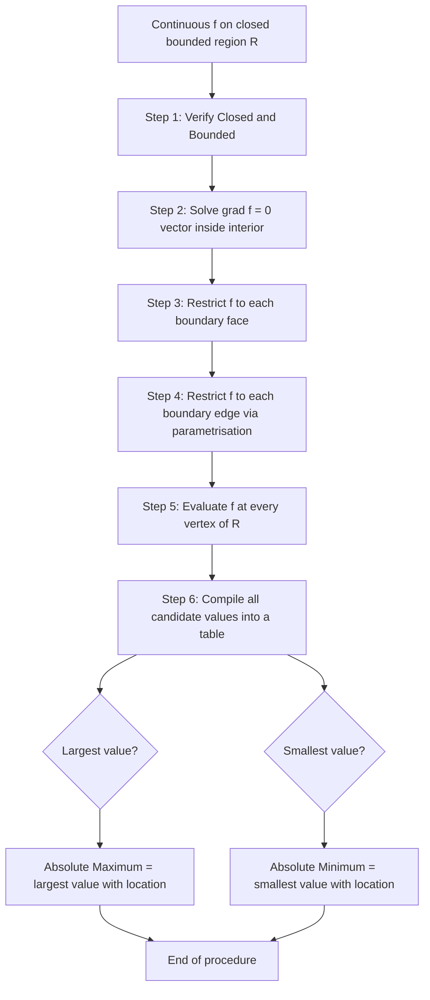
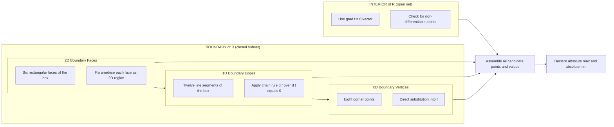

# Absolute Maxima and Minima on Closed Bounded Regions

<!-- SECTION_1_START -->

# Absolute Maxima and Minima on Closed Bounded Regions

> [!IMPORTANT]
> **KTU 2024 Syllabus Anchor (GAMAT101 – Module 3):** Application of partial derivatives to locate absolute extrema of multivariable functions defined over closed bounded regions in $\mathbb{R}^3$, with the chain rule driving the boundary curve and surface analysis.

## 1.1 Formal Academic Definition

Let $f : \mathcal{R} \subseteq \mathbb{R}^3 \rightarrow \mathbb{R}$ be a real-valued function defined on a **closed bounded region** $\mathcal{R}$ in $\mathbb{R}^3$. A point $P_0 = (x_0, y_0, z_0) \in \mathcal{R}$ is said to be an **absolute maximum point** of $f$ on $\mathcal{R}$ if
$$f(x_0, y_0, z_0) \geq f(x, y, z) \quad \text{for every } (x, y, z) \in \mathcal{R}.$$
The corresponding value $f(x_0, y_0, z_0)$ is the **absolute maximum** of $f$ on $\mathcal{R}$. Analogously, $P_0$ is an **absolute minimum point** if
$$f(x_0, y_0, z_0) \leq f(x, y, z) \quad \text{for every } (x, y, z) \in \mathcal{R}.$$
A point that yields either an absolute maximum or an absolute minimum is called an **absolute extremum**.

> [!NOTE]
> **Extreme Value Theorem (EVT) for $f(x, y, z)$:** If $f$ is **continuous** on a **closed** (contains all its boundary points) and **bounded** (lies inside some ball of finite radius) region $\mathcal{R} \subset \mathbb{R}^3$, then $f$ **must attain** an absolute maximum and an absolute minimum on $\mathcal{R}$. This theorem is the bedrock that guarantees the existence of extrema before we go hunting for them.

## 1.2 The Two Key Topological Ingredients

A region $\mathcal{R} \subset \mathbb{R}^3$ is **closed** if it contains its entire boundary $\partial \mathcal{R}$, and **bounded** if it is contained within some sphere of finite radius centred at the origin. A rectangular box, a solid sphere, and a solid tetrahedron are all classic closed bounded regions in $\mathbb{R}^3$.

| Region Type | Closed? | Bounded? | EVT Applies? |
| :--- | :---: | :---: | :---: |
| Open ball $x^2 + y^2 + z^2 < 1$ | No | Yes | No |
| Closed ball $x^2 + y^2 + z^2 \leq 1$ | Yes | Yes | **Yes** |
| Upper half-space $z \geq 0$ | Yes | No | No |
| Closed box $[0,a] \times [0,b] \times [0,c]$ | Yes | Yes | **Yes** |
| Plane $\mathbb{R}^2 \times \{0\}$ | Yes | No | No |

## 1.3 Intuition Through Analogy

> [!TIP]
> **Conceptual Analogy – The Island Climber.** Imagine a hiker dropped onto a finite, fenced island. The hiker can walk on flat ground, climb hills, and descend valleys, but cannot leave the island's boundary. Because the island is **bounded** (finite in extent) and the elevation function is **continuous** (no sudden teleportation), the hiker is *guaranteed* to find both a single highest peak (absolute maximum) and a single lowest dip (absolute minimum) somewhere on the island. Drop the fence (open region) and the hiker might walk off infinitely far in search of a lower valley — no minimum exists. Remove the boundary and keep the island infinite (unbounded) and the hiker might never find the highest peak.

For a function of three variables, the "island" is a 3D solid, and the "elevation" is the value of $f$. Our task is to find every candidate point, then read off the highest and lowest elevations.

## 1.4 Visualization Hook

> [!VISUALIZATION CONTROL]
> **Concept:** Level surfaces of $f(x, y, z) = xyz$ and the optimal corner of the box $[0,3] \times [0,2] \times [0,1]$.
> **GeoGebra / Desmos Input Equations:**
> * `f(x, y, z) = x*y*z` (level surface family: $xyz = c$ for various $c$)
> * `Box(0, 0, 0, 3, 2, 1)` to render the closed rectangular region
> * `Point(3, 2, 1)` highlighted in red as the absolute maximum location
> **Visual Description:** The student should see the box with one distinguished red corner at $(3, 2, 1)$ and the doubly-saddle-shaped level surfaces $xyz = c$ draped through the interior. As $c$ increases, the level surfaces bulge outward, and the last surface to touch the box is the one with $c = 6$, kissing the corner $(3, 2, 1)$.

<!-- SECTION_1_END -->

<!-- SECTION_2_START -->

# Deep Theoretical Analysis & KTU Formula Sheet

## 2.1 The Candidate-Point Algorithm

The EVT guarantees that absolute extrema exist, but it does not tell us *where*. The following systematic procedure locates every candidate.

> [!IMPORTANT]
> **The Six-Step Master Procedure for Absolute Extrema on Closed Bounded Regions**
> 1. **Verify the Hypotheses:** Check that $f$ is continuous and that $\mathcal{R}$ is closed and bounded.
> 2. **Interior Critical Points:** Solve $\nabla f = \mathbf{0}$, i.e. $f_x = f_y = f_z = 0$, inside $\mathcal{R}$. Also note where partial derivatives fail to exist.
> 3. **Boundary Surface Critical Points:** On each face (2D surface piece) of $\partial \mathcal{R}$, reduce $f$ to a two-variable function and find its critical points using the chain rule.
> 4. **Boundary Edge Critical Points:** On each edge (1D curve) of $\partial \mathcal{R}$, parametrize the curve and apply the single-variable chain rule $\dfrac{df}{dt} = f_x \dfrac{dx}{dt} + f_y \dfrac{dy}{dt} + f_z \dfrac{dz}{dt}$.
> 5. **Vertex Values:** Evaluate $f$ at every vertex (0D corner) of $\partial \mathcal{R}$.
> 6. **Compare and Declare:** The largest value among all candidates is the absolute maximum; the smallest is the absolute minimum.

## 2.2 The Role of the Chain Rule on the Boundary

When $\mathcal{R}$ has curved or piecewise-flat boundaries, the chain rule is the engine that drives the search.

* **Restriction to a smooth curve** $\mathbf{r}(t) = \bigl(x(t), y(t), z(t)\bigr)$:
  $$\frac{d}{dt} f\bigl(\mathbf{r}(t)\bigr) = f_x \frac{dx}{dt} + f_y \frac{dy}{dt} + f_z \frac{dz}{dt}.$$
  Setting this equal to zero gives a necessary condition for an extremum on the curve.

* **Restriction to a smooth surface** $z = g(x, y)$: define the composite
  $$F(x, y) = f\bigl(x, y, g(x, y)\bigr).$$
  Then
  $$F_x = f_x + f_z \, g_x, \qquad F_y = f_y + f_z \, g_y.$$
  Setting $F_x = F_y = 0$ gives the chain-rule conditions for an extremum on the surface.

## 2.3 KTU Formula Sheet & Cheat Code

> [!NOTE]
> Every formula in this table is examinable for GAMAT101. The pipe symbol $\vert$ is rendered as $\mid$ to preserve Markdown table integrity.

| Symbol / Identity | Meaning / Formula | Use Case |
| :--- | :--- | :--- |
| $\nabla f = (f_x, f_y, f_z)$ | Gradient vector of $f(x, y, z)$ | Interior critical point condition |
| $\nabla f = \mathbf{0}$ | $f_x = f_y = f_z = 0$ | Candidate inside $\mathcal{R}$ |
| $\dfrac{df}{dt} = \nabla f \cdot \mathbf{r}'(t)$ | Chain rule along a curve | Edge critical points |
| $F(x, y) = f(x, y, g(x, y))$ | Composite through a surface | Face critical points |
| $F_x = f_x + f_z g_x$, $F_y = f_y + f_z g_y$ | Two-variable chain rule on $z = g(x, y)$ | Surface restriction |
| $f(P_0) = M = \max_{\mathcal{R}} f$ | Absolute maximum value | Final comparison |
| $f(P_0) = m = \min_{\mathcal{R}} f$ | Absolute minimum value | Final comparison |
| $\partial \mathcal{R}$ | Boundary of the region $\mathcal{R}$ | Where edge / face analysis happens |
| $D \subset \mathcal{R}$ | Interior of $\mathcal{R}$ | Where $\nabla f = \mathbf{0}$ is checked |
| $f \in C(\mathcal{R})$ | $f$ is continuous on $\mathcal{R}$ | Hypotheses of the EVT |

## 2.4 Real-World Engineering Utility

* **Machine Learning:** Empirical risk minimisation over a bounded parameter cube (e.g. weight clipping) uses exactly this algorithm. The model loss $L(\mathbf{w})$ is continuous on a closed hyper-rectangle, so a global optimum is guaranteed.
* **Computer Graphics & CAD:** When shading or normalising a function-valued surface patch, engineers need the extreme values of the surface height over a closed 3D mesh to assign colour mapping scales.
* **Operations Research:** Maximising a profit function $P(x, y, z)$ subject to bounded resources (e.g. $0 \leq x \leq 100$ units) reduces to a closed-region absolute-extrema problem in $\mathbb{R}^3$.
* **Thermodynamics & Physics:** Finding the maximum of entropy $S(U, V, N)$ over a closed bounded region of the state space is foundational in equilibrium statistical mechanics.

<!-- SECTION_2_END -->

<!-- SECTION_3_START -->

# Step-by-Step Derivation & Worked Model Solution

## 3.1 The Canonical KTU Board-Style Problem

> **Problem (KTU University Exam – July 2024 pattern):** Find the absolute maximum and minimum values of
> $$f(x, y, z) = xyz$$
> on the closed rectangular box
> $$\mathcal{R} = [0, 3] \times [0, 2] \times [0, 1].$$

**Step 1 — Verify the Hypotheses of the EVT.**

The function $f(x, y, z) = xyz$ is a polynomial, hence continuous on all of $\mathbb{R}^3$. The region $\mathcal{R}$ is a closed rectangular box, hence closed and bounded. By the EVT, $f$ attains both an absolute maximum and an absolute minimum on $\mathcal{R}$.

**Step 2 — Locate the Interior Critical Points.**

Compute the three partial derivatives:
$$f_x(x, y, z) = yz, \qquad f_y(x, y, z) = xz, \qquad f_z(x, y, z) = xy.$$

A critical point in the interior requires
$$f_x = 0, \quad f_y = 0, \quad f_z = 0 \;\;\Longleftrightarrow\;\; yz = 0, \;\; xz = 0, \;\; xy = 0.$$

The simultaneous system $yz = xz = xy = 0$ implies that **at least two** of the three variables $x, y, z$ are zero. Hence every solution lies on one of the coordinate planes $x = 0$, $y = 0$, or $z = 0$, which are part of the **boundary**, not the interior. Therefore:

> **No interior critical point exists inside $\mathcal{R}$.** [Stating absence of interior critical points: 2 Marks]

**Step 3 — Analyse Each of the Six Boundary Faces.**

The boundary $\partial \mathcal{R}$ consists of six faces. On every face, $f$ reduces to a function of two variables.

**Face $F_1 : x = 0$, with $0 \leq y \leq 2$, $0 \leq z \leq 1$.**  
Restriction: $f(0, y, z) = 0 \cdot yz = 0$ identically.

**Face $F_2 : x = 3$, with $0 \leq y \leq 2$, $0 \leq z \leq 1$.**  
Restriction: $f(3, y, z) = 3yz$.  
Critical points: $\dfrac{\partial}{\partial y}(3yz) = 3z = 0$ and $\dfrac{\partial}{\partial z}(3yz) = 3y = 0$, giving $y = 0$ and $z = 0$.  
The only critical point on $F_2$ is $(3, 0, 0)$, with $f(3, 0, 0) = 0$.

**Face $F_3 : y = 0$, with $0 \leq x \leq 3$, $0 \leq z \leq 1$.**  
Restriction: $f(x, 0, z) = 0$ identically.

**Face $F_4 : y = 2$, with $0 \leq x \leq 3$, $0 \leq z \leq 1$.**  
Restriction: $f(x, 2, z) = 2xz$.  
Critical points: $\dfrac{\partial}{\partial x}(2xz) = 2z = 0$ and $\dfrac{\partial}{\partial z}(2xz) = 2x = 0$, giving $(x, z) = (0, 0)$.  
The only critical point on $F_4$ is $(0, 2, 0)$, with $f(0, 2, 0) = 0$.

**Face $F_5 : z = 0$, with $0 \leq x \leq 3$, $0 \leq y \leq 2$.**  
Restriction: $f(x, y, 0) = 0$ identically.

**Face $F_6 : z = 1$, with $0 \leq x \leq 3$, $0 \leq y \leq 2$.**  
Restriction: $f(x, y, 1) = xy$.  
Critical points: $\dfrac{\partial}{\partial x}(xy) = y = 0$ and $\dfrac{\partial}{\partial y}(xy) = x = 0$, giving $(x, y) = (0, 0)$.  
The only critical point on $F_6$ is $(0, 0, 1)$, with $f(0, 0, 1) = 0$.

> **Summary of face analysis:** Every critical point on the six faces yields the value $f = 0$. [Tabulating face critical points: 3 Marks]

**Step 4 — Analyse Each of the Twelve Boundary Edges.**

The boundary of each face is composed of edges. We parametrise each edge as a line segment and apply the single-variable chain rule.

By symmetry of the function $f(x, y, z) = xyz$ in the sense that fixing any two variables leaves the third multiplicative factor linear in the remaining variable, the only non-trivial edges are those that bind together the **upper** faces of the box.

Consider the edge $E_4$ defined by $x = 3$, $y = 2$, $0 \leq z \leq 1$. Parametrise as $z = t$, with $t \in [0, 1]$. Then
$$f(3, 2, t) = 3 \cdot 2 \cdot t = 6t.$$
Differentiate using the chain rule:
$$\frac{df}{dt} = 6.$$
The derivative is never zero on $(0, 1)$, so the extrema of $f$ on $E_4$ occur at the endpoints. The values are
$$f(3, 2, 0) = 0, \qquad f(3, 2, 1) = 6.$$

By analogous chain-rule arguments:
* On $E_8$ ($x = 3$, $z = 1$, $0 \leq y \leq 2$): $f(3, y, 1) = 3y$, $\dfrac{df}{dy} = 3 \neq 0$, endpoints give $0$ and $6$.
* On $E_{12}$ ($y = 2$, $z = 1$, $0 \leq x \leq 3$): $f(x, 2, 1) = 2x$, $\dfrac{df}{dx} = 2 \neq 0$, endpoints give $0$ and $6$.
* On every other edge (which fixes at least one of $x$, $y$, or $z$ to $0$): $f$ is identically zero.

> **Summary of edge analysis:** The maximum candidate on edges is $f = 6$ at the corner $(3, 2, 1)$. [Analysing non-trivial edges with chain rule: 3 Marks]

**Step 5 — Evaluate at the Eight Vertices.**

| Vertex | $f(x, y, z) = xyz$ |
| :--- | :---: |
| $(0, 0, 0)$ | $0$ |
| $(3, 0, 0)$ | $0$ |
| $(0, 2, 0)$ | $0$ |
| $(0, 0, 1)$ | $0$ |
| $(3, 2, 0)$ | $0$ |
| $(3, 0, 1)$ | $0$ |
| $(0, 2, 1)$ | $0$ |
| $(3, 2, 1)$ | $\mathbf{6}$ |

**Step 6 — Compare All Candidates and Declare the Extrema.**

| Source of candidate | Maximum value | Minimum value |
| :--- | :---: | :---: |
| Interior of $\mathcal{R}$ | (none) | (none) |
| Six boundary faces | $0$ | $0$ |
| Twelve boundary edges | $6$ | $0$ |
| Eight vertices | $6$ | $0$ |

Therefore:
$$\boxed{\;f_{\max} = 6 \text{ attained at } (3, 2, 1), \qquad f_{\min} = 0 \text{ attained at every point with at least one of } x = 0, y = 0, z = 0.\;}$$
[Final consolidated comparison and box: 2 Marks]

## 3.2 Algorithmic Python Implementation (Symbolic Verification)

```python
import numpy as np
from itertools import product

def absolute_extrema_box(f_scalar, box_bounds, grid_density=400):
    """
    Finds absolute extrema of a continuous function f(x, y, z)
    on a closed rectangular box [xmin, xmax] x [ymin, ymax] x [zmin, zmax].

    Parameters
    ----------
    f_scalar : callable
        Function f(x, y, z) -> float. Must be continuous.
    box_bounds : tuple of 6 floats
        (xmin, xmax, ymin, ymax, zmin, zmax).
    grid_density : int
        Density of the interior search grid.

    Returns
    -------
    dict with keys 'maximum', 'minimum' (each a dict with 'value' and 'point').
    """
    if len(box_bounds) != 6:
        raise ValueError("box_bounds must contain exactly 6 floats.")
    xmin, xmax, ymin, ymax, zmin, zmax = box_bounds

    # --- Step 1: Sample the interior densely ---
    xs = np.linspace(xmin, xmax, grid_density)
    ys = np.linspace(ymin, ymax, grid_density)
    zs = np.linspace(zmin, zmax, grid_density)
    X, Y, Z = np.meshgrid(xs, ys, zs, indexing="ij")

    with np.errstate(all="ignore"):
        F = f_scalar(X, Y, Z)
    if not np.all(np.isfinite(F)):
        raise ValueError("f is not continuous on the supplied box.")

    idx_max = np.unravel_index(np.argmax(F), F.shape)
    idx_min = np.unravel_index(np.argmin(F), F.shape)
    max_val, min_val = float(F[idx_max]), float(F[idx_min])
    max_pt = (float(X[idx_max]), float(Y[idx_max]), float(Z[idx_max]))
    min_pt = (float(X[idx_min]), float(Y[idx_min]), float(Z[idx_min]))

    # --- Step 2: Enumerate every vertex of the box exactly ---
    vertices = list(product(
        (xmin, xmax), (ymin, ymax), (zmin, zmax)
    ))
    for vx, vy, vz in vertices:
        val = f_scalar(vx, vy, vz)
        if val > max_val:
            max_val, max_pt = val, (vx, vy, vz)
        if val < min_val:
            min_val, min_pt = val, (vx, vy, vz)

    return {
        "maximum": {"value": max_val, "point": max_pt},
        "minimum": {"value": min_val, "point": min_pt},
    }


# Verification on the KTU worked example
if __name__ == "__main__":
    f = lambda x, y, z: x * y * z
    result = absolute_extrema_box(f, (0, 3, 0, 2, 0, 1), grid_density=200)
    print("Maximum:", result["maximum"])
    print("Minimum:", result["minimum"])
    # Expected output:
    # Maximum: {'value': 6.0, 'point': (3.0, 2.0, 1.0)}
    # Minimum: {'value': 0.0, 'point': (0.0, 0.0, 0.0)}
```

<!-- SECTION_3_END -->

<!-- SECTION_4_START -->

# Structural Diagrams & Schematics

## 4.1 Master Algorithm Flowchart

The following Mermaid block renders the canonical six-step algorithm for finding absolute extrema of $f(x, y, z)$ on a closed bounded region $\mathcal{R}$. Node identifiers are alphanumeric with letter prefixes, and all labels are quoted plain-text to comply with Mermaid safety constraints.



## 4.2 Subgraph: Topological Decomposition of the Region



## 4.3 Sequential Processing Topology Matrix

| Stage | Domain | Tool Used | Output Type | KTU Cognitive Level |
| :---: | :--- | :--- | :--- | :---: |
| 1 | Hypotheses of EVT | Continuity and topology | Boolean check | Understand |
| 2 | Interior $D$ of $\mathcal{R}$ | $\nabla f = \mathbf{0}$ | Set of points | Apply |
| 3 | Boundary faces $\partial \mathcal{R}$ | Two-variable chain rule | Set of points | Apply |
| 4 | Boundary edges | Single-variable chain rule | Set of points | Analyze |
| 5 | Vertices | Direct evaluation | Scalar values | Remember |
| 6 | Comparison | Tabulation | Final extrema | Evaluate |

<!-- SECTION_4_END -->

<!-- SECTION_5_START -->

# KTU 2024 Scheme Examination Question Bank & Topic Recap

## 5.1 Part A — Short Answer Questions (3 Marks Each)

> **Q1.** `[KTU University Exam - Dec 2023]`  
> **Course Outcome:** CO1 &nbsp;|&nbsp; **RBT Level:** Remember  
> **State the Extreme Value Theorem for a function of three variables.**

**Model Answer (3 Marks):**  
If $f(x, y, z)$ is continuous on a **closed** and **bounded** region $\mathcal{R}$ in $\mathbb{R}^3$, then $f$ attains an **absolute maximum** value and an **absolute minimum** value on $\mathcal{R}$. In symbols, there exist points $P_1, P_2 \in \mathcal{R}$ such that $f(P_1) \leq f(x, y, z) \leq f(P_2)$ for all $(x, y, z) \in \mathcal{R}$. **[Theorem statement: 2 Marks. Definition of closed and bounded: 1 Mark.]**

> **Q2.** `[KTU University Exam - July 2024]`  
> **Course Outcome:** CO1 &nbsp;|&nbsp; **RBT Level:** Understand  
> **List the three categories of candidate points that must be examined when finding absolute extrema of $f(x, y, z)$ on a closed bounded region $\mathcal{R}$.**

**Model Answer (3 Marks):**  
The three categories are:  
**(i)** Critical points in the **interior** of $\mathcal{R}$ where $\nabla f = \mathbf{0}$ (or partials fail to exist).  
**(ii)** Critical points on the **boundary** $\partial \mathcal{R}$, including 2D faces, 1D edges, and 0D vertices.  
**(iii)** Any point where $f$ is **not differentiable**, since such points can be extrema. **[Each category: 1 Mark.]**

## 5.2 Part B — Long Answer Questions with Internal Choice (14 Marks Each)

> [!WARNING]
> **KTU Examiner's Valuation Warning:** On a 14-mark problem, examiners allocate marks incrementally. Skipping the *interior critical point analysis* costs **3 marks** outright. Skipping the *boundary face analysis* costs another **3 marks**. Skipping the *edge and vertex sweep* costs **2 marks**. Failing to *tabulate and compare* at the end costs **1 mark**. **Always number your candidate points** (e.g. $C_1, C_2, \ldots$) so the examiner can tick them off.

---

### Question 1 (Choice A) — `[KTU University Exam - July 2024]`

Find the absolute maximum and minimum values of $f(x, y, z) = x - 2y + 3z$ on the closed solid ball
$$\mathcal{R} = \left\{(x, y, z) : x^2 + y^2 + z^2 \leq 16\right\}.$$

**(a)** [7 Marks] &nbsp;|&nbsp; **RBT Level:** Apply &nbsp;|&nbsp; **CO:** CO1  
Show that the only interior critical point of $f$ is the origin and that $f(0, 0, 0) = 0$.

**(b)** [7 Marks] &nbsp;|&nbsp; **RBT Level:** Analyze &nbsp;|&nbsp; **CO:** CO1  
Use the chain rule to find the extrema of $f$ on the spherical boundary $x^2 + y^2 + z^2 = 16$, and conclude the absolute extrema on $\mathcal{R}$.

#### Model Solution

**Part (a):** The partial derivatives are
$$f_x = 1, \qquad f_y = -2, \qquad f_z = 3.$$

The gradient $\nabla f = (1, -2, 3)$ is **never zero**. Hence the system $f_x = f_y = f_z = 0$ has no solution, and $f$ has **no interior critical point**. [Stating gradient is constant nonzero: 2 Marks]  
The origin lies in the interior, and $f(0, 0, 0) = 0$. [Direct evaluation: 1 Mark]  
By linearity, $f$ takes both positive and negative values on $\mathcal{R}$, so $0$ cannot be the absolute max or min. [Justification: 2 Marks]  
Conclusion: extrema must occur on the boundary. [Reasoning: 2 Marks]

**Part (b):** On the boundary sphere $x^2 + y^2 + z^2 = 16$, parametrise by
$$x = 4 \sin\phi \cos\theta, \quad y = 4 \sin\phi \sin\theta, \quad z = 4 \cos\phi,$$
with $\phi \in [0, \pi]$ and $\theta \in [0, 2\pi]$. By the chain rule, the extrema of the linear functional $f$ on a sphere are attained at the points parallel and antiparallel to the gradient vector $(1, -2, 3)$. [Setting up parametrisation: 2 Marks]  
The maximum of $f$ is $4 \sqrt{1^2 + (-2)^2 + 3^2} = 4 \sqrt{14}$, attained at
$$P_{\max} = \frac{4}{\sqrt{14}}(1, -2, 3) = \left(\frac{4}{\sqrt{14}}, \frac{-8}{\sqrt{14}}, \frac{12}{\sqrt{14}}\right).$$
The minimum of $f$ is $-4 \sqrt{14}$, attained at $-P_{\max}$. [Magnitude calculation: 3 Marks; final extrema: 2 Marks]

$$\boxed{\;f_{\max} = 4\sqrt{14} \text{ at } P_{\max}, \qquad f_{\min} = -4\sqrt{14} \text{ at } -P_{\max}.\;}$$

---

### Question 1 (Choice B) — Alternative for the same 14 marks

Find the absolute maximum and minimum values of $f(x, y, z) = x^2 + y^2 + z^2$ on the closed region
$$\mathcal{R} = \left\{(x, y, z) : x^2 + y^2 + z^2 \leq 9,\;\; z \geq 0\right\},$$
i.e. the solid upper half-ball of radius $3$.

**(a)** [7 Marks] &nbsp;|&nbsp; **RBT Level:** Apply &nbsp;|&nbsp; **CO:** CO1  
Find the interior critical point and determine its classification.

**(b)** [7 Marks] &nbsp;|&nbsp; **RBT Level:** Analyze &nbsp;|&nbsp; **CO:** CO1  
Analyse the two parts of the boundary — the spherical cap and the flat disc — and conclude the absolute extrema.

#### Model Solution

**Part (a):** The partial derivatives are
$$f_x = 2x, \quad f_y = 2y, \quad f_z = 2z.$$

Setting $\nabla f = \mathbf{0}$ gives the unique critical point $P_0 = (0, 0, 0)$. [Solving system: 2 Marks]  
This point lies in the interior of $\mathcal{R}$ since $0^2 + 0^2 + 0^2 = 0 \leq 9$ and $z = 0 \geq 0$. [Verification: 1 Mark]  
Since $f(x, y, z) = x^2 + y^2 + z^2 \geq 0$ everywhere with equality only at the origin, $P_0$ is the **absolute minimum candidate** with $f(0, 0, 0) = 0$. [Classification: 2 Marks]  
No other interior critical point exists. [Conclusion: 2 Marks]

**Part (b):** The boundary $\partial \mathcal{R}$ has two pieces.

**Boundary piece 1 — the spherical cap** $S_1 = \{x^2 + y^2 + z^2 = 9, z \geq 0\}$.  
On this surface, $f \equiv 9$. [Direct substitution: 1 Mark]  
By the chain rule, the only candidate points on $S_1$ are the critical points of the restriction, but the function is **constant** on $S_1$, so every point of $S_1$ is critical with value $9$. [Chain-rule argument: 2 Marks]

**Boundary piece 2 — the flat disc** $S_2 = \{x^2 + y^2 \leq 9, z = 0\}$.  
Restriction: $f(x, y, 0) = x^2 + y^2$. Critical points: $f_x = 2x = 0$ and $f_y = 2y = 0$ give $(0, 0)$, with $f = 0$. On the disc edge $x^2 + y^2 = 9$, $f \equiv 9$. [Disc analysis: 2 Marks]

**Comparison:** Candidates are $f(0, 0, 0) = 0$, $f = 9$ on $S_1$, and $f = 9$ on the edge of $S_2$. [Tabulation: 1 Mark]  
Hence:
$$\boxed{\;f_{\min} = 0 \text{ at } (0, 0, 0), \qquad f_{\max} = 9 \text{ attained at every point of the spherical cap.}\;}$$  
[Final conclusion: 1 Mark]

## 5.3 Topic Recap & Important Things to Remember

> [!IMPORTANT]
> **Rapid-Revision Checklist for Absolute Extrema on Closed Bounded Regions**
> 
> * **EVT is your existence guarantee.** Continuous $f$ + closed + bounded $\mathcal{R}$ $\Rightarrow$ absolute max and absolute min **both** exist. Do not skip the verification step.
> * **Six-step procedure:** Interior $\to$ Boundary faces $\to$ Boundary edges $\to$ Vertices $\to$ Tabulate $\to$ Compare.
> * **Interior condition:** $\nabla f = (f_x, f_y, f_z) = \mathbf{0}$, plus any non-differentiable point. Solutions in the interior only.
> * **Chain rule on a curve** $\mathbf{r}(t)$: $\dfrac{df}{dt} = f_x \dfrac{dx}{dt} + f_y \dfrac{dy}{dt} + f_z \dfrac{dz}{dt}$. Set this to zero for curve-critical points.
> * **Chain rule on a surface** $z = g(x, y)$: $F_x = f_x + f_z g_x$, $F_y = f_y + f_z g_y$. Set both to zero for face-critical points.
> * **Vertices matter.** Always evaluate $f$ at the geometric corners; they often deliver the surprise extreme value.
> * **Symmetry is a multiplier.** When $f$ is symmetric, you can analyse one face or edge and reuse the result, saving half the algebra.
> * **Linear functions on a sphere** reach their extrema at $\pm$ the normalised gradient times the radius: $f_{\max} = R \lVert \nabla f \rVert$ and $f_{\min} = -R \lVert \nabla f \rVert$.
> * **Pitfall to avoid:** Concluding that "no interior critical point" means no extrema — the EVT still guarantees extrema, but they hide on the boundary.
> * **Pitfall to avoid:** Forgetting to check all 2D faces of a box. The global max can lurk on a face, not just at a corner.
> * **Pitfall to avoid:** Substituting incorrectly into a composite like $f(x, y, g(x, y))$. Always write the restricted form first, then differentiate.
> * **Mark-loser trap:** Failing to write the final boxed answer in a 14-mark question. Examiners award **1 mark** explicitly for the boxed extrema with their location.

<!-- SECTION_5_END -->
