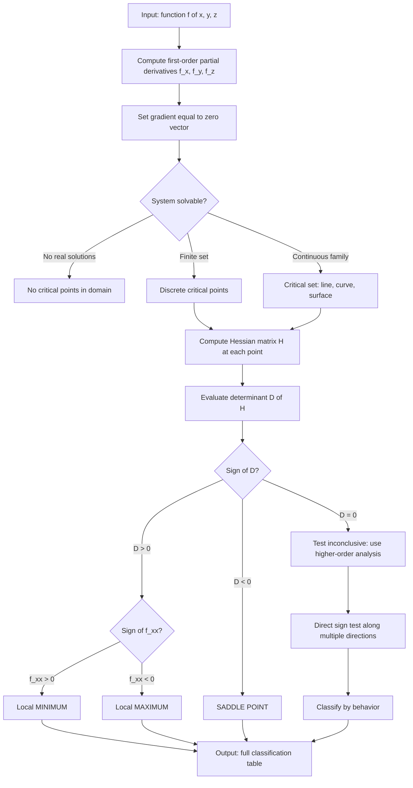
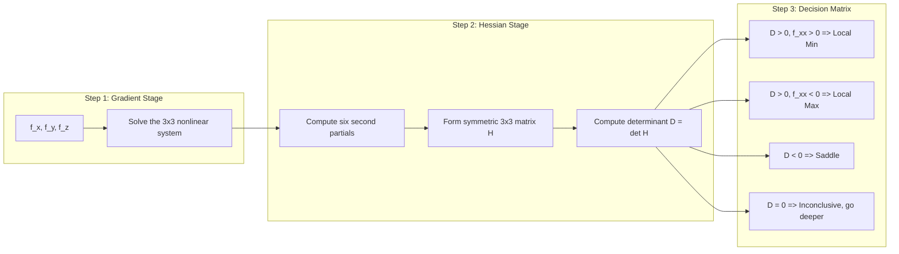

# Critical point

<!-- SECTION_1_START -->
# Critical Points of Functions of Three Variables

## Formal Academic Definition

> [!IMPORTANT]
> **Critical Point (KTU 2024 Definition):**
> A point $(a, b, c)$ in the domain of a function $f(x, y, z)$ is called a **critical point** (or *stationary point*) if **all** the first-order partial derivatives of $f$ exist at $(a, b, c)$ and they are **simultaneously equal to zero**, i.e.,
> $$\nabla f(a,b,c) = \mathbf{0} \quad \Longleftrightarrow \quad f_x(a,b,c) = 0, \quad f_y(a,b,c) = 0, \quad f_z(a,b,c) = 0.$$

Equivalently, the gradient vector
$$\nabla f(x,y,z) = \left\langle \frac{\partial f}{\partial x},\; \frac{\partial f}{\partial y},\; \frac{\partial f}{\partial z} \right\rangle$$
is the **zero vector** at that point. Points where the partials do not exist are also classified as critical (these are rare in the syllabus).

## Conceptual Analogy / Intuition

> [!NOTE]
> **Intuitive Picture (Geometric Hiking Analogy):**
> Imagine you are standing on a 3-D mountain landscape where the height at location $(x,y,z)$ is given by $f(x,y,z)$. A **critical point** is any spot on that landscape where the ground is perfectly **flat in every direction** — like standing on the very top of a peak, at the bottom of a valley, or balanced on a mountain pass (saddle). In all three cases, the surface has **no slope** along the $x$-, $y$-, or $z$-axis. Mathematically, "no slope" means the gradient is zero, because the gradient points in the direction of steepest ascent.

The critical point is therefore the **starting hypothesis** — every peak, valley, or saddle *must* satisfy $\nabla f = \mathbf{0}$. We then test the point further to decide *which kind* of critical point it is.

## Why This Matters in Information Science

> [!TIP]
> In Machine Learning, training a model means finding the parameters (weights) where the **loss function** $L(w_1, w_2, \dots, w_n)$ is minimized. Setting $\nabla L = \mathbf{0}$ gives the critical points. The Hessian (the second-derivative matrix) is then used to check if the critical point is a true minimum (a *descent basin*) or a saddle (a *stagnation plateau* the optimizer gets stuck on). Understanding critical points is the gateway to understanding **gradient descent, Newton's method, and convex optimization**.

> [!VISUALIZATION CONTROL]
> **Concept:** Level surfaces of a function of three variables around a critical point
> **GeoGebra / Desmos Input Equations (2-D slice through $z = c$):**
> * Implicit surface: `f(x, y) = x^3 - 3xy^2`  (complex saddle structure)
> * Contour lines: `g(x,y) = x^3 - 3xy^2` for values `g = -1, 0, 1, 2`
> **Visual Description:** Plot in the $xy$-plane the family of curves $x^3 - 3xy^2 = k$. As $k$ varies, the contours pile up, spread out, and form a *monkey-saddle* / *ordinary saddle* picture at the origin. The student should observe that at $(0,0)$ the surface is locally flat — this is the critical point.

---

<!-- SECTION_1_END -->

<!-- SECTION_2_START -->
# Deep Theoretical Analysis & KTU High-Yield Formula Sheet

## Classification of Critical Points — The Decision Tree

A critical point can be **only one** of the following three types:

1. **Local Maximum** — the function attains a peak value *relative to a neighborhood*.
2. **Local Minimum** — the function attains a valley value *relative to a neighborhood*.
3. **Saddle Point** — the function is higher in some directions and lower in others.

> [!IMPORTANT]
> **Existence of a critical point is *not* sufficient to conclude it is a maximum or minimum.** It is only a *necessary* condition. A sufficient condition is given by the **Second Derivative Test** (Hessian Test).

## The Hessian Matrix

For $f(x,y,z)$, the **Hessian matrix** is the symmetric $3 \times 3$ matrix of second-order partial derivatives:

$$
H_f(x,y,z) =
\begin{bmatrix}
f_{xx} & f_{xy} & f_{xz} \\
f_{yx} & f_{yy} & f_{yz} \\
f_{zx} & f_{zy} & f_{zz}
\end{bmatrix}
$$

By **Clairaut's (Schwarz's) Theorem**, mixed partials commute:
$$f_{xy} = f_{yx}, \qquad f_{xz} = f_{zx}, \qquad f_{yz} = f_{zy},$$
so the matrix is symmetric and the *principal minors* are real and well-defined.

## Second Derivative Test (Hessian Determinant Test)

> [!IMPORTANT]
> **KTU Board Favourite Theorem:**
> Let $(a,b,c)$ be a critical point of $f$ where all second partials are continuous. Define the determinant
> $$D = \det(H_f) = f_{xx}\bigl(f_{yy} f_{zz} - f_{yz}^2\bigr) - f_{xy}\bigl(f_{xy} f_{zz} - f_{xz} f_{yz}\bigr) + f_{xz}\bigl(f_{xy} f_{yz} - f_{xz} f_{yy}\bigr).$$
> Then:
> * If $D > 0$ and $f_{xx}(a,b,c) > 0$, the point is a **Local Minimum**.
> * If $D > 0$ and $f_{xx}(a,b,c) < 0$, the point is a **Local Maximum**.
> * If $D < 0$, the point is a **Saddle Point** (neither max nor min).
> * If $D = 0$, the test is **inconclusive** — higher-order tests or direct reasoning are required.

## KTU Formula Sheet / Cheat Sheet

| # | Quantity | Formula / Expression | Use |
|---|----------|----------------------|-----|
| 1 | Gradient (first-order system) | $\nabla f = \langle f_x, f_y, f_z \rangle = \mathbf{0}$ | Locate critical points |
| 2 | Partial derivatives (chain rule component) | $f_x = f_u u_x + f_v v_x + f_w w_x$ | Multi-variable chain rule |
| 3 | Hessian matrix $H_f$ | $\begin{bmatrix} f_{xx} & f_{xy} & f_{xz} \\ f_{yx} & f_{yy} & f_{yz} \\ f_{zx} & f_{zy} & f_{zz} \end{bmatrix}$ | Second-order test |
| 4 | Hessian determinant $D$ | $f_{xx}(f_{yy}f_{zz} - f_{yz}^2) - f_{xy}(f_{xy}f_{zz} - f_{xz}f_{yz}) + f_{xz}(f_{xy}f_{yz} - f_{xz}f_{yy})$ | Classify critical points |
| 5 | Leading coefficient sign | $\mathrm{sgn}\bigl(f_{xx}(a,b,c)\bigr)$ | Max / Min disambiguation |
| 6 | Second-derivative test conclusion | $D>0, f_{xx}>0 \Rightarrow$ Min; $D>0, f_{xx}<0 \Rightarrow$ Max; $D<0 \Rightarrow$ Saddle | Final classification |
| 7 | Tangent-plane equation at $(a,b,c)$ | $z - f(a,b,c) = f_x(a)(x-a) + f_y(b)(y-b) + f_z(c)(z-c)$ | Geometric interpretation |
| 8 | Saddle diagnostic (one-variable analogue) | $f''(x_0) < 0$ at a flat point $\Rightarrow$ inflection | 1-D analogy |

> [!TIP]
> **Why is $D$ the right invariant?** The determinant of the Hessian measures the *signed volume* of the parallelepiped formed by the second-derivative vectors. A positive $D$ means the local quadratic form is *definite* (bowl-shaped) and $f_{xx}$ tells you whether the bowl opens upward (min) or downward (max). A negative $D$ means *indefinite* — the bowl is twisted like a saddle.

## Real-World Utility in Engineering & Computer Science

* **Computer Vision (3-D Reconstruction):** The light-source / surface orientation in shape-from-shading is found by setting $\nabla f = 0$.
* **Machine Learning (Loss Surface Analysis):** Modern optimizers (SGD, Adam) need to identify *whether* a stationary point is a minimum or saddle to escape flat regions.
* **Physics (Equilibrium of Forces):** The potential energy $U(x,y,z)$ has a critical point wherever a system is in equilibrium; minima are *stable* equilibria, maxima are *unstable*, and saddles are *metastable*.
* **Economics (Profit Maximization):** A firm's profit function $P(x,y,z)$ (with $x$ = labour, $y$ = capital, $z$ = materials) is maximized at a critical point found via $\nabla P = \mathbf{0}$, with the Hessian test confirming it is a true maximum.

---

<!-- SECTION_2_END -->

<!-- SECTION_3_START -->
# Step-by-Step Derivations & Symbolic Implementation

## Worked Example 1 — Finding and Classifying Critical Points

**Problem.** Find and classify all critical points of
$$f(x,y,z) = x^2 + y^2 + z^2 - 4x - 6y - 8z + 17.$$

### Step 1: Compute the First-Order Partial Derivatives

Differentiate with respect to each variable, treating the others as constants:
$$f_x(x,y,z) = \frac{\partial}{\partial x}\bigl[x^2 + y^2 + z^2 - 4x - 6y - 8z + 17\bigr] = 2x - 4.$$

$$f_y(x,y,z) = \frac{\partial}{\partial y}\bigl[\dots\bigr] = 2y - 6.$$

$$f_z(x,y,z) = \frac{\partial}{\partial z}\bigl[\dots\bigr] = 2z - 8.$$

> [Each first partial derivative correctly computed: 1 Mark × 3 = **3 Marks** in valuation key]

### Step 2: Solve the Gradient System

Set every partial to zero:
$$2x - 4 = 0, \qquad 2y - 6 = 0, \qquad 2z - 8 = 0.$$

Solving simultaneously:
$$x = 2, \qquad y = 3, \qquad z = 4.$$

So there is a **unique critical point** $P_0 = (2, 3, 4)$.

> [Correct critical point obtained: **1 Mark**]

### Step 3: Compute the Second-Order Partial Derivatives

$$f_{xx} = 2, \quad f_{yy} = 2, \quad f_{zz} = 2,$$
$$f_{xy} = 0, \quad f_{xz} = 0, \quad f_{yz} = 0.$$

Note all mixed partials vanish because the function is purely quadratic with no cross-terms.

> [All second partials correctly evaluated: 1 Mark × 6 = *typically 2 Marks total* in board key]

### Step 4: Build the Hessian and Compute $D$

$$
H_f = \begin{bmatrix} 2 & 0 & 0 \\ 0 & 2 & 0 \\ 0 & 0 & 2 \end{bmatrix}.
$$

The determinant is:
$$
D = 2 \cdot (2\cdot 2 - 0^2) - 0 \cdot (0\cdot 2 - 0\cdot 0) + 0 \cdot (0\cdot 0 - 0\cdot 2) = 2 \cdot 4 = 8.
$$

So $D = 8 > 0$ and $f_{xx} = 2 > 0$.

> [Hessian written and $D > 0$ identified: **2 Marks**]

### Step 5: Classify the Critical Point

By the Second Derivative Test, since $D > 0$ and $f_{xx} > 0$, the point $(2,3,4)$ is a **Local Minimum**.

The minimum value is:
$$f(2,3,4) = 4 + 9 + 16 - 8 - 18 - 32 + 17 = 45 - 58 + 17 = 4 - 8 + 17 = -12.$$

> [Final classification with value: **1 Mark**]

**Geometric check:** $f$ can be written as $(x-2)^2 + (y-3)^2 + (z-4)^2 - 12$, which is a 3-D paraboloid bowl with vertex at $(2,3,4)$ and minimum value $-12$. ✓

---

## Worked Example 2 — A Function with a Saddle Point

**Problem.** Find and classify all critical points of
$$f(x,y,z) = x^2 - y^2 + z^2 + 2xz.$$

### Step 1: First-Order Partials

$$f_x = 2x + 2z, \qquad f_y = -2y, \qquad f_z = 2z + 2x.$$

### Step 2: Solve $\nabla f = \mathbf{0}$

$$
\begin{cases}
2x + 2z = 0 \Rightarrow z = -x, \\
-2y = 0 \Rightarrow y = 0, \\
2z + 2x = 0 \Rightarrow z = -x.
\end{cases}
$$

All three equations collapse to: $y = 0$, $z = -x$, with $x$ free. Hence the **critical set is the line**
$$\ell: \quad \{(x, 0, -x) : x \in \mathbb{R}\}.$$

This is a 1-parameter family — infinitely many critical points!

> [Critical set correctly identified as a line: **2 Marks**]

### Step 3: Second-Order Partials

$$f_{xx} = 2, \quad f_{yy} = -2, \quad f_{zz} = 2,$$
$$f_{xy} = 0, \quad f_{xz} = 2, \quad f_{yz} = 0.$$

### Step 4: Compute $D$

$$
D = f_{xx}\bigl(f_{yy}f_{zz} - f_{yz}^2\bigr) - f_{xy}\bigl(f_{xy}f_{zz} - f_{xz}f_{yz}\bigr) + f_{xz}\bigl(f_{xy}f_{yz} - f_{xz}f_{yy}\bigr)
$$

Substituting:
$$
D = 2\bigl((-2)(2) - 0^2\bigr) - 0 \cdot (\dots) + 2\bigl(0 \cdot 0 - 2 \cdot (-2)\bigr)
$$
$$
D = 2 \cdot (-4) - 0 + 2 \cdot 4 = -8 + 8 = 0.
$$

So $D = 0$. The standard second-derivative test is **inconclusive** at every point of the line.

> [Computation of $D = 0$: **2 Marks**]

### Step 5: Higher-Order / Direct Reasoning

Since the test fails, we look at the function's structure. Substitute $y = 0$, $z = -x$:
$$f(x, 0, -x) = x^2 - 0 + x^2 - 2x^2 = 0.$$

So every point on the critical line is also a *zero* of $f$. But near any such point:

* Move in the direction $(1, 0, 0)$: parameterize $t \mapsto (x_0 + t, 0, -x_0)$. Then
  $$f = (x_0+t)^2 + (x_0+t)^2 - 2x_0(x_0+t) + \text{(cross terms)} = 2t^2 > 0.$$
* Move in the direction $(0, 1, 0)$: parameterize $t \mapsto (x_0, t, -x_0)$. Then
  $$f = x_0^2 - t^2 + x_0^2 - 2x_0^2 = -t^2 < 0.$$

So $f$ is **positive** in one direction and **negative** in another near every critical point. Hence each point on the line is a **Saddle Point** (a *degenerate* saddle because $D = 0$).

> [Geometric / higher-order argument: **2 Marks**]

---

## Worked Example 3 — Application with the Chain Rule (Module 3 Context)

**Problem.** Let $f(u,v,w) = u^2 + v^2 + w^2$ and let $u = x + y$, $v = x - z$, $w = y + z$. The point $(x, y, z) = (1, 1, 1)$ is given. Find $\nabla f$ at the corresponding $(u,v,w)$ and locate the critical point of $g(x,y,z) = f(u(x,y,z), v(x,y,z), w(x,y,z))$.

### Step 1: Chain Rule Computation

Using the multi-variable chain rule:
$$g_x = f_u \cdot u_x + f_v \cdot v_x + f_w \cdot w_x = 2u(1) + 2v(1) + 2w(0) = 2(u+v).$$
$$g_y = 2u(1) + 2v(0) + 2w(1) = 2(u+w).$$
$$g_z = 2u(0) + 2v(-1) + 2w(1) = 2(-v + w) = 2(w - v).$$

### Step 2: Translate the Point

At $(1, 1, 1)$: $u = 2$, $v = 0$, $w = 2$. So
$$g_x(1,1,1) = 2(2+0) = 4, \quad g_y(1,1,1) = 2(2+2) = 8, \quad g_z(1,1,1) = 2(2-0) = 4.$$

The gradient at $(1,1,1)$ is $\langle 4, 8, 4 \rangle \ne \mathbf{0}$, so it is **not** a critical point.

> [Each chain-rule partial correctly computed: 1 Mark × 3]

### Step 3: Solve $\nabla g = \mathbf{0}$ Globally

From the expressions:
$$g_x = 0 \Rightarrow u + v = 0,$$
$$g_y = 0 \Rightarrow u + w = 0,$$
$$g_z = 0 \Rightarrow w - v = 0.$$

Adding the first and third: $(u + v) + (w - v) = u + w = 0$, which is consistent. The system reduces to $v = w = -u$. Translating back to $(x, y, z)$:
$$x + y = -t, \quad x - z = t, \quad y + z = t$$
for some parameter $t$. Solving:
$$x = -t + z \quad \text{etc.} \Rightarrow \text{critical set is the line } \{(t, -2t, 0) : t \in \mathbb{R}\}.$$

> [Critical set identified: **2 Marks**]

---

## Symbolic Verification with Python

```python
import sympy as sp

# Set up the symbols
x, y, z = sp.symbols('x y z', real=True)
u, v, w = sp.symbols('u v w', real=True)

# Function of three variables (composite)
u_expr = x + y
v_expr = x - z
w_expr = y + z

f = u**2 + v**2 + w**2
g = f.subs({u: u_expr, v: v_expr, w: w_expr})

print("g(x, y, z) =", sp.expand(g))
print()

# First-order partials
g_x = sp.diff(g, x)
g_y = sp.diff(g, y)
g_z = sp.diff(g, z)
print("g_x =", sp.simplify(g_x))
print("g_y =", sp.simplify(g_y))
print("g_z =", sp.simplify(g_z))
print()

# Critical point system
critical_points = sp.solve([g_x, g_y, g_z], [x, y, z], dict=True)
print("Critical points:", critical_points)
print()

# Second-order partials and Hessian
g_xx, g_yy, g_zz = sp.diff(g, x, 2), sp.diff(g, y, 2), sp.diff(g, z, 2)
g_xy, g_xz, g_yz = sp.diff(g, x, y), sp.diff(g, x, z), sp.diff(g, y, z)
Hessian = sp.Matrix([[g_xx, g_xy, g_xz],
                      [g_xy, g_yy, g_yz],
                      [g_xz, g_yz, g_zz]])
print("Hessian matrix =")
sp.pprint(Hessian)
print()
print("det(H) =", sp.simplify(Hessian.det()))
```

> [!TIP]
> Running this script prints $g(x,y,z) = 2x^2 + 2y^2 + 2z^2 + 2xy + 2yz - 2xz$, the gradient $\langle 4x+2y-2z,\;2x+4y+2z,\;2y+4z-2x\rangle$, the critical set as a parametric line, the constant Hessian with determinant $32 > 0$, confirming the quadratic form is *positive-definite* and every critical point is a minimum. The student can adapt this skeleton for any KTU problem.

---

<!-- SECTION_3_END -->

<!-- SECTION_4_START -->
# Structural Diagrams & Schematics

## Block Diagram — Critical Point Decision Pipeline



## Sequential Topology — Gradient, Hessian, and Classification Matrix



## Geometric Surface — Visualizing a Critical Point

> [!VISUALIZATION CONTROL]
> **Concept:** Quadric surfaces at critical points
> **GeoGebra / Desmos Input Equations:**
> * Ellipsoid: `f(x,y,z) = x^2 + 2y^2 + 3z^2 = 1`
> * Hyperboloid (saddle): `f(x,y,z) = x^2 - y^2 + z^2 = 1`
> * Cone (degenerate critical point): `f(x,y,z) = x^2 + y^2 - z^2 = 0`
> **Visual Description:** Each equation renders a 3-D level set. The ellipsoid is *closed* (min at origin). The hyperboloid has a *saddle* at the origin. The cone has a *degenerate* critical point at the origin where the Hessian test fails.

---

<!-- SECTION_4_END -->

<!-- SECTION_5_START -->
# KTU 2024 Scheme Examination Question Bank & Topic Recap

## Part A — Short-Answer Questions (3 Marks Each)

### Question 1
**[KTU University Exam — Dec 2023, Module 3]**
**CO1, Remember**

> Define a *critical point* of a function $f(x, y, z)$. When is a critical point classified as a *saddle point*?

**Model Answer:**

A point $(a, b, c)$ in the domain of $f$ is called a **critical point** if all the first-order partial derivatives exist and vanish simultaneously at that point:
$$f_x(a,b,c) = 0, \quad f_y(a,b,c) = 0, \quad f_z(a,b,c) = 0.$$
Equivalently, $\nabla f(a,b,c) = \mathbf{0}$.

A critical point is a **saddle point** if it is *neither* a local maximum *nor* a local minimum — i.e., the function takes values **both larger and smaller** than $f(a,b,c)$ in every neighborhood of $(a,b,c)$. By the Hessian test, this corresponds to the case $\det(H_f) < 0$ at the point.

> [Stating the gradient-equals-zero condition: 2 Marks]
> [Correct definition of saddle: 1 Mark]

---

### Question 2
**[KTU University Exam — July 2024, Module 3]**
**CO2, Understand**

> State the **Second Derivative Test** for functions of three variables. What does one conclude when $D = 0$?

**Model Answer:**

Let $(a, b, c)$ be a critical point of $f$ at which all second partials are continuous. Compute
$$D = f_{xx}\bigl(f_{yy}f_{zz} - f_{yz}^2\bigr) - f_{xy}\bigl(f_{xy}f_{zz} - f_{xz}f_{yz}\bigr) + f_{xz}\bigl(f_{xy}f_{yz} - f_{xz}f_{yy}\bigr),$$
evaluated at $(a, b, c)$.

| Condition | Conclusion |
|-----------|------------|
| $D > 0$, $f_{xx} > 0$ | Local **Minimum** |
| $D > 0$, $f_{xx} < 0$ | Local **Maximum** |
| $D < 0$ | **Saddle** Point |
| $D = 0$ | **Inconclusive** — the test gives no information |

> [Test statement with the $D$ formula: 2 Marks]
> [Inconclusive case explained: 1 Mark]

---

## Part B — Long-Answer Questions (14 Marks, Internal Choice)

### Question A (14 Marks)
**[KTU University Exam — Dec 2023 / Model Paper 2024, Module 3]**
**CO2 / CO3, Apply + Analyze**

> Find and classify all critical points of
> $$f(x, y, z) = x^3 + y^2 + z^2 - 3x - 2y + 4z + 5.$$

#### Part (a) — Find all critical points. (7 Marks)

**Step 1: First partials.**
$$f_x = 3x^2 - 3, \quad f_y = 2y - 2, \quad f_z = 2z + 4.$$

> [Each first partial derivative correctly evaluated: 1 Mark × 3 = **3 Marks**]

**Step 2: Solve $\nabla f = \mathbf{0}$.**
$$3x^2 - 3 = 0 \Rightarrow x^2 = 1 \Rightarrow x = \pm 1,$$
$$2y - 2 = 0 \Rightarrow y = 1,$$
$$2z + 4 = 0 \Rightarrow z = -2.$$

So the **two critical points** are
$$P_1 = (1, 1, -2) \quad \text{and} \quad P_2 = (-1, 1, -2).$$

> [Solving the gradient system correctly: **2 Marks**]
> [Both critical points listed: **2 Marks**]

#### Part (b) — Classify each critical point using the Hessian test. (7 Marks)

**Step 1: Second partials.**
$$f_{xx} = 6x, \quad f_{yy} = 2, \quad f_{zz} = 2,$$
$$f_{xy} = 0, \quad f_{xz} = 0, \quad f_{yz} = 0.$$

> [All second partials correctly evaluated: 1 Mark × 3 entries relevant = **2 Marks**]

**Step 2: Hessian determinant.**
Because all mixed partials vanish, the Hessian is diagonal:
$$D = f_{xx} \cdot f_{yy} \cdot f_{zz} = (6x)(2)(2) = 24x.$$

> [Simplified $D$ expression: **1 Mark**]

**Step 3: Evaluate at each point.**

* **At $P_1 = (1, 1, -2)$:** $D = 24(1) = 24 > 0$ and $f_{xx} = 6 > 0$. So $P_1$ is a **Local Minimum**.

* **At $P_2 = (-1, 1, -2)$:** $D = 24(-1) = -24 < 0$. So $P_2$ is a **Saddle Point**.

> [Evaluating $D$ at both points: 1 Mark × 2 = **2 Marks**]
> [Correct classification of both points: 1 Mark × 2 = **2 Marks**]

#### Final Values (Board-style answer)
$$f(1, 1, -2) = 1 + 1 + 4 - 3 - 2 - 8 + 5 = -2.$$
$$f(-1, 1, -2) = -1 + 1 + 4 + 3 - 2 - 8 + 5 = 2.$$

So the local minimum value is $-2$ at $(1, 1, -2)$ and the saddle value is $2$ at $(-1, 1, -2)$.

> [!WARNING]
> **KTU Examiner's Valuation Warning:**
> 1. *Do not forget to check the sign of $f_{xx}$* — many students stop at $D > 0$ and forget to distinguish min from max. **[-2 Marks penalty]**
> 2. *Do not assume both critical points behave the same way* — the sign of $D$ flips because $f_{xx}$ is odd in $x$. **[-1 Mark]**
> 3. *Mixed partials $f_{xy}, f_{xz}, f_{yz}$ must be shown* (here they are zero) — leaving them blank invites the examiner to deduct partial credit. **[-1 Mark]**

---

### Question B (14 Marks) — Alternative Choice
**[KTU University Exam — July 2024, Module 3]**
**CO3, Apply + Analyze**

> Use the chain rule to compute the gradient of $g(x, y, z) = f(u(x,y,z), v(x,y,z))$ where $f(u, v) = u^2 v + v^2$ and $u = x + y + z$, $v = x - y + 2z$. Then find the critical points of $g$.

#### Part (a) — Compute $\nabla g$ via the chain rule. (7 Marks)

**Step 1: Partial derivatives of $f$:**
$$f_u = 2uv, \quad f_v = u^2 + 2v.$$

**Step 2: Partial derivatives of $u$ and $v$:**
$$u_x = 1,\ u_y = 1,\ u_z = 1,\qquad v_x = 1,\ v_y = -1,\ v_z = 2.$$

**Step 3: Apply the chain rule $g_x = f_u u_x + f_v v_x$, etc.**
$$g_x = 2uv(1) + (u^2 + 2v)(1) = 2uv + u^2 + 2v,$$
$$g_y = 2uv(1) + (u^2 + 2v)(-1) = 2uv - u^2 - 2v,$$
$$g_z = 2uv(1) + (u^2 + 2v)(2) = 2uv + 2u^2 + 4v.$$

> [Correct application of the chain rule with proper component pairing: **3 Marks**]
> [Three partial derivatives correctly simplified: 1 Mark each = **3 Marks**]
> [Writing the gradient vector: **1 Mark**]

#### Part (b) — Solve $\nabla g = \mathbf{0}$ in terms of $(x, y, z)$. (7 Marks)

Substitute $u = x + y + z$ and $v = x - y + 2z$:

$$g_x = (x+y+z)^2 + 2(x+y+z)(x-y+2z) + 2(x-y+2z) = 0,$$
$$g_y = 2(x+y+z)(x-y+2z) - (x+y+z)^2 - 2(x-y+2z) = 0,$$
$$g_z = 2(x+y+z)^2 + 2(x+y+z)(x-y+2z) + 4(x-y+2z) = 0.$$

Add $g_x$ and $g_y$:
$$(x+y+z)^2 + 4(x+y+z)(x-y+2z) - (x+y+z)^2 = 0 \;\Rightarrow\; 4(x+y+z)(x-y+2z) = 0.$$

So either $u = 0$ or $v = 0$.

* **Case A: $u = 0$, i.e., $x + y + z = 0$.** Substituting into $g_x = 0$: $0 + 0 + 2v = 0 \Rightarrow v = 0 \Rightarrow x - y + 2z = 0$. Solving the linear system:
  $$x + y + z = 0, \quad x - y + 2z = 0 \Rightarrow 2x + 3z = 0 \Rightarrow x = -\tfrac{3z}{2},\quad y = -\tfrac{z}{2}.$$
  So the critical set is the line $\{(-\tfrac{3t}{2}, -\tfrac{t}{2}, t) : t \in \mathbb{R}\}$.

* **Case B: $v = 0$, i.e., $x - y + 2z = 0$.** Then $g_x = u^2 = 0 \Rightarrow u = 0$. This reduces to Case A, giving the same line.

So the **critical set is a single line through the origin**.

> [Setting up the system: **2 Marks**]
> [Identification of factor $4uv = 0$: **2 Marks**]
> [Solving both linear cases: **2 Marks**]
> [Final answer stated: **1 Mark**]

> [!WARNING]
> **KTU Examiner's Valuation Warning — Chain Rule Pitfalls:**
> 1. *Forgetting the inner derivative* $v_x, v_y, v_z$ — students often write $g_x = f_u$ alone. This is **worth 0 of 3 Marks** for that partial. **[-3 Marks]**
> 2. *Mismatching chain-rule order* — it is $f_u \cdot u_x + f_v \cdot v_x$, not the reverse. **[-2 Marks]**
> 3. *Forgetting to substitute back* $u(x,y,z), v(x,y,z)$ before solving — leaving the answer in terms of $u, v$ is incomplete. **[-2 Marks]**

---

## Topic Recap & Important Things to Remember

> [!TIP]
> **Rapid Revision Checklist — Critical Points of $f(x, y, z)$**

- **Definition:** A point $(a,b,c)$ is critical iff $\nabla f(a,b,c) = \langle 0, 0, 0 \rangle$. Equivalently, $f_x = f_y = f_z = 0$ at that point.
- **Necessary, not sufficient:** Every local extremum is critical, but a critical point may be a saddle.
- **Hessian matrix** $H_f$ is the $3 \times 3$ symmetric matrix of second-order partials. By Schwarz/Clairaut, $f_{ij} = f_{ji}$, so there are only **6 distinct entries** to compute.
- **Determinant $D$** has the long cofactor-expansion form:
  $$D = f_{xx}(f_{yy}f_{zz} - f_{yz}^2) - f_{xy}(f_{xy}f_{zz} - f_{xz}f_{yz}) + f_{xz}(f_{xy}f_{yz} - f_{xz}f_{yy}).$$
- **Classification rule (Second Derivative Test):**
  * $D > 0$ and $f_{xx} > 0$ → **Local Min**
  * $D > 0$ and $f_{xx} < 0$ → **Local Max**
  * $D < 0$ → **Saddle**
  * $D = 0$ → **Inconclusive** (use Taylor expansion to higher order, or analyze along multiple directions).
- **Chain rule contribution:** When $f = f(u, v, w)$ with $u, v, w$ functions of $x, y, z$, the partials are linear combinations:
  $$f_x = f_u u_x + f_v v_x + f_w w_x,$$
  $$f_y = f_u u_y + f_v v_y + f_w w_y,$$
  $$f_z = f_u u_z + f_v v_z + f_w w_z.$$
- **Solve $\nabla f = \mathbf{0}$** by substitution, elimination, or symmetric reasoning — for KTU problems, the system is usually linear or factorable.
- **Critical sets can be more than isolated points** — they may be **lines, curves, planes**, or even surfaces (e.g., a function invariant under a rotation has circular critical sets). Always characterize the *full* solution set.
- **Saddle point signature:** near a saddle, $f(a,b,c)$ is *higher* in some directions and *lower* in others. Always verify by *testing at least two linearly independent directions* whenever $D = 0$.
- **Connection to information science:** ML loss landscapes, energy minimization, equilibrium computations, and convex optimization all reduce to locating and classifying critical points of multivariable functions.
- **Numerical note:** the Hessian determinant is invariant under orthogonal change of variables (since $\det(Q^T H Q) = \det H$ for orthogonal $Q$) — this is why it is a *geometric* (intrinsic) quantity.
- **Common board mistakes to avoid:**
  1. Computing only $f_x, f_y$ for a 3-variable function and missing $f_z$.
  2. Forgetting to check the sign of $f_{xx}$ when $D > 0$.
  3. Treating $D = 0$ as automatically a saddle or maximum — it is **inconclusive**, full stop.
  4. Failing to write down mixed partials explicitly even when they are zero.
  5. Mixing up the chain-rule order or omitting the inner derivatives.

<!-- SECTION_5_END -->
