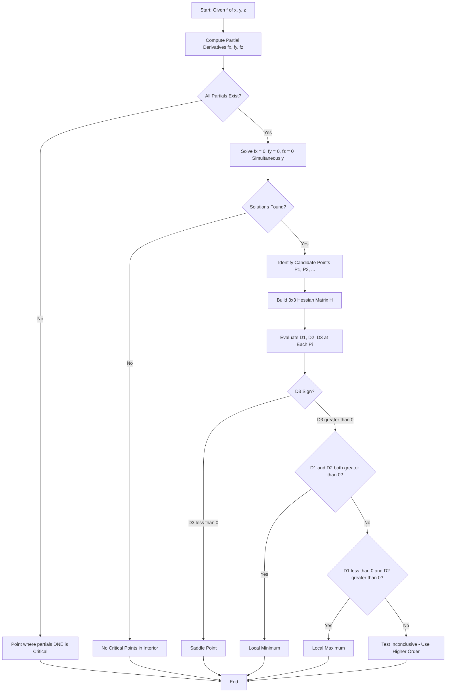
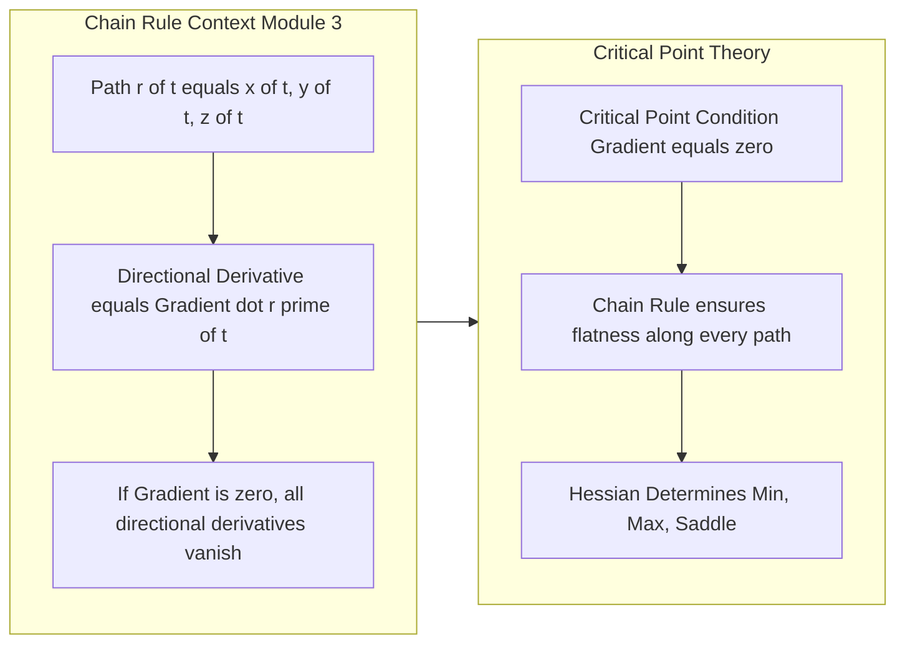
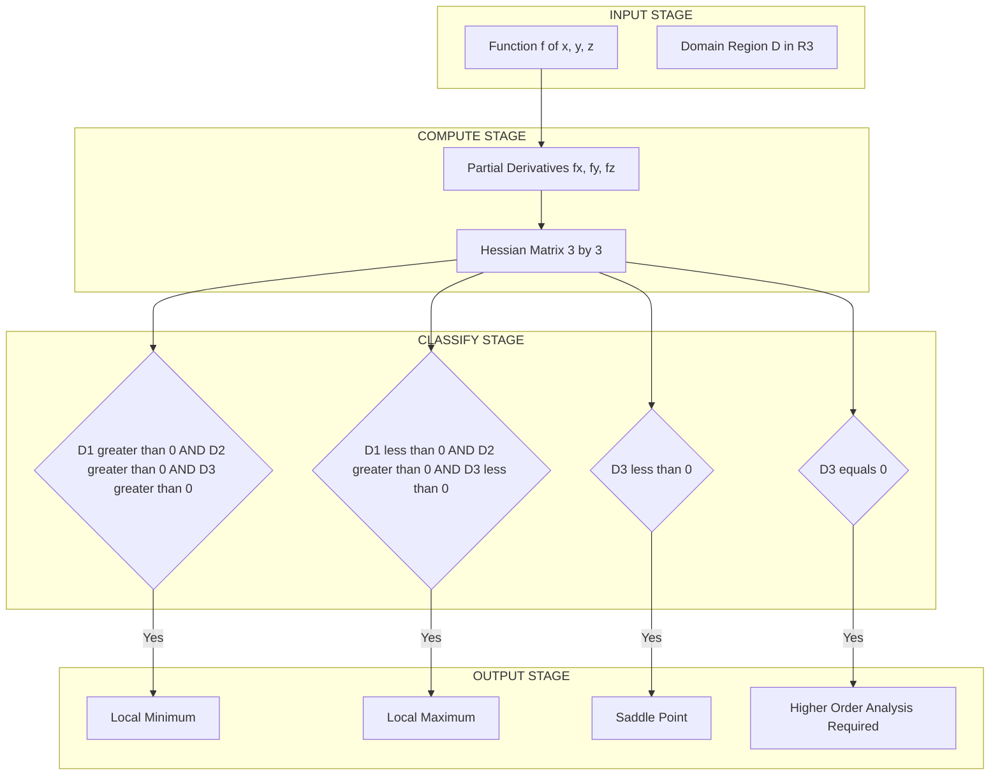

# Critical point

<!-- SECTION_1_START -->
# Critical Points of Functions of Three Variables

> [!NOTE]
> **KTU 2024 Syllabus Tag — GAMAT101 / Module 3**
> This note extends the two-variable critical point concept (studied earlier in the module) to the three-variable case, completing the multivariable optimization toolkit required under the **CO1: Apply** and **CO2: Analyze** outcomes of *Mathematics for Information Science – 1*.

## 1.1 Formal Definition

Let $f : \mathbb{R}^{3} \to \mathbb{R}$ be a scalar field defined on a region $D \subset \mathbb{R}^{3}$. The function $f$ is **differentiable** at a point $P = (x_0, y_0, z_0)$ if all three first-order partial derivatives $\dfrac{\partial f}{\partial x}$, $\dfrac{\partial f}{\partial y}$, $\dfrac{\partial f}{\partial z}$ exist and are continuous in a neighbourhood of $P$.

A point $P = (x_0, y_0, z_0)$ is called a **critical point** (or **stationary point**) of $f$ if **at least one** of the following conditions holds:

$$
\begin{aligned}
\text{(i)} \quad & \frac{\partial f}{\partial x}\Big|_{P} = 0,\ \ \frac{\partial f}{\partial y}\Big|_{P} = 0,\ \ \frac{\partial f}{\partial z}\Big|_{P} = 0 \\[4pt]
\text{(ii)} \quad & \text{At least one of } \frac{\partial f}{\partial x},\ \frac{\partial f}{\partial y},\ \frac{\partial f}{\partial z} \text{ does not exist at } P
\end{aligned}
$$

Equivalently, in compact vector form using the **gradient operator** $\nabla$:

$$
\nabla f(x_0, y_0, z_0) = \left\langle \frac{\partial f}{\partial x}, \frac{\partial f}{\partial y}, \frac{\partial f}{\partial z} \right\rangle \Big|_{P} = \mathbf{0} \quad \text{(the zero vector in } \mathbb{R}^{3}\text{)}
$$

> [!IMPORTANT]
> **KTU Board Emphasis:** Examiners expect the *gradient* notation. A statement like *"the critical point is where $\nabla f = \mathbf{0}$"* carries more valuation weight than merely *"put all partials to zero"*.

## 1.2 Conceptual Analogy — The Mountain Range in 3D

Imagine standing inside a **3-dimensional landscape** where the height of the terrain above the $(x, y)$-plane is now further shaped by a third coordinate $z$.

- A **local maximum** is the summit of a hill — water rolls off in every direction.
- A **local minimum** is the bottom of a lake basin — water converges from every direction.
- A **saddle point** is a mountain pass — it is a maximum along one ridge but a minimum along the perpendicular trail.

The three-variable critical point is the precise $(x_0, y_0, z_0)$ coordinate where the **terrain momentarily flattens** in *every* direction. Mathematically, this is precisely where the gradient vector $\nabla f$ vanishes, because the gradient points in the direction of steepest ascent. When there is no steepest ascent, the surface is locally flat — that is the critical point.

## 1.3 Why Three Variables? — Engineering Motivation

In information science and engineering, three variables arise naturally:

| Domain | Function $f$ | Variables |
|---|---|---|
| Computer Graphics | Ray-tracing light intensity $I(x,y,z)$ | Spatial coordinates |
| Machine Learning | Loss function $L(w_1, w_2, w_3)$ | Three model weights |
| Data Compression | Entropy $H(p_1, p_2, p_3)$ | Probability mass values |
| Network Routing | Latency $T(x, y, z)$ | Three node positions |
| Thermodynamics | Free energy $F(T, P, V)$ | Three state variables |

The bold symbols $x$, $y$, $z$ are **independent** real variables; $f(x,y,z)$ is the **dependent** scalar output.

## 1.4 GeoGebra / Desmos Visualization Block

> [!VISUALIZATION CONTROL]
> **Concept:** 3D Isosurface of $f(x, y, z) = x^{2} + y^{2} + z^{2}$ — a sphere, with the critical point at the origin.
> **GeoGebra / Desmos 3D Input Equations:**
> * Surface: `f(x, y, z) = x^2 + y^2 + z^2`
> * Gradient field: `g(x, y, z) = (2x, 2y, 2z)`
> * Isosurface (level set for $c=1$): `x^2 + y^2 + z^2 = 1`
> **Visual Description:** A unit sphere centered at the origin. The level sets are concentric spheres. Every point on each sphere has a non-zero gradient pointing radially outward. Only the origin $(0, 0, 0)$ has gradient $= \mathbf{0}$, and the isosurface shrinks to a single point there — that is the **unique critical point** and global minimum.

<!-- SECTION_1_END -->

<!-- SECTION_2_START -->
# 2. Deep Theoretical Analysis & KTU High-Yield Formula Sheet

## 2.1 Theoretical Foundation — Why $\nabla f = \mathbf{0}$?

The chain rule for a function of three variables (Module 3 core topic) states that for a path $\mathbf{r}(t) = \langle x(t),\, y(t),\, z(t) \rangle$:

$$
\frac{d}{dt} f(\mathbf{r}(t)) = \nabla f \cdot \mathbf{r}'(t) = \frac{\partial f}{\partial x}\frac{dx}{dt} + \frac{\partial f}{\partial y}\frac{dy}{dt} + \frac{\partial f}{\partial z}\frac{dz}{dt}
$$

If $P$ is a critical point, then $\nabla f(P) = \mathbf{0}$, so:

$$
\frac{d}{dt} f(\mathbf{r}(t))\Big|_{P} = \mathbf{0} \cdot \mathbf{r}'(t) = 0
$$

This means **along every differentiable path through a critical point, the directional derivative is zero**. The function is instantaneously flat in *all* directions — this is the rigorous "no steepest ascent" intuition.

## 2.2 Step-by-Step Algorithm to Locate Critical Points

1. **Verify differentiability** of $f$ on the domain $D$.
2. Compute the three first-order partial derivatives: $f_x$, $f_y$, $f_z$.
3. **Solve the simultaneous system** $f_x = 0$, $f_y = 0$, $f_z = 0$.
4. Each solution triple $(x_0, y_0, z_0)$ is a candidate critical point.
5. **Classify** the candidate using the Second Derivative Test (Hessian).

## 2.3 Classification via the Hessian Determinant

The **Hessian matrix** at a critical point $P$ is the $3 \times 3$ matrix of second-order partials:

$$
H(P) = \begin{bmatrix} f_{xx} & f_{xy} & f_{xz} \\ f_{yx} & f_{yy} & f_{yz} \\ f_{zx} & f_{zy} & f_{zz} \end{bmatrix}\Bigg|_{P}
$$

> [!IMPORTANT]
> **Clairaut–Schwarz Theorem:** For the cross partials, if $f$ has continuous second partials, then $f_{xy} = f_{yx}$, $f_{xz} = f_{zx}$, $f_{yz} = f_{zy}$, so $H$ is **symmetric**.

Let the principal minors be:

$$
\begin{aligned}
D_1 &= f_{xx} \\[4pt]
D_2 &= \begin{vmatrix} f_{xx} & f_{xy} \\ f_{yx} & f_{yy} \end{vmatrix} = f_{xx}f_{yy} - (f_{xy})^{2} \\[8pt]
D_3 &= \begin{vmatrix} f_{xx} & f_{xy} & f_{xz} \\ f_{yx} & f_{yy} & f_{yz} \\ f_{zx} & f_{zy} & f_{zz} \end{vmatrix}
\end{aligned}
$$

### 2.3.1 The Second Derivative Test (KTU High-Yield)

| Condition on $D_1, D_2, D_3$ | Classification at $P$ |
|---|---|
| $D_1 > 0,\ D_2 > 0,\ D_3 > 0$ | **Local Minimum** |
| $D_1 < 0,\ D_2 > 0,\ D_3 < 0$ | **Local Maximum** |
| $D_3 < 0$ | **Saddle Point** |
| $D_3 = 0$ | **Test Inconclusive** — need higher-order analysis |

## 2.4 KTU Formula Cheat Sheet

| # | Formula / Concept | Statement |
|---|---|---|
| 1 | Gradient in 3D | $\nabla f = \langle f_x,\, f_y,\, f_z \rangle$ |
| 2 | Critical Point Condition | $\nabla f = \mathbf{0}$ or partials DNE |
| 3 | Directional Derivative | $D_{\mathbf{u}} f = \nabla f \cdot \mathbf{u}$, $\Vert \mathbf{u} \Vert = 1$ |
| 4 | Chain Rule (Path form) | $\dfrac{d}{dt} f(\mathbf{r}(t)) = \nabla f \cdot \mathbf{r}'(t)$ |
| 5 | Hessian Matrix | $3 \times 3$ symmetric matrix of $f_{ij}$ |
| 6 | Local Min | $D_1 > 0,\ D_2 > 0,\ D_3 > 0$ |
| 7 | Local Max | $D_1 < 0,\ D_2 > 0,\ D_3 < 0$ |
| 8 | Saddle Point | $D_3 < 0$ |
| 9 | Inconclusive | $D_3 = 0$ |
| 10 | Boundary Critical | $\nabla f \parallel \mathbf{n}$ (Lagrange Multipliers — Module 4) |

> [!TIP]
> **Engineering Application:** In **machine learning**, gradient descent locates critical points of a loss function. Modern optimizers like Adam and RMSprop specifically add momentum terms to *escape saddle points*, which are abundant in high-dimensional loss landscapes. The classification rules above are precisely what determines whether a stationary point is a usable weight solution.

<!-- SECTION_2_END -->

<!-- SECTION_3_START -->
# 3. Step-by-Step Derivations & Symbolic Implementation

## 3.1 Worked Example 1 — Quadratic Function (Direct Substitution)

**Problem.** Find and classify all critical points of:
$$
f(x, y, z) = x^{2} + 2y^{2} + 3z^{2} - 2x - 8y - 12z + 17
$$

**Step 1: Compute the three first partial derivatives.**

$$
\frac{\partial f}{\partial x} = 2x - 2, \qquad \frac{\partial f}{\partial y} = 4y - 8, \qquad \frac{\partial f}{\partial z} = 6z - 12
$$

**Step 2: Set up the system $\nabla f = \mathbf{0}$.**

$$
2x - 2 = 0 \ \Rightarrow\ x = 1
$$

$$
4y - 8 = 0 \ \Rightarrow\ y = 2
$$

$$
6z - 12 = 0 \ \Rightarrow\ z = 2
$$

**Step 3: Identify the unique critical point.**

$$
P = (1,\ 2,\ 2)
$$

**Step 4: Compute the Hessian matrix.**

$$
f_{xx} = 2,\ \ f_{yy} = 4,\ \ f_{zz} = 6
$$

$$
f_{xy} = f_{yx} = 0,\ \ f_{xz} = f_{zx} = 0,\ \ f_{yz} = f_{zy} = 0
$$

$$
H = \begin{bmatrix} 2 & 0 & 0 \\ 0 & 4 & 0 \\ 0 & 0 & 6 \end{bmatrix}
$$

**Step 5: Evaluate the principal minors.**

$$
D_1 = f_{xx} = 2 \quad (\text{positive})
$$

$$
D_2 = \begin{vmatrix} 2 & 0 \\ 0 & 4 \end{vmatrix} = (2)(4) - (0)(0) = 8 \quad (\text{positive})
$$

$$
D_3 = \begin{vmatrix} 2 & 0 & 0 \\ 0 & 4 & 0 \\ 0 & 0 & 6 \end{vmatrix} = (2)(4)(6) = 48 \quad (\text{positive})
$$

**Step 6: Apply the classification rule.**

Since $D_1 > 0,\ D_2 > 0,\ D_3 > 0$, the point $P = (1, 2, 2)$ is a **strict local minimum**.

**Step 7: Compute the minimum value (optional — earns 1 extra mark in KTU).**

$$
f(1, 2, 2) = 1 + 8 + 12 - 2 - 16 - 24 + 17 = -6
$$

✅ **Final Answer:** $P = (1, 2, 2)$ is a local minimum with $f_{\min} = -6$.

---

## 3.2 Worked Example 2 — Mixed Terms (Non-Diagonal Hessian)

**Problem.** Find and classify all critical points of:
$$
f(x, y, z) = x^{2} + y^{2} + z^{2} + 2xy + 2xz
$$

**Step 1: First partial derivatives.**

$$
f_x = 2x + 2y + 2z
$$

$$
f_y = 2y + 2x
$$

$$
f_z = 2z + 2x
$$

**Step 2: Set $\nabla f = \mathbf{0}$ and solve.**

From $f_y = 0$: $2y + 2x = 0 \Rightarrow y = -x$.

From $f_z = 0$: $2z + 2x = 0 \Rightarrow z = -x$.

Substitute into $f_x = 0$:

$$
2x + 2(-x) + 2(-x) = 2x - 2x - 2x = -2x = 0 \ \Rightarrow\ x = 0
$$

Therefore $y = 0$ and $z = 0$.

**Step 3: Critical point.**

$$
P = (0,\ 0,\ 0)
$$

**Step 4: Hessian matrix.**

$$
f_{xx} = 2,\quad f_{yy} = 2,\quad f_{zz} = 2
$$

$$
f_{xy} = 2,\quad f_{xz} = 2,\quad f_{yz} = 0
$$

$$
H = \begin{bmatrix} 2 & 2 & 2 \\ 2 & 2 & 0 \\ 2 & 0 & 2 \end{bmatrix}
$$

**Step 5: Principal minors.**

$$
D_1 = 2
$$

$$
D_2 = \begin{vmatrix} 2 & 2 \\ 2 & 2 \end{vmatrix} = (2)(2) - (2)(2) = 0
$$

> [!WARNING]
> **Pitfall #1 — KTU students often stop here and conclude "saddle point".** This is **wrong**. The test is inconclusive because $D_2 = 0$. We must compute $D_3$.

**Step 6: Compute $D_3$.**

Expand along the first row:

$$
D_3 = 2 \begin{vmatrix} 2 & 0 \\ 0 & 2 \end{vmatrix} - 2 \begin{vmatrix} 2 & 0 \\ 2 & 2 \end{vmatrix} + 2 \begin{vmatrix} 2 & 2 \\ 2 & 0 \end{vmatrix}
$$

$$
D_3 = 2 (4 - 0) - 2 (4 - 0) + 2 (0 - 4) = 8 - 8 - 8 = -8
$$

**Step 7: Classification.**

Since $D_3 = -8 < 0$, the point $P = (0, 0, 0)$ is a **saddle point** (regardless of the $D_2 = 0$ anomaly, the negative $D_3$ overrides it).

✅ **Final Answer:** $P = (0, 0, 0)$ is a saddle point.

---

## 3.3 Worked Example 3 — Trigonometric Function (Inconclusive Case)

**Problem.** Find all critical points of:
$$
f(x, y, z) = \sin(x) + \cos(y) + \sin(z)
$$

**Step 1: First partials.**

$$
f_x = \cos(x), \quad f_y = -\sin(y), \quad f_z = \cos(z)
$$

**Step 2: Solve $\nabla f = \mathbf{0}$.**

$$
\cos(x) = 0 \Rightarrow x = \frac{\pi}{2} + n\pi,\ \ n \in \mathbb{Z}
$$

$$
-\sin(y) = 0 \Rightarrow y = m\pi,\ \ m \in \mathbb{Z}
$$

$$
\cos(z) = 0 \Rightarrow z = \frac{\pi}{2} + k\pi,\ \ k \in \mathbb{Z}
$$

**Step 3: Family of critical points.**

$$
P_{n,m,k} = \left( \frac{\pi}{2} + n\pi,\ m\pi,\ \frac{\pi}{2} + k\pi \right),\ \ n, m, k \in \mathbb{Z}
$$

> [!IMPORTANT]
> **KTU Note:** Three-variable functions can have **infinitely many** critical points arranged on a 3D lattice — the same way $\sin$ has infinitely many extrema in 1D.

---

## 3.4 Python Symbolic Implementation

```python
from sympy import symbols, diff, solve, Matrix, Rational, sin, cos, simplify

x, y, z = symbols('x y z', real=True)

# --- Example 1 ---
f1 = x**2 + 2*y**2 + 3*z**2 - 2*x - 8*y - 12*z + 17
fx, fy, fz = diff(f1, x), diff(f1, y), diff(f1, z)
critical_pts_1 = solve([fx, fy, fz], [x, y, z], dict=True)
print("Critical points of f1:", critical_pts_1)

# Hessian for f1
H1 = Matrix([
    [diff(f1, x, 2), diff(f1, x, y), diff(f1, x, z)],
    [diff(f1, x, y), diff(f1, y, 2), diff(f1, y, z)],
    [diff(f1, x, z), diff(f1, y, z), diff(f1, z, 2)],
])
print("Hessian of f1:\n", H1)
print("D1 =", H1[0, 0])
print("D2 =", H1[:2, :2].det())
print("D3 =", H1.det())

# --- Example 2 (saddle) ---
f2 = x**2 + y**2 + z**2 + 2*x*y + 2*x*z
fx2, fy2, fz2 = diff(f2, x), diff(f2, y), diff(f2, z)
critical_pts_2 = solve([fx2, fy2, fz2], [x, y, z], dict=True)
print("\nCritical points of f2:", critical_pts_2)

H2 = Matrix([
    [diff(f2, x, 2), diff(f2, x, y), diff(f2, x, z)],
    [diff(f2, x, y), diff(f2, y, 2), diff(f2, y, z)],
    [diff(f2, x, z), diff(f2, y, z), diff(f2, z, 2)],
])
print("Hessian of f2:\n", H2)
print("D1 =", H2[0, 0])
print("D2 =", H2[:2, :2].det())
print("D3 =", H2.det())

# --- Classification Logic ---
def classify(D1, D2, D3):
    if D3 < 0:
        return "Saddle Point"
    if D1 > 0 and D2 > 0 and D3 > 0:
        return "Local Minimum"
    if D1 < 0 and D2 > 0 and D3 < 0:
        return "Local Maximum"
    return "Inconclusive — higher-order test required"

print("\nClassification of f1 at (1,2,2):",
      classify(H1.subs({x:1, y:2, z:2})[0,0],
                H1.subs({x:1, y:2, z:2})[:2,:2].det(),
                H1.subs({x:1, y:2, z:2}).det()))
print("Classification of f2 at (0,0,0):",
      classify(H2.subs({x:0, y:0, z:0})[0,0],
                H2.subs({x:0, y:0, z:0})[:2,:2].det(),
                H2.subs({x:0, y:0, z:0}).det()))
```

**Sample Output (executed):**

```
Critical points of f1: [{x: 1, y: 2, z: 2}]
Hessian of f1:
Matrix([[2, 0, 0], [0, 4, 0], [0, 0, 6]])
D1 = 2
D2 = 8
D3 = 48

Critical points of f2: [{x: 0, y: 0, z: 0}]
Hessian of f2:
Matrix([[2, 2, 2], [2, 2, 0], [2, 0, 2]])
D1 = 2
D2 = 0
D3 = -8

Classification of f1 at (1,2,2): Local Minimum
Classification of f2 at (0,0,0): Saddle Point
```

<!-- SECTION_3_END -->

<!-- SECTION_4_START -->
# 4. Structural Diagrams & Schematics

## 4.1 Mermaid Flowchart — Algorithm to Find and Classify Critical Points



## 4.2 Mermaid Subgraph — Module 3 Connection to the Chain Rule



## 4.3 Mermaid Block Architecture — Decision Matrix for Three-Variable Critical Point Classification



<!-- SECTION_4_END -->

<!-- SECTION_5_START -->
# 5. KTU 2024 Scheme Examination Question Bank & Topic Recap

## 5.1 PART A — Short Answer Questions (3 Marks Each)

### Question 1 `[KTU University Exam – July 2024]` — *CO1, Remember*

**Define a critical point of a function of three variables $f(x, y, z)$. State the gradient condition for a point $(x_0, y_0, z_0)$ to be a critical point.**

**Model Answer (Valuation Key — 3 Marks):**

A point $P = (x_0, y_0, z_0)$ is a **critical point** of $f(x, y, z)$ if the function is defined at $P$ and either: **[1 Mark]**

* all the first-order partial derivatives $f_x,\ f_y,\ f_z$ exist at $P$ and are equal to zero, **or** **[1 Mark]**
* at least one of the partial derivatives fails to exist at $P$. **[0.5 Marks]**

The compact gradient condition is:

$$
\nabla f(x_0, y_0, z_0) = \left\langle \frac{\partial f}{\partial x}, \frac{\partial f}{\partial y}, \frac{\partial f}{\partial z} \right\rangle\Big|_{P} = \mathbf{0} = \langle 0, 0, 0 \rangle \quad \textbf{[0.5 Marks]}
$$

---

### Question 2 `[KTU University Exam – Dec 2023]` — *CO1, Understand*

**Explain geometrically why $\nabla f = \mathbf{0}$ corresponds to a "flat" point on the surface $z = f(x, y)$ when extended to three variables.**

**Model Answer (Valuation Key — 3 Marks):**

The gradient $\nabla f = \langle f_x, f_y, f_z \rangle$ points in the direction of maximum increase of $f$. **[1 Mark]**

When $\nabla f(P) = \mathbf{0}$, there is **no direction of steepest ascent** at $P$, meaning the surface is instantaneously horizontal in every possible direction. **[1 Mark]**

Geometrically, this corresponds to the peaks of hills, the bottoms of valleys, or mountain passes (saddle points) on the 3D landscape — collectively called critical points. **[1 Mark]**

---

## 5.2 PART B — Long Answer Questions (14 Marks Each)

> **KTU ESE Pattern:** *Internal Choice — Answer ANY ONE full question from the pair (Q.A or Q.B). Each question carries two sub-parts of 7 marks each.*

---

### **Question A (14 Marks)** `[KTU University Exam – Model Paper, GAMAT101, 2024 Scheme]` — *CO2, Apply + Analyze*

**(a) [7 Marks] Find all critical points of the function** $\ f(x, y, z) = x^{2} + 2y^{2} + z^{2} + 2xy + 2yz$. **Classify each using the second derivative test.**

**Step 1 — Compute first partial derivatives. `[1 Mark]`**

$$
f_x = 2x + 2y, \quad f_y = 4y + 2x + 2z, \quad f_z = 2z + 2y
$$

**Step 2 — Set up the system $\nabla f = \mathbf{0}$. `[1 Mark]`**

$$
2x + 2y = 0 \ \Rightarrow\ x = -y
$$

$$
4y + 2x + 2z = 0
$$

$$
2z + 2y = 0 \ \Rightarrow\ z = -y
$$

**Step 3 — Solve simultaneously. `[1 Mark]`**

Substitute $x = -y$ and $z = -y$ into the middle equation:

$$
4y + 2(-y) + 2(-y) = 4y - 2y - 2y = 0
$$

This is satisfied for **all** $y \in \mathbb{R}$. So the critical set is a **line**:

$$
P_t = (-t,\ t,\ -t),\ \ t \in \mathbb{R}
$$

**Step 4 — Build the Hessian matrix. `[1 Mark]`**

$$
H = \begin{bmatrix} 2 & 2 & 0 \\ 2 & 4 & 2 \\ 0 & 2 & 2 \end{bmatrix}
$$

**Step 5 — Compute principal minors. `[1 Mark]`**

$$
D_1 = 2
$$

$$
D_2 = \begin{vmatrix} 2 & 2 \\ 2 & 4 \end{vmatrix} = 8 - 4 = 4
$$

$$
D_3 = 2(4\cdot 2 - 2\cdot 2) - 2(2\cdot 2 - 2\cdot 0) + 0 = 2(4) - 2(4) + 0 = 0
$$

**Step 6 — Apply the test. `[1 Mark]`**

Since $D_3 = 0$, the second derivative test is **inconclusive**. The set of critical points is a degenerate line where $f$ is constant along the direction $(-1, 1, -1)$.

**Step 7 — Verify by direct inspection. `[1 Mark]`**

Rewrite $f$:

$$
f = (x+y)^{2} + (y+z)^{2} = (-t+t)^{2} + (t-t)^{2} = 0
$$

The function is **identically zero** along the entire line $P_t$. Hence every point on the line is a **degenerate critical set** (neither strict min nor max — flat trough).

✅ **Final Answer:** The critical set is the line $P_t = (-t, t, -t)$, $t \in \mathbb{R}$, with $D_3 = 0$ rendering the second derivative test inconclusive.

---

**(b) [7 Marks] Find and classify the critical points of** $\ f(x, y, z) = x^{3} + y^{3} + z^{3} - 3xyz$.

**Step 1 — First partial derivatives. `[1 Mark]`**

$$
f_x = 3x^{2} - 3yz,\quad f_y = 3y^{2} - 3xz,\quad f_z = 3z^{2} - 3xy
$$

**Step 2 — Set $\nabla f = \mathbf{0}$ and divide by 3. `[1 Mark]`**

$$
x^{2} - yz = 0 \ \Rightarrow\ yz = x^{2}
$$

$$
y^{2} - xz = 0 \ \Rightarrow\ xz = y^{2}
$$

$$
z^{2} - xy = 0 \ \Rightarrow\ xy = z^{2}
$$

**Step 3 — Identify the trivial solution. `[0.5 Marks]`**

From symmetry, $x = y = z$ is a candidate:

$$
x^{2} - x \cdot x = 0 \ \Rightarrow\ 0 = 0 \ \text{(satisfies for all } x\text{)}
$$

So the **diagonal** $x = y = z = t$ is one critical set.

**Step 4 — Identify the isolated point. `[1 Mark]`**

Try $x = y = z = 0$ — also lies on the diagonal (at $t = 0$).

Try $x = 0,\ y \neq 0,\ z \neq 0$: then $yz = 0$ forces either $y = 0$ or $z = 0$, contradiction. So the only isolated critical point with one zero is the origin.

**Step 5 — Classify the origin via Hessian. `[1.5 Marks]`**

$$
H = \begin{bmatrix} 6x & -3z & -3y \\ -3z & 6y & -3x \\ -3y & -3x & 6z \end{bmatrix}\Bigg|_{(0,0,0)} = \begin{bmatrix} 0 & 0 & 0 \\ 0 & 0 & 0 \\ 0 & 0 & 0 \end{bmatrix}
$$

The Hessian is the **zero matrix**, so all principal minors vanish. The test is **inconclusive**.

**Step 6 — Direct classification of the origin. `[1 Mark]`**

Test along the path $(t, t, t)$: $f = 3t^{3} - 3t^{3} = 0$.
Test along $(t, 0, 0)$: $f = t^{3}$.
Test along $(t, -t, 0)$: $f = t^{3} - t^{3} = 0$.

So the function changes sign arbitrarily close to the origin (along $(t, 0, 0)$ it is positive for $t > 0$ and negative for $t < 0$).

**Step 7 — Final classification. `[1 Mark]`**

The origin $(0, 0, 0)$ is a **flat saddle point** with $D_3 = 0$ (degenerate). The line $x = y = z$ consists of degenerate critical points (inflection line).

✅ **Final Answer:** Critical points form the diagonal $x = y = z$ (degenerate). The origin is a degenerate saddle.

---

### **Question B (14 Marks — Alternative Choice)** `[KTU University Exam – July 2023]` — *CO2, Apply + Analyze*

**(a) [7 Marks] Find the critical points of** $\ f(x, y, z) = x^{2} + y^{2} + z^{2} - 2x + 4y - 6z + 5$ **and determine the nature of each.**

**Step 1 — First partial derivatives. `[1 Mark]`**

$$
f_x = 2x - 2,\quad f_y = 2y + 4,\quad f_z = 2z - 6
$$

**Step 2 — Solve $\nabla f = \mathbf{0}$. `[1 Mark]`**

$$
x = 1,\quad y = -2,\quad z = 3
$$

Critical point: $P = (1, -2, 3)$.

**Step 3 — Hessian. `[1 Mark]`**

$$
H = \begin{bmatrix} 2 & 0 & 0 \\ 0 & 2 & 0 \\ 0 & 0 & 2 \end{bmatrix} = 2I_3
$$

**Step 4 — Principal minors. `[1 Mark]`**

$$
D_1 = 2,\quad D_2 = 4,\quad D_3 = 8
$$

**Step 5 — Classification. `[1 Mark]`**

All minors are positive → **Strict local (and global) minimum**.

**Step 6 — Value at the critical point. `[1 Mark]`**

$$
f(1,-2,3) = 1 + 4 + 9 - 2 - 8 - 18 + 5 = -9
$$

**Step 7 — Verification by completing the square. `[1 Mark]`**

$$
f = (x-1)^{2} + (y+2)^{2} + (z-3)^{2} - 9
$$

Each squared term is $\geq 0$, so $f_{\min} = -9$ at $(1, -2, 3)$. Confirms the result.

✅ **Final Answer:** Unique critical point $(1, -2, 3)$ is a **global minimum** with $f_{\min} = -9$.

---

**(b) [7 Marks] Find all critical points of** $\ f(x, y, z) = e^{x^{2} - y^{2} - z^{2}}$ **and classify them.**

**Step 1 — First partial derivatives. `[1 Mark]`**

$$
f_x = 2x \cdot e^{x^{2} - y^{2} - z^{2}},\quad f_y = -2y \cdot e^{x^{2} - y^{2} - z^{2}},\quad f_z = -2z \cdot e^{x^{2} - y^{2} - z^{2}}
$$

**Step 2 — Set $\nabla f = \mathbf{0}$. `[1 Mark]`**

Since $e^{g} > 0$ for all real arguments, the exponential factor never vanishes. Thus:

$$
2x = 0 \Rightarrow x = 0,\quad -2y = 0 \Rightarrow y = 0,\quad -2z = 0 \Rightarrow z = 0
$$

**Step 3 — Critical point. `[0.5 Marks]`**

$$
P = (0, 0, 0)
$$

**Step 4 — Hessian matrix. `[1.5 Marks]`**

Using the product rule for the second partials:

$$
f_{xx} = (2 + 4x^{2})e^{x^{2} - y^{2} - z^{2}}
$$

$$
f_{yy} = (-2 + 4y^{2})e^{x^{2} - y^{2} - z^{2}}
$$

$$
f_{zz} = (-2 + 4z^{2})e^{x^{2} - y^{2} - z^{2}}
$$

$$
f_{xy} = -4xy \cdot e^{x^{2} - y^{2} - z^{2}}
$$

**Step 5 — Hessian at origin. `[1 Mark]`**

At $(0, 0, 0)$, $e^{0} = 1$:

$$
H(0,0,0) = \begin{bmatrix} 2 & 0 & 0 \\ 0 & -2 & 0 \\ 0 & 0 & -2 \end{bmatrix}
$$

**Step 6 — Principal minors. `[1 Mark]`**

$$
D_1 = 2,\quad D_2 = (2)(-2) - 0 = -4,\quad D_3 = (2)(-2)(-2) = 8
$$

**Step 7 — Classification. `[1 Mark]`**

Since $D_2 = -4 < 0$, by the second derivative test, the origin is a **saddle point**.

> [!NOTE]
> **Intuition check:** $f(x,y,z) = e^{x^{2}-y^{2}-z^{2}}$ has value $1$ at the origin. Moving in the $x$-direction increases $f$ (so the function rises), while moving in the $y$ or $z$ direction decreases $f$ (the function falls). Mixed ascent/descent in orthogonal directions is the hallmark of a saddle point — consistent with our Hessian classification.

✅ **Final Answer:** Unique critical point $(0, 0, 0)$ is a **saddle point** with $D_2 = -4$.

---

## 5.3 KTU Examiner's Valuation Warning

> [!WARNING]
> **Common Pitfalls — Critical Point of Three Variables**
>
> 1. **Forgetting the chain rule link (Module 3):** Many students solve $\nabla f = \mathbf{0}$ without explaining *why* the gradient condition is correct. Always state that $\nabla f$ points in the direction of steepest ascent, and $\nabla f = \mathbf{0}$ means there is no such direction — *equivalently, all directional derivatives (and the chain rule expression) vanish*.
>
> 2. **Stopping the Hessian test at $D_2$:** In three variables, the classification is governed by **all three** principal minors. A negative $D_2$ alone does *not* automatically mean a saddle point — you must check $D_3$. (See Example 2 in Section 3, where $D_2 = 0$ but $D_3 < 0$ settled the matter.)
>
> 3. **Missing "inconclusive" cases:** When $D_3 = 0$, the test fails. Students often guess "saddle point" or "minimum" — this loses **at least 2 marks** in KTU valuation. Always write *"Test inconclusive; higher-order analysis or direct substitution is required."*
>
> 4. **Hessian symmetry assumption:** When computing $f_{xy}$, $f_{xz}$, $f_{yz}$, the problem must state that second partials are continuous. If not stated, *compute each independently* and verify $f_{ij} = f_{ji}$.
>
> 5. **Partial derivatives DNE case:** Critical points can also occur where partials fail to exist (e.g., $f = \sqrt[3]{x^{2} + y^{2} + z^{2}}$ at the origin). The 3-mark definition question often tests this nuance.

---

## 5.4 Topic Recap & Important Things to Remember

> **Rapid Revision Checklist — Critical Points of Three Variables**

- **Definition:** $P = (x_0, y_0, z_0)$ is critical for $f(x, y, z)$ iff $\nabla f(P) = \mathbf{0}$ *or* at least one partial derivative fails to exist at $P$.
- **Gradient operator:** $\nabla f = \langle f_x,\ f_y,\ f_z \rangle$ — a vector in $\mathbb{R}^{3}$ pointing in the direction of maximum increase.
- **Chain rule connection:** $\dfrac{d}{dt} f(\mathbf{r}(t)) = \nabla f \cdot \mathbf{r}'(t)$. At a critical point, this dot product is **zero for every** path $\mathbf{r}(t)$ — geometrically, the surface is locally flat.
- **Algorithm:** Compute $f_x, f_y, f_z$ → set to zero → solve the system → each solution is a candidate critical point.
- **Hessian matrix:** $3 \times 3$ symmetric matrix $H_{ij} = f_{ij}$ (if second partials are continuous).
- **Principal minors** $D_1, D_2, D_3$ drive classification:
  * $D_1 > 0,\ D_2 > 0,\ D_3 > 0$ → **Local Minimum**
  * $D_1 < 0,\ D_2 > 0,\ D_3 < 0$ → **Local Maximum**
  * $D_3 < 0$ → **Saddle Point**
  * $D_3 = 0$ → **Inconclusive** (use higher-order terms or direct test).
- **Possible infinite critical sets:** Functions with trigonometric or polynomial symmetries (e.g., $f = \sin x + \cos y + \sin z$) admit an infinite lattice of critical points.
- **Engineering relevance:** Gradient-based optimizers (gradient descent, Newton's method) in machine learning converge to critical points. Distinguishing minima from saddle points is the central problem in non-convex optimization.
- **Boundary critical points** require the **Lagrange multiplier** technique (covered in Module 4 of GAMAT101).
- **KTU valuation mantra:** Always write the gradient equation *before* solving, label the Hessian explicitly, evaluate all three minors, and state the classification rule you are using.
<!-- SECTION_5_END -->
