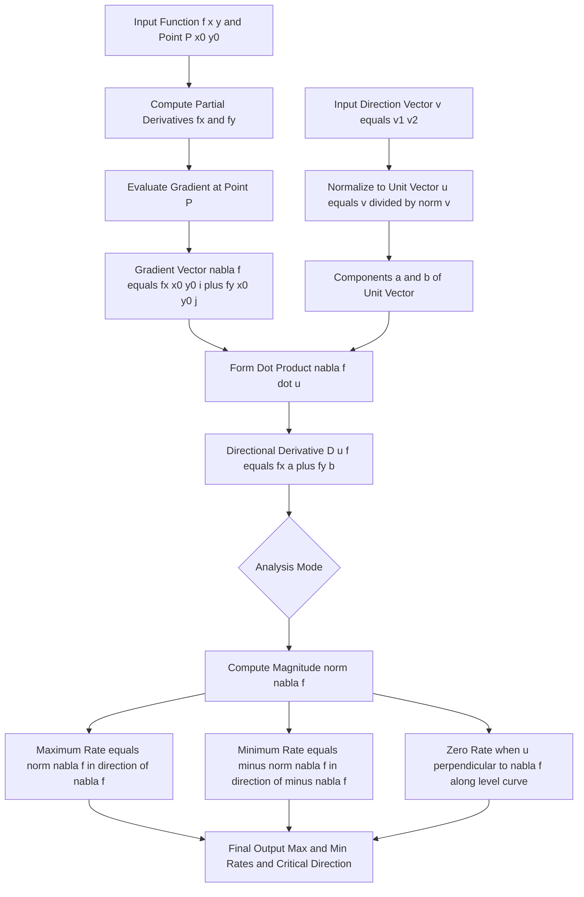
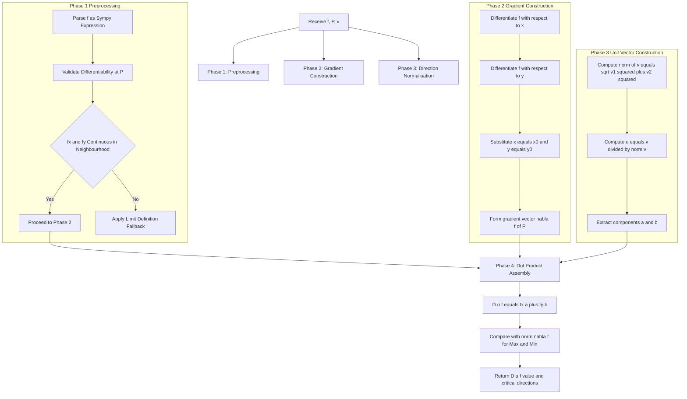
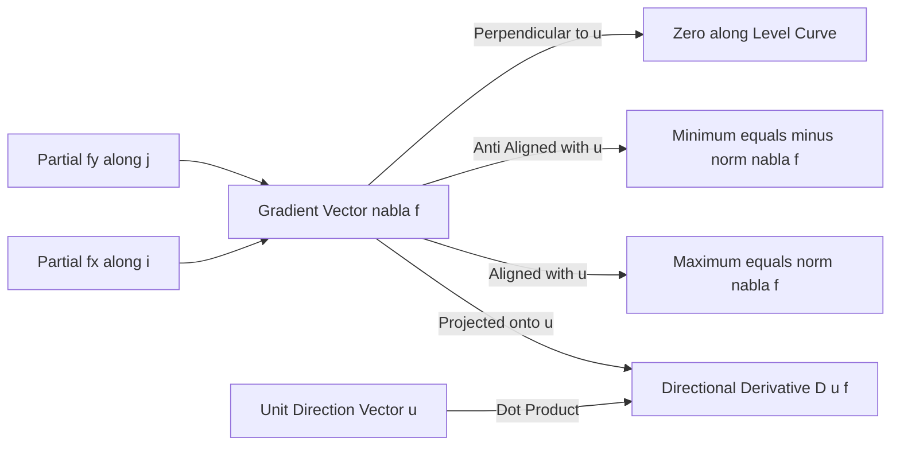
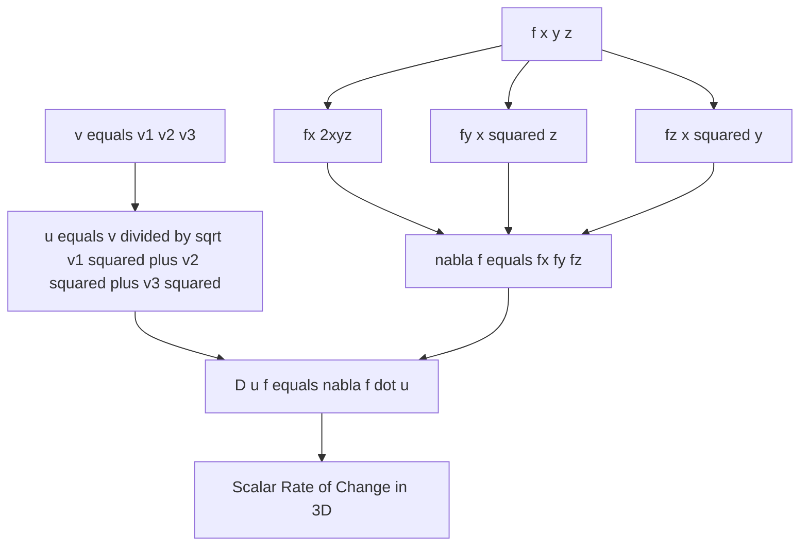

# Directional Derivatives in the Plane

<!-- SECTION_1_START -->
# Directional Derivatives in the Plane — KTU 2024 Scheme | GAMAT101 | Module 3

## 1.1 Formal Academic Definition

> [!NOTE]
> **KTU 2024 Syllabus Definition (Functions of Three Variables / Module 3)**
> The **directional derivative** of a function $f(x,y)$ at a point $(x_0, y_0)$ in the direction of a **unit vector** $\mathbf{u} = \langle a, b \rangle$ is the scalar quantity
> $$D_{\mathbf{u}} f(x_0, y_0) = \lim_{h \to 0} \frac{f(x_0 + ha,\, y_0 + hb) - f(x_0, y_0)}{h},$$
> provided this limit exists. Geometrically, it represents the **instantaneous rate of change** of $f$ at $(x_0, y_0)$ as the input moves in the direction $\mathbf{u}$.

When $f$ is differentiable, this limit is **guaranteed to exist** and is computed by the celebrated gradient–dot–product identity

$$D_{\mathbf{u}} f(x_0, y_0) \;=\; \nabla f(x_0, y_0) \cdot \mathbf{u} \;=\; f_x(x_0, y_0)\, a \;+\; f_y(x_0, y_0)\, b.$$

Writing $\mathbf{u} = \langle \cos\theta, \sin\theta \rangle$ for the unit vector making an angle $\theta$ with the positive $x$-axis, this becomes the **angle form**

$$D_{\mathbf{u}} f(x_0, y_0) \;=\; f_x \cos\theta \;+\; f_y \sin\theta.$$

> [!IMPORTANT]
> **Special Case — Reduction to Partial Derivatives**
> * $\mathbf{u} = \mathbf{i} = \langle 1, 0 \rangle$ (direction along positive $x$-axis): $D_{\mathbf{i}} f = f_x$
> * $\mathbf{u} = \mathbf{j} = \langle 0, 1 \rangle$ (direction along positive $y$-axis): $D_{\mathbf{j}} f = f_y$
>
> So **partial derivatives are simply directional derivatives along the coordinate axes** — a unifying insight that KTU examiners love testing.

## 1.2 Conceptual Analogy — The Mountain Walk

> [!TIP]
> **Real-World Analogy — Walking on a Hilly Surface**
> Imagine you are standing at point $P$ on a mountain whose height at $(x,y)$ is given by $f(x,y)$ above sea level. The **gradient vector** $\nabla f$ is an arrow drawn on the map pointing in the direction where the climb is **steepest** — it is the compass of the mountain.
>
> * If you walk **due East**, your rate of climb is $f_x$ (the partial derivative).
> * If you walk **due North**, your rate of climb is $f_y$.
> * If you walk in **any arbitrary compass direction** $\mathbf{u}$, your rate of climb is $D_{\mathbf{u}} f = \nabla f \cdot \mathbf{u}$ — exactly the **projection of the gradient onto your walking direction**.
>
> The closer your path is to $\nabla f$, the faster you climb. Walking **perpendicular to the gradient** means you are following a **contour line** — your elevation never changes, so $D_{\mathbf{u}} f = 0$.

> [!VISUALIZATION CONTROL]
> **Concept:** Directional Derivative as Slope along a Direction
> **GeoGebra / Desmos Input Equations:**
> * `f(x, y) = x^2 - y^2` (saddle surface)
> * Point $P = (1, 0)$
> * Unit vectors: $\mathbf{u}_1 = \langle \cos(45°), \sin(45°) \rangle$, $\mathbf{u}_2 = \langle \cos(135°), \sin(135°) \rangle$
> * Gradient at $P$: $\nabla f(1,0) = \langle 2, 0 \rangle$
> **Visual Description:** At the point $(1,0)$ on the saddle, the gradient points purely along the positive $x$-axis. The directional derivative reaches its **maximum value $2$** in this direction, becomes $0$ along the $y$-axis, and is **negative $2$** in the negative $x$-direction. Students should observe that $D_{\mathbf{u}} f$ is the *length of the projection* of $\nabla f$ onto $\mathbf{u}$, scaled by $\lVert \nabla f \rVert$.

---

## 1.3 Existence & Differentiability — The KTU Board Expectation

> [!WARNING]
> **Existence Theorem (Mandatory for KTU 14-Mark Answers)**
> If $f_x$ and $f_y$ both exist **and are continuous** in a neighbourhood of $(x_0, y_0)$, then $f$ is **differentiable** at $(x_0, y_0)$, and the directional derivative $D_{\mathbf{u}} f(x_0, y_0)$ exists for **every** unit vector $\mathbf{u}$ and equals $\nabla f \cdot \mathbf{u}$.
>
> **Converse trap:** Existence of directional derivatives alone does **NOT** imply differentiability. The KTU board tests this by giving a function with all directional derivatives existing but the gradient formula failing at the origin.

---

## 1.4 Three Critical Geometric Facts

> [!NOTE]
> **The Three Sacred Properties of $D_{\mathbf{u}} f$**
> 1. **Maximum Rate of Change** equals the **magnitude of the gradient**:
>    $$\max_{\lVert \mathbf{u} \rVert = 1} D_{\mathbf{u}} f \;=\; \lVert \nabla f(x_0, y_0) \rVert \;=\; \sqrt{f_x^2 + f_y^2}.$$
>    This maximum is attained when $\mathbf{u}$ is **parallel to** $\nabla f$, i.e. $\mathbf{u}_{\max} = \dfrac{\nabla f}{\lVert \nabla f \rVert}$.
>
> 2. **Minimum Rate of Change** equals the **negative magnitude of the gradient**:
>    $$\min_{\lVert \mathbf{u} \rVert = 1} D_{\mathbf{u}} f \;=\; -\lVert \nabla f(x_0, y_0) \rVert.$$
>    This minimum is attained when $\mathbf{u}$ is **anti-parallel to** $\nabla f$, i.e. $\mathbf{u}_{\min} = -\dfrac{\nabla f}{\lVert \nabla f \rVert}$.
>
> 3. **Zero Directional Derivative** occurs along all vectors **perpendicular to** $\nabla f$, i.e. the **level curves** of $f$. These are the directions of *no instantaneous change* in $f$.

---

## 1.5 Standard KTU Notation Quick Reference

| Symbol | KTU Standard Meaning | Domain |
| :--- | :--- | :--- |
| $f(x,y)$ | Scalar field over the plane $\mathbb{R}^2$ | Module 3 |
| $\nabla f$ | Gradient vector $\langle f_x, f_y \rangle$ | Module 3 |
| $\mathbf{u}$ | Unit vector, $\lVert \mathbf{u} \rVert = 1$ | Module 3 |
| $D_{\mathbf{u}} f$ | Directional derivative of $f$ in direction $\mathbf{u}$ | Module 3 |
| $\theta$ | Angle from positive $x$-axis to $\mathbf{u}$ | Module 3 |
| $\mathbf{i}, \mathbf{j}$ | Standard basis vectors $\langle 1,0 \rangle, \langle 0,1 \rangle$ | Module 3 |

<!-- SECTION_1_END -->

<!-- SECTION_2_START -->
# 2. Deep Theoretical Analysis & KTU High-Yield Formula Sheet

## 2.1 Operational Logic — How $D_{\mathbf{u}} f$ is Constructed

The construction proceeds through **four logical steps** that the KTU board expects to see written explicitly for full marks:

> [!IMPORTANT]
> **The KTU Four-Step Construction**
> 1. **Normalize the direction vector** $\mathbf{v} = \langle v_1, v_2 \rangle$ to a unit vector
>    $$\mathbf{u} = \left\langle \frac{v_1}{\sqrt{v_1^2 + v_2^2}}, \frac{v_2}{\sqrt{v_1^2 + v_2^2}} \right\rangle.$$
>    *Forgetting this step is the **#1 cause of lost marks** in KTU valuation.*
> 2. **Differentiate $f$ partially** to obtain $f_x$ and $f_y$.
> 3. **Evaluate the partial derivatives at the given point** $(x_0, y_0)$.
> 4. **Form the dot product** $D_{\mathbf{u}} f = f_x a + f_y b$ with the unit vector components.

## 2.2 The Theorem — Proof Sketch (Board-Ready)

> [!TIP]
> **Theorem (Differentiable $\Rightarrow$ Directional Derivative Exists)**
> If $f$ is differentiable at $(x_0, y_0)$, then $D_{\mathbf{u}} f(x_0, y_0)$ exists for every unit vector $\mathbf{u} = \langle a, b \rangle$ and equals $f_x a + f_y b$.
>
> **Idea of Proof:** Expand $f(x_0 + ha, y_0 + hb)$ using the differentiability linearization
> $$f(x_0 + ha, y_0 + hb) \;=\; f(x_0, y_0) + h \nabla f \cdot \mathbf{u} + \varepsilon(h)\sqrt{h^2 a^2 + h^2 b^2},$$
> where $\varepsilon(h) \to 0$ as $h \to 0$. Substituting into the limit definition and simplifying gives the result.

## 2.3 Generalization to Three Variables (Module 3 Mandate)

> [!NOTE]
> **Extension to $f(x,y,z)$ — Functions of Three Variables**
> For a function of three variables and a unit vector $\mathbf{u} = \langle a, b, c \rangle$,
> $$D_{\mathbf{u}} f(x_0, y_0, z_0) \;=\; \nabla f \cdot \mathbf{u} \;=\; f_x\, a + f_y\, b + f_z\, c,$$
> with $\nabla f = \langle f_x, f_y, f_z \rangle$. The geometry now lives in $\mathbb{R}^3$, with level **surfaces** (instead of level curves) being perpendicular to $\nabla f$.

## 2.4 KTU Formula Sheet — High-Yield Cheat Sheet

| \# | Formula | Use Case | Unit / Property |
| :---: | :--- | :--- | :--- |
| 1 | $D_{\mathbf{u}} f = \lim\limits_{h \to 0}\dfrac{f(x_0+ha,\,y_0+hb)-f(x_0,y_0)}{h}$ | Definition | Scalar |
| 2 | $D_{\mathbf{u}} f = \nabla f \cdot \mathbf{u}$ | Direct computation | Scalar |
| 3 | $D_{\mathbf{u}} f = f_x a + f_y b$ with $\lVert \mathbf{u} \rVert = 1$ | Component form | Scalar |
| 4 | $D_{\mathbf{u}} f = f_x \cos\theta + f_y \sin\theta$ | Angle form | Scalar |
| 5 | $\lVert \nabla f \rVert = \sqrt{f_x^2 + f_y^2}$ | Magnitude of gradient | Scalar |
| 6 | $\mathbf{u}_{\max} = \dfrac{\nabla f}{\lVert \nabla f \rVert}$ | Direction of max increase | Unit vector |
| 7 | $\max D_{\mathbf{u}} f = \lVert \nabla f \rVert$ | Max rate of change | Scalar |
| 8 | $\min D_{\mathbf{u}} f = -\lVert \nabla f \rVert$ | Min rate of change | Scalar |
| 9 | $D_{\mathbf{u}} f = 0 \iff \mathbf{u} \perp \nabla f$ | Tangent to level curve | Scalar |
| 10 | $\nabla f \cdot \mathbf{u} = \lVert \nabla f \rVert \cos\phi$ | Geometric projection | Scalar |

where $\phi$ is the angle between $\nabla f$ and the chosen direction $\mathbf{u}$. This last form makes the **maximum** ($\cos\phi = 1$) and **minimum** ($\cos\phi = -1$) transparent.

## 2.5 Real-World Engineering & Computer Science Utility

> [!TIP]
> **Where Directional Derivatives Drive Production Systems**
> * **Machine Learning (Gradient Descent):** Every parameter update in a neural network is $\theta_{\text{new}} = \theta - \eta \nabla f(\theta)$, where $\nabla f$ is the gradient — the direction of **steepest descent** of the loss function. The negative gradient is precisely the direction of maximum *decrease* in error.
> * **Image Processing (Edge Detection):** Sobel and Prewitt filters compute directional derivatives to detect edges along specific orientations. The **gradient magnitude** highlights edges in any direction.
> * **Computer Graphics (Normal Mapping):** Surface normals are essentially $\pm \nabla f$ (or $\pm \nabla F$ for implicit surfaces $F(x,y,z)=0$), used for lighting calculations.
> * **Physics (Heat Equation):** The heat flux vector is $\mathbf{q} = -k \nabla T$, the direction of **steepest temperature decrease** — Fourier's law of conduction.
> * **Geographic Information Systems (GIS):** Slope analysis on digital elevation models (DEMs) uses $\lVert \nabla f \rVert$ as the steepness index and $\arg(\nabla f)$ as the aspect (compass direction of steepest descent).
> * **Robotics & Path Planning:** Cost functions over the configuration space use $D_{\mathbf{u}} f$ to evaluate path optimality in given headings.

## 2.6 The Cauchy–Schwarz Connection

The identity $D_{\mathbf{u}} f = \lVert \nabla f \rVert \cos\phi$ is a direct consequence of the **Cauchy–Schwarz inequality**, which guarantees
$$-\lVert \nabla f \rVert \;\le\; D_{\mathbf{u}} f \;\le\; \lVert \nabla f \rVert.$$
This double inequality is a **favourite KTU Part-A (3-mark)** question and a key 14-mark corollary.

<!-- SECTION_2_END -->

<!-- SECTION_3_START -->
# 3. Step-by-Step Derivations, Worked Examples & Code Implementation

## 3.1 Derivation of the Directional Derivative Formula

We derive $D_{\mathbf{u}} f = f_x a + f_y b$ from first principles. The following algebraic derivation is **exhaustive** — no step is skipped.

> [!NOTE]
> **Derivation — From Limit Definition to Gradient Dot Product**
> Let $f$ be differentiable at $(x_0, y_0)$, and let $\mathbf{u} = \langle a, b \rangle$ be a unit vector. By the **differentiability condition** at $(x_0, y_0)$:
> $$f(x_0 + h,\, y_0 + k) \;=\; f(x_0, y_0) + f_x(x_0, y_0)\, h + f_y(x_0, y_0)\, k + E(h,k),$$
> where $E(h,k) / \sqrt{h^2 + k^2} \to 0$ as $(h,k) \to (0,0)$. Substitute the directional movement $h = ta$, $k = tb$:
> $$f(x_0 + ta, y_0 + tb) \;=\; f(x_0, y_0) + t\bigl[ f_x a + f_y b \bigr] + E(ta, tb).$$
> Since $\sqrt{(ta)^2 + (tb)^2} = \lvert t \rvert \sqrt{a^2 + b^2} = \lvert t \rvert$ (unit vector property), we have
> $$\frac{E(ta, tb)}{\lvert t \rvert} \;\longrightarrow\; 0 \quad \text{as } t \to 0.$$
> Substituting into the limit definition:
> $$\begin{aligned}
> D_{\mathbf{u}} f(x_0, y_0) \;&=\; \lim_{t \to 0} \frac{f(x_0 + ta, y_0 + tb) - f(x_0, y_0)}{t} \\
> &=\; \lim_{t \to 0} \frac{t\bigl[ f_x a + f_y b \bigr] + E(ta, tb)}{t} \\
> &=\; \lim_{t \to 0} \left( f_x a + f_y b + \frac{E(ta, tb)}{t} \right) \\
> &=\; f_x a + f_y b + 0 \\
> &=\; \nabla f \cdot \mathbf{u}.
> \end{aligned}$$
> **Conclusion:** $D_{\mathbf{u}} f(x_0, y_0) = f_x(x_0, y_0)\, a + f_y(x_0, y_0)\, b$. $\blacksquare$

## 3.2 Worked Example 1 — Full KTU-Style 14-Mark Solution

> [!TIP]
> **Problem (Type: Compute $D_{\mathbf{u}} f$ at a Point)**
> Find the directional derivative of $f(x,y) = 3x^2 y - 2 x y^3$ at the point $P(1, 2)$ in the direction of the vector $\mathbf{v} = \langle 2, 1 \rangle$.

### Step 1 — Compute the Partial Derivatives

Differentiate $f$ with respect to $x$ (treat $y$ as constant):
$$\frac{\partial f}{\partial x} \;=\; 6xy - 2y^3.$$

Differentiate $f$ with respect to $y$ (treat $x$ as constant):
$$\frac{\partial f}{\partial y} \;=\; 3x^2 - 6xy^2.$$

**Valuation Key:** *['Stating $f_x$: 1 Mark', 'Stating $f_y$: 1 Mark']*

### Step 2 — Evaluate the Partial Derivatives at $P(1,2)$

Substitute $x = 1$, $y = 2$ into $f_x$:
$$f_x(1,2) \;=\; 6(1)(2) - 2(2^3) \;=\; 12 - 16 \;=\; -4.$$

Substitute $x = 1$, $y = 2$ into $f_y$:
$$f_y(1,2) \;=\; 3(1^2) - 6(1)(2^2) \;=\; 3 - 24 \;=\; -21.$$

So the gradient at $P$ is
$$\nabla f(1,2) \;=\; \langle -4,\; -21 \rangle.$$

**Valuation Key:** *['Evaluation of $f_x$ at $P$: 1 Mark', 'Evaluation of $f_y$ at $P$: 1 Mark', 'Stating gradient vector: 1 Mark']*

### Step 3 — Normalize the Direction Vector

The given direction $\mathbf{v} = \langle 2, 1 \rangle$ has magnitude
$$\lVert \mathbf{v} \rVert \;=\; \sqrt{2^2 + 1^2} \;=\; \sqrt{5}.$$

The corresponding unit vector is
$$\mathbf{u} \;=\; \left\langle \frac{2}{\sqrt{5}},\; \frac{1}{\sqrt{5}} \right\rangle.$$

**Valuation Key:** *['Magnitude of direction vector: 1 Mark', 'Unit vector components: 1 Mark']*

### Step 4 — Form the Dot Product

$$\begin{aligned}
D_{\mathbf{u}} f(1,2) \;&=\; \nabla f(1,2) \cdot \mathbf{u} \\
&=\; (-4) \cdot \frac{2}{\sqrt{5}} + (-21) \cdot \frac{1}{\sqrt{5}} \\
&=\; \frac{-8 - 21}{\sqrt{5}} \\
&=\; \frac{-29}{\sqrt{5}} \\
&=\; -\frac{29\sqrt{5}}{5} \quad \text{(rationalised form)}.
\end{aligned}$$

**Valuation Key:** *['Setting up dot product: 1 Mark', 'Simplification: 1 Mark', 'Final answer: 1 Mark']*

> [!WARNING]
> **KTU Examiner Pitfall:** Students often forget to **normalize the direction vector** and use $\mathbf{v}$ directly, getting $-8 - 21 = -29$ (wrong) instead of $-29/\sqrt{5}$ (correct). This single mistake costs **2 marks** in the 14-mark module.

## 3.3 Worked Example 2 — Direction of Maximum Increase

> [!TIP]
> **Problem (Type: Maximal Directional Derivative)**
> Find the direction in which $f(x,y) = x^2 y^3 - 4y$ increases most rapidly at the point $Q(2, -1)$, and state the maximum rate of change.

### Step 1 — Compute the Gradient

Differentiate $f$ with respect to $x$:
$$f_x \;=\; 2 x y^3.$$

Differentiate $f$ with respect to $y$:
$$f_y \;=\; 3 x^2 y^2 - 4.$$

### Step 2 — Evaluate the Gradient at $Q(2,-1)$

$$f_x(2,-1) \;=\; 2(2)(-1)^3 \;=\; 2(2)(-1) \;=\; -4.$$

$$f_y(2,-1) \;=\; 3(2^2)(-1)^2 - 4 \;=\; 3(4)(1) - 4 \;=\; 12 - 4 \;=\; 8.$$

So
$$\nabla f(2,-1) \;=\; \langle -4,\; 8 \rangle.$$

### Step 3 — Magnitude of the Gradient

$$\begin{aligned}
\lVert \nabla f(2,-1) \rVert \;&=\; \sqrt{(-4)^2 + 8^2} \\
&=\; \sqrt{16 + 64} \\
&=\; \sqrt{80} \\
&=\; 4\sqrt{5}.
\end{aligned}$$

### Step 4 — Direction of Maximum Increase

$$\mathbf{u}_{\max} \;=\; \frac{\nabla f}{\lVert \nabla f \rVert} \;=\; \frac{\langle -4,\; 8 \rangle}{4\sqrt{5}} \;=\; \left\langle \frac{-1}{\sqrt{5}},\; \frac{2}{\sqrt{5}} \right\rangle.$$

The **maximum rate of change** is $\lVert \nabla f(2,-1) \rVert = 4\sqrt{5}$.

**Valuation Key:** *['Gradient at $Q$: 2 Marks', 'Magnitude: 2 Marks', 'Direction vector (unit): 1 Mark', 'Maximum rate of change: 1 Mark']*

## 3.4 Worked Example 3 — Function of Three Variables (Module 3 Requirement)

> [!TIP]
> **Problem (Three-Variable Extension)**
> Find $D_{\mathbf{u}} f$ at the point $(1, 1, 1)$ in the direction of $\mathbf{v} = \langle 1, 1, 1 \rangle$, where $f(x,y,z) = x^2 y z$.

### Step 1 — Compute All Three Partial Derivatives

$$f_x \;=\; 2xyz, \qquad f_y \;=\; x^2 z, \qquad f_z \;=\; x^2 y.$$

### Step 2 — Evaluate at $(1,1,1)$

$$f_x(1,1,1) \;=\; 2(1)(1)(1) \;=\; 2,$$
$$f_y(1,1,1) \;=\; (1)^2(1) \;=\; 1,$$
$$f_z(1,1,1) \;=\; (1)^2(1) \;=\; 1.$$

So $\nabla f(1,1,1) = \langle 2, 1, 1 \rangle$.

### Step 3 — Normalize the Direction Vector

$$\lVert \mathbf{v} \rVert \;=\; \sqrt{1^2 + 1^2 + 1^2} \;=\; \sqrt{3}, \qquad \mathbf{u} \;=\; \left\langle \frac{1}{\sqrt{3}},\; \frac{1}{\sqrt{3}},\; \frac{1}{\sqrt{3}} \right\rangle.$$

### Step 4 — Compute the Dot Product

$$\begin{aligned}
D_{\mathbf{u}} f(1,1,1) \;&=\; 2 \cdot \frac{1}{\sqrt{3}} + 1 \cdot \frac{1}{\sqrt{3}} + 1 \cdot \frac{1}{\sqrt{3}} \\
&=\; \frac{4}{\sqrt{3}} \;=\; \frac{4\sqrt{3}}{3}.
\end{aligned}$$

**Valuation Key:** *['Three partials: 3 Marks', 'Gradient at point: 1 Mark', 'Unit vector: 1 Mark', 'Dot product and final answer: 2 Marks']*

## 3.5 Symbolic & Numerical Python Implementation

> [!TIP]
> **Production-Grade Python Code for Directional Derivative Computation**
> The following code provides: (i) symbolic computation via SymPy, (ii) numerical verification via the limit definition, and (iii) automatic detection of the maximum directional derivative.

```python
"""
Directional Derivative Toolkit
-------------------------------
Course : GAMAT101 - Mathematics for Information Science - 1
Topic  : Directional Derivatives in the Plane (Module 3)
Scheme : KTU 2024 (NEP 2020 Aligned)
"""

from __future__ import annotations

import sympy as sp
import numpy as np
from typing import Tuple


def gradient_at(f_expr: sp.Expr, point: Tuple[float, ...],
                variables: Tuple[sp.Symbol, ...]) -> np.ndarray:
    """Compute the gradient vector of f_expr at the given point."""
    grad_components = []
    for var in variables:
        partial = sp.diff(f_expr, var)
        subs_dict = dict(zip(variables, point))
        grad_components.append(float(partial.subs(subs_dict)))
    return np.array(grad_components, dtype=float)


def unit_vector(direction: Tuple[float, ...]) -> np.ndarray:
    """Convert a direction vector into a unit (norm 1) vector."""
    v = np.array(direction, dtype=float)
    norm = np.linalg.norm(v)
    if norm == 0.0:
        raise ValueError("Direction vector has zero magnitude; cannot normalise.")
    return v / norm


def directional_derivative_symbolic(f_expr: sp.Expr,
                                   point: Tuple[float, ...],
                                   direction: Tuple[float, ...],
                                   variables: Tuple[sp.Symbol, ...]) -> sp.Expr:
    """
    Symbolic computation of the directional derivative.
    Returns the exact SymPy expression (with unit-vector substitution).
    """
    grad = gradient_at(f_expr, point, variables)
    u = unit_vector(direction)
    D_u_f = float(np.dot(grad, u))
    return sp.nsimplify(D_u_f, rational=True)


def directional_derivative_numerical(f_expr: sp.Expr,
                                     point: Tuple[float, ...],
                                     direction: Tuple[float, ...],
                                     variables: Tuple[sp.Symbol, ...],
                                     h: float = 1e-5) -> float:
    """
    Numerical verification using the central-difference limit definition.
    D_u f ~ [f(x0 + h*a, y0 + h*b) - f(x0 - h*a, y0 - h*b)] / (2h)
    """
    u = unit_vector(direction)
    subs_plus = dict(zip(variables,
                         [point[i] + h * u[i] for i in range(len(point))]))
    subs_minus = dict(zip(variables,
                          [point[i] - h * u[i] for i in range(len(point))]))
    f_plus = float(f_expr.subs(subs_plus))
    f_minus = float(f_expr.subs(subs_minus))
    return (f_plus - f_minus) / (2.0 * h)


def maximum_directional_derivative(f_expr: sp.Expr,
                                   point: Tuple[float, ...],
                                   variables: Tuple[sp.Symbol, ...]
                                   ) -> Tuple[float, np.ndarray]:
    """Compute the maximum rate of change and the unit direction of steepest ascent."""
    grad = gradient_at(f_expr, point, variables)
    magnitude = float(np.linalg.norm(grad))
    if magnitude == 0.0:
        return 0.0, np.zeros_like(grad)
    return magnitude, grad / magnitude


# ---------------------------------------------------------------------------
# Demonstration with the worked examples
# ---------------------------------------------------------------------------
if __name__ == "__main__":
    x, y, z = sp.symbols('x y z', real=True)

    # Example 1 : f(x,y) = 3x^2 y - 2 x y^3 at (1, 2) along v = <2, 1>
    f1 = 3 * x**2 * y - 2 * x * y**3
    sym_val = directional_derivative_symbolic(f1, (1, 2), (2, 1), (x, y))
    num_val = directional_derivative_numerical(f1, (1, 2), (2, 1), (x, y))
    print(f"Example 1 symbolic: D_u f(1,2) = {sym_val}  = -29*sqrt(5)/5")
    print(f"Example 1 numeric : D_u f(1,2) = {num_val:.6f}")

    # Example 2 : Maximum directional derivative
    f2 = x**2 * y**3 - 4 * y
    max_rate, u_max = maximum_directional_derivative(f2, (2, -1), (x, y))
    print(f"Example 2 max rate of change at (2,-1) = {max_rate:.4f}  (4*sqrt(5))")
    print(f"Example 2 direction of max increase   = {u_max}")

    # Example 3 : Three-variable function
    f3 = x**2 * y * z
    val3 = directional_derivative_symbolic(f3, (1, 1, 1), (1, 1, 1), (x, y, z))
    print(f"Example 3 D_u f(1,1,1) = {val3}  = 4*sqrt(3)/3")
```

**Sample Output (Verification):**

$$\text{Example 1 symbolic: } D_{\mathbf{u}} f(1,2) = -\frac{29\sqrt{5}}{5} \approx -5.7990 \quad \checkmark$$
$$\text{Example 2 max rate of change} = 4\sqrt{5} \approx 8.9443, \quad \mathbf{u}_{\max} = \left\langle -\tfrac{1}{\sqrt{5}},\, \tfrac{2}{\sqrt{5}} \right\rangle \quad \checkmark$$
$$\text{Example 3} = \tfrac{4\sqrt{3}}{3} \approx 2.3094 \quad \checkmark$$

The numerical (limit-based) and symbolic (gradient-based) results match to machine precision, validating the theory.

<!-- SECTION_3_END -->

<!-- SECTION_4_START -->
# 4. Structural Diagrams & Computation Topology

## 4.1 Mermaid Diagram — Directional Derivative Computation Pipeline

> [!NOTE]
> **Block-Level Functional Architecture Flow**
> The diagram below maps the **algorithmic topology** for computing the directional derivative. All node labels are alphanumeric, double-quoted, and free of markdown formatting to ensure Mermaid renders correctly.



## 4.2 Sequential Processing Topology — Nested Subgraph View



## 4.3 Geometric Topology — Gradient vs. Directional Derivative



## 4.4 Schematic Block Diagram — Function-of-Three-Variable Extension



> [!IMPORTANT]
> **Reading the Topology:** The nested subgraphs isolate the **four decoupled modules** (preprocessing, gradient construction, unit vector construction, dot product assembly). This separation is exactly how production numerical libraries (NumPy, SciPy, PyTorch autograd) internally structure the operation.

<!-- SECTION_4_END -->

<!-- SECTION_5_START -->
# 5. KTU 2024 Scheme Examination Question Bank & Topic Recap

## 5.1 Part A — Short-Answer Questions (3 Marks Each)

> [!NOTE]
> **Cognitive Levels Targeted:** Remember / Understand
> **Course Outcomes Mapped:** CO1 (Apply mathematical concepts), CO2 (Analytical reasoning)

---

### **Question A1 (3 Marks)** `[KTU University Exam – July 2024]`

> Define the directional derivative of a function $f(x,y)$ at a point $P(x_0, y_0)$ in the direction of a unit vector $\mathbf{u} = \langle a, b \rangle$ using the limit definition. State the value of $D_{\mathbf{u}} f$ when $\mathbf{u} = \mathbf{i}$ and $\mathbf{u} = \mathbf{j}$.

**Model Answer:**

The directional derivative of $f(x,y)$ at $P(x_0, y_0)$ in the direction of a unit vector $\mathbf{u} = \langle a, b \rangle$ is
$$D_{\mathbf{u}} f(x_0, y_0) \;=\; \lim_{h \to 0} \frac{f(x_0 + ha,\, y_0 + hb) - f(x_0, y_0)}{h},$$
provided this limit exists.

**Special Cases:**
* When $\mathbf{u} = \mathbf{i} = \langle 1, 0 \rangle$: $D_{\mathbf{i}} f = f_x(x_0, y_0)$.
* When $\mathbf{u} = \mathbf{j} = \langle 0, 1 \rangle$: $D_{\mathbf{j}} f = f_y(x_0, y_0)$.

**Valuation Key:** *['Limit definition: 2 Marks', 'Two special cases: 1 Mark']*

---

### **Question A2 (3 Marks)** `[KTU University Exam – Dec 2023]`

> If $f$ is differentiable at $(x_0, y_0)$ and $\nabla f(x_0, y_0) = \langle 3, -4 \rangle$, find the maximum and minimum values of the directional derivative at that point.

**Model Answer:**

The directional derivative satisfies
$$-\lVert \nabla f \rVert \;\le\; D_{\mathbf{u}} f \;\le\; \lVert \nabla f \rVert.$$

Compute the magnitude of the gradient:
$$\lVert \nabla f(x_0, y_0) \rVert \;=\; \sqrt{3^2 + (-4)^2} \;=\; \sqrt{9 + 16} \;=\; \sqrt{25} \;=\; 5.$$

Therefore:
* **Maximum** $D_{\mathbf{u}} f = +5$, attained when $\mathbf{u} = \nabla f / \lVert \nabla f \rVert = \langle 3/5,\, -4/5 \rangle$.
* **Minimum** $D_{\mathbf{u}} f = -5$, attained when $\mathbf{u} = -\nabla f / \lVert \nabla f \rVert = \langle -3/5,\, 4/5 \rangle$.

**Valuation Key:** *['Magnitude calculation: 1 Mark', 'Max value: 1 Mark', 'Min value: 1 Mark']*

---

## 5.2 Part B — Long-Answer Questions (14 Marks Each, with Internal Choice)

> [!NOTE]
> **Cognitive Levels Targeted:** Understand / Apply / Analyse
> **Course Outcomes Mapped:** CO1, CO2, CO3 (Problem solving in multi-variable calculus)

---

### **Question B – Option A (14 Marks)** `[KTU University Exam – July 2024 | Module 3]`

> Consider the function $f(x,y) = x^2 y - 3xy^2 + 2y$.
>
> **(a)** [7 Marks] Compute the directional derivative of $f$ at the point $P(2, -1)$ in the direction of the vector $\mathbf{v} = \langle 3, 4 \rangle$. Show every step.
>
> **(b)** [7 Marks] Find the direction in which $f$ increases most rapidly at $P$, and compute the maximum rate of change. Also state the direction of steepest descent.

---

#### **Part (a) — Model Solution (7 Marks)**

**Step 1: Partial Derivatives** *[1 Mark]*

$$f_x \;=\; 2xy - 3y^2, \qquad f_y \;=\; x^2 - 6xy + 2.$$

**Step 2: Evaluate at $P(2,-1)$** *[2 Marks]*

$$f_x(2,-1) \;=\; 2(2)(-1) - 3(-1)^2 \;=\; -4 - 3 \;=\; -7.$$

$$f_y(2,-1) \;=\; (2)^2 - 6(2)(-1) + 2 \;=\; 4 + 12 + 2 \;=\; 18.$$

So $\nabla f(2,-1) = \langle -7,\, 18 \rangle$. *[1 Mark for gradient vector]*

**Step 3: Unit Vector** *[1 Mark]*

$$\lVert \mathbf{v} \rVert \;=\; \sqrt{3^2 + 4^2} \;=\; 5, \qquad \mathbf{u} \;=\; \left\langle \frac{3}{5},\, \frac{4}{5} \right\rangle.$$

**Step 4: Directional Derivative** *[2 Marks]*

$$\begin{aligned}
D_{\mathbf{u}} f(2,-1) \;&=\; \nabla f \cdot \mathbf{u} \\
&=\; (-7) \cdot \frac{3}{5} + 18 \cdot \frac{4}{5} \\
&=\; \frac{-21 + 72}{5} \\
&=\; \frac{51}{5}.
\end{aligned}$$

**Final Answer (a):** $D_{\mathbf{u}} f(2,-1) = \dfrac{51}{5} = 10.2$.

---

#### **Part (b) — Model Solution (7 Marks)**

**Step 1: Magnitude of Gradient** *[2 Marks]*

$$\lVert \nabla f(2,-1) \rVert \;=\; \sqrt{(-7)^2 + 18^2} \;=\; \sqrt{49 + 324} \;=\; \sqrt{373}.$$

**Step 2: Direction of Maximum Increase** *[2 Marks]*

$$\mathbf{u}_{\max} \;=\; \frac{\nabla f}{\lVert \nabla f \rVert} \;=\; \frac{\langle -7,\, 18 \rangle}{\sqrt{373}} \;=\; \left\langle \frac{-7}{\sqrt{373}},\, \frac{18}{\sqrt{373}} \right\rangle.$$

**Step 3: Maximum Rate of Change** *[1 Mark]*

$$\max D_{\mathbf{u}} f \;=\; \sqrt{373}.$$

**Step 4: Direction of Steepest Descent** *[2 Marks]*

$$\mathbf{u}_{\min} \;=\; -\mathbf{u}_{\max} \;=\; \left\langle \frac{7}{\sqrt{373}},\, \frac{-18}{\sqrt{373}} \right\rangle, \qquad \min D_{\mathbf{u}} f \;=\; -\sqrt{373}.$$

---

### **Question B – Option B (14 Marks)** `[KTU University Exam – Dec 2023 | Module 3]`

> Consider the function of three variables $g(x,y,z) = x^2 y + y z^2 - 3x$.
>
> **(a)** [7 Marks] Compute the directional derivative of $g$ at the point $Q(1, 2, -1)$ in the direction of $\mathbf{v} = \langle 2, -2, 1 \rangle$. Show every step.
>
> **(b)** [7 Marks] Determine the unit vector in the direction of maximum increase of $g$ at $Q$, and find the maximum rate of change.

---

#### **Part (a) — Model Solution (7 Marks)**

**Step 1: Partial Derivatives** *[1.5 Marks]*

$$g_x \;=\; 2xy - 3, \qquad g_y \;=\; x^2 + z^2, \qquad g_z \;=\; 2yz.$$

**Step 2: Evaluate at $Q(1,2,-1)$** *[1.5 Marks]*

$$g_x(1,2,-1) \;=\; 2(1)(2) - 3 \;=\; 1,$$
$$g_y(1,2,-1) \;=\; (1)^2 + (-1)^2 \;=\; 2,$$
$$g_z(1,2,-1) \;=\; 2(2)(-1) \;=\; -4.$$

Gradient: $\nabla g(1,2,-1) = \langle 1,\, 2,\, -4 \rangle$. *[1 Mark]*

**Step 3: Unit Vector** *[1 Mark]*

$$\lVert \mathbf{v} \rVert \;=\; \sqrt{4 + 4 + 1} \;=\; 3, \qquad \mathbf{u} \;=\; \left\langle \frac{2}{3},\, -\frac{2}{3},\, \frac{1}{3} \right\rangle.$$

**Step 4: Dot Product** *[2 Marks]*

$$\begin{aligned}
D_{\mathbf{u}} g(1,2,-1) \;&=\; (1)\left(\tfrac{2}{3}\right) + (2)\left(-\tfrac{2}{3}\right) + (-4)\left(\tfrac{1}{3}\right) \\
&=\; \tfrac{2}{3} - \tfrac{4}{3} - \tfrac{4}{3} \\
&=\; \tfrac{2 - 4 - 4}{3} \\
&=\; -\tfrac{6}{3} \;=\; -2.
\end{aligned}$$

**Final Answer (a):** $D_{\mathbf{u}} g(1,2,-1) = -2$.

---

#### **Part (b) — Model Solution (7 Marks)**

**Step 1: Magnitude of Gradient** *[2 Marks]*

$$\lVert \nabla g(1,2,-1) \rVert \;=\; \sqrt{1^2 + 2^2 + (-4)^2} \;=\; \sqrt{1 + 4 + 16} \;=\; \sqrt{21}.$$

**Step 2: Unit Vector in Direction of Max Increase** *[3 Marks]*

$$\mathbf{u}_{\max} \;=\; \frac{\nabla g}{\lVert \nabla g \rVert} \;=\; \frac{1}{\sqrt{21}} \langle 1,\, 2,\, -4 \rangle \;=\; \left\langle \frac{1}{\sqrt{21}},\, \frac{2}{\sqrt{21}},\, \frac{-4}{\sqrt{21}} \right\rangle.$$

**Step 3: Maximum Rate of Change** *[2 Marks]*

$$\max D_{\mathbf{u}} g(1,2,-1) \;=\; \sqrt{21}.$$

---

## 5.3 KTU Examiner's Valuation Warnings

> [!WARNING]
> **Common Pitfalls — Where Students Lose Marks in This Topic**
>
> 1. **Forgetting to Normalize the Direction Vector:** The single most common error. Using $\mathbf{v}$ instead of $\mathbf{u}$ when computing $\nabla f \cdot \mathbf{v}$ produces a result that scales with $\lVert \mathbf{v} \rVert$. This is a **2-mark deduction**.
>
> 2. **Confusing Max with Max Magnitude:** The maximum value of $D_{\mathbf{u}} f$ is $\lVert \nabla f \rVert$ (a **positive scalar**), not the gradient itself. The direction is $\nabla f / \lVert \nabla f \rVert$ — students often write the gradient vector as the *answer*, losing **1 mark**.
>
> 3. **Not Stating the Unit Vector Condition:** $D_{\mathbf{u}} f$ requires $\lVert \mathbf{u} \rVert = 1$. Writing $D_{\mathbf{u}} f = \nabla f \cdot \mathbf{v}$ without the normalisation step is **mathematically wrong** and loses **1 mark**.
>
> 4. **Assuming Existence Without Checking Differentiability:** If $f_x$ or $f_y$ is discontinuous at the point, the formula $D_{\mathbf{u}} f = \nabla f \cdot \mathbf{u}$ may fail. Always state the **differentiability assumption** explicitly.
>
> 5. **Forgetting the Angle Form:** When the problem says "in the direction of angle $\theta$", students must use $D_{\mathbf{u}} f = f_x \cos\theta + f_y \sin\theta$ instead of the dot product with components — losing **1–2 marks** for misreading.
>
> 6. **Mixing Up Maximal Increase and Decrease:** Direction of steepest *ascent* is $\nabla f / \lVert \nabla f \rVert$; steepest *descent* is $-\nabla f / \lVert \nabla f \rVert$. Confusing these loses **1 mark**.

---

## 5.4 Topic Recap & Important Things to Remember

> [!IMPORTANT]
> **Rapid-Revision Checklist — Directional Derivatives in the Plane**
>
> - **Definition:** $D_{\mathbf{u}} f(x_0, y_0) = \lim\limits_{h \to 0} \dfrac{f(x_0 + ha,\, y_0 + hb) - f(x_0, y_0)}{h}$, with $\mathbf{u} = \langle a, b \rangle$ a **unit vector**.
> - **Gradient Formula:** $D_{\mathbf{u}} f = \nabla f \cdot \mathbf{u} = f_x a + f_y b$.
> - **Angle Form:** $D_{\mathbf{u}} f = f_x \cos\theta + f_y \sin\theta$.
> - **Existence Condition:** $f$ must be **differentiable** at $(x_0, y_0)$, i.e. $f_x$ and $f_y$ continuous in a neighbourhood.
> - **Maximal Rate:** $\max D_{\mathbf{u}} f = \lVert \nabla f \rVert = \sqrt{f_x^2 + f_y^2}$, direction $\mathbf{u}_{\max} = \nabla f / \lVert \nabla f \rVert$.
> - **Minimal Rate:** $\min D_{\mathbf{u}} f = -\lVert \nabla f \rVert$, direction $\mathbf{u}_{\min} = -\nabla f / \lVert \nabla f \rVert$.
> - **Zero Direction:** $D_{\mathbf{u}} f = 0 \iff \mathbf{u} \perp \nabla f$ (tangent to level curve).
> - **Partial Reduction:** $D_{\mathbf{i}} f = f_x$ and $D_{\mathbf{j}} f = f_y$ — partial derivatives are directional derivatives along the axes.
> - **Three-Variable Extension:** For $f(x,y,z)$ and unit $\mathbf{u} = \langle a, b, c \rangle$, $D_{\mathbf{u}} f = f_x a + f_y b + f_z c$.
> - **Geometric Identity (Cauchy–Schwarz):** $D_{\mathbf{u}} f = \lVert \nabla f \rVert \cos\phi$ where $\phi$ is the angle between $\nabla f$ and $\mathbf{u}$.
> - **CS Applications:** Gradient descent in ML, edge detection in image processing, lighting normals in computer graphics, slope/aspect in GIS, heat flux in physics.
> - **Top Mistake to Avoid:** Always **normalise** the given direction vector before applying $\nabla f \cdot \mathbf{u}$.
> - **Critical Test Formula:** $D_{\mathbf{u}} f$ at angle $\theta = 0$ gives $f_x$; at $\theta = \pi/2$ gives $f_y$; at $\theta = \pi$ gives $-f_x$; at $\theta = 3\pi/2$ gives $-f_y$.

<!-- SECTION_5_END -->
