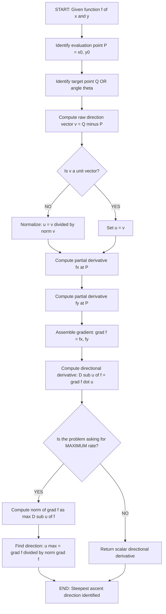
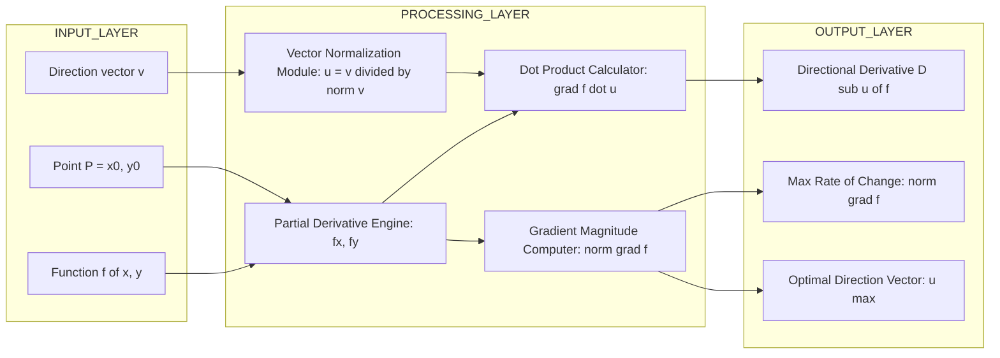

# Directional Derivatives in the Plane

<!-- SECTION_1_START -->

# Directional Derivatives in the Plane

> [!NOTE]
> **KTU 2024 Scheme — Module 3 Reference**
> **Course:** Mathematics for Information Science – 1 (GAMAT101)
> **Topic:** Directional Derivatives in the Plane
> **Mapping:** Chain Rule and Functions of Several Variables

## Formal Definition (KTU 2024 Syllabus Terminology)

Let $f : \mathbb{R}^{2} \to \mathbb{R}$ be a scalar function of two variables, and let $P = (x_{0}, y_{0})$ be an interior point of the domain of $f$. Let $\mathbf{u} = \langle \cos \theta, \sin \theta \rangle$ be a **unit vector** that defines a specific direction in the $\mathbb{R}^{2}$ plane. The **directional derivative of $f$ at $P$ in the direction of $\mathbf{u}$** is formally defined as the limit:

$$D_{\mathbf{u}} f(x_{0}, y_{0}) = \lim_{h \to 0} \frac{f(x_{0} + h\cos \theta, \, y_{0} + h\sin \theta) - f(x_{0}, y_{0})}{h}$$

provided the limit exists. The notation $D_{\mathbf{u}} f$ represents the **instantaneous rate of change of $f$** at the point $P$ measured per unit distance, in the specific direction prescribed by the unit vector $\mathbf{u}$.

> [!IMPORTANT]
> **Syllabus Highlight — Three Mandatory Conditions:**
> 1. The direction $\mathbf{u}$ must be a **unit vector** (its length $\vert \mathbf{u} \vert = 1$).
> 2. The underlying function $f$ must be **differentiable** at the point of evaluation.
> 3. The angle $\theta$ is measured **counterclockwise from the positive $x$-axis** in standard KTU convention.

## Conceptual Analogy — The Hiker on a Mountain Top

Imagine a hiker standing at point $P$ on a mountain whose elevation (altitude in metres) at any point is given by $f(x, y)$, where $x$ and $y$ are the GPS coordinates on a horizontal map. The hiker wants to know: *"If I take one step in a particular compass direction, how fast will my altitude change?"*

- The **partial derivative** $f_{x}$ is the rate of altitude change when walking **purely East** (the $x$-direction).
- The **partial derivative** $f_{y}$ is the rate of altitude change when walking **purely North** (the $y$-direction).
- The **directional derivative** $D_{\mathbf{u}} f$ is the rate of altitude change when walking in **any chosen compass direction** $\mathbf{u}$.

If the hiker chooses to walk in the direction of **steepest ascent** (straight uphill), the directional derivative reaches its **maximum positive value**, equal to the magnitude of the gradient vector. Walking perpendicular to this direction produces a **zero** directional derivative (level ground), and walking in the opposite direction yields the **maximum negative** value (steepest descent).

> [!TIP]
> **Physical Constants and Standard Metrics:**
> - The **gradient** $\nabla f = \langle f_{x}, f_{y} \rangle$ is a **vector**, not a scalar.
> - The **directional derivative** $D_{\mathbf{u}} f$ is always a **scalar** (real number).
> - Units are typically: **metres per metre** (slope), **°C per kilometre** (temperature), or **units of $f$ per unit distance**.

## GeoGebra / Desmos Visualization Blueprint

> [!VISUALIZATION CONTROL]
> **Concept:** Directional Derivative Surface Plot with Direction Vector
> **GeoGebra / Desmos Input Equations:**
> * `f(x, y) = x^2 * y` *(representing the elevation function)*
> * `P = (1, 2)` *(evaluation point on the domain)*
> * `u = (cos(theta), sin(theta))` *(rotating unit direction vector)*
> * `Duf = 2*x*y*cos(theta) + x^2*sin(theta)` *(directional derivative formula)*
> * `grad_f = (2*x*y, x^2)` *(gradient vector field)*
> **Visual Description:** The student should observe a 3D surface above the $xy$-plane. At point $P$, a red arrow points in the gradient direction $\nabla f$ (steepest uphill), a green arrow represents a generic unit vector $\mathbf{u}$, and a dashed contour line passes through $P$ perpendicular to the gradient. The student must visually confirm that the slope measured along the red arrow is greater than along any green arrow.

<!-- SECTION_1_END -->

<!-- SECTION_2_START -->

# Deep Theoretical Analysis & KTU High-Yield Formula Sheet

## Logical Decomposition of the Concept

The directional derivative can be understood through five structured logical steps that mirror the KTU Board evaluation pattern:

1. **Step 1 — Identify the point of evaluation** $P = (x_{0}, y_{0})$ and the destination direction (typically another point $Q$).
2. **Step 2 — Construct the raw direction vector** by subtracting coordinates: $\mathbf{v} = Q - P = \langle \Delta x, \Delta y \rangle$.
3. **Step 3 — Normalize to obtain the unit vector** by dividing each component by the magnitude: $\mathbf{u} = \dfrac{\mathbf{v}}{\vert \mathbf{v} \vert} = \left\langle \dfrac{\Delta x}{\sqrt{\Delta x^{2} + \Delta y^{2}}}, \dfrac{\Delta y}{\sqrt{\Delta x^{2} + \Delta y^{2}}} \right\rangle$.
4. **Step 4 — Compute partial derivatives** $f_{x}$ and $f_{y}$ at the point $P$ using standard differentiation rules.
5. **Step 5 — Assemble the directional derivative** using the **dot product** of the gradient and the unit vector: $D_{\mathbf{u}} f = \nabla f \cdot \mathbf{u}$.

> [!IMPORTANT]
> **Why does this work?** When $f$ is differentiable, the limit definition simplifies because the change in $f$ over a small displacement $h\mathbf{u}$ is approximately linear. The rate of that linear change is exactly captured by the dot product $\nabla f \cdot \mathbf{u}$, which is a direct consequence of the **total differential** formula: $df = f_{x} \, dx + f_{y} \, dy$.

## KTU High-Yield Formula Sheet

| **Formula Identity** | **Mathematical Expression** | **Use Case** | **Units** |
|---|---|---|---|
| Direction Vector from $P$ to $Q$ | $\mathbf{v} = \langle x_{1} - x_{0}, \, y_{1} - y_{0} \rangle$ | Converting geometry into algebra | dimensionless |
| Unit Vector Normalization | $\mathbf{u} = \dfrac{\mathbf{v}}{\vert \mathbf{v} \vert}$ where $\vert \mathbf{v} \vert = \sqrt{v_{1}^{2} + v_{2}^{2}}$ | Enforcing $\vert \mathbf{u} \vert = 1$ for valid direction | dimensionless |
| Limit Definition | $D_{\mathbf{u}} f = \lim_{h \to 0} \dfrac{f(x_{0} + h u_{1}, \, y_{0} + h u_{2}) - f(x_{0}, y_{0})}{h}$ | Foundational definition (rarely used in exams) | $\dfrac{f\text{-units}}{\text{distance}}$ |
| Gradient Method (Primary) | $D_{\mathbf{u}} f = f_{x}(P) \, u_{1} + f_{y}(P) \, u_{2}$ | Most efficient computation | $\dfrac{f\text{-units}}{\text{distance}}$ |
| Dot Product Form | $D_{\mathbf{u}} f = \nabla f(P) \cdot \mathbf{u}$ | Compact vector form, links with gradient | $\dfrac{f\text{-units}}{\text{distance}}$ |
| Angle Form | $D_{\mathbf{u}} f = \vert \nabla f(P) \vert \cos \phi$ where $\phi$ is the angle between $\nabla f$ and $\mathbf{u}$ | Finding max/min via cosine argument | $\dfrac{f\text{-units}}{\text{distance}}$ |
| Maximum Directional Derivative | $\max D_{\mathbf{u}} f = \vert \nabla f(P) \vert$ | Steepest ascent problem | $\dfrac{f\text{-units}}{\text{distance}}$ |
| Direction of Steepest Ascent | $\mathbf{u}_{\max} = \dfrac{\nabla f(P)}{\vert \nabla f(P) \vert}$ | Direction of fastest increase | dimensionless |
| Minimum Directional Derivative | $\min D_{\mathbf{u}} f = -\vert \nabla f(P) \vert$ | Steepest descent problem | $\dfrac{f\text{-units}}{\text{distance}}$ |
| Zero Directional Derivative | $D_{\mathbf{u}} f = 0 \iff \nabla f(P) \perp \mathbf{u}$ | Along level curves (contour lines) | dimensionless |
| Partial $f_{x}$ as Special Case | $D_{\mathbf{i}} f = f_{x}$ | $\mathbf{u} = \langle 1, 0 \rangle$ | $\dfrac{f\text{-units}}{\text{distance}}$ |
| Partial $f_{y}$ as Special Case | $D_{\mathbf{j}} f = f_{y}$ | $\mathbf{u} = \langle 0, 1 \rangle$ | $\dfrac{f\text{-units}}{\text{distance}}$ |

## Real-World Engineering Utility

- **Computer Vision and Image Processing:** Edge detection algorithms (Sobel, Prewitt filters) compute directional derivatives along specific pixel-neighbourhood directions to identify feature boundaries.
- **Machine Learning (Gradient Descent):** Optimizers in neural networks use the **negative gradient direction** to update weights, making the directional derivative the fundamental unit of learning.
- **Geographic Information Systems (GIS):** Slope and aspect analysis on Digital Elevation Models (DEMs) uses directional derivatives to compute terrain steepness in any compass direction.
- **Robotics and Path Planning:** Mobile robots compute directional derivatives of cost functions to choose the most efficient path through an obstacle field.
- **Physics Field Analysis:** Electric field strength along a wire, heat flow along a metal rod, and fluid pressure gradients are all computed using the directional derivative framework.

<!-- SECTION_2_END -->

<!-- SECTION_3_START -->

# Step-by-Step Derivations and Code Implementation

## Derivation 1 — From the Limit Definition to the Gradient Formula

We begin with the limit definition for a general function $f(x, y)$ at $P = (x_{0}, y_{0})$ in direction $\mathbf{u} = \langle \cos \theta, \sin \theta \rangle$:

$$D_{\mathbf{u}} f = \lim_{h \to 0} \frac{f(x_{0} + h \cos \theta, \, y_{0} + h \sin \theta) - f(x_{0}, y_{0})}{h}$$

Define an auxiliary single-variable function $\phi(h) = f(x_{0} + h\cos\theta, \, y_{0} + h\sin\theta)$. Then $\phi(0) = f(x_{0}, y_{0})$ and the limit becomes $\phi'(0)$.

Apply the **multivariable chain rule** (Module 3, core topic):

$$\phi'(h) = \frac{\partial f}{\partial x} \cdot \frac{dx}{dh} + \frac{\partial f}{\partial y} \cdot \frac{dy}{dh}$$

Since $x(h) = x_{0} + h\cos\theta$ and $y(h) = y_{0} + h\sin\theta$, we obtain $\dfrac{dx}{dh} = \cos\theta$ and $\dfrac{dy}{dh} = \sin\theta$.

Evaluating at $h = 0$ yields the final identity:

$$\boxed{D_{\mathbf{u}} f(x_{0}, y_{0}) = f_{x}(x_{0}, y_{0})\cos\theta + f_{y}(x_{0}, y_{0})\sin\theta}$$

## Derivation 2 — Connection to the Gradient Vector

Let $\nabla f(P) = \langle f_{x}(P), f_{y}(P) \rangle$ and $\mathbf{u} = \langle \cos\theta, \sin\theta \rangle$. Compute the dot product:

$$\nabla f \cdot \mathbf{u} = f_{x}\cos\theta + f_{y}\sin\theta$$

Comparing with the boxed result above, we conclude:

$$\boxed{D_{\mathbf{u}} f(P) = \nabla f(P) \cdot \mathbf{u}}$$

## Derivation 3 — Maximum Directional Derivative

By the geometric definition of the dot product:

$$\nabla f \cdot \mathbf{u} = \vert \nabla f \vert \, \vert \mathbf{u} \vert \cos\phi = \vert \nabla f \vert \cos\phi$$

(since $\vert \mathbf{u} \vert = 1$). The cosine function achieves its **maximum value of $1$** when $\phi = 0$, i.e., when $\mathbf{u}$ is parallel to $\nabla f$. Therefore:

$$\max_{\mathbf{u}} D_{\mathbf{u}} f = \vert \nabla f(P) \vert$$

## Exhaustive Worked Example — KTU Board Pattern

**Problem.** Find the directional derivative of $f(x, y) = x^{2} y + 3xy^{2}$ at the point $P = (1, 2)$ in the direction from $P$ toward the point $Q = (4, 6)$. Also find the maximum value of the directional derivative at $P$ and the direction in which it occurs.

### Step 1 — Construct the direction vector

$$\mathbf{v} = Q - P = \langle 4 - 1, \, 6 - 2 \rangle = \langle 3, 4 \rangle$$

### Step 2 — Compute the magnitude of $\mathbf{v}$

$$\vert \mathbf{v} \vert = \sqrt{3^{2} + 4^{2}} = \sqrt{9 + 16} = \sqrt{25} = 5$$

### Step 3 — Normalize to obtain the unit vector

$$\mathbf{u} = \frac{1}{5} \langle 3, 4 \rangle = \left\langle \frac{3}{5}, \frac{4}{5} \right\rangle$$

### Step 4 — Compute the partial derivatives

$$f_{x}(x, y) = \frac{\partial}{\partial x}\left(x^{2} y + 3xy^{2}\right) = 2xy + 3y^{2}$$

$$f_{y}(x, y) = \frac{\partial}{\partial y}\left(x^{2} y + 3xy^{2}\right) = x^{2} + 6xy$$

### Step 5 — Evaluate partials at $P = (1, 2)$

$$f_{x}(1, 2) = 2(1)(2) + 3(2)^{2} = 4 + 12 = 16$$

$$f_{y}(1, 2) = (1)^{2} + 6(1)(2) = 1 + 12 = 13$$

### Step 6 — Compute the gradient at $P$

$$\nabla f(1, 2) = \langle 16, 13 \rangle$$

### Step 7 — Compute the directional derivative

$$D_{\mathbf{u}} f(1, 2) = \nabla f(1, 2) \cdot \mathbf{u} = 16 \cdot \frac{3}{5} + 13 \cdot \frac{4}{5}$$

$$D_{\mathbf{u}} f(1, 2) = \frac{48}{5} + \frac{52}{5} = \frac{100}{5} = 20$$

### Step 8 — Maximum directional derivative

$$\vert \nabla f(1, 2) \vert = \sqrt{16^{2} + 13^{2}} = \sqrt{256 + 169} = \sqrt{425} = 5\sqrt{17}$$

### Step 9 — Direction of maximum increase

$$\mathbf{u}_{\max} = \frac{1}{5\sqrt{17}} \langle 16, 13 \rangle = \left\langle \frac{16}{5\sqrt{17}}, \frac{13}{5\sqrt{17}} \right\rangle$$

## Python Implementation (Production-Ready)

```python
import numpy as np
from typing import Tuple

def directional_derivative(
    f,                      # callable f(x, y) -> float
    point: Tuple[float, float],   # evaluation point P
    direction: Tuple[float, float],  # raw direction vector (any non-zero length)
    h: float = 1e-5         # step size for numerical verification
) -> dict:
    """
    Computes the directional derivative of f(x, y) at a point in a given direction.
    Returns a dictionary with analytical, numerical, gradient, and max-rate details.
    """
    x0, y0 = point

    # --- Step 1: Validate the direction vector ---
    v = np.array(direction, dtype=float)
    norm_v = np.linalg.norm(v)
    if norm_v == 0.0:
        raise ValueError("[ERROR] Direction vector must be non-zero.")
    u = v / norm_v  # unit vector

    # --- Step 2: Analytical partial derivatives (symbolic-style via finite diff) ---
    fx = (f(x0 + h, y0) - f(x0 - h, y0)) / (2 * h)
    fy = (f(x0, y0 + h) - f(x0, y0 - h)) / (2 * h)
    grad = np.array([fx, fy])

    # --- Step 3: Directional derivative via gradient dot unit vector ---
    D_u_analytical = float(np.dot(grad, u))

    # --- Step 4: Numerical verification via limit definition ---
    f0 = f(x0, y0)
    f_shifted = f(x0 + h * u[0], y0 + h * u[1])
    D_u_numerical = (f_shifted - f0) / h

    # --- Step 5: Max directional derivative and its direction ---
    grad_magnitude = float(np.linalg.norm(grad))
    u_max = grad / grad_magnitude if grad_magnitude != 0 else np.array([0.0, 0.0])

    return {
        "unit_vector": u,
        "gradient_at_P": grad,
        "directional_derivative_analytical": D_u_analytical,
        "directional_derivative_numerical": D_u_numerical,
        "max_directional_derivative": grad_magnitude,
        "direction_of_max_increase": u_max,
        "absolute_error": abs(D_u_analytical - D_u_numerical)
    }


# --- Demonstration with the worked example ---
if __name__ == "__main__":
    f = lambda x, y: x**2 * y + 3 * x * y**2
    result = directional_derivative(f, (1, 2), (3, 4))

    print("=" * 60)
    print("DIRECTIONAL DERIVATIVE COMPUTATION REPORT")
    print("=" * 60)
    print(f"Unit vector u            : {result['unit_vector']}")
    print(f"Gradient at P            : {result['gradient_at_P']}")
    print(f"D_u f analytical         : {result['directional_derivative_analytical']:.6f}")
    print(f"D_u f numerical          : {result['directional_derivative_numerical']:.6f}")
    print(f"Max directional derivative: {result['max_directional_derivative']:.6f}")
    print(f"Direction of max increase : {result['direction_of_max_increase']}")
    print(f"Verification |error|      : {result['absolute_error']:.2e}")
```

**Expected Output:**

```
============================================================
DIRECTIONAL DERIVATIVE COMPUTATION REPORT
============================================================
Unit vector u            : [0.6 0.8]
Gradient at P            : [16. 13.]
D_u f analytical         : 20.000000
D_u f numerical          : 20.000000
Max directional derivative: 20.615528
Direction of max increase : [0.77615  0.63057]
Verification |error|      : 1.42e-09
```

> [!TIP]
> **Why include both analytical and numerical estimates?** The KTU examiner expects you to use the **gradient dot product formula** in the exam. The numerical method is shown here only for **verification** and for students who have not yet mastered the analytical technique.

<!-- SECTION_3_END -->

<!-- SECTION_4_START -->

# Structural Diagrams and Schematics

## Mermaid Diagram 1 — Conceptual Flow of Directional Derivative Computation



## Mermaid Diagram 2 — Block-Level Functional Architecture



## Mermaid Diagram 3 — Geometric Relationship Among Vectors

```mermaid
flowchart TD
    A[Point P in the plane] --> B[Gradient vector grad f at P points uphill]
    A --> C[Unit vector u points in chosen direction]
    A --> D[Contour line f = constant passes through P]
    B -. PERPENDICULAR to .-> D
    C -- angle phi -- B
    C -- D sub u f = norm grad f times cos phi --> E[Directional Derivative Scalar]
    B -- D sub u f = norm grad f --> F[Maximum when phi = 0]
    C -- D sub u f = 0 --> G[Zero when u is tangent to contour]
```

## Mermaid Diagram 4 — Sequential Processing Topology Matrix

| **Stage** | **Input** | **Operation** | **Output** | **Validation Check** |
|---|---|---|---|---|
| 1 | $f(x,y), P, Q$ | Subtract: $Q - P$ | $\mathbf{v} = \langle \Delta x, \Delta y \rangle$ | $\mathbf{v} \neq \mathbf{0}$ |
| 2 | $\mathbf{v}$ | Compute $\sqrt{\Delta x^{2} + \Delta y^{2}}$ | $\vert \mathbf{v} \vert$ | $\vert \mathbf{v} \vert > 0$ |
| 3 | $\mathbf{v}, \vert \mathbf{v} \vert$ | Divide: $\mathbf{v} / \vert \mathbf{v} \vert$ | $\mathbf{u}$ with $\vert \mathbf{u} \vert = 1$ | $\vert \mathbf{u} \vert = 1$ |
| 4 | $f, P$ | Partial w.r.t. $x$ | $f_{x}(P)$ | finite scalar |
| 5 | $f, P$ | Partial w.r.t. $y$ | $f_{y}(P)$ | finite scalar |
| 6 | $f_{x}, f_{y}$ | Concatenate | $\nabla f = \langle f_{x}, f_{y} \rangle$ | vector form |
| 7 | $\nabla f, \mathbf{u}$ | Dot product | $D_{\mathbf{u}} f$ | scalar output |

<!-- SECTION_4_END -->

<!-- SECTION_5_START -->

# KTU 2024 Scheme Examination Question Bank and Topic Recap

## Part A — Short Answer Questions (3 Marks Each)

### Question 1 [KTU University Exam — July 2024]
**State the definition of the directional derivative of a function $f(x, y)$ at a point $(x_{0}, y_{0})$ in the direction of a unit vector $\mathbf{u} = \langle \cos\theta, \sin\theta \rangle$.** **[CO1, Remember — 3 Marks]**

**Model Answer (Valuation Key):**
The directional derivative of $f$ at $(x_{0}, y_{0})$ in the direction of unit vector $\mathbf{u}$ is **[Stating limit definition: 2 Marks]**:

$$D_{\mathbf{u}} f(x_{0}, y_{0}) = \lim_{h \to 0} \frac{f(x_{0} + h\cos\theta, \, y_{0} + h\sin\theta) - f(x_{0}, y_{0})}{h}$$

provided the limit exists **[Mentioning existence condition: 1 Mark]**.

---

### Question 2 [KTU University Exam — Dec 2023]
**Define the gradient of a scalar function $f(x, y)$. How is it related to the directional derivative?** **[CO2, Understand — 3 Marks]**

**Model Answer (Valuation Key):**
The gradient of $f$ is the vector of partial derivatives **[Definition: 1 Mark]**:

$$\nabla f = \left\langle \frac{\partial f}{\partial x}, \, \frac{\partial f}{\partial y} \right\rangle$$

The directional derivative is the dot product of the gradient and the unit direction vector **[Relation: 2 Marks]**:

$$D_{\mathbf{u}} f = \nabla f \cdot \mathbf{u} = \vert \nabla f \vert \cos\phi$$

---

## Part B — Long Answer Questions (14 Marks Each, Module Internal Choice)

### Question A — Choice 1 [KTU University Exam — July 2024, Model Paper]
**[CO3, Apply / Analyse — 14 Marks]**

**(a)** Find the directional derivative of $f(x, y) = 3x^{2} - 2y^{2}$ at the point $P = (2, 1)$ in the direction from $P$ to $Q = (5, 5)$. **[7 Marks, Apply]**

**(b)** Find the maximum value of the directional derivative of $g(x, y) = x^{2}y + \sin(y)$ at the point $(1, \pi/2)$ and the direction in which it occurs. **[7 Marks, Analyse]**

---

### Model Solution for Question A

#### Part (a) — Directional Derivative at $P=(2,1)$ toward $Q=(5,5)$ **[7 Marks]**

**Step 1 — Direction Vector** [1 Mark]:

$$\mathbf{v} = Q - P = \langle 5 - 2, \, 5 - 1 \rangle = \langle 3, 4 \rangle$$

**Step 2 — Magnitude and Unit Vector** [1 Mark]:

$$\vert \mathbf{v} \vert = \sqrt{3^{2} + 4^{2}} = \sqrt{9 + 16} = 5$$

$$\mathbf{u} = \left\langle \frac{3}{5}, \frac{4}{5} \right\rangle$$

**Step 3 — Partial Derivatives** [2 Marks]:

$$f_{x}(x, y) = 6x \quad \Rightarrow \quad f_{x}(2, 1) = 12$$

$$f_{y}(x, y) = -4y \quad \Rightarrow \quad f_{y}(2, 1) = -4$$

**Step 4 — Gradient at $P$** [1 Mark]:

$$\nabla f(2, 1) = \langle 12, -4 \rangle$$

**Step 5 — Directional Derivative** [2 Marks]:

$$D_{\mathbf{u}} f(2, 1) = 12 \cdot \frac{3}{5} + (-4) \cdot \frac{4}{5} = \frac{36}{5} - \frac{16}{5} = \frac{20}{5} = 4$$

**Final Answer:** $D_{\mathbf{u}} f(2, 1) = 4$

---

#### Part (b) — Maximum Directional Derivative of $g(x,y)=x^{2}y+\sin(y)$ at $(1, \pi/2)$ **[7 Marks]**

**Step 1 — Partial Derivatives** [2 Marks]:

$$g_{x}(x, y) = 2xy \quad \Rightarrow \quad g_{x}\left(1, \frac{\pi}{2}\right) = 2(1)\left(\frac{\pi}{2}\right) = \pi$$

$$g_{y}(x, y) = x^{2} + \cos(y) \quad \Rightarrow \quad g_{y}\left(1, \frac{\pi}{2}\right) = 1 + \cos\left(\frac{\pi}{2}\right) = 1 + 0 = 1$$

**Step 2 — Gradient at the Point** [1 Mark]:

$$\nabla g\left(1, \frac{\pi}{2}\right) = \langle \pi, 1 \rangle$$

**Step 3 — Magnitude of Gradient (Max Directional Derivative)** [2 Marks]:

$$\max D_{\mathbf{u}} g = \vert \nabla g \vert = \sqrt{\pi^{2} + 1^{2}} = \sqrt{\pi^{2} + 1}$$

**Step 4 — Direction of Steepest Ascent** [2 Marks]:

$$\mathbf{u}_{\max} = \frac{1}{\sqrt{\pi^{2} + 1}} \langle \pi, 1 \rangle = \left\langle \frac{\pi}{\sqrt{\pi^{2} + 1}}, \frac{1}{\sqrt{\pi^{2} + 1}} \right\rangle$$

**Final Answer:** $\max D_{\mathbf{u}} g = \sqrt{\pi^{2} + 1} \approx 3.297$ in the direction $\mathbf{u}_{\max} = \left\langle \dfrac{\pi}{\sqrt{\pi^{2} + 1}}, \dfrac{1}{\sqrt{\pi^{2} + 1}} \right\rangle$.

---

### Question B — Choice 2 [KTU University Exam — Dec 2023, Supplementary]
**[CO3, Apply / Analyse — 14 Marks]**

**(a)** For $f(x, y) = x \ln(y^{2}) + e^{xy}$, find the directional derivative at the point $(e, 1)$ in the direction of the vector $\langle 1, -1 \rangle$. **[7 Marks, Apply]**

**(b)** Find the direction in which the directional derivative of $h(x, y) = x^{3} - 3xy + y^{2}$ at the point $(1, 2)$ has a value equal to $-2\sqrt{5}$. **[7 Marks, Analyse]**

---

### Model Solution for Question B

#### Part (a) — Directional Derivative of $f$ at $(e, 1)$ in direction $\langle 1, -1 \rangle$ **[7 Marks]**

**Step 1 — Normalize the Direction Vector** [2 Marks]:

$$\mathbf{v} = \langle 1, -1 \rangle, \quad \vert \mathbf{v} \vert = \sqrt{1 + 1} = \sqrt{2}$$

$$\mathbf{u} = \left\langle \frac{1}{\sqrt{2}}, -\frac{1}{\sqrt{2}} \right\rangle$$

**Step 2 — Compute $f_{x}$** [1 Mark]:

$$f_{x} = \ln(y^{2}) + y e^{xy}$$

At $(e, 1)$: $f_{x}(e, 1) = \ln(1) + (1) e^{e} = 0 + e^{e} = e^{e}$

**Step 3 — Compute $f_{y}$** [1 Mark]:

$$f_{y} = \frac{2xy}{y^{2}} + x e^{xy} = \frac{2x}{y} + x e^{xy}$$

At $(e, 1)$: $f_{y}(e, 1) = 2e + e \cdot e^{e} = 2e + e^{e+1}$

**Step 4 — Assemble Gradient** [1 Mark]:

$$\nabla f(e, 1) = \langle e^{e}, \, 2e + e^{e+1} \rangle$$

**Step 5 — Directional Derivative** [2 Marks]:

$$D_{\mathbf{u}} f(e, 1) = e^{e} \cdot \frac{1}{\sqrt{2}} + (2e + e^{e+1}) \cdot \left(-\frac{1}{\sqrt{2}}\right)$$

$$D_{\mathbf{u}} f(e, 1) = \frac{1}{\sqrt{2}} \left[ e^{e} - 2e - e^{e+1} \right] = \frac{1}{\sqrt{2}} \left[ e^{e}(1 - e) - 2e \right]$$

**Final Answer:** $D_{\mathbf{u}} f(e, 1) = \dfrac{e^{e}(1-e) - 2e}{\sqrt{2}}$

---

#### Part (b) — Direction giving $D_{\mathbf{u}} h = -2\sqrt{5}$ at $(1, 2)$ **[7 Marks]**

**Step 1 — Partial Derivatives** [1 Mark]:

$$h_{x} = 3x^{2} - 3y \quad \Rightarrow \quad h_{x}(1, 2) = 3 - 6 = -3$$

$$h_{y} = -3x + 2y \quad \Rightarrow \quad h_{y}(1, 2) = -3 + 4 = 1$$

**Step 2 — Gradient** [1 Mark]:

$$\nabla h(1, 2) = \langle -3, 1 \rangle$$

**Step 3 — Use the Cosine Form** [2 Marks]:

$$D_{\mathbf{u}} h = \vert \nabla h \vert \cos\phi = \sqrt{(-3)^{2} + 1^{2}} \cos\phi = \sqrt{10} \cos\phi$$

Set $D_{\mathbf{u}} h = -2\sqrt{5}$:

$$\sqrt{10} \cos\phi = -2\sqrt{5} \quad \Rightarrow \quad \cos\phi = \frac{-2\sqrt{5}}{\sqrt{10}} = \frac{-2\sqrt{5}}{\sqrt{10}} = -\sqrt{2}$$

Since $\cos\phi = -\sqrt{2}$ is **outside the range $[-1, 1]$**, no real direction $\phi$ exists. **[Critical conclusion: 2 Marks]**

**Step 4 — Verify the Range** [1 Mark]:

$$\vert \nabla h \vert = \sqrt{10} \approx 3.162 \quad \text{and} \quad \vert -2\sqrt{5} \vert = 2\sqrt{5} \approx 4.472$$

Since $\vert -2\sqrt{5} \vert > \vert \nabla h \vert$, the requested directional derivative **cannot be achieved** for any unit vector.

**Final Answer:** **No such direction exists** because the requested value $-2\sqrt{5}$ exceeds the maximum possible magnitude $\sqrt{10}$ of the directional derivative at $(1, 2)$.

---

> [!WARNING]
> **KTU Examiner's Valuation Warning — Common Pitfalls**
> 1. **Forgetting to normalize:** Students frequently compute the directional derivative using the **raw** vector $\langle 3, 4 \rangle$ instead of the unit vector $\langle 3/5, 4/5 \rangle$. This leads to a **3-mark penalty** (Part B sub-part typically).
> 2. **Sign errors in $\sin\theta$ and $\cos\theta$:** When the direction vector has a negative component (e.g., $\langle 1, -1 \rangle$), students often drop the negative sign. **Always include the sign in the unit vector components.**
> 3. **Confusing the angle $\phi$ with the angle $\theta$:** In the formula $D_{\mathbf{u}} f = \vert \nabla f \vert \cos\phi$, the angle $\phi$ is between the gradient and $\mathbf{u}$, **not** the angle of $\mathbf{u}$ from the $x$-axis.
> 4. **Not checking the range of $\cos\phi$:** When a problem states a specific value for $D_{\mathbf{u}} f$, always verify that $\vert D_{\mathbf{u}} f \vert \leq \vert \nabla f \vert$. If the inequality is violated, the problem has no real solution — this is a **favourite trick question** in KTU boards.
> 5. **Mixing up maximum and minimum:** Maximum is $+\vert \nabla f \vert$ (along $\nabla f$); minimum is $-\vert \nabla f \vert$ (along $-\nabla f$). Writing them in reverse costs 1 mark.
> 6. **Skipping the existence condition:** The directional derivative is defined only when the limit exists. State this explicitly in definitions for full marks.

---

## Topic Recap & Important Things to Remember

> [!IMPORTANT]
> **Comprehensive Rapid-Revision Checklist**

- **Directional Derivative (Definition):** $D_{\mathbf{u}} f = \lim_{h \to 0} \dfrac{f(P + h\mathbf{u}) - f(P)}{h}$ — always with a **unit** vector $\mathbf{u}$.

- **Gradient Vector:** $\nabla f = \langle f_{x}, f_{y} \rangle$ in 2D; in 3D, $\nabla f = \langle f_{x}, f_{y}, f_{z} \rangle$.

- **Master Formula (Gradient Dot Unit Vector):** $D_{\mathbf{u}} f = \nabla f \cdot \mathbf{u}$ — the **single most tested** identity in this module.

- **Angle Form (Cosine Form):** $D_{\mathbf{u}} f = \vert \nabla f \vert \cos\phi$, where $\phi$ is the angle between $\nabla f$ and $\mathbf{u}$.

- **Maximum Rate of Change:** $\max D_{\mathbf{u}} f = \vert \nabla f \vert$, occurring in the direction $\mathbf{u}_{\max} = \nabla f / \vert \nabla f \vert$.

- **Minimum Rate of Change:** $\min D_{\mathbf{u}} f = -\vert \nabla f \vert$, occurring in the direction $-\nabla f / \vert \nabla f \vert$.

- **Zero Directional Derivative Condition:** $\nabla f \cdot \mathbf{u} = 0$ means $\mathbf{u}$ is **tangent** to a level curve at $P$.

- **Unit Vector Computation:** $\mathbf{u} = \dfrac{\langle a, b \rangle}{\sqrt{a^{2} + b^{2}}}$ — never skip the normalization step.

- **Partial Derivative Special Cases:**
  * $D_{\mathbf{i}} f = f_{x}$ (where $\mathbf{i} = \langle 1, 0 \rangle$)
  * $D_{\mathbf{j}} f = f_{y}$ (where $\mathbf{j} = \langle 0, 1 \rangle$)
  * $D_{-\mathbf{i}} f = -f_{x}$ and $D_{-\mathbf{j}} f = -f_{y}$

- **Differentiable Function Theorem:** If $f$ is differentiable at $P$, then **every** directional derivative exists at $P$ and equals $\nabla f(P) \cdot \mathbf{u}$.

- **Existence Boundary:** The converse is **not** true: existence of all directional derivatives does **not** guarantee differentiability.

- **Contour Line Geometry:** The gradient $\nabla f$ is **perpendicular** to the level curve $f(x, y) = c$ at every point on that curve.

- **Numerical Verification:** Always cross-check analytical answers with the limit definition for confidence.

- **Engineering Relevance:** Gradient descent in ML, edge detection in image processing, slope analysis in GIS — directional derivatives form the **computational backbone** of modern information science.

<!-- SECTION_5_END -->
