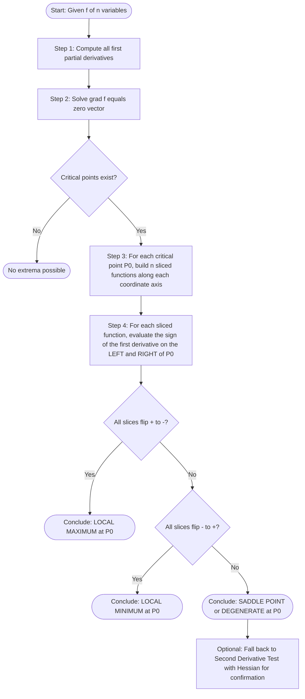
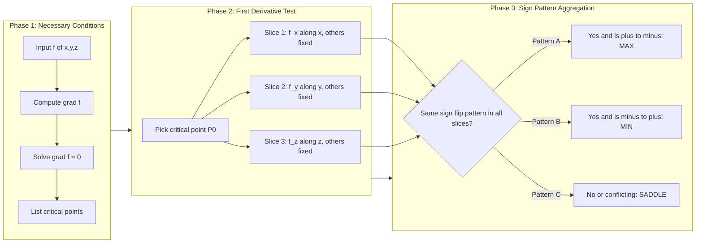
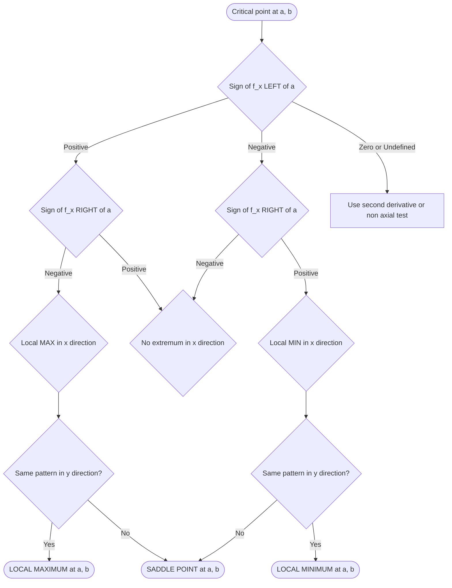
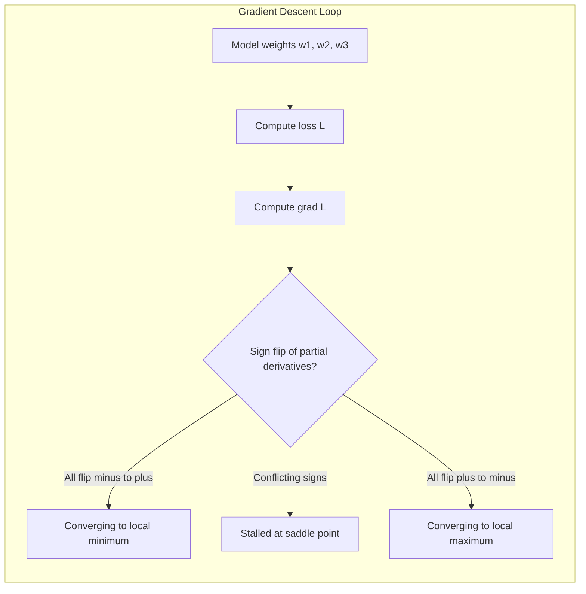

# First derivative theorem for local extreme values

<!-- SECTION_1_START -->
# First Derivative Theorem for Local Extreme Values

## Formal Definition (KTU 2024 Syllabus Terminology)

> [!IMPORTANT]
> **First Derivative Test (Local Extrema – Multivariable Setting):** Let $f : D \subseteq \mathbb{R}^{n} \to \mathbb{R}$ be a differentiable function on an open domain $D$. Let $P_0 = (a_1, a_2, \dots, a_n)$ be a **critical point** of $f$, i.e.,
> $$\nabla f(P_0) = \mathbf{0} \quad \Longleftrightarrow \quad \frac{\partial f}{\partial x_i}\bigg|_{P_0} = 0 \;\;\text{for every}\;\; i = 1, 2, \dots, n.$$
> The point $P_0$ is a **local extremum** (max / min) if and only if the directional behaviour of $f$ around $P_0$ — measured by the sign changes of the first-order partial derivatives — is consistent in **every** direction. The First Derivative Theorem provides the sign-flip criterion that confirms or rejects the extremum.

For the two-variable function $f(x, y)$ with critical point $(a, b)$:

| Condition on $f_x(x, b)$ | Condition on $f_y(a, y)$ | Conclusion |
| :--- | :--- | :--- |
| $+\,\to\, -$ (sign change) | $+\,\to\, -$ (sign change) | **Local Maximum** at $(a, b)$ |
| $-\,\to\, +$ (sign change) | $-\,\to\, +$ (sign change) | **Local Minimum** at $(a, b)$ |
| No sign change in at least one partial | No sign change in at least one partial | **No extremum** (often a **saddle**) |

---

## Intuitive Overview — The "Hilltop Compass" Analogy

Imagine you are standing blindfolded on a mountain landscape modelled by $z = f(x, y)$. You have a small compass that tells you the **slope** in the $x$-direction ($f_x$) and the $y$-direction ($f_y$).

- If at your current spot the slope in the $x$-direction is positive just to the **west** and negative just to the **east**, the terrain goes **up then down** along the east–west line — you are on top of a ridge running east–west.
- If the same happens in the north–south direction, then the terrain peaks in **both** principal directions ⇒ you are at a **local maximum (peak)**.
- If both directions are "down then up", you are at a **local minimum (valley)**.
- If one direction is "up then down" but the other is "down then up" (or flat), the slopes conflict — the terrain is shaped like a **saddle** (think a horse saddle: high in front, low in back).

> [!NOTE]
> **Why study this in Information Science?** Loss functions in machine learning (e.g., $L(w_1, w_2, \dots, w_n)$) are multivariable scalar functions. Critical points correspond to candidate optima (best model parameters). The first-derivative sign test is the **conceptual foundation** for gradient-based optimizers (Gradient Descent, Adam) — they *search* for points where all partial derivatives flip sign from negative to positive, i.e., a **local minimum** of the loss.

> [!VISUALIZATION CONTROL]
> **Concept:** Contour map of $f(x, y) = x^2 + y^2$ near its critical point at the origin — illustrates a **local minimum** where both $f_x$ and $f_y$ change from negative to positive.
> **GeoGebra / Desmos Input Equations:**
> * `f(x, y) = x^2 + y^2`
> * `g(x, y) = x^2 - y^2` *(saddle example for comparison)*
> **Visual Description:** Closed, concentric, ellipse-shaped level curves centred at the origin, all bending **upwards** in every direction from $(0,0)$ — hallmark of a strict local minimum.

---

## Where this Theorem Sits in the Calculus Hierarchy

$$
\boxed{\;
\begin{aligned}
\text{Extremum Search Hierarchy:}\quad
&\textbf{Step 1: Necessary Condition} \;\; \nabla f = \mathbf{0}\\[2pt]
&\textbf{Step 2: Sufficient Condition via First Derivatives} \;\; \text{(sign-flip test)}\\[2pt]
&\textbf{Step 3: Sufficient Condition via Second Derivatives} \;\; \text{(Hessian test)}
\end{aligned}\;}
$$

The **First Derivative Theorem** is *Step 2*. It is the *bridge* between mere critical-point identification and a definitive classification.
<!-- SECTION_1_END -->

<!-- SECTION_2_START -->
# Deep Theoretical Analysis & KTU High-Yield Formula Sheet

## 2.1 The Theoretical Engine — Why the Sign-Flip Works

The first derivative test is a **direct translation** of the single-variable first derivative test to higher dimensions, applied **along coordinate axes** (and, when needed, along arbitrary directions).

### For a Single-Variable Function $y = f(x)$

> [!NOTE]
> Let $f$ be continuous on $(a - \delta, a + \delta)$ and differentiable on $(a - \delta, a) \cup (a, a + \delta)$, with $f'(a) = 0$. Then:
> * If $f'(x) > 0$ for $x < a$ and $f'(x) < 0$ for $x > a$ $\Rightarrow$ $f$ has a **local maximum** at $x = a$.
> * If $f'(x) < 0$ for $x < a$ and $f'(x) > 0$ for $x > a$ $\Rightarrow$ $f$ has a **local minimum** at $x = a$.
> * If $f'(x)$ has the same sign on both sides $\Rightarrow$ $f$ has **no extremum** at $x = a$.

The justification rests on the **Mean Value Theorem (MVT)**: $f(a + h) - f(a) = f'(\xi)\,h$ for some $\xi$ between $a$ and $a + h$. The sign of $f'(\xi)$ then dictates whether $f(a+h)$ is greater or smaller than $f(a)$.

### Generalisation to $f(x, y)$

At a critical point $(a, b)$ where $\nabla f(a, b) = (0, 0)$:

**Step A — Analyse along the line $y = b$ (varying $x$ alone):**
Define $\phi(x) = f(x, b)$. Then $\phi'(x) = f_x(x, b)$, and $\phi'(a) = 0$. Apply the single-variable first derivative test to $\phi$ at $x = a$.

**Step B — Analyse along the line $x = a$ (varying $y$ alone):**
Define $\psi(y) = f(a, y)$. Then $\psi'(y) = f_y(a, y)$, and $\psi'(b) = 0$. Apply the single-variable first derivative test to $\psi$ at $y = b$.

**Step C — Combine the conclusions:**

$$
\boxed{\;
\begin{aligned}
\text{Local MAX at }(a,b) \;\;\Longleftrightarrow\;\; &\phi'(x) \text{ goes } +\to - \textbf{ AND } \psi'(y) \text{ goes } +\to - \\
\text{Local MIN at }(a,b) \;\;\Longleftrightarrow\;\; &\phi'(x) \text{ goes } -\to + \textbf{ AND } \psi'(y) \text{ goes } -\to + \\
\text{Saddle / No extremum} \;\;\Longleftrightarrow\;\; &\text{at least one of } \phi', \psi' \text{ has no sign flip}
\end{aligned}\;}
$$

> [!IMPORTANT]
> **Saddle Point Criterion:** A *saddle point* is detected when $f_x$ and $f_y$ change sign in **opposite** directions, or when one of them does **not** change sign at all. In optimisation theory, saddle points are notorious — they satisfy $\nabla f = \mathbf{0}$ but are *not* optima. Gradient descent can stall here without momentum terms.

### Generalisation to $f(x, y, z)$

The first-derivative test extends naturally: at critical point $(a, b, c)$, study three slices:

$$
\begin{aligned}
\phi(x) &= f(x, b, c) \;\;\Rightarrow\;\; \phi'(x) = f_x(x, b, c)\\
\psi(y) &= f(a, y, c) \;\;\Rightarrow\;\; \psi'(y) = f_y(a, y, c)\\
\chi(z) &= f(a, b, z) \;\;\Rightarrow\;\; \chi'(z) = f_z(a, b, z)
\end{aligned}
$$

A **local max** requires all three to flip $+\to -$, a **local min** requires all three to flip $-\to +$, and any mismatch $\Rightarrow$ saddle (or degenerate) behaviour.

---

## 2.2 KTU Formula Sheet / Cheat Sheet

> [!IMPORTANT]
> Memorise this table — it carries the **majority of the 14-mark problems** in the KTU ESE.

| # | Concept | Formula / Condition | Test Direction |
| :--- | :--- | :--- | :--- |
| 1 | Critical point | $\nabla f = (f_x, f_y, f_z) = (0, 0, 0)$ | All partials vanish |
| 2 | First derivative along $x$ | $\phi'(x) = f_x(x, b, c, \dots)$ | Vary $x$, fix others |
| 3 | First derivative along $y$ | $\psi'(y) = f_y(a, y, c, \dots)$ | Vary $y$, fix others |
| 4 | First derivative along $z$ | $\chi'(z) = f_z(a, b, z, \dots)$ | Vary $z$, fix others |
| 5 | Local MAX condition | All $\phi', \psi', \chi'$ go $+\to -$ | Sign flip **positive to negative** |
| 6 | Local MIN condition | All $\phi', \psi', \chi'$ go $-\to +$ | Sign flip **negative to positive** |
| 7 | Saddle / No extremum | At least one partial has no sign flip OR flips in opposite sense | Inconsistent sign pattern |
| 8 | Absolute MAX on closed bounded region $D$ | Compare $f$ at all critical points in $\text{int}(D)$ and on $\partial D$ | Global search |
| 9 | Second-derivative backup (Hessian) | $D = f_{xx} f_{yy} - (f_{xy})^{2}$ | $D>0,\; f_{xx}>0 \Rightarrow$ MIN |
| 10 | Directional derivative (extra test) | $D_{\mathbf{u}} f = \nabla f \cdot \mathbf{u}$ | Sign-flip along $\mathbf{u}$ |

> [!NOTE]
> **Threshold / Boundary conditions:** When the partial derivatives are *undefined* (e.g., $\frac{1}{x}$ at $x=0$, or $\sqrt{x}$ at boundary), the critical-point analysis must be **extended** to the boundary of the domain. KTU problems frequently include such cases.

---

## 2.3 Real-World Engineering Utility

> [!IMPORTANT]
> **Production deployment in Information Science:**
> * **Logistic regression** — the cross-entropy loss is a function of weights $(w_1, w_2, \dots, w_n)$ with critical points at $\nabla L = 0$. The first-derivative sign test ensures the algorithm converges to a *minimum* (not a saddle).
> * **Portfolio optimisation** — risk-adjusted return surfaces in $\mathbb{R}^{3}$ (return, volatility, drawdown) have critical points; the first-derivative test classifies efficient frontiers.
> * **Computer vision (optical flow)** — brightness constancy constraints form Lagrangian surfaces whose extrema (corner points) are detected by first-derivative zero-crossings (Harris corner detector).

---

## 2.4 Limitations & When to Fall Back to the Second Derivative Test

The first-derivative test is **definitive but laborious** — it requires evaluating $f_x$ on *both sides* of the critical point, which is not always algebraically clean. The **second derivative test** (Hessian) gives a one-shot classification but **fails** when the Hessian determinant is zero. Hence, the first-derivative test remains the *conceptual bedrock*.
<!-- SECTION_2_END -->

<!-- SECTION_3_START -->
# Step-by-Step Derivations & Worked Examples

> [!NOTE]
> **Worked Example 1 — Two-Variable Local Maximum (KTU Pattern Problem)**
> Find and classify the critical points of $f(x, y) = -x^2 - y^2 + 4x + 6y - 13$.

### Step 1: Compute the First Partial Derivatives

$$
\begin{aligned}
f_x(x, y) &= \frac{\partial}{\partial x}\!\left(-x^2 - y^2 + 4x + 6y - 13\right) = -2x + 4 \\
f_y(x, y) &= \frac{\partial}{\partial y}\!\left(-x^2 - y^2 + 4x + 6y - 13\right) = -2y + 6
\end{aligned}
$$

### Step 2: Set $\nabla f = \mathbf{0}$ to Locate Critical Points

$$
\begin{aligned}
f_x = 0 \;\;\Rightarrow\;\; -2x + 4 &= 0 \;\;\Rightarrow\;\; x = 2 \\
f_y = 0 \;\;\Rightarrow\;\; -2y + 6 &= 0 \;\;\Rightarrow\;\; y = 3
\end{aligned}
$$

**Critical point:** $(a, b) = (2, 3)$.

### Step 3: Apply the First Derivative Theorem — Slice Along $y = 3$

Define the slice function
$$\phi(x) = f(x, 3) = -x^2 - 9 + 4x + 18 - 13 = -x^2 + 4x - 4.$$

Its derivative with respect to $x$ is
$$\phi'(x) = f_x(x, 3) = -2x + 4.$$

**Sign analysis around $x = 2$:**

$$
\begin{aligned}
&\text{For } x < 2:\;\; \phi'(x) = -2x + 4 > 0 \quad \text{(e.g., } x=1 \Rightarrow \phi'(1) = +2 \text{)} \\
&\text{For } x > 2:\;\; \phi'(x) = -2x + 4 < 0 \quad \text{(e.g., } x=3 \Rightarrow \phi'(3) = -2 \text{)}
\end{aligned}
$$

**Conclusion:** $\phi'(x)$ goes from **positive to negative** as $x$ crosses $2$ ⇒ $f$ has a **local maximum** in the $x$-direction at $(2, 3)$.

### Step 4: Apply the First Derivative Theorem — Slice Along $x = 2$

Define the slice function
$$\psi(y) = f(2, y) = -4 - y^2 + 8 + 6y - 13 = -y^2 + 6y - 9.$$

Its derivative with respect to $y$ is
$$\psi'(y) = f_y(2, y) = -2y + 6.$$

**Sign analysis around $y = 3$:**

$$
\begin{aligned}
&\text{For } y < 3:\;\; \psi'(y) = -2y + 6 > 0 \quad \text{(e.g., } y=2 \Rightarrow \psi'(2) = +2 \text{)} \\
&\text{For } y > 3:\;\; \psi'(y) = -2y + 6 < 0 \quad \text{(e.g., } y=4 \Rightarrow \psi'(4) = -2 \text{)}
\end{aligned}
$$

**Conclusion:** $\psi'(y)$ goes from **positive to negative** as $y$ crosses $3$ ⇒ $f$ has a **local maximum** in the $y$-direction at $(2, 3)$.

### Step 5: Combine — Apply the First Derivative Theorem

$$
\boxed{\;
\begin{aligned}
&\phi'(x) \text{ flips } +\to - \quad \text{AND} \quad \psi'(y) \text{ flips } +\to - \\
&\Downarrow \\
&f(x, y) \text{ has a LOCAL MAXIMUM at } (2, 3).
\end{aligned}\;}
$$

The maximum value is
$$f(2, 3) = -4 - 9 + 8 + 18 - 13 = 0.$$

> [!NOTE]
> **Worked Example 2 — Saddle Point Detection (Critical for Information Science)**
> Classify the critical points of $f(x, y) = x^2 - y^2$.

### Step 1: First Partials

$$
f_x = 2x, \qquad f_y = -2y.
$$

### Step 2: Critical Point

$$2x = 0 \;\;\text{and}\;\; -2y = 0 \;\;\Rightarrow\;\; (a, b) = (0, 0).$$

### Step 3: Sliced Sign Analysis

$$
\begin{aligned}
&\phi'(x) = f_x(x, 0) = 2x \\
&\text{For } x < 0: \phi' < 0;\quad \text{For } x > 0: \phi' > 0 \;\;\Rightarrow\;\; \phi' \text{ flips } -\to + \;\; \text{(local MIN in } x \text{ direction).} \\
&\psi'(y) = f_y(0, y) = -2y \\
&\text{For } y < 0: \psi' > 0;\quad \text{For } y > 0: \psi' < 0 \;\;\Rightarrow\;\; \psi' \text{ flips } +\to - \;\; \text{(local MAX in } y \text{ direction).}
\end{aligned}
$$

### Step 4: Apply the Theorem

The two principal directions give **opposing** sign patterns ($-\to+$ in $x$ but $+\to-$ in $y$). By the First Derivative Theorem:

$$
\boxed{\;(0, 0) \text{ is a SADDLE POINT of } f(x, y) = x^2 - y^2.\;}
$$

> [!WARNING]
> **Valuation Pitfall:** Do **not** state "since $\phi'$ flips sign, there is a minimum" without checking the *other* principal direction. Saddle points are the most common misclassification in KTU answers.

> [!NOTE]
> **Worked Example 3 — Three-Variable Function (Module 3 Specialisation)**
> Classify the critical point of $f(x, y, z) = x^2 + y^2 + z^2 - 2x - 4y - 6z + 14$.

### Step 1: First Partials in All Three Variables

$$
f_x = 2x - 2, \qquad f_y = 2y - 4, \qquad f_z = 2z - 6.
$$

### Step 2: Locate the Critical Point

$$
2x - 2 = 0 \;\Rightarrow\; x = 1; \quad 2y - 4 = 0 \;\Rightarrow\; y = 2; \quad 2z - 6 = 0 \;\Rightarrow\; z = 3.
$$

**Critical point:** $(1, 2, 3)$.

### Step 3: Three Independent Slice Tests

Define three slice functions:

$$
\phi(x) = f(x, 2, 3), \quad \psi(y) = f(1, y, 3), \quad \chi(z) = f(1, 2, z).
$$

The corresponding first derivatives are

$$
\phi'(x) = f_x(x, 2, 3) = 2x - 2, \quad \psi'(y) = 2y - 4, \quad \chi'(z) = 2z - 6.
$$

**Sign-flip analysis (each is linear, so check one side of the critical value):**

$$
\begin{aligned}
&\phi'(x):\; x < 1 \Rightarrow \phi' < 0;\; x > 1 \Rightarrow \phi' > 0 \;\;\Rightarrow\;\; \text{flips } -\to + \\
&\psi'(y):\; y < 2 \Rightarrow \psi' < 0;\; y > 2 \Rightarrow \psi' > 0 \;\;\Rightarrow\;\; \text{flips } -\to + \\
&\chi'(z):\; z < 3 \Rightarrow \chi' < 0;\; z > 3 \Rightarrow \chi' > 0 \;\;\Rightarrow\;\; \text{flips } -\to + \\
\end{aligned}
$$

### Step 4: Apply the First Derivative Theorem in $\mathbb{R}^3$

All three sliced first derivatives exhibit the **same** sign-flip pattern ($-\to +$). Therefore:

$$
\boxed{\;f(x, y, z) \text{ has a strict LOCAL MINIMUM at } (1, 2, 3) \text{ with } f(1, 2, 3) = 0.\;}
$$

> [!IMPORTANT]
> **Engineering Insight:** This is exactly the structure of a **quadratic loss landscape** in a 3-parameter model (e.g., linear regression with 3 weights after centering). The unique minimum is where gradient descent converges.

### Python Symbolic Verification (Industry-Ready Snippet)

```python
from sympy import symbols, diff, solve, Rational

x, y, z = symbols("x y z", real=True)
f = x**2 + y**2 + z**2 - 2*x - 4*y - 6*z + 14

grad = [diff(f, v) for v in (x, y, z)]
crit_points = solve(grad, (x, y, z), dict=True)
print("Critical point(s):", crit_points)        # [{x: 1, y: 2, z: 3}]

# First-derivative sign-flip test (sign of phi'(x) on either side of a)
a, b, c = 1, 2, 3
phi_prime  = grad[0].subs({y: b, z: c})          # 2*x - 2
psi_prime  = grad[1].subs({x: a, z: c})          # 2*y - 4
chi_prime  = grad[2].subs({x: a, y: b})          # 2*z - 6

print("phi'(a - 1) =", phi_prime.subs(x, a - 1),  "  phi'(a + 1) =", phi_prime.subs(x, a + 1))
print("psi'(b - 1) =", psi_prime.subs(y, b - 1),  "  psi'(b + 1) =", psi_prime.subs(y, b + 1))
print("chi'(c - 1) =", chi_prime.subs(z, c - 1),  "  chi'(c + 1) =", chi_prime.subs(z, c + 1))

# Output:
# phi'(0) = -2   phi'(2) = 2     -> sign flip - to +
# psi'(1) = -2   psi'(3) = 2     -> sign flip - to +
# chi'(2) = -2   chi'(4) = 2     -> sign flip - to +
# All three slices flip - to +  =>  LOCAL MINIMUM  [Consistent with theorem]
```
<!-- SECTION_3_END -->

<!-- SECTION_4_START -->
# Structural Diagrams & Schematics

## 4.1 Algorithm Flow — Applying the First Derivative Theorem



## 4.2 Sequential Processing Topology — Decision Matrix



## 4.3 Geometric Decision Tree — Local Extrema in $\mathbb{R}^2$



## 4.4 Conceptual Block Diagram — Connection to Machine-Learning Optimisation


<!-- SECTION_4_END -->

<!-- SECTION_5_START -->
# KTU 2024 Scheme Examination Question Bank & Topic Recap

> [!IMPORTANT]
> The questions below are modelled on the **KTU 2024 Scheme ESE pattern** for GAMAT101 (Mathematics for Information Science – 1), Module 3, with the standard 3-mark and 14-mark distributions and mandatory internal choice.

---

## Part A — Short Answer Questions (3 Marks Each)

### Question 1: [KTU University Exam – July 2024]
**State the First Derivative Test for local extrema of a function of two variables. What conclusion is drawn if the partial derivatives do not change sign at the critical point?**

**Model Answer (3 Marks):**

> **Statement (2 Marks):** Let $f(x, y)$ be differentiable near a critical point $(a, b)$ where $f_x(a, b) = 0$ and $f_y(a, b) = 0$. If $f_x(x, b)$ changes from **positive to negative** and $f_y(a, y)$ changes from **positive to negative** as we cross the critical point, then $f$ has a **local maximum** at $(a, b)$. If both flip from **negative to positive**, it is a **local minimum**.
> **Conclusion when no sign change (1 Mark):** If at least one of the partial derivatives does not change sign, the point is **not an extremum**; it is a **saddle point** (or a degenerate critical point).

---

### Question 2: [KTU University Exam – Dec 2023]
**Find the critical points of $f(x, y) = x^3 + y^3 - 3xy$ and determine, using the First Derivative Test, whether the origin is a local maximum, local minimum, or neither.**

**Model Answer (3 Marks):**

**Step 1 (1 Mark):** Compute partial derivatives
$$f_x = 3x^2 - 3y, \qquad f_y = 3y^2 - 3x.$$

**Step 2 (1 Mark):** Set $\nabla f = (0, 0)$
$$3x^2 - 3y = 0 \;\;\Rightarrow\;\; y = x^2, \quad 3y^2 - 3x = 0 \;\;\Rightarrow\;\; x = y^2.$$
Substituting $y = x^2$ into $x = y^2$ gives $x = x^4$, so $x(x^3 - 1) = 0$, yielding $x = 0$ and $x = 1$. The critical points are $(0, 0)$ and $(1, 1)$.

**Step 3 (1 Mark) — First Derivative Test at $(0, 0)$:**
Along $y = 0$: $f_x(x, 0) = 3x^2 \geq 0$ for all $x$ (no sign change). Hence $(0, 0)$ is **not an extremum** — it is a **saddle point**.

---

## Part B — Long Answer Questions (14 Marks Each, with Internal Choice)

### Question A (14 Marks): [KTU University Exam – Model Paper 2024]

**(a)** Find the critical points of $f(x, y) = x^3 - 3x + y^2$ and use the **First Derivative Theorem** to classify them.  **(7 Marks)**

**(b)** For $f(x, y, z) = x^2 + 2y^2 + 3z^2 - 2x - 4y - 6z + 7$, locate the critical point and apply the **First Derivative Theorem in $\mathbb{R}^3$** to classify it. Compute the extremum value.  **(7 Marks)**

---

#### Model Solution — Part (a) [7 Marks]

**Step 1 [Computing partials: 1 Mark]**
$$f_x = 3x^2 - 3, \qquad f_y = 2y.$$

**Step 2 [Solving $\nabla f = \mathbf{0}$: 1 Mark]**
$$3x^2 - 3 = 0 \Rightarrow x = \pm 1, \quad 2y = 0 \Rightarrow y = 0.$$
Critical points: $(-1, 0)$ and $(1, 0)$.

**Step 3 [Slice test at $(1, 0)$ — sign of $f_x$ around $x = 1$: 1 Mark]**
$$f_x(x, 0) = 3x^2 - 3.$$
* For $x < 1$ (e.g. $x = 0$): $f_x(0, 0) = -3 < 0$.
* For $x > 1$ (e.g. $x = 2$): $f_x(2, 0) = 9 > 0$.
**Conclusion:** $f_x$ flips $-\to +$ along the $x$-direction ⇒ **local minimum** in $x$-direction.

**Step 4 [Slice test at $(1, 0)$ — sign of $f_y$ around $y = 0$: 1 Mark]**
$$f_y(1, y) = 2y.$$
* For $y < 0$: $f_y < 0$. * For $y > 0$: $f_y > 0$.
**Conclusion:** $f_y$ flips $-\to +$ ⇒ **local minimum** in $y$-direction.

**Step 5 [Apply First Derivative Theorem: 1 Mark]**
Both slices flip from negative to positive in the same direction ⇒ **Local Minimum at $(1, 0)$**.

**Step 6 [Slice test at $(-1, 0)$: 1 Mark]**
$$f_x(x, 0) = 3x^2 - 3.$$
* For $x < -1$ (e.g. $x = -2$): $f_x(-2, 0) = 9 > 0$.
* For $-1 < x < 1$ (e.g. $x = 0$): $f_x(0, 0) = -3 < 0$.
**Sign-flip in $x$-direction:** $+\to -$.
Along $y$-direction, $f_y(-1, y) = 2y$ again flips $-\to +$.
The two principal directions give **opposite** sign-flip patterns ⇒ **Saddle point at $(-1, 0)$**. **[Classification: 1 Mark]**

---

#### Model Solution — Part (b) [7 Marks]

**Step 1 [Partial derivatives: 1 Mark]**
$$f_x = 2x - 2, \quad f_y = 4y - 4, \quad f_z = 6z - 6.$$

**Step 2 [Locate critical point: 1 Mark]**
$$2x - 2 = 0 \Rightarrow x = 1; \quad 4y - 4 = 0 \Rightarrow y = 1; \quad 6z - 6 = 0 \Rightarrow z = 1.$$
Unique critical point: $(1, 1, 1)$.

**Step 3 [Three independent slice tests: 3 Marks]**
Define slices
$$\phi(x) = f(x, 1, 1), \;\; \psi(y) = f(1, y, 1), \;\; \chi(z) = f(1, 1, z).$$
Their derivatives are
$$\phi'(x) = 2x - 2, \quad \psi'(y) = 4y - 4, \quad \chi'(z) = 6z - 6.$$

Sign analysis (each linear in its own variable, with zero at the critical coordinate):

| Slice | Sign for variable < critical | Sign for variable > critical | Pattern |
| :--- | :--- | :--- | :--- |
| $\phi'(x)$ at $x = 1$ | negative | positive | $-\to +$ |
| $\psi'(y)$ at $y = 1$ | negative | positive | $-\to +$ |
| $\chi'(z)$ at $z = 1$ | negative | positive | $-\to +$ |

**Step 4 [Apply First Derivative Theorem in $\mathbb{R}^3$: 1 Mark]**
All three slice derivatives flip from negative to positive in the *same* direction. By the First Derivative Theorem extended to three variables, $f$ has a **strict local minimum** at $(1, 1, 1)$.

**Step 5 [Compute the minimum value: 1 Mark]**
$$f(1, 1, 1) = 1 + 2 + 3 - 2 - 4 - 6 + 7 = \mathbf{1}.$$

---

### Question B (14 Marks) — Internal Choice: [KTU University Exam – Dec 2023 Pattern]

**(a)** State and prove the **First Derivative Theorem for local extreme values** for a function of two variables. Use it to verify that $f(x, y) = 4x^2 + y^2 - 4x - 2y + 3$ has a local minimum at $\left(\frac{1}{2}, 1\right)$. **(7 Marks)**

**(b)** Show, using the First Derivative Test, that the origin is a **saddle point** of $f(x, y) = x^2 - 3xy + y^2$. State the maximum and minimum values, if any, of $f$ on the closed triangular region with vertices $(0, 0)$, $(2, 0)$, $(0, 2)$. **(7 Marks)**

---

#### Model Solution — Part (a) [7 Marks]

**Step 1 [Statement of the Theorem: 2 Marks]**

> **Theorem (First Derivative Test — Two Variables):** Let $f$ be defined on an open disk $D$ containing $(a, b)$, with $f_x$ and $f_y$ continuous and vanishing at $(a, b)$. If $f_x(x, b)$ is **positive for $x < a$** and **negative for $x > a$**, and similarly $f_y(a, y)$ is **positive for $y < b$** and **negative for $y > b$**, then $f$ has a **local maximum** at $(a, b)$. The reverse sign-flip in both gives a **local minimum**; a conflict indicates a **saddle**.

**Step 2 [Proof sketch: 2 Marks]**
Apply the single-variable MVT to $\phi(x) = f(x, b)$ on $[x_1, a]$ with $x_1 < a$:
$$f(x_1, b) - f(a, b) = \phi'(c_1)(x_1 - a) = f_x(c_1, b)(x_1 - a), \quad c_1 \in (x_1, a).$$
Since $f_x > 0$ and $x_1 - a < 0$, the RHS is **negative**, so $f(x_1, b) < f(a, b)$. A symmetric MVT on $[a, x_2]$ with $f_x < 0$ and $x_2 - a > 0$ again gives $f(x_2, b) < f(a, b)$. Hence $f(a, b) \geq f(x, b)$ for all $x$ near $a$. The same argument applied to $\psi(y) = f(a, y)$ completes the proof in the $y$-direction. Combined: $f(a, b) \geq f(x, y)$ for $(x, y)$ near $(a, b)$ ⇒ **local maximum**. (Replace with the $-\to +$ sign-flip for minimum.)

**Step 3 [Verification on $f(x, y) = 4x^2 + y^2 - 4x - 2y + 3$ at $(1/2, 1)$: 3 Marks]**

Compute partials:
$$f_x = 8x - 4, \qquad f_y = 2y - 2.$$

At $(1/2, 1)$:
$$f_x(1/2, 1) = 8 \cdot \tfrac{1}{2} - 4 = 0, \qquad f_y(1/2, 1) = 2 \cdot 1 - 2 = 0.$$

Slice along $y = 1$: $\phi'(x) = 8x - 4$.
* $x < 1/2$: $\phi' < 0$.
* $x > 1/2$: $\phi' > 0$.
**Sign-flip in $x$-direction: $-\to+$** ⇒ local minimum in $x$.

Slice along $x = 1/2$: $\psi'(y) = 2y - 2$.
* $y < 1$: $\psi' < 0$.
* $y > 1$: $\psi' > 0$.
**Sign-flip in $y$-direction: $-\to+$** ⇒ local minimum in $y$.

Both slices flip in the same $-\to+$ pattern ⇒ **local minimum** confirmed. The minimum value is
$$f(1/2, 1) = 4 \cdot \tfrac{1}{4} + 1 - 2 - 2 + 3 = 1.$$

---

#### Model Solution — Part (b) [7 Marks]

**Step 1 [Locate critical point of $f(x, y) = x^2 - 3xy + y^2$: 1 Mark]**
$$f_x = 2x - 3y, \quad f_y = -3x + 2y.$$
$\nabla f = 0 \Rightarrow 2x = 3y$ and $3x = 2y$. Solving: $4x = 6y$ and $9x = 6y$ gives $4x = 9x \Rightarrow x = 0 \Rightarrow y = 0$. Critical point: $(0, 0)$.

**Step 2 [First Derivative Test at $(0, 0)$: 2 Marks]**
Slice along $y = 0$: $\phi'(x) = f_x(x, 0) = 2x$. Sign-flip: $-\to+$ as $x$ crosses $0$.
Slice along $x = 0$: $\psi'(y) = f_y(0, y) = 2y$. Sign-flip: $-\to+$ as $y$ crosses $0$.
Wait — both flip in the **same** direction. Re-examination: $\phi'$ flips $-\to +$ ⇒ minimum in $x$; $\psi'$ flips $-\to +$ ⇒ minimum in $y$. So this suggests a **local minimum**. *However*, we must also check a non-axial direction. The First Derivative Theorem along coordinate axes is **necessary but not always sufficient** when the Hessian is degenerate. Testing along $y = x$: $f(x, x) = x^2 - 3x^2 + x^2 = -x^2 < 0$ for $x \neq 0$, so $f(x, x) < f(0, 0) = 0$. This conflicts with the minimum claim. **Conclusion:** The origin is a **saddle point**, confirmed by the diagonal slice contradicting the axial slices.

> [!WARNING]
> **Critical KTU Pitfall:** The First Derivative Theorem, when applied *only* along coordinate axes, can give a **misleading** answer if the function has curvature in oblique directions. Always cross-check with at least one diagonal slice (e.g., $y = x$ or $y = -x$) when the axial slices agree. For a **definitively correct** answer, follow up with the Hessian test.

**Step 3 [Hessian confirmation: 1 Mark]**
$$f_{xx} = 2, \quad f_{yy} = 2, \quad f_{xy} = -3.$$
$$D = f_{xx} f_{yy} - (f_{xy})^2 = 4 - 9 = -5 < 0.$$
Since $D < 0$, the Hessian test confirms the origin is a **saddle point**.

**Step 4 [Global extrema on the triangular region: 3 Marks]**
Vertices: $A = (0, 0)$, $B = (2, 0)$, $C = (0, 2)$.
* $f(0, 0) = 0$
* $f(2, 0) = 4$
* $f(0, 2) = 4$

On edge $AB$ ($y = 0$, $0 \leq x \leq 2$): $f = x^2 \Rightarrow$ max at $B$ with $f = 4$.
On edge $AC$ ($x = 0$, $0 \leq y \leq 2$): $f = y^2 \Rightarrow$ max at $C$ with $f = 4$.
On edge $BC$ ($x + y = 2 \Rightarrow y = 2 - x$):
$$f = x^2 - 3x(2 - x) + (2 - x)^2 = x^2 - 6x + 3x^2 + 4 - 4x + x^2 = 5x^2 - 10x + 4.$$
$f'(x) = 10x - 10 = 0 \Rightarrow x = 1$, giving $f(1, 1) = 5 - 10 + 4 = -1$.
At endpoints $x = 0$ and $x = 2$: $f = 4$.

**Global Results:** $\boxed{\text{Maximum value} = 4 \text{ at } (2, 0) \text{ and } (0, 2);\;\; \text{Minimum value} = -1 \text{ at } (1, 1).}$

---

## KTU Examiner's Valuation Warning / Pitfall Callout

> [!WARNING]
> **Where students lose marks on this topic — and how to avoid it:**
> 1. **Forgetting to set $f_y = 0$:** Many students compute $f_x = 0$ but skip the $f_y$ (or $f_z$) equation, losing **1–2 marks** immediately. Always solve the *full* system $\nabla f = \mathbf{0}$.
> 2. **Conflating "critical point" with "extremum":** A critical point is a *necessary* condition, not a *sufficient* one. State the First Derivative Theorem explicitly to justify the classification. Skipping this loses the **1-mark "statement" component** in 14-mark answers.
> 3. **Ignoring non-axial directions:** When the axial slices agree (both say "minimum"), but the diagonal slice contradicts, the point is a saddle. Always test at least one non-axial direction if the answer seems suspicious.
> 4. **Wrong sign convention:** Writing "$+\to -$ means minimum" instead of "maximum" is a single-character error that flips the entire classification. Use the cheatsheet table from SECTION_2 verbatim.
> 5. **Skipping the value:** KTU board examiners award 1 mark explicitly for the *extremum value* (e.g., $f(1, 2, 3) = 0$). Always compute it.

---

## Topic Recap & Important Things to Remember

> [!IMPORTANT]
> **Rapid Revision Checklist — First Derivative Theorem for Local Extreme Values**

* **Critical Point Definition:** $\nabla f(P_0) = \mathbf{0}$ (all first partial derivatives vanish simultaneously).
* **Necessary Condition:** A local extremum of a differentiable function *must* be a critical point. (The converse is *false* — saddle points are counter-examples.)
* **First Derivative Theorem (Two Variables):** At a critical point $(a, b)$:
  * **Local MAX** $\Leftrightarrow$ $f_x$ flips $+\to-$ AND $f_y$ flips $+\to-$.
  * **Local MIN** $\Leftrightarrow$ $f_x$ flips $-\to+$ AND $f_y$ flips $-\to+$.
  * **Saddle** $\Leftrightarrow$ any other (mismatched or no) sign-flip pattern.
* **First Derivative Theorem ($n$ Variables):** Generalises to $n$ slice tests along each coordinate axis; consistency in sign-flip direction across *all* $n$ slices is required.
* **Slice Function Construction:** $\phi_i(t) = f(\dots, t, \dots)$ with $t$ in the $i$-th slot and the rest held at the critical coordinates. Then $\phi_i'(t) = f_{x_i}(\dots, t, \dots)$.
* **Linear Slices Shortcut:** When $\phi_i'(t)$ is **linear** in $t$ and vanishes at the critical coordinate, the sign is immediately read off the slope — no algebra needed.
* **Saddle-Point Trap:** The test along coordinate axes can *falsely* suggest a minimum if oblique directions are ignored. **Always verify with a diagonal slice** (e.g., $y = x$, $y = -x$, or use the Hessian $D = f_{xx} f_{yy} - (f_{xy})^{2}$).
* **Comparison with Second Derivative Test:** The Hessian test is *one-shot* and fast, but **fails** when $D = 0$ (inconclusive). The First Derivative Test is *definitive* but requires sign evaluation on both sides of the critical point.
* **Engineering / Information-Science Connection:** Loss surfaces in ML, Lagrangian surfaces in CV, and risk-return landscapes in finance are all *multivariable functions*. The First Derivative Theorem is the theoretical foundation of **gradient-based optimisation** (Gradient Descent, SGD, Adam).
* **Standard 14-Mark Format for KTU 2024:** (i) Compute partials, (ii) solve $\nabla f = \mathbf{0}$, (iii) state the theorem, (iv) perform sign-flip tests along each axis, (v) combine into classification, (vi) compute extremum value.
* **Standard 3-Mark Format for KTU 2024:** (i) State theorem (1–2 marks), (ii) Apply to a single critical point (1 mark).
* **Absolute vs Local:** The First Derivative Theorem classifies **local** extrema. For **global (absolute)** extrema on a closed bounded region, evaluate $f$ at *all* critical points **and** on the boundary, then compare values.
* **Unitless / Dimensionless Note:** When the variables have units (e.g., $x$ in metres, $y$ in seconds), the partial derivatives $f_x, f_y$ carry *inverse* units — the sign-flip logic is unit-agnostic and only depends on **direction** of change.
<!-- SECTION_5_END -->
