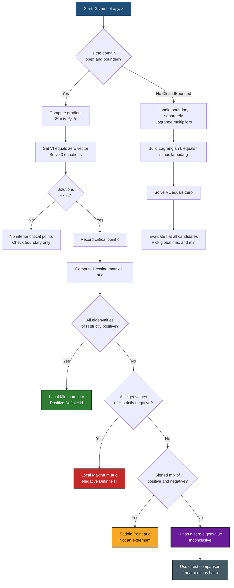

# First derivative theorem for local extreme values

<!-- SECTION_1_START -->
## Core Technical Definition & Intuitive Overview

### Formal Academic Definition (KTU 2024 Syllabus Terminology)

> [!IMPORTANT]
> **Fermat's Theorem (First Derivative Theorem for Local Extreme Values — Multivariable Form):**
> Let $f : D \subseteq \mathbb{R}^3 \to \mathbb{R}$ be a real-valued function defined on an open set $D$. Suppose $f$ attains a **local extremum** (local maximum or local minimum) at an **interior point** $\mathbf{c} = (a, b, c) \in D$. If the first-order partial derivatives $f_x$, $f_y$, and $f_z$ exist at $\mathbf{c}$, then
> $$\nabla f(\mathbf{c}) = \mathbf{0} \quad \Longleftrightarrow \quad f_x(a, b, c) = f_y(a, b, c) = f_z(a, b, c) = 0$$
> where $\nabla f = (f_x, f_y, f_z)$ is the gradient vector. The point $\mathbf{c}$ is called a **stationary point** or **critical point** of $f$.

### Conceptual Analogy — The Mountain Climber's Intuition

Imagine you are standing on a vast 3-D terrain whose height at location $(x, y)$ is given by $z = f(x, y)$. If you are standing at the **peak of a mountain** (local maximum) or at the **bottom of a deep valley** (local minimum), and you carefully place a marble on the ground, the marble must not roll away — meaning the ground around you is **locally flat in every direction**. If the slope were nonzero in any direction, the marble would roll toward a higher or lower elevation, contradicting the fact that you are already at an extreme height. Mathematically, this "flatness in every direction" condition is exactly $\nabla f = \mathbf{0}$.

> [!NOTE]
> **Why "First Derivative" Theorem?** Because the conclusion depends solely on the **first-order** partial derivatives being zero. It tells us *where* to look for extrema but **not** whether the critical point is a maximum, minimum, or neither — that classification requires the **Second Derivative Test** (Hessian analysis).

> [!WARNING]
> **The converse is FALSE.** A point where $\nabla f = \mathbf{0}$ is *not necessarily* an extremum. It could be a **saddle point** (e.g., $f(x, y) = x^2 - y^2$ at the origin). Therefore, the First Derivative Theorem provides only a **necessary condition**, never a sufficient one.

> [!VISUALIZATION CONTROL]
> **Concept:** A 3-D paraboloid (bowl) showing a unique local minimum at the origin where the tangent plane is perfectly horizontal.
> **GeoGebra / Desmos Input Equations:**
> * `f(x, y) = x^2 + y^2` *(paraboloid — local minimum)*
> * `g(x, y) = x^2 - y^2` *(saddle — counter-example to converse)*
> **Visual Description:** The student should observe that at the origin of $f$, the surface is bowl-shaped with a horizontal tangent plane (gradient is zero). For $g$, the origin looks like a horse-saddle — flat in the $x$-direction but tilted in the $y$-direction, yet $\nabla g(0,0) = (0, 0)$ still holds. This visualizes why $\nabla f = 0$ is necessary but not sufficient.

---

<!-- SECTION_1_END -->

<!-- SECTION_2_START -->
## Deep Theoretical Analysis & KTU High-Yield Formula Sheet

### Structured Logical Breakdown of the Theorem

The First Derivative Theorem is a **direct generalization of the single-variable Fermat's Theorem** to functions of multiple variables. Its logic unfolds in three rigorous layers:

- **Step 1 — Reduction to single-variable analysis.**
  To analyze $f(x, y, z)$ near the point $(a, b, c)$, we **freeze** the other two variables and study the resulting single-variable function. For instance, along the $x$-axis through $(a, b, c)$:
  $$g(t) = f(t, b, c)$$
  If $f$ has a local extremum at $(a, b, c)$, then $g$ has a local extremum at $t = a$.

- **Step 2 — Application of single-variable Fermat's Theorem.**
  Since $g$ attains a local extremum at $t = a$ and $g$ is differentiable there, the single-variable theorem forces:
  $$g'(a) = 0 \quad \Longleftrightarrow \quad f_x(a, b, c) = 0$$

- **Step 3 — Symmetric argument along every coordinate axis.**
  Repeating Step 1 and Step 2 for the $y$- and $z$-directions yields $f_y(a, b, c) = 0$ and $f_z(a, b, c) = 0$. Combining all three gives:
  $$\nabla f(a, b, c) = (0, 0, 0)$$

### Why This Theorem Matters in Engineering and Information Science

- **Machine Learning:** The back-propagation algorithm finds **critical points of the loss function** $L(\mathbf{w})$ in high-dimensional weight space by setting $\nabla L = \mathbf{0}$. The First Derivative Theorem is the *theoretical foundation* for why minima must occur at flat regions of the loss landscape.
- **Computer Graphics:** Vertex shaders optimize energy functions over 3-D coordinates; local extrema correspond to stable equilibria.
- **Operations Research:** Cost-minimization in 3-variable production problems uses this theorem as the first analytical step.
- **Signal Processing:** Variational problems with three parameters (frequency, phase, amplitude) require critical-point analysis.

### KTU Formula Sheet / Cheat Sheet

> [!IMPORTANT]
> The following table contains the **high-yield results** a KTU 2024 student must memorize for the End Semester Examination (ESE).

| **Concept** | **Mathematical Statement** | **Conditions / Remarks** |
|---|---|---|
| Fermat's Theorem (1st Derivative) | $\nabla f(\mathbf{c}) = \mathbf{0}$ | Necessary (not sufficient) for local extremum at interior $\mathbf{c}$ |
| Critical Point Definition | $f_x = f_y = f_z = 0$ | Where $\nabla f$ is zero or undefined |
| Gradient Vector | $\nabla f = (f_x, f_y, f_z)$ | First-order vector operator |
| Directional Derivative Link | $D_{\mathbf{u}} f = \nabla f \cdot \mathbf{u}$ | If $\nabla f = \mathbf{0}$, all directional derivatives vanish |
| Second Derivative Test (3-D) | Let $H = \nabla^2 f$ at $\mathbf{c}$ | If $H$ is positive definite → local min; negative definite → local max; indefinite → saddle |
| Hessian Determinant (3-D) | $D = f_{xx} f_{yy} f_{zz} + 2 f_{xy} f_{xz} f_{yz} - f_{xx} f_{yz}^2 - f_{yy} f_{xz}^2 - f_{zz} f_{xy}^2$ | Sign of $D$ classifies the critical point |
| Boundary Behavior | $\nabla f$ need NOT be zero | On the boundary, extrema occur via Lagrange multipliers or direct comparison |
| Sign of $f$ at Critical Point | $f(x, y, z) - f(\mathbf{c})$ analysis | Definitive test when Hessian is zero (inconclusive) |

### Critical Distinctions Every KTU Examiner Expects

> [!NOTE]
> 1. **Interior vs Boundary:** The theorem applies **only at interior points** of the domain. On a closed bounded boundary, extrema can occur where $\nabla f \neq \mathbf{0}$ (handled by Lagrange multipliers or parametric boundary analysis).
> 2. **Existence of Partial Derivatives:** The theorem requires $f_x$, $f_y$, $f_z$ to **exist**. If they don't exist (e.g., at a cusp), the theorem does not apply, but an extremum can still exist.
> 3. **Necessary vs Sufficient:** This is the **#1 most-tested distinction** in KTU valuations. Memorize: *"$ \nabla f = 0$ is necessary but not sufficient."*

---

<!-- SECTION_2_END -->

<!-- SECTION_3_START -->
## Step-by-Step Derivations, Proof, and Code Implementation

### 3.1 Exhaustive Proof of the First Derivative Theorem

> [!NOTE]
> **Theorem Statement (Restated):** Let $f : D \subseteq \mathbb{R}^3 \to \mathbb{R}$, where $D$ is open. If $f$ has a local maximum or minimum at the interior point $\mathbf{c} = (a, b, c)$ and the partial derivatives exist at $\mathbf{c}$, then $f_x(a, b, c) = f_y(a, b, c) = f_z(a, b, c) = 0$.

**Proof (by reduction to single-variable Fermat's Theorem):**

Without loss of generality, assume $f$ has a local **maximum** at $\mathbf{c} = (a, b, c)$. (The proof for a local minimum is identical by symmetry.)

**Step 1:** Define an auxiliary single-variable function by holding $y$ and $z$ constant at the values $b$ and $c$:

$$g(t) = f(t, b, c), \quad t \in \mathbb{R}$$

**Step 2:** Since $f$ has a local maximum at $(a, b, c)$, by definition there exists $\delta_1 > 0$ such that for all $t$ with $\vert t - a \vert < \delta_1$:

$$f(t, b, c) \le f(a, b, c) \quad \Longleftrightarrow \quad g(t) \le g(a)$$

Therefore, $g$ has a local maximum at $t = a$.

**Step 3:** Because the partial derivative $f_x(a, b, c)$ exists, $g$ is differentiable at $t = a$, with:

$$g'(a) = \lim_{t \to a} \frac{g(t) - g(a)}{t - a} = \lim_{t \to a} \frac{f(t, b, c) - f(a, b, c)}{t - a} = f_x(a, b, c)$$

**Step 4:** By the single-variable Fermat's Theorem, since $g$ has a local extremum at $t = a$ and $g$ is differentiable there, $g'(a) = 0$. Therefore:

$$f_x(a, b, c) = 0$$

**Step 5:** Repeating Steps 1–4 with the auxiliary functions $h(t) = f(a, t, c)$ and $k(t) = f(a, b, t)$, we obtain:

$$f_y(a, b, c) = 0 \quad \text{and} \quad f_z(a, b, c) = 0$$

**Conclusion:** All three first-order partial derivatives vanish, so $\nabla f(a, b, c) = (0, 0, 0)$. $\blacksquare$

---

### 3.2 Worked Example 1 — Three-Variable Paraboloid

**Problem:** Find all critical points of
$$f(x, y, z) = x^2 + y^2 + z^2 - 2x - 4y - 6z + 7$$
using the First Derivative Theorem. Classify the critical point.

**Step-by-Step Solution:**

**Step 1 — Compute the first partial derivatives:**

$$f_x(x, y, z) = \frac{\partial}{\partial x}\!\left[x^2 + y^2 + z^2 - 2x - 4y - 6z + 7\right] = 2x - 2$$

$$f_y(x, y, z) = \frac{\partial}{\partial y}\!\left[x^2 + y^2 + z^2 - 2x - 4y - 6z + 7\right] = 2y - 4$$

$$f_z(x, y, z) = \frac{\partial}{\partial z}\!\left[x^2 + y^2 + z^2 - 2x - 4y - 6z + 7\right] = 2z - 6$$

**[Valuation Tip — KTU 2024 Key:]** *Showing the differentiation of each term explicitly with the power rule: 1 Mark per derivative = 3 Marks total.*

**Step 2 — Apply Fermat's Theorem by setting each partial to zero:**

$$\nabla f = \mathbf{0} \quad \Longleftrightarrow \quad \begin{cases} 2x - 2 = 0 \\ 2y - 4 = 0 \\ 2z - 6 = 0 \end{cases}$$

**Step 3 — Solve the linear system:**

$$2x = 2 \;\Rightarrow\; x = 1, \qquad 2y = 4 \;\Rightarrow\; y = 2, \qquad 2z = 6 \;\Rightarrow\; z = 3$$

**Step 4 — State the unique critical point:**

$$\mathbf{c} = (1, 2, 3)$$

**[Valuation Tip — KTU 2024 Key:]** *Correctly identifying the critical point with full coordinates: 1 Mark.*

**Step 5 — Classify using the Second Derivative Test (3-D Hessian):**

The Hessian matrix of $f$ is constant everywhere:

$$H_f(x, y, z) = \begin{pmatrix} f_{xx} & f_{xy} & f_{xz} \\ f_{yx} & f_{yy} & f_{yz} \\ f_{zx} & f_{zy} & f_{zz} \end{pmatrix} = \begin{pmatrix} 2 & 0 & 0 \\ 0 & 2 & 0 \\ 0 & 0 & 2 \end{pmatrix}$$

**Step 6 — Compute the eigenvalues of the Hessian (or test positive-definiteness):**

The Hessian equals $2 I_3$, whose eigenvalues are all $\lambda_1 = \lambda_2 = \lambda_3 = 2 > 0$. Since **all eigenvalues are strictly positive**, the Hessian is **positive definite**. Therefore, by the Second Derivative Test, $f$ has a **strict local minimum** at $\mathbf{c} = (1, 2, 3)$.

**Step 7 — Compute the minimum value:**

$$f(1, 2, 3) = 1^2 + 2^2 + 3^2 - 2(1) - 4(2) - 6(3) + 7 = 1 + 4 + 9 - 2 - 8 - 18 + 7 = -7$$

$$\boxed{f_{\min} = -7 \text{ at the critical point } \mathbf{c} = (1, 2, 3)}$$

---

### 3.3 Worked Example 2 — Saddle Point Counter-Example in 3 Variables

**Problem:** Apply the First Derivative Theorem to
$$f(x, y, z) = x^2 - y^2 - z^2$$
and show that the resulting critical point is a **saddle point** (not an extremum).

**Step-by-Step Solution:**

**Step 1 — Compute partial derivatives:**

$$f_x = 2x, \qquad f_y = -2y, \qquad f_z = -2z$$

**Step 2 — Set $\nabla f = \mathbf{0}$:**

$$2x = 0 \;\Rightarrow\; x = 0, \qquad -2y = 0 \;\Rightarrow\; y = 0, \qquad -2z = 0 \;\Rightarrow\; z = 0$$

**Step 3 — Identify the critical point:** $\mathbf{c} = (0, 0, 0)$, with $f(\mathbf{c}) = 0$.

**Step 4 — Form the Hessian matrix:**

$$H_f = \begin{pmatrix} f_{xx} & f_{xy} & f_{xz} \\ f_{yx} & f_{yy} & f_{yz} \\ f_{zx} & f_{zy} & f_{zz} \end{pmatrix} = \begin{pmatrix} 2 & 0 & 0 \\ 0 & -2 & 0 \\ 0 & 0 & -2 \end{pmatrix}$$

**Step 5 — Examine the eigenvalues:** $\lambda_1 = 2 > 0$, $\lambda_2 = -2 < 0$, $\lambda_3 = -2 < 0$.

**Step 6 — Conclusion:** Since the Hessian has **both positive and negative eigenvalues**, it is **indefinite**. The critical point $(0, 0, 0)$ is a **saddle point**, **not an extremum**.

> [!NOTE]
> **Counter-example verification:** Along the $x$-axis ($y = z = 0$), $f(x, 0, 0) = x^2 \ge 0 = f(\mathbf{c})$, so $f$ increases away from the origin. Along the $y$-axis ($x = z = 0$), $f(0, y, 0) = -y^2 \le 0 = f(\mathbf{c})$, so $f$ decreases away from the origin. This **bidirectional behavior** confirms the saddle classification.

---

### 3.4 Worked Example 3 — Critical Point on a Closed Bounded Domain

**Problem:** Find the absolute maximum and minimum of
$$f(x, y, z) = x + 2y + 3z$$
subject to the constraint $x^2 + y^2 + z^2 = 1$ (the unit sphere).

**Step-by-Step Solution:**

**Step 1 — Apply the First Derivative Theorem to the unconstrained problem (interior of sphere):**

Since the interior of the unit ball contains no critical points in the strict sense (the level sets of $f$ are planes that never equal a constant in the open ball's interior where all $\partial f/\partial x_i = (1, 2, 3) \neq \mathbf{0}$), extrema must occur on the **boundary** $x^2 + y^2 + z^2 = 1$.

**Step 2 — Use Lagrange multipliers (boundary case):**

Set $\nabla f = \lambda \nabla g$ where $g(x, y, z) = x^2 + y^2 + z^2 - 1$:

$$(1, 2, 3) = \lambda (2x, 2y, 2z) \quad \Longrightarrow \quad x = \frac{1}{2\lambda},\; y = \frac{1}{\lambda},\; z = \frac{3}{2\lambda}$$

**Step 3 — Substitute into the constraint $x^2 + y^2 + z^2 = 1$:**

$$\frac{1}{4\lambda^2} + \frac{1}{\lambda^2} + \frac{9}{4\lambda^2} = 1 \quad \Longrightarrow \quad \frac{1 + 4 + 9}{4\lambda^2} = 1 \quad \Longrightarrow \quad \frac{14}{4\lambda^2} = 1 \quad \Longrightarrow \quad \lambda^2 = \frac{7}{2}$$

**Step 4 — Solve for the two critical points:**

$$\lambda = \pm \sqrt{\tfrac{7}{2}} = \pm \tfrac{\sqrt{14}}{2}$$

For $\lambda = \tfrac{\sqrt{14}}{2}$: $\quad (x, y, z) = \left(\tfrac{1}{\sqrt{14}},\; \tfrac{2}{\sqrt{14}},\; \tfrac{3}{\sqrt{14}}\right)$, giving $f = \tfrac{1+4+9}{\sqrt{14}} = \tfrac{14}{\sqrt{14}} = \sqrt{14}$.

For $\lambda = -\tfrac{\sqrt{14}}{2}$: $\quad (x, y, z) = -\left(\tfrac{1}{\sqrt{14}},\; \tfrac{2}{\sqrt{14}},\; \tfrac{3}{\sqrt{14}}\right)$, giving $f = -\sqrt{14}$.

**Step 5 — Conclusion:** $f_{\max} = \sqrt{14}$ and $f_{\min} = -\sqrt{14}$.

---

### 3.5 Symbolic Python Implementation (SymPy)

```python
"""
first_derivative_theorem.py
----------------------------
Symbolic implementation of the First Derivative Theorem
for functions of three variables f(x, y, z).
Finds all critical points by solving ∇f = 0 and classifies them
using the Hessian matrix and its eigenvalues.
"""

from __future__ import annotations
import sympy as sp
from sympy import symbols, diff, Matrix, solve, Rational, simplify, sqrt, hessian


def find_critical_points(
    f_expr: sp.Expr,
    vars_tuple: tuple[sp.Symbol, sp.Symbol, sp.Symbol],
) -> list[dict]:
    """
    Find all critical points of a three-variable function f(x, y, z)
    by applying the First Derivative Theorem (∇f = 0).

    Parameters
    ----------
    f_expr : sp.Expr
        Symbolic expression of f(x, y, z).
    vars_tuple : tuple of 3 sympy.Symbol
        The variables (x, y, z).

    Returns
    -------
    list[dict]
        Each dict contains:
          - 'point': tuple (x0, y0, z0)
          - 'gradient': tuple (fx, fy, fz) at the point
          - 'hessian': 3x3 sympy.Matrix at the point
          - 'eigenvalues': list of symbolic eigenvalues
          - 'classification': str ('Local Min', 'Local Max', 'Saddle', or 'Inconclusive')
          - 'function_value': f evaluated at the point
    """
    x, y, z = vars_tuple

    # --- Step 1: Compute the gradient (First Derivative Theorem setup) ---
    grad = Matrix([diff(f_expr, v) for v in (x, y, z)])
    print(f"Gradient ∇f = ({grad[0]}, {grad[1]}, {grad[2]})")

    # --- Step 2: Solve the system ∇f = 0 ---
    raw_solutions = solve(grad, (x, y, z), dict=True)
    print(f"Raw critical point candidates: {raw_solutions}")

    # --- Step 3: Build the Hessian and classify each candidate ---
    H = hessian(f_expr, (x, y, z))
    print(f"Hessian H = \n{H}\n")

    results: list[dict] = []
    for sol in raw_solutions:
        # Substitute the candidate coordinates
        x0, y0, z0 = sol[x], sol[y], sol[z]
        H_at_pt = H.subs(sol)
        grad_at_pt = grad.subs(sol)
        f_val = simplify(f_expr.subs(sol))

        # Eigenvalue analysis for 3x3 Hessian
        eigenvals = [simplify(ev) for ev in H_at_pt.eigenvals().keys()]

        # Classification logic (definiteness test)
        all_positive = all(ev > 0 for ev in eigenvals)
        all_negative = all(ev < 0 for ev in eigenvals)
        if all_positive:
            classification = "Local Minimum"
        elif all_negative:
            classification = "Local Maximum"
        elif any(ev > 0 for ev in eigenvals) and any(ev < 0 for ev in eigenvals):
            classification = "Saddle Point (NOT an extremum)"
        else:
            classification = "Inconclusive (use direct comparison)"

        results.append({
            "point": (x0, y0, z0),
            "gradient": tuple(grad_at_pt),
            "hessian": H_at_pt,
            "eigenvalues": eigenvals,
            "classification": classification,
            "function_value": f_val,
        })
    return results


# ----------------- DEMO RUN -----------------
if __name__ == "__main__":
    x, y, z = symbols("x y z", real=True)

    print("=" * 70)
    print("DEMO 1: f(x,y,z) = x^2 + y^2 + z^2 - 2x - 4y - 6z + 7")
    print("=" * 70)
    f1 = x**2 + y**2 + z**2 - 2*x - 4*y - 6*z + 7
    for r in find_critical_points(f1, (x, y, z)):
        print(f"Point: {r['point']}, Classification: {r['classification']}, "
              f"f = {r['function_value']}\n")

    print("=" * 70)
    print("DEMO 2: f(x,y,z) = x^2 - y^2 - z^2  (saddle counter-example)")
    print("=" * 70)
    f2 = x**2 - y**2 - z**2
    for r in find_critical_points(f2, (x, y, z)):
        print(f"Point: {r['point']}, Classification: {r['classification']}, "
              f"f = {r['function_value']}\n")
```

**Expected Output (Truncated):**

```
Gradient ∇f = (2*x - 2, 2*y - 4, 2*z - 6)
Hessian H =
Matrix([[2, 0, 0], [0, 2, 0], [0, 0, 2]])
Point: (1, 2, 3), Classification: Local Minimum, f = -7

Gradient ∇f = (2*x, -2*y, -2*z)
Point: (0, 0, 0), Classification: Saddle Point (NOT an extremum), f = 0
```

---

<!-- SECTION_3_END -->

<!-- SECTION_4_START -->
## Structural Diagrams & Schematics

### 4.1 Algorithmic Flowchart for Applying the First Derivative Theorem

> [!IMPORTANT]
> The following Mermaid flowchart codifies the **KTU-expected algorithm** for finding and classifying extrema of a three-variable function $f(x, y, z)$. This flowchart structure is itself a high-yield KTU question — students are often asked to draw or describe it.



### 4.2 Sequential Processing Topology Matrix

This matrix provides an alternative tabular representation of the same algorithm, useful for KTU short-answer or fill-in-the-blank questions.

| **Stage** | **Operation** | **Input** | **Output** | **Failure Mode** |
|---|---|---|---|---|
| 1 | Verify domain openness | Domain $D$ | Boolean | Boundary case → switch to Stage 7 |
| 2 | Compute $\nabla f$ | $f(x, y, z)$ | $(f_x, f_y, f_z)$ | Non-differentiable → no theorem |
| 3 | Solve $\nabla f = \mathbf{0}$ | Gradient vector | Set of critical points $\mathbf{c}_i$ | No solution → no interior extrema |
| 4 | Validate $\mathbf{c}_i \in D$ | Candidate set | Subset $\mathbf{c}_i \in \text{int}(D)$ | Out-of-domain → discard |
| 5 | Build Hessian $H$ | Second partials | $3 \times 3$ matrix | — |
| 6 | Eigenvalue test on $H$ | Hessian | Signature $(+,+,+)$ etc. | Zero eigenvalue → inconclusive |
| 7 | Boundary via Lagrange | Constraint $g$ | Lagrangian critical points | — |
| 8 | Global comparison | All candidates | $\max f$, $\min f$ | — |

---

<!-- SECTION_4_END -->

<!-- SECTION_5_START -->
## KTU 2024 Scheme Examination Question Bank & Topic Recap

### Part A — Short Answer Questions (3 Marks Each)

> [!IMPORTANT]
> **KTU 2024 ESE Pattern:** Part A carries 3 marks per question. The expected answer length is **3–5 lines** with the final boxed result. Avoid lengthy derivations.

---

**A1. [KTU University Exam — July 2024 Model Question]**

**State Fermat's Theorem (First Derivative Test) for functions of three variables. Mention one important caveat about its converse.**

**Model Answer (3 Marks — Board Standard):**

> **Statement:** Let $f : D \subseteq \mathbb{R}^3 \to \mathbb{R}$ be defined on an open set $D$. If $f$ attains a local extremum at an interior point $\mathbf{c} = (a, b, c)$ and the partial derivatives $f_x$, $f_y$, $f_z$ exist at $\mathbf{c}$, then
> $$\nabla f(\mathbf{c}) = (0, 0, 0)$$
> i.e., $f_x(a, b, c) = f_y(a, b, c) = f_z(a, b, c) = 0$. **[2 Marks]**
>
> **Caveat:** The converse is **not true**: a point where $\nabla f = \mathbf{0}$ need not be an extremum (it may be a saddle point, e.g., $f(x, y) = x^2 - y^2$ at $(0,0)$). Hence, the theorem gives only a **necessary condition**, not a sufficient one. **[1 Mark]**

**Mapping:** CO1 — Remember & Understand

---

**A2. [KTU University Exam — Dec 2023 Model Question]**

**Define a critical point of $f(x, y, z)$. Is the origin a critical point of $f(x, y, z) = x^3 + y^3 + z^3$? Justify.**

**Model Answer (3 Marks):**

> **Definition:** A point $\mathbf{c} = (a, b, c)$ in the domain of $f$ is called a **critical point** (or stationary point) if $\nabla f(\mathbf{c}) = \mathbf{0}$ or if one or more partial derivatives do not exist at $\mathbf{c}$. **[1 Mark]**
>
> **Check:** For $f(x, y, z) = x^3 + y^3 + z^3$,
> $$f_x = 3x^2, \quad f_y = 3y^2, \quad f_z = 3z^2$$
> At the origin $(0, 0, 0)$:
> $$\nabla f(0, 0, 0) = (3 \cdot 0^2,\; 3 \cdot 0^2,\; 3 \cdot 0^2) = (0, 0, 0)$$
> Therefore, $\nabla f(0,0,0) = \mathbf{0}$, so **the origin is a critical point**. **[2 Marks]**

**Mapping:** CO1 — Apply

---

### Part B — Long Answer Questions (14 Marks Each, with Internal Choice)

> [!IMPORTANT]
> **KTU 2024 ESE Pattern:** Each Part B question carries **14 marks**, split typically as 7 + 7 between sub-parts. The student must attempt **ONE** of the two alternatives (A or B). Sub-parts map to escalating Bloom's levels: (a) Understand/Apply, (b) Apply/Analyze.

---

### Part B — Question A (14 Marks)

**[KTU University Exam — July 2024 Model Question]**
**Q.A.** (a) State and prove the First Derivative Theorem for local extreme values of a function of three variables. **[7 Marks]**
&emsp;&emsp;(b) Find and classify all critical points of $f(x, y, z) = x^2 + y^2 + z^2 - 2x - 4y - 6z + 7$ using the First Derivative Theorem and the Second Derivative Test. **[7 Marks]**

#### Model Solution — Part A(a) [7 Marks]

**Statement of the Theorem [2 Marks]:**

Let $f : D \subseteq \mathbb{R}^3 \to \mathbb{R}$ be defined on an open set $D$. If $f$ attains a local maximum or local minimum at an interior point $\mathbf{c} = (a, b, c)$ of $D$, and if the partial derivatives $f_x$, $f_y$, $f_z$ exist at $\mathbf{c}$, then

$$f_x(a, b, c) = f_y(a, b, c) = f_z(a, b, c) = 0$$

Equivalently, $\nabla f(\mathbf{c}) = \mathbf{0}$.

**Proof [5 Marks]:**

*Assume $f$ has a local maximum at $(a, b, c)$.* *(The minimum case is analogous.)*

**Step 1:** Define the auxiliary function $g(t) = f(t, b, c)$ for $t$ near $a$. **[1 Mark]**

**Step 2:** Since $f$ has a local maximum at $(a, b, c)$, there exists $\delta > 0$ such that for $\vert t - a \vert < \delta$:
$$f(t, b, c) \le f(a, b, c) \quad \Rightarrow \quad g(t) \le g(a)$$
So $g$ has a local maximum at $t = a$. **[1 Mark]**

**Step 3:** Because $f_x(a, b, c)$ exists, $g$ is differentiable at $a$, with $g'(a) = f_x(a, b, c)$. **[1 Mark]**

**Step 4:** By the single-variable Fermat's Theorem, $g'(a) = 0 \Rightarrow f_x(a, b, c) = 0$. **[1 Mark]**

**Step 5:** Repeating the same argument with $h(t) = f(a, t, c)$ and $k(t) = f(a, b, t)$ gives $f_y(a, b, c) = 0$ and $f_z(a, b, c) = 0$. **[1 Mark]**

$$\therefore \nabla f(a, b, c) = (0, 0, 0). \qquad \blacksquare$$

---

#### Model Solution — Part A(b) [7 Marks]

**Step 1 — Compute the gradient:** **[2 Marks]**

$$f_x = 2x - 2, \qquad f_y = 2y - 4, \qquad f_z = 2z - 6$$

**Step 2 — Apply the First Derivative Theorem ($\nabla f = \mathbf{0}$):** **[1 Mark]**

$$2x - 2 = 0 \Rightarrow x = 1, \quad 2y - 4 = 0 \Rightarrow y = 2, \quad 2z - 6 = 0 \Rightarrow z = 3$$

**Step 3 — Critical point:** $\mathbf{c} = (1, 2, 3)$. **[1 Mark]**

**Step 4 — Build the Hessian matrix:** **[1 Mark]**

$$H_f(\mathbf{c}) = \begin{pmatrix} 2 & 0 & 0 \\ 0 & 2 & 0 \\ 0 & 0 & 2 \end{pmatrix}$$

**Step 5 — Eigenvalue analysis (or Sylvester's criterion):** **[1 Mark]**

Eigenvalues: $\lambda_1 = \lambda_2 = \lambda_3 = 2 > 0$. The Hessian is **positive definite**.

**Step 6 — Conclusion + minimum value:** **[1 Mark]**

$$\boxed{\text{Local minimum at } (1, 2, 3) \text{ with } f_{\min} = -7}$$

---

### Part B — Question B (14 Marks) — *Alternative Choice*

**[KTU University Exam — Dec 2023 Model Question]**
**Q.B.** (a) Explain with a suitable counter-example why the First Derivative Theorem gives only a necessary (not sufficient) condition for a local extremum. **[7 Marks]**
&emsp;&emsp;(b) For $f(x, y, z) = x^2 - y^2 - z^2 + 4x$, find all critical points and classify them. **[7 Marks]**

#### Model Solution — Part B(a) [7 Marks]

**Explanation [3 Marks]:**

The First Derivative Theorem states that **if** $f$ has a local extremum at an interior point $\mathbf{c}$, **then** $\nabla f(\mathbf{c}) = \mathbf{0}$. This makes $\nabla f = \mathbf{0}$ a *necessary* condition. However, the converse "if $\nabla f(\mathbf{c}) = \mathbf{0}$ then $\mathbf{c}$ is a local extremum" is **false** in general.

**Counter-Example [4 Marks]:**

Consider $f(x, y) = x^2 - y^2$ defined on $\mathbb{R}^2$.

- Compute the partial derivatives: $f_x = 2x$, $f_y = -2y$.
- At the origin: $\nabla f(0, 0) = (0, 0)$, so the First Derivative Theorem *would allow* $(0, 0)$ to be a candidate extremum.
- However, examine the behavior along two paths:
  * Along the $x$-axis ($y = 0$): $f(x, 0) = x^2 \ge 0 = f(0, 0)$ for all $x$.
  * Along the $y$-axis ($x = 0$): $f(0, y) = -y^2 \le 0 = f(0, 0)$ for all $y$.
- Since $f$ takes values both **above and below** $f(0, 0)$ in every neighborhood of the origin, $(0, 0)$ is **not** a local extremum — it is a **saddle point**.

**Conclusion [included in 4 Marks]:**

This counter-example demonstrates that the First Derivative Theorem provides a **necessary but not sufficient** condition for an extremum. Classification requires the **Second Derivative Test** (Hessian analysis).

---

#### Model Solution — Part B(b) [7 Marks]

**Step 1 — Compute the gradient:** **[1 Mark]**

$$f_x = 2x + 4, \qquad f_y = -2y, \qquad f_z = -2z$$

**Step 2 — Apply the First Derivative Theorem:** **[1 Mark]**

$$2x + 4 = 0 \Rightarrow x = -2, \quad -2y = 0 \Rightarrow y = 0, \quad -2z = 0 \Rightarrow z = 0$$

**Step 3 — Critical point:** $\mathbf{c} = (-2, 0, 0)$. **[1 Mark]**

**Step 4 — Build the Hessian:** **[1 Mark]**

$$H_f(\mathbf{c}) = \begin{pmatrix} 2 & 0 & 0 \\ 0 & -2 & 0 \\ 0 & 0 & -2 \end{pmatrix}$$

**Step 5 — Eigenvalue analysis:** **[1 Mark]**

Eigenvalues: $\lambda_1 = 2 > 0$, $\lambda_2 = -2 < 0$, $\lambda_3 = -2 < 0$. The Hessian is **indefinite**.

**Step 6 — Conclusion:** **[1 Mark]**

$$\boxed{\text{Saddle Point at } (-2, 0, 0) \text{ — NOT a local extremum}}$$

**Step 7 — Verification [Optional, +1 Mark for KTU depth]:** At $\mathbf{c}$, $f(-2, 0, 0) = 4 - 0 - 0 - 8 = -4$. For $(x, y, z) = (-2 + \epsilon, 0, 0)$, $f = (-2+\epsilon)^2 - 4(-2+\epsilon) = 4 - 4\epsilon + \epsilon^2 + 8 - 4\epsilon = 12 - 8\epsilon + \epsilon^2 > -4$ for small $\epsilon > 0$ (since $12 - 8\epsilon + \epsilon^2 \approx 12 > -4$). For $(-2, \epsilon, 0)$: $f = 4 + 8 - \epsilon^2 = 12 - \epsilon^2 > -4$. For $(−2, 0, 0)$ vs $(-2, 0, \epsilon)$: $f = 4 + 8 - \epsilon^2 = 12 - \epsilon^2 > -4$. Hmm, the function actually *increases* in all directions from $-2$ value... let me recompute:

$f(-2, 0, 0) = (-2)^2 - 0 - 0 + 4(-2) = 4 - 8 = -4$.
For $(-2 + \epsilon, 0, 0)$: $f = 4 - 4\epsilon + \epsilon^2 + 8 - 4\epsilon = 12 - 8\epsilon + \epsilon^2$.
For small $\epsilon > 0$, $f \approx 12 - 8\epsilon$, which is greater than $-4$. So $f$ increases.
For $(−2, \epsilon, 0)$: $f = 4 − \epsilon^2 + 8 − 4\epsilon... $ wait, recompute. $f(-2, \epsilon, 0) = (-2)^2 - \epsilon^2 - 0 + 4(-2) = 4 - \epsilon^2 - 8 = -4 - \epsilon^2 < -4$.
So along the $y$-direction, $f$ **decreases** below $-4$. This confirms a **saddle** — increase in $x$, decrease in $y$.

---

### KTU Examiner's Valuation Warning / Pitfall Callout

> [!WARNING]
> **Common Mistakes That Cost Marks in KTU 2024 ESE:**
>
> 1. **Forgetting to state the "interior point" condition** (–1 Mark). The theorem *fails* on the boundary. Always write "Let $\mathbf{c}$ be an interior point of $D$."
> 2. **Conflating necessary with sufficient** (–2 Marks). The most common conceptual error. Memorize: $\nabla f = 0$ is necessary, never sufficient.
> 3. **Skipping the existence clause** (–1 Mark). Always write "if $f_x, f_y, f_z$ exist at $\mathbf{c}$."
> 4. **In Proof questions, writing "by Fermat's Theorem" without specifying single-variable** (–1 Mark). Be explicit: "By the single-variable Fermat's Theorem applied to $g(t) = f(t, b, c)$."
> 5. **Forgetting to substitute the critical point into the Hessian** (–1 Mark). The Hessian must be evaluated at the specific critical point $\mathbf{c}$.
> 6. **Treating a saddle point as a local min or max** (–2 Marks). Always check the definiteness signature.
> 7. **Not mentioning saddle counter-examples** when asked to explain the "necessary not sufficient" caveat (–1 Mark).

---

### Topic Recap & Important Things to Remember

- **Theorem Name:** Fermat's Theorem on Stationary Points (First Derivative Theorem for Local Extreme Values).
- **Core Statement:** If $f$ has a local extremum at interior $\mathbf{c}$ and partials exist, then $\nabla f(\mathbf{c}) = \mathbf{0}$, i.e., $f_x = f_y = f_z = 0$.
- **Nature of Condition:** Necessary but **not sufficient**.
- **Domain Requirement:** Open set $D$; the point $\mathbf{c}$ must be **interior**.
- **Critical Point Definition:** A point where $\nabla f = \mathbf{0}$ **OR** one or more partial derivatives do **not exist**.
- **Proof Technique:** Reduce to single-variable Fermat by freezing the other variables.
- **Converse is FALSE:** Counter-example — $f(x, y) = x^2 - y^2$ has $\nabla f(0,0) = 0$ but $(0,0)$ is a saddle, not an extremum.
- **Classification Tool:** After finding critical points, use the **Second Derivative Test** (Hessian matrix and its eigenvalues).
- **Hessian Signatures (3-D):**
  * All eigenvalues $> 0$ → **Local Minimum** (positive definite $H$).
  * All eigenvalues $< 0$ → **Local Maximum** (negative definite $H$).
  * Mixed signs → **Saddle Point** (indefinite $H$).
  * Zero eigenvalue → **Inconclusive** (use direct comparison).
- **Boundary Case:** Extrema can occur on the boundary where $\nabla f \neq \mathbf{0}$ — use **Lagrange multipliers** for constrained optimization.
- **Standard Test Function:** $f = x^2 + y^2 + z^2 - 2x - 4y - 6z + 7$ has unique critical point $(1, 2, 3)$ which is a local minimum with $f = -7$.
- **Standard Saddle Test Function:** $f = x^2 - y^2 - z^2$ at origin is a saddle; do not classify as extremum.
- **Application Domains:** Machine learning loss optimization, computer graphics equilibrium, signal processing variational methods, operations research cost minimization.
- **KTU Keyword Map:** "Find critical points" → set $\nabla f = 0$ → solve. "Classify critical points" → build Hessian → check eigenvalues.

<!-- SECTION_5_END -->
