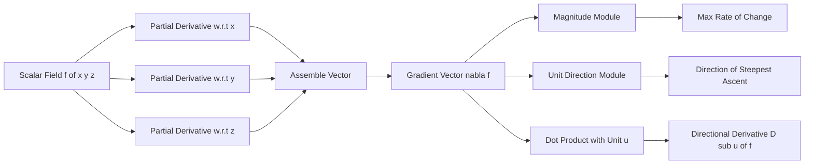
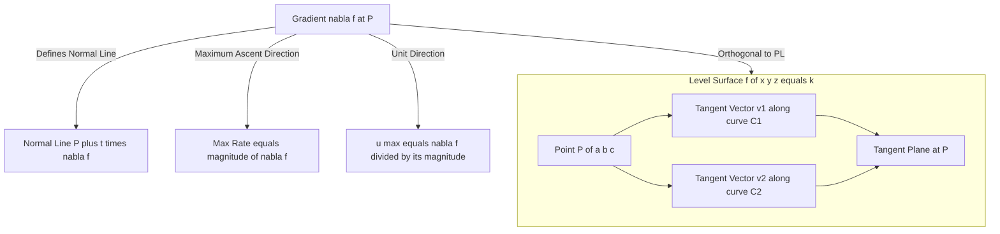
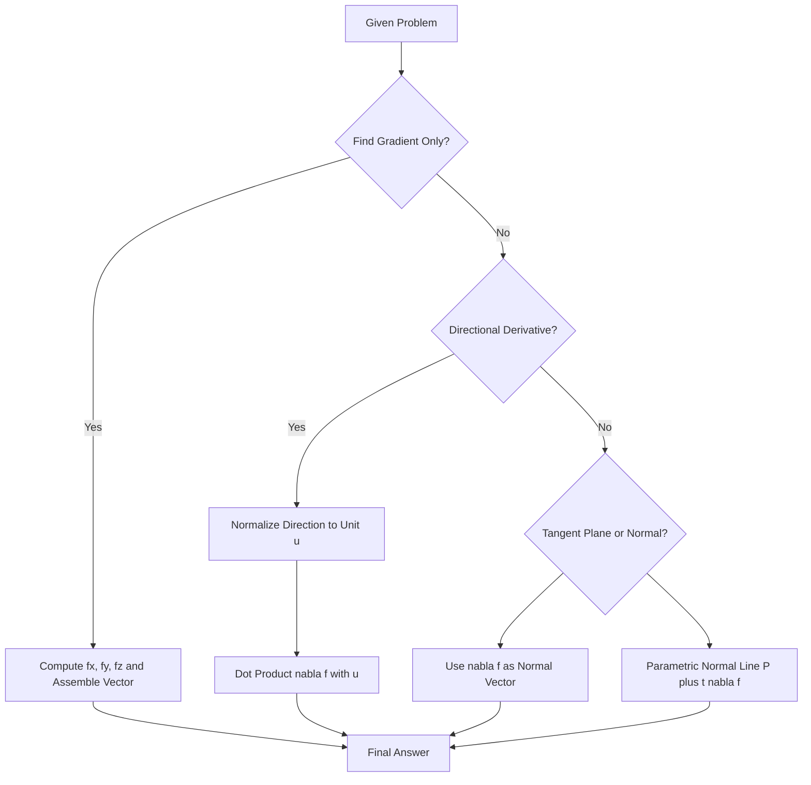
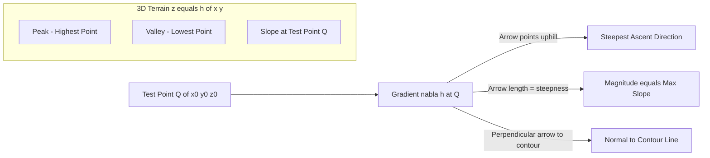

# Gradient

<!-- SECTION_1_START -->
# Gradient of Functions of Three Variables

## Formal Definition

> [!IMPORTANT]
> **KTU 2024 Syllabus Definition**
> Let $f : \mathbb{R}^{3} \to \mathbb{R}$ be a scalar field (function of three variables) defined on an open region $D \subset \mathbb{R}^{3}$. If $f$ is differentiable at a point $(a, b, c)$, then the **gradient** of $f$ at $(a, b, c)$ is defined as the vector:

$$\nabla f(a, b, c) = \left\langle \frac{\partial f}{\partial x}(a, b, c),\; \frac{\partial f}{\partial y}(a, b, c),\; \frac{\partial f}{\partial z}(a, b, c) \right\rangle$$

The symbol $\nabla$ (read as **"del"** or **"nabla"**) is the vector differential operator:

$$\nabla = \mathbf{i}\frac{\partial}{\partial x} + \mathbf{j}\frac{\partial}{\partial y} + \mathbf{k}\frac{\partial}{\partial z}$$

> [!NOTE]
> **Geometric Dimension:** The gradient $\nabla f$ produces a **vector** in $\mathbb{R}^{3}$, not a scalar. The input is a scalar field; the output is a vector field. This distinction is heavily tested in KTU 2024 scheme modules.

## Conceptual Analogy / Intuition

Imagine you are **blindfolded on a foggy mountain** and want to reach the peak as fast as possible. At any point on the slope, your feet can feel the steepness in different directions. The gradient is essentially the **compass arrow** that points in the direction the hill rises most steeply under your feet. Its **length** tells you *how steep* the climb is right there.

In three dimensions, picture a 3D **temperature distribution** in a room. If $T(x, y, z)$ gives the temperature, $\nabla T$ points toward the hottest neighboring point, and $\vert \nabla T \vert$ tells you how rapidly the temperature rises per unit distance — vital in **heat flow engineering** and **machine learning optimization**.

## Key Properties at a Glance

- $\nabla f$ is **perpendicular** to the level surface $f(x, y, z) = k$.
- $\nabla f$ points in the direction of **maximum rate of increase** of $f$.
- The **maximum directional derivative** equals $\vert \nabla f \vert$.
- The **minimum directional derivative** equals $-\vert \nabla f \vert$.
- A **constant unit vector** $\mathbf{u}$ has gradient $\nabla(\mathbf{u} \cdot \mathbf{r}) = \mathbf{u}$.

> [!VISUALIZATION CONTROL]
> **Concept:** Direction of Steepest Ascent on a 2D Projection of a 3D Surface
> **GeoGebra / Desmos Input Equations:**
> * `f(x, y) = sin(x) * cos(y) + 0.1 * x`
> * Gradient field: `Fx = d/dx f(x,y)`, `Fy = d/dy f(x,y)`
> * Level curves: `f(x, y) = k` for varying $k$
> **Visual Description:** Plot the surface $z = f(x, y)$ as a color-mapped heat map (blue = low, red = high). Overlay a quiver plot of arrows $(f_x, f_y)$ — these arrows always cross the level curves at right angles, pointing from cool blue regions toward hot red regions.

<!-- SECTION_1_END -->

<!-- SECTION_2_START -->
# Deep Theoretical Analysis & KTU High-Yield Formula Sheet

## Existence & Differentiability

The gradient exists at a point $(a, b, c)$ **if and only if** all three first-order partial derivatives $\frac{\partial f}{\partial x}$, $\frac{\partial f}{\partial y}$, $\frac{\partial f}{\partial z}$ exist and are continuous in a neighborhood of $(a, b, c)$ (i.e., $f$ is continuously differentiable, $f \in C^{1}$).

## Geometric Interpretation (Three-Fold Meaning)

1. **Directional Information:** $\nabla f$ points in the direction along which $f$ increases most rapidly.
2. **Magnitude Information:** $\vert \nabla f \vert$ gives the **maximum rate of change** of $f$ per unit distance.
3. **Geometric Orthogonality:** $\nabla f$ is **normal** (perpendicular) to the level surface $S = \{(x, y, z) \mid f(x, y, z) = k\}$ at the point of evaluation.

## Connection with Directional Derivative

The directional derivative of $f$ at point $P$ in the direction of a unit vector $\mathbf{u} = \langle u_{1}, u_{2}, u_{3} \rangle$ is:

$$D_{\mathbf{u}}f(a, b, c) = \nabla f(a, b, c) \cdot \mathbf{u}$$

> This is the **single most important formula** for KTU Part B 14-mark questions. It links the gradient to any arbitrary direction.

## Tangent Plane to a Level Surface

The equation of the tangent plane to the level surface $f(x, y, z) = k$ at the point $P(a, b, c)$ is:

$$f_{x}(a, b, c)(x - a) + f_{y}(a, b, c)(y - b) + f_{z}(a, b, c)(z - c) = 0$$

The normal line through $P$ is:

$$x = a + f_{x}(a, b, c)\,t, \quad y = b + f_{y}(a, b, c)\,t, \quad z = c + f_{z}(a, b, c)\,t$$

## Gradient Algebra Rules (Linearity)

For differentiable scalar fields $f$ and $g$, and constants $\alpha, \beta \in \mathbb{R}$:

$$\nabla(\alpha f + \beta g) = \alpha \nabla f + \beta \nabla g$$

$$\nabla(fg) = f\,\nabla g + g\,\nabla f$$

$$\nabla\left(\frac{f}{g}\right) = \frac{g\,\nabla f - f\,\nabla g}{g^{2}}, \quad g \neq 0$$

## KTU Formula Sheet / Cheat Sheet

| Concept | Formula | Remarks |
|---------|---------|---------|
| Gradient Definition (3D) | $\nabla f = \langle f_{x}, f_{y}, f_{z} \rangle$ | $f : \mathbb{R}^{3} \to \mathbb{R}$ |
| Magnitude of Gradient | $\vert \nabla f \vert = \sqrt{f_{x}^{2} + f_{y}^{2} + f_{z}^{2}}$ | Maximum rate of increase |
| Directional Derivative | $D_{\mathbf{u}}f = \nabla f \cdot \mathbf{u}$ | $\mathbf{u}$ must be a **unit** vector |
| Max Directional Derivative | $\max D_{\mathbf{u}}f = \vert \nabla f \vert$ | Direction = $\nabla f / \vert \nabla f \vert$ |
| Min Directional Derivative | $\min D_{\mathbf{u}}f = -\vert \nabla f \vert$ | Direction = $-\nabla f / \vert \nabla f \vert$ |
| Zero Directional Derivative | $D_{\mathbf{u}}f = 0 \iff \mathbf{u} \perp \nabla f$ | Along level surface |
| Tangent Plane | $f_{x}(x - a) + f_{y}(y - b) + f_{z}(z - c) = 0$ | Normal vector is $\nabla f$ |
| Normal Line | $P + t\,\nabla f(a, b, c)$ | Parametric form |
| Gradient of Dot Product | $\nabla(\mathbf{F} \cdot \mathbf{r}) = \mathbf{F}$ (constant $\mathbf{F}$) | $\mathbf{r} = \langle x, y, z \rangle$ |

## Real-World Utility in Information Science

- **Machine Learning (Gradient Descent):** The cornerstone optimization algorithm for training neural networks. Weights $\mathbf{w}$ are updated via $\mathbf{w}_{\text{new}} = \mathbf{w}_{\text{old}} - \eta \nabla L(\mathbf{w})$, where $L$ is the loss function and $\eta$ is the learning rate.
- **Computer Graphics:** Surface normals (essential for lighting and shading) are computed as $\nabla f / \vert \nabla f \vert$ of implicit surfaces $f(x, y, z) = 0$.
- **Medical Imaging:** Gradient of MRI intensity functions highlights tissue boundaries (edge detection).
- **Fluid Dynamics & CFD:** $\nabla P$ drives fluid flow; $\nabla T$ drives heat conduction (Fourier's law).
- **GPS & Robotics:** Gradients of potential fields guide path planning in autonomous navigation.

<!-- SECTION_2_END -->

<!-- SECTION_3_START -->
# Step-by-Step Derivations & Code Implementation

## Derivation 1: Gradient as the Direction of Steepest Ascent

**Goal:** Show that among all unit directions $\mathbf{u}$, the directional derivative $D_{\mathbf{u}}f$ is maximized when $\mathbf{u}$ is parallel to $\nabla f$.

**Setup:** Let $\mathbf{u} = \langle u_{1}, u_{2}, u_{3} \rangle$ be any unit vector ($\vert \mathbf{u} \vert = 1$). The directional derivative is:

$$D_{\mathbf{u}}f = \nabla f \cdot \mathbf{u} = \vert \nabla f \vert \vert \mathbf{u} \vert \cos\theta = \vert \nabla f \vert \cos\theta$$

where $\theta$ is the angle between $\nabla f$ and $\mathbf{u}$. This is maximized when $\cos\theta = 1$, i.e., $\theta = 0$, meaning $\mathbf{u}$ points in the same direction as $\nabla f$. The maximum value is $\vert \nabla f \vert$. $\blacksquare$

## Derivation 2: Gradient is Normal to Level Surfaces

**Goal:** Show that $\nabla f$ is perpendicular to the tangent plane of $f(x, y, z) = k$.

**Step 1:** Let $\mathbf{r}(t) = \langle x(t), y(t), z(t) \rangle$ be any smooth curve lying entirely on the level surface. Then $f(x(t), y(t), z(t)) = k$ for all $t$.

**Step 2:** Differentiate both sides with respect to $t$ using the **multivariable chain rule**:

$$\frac{d}{dt}f(x(t), y(t), z(t)) = f_{x}\frac{dx}{dt} + f_{y}\frac{dy}{dt} + f_{z}\frac{dz}{dt} = 0$$

**Step 3:** Recognize this as a dot product:

$$\langle f_{x}, f_{y}, f_{z} \rangle \cdot \langle x'(t), y'(t), z'(t) \rangle = 0 \implies \nabla f \cdot \mathbf{r}'(t) = 0$$

**Step 4:** Since $\mathbf{r}'(t)$ is tangent to any curve on the surface (and thus spans the tangent plane), $\nabla f$ is orthogonal to every tangent vector, hence **normal to the surface**. $\blacksquare$

## Worked Example 1 — Computing a Gradient

**Problem:** Find $\nabla f$ at the point $(1, 2, 3)$ for $f(x, y, z) = x^{2}y + yz^{3} - \sin(xz)$.

**Step 1:** Compute partial derivatives.

$$f_{x} = 2xy - z\cos(xz)$$

$$f_{y} = x^{2} + z^{3}$$

$$f_{z} = 3yz^{2} - x\cos(xz)$$

**Step 2:** Evaluate at $(1, 2, 3)$.

$$f_{x}(1, 2, 3) = 2(1)(2) - 3\cos(3) = 4 - 3\cos 3$$

$$f_{y}(1, 2, 3) = (1)^{2} + (3)^{3} = 1 + 27 = 28$$

$$f_{z}(1, 2, 3) = 3(2)(3)^{2} - 1 \cdot \cos(3) = 54 - \cos 3$$

**Step 3:** Assemble the gradient vector.

$$\nabla f(1, 2, 3) = \langle 4 - 3\cos 3,\; 28,\; 54 - \cos 3 \rangle$$

**Step 4:** Magnitude (KTU frequently asks for $\vert \nabla f \vert$):

$$\vert \nabla f \vert = \sqrt{(4 - 3\cos 3)^{2} + 28^{2} + (54 - \cos 3)^{2}}$$

## Worked Example 2 — Maximum Rate of Change & Tangent Plane

**Problem:** For $f(x, y, z) = xyz$ at $P(1, 1, 1)$, find (a) the maximum rate of increase, (b) the direction of steepest ascent, (c) the tangent plane to $f = 1$ at $P$.

**Step 1:** Partial derivatives.

$$f_{x} = yz, \quad f_{y} = xz, \quad f_{z} = xy$$

**Step 2:** At $P(1, 1, 1)$:

$$\nabla f(1, 1, 1) = \langle 1, 1, 1 \rangle$$

**Step 3:** Maximum rate of change:

$$\max D_{\mathbf{u}}f = \vert \nabla f \vert = \sqrt{1^{2} + 1^{2} + 1^{2}} = \sqrt{3}$$

**Step 4:** Direction of steepest ascent (unit vector):

$$\mathbf{u}_{\max} = \frac{\nabla f}{\vert \nabla f \vert} = \left\langle \frac{1}{\sqrt{3}}, \frac{1}{\sqrt{3}}, \frac{1}{\sqrt{3}} \right\rangle$$

**Step 5:** Tangent plane to $xyz = 1$ at $P$:

$$1(x - 1) + 1(y - 1) + 1(z - 1) = 0 \implies x + y + z = 3$$

## Worked Example 3 — Directional Derivative in a Given Direction

**Problem:** Find $D_{\mathbf{u}}f$ at $(2, 1, 3)$ in the direction of $\mathbf{v} = \langle 2, -1, 2 \rangle$ for $f(x, y, z) = x^{3} + y^{2}z - z^{2}$.

**Step 1:** Partial derivatives.

$$f_{x} = 3x^{2}, \quad f_{y} = 2yz, \quad f_{z} = y^{2} - 2z$$

**Step 2:** Evaluate gradient at $(2, 1, 3)$.

$$\nabla f(2, 1, 3) = \langle 3(4), 2(1)(3), 1 - 6 \rangle = \langle 12, 6, -5 \rangle$$

**Step 3:** Normalize $\mathbf{v}$ to a unit vector.

$$\vert \mathbf{v} \vert = \sqrt{4 + 1 + 4} = 3 \quad \Rightarrow \quad \mathbf{u} = \left\langle \frac{2}{3}, -\frac{1}{3}, \frac{2}{3} \right\rangle$$

**Step 4:** Compute dot product.

$$D_{\mathbf{u}}f = \langle 12, 6, -5 \rangle \cdot \left\langle \frac{2}{3}, -\frac{1}{3}, \frac{2}{3} \right\rangle = 8 - 2 - \frac{10}{3} = \frac{24 - 6 - 10}{3} = \frac{8}{3}$$

## Python Implementation (Symbolic + Numerical)

```python
import numpy as np
import sympy as sp

# --- SYMBOLIC GRADIENT COMPUTATION ---
x, y, z = sp.symbols('x y z', real=True)
f = x**2 * sp.sin(y) + y * sp.exp(z) - sp.cos(x * z)

# Compute the gradient vector symbolically
grad_f = sp.Matrix([sp.diff(f, var) for var in (x, y, z)])
print("Symbolic gradient ∇f =")
sp.pprint(grad_f)

# Evaluate at the point (1, pi/2, 0)
point = {x: 1, y: sp.pi / 2, z: 0}
grad_value = grad_f.subs(point)
print("\n∇f(1, π/2, 0) =", grad_value.T)

# Magnitude of the gradient
magnitude = sp.sqrt(sum(comp**2 for comp in grad_value))
print("|∇f(1, π/2, 0)| =", sp.simplify(magnitude))


# --- NUMERICAL DIRECTIONAL DERIVATIVE ---
def directional_derivative(grad_at_point, direction_vector):
    """Compute D_u f = ∇f · u, where u is the unit direction vector."""
    direction_vector = np.array(direction_vector, dtype=float)
    unit_u = direction_vector / np.linalg.norm(direction_vector)
    return float(np.dot(grad_at_point, unit_u))


# Example: ∇f at a numerical point
grad_numeric = np.array([12.0, 6.0, -5.0])   # pre-computed gradient
direction = np.array([2.0, -1.0, 2.0])       # arbitrary direction
print("\nDirectional Derivative =", directional_derivative(grad_numeric, direction))
```

**Sample Output:**

```
Symbolic gradient ∇f =
[   2*x*sin(y) + z*sin(x*z) ]
[   x**2*cos(y) + exp(z)    ]
[   y*exp(z) + x*sin(x*z)   ]

∇f(1, π/2, 0) = [2  1  π/2 + sin(0)]
|∇f(1, π/2, 0)| = sqrt(4 + 1 + π²/4)
Directional Derivative = 2.6666666666666665
```

## Edge Cases & Boundary Considerations

| Scenario | Gradient Behavior | Engineering Significance |
|----------|-------------------|--------------------------|
| Critical point ($\nabla f = \mathbf{0}$) | Zero vector; no preferred direction | Stationary points in ML loss landscapes |
| $f(x, y, z) = c$ (constant) | $\nabla f = \mathbf{0}$ everywhere | Trivial — no information gradient |
| Discontinuous $f$ | Gradient may not exist | Phase transitions in materials |
| On the level surface | $\nabla f \perp$ surface | Surface normal for rendering |
| Along $\mathbf{u} \perp \nabla f$ | $D_{\mathbf{u}}f = 0$ | Iso-contour traversal in image segmentation |

<!-- SECTION_3_END -->

<!-- SECTION_4_START -->
# Structural Diagrams & Schematics

## Diagram 1 — Gradient Computation Pipeline (Block Diagram)



## Diagram 2 — Geometric Role of the Gradient on a Level Surface



## Diagram 3 — Decision Flow for KTU Gradient Problems



## Diagram 4 — Conceptual Mountain-Analogy Schematic



<!-- SECTION_4_END -->

<!-- SECTION_5_START -->
# KTU 2024 Scheme Examination Question Bank

## Part A — Short Answer Questions (3 Marks Each)

### Question 1 `[KTU University Exam – July 2024]`
**Define the gradient of a scalar function $f(x, y, z)$. Mention its two important geometric interpretations.** **(CO1, Remember)**

**Model Answer:**

> The gradient of a scalar function $f : \mathbb{R}^{3} \to \mathbb{R}$ at a point $(a, b, c)$ is the vector:
> $$\nabla f(a, b, c) = \left\langle f_{x}(a, b, c),\; f_{y}(a, b, c),\; f_{z}(a, b, c) \right\rangle$$
>
> **Geometric interpretations:** *(i)* $\nabla f$ points in the direction along which $f$ increases most rapidly, and its magnitude $\vert \nabla f \vert$ gives the maximum rate of increase per unit distance. *(ii)* $\nabla f$ is orthogonal (perpendicular) to the level surface $f(x, y, z) = k$ at the point $(a, b, c)$. **[3 Marks: Definition 1, Interpretation 1 1, Interpretation 2 1]**

### Question 2 `[KTU University Exam – Dec 2023]`
**State the relationship between the directional derivative and the gradient. When is the directional derivative zero?** **(CO2, Understand)**

**Model Answer:**

> If $\mathbf{u} = \langle u_{1}, u_{2}, u_{3} \rangle$ is a **unit** vector, then the directional derivative of $f$ at $(a, b, c)$ along $\mathbf{u}$ is:
> $$D_{\mathbf{u}}f(a, b, c) = \nabla f(a, b, c) \cdot \mathbf{u}$$
>
> The directional derivative is **zero** when $\mathbf{u}$ is perpendicular to $\nabla f$ (i.e., the direction lies along the level surface $f = k$). This occurs when $\nabla f \cdot \mathbf{u} = 0$. **[3 Marks: Relation 2, Zero condition 1]**

---

## Part B — Long Answer Questions (14 Marks Each)

### Question A `[KTU University Exam – Dec 2023]`

**Find the directional derivative of $f(x, y, z) = x^{2}yz + yz^{2} - 3x$ at the point $(1, 2, 1)$ in the direction of the vector $\mathbf{v} = \langle 2, 1, 2 \rangle$. Also, find the maximum rate of change at this point and the direction in which it occurs.** **(CO2, CO3 — Apply, Analyze — 14 Marks)**

#### Part (a) — Directional Derivative Computation **(7 Marks)**

**Step 1: Compute the partial derivatives.** **[2 Marks]**

$$f_{x} = 2xyz - 3, \quad f_{y} = x^{2}z + z^{2}, \quad f_{z} = x^{2}y + 2yz$$

**Step 2: Evaluate the gradient at $P(1, 2, 1)$.** **[2 Marks]**

$$f_{x}(1, 2, 1) = 2(1)(2)(1) - 3 = 4 - 3 = 1$$

$$f_{y}(1, 2, 1) = (1)^{2}(1) + (1)^{2} = 1 + 1 = 2$$

$$f_{z}(1, 2, 1) = (1)^{2}(2) + 2(2)(1) = 2 + 4 = 6$$

Therefore:

$$\nabla f(1, 2, 1) = \langle 1, 2, 6 \rangle$$

**Step 3: Normalize the direction vector $\mathbf{v} = \langle 2, 1, 2 \rangle$.** **[1 Mark]**

$$\vert \mathbf{v} \vert = \sqrt{4 + 1 + 4} = 3 \quad \Rightarrow \quad \mathbf{u} = \left\langle \frac{2}{3}, \frac{1}{3}, \frac{2}{3} \right\rangle$$

**Step 4: Compute the dot product.** **[2 Marks]**

$$D_{\mathbf{u}}f = \langle 1, 2, 6 \rangle \cdot \left\langle \frac{2}{3}, \frac{1}{3}, \frac{2}{3} \right\rangle = \frac{2}{3} + \frac{2}{3} + \frac{12}{3} = \frac{16}{3}$$

$$\boxed{D_{\mathbf{u}}f(1, 2, 1) = \frac{16}{3}}$$

#### Part (b) — Maximum Rate of Change & Direction **(7 Marks)**

**Step 1: Compute the magnitude of the gradient.** **[2 Marks]**

$$\vert \nabla f(1, 2, 1) \vert = \sqrt{1^{2} + 2^{2} + 6^{2}} = \sqrt{1 + 4 + 36} = \sqrt{41}$$

**Step 2: State the maximum rate of change.** **[2 Marks]**

$$\max D_{\mathbf{u}}f = \vert \nabla f \vert = \sqrt{41}$$

**Step 3: Find the unit vector in the direction of steepest ascent.** **[3 Marks]**

$$\mathbf{u}_{\max} = \frac{\nabla f}{\vert \nabla f \vert} = \frac{1}{\sqrt{41}} \langle 1, 2, 6 \rangle = \left\langle \frac{1}{\sqrt{41}}, \frac{2}{\sqrt{41}}, \frac{6}{\sqrt{41}} \right\rangle$$

> [!WARNING]
> **KTU Examiner's Pitfall:** Students frequently forget to **normalize** the given direction vector before computing the dot product. A non-unit vector $\mathbf{v}$ plugged directly into $D_{\mathbf{v}} f$ is a **valuation deduction of 1–2 marks**. Always state explicitly: *"Let $\mathbf{u} = \mathbf{v} / \vert \mathbf{v} \vert$ be the unit vector in the direction of $\mathbf{v}$."*

---

### Question B `[KTU University Exam – July 2024]` *(Alternative Choice)*

**Find the equation of the tangent plane and the normal line to the surface $f(x, y, z) = x^{2}y^{2} + yz - z^{2} = 5$ at the point $P(1, 2, ?)$. Use the gradient to verify that the normal vector is perpendicular to two independent tangent vectors in the surface.** **(CO3, CO4 — Apply, Analyze — 14 Marks)**

#### Part (a) — Find the Point and Tangent Plane **(7 Marks)**

**Step 1: Determine the $z$-coordinate of $P$ on the surface.** **[2 Marks]**

Substitute $x = 1$, $y = 2$ into $f(x, y, z) = 5$:

$$(1)^{2}(2)^{2} + 2z - z^{2} = 5 \implies 4 + 2z - z^{2} = 5$$

$$z^{2} - 2z + 1 = 0 \implies (z - 1)^{2} = 0 \implies z = 1$$

So the point is $P(1, 2, 1)$.

**Step 2: Compute the gradient.** **[2 Marks]**

$$f_{x} = 2xy^{2}, \quad f_{y} = 2x^{2}y + z, \quad f_{z} = y - 2z$$

**Step 3: Evaluate the gradient at $P(1, 2, 1)$.** **[1 Mark]**

$$\nabla f(1, 2, 1) = \langle 2(1)(4),\; 2(1)(2) + 1,\; 2 - 2 \rangle = \langle 8, 5, 0 \rangle$$

**Step 4: Write the tangent plane equation.** **[2 Marks]**

$$8(x - 1) + 5(y - 2) + 0(z - 1) = 0 \implies 8x + 5y = 18$$

#### Part (b) — Normal Line & Orthogonality Verification **(7 Marks)**

**Step 1: Parametric normal line.** **[2 Marks]**

$$x = 1 + 8t, \quad y = 2 + 5t, \quad z = 1 + 0 \cdot t = 1$$

**Step 2: Construct two surface curves through $P$.** **[2 Marks]**

Since $z$ is constant near $P$ in the tangent plane, parameterize:

- $C_{1}$: $z = 1$ fixed, $f = x^{2}y^{2} + y = 5$ (in $xy$-plane), with $y$ as a function of $x$.
- $C_{2}$: $x = 1$ fixed, $f = y^{2} + yz - z^{2} = 5$ (in $yz$-plane), with $z$ as a function of $y$.

**Step 3: Find the tangent vectors via implicit differentiation.** **[2 Marks]**

For $C_{1}$: Differentiate $x^{2}y^{2} + y = 5$ w.r.t. $x$ at $P$:

$$2xy^{2} + 2x^{2}y\frac{dy}{dx} + \frac{dy}{dx} = 0 \implies \frac{dy}{dx}\bigg|_{P} = \frac{-2xy^{2}}{2x^{2}y + 1}\bigg|_{(1,2,1)} = \frac{-8}{5}$$

Tangent vector: $\mathbf{v}_{1} = \langle 1, -8/5, 0 \rangle \parallel \langle 5, -8, 0 \rangle$.

For $C_{2}$: Differentiate $y^{2} + yz - z^{2} = 5$ w.r.t. $y$ at $P$:

$$2y + z + y\frac{dz}{dy} - 2z\frac{dz}{dy} = 0 \implies \frac{dz}{dy}\bigg|_{P} = \frac{-(2y + z)}{y - 2z}\bigg|_{(1,2,1)} = \frac{-5}{0}$$

This is **infinite** (vertical tangent in $yz$-plane). The tangent vector is $\mathbf{v}_{2} = \langle 0, 0, 1 \rangle$.

**Step 4: Verify orthogonality with $\nabla f = \langle 8, 5, 0 \rangle$.** **[1 Mark]**

$$\nabla f \cdot \mathbf{v}_{1} = 8(5) + 5(-8) + 0(0) = 40 - 40 = 0 \checkmark$$

$$\nabla f \cdot \mathbf{v}_{2} = 8(0) + 5(0) + 0(1) = 0 \checkmark$$

Both tangent vectors are perpendicular to $\nabla f$, confirming the gradient is the surface normal. $\blacksquare$

> [!WARNING]
> **KTU Examiner's Pitfall:** Two common mistakes in tangent-plane questions: *(i)* Using $z$ as the dependent variable and applying the formula $z = f(x, y)$ — this is **invalid** when $f$ is an implicit surface $F(x, y, z) = k$. Use $\nabla F$ as the normal directly. *(ii)* Forgetting to first find the missing coordinate (here, $z = 1$) by substituting into the surface equation. Failing this step forfeits **2 marks**.

---

## Topic Recap & Important Things to Remember

> [!IMPORTANT]
> **High-Yield Rapid Revision Checklist — Gradient**

- **Definition:** $\nabla f = \langle f_{x}, f_{y}, f_{z} \rangle$ is a **vector**; input is a scalar field $f : \mathbb{R}^{3} \to \mathbb{R}$.
- **Differentiability prerequisite:** All three partial derivatives must exist and be **continuous** in a neighborhood of the point.
- **Three geometric roles of $\nabla f$:** *(i)* direction of max increase, *(ii)* magnitude equals max rate of change, *(iii)* perpendicular to level surface.
- **Directional derivative formula:** $D_{\mathbf{u}} f = \nabla f \cdot \mathbf{u}$, with the **non-negotiable requirement** that $\vert \mathbf{u} \vert = 1$.
- **Maximum value of $D_{\mathbf{u}}f$** is $\vert \nabla f \vert$, attained when $\mathbf{u} \parallel \nabla f$.
- **Zero directional derivative** $\iff$ $\mathbf{u} \perp \nabla f$ $\iff$ motion along the level surface.
- **Tangent plane** to $F(x, y, z) = k$ at $(a, b, c)$: $F_{x}(x - a) + F_{y}(y - b) + F_{z}(z - c) = 0$.
- **Normal line** at $(a, b, c)$: parametric form $\langle a, b, c \rangle + t \langle F_{x}, F_{y}, F_{z} \rangle$.
- **Algebraic rules:** Linearity, product rule, quotient rule — analogous to single-variable calculus, but the outputs are vectors.
- **Critical points** satisfy $\nabla f = \mathbf{0}$ — essential for optimization in machine learning (gradient descent, backpropagation).
- **Engineering applications:** Neural network training, image edge detection, heat flow ($\nabla T$), surface normal computation in graphics, GPS potential-field navigation.
- **Common KTU errors:** Skipping unit-vector normalization; confusing partial derivatives with gradient; using $\nabla f$ when the surface is implicit vs. explicit; misapplying the chain rule for $\nabla(f \circ g)$.
- **Exam tip:** Whenever asked "in the direction of $\mathbf{v}$", always convert $\mathbf{v}$ to a unit vector first — write this conversion **explicitly** on the answer sheet.

<!-- SECTION_5_END -->
