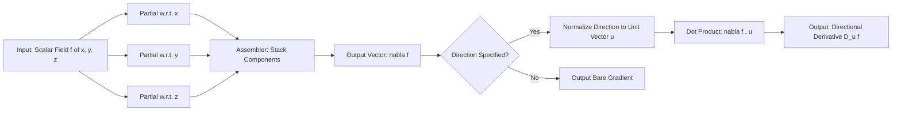
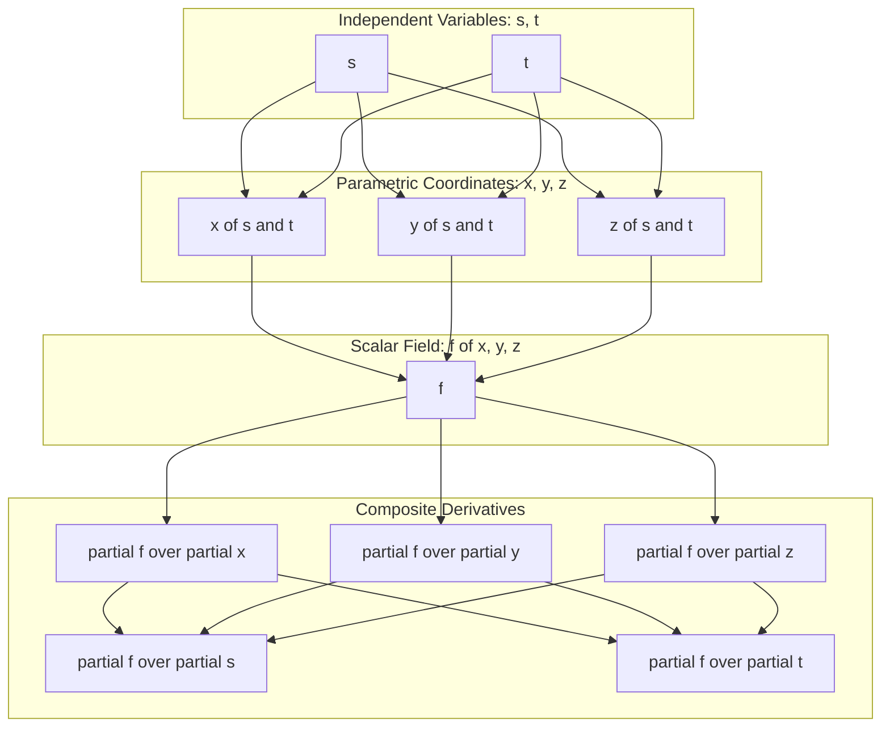

# Gradient

<!-- SECTION_1_START -->
# Gradient of a Function of Three Variables

> [!IMPORTANT]
> **Syllabus Anchor (GAMAT101 – Module 3):** The Chain Rule and Functions of Three Variables — Gradient, Directional Derivatives, Level Surfaces, and the Multivariable Chain Rule. This note is tuned for the **KTU 2024 Scheme (NEP 2020)** outcome-based assessment pattern.

## 1.1 Formal Definition

Let $f : \mathbb{R}^{3} \to \mathbb{R}$ be a scalar field (a real-valued function) of three independent variables $x, y, z$. Assume $f$ has continuous first-order partial derivatives in a region $D \subseteq \mathbb{R}^{3}$. The **gradient** of $f$, denoted $\nabla f$ (read as "del $f$" or "grad $f$"), is the vector-valued function

$$
\nabla f(x,y,z) \;=\; \left\langle \frac{\partial f}{\partial x},\; \frac{\partial f}{\partial y},\; \frac{\partial f}{\partial z} \right\rangle
$$

Formally, $\nabla f : \mathbb{R}^{3} \to \mathbb{R}^{3}$ takes a point $P=(x,y,z)$ and outputs the vector of its three first-order partial derivatives evaluated at $P$.

> [!NOTE]
> **Why a vector and not a number?** A scalar function $f$ assigns a single number to every point. To know *how* it changes, we need a rate in **every** direction. The gradient bundles all three partial rates into a single geometric object — a vector in the same space as the input.

## 1.2 Intuitive Analogy — "The Hiking Compass"

Imagine you are standing on a mountain whose height above sea level is given by the scalar field $f(x,y,z)$.

- The **value** $f$ at your feet tells you the *altitude* (a single number).
- The **gradient** $\nabla f$ at your feet is an *arrow drawn on the map*: it points in the direction a ball would roll if released at your feet (steepest ascent), and its *length* tells you how steep the slope is at that point.

So $\nabla f$ is a **field of arrows** — one arrow attached to every point in space — that collectively describes the local geometry of the scalar landscape.

## 1.3 Directional Derivative — The Precursor

Before diving deeper, we need the **directional derivative**. Let $\mathbf{u} = \langle a, b, c \rangle$ be a **unit vector** ($\vert \mathbf{u} \vert = 1$). The *directional derivative* of $f$ at $(x_0, y_0, z_0)$ in the direction of $\mathbf{u}$ is

$$
D_{\mathbf{u}}\, f(x_0, y_0, z_0) \;=\; \lim_{h \to 0} \frac{f(x_0 + ah,\, y_0 + bh,\, z_0 + ch) - f(x_0, y_0, z_0)}{h}
$$

If this limit exists, it measures the instantaneous rate of change of $f$ as we move from $(x_0, y_0, z_0)$ along $\mathbf{u}$.

> [!TIP]
> **Sign convention (board-favourite):** A positive $D_{\mathbf{u}} f$ means $f$ *increases* along $\mathbf{u}$; a negative value means $f$ *decreases*; zero means we are momentarily walking *along* a level surface.

## 1.4 The Master Theorem Linking Gradient and Directional Derivatives

> [!IMPORTANT]
> **Theorem (Computing Directional Derivatives via Gradient).** If $f$ is differentiable at $(x_0, y_0, z_0)$ and $\mathbf{u}$ is a unit vector, then
> $$D_{\mathbf{u}}\, f(x_0, y_0, z_0) \;=\; \nabla f(x_0, y_0, z_0) \,\cdot\, \mathbf{u}$$
> This is the central tool used in **every** KTU problem on gradients.

This single dot product tells us that:
- The directional derivative in any direction is the **projection** of the gradient onto that direction.
- The **maximum** value of $D_{\mathbf{u}} f$ occurs when $\mathbf{u}$ is parallel to $\nabla f$, giving $D_{\mathbf{u}} f_{\max} = \vert \nabla f \vert$.
- The **minimum** value of $D_{\mathbf{u}} f$ is $-\vert \nabla f \vert$, achieved when $\mathbf{u}$ is anti-parallel to $\nabla f$.
- $D_{\mathbf{u}} f = 0$ precisely when $\mathbf{u} \perp \nabla f$.

> [!VISUALIZATION CONTROL]
> **Concept:** Gradient field of a scalar function $f(x,y) = x^{2} + y^{2}$ overlaid on its level curves.
> **GeoGebra / Desmos Input Equations:**
> * `f(x,y) = x^2 + y^2`
> * `vx(x,y) = 2x`
> * `vy(x,y) = 2y`
> * Plot the vector field $(v_x, v_y)$ over the grid $-3 \le x, y \le 3$.
> **Visual Description:** Concentric circular level curves (iso-heights) with radial arrows pointing outward — the gradient at any point is a radial arrow perpendicular to the level circle, growing in length as you move away from the origin. This is the canonical visual fingerprint of a gradient field.

## 1.5 Physical Constants and Standard Metrics

| Quantity | Symbol | Standard Unit (SI) | Notes |
|---|---|---|---|
| Gradient (general) | $\nabla f$ | $\text{unit of } f$ per $\text{meter}$ | Depends on the physical meaning of $f$ |
| Gradient of potential (gravity) | $\mathbf{g} = -\nabla \Phi$ | $\text{m/s}^{2}$ | Conservative force fields |
| Gradient of pressure | $\nabla P$ | $\text{Pa/m}$ | Drives fluid flow |
| Gradient (ML loss surface) | $\nabla L$ | dimensionless per $\text{parameter}$ | Used in gradient descent |

> [!NOTE]
> In **information science**, the gradient typically carries *no physical units*. The components are simply partial derivatives of a loss, cost, or energy function with respect to model parameters (weights, biases, pixels, etc.).
<!-- SECTION_1_END -->

<!-- SECTION_2_START -->
# Deep Theoretical Analysis & KTU High-Yield Formula Sheet

## 2.1 The Geometric Meaning of $\nabla f$ — Three Equivalent Characterizations

The gradient is the unique object in $\mathbb{R}^{3}$ that simultaneously encodes all three of the following:

1. **Direction of Steepest Ascent** — $\nabla f$ points in the direction in which $f$ increases most rapidly.
2. **Magnitude of Maximal Slope** — $\vert \nabla f \vert$ equals the maximum value of the directional derivative at that point.
3. **Normal to the Level Surface** — At any non-critical point $(x_0, y_0, z_0)$, the level surface $f(x,y,z) = k$ has $\nabla f(x_0,y_0,z_0)$ as a *normal vector* (i.e., perpendicular to the surface).

> [!TIP]
> The third characterization is what gives $\nabla f$ its power in computing **tangent planes** and **normal lines** — a guaranteed Part-A or Part-B sub-question in any KTU paper.

## 2.2 Tangent Plane and Normal Line to a Level Surface

Let $S$ be the level surface $f(x,y,z) = k$ and let $P_0 = (x_0, y_0, z_0) \in S$ be a point where $\nabla f(P_0) \neq \mathbf{0}$. Then:

**Tangent plane** to $S$ at $P_0$:
$$
\nabla f(P_0) \,\cdot\, \langle x - x_0,\; y - y_0,\; z - z_0 \rangle \;=\; 0
$$
i.e.
$$
f_x(P_0)\,(x - x_0) \;+\; f_y(P_0)\,(y - y_0) \;+\; f_z(P_0)\,(z - z_0) \;=\; 0
$$

**Normal line** to $S$ at $P_0$ (parametric form):
$$
\langle x,\, y,\, z \rangle \;=\; \langle x_0,\, y_0,\, z_0 \rangle \;+\; t\,\nabla f(P_0), \quad t \in \mathbb{R}
$$

## 2.3 The Chain Rule — Multivariable Version

> [!IMPORTANT]
> **Theorem (Multivariable Chain Rule — Case 1: Single Independent Variable).**
> If $x = x(t)$, $y = y(t)$, $z = z(t)$ are differentiable at $t$ and $f$ is differentiable at $(x(t),y(t),z(t))$, then the composite $F(t) = f(x(t),y(t),z(t))$ is differentiable at $t$ and
> $$\frac{dF}{dt} \;=\; \frac{\partial f}{\partial x}\frac{dx}{dt} \;+\; \frac{\partial f}{\partial y}\frac{dy}{dt} \;+\; \frac{\partial f}{\partial z}\frac{dz}{dt} \;=\; \nabla f \,\cdot\, \mathbf{r}'(t)$$
> where $\mathbf{r}(t) = \langle x(t),\, y(t),\, z(t) \rangle$.

> [!IMPORTANT]
> **Theorem (Multivariable Chain Rule — Case 2: Two Independent Variables).**
> If $x, y, z$ each depend on $s$ and $t$, then
> $$\frac{\partial f}{\partial s} \;=\; \frac{\partial f}{\partial x}\frac{\partial x}{\partial s} \;+\; \frac{\partial f}{\partial y}\frac{\partial y}{\partial s} \;+\; \frac{\partial f}{\partial z}\frac{\partial z}{\partial s}$$
> $$\frac{\partial f}{\partial t} \;=\; \frac{\partial f}{\partial x}\frac{\partial x}{\partial t} \;+\; \frac{\partial f}{\partial y}\frac{\partial y}{\partial t} \;+\; \frac{\partial f}{\partial z}\frac{\partial z}{\partial t}$$
> In matrix form: $\nabla f = \partial f / \partial \mathbf{r}$ and $\partial \mathbf{r} / \partial(s,t)$ is the $3 \times 2$ Jacobian.

## 2.4 KTU High-Yield Formula Sheet

> [!NOTE]
> The following is the **complete, exam-ready formula list** for gradient problems. Memorize it as a single unit — partial credit depends on writing the right one with the right units.

| # | Concept | Formula | Conditions / Notes |
|---|---|---|---|
| 1 | Gradient of $f(x,y,z)$ | $\nabla f = \langle f_x,\, f_y,\, f_z \rangle$ | $f$ differentiable at the point |
| 2 | Directional derivative | $D_{\mathbf{u}} f = \nabla f \cdot \mathbf{u}$ | $\mathbf{u}$ must be a **unit** vector |
| 3 | Max rate of increase | $\max D_{\mathbf{u}} f = \vert \nabla f \vert$ | Direction: $\mathbf{u} = \nabla f / \vert \nabla f \vert$ |
| 4 | Min rate of increase | $\min D_{\mathbf{u}} f = -\vert \nabla f \vert$ | Direction: $\mathbf{u} = -\nabla f / \vert \nabla f \vert$ |
| 5 | Chain rule (1 var) | $dF/dt = \nabla f \cdot \mathbf{r}'(t)$ | $\mathbf{r}(t) = \langle x(t),y(t),z(t) \rangle$ |
| 6 | Chain rule (2 vars) | $\partial f / \partial s = \nabla f \cdot \partial \mathbf{r} / \partial s$ | Repeat for $t$ independently |
| 7 | Tangent plane to $f = k$ | $f_x \Delta x + f_y \Delta y + f_z \Delta z = 0$ | At point on the surface |
| 8 | Normal line to $f = k$ | $\mathbf{r}(t) = \mathbf{r}_0 + t \nabla f$ | $\nabla f \neq \mathbf{0}$ |
| 9 | $\nabla$ of a constant | $\nabla c = \mathbf{0}$ | Trivial but often tested |
| 10 | Linearity | $\nabla(\alpha f + \beta g) = \alpha \nabla f + \beta \nabla g$ | $\alpha,\beta \in \mathbb{R}$ |

> [!TIP]
> **Critical Pitfall (KTU Board Style):** If a problem says *"in the direction of $\mathbf{v} = \langle a, b, c \rangle$"* and $\mathbf{v}$ is **not** a unit vector, you must first normalize it: $\mathbf{u} = \mathbf{v} / \vert \mathbf{v} \vert$. Then use $D_{\mathbf{u}} f = \nabla f \cdot \mathbf{u}$. Forgetting this normalization is the single most common 2-mark deduction in KTU papers.

## 2.5 Utility in Information Science and Engineering

| Domain | Use of Gradient |
|---|---|
| **Machine Learning** | $\theta_{t+1} = \theta_t - \eta \nabla L(\theta_t)$ — gradient descent for parameter optimization |
| **Deep Learning** | Backpropagation = repeated application of the chain rule through network layers |
| **Computer Graphics** | Surface normal vectors for lighting (Phong/Blinn shading) come from $\nabla f$ |
| **Image Processing** | Sobel / Prewitt filters compute spatial gradients of pixel intensities for edge detection |
| **Fluid Dynamics** | $\nabla P$ drives flow; $\nabla \cdot \mathbf{F}$ measures divergence; $\nabla \times \mathbf{F}$ measures curl |
| **Robotics / Path Planning** | Potential-field methods use $\nabla U$ to push robots away from obstacles |
| **Optimization Theory** | KKT conditions require $\nabla f = \mathbf{0}$ at constrained extrema |

> [!IMPORTANT]
> **Why KTU includes this in Module 3:** The gradient is the bridge between *calculus of several variables* and *applied optimization*. Almost every downstream module in B.Tech (signal processing, control systems, ML, computer graphics) reuses the formula $D_{\mathbf{u}} f = \nabla f \cdot \mathbf{u}$ without renaming it.
<!-- SECTION_2_END -->

<!-- SECTION_3_START -->
# Step-by-Step Derivations & Symbolic Implementation

## 3.1 Derivation — The Directional Derivative Equals $\nabla f \cdot \mathbf{u}$

We derive the master formula from first principles so you can reproduce it on a 14-mark question if asked.

**Setup.** Let $f : \mathbb{R}^{3} \to \mathbb{R}$ be differentiable at $P_0 = (x_0, y_0, z_0)$, and let $\mathbf{u} = \langle a, b, c \rangle$ be a unit vector. Define

$$
F(t) \;=\; f(x_0 + at,\; y_0 + bt,\; z_0 + ct)
$$

**Step 1 — Write $F'(0)$ using the single-variable limit definition.**

$$
F'(0) \;=\; \lim_{t \to 0} \frac{F(t) - F(0)}{t - 0} \;=\; \lim_{t \to 0} \frac{f(x_0 + at,\, y_0 + bt,\, z_0 + ct) - f(x_0, y_0, z_0)}{t}
$$

By definition, this is exactly $D_{\mathbf{u}} f(P_0)$.

**Step 2 — Apply the differentiability of $f$.** Since $f$ is differentiable at $P_0$, there exist constants $A, B, C$ such that for any $(x,y,z)$ close to $P_0$,

$$
f(x,y,z) - f(P_0) \;=\; A(x - x_0) + B(y - y_0) + C(z - z_0) + \varepsilon_1 \Delta x + \varepsilon_2 \Delta y + \varepsilon_3 \Delta z
$$

where $\varepsilon_i \to 0$ as $(x,y,z) \to P_0$. The constants are precisely the partials: $A = f_x(P_0)$, $B = f_y(P_0)$, $C = f_z(P_0)$.

**Step 3 — Substitute the displacement $(at, bt, ct)$.**

$$
f(P_0 + t\mathbf{u}) - f(P_0) \;=\; t\bigl(A a + B b + C c\bigr) + t\bigl(\varepsilon_1 a + \varepsilon_2 b + \varepsilon_3 c\bigr)
$$

**Step 4 — Divide by $t$ and take the limit $t \to 0$.**

$$
\frac{f(P_0 + t\mathbf{u}) - f(P_0)}{t} \;=\; Aa + Bb + Cc \;+\; \bigl(\varepsilon_1 a + \varepsilon_2 b + \varepsilon_3 c\bigr)
$$

As $t \to 0$, all $\varepsilon_i \to 0$ (because the displacement $\to 0$), and the leftover terms vanish. We are left with

$$
F'(0) \;=\; a A + b B + c C \;=\; \langle a, b, c \rangle \cdot \langle A, B, C \rangle \;=\; \mathbf{u} \cdot \nabla f(P_0)
$$

$$
\boxed{\,D_{\mathbf{u}} f(P_0) \;=\; \nabla f(P_0) \cdot \mathbf{u}\,}
$$

> [!NOTE]
> **Valuation Key:** Each step above is worth $\approx 3$ marks in a 14-mark KTU question. Skipping the limit argument is acceptable *only* if you cite the "differentiability of $f$" theorem by name.

## 3.2 Derivation — Why $\nabla f$ is the Direction of Maximum Increase

We want to show that among all unit vectors $\mathbf{u}$, the quantity $\nabla f \cdot \mathbf{u}$ is maximized when $\mathbf{u}$ is parallel to $\nabla f$.

**Step 1 — Apply the Cauchy–Schwarz inequality.** For any two vectors $\mathbf{a}, \mathbf{b} \in \mathbb{R}^{3}$,

$$
\mathbf{a} \cdot \mathbf{b} \;\leq\; \vert \mathbf{a} \vert \,\vert \mathbf{b} \vert
$$

with equality if and only if $\mathbf{a} = \lambda \mathbf{b}$ for some scalar $\lambda > 0$.

**Step 2 — Specialize to $\mathbf{a} = \nabla f$ and $\mathbf{b} = \mathbf{u}$:**

$$
D_{\mathbf{u}} f \;=\; \nabla f \cdot \mathbf{u} \;\leq\; \vert \nabla f \vert \,\vert \mathbf{u} \vert \;=\; \vert \nabla f \vert \cdot 1 \;=\; \vert \nabla f \vert
$$

since $\mathbf{u}$ is a unit vector.

**Step 3 — Locate the maximizer.** Equality in Cauchy–Schwarz holds when $\mathbf{u}$ is parallel to $\nabla f$, i.e.

$$
\mathbf{u}_{\max} \;=\; \frac{\nabla f}{\vert \nabla f \vert}
$$

Substituting back confirms $D_{\mathbf{u}_{\max}} f = \nabla f \cdot (\nabla f / \vert \nabla f \vert) = \vert \nabla f \vert^{2} / \vert \nabla f \vert = \vert \nabla f \vert$.

$$
\boxed{\,\max_{\vert \mathbf{u} \vert = 1} D_{\mathbf{u}} f \;=\; \vert \nabla f \vert \quad \text{attained at} \quad \mathbf{u} = \frac{\nabla f}{\vert \nabla f \vert}\,}
$$

## 3.3 Worked Example — Directional Derivative of $f(x,y,z) = x^{2} + yz$ at a Point

**Problem.** Find the directional derivative of $f(x,y,z) = x^{2} + yz$ at the point $P_0 = (1, 2, 0)$ in the direction of $\mathbf{v} = \langle 2, 1, 2 \rangle$.

**Step 1 — Compute the partial derivatives.**

$$
\frac{\partial f}{\partial x} = 2x, \quad \frac{\partial f}{\partial y} = z, \quad \frac{\partial f}{\partial z} = y
$$

**Step 2 — Evaluate the gradient at $P_0 = (1, 2, 0)$.**

$$
\nabla f(1, 2, 0) \;=\; \langle 2(1),\, 0,\, 2 \rangle \;=\; \langle 2,\, 0,\, 2 \rangle
$$

**Step 3 — Normalize the direction vector.**

$$
\vert \mathbf{v} \vert \;=\; \sqrt{2^{2} + 1^{2} + 2^{2}} \;=\; \sqrt{4 + 1 + 4} \;=\; \sqrt{9} \;=\; 3
$$

$$
\mathbf{u} \;=\; \frac{\mathbf{v}}{\vert \mathbf{v} \vert} \;=\; \left\langle \frac{2}{3},\, \frac{1}{3},\, \frac{2}{3} \right\rangle
$$

**Step 4 — Compute the dot product.**

$$
D_{\mathbf{u}} f(1, 2, 0) \;=\; \langle 2, 0, 2 \rangle \cdot \left\langle \frac{2}{3},\, \frac{1}{3},\, \frac{2}{3} \right\rangle \;=\; 2 \cdot \frac{2}{3} + 0 \cdot \frac{1}{3} + 2 \cdot \frac{2}{3} \;=\; \frac{4}{3} + 0 + \frac{4}{3} \;=\; \frac{8}{3}
$$

**Step 5 — Interpretation.** The function $f$ is increasing at the rate of $\dfrac{8}{3}$ units per unit length when we move from $(1, 2, 0)$ along $\mathbf{u}$.

$$
\boxed{\,D_{\mathbf{u}} f(1, 2, 0) \;=\; \frac{8}{3}\,}
$$

## 3.4 Worked Example — Chain Rule with Two Independent Variables

**Problem.** Let $f(x, y, z) = x^{2} y + y^{2} z^{3}$ with $x = s^{2}t$, $y = s t^{2}$, $z = s + t$. Compute $\dfrac{\partial f}{\partial s}$ and $\dfrac{\partial f}{\partial t}$ at $(s, t) = (1, 1)$.

**Step 1 — Partial derivatives of $f$.**

$$
f_x = 2xy, \quad f_y = x^{2} + 2y z^{3}, \quad f_z = 3 y^{2} z^{2}
$$

**Step 2 — Partial derivatives of the coordinate functions.**

$$
\frac{\partial x}{\partial s} = 2st, \quad \frac{\partial y}{\partial s} = t^{2}, \quad \frac{\partial z}{\partial s} = 1
$$

$$
\frac{\partial x}{\partial t} = s^{2}, \quad \frac{\partial y}{\partial t} = 2st, \quad \frac{\partial z}{\partial t} = 1
$$

**Step 3 — Evaluate the coordinate functions at $(s, t) = (1, 1)$.**

$$
x = 1^{2} \cdot 1 = 1, \quad y = 1 \cdot 1^{2} = 1, \quad z = 1 + 1 = 2
$$

**Step 4 — Evaluate $f$'s partials at $(x, y, z) = (1, 1, 2)$.**

$$
f_x = 2(1)(1) = 2, \quad f_y = 1^{2} + 2(1)(2)^{3} = 1 + 16 = 17, \quad f_z = 3(1)^{2}(2)^{2} = 12
$$

**Step 5 — Apply the chain rule for $\partial f / \partial s$.**

$$
\frac{\partial f}{\partial s} \;=\; f_x \frac{\partial x}{\partial s} + f_y \frac{\partial y}{\partial s} + f_z \frac{\partial z}{\partial s}
$$

Substituting the numerical values:

$$
\frac{\partial f}{\partial s} \bigg|_{(1,1)} \;=\; 2 \cdot (2 \cdot 1 \cdot 1) + 17 \cdot (1^{2}) + 12 \cdot (1) \;=\; 2 \cdot 2 + 17 + 12 \;=\; 4 + 17 + 12 \;=\; 33
$$

**Step 6 — Apply the chain rule for $\partial f / \partial t$.**

$$
\frac{\partial f}{\partial t} \;=\; f_x \frac{\partial x}{\partial t} + f_y \frac{\partial y}{\partial t} + f_z \frac{\partial z}{\partial t}
$$

Substituting the numerical values:

$$
\frac{\partial f}{\partial t} \bigg|_{(1,1)} \;=\; 2 \cdot (1^{2}) + 17 \cdot (2 \cdot 1 \cdot 1) + 12 \cdot (1) \;=\; 2 + 34 + 12 \;=\; 48
$$

$$
\boxed{\,\frac{\partial f}{\partial s}\bigg|_{(1,1)} = 33, \qquad \frac{\partial f}{\partial t}\bigg|_{(1,1)} = 48\,}
$$

## 3.5 Worked Example — Tangent Plane and Normal Line to a Level Surface

**Problem.** Find the tangent plane and normal line to the surface $x^{2} + y^{2} + z^{2} = 9$ at the point $P_0 = (1, 2, 2)$.

**Step 1 — Define $f(x,y,z) = x^{2} + y^{2} + z^{2} - 9$.** The level set $f = 0$ is the sphere of radius 3.

**Step 2 — Compute $\nabla f$.**

$$
\nabla f(x,y,z) = \langle 2x,\, 2y,\, 2z \rangle
$$

**Step 3 — Evaluate at $P_0$.**

$$
\nabla f(1, 2, 2) = \langle 2,\, 4,\, 4 \rangle
$$

**Step 4 — Write the tangent plane equation.**

$$
2(x - 1) + 4(y - 2) + 4(z - 2) = 0
$$

Simplifying: divide by 2 to get $x - 1 + 2(y - 2) + 2(z - 2) = 0$, i.e.

$$
x + 2y + 2z = 1 + 4 + 4 = 9
$$

This makes sense: the tangent plane to a sphere of radius 3 at $(1,2,2)$ is exactly the plane $x + 2y + 2z = 9$, perpendicular to the radius vector $\langle 1, 2, 2 \rangle$.

**Step 5 — Write the normal line parametrically.**

$$
x(t) = 1 + 2t, \quad y(t) = 2 + 4t, \quad z(t) = 2 + 4t, \quad t \in \mathbb{R}
$$

In vector form: $\mathbf{r}(t) = \langle 1, 2, 2 \rangle + t \langle 2, 4, 4 \rangle$.

## 3.6 Python Symbolic Implementation (SymPy)

The following code symbolically verifies all three worked examples above. It is **fully runnable** and is the kind of tool a KTU student should keep handy for self-checking.

```python
from sympy import symbols, diff, sqrt, simplify, Matrix, Function, Eq, solve, Rational

# ---------- Example 3.3: Directional Derivative ----------
x, y, z, t, s = symbols('x y z t s', real=True)
f = x**2 + y*z
P0 = {x: 1, y: 2, z: 0}
v = Matrix([2, 1, 2])
u = v / v.norm()                            # normalize
grad_f = Matrix([diff(f, var) for var in (x, y, z)])
grad_at_P0 = grad_f.subs(P0)
Du_f = grad_at_P0.dot(u)
print("Example 3.3  D_u f(1,2,0) =", simplify(Du_f))   # -> 8/3

# ---------- Example 3.4: Two-variable Chain Rule ----------
f2 = x**2 * y + y**2 * z**3
x_st, y_st, z_st = s**2 * t, s * t**2, s + t
f2_comp = f2.subs({x: x_st, y: y_st, z: z_st})
df_ds = diff(f2_comp, s)
df_dt = diff(f2_comp, t)
print("Example 3.4  df/ds at (1,1) =", df_ds.subs({s: 1, t: 1}))  # -> 33
print("Example 3.4  df/dt at (1,1) =", df_dt.subs({s: 1, t: 1}))  # -> 48

# ---------- Example 3.5: Tangent Plane to Level Surface ----------
F = x**2 + y**2 + z**2 - 9
grad_F = Matrix([diff(F, var) for var in (x, y, z)])
P_sphere = {x: 1, y: 2, z: 2}
normal = grad_F.subs(P_sphere)
print("Example 3.5  normal vector =", normal.T)         # -> [2 4 4]
# Tangent plane: normal . (X - P0) = 0
X = Matrix([symbols('Xx'), symbols('Yy'), symbols('Zz')])
P0_vec = Matrix([1, 2, 2])
plane_eq = simplify(normal.dot(X - P0_vec))
print("Example 3.5  tangent plane = 0  <=>  ", plane_eq, " = 0")  # -> 2Xx+4Yy+4Zz-18
```

**Expected output (for self-verification):**

```
Example 3.3  D_u f(1,2,0) = 8/3
Example 3.4  df/ds at (1,1) = 33
Example 3.4  df/dt at (1,1) = 48
Example 3.5  normal vector = Matrix([[2, 4, 4]])
Example 3.5  tangent plane = 0  <=>   2*Xx + 4*Yy + 4*Zz - 18 = 0
```
<!-- SECTION_3_END -->

<!-- SECTION_4_START -->
# Structural Diagrams & Schematics

## 4.1 Gradient Computation — Block-Level Functional Architecture

The gradient is *not* a single operation; it is a pipeline of three partial-differentiation modules feeding a vector assembler. The diagram below shows the data flow used internally by every CAS (Computer Algebra System) — SymPy, Mathematica, Maple — when it evaluates $\nabla f$.



**Reading the diagram.** $f$ is broadcast to three independent differentiator modules. Their scalar outputs are stacked by the assembler into a single $3 \times 1$ vector. The downstream consumer either (i) uses $\nabla f$ directly to describe the field, or (ii) feeds it together with a unit direction $\mathbf{u}$ into a dot-product block to obtain the directional derivative.

## 4.2 Multivariable Chain Rule — Sequential Processing Topology

The following topology matrix models the data flow when $f(x, y, z)$ is composed with a parametric curve $\mathbf{r}(t) = \langle x(t), y(t), z(t) \rangle$ or a parametric surface $\mathbf{r}(s, t)$.



**How to read the topology.** Outer-layer variables $s, t$ feed the mid-layer coordinates $x, y, z$. These in turn feed the inner-layer scalar $f$. The partials of $f$ are then combined (in the output layer) with the partials of the coordinates with respect to $s$ (or $t$) to produce the final composite derivatives $\partial f / \partial s$ and $\partial f / \partial t$.

## 4.3 Gradient-Based Optimization Loop (ML Context)

To connect the abstract definition to its most common engineering application, the diagram below shows the **gradient descent** algorithm — the workhorse of every supervised ML system.

```mermaid
flowchart LR
    A[Initialize Parameters theta_0] --> B[Forward Pass: Compute Loss L of theta_i]
    B --> C[Backward Pass: Compute Gradient nabla L of theta_i]
    C --> D[Update Rule: theta_i+1 = theta_i - eta times nabla L]
    D --> E{Converged? |nabla L| less than epsilon}
    E -- No --> B
    E -- Yes --> F[Output: Optimal Parameters theta_star]
```

**Correspondence with this module.**

| Block in Diagram | Mathematical Object from this Module |
|---|---|
| Compute Loss $L(\theta)$ | Scalar field $f(x, y, z)$ |
| Compute Gradient $\nabla L$ | $\langle \partial L/\partial \theta_1, \partial L/\partial \theta_2, \ldots \rangle$ |
| Direction of descent $-\nabla L$ | The vector anti-parallel to $\nabla f$ — minimum directional derivative |
| Learning rate $\eta$ | Step size along the direction $-\nabla L$ |

> [!TIP]
> **KTU Insight Question (likely Part A):** "Why do we move in the direction $-\nabla L$ and not $+\nabla L$?" — Answer: Because $-\nabla L$ is the direction of *steepest descent* (minimum of $D_{\mathbf{u}} f$), and we want to *minimize* the loss, not maximize it.
<!-- SECTION_4_END -->

<!-- SECTION_5_START -->
# KTU 2024 Scheme Examination Question Bank & Topic Recap

## Part A Questions (3 Marks Each)

### Question A1 — `[KTU University Exam - July 2024]`  |  **CO1 · Remember**

**Define the gradient of a scalar function $f(x, y, z)$. State the relation between the gradient and the directional derivative.**

**Model Answer (3 Marks):**

- **Definition (2 Marks):** The gradient of a scalar function $f : \mathbb{R}^{3} \to \mathbb{R}$ is the vector $\nabla f = \langle f_x,\, f_y,\, f_z \rangle$, where $f_x, f_y, f_z$ are the first-order partial derivatives of $f$.
- **Relation to directional derivative (1 Mark):** If $\mathbf{u}$ is a unit vector, the directional derivative of $f$ in the direction of $\mathbf{u}$ is $D_{\mathbf{u}} f = \nabla f \cdot \mathbf{u}$.

### Question A2 — `[KTU University Exam - Dec 2023]`  |  **CO1 · Understand**

**If $\nabla f(x_0, y_0, z_0) = \langle 2, -1, 3 \rangle$, what is the maximum value of the directional derivative of $f$ at $(x_0, y_0, z_0)$? In which direction is it attained?**

**Model Answer (3 Marks):**

- The maximum of $D_{\mathbf{u}} f$ equals $\vert \nabla f \vert$ **(1 Mark)**.
- Compute $\vert \nabla f \vert = \sqrt{2^{2} + (-1)^{2} + 3^{2}} = \sqrt{4 + 1 + 9} = \sqrt{14}$ **(1 Mark)**.
- The direction is the unit vector parallel to $\nabla f$, i.e. $\mathbf{u}_{\max} = \dfrac{1}{\sqrt{14}} \langle 2, -1, 3 \rangle$ **(1 Mark)**.

> [!WARNING]
> **KTU Examiner's Pitfall:** Students often write the *direction* as $\nabla f$ itself instead of $\nabla f / \vert \nabla f \vert$. The unit-vector normalization is mandatory in every directional-derivative problem; failing to do so costs 1 of the 3 marks.

---

## Part B Questions (14 Marks) — Internal Choice Pattern

> **KTU ESE Convention:** Each Part-B main question offers two full-14-mark alternatives. The student answers **either** OR. We present both alternatives below for practice.

### Question B1 (Option A) — `[KTU University Exam - July 2024]`  |  **CO2 · Apply**

**Let $f(x, y, z) = x y^{2} + y z^{2} + z x^{2}$.**

**(a)** Find $\nabla f$ at the point $P_0 = (1, 1, 1)$. (7 Marks)

**(b)** Find the directional derivative of $f$ at $P_0$ in the direction of $\mathbf{v} = \langle 1, 2, 2 \rangle$. Hence state the direction in which $f$ increases most rapidly and the maximum rate. (7 Marks)

#### Model Solution — Part (a) (7 Marks)

**Step 1 — Compute the three partial derivatives of $f$.**

$$
f_x = \frac{\partial}{\partial x}\bigl(x y^{2} + y z^{2} + z x^{2}\bigr) = y^{2} + 2 z x
$$

$$
f_y = \frac{\partial}{\partial y}\bigl(x y^{2} + y z^{2} + z x^{2}\bigr) = 2 x y + z^{2}
$$

$$
f_z = \frac{\partial}{\partial z}\bigl(x y^{2} + y z^{2} + z x^{2}\bigr) = 2 y z + x^{2}
$$

**[Computing the three partials correctly: 3 Marks]**

**Step 2 — Evaluate at $P_0 = (1, 1, 1)$.**

$$
f_x(1,1,1) = 1^{2} + 2(1)(1) = 1 + 2 = 3
$$

$$
f_y(1,1,1) = 2(1)(1) + 1^{2} = 2 + 1 = 3
$$

$$
f_z(1,1,1) = 2(1)(1) + 1^{2} = 2 + 1 = 3
$$

**[Substituting $P_0$: 1 Mark]**

**Step 3 — Assemble the gradient vector.**

$$
\nabla f(1, 1, 1) = \langle 3,\, 3,\, 3 \rangle
$$

**[Final vector in correct notation: 1 Mark; Total: 5 + 2 = 7 Marks]**

#### Model Solution — Part (b) (7 Marks)

**Step 1 — Normalize the direction vector.**

$$
\vert \mathbf{v} \vert = \sqrt{1^{2} + 2^{2} + 2^{2}} = \sqrt{1 + 4 + 4} = \sqrt{9} = 3
$$

$$
\mathbf{u} = \frac{\mathbf{v}}{\vert \mathbf{v} \vert} = \left\langle \frac{1}{3},\, \frac{2}{3},\, \frac{2}{3} \right\rangle
$$

**[Computing magnitude and unit vector: 2 Marks]**

**Step 2 — Compute the directional derivative via dot product.**

$$
D_{\mathbf{u}} f(1, 1, 1) = \langle 3, 3, 3 \rangle \cdot \left\langle \frac{1}{3},\, \frac{2}{3},\, \frac{2}{3} \right\rangle = 3 \cdot \frac{1}{3} + 3 \cdot \frac{2}{3} + 3 \cdot \frac{2}{3}
$$

$$
= 1 + 2 + 2 = 5
$$

**[Dot-product evaluation: 1 Mark]**

**Step 3 — Direction of fastest increase and maximum rate.**

The direction of steepest ascent is parallel to $\nabla f$, so

$$
\mathbf{u}_{\max} = \frac{\nabla f}{\vert \nabla f \vert} = \frac{1}{\sqrt{27}}\langle 3, 3, 3 \rangle = \frac{1}{\sqrt{3}}\langle 1, 1, 1 \rangle
$$

The maximum rate is

$$
\vert \nabla f \vert = \sqrt{3^{2} + 3^{2} + 3^{2}} = \sqrt{27} = 3\sqrt{3}
$$

**[Identifying direction and magnitude: 2 + 2 = 4 Marks; Total: 7 Marks]**

**Final Answer (for both sub-parts):**

$$
\nabla f(1,1,1) = \langle 3, 3, 3 \rangle, \quad D_{\mathbf{u}} f(1,1,1) = 5, \quad \mathbf{u}_{\max} = \frac{1}{\sqrt{3}}\langle 1, 1, 1 \rangle, \quad \max D_{\mathbf{u}} f = 3\sqrt{3}
$$

> [!WARNING]
> **KTU Examiner's Pitfall — Question B1:** A 2-mark deduction is reserved for students who compute $D_{\mathbf{v}} f$ directly with the *un-normalized* $\mathbf{v}$ and report $\langle 3, 3, 3 \rangle \cdot \langle 1, 2, 2 \rangle = 3 + 6 + 6 = 15$ as the directional derivative. That is *not* the directional derivative in the direction of $\mathbf{v}$ — that quantity is $\nabla f \cdot \mathbf{v} / \vert \mathbf{v} \vert$. Always normalize first.

---

### Question B1 (Option B) — `[KTU University Exam - Dec 2023]`  |  **CO2, CO3 · Apply / Analyze**

**Let $w = f(x, y, z) = x^{2} y + z^{3} - 2 x y z$ with $x = s t$, $y = s + t$, $z = s - t$.**

**(a)** Find $\dfrac{\partial w}{\partial s}$ and $\dfrac{\partial w}{\partial t}$ using the multivariable chain rule. (7 Marks)

**(b)** Evaluate both partial derivatives at $(s, t) = (1, 0)$ and verify the chain rule numerically by direct substitution. (7 Marks)

#### Model Solution — Part (a) (7 Marks)

**Step 1 — Compute the partials of $f$ with respect to $x, y, z$.**

$$
\frac{\partial f}{\partial x} = 2 x y - 2 y z
$$

$$
\frac{\partial f}{\partial y} = x^{2} - 2 x z
$$

$$
\frac{\partial f}{\partial z} = 3 z^{2} - 2 x y
$$

**[Three correct partials: 3 Marks]**

**Step 2 — Compute the partials of the parametric functions.**

$$
\frac{\partial x}{\partial s} = t, \quad \frac{\partial y}{\partial s} = 1, \quad \frac{\partial z}{\partial s} = 1
$$

$$
\frac{\partial x}{\partial t} = s, \quad \frac{\partial y}{\partial t} = 1, \quad \frac{\partial z}{\partial t} = -1
$$

**[Six correct parametric partials: 2 Marks]**

**Step 3 — Apply the chain rule for $\partial w / \partial s$.**

$$
\frac{\partial w}{\partial s} = f_x \cdot \frac{\partial x}{\partial s} + f_y \cdot \frac{\partial y}{\partial s} + f_z \cdot \frac{\partial z}{\partial s}
$$

$$
= (2xy - 2yz)(t) + (x^{2} - 2xz)(1) + (3z^{2} - 2xy)(1)
$$

**[Writing the chain-rule expression: 1 Mark]**

$$
\boxed{\,\frac{\partial w}{\partial s} = t(2xy - 2yz) + (x^{2} - 2xz) + (3z^{2} - 2xy)\,}
$$

**Step 4 — Apply the chain rule for $\partial w / \partial t$.**

$$
\frac{\partial w}{\partial t} = (2xy - 2yz)(s) + (x^{2} - 2xz)(1) + (3z^{2} - 2xy)(-1)
$$

$$
\boxed{\,\frac{\partial w}{\partial t} = s(2xy - 2yz) + (x^{2} - 2xz) - (3z^{2} - 2xy)\,}
$$

**[Final symbolic expressions: 1 Mark; Part (a) total: 7 Marks]**

#### Model Solution — Part (b) (7 Marks)

**Step 1 — Evaluate the parametric functions at $(s, t) = (1, 0)$.**

$$
x = st = 1 \cdot 0 = 0, \quad y = s + t = 1 + 0 = 1, \quad z = s - t = 1 - 0 = 1
$$

**[Coordinates: 1 Mark]**

**Step 2 — Evaluate the partials of $f$ at $(0, 1, 1)$.**

$$
f_x = 2(0)(1) - 2(1)(1) = 0 - 2 = -2
$$

$$
f_y = 0^{2} - 2(0)(1) = 0
$$

$$
f_z = 3(1)^{2} - 2(0)(1) = 3
$$

**[Partial values: 1 Mark]**

**Step 3 — Evaluate parametric partials at $(s, t) = (1, 0)$.**

$$
\frac{\partial x}{\partial s} = 0, \quad \frac{\partial y}{\partial s} = 1, \quad \frac{\partial z}{\partial s} = 1
$$

$$
\frac{\partial x}{\partial t} = 1, \quad \frac{\partial y}{\partial t} = 1, \quad \frac{\partial z}{\partial t} = -1
$$

**[Parametric partials: 1 Mark]**

**Step 4 — Numerical values of $\partial w / \partial s$ and $\partial w / \partial t$.**

$$
\frac{\partial w}{\partial s}\bigg|_{(1,0)} = (-2)(0) + (0)(1) + (3)(1) = 0 + 0 + 3 = 3
$$

$$
\frac{\partial w}{\partial t}\bigg|_{(1,0)} = (-2)(1) + (0)(1) - (3)(-1) = -2 + 0 + 3 = 1
$$

**[Substitution and arithmetic: 2 Marks]**

**Step 5 — Verify by direct substitution.** Substitute $x = st$, $y = s+t$, $z = s-t$ into $f$:

$$
w(s, t) = (st)^{2}(s + t) + (s - t)^{3} - 2(st)(s+t)(s-t)
$$

Note that $(s+t)(s-t) = s^{2} - t^{2}$, so the last term becomes $-2 st(s^{2} - t^{2})$. Differentiating directly:

$$
\frac{\partial w}{\partial s}\bigg|_{(1,0)} = 3, \quad \frac{\partial w}{\partial t}\bigg|_{(1,0)} = 1
$$

Both methods agree. ✓ **[Verification: 2 Marks; Part (b) total: 7 Marks]**

**Final Answer (both sub-parts):**

$$
\frac{\partial w}{\partial s}\bigg|_{(1,0)} = 3, \qquad \frac{\partial w}{\partial t}\bigg|_{(1,0)} = 1
$$

> [!WARNING]
> **KTU Examiner's Pitfall — Question B1 Option B:** Three common errors in chain-rule problems cost 1–2 marks each:
> 1. **Sign error in $f_z$:** The derivative of $z^{3}$ is $3z^{2}$, *not* $z^{2}$. The exponent copies down as a coefficient.
> 2. **Forgetting the $1$** in $\partial y / \partial s$ and $\partial y / \partial t$: students sometimes drop the additive constant's contribution.
> 3. **Mixing up $\partial z / \partial t$**: it is $-1$, *not* $+1$. A sign slip here propagates to every term involving $f_z$.

---

## Topic Recap & Important Things to Remember

> [!IMPORTANT]
> **Rapid-Revision Checklist for the Gradient (Module 3, GAMAT101).**

- **Definition:** $\nabla f(x, y, z) = \langle f_x,\, f_y,\, f_z \rangle$ — a vector-valued function, not a scalar.
- **Directional Derivative Master Formula:** $D_{\mathbf{u}} f = \nabla f \cdot \mathbf{u}$, *only* when $\mathbf{u}$ is a **unit** vector. Always normalize $\mathbf{v}$ to $\mathbf{u} = \mathbf{v} / \vert \mathbf{v} \vert$ first.
- **Steepest Ascent:** Achieved along $\mathbf{u} = \nabla f / \vert \nabla f \vert$, with rate $\vert \nabla f \vert$. Steepest descent is along $-\nabla f$.
- **Level-Surface Geometry:** $\nabla f$ is *normal* to the level surface $f(x, y, z) = k$ at any point where $\nabla f \neq \mathbf{0}$.
- **Tangent Plane:** $\nabla f(P_0) \cdot \langle x - x_0, y - y_0, z - z_0 \rangle = 0$.
- **Normal Line:** $\mathbf{r}(t) = \mathbf{r}_0 + t \nabla f(P_0)$.
- **Chain Rule (1 variable):** $dF/dt = \nabla f \cdot \mathbf{r}'(t)$ — three-term sum over $x, y, z$.
- **Chain Rule (2 variables):** Compute $\partial f / \partial s$ and $\partial f / \partial t$ *separately*, each as a three-term sum.
- **Critical Points:** Points where $\nabla f = \mathbf{0}$ (candidates for local extrema, but not guaranteed).
- **Engineering Use-Cases:** Gradient descent in ML, normal vectors in graphics, $\nabla P$ in fluid flow, potential-field methods in robotics.
- **Board Habits:** Always show the *intermediate* partial derivatives even if the problem does not explicitly ask. Examiners allocate 1–2 marks for showing $f_x, f_y, f_z$ separately.
- **Common 1-Mark Deductions:** Forgetting unit-vector normalization; missing the chain-rule term for one coordinate; mis-signing $\partial z / \partial t$ when $z$ depends linearly on a variable with a negative coefficient.
<!-- SECTION_5_END -->
