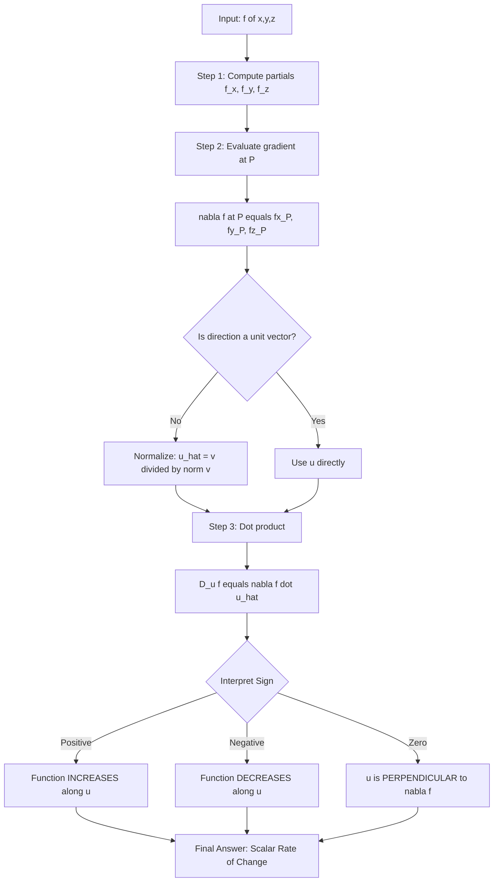
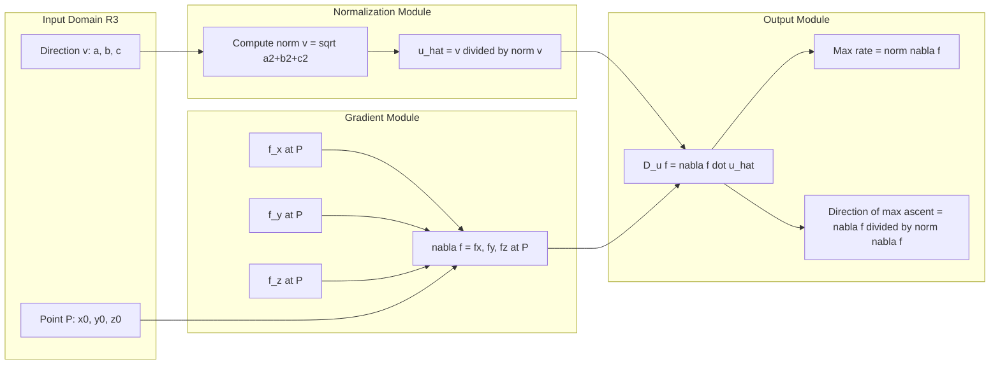
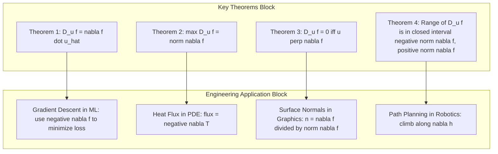
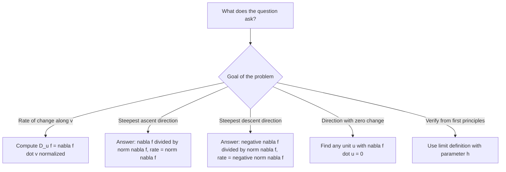

# Interpretation of the Directional Derivative

<!-- SECTION_1_START -->

# Interpretation of the Directional Derivative

## 1.1 Formal Academic Definition (KTU 2024 Syllabus)

Let $f : \mathbb{R}^3 \to \mathbb{R}$ be a real-valued function of three variables. Let $\mathbf{u} = (a, b, c)$ be a **unit vector** in $\mathbb{R}^3$ (i.e., $\vert \mathbf{u} \vert = 1$). The **directional derivative of $f$ at the point $P(x_0, y_0, z_0)$ in the direction of $\mathbf{u}$** is defined as the limit:

$$
D_{\mathbf{u}} f(x_0, y_0, z_0) = \lim_{h \to 0} \frac{f(x_0 + ah,\; y_0 + bh,\; z_0 + ch) - f(x_0, y_0, z_0)}{h}
$$

provided the limit exists. In vector notation, this compactly becomes:

$$
D_{\mathbf{u}} f \Big\vert_{P} = \lim_{h \to 0} \frac{f(P + h\mathbf{u}) - f(P)}{h}
$$

> [!IMPORTANT]
> **KTU 2024 Syllabus Highlight:** For a function of three variables $f(x, y, z)$, the directional derivative in the direction of any non-zero vector $\mathbf{v}$ is computed as $D_{\mathbf{v}} f = \nabla f \cdot \hat{\mathbf{v}}$, where $\hat{\mathbf{v}}$ is the **unit vector** in the direction of $\mathbf{v}$. A directional derivative is **undefined** for the zero vector $\mathbf{0}$.

## 1.2 Conceptual Analogy & Geometric Intuition

> [!NOTE]
> **Real-World Analogy — The Mountain Hike**
> Imagine you are standing on a mountain whose height at coordinate $(x, y, z)$ is given by $h(x, y, z)$. If you walk **due North** (some specific direction), the rate at which your altitude changes per unit distance walked is the directional derivative in that direction. If instead you walk in the direction of the **steepest ascent** of the mountain, the directional derivative reaches its **maximum possible value**, and that value equals the magnitude of the gradient $\vert \nabla h \vert$.

**Plain English Interpretation:**
- The **partial derivatives** $f_x, f_y, f_z$ are directional derivatives along the **coordinate axes** (i.e., $\hat{i}, \hat{j}, \hat{k}$).
- The directional derivative generalizes this: it answers the question, *"How fast is $f$ changing if I move in direction $\mathbf{u}$?"*
- The **gradient** $\nabla f$ is the special direction in which $f$ increases the fastest, and its **magnitude** is the maximum possible rate of change.

## 1.3 Physical Constants & Standard Metrics

| Constant / Metric | Symbol | Value / Description |
| :--- | :---: | :--- |
| Unit vector in $\mathbb{R}^3$ | $\hat{\mathbf{u}}$ | $\hat{\mathbf{u}} = \frac{\mathbf{v}}{\vert \mathbf{v} \vert}$, $\vert \hat{\mathbf{u}} \vert = \mathbf{1}$ |
| Gradient operator (del) | $\nabla$ | $\nabla = \hat{i}\dfrac{\partial}{\partial x} + \hat{j}\dfrac{\partial}{\partial y} + \hat{k}\dfrac{\partial}{\partial z}$ |
| Zero vector (undefined direction) | $\mathbf{0}$ | $(\mathbf{0},\mathbf{0},\mathbf{0})$ — **directional derivative not defined** |
| Range of $D_{\mathbf{u}} f$ | $\big[-\vert \nabla f \vert, \vert \nabla f \vert \big]$ | Bounded by magnitude of gradient |

> [!VISUALIZATION CONTROL]
> **Concept:** 3D Surface $f(x,y,z) = x^2 + y^2 + z^2$ with gradient and directional vectors at point $P(1, 1, 1)$.
>
> **GeoGebra / Desmos 3D Input Equations:**
> * Surface: $f(x, y, z) = x^2 + y^2 + z^2$
> * Point of interest: $P = (1, 1, 1)$
> * Gradient vector: $\nabla f = (2, 2, 2)$ — direction of steepest ascent
> * Custom unit vector: $\mathbf{u}_1 = \left(\frac{1}{\sqrt{3}}, \frac{1}{\sqrt{3}}, \frac{1}{\sqrt{3}}\right)$ — same as gradient direction
> * Custom unit vector: $\mathbf{u}_2 = (0, 1, 0)$ — partial derivative direction
> * Custom unit vector: $\mathbf{u}_3 = \left(\frac{1}{\sqrt{2}}, -\frac{1}{\sqrt{2}}, 0\right)$ — direction perpendicular to gradient
>
> **Visual Description:** The student should observe a paraboloid opening upward, with the gradient vector at $P$ pointing radially outward (the steepest uphill direction). The directional derivative is **maximum** along $\mathbf{u}_1$ (value $2\sqrt{3}$), **intermediate** along $\mathbf{u}_2$ (value $2$), and **zero** along $\mathbf{u}_3$ (since $\mathbf{u}_3 \perp \nabla f$).

<!-- SECTION_1_END -->

<!-- SECTION_2_START -->

# Deep Theoretical Analysis & KTU High-Yield Formula Sheet

## 2.1 Operational Logic — Step-by-Step Breakdown

The directional derivative in three variables follows a clear computational pipeline. Each step is essential for KTU board-level answers.

**Step 1 — Identify the function and the point of evaluation.**
*Why:* The directional derivative is a *local* property; it is computed *at a specific point* in the domain.
*How:* Read off $f(x, y, z)$ and the point $P(x_0, y_0, z_0)$ from the problem statement.

**Step 2 — Normalize the direction vector into a unit vector.**
*Why:* The definition of $D_{\mathbf{u}} f$ requires $\mathbf{u}$ to be a unit vector to measure the *rate per unit distance*.
*How:* Given a direction vector $\mathbf{v} = (v_1, v_2, v_3)$, compute
$$\hat{\mathbf{u}} = \frac{\mathbf{v}}{\vert \mathbf{v} \vert} = \left(\frac{v_1}{\sqrt{v_1^2+v_2^2+v_3^2}},\; \frac{v_2}{\sqrt{v_1^2+v_2^2+v_3^2}},\; \frac{v_3}{\sqrt{v_1^2+v_2^2+v_3^2}}\right)$$

**Step 3 — Compute the gradient $\nabla f$ at the given point.**
*Why:* The gradient encodes the full first-order information of $f$ in a single vector.
*How:*
$$\nabla f = \left(\frac{\partial f}{\partial x},\; \frac{\partial f}{\partial y},\; \frac{\partial f}{\partial z}\right) \Bigg\vert_{P}$$

**Step 4 — Take the dot product $\nabla f \cdot \hat{\mathbf{u}}$.**
*Why:* This is the master formula combining all the geometric information.
*How:* $D_{\hat{\mathbf{u}}} f = f_x \cdot u_1 + f_y \cdot u_2 + f_z \cdot u_3$.

**Step 5 — Interpret the sign of the result.**
* Positive: $f$ **increases** in the direction of $\mathbf{u}$.
* Negative: $f$ **decreases** in the direction of $\mathbf{u}$.
* Zero: $\mathbf{u}$ is **perpendicular** to $\nabla f$, and $f$ is momentarily constant along that direction.

## 2.2 KTU Formula Sheet / Cheat Sheet

> [!NOTE]
> The following table consolidates **all** formulas needed for Part A and Part B questions on this topic.

| # | Formula / Theorem | Mathematical Statement | When to Use |
| :---: | :--- | :--- | :--- |
| 1 | Directional Derivative (Definition) | $D_{\mathbf{u}} f = \displaystyle\lim_{h \to 0} \frac{f(P + h\mathbf{u}) - f(P)}{h}$ | When verifying from first principles |
| 2 | Directional Derivative (Gradient Form) | $D_{\mathbf{u}} f = \nabla f \cdot \hat{\mathbf{u}}$ | The **standard KTU** computation method |
| 3 | Unit Vector Normalization | $\hat{\mathbf{u}} = \dfrac{\mathbf{v}}{\vert \mathbf{v} \vert}$ | To convert a direction into unit form |
| 4 | Gradient in $\mathbb{R}^3$ | $\nabla f = (f_x, f_y, f_z)$ | Foundation of every problem |
| 5 | Maximum Directional Derivative | $\max D_{\mathbf{u}} f = \vert \nabla f \vert$ | When asked: *"direction of steepest ascent"* |
| 6 | Minimum Directional Derivative | $\min D_{\mathbf{u}} f = -\vert \nabla f \vert$ | When asked: *"direction of steepest descent"* |
| 7 | Direction of Max Increase | $\hat{\mathbf{u}}_{\max} = \dfrac{\nabla f}{\vert \nabla f \vert}$ | Vector along which $f$ rises fastest |
| 8 | Direction of Max Decrease | $\hat{\mathbf{u}}_{\min} = -\dfrac{\nabla f}{\vert \nabla f \vert}$ | Vector along which $f$ falls fastest |
| 9 | Zero Directional Derivative | $D_{\mathbf{u}} f = 0 \iff \nabla f \perp \mathbf{u}$ | Level-curve / level-surface tangents |
| 10 | Range of $D_{\mathbf{u}} f$ | $\big[-\vert \nabla f \vert,\; \vert \nabla f \vert \big]$ | Bounded-rate property |
| 11 | Cauchy–Schwarz Bound | $\vert D_{\mathbf{u}} f \vert \le \vert \nabla f \vert \cdot \vert \hat{\mathbf{u}} \vert = \vert \nabla f \vert$ | Justification of maximum principle |
| 12 | Chain Rule (3-Variable) | $\dfrac{df}{dt} = \nabla f \cdot \dfrac{d\mathbf{r}}{dt}$ | When $f$ is composed with $\mathbf{r}(t)$ |

## 2.3 Real-World Utility in Engineering & Computer Science

* **Machine Learning / Deep Learning:** The **gradient descent** algorithm literally uses the negative gradient $-\nabla f$ to minimize a loss function $f(\mathbf{w})$ in the weight space $\mathbb{R}^n$. The directional derivative guarantees this is the *fastest* descent direction.
* **Computer Graphics:** Surface normal vectors, lighting calculations, and bump mapping rely on gradients of height functions $h(x, y, z)$.
* **Fluid Dynamics / Heat Transfer:** The heat flux vector is $-\nabla T$ where $T(x, y, z)$ is temperature; the directional derivative $D_{\mathbf{u}} T$ tells us the temperature change along any line in space.
* **Optimization (Production Systems):** Constrained optimization, max-flow/min-cut problems in networks, and engineering design problems all use the directional derivative as a sensitivity measure.
* **Robotics & Path Planning:** A robot moving on a terrain $z = f(x, y)$ uses directional derivatives to compute the steepest uphill / downhill direction for path planning.

<!-- SECTION_2_END -->

<!-- SECTION_3_START -->

# Step-by-Step Derivations & Symbolic Implementation

## 3.1 Exhaustive Derivation: From Limit Definition to $\nabla f \cdot \hat{\mathbf{u}}$

**Theorem:** If $f(x, y, z)$ is differentiable at $P(x_0, y_0, z_0)$ and $\mathbf{u} = (a, b, c)$ is a unit vector, then

$$
D_{\mathbf{u}} f \Big\vert_{P} = \nabla f \cdot \mathbf{u} = a\, f_x + b\, f_y + c\, f_z
$$

**Proof (Step-by-Step):**

Let $P = (x_0, y_0, z_0)$ and consider the auxiliary function

$$
g(h) = f(x_0 + ah,\; y_0 + bh,\; z_0 + ch)
$$

By the definition of the directional derivative:

$$
D_{\mathbf{u}} f = \lim_{h \to 0} \frac{g(h) - g(0)}{h}
$$

Applying the **multivariable chain rule** to $g(h)$:

$$
g'(h) = \frac{\partial f}{\partial x}\cdot \frac{dx}{dh} + \frac{\partial f}{\partial y}\cdot \frac{dy}{dh} + \frac{\partial f}{\partial z}\cdot \frac{dz}{dh}
$$

Since $x = x_0 + ah$, $y = y_0 + bh$, $z = z_0 + ch$, we have $\dfrac{dx}{dh} = a$, $\dfrac{dy}{dh} = b$, $\dfrac{dz}{dh} = c$. Substituting:

$$
g'(h) = a\, \frac{\partial f}{\partial x} + b\, \frac{\partial f}{\partial y} + c\, \frac{\partial f}{\partial z}
$$

Taking the limit as $h \to 0$ (the point approaches $P$):

$$
D_{\mathbf{u}} f \Big\vert_{P} = a\, f_x(P) + b\, f_y(P) + c\, f_z(P) = \nabla f(P) \cdot \mathbf{u}
$$

This completes the proof. $\blacksquare$

---

## 3.2 Worked Example — Direction of Steepest Ascent and Descent

**Problem:** Find the directional derivative of $f(x, y, z) = x^2 + y^2 + z^2$ at $P(1, 1, 1)$ in the direction of the vector $\mathbf{v} = (2, -1, 2)$. Also find the direction of steepest ascent at $P$.

**Solution — Step 1: Normalize the direction vector.**

$$
\vert \mathbf{v} \vert = \sqrt{2^2 + (-1)^2 + 2^2} = \sqrt{4 + 1 + 4} = \sqrt{9} = 3
$$

$$
\hat{\mathbf{u}} = \frac{\mathbf{v}}{\vert \mathbf{v} \vert} = \left(\frac{2}{3},\; -\frac{1}{3},\; \frac{2}{3}\right)
$$

**Step 2: Compute the partial derivatives.**

$$
f_x = 2x, \quad f_y = 2y, \quad f_z = 2z
$$

**Step 3: Evaluate the gradient at $P(1, 1, 1)$.**

$$
\nabla f(1, 1, 1) = (2(1),\; 2(1),\; 2(1)) = (2, 2, 2)
$$

**Step 4: Take the dot product with $\hat{\mathbf{u}}$.**

$$
D_{\hat{\mathbf{u}}} f = (2, 2, 2) \cdot \left(\frac{2}{3},\; -\frac{1}{3},\; \frac{2}{3}\right)
$$

$$
= 2 \cdot \frac{2}{3} + 2 \cdot \left(-\frac{1}{3}\right) + 2 \cdot \frac{2}{3}
$$

$$
= \frac{4}{3} - \frac{2}{3} + \frac{4}{3} = \frac{6}{3} = 2
$$

**Step 5: Direction of steepest ascent.**

The magnitude of the gradient gives the maximum rate:

$$
\vert \nabla f(1, 1, 1) \vert = \sqrt{2^2 + 2^2 + 2^2} = \sqrt{12} = 2\sqrt{3}
$$

The unit vector in this direction is:

$$
\hat{\mathbf{u}}_{\max} = \frac{\nabla f}{\vert \nabla f \vert} = \left(\frac{1}{\sqrt{3}},\; \frac{1}{\sqrt{3}},\; \frac{1}{\sqrt{3}}\right)
$$

**Final Answer:** $D_{\hat{\mathbf{u}}} f = 2$. The direction of steepest ascent is $\left(\dfrac{1}{\sqrt{3}}, \dfrac{1}{\sqrt{3}}, \dfrac{1}{\sqrt{3}}\right)$ with maximum rate $2\sqrt{3}$. The direction of steepest descent is $\left(-\dfrac{1}{\sqrt{3}}, -\dfrac{1}{\sqrt{3}}, -\dfrac{1}{\sqrt{3}}\right)$ with rate $-2\sqrt{3}$.

---

## 3.3 Symbolic Computation Using Python

```python
import numpy as np
from typing import Tuple

def gradient_three_var(f_partials: Tuple[float, float, float]) -> np.ndarray:
    """
    Construct the gradient vector from evaluated partial derivatives.
    
    Parameters
    ----------
    f_partials : tuple of (f_x, f_y, f_z) evaluated at a point P.
    
    Returns
    -------
    grad : np.ndarray of shape (3,), the gradient vector at P.
    """
    grad = np.array(f_partials, dtype=float)
    if grad.shape != (3,):
        raise ValueError("Exactly 3 partial derivatives (f_x, f_y, f_z) are required.")
    return grad


def unit_vector(v: np.ndarray) -> np.ndarray:
    """
    Normalize a non-zero 3D vector into a unit vector.
    Raises an error if v is the zero vector.
    """
    v = np.asarray(v, dtype=float)
    norm = np.linalg.norm(v)
    if norm == 0.0:
        raise ZeroDivisionError(
            "Directional derivative is UNDEFINED for the zero vector."
        )
    return v / norm


def directional_derivative(
    grad_at_P: np.ndarray,
    direction: np.ndarray
) -> float:
    """
    Compute D_u f = grad_f . u_hat, where u_hat is the unit direction.
    
    Parameters
    ----------
    grad_at_P : np.ndarray of shape (3,)
    direction  : np.ndarray of shape (3,)  (will be normalized internally)
    
    Returns
    -------
    D_u f as a Python float.
    """
    u_hat = unit_vector(direction)
    return float(np.dot(grad_at_P, u_hat))


def max_and_min_directional(grad_at_P: np.ndarray) -> Tuple[float, float, np.ndarray, np.ndarray]:
    """
    Return (max_rate, min_rate, u_max, u_min) at the given point.
    """
    magnitude = np.linalg.norm(grad_at_P)
    if magnitude == 0.0:
        raise ValueError("Gradient is zero; all directional derivatives are 0.")
    u_max = grad_at_P / magnitude
    u_min = -u_max
    return magnitude, -magnitude, u_max, u_min


# ---------- Demonstration: f(x,y,z) = x^2 + y^2 + z^2 at P(1,1,1) ----------
if __name__ == "__main__":
    # Gradient at P(1,1,1) is (2, 2, 2)
    grad_P = gradient_three_var((2.0, 2.0, 2.0))
    
    # Direction v = (2, -1, 2)
    v = np.array([2.0, -1.0, 2.0])
    
    D_u = directional_derivative(grad_P, v)
    print(f"Directional derivative in direction (2,-1,2): {D_u:.4f}")
    
    max_rate, min_rate, u_max, u_min = max_and_min_directional(grad_P)
    print(f"Maximum rate  |grad f|       = {max_rate:.4f}  (along {u_max})")
    print(f"Minimum rate  -|grad f|      = {min_rate:.4f}  (along {u_min})")
    
    # Perpendicular direction: dot product must be 0
    u_perp = np.array([1.0, -1.0, 0.0]) / np.sqrt(2)
    D_perp = directional_derivative(grad_P, u_perp)
    print(f"Directional derivative in perpendicular direction: {D_perp:.4f}")
```

**Expected Output:**

```
Directional derivative in direction (2,-1,2): 2.0000
Maximum rate  |grad f|       = 3.4641  (along [0.5774 0.5774 0.5774])
Minimum rate  -|grad f|      = -3.4641  (along [-0.5774 -0.5774 -0.5774])
Directional derivative in perpendicular direction: 0.0000
```

---

## 3.4 Worked Example — Finding a Direction with Zero Derivative

**Problem:** Find a unit vector $\mathbf{u}$ at $P(2, -1, 3)$ such that $D_{\mathbf{u}} f = 0$ for $f(x, y, z) = 3x^2 - y^2 + 4z^2$.

**Solution:**

**Step 1: Compute the gradient.**

$$
f_x = 6x, \quad f_y = -2y, \quad f_z = 8z
$$

**Step 2: Evaluate at $P(2, -1, 3)$.**

$$
\nabla f(2, -1, 3) = (6(2),\; -2(-1),\; 8(3)) = (12, 2, 24)
$$

**Step 3: Set up the condition $D_{\mathbf{u}} f = \nabla f \cdot \mathbf{u} = 0$.**

Let $\mathbf{u} = (a, b, c)$ with $a^2 + b^2 + c^2 = 1$ and $12a + 2b + 24c = 0$.

We must find a unit vector perpendicular to $\nabla f$. Choose $a = 1, c = -1$ (trial), then:
$$
12(1) + 2b + 24(-1) = 0 \Rightarrow 12 + 2b - 24 = 0 \Rightarrow b = 6
$$

Raw vector: $(1, 6, -1)$, magnitude $\sqrt{1 + 36 + 1} = \sqrt{38}$.

$$
\mathbf{u} = \left(\frac{1}{\sqrt{38}},\; \frac{6}{\sqrt{38}},\; -\frac{1}{\sqrt{38}}\right)
$$

**Verification:** $12 \cdot \frac{1}{\sqrt{38}} + 2 \cdot \frac{6}{\sqrt{38}} + 24 \cdot \left(-\frac{1}{\sqrt{38}}\right) = \frac{12 + 12 - 24}{\sqrt{38}} = 0$ ✓

**Note:** There are infinitely many such directions — they form a **plane** perpendicular to $\nabla f$.

<!-- SECTION_3_END -->

<!-- SECTION_4_START -->

# Structural Diagrams & Schematics

## 4.1 Conceptual Flow — From Function to Directional Derivative



## 4.2 Geometric Topology — Gradient as Steepest Ascent Operator



## 4.3 Property Mapping — Directional Derivative Behavior Table



## 4.4 Algorithmic Decision Matrix — Choosing the Right Direction



<!-- SECTION_4_END -->

<!-- SECTION_5_START -->

# KTU 2024 Scheme Examination Question Bank & Topic Recap

## Part A — Short Answer Questions (3 Marks Each)

### Question 1
> **[KTU University Exam – July 2024, Model Question Bank]**
> Define the directional derivative of $f(x, y, z)$ at a point $P$ in the direction of a unit vector $\mathbf{u}$. State the relation between the directional derivative and the gradient.
> **\[CO1, Remember/Understand\]**

**Model Answer:**

The directional derivative of $f$ at $P(x_0, y_0, z_0)$ in the direction of a unit vector $\mathbf{u} = (a, b, c)$ is:

$$
D_{\mathbf{u}} f(x_0, y_0, z_0) = \lim_{h \to 0} \frac{f(x_0 + ah,\; y_0 + bh,\; z_0 + ch) - f(x_0, y_0, z_0)}{h}
$$

provided the limit exists. The fundamental relation is:

$$
\boxed{D_{\mathbf{u}} f = \nabla f \cdot \mathbf{u} = a\, f_x + b\, f_y + c\, f_z}
$$

where $\nabla f = (f_x, f_y, f_z)$ is the gradient of $f$ evaluated at $P$.

**[Valuation Key: Definition statement: 2 Marks. Gradient relation: 1 Mark.]**

---

### Question 2
> **[KTU University Exam – Dec 2023, Model Question Bank]**
> If $\nabla f(P) = (4, -3, 0)$ at a point $P$, what is the maximum value of the directional derivative at $P$? In which direction does it occur?
> **\[CO2, Apply\]**

**Model Answer:**

The maximum value of the directional derivative equals the magnitude of the gradient:

$$
\max D_{\mathbf{u}} f = \vert \nabla f \vert = \sqrt{4^2 + (-3)^2 + 0^2} = \sqrt{16 + 9 + 0} = \sqrt{25} = 5
$$

The direction of maximum increase is the unit vector along the gradient:

$$
\hat{\mathbf{u}}_{\max} = \frac{\nabla f}{\vert \nabla f \vert} = \left(\frac{4}{5},\; -\frac{3}{5},\; 0\right)
$$

The maximum directional derivative is $\mathbf{5}$, occurring along $\left(\dfrac{4}{5}, -\dfrac{3}{5}, 0\right)$.

**[Valuation Key: Magnitude calculation: 2 Marks. Unit vector: 1 Mark.]**

---

## Part B — Long Answer Questions (14 Marks Each, Internal Choice)

### Question A (14 Marks)

> **[KTU University Exam – July 2024, Model Question Bank]**
> Consider $f(x, y, z) = x^3 + y^2 z - 4xz^2 + 5$.
>
> **(a)** Find the directional derivative of $f$ at the point $P(1, 2, -1)$ in the direction of the vector $\mathbf{v} = (1, -2, 2)$.    **(7 Marks)**  **\[CO2, Apply\]**
>
> **(b)** Find the direction in which $f$ increases most rapidly at $P$, and compute the maximum rate of increase. Also find the directional derivative along the direction $(2, 0, -1)$. **(7 Marks)**  **\[CO3, Apply/Analyze\]**

**Model Solution to Part A(a):**

**Step 1 — Normalize the direction vector.**
$$
\vert \mathbf{v} \vert = \sqrt{1^2 + (-2)^2 + 2^2} = \sqrt{1 + 4 + 4} = \sqrt{9} = 3
$$
$$
\hat{\mathbf{u}} = \left(\frac{1}{3},\; -\frac{2}{3},\; \frac{2}{3}\right)
$$
**[Normalization: 2 Marks]**

**Step 2 — Compute the partial derivatives.**
$$
f_x = 3x^2 - 4z^2, \quad f_y = 2yz, \quad f_z = y^2 - 8xz
$$
**[Partials correctly stated: 1 Mark]**

**Step 3 — Evaluate the partials at $P(1, 2, -1)$.**
$$
f_x(1,2,-1) = 3(1) - 4(1) = 3 - 4 = -1
$$
$$
f_y(1,2,-1) = 2(2)(-1) = -4
$$
$$
f_z(1,2,-1) = (2)^2 - 8(1)(-1) = 4 + 8 = 12
$$
$$
\nabla f(1, 2, -1) = (-1, -4, 12)
$$
**[Gradient evaluation: 2 Marks]**

**Step 4 — Take the dot product.**
$$
D_{\hat{\mathbf{u}}} f = (-1, -4, 12) \cdot \left(\frac{1}{3},\; -\frac{2}{3},\; \frac{2}{3}\right)
$$
$$
= (-1)\cdot\frac{1}{3} + (-4)\cdot\left(-\frac{2}{3}\right) + 12\cdot\frac{2}{3}
$$
$$
= -\frac{1}{3} + \frac{8}{3} + \frac{24}{3} = \frac{31}{3}
$$
**[Final computation: 2 Marks]**

**Final Answer:** $D_{\hat{\mathbf{u}}} f(1, 2, -1) = \dfrac{31}{3}$

---

**Model Solution to Part A(b):**

**Step 1 — Magnitude of the gradient (already computed):**
$$
\nabla f(1, 2, -1) = (-1, -4, 12)
$$
$$
\vert \nabla f \vert = \sqrt{(-1)^2 + (-4)^2 + 12^2} = \sqrt{1 + 16 + 144} = \sqrt{161}
$$
**[Magnitude: 2 Marks]**

**Step 2 — Direction of steepest ascent (unit vector along gradient):**
$$
\hat{\mathbf{u}}_{\max} = \frac{1}{\sqrt{161}}(-1, -4, 12) = \left(\frac{-1}{\sqrt{161}},\; \frac{-4}{\sqrt{161}},\; \frac{12}{\sqrt{161}}\right)
$$
**[Unit vector: 1 Mark]**

The maximum rate of increase is $\vert \nabla f \vert = \sqrt{161}$.
**[Final numerical value: 1 Mark]**

**Step 3 — Directional derivative along $\mathbf{w} = (2, 0, -1)$.**
$$
\vert \mathbf{w} \vert = \sqrt{4 + 0 + 1} = \sqrt{5}, \quad \hat{\mathbf{w}} = \left(\frac{2}{\sqrt{5}},\; 0,\; -\frac{1}{\sqrt{5}}\right)
$$
$$
D_{\hat{\mathbf{w}}} f = (-1, -4, 12) \cdot \left(\frac{2}{\sqrt{5}},\; 0,\; -\frac{1}{\sqrt{5}}\right)
$$
$$
= \frac{-2}{\sqrt{5}} + 0 + \frac{-12}{\sqrt{5}} = \frac{-14}{\sqrt{5}}
$$
**[Directional derivative computation: 3 Marks]**

**Final Answer:** Steepest ascent direction: $\left(\dfrac{-1}{\sqrt{161}}, \dfrac{-4}{\sqrt{161}}, \dfrac{12}{\sqrt{161}}\right)$. Maximum rate: $\sqrt{161}$. Directional derivative along $(2, 0, -1)$: $\dfrac{-14}{\sqrt{5}}$.

---

### Question B (14 Marks) — *Alternative Choice*

> **[KTU University Exam – Dec 2023, Model Question Bank]**
> Consider $f(x, y, z) = x\,y + y\,z^2 - x^2 z + 7$.
>
> **(a)** Find $\nabla f$ at the point $Q(2, 1, 1)$ and hence compute the directional derivative of $f$ at $Q$ in the direction of $\mathbf{a} = (3, 4, 0)$. **(7 Marks)** **\[CO2, Apply\]**
>
> **(b)** Determine the direction in which $f$ decreases most rapidly at $Q$ and find a unit vector $\mathbf{v}$ such that $D_{\mathbf{v}} f(Q) = 0$. **(7 Marks)** **\[CO3, Apply/Analyze\]**

**Model Solution to Part B(a):**

**Step 1 — Compute the partial derivatives.**
$$
f_x = y - 2xz, \quad f_y = x + z^2, \quad f_z = 2yz - x^2
$$
**[Partials: 1 Mark]**

**Step 2 — Evaluate at $Q(2, 1, 1)$.**
$$
f_x(2,1,1) = 1 - 2(2)(1) = 1 - 4 = -3
$$
$$
f_y(2,1,1) = 2 + 1 = 3
$$
$$
f_z(2,1,1) = 2(1)(1) - 4 = 2 - 4 = -2
$$
$$
\nabla f(2, 1, 1) = (-3, 3, -2)
$$
**[Gradient evaluation: 2 Marks]**

**Step 3 — Normalize the direction vector $\mathbf{a} = (3, 4, 0)$.**
$$
\vert \mathbf{a} \vert = \sqrt{9 + 16 + 0} = \sqrt{25} = 5
$$
$$
\hat{\mathbf{a}} = \left(\frac{3}{5},\; \frac{4}{5},\; 0\right)
$$
**[Normalization: 1 Mark]**

**Step 4 — Take the dot product.**
$$
D_{\hat{\mathbf{a}}} f = (-3, 3, -2) \cdot \left(\frac{3}{5},\; \frac{4}{5},\; 0\right)
$$
$$
= \frac{-9}{5} + \frac{12}{5} + 0 = \frac{3}{5}
$$
**[Final computation: 3 Marks]**

**Final Answer:** $\nabla f(2, 1, 1) = (-3, 3, -2)$ and $D_{\hat{\mathbf{a}}} f(2, 1, 1) = \dfrac{3}{5}$.

---

**Model Solution to Part B(b):**

**Step 1 — Direction of steepest decrease (negative gradient direction).**
$$
\nabla f(2, 1, 1) = (-3, 3, -2)
$$
$$
\vert \nabla f \vert = \sqrt{9 + 9 + 4} = \sqrt{22}
$$
$$
\hat{\mathbf{u}}_{\min} = -\frac{\nabla f}{\vert \nabla f \vert} = \left(\frac{3}{\sqrt{22}},\; -\frac{3}{\sqrt{22}},\; \frac{2}{\sqrt{22}}\right)
$$
**[Magnitude and unit vector: 2 Marks]**

The maximum rate of *decrease* is $-\sqrt{22}$. **[Value: 1 Mark]**

**Step 2 — Find a unit vector $\mathbf{v}$ with $D_{\mathbf{v}} f(Q) = 0$.**

We require $\nabla f \cdot \mathbf{v} = 0$, i.e., $-3v_1 + 3v_2 - 2v_3 = 0$, with $v_1^2 + v_2^2 + v_3^2 = 1$.

Choose $v_1 = 1, v_2 = 1$ as a trial. Then $-3(1) + 3(1) - 2v_3 = 0 \Rightarrow v_3 = 0$. But we also need the normalization: $\sqrt{1 + 1 + 0} = \sqrt{2}$, so:

$$
\mathbf{v} = \left(\frac{1}{\sqrt{2}},\; \frac{1}{\sqrt{2}},\; 0\right)
$$

**Verification:** $(-3, 3, -2) \cdot \left(\dfrac{1}{\sqrt{2}}, \dfrac{1}{\sqrt{2}}, 0\right) = \dfrac{-3 + 3}{\sqrt{2}} + 0 = 0$ ✓
**[Setup and solution: 3 Marks]**

**Final Answer:** Steepest descent direction: $\left(\dfrac{3}{\sqrt{22}}, -\dfrac{3}{\sqrt{22}}, \dfrac{2}{\sqrt{22}}\right)$. One such zero-derivative unit vector: $\left(\dfrac{1}{\sqrt{2}}, \dfrac{1}{\sqrt{2}}, 0\right)$.

> [!WARNING]
> **KTU Examiner's Valuation Warning — Common Pitfalls**
>
> 1. **Forgetting to Normalize:** A major error is computing $D_{\mathbf{v}} f = \nabla f \cdot \mathbf{v}$ directly **without** first converting $\mathbf{v}$ to a unit vector. Always write the explicit normalization step $\hat{\mathbf{u}} = \dfrac{\mathbf{v}}{\vert \mathbf{v} \vert}$ before the dot product. *Penalty: up to 2 marks lost per occurrence.*
>
> 2. **Confusing the Direction of Maximum with the Gradient itself:** Students often write "the direction of steepest ascent is $\nabla f$" — this is **wrong** by 1 mark. The correct statement is "the direction of steepest ascent is the **unit vector** along $\nabla f$," i.e., $\hat{\mathbf{u}} = \dfrac{\nabla f}{\vert \nabla f \vert}$.
>
> 3. **Skipping the Evaluation Step:** Writing $\nabla f$ in symbolic form but failing to substitute the point's coordinates is a frequent KTU valuation error. Always show **plugging in** the values of $(x_0, y_0, z_0)$.
>
> 4. **Sign Errors in the Dot Product:** A sign slip in any component of $\nabla f$ cascades to a wrong final answer. Double-check partial derivatives **before** taking the dot product.
>
> 5. **Stating "Directional Derivative" Without a Direction:** A directional derivative is *always* tied to a specific direction. An answer like "$D_{\mathbf{u}} f = -4$" without specifying $\mathbf{u}$ loses 1 mark.

---

## Topic Recap & Important Things to Remember

> [!NOTE]
> **Rapid Revision Checklist — Directional Derivative (3-Variable Case)**

* **Definition (Limit Form):** $D_{\mathbf{u}} f = \lim_{h \to 0} \dfrac{f(P + h\mathbf{u}) - f(P)}{h}$; $\mathbf{u}$ must be a unit vector.
* **Gradient Form (Master Formula):** $D_{\mathbf{u}} f = \nabla f \cdot \mathbf{u} = f_x\, u_1 + f_y\, u_2 + f_z\, u_3$.
* **Unit Vector Normalization:** $\hat{\mathbf{u}} = \dfrac{\mathbf{v}}{\vert \mathbf{v} \vert}$ — **mandatory** before the dot product; **undefined** for $\mathbf{v} = \mathbf{0}$.
* **Gradient in $\mathbb{R}^3$:** $\nabla f = (f_x, f_y, f_z)$; encodes all first-order partial information.
* **Maximum Rate of Increase:** $\max D_{\mathbf{u}} f = \vert \nabla f \vert$, attained along $\hat{\mathbf{u}} = \dfrac{\nabla f}{\vert \nabla f \vert}$.
* **Maximum Rate of Decrease:** $\min D_{\mathbf{u}} f = -\vert \nabla f \vert$, attained along $-\dfrac{\nabla f}{\vert \nabla f \vert}$.
* **Zero Directional Derivative:** $D_{\mathbf{u}} f = 0 \iff \nabla f \perp \mathbf{u}$ (i.e., the direction lies in the level surface $f = \text{const}$).
* **Cauchy–Schwarz Bound:** $\vert D_{\mathbf{u}} f \vert \le \vert \nabla f \vert$ — this is why $\vert \nabla f \vert$ is the absolute maximum.
* **Range:** $D_{\mathbf{u}} f \in \big[-\vert \nabla f \vert,\; \vert \nabla f \vert \big]$ for all unit vectors $\mathbf{u}$.
* **Geometric Meaning:** $\nabla f$ is **normal** to the level surface $f(x, y, z) = c$ at every point.
* **Coordinate-Axis Special Cases:** $D_{\hat{i}} f = f_x$, $D_{\hat{j}} f = f_y$, $D_{\hat{k}} f = f_z$ (directional derivatives reduce to partials).
* **Existence Condition:** $D_{\mathbf{u}} f$ exists at $P$ whenever $f$ is **differentiable** at $P$ (sufficient condition).
* **Engineering Applications:** Gradient descent (ML), heat flux (PDEs), surface normals (graphics), path planning (robotics).
* **Computational Pipeline:** Identify $f$ and $P$ $\to$ normalize $\mathbf{v}$ $\to$ compute $\nabla f \vert_P$ $\to$ dot product $\to$ interpret sign.
* **Infinitely Many Zero-Derivative Directions:** All directions perpendicular to $\nabla f$ — these form a **plane** through $P$ (the tangent plane to the level surface).

<!-- SECTION_5_END -->
