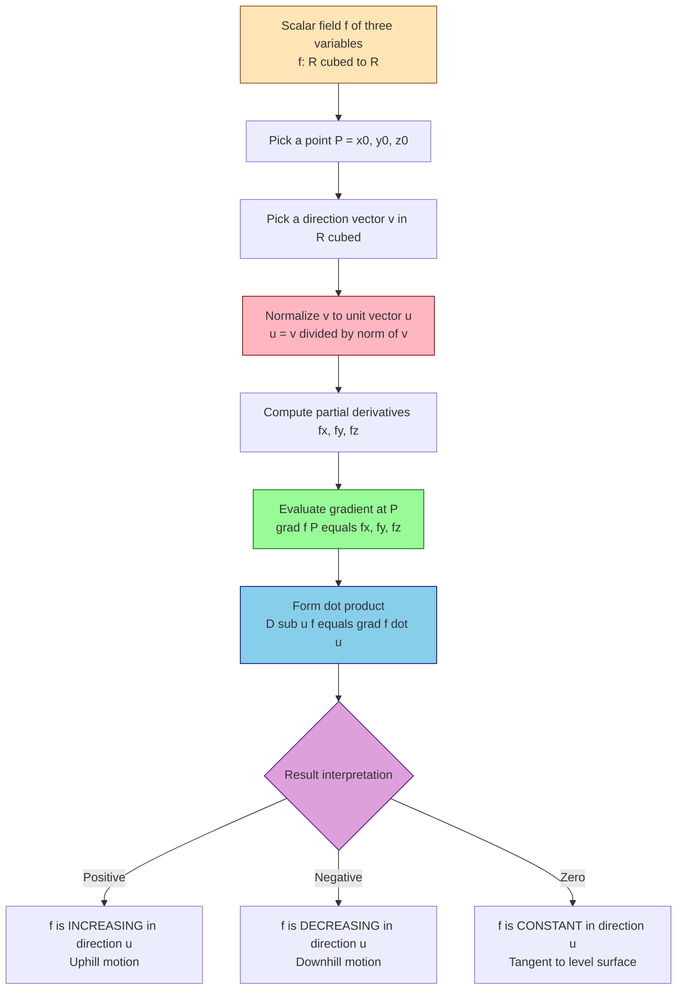
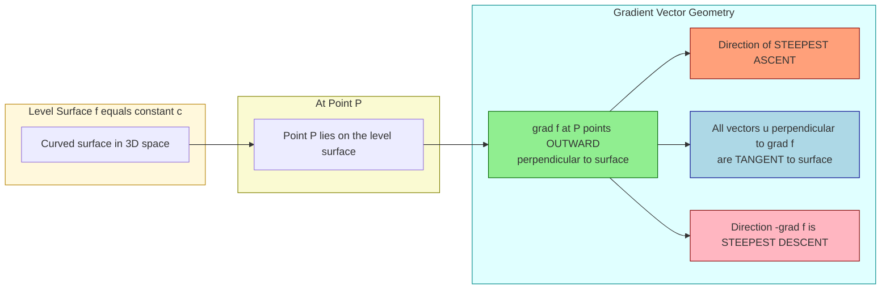
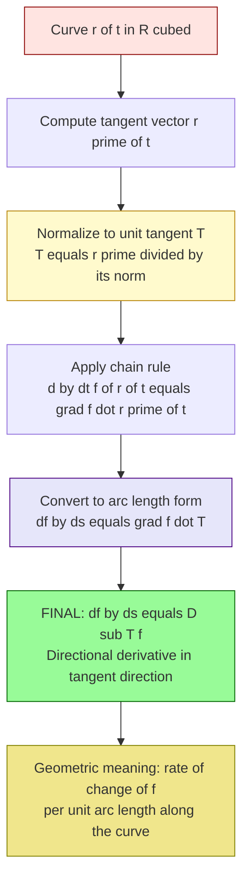
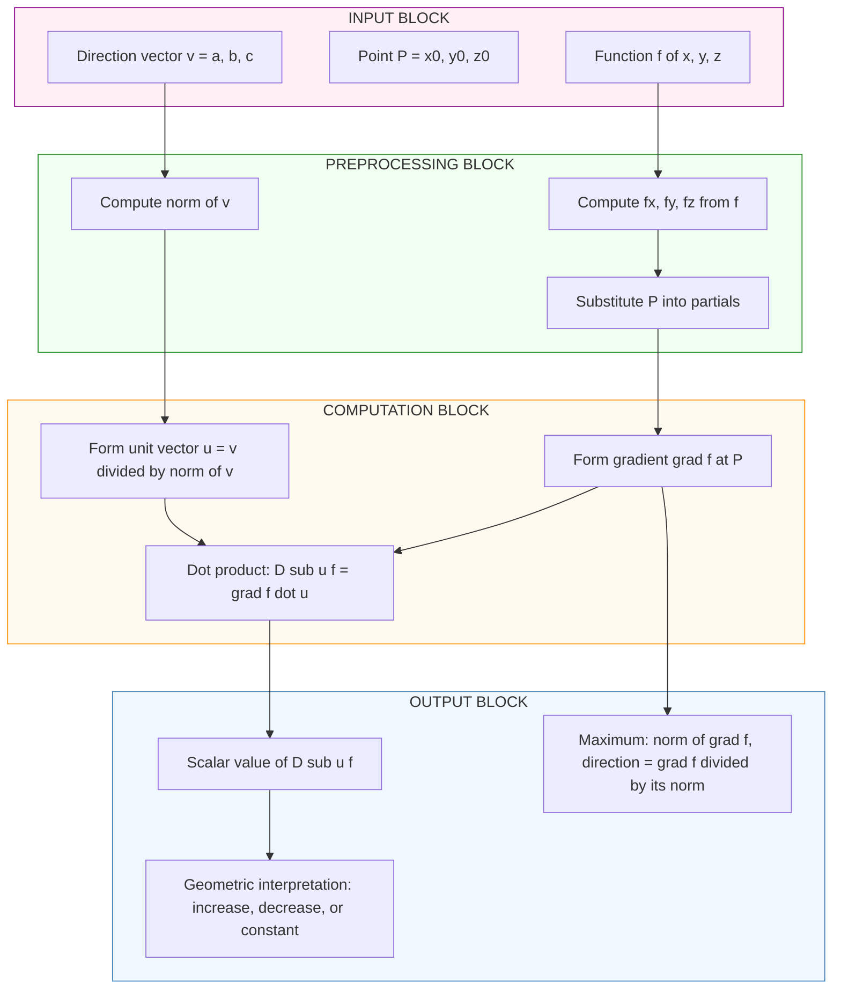
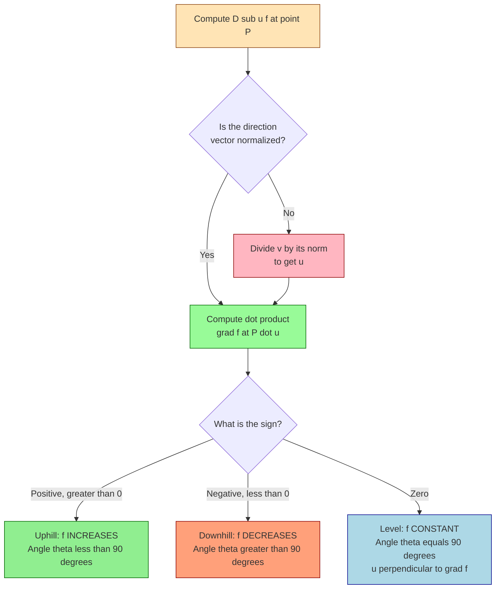

# Interpretation of the Directional Derivative

<!-- SECTION_1_START -->
# Interpretation of the Directional Derivative

## Formal Academic Definition (KTU 2024 Syllabus Terminology)

Let $f: \mathbb{R}^{3} \to \mathbb{R}$ be a real-valued function defined on an open set $U \subset \mathbb{R}^{3}$, and let $P = (x_0, y_0, z_0)$ be a point in $U$. Let $\mathbf{u} = \langle u_1, u_2, u_3 \rangle$ be a **unit vector** in $\mathbb{R}^{3}$ (so that $\lVert \mathbf{u} \rVert = 1$).

> [!IMPORTANT]
> **Directional Derivative (Board Definition):**
> The **directional derivative** of $f$ at $P$ in the direction of $\mathbf{u}$, denoted $D_{\mathbf{u}}f(P)$, is defined by the limit
> $$D_{\mathbf{u}}f(x_0, y_0, z_0) = \lim_{h \to 0} \frac{f(x_0 + h u_1,\; y_0 + h u_2,\; z_0 + h u_3) - f(x_0, y_0, z_0)}{h}$$
> provided this limit exists. The quantity $D_{\mathbf{u}}f(P)$ represents the **instantaneous rate of change** of $f$ at $P$ per unit distance, measured along the ray emanating from $P$ in the direction of $\mathbf{u}$.

If $f$ is **differentiable** at $P$, the limit can be compactly evaluated using the **gradient operator** $\nabla f = \langle f_x, f_y, f_z \rangle$ as
$$D_{\mathbf{u}}f(P) = \nabla f(P) \cdot \mathbf{u} = f_x(P)\,u_1 + f_y(P)\,u_2 + f_z(P)\,u_3$$

---

## Conceptual Analogy & Intuitive Overview

> [!NOTE]
> **The Mountain Hiker Analogy (Geometric Intuition)**
> Imagine you are standing on a mountainous terrain whose altitude at the point $(x, y, z)$ is described by the scalar field $f(x, y, z)$ — for instance, a 3-D surface defined by the temperature $T(x, y, z)$ measured at every point in a room, or the altitude $h(x, y, z)$ of a hill.
>
> The **partial derivatives** $f_x$, $f_y$, and $f_z$ tell you the slope of the terrain only when you walk along the **coordinate axes** (East, North, or Up). But what if you want to know how fast you are climbing when you walk in an **arbitrary direction** $\mathbf{u}$ — say, Northeast and slightly upward, all at once? That is exactly what the directional derivative answers.
>
> - If $D_{\mathbf{u}}f > 0$ → $f$ is **increasing** in direction $\mathbf{u}$ (you are going uphill).
> - If $D_{\mathbf{u}}f < 0$ → $f$ is **decreasing** in direction $\mathbf{u}$ (you are going downhill).
> - If $D_{\mathbf{u}}f = 0$ → $f$ is **constant** to first order in direction $\mathbf{u}$ (you are on a level tangent path).

### Physical Interpretations Across Information Science

| Discipline | Scalar Field $f$ | Directional Derivative Meaning |
|---|---|---|
| **Thermal Engineering** | Temperature $T(x,y,z)$ | Heat flow rate per unit length in a chosen direction |
| **Computer Graphics** | Light intensity / Z-buffer depth | Rate of brightness change across a 3-D surface |
| **Machine Learning** | Loss function $L(\theta_1, \theta_2, \theta_3)$ | Rate of loss change along a chosen update vector $\mathbf{u}$ |
| **Electromagnetics** | Electric potential $V(x,y,z)$ | Component of the electric field along $\mathbf{u}$ |
| **Data Science / Heat Maps** | Probability density $p(x,y,z)$ | Local steepness along a given sampling direction |

> [!TIP]
> **Why $\mathbf{u}$ MUST be a unit vector?**
> Because the denominator $h$ measures the **actual geometric distance** traveled along the ray. If $\lVert \mathbf{u} \rVert \neq 1$, then the quantity $h u_i$ would be measuring something other than a true Euclidean displacement, and the limit would no longer represent a "rate per unit length". KTU examiners specifically check whether you have **normalized** the direction vector — this is a common 1-mark deduction point.

---

## GeoGebra / Desmos Visualization Callout

> [!VISUALIZATION CONTROL]
> **Concept:** Directional derivative on a 3-D scalar surface $f(x, y, z) = x^2 + y^2 + z^2$ at the point $P = (1, 1, 1)$.
>
> **GeoGebra / Desmos Input Equations (use 3-D Graphing mode):**
> * Surface: `f(x, y, z) = x^2 + y^2 + z^2`
> * Point: `P = (1, 1, 1)`
> * Direction unit vector: `u = (1/√3, 1/√3, 1/√3)` (the normalized diagonal)
> * Gradient at P: `grad_f = (2, 2, 2)`
> * Directional derivative: `D_u f = dot(grad_f, u) = 2·(1/√3) + 2·(1/√3) + 2·(1/√3) = 2√3`
>
> **Visual Description:** The student should observe a paraboloid opening upward. From $P = (1,1,1)$, the gradient $\nabla f$ points radially outward. The directional derivative $D_{\mathbf{u}} f$ reaches its **maximum value** ($= 2\sqrt{3}$) when $\mathbf{u}$ is chosen **parallel** to the gradient, and its **minimum value** ($= -2\sqrt{3}$) when $\mathbf{u}$ is **antiparallel** to the gradient.

---

## Position Within Module 3 (KTU 2024 Scheme Context)

This sub-topic directly extends the **chain rule for functions of three variables** by providing a geometric interpretation: as a particle moves along a smooth curve $\mathbf{r}(t)$ embedded in $\mathbb{R}^{3}$, the rate of change of a scalar field $f$ along the path is precisely the **directional derivative** in the direction of the unit tangent vector $\mathbf{T} = \dfrac{\mathbf{r}'(t)}{\lVert \mathbf{r}'(t) \rVert}$. This is a high-weight topic in KTU ESE questions (typically 7 to 14 marks).
<!-- SECTION_1_END -->

<!-- SECTION_2_START -->
# Deep Theoretical Analysis & KTU High-Yield Formula Sheet

## Step-by-Step Theoretical Decomposition

### Step 1 — Why a New Concept Was Needed
Partial derivatives $f_x$, $f_y$, $f_z$ only capture rates of change along coordinate axes. In information science, the natural "axis" is rarely aligned with $x$, $y$, or $z$. We need a tool to measure change along **any** direction.

### Step 2 — The Limit Definition (Foundation)
The directional derivative is built from the same delta-quotient idea as a 1-variable derivative, but the increment is now a vector of size $h$ scaled by $\mathbf{u}$:
$$D_{\mathbf{u}}f(P) = \lim_{h \to 0} \frac{f(P + h\mathbf{u}) - f(P)}{h}$$
The directional derivative is essentially a **one-variable derivative** of the composite function $g(h) = f(P + h\mathbf{u})$ evaluated at $h = 0$. That is,
$$D_{\mathbf{u}}f(P) = g'(0), \quad \text{where } g(h) = f(x_0 + h u_1,\; y_0 + h u_2,\; z_0 + h u_3)$$

### Step 3 — The Gradient Shortcut (Computational Engine)
Applying the multivariable chain rule to $g(h)$:
$$g'(h) = f_x \cdot \frac{dx}{dh} + f_y \cdot \frac{dy}{dh} + f_z \cdot \frac{dz}{dh} = f_x u_1 + f_y u_2 + f_z u_3$$
Setting $h = 0$ gives the **dot-product form**:
$$\boxed{D_{\mathbf{u}}f(P) = \nabla f(P) \cdot \mathbf{u}}$$

### Step 4 — Directional Cosines Form
If $\mathbf{u}$ makes angles $\alpha, \beta, \gamma$ with the positive $x$-, $y$-, $z$-axes respectively, then $u_1 = \cos \alpha$, $u_2 = \cos \beta$, $u_3 = \cos \gamma$, and
$$D_{\mathbf{u}}f = f_x \cos \alpha + f_y \cos \beta + f_z \cos \gamma$$

### Step 5 — Three Key Geometric Identities (Board Favorites)
By the Cauchy–Schwarz inequality applied to $\nabla f \cdot \mathbf{u}$:
1. **Maximum** directional derivative occurs when $\mathbf{u} \parallel \nabla f$: $\max D_{\mathbf{u}} f = \lVert \nabla f \rVert$, attained at $\mathbf{u} = \dfrac{\nabla f}{\lVert \nabla f \rVert}$.
2. **Minimum** directional derivative occurs when $\mathbf{u} \parallel -\nabla f$: $\min D_{\mathbf{u}} f = -\lVert \nabla f \rVert$.
3. **Zero** directional derivative occurs for any $\mathbf{u} \perp \nabla f$ (i.e., tangent to the **level surface** $f = c$ passing through $P$).

> [!IMPORTANT]
> **Geometric Statement (KTU High-Yield):**
> The gradient $\nabla f(P)$ is **perpendicular to the level surface** $f(x, y, z) = c$ at $P$, and it points in the direction of **steepest ascent** of $f$.

### Step 6 — Why the Differentiability Assumption Matters
The dot-product formula $D_{\mathbf{u}}f = \nabla f \cdot \mathbf{u}$ is **valid only when $f$ is differentiable** at $P$. If $f$ is merely continuous, the limit definition must be used directly. KTU questions often include a "verify differentiability" sub-step before computing the directional derivative.

---

## KTU Formula Sheet / Cheat Sheet

| **Formula / Identity** | **Statement** | **Conditions / Units** |
|---|---|---|
| Limit definition | $D_{\mathbf{u}}f = \displaystyle\lim_{h \to 0} \dfrac{f(P+h\mathbf{u}) - f(P)}{h}$ | Requires $\lVert \mathbf{u} \rVert = 1$ |
| Gradient form | $D_{\mathbf{u}}f = \nabla f \cdot \mathbf{u} = f_x u_1 + f_y u_2 + f_z u_3$ | $f$ differentiable at $P$ |
| Direction cosines | $D_{\mathbf{u}}f = f_x \cos\alpha + f_y \cos\beta + f_z \cos\gamma$ | $\cos^2 \alpha + \cos^2 \beta + \cos^2 \gamma = 1$ |
| Maximum | $\max D_{\mathbf{u}}f = \lVert \nabla f \rVert = \sqrt{f_x^2 + f_y^2 + f_z^2}$ | Direction $\mathbf{u}_{\max} = \dfrac{\nabla f}{\lVert \nabla f \rVert}$ |
| Minimum | $\min D_{\mathbf{u}}f = -\lVert \nabla f \rVert$ | Direction $\mathbf{u}_{\min} = -\dfrac{\nabla f}{\lVert \nabla f \rVert}$ |
| Zero derivative | $D_{\mathbf{u}}f = 0 \iff \mathbf{u} \perp \nabla f$ | $\mathbf{u}$ lies in the tangent plane of the level surface |
| Gradient magnitude | $\lVert \nabla f \rVert = \sqrt{f_x^2 + f_y^2 + f_z^2}$ | Units: change in $f$ per unit length |
| Unit vector normalization | $\mathbf{u} = \dfrac{\langle a, b, c \rangle}{\sqrt{a^2 + b^2 + c^2}}$ | Required before using $D_{\mathbf{u}}f$ formula |
| Chain rule link | $\dfrac{d}{dt} f(\mathbf{r}(t)) = \nabla f \cdot \mathbf{r}'(t) = \lVert \nabla f \rVert \dfrac{d s}{dt} \cos \theta$ | $s$ = arc length, $\theta$ = angle between $\nabla f$ and $\mathbf{r}'(t)$ |

---

## Real-World Engineering Utility

- **Optimization algorithms (Gradient Descent):** In machine learning, we update weights $\boldsymbol{\theta}$ using $\boldsymbol{\theta}_{n+1} = \boldsymbol{\theta}_n - \eta \nabla L(\boldsymbol{\theta}_n)$. This moves the parameters in the direction of **steepest descent** of the loss — a direct application of the directional derivative interpretation.
- **Heat conduction (Fourier's Law):** The heat flux $\mathbf{q} = -k \nabla T$ flows in the direction of steepest temperature descent. The directional derivative of temperature gives the local heat flow rate.
- **Computer vision / Edge detection:** The image intensity gradient $\nabla I$ points perpendicular to edges; the directional derivative detects edge strength in any chosen direction.
- **Robotics path planning:** The directional derivative of a potential field guides the robot to climb toward the goal while avoiding obstacles.
<!-- SECTION_2_END -->

<!-- SECTION_3_START -->
# Step-by-Step Derivations & Symbolic Implementation

## Derivation 1 — From the Limit Definition to the Gradient Dot-Product Form

We want to show rigorously that
$$D_{\mathbf{u}}f(x_0, y_0, z_0) = \lim_{h \to 0} \frac{f(x_0 + h u_1,\; y_0 + h u_2,\; z_0 + h u_3) - f(x_0, y_0, z_0)}{h} = \nabla f \cdot \mathbf{u}$$

### Step 1: Apply the Total Differential Approximation
Since $f$ is differentiable at $P = (x_0, y_0, z_0)$, the total differential gives the linear approximation
$$f(x_0 + \Delta x,\; y_0 + \Delta y,\; z_0 + \Delta z) - f(x_0, y_0, z_0) \approx f_x \,\Delta x + f_y \,\Delta y + f_z \,\Delta z$$
where $\Delta x = h u_1$, $\Delta y = h u_2$, $\Delta z = h u_3$.

### Step 2: Substitute the Increments
$$f(P + h\mathbf{u}) - f(P) \approx f_x (h u_1) + f_y (h u_2) + f_z (h u_3) = h(f_x u_1 + f_y u_2 + f_z u_3)$$

### Step 3: Form the Difference Quotient
$$\frac{f(P + h\mathbf{u}) - f(P)}{h} \approx f_x u_1 + f_y u_2 + f_z u_3$$

### Step 4: Take the Limit as $h \to 0$
$$\lim_{h \to 0} \frac{f(P + h\mathbf{u}) - f(P)}{h} = f_x u_1 + f_y u_2 + f_z u_3 = \langle f_x, f_y, f_z \rangle \cdot \langle u_1, u_2, u_3 \rangle$$

### Step 5: Final Compact Form
$$\boxed{D_{\mathbf{u}}f(P) = \nabla f(P) \cdot \mathbf{u}}$$

The error term $o(h)$ in the differentiability definition vanishes in the limit, validating the formula.

---

## Derivation 2 — Connection to the Chain Rule (Module 3 Anchor)

Let $\mathbf{r}(t) = \langle x(t), y(t), z(t) \rangle$ be a smooth curve passing through $P$ at $t = t_0$, with $\mathbf{r}(t_0) = P$, and let $\mathbf{T} = \dfrac{\mathbf{r}'(t_0)}{\lVert \mathbf{r}'(t_0) \rVert}$ be its unit tangent vector. By the chain rule,
$$\frac{d}{dt} f(\mathbf{r}(t))\bigg|_{t=t_0} = f_x \frac{dx}{dt} + f_y \frac{dy}{dt} + f_z \frac{dz}{dt}\bigg|_{t=t_0} = \nabla f(P) \cdot \mathbf{r}'(t_0)$$

Now rewrite using arc-length parameterization $s(t)$ with $\dfrac{ds}{dt} = \lVert \mathbf{r}'(t_0) \rVert$:
$$\frac{d}{dt} f(\mathbf{r}(t))\bigg|_{t=t_0} = \lVert \nabla f(P) \rVert \cdot \lVert \mathbf{r}'(t_0) \rVert \cdot \cos\theta = \frac{df}{ds} \cdot \lVert \mathbf{r}'(t_0) \rVert$$

Dividing both sides by $\lVert \mathbf{r}'(t_0) \rVert$ gives
$$\frac{df}{ds}\bigg|_{P} = \nabla f(P) \cdot \mathbf{T} = D_{\mathbf{T}} f(P)$$

> [!NOTE]
> **Interpretation:** The directional derivative $D_{\mathbf{u}}f$ is exactly the rate of change of $f$ with respect to arc length $s$ along a curve whose unit tangent vector at $P$ equals $\mathbf{u}$.

---

## Worked Example — Full Numerical Walkthrough

**Problem:** Let $f(x, y, z) = x^2 y + y z^2 - z x$. Compute the directional derivative of $f$ at $P = (1, -1, 2)$ in the direction of the vector $\mathbf{v} = \langle 2, -1, 2 \rangle$.

### Step 1: Compute the Partial Derivatives
$$f_x = \frac{\partial}{\partial x}(x^2 y + y z^2 - z x) = 2xy - z$$
$$f_y = \frac{\partial}{\partial y}(x^2 y + y z^2 - z x) = x^2 + z^2$$
$$f_z = \frac{\partial}{\partial z}(x^2 y + y z^2 - z x) = 2yz - x$$

### Step 2: Evaluate the Gradient at $P = (1, -1, 2)$
$$f_x(1, -1, 2) = 2(1)(-1) - 2 = -2 - 2 = -4$$
$$f_y(1, -1, 2) = (1)^2 + (2)^2 = 1 + 4 = 5$$
$$f_z(1, -1, 2) = 2(-1)(2) - 1 = -4 - 1 = -5$$

So
$$\nabla f(1, -1, 2) = \langle -4,\; 5,\; -5 \rangle$$

### Step 3: Normalize the Direction Vector
$$\lVert \mathbf{v} \rVert = \sqrt{2^2 + (-1)^2 + 2^2} = \sqrt{4 + 1 + 4} = \sqrt{9} = 3$$
$$\mathbf{u} = \frac{\mathbf{v}}{\lVert \mathbf{v} \rVert} = \left\langle \frac{2}{3},\; -\frac{1}{3},\; \frac{2}{3} \right\rangle$$

> [!WARNING]
> **Common Mistake:** Forgetting the normalization step. KTU examiners deduct **1 mark** if you use $\mathbf{v}$ directly without dividing by $\lVert \mathbf{v} \rVert$.

### Step 4: Compute the Dot Product
$$D_{\mathbf{u}}f(1, -1, 2) = \langle -4, 5, -5 \rangle \cdot \left\langle \frac{2}{3}, -\frac{1}{3}, \frac{2}{3} \right\rangle$$
$$= (-4)\left(\frac{2}{3}\right) + (5)\left(-\frac{1}{3}\right) + (-5)\left(\frac{2}{3}\right)$$
$$= -\frac{8}{3} - \frac{5}{3} - \frac{10}{3}$$
$$= -\frac{23}{3}$$

### Step 5: Final Answer and Interpretation
$$\boxed{D_{\mathbf{u}}f(1, -1, 2) = -\frac{23}{3} \approx -7.667}$$

**Interpretation:** The function $f$ is **decreasing** at the rate of $\dfrac{23}{3}$ units per unit length as we move from $P$ in the direction of $\mathbf{v}$. Equivalently, walking in the opposite direction $-\mathbf{v}$ would cause $f$ to **increase** at $\dfrac{23}{3}$ units per unit length.

### Step 6 (Optional): Maximum Directional Derivative
$$\lVert \nabla f(1, -1, 2) \rVert = \sqrt{(-4)^2 + 5^2 + (-5)^2} = \sqrt{16 + 25 + 25} = \sqrt{66}$$
The maximum rate of increase is $\sqrt{66}$, occurring in the direction $\mathbf{u}_{\max} = \dfrac{1}{\sqrt{66}}\langle -4, 5, -5 \rangle$.

---

## Python Symbolic Implementation

```python
import numpy as np
import sympy as sp

# --- Step 1: Define symbols and the scalar field ---
x, y, z = sp.symbols('x y z', real=True)
f = x**2 * y + y * z**2 - z * x

# --- Step 2: Compute the gradient symbolically ---
grad_f = sp.Matrix([sp.diff(f, var) for var in (x, y, z)])
print("Gradient (symbolic):")
sp.pprint(grad_f)

# --- Step 3: Evaluate the gradient at P = (1, -1, 2) ---
P = {x: 1, y: -1, z: 2}
grad_at_P = grad_f.subs(P)
print(f"\nGradient at P = (1, -1, 2): {tuple(grad_at_P)}")

# --- Step 4: Normalize the direction vector ---
v = sp.Matrix([2, -1, 2])
v_norm = v.norm()
u = v / v_norm
print(f"Unit vector u = {tuple(u)}")

# --- Step 5: Compute the directional derivative ---
D_u_f = grad_at_P.dot(u)
print(f"\nDirectional derivative D_u f(P) = {D_u_f} = {float(D_u_f):.6f}")

# --- Step 6: Compute the maximum directional derivative ---
grad_magnitude = grad_at_P.norm()
print(f"Maximum directional derivative ||grad f|| = {sp.simplify(grad_magnitude)}")
print(f"Direction of steepest ascent: u_max = {tuple(grad_at_P / grad_magnitude)}")
```

**Expected Output:**
```
Gradient (symbolic):
Matrix([[2*x*y - z], [x**2 + z**2], [2*y*z - x]])

Gradient at P = (1, -1, 2): (-4, 5, -5)
Unit vector u = (2/3, -1/3, 2/3)

Directional derivative D_u f(P) = -23/3 = -7.666667
Maximum directional derivative ||grad f|| = sqrt(66)
Direction of steepest ascent: u_max = (-4/sqrt(66), 5/sqrt(66), -5/sqrt(66))
```

---

## Derivation 3 — Maximum Rate of Change Theorem

**Claim:** $\max_{\lVert \mathbf{u} \rVert = 1} D_{\mathbf{u}}f = \lVert \nabla f \rVert$, attained at $\mathbf{u} = \dfrac{\nabla f}{\lVert \nabla f \rVert}$.

**Proof:** By the Cauchy–Schwarz inequality,
$$D_{\mathbf{u}}f = \nabla f \cdot \mathbf{u} \leq \lVert \nabla f \rVert \cdot \lVert \mathbf{u} \rVert = \lVert \nabla f \rVert \cdot 1 = \lVert \nabla f \rVert$$
Equality holds iff $\mathbf{u}$ is parallel to $\nabla f$ and has unit length, i.e., $\mathbf{u} = \dfrac{\nabla f}{\lVert \nabla f \rVert}$ (assuming $\nabla f \neq \mathbf{0}$). $\blacksquare$
<!-- SECTION_3_END -->

<!-- SECTION_4_START -->
# Structural Diagrams & Schematics

## Diagram 1 — Conceptual Flow of Directional Derivative Computation



## Diagram 2 — Gradient Geometry at a Point on a Level Surface



## Diagram 3 — Chain Rule Bridge (Module 3 Connection)



## Diagram 4 — Numerical Processing Topology (Block Architecture)



## Diagram 5 — Decision Tree for Sign of Directional Derivative



> [!TIP]
> **How to use these diagrams for KTU revision:**
> - Diagram 1 → the **algorithmic skeleton** for solving any ESE problem.
> - Diagram 2 → the **geometric core** (the 14-mark favorite).
> - Diagram 3 → ties this topic back to **Module 3's chain rule**.
> - Diagram 4 → the **exam-time checklist** (Input → Preprocess → Compute → Output).
> - Diagram 5 → the **interpretation rubric** that examiners look for in 3-mark questions.
<!-- SECTION_4_END -->

<!-- SECTION_5_START -->
# KTU 2024 Scheme Examination Question Bank & Topic Recap

---

## Part A — Short Answer Questions (3 Marks Each)

### Question A1 (3 Marks)
**[KTU University Exam – Dec 2023 | CO2 | RBT: Remember]**
**Define the directional derivative of a function $f(x, y, z)$ at a point $P$ in the direction of a unit vector $\mathbf{u}$. State the gradient form of the same.**

**Model Answer:**

> [!NOTE]
> **Definition (2 Marks):**
> The directional derivative of $f$ at $P = (x_0, y_0, z_0)$ in the direction of a unit vector $\mathbf{u} = \langle u_1, u_2, u_3 \rangle$ is
> $$D_{\mathbf{u}}f(x_0, y_0, z_0) = \lim_{h \to 0} \frac{f(x_0 + h u_1,\; y_0 + h u_2,\; z_0 + h u_3) - f(x_0, y_0, z_0)}{h}$$
> provided the limit exists.

> [!NOTE]
> **Gradient Form (1 Mark):**
> If $f$ is differentiable at $P$, then
> $$D_{\mathbf{u}}f = \nabla f \cdot \mathbf{u} = f_x u_1 + f_y u_2 + f_z u_3$$

---

### Question A2 (3 Marks)
**[KTU University Exam – July 2024 | CO2 | RBT: Understand]**
**If $\nabla f(1, 2, 3) = \langle 6, -3, 2 \rangle$, find the directional derivative of $f$ at $(1, 2, 3)$ in the direction of $\mathbf{v} = \langle 2, 2, -1 \rangle$. Comment on the rate of change.**

**Model Answer:**

> [!NOTE]
> **[Step 1: Normalize v (1 Mark)]**
> $$\lVert \mathbf{v} \rVert = \sqrt{4 + 4 + 1} = 3 \implies \mathbf{u} = \left\langle \frac{2}{3}, \frac{2}{3}, -\frac{1}{3} \right\rangle$$

> [!NOTE]
> **[Step 2: Dot Product (1 Mark)]**
> $$D_{\mathbf{u}}f = \langle 6, -3, 2 \rangle \cdot \left\langle \frac{2}{3}, \frac{2}{3}, -\frac{1}{3} \right\rangle = 4 - 2 - \frac{2}{3} = \frac{4}{3}$$

> [!NOTE]
> **[Step 3: Interpretation (1 Mark)]**
> Since $D_{\mathbf{u}}f = \frac{4}{3} > 0$, the function $f$ is **increasing** at the rate of $\frac{4}{3}$ units per unit length in the direction of $\mathbf{v}$ at the point $(1, 2, 3)$.

---

## Part B — Long Answer Questions (14 Marks Each, with Internal Choice)

> [!IMPORTANT]
> **KTU ESE Pattern:** Each Part-B question carries **14 marks** split into two sub-parts of **7 marks each**. Internal choice is **module-scoped** — both alternatives must belong to the same module. Students must answer **one full question** (either A or B).

---

### Question A (14 Marks) — **[KTU University Exam – Dec 2023 | CO2, CO3 | RBT: Apply, Analyze]**

**(a)** Find the directional derivative of $f(x, y, z) = x y^2 + y z^2 + z x^2$ at the point $P = (1, 1, 1)$ in the direction of the vector $\mathbf{v} = \langle 1, 2, 3 \rangle$. Also find the maximum directional derivative at $P$ and the direction in which it occurs. **(7 Marks)**

**(b)** A scalar field is given by $T(x, y, z) = 3 x^2 + 2 y^2 - z^2$ representing the temperature (in °C) at a point $(x, y, z)$ meters from the origin. A particle moves along the curve $\mathbf{r}(t) = \langle t^2, 2t, t^3 \rangle$ meters. Find the rate of change of temperature with respect to arc length at $t = 1$. **(7 Marks)**

---

#### Model Solution to (a) — 7 Marks

**[Step 1: Compute Partial Derivatives (2 Marks)]**
$$f_x = y^2 + 2zx, \quad f_y = 2xy + z^2, \quad f_z = 2yz + x^2$$

**[Step 2: Gradient at P = (1, 1, 1) (1 Mark)]**
$$f_x(1,1,1) = 1 + 2 = 3, \quad f_y(1,1,1) = 2 + 1 = 3, \quad f_z(1,1,1) = 2 + 1 = 3$$
$$\nabla f(1, 1, 1) = \langle 3, 3, 3 \rangle$$

**[Step 3: Normalize v (1 Mark)]**
$$\lVert \mathbf{v} \rVert = \sqrt{1 + 4 + 9} = \sqrt{14}$$
$$\mathbf{u} = \frac{1}{\sqrt{14}} \langle 1, 2, 3 \rangle$$

**[Step 4: Dot Product (1 Mark)]**
$$D_{\mathbf{u}}f(1, 1, 1) = \frac{1}{\sqrt{14}}(3 + 6 + 9) = \frac{18}{\sqrt{14}} = \frac{18\sqrt{14}}{14} = \frac{9\sqrt{14}}{7}$$

**[Step 5: Maximum Directional Derivative (1 Mark)]**
$$\lVert \nabla f(1, 1, 1) \rVert = \sqrt{9 + 9 + 9} = 3\sqrt{3}$$

**[Step 6: Direction of Maximum (1 Mark)]**
$$\mathbf{u}_{\max} = \frac{\nabla f}{\lVert \nabla f \rVert} = \frac{1}{3\sqrt{3}} \langle 3, 3, 3 \rangle = \left\langle \frac{1}{\sqrt{3}}, \frac{1}{\sqrt{3}}, \frac{1}{\sqrt{3}} \right\rangle$$

**Valuation Key Summary:**
- [Stating partial derivatives: 2 Marks]
- [Gradient evaluation: 1 Mark]
- [Normalization of direction: 1 Mark]
- [Final dot product answer: 1 Mark]
- [Maximum value: 1 Mark]
- [Direction vector: 1 Mark]

---

#### Model Solution to (b) — 7 Marks

**[Step 1: Compute Gradient of T (1 Mark)]**
$$T_x = 6x, \quad T_y = 4y, \quad T_z = -2z$$
$$\nabla T(x, y, z) = \langle 6x, 4y, -2z \rangle$$

**[Step 2: Find r(t) at t = 1 and Tangent Vector (1 Mark)]**
$$\mathbf{r}(1) = \langle 1, 2, 1 \rangle$$
$$\mathbf{r}'(t) = \langle 2t, 2, 3t^2 \rangle \implies \mathbf{r}'(1) = \langle 2, 2, 3 \rangle$$

**[Step 3: Evaluate Gradient at r(1) (1 Mark)]**
$$\nabla T(1, 2, 1) = \langle 6, 8, -2 \rangle$$

**[Step 4: Apply Chain Rule to get dT/dt (1 Mark)]**
$$\frac{dT}{dt} = \nabla T \cdot \mathbf{r}'(1) = \langle 6, 8, -2 \rangle \cdot \langle 2, 2, 3 \rangle = 12 + 16 - 6 = 22 \;\; ^\circ\text{C}/\text{sec}$$

**[Step 5: Compute arc-length derivative ds/dt (1 Mark)]**
$$\frac{ds}{dt} = \lVert \mathbf{r}'(1) \rVert = \sqrt{4 + 4 + 9} = \sqrt{17} \;\; \text{m/sec}$$

**[Step 6: Compute dT/ds (1 Mark)]**
$$\frac{dT}{ds} = \frac{dT/dt}{ds/dt} = \frac{22}{\sqrt{17}} \;\; ^\circ\text{C}/\text{m}$$

**[Step 7: Final Answer and Interpretation (1 Mark)]**
$$\boxed{\frac{dT}{ds}\bigg|_{t=1} = \frac{22}{\sqrt{17}} \approx 5.336 \;\; ^\circ\text{C}/\text{m}}$$
The temperature is **increasing** at approximately $5.34$ °C per meter of arc length traveled along the curve at $t = 1$.

---

### Question B (14 Marks) — Alternative Choice — **[KTU University Exam – July 2024 | CO2, CO3 | RBT: Apply, Analyze]**

**(a)** For the function $f(x, y, z) = x^3 + y^3 + z^3 - 3xyz$, find the directional derivative at $P = (1, 2, 3)$ in the direction pointing from $P$ to the point $Q = (4, 6, 5)$. In which direction does $f$ increase most rapidly at $P$? **(7 Marks)**

**(b)** Find a unit vector $\mathbf{u}$ at the point $P = (1, 1, 1)$ for the function $f(x, y, z) = x^2 + 2y^2 + 3z^2$ such that the directional derivative in the direction $\mathbf{u}$ is zero. Give a geometric interpretation of your answer. **(7 Marks)**

---

#### Model Solution to B(a) — 7 Marks

**[Step 1: Direction Vector from P to Q (1 Mark)]**
$$\overrightarrow{PQ} = \langle 4 - 1, 6 - 2, 5 - 3 \rangle = \langle 3, 4, 2 \rangle$$

**[Step 2: Normalize (1 Mark)]**
$$\lVert \overrightarrow{PQ} \rVert = \sqrt{9 + 16 + 4} = \sqrt{29}$$
$$\mathbf{u} = \frac{1}{\sqrt{29}} \langle 3, 4, 2 \rangle$$

**[Step 3: Partial Derivatives (1 Mark)]**
$$f_x = 3x^2 - 3yz, \quad f_y = 3y^2 - 3xz, \quad f_z = 3z^2 - 3xy$$

**[Step 4: Gradient at P = (1, 2, 3) (1 Mark)]**
$$f_x(1,2,3) = 3 - 18 = -15, \quad f_y(1,2,3) = 12 - 9 = 3, \quad f_z(1,2,3) = 27 - 6 = 21$$
$$\nabla f(1, 2, 3) = \langle -15, 3, 21 \rangle$$

**[Step 5: Directional Derivative (1 Mark)]**
$$D_{\mathbf{u}}f(1, 2, 3) = \frac{1}{\sqrt{29}}\left[(-15)(3) + (3)(4) + (21)(2)\right] = \frac{-45 + 12 + 42}{\sqrt{29}} = \frac{9}{\sqrt{29}} = \frac{9\sqrt{29}}{29}$$

**[Step 6: Direction of Maximum Increase (1 Mark)]**
$$\lVert \nabla f(1, 2, 3) \rVert = \sqrt{225 + 9 + 441} = \sqrt{675} = 15\sqrt{3}$$
$$\mathbf{u}_{\max} = \frac{1}{15\sqrt{3}} \langle -15, 3, 21 \rangle = \left\langle -\frac{1}{\sqrt{3}}, \frac{1}{5\sqrt{3}}, \frac{7}{5\sqrt{3}} \right\rangle$$

**[Step 7: Maximum Value (1 Mark)]**
$$\max D_{\mathbf{u}} f = 15\sqrt{3} \approx 25.98$$

---

#### Model Solution to B(b) — 7 Marks

**[Step 1: Partial Derivatives (1 Mark)]**
$$f_x = 2x, \quad f_y = 4y, \quad f_z = 6z$$

**[Step 2: Gradient at P = (1, 1, 1) (1 Mark)]**
$$\nabla f(1, 1, 1) = \langle 2, 4, 6 \rangle$$

**[Step 3: Condition D_u f = 0 (1 Mark)]**
$$D_{\mathbf{u}}f = \nabla f \cdot \mathbf{u} = 0$$
$$\langle 2, 4, 6 \rangle \cdot \langle u_1, u_2, u_3 \rangle = 2u_1 + 4u_2 + 6u_3 = 0$$

**[Step 4: Solve with Unit Constraint (1 Mark)]**
Let $u_1 = a$, $u_2 = b$, $u_3 = c$. We need $a + 2b + 3c = 0$ and $a^2 + b^2 + c^2 = 1$.

Choose $a = 0, b = -3, c = 2$ (solving $2b + 3c = 0 \implies b = -3k, c = 2k$).

**[Step 5: Normalize (1 Mark)]**
$$\lVert \langle 0, -3, 2 \rangle \rVert = \sqrt{0 + 9 + 4} = \sqrt{13}$$
$$\mathbf{u} = \frac{1}{\sqrt{13}} \langle 0, -3, 2 \rangle$$

**Alternative solutions:** Any unit vector perpendicular to $\langle 2, 4, 6 \rangle$ works. For instance, $\mathbf{u} = \frac{1}{\sqrt{5}} \langle 2, -1, 0 \rangle$ (verify: $2(2) + 4(-1) + 6(0) = 4 - 4 + 0 = 0$ ✓ and $\frac{1}{\sqrt{5}}\sqrt{4+1+0} = 1$ ✓).

**[Step 6: Geometric Interpretation (2 Marks)]**
Since $D_{\mathbf{u}}f = 0$ for any $\mathbf{u}$ perpendicular to $\nabla f$, the unit vector $\mathbf{u}$ lies in the **tangent plane** to the level surface $f(x, y, z) = 6$ (the ellipsoid $x^2 + 2y^2 + 3z^2 = 6$) at the point $P = (1, 1, 1)$. Geometrically, moving along this direction causes **no first-order change** in $f$ — we are walking along a "level curve" of the surface at that point.

**Valuation Key Summary:**
- [Partial derivatives and gradient: 2 Marks]
- [Setting up orthogonality equation: 1 Mark]
- [Choosing a valid solution: 1 Mark]
- [Normalization: 1 Mark]
- [Geometric interpretation (tangent plane to level surface): 2 Marks]

---

## KTU Examiner's Valuation Warning / Pitfall Callout

> [!WARNING]
> **Top 5 Mistakes Students Make in Directional Derivative Problems:**
>
> 1. **Forgetting to normalize the direction vector** — Always divide by $\lVert \mathbf{v} \rVert$ before computing the dot product. **[-1 Mark deduction]**
> 2. **Confusing $D_{\mathbf{u}}f$ with $f_{\mathbf{u}}$** — Some texts use different notation. Stick to $D_{\mathbf{u}}f$ for KTU answers.
> 3. **Writing partial derivatives as $f_x$, $f_y$ without evaluation at the given point** — Always substitute the point $P$ values explicitly. **[-1 Mark deduction]**
> 4. **Stating the maximum directional derivative as $\nabla f$ instead of $\lVert \nabla f \rVert$** — Remember: $\max D_{\mathbf{u}}f = \lVert \nabla f \rVert$, a **scalar**, not a vector.
> 5. **Skipping the geometric interpretation in 7-mark questions** — A complete answer must include the meaning of the sign of $D_{\mathbf{u}}f$ and the connection to level surfaces. **[-2 Marks deduction]**
>
> **Bonus Pitfall:** When the question says "from $P$ **towards** $Q$", use $\mathbf{v} = Q - P$ (not $P - Q$). The direction matters!

---

## Topic Recap & Important Things to Remember

> [!TIP]
> **Rapid Revision Checklist — Directional Derivative for 3-Variable Functions**

### Core Definition
- $D_{\mathbf{u}}f(P) = \lim_{h \to 0} \dfrac{f(P+h\mathbf{u}) - f(P)}{h}$ with $\lVert \mathbf{u} \rVert = 1$.
- Equivalent to $g'(0)$ where $g(h) = f(P + h\mathbf{u})$.
- Gradient form: $D_{\mathbf{u}}f = \nabla f \cdot \mathbf{u}$ (requires differentiability of $f$ at $P$).

### Essential Computations
- Compute $f_x$, $f_y$, $f_z$.
- Substitute the point $P$ to get $\nabla f(P) = \langle f_x(P), f_y(P), f_z(P) \rangle$.
- Normalize the given direction vector: $\mathbf{u} = \mathbf{v} / \lVert \mathbf{v} \rVert$.
- Take the dot product: $D_{\mathbf{u}}f = \nabla f(P) \cdot \mathbf{u}$.

### Key Theorems (High-Yield for KTU)
- **Maximum:** $\max D_{\mathbf{u}}f = \lVert \nabla f \rVert$ at $\mathbf{u} = \dfrac{\nabla f}{\lVert \nabla f \rVert}$.
- **Minimum:** $\min D_{\mathbf{u}}f = -\lVert \nabla f \rVert$ at $\mathbf{u} = -\dfrac{\nabla f}{\lVert \nabla f \rVert}$.
- **Zero:** $D_{\mathbf{u}}f = 0 \iff \mathbf{u} \perp \nabla f$, i.e., $\mathbf{u}$ is tangent to the level surface $f = c$.
- $\nabla f$ is **normal to the level surface** $f(x,y,z) = c$ at $P$.

### Module 3 (Chain Rule) Connection
- $\dfrac{d}{dt} f(\mathbf{r}(t)) = \nabla f \cdot \mathbf{r}'(t)$.
- $\dfrac{df}{ds} = \nabla f \cdot \mathbf{T} = D_{\mathbf{T}}f$ where $\mathbf{T}$ is the unit tangent.
- Directional derivative = rate of change of $f$ per unit arc length.

### Engineering / Information Science Applications
- **Gradient descent:** $\boldsymbol{\theta}_{n+1} = \boldsymbol{\theta}_n - \eta \nabla L$ moves in steepest descent direction.
- **Heat flux:** $\mathbf{q} = -k \nabla T$ flows in steepest temperature descent direction.
- **Edge detection:** $\nabla I$ points perpendicular to image edges.
- **Robot navigation:** Steepest ascent of potential field guides path planning.

### Common Pitfalls to Avoid
- Always **normalize** the direction vector.
- Always **substitute the point** into the gradient.
- State the **interpretation** (increasing/decreasing/constant).
- Specify the **direction of maximum** as a unit vector, not just the value.
- Mention **differentiability assumption** when using the gradient shortcut.

### Quick-Reference Symbolic Values to Memorize
$$\cos^2 \alpha + \cos^2 \beta + \cos^2 \gamma = 1$$
$$\lVert \nabla f \rVert = \sqrt{f_x^2 + f_y^2 + f_z^2}$$
$$D_{\mathbf{u}}f = f_x \cos\alpha + f_y \cos\beta + f_z \cos\gamma$$
<!-- SECTION_5_END -->
