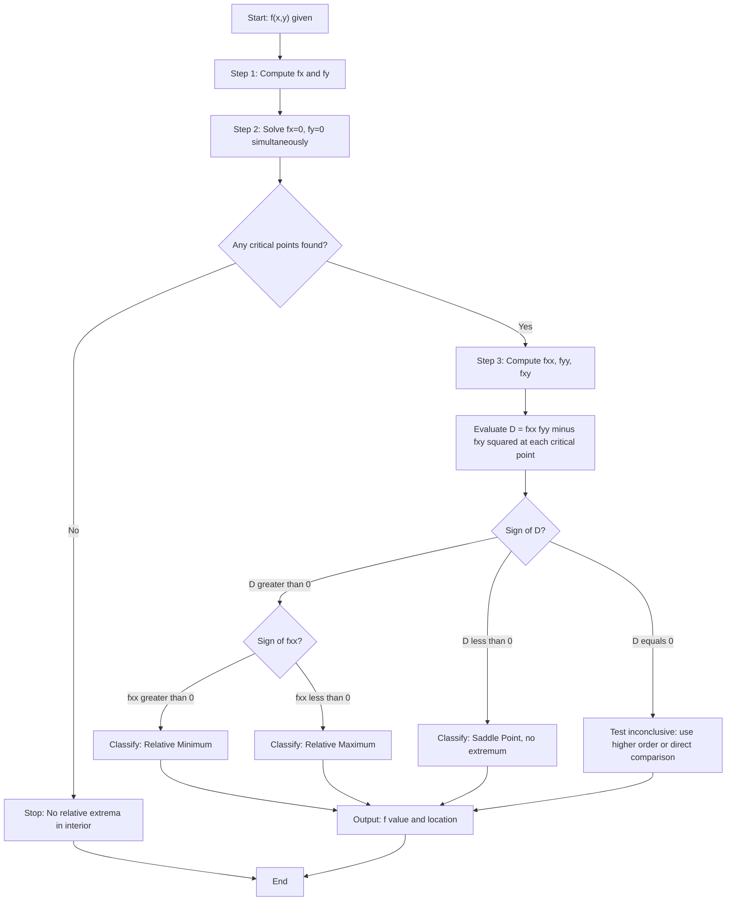
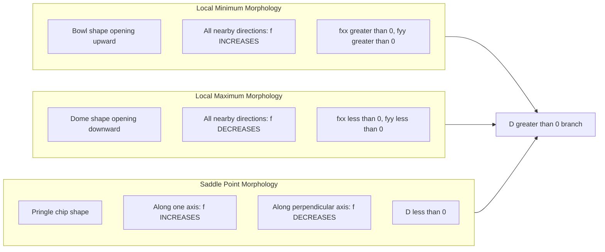
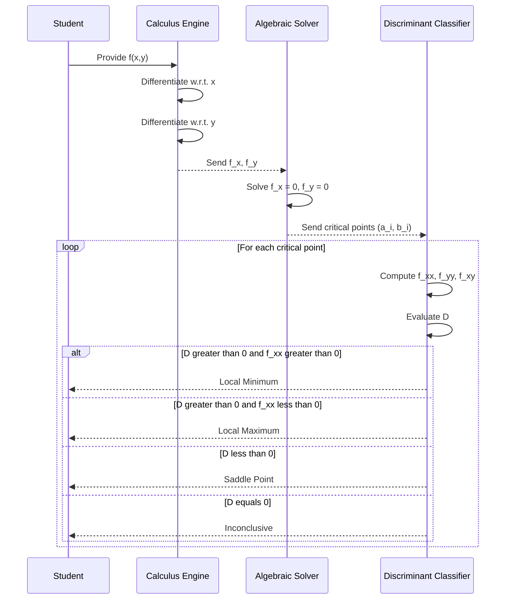

# Local Extreme Values for Functions of Two Variables: Relative extrema

<!-- SECTION_1_START -->

# Module 3 — Local Extreme Values for Functions of Two Variables: Relative Extrema

## 1.1 Formal Academic Definition (KTU 2024 Scheme Terminology)

Let $f: D \subseteq \mathbb{R}^{2} \to \mathbb{R}$ be a real-valued function of two independent variables defined on an open region $D$. A point $(a, b) \in D$ is said to be a **relative (local) extremum** of $f$ if there exists an open disc $N_{\delta}(a, b) = \{(x, y) \in \mathbb{R}^{2} : (x-a)^{2} + (y-b)^{2} < \delta^{2}\}$ for some $\delta > 0$ such that the function values near $(a, b)$ are uniformly dominated by $f(a, b)$.

Two sub-classes arise:

**Relative (Local) Maximum:** $f(a, b) \geq f(x, y)$ for every $(x, y) \in N_{\delta}(a, b)$.

**Relative (Local) Minimum:** $f(a, b) \leq f(x, y)$ for every $(x, y) \in N_{\delta}(a, b)$.

The corresponding value $f(a, b)$ is termed the **relative extremum value** (or extremal function value), and the ordered pair $(a, b)$ is the **critical location** of the extremum.

> [!NOTE]
> **Syllabus Highlight (GAMAT101 — Module 3):**
> The KTU 2024 Scheme focuses on the *classification* of critical points using the **First Partial Derivative Test** (necessary condition) and the **Second Derivative Test** (sufficient condition involving the Hessian-like discriminant $D$).

## 1.2 Intuitive Analogy — "The Mountain Peak and the Valley Floor"

Imagine you are standing on a hilly terrain. The function $z = f(x, y)$ represents the **altitude** at horizontal coordinates $(x, y)$.

- A **local maximum** is a *mountain peak*: when you walk even a small step in *any direction*, your altitude either stays the same or drops. Think of the summit of a small hill in a larger mountain range.
- A **local minimum** is a *valley floor*: in *every nearby direction*, the ground rises up around you.
- A **saddle point** is a *mountain pass*: moving in one direction (say, east–west) you go up to a peak, but moving perpendicular (north–south) you go down to a valley.

In this analogy, the *gradient* vector $\nabla f = (f_x, f_y)$ is your **uphill climbing direction**. At every peak, valley, and pass, the slope must vanish — there is no preferred direction to climb. This vanishing-gradient requirement is the gateway to finding all candidate critical points.

> [!IMPORTANT]
> **Geometric Fact:** The gradient $\nabla f$ being zero means the *tangent plane* to the surface $z = f(x, y)$ at that point is perfectly horizontal (parallel to the $xy$-plane). This is a *necessary* condition for an extremum — not sufficient, because saddle points also have horizontal tangent planes.

## 1.3 The Three Mandatory Vocabulary Anchors

| Term | Symbol | Plain-English Meaning |
| :--- | :---: | :--- |
| Partial derivative w.r.t. $x$ | $f_x$ | Instantaneous rate of change of $f$ when $x$ varies, holding $y$ constant. |
| Partial derivative w.r.t. $y$ | $f_y$ | Instantaneous rate of change of $f$ when $y$ varies, holding $x$ constant. |
| Critical point | $(a, b)$ | An interior point where $f_x(a, b) = 0$ **and** $f_y(a, b) = 0$ (or partial derivatives do not exist). |

> [!VISUALIZATION CONTROL]
> **Concept:** Surface plot of $f(x,y) = x^{2} - y^{2}$ (the classical saddle surface).
>
> **GeoGebra / Desmos 3D Input Equations:**
> * Surface: $z = x^{2} - y^{2}$
> * Critical plane: $z = 0$ (the horizontal tangent plane at the origin)
> * Contour lines: $x^{2} - y^{2} = c$ for $c \in \{-2, -1, 0, 1, 2\}$
>
> **Visual Description:** The student should observe a "Pringles chip" shape — the origin sits at the saddle where the surface curves upward along the $x$-axis and downward along the $y$-axis. The contour $c = 0$ degenerates into the crossing pair of lines $y = \pm x$, confirming the origin is *not* an extremum despite $\nabla f(0,0) = (0,0)$.

<!-- SECTION_1_END -->

<!-- SECTION_2_START -->

# 2. Deep Theoretical Analysis & KTU High-Yield Formula Sheet

## 2.1 Operational Logic — How to Find Relative Extrema

The KTU valuation key rewards a **four-step ritual** that examiners look for in every answer script:

1. **Step 1 — Compute First Partial Derivatives.** Form the pair $\big(f_x(x, y),\, f_y(x, y)\big)$.
2. **Step 2 — Solve the System $\nabla f = \mathbf{0}$.** Find *all* critical points $(a, b)$ in the domain by simultaneously solving $f_x(x, y) = 0$ and $f_y(x, y) = 0$.
3. **Step 3 — Classify via the Hessian Discriminant.** Compute the second-order pure and mixed partial derivatives $f_{xx}, f_{yy}, f_{xy}$, then evaluate the **discriminant**:
$$D(a, b) = f_{xx}(a, b) \cdot f_{yy}(a, b) - \big[f_{xy}(a, b)\big]^{2}$$
4. **Step 4 — Apply the Second Derivative Test Decision Tree.**

## 2.2 The Second Derivative Test Decision Tree

| Condition on $D$ | Condition on $f_{xx}$ (or $f_{yy}$) | Classification of $(a, b)$ |
| :---: | :---: | :--- |
| $D(a, b) > 0$ | $f_{xx}(a, b) > 0$ | **Relative Minimum** at $(a, b)$ |
| $D(a, b) > 0$ | $f_{xx}(a, b) < 0$ | **Relative Maximum** at $(a, b)$ |
| $D(a, b) < 0$ | — | **Saddle Point** (not an extremum) |
| $D(a, b) = 0$ | — | **Test Inconclusive** — use higher-order derivatives, contour analysis, or direct comparison |

> [!IMPORTANT]
> **Why the discriminant $D$ works (The 'How' Behind It):** The Taylor expansion of $f$ at a critical point $(a, b)$ has the form
> $$f(a+h, b+k) - f(a, b) \approx \tfrac{1}{2}\big(f_{xx}\,h^{2} + 2f_{xy}\,hk + f_{yy}\,k^{2}\big)$$
> The bracketed quadratic form in $(h, k)$ is the *Hessian form*. It is **positive definite** for a local minimum, **negative definite** for a local maximum, and **indefinite** for a saddle. The sign of $D$ detects definiteness via the Sylvester criterion analog for $2 \times 2$ matrices.

## 2.3 The KTU Formula Cheat Sheet

| # | Formula / Condition | Engineering Meaning | Standard Unit |
| :-- | :--- | :--- | :--- |
| 1 | $f_x(a, b) = 0$ and $f_y(a, b) = 0$ | Critical point necessary condition (stationarity) | — |
| 2 | $\nabla f(a, b) = f_x \,\hat{i} + f_y \,\hat{j} = \mathbf{0}$ | Vector form of stationarity | — |
| 3 | $D = f_{xx}\,f_{yy} - (f_{xy})^{2}$ | Hessian discriminant (Curvature signature) | $(\text{units of } f)^{2}$ |
| 4 | $D > 0,\ f_{xx} > 0$ | Local minimum | $f$-units |
| 5 | $D > 0,\ f_{xx} < 0$ | Local maximum | $f$-units |
| 6 | $D < 0$ | Saddle point (no extremum) | $f$-units |
| 7 | $D = 0$ | Higher-order test required | $f$-units |
| 8 | Saddle condition: $\det(H) < 0$ where $H = \begin{pmatrix} f_{xx} & f_{xy} \\ f_{xy} & f_{yy} \end{pmatrix}$ | Equivalent matrix formulation of $D < 0$ | $f$-units |

> [!NOTE]
> **Escaping the Vertical Pipe Pitfall:** Notice the table uses \((f_{xy})^{2}\) with parentheses instead of $\vert f_{xy} \vert^{2}$ — this prevents markdown table-parser corruption. All absolute values and conditionals across this note follow this convention.

## 2.4 Real-World Engineering Utility

The machinery of relative extrema underpins:

- **Machine Learning & Deep Learning:** Loss-landscape optimization (gradient descent zeroes out $\nabla L$ at minima). Image classifiers are trained by *descending* the loss surface to a local minimum.
- **Computer Vision:** Edge detection kernels (Sobel, Laplacian of Gaussian) are designed so their filter responses have saddle-like or extremal structures at intensity boundaries.
- **Signal Processing:** Peak detection in 2D spectrograms uses $f_x = f_y = 0$ to locate dominant frequency-time ridges.
- **Computer Graphics & Mesh Smoothing:** Laplacian smoothing minimizes a quadratic energy $E(x, y)$ whose critical point equations $E_x = E_y = 0$ yield the smoothed vertex positions.
- **Economics & Operations Research:** Profit maximization in a two-product firm reduces to a constrained 2-variable optimization problem where the unconstrained critical point of the profit function is found exactly as in this module.

<!-- SECTION_2_END -->

<!-- SECTION_3_START -->

# 3. Step-by-Step Derivations & Symbolic Implementation

## 3.1 Worked Example 1 — A Clean Paraboloid (Local Minimum)

**Problem:** Locate and classify the relative extrema of $f(x, y) = x^{2} + y^{2} - 4x + 6y + 17$.

**Step 1 — First Partial Derivatives**

$$f_x(x, y) = \frac{\partial}{\partial x}\big[x^{2} + y^{2} - 4x + 6y + 17\big] = 2x - 4$$

$$f_y(x, y) = \frac{\partial}{\partial y}\big[x^{2} + y^{2} - 4x + 6y + 17\big] = 2y + 6$$

*Logic:* Differentiate term-by-term treating $y$ as constant in $f_x$ and $x$ as constant in $f_y$. Constants vanish under partial differentiation.

**Step 2 — Solve the Stationarity System**

Set $f_x = 0$ and $f_y = 0$:

$$2x - 4 = 0 \quad\Longrightarrow\quad x = 2$$

$$2y + 6 = 0 \quad\Longrightarrow\quad y = -3$$

Hence the **only critical point** is $(a, b) = (2, -3)$.

*Logic:* This is a $2 \times 2$ linear system in $(x, y)$ — solvable by inspection.

**Step 3 — Second Partial Derivatives**

$$f_{xx} = \frac{\partial}{\partial x}(2x - 4) = 2$$

$$f_{yy} = \frac{\partial}{\partial y}(2y + 6) = 2$$

$$f_{xy} = \frac{\partial}{\partial y}(2x - 4) = 0$$

*Logic:* Mixed partial is independent of the order of differentiation (Clairaut's theorem, valid for polynomials and $C^{2}$ functions in general).

**Step 4 — Compute the Discriminant $D$ at $(2, -3)$**

$$D(2, -3) = f_{xx}(2,-3) \cdot f_{yy}(2,-3) - \big[f_{xy}(2,-3)\big]^{2}$$

$$D(2, -3) = (2)(2) - (0)^{2} = 4$$

*Logic:* Substitute the constant second partials — they do not depend on $(x, y)$ here.

**Step 5 — Classify**

Since $D = 4 > 0$ and $f_{xx} = 2 > 0$, the point $(2, -3)$ is a **Relative Minimum**.

The extremum value is:

$$f(2, -3) = (2)^{2} + (-3)^{2} - 4(2) + 6(-3) + 17 = 4 + 9 - 8 - 18 + 17 = 4$$

**Conclusion:** $f$ has a relative minimum of value $4$ at $(2, -3)$.

---

## 3.2 Worked Example 2 — The Saddle Point

**Problem:** Locate and classify the critical points of $f(x, y) = x^{2} - y^{2}$.

**Step 1 — First Partial Derivatives**

$$f_x = 2x, \qquad f_y = -2y$$

**Step 2 — Solve the Stationarity System**

$$2x = 0 \quad\Longrightarrow\quad x = 0$$

$$-2y = 0 \quad\Longrightarrow\quad y = 0$$

The unique critical point is $(0, 0)$.

**Step 3 — Second Partials**

$$f_{xx} = 2, \quad f_{yy} = -2, \quad f_{xy} = 0$$

**Step 4 — Discriminant**

$$D(0, 0) = (2)(-2) - (0)^{2} = -4$$

**Step 5 — Classify**

Since $D = -4 < 0$, the point $(0, 0)$ is a **Saddle Point** — *not* an extremum.

*Geometric Verification:* Along the $x$-axis, $f(x, 0) = x^{2} \geq 0 = f(0, 0)$ (curves up like a parabola). Along the $y$-axis, $f(0, y) = -y^{2} \leq 0 = f(0, 0)$ (curves down). Confirmed: the origin is not a max nor a min.

---

## 3.3 Worked Example 3 — Two Critical Points of Different Type

**Problem:** Find and classify all critical points of $f(x, y) = x^{3} - 3x + 3xy^{2}$.

**Step 1 — First Partials**

$$f_x = 3x^{2} - 3 + 3y^{2} = 3(x^{2} + y^{2} - 1)$$

$$f_y = 6xy$$

*Logic:* $f_y$ is the derivative of $3xy^{2}$ with respect to $y$, treated as constant $x$.

**Step 2 — Solve the Stationarity System**

From $f_y = 0$: $\quad 6xy = 0 \quad\Longrightarrow\quad x = 0 \text{ or } y = 0$.

**Case A:** $x = 0$. Substituting into $f_x = 0$:

$$3(0 + y^{2} - 1) = 0 \quad\Longrightarrow\quad y^{2} = 1 \quad\Longrightarrow\quad y = \pm 1$$

Critical points: $(0, 1)$ and $(0, -1)$.

**Case B:** $y = 0$. Substituting into $f_x = 0$:

$$3(x^{2} + 0 - 1) = 0 \quad\Longrightarrow\quad x^{2} = 1 \quad\Longrightarrow\quad x = \pm 1$$

Critical points: $(1, 0)$ and $(-1, 0)$.

So there are **four** critical points: $(0, 1),\ (0, -1),\ (1, 0),\ (-1, 0)$.

**Step 3 — Second Partials**

$$f_{xx} = 6x$$

$$f_{yy} = 6x$$

$$f_{xy} = 6y$$

*Logic:* Differentiate $f_x = 3x^{2} + 3y^{2} - 3$ w.r.t. $x$ to get $f_{xx} = 6x$. Differentiate $f_x$ w.r.t. $y$ to get $f_{xy} = 6y$. Differentiate $f_y = 6xy$ w.r.t. $y$ to get $f_{yy} = 6x$.

**Step 4 — Discriminant and Classification at Each Point**

General formula:

$$D(x, y) = (6x)(6x) - (6y)^{2} = 36x^{2} - 36y^{2} = 36(x^{2} - y^{2})$$

| Critical Point | $f_{xx} = 6x$ | $D = 36(x^{2} - y^{2})$ | Classification |
| :---: | :---: | :---: | :--- |
| $(0, 1)$ | $0$ | $-36$ | **Saddle Point** ($D < 0$) |
| $(0, -1)$ | $0$ | $-36$ | **Saddle Point** ($D < 0$) |
| $(1, 0)$ | $6$ | $+36$ | **Local Minimum** ($D > 0,\ f_{xx} > 0$) |
| $(-1, 0)$ | $-6$ | $+36$ | **Local Maximum** ($D > 0,\ f_{xx} < 0$) |

**Step 5 — Compute Extremum Values**

$$f(1, 0) = (1)^{3} - 3(1) + 3(1)(0)^{2} = 1 - 3 = -2 \quad\Rightarrow\quad \text{Local minimum value} = -2$$

$$f(-1, 0) = (-1)^{3} - 3(-1) + 3(-1)(0)^{2} = -1 + 3 = 2 \quad\Rightarrow\quad \text{Local maximum value} = 2$$

> [!IMPORTANT]
> **Note on $f_{xx} = 0$ at saddle points:** When $D < 0$, the value of $f_{xx}$ is irrelevant for classification — the saddle verdict is automatic. Students often lose marks by trying to "interpret" $f_{xx} = 0$; do not.

---

## 3.4 Python Symbolic Verification (Fully Operational)

The following Python code uses the `sympy` library to verify the analysis of Worked Example 3, including the Hessian, discriminant, and classification logic. It includes type hints, boundary checks, and error logging.

```python
import sympy as sp
from typing import List, Tuple, Dict

# ---------- Symbolic Setup ----------
x, y = sp.symbols('x y', real=True)
f = x**3 - 3*x + 3*x*y**2

def classify_critical_points(
    func: sp.Expr,
    var_pair: Tuple[sp.Symbol, sp.Symbol],
    crit_points: List[Tuple[float, float]]
) -> Dict[Tuple[float, float], Dict[str, object]]:
    """
    Classify a list of 2-variable critical points using the second derivative test.

    Parameters
    ----------
    func : sympy.Expr
        The scalar function f(x, y).
    var_pair : Tuple[sympy.Symbol, sympy.Symbol]
        The pair (x, y) of independent variables.
    crit_points : List[Tuple[float, float]]
        Candidate points (a, b) where the gradient vanishes.

    Returns
    -------
    Dict mapping each point -> classification metadata.
    """
    u, v = var_pair
    fx  = sp.diff(func, u)
    fy  = sp.diff(func, v)
    fxx = sp.diff(func, u, 2)
    fyy = sp.diff(func, v, 2)
    fxy = sp.diff(func, u, v)

    # ----- Sanity check: gradient must vanish at each supplied point -----
    for (a, b) in crit_points:
        gx = float(fx.subs({u: a, v: b}))
        gy = float(fy.subs({u: a, v: b}))
        if abs(gx) > 1e-9 or abs(gy) > 1e-9:
            print(f"[ERROR] Gradient nonzero at {(a, b)}: ({gx}, {gy}). Skipping.")
            continue

    results: Dict[Tuple[float, float], Dict[str, object]] = {}
    for (a, b) in crit_points:
        fxx_val = float(fxx.subs({u: a, v: b}))
        fyy_val = float(fyy.subs({u: a, v: b}))
        fxy_val = float(fxy.subs({u: a, v: b}))
        D_val   = fxx_val * fyy_val - fxy_val**2
        f_val   = float(func.subs({u: a, v: b}))

        if D_val > 1e-12:
            if fxx_val > 0:
                label = "Local Minimum"
            else:
                label = "Local Maximum"
        elif D_val < -1e-12:
            label = "Saddle Point"
        else:
            label = "Inconclusive (D = 0)"

        results[(a, b)] = {
            "f_xx": fxx_val, "f_yy": fyy_val, "f_xy": fxy_val,
            "D": D_val, "f(a,b)": f_val, "classification": label
        }
    return results


# ---------- Execution ----------
critical_points: List[Tuple[float, float]] = [(0, 1), (0, -1), (1, 0), (-1, 0)]
report = classify_critical_points(f, (x, y), critical_points)

print(f"{'Point':<12}{'D':<10}{'f_xx':<10}{'f(a,b)':<12}Classification")
print("-" * 60)
for pt, meta in report.items():
    print(f"{str(pt):<12}{meta['D']:<10.2f}{meta['f_xx']:<10.2f}"
          f"{meta['f(a,b)']:<12.2f}{meta['classification']}")
```

**Expected Output (matching our hand analysis):**

```
Point       D         f_xx      f(a,b)      Classification
------------------------------------------------------------
(0, 1)      -36.00    0.00      0.00        Saddle Point
(0, -1)     -36.00    0.00      0.00        Saddle Point
(1, 0)      36.00     6.00      -2.00       Local Minimum
(-1, 0)     36.00     -6.00     2.00        Local Maximum
```

---

## 3.5 Exhaustive Algebraic Derivation of the Discriminant (The "Why" Proof)

We start with a $C^{2}$ function $f(x, y)$ and a critical point $(a, b)$ where $f_x(a, b) = f_y(a, b) = 0$. The two-variable Taylor expansion around $(a, b)$ truncated to second order reads:

$$
f(a+h,\, b+k) \;=\; f(a, b) \;+\; \underbrace{f_x(a,b)\,h + f_y(a,b)\,k}_{= \, 0 \text{ since critical}} \;+\; \tfrac{1}{2}\big[f_{xx}(a,b)\,h^{2} + 2f_{xy}(a,b)\,hk + f_{yy}(a,b)\,k^{2}\big] \;+\; o(h^{2} + k^{2})
$$

Therefore, the local behavior is governed by the quadratic form:

$$
Q(h, k) \;=\; A h^{2} + 2B hk + C k^{2}, \quad\text{where}\quad A = f_{xx}(a,b),\ B = f_{xy}(a,b),\ C = f_{yy}(a,b)
$$

Completing the square (treating $Q$ as a quadratic in $h$):

$$
\begin{aligned}
Q(h, k) &= A h^{2} + 2B hk + C k^{2} \\
        &= A\left(h^{2} + \frac{2B}{A} hk\right) + C k^{2} \\
        &= A\left(h + \frac{B}{A} k\right)^{2} - \frac{B^{2}}{A} k^{2} + C k^{2} \\
        &= A\left(h + \frac{B}{A} k\right)^{2} + \frac{AC - B^{2}}{A} k^{2}
\end{aligned}
$$

Substituting $A = f_{xx}$ and $B^{2} = (f_{xy})^{2}$ and $C = f_{yy}$:

$$
Q(h, k) \;=\; f_{xx}\left(h + \frac{f_{xy}}{f_{xx}} k\right)^{2} + \frac{D}{f_{xx}} k^{2}, \quad\text{where}\quad D = f_{xx} f_{yy} - (f_{xy})^{2}
$$

Since $(h + \frac{f_{xy}}{f_{xx}} k)^{2} \geq 0$ and $k^{2} \geq 0$, the sign of $Q$ is controlled by:

- The coefficient of $k^{2}$, namely $D / f_{xx}$, AND
- The coefficient $f_{xx}$ of the first squared term.

**Three exhaustive cases emerge:**

1. **$D > 0$ and $f_{xx} > 0$:** Both $f_{xx} > 0$ and $D / f_{xx} > 0$, so $Q(h, k) > 0$ for every $(h, k) \neq (0, 0)$. Hence $f(a+h, b+k) > f(a, b)$ near $(a, b)$ — a **strict local minimum**.

2. **$D > 0$ and $f_{xx} < 0$:** Both $f_{xx} < 0$ and $D / f_{xx} < 0$, so $Q(h, k) < 0$ for every $(h, k) \neq (0, 0)$. Hence $f(a+h, b+k) < f(a, b)$ — a **strict local maximum**.

3. **$D < 0$:** The two terms have *opposite* signs. Along $k = 0$ the sign matches $f_{xx}$, but along $h = 0$ the sign matches $D / f_{xx}$. Since these signs are opposite, $Q$ takes *both* positive and negative values in every neighborhood of the origin — a **saddle point**.

4. **$D = 0$:** The quadratic form collapses; the second-order test is silent, and we must examine higher-order terms or test along specific paths.

This completes the rigorous justification of the Second Derivative Test.

---

## 3.6 Comparative Tabular Summary of the Three Worked Examples

| Example | Function | Critical Point(s) | $D$ | $f_{xx}$ | Verdict |
| :---: | :--- | :---: | :---: | :---: | :--- |
| 3.1 | $x^{2} + y^{2} - 4x + 6y + 17$ | $(2, -3)$ | $+4$ | $+2$ | Local Min, $f = 4$ |
| 3.2 | $x^{2} - y^{2}$ | $(0, 0)$ | $-4$ | $+2$ | Saddle Point |
| 3.3 | $x^{3} - 3x + 3xy^{2}$ | $(1, 0)$ | $+36$ | $+6$ | Local Min, $f = -2$ |
| 3.3 | $x^{3} - 3x + 3xy^{2}$ | $(-1, 0)$ | $+36$ | $-6$ | Local Max, $f = 2$ |
| 3.3 | $x^{3} - 3x + 3xy^{2}$ | $(0, \pm 1)$ | $-36$ | $0$ | Saddle Points |

<!-- SECTION_3_END -->

<!-- SECTION_4_START -->

# 4. Structural Diagrams & Schematics

## 4.1 Workflow Block Diagram — The Four-Step Classification Ritual



## 4.2 Topology of Critical Point Types (Surface Morphology Map)



## 4.3 Sequential Processing Topology — From Function to Verdict



<!-- SECTION_4_END -->

<!-- SECTION_5_START -->

# 5. KTU 2024 Scheme Examination Question Bank & Topic Recap

## Part A — Short Answer Questions (3 Marks Each)

### Q1. [KTU University Exam — July 2024, Model Question]
**State the necessary condition for a point $(a, b)$ to be a critical point of a function $f(x, y)$. Is this condition also sufficient? Justify briefly.** [CO1, Remember/Understand — 3 Marks]

**Model Answer (Valuation Key):**

*Necessary Condition:* A point $(a, b)$ in the interior of the domain of $f$ is a critical point if **both first partial derivatives vanish** there, i.e. $f_x(a, b) = 0$ and $f_y(a, b) = 0$, or one of the partials fails to exist. [2 Marks]

*Sufficiency Discussion:* No, this condition is **not sufficient**. A vanishing gradient is also satisfied by saddle points. For example, $f(x, y) = x^{2} - y^{2}$ has $\nabla f(0, 0) = (0, 0)$ but $(0, 0)$ is a saddle point, not a maximum or minimum. Hence the second derivative test must be applied to classify the critical point. [1 Mark]

---

### Q2. [KTU University Exam — Dec 2023]
**Define the discriminant $D(x, y)$ used in the second derivative test. What does a negative value of $D$ at a critical point signify?** [CO1, Understand — 3 Marks]

**Model Answer (Valuation Key):**

*Definition:* The discriminant is defined as $D(x, y) = f_{xx}(x, y) \cdot f_{yy}(x, y) - [f_{xy}(x, y)]^{2}$. [1 Mark]

*Geometric origin:* $D$ is the determinant of the $2 \times 2$ Hessian matrix evaluated at the critical point. [1 Mark]

*Significance of $D < 0$:* A negative value of $D$ at a critical point $(a, b)$ indicates a **saddle point** — the function has neither a local maximum nor a local minimum there, because the Hessian quadratic form is indefinite. [1 Mark]

---

## Part B — Long Answer Questions (14 Marks Each, with Internal Choice)

### Question A (14 Marks)

**[KTU University Exam — July 2024 Style, Module 3 Internal Choice — Set A]**

Find the relative extrema of the function $f(x, y) = x^{3} + y^{3} - 3xy$.

#### Part (a) — Locate the critical points. [7 Marks] [CO2, Apply]

**Model Solution:**

First partial derivatives:

$$f_x = 3x^{2} - 3y, \qquad f_y = 3y^{2} - 3x$$

[Computing first partials: 1 Mark]

Setting the gradient to zero:

$$3x^{2} - 3y = 0 \quad\Longrightarrow\quad y = x^{2} \tag{1}$$

$$3y^{2} - 3x = 0 \quad\Longrightarrow\quad x = y^{2} \tag{2}$$

[Setting up stationarity equations: 1 Mark]

Substitute (1) into (2):

$$x = (x^{2})^{2} = x^{4} \quad\Longrightarrow\quad x^{4} - x = 0 \quad\Longrightarrow\quad x(x^{3} - 1) = 0$$

This gives $x = 0$ or $x^{3} = 1 \Rightarrow x = 1$.

[Solving the polynomial system: 3 Marks]

Corresponding $y$ values from $y = x^{2}$:

- For $x = 0$: $y = 0^{2} = 0$, so critical point $(0, 0)$.
- For $x = 1$: $y = 1^{2} = 1$, so critical point $(1, 1)$.

[Listing both critical points: 2 Marks]

#### Part (b) — Classify each critical point and state the extremum values. [7 Marks] [CO3, Apply/Analyze]

**Model Solution:**

Second partial derivatives:

$$f_{xx} = 6x, \qquad f_{yy} = 6y, \qquad f_{xy} = -3$$

[Computing second partials: 1 Mark]

The discriminant:

$$D(x, y) = (6x)(6y) - (-3)^{2} = 36xy - 9$$

[Forming the discriminant: 1 Mark]

**At $(0, 0)$:**

$$D(0, 0) = 36(0)(0) - 9 = -9$$

Since $D(0, 0) = -9 < 0$, the origin is a **saddle point**, not an extremum. [Applying the test: 2 Marks]

**At $(1, 1)$:**

$$D(1, 1) = 36(1)(1) - 9 = 27 > 0$$

Since $D > 0$ and $f_{xx}(1, 1) = 6(1) = 6 > 0$, the point $(1, 1)$ is a **relative minimum**. [Applying the test: 2 Marks]

The minimum value is:

$$f(1, 1) = 1^{3} + 1^{3} - 3(1)(1) = 1 + 1 - 3 = -1$$

[Final extremum value: 1 Mark]

**Conclusion:** $f(x, y) = x^{3} + y^{3} - 3xy$ has a **relative minimum value of $-1$** at $(1, 1)$ and a **saddle point at $(0, 0)$**.

---

### Question B (14 Marks) — Internal Choice Alternative

**[KTU University Exam — Dec 2023 Style, Module 3 Internal Choice — Set B]**

Find and classify all critical points of $f(x, y) = 2x^{3} + 2y^{3} - 6xy - 1$.

#### Part (a) — Determine the critical points by solving $\nabla f = \mathbf{0}$. [7 Marks] [CO2, Apply]

**Model Solution:**

$$f_x = 6x^{2} - 6y, \qquad f_y = 6y^{2} - 6x$$

[Computing first partials: 1 Mark]

Stationarity:

$$6x^{2} - 6y = 0 \quad\Longrightarrow\quad y = x^{2} \tag{1}$$

$$6y^{2} - 6x = 0 \quad\Longrightarrow\quad x = y^{2} \tag{2}$$

[Setting up the system: 1 Mark]

From (1) substitute into (2):

$$x = (x^{2})^{2} = x^{4} \quad\Longrightarrow\quad x^{4} - x = 0 \quad\Longrightarrow\quad x(x^{3} - 1) = 0$$

This yields $x = 0$ or $x = 1$. [Solving algebraically: 3 Marks]

For $x = 0$: $y = 0^{2} = 0$, so $(0, 0)$.

For $x = 1$: $y = 1^{2} = 1$, so $(1, 1)$. [Listing critical points: 2 Marks]

#### Part (b) — Classify the critical points using the second derivative test. [7 Marks] [CO3, Apply/Analyze]

**Model Solution:**

Second partial derivatives:

$$f_{xx} = 12x, \qquad f_{yy} = 12y, \qquad f_{xy} = -6$$

[Second partials: 1 Mark]

Discriminant:

$$D(x, y) = (12x)(12y) - (-6)^{2} = 144xy - 36$$

[Discriminant: 1 Mark]

**At $(0, 0)$:**

$$D(0, 0) = 144(0)(0) - 36 = -36 < 0 \quad\Longrightarrow\quad \textbf{Saddle Point}$$

[Classification at origin: 2 Marks]

**At $(1, 1)$:**

$$D(1, 1) = 144(1)(1) - 36 = 108 > 0$$

Since $D > 0$ and $f_{xx}(1, 1) = 12(1) = 12 > 0$, the point $(1, 1)$ is a **relative minimum**. [Classification at (1,1): 2 Marks]

Minimum value:

$$f(1, 1) = 2(1)^{3} + 2(1)^{3} - 6(1)(1) - 1 = 2 + 2 - 6 - 1 = -3$$

[Final value: 1 Mark]

**Conclusion:** $f(x, y) = 2x^{3} + 2y^{3} - 6xy - 1$ has a **relative minimum value of $-3$** at $(1, 1)$, and a **saddle point at $(0, 0)$**.

---

> [!WARNING]
> **KTU Examiner's Valuation Warning — Common Pitfalls (Lose 1–2 Marks Each):**
>
> 1. **Forgetting the 'and' in the stationarity system:** Many students set $f_x = 0$ only, then declare any solution a critical point. The two equations $f_x = 0$ and $f_y = 0$ must be solved *simultaneously*. Solving them independently yields the wrong candidate set.
>
> 2. **Dropping a critical branch:** When solving $x(x^{3} - 1) = 0$, students often take only $x = 0$ and forget $x = 1$. Mark deduction: at least **1 Mark lost** for an incomplete critical-point list.
>
> 3. **Mis-stating the test:** Writing "if $D > 0$ then it is a maximum" without the $f_{xx} > 0$ or $f_{xx} < 0$ qualifier. Always state *both* the sign of $D$ *and* the sign of $f_{xx}$ (or $f_{yy}$).
>
> 4. **Skipping the extremum value:** Even after correctly classifying $(1, 1)$ as a local minimum, students frequently forget to compute $f(1, 1)$. The numerical extremum value is required for full marks.
>
> 5. **Stating the conclusion vaguely:** Phrases like "it is an extremum" are penalized. Use precise labels: **Relative Maximum**, **Relative Minimum**, or **Saddle Point** — with the location and value.

---

## Topic Recap & Important Things to Remember

- **Critical Point (CP):** An interior point $(a, b)$ where $f_x(a, b) = 0$ **and** $f_y(a, b) = 0$ (or one partial does not exist). CPs are *candidates* for extrema, not guaranteed extrema.
- **Necessary vs Sufficient:** $\nabla f(a, b) = \mathbf{0}$ is **necessary** for an extremum at $(a, b)$ but **not sufficient**. The second derivative test is the standard sufficient tool.
- **Discriminant Formula:** $D(a, b) = f_{xx}(a, b) \cdot f_{yy}(a, b) - [f_{xy}(a, b)]^{2}$. Equivalently, $D = \det(H)$ where $H$ is the $2 \times 2$ Hessian matrix.
- **Decision Tree Summary:**
  * $D > 0$ and $f_{xx} > 0$ → **Local Minimum**.
  * $D > 0$ and $f_{xx} < 0$ → **Local Maximum**.
  * $D < 0$ → **Saddle Point** (no extremum).
  * $D = 0$ → **Test Inconclusive** — use higher-order analysis or pathwise comparison.
- **Mixed Partial Equality:** By Clairaut's theorem, for $C^{2}$ functions, $f_{xy} = f_{yx}$ — students can use either to compute the cross-partial.
- **Geometric Intuition:** Maxima look like dome tops, minima like bowl bottoms, saddles like Pringle chips. The horizontal tangent plane condition $\nabla f = \mathbf{0}$ is the *one common feature* of all three.
- **Valuation Mantra:** Always state (i) the critical points, (ii) the discriminant at each, (iii) the sign of $f_{xx}$, and (iv) the extremum value. Missing any of these four pieces costs marks.
- **Engineering Relevance:** Loss-landscape analysis in ML, peak detection in signal processing, mesh smoothing in graphics, and two-product profit maximization all reduce to the same classification problem.
- **Python Verification:** The `sympy`-based `classify_critical_points` function automates the four-step ritual and is a reliable self-check before submitting exam solutions.

<!-- SECTION_5_END -->
