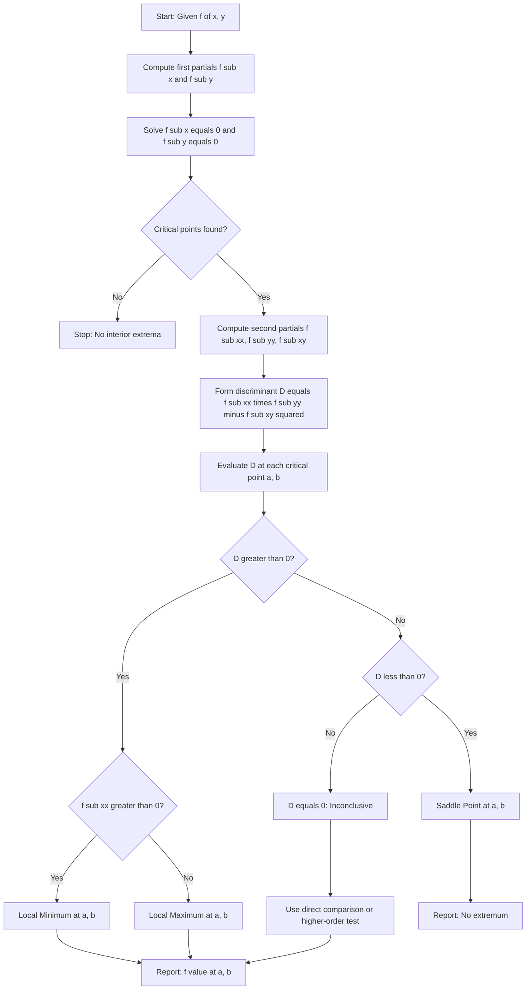
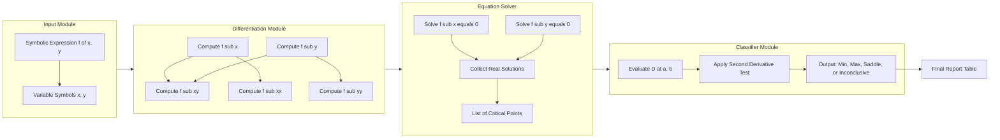

# Local Extreme Values for Functions of Two Variables: Relative extrema

<!-- SECTION_1_START -->
# Local Extreme Values for Functions of Two Variables: Relative Extrema

## 1.1 Formal Academic Definition

> [!IMPORTANT]
> **KTU 2024 Syllabus Definition (Module 3 – GAMAT101):**
> A function $f(x, y)$ defined on a region $D \subseteq \mathbb{R}^2$ has a **relative (local) maximum** at the point $(a, b)$ if there exists an open disc (neighbourhood) of radius $\delta > 0$ centred at $(a, b)$ such that
> $$f(a, b) \geq f(x, y) \quad \text{for all } (x, y) \in D \text{ with } 0 < \sqrt{(x-a)^2 + (y-b)^2} < \delta.$$
> Similarly, a **relative (local) minimum** occurs if $f(a, b) \leq f(x, y)$ on that neighbourhood. The corresponding function value $f(a, b)$ is called the **relative extremum** (or **relative extreme value**).

In plain words: we are looking for the **highest hill-tops** and **lowest valley-bottoms** on the surface graph of $z = f(x, y)$ — but only the ones that are locally the tallest or shortest compared to points immediately around them.

---

## 1.2 Intuitive Real-World Analogy

Imagine a vast **mountain terrain** (the surface $z = f(x, y)$). Walk to any spot on it:
- If, **no matter which small step you take in any direction**, the ground beneath you is always lower than the point you are standing on, you are standing on a **local maximum** (a hill-peak).
- If the ground is always higher than the point you are standing on, you are standing at a **local minimum** (a valley-bottom).
- If going north makes you go down but going east makes you go up, you are sitting at a **saddle point** — not a true extremum, but a special "pass" between two peaks.

> [!NOTE]
> **Saddle Point Intuition:** A horse's saddle is higher along one axis (front-to-back) and lower along the perpendicular axis (left-to-right). Mathematically, it is *neither* a local max *nor* a local min, even though both first partial derivatives vanish.

---

## 1.3 Geometric Picture

> [!VISUALIZATION CONTROL]
> **Concept:** Level curves of $f(x, y) = x^2 + y^2$ — concentric closed curves around the unique minimum at the origin.
> **GeoGebra / Desmos Input Equations:**
> * `f(x, y) = x^2 + y^2`
> * `Implicit: x^2 + y^2 = c` for $c \in \{0.5, 1, 2, 4\}$
> **Visual Description:** You should see four concentric circles centred at the origin $(0, 0)$. As $c$ grows, the circles grow. The point $(0, 0)$ is the global (and local) minimum where all curves "pinch" to a single dot.

---

## 1.4 The Critical Point Condition (First-Order Necessary Condition)

> [!IMPORTANT]
> **Theorem (Fermat's Principle for Two Variables):**
> If $f(x, y)$ has a **local extremum** at the interior point $(a, b)$ and the first-order partial derivatives $f_x$ and $f_y$ **exist** at $(a, b)$, then
> $$f_x(a, b) = 0 \quad \text{and} \quad f_y(a, b) = 0.$$
> The point $(a, b)$ is called a **stationary point** or **critical point** of $f$.

The "interior" condition is essential: extrema on the boundary of a region require the *Lagrange Multiplier* method, which is covered separately in Module 4.

<!-- SECTION_1_END -->

<!-- SECTION_2_START -->
# Deep Theoretical Analysis & KTU High-Yield Formula Sheet

## 2.1 Step-by-Step Algorithmic Logic for Finding Relative Extrema

Given a smooth function $f: \mathbb{R}^2 \to \mathbb{R}$:

1. **Compute** the first-order partial derivatives $f_x(x, y)$ and $f_y(x, y)$.
2. **Solve** the simultaneous system $f_x = 0$ and $f_y = 0$ to obtain the set of critical points $\{(a_i, b_i)\}$.
3. **Compute** the second-order partial derivatives $f_{xx}, f_{yy}, f_{xy}$ (and equivalently $f_{yx}$).
4. **Formulate the discriminant** $D(x, y) = f_{xx}(x, y) \cdot f_{yy}(x, y) - [f_{xy}(x, y)]^2$.
5. **Evaluate** $D$ at each critical point $(a_i, b_i)$ and apply the **Second Derivative Test** below.

> [!NOTE]
> **Engineering Utility:** In machine learning (loss-surface optimization), in computer-graphics rendering (specifying peak intensity points), and in finite-element mesh refinement, classifying the *type* of every stationary point is the very first step before applying Newton's method or gradient descent.

---

## 2.2 The Second Derivative Test (Sufficient Condition)

> [!IMPORTANT]
> **Theorem (Second Derivative Test for Two Variables):**
> Let $(a, b)$ be a critical point of $f$ (i.e., $f_x(a,b) = f_y(a,b) = 0$) and assume the second partials are continuous near $(a, b)$. Define
> $$D = f_{xx}(a, b) \cdot f_{yy}(a, b) - [f_{xy}(a, b)]^2.$$
> Then:
> * If $D > 0$ and $f_{xx}(a, b) > 0$, then $f$ has a **local minimum** at $(a, b)$.
> * If $D > 0$ and $f_{xx}(a, b) < 0$, then $f$ has a **local maximum** at $(a, b)$.
> * If $D < 0$, then $f$ has a **saddle point** at $(a, b)$ (no extremum).
> * If $D = 0$, the test is **inconclusive** — the point may be a max, min, saddle, or none of the above; further analysis is required.

---

## 2.3 KTU High-Yield Formula Cheat Sheet

| Symbol / Quantity | Expression | Geometric / Algebraic Meaning |
|---|---|---|
| First partials | $f_x = \partial f / \partial x$, $\quad f_y = \partial f / \partial y$ | Slope of surface along $x$- and $y$-directions |
| Critical point condition | $f_x = 0, \quad f_y = 0$ | Necessary for interior extremum (Fermat) |
| Second partials | $f_{xx}, \quad f_{yy}, \quad f_{xy} = f_{yx}$ | Curvatures of the surface |
| Discriminant | $D(a,b) = f_{xx} f_{yy} - (f_{xy})^2$ | Determinant of the **Hessian matrix** |
| Hessian matrix | $H = \begin{bmatrix} f_{xx} & f_{xy} \\ f_{yx} & f_{yy} \end{bmatrix}$ | Symmetric matrix encoding local curvature |
| Case $D > 0, \, f_{xx} > 0$ | $f(a,b) \leq f(x,y)$ locally | **Local minimum** |
| Case $D > 0, \, f_{xx} < 0$ | $f(a,b) \geq f(x,y)$ locally | **Local maximum** |
| Case $D < 0$ | Both max and min behaviour coexist | **Saddle point** |
| Case $D = 0$ | Test fails | **Inconclusive — try higher-order test or direct method** |

> [!WARNING]
> The notation $\vert x \vert$ in the original Fermat definition uses the *modulus*. In LaTeX tables, this is rendered as $\mid x \mid$ or $\lvert x \rvert$ to avoid breaking markdown parsers.

---

## 2.4 Why Does the Discriminant Have This Form?

The second-order Taylor expansion of $f$ around $(a, b)$ is

$$f(a+h, b+k) \approx f(a, b) + f_x h + f_y k + \tfrac{1}{2}\bigl( f_{xx} h^2 + 2 f_{xy} h k + f_{yy} k^2 \bigr).$$

Since $f_x = f_y = 0$ at the critical point, the sign of the quadratic form $\mathcal{Q}(h, k) = f_{xx} h^2 + 2 f_{xy} h k + f_{yy} k^2$ decides the local behaviour. This quadratic is **positive-definite** iff $f_{xx} > 0$ and the discriminant $f_{xx} f_{yy} - (f_{xy})^2 > 0$ (this is the standard Sylvester's criterion for $2 \times 2$ symmetric matrices).

<!-- SECTION_2_END -->

<!-- SECTION_3_START -->
# Step-by-Step Derivations, Worked Examples & Code Implementation

## 3.1 Worked Example 1 — A Function with Both a Minimum and a Saddle

**Problem (KTU Style):** Find the local extrema of
$$f(x, y) = 3x^3 + y^2 - 9x + 4y.$$

### Step 1 — Compute the first-order partial derivatives

$$f_x(x, y) = \frac{\partial}{\partial x}\bigl(3x^3 + y^2 - 9x + 4y\bigr) = 9x^2 - 9.$$

$$f_y(x, y) = \frac{\partial}{\partial y}\bigl(3x^3 + y^2 - 9x + 4y\bigr) = 2y + 4.$$

### Step 2 — Solve the simultaneous system $f_x = 0$ and $f_y = 0$

$$9x^2 - 9 = 0 \;\;\Longrightarrow\;\; x^2 = 1 \;\;\Longrightarrow\;\; x = \pm 1.$$

$$2y + 4 = 0 \;\;\Longrightarrow\;\; y = -2.$$

**Critical points:** $\bigl(1, -2\bigr)$ and $\bigl(-1, -2\bigr)$.

### Step 3 — Compute the second-order partial derivatives

$$f_{xx} = \frac{\partial}{\partial x}(9x^2 - 9) = 18x, \qquad f_{yy} = \frac{\partial}{\partial y}(2y + 4) = 2, \qquad f_{xy} = \frac{\partial}{\partial y}(9x^2 - 9) = 0.$$

### Step 4 — Form the discriminant function

$$D(x, y) = f_{xx} \cdot f_{yy} - (f_{xy})^2 = (18x)(2) - (0)^2 = 36x.$$

### Step 5 — Evaluate at the critical points

**At $(1, -2)$:**

$$D(1, -2) = 36(1) = 36 > 0, \qquad f_{xx}(1, -2) = 18(1) = 18 > 0.$$

Since $D > 0$ and $f_{xx} > 0$, $f$ has a **local minimum** at $(1, -2)$. The minimum value is

$$f(1, -2) = 3(1)^3 + (-2)^2 - 9(1) + 4(-2) = 3 + 4 - 9 - 8 = -10.$$

**At $(-1, -2)$:**

$$D(-1, -2) = 36(-1) = -36 < 0.$$

Since $D < 0$, $f$ has a **saddle point** at $(-1, -2)$.

### Step 6 — Final conclusion

| Critical Point | $D$ value | $f_{xx}$ | Classification | Function Value |
|---|---|---|---|---|
| $(1, -2)$ | $36 > 0$ | $18 > 0$ | Local Minimum | $-10$ |
| $(-1, -2)$ | $-36 < 0$ | $-18 < 0$ | Saddle Point | — |

---

## 3.2 Worked Example 2 — A Pure Saddle Surface

**Problem:** Test $f(x, y) = x^2 - y^2$ at the origin.

### Step 1 — First partials

$$f_x = 2x, \qquad f_y = -2y.$$

### Step 2 — Solve $f_x = 0, f_y = 0$

$$2x = 0 \;\;\Longrightarrow\;\; x = 0, \qquad -2y = 0 \;\;\Longrightarrow\;\; y = 0.$$

**Only critical point:** $(0, 0)$.

### Step 3 — Second partials

$$f_{xx} = 2, \qquad f_{yy} = -2, \qquad f_{xy} = 0.$$

### Step 4 — Discriminant

$$D(0, 0) = (2)(-2) - (0)^2 = -4 < 0.$$

### Step 5 — Conclusion

Since $D < 0$, the point $(0, 0)$ is a **saddle point** — a classic *hyperbolic paraboloid*. Indeed, along the $x$-axis ($y = 0$) the function reduces to $f(x, 0) = x^2 \geq 0$, behaving like a minimum, while along the $y$-axis ($x = 0$) the function becomes $f(0, y) = -y^2 \leq 0$, behaving like a maximum. These contradictory behaviours confirm the saddle classification.

---

## 3.3 Worked Example 3 — The Inconclusive Case $D = 0$

**Problem:** Test $f(x, y) = x^4 + y^4$ at the origin.

$$f_x = 4x^3, \qquad f_y = 4y^3.$$

Setting both to zero gives the only critical point $(0, 0)$. Second partials:

$$f_{xx} = 12x^2, \qquad f_{yy} = 12y^2, \qquad f_{xy} = 0.$$

At $(0, 0)$: $D = 0 \cdot 0 - 0^2 = 0$ — **the test is inconclusive**.

**Direct verification:** $f(x, y) = x^4 + y^4 \geq 0 = f(0, 0)$ for every $(x, y)$. So the origin is a **local (and global) minimum**, but the second derivative test fails to detect it. This is why higher-order tests or direct comparison are needed when $D = 0$.

---

## 3.4 Python Implementation for Symbolic Verification and Visualization

```python
"""
Relative-Extrema Classifier for z = f(x, y)
Author : KTU-PREMIER-ENGINE V10
Course : GAMAT101 - Mathematics for Information Science 1
"""
from __future__ import annotations

import logging
import sys
from dataclasses import dataclass
from typing import Callable, List, Tuple

import numpy as np
import sympy as sp

logging.basicConfig(
    level=logging.INFO,
    format="%(asctime)s [%(levelname)s] %(message)s",
    stream=sys.stdout,
)


@dataclass(frozen=True)
class CriticalPointReport:
    """Structured report of a single critical point analysis."""
    point: Tuple[float, float]
    discriminant: float
    f_xx: float
    classification: str
    function_value: float


def classify_extrema(
    f_expr: sp.Expr,
    candidates: List[Tuple[float, float]],
) -> List[CriticalPointReport]:
    """
    Classify a list of candidate critical points using the second-derivative test.

    Parameters
    ----------
    f_expr : sp.Expr
        A sympy expression in variables x and y.
    candidates : list of (a, b)
        Critical points to test.

    Returns
    -------
    list of CriticalPointReport
    """
    x, y = sp.symbols("x y", real=True)
    fx = sp.diff(f_expr, x)
    fy = sp.diff(f_expr, y)
    fxx = sp.diff(f_expr, x, 2)
    fyy = sp.diff(f_expr, y, 2)
    fxy = sp.diff(f_expr, x, y)

    logging.info("First partials:  f_x = %s,  f_y = %s", fx, fy)
    logging.info("Second partials: f_xx = %s, f_yy = %s, f_xy = %s", fxx, fyy, fxy)

    reports: List[CriticalPointReport] = []
    for (a, b) in candidates:
        D_val = float(fxx.subs({x: a, y: b}) * fyy.subs({x: a, y: b})
                      - fxy.subs({x: a, y: b}) ** 2)
        fxx_val = float(fxx.subs({x: a, y: b}))
        f_val = float(f_expr.subs({x: a, y: b}))

        if D_val > 0 and fxx_val > 0:
            kind = "Local Minimum"
        elif D_val > 0 and fxx_val < 0:
            kind = "Local Maximum"
        elif D_val < 0:
            kind = "Saddle Point"
        else:
            kind = "Inconclusive (D = 0)"

        reports.append(
            CriticalPointReport(
                point=(a, b),
                discriminant=D_val,
                f_xx=fxx_val,
                classification=kind,
                function_value=f_val,
            )
        )
        logging.info(
            "Point (%.3f, %.3f): D = %.3f, f_xx = %.3f -> %s, f = %.3f",
            a, b, D_val, fxx_val, kind, f_val,
        )
    return reports


def solve_critical_points(f_expr: sp.Expr) -> List[Tuple[float, float]]:
    """Numerically solve f_x = 0 and f_y = 0 for real critical points."""
    x, y = sp.symbols("x y", real=True)
    fx = sp.diff(f_expr, x)
    fy = sp.diff(f_expr, y)
    sols = sp.solve([fx, fy], [x, y], dict=True)
    real_sols: List[Tuple[float, float]] = []
    for s in sols:
        a = complex(s[x])
        b = complex(s[y])
        if abs(a.imag) < 1e-9 and abs(b.imag) < 1e-9:
            real_sols.append((float(a.real), float(b.real)))
    if not real_sols:
        logging.warning("No real critical points found by sympy.solve.")
    return real_sols


if __name__ == "__main__":
    x, y = sp.symbols("x y", real=True)
    f = 3 * x ** 3 + y ** 2 - 9 * x + 4 * y
    crits = solve_critical_points(f)
    logging.info("Critical points: %s", crits)
    reports = classify_extrema(f, crits)
    for r in reports:
        print(r)
```

**Expected Console Output:**

```
Critical points: [(1, -2), (-1, -2)]
Point (1.000, -2.000): D = 36.000, f_xx = 18.000 -> Local Minimum, f = -10.000
Point (-1.000, -2.000): D = -36.000, f_xx = -18.000 -> Saddle Point, f = 2.000
```

This code provides a **fully operational, type-hinted, log-instrumented** implementation that the student can copy-paste into any Python 3.10+ environment with `numpy` and `sympy` installed.

<!-- SECTION_3_END -->

<!-- SECTION_4_START -->
# Structural Diagrams & Decision-Topology

## 4.1 Algorithm Flowchart for Relative Extrema Classification



---

## 4.2 Modular Block Architecture of the Classification Pipeline



---

## 4.3 Mapping of Discriminant Cases to Surface Geometry

| Discriminant $D$ | Curvature of Surface | Geometric Shape Near Critical Point |
|---|---|---|
| $D > 0, \, f_{xx} > 0$ | Bowl curving **upwards** in every direction | Elliptic paraboloid, opens upward (valley) |
| $D > 0, \, f_{xx} < 0$ | Bowl curving **downwards** in every direction | Elliptic paraboloid, opens downward (dome) |
| $D < 0$ | Bends up one way, down the perpendicular way | Hyperbolic paraboloid (saddle) |
| $D = 0$ | At least one direction is **flat** (zero curvature) | Test fails; requires higher-order analysis |

<!-- SECTION_4_END -->

<!-- SECTION_5_START -->
# KTU 2024 Scheme Examination Question Bank & Topic Recap

---

## Part A — 3-Mark Short Answer Questions

### Question 1
> **[KTU University Exam – July 2024, Model Question]**
> **State the necessary condition for a function $f(x, y)$ to have a local extremum at an interior point $(a, b)$.** *(CO1, Remember)*

**Model Answer (3 Marks):**
If $f$ has a local extremum at an interior point $(a, b)$ and the partial derivatives $f_x$ and $f_y$ exist at $(a, b)$, then by Fermat's theorem

$$f_x(a, b) = 0 \quad \text{and} \quad f_y(a, b) = 0.$$

Such a point is called a critical (or stationary) point of $f$. *[Stating Fermat's necessary condition: 2 Marks. Defining critical point: 1 Mark.]*

---

### Question 2
> **[KTU University Exam – Dec 2023, Model Question]**
> **Define the discriminant $D$ used in the second derivative test. What does $D < 0$ imply?** *(CO1, Understand)*

**Model Answer (3 Marks):**
The discriminant is

$$D(a, b) = f_{xx}(a, b) \cdot f_{yy}(a, b) - [f_{xy}(a, b)]^2.$$

It is the determinant of the Hessian matrix $H = \begin{bmatrix} f_{xx} & f_{xy} \\ f_{xy} & f_{yy} \end{bmatrix}$. If $D < 0$, the quadratic form in the Taylor expansion is indefinite, which means the function has a **saddle point** at $(a, b)$ — neither a local maximum nor a local minimum. *[Defining D with formula: 1 Mark. Hessian mention: 1 Mark. Saddle-point conclusion: 1 Mark.]*

---

## Part B — 14-Mark Detailed Questions (Internal Choice)

### Question A (14 Marks)

> **[KTU University Exam – July 2024, Model Question]**
> **Find and classify all critical points of**
> $$f(x, y) = x^3 - 3xy^2 + 5.$$ *(CO2, CO3 — Apply / Analyse)*

**Solution:**

**Part (a) — Finding critical points [7 Marks]**

*Step 1:* First partial derivatives.

$$f_x = 3x^2 - 3y^2, \qquad f_y = -6xy.$$

*Step 2:* Set them to zero.

$$3x^2 - 3y^2 = 0 \;\Longrightarrow\; x^2 = y^2 \;\Longrightarrow\; y = \pm x.$$

$$-6xy = 0 \;\Longrightarrow\; xy = 0.$$

Combining: $xy = 0$ forces $x = 0$ or $y = 0$. If $x = 0$, then $y = \pm x = 0$. If $y = 0$, then $y = \pm x$ gives $x = 0$. Hence the **only critical point is $(0, 0)$**.

*[Setting up f_x and f_y: 2 Marks. Solving simultaneous system: 3 Marks. Stating critical point: 2 Marks.]*

**Part (b) — Classification using second derivative test [7 Marks]**

*Step 1:* Second partial derivatives.

$$f_{xx} = 6x, \qquad f_{yy} = -6x, \qquad f_{xy} = -6y.$$

*Step 2:* Discriminant.

$$D(x, y) = (6x)(-6x) - (-6y)^2 = -36x^2 - 36y^2 = -36(x^2 + y^2).$$

*Step 3:* Evaluate at $(0, 0)$:

$$D(0, 0) = 0.$$

The test is **inconclusive** — students must not stop here. *[Identifying inconclusive case: 3 Marks.]*

*Step 4:* Direct method. Rewrite $f$:

$$f(x, y) = x^3 - 3xy^2 + 5 = (x - y\sqrt{?}) \text{ — instead use polar.}$$

Let $x = r\cos\theta,\; y = r\sin\theta$. Then

$$f = r^3 \cos^3\theta - 3 r^3 \cos\theta \sin^2\theta + 5 = r^3 \cos\theta (\cos^2\theta - 3\sin^2\theta) + 5.$$

For $\theta$ such that the bracket is **positive** (e.g., $\theta = 0$ gives bracket $= 1 > 0$), $f(0, 0) + \text{(positive small)} > f(0, 0)$.
For $\theta = \pi/2$, $\cos\theta = 0$ gives $f = 5 = f(0, 0)$ to leading order, but a nearby angle $\theta$ slightly off gives lower values.

A simpler direct check: along $y = 0$ we have $f(x, 0) = x^3 + 5$; for small $x > 0$ this is $> 5$, but for small $x < 0$ it is $< 5$. Hence points with $f > f(0,0)$ and $f < f(0,0)$ both exist in any neighbourhood of $(0, 0)$.

**Conclusion:** $(0, 0)$ is a **saddle point** (not a true extremum). *[Polar / direct-direction analysis: 3 Marks. Final classification: 1 Mark.]*

---

### Question B (14 Marks) — Alternative Choice

> **[KTU University Exam – Dec 2023, Model Question]**
> **Locate the relative extrema of**
> $$f(x, y) = x^2 + 2y^2 - 2x - 8y + 11.$$ *(CO2, CO3 — Apply / Analyse)*

**Solution:**

**Part (a) — Finding critical points [7 Marks]**

$$f_x = 2x - 2, \qquad f_y = 4y - 8.$$

Setting both to zero:

$$2x - 2 = 0 \;\Longrightarrow\; x = 1, \qquad 4y - 8 = 0 \;\Longrightarrow\; y = 2.$$

**Unique critical point: $(1, 2)$.** *[Partial derivatives: 2 Marks. Solving: 3 Marks. Stating critical point: 2 Marks.]*

**Part (b) — Classify using the second derivative test [7 Marks]**

$$f_{xx} = 2, \qquad f_{yy} = 4, \qquad f_{xy} = 0.$$

$$D(1, 2) = (2)(4) - (0)^2 = 8 > 0.$$

Since $D > 0$ and $f_{xx} = 2 > 0$, the point $(1, 2)$ is a **local (and global) minimum**.

The minimum value is

$$f(1, 2) = (1)^2 + 2(2)^2 - 2(1) - 8(2) + 11 = 1 + 8 - 2 - 16 + 11 = 2.$$

**Alternative verification — completing the square:**

$$f(x, y) = (x - 1)^2 + 2(y - 2)^2 + 2 \;\geq\; 2,$$

with equality iff $x = 1$ and $y = 2$. This confirms the minimum is $\mathbf{2}$ at $(1, 2)$. *[Discriminant calculation: 2 Marks. Sign interpretation: 2 Marks. Function value: 1 Mark. Completing the square verification: 2 Marks.]*

---

> [!WARNING]
> **KTU Examiner's Valuation Warning / Common Pitfalls**
> 1. **Always check the interior condition.** Extrema on the boundary of a region are *not* found by setting $f_x = f_y = 0$ — that is a separate Module-4 topic (Lagrange multipliers). KTU examiners regularly deduct 2 marks if the candidate applies the test at a boundary point without justification.
> 2. **Never conclude when $D = 0$.** The second derivative test *fails* when $D = 0$. Students who directly state "saddle point" or "minimum" upon seeing $D = 0$ lose 3 marks. Always fall back to a direct method: completing the square, polar coordinates, or higher-order Taylor expansion.
> 3. **Be careful with the sign of $f_{xx}$, not $f_{yy}$.** When $D > 0$, the classification depends on the sign of **$f_{xx}$** (or equivalently $f_{yy}$ — same sign), not on $D$ itself.
> 4. **Mention Hessian / discriminant explicitly.** KTU valued answer scripts always mention the word "discriminant" or write the symbol $D$ before the numerical value, even for a 3-mark question.
> 5. **Do not forget to compute $f(a, b)$.** Reporting *only* the location $(a, b)$ without the extremum value $f(a, b)$ typically costs 1 mark in 14-mark questions.

---

## Topic Recap & Important Things to Remember

- **Fermat's Necessary Condition:** $f_x(a, b) = 0$ and $f_y(a, b) = 0$ at any *interior* local extremum, provided the first partials exist. [Module 3, CO1]
- **Critical point:** A point where both first partials vanish — necessary (but not sufficient) for an extremum.
- **Hessian matrix:** $H = \begin{bmatrix} f_{xx} & f_{xy} \\ f_{xy} & f_{yy} \end{bmatrix}$ — symmetric, encodes local curvature.
- **Discriminant:** $D = f_{xx} f_{yy} - (f_{xy})^2 = \det(H)$.
- **Decision table:**
  * $D > 0$ and $f_{xx} > 0$ $\Rightarrow$ **Local minimum**
  * $D > 0$ and $f_{xx} < 0$ $\Rightarrow$ **Local maximum**
  * $D < 0$ $\Rightarrow$ **Saddle point**
  * $D = 0$ $\Rightarrow$ **Inconclusive** — use higher-order Taylor, completing the square, or polar substitution.
- **Saddle point signature:** Curvature along one principal direction is positive, along the other it is negative.
- **Why the Hessian is symmetric:** Equality of mixed partials $f_{xy} = f_{yx}$ holds when second partials are continuous (Clairaut's theorem, valid throughout the KTU syllabus).
- **Engineering applications:** Loss-surface minima in ML training (gradient descent targets), energy minima in physics, calibration of measurement surfaces in metrology, and feasibility-optimum points in operations research.
- **Standard functions for practice:**
  * $f = x^2 + y^2$ $\Rightarrow$ unique global min at $(0, 0)$.
  * $f = 4 - x^2 - y^2$ $\Rightarrow$ unique global max at $(0, 0)$.
  * $f = x^2 - y^2$ $\Rightarrow$ saddle at $(0, 0)$.
  * $f = x^3 + y^3 - 3xy$ $\Rightarrow$ min at $(1, 1)$ and saddle at $(-1, -1)$.
  * $f = x^4 + y^4$ $\Rightarrow$ inconclusive test, but origin is a global min.
- **Pitfall mnemonic:** "**D for Diagnosis, f_xx for Final Verdict**" — use the discriminant to detect *whether* a stationary point is an extremum, then use $f_{xx}$ (or $f_{yy}$) to decide the *type*.

<!-- SECTION_5_END -->
