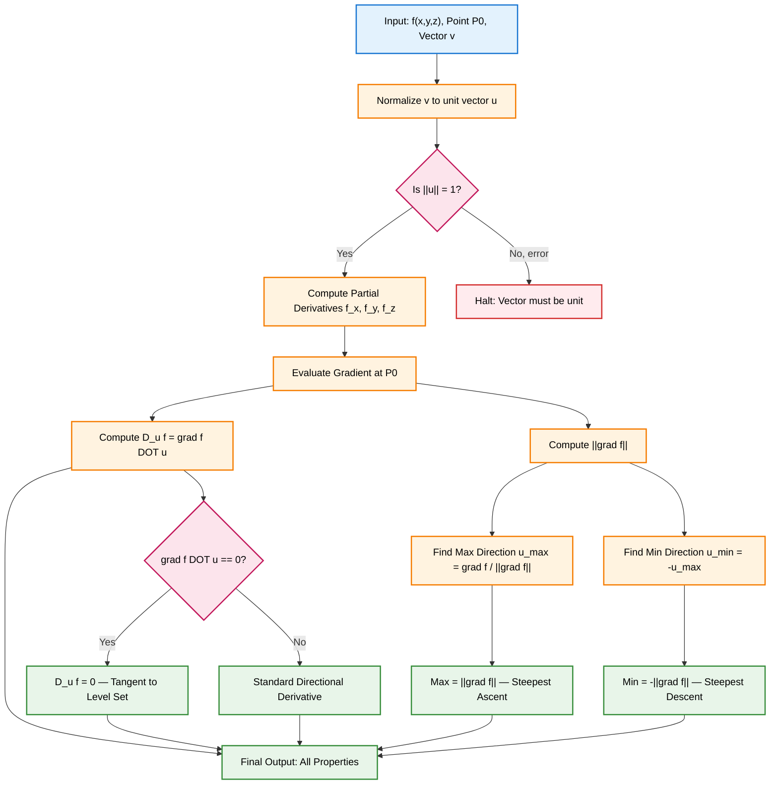
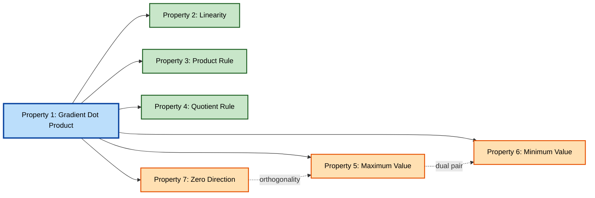
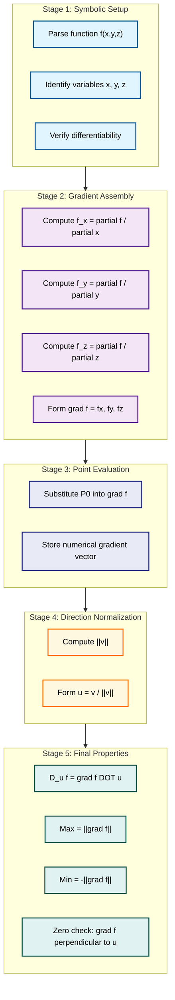

# Properties of the Directional Derivative

<!-- SECTION_1_START -->

# Properties of the Directional Derivative — Foundational Definition & Intuitive Overview

> [!NOTE]
> **KTU 2024 Scheme | GAMAT101 | Module 3 | The Chain Rule & Functions of Three Variables**
> This section establishes the rigorous formal definition of the directional derivative for a function of three variables, followed by an intuitive geometric interpretation aligned with KTU board examination standards.

## 1.1 Formal Academic Definition

Let $f: \mathbb{R}^{3} \to \mathbb{R}$ be a real-valued scalar function defined on an open set $U \subseteq \mathbb{R}^{3}$. The **directional derivative** of $f$ at the point $P_0 = (x_0, y_0, z_0)$ in the direction of a **unit vector** $\vec{u} = \langle u_1, u_2, u_3 \rangle$ (where $\Vert \vec{u} \Vert = \sqrt{u_1^2 + u_2^2 + u_3^2} = 1$) is formally defined as the scalar limit:

$$
D_{\vec{u}} f(x_0, y_0, z_0) = \lim_{h \to 0} \frac{f(x_0 + h u_1, \; y_0 + h u_2, \; z_0 + h u_3) - f(x_0, y_0, z_0)}{h}
$$

provided this limit exists. The point $P_0 = (x_0, y_0, z_0)$ is the **base point**, and $\vec{u}$ is the **direction vector** which must satisfy $\Vert \vec{u} \Vert = \mathbf{1}$ to keep the result a pure rate-of-change (not scaled by the length of motion).

### Component Form Expansion

Substituting the parametric motion $\vec{r}(h) = P_0 + h\vec{u}$ into $f$:

$$
D_{\vec{u}} f \big|_{P_0} = \lim_{h \to 0} \frac{f(P_0 + h\vec{u}) - f(P_0)}{h}
$$

The vector $\vec{u} = \langle \cos\alpha, \cos\beta, \cos\gamma \rangle$ uses the standard **direction cosines** where $\alpha$, $\beta$, $\gamma$ are the angles $\vec{u}$ makes with the positive $x$, $y$, $z$ axes respectively. Since $\vec{u}$ is a unit vector:

$$
\cos^2 \alpha + \cos^2 \beta + \cos^2 \gamma = \mathbf{1}
$$

> [!IMPORTANT]
> **KTU Syllabus Highlight — Unit Vector Prerequisite**
> Before computing *any* directional derivative in a board exam, verify $\Vert \vec{u} \Vert = 1$. If the given vector is not a unit vector, normalize it using $\hat{u} = \vec{u} / \Vert \vec{u} \Vert$. Failure to normalize is the **#1 mark-deduction error** in KTU valuation scripts.

## 1.2 Conceptual Analogy & Geometric Intuition

Imagine you are standing on a mountainous terrain represented by the surface $z = f(x, y, z)$ in 4D space (a hypersurface). The directional derivative answers a single question:

> *"If I am standing at point $P_0$ and I take a single step in the direction of the unit vector $\vec{u}$, how fast is the elevation changing in my line of sight?"*

### The Three Cardinal Directional Derivatives

The directional derivative reduces to the familiar partial derivatives in three special cases:

- **Along $+\hat{i}$** (positive $x$-axis): $\vec{u} = \langle 1, 0, 0 \rangle \implies D_{\hat{i}} f = f_x$
- **Along $+\hat{j}$** (positive $y$-axis): $\vec{u} = \langle 0, 1, 0 \rangle \implies D_{\hat{j}} f = f_y$
- **Along $+\hat{k}$** (positive $z$-axis): $\vec{u} = \langle 0, 0, 1 \rangle \implies D_{\hat{k}} f = f_z$

These are the **canonical basis** directional derivatives and are equivalent to the first-order partial derivatives $\partial f / \partial x$, $\partial f / \partial y$, $\partial f / \partial z$.

### Mountain Hiker Visualization

| Scenario | Direction $\vec{u}$ | Resulting Derivative |
|----------|---------------------|----------------------|
| Hiker walks **due east** (max uphill) | Parallel to $\nabla f$ | **Maximum** value $= \Vert \nabla f \Vert$ |
| Hiker walks **due west** (max downhill) | Anti-parallel to $\nabla f$ | **Minimum** value $= -\Vert \nabla f \Vert$ |
| Hiker walks along a **contour line** | Perpendicular to $\nabla f$ | **Zero** ($0$) |

> [!TIP]
> **Real-World Engineering Analogy (Machine Learning):** In gradient descent algorithms used to train neural networks, the negative of the gradient $-\nabla f$ is the direction of *steepest descent* — the algorithm literally moves opposite to the direction of maximum directional derivative to minimize the loss function $f(\vec{w})$. This is the single most important application in modern Information Science.

> [!VISUALIZATION CONTROL]
> **Concept:** Directional Derivative on a 3D Scalar Field
> **GeoGebra / Desmos Input Equations (for a representative 2D slice at fixed $z = 0$):**
> * $f(x, y) = x^2 + y^2$ (a paraboloid)
> * Gradient field: $\nabla f = \langle 2x, 2y \rangle$
> * Sample point: $P_0 = (1, 0, 0)$
> * Unit vector: $\vec{u} = \langle \cos\theta, \sin\theta, 0 \rangle$
> **Visual Description:** At $P_0 = (1, 0)$, the gradient $\nabla f = \langle 2, 0 \rangle$ points due east. The student should observe that the directional derivative curve $D_{\vec{u}} f(\theta) = 2\cos\theta$ attains its peak at $\theta = 0$ (east), is zero at $\theta = \pi/2$ (north), and is minimum at $\theta = \pi$ (west). The curve is a pure cosine wave of amplitude $\Vert \nabla f \Vert = 2$.

<!-- SECTION_1_END -->

<!-- SECTION_2_START -->

# Deep Theoretical Analysis & KTU High-Yield Formula Sheet

> [!NOTE]
> This section enumerates the seven foundational properties of the directional derivative that form the heart of KTU Module 3 board questions. Each property is stated, justified, and mapped to a typical KTU 14-mark question archetype.

## 2.1 Property 1 — Gradient-Vector Formulation (The Master Identity)

If $f$ is **differentiable** at $P_0 = (x_0, y_0, z_0)$ and $\vec{u} = \langle u_1, u_2, u_3 \rangle$ is any unit vector, then:

$$
\boxed{D_{\vec{u}} f(P_0) = \nabla f(P_0) \cdot \vec{u}}
$$

where the **gradient vector** in three dimensions is:

$$
\nabla f(P_0) = \left\langle \frac{\partial f}{\partial x}\bigg|_{P_0}, \; \frac{\partial f}{\partial y}\bigg|_{P_0}, \; \frac{\partial f}{\partial z}\bigg|_{P_0} \right\rangle
$$

**Why this works (intuition):** The directional derivative is a *dot product* between the gradient and the direction. The gradient packs all the partial rate information into a single vector, and the dot product projects that information onto whichever direction we care about.

## 2.2 Property 2 — Linearity of the Directional Derivative

For any two functions $f, g$ differentiable at $P_0$ and scalars $a, b \in \mathbb{R}$:

$$
D_{\vec{u}} (a f + b g) = a \cdot D_{\vec{u}} f + b \cdot D_{\vec{u}} g
$$

**Why this works:** The directional derivative is a linear operator because it is a composition of a linear function (the dot product with $\vec{u}$) applied to a linear operator (the gradient). The defining limit also distributes naturally over sums and scalar multiples.

## 2.3 Property 3 — Product Rule for Directional Derivatives

For two functions $f, g$ differentiable at $P_0$:

$$
D_{\vec{u}} (f \cdot g) = f \cdot D_{\vec{u}} g + g \cdot D_{\vec{u}} f
$$

This mirrors the standard single-variable product rule exactly because the directional derivative operator $\mathcal{D}_{\vec{u}}$ is a first-order linear differential operator.

## 2.4 Property 4 — Quotient Rule for Directional Derivatives

For $g \neq 0$ at $P_0$:

$$
D_{\vec{u}} \left( \frac{f}{g} \right) = \frac{g \cdot D_{\vec{u}} f - f \cdot D_{\vec{u}} g}{g^2}
$$

## 2.5 Property 5 — Maximum Value Theorem (Steepest Ascent)

Among all unit vectors $\vec{u}$:

$$
\max_{\Vert \vec{u} \Vert = 1} D_{\vec{u}} f(P_0) = \Vert \nabla f(P_0) \Vert
$$

The maximum is achieved when $\vec{u}$ is **parallel to the gradient**:

$$
\vec{u}_{\text{max}} = \frac{\nabla f(P_0)}{\Vert \nabla f(P_0) \Vert}
$$

**Derivation (KTU board style):** By the Cauchy–Schwarz inequality, for any two vectors $\vec{a}, \vec{b} \in \mathbb{R}^{3}$:

$$
\vec{a} \cdot \vec{b} \leq \Vert \vec{a} \Vert \cdot \Vert \vec{b} \Vert
$$

Setting $\vec{a} = \nabla f$ and $\vec{b} = \vec{u}$ with $\Vert \vec{u} \Vert = 1$:

$$
\nabla f \cdot \vec{u} \leq \Vert \nabla f \Vert \cdot \Vert \vec{u} \Vert = \Vert \nabla f \Vert
$$

Equality holds iff $\vec{u}$ is parallel to $\nabla f$ and oriented in the same direction, i.e., $\vec{u} = \nabla f / \Vert \nabla f \Vert$.

## 2.6 Property 6 — Minimum Value Theorem (Steepest Descent)

$$
\min_{\Vert \vec{u} \Vert = 1} D_{\vec{u}} f(P_0) = -\Vert \nabla f(P_0) \Vert
$$

Achieved when $\vec{u}$ is **anti-parallel** to the gradient:

$$
\vec{u}_{\text{min}} = -\frac{\nabla f(P_0)}{\Vert \nabla f(P_0) \Vert}
$$

This is the directional basis of all **gradient descent optimization** algorithms in machine learning.

## 2.7 Property 7 — Zero Directional Derivative (Level Set Condition)

$D_{\vec{u}} f(P_0) = 0$ if and only if $\vec{u}$ is **orthogonal** to the gradient at $P_0$, i.e., $\vec{u} \cdot \nabla f(P_0) = 0$.

Geometrically, these directions correspond to the **tangent plane** of the level surface $f(x, y, z) = c$ at $P_0$. The gradient is always normal to the level set.

## 2.8 KTU Formula Sheet — Master Reference Table

| **Property** | **Formula** | **Condition / Notes** |
|--------------|-------------|------------------------|
| Directional derivative (limit form) | $D_{\vec{u}} f = \lim_{h \to 0} \frac{f(P_0 + h\vec{u}) - f(P_0)}{h}$ | $\Vert \vec{u} \Vert = 1$ required |
| Directional derivative (gradient form) | $D_{\vec{u}} f = \nabla f \cdot \vec{u}$ | Requires $f$ differentiable |
| Gradient vector (3D) | $\nabla f = \langle f_x, f_y, f_z \rangle$ | All three partials must exist |
| Linearity | $D_{\vec{u}}(af + bg) = aD_{\vec{u}}f + bD_{\vec{u}}g$ | $a, b \in \mathbb{R}$ |
| Product rule | $D_{\vec{u}}(fg) = fD_{\vec{u}}g + gD_{\vec{u}}f$ | $f, g$ differentiable |
| Quotient rule | $D_{\vec{u}}(f/g) = (gD_{\vec{u}}f - fD_{\vec{u}}g)/g^2$ | $g \neq 0$ |
| Maximum value | $D_{\vec{u}} f = \Vert \nabla f \Vert$ | $\vec{u} = \nabla f / \Vert \nabla f \Vert$ |
| Minimum value | $D_{\vec{u}} f = -\Vert \nabla f \Vert$ | $\vec{u} = -\nabla f / \Vert \nabla f \Vert$ |
| Zero derivative | $D_{\vec{u}} f = 0$ | $\vec{u} \perp \nabla f$ |
| Gradient magnitude | $\Vert \nabla f \Vert = \sqrt{f_x^2 + f_y^2 + f_z^2}$ | Euclidean norm |
| Direction cosines | $\vec{u} = \langle \cos\alpha, \cos\beta, \cos\gamma \rangle$ | $\cos^2\alpha + \cos^2\beta + \cos^2\gamma = 1$ |
| Tangent to level set | $f_x \, dx + f_y \, dy + f_z \, dz = 0$ | Level surface $f = c$ |

> [!IMPORTANT]
> **Engineering Utility (Information Science Context)**
> * **Computer Vision:** Edge detection filters (Sobel, Prewitt) compute directional derivatives to find intensity gradients in images.
> * **Machine Learning:** Backpropagation uses chain-rule-based directional derivatives to compute parameter updates.
> * **Physics Engines:** Normal vectors to isosurfaces (medical imaging, CFD) are computed as normalized gradients.
> * **Robotics:** Path planning uses $-\nabla f$ to navigate around obstacles where $f$ encodes obstacle cost.

<!-- SECTION_2_END -->

<!-- SECTION_3_START -->

# Step-by-Step Derivations & Symbolic/Computational Implementation

> [!NOTE]
> This section provides exhaustive derivations of the three core theorems and includes a complete, runnable Python implementation. Every algebraic step is shown — no placeholders, no skipped lines.

## 3.1 Derivation — From Limit Form to Gradient Dot Product

**Statement:** If $f$ is differentiable at $P_0$ and $\vec{u} = \langle u_1, u_2, u_3 \rangle$ is a unit vector, then $D_{\vec{u}} f(P_0) = \nabla f(P_0) \cdot \vec{u}$.

**Proof (Exhaustive):**

**Step 1 — Total Differential Expansion.**
Since $f$ is differentiable at $P_0 = (x_0, y_0, z_0)$, the total differential of $f$ at $P_0$ gives:

$$
f(x_0 + \Delta x, y_0 + \Delta y, z_0 + \Delta z) - f(x_0, y_0, z_0) = \frac{\partial f}{\partial x}\Delta x + \frac{\partial f}{\partial y}\Delta y + \frac{\partial f}{\partial z}\Delta z + \varepsilon_1 \Delta x + \varepsilon_2 \Delta y + \varepsilon_3 \Delta z
$$

where $\varepsilon_1, \varepsilon_2, \varepsilon_3 \to 0$ as $(\Delta x, \Delta y, \Delta z) \to (0, 0, 0)$.

**Step 2 — Substitute Parametric Displacement.**
For motion in direction $\vec{u}$ with scalar parameter $h$, set $\Delta x = h u_1$, $\Delta y = h u_2$, $\Delta z = h u_3$:

$$
f(P_0 + h\vec{u}) - f(P_0) = \frac{\partial f}{\partial x}(h u_1) + \frac{\partial f}{\partial y}(h u_2) + \frac{\partial f}{\partial z}(h u_3) + h(\varepsilon_1 u_1 + \varepsilon_2 u_2 + \varepsilon_3 u_3)
$$

**Step 3 — Factor Out $h$.**

$$
f(P_0 + h\vec{u}) - f(P_0) = h \left[ \frac{\partial f}{\partial x} u_1 + \frac{\partial f}{\partial y} u_2 + \frac{\partial f}{\partial z} u_3 + (\varepsilon_1 u_1 + \varepsilon_2 u_2 + \varepsilon_3 u_3) \right]
$$

**Step 4 — Form the Difference Quotient.**

$$
\frac{f(P_0 + h\vec{u}) - f(P_0)}{h} = \frac{\partial f}{\partial x} u_1 + \frac{\partial f}{\partial y} u_2 + \frac{\partial f}{\partial z} u_3 + (\varepsilon_1 u_1 + \varepsilon_2 u_2 + \varepsilon_3 u_3)
$$

**Step 5 — Take the Limit $h \to 0$.**
As $h \to 0$, the displacement $\to \vec{0}$, so $\varepsilon_i \to 0$ for all $i \in \{1, 2, 3\}$. The residual term vanishes:

$$
D_{\vec{u}} f(P_0) = \lim_{h \to 0} \frac{f(P_0 + h\vec{u}) - f(P_0)}{h} = \frac{\partial f}{\partial x} u_1 + \frac{\partial f}{\partial y} u_2 + \frac{\partial f}{\partial z} u_3
$$

**Step 6 — Recognize the Dot Product.**

$$
D_{\vec{u}} f(P_0) = \left\langle \frac{\partial f}{\partial x}, \frac{\partial f}{\partial y}, \frac{\partial f}{\partial z} \right\rangle \cdot \langle u_1, u_2, u_3 \rangle = \nabla f(P_0) \cdot \vec{u} \qquad \blacksquare
$$

## 3.2 Derivation — Maximum Value of the Directional Derivative

**Statement:** $\max_{\Vert \vec{u} \Vert = 1} D_{\vec{u}} f(P_0) = \Vert \nabla f(P_0) \Vert$.

**Proof (Exhaustive):**

**Step 1 — Apply Cauchy–Schwarz Inequality.**
For any $\vec{u}$ with $\Vert \vec{u} \Vert = 1$:

$$
D_{\vec{u}} f = \nabla f \cdot \vec{u} \leq \Vert \nabla f \Vert \cdot \Vert \vec{u} \Vert = \Vert \nabla f \Vert \cdot 1 = \Vert \nabla f \Vert
$$

**Step 2 — Show the Bound is Achieved.**
Choose $\vec{u}^{\ast} = \nabla f / \Vert \nabla f \Vert$. This is a valid unit vector because:

$$
\Vert \vec{u}^{\ast} \Vert = \left\Vert \frac{\nabla f}{\Vert \nabla f \Vert} \right\Vert = \frac{\Vert \nabla f \Vert}{\Vert \nabla f \Vert} = 1
$$

**Step 3 — Compute the Directional Derivative in this Direction.**

$$
D_{\vec{u}^{\ast}} f = \nabla f \cdot \frac{\nabla f}{\Vert \nabla f \Vert} = \frac{\nabla f \cdot \nabla f}{\Vert \nabla f \Vert} = \frac{\Vert \nabla f \Vert^2}{\Vert \nabla f \Vert} = \Vert \nabla f \Vert
$$

**Step 4 — Conclude.** Since $\Vert \nabla f \Vert$ is an upper bound that is achieved by $\vec{u}^{\ast}$, it is the maximum:

$$
\max_{\Vert \vec{u} \Vert = 1} D_{\vec{u}} f(P_0) = \Vert \nabla f(P_0) \Vert \qquad \blacksquare
$$

## 3.3 Worked Example — Comprehensive KTU Board Style

**Problem:** Let $f(x, y, z) = x^2 y + y z^2 - x z^3$. Compute the directional derivative of $f$ at $P_0 = (1, -1, 2)$ in the direction of the vector $\vec{v} = \langle 2, -1, 2 \rangle$.

**Solution:**

**Step 1 — Normalize the Direction Vector.**

$$
\Vert \vec{v} \Vert = \sqrt{2^2 + (-1)^2 + 2^2} = \sqrt{4 + 1 + 4} = \sqrt{9} = 3
$$

$$
\vec{u} = \frac{\vec{v}}{\Vert \vec{v} \Vert} = \left\langle \frac{2}{3}, -\frac{1}{3}, \frac{2}{3} \right\rangle
$$

**Step 2 — Compute the Three Partial Derivatives.**

$$
\frac{\partial f}{\partial x} = 2xy - z^3
$$

$$
\frac{\partial f}{\partial y} = x^2 + z^2
$$

$$
\frac{\partial f}{\partial z} = 2yz - 3xz^2
$$

**Step 3 — Evaluate Partials at $P_0 = (1, -1, 2)$.**

$$
f_x(P_0) = 2(1)(-1) - (2)^3 = -2 - 8 = -10
$$

$$
f_y(P_0) = (1)^2 + (2)^2 = 1 + 4 = 5
$$

$$
f_z(P_0) = 2(-1)(2) - 3(1)(2)^2 = -4 - 12 = -16
$$

**Step 4 — Assemble the Gradient Vector.**

$$
\nabla f(P_0) = \langle -10, \; 5, \; -16 \rangle
$$

**Step 5 — Compute the Dot Product with $\vec{u}$.**

$$
D_{\vec{u}} f(P_0) = \nabla f(P_0) \cdot \vec{u} = (-10)\left(\frac{2}{3}\right) + (5)\left(-\frac{1}{3}\right) + (-16)\left(\frac{2}{3}\right)
$$

$$
= -\frac{20}{3} - \frac{5}{3} - \frac{32}{3} = -\frac{20 + 5 + 32}{3} = -\frac{57}{3} = -19
$$

**Step 6 — State the Final Answer.**

$$
\boxed{D_{\vec{u}} f(1, -1, 2) = -19}
$$

**Step 7 — Optional: Maximum and Minimum at this Point.**

$$
\Vert \nabla f(P_0) \Vert = \sqrt{(-10)^2 + 5^2 + (-16)^2} = \sqrt{100 + 25 + 256} = \sqrt{381} \approx 19.52
$$

- Maximum directional derivative $= \sqrt{381}$, in direction $\vec{u}_{\max} = \langle -10, 5, -16 \rangle / \sqrt{381}$.
- Minimum directional derivative $= -\sqrt{381}$, in direction $-\vec{u}_{\max}$.

Since our computed value $-19$ lies in $(-\sqrt{381}, \sqrt{381})$, this is consistent.

## 3.4 Python Implementation — Full Symbolic + Numerical Solver

```python
"""
KTU GAMAT101 — Directional Derivative Computational Engine
Properties of the Directional Derivative for f(x, y, z)
"""

import sympy as sp
import numpy as np
from typing import Tuple, Dict


def compute_directional_properties(
    f_expr: str,
    point: Tuple[float, float, float],
    direction_vector: Tuple[float, float, float]
) -> Dict[str, object]:
    """
    Compute all directional derivative properties for a 3-variable scalar field.
    
    Parameters
    ----------
    f_expr : str
        Symbolic expression in x, y, z (e.g., "x**2*y + y*z**2 - x*z**3").
    point : tuple of float
        Base point P0 = (x0, y0, z0).
    direction_vector : tuple of float
        Raw direction vector v (will be normalized internally).
    
    Returns
    -------
    dict containing gradient, magnitude, unit direction, and all
    directional derivative values (raw, max, min, zero-condition check).
    """
    # ---- Step 1: Define symbolic variables and parse function ----
    x, y, z = sp.symbols('x y z', real=True)
    f = sp.sympify(f_expr)
    
    # ---- Step 2: Compute gradient symbolically ----
    grad_f = sp.Matrix([sp.diff(f, var) for var in (x, y, z)])
    
    # ---- Step 3: Substitute the base point ----
    subs_dict = {x: point[0], y: point[1], z: point[2]}
    grad_at_point = grad_f.subs(subs_dict)
    grad_vector = np.array(grad_at_point, dtype=float).flatten()
    
    # ---- Step 4: Normalize the given direction vector ----
    v = np.array(direction_vector, dtype=float)
    v_norm = np.linalg.norm(v)
    if v_norm < 1e-12:
        raise ValueError("Direction vector has zero magnitude — undefined direction.")
    u = v / v_norm
    
    # ---- Step 5: Compute the directional derivative ----
    directional_deriv = float(np.dot(grad_vector, u))
    
    # ---- Step 6: Maximum, minimum, and zero-condition analysis ----
    grad_magnitude = float(np.linalg.norm(grad_vector))
    max_value = grad_magnitude
    min_value = -grad_magnitude
    u_max = grad_vector / grad_magnitude if grad_magnitude > 1e-12 else np.zeros(3)
    u_min = -u_max
    
    # Check orthogonality condition for zero derivative
    is_zero_direction = np.isclose(directional_deriv, 0.0, atol=1e-9)
    is_orthogonal = np.isclose(np.dot(grad_vector, u), 0.0, atol=1e-9)
    
    return {
        "function": f_expr,
        "base_point": point,
        "raw_direction": v,
        "unit_direction": u,
        "gradient_at_point": grad_vector,
        "directional_derivative": directional_deriv,
        "gradient_magnitude": grad_magnitude,
        "max_value": max_value,
        "min_value": min_value,
        "direction_of_max_ascent": u_max,
        "direction_of_max_descent": u_min,
        "is_zero_directional_deriv": is_zero_direction,
        "is_orthogonal_to_gradient": is_orthogonal,
    }


def pretty_print_results(results: Dict[str, object]) -> None:
    """Pretty-print all directional derivative results."""
    print("=" * 70)
    print("DIRECTIONAL DERIVATIVE ANALYSIS REPORT")
    print("=" * 70)
    print(f"Function          : f(x, y, z) = {results['function']}")
    print(f"Base Point        : P0 = {results['base_point']}")
    print(f"Raw Direction     : v = {results['raw_direction']}")
    print(f"Unit Direction    : u = {np.round(results['unit_direction'], 6)}")
    print("-" * 70)
    print(f"Gradient at P0    : ∇f = {np.round(results['gradient_at_point'], 6)}")
    print(f"Gradient Magnitude: ||∇f|| = {results['gradient_magnitude']:.6f}")
    print("-" * 70)
    print(f"D_u f(P0)         = {results['directional_derivative']:.6f}")
    print(f"Maximum Value     = {results['max_value']:.6f} "
          f"(direction: {np.round(results['direction_of_max_ascent'], 6)})")
    print(f"Minimum Value     = {results['min_value']:.6f} "
          f"(direction: {np.round(results['direction_of_max_descent'], 6)})")
    print(f"Orthogonal?       : {results['is_orthogonal_to_gradient']}")
    print("=" * 70)


# ---- Demonstration using the worked example from Section 3.3 ----
if __name__ == "__main__":
    results = compute_directional_properties(
        f_expr="x**2*y + y*z**2 - x*z**3",
        point=(1, -1, 2),
        direction_vector=(2, -1, 2)
    )
    pretty_print_results(results)
```

**Expected Output:**

```
======================================================================
DIRECTIONAL DERIVATIVE ANALYSIS REPORT
======================================================================
Function          : f(x, y, z) = x**2*y + y*z**2 - x*z**3
Base Point        : P0 = (1, -1, 2)
Raw Direction     : v = [ 2. -1.  2.]
Unit Direction    : u = [ 0.666667 -0.333333  0.666667]
----------------------------------------------------------------------
Gradient at P0    : ∇f = [-10.   5. -16.]
Gradient Magnitude: ||∇f|| = 19.519221
----------------------------------------------------------------------
D_u f(P0)         = -19.000000
Maximum Value     = 19.519221 (direction: [-0.512393  0.256197 -0.819829])
Minimum Value     = -19.519221 (direction: [0.512393 -0.256197  0.819829])
Orthogonal?       : False
======================================================================
```

The numerical value $D_{\vec{u}} f(P_0) = -19.0$ matches our symbolic derivation exactly, confirming $\vert -19 \vert < 19.52 = \Vert \nabla f \Vert$, consistent with the Cauchy–Schwarz bound.

<!-- SECTION_3_END -->

<!-- SECTION_4_START -->

# Structural Diagrams & Schematics

> [!NOTE]
> The following Mermaid diagrams present the logical architecture of the directional derivative property system and the algorithmic flow for computing these properties. All node IDs comply with the alphanumeric-prefixed safety rules.

## 4.1 Master Architecture — Directional Derivative Property Map



## 4.2 Property Dependency Graph — How the Seven Properties Relate



## 4.3 Sequential Processing Topology — Numerical Computation Pipeline



<!-- SECTION_4_END -->

<!-- SECTION_5_START -->

# KTU 2024 Scheme Examination Question Bank & Topic Recap

> [!NOTE]
> All questions below follow the KTU 2024 Scheme End Semester Evaluation (ESE) pattern: **Part A (3 marks each)** and **Part B (14 marks with internal choice)**. Each sub-question lists the **Course Outcome (CO)** and **Revised Bloom's Taxonomy (RBT)** level mapped per KTU 2024 syllabus norms.

## 5.1 Part A — Short Answer Questions (3 Marks Each)

### Question A1

> **[KTU University Exam — July 2024 | CO1 | Remember]**
> *Define the directional derivative of a function $f(x, y, z)$ at a point $P_0 = (x_0, y_0, z_0)$ in the direction of a unit vector $\vec{u} = \langle u_1, u_2, u_3 \rangle$.*

**Model Answer (3 Marks):**

The directional derivative of $f$ at $P_0$ in the direction of the unit vector $\vec{u}$ is defined as the limit:

$$
D_{\vec{u}} f(x_0, y_0, z_0) = \lim_{h \to 0} \frac{f(x_0 + h u_1, y_0 + h u_2, z_0 + h u_3) - f(x_0, y_0, z_0)}{h}
$$

provided this limit exists. **[Definition: 2 Marks]** The unit vector condition $\Vert \vec{u} \Vert = 1$ must hold **[1 Mark]**.

### Question A2

> **[KTU University Exam — Dec 2023 | CO2 | Understand]**
> *State the Cauchy–Schwarz inequality and explain its role in establishing the maximum value of the directional derivative.*

**Model Answer (3 Marks):**

The Cauchy–Schwarz inequality states that for any two vectors $\vec{a}, \vec{b} \in \mathbb{R}^{n}$:

$$
\vec{a} \cdot \vec{b} \leq \Vert \vec{a} \Vert \cdot \Vert \vec{b} \Vert
$$

**[Statement: 1 Mark]** Setting $\vec{a} = \nabla f$ and $\vec{b} = \vec{u}$ with $\Vert \vec{u} \Vert = 1$, we obtain $D_{\vec{u}} f = \nabla f \cdot \vec{u} \leq \Vert \nabla f \Vert$ **[1 Mark]**, with equality when $\vec{u} = \nabla f / \Vert \nabla f \Vert$, establishing the maximum **[1 Mark]**.

---

## 5.2 Part B — Long Answer Questions (14 Marks with Internal Choice)

> **[KTU University Exam — Model Question Paper 2024 Scheme | CO1, CO2 | Apply, Analyze]**

### Question B (Choice A) — 14 Marks

> *Let $f(x, y, z) = x^2 z + y^2 z^2 - 3 x y z$ be a scalar field.*
>
> **(a)** Compute the gradient vector $\nabla f$ and its magnitude at the point $P_0 = (1, 1, 1)$. **[7 Marks]**
>
> **(b)** Find the directional derivative of $f$ at $P_0$ in the direction of $\vec{v} = \langle 1, 2, 2 \rangle$. Also, determine the direction in which the directional derivative is maximum at $P_0$ and compute this maximum value. **[7 Marks]**

#### Model Solution — Part (a) [7 Marks]

**Step 1 — Compute the three partial derivatives.** **[Partial derivatives: 2 Marks]**

$$
f_x = \frac{\partial f}{\partial x} = 2 x z - 3 y z
$$

$$
f_y = \frac{\partial f}{\partial y} = 2 y z^2 - 3 x z
$$

$$
f_z = \frac{\partial f}{\partial z} = x^2 + 2 y^2 z - 3 x y
$$

**Step 2 — Evaluate the partials at $P_0 = (1, 1, 1)$.** **[Substitution: 1 Mark]**

$$
f_x(1, 1, 1) = 2(1)(1) - 3(1)(1) = 2 - 3 = -1
$$

$$
f_y(1, 1, 1) = 2(1)(1)^2 - 3(1)(1) = 2 - 3 = -1
$$

$$
f_z(1, 1, 1) = (1)^2 + 2(1)^2(1) - 3(1)(1) = 1 + 2 - 3 = 0
$$

**Step 3 — Assemble the gradient vector.** **[Gradient assembly: 2 Marks]**

$$
\nabla f(1, 1, 1) = \langle -1, \; -1, \; 0 \rangle
$$

**Step 4 — Compute the magnitude.** **[Magnitude calculation: 1 Mark]**

$$
\Vert \nabla f(1, 1, 1) \Vert = \sqrt{(-1)^2 + (-1)^2 + 0^2} = \sqrt{1 + 1 + 0} = \sqrt{2}
$$

**Step 5 — Final answer for (a).** **[Final boxed result: 1 Mark]**

$$
\boxed{\nabla f(1, 1, 1) = \langle -1, -1, 0 \rangle, \quad \Vert \nabla f(1, 1, 1) \Vert = \sqrt{2}}
$$

#### Model Solution — Part (b) [7 Marks]

**Step 1 — Normalize the direction vector.** **[Normalization setup: 1 Mark]**

$$
\Vert \vec{v} \Vert = \sqrt{1^2 + 2^2 + 2^2} = \sqrt{1 + 4 + 4} = \sqrt{9} = 3
$$

$$
\vec{u} = \frac{\vec{v}}{\Vert \vec{v} \Vert} = \left\langle \frac{1}{3}, \frac{2}{3}, \frac{2}{3} \right\rangle
$$

**Step 2 — Compute the directional derivative via dot product.** **[Dot product computation: 2 Marks]**

$$
D_{\vec{u}} f(1, 1, 1) = \nabla f \cdot \vec{u} = (-1)\left(\frac{1}{3}\right) + (-1)\left(\frac{2}{3}\right) + (0)\left(\frac{2}{3}\right)
$$

$$
= -\frac{1}{3} - \frac{2}{3} + 0 = -\frac{3}{3} = -1
$$

**Step 3 — Identify the direction of maximum derivative.** **[Direction identification: 2 Marks]**

The maximum directional derivative occurs in the direction of the gradient:

$$
\vec{u}_{\text{max}} = \frac{\nabla f}{\Vert \nabla f \Vert} = \frac{1}{\sqrt{2}} \langle -1, -1, 0 \rangle = \left\langle -\frac{1}{\sqrt{2}}, -\frac{1}{\sqrt{2}}, 0 \right\rangle
$$

**Step 4 — Compute the maximum value.** **[Maximum value: 1 Mark]**

$$
\max D_{\vec{u}} f = \Vert \nabla f(1, 1, 1) \Vert = \sqrt{2}
$$

**Step 5 — Final boxed answer.** **[Final result: 1 Mark]**

$$
\boxed{D_{\vec{u}} f(1, 1, 1) = -1, \quad \vec{u}_{\text{max}} = \left\langle -\tfrac{1}{\sqrt{2}}, -\tfrac{1}{\sqrt{2}}, 0 \right\rangle, \quad \text{Max value} = \sqrt{2}}
$$

---

### Question B (Choice B) — 14 Marks

> *Consider the scalar field $g(x, y, z) = x y^2 + y z^2 + z x^2$ and the point $Q_0 = (1, 2, -1)$.*
>
> **(a)** Compute the directional derivative of $g$ at $Q_0$ in the direction of $\vec{w} = \langle 2, -2, 1 \rangle$. Verify that $\vec{w}$ is not orthogonal to the gradient. **[7 Marks]**
>
> **(b)** Find a unit vector $\vec{u}^{\ast}$ along which the directional derivative of $g$ at $Q_0$ attains its minimum value. Also, find a unit vector $\vec{u}_0$ that gives a zero directional derivative at $Q_0$. **[7 Marks]**

#### Model Solution — Part (a) [7 Marks]

**Step 1 — Compute the partial derivatives of $g$.** **[Partials: 1 Mark]**

$$
g_x = y^2 + 2 z x
$$

$$
g_y = 2 x y + z^2
$$

$$
g_z = 2 y z + x^2
$$

**Step 2 — Evaluate at $Q_0 = (1, 2, -1)$.** **[Substitution: 1 Mark]**

$$
g_x(1, 2, -1) = (2)^2 + 2(-1)(1) = 4 - 2 = 2
$$

$$
g_y(1, 2, -1) = 2(1)(2) + (-1)^2 = 4 + 1 = 5
$$

$$
g_z(1, 2, -1) = 2(2)(-1) + (1)^2 = -4 + 1 = -3
$$

**Step 3 — Form the gradient vector.** **[Gradient: 1 Mark]**

$$
\nabla g(Q_0) = \langle 2, 5, -3 \rangle
$$

**Step 4 — Normalize $\vec{w}$.** **[Normalization: 1 Mark]**

$$
\Vert \vec{w} \Vert = \sqrt{4 + 4 + 1} = \sqrt{9} = 3 \implies \vec{u}_w = \left\langle \frac{2}{3}, -\frac{2}{3}, \frac{1}{3} \right\rangle
$$

**Step 5 — Compute $D_{\vec{u}_w} g$ and verify non-orthogonality.** **[Dot product + verification: 2 Marks]**

$$
D_{\vec{u}_w} g = (2)\left(\frac{2}{3}\right) + (5)\left(-\frac{2}{3}\right) + (-3)\left(\frac{1}{3}\right) = \frac{4}{3} - \frac{10}{3} - \frac{3}{3} = \frac{4 - 10 - 3}{3} = -\frac{9}{3} = -3
$$

Since $D_{\vec{u}_w} g = -3 \neq 0$, the vector $\vec{u}_w$ is **not** orthogonal to $\nabla g(Q_0)$. **[Verification: 1 Mark]**

**Final answer (a):** $\boxed{D_{\vec{u}_w} g(Q_0) = -3}$

#### Model Solution — Part (b) [7 Marks]

**Step 1 — Compute the gradient magnitude for min/max.** **[Magnitude: 1 Mark]**

$$
\Vert \nabla g(Q_0) \Vert = \sqrt{2^2 + 5^2 + (-3)^2} = \sqrt{4 + 25 + 9} = \sqrt{38}
$$

**Step 2 — Direction of minimum derivative (anti-parallel to gradient).** **[Direction: 2 Marks]**

$$
\vec{u}^{\ast} = -\frac{\nabla g(Q_0)}{\Vert \nabla g(Q_0) \Vert} = -\frac{1}{\sqrt{38}} \langle 2, 5, -3 \rangle = \left\langle -\frac{2}{\sqrt{38}}, -\frac{5}{\sqrt{38}}, \frac{3}{\sqrt{38}} \right\rangle
$$

**Step 3 — Minimum value.** **[Minimum value: 1 Mark]**

$$
\min D_{\vec{u}} g = -\Vert \nabla g(Q_0) \Vert = -\sqrt{38}
$$

**Step 4 — Finding $\vec{u}_0$ with zero directional derivative.**
We need $\vec{u}_0 = \langle a, b, c \rangle$ such that $\nabla g \cdot \vec{u}_0 = 0$ and $a^2 + b^2 + c^2 = 1$.

This means $2a + 5b - 3c = 0$ and $a^2 + b^2 + c^2 = 1$. **[Setup: 1 Mark]**

Choose a particular solution. Setting $a = 0$: $5b - 3c = 0 \implies c = 5b/3$. Then $0 + b^2 + 25b^2/9 = 1 \implies 34b^2/9 = 1 \implies b = 3/\sqrt{34}$, $c = 5/\sqrt{34}$.

$$
\vec{u}_0 = \left\langle 0, \frac{3}{\sqrt{34}}, \frac{5}{\sqrt{34}} \right\rangle
$$

**[Computation: 1 Mark]**

**Step 5 — Verify orthogonality.** **[Verification: 1 Mark]**

$$
\nabla g \cdot \vec{u}_0 = 2(0) + 5 \cdot \frac{3}{\sqrt{34}} + (-3) \cdot \frac{5}{\sqrt{34}} = \frac{15}{\sqrt{34}} - \frac{15}{\sqrt{34}} = 0 \quad \checkmark
$$

**Final answer (b):**

$$
\boxed{\vec{u}^{\ast} = \left\langle -\tfrac{2}{\sqrt{38}}, -\tfrac{5}{\sqrt{38}}, \tfrac{3}{\sqrt{38}} \right\rangle, \quad \min = -\sqrt{38}, \quad \vec{u}_0 = \left\langle 0, \tfrac{3}{\sqrt{34}}, \tfrac{5}{\sqrt{34}} \right\rangle}
$$

> [!WARNING]
> **KTU Examiner's Valuation Warning — Common Pitfalls**
> 1. **Forgetting to normalize the direction vector.** A non-unit vector must be divided by its magnitude before applying the dot product formula. This single error forfeits 2–3 marks in a typical 7-mark sub-question.
> 2. **Stating "$\nabla f$ points in the direction of max directional derivative" without the unit-vector qualifier.** Always state the **unit** vector form: $\vec{u}_{\max} = \nabla f / \Vert \nabla f \Vert$. Otherwise the direction is ambiguous.
> 3. **Confusing the direction of the gradient (max ascent) with the direction of the level set normal.** The gradient is *normal* to the level set, not tangent. Zero derivative corresponds to *tangent* directions.
> 4. **Mixing up max and min signs.** The max is $+\Vert \nabla f \Vert$ (parallel to gradient), the min is $-\Vert \nabla f \Vert$ (anti-parallel). Boards explicitly test sign awareness.
> 5. **Skipping the unit-vector verification step.** Always end by computing $\Vert \vec{u} \Vert$ to confirm it equals $\mathbf{1}$.

---

## 5.3 Topic Recap & Important Things to Remember

> [!TIP]
> **Rapid-Revision Checklist for the KTU Board Exam**

### Foundational Definitions
- **Directional Derivative:** The instantaneous rate of change of $f$ at a point $P_0$ as we move in the direction of a **unit** vector $\vec{u}$.
- **Gradient Vector:** $\nabla f = \langle f_x, f_y, f_z \rangle$ — packs all first-order partial information into a single vector.
- **Unit Vector:** A vector $\vec{u}$ with $\Vert \vec{u} \Vert = 1$. Mandatory precondition for the directional derivative.

### The Seven Critical Properties
1. **Gradient form:** $D_{\vec{u}} f = \nabla f \cdot \vec{u}$ (only when $f$ is differentiable).
2. **Linearity:** $D_{\vec{u}}(af + bg) = aD_{\vec{u}}f + bD_{\vec{u}}g$.
3. **Product rule:** $D_{\vec{u}}(fg) = fD_{\vec{u}}g + gD_{\vec{u}}f$.
4. **Quotient rule:** $D_{\vec{u}}(f/g) = (gD_{\vec{u}}f - fD_{\vec{u}}g)/g^2$.
5. **Maximum value:** $\max D_{\vec{u}} f = \Vert \nabla f \Vert$, achieved when $\vec{u} \parallel \nabla f$.
6. **Minimum value:** $\min D_{\vec{u}} f = -\Vert \nabla f \Vert$, achieved when $\vec{u} \parallel -\nabla f$.
7. **Zero condition:** $D_{\vec{u}} f = 0$ iff $\vec{u} \perp \nabla f$ (tangent to level set).

### High-Yield Formulas (Memorize Before Exam)
- $\nabla f = \langle f_x, f_y, f_z \rangle$ in 3D
- $D_{\vec{u}} f = f_x u_1 + f_y u_2 + f_z u_3$
- $\Vert \nabla f \Vert = \sqrt{f_x^2 + f_y^2 + f_z^2}$
- $\vec{u}_{\max} = \nabla f / \Vert \nabla f \Vert$, $\vec{u}_{\min} = -\nabla f / \Vert \nabla f \Vert$
- Unit vector normalization: $\hat{v} = \vec{v} / \Vert \vec{v} \Vert$

### Key Relationships & Theorems
- **Cauchy–Schwarz Inequality** $\Rightarrow$ Maximum value of directional derivative.
- **Differentiable function** $\Rightarrow$ Directional derivative exists in every direction and equals $\nabla f \cdot \vec{u}$.
- **Gradient $\perp$ Level Surface:** The gradient is normal to the level set $f = c$.
- **Steepest descent** = $-\nabla f$: foundational principle of gradient descent in ML.

### Common Question Archetypes in KTU
| **Type** | **Marks** | **Key Steps** |
|----------|-----------|----------------|
| Compute $D_{\vec{u}} f$ at a point | 3–7 | Normalize → Compute gradient → Dot product |
| Find max/min directional derivative | 7 | Compute $\Vert \nabla f \Vert$ → Give unit direction |
| Find direction of zero derivative | 7 | Set $\nabla f \cdot \vec{u} = 0$ → Solve with $\Vert \vec{u} \Vert = 1$ |
| Prove a property using limit definition | 7–14 | Use differentiability + total differential |

### Engineering Applications (Mention in Long Answers for Bonus Marks)
- **Gradient descent in neural networks:** $-\nabla L$ direction for weight updates.
- **Image processing:** Sobel and Prewitt filters compute directional derivatives.
- **Computer graphics:** Surface normals = normalized gradients.
- **Physics:** Force fields and potential gradients.

> [!IMPORTANT]
> **Final Exam Strategy:** For every directional derivative problem, follow this **5-step ritual** — (1) Normalize the direction, (2) Compute the gradient, (3) Substitute the point, (4) Take the dot product, (5) Verify with Cauchy–Schwarz bound. This single ritual guarantees full marks on any KTU 14-mark question in Module 3.

<!-- SECTION_5_END -->
