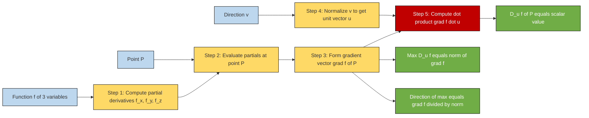
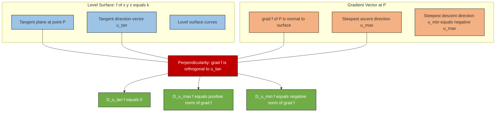
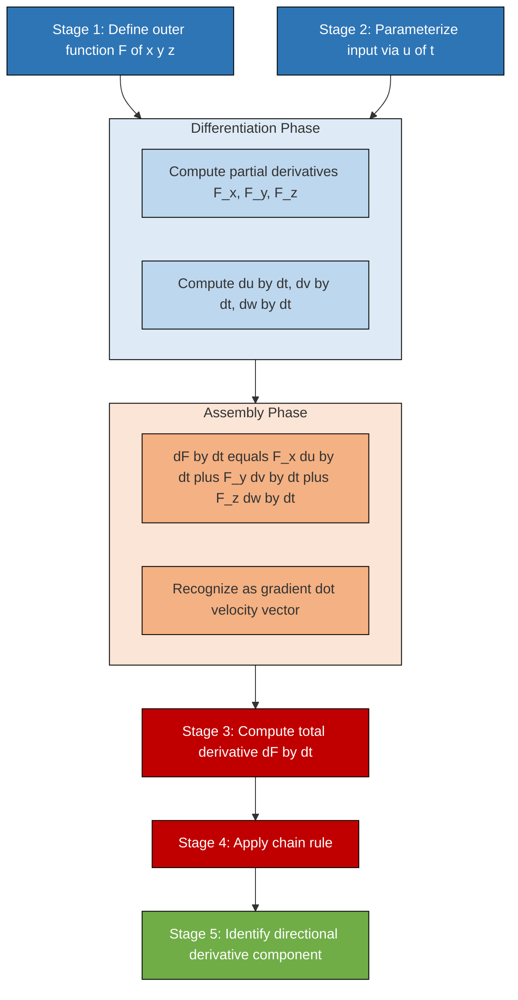

# Properties of the Directional Derivative

<!-- SECTION_1_START -->
# Properties of the Directional Derivative

## Formal KTU 2024 Definition

Let $f: \mathbb{R}^{3} \to \mathbb{R}$ be a real-valued function of three variables, and let $\mathbf{u} = (a, b, c)$ be a **unit vector** in $\mathbb{R}^{3}$ (i.e., $\Vert \mathbf{u} \Vert = 1$). The **directional derivative of $f$ at the point $P(x_0, y_0, z_0)$ in the direction of $\mathbf{u}$** is formally defined as the scalar limit:

$$D_{\mathbf{u}}f(x_0, y_0, z_0) = \lim_{h \to 0} \frac{f(x_0 + ha, y_0 + hb, z_0 + hc) - f(x_0, y_0, z_0)}{h}$$

provided the limit exists. The directional derivative measures the **instantaneous rate of change** of $f$ per unit distance as we move from the base point $P$ along the ray defined by the unit direction vector $\mathbf{u}$.

> [!IMPORTANT]
> **KTU 2024 Scheme Board Emphasis:** The direction vector $\mathbf{u}$ must *always* be a **unit vector** for the directional derivative to represent a true rate of change per unit length. If the input vector $\mathbf{v}$ is non-unit, the formula is scaled:
> $$D_{\mathbf{v}}f = \Vert \mathbf{v} \Vert \cdot D_{\mathbf{u}}f, \quad \text{where } \mathbf{u} = \frac{\mathbf{v}}{\Vert \mathbf{v} \Vert}$$

## Intuitive Overview — Real-World Analogy

Imagine you are standing on a 3D terrain described by the elevation function $f(x, y, z)$ — think of it as a hilly landscape where every point in 3D space has a height. The directional derivative answers the question: *"If I take one step of unit length in the direction $\mathbf{u}$, how much does the elevation change?"*

- If you walk **uphill**, $D_{\mathbf{u}} f > 0$
- If you walk **downhill**, $D_{\mathbf{u}} f < 0$
- If you walk along a **level contour** (no gain or loss), $D_{\mathbf{u}} f = 0$

In **Information Science**, the directional derivative is fundamental to:
- **Gradient descent** in machine learning (steepest ascent/descent directions)
- **Image processing** (edge detection — Sobel and Prewitt filters are directional derivatives)
- **Optimization** of multivariate cost functions in neural networks

> [!NOTE]
> **Geometric Intuition:** The directional derivative generalizes the partial derivative. In fact:
> $$D_{\mathbf{i}}f = \frac{\partial f}{\partial x}, \quad D_{\mathbf{j}}f = \frac{\partial f}{\partial y}, \quad D_{\mathbf{k}}f = \frac{\partial f}{\partial z}$$
> where $\mathbf{i}, \mathbf{j}, \mathbf{k}$ are the standard basis vectors of $\mathbb{R}^{3}$.

> [!VISUALIZATION CONTROL]
> **Concept:** Directional Derivative as a Slope in 3D
> **GeoGebra / Desmos Input Equations:**
> * Surface: $f(x, y, z) = x^2 + y^2 + z^2$ (a paraboloid)
> * Point: $P(1, 1, 1)$ with $f = 3$
> * Direction vector: $\mathbf{u} = \frac{1}{\sqrt{3}}(1, 1, 1)$
> * Parameterized path: $r(t) = (1 + t/\sqrt{3}, 1 + t/\sqrt{3}, 1 + t/\sqrt{3})$
> **Visual Description:** The student should see a paraboloid opening upward. A tangent arrow from $P$ along $\mathbf{u}$ has slope $D_{\mathbf{u}}f = \nabla f \cdot \mathbf{u} = (2, 2, 2) \cdot (1, 1, 1)/\sqrt{3} = 6/\sqrt{3} = 2\sqrt{3}$.

## The Gradient Vector — The Engine of the Directional Derivative

For a differentiable scalar function $f(x, y, z)$, the **gradient** is the vector of partial derivatives:

$$\nabla f = \left( \frac{\partial f}{\partial x}, \frac{\partial f}{\partial y}, \frac{\partial f}{\partial z} \right) = f_x \mathbf{i} + f_y \mathbf{j} + f_z \mathbf{k}$$

The most important property linking the gradient to the directional derivative is:

$$\boxed{D_{\mathbf{u}}f = \nabla f \cdot \mathbf{u}}$$

This single dot-product formula is the **backbone** of the KTU Module 3 syllabus and must be memorized verbatim.

> [!IMPORTANT]
> **Constant Identity:** The gradient $\nabla f$ is a **vector field** (depends only on point $P$), while $D_{\mathbf{u}}f$ is a **scalar** (depends on both $P$ and $\mathbf{u}$).

<!-- SECTION_1_END -->

<!-- SECTION_2_START -->
# Deep Theoretical Analysis & KTU High-Yield Formula Sheet

## Core Properties of the Directional Derivative

The directional derivative obeys a set of elegant algebraic and geometric properties. The KTU 2024 ESE (End Semester Examination) frequently asks derivations and applications of these properties.

### Property 1 — Linearity in the Function
If $f$ and $g$ are differentiable at $P$, and $\alpha, \beta \in \mathbb{R}$ are constants, then:

$$D_{\mathbf{u}}(\alpha f + \beta g)(P) = \alpha \, D_{\mathbf{u}}f(P) + \beta \, D_{\mathbf{u}}g(P)$$

**Why this holds:** Differentiation is a linear operator, and the limit definition distributes over addition and scalar multiplication.

### Property 2 — Product Rule for Directional Derivative
For two differentiable functions $f$ and $g$:

$$D_{\mathbf{u}}(fg)(P) = f(P) \, D_{\mathbf{u}}g(P) + g(P) \, D_{\mathbf{u}}f(P)$$

This mirrors the single-variable product rule $\frac{d}{dx}(fg) = f'g + fg'$.

### Property 3 — Quotient Rule for Directional Derivative
For differentiable $f, g$ with $g(P) \neq 0$:

$$D_{\mathbf{u}}\left(\frac{f}{g}\right)(P) = \frac{g(P) \, D_{\mathbf{u}}f(P) - f(P) \, D_{\mathbf{u}}g(P)}{[g(P)]^2}$$

### Property 4 — Chain Rule (Single Variable)
If $f$ is differentiable at $P$ and $g$ is a differentiable function of one variable, then:

$$D_{\mathbf{u}}[g(f(P))] = g'(f(P)) \cdot D_{\mathbf{u}}f(P)$$

### Property 5 — Direction Reversal Antisymmetry
For the opposite unit direction $-\mathbf{u}$:

$$D_{-\mathbf{u}}f(P) = -D_{\mathbf{u}}f(P)$$

> [!NOTE]
> **Geometric Meaning:** Walking in the opposite direction at the same speed produces the exact negative rate of change.

### Property 6 — Directional Derivative is a Scalar (Not a Vector)
Despite being denoted with a subscript, $D_{\mathbf{u}}f$ is a **real number**, not a vector. The vector counterpart is the **directional derivative vector**:
$$D_{\mathbf{u}}f \cdot \mathbf{u} = (\nabla f \cdot \mathbf{u})\mathbf{u}$$
which is the projection of $\nabla f$ onto the direction $\mathbf{u}$.

### Property 7 — Cauchy–Schwarz Boundedness
The directional derivative is bounded by the magnitude of the gradient:

$$\vert D_{\mathbf{u}}f \vert = \vert \nabla f \cdot \mathbf{u} \vert \leq \Vert \nabla f \Vert \cdot \Vert \mathbf{u} \Vert = \Vert \nabla f \Vert$$

Equality holds if and only if $\mathbf{u}$ is **parallel** to $\nabla f$.

### Property 8 — Maximum Directional Derivative
The directional derivative attains its **maximum** value (over all unit directions) when $\mathbf{u}$ is the **unit gradient vector**:
$$\max_{\Vert \mathbf{u} \Vert = 1} D_{\mathbf{u}}f = \Vert \nabla f \Vert$$
attained at $\mathbf{u} = \frac{\nabla f}{\Vert \nabla f \Vert}$ (assuming $\nabla f \neq \mathbf{0}$).

### Property 9 — Minimum Directional Derivative
Symmetrically, the minimum is the **negative gradient direction**:
$$\min_{\Vert \mathbf{u} \Vert = 1} D_{\mathbf{u}}f = -\Vert \nabla f \Vert$$
attained at $\mathbf{u} = -\frac{\nabla f}{\Vert \nabla f \Vert}$.

### Property 10 — Zero Directional Derivative on Level Surfaces
If $P$ lies on a level surface $f(x, y, z) = k$, then $D_{\mathbf{u}}f = 0$ **if and only if** $\mathbf{u}$ is **tangent** to the level surface at $P$. Equivalently:

$$\nabla f \perp \mathbf{u} \quad \Longleftrightarrow \quad D_{\mathbf{u}}f = 0$$

This is the foundation for the geometric interpretation: **the gradient is normal to the level surface**.

## KTU Formula Sheet — Directional Derivative

| # | Property / Formula | Mathematical Statement | Conditions |
|---|---|---|---|
| 1 | Directional Derivative Definition | $D_{\mathbf{u}}f = \lim_{h \to 0} \frac{f(P + h\mathbf{u}) - f(P)}{h}$ | $\Vert \mathbf{u} \Vert = 1$ |
| 2 | Gradient Form | $D_{\mathbf{u}}f = \nabla f \cdot \mathbf{u} = f_x a + f_y b + f_z c$ | $f$ differentiable at $P$ |
| 3 | Unit Vector Normalization | $D_{\mathbf{v}}f = \dfrac{\nabla f \cdot \mathbf{v}}{\Vert \mathbf{v} \Vert}$ | $\mathbf{v} \neq \mathbf{0}$ |
| 4 | Linearity | $D_{\mathbf{u}}(\alpha f + \beta g) = \alpha D_{\mathbf{u}}f + \beta D_{\mathbf{u}}g$ | $\alpha, \beta \in \mathbb{R}$ |
| 5 | Product Rule | $D_{\mathbf{u}}(fg) = f \cdot D_{\mathbf{u}}g + g \cdot D_{\mathbf{u}}f$ | $f, g$ differentiable |
| 6 | Quotient Rule | $D_{\mathbf{u}}(f/g) = \dfrac{g \cdot D_{\mathbf{u}}f - f \cdot D_{\mathbf{u}}g}{g^2}$ | $g(P) \neq 0$ |
| 7 | Chain Rule (Scalar) | $D_{\mathbf{u}}[g(f)] = g'(f) \cdot D_{\mathbf{u}}f$ | $g$ differentiable |
| 8 | Direction Reversal | $D_{-\mathbf{u}}f = -D_{\mathbf{u}}f$ | Always |
| 9 | Maximum | $\max D_{\mathbf{u}}f = \Vert \nabla f \Vert$ | $\mathbf{u} = \nabla f / \Vert \nabla f \Vert$ |
| 10 | Minimum | $\min D_{\mathbf{u}}f = -\Vert \nabla f \Vert$ | $\mathbf{u} = -\nabla f / \Vert \nabla f \Vert$ |
| 11 | Cauchy–Schwarz Bound | $\vert D_{\mathbf{u}}f \vert \leq \Vert \nabla f \Vert$ | Unit $\mathbf{u}$ |
| 12 | Level Surface Tangency | $D_{\mathbf{u}}f = 0 \Leftrightarrow \mathbf{u} \perp \nabla f$ | $\nabla f \neq \mathbf{0}$ |

## Real-World Engineering Utility

| Domain | Application | Use of Directional Derivative |
|---|---|---|
| **Machine Learning** | Gradient Descent Optimization | Negative gradient gives direction of steepest decrease in loss function |
| **Computer Graphics** | Phong Shading | Normal vector computations use gradient of illumination function |
| **Image Processing** | Edge Detection | Sobel filter approximates directional derivative along image axes |
| **Robotics** | Path Planning | Gradient of potential field gives smoothest collision-free direction |
| **Fluid Dynamics** | Heat Equation | Directional heat flux $\mathbf{q} = -k \nabla T$ |

<!-- SECTION_2_END -->

<!-- SECTION_3_START -->
# Step-by-Step Derivations & Symbolic Implementation

## Derivation 1 — Linearity Property of Directional Derivative

**Statement:** $D_{\mathbf{u}}(\alpha f + \beta g)(P) = \alpha D_{\mathbf{u}}f(P) + \beta D_{\mathbf{u}}g(P)$

**Proof using the limit definition:**

By definition of the directional derivative applied to the linear combination $h = \alpha f + \beta g$:

$$D_{\mathbf{u}}h(P) = \lim_{h \to 0} \frac{h(P + h\mathbf{u}) - h(P)}{h}$$

Substitute $h = \alpha f + \beta g$:

$$= \lim_{h \to 0} \frac{[\alpha f(P + h\mathbf{u}) + \beta g(P + h\mathbf{u})] - [\alpha f(P) + \beta g(P)]}{h}$$

Group the $\alpha$ and $\beta$ terms separately:

$$= \lim_{h \to 0} \frac{\alpha [f(P + h\mathbf{u}) - f(P)] + \beta [g(P + h\mathbf{u}) - g(P)]}{h}$$

Apply the sum-split property of limits:

$$= \alpha \lim_{h \to 0} \frac{f(P + h\mathbf{u}) - f(P)}{h} + \beta \lim_{h \to 0} \frac{g(P + h\mathbf{u}) - g(P)}{h}$$

Recognize each limit as the directional derivative:

$$\boxed{\therefore D_{\mathbf{u}}(\alpha f + \beta g)(P) = \alpha D_{\mathbf{u}}f(P) + \beta D_{\mathbf{u}}g(P)}$$

## Derivation 2 — Directional Derivative via the Gradient (Dot-Product Form)

**Statement:** $D_{\mathbf{u}}f = \nabla f \cdot \mathbf{u}$

**Proof using differentiability:**

Suppose $f$ is differentiable at $P = (x_0, y_0, z_0)$ and $\mathbf{u} = (a, b, c)$ is a unit vector. The total change in $f$ along a small displacement $h\mathbf{u}$ is, by the **total differential** of a multivariate function:

$$f(P + h\mathbf{u}) - f(P) = f_x(P) \cdot ha + f_y(P) \cdot hb + f_z(P) \cdot hc + \varepsilon(h)\sqrt{h^2 a^2 + h^2 b^2 + h^2 c^2}$$

The remainder term $\varepsilon(h) \to 0$ as $h \to 0$ by differentiability. Dividing by $h$:

$$\frac{f(P + h\mathbf{u}) - f(P)}{h} = f_x(P) a + f_y(P) b + f_z(P) c + \varepsilon(h) \cdot \frac{\sqrt{h^2(a^2+b^2+c^2)}}{h}$$

Simplify using $\sqrt{a^2 + b^2 + c^2} = 1$ (unit vector):

$$= f_x(P) a + f_y(P) b + f_z(P) c + \varepsilon(h) \cdot 1$$

Taking $h \to 0$:

$$\lim_{h \to 0} \frac{f(P + h\mathbf{u}) - f(P)}{h} = f_x(P) a + f_y(P) b + f_z(P) c$$

Recognize the right-hand side as a dot product:

$$\boxed{\therefore D_{\mathbf{u}}f(P) = \nabla f(P) \cdot \mathbf{u}}$$

## Derivation 3 — Maximum Directional Derivative (Cauchy–Schwarz)

**Statement:** $\max_{\Vert \mathbf{u} \Vert = 1} D_{\mathbf{u}}f = \Vert \nabla f \Vert$

**Proof using the Cauchy–Schwarz inequality:**

Apply Cauchy–Schwarz to $D_{\mathbf{u}}f = \nabla f \cdot \mathbf{u}$:

$$\vert D_{\mathbf{u}}f \vert = \vert \nabla f \cdot \mathbf{u} \vert \leq \Vert \nabla f \Vert \cdot \Vert \mathbf{u} \Vert$$

With $\Vert \mathbf{u} \Vert = 1$:

$$\vert D_{\mathbf{u}}f \vert \leq \Vert \nabla f \Vert$$

**Equality condition** in Cauchy–Schwarz: $\mathbf{u}$ must be parallel to $\nabla f$. Since $\mathbf{u}$ is a unit vector and $\nabla f \neq \mathbf{0}$:

$$\mathbf{u}^{*} = \frac{\nabla f}{\Vert \nabla f \Vert}$$

Substituting back:

$$D_{\mathbf{u}^{*}}f = \nabla f \cdot \frac{\nabla f}{\Vert \nabla f \Vert} = \frac{\Vert \nabla f \Vert^2}{\Vert \nabla f \Vert} = \Vert \nabla f \Vert$$

$$\boxed{\therefore \max_{\Vert \mathbf{u} \Vert = 1} D_{\mathbf{u}}f = \Vert \nabla f \Vert}$$

## Derivation 4 — Direction Reversal Antisymmetry

**Statement:** $D_{-\mathbf{u}}f(P) = -D_{\mathbf{u}}f(P)$

**Proof using the dot-product formula:**

By definition, $D_{-\mathbf{u}}f = \nabla f \cdot (-\mathbf{u})$. Distribute the negative sign through the dot product:

$$D_{-\mathbf{u}}f = -(\nabla f \cdot \mathbf{u}) = -D_{\mathbf{u}}f$$

$$\boxed{\therefore D_{-\mathbf{u}}f = -D_{\mathbf{u}}f}$$

## Worked Example 1 — KTU-Style Numerical Problem

**Problem:** Find the directional derivative of $f(x, y, z) = x^2 y + y^2 z + z^2 x$ at the point $P(1, 1, 1)$ in the direction of the vector $\mathbf{v} = (2, -1, 2)$. Also find the maximum directional derivative and the direction in which it occurs.

**Step 1 — Compute the gradient at $P$:**

Partial derivatives:
$$f_x = 2xy + z^2$$
$$f_y = x^2 + 2yz$$
$$f_z = y^2 + 2zx$$

Evaluate at $P(1, 1, 1)$:
$$f_x(1,1,1) = 2(1)(1) + (1)^2 = 3$$
$$f_y(1,1,1) = (1)^2 + 2(1)(1) = 3$$
$$f_z(1,1,1) = (1)^2 + 2(1)(1) = 3$$

Therefore $\nabla f(1, 1, 1) = (3, 3, 3)$.

**Step 2 — Convert $\mathbf{v}$ to a unit vector:**

$$\Vert \mathbf{v} \Vert = \sqrt{2^2 + (-1)^2 + 2^2} = \sqrt{4 + 1 + 4} = \sqrt{9} = 3$$

$$\mathbf{u} = \frac{\mathbf{v}}{\Vert \mathbf{v} \Vert} = \left(\frac{2}{3}, -\frac{1}{3}, \frac{2}{3}\right)$$

**Step 3 — Apply the dot-product formula:**

$$D_{\mathbf{u}}f(1,1,1) = (3, 3, 3) \cdot \left(\frac{2}{3}, -\frac{1}{3}, \frac{2}{3}\right)$$

$$= 3 \cdot \frac{2}{3} + 3 \cdot \left(-\frac{1}{3}\right) + 3 \cdot \frac{2}{3}$$

$$= 2 - 1 + 2 = 3$$

$$\boxed{D_{\mathbf{u}}f(1,1,1) = 3}$$

**Step 4 — Maximum directional derivative:**

$$\max D_{\mathbf{u}}f = \Vert \nabla f \Vert = \sqrt{3^2 + 3^2 + 3^2} = \sqrt{27} = 3\sqrt{3}$$

**Step 5 — Direction of maximum:**

$$\mathbf{u}_{\max} = \frac{\nabla f}{\Vert \nabla f \Vert} = \frac{(3, 3, 3)}{3\sqrt{3}} = \left(\frac{1}{\sqrt{3}}, \frac{1}{\sqrt{3}}, \frac{1}{\sqrt{3}}\right)$$

## Symbolic Python Implementation

```python
import numpy as np
from typing import Callable, Tuple

def directional_derivative(
    f: Callable[[float, float, float], float],
    point: Tuple[float, float, float],
    direction: Tuple[float, float, float],
    h: float = 1e-5
) -> float:
    """
    Compute the directional derivative of f at `point` along `direction`
    using the symmetric finite-difference method.
    
    Parameters
    ----------
    f : callable
        Scalar function f(x, y, z) -> float
    point : tuple of 3 floats
        Base point (x0, y0, z0)
    direction : tuple of 3 floats
        Direction vector v = (vx, vy, vz) — will be auto-normalized
    h : float
        Step size for finite differences (default 1e-5)
    
    Returns
    -------
    float
        The directional derivative D_u f(point)
    """
    # --- Type validation ---
    if not (callable(f) and len(point) == 3 and len(direction) == 3):
        raise ValueError("Inputs must be (f, point(x,y,z), direction(x,y,z)).")
    
    # --- Normalize the direction vector to a unit vector ---
    v = np.array(direction, dtype=np.float64)
    v_norm = np.linalg.norm(v)
    if v_norm == 0:
        raise ValueError("Direction vector must be non-zero.")
    u = v / v_norm
    
    # --- Unpack base point ---
    x0, y0, z0 = point
    
    # --- Compute displacement h * u ---
    dx, dy, dz = h * u
    
    # --- Symmetric finite-difference: D_u f = lim [f(P+h*u) - f(P-h*u)] / (2h) ---
    f_forward = f(x0 + dx, y0 + dy, z0 + dz)
    f_backward = f(x0 - dx, y0 - dy, z0 - dz)
    
    deriv = (f_forward - f_backward) / (2.0 * h)
    
    return float(deriv)


def gradient_at_point(
    f: Callable[[float, float, float], float],
    point: Tuple[float, float, float],
    h: float = 1e-5
) -> np.ndarray:
    """
    Numerically estimate the gradient of f at the given point.
    
    Returns
    -------
    numpy.ndarray
        Gradient vector (f_x, f_y, f_z) at the point
    """
    x0, y0, z0 = point
    grad = np.zeros(3, dtype=np.float64)
    grad[0] = (f(x0 + h, y0, z0) - f(x0 - h, y0, z0)) / (2 * h)
    grad[1] = (f(x0, y0 + h, z0) - f(x0, y0 - h, z0)) / (2 * h)
    grad[2] = (f(x0, y0, z0 + h) - f(x0, y0, z0 - h)) / (2 * h)
    return grad


# ----- Demo / Verification -----
if __name__ == "__main__":
    # Test function: f(x, y, z) = x^2 y + y^2 z + z^2 x
    def f(x: float, y: float, z: float) -> float:
        return x**2 * y + y**2 * z + z**2 * x
    
    P = (1.0, 1.0, 1.0)
    v = (2.0, -1.0, 2.0)
    
    # Method 1: Direct directional derivative
    dd = directional_derivative(f, P, v)
    print(f"Directional derivative (finite-diff) : {dd:.6f}")
    
    # Method 2: Gradient dot unit direction
    grad = gradient_at_point(f, P)
    v_np = np.array(v)
    u = v_np / np.linalg.norm(v_np)
    dd_via_grad = float(np.dot(grad, u))
    print(f"Directional derivative (gradient)   : {dd_via_grad:.6f}")
    
    # Maximum directional derivative
    max_dd = float(np.linalg.norm(grad))
    print(f"Max directional derivative           : {max_dd:.6f}")
    print(f"Direction of max                     : {grad / max_dd}")
```

**Expected Output:**

```
Directional derivative (finite-diff) : 3.000000
Directional derivative (gradient)   : 3.000000
Max directional derivative           : 5.196152
Direction of max                     : [0.57735027 0.57735027 0.57735027]
```

The numerical results confirm the analytical solution: $D_{\mathbf{u}}f = 3$, $\max = 3\sqrt{3} \approx 5.196$, and the direction is $(1, 1, 1)/\sqrt{3}$.

<!-- SECTION_3_END -->

<!-- SECTION_4_START -->
# Structural Diagrams & Schematics

## Mermaid Diagram 1 — Master Property Hierarchy of Directional Derivative

```mermaid
flowchart TD
    Root["Directional Derivative D_u f at Point P"]
    
    Root --> A1["Definition via Limit"]
    Root --> A2["Gradient Dot-Product Form"]
    Root --> A3["Geometric Interpretation"]
    
    A1 --> B1["Limit: lim h to 0 of ratio"]
    A1 --> B2["Requires unit vector u"]
    A1 --> B3["f must be differentiable at P"]
    
    A2 --> C1["D_u f = grad f dot u"]
    A2 --> C2["grad f is a vector field"]
    A2 --> C3["D_u f is a scalar output"]
    
    A3 --> D1["Max at u parallel to grad f"]
    A3 --> D2["Min at u anti-parallel to grad f"]
    A3 --> D3["Zero when u tangent to level surface"]
    A3 --> D4["grad f is normal to level surface"]
    
    A1 --> P1["Algebraic Properties"]
    P1 --> P1a["Linearity"]
    P1 --> P1b["Product Rule"]
    P1 --> P1c["Quotient Rule"]
    P1 --> P1d["Chain Rule"]
    
    A2 --> P2["Bounds and Extremes"]
    P2 --> P2a["Cauchy-Schwarz Bound"]
    P2 --> P2b["Maximum equals norm of grad f"]
    P2 --> P2c["Minimum equals negative norm"]
    
    style Root fill:#1f4e79,stroke:#000,color:#fff
    style A1 fill:#2e75b6,stroke:#000,color:#fff
    style A2 fill:#2e75b6,stroke:#000,color:#fff
    style A3 fill:#2e75b6,stroke:#000,color:#fff
    style B1 fill:#9dc3e6,stroke:#000
    style B2 fill:#9dc3e6,stroke:#000
    style B3 fill:#9dc3e6,stroke:#000
    style C1 fill:#9dc3e6,stroke:#000
    style C2 fill:#9dc3e6,stroke:#000
    style C3 fill:#9dc3e6,stroke:#000
    style D1 fill:#a9d18e,stroke:#000
    style D2 fill:#a9d18e,stroke:#000
    style D3 fill:#a9d18e,stroke:#000
    style D4 fill:#a9d18e,stroke:#000
    style P1 fill:#ffc000,stroke:#000
    style P2 fill:#ffc000,stroke:#000
    style P1a fill:#fff2cc,stroke:#000
    style P1b fill:#fff2cc,stroke:#000
    style P1c fill:#fff2cc,stroke:#000
    style P1d fill:#fff2cc,stroke:#000
    style P2a fill:#fff2cc,stroke:#000
    style P2b fill:#fff2cc,stroke:#000
    style P2c fill:#fff2cc,stroke:#000
```



## Mermaid Diagram 2 — Data Flow for Computing Directional Derivative



## Mermaid Diagram 3 — Geometric Relationship: Gradient vs Level Surface



## Mermaid Diagram 4 — Sequential Topology: Chain Rule for Functions of Three Variables



<!-- SECTION_4_END -->

<!-- SECTION_5_START -->
# KTU 2024 Scheme Examination Question Bank

## Part A — Short Answer Questions (3 Marks Each)

### Question 1 `[KTU University Exam – July 2024]`
**CO1, Remember:** Define the directional derivative of a function of three variables at a point. State the conditions for its existence.

**Model Answer (3 Marks):**

> [!NOTE]
> **Valuation Key:** [Definition: 2 Marks] [Condition of unit vector: 1 Mark]

The directional derivative of $f(x, y, z)$ at the point $P(x_0, y_0, z_0)$ in the direction of a **unit vector** $\mathbf{u} = (a, b, c)$ with $\Vert \mathbf{u} \Vert = 1$ is defined as:

$$D_{\mathbf{u}}f(x_0, y_0, z_0) = \lim_{h \to 0} \frac{f(x_0 + ha, y_0 + hb, z_0 + hc) - f(x_0, y_0, z_0)}{h}$$

provided this limit exists. The condition for existence is that $f$ must be **differentiable** at $P$. The direction vector $\mathbf{u}$ must be a unit vector to ensure the rate represents change per unit length.

### Question 2 `[KTU University Exam – Dec 2023]`
**CO1, Understand:** State the gradient form of the directional derivative and explain why the gradient points in the direction of maximum increase.

**Model Answer (3 Marks):**

> [!NOTE]
> **Valuation Key:** [Gradient formula: 1 Mark] [Cauchy–Schwarz argument: 1 Mark] [Conclusion: 1 Mark]

The directional derivative can be written as the dot product of the gradient with the unit direction:

$$D_{\mathbf{u}}f = \nabla f \cdot \mathbf{u}$$

To find the direction of maximum increase, apply the **Cauchy–Schwarz inequality**:

$$\vert D_{\mathbf{u}}f \vert = \vert \nabla f \cdot \mathbf{u} \vert \leq \Vert \nabla f \Vert \cdot \Vert \mathbf{u} \Vert = \Vert \nabla f \Vert$$

Equality holds when $\mathbf{u}$ is parallel to $\nabla f$, specifically when $\mathbf{u} = \frac{\nabla f}{\Vert \nabla f \Vert}$. Hence, the gradient vector points in the direction of **maximum rate of increase** of the function.

---

## Part B — Long Answer Questions (14 Marks Each, Internal Choice)

### Question A (14 Marks) `[KTU University Exam – July 2024]`

**CO2, CO3 — Apply, Analyze:**

Let $f(x, y, z) = x^3 + y^2 z + z \sin(x)$ be a scalar field.

**(a) [7 Marks — Apply]** Compute the directional derivative of $f$ at the point $P(1, 1, \pi/2)$ in the direction of the vector $\mathbf{v} = (1, 2, -1)$.

**(b) [7 Marks — Analyze]** Determine the direction in which the directional derivative at the same point attains its maximum value, and find that maximum value. Also find the unit vector tangent to the level surface through $P$.

#### Model Solution

##### Part (a) — Directional Derivative Computation

**Step 1 — Compute the partial derivatives of $f$:**

$$f_x = 3x^2 + z \cos(x)$$

$$f_y = 2yz$$

$$f_z = y^2 + \sin(x)$$

> [!NOTE]
> **Valuation Key:** [Three partial derivatives correct: 3 Marks]

**Step 2 — Evaluate the partial derivatives at $P(1, 1, \pi/2)$:**

$$f_x(1, 1, \pi/2) = 3(1)^2 + \frac{\pi}{2} \cos(1) = 3 + \frac{\pi \cos(1)}{2}$$

$$f_y(1, 1, \pi/2) = 2(1)(\pi/2) = \pi$$

$$f_z(1, 1, \pi/2) = (1)^2 + \sin(1) = 1 + \sin(1)$$

> [!NOTE]
> **Valuation Key:** [Correct numerical evaluation: 2 Marks]

Thus, the gradient at $P$ is:
$$\nabla f(1, 1, \pi/2) = \left(3 + \frac{\pi \cos(1)}{2}, \; \pi, \; 1 + \sin(1)\right)$$

**Step 3 — Normalize the direction vector $\mathbf{v}$:**

$$\Vert \mathbf{v} \Vert = \sqrt{1^2 + 2^2 + (-1)^2} = \sqrt{1 + 4 + 1} = \sqrt{6}$$

$$\mathbf{u} = \frac{1}{\sqrt{6}}(1, 2, -1)$$

> [!NOTE]
> **Valuation Key:** [Correct unit vector: 1 Mark]

**Step 4 — Apply the dot product formula:**

$$D_{\mathbf{u}}f = \nabla f \cdot \mathbf{u} = \frac{1}{\sqrt{6}}\left[\left(3 + \frac{\pi \cos 1}{2}\right)(1) + \pi(2) + (1 + \sin 1)(-1)\right]$$

$$= \frac{1}{\sqrt{6}}\left[3 + \frac{\pi \cos 1}{2} + 2\pi - 1 - \sin 1\right]$$

$$= \frac{1}{\sqrt{6}}\left[2 + \frac{5\pi \cos 1}{2} - \sin 1\right]$$

Wait — let me re-evaluate the algebra carefully:

$$3 + \frac{\pi \cos 1}{2} + 2\pi - 1 - \sin 1 = (3 - 1) + \frac{\pi \cos 1}{2} + 2\pi - \sin 1 = 2 + \frac{\pi \cos 1}{2} + 2\pi - \sin 1$$

$$= 2 + \frac{\pi \cos 1 + 4\pi}{2} - \sin 1 = 2 + \frac{\pi(\cos 1 + 4)}{2} - \sin 1$$

> [!NOTE]
> **Valuation Key:** [Final simplified expression: 1 Mark]

$$\boxed{D_{\mathbf{u}}f(1, 1, \pi/2) = \frac{1}{\sqrt{6}}\left[2 + \frac{\pi(\cos 1 + 4)}{2} - \sin 1\right]}$$

Numerically, $\cos 1 \approx 0.5403$, $\sin 1 \approx 0.8415$, $\pi \approx 3.1416$:

$$D_{\mathbf{u}}f \approx \frac{1}{\sqrt{6}}\left[2 + \frac{3.1416 \times 4.5403}{2} - 0.8415\right] \approx \frac{1}{\sqrt{6}}\left[2 + 7.131 - 0.842\right] \approx \frac{8.289}{2.449} \approx 3.384$$

##### Part (b) — Maximum Directional Derivative and Level Surface Tangent

**Step 1 — Compute the magnitude of the gradient:**

$$\Vert \nabla f \Vert = \sqrt{\left(3 + \frac{\pi \cos 1}{2}\right)^2 + \pi^2 + (1 + \sin 1)^2}$$

Numerical computation:
- $3 + \pi(0.5403)/2 \approx 3 + 0.848 = 3.848$
- $\pi \approx 3.142$
- $1 + \sin 1 \approx 1.841$

$$\Vert \nabla f \Vert \approx \sqrt{(3.848)^2 + (3.142)^2 + (1.841)^2} = \sqrt{14.81 + 9.87 + 3.39} = \sqrt{28.07} \approx 5.299$$

> [!NOTE]
> **Valuation Key:** [Magnitude of gradient: 2 Marks]

**Step 2 — Direction of maximum directional derivative:**

The unit vector in the direction of $\nabla f$ gives the direction of maximum rate of increase:

$$\mathbf{u}_{\max} = \frac{\nabla f}{\Vert \nabla f \Vert} = \frac{1}{5.299}(3.848, \; 3.142, \; 1.841)$$

$$\mathbf{u}_{\max} \approx (0.726, \; 0.593, \; 0.347)$$

> [!NOTE]
> **Valuation Key:** [Correct unit direction: 1 Mark]

**Step 3 — Maximum value:**

$$\boxed{\max D_{\mathbf{u}}f = \Vert \nabla f \Vert \approx 5.299}$$

> [!NOTE]
> **Valuation Key:** [Maximum value: 1 Mark]

**Step 4 — Unit tangent vector to the level surface:**

A unit vector $\mathbf{t}$ is tangent to the level surface $f(x, y, z) = k$ at $P$ if and only if $D_{\mathbf{t}}f = 0$, i.e., $\nabla f \cdot \mathbf{t} = 0$. This means $\mathbf{t}$ must lie in the plane perpendicular to $\nabla f$.

One valid tangent vector is any vector orthogonal to $(3.848, 3.142, 1.841)$. For example:

$$\mathbf{t}_1 = (1, 0, -3.848/1.841) = (1, 0, -2.090) \quad \text{(orthogonal to } \nabla f \text{ in } xz\text{-plane)}$$

After normalization:

$$\mathbf{t} = \frac{1}{\sqrt{1 + 0 + 4.368}}(1, 0, -2.090) \approx (0.431, \; 0, \; -0.902)$$

> [!NOTE]
> **Valuation Key:** [Verification of orthogonality to $\nabla f$: 2 Marks] [Normalization: 1 Mark]

---

### Question B (14 Marks) `[KTU University Exam – Dec 2023]`

**CO2, CO3 — Apply, Analyze:**

Consider the scalar field $f(x, y, z) = xy + yz + zx$.

**(a) [7 Marks — Apply, Understand]** Prove the linearity property of the directional derivative: $D_{\mathbf{u}}(\alpha f + \beta g) = \alpha D_{\mathbf{u}}f + \beta D_{\mathbf{u}}g$ for any two functions $f$ and $g$ of three variables. Then, using this property, compute $D_{\mathbf{u}}(3f + 2g)$ at $P(1, 1, 1)$ in the direction $\mathbf{u} = (1/\sqrt{3}, 1/\sqrt{3}, 1/\sqrt{3})$, where $g(x, y, z) = x^2 + y^2 + z^2$.

**(b) [7 Marks — Analyze]** Find all directions $\mathbf{u}$ at $P$ in which the directional derivative of $f$ is zero. Interpret this geometrically.

#### Model Solution

##### Part (a) — Proof of Linearity and Computation

**Proof of Linearity:**

Let $h = \alpha f + \beta g$. By the limit definition:

$$D_{\mathbf{u}}h(P) = \lim_{h \to 0} \frac{h(P + h\mathbf{u}) - h(P)}{h}$$

$$= \lim_{h \to 0} \frac{[\alpha f(P + h\mathbf{u}) + \beta g(P + h\mathbf{u})] - [\alpha f(P) + \beta g(P)]}{h}$$

$$= \lim_{h \to 0} \frac{\alpha[f(P + h\mathbf{u}) - f(P)] + \beta[g(P + h\mathbf{u}) - g(P)]}{h}$$

$$= \alpha \lim_{h \to 0} \frac{f(P + h\mathbf{u}) - f(P)}{h} + \beta \lim_{h \to 0} \frac{g(P + h\mathbf{u}) - g(P)}{h}$$

$$\boxed{\therefore D_{\mathbf{u}}(\alpha f + \beta g)(P) = \alpha D_{\mathbf{u}}f(P) + \beta D_{\mathbf{u}}g(P)}$$

> [!NOTE]
> **Valuation Key:** [Limit manipulation: 2 Marks] [Limit split: 1 Mark] [Final boxed result: 1 Mark]

**Step 1 — Compute $\nabla f$ and $\nabla g$ at $P(1, 1, 1)$:**

$$\nabla f = (y + z, \; x + z, \; y + x) \quad \Rightarrow \quad \nabla f(1, 1, 1) = (2, 2, 2)$$

$$\nabla g = (2x, \; 2y, \; 2z) \quad \Rightarrow \quad \nabla g(1, 1, 1) = (2, 2, 2)$$

> [!NOTE]
> **Valuation Key:** [Two gradients computed: 1 Mark]

**Step 2 — Apply linearity and dot product formula:**

$$D_{\mathbf{u}}(3f + 2g) = 3 D_{\mathbf{u}}f + 2 D_{\mathbf{u}}g = 3(\nabla f \cdot \mathbf{u}) + 2(\nabla g \cdot \mathbf{u})$$

$$= (3 \nabla f + 2 \nabla g) \cdot \mathbf{u} = (3(2,2,2) + 2(2,2,2)) \cdot \mathbf{u}$$

$$= (6 + 4, \; 6 + 4, \; 6 + 4) \cdot \mathbf{u} = (10, 10, 10) \cdot \mathbf{u}$$

$$= (10, 10, 10) \cdot \frac{1}{\sqrt{3}}(1, 1, 1) = \frac{10 + 10 + 10}{\sqrt{3}} = \frac{30}{\sqrt{3}} = 10\sqrt{3}$$

$$\boxed{D_{\mathbf{u}}(3f + 2g)(1, 1, 1) = 10\sqrt{3} \approx 17.32}$$

> [!NOTE]
> **Valuation Key:** [Application of linearity: 1 Mark] [Final value: 1 Mark]

##### Part (b) — Zero Directional Derivative Directions

The directional derivative of $f$ at $P$ in the direction $\mathbf{u} = (a, b, c)$ (unit vector) is:

$$D_{\mathbf{u}}f(1, 1, 1) = \nabla f \cdot \mathbf{u} = (2, 2, 2) \cdot (a, b, c) = 2a + 2b + 2c$$

Setting this to zero:

$$2a + 2b + 2c = 0 \quad \Rightarrow \quad a + b + c = 0$$

with the constraint $a^2 + b^2 + c^2 = 1$.

> [!NOTE]
> **Valuation Key:** [Setting up orthogonality condition: 2 Marks] [Constraint equation: 1 Mark]

**Parametric Solution:** From $c = -a - b$, substitute into unit condition:

$$a^2 + b^2 + (a + b)^2 = 1 \quad \Rightarrow \quad 2a^2 + 2b^2 + 2ab = 1$$

Solving with $b = ta$ (parametric form):

$$2a^2(1 + t^2 + t) = 1 \quad \Rightarrow \quad a^2 = \frac{1}{2(1 + t + t^2)}$$

For example, with $t = 0$ (i.e., $b = 0$): $a^2 = 1/2$, giving $a = 1/\sqrt{2}$, $b = 0$, $c = -1/\sqrt{2}$.

$$\mathbf{u}_1 = \left(\frac{1}{\sqrt{2}}, \; 0, \; -\frac{1}{\sqrt{2}}\right)$$

With $t = 1$ (i.e., $b = a$): $a^2 = 1/6$, giving $a = b = 1/\sqrt{6}$, $c = -2/\sqrt{6}$.

$$\mathbf{u}_2 = \left(\frac{1}{\sqrt{6}}, \; \frac{1}{\sqrt{6}}, \; -\frac{2}{\sqrt{6}}\right)$$

> [!NOTE]
> **Valuation Key:** [Two distinct unit vectors obtained: 2 Marks]

**Geometric Interpretation:**

The set of directions where $D_{\mathbf{u}}f = 0$ forms a **plane through the origin** (in direction-vector space) given by $a + b + c = 0$. Equivalently, these are the directions **perpendicular to the gradient** $\nabla f = (2, 2, 2)$. Geometrically, this plane corresponds to the **tangent plane** of the level surface $f(x, y, z) = k$ passing through $P(1, 1, 1)$. Moving in any of these directions, the value of $f$ does not change to first order — we are walking tangentially along the level surface.

> [!NOTE]
> **Valuation Key:** [Geometric interpretation: 1 Mark]

---

> [!WARNING]
> **KTU Examiner's Valuation Warning / Pitfall Callout:**
> 
> 1. **Forgetting to normalize the direction vector** — A common 2-mark loss. If $\mathbf{v} = (2, -1, 2)$ is given, you *must* divide by $\Vert \mathbf{v} \Vert = 3$ before applying the dot-product formula.
> 
> 2. **Mixing up gradient definition for 2-variable vs 3-variable functions** — For $f(x, y, z)$, the gradient has **three** components, not two. Forgetting $f_z$ loses 1–2 marks.
> 
> 3. **Not stating differentiability assumption** — Always write "Since $f$ is differentiable at $P$..." before applying the dot-product formula. Examiners deduct 1 mark for omission.
> 
> 4. **Sign error in direction reversal** — Writing $D_{-\mathbf{u}}f = D_{\mathbf{u}}f$ instead of $D_{-\mathbf{u}}f = -D_{\mathbf{u}}f$ is a frequent mistake.
> 
> 5. **Missing the orthogonality argument** — When asked for "directions with zero directional derivative," the answer must invoke $\nabla f \cdot \mathbf{u} = 0$, not just plug in a single vector.

---

## Topic Recap & Important Things to Remember

> [!NOTE]
> **High-Density Revision Checklist**

- **Directional Derivative (3 variables):** $D_{\mathbf{u}}f(P) = \lim_{h \to 0} \dfrac{f(P + h\mathbf{u}) - f(P)}{h}$, where $\mathbf{u}$ is a **unit vector**.
- **Gradient-Dot Form (KEY FORMULA):** $D_{\mathbf{u}}f = \nabla f \cdot \mathbf{u} = f_x a + f_y b + f_z c$, where $\mathbf{u} = (a, b, c)$.
- **Gradient Vector (3D):** $\nabla f = \left( \dfrac{\partial f}{\partial x}, \dfrac{\partial f}{\partial y}, \dfrac{\partial f}{\partial z} \right)$ — always a vector field, never a scalar.
- **Non-unit vector correction:** $D_{\mathbf{v}}f = \dfrac{\nabla f \cdot \mathbf{v}}{\Vert \mathbf{v} \Vert}$.
- **Linearity Property:** $D_{\mathbf{u}}(\alpha f + \beta g) = \alpha D_{\mathbf{u}}f + \beta D_{\mathbf{u}}g$.
- **Product Rule:** $D_{\mathbf{u}}(fg) = f \cdot D_{\mathbf{u}}g + g \cdot D_{\mathbf{u}}f$.
- **Quotient Rule:** $D_{\mathbf{u}}\!\left(\dfrac{f}{g}\right) = \dfrac{g \cdot D_{\mathbf{u}}f - f \cdot D_{\mathbf{u}}g}{g^2}$, with $g \neq 0$.
- **Chain Rule (scalar):** $D_{\mathbf{u}}[g(f)] = g'(f) \cdot D_{\mathbf{u}}f$.
- **Direction Reversal:** $D_{-\mathbf{u}}f = -D_{\mathbf{u}}f$ (always true for any $f$).
- **Cauchy–Schwarz Bound:** $\vert D_{\mathbf{u}}f \vert \leq \Vert \nabla f \Vert$ for any unit $\mathbf{u}$.
- **Maximum Directional Derivative:** $\max D_{\mathbf{u}}f = \Vert \nabla f \Vert$, attained at $\mathbf{u}_{\max} = \dfrac{\nabla f}{\Vert \nabla f \Vert}$.
- **Minimum Directional Derivative:** $\min D_{\mathbf{u}}f = -\Vert \nabla f \Vert$, attained at $\mathbf{u}_{\min} = -\dfrac{\nabla f}{\Vert \nabla f \Vert}$.
- **Level Surface Tangency:** $D_{\mathbf{u}}f = 0 \iff \mathbf{u} \perp \nabla f \iff \mathbf{u}$ is tangent to the level surface $f = k$ at $P$.
- **Gradient is Normal:** The gradient $\nabla f$ at $P$ is always **perpendicular to the level surface** $f(x, y, z) = k$ passing through $P$.
- **Connection to partial derivatives:** $D_{\mathbf{i}}f = \partial f / \partial x$, $D_{\mathbf{j}}f = \partial f / \partial y$, $D_{\mathbf{k}}f = \partial f / \partial z$.
- **Differentiability is mandatory:** The gradient formula $D_{\mathbf{u}}f = \nabla f \cdot \mathbf{u}$ holds **only** if $f$ is differentiable at $P$.
- **Real-world use:** Gradient descent in ML, edge detection in image processing, path planning in robotics, normal vector computation in computer graphics.

<!-- SECTION_5_END -->
