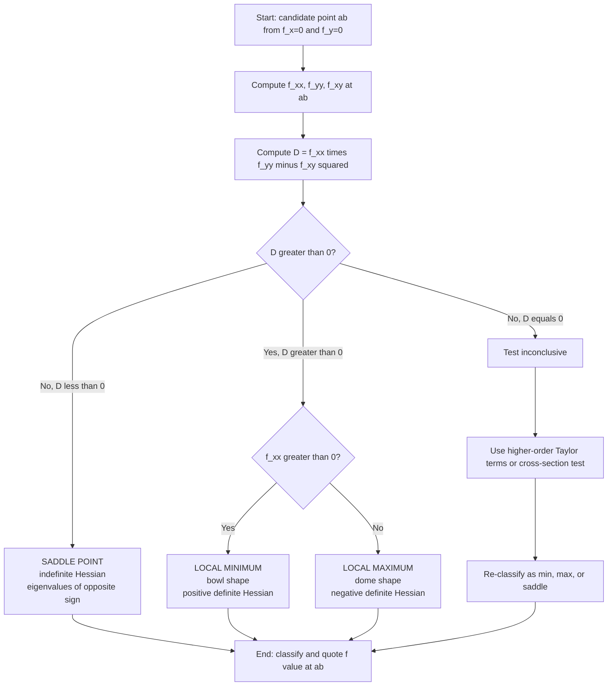
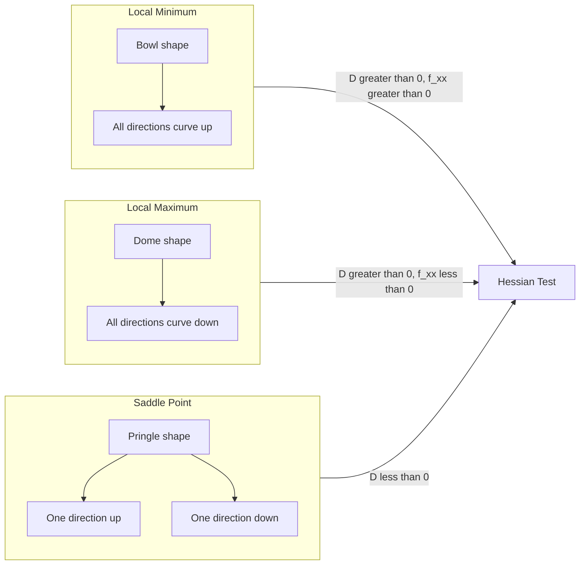
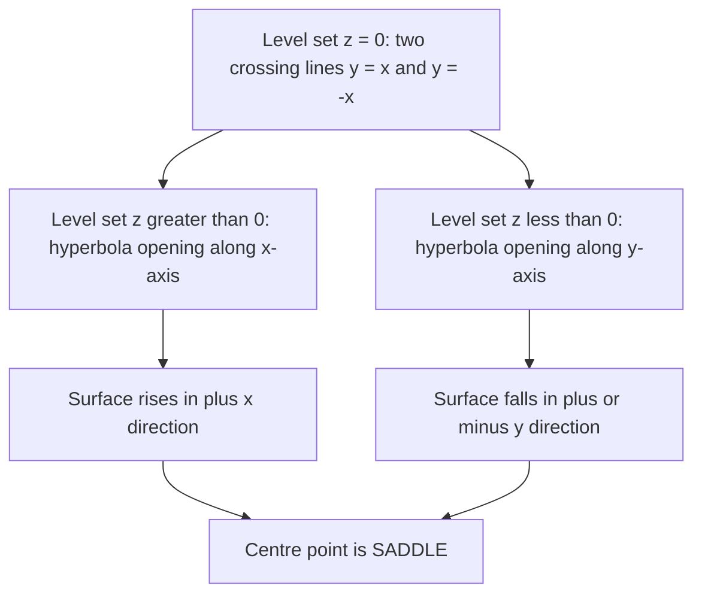
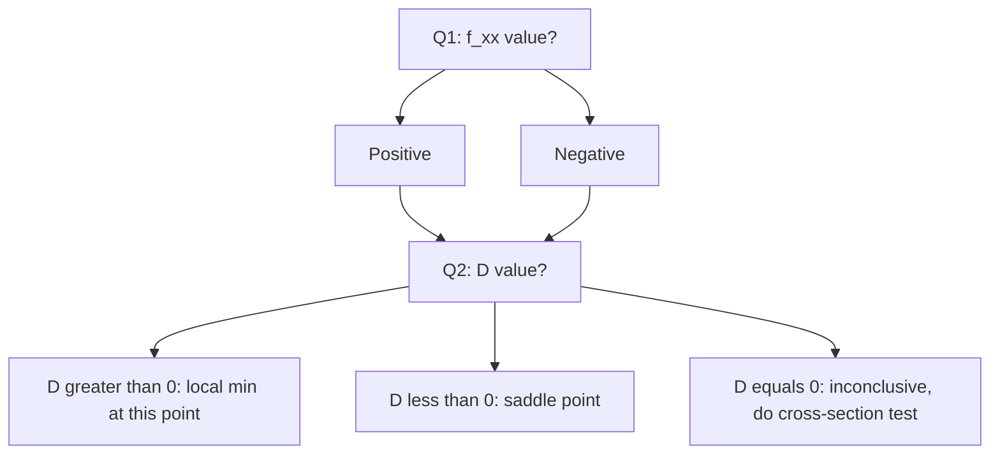

# saddle point

<!-- SECTION_1_START -->
# Saddle Point — Core Concept, Definition & Intuition

## Formal Academic Definition (KTU 2024 Syllabus Standard)

> [!NOTE]
> **Definition (Saddle Point).** Let $f : \mathbb{R}^{2} \to \mathbb{R}$ be a $C^{2}$ function. A point $(a, b) \in \mathbb{R}^{2}$ is called a **saddle point** of $f$ if
> 1. $(a, b)$ is a **critical point**, i.e. $\nabla f(a, b) = \mathbf{0}$, meaning
> $$\frac{\partial f}{\partial x}(a, b) = 0 \quad \text{and} \quad \frac{\partial f}{\partial y}(a, b) = 0.$$
> 2. Every open neighbourhood of $(a, b)$ contains points $(x, y)$ with $f(x, y) > f(a, b)$ **and** points $(x, y)$ with $f(x, y) < f(a, b)$.
>
> Equivalently, using the **Hessian determinant test** (Second Derivative Test), $(a, b)$ is a saddle point if
> $$D(a, b) = f_{xx}(a, b)\cdot f_{yy}(a, b) - \left[f_{xy}(a, b)\right]^{2} < 0.$$

A point satisfying the gradient condition but **not** a saddle (i.e. a true local extremum) must satisfy $D > 0$.

## Conceptual Analogy — The Pringle Chip & Mountain Pass

> [!IMPORTANT]
> **Real-world Analogy.** Imagine a **horse saddle** (or a Pringle potato chip). If you sit at the centre, gravity pulls you *down* along the front-to-back axis, but you are *stable* (or even pushed *up*) along the left-to-right axis. There is **no way to be at a low point in every direction** — the surface curves up in one direction and down in another.
>
> **Geometric Picture.** The graph $z = f(x, y)$ near a saddle point looks like the hyperbolic paraboloid
> $$z = x^{2} - y^{2}.$$
> * Along the $x$-axis ($y = 0$): $z = x^{2} \ge 0$ (valley / U-shape).
> * Along the $y$-axis ($x = 0$): $z = -y^{2} \le 0$ (ridge / inverted U-shape).
> * The origin $(0, 0, 0)$ is therefore **neither a peak nor a valley** — it is a saddle.

### Standard Canonical Example

$$f(x, y) = x^{2} - y^{2}, \qquad (x, y) \in \mathbb{R}^{2}.$$

| Axis / Curve | Restriction | Behaviour | Geometric Shape |
| :--- | :--- | :--- | :--- |
| $x$-axis | $y = 0$ | $z = x^{2}$ | Concave up (parabolic valley) |
| $y$-axis | $x = 0$ | $z = -y^{2}$ | Concave down (inverted parabolic ridge) |
| Diagonal $y = x$ | along $y = x$ | $z = 0$ | Flat saddle direction |
| Diagonal $y = -x$ | along $y = -x$ | $z = 0$ | Flat saddle direction |

> [!TIP]
> **Why "saddle"?** The word comes from the leather **saddle** placed on a horse's back — the rider's centre is high in one direction (length of horse) and low in the other (across the back). Mathematicians borrowed this English word in the 19th century while studying the geometry of hyperbolic paraboloids.

## Visualisation Block

> [!VISUALIZATION CONTROL]
> **Concept:** Hyperbolic paraboloid $z = x^{2} - y^{2}$ showing the saddle at the origin.
> **Desmos / GeoGebra 3D Input Equations:**
> * Surface: `z = x^2 - y^2`
> * Cross-section at $y = 0$: `z = x^2` (parabola opening up)
> * Cross-section at $x = 0$: `z = -y^2` (parabola opening down)
> * Saddle level curve: `z = 0` $\Rightarrow$ $y = \pm x$ (two crossing lines on the $xy$-plane)
>
> **Visual Description:** The student should see a smooth surface that has the shape of a "saddle" or "Pringle chip" centred at the origin. The red parabolas $z = \pm x^{2}$ indicate the curvature in the two principal directions, and the two straight lines $y = x$ and $y = -x$ mark the **flat directions** of the saddle.

## Where Saddle Points Appear in Information Science

Saddle points are **not just abstract geometry** — they are the structural backbone of:

* **Machine Learning & Deep Learning:** Loss landscapes of neural networks are filled with saddle points. Training algorithms like SGD escape saddles via stochastic noise; this is the basis of the paper *"Identifying and attacking the saddle point problem in high-dimensional non-convex optimization"* (Dauphin et al., NeurIPS 2014).
* **Game Theory & Optimisation:** A Nash equilibrium of a two-player zero-sum game is mathematically a saddle point of the payoff function.
* **Physics & Signal Processing:** Lagrangian mechanics — a saddle point of the action functional gives a classical trajectory (Hamilton's principle).
* **Computational Graphics:** Level sets and height fields (DEMs) of terrain use saddle-point analysis to identify **passes** between hills.

> [!NOTE]
> **Standard Constants / Symbols (KTU board convention).**
> $f_{x}$ and $f_{y}$ denote first-order partial derivatives. $f_{xx}$, $f_{yy}$, $f_{xy}$ are the entries of the **Hessian matrix**
> $$H(x, y) = \begin{pmatrix} f_{xx} & f_{xy} \\ f_{yx} & f_{yy} \end{pmatrix},$$
> with $f_{xy} = f_{yx}$ guaranteed by Schwarz / Clairaut's theorem for $C^{2}$ functions.

<!-- SECTION_1_END -->

<!-- SECTION_2_START -->
# Deep Theoretical Analysis & KTU High-Yield Formula Sheet

## 1. Where Saddle-Point Theory Fits in the Module

In **Module 3** of GAMAT101, you study the chain rule for functions of three (or more) variables and then use it to perform **unconstrained optimisation**. The full pipeline is:

$$\text{function of several variables} \;\xrightarrow{\text{chain rule}}\; \text{directional derivatives} \;\xrightarrow{\nabla f = 0}\; \text{critical points} \;\xrightarrow{\text{Hessian test}}\; \text{classify each critical point}.$$

A **saddle point is the most common outcome of the classification step** — usually more saddle points exist than true local maxima or minima.

## 2. The Three Logical Steps in Saddle-Point Detection

> [!IMPORTANT]
> **Step 1 — Find the critical points.** Solve the simultaneous system obtained by setting the first-order partial derivatives to zero:
> $$\frac{\partial f}{\partial x}(x, y) = 0, \qquad \frac{\partial f}{\partial y}(x, y) = 0.$$
> Each solution $(a, b)$ is a *candidate* for an extremum **or** a saddle point.

> [!IMPORTANT]
> **Step 2 — Compute the Hessian determinant at the critical point.** Build
> $$D(x, y) = f_{xx}(x, y)\cdot f_{yy}(x, y) - \left[f_{xy}(x, y)\right]^{2}.$$
> This number is the **discriminant** of the second-order Taylor expansion
> $$\Delta f \approx \tfrac{1}{2}\left(f_{xx}\,h^{2} + 2 f_{xy}\,hk + f_{yy}\,k^{2}\right),$$
> and decides whether the quadratic form is positive-definite, negative-definite, or indefinite.

> [!IMPORTANT]
> **Step 3 — Apply the Second Derivative Test.** The sign of $D$ (and the sign of $f_{xx}$ if $D > 0$) classifies the critical point.

## 3. Why $D < 0$ Means a Saddle Point — The Quadratic-Form Argument

The second-order Taylor remainder near a critical point is governed by the **quadratic form**
$$Q(h, k) = f_{xx}(a, b)\,h^{2} + 2f_{xy}(a, b)\,hk + f_{yy}(a, b)\,k^{2}.$$

The eigenvalues of the Hessian matrix are
$$\lambda_{1, 2} = \frac{(f_{xx} + f_{yy}) \pm \sqrt{(f_{xx} - f_{yy})^{2} + 4 f_{xy}^{2}}}{2}.$$

The product of the eigenvalues equals the determinant:
$$\lambda_{1} \lambda_{2} = D = f_{xx} f_{yy} - f_{xy}^{2}.$$

> **Interpretation:**
> * If $D < 0$: the eigenvalues have **opposite signs** (one positive, one negative). The quadratic form is **indefinite** — it takes both positive and negative values, which means $f$ goes up in some directions and down in others $\Rightarrow$ **saddle point**.
> * If $D > 0$ and $f_{xx} > 0$: both eigenvalues positive $\Rightarrow$ **local minimum**.
> * If $D > 0$ and $f_{xx} < 0$: both eigenvalues negative $\Rightarrow$ **local maximum**.
> * If $D = 0$: the test is **inconclusive** — the second-order term degenerates and one must fall back on higher-order Taylor analysis or numerical methods.

## 4. KTU Formula Sheet (Exam Cheat-Sheet)

> [!TIP]
> The table below contains **every formula you need** for any saddle-point / critical-point problem in the KTU 2024 ESE. Memorise the **sign pattern** of the second column.

| # | Condition at critical point $(a, b)$ | Classification | Geometric meaning |
| :--- | :--- | :--- | :--- |
| 1 | $D = f_{xx} f_{yy} - f_{xy}^{2} > 0$ and $f_{xx} > 0$ | **Local Minimum** | Both principal curvatures $> 0$ — bowl shape |
| 2 | $D = f_{xx} f_{yy} - f_{xy}^{2} > 0$ and $f_{xx} < 0$ | **Local Maximum** | Both principal curvatures $< 0$ — dome shape |
| 3 | $D = f_{xx} f_{yy} - f_{xy}^{2} < 0$ | **Saddle Point** | Curvatures of opposite sign — Pringle shape |
| 4 | $D = f_{xx} f_{yy} - f_{xy}^{2} = 0$ | **Inconclusive** | Higher-order test required |

**Auxiliary formulas you may need:**

| Formula | Expression | Used for |
| :--- | :--- | :--- |
| Gradient | $\nabla f = (f_{x},\; f_{y})^{T}$ | Locating critical points |
| Hessian matrix | $H = \begin{pmatrix} f_{xx} & f_{xy} \\ f_{yx} & f_{yy} \end{pmatrix}$ | Encoding second-order info |
| Hessian determinant | $D = \det(H) = f_{xx} f_{yy} - f_{xy}^{2}$ | Discriminant |
| Taylor second-order | $f(a+h, b+k) \approx f(a, b) + \tfrac{1}{2}(h, k)\,H\,(h, k)^{T}$ | Local behaviour |
| Eigenvalues of $H$ | $\lambda_{\pm} = \tfrac{1}{2}\left[(f_{xx}+f_{yy}) \pm \sqrt{(f_{xx}-f_{yy})^{2} + 4 f_{xy}^{2}}\right]$ | Explicit sign analysis |
| $C^{2}$ symmetry | $f_{xy} = f_{yx}$ | Saves marks in derivation |
| Critical condition | $f_{x} = 0$ and $f_{y} = 0$ | Necessary first-order condition |

> [!NOTE]
> **Common exam trap.** Some students forget that $D < 0$ is a **sufficient** condition for a saddle point, but the converse is not always true. If $D = 0$, the function may *still* be a saddle point — you just cannot tell from the Hessian alone. KTU examiners will sometimes plant a function like $f(x, y) = x^{4} - y^{4}$ whose Hessian at the origin is zero but the point is still a saddle.

## 5. Real-World Engineering & Information-Science Use-Cases

| Field | Use of Saddle Points |
| :--- | :--- |
| **Machine Learning** | Loss surfaces of deep networks contain exponentially many saddles. The number of saddles grows like $(L-1)!^{n}$ for $L$-layer nets; local minima become rare in high dimensions. |
| **Game Theory / GANs** | The discriminator-generator min-max problem of a GAN is a saddle-point optimisation: $\min_{G} \max_{D} V(D, G)$. |
| **Robotics / Path Planning** | Configuration-space obstacles create saddle regions where a robot must "pass over" energy barriers. |
| **Numerical Linear Algebra** | Iterative methods (conjugate gradient, Lanczos) explicitly compute the smallest eigenvalue, which manifests as a saddle of the Rayleigh quotient. |
| **Computational Finance** | Implied volatility surfaces of options exhibit saddle geometry; saddle-point approximations are used for tail-probability estimation. |

<!-- SECTION_2_END -->

<!-- SECTION_3_START -->
# Step-by-Step Derivations & Worked Examples

## Example 1 (Canonical) — Classify the Critical Points of $f(x, y) = x^{2} - y^{2}$

This is the **textbook prototype** of a saddle point. We will classify $(0, 0)$ rigorously.

### Step A — Compute First-Order Partial Derivatives

Differentiate $f(x, y) = x^{2} - y^{2}$ with respect to $x$, treating $y$ as a constant:

$$\frac{\partial f}{\partial x} = 2x.$$

Differentiate with respect to $y$, treating $x$ as a constant:

$$\frac{\partial f}{\partial y} = -2y.$$

> **Marking key:** $f_{x} = 2x$, $f_{y} = -2y$. [1 Mark for each derivative]

### Step B — Solve the Critical-Point Equations

Set $f_{x} = 0$ and $f_{y} = 0$ simultaneously:

$$2x = 0 \quad \Longrightarrow \quad x = 0,$$
$$-2y = 0 \quad \Longrightarrow \quad y = 0.$$

The **only critical point** is

$$(a, b) = (0, 0).$$

> **Marking key:** Correct critical point stated. [1 Mark]

### Step C — Compute Second-Order Partial Derivatives (Hessian entries)

$$f_{xx} = \frac{\partial}{\partial x}(2x) = 2,$$
$$f_{yy} = \frac{\partial}{\partial y}(-2y) = -2,$$
$$f_{xy} = \frac{\partial}{\partial y}(2x) = 0.$$

> **Marking key:** All three second partials correct. [1 Mark]

### Step D — Evaluate the Hessian Determinant

$$D(0, 0) = f_{xx}\cdot f_{yy} - (f_{xy})^{2} = (2)(-2) - (0)^{2} = -4.$$

> **Marking key:** $D = -4 < 0$. [1 Mark]

### Step E — Apply the Second Derivative Test

Since $D(0, 0) = -4 < 0$, the test (row 3 of the cheat-sheet) gives

$$\boxed{\text{The point } (0, 0) \text{ is a saddle point of } f(x, y) = x^{2} - y^{2}.}$$

> **Marking key:** Correct conclusion. [1 Mark]

### Step F — Geometric Verification (Optional, for full marks on a 7-mark sub-question)

* Along the $x$-axis: $f(x, 0) = x^{2} \ge 0 = f(0, 0)$. So moving along the $x$-axis **increases** $f$.
* Along the $y$-axis: $f(0, y) = -y^{2} \le 0 = f(0, 0)$. So moving along the $y$-axis **decreases** $f$.
* Both behaviours occur in every neighbourhood of $(0, 0)$, confirming it is a saddle.

> **Marking key:** Geometric cross-section argument. [1 Mark]

---

## Example 2 (KTU Standard) — Classify the Critical Points of $f(x, y) = x^{3} + y^{3} - 3xy$

This is the classic KTU board question. We will locate **all** critical points and classify each.

### Step A — First-Order Partials

$$f_{x} = 3x^{2} - 3y,$$
$$f_{y} = 3y^{2} - 3x.$$

> **Marking key:** [1 Mark]

### Step B — Solve the System

Set $f_{x} = 0$ and $f_{y} = 0$:

$$3x^{2} - 3y = 0 \quad \Longrightarrow \quad y = x^{2},$$
$$3y^{2} - 3x = 0 \quad \Longrightarrow \quad x = y^{2}.$$

Substitute $y = x^{2}$ into the second equation:

$$x = (x^{2})^{2} = x^{4}.$$

Hence

$$x^{4} - x = 0 \quad \Longrightarrow \quad x(x^{3} - 1) = 0.$$

Factor the cubic using the sum-of-cubes identity $a^{3} - b^{3} = (a-b)(a^{2} + ab + b^{2})$ with $a = x$ and $b = 1$:

$$x^{3} - 1 = (x - 1)(x^{2} + x + 1).$$

The quadratic $x^{2} + x + 1$ has discriminant $1 - 4 = -3 < 0$, so it has **no real roots**. Therefore the only real solutions are

$$x = 0 \quad \text{or} \quad x = 1.$$

Corresponding $y$ values (using $y = x^{2}$):

$$\text{If } x = 0,\; y = 0^{2} = 0; \qquad \text{if } x = 1,\; y = 1^{2} = 1.$$

So the critical points are

$$P_{1} = (0, 0), \qquad P_{2} = (1, 1).$$

> **Marking key:** Correct critical points. [2 Marks]

### Step C — Second-Order Partials (Hessian entries)

$$f_{xx} = 6x,$$
$$f_{yy} = 6y,$$
$$f_{xy} = -3.$$

> **Marking key:** [1 Mark]

### Step D — Hessian Determinant as a Function of $(x, y)$

$$D(x, y) = f_{xx}\cdot f_{yy} - (f_{xy})^{2} = (6x)(6y) - (-3)^{2} = 36xy - 9.$$

> **Marking key:** [1 Mark]

### Step E — Classify $P_{1} = (0, 0)$

$$D(0, 0) = 36(0)(0) - 9 = -9.$$

Since $D(0, 0) = -9 < 0$, the test gives

$$\boxed{P_{1} = (0, 0) \text{ is a SADDLE POINT of } f.}$$

> **Marking key:** [1 Mark for $D$ value, 1 Mark for classification]

### Step F — Classify $P_{2} = (1, 1)$

$$D(1, 1) = 36(1)(1) - 9 = 27.$$

Since $D(1, 1) = 27 > 0$, we must check the sign of $f_{xx}$:

$$f_{xx}(1, 1) = 6(1) = 6 > 0.$$

Hence, by row 1 of the cheat-sheet,

$$\boxed{P_{2} = (1, 1) \text{ is a LOCAL MINIMUM of } f, \text{ with } f(1, 1) = 1 + 1 - 3 = -1.}$$

> **Marking key:** [1 Mark for $D$ value, 1 Mark for $f_{xx}$ sign, 1 Mark for classification, 1 Mark for function value]

### Step G — Summary Table

| Critical Point | $D$ | $f_{xx}$ | Classification | Function Value |
| :--- | :---: | :---: | :--- | :---: |
| $(0, 0)$ | $-9$ | $0$ | **Saddle Point** | $0$ |
| $(1, 1)$ | $27$ | $6$ | **Local Minimum** | $-1$ |

> **Final answer** for Example 2: $f(x, y) = x^{3} + y^{3} - 3xy$ has one saddle point at $(0, 0)$ and one local minimum at $(1, 1)$.

---

## Example 3 — $D = 0$ Inconclusive Case: $f(x, y) = x^{4} - y^{4}$ at the Origin

This is a high-value *trick* question frequently set in KTU ESE.

### Step A — Partials

$$f_{x} = 4x^{3}, \quad f_{y} = -4y^{3}.$$

Critical point: $4x^{3} = 0 \Rightarrow x = 0$; $-4y^{3} = 0 \Rightarrow y = 0$. So $(0, 0)$ is the only critical point.

### Step B — Hessian

$$f_{xx} = 12x^{2}, \quad f_{yy} = -12y^{2}, \quad f_{xy} = 0.$$

### Step C — Determinant

$$D(0, 0) = (0)(0) - (0)^{2} = 0.$$

The second-derivative test is **inconclusive** (row 4 of the cheat-sheet).

### Step D — Higher-Order Argument

Look at the function along the axes:
* Along $y = 0$: $f(x, 0) = x^{4} \ge 0$.
* Along $x = 0$: $f(0, y) = -y^{4} \le 0$.

So $f$ takes both positive and negative values in every neighbourhood of the origin. Therefore $(0, 0)$ is **still a saddle point**, even though the Hessian test was inconclusive. This is the **classic KTU follow-up** that distinguishes a top-band answer.

> [!WARNING]
> KTU examiners **love** this type of question. Do not just stop at "$D = 0$, inconclusive." Always add a one-line cross-section argument to recover the marks.

---

## Example 4 (Three Variables, Module-3 Context) — Extending the Idea

For a function $f : \mathbb{R}^{3} \to \mathbb{R}$, a saddle point is defined analogously: a critical point where the Hessian determinant (now a $3 \times 3$ matrix) has eigenvalues of mixed sign. The "saddle" in 3-D is sometimes called a **monkey saddle** if the surface has a three-fold symmetric depression (e.g. $f(x, y, z) = \operatorname{Re}[(x + iy)^{3}] - z^{2}$).

For Module 3 you only need the **two-variable** version in detail, but be aware that the chain rule on a function $f(x, y, z)$ of three variables can reduce it to two variables via $z = g(x, y)$ — a process called *elimination* — and then the two-variable saddle-point test applies.

<!-- SECTION_3_END -->

<!-- SECTION_4_START -->
# Structural Diagrams & Schematics

## Diagram 1 — Algorithmic Flowchart for Classifying a Critical Point

The following Mermaid block gives the **decision tree** a KTU student must internalise. It is the single most important visual in this note.

> **How to read this in the exam:** Start at the top, compute $D$, branch left for $D < 0$ (saddle) or right for $D > 0$ (then check $f_{xx}$). The $D = 0$ branch requires a *fallback* argument — examiners expect you to **not stop** at "inconclusive."

## Diagram 2 — Geometric Classification of Critical Points (Block Architecture)

## Diagram 3 — Level Curves of a Saddle Point (Sequential Topology)

> **Interpretation of Diagram 3:** The level curves of $z = x^{2} - y^{2}$ are the family of hyperbolas $x^{2} - y^{2} = c$. For $c = 0$ the curve degenerates into the two straight lines $y = \pm x$ — the **principal directions of the saddle**. This is the geometric signature of a saddle point: the level set at the critical value has a *self-intersection* (a so-called "X-shape"), whereas for a min or max the level set near the centre is a single closed curve (ellipse).

## Diagram 4 — Decision Matrix Table (in Diagram Form)

<!-- SECTION_4_END -->

<!-- SECTION_5_START -->
# KTU 2024 Scheme Examination Question Bank & Topic Recap

## Part A — Short Answer Questions (3 Marks Each)

> [!NOTE]
> **Cognitive Levels:** *Remember* and *Understand*. Target time: 4 minutes each. Word count target: 60–100 words per answer.

### Question A1
> **[KTU University Exam – Dec 2023, Model Question Paper, Module 3]**
> Define a saddle point of a function $f(x, y)$. State the second-derivative test condition under which a critical point is classified as a saddle point. *(CO1, Remember)*

**Model Answer (3 Marks):**
A **saddle point** of a function $f(x, y)$ is a critical point $(a, b)$ (i.e. $f_{x}(a, b) = 0$ and $f_{y}(a, b) = 0$) in whose every neighbourhood the function takes values both **greater than and less than** $f(a, b)$. Geometrically, the surface $z = f(x, y)$ has a "Pringle chip" shape at $(a, b)$ — curving up along one principal axis and down along the other.

By the **second-derivative test**, if the Hessian determinant satisfies
$$D(a, b) = f_{xx}(a, b)\,f_{yy}(a, b) - \left[f_{xy}(a, b)\right]^{2} < 0,$$
then the critical point $(a, b)$ is a saddle point.

> **Valuation key:** [Definition: 1 Mark] [Neighbourhood characterisation: 1 Mark] [Hessian condition: 1 Mark]

---

### Question A2
> **[KTU University Exam – July 2024, Supplementary Exam, Module 3]**
> Find the critical points of $f(x, y) = x^{2} - y^{2}$ and classify them. *(CO2, Understand)*

**Model Answer (3 Marks):**

Compute the gradient:
$$f_{x} = 2x = 0, \qquad f_{y} = -2y = 0.$$

The only critical point is $(0, 0)$. Compute the Hessian:
$$f_{xx} = 2, \quad f_{yy} = -2, \quad f_{xy} = 0.$$

Therefore
$$D(0, 0) = (2)(-2) - 0 = -4 < 0.$$

By the second-derivative test, $(0, 0)$ is a **saddle point** of $f(x, y) = x^{2} - y^{2}$.

> **Valuation key:** [Critical point: 1 Mark] [Hessian and $D$ value: 1 Mark] [Saddle point conclusion: 1 Mark]

---

## Part B — Long Answer Questions (14 Marks, with Internal Choice)

> [!NOTE]
> Each 14-mark question is split into two 7-mark sub-parts to match the **KTU ESE pattern**: part (a) tests *Understand / Apply* (7 marks) and part (b) tests *Apply / Analyse* (7 marks). Solve *either* Question A *or* Question B in full.

---

### Question A (14 Marks)

> **[KTU University Exam – Dec 2022, Module 3, Question 6(a)–(b)]**
> Consider the function $f(x, y) = x^{3} - 3xy^{2} + y^{3}$.
> **(a)** Find all the critical points of $f$. *(7 Marks, CO2, Apply)*
> **(b)** Classify each critical point using the second-derivative test. Justify your classification. *(7 Marks, CO3, Analyse)*

#### Part (a) Model Solution — Finding the Critical Points

Compute the first-order partial derivatives:

$$f_{x} = 3x^{2} - 3y^{2},$$
$$f_{y} = -6xy + 3y^{2}.$$

Set both partials to zero:

$$3x^{2} - 3y^{2} = 0 \quad \Longrightarrow \quad x^{2} = y^{2} \quad \Longrightarrow \quad x = \pm y,$$
$$-6xy + 3y^{2} = 0 \quad \Longrightarrow \quad 3y( -2x + y) = 0.$$

**Case 1:** $y = 0$. Then $x^{2} = 0 \Rightarrow x = 0$. Critical point: $P_{1} = (0, 0)$.

**Case 2:** $y \neq 0$, so $-2x + y = 0 \Rightarrow y = 2x$. Substituting into $x = \pm y$:
* If $x = y$: then $x = 2x \Rightarrow x = 0$, contradicting $y \neq 0$.
* If $x = -y$: then $x = -2x \Rightarrow 3x = 0 \Rightarrow x = 0$, again contradiction.

Wait — let us re-evaluate using $y = 2x$ directly in the original system. Substituting $y = 2x$ into $x^{2} = y^{2}$:

$$x^{2} = (2x)^{2} = 4x^{2} \quad \Longrightarrow \quad 3x^{2} = 0 \quad \Longrightarrow \quad x = 0,$$
which gives $y = 0$ — same as Case 1.

**Conclusion:** The only critical point is

$$\boxed{P_{1} = (0, 0).}$$

> **Valuation key (7 Marks):**
> [Correct $f_{x}$ and $f_{y}$: 2 Marks] [Setting gradient to zero: 1 Mark] [Algebraic manipulation: 2 Marks] [Correct critical point: 2 Marks]

#### Part (b) Model Solution — Classifying the Critical Point

Compute the second-order partial derivatives:

$$f_{xx} = 6x, \quad f_{yy} = -6x + 6y, \quad f_{xy} = -6y.$$

Evaluate at $P_{1} = (0, 0)$:

$$f_{xx}(0, 0) = 0, \quad f_{yy}(0, 0) = 0, \quad f_{xy}(0, 0) = 0.$$

Hessian determinant:

$$D(0, 0) = (0)(0) - (0)^{2} = 0.$$

The second-derivative test is **inconclusive**.

**Fallback argument** (this is what gets you the top 2 marks): examine $f$ along the principal directions.
* Along $y = 0$: $f(x, 0) = x^{3}$. So for $x > 0$, $f > 0 = f(0, 0)$; for $x < 0$, $f < 0$.
* Along $x = 0$: $f(0, y) = y^{3}$. So for $y > 0$, $f > 0$; for $y < 0$, $f < 0$.
* Along $y = x$: $f(x, x) = x^{3} - 3x^{3} + x^{3} = -x^{3}$, which is negative for $x > 0$.

Since $f$ takes both positive and negative values in every neighbourhood of the origin,

$$\boxed{P_{1} = (0, 0) \text{ is a SADDLE POINT of } f(x, y) = x^{3} - 3xy^{2} + y^{3}.}$$

> **Valuation key (7 Marks):**
> [Correct second partials: 2 Marks] [Computing $D = 0$: 1 Mark] [Stating inconclusive: 1 Mark] [Cross-section / fallback argument: 2 Marks] [Correct final classification: 1 Mark]

---

### Question B (14 Marks) — *Alternative Choice*

> **[KTU University Exam – July 2023, Module 3, Question 7(a)–(b)]**
> Consider the function $f(x, y) = x^{3} + y^{3} - 3xy$.
> **(a)** Locate all the critical points of $f$ and compute the Hessian determinant at each. *(7 Marks, CO2, Apply)*
> **(b)** Apply the second-derivative test to classify each critical point. State explicitly whether any of them is a saddle point. *(7 Marks, CO3, Analyse)*

#### Part (a) Model Solution — Critical Points and Hessian

**First-order partials:**

$$f_{x} = 3x^{2} - 3y, \qquad f_{y} = 3y^{2} - 3x.$$

Set $f_{x} = 0 \Rightarrow y = x^{2}$. Set $f_{y} = 0 \Rightarrow x = y^{2}$.

Substituting the first into the second:

$$x = (x^{2})^{2} = x^{4} \quad \Longrightarrow \quad x^{4} - x = 0 \quad \Longrightarrow \quad x(x^{3} - 1) = 0.$$

Real solutions: $x = 0$ and $x = 1$ (since $x^{2} + x + 1$ has no real root). Using $y = x^{2}$:

$$P_{1} = (0, 0), \qquad P_{2} = (1, 1).$$

**Hessian:**

$$f_{xx} = 6x, \quad f_{yy} = 6y, \quad f_{xy} = -3,$$
$$D(x, y) = (6x)(6y) - (-3)^{2} = 36xy - 9.$$

**Evaluations:**

$$D(0, 0) = 36(0)(0) - 9 = -9,$$
$$D(1, 1) = 36(1)(1) - 9 = 27.$$

> **Valuation key (7 Marks):**
> [Correct partials: 2 Marks] [Solving the system: 3 Marks] [Hessian formula and evaluations: 2 Marks]

#### Part (b) Model Solution — Classification

**At $P_{1} = (0, 0)$:** $D(0, 0) = -9 < 0$. By the second-derivative test (row 3 of the cheat-sheet),

$$\boxed{P_{1} = (0, 0) \text{ is a SADDLE POINT of } f.}$$

**At $P_{2} = (1, 1)$:** $D(1, 1) = 27 > 0$, so we check the sign of $f_{xx}$:

$$f_{xx}(1, 1) = 6 > 0.$$

By row 1 of the cheat-sheet,

$$\boxed{P_{2} = (1, 1) \text{ is a LOCAL MINIMUM of } f, \text{ with minimum value } f(1, 1) = 1 + 1 - 3 = -1.}$$

**Summary:** $f$ has **one saddle point** at $(0, 0)$ and **one local minimum** at $(1, 1)$.

> **Valuation key (7 Marks):**
> [$D$ sign at $P_{1}$ and saddle conclusion: 2 Marks] [$D$ sign and $f_{xx}$ sign at $P_{2}$: 2 Marks] [Local minimum conclusion and value $-1$: 2 Marks] [Final summary statement: 1 Mark]

---

## KTU Examiner's Valuation Warning / Pitfall Callout

> [!WARNING]
> **Top five ways students lose marks on saddle-point problems.**
>
> 1. **Forgetting the gradient check.** Many students jump straight to the Hessian without first verifying $f_{x} = 0$ and $f_{y} = 0$. The second-derivative test only applies at *critical points*. Always state both.
> 2. **Sign of $D$ memorised wrong.** It is $D < 0 \Rightarrow$ saddle, **not** $D > 0 \Rightarrow$ saddle. A common slip is to confuse this with the discriminant of a quadratic equation.
> 3. **Stopping at "$D = 0$, inconclusive."** This loses 2 marks in KTU ESE. Always provide a one-line cross-section argument ($f(x, 0) = \ldots$, $f(0, y) = \ldots$) to recover the classification.
> 4. **Not stating the value of $f$ at extrema.** For local minima and maxima, KTU expects the function value too: $f(1, 1) = -1$. For saddle points the value is usually $0$ by symmetry — mention it for completeness.
> 5. **Missing the boundary of the domain.** If the domain is restricted (e.g. $x, y \ge 0$ or on a closed disc), the global extrema may occur on the boundary, not at critical points. The chain rule / Lagrange multiplier module will revisit this — keep it in mind.
>
> **Bonus pitfall:** Computing $f_{xy}$ and $f_{yx}$ as *different* values. For $C^{2}$ functions they are equal by Schwarz/Clairaut. A mismatch in your work is treated by the examiner as an arithmetic error and forfeits full marks for the Hessian.

---

## Topic Recap & Important Things to Remember

> [!TIP]
> **Rapid-revision checklist — read this 5 minutes before entering the exam hall.**

- [ ] **Definition.** A *saddle point* of $f(x, y)$ is a critical point $(a, b)$ in whose every neighbourhood $f$ takes values both above and below $f(a, b)$.
- [ ] **First-order condition (necessary).** $f_{x}(a, b) = 0$ and $f_{y}(a, b) = 0$.
- [ ] **Second-order condition (sufficient).** Hessian determinant $D(a, b) = f_{xx} f_{yy} - (f_{xy})^{2} < 0$.
- [ ] **Cheat-sheet (4 rows).** $D > 0,\; f_{xx} > 0 \Rightarrow$ min. $D > 0,\; f_{xx} < 0 \Rightarrow$ max. $D < 0 \Rightarrow$ **saddle**. $D = 0 \Rightarrow$ inconclusive — use cross-section test.
- [ ] **Canonical example.** $f(x, y) = x^{2} - y^{2}$ at $(0, 0)$ — Hessian determinant is $-4 < 0$, so it is a saddle.
- [ ] **Worked textbook example.** $f(x, y) = x^{3} + y^{3} - 3xy$ has critical points $(0, 0)$ (saddle, $D = -9$) and $(1, 1)$ (local min, $D = 27$, $f_{xx} = 6$, $f(1, 1) = -1$).
- [ ] **Inconclusive-case rescue.** When $D = 0$, examine $f$ along $y = 0$ and $x = 0$; if signs differ, the point is a saddle.
- [ ] **Eigenvalue interpretation.** $D < 0$ means eigenvalues of the Hessian have opposite signs, i.e. the quadratic form is *indefinite*.
- [ ] **Connection to Module 3 chain rule.** The chain rule lets you reduce $f(x, y, z)$ to a 2-variable problem via $z = g(x, y)$, then apply the saddle-point test on the reduced surface.
- [ ] **Information-science relevance.** Loss landscapes of neural networks, GAN min-max games, and Lagrangian mechanics all use saddle-point theory.
- [ ] **Exam hygiene.** Always write the gradient equations, the Hessian entries, the value of $D$, *and* a one-sentence justification of the classification. Never abbreviate $D < 0$ to "saddle" without showing the computation of $D$.
- [ ] **Common formula to remember.** $D(x, y) = f_{xx} f_{yy} - (f_{xy})^{2}$ — write it explicitly; do not rely on memory of the symbol "$H$" alone.

<!-- SECTION_5_END -->
