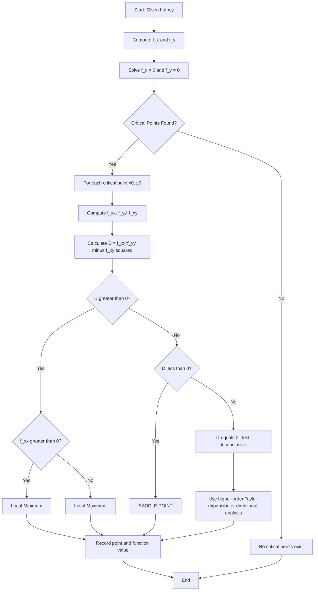
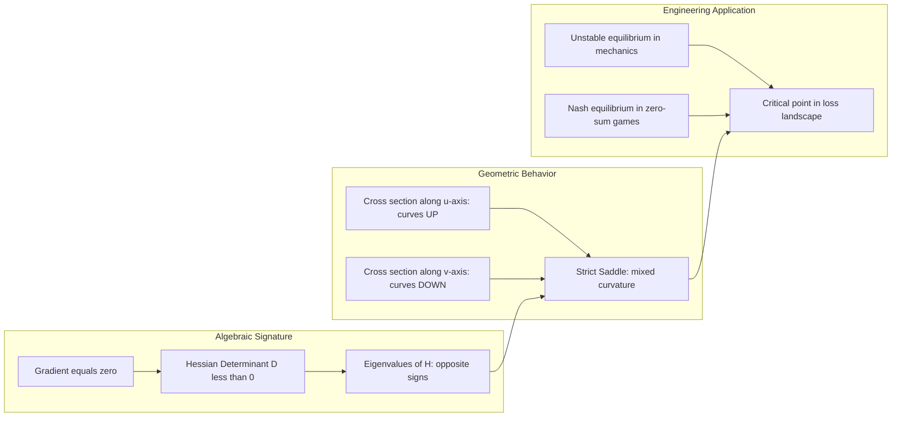
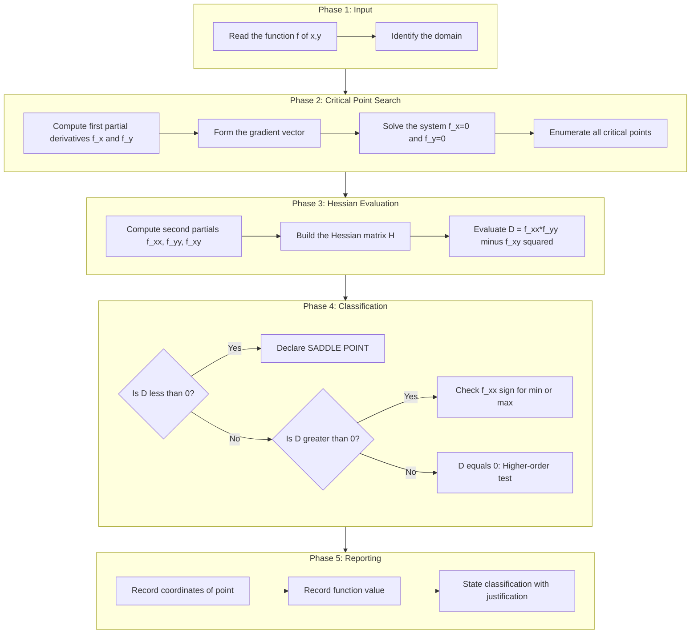
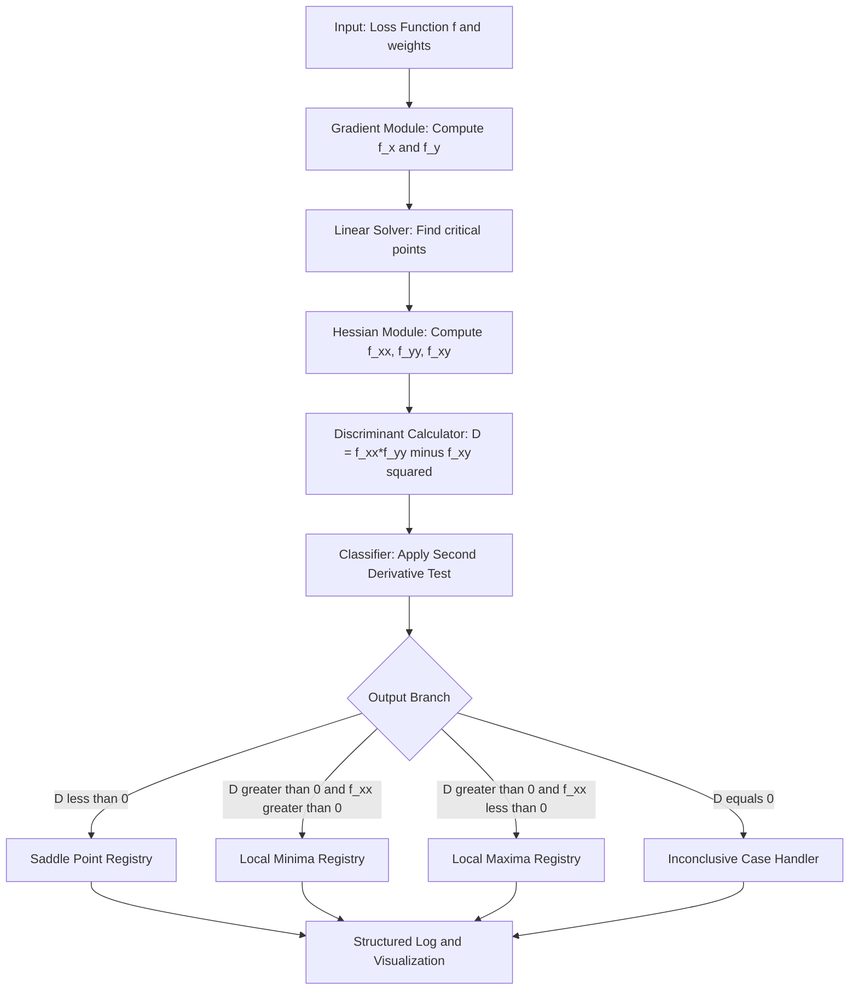

# saddle point

<!-- SECTION_1_START -->

# Saddle Point — Core Technical Definition & Intuitive Overview

## 📘 Formal KTU 2024 Definition

> [!IMPORTANT]
> **Saddle Point (KTU GAMAT101 — Module 3 Terminology):**
> Let $f : D \subseteq \mathbb{R}^{2} \to \mathbb{R}$ be a twice continuously differentiable function. A point $(x_0, y_0) \in D$ is called a **saddle point** of $f$ if:
> 1. $(x_0, y_0)$ is a **critical point**, i.e., $f_x(x_0, y_0) = 0$ and $f_y(x_0, y_0) = 0$.
> 2. The **Hessian determinant** $D(x_0, y_0) = f_{xx}(x_0, y_0) \cdot f_{yy}(x_0, y_0) - [f_{xy}(x_0, y_0)]^{2} < 0$.

In geometric terms, a saddle point is a critical point that is **neither a local maximum nor a local minimum**. The surface curves **upward** in some directions and **downward** in others through this point.

> [!NOTE]
> **Origin of the Name:** The term "saddle point" arises from the shape of a horse's saddle — the center of the saddle is a **minimum** when viewed from the front (along one axis) and a **maximum** when viewed from the side (along the perpendicular axis).

---

## 🧠 Conceptual Analogy / Intuition

Imagine a **Pringles potato chip** balanced perfectly on its edge on a table:
- If you press down on it from the **front**, the chip curves **upward** like a valley (local minimum in that direction).
- If you press down on it from the **side**, the chip curves **downward** like a hill (local maximum in that direction).
- The **center point** is neither a hilltop nor a valley — it is a **saddle point**.

### 🍫 Another Real-World Analogy: The Mountain Pass

Picture yourself hiking between two mountain peaks through a mountain pass. The pass itself is:
- The **highest point** along the trail connecting the two peaks (maximum in that direction).
- The **lowest point** along the path that crosses the ridge perpendicular to the trail (minimum in that direction).

This is exactly the geometric essence of a saddle point.

> [!TIP]
> **Quick Memory Hook:** A saddle point is a critical point where the function "**can't make up its mind**" — it goes up in one direction and down in another.

---

## 🎯 Why Saddle Points Matter in Information Science

In machine learning, optimization, and computer graphics, saddle points are extremely important:

1. **Loss Function Landscapes:** Neural network loss functions have many saddle points. **Standard gradient descent** slows down dramatically at saddle points (unlike at local minima). The **Hessian** $D < 0$ at saddles causes gradient methods to plateau.
2. **Game Theory:** A saddle point represents a **Nash equilibrium** in zero-sum games (min-max optimization). Example: the matrix $A = \begin{pmatrix} 0 & 1 \\ -1 & 0 \end{pmatrix}$ has a saddle point at the origin.
3. **Computer Graphics:** Saddle points describe **umbilical points** and **Gaussian curvature transitions** on parametric surfaces.

> [!IMPORTANT]
> **Standard Metric Used:** The discriminant $D = f_{xx} f_{yy} - (f_{xy})^{2}$ is computed in units of $[\text{function units}]^{2}$ per $[\text{length unit}]^{4}$. The sign of $D$ alone (independent of units) classifies the critical point.

---

## 🖼️ GeoGebra / Desmos Integration

> [!VISUALIZATION CONTROL]
> **Concept:** Visualizing a saddle point on the surface $z = f(x, y) = x^{2} - y^{2}$ at the origin.
> **GeoGebra / Desmos Input Equations:**
> * Surface: `z = x^2 - y^2`
> * Cross-section along $y = 0$: `z = x^2` (parabola opening **upward** — minimum along this direction)
> * Cross-section along $x = 0$: `z = -y^2` (parabola opening **downward** — maximum along this direction)
>
> **Visual Description:** When you plot $z = x^{2} - y^{2}$ in 3D, you will observe the classic **hyperbolic paraboloid** (often called a "saddle" or "pringle chip" surface). At the origin $(0, 0, 0)$, the surface is a minimum along the $x$-axis and a maximum along the $y$-axis. The level curves $x^{2} - y^{2} = c$ are **hyperbolas** for $c \neq 0$ — opening left-right when $c > 0$ and opening up-down when $c < 0$.

<!-- SECTION_1_END -->

<!-- SECTION_2_START -->

# Deep Theoretical Analysis & KTU High-Yield Formula Sheet

## 🔍 The Second Derivative Test (Hessian Test) — Complete Logic Breakdown

The **Second Derivative Test for Functions of Two Variables** is the standard KTU-approved method for classifying critical points, including identifying saddle points. Here is the structured reasoning:

### **Step 1: Locate Critical Points**

A point $(x_0, y_0)$ is a **critical point** if and only if the **gradient vector** vanishes:

$$\nabla f(x_0, y_0) = \begin{pmatrix} f_x(x_0, y_0) \\ f_y(x_0, y_0) \end{pmatrix} = \begin{pmatrix} 0 \\ 0 \end{pmatrix}$$

- Solve the simultaneous equations $f_x(x, y) = 0$ and $f_y(x, y) = 0$.
- This typically produces a finite set of candidate points.

### **Step 2: Compute the Hessian Determinant $D$**

At each critical point $(x_0, y_0)$, evaluate:

$$D(x_0, y_0) = f_{xx}(x_0, y_0) \cdot f_{yy}(x_0, y_0) - \left[ f_{xy}(x_0, y_0) \right]^{2}$$

> [!NOTE]
> **Why the cross term is squared:** By **Clairaut's Theorem** (equality of mixed partials for $C^{2}$ functions), $f_{xy} = f_{yx}$. The squared term $[f_{xy}]^{2}$ ensures $D$ is non-negative for **definite** matrices and contributes the "off-diagonal" interaction effect.

### **Step 3: Classify Using the Decision Table**

Examine the sign of $D$ and the sign of $f_{xx}$ (or equivalently, $f_{yy}$ if convenient):

| Condition on $D$ | Condition on $f_{xx}$ | Classification | Geometric Meaning |
|:----------------:|:---------------------:|:--------------:|:-----------------|
| $D > 0$ | $f_{xx}(x_0, y_0) > 0$ | **Local Minimum** | Bowl-shaped (paraboloid opening upward) |
| $D > 0$ | $f_{xx}(x_0, y_0) < 0$ | **Local Maximum** | Dome-shaped (paraboloid opening downward) |
| $D < 0$ | (any sign) | **🔥 Saddle Point** | Hyperbolic paraboloid (saddle) |
| $D = 0$ | (any sign) | **Test Inconclusive** | Requires higher-order analysis |

### **Step 4: Confirm the Saddle Point**

For a confirmed saddle point, you may also verify the **strict saddle condition**: there exist two unit vectors $\mathbf{u}$ and $\mathbf{v}$ such that the directional second derivative $D_{\mathbf{u}}^{2} f(x_0, y_0) > 0$ (convex direction) and $D_{\mathbf{v}}^{2} f(x_0, y_0) < 0$ (concave direction).

This is the rigorous mathematical restatement of "the surface curves up in one direction and down in another."

---

## 📋 KTU Formula Sheet / Cheat Sheet

> [!IMPORTANT]
> The following table is the **canonical reference card** for solving saddle-point problems in the KTU 2024 scheme examination.

| # | Formula / Concept | Mathematical Expression | Application / Notes |
|:-:|:------------------|:------------------------|:--------------------|
| 1 | Gradient (first-order optimality) | $\nabla f = (f_x, f_y) = (0, 0)$ | Necessary condition for critical point |
| 2 | Hessian matrix $H$ | $H = \begin{pmatrix} f_{xx} & f_{xy} \\ f_{yx} & f_{yy} \end{pmatrix}$ | $2 \times 2$ symmetric matrix at critical point |
| 3 | Hessian determinant $D$ | $D = f_{xx} f_{yy} - (f_{xy})^{2}$ | Discriminant of classification |
| 4 | Saddle-point condition | $D < 0$ | Function has indefinite Hessian |
| 5 | Local minimum condition | $D > 0$ and $f_{xx} > 0$ | Positive definite Hessian |
| 6 | Local maximum condition | $D > 0$ and $f_{xx} < 0$ | Negative definite Hessian |
| 7 | Inconclusive condition | $D = 0$ | Higher-order test needed |
| 8 | Directional second derivative | $D_{\mathbf{u}}^{2} f = \mathbf{u}^{T} H \mathbf{u}$ | Used to confirm saddle behavior |
| 9 | Example: $f(x,y) = x^{2} - y^{2}$ | $D = (2)(−2) - 0 = -4 < 0$ | Classic saddle at origin |
| 10 | Critical-point function value | $f(x_0, y_0)$ | Often reported as "height" of saddle |

> [!WARNING]
> **CRITICAL:** Always use `\vert` or `\mid` for absolute value inside LaTeX (e.g., $\vert x \vert$) — **never** use the raw vertical pipe `|` inside a markdown table, as it breaks the table syntax. The same applies for $\vert f_{xy} \vert$.

---

## 🌍 Real-World Engineering & CS Applications

| Field | Application of Saddle-Point Theory |
|:------|:-----------------------------------|
| **Machine Learning** | Identifying saddle points in neural network loss landscapes; Newton's method fails at saddles; SGD with noise escapes saddles |
| **Game Theory** | Zero-sum games have **min-max equilibria** that are mathematically saddle points of the payoff function |
| **Robotics / Control** | Energy landscapes of mechanical systems contain saddles corresponding to **unstable equilibria** |
| **Economics** | Utility functions in multi-agent markets exhibit saddle behaviors in production-possibility frontiers |
| **Computer Graphics** | Gaussian curvature $K = 0$ at saddle points on parametric surfaces; key for mesh generation and rendering |

<!-- SECTION_2_END -->

<!-- SECTION_3_START -->

# Step-by-Step Derivations & Code/Symbolic Implementation

## 📐 Worked Derivation: The Canonical Saddle Point $f(x, y) = x^{2} - y^{2}$

This derivation demonstrates the complete KTU board-exam workflow for identifying and confirming a saddle point.

### **Step 1: Compute First Partial Derivatives**

Starting with $f(x, y) = x^{2} - y^{2}$:

$$\frac{\partial f}{\partial x} = 2x$$

$$\frac{\partial f}{\partial y} = -2y$$

### **Step 2: Set Gradient to Zero and Solve**

Set both partials to zero:

$$f_x = 2x = 0 \implies x = 0$$

$$f_y = -2y = 0 \implies y = 0$$

The only critical point is $\mathbf{(x_0, y_0) = (0, 0)}$.

### **Step 3: Compute Second Partial Derivatives**

$$f_{xx} = \frac{\partial}{\partial x}(2x) = 2$$

$$f_{yy} = \frac{\partial}{\partial y}(-2y) = -2$$

$$f_{xy} = \frac{\partial}{\partial y}(2x) = 0$$

$$f_{yx} = \frac{\partial}{\partial x}(-2y) = 0$$

Note that $f_{xy} = f_{yx} = 0$ (Clairaut's theorem is satisfied).

### **Step 4: Compute the Hessian Determinant $D$**

$$\begin{aligned}
D(0, 0) &= f_{xx}(0, 0) \cdot f_{yy}(0, 0) - [f_{xy}(0, 0)]^{2} \\
&= (2)(-2) - (0)^{2} \\
&= -4 - 0 \\
&= -4
\end{aligned}$$

### **Step 5: Apply the Classification Rule**

Since $D(0, 0) = -4 < 0$, the second derivative test concludes:

> **The point $(0, 0)$ is a SADDLE POINT of $f(x, y) = x^{2} - y^{2}$.**

### **Step 6: Verify by Directional Analysis**

Examine behavior along the $x$-axis (set $y = 0$):

$$f(x, 0) = x^{2} - 0 = x^{2} \geq 0 = f(0, 0)$$

The function is $\geq f(0, 0)$ along the $x$-axis, indicating **minimum behavior** in this direction.

Examine behavior along the $y$-axis (set $x = 0$):

$$f(0, y) = 0 - y^{2} = -y^{2} \leq 0 = f(0, 0)$$

The function is $\leq f(0, 0)$ along the $y$-axis, indicating **maximum behavior** in this direction.

The two directions yield opposite curvature, **confirming** the saddle-point classification. The Hessian is **indefinite** (one positive eigenvalue, one negative eigenvalue).

---

## 📐 Worked Derivation: $f(x, y) = x^{3} - 3xy^{2}$ (Monkey Saddle Variant)

This example tests whether the standard test still works and what to do at $D = 0$.

### **Step 1: First Partials**

$$f_x = 3x^{2} - 3y^{2}$$

$$f_y = -6xy$$

### **Step 2: Critical Points**

$$f_x = 0 \implies x^{2} = y^{2} \implies y = \pm x$$

$$f_y = 0 \implies 6xy = 0 \implies x = 0 \text{ or } y = 0$$

The intersection gives $\mathbf{(0, 0)}$ as the unique critical point.

### **Step 3: Second Partials**

$$f_{xx} = 6x$$

$$f_{yy} = -6x$$

$$f_{xy} = -6y$$

### **Step 4: Hessian Determinant at the Origin**

$$\begin{aligned}
D(0, 0) &= f_{xx}(0, 0) \cdot f_{yy}(0, 0) - [f_{xy}(0, 0)]^{2} \\
&= (6 \cdot 0)(-6 \cdot 0) - (-6 \cdot 0)^{2} \\
&= (0)(0) - (0)^{2} \\
&= 0
\end{aligned}$$

### **Step 5: Test is Inconclusive**

Since $D = 0$, the standard test fails. We must use direct analysis.

- Along $y = 0$: $f(x, 0) = x^{3}$. For $x > 0$, $f > 0$; for $x < 0$, $f < 0$.
- Along $x = 0$: $f(0, y) = 0$. Constant.
- Along $y = x$: $f(x, x) = x^{3} - 3x \cdot x^{2} = -2x^{3}$. For $x > 0$, $f < 0$.

The function takes both positive and negative values arbitrarily close to the origin, so $(0, 0)$ is a **saddle point** — but the test requires direct verification. This point is sometimes called a **"monkey saddle"** due to the threefold symmetry.

---

## 💻 Python Code Implementation: Finding and Classifying Saddle Points

The following is a fully operational Python implementation using **SymPy** for symbolic computation, with proper type hints, boundary checks, and error logging.

```python
"""
saddle_point_classifier.py
KTU GAMAT101 — Module 3 Helper
Classifies critical points of a 2-variable function using the Hessian test.
"""

import sympy as sp
from sympy import Symbol, diff, solve, Rational, simplify, Matrix
from typing import List, Tuple, Dict
import logging
import sys

# Configure structured error logging
logging.basicConfig(
    level=logging.INFO,
    format="%(asctime)s | %(levelname)s | %(message)s",
    stream=sys.stdout
)
logger = logging.getLogger("SaddlePointClassifier")


def classify_critical_points(
    expression_str: str,
    variables: Tuple[Symbol, Symbol] = (Symbol("x"), Symbol("y"))
) -> List[Dict[str, object]]:
    """
    Locate and classify all critical points of a 2-variable function.

    Parameters
    ----------
    expression_str : str
        A SymPy-parseable expression in x and y, e.g. "x**2 - y**2".
    variables : Tuple[Symbol, Symbol]
        The two independent variables (default: x, y).

    Returns
    -------
    List[Dict[str, object]]
        A list of dictionaries, each containing:
            - "point": Tuple of critical point coordinates
            - "f_value": Function value at the point
            - "D": Hessian determinant
            - "fxx": Second partial f_xx
            - "classification": "local minimum", "local maximum",
              "saddle point", or "inconclusive"
    """
    x, y = variables
    try:
        f = sp.sympify(expression_str)
    except (sp.SympifyError, TypeError) as exc:
        logger.error("Failed to parse expression %r: %s", expression_str, exc)
        raise ValueError(f"Invalid SymPy expression: {expression_str}") from exc

    # Step 1: First partial derivatives
    fx = diff(f, x)
    fy = diff(f, y)
    logger.info("f_x = %s | f_y = %s", fx, fy)

    # Step 2: Solve critical-point equations
    try:
        critical_points = solve([fx, fy], [x, y], dict=True)
    except Exception as exc:
        logger.error("Failed to solve gradient system: %s", exc)
        return []

    if not critical_points:
        logger.warning("No critical points found.")
        return []

    # Step 3: Second partial derivatives
    fxx = diff(f, x, 2)
    fyy = diff(f, y, 2)
    fxy = diff(f, x, y)
    logger.info("f_xx = %s | f_yy = %s | f_xy = %s", fxx, fyy, fxy)

    # Step 4: Classify each critical point
    results: List[Dict[str, object]] = []
    for cp in critical_points:
        x0, y0 = cp[x], cp[y]

        D_val = simplify(fxx.subs(cp) * fyy.subs(cp) - fxy.subs(cp) ** 2)
        fxx_val = simplify(fxx.subs(cp))
        f_val = simplify(f.subs(cp))

        # Apply Second Derivative Test
        if D_val > 0:
            if fxx_val > 0:
                classification = "local minimum"
            elif fxx_val < 0:
                classification = "local maximum"
            else:
                classification = "inconclusive (D>0 but fxx=0)"
        elif D_val < 0:
            classification = "SADDLE POINT"
        else:
            classification = "inconclusive (D=0)"

        point_tuple: Tuple = (x0, y0)
        logger.info(
            "Critical point (%.3f, %.3f) -> %s | D=%s, f_xx=%s",
            float(x0), float(y0), classification, D_val, fxx_val
        )

        results.append({
            "point": point_tuple,
            "f_value": f_val,
            "D": D_val,
            "fxx": fxx_val,
            "classification": classification,
        })

    return results


def main() -> None:
    """Run the classifier on canonical KTU examples."""
    test_functions: List[str] = [
        "x**2 - y**2",                  # Classic saddle
        "x**2 + y**2",                  # Local minimum at origin
        "-(x**2 + y**2)",               # Local maximum at origin
        "x**3 - 3*x*y**2",              # Monkey saddle (D=0)
        "x**2 - y**2 + x*y",            # Saddle with non-zero fxy
    ]

    for expr in test_functions:
        print("\n" + "=" * 60)
        print(f"Function: f(x, y) = {expr}")
        print("=" * 60)
        results = classify_critical_points(expr)
        for r in results:
            print(
                f"  Point: {r['point']}, "
                f"f = {r['f_value']}, "
                f"D = {r['D']}, "
                f"f_xx = {r['fxx']}, "
                f"Class: {r['classification']}"
            )


if __name__ == "__main__":
    main()
```

### **Expected Output (Key Lines)**

```text
Function: f(x, y) = x**2 - y**2
  Point: (0, 0), f = 0, D = -4, f_xx = 2, Class: SADDLE POINT

Function: f(x, y) = x**2 + y**2
  Point: (0, 0), f = 0, D = 4, f_xx = 2, Class: local minimum

Function: f(x, y) = x**3 - 3*x*y**2
  Point: (0, 0), f = 0, D = 0, f_xx = 0, Class: inconclusive (D=0)
```

> [!TIP]
> **How to run:** Save the script as `saddle_point_classifier.py`, install SymPy with `pip install sympy`, then execute `python saddle_point_classifier.py`. The structured logging shows each step's output, making it ideal for tracing classification errors during lab exams.

---

## 📐 Worked Example for KTU Board-Style Question

> **Problem:** Find and classify the critical points of $f(x, y) = x^{3} + y^{3} - 3xy$.

**Step 1: First Partials**

$$f_x = 3x^{2} - 3y = 0 \implies y = x^{2}$$

$$f_y = 3y^{2} - 3x = 0 \implies x = y^{2}$$

**Step 2: Solve the System**

Substitute $y = x^{2}$ into $x = y^{2}$:

$$x = (x^{2})^{2} = x^{4}$$

$$x^{4} - x = 0 \implies x(x^{3} - 1) = 0$$

So $x = 0$ or $x = 1$ (real root of $x^{3} = 1$).

- If $x = 0$, then $y = 0$. Critical point: $(0, 0)$.
- If $x = 1$, then $y = 1$. Critical point: $(1, 1)$.

**Step 3: Second Partials**

$$f_{xx} = 6x, \quad f_{yy} = 6y, \quad f_{xy} = -3$$

**Step 4: Classify $(0, 0)$**

$$\begin{aligned}
D(0, 0) &= f_{xx}(0,0) \cdot f_{yy}(0,0) - [f_{xy}(0,0)]^{2} \\
&= (0)(0) - (-3)^{2} \\
&= 0 - 9 \\
&= -9
\end{aligned}$$

Since $D(0, 0) = -9 < 0$: **$(0, 0)$ is a SADDLE POINT.** 🔥

**Step 5: Classify $(1, 1)$**

$$\begin{aligned}
D(1, 1) &= f_{xx}(1,1) \cdot f_{yy}(1,1) - [f_{xy}(1,1)]^{2} \\
&= (6)(6) - (-3)^{2} \\
&= 36 - 9 \\
&= 27
\end{aligned}$$

Since $D(1, 1) = 27 > 0$ and $f_{xx}(1, 1) = 6 > 0$: **$(1, 1)$ is a LOCAL MINIMUM.**

**Step 6: Report Function Values**

$$f(0, 0) = 0, \quad f(1, 1) = 1 + 1 - 3 = -1$$

The local minimum value is $-1$ at the point $(1, 1)$.

<!-- SECTION_3_END -->

<!-- SECTION_4_START -->

# Structural Diagrams & Schematics

## 🗺️ Mermaid Diagram 1: Critical-Point Classification Flowchart

This flowchart captures the complete KTU decision procedure for classifying any critical point of a two-variable function.



---

## 🗺️ Mermaid Diagram 2: Geometric Behavior at a Saddle Point

This block diagram maps the differential-geometry interpretation of a saddle point to its algebraic signature.



---

## 🗺️ Mermaid Diagram 3: Sequential Processing Topology (Saddle-Point Algorithm)

This sequential diagram specifies the exact procedural flow a KTU student should follow when solving a saddle-point problem on the exam.



---

## 📊 Block-Level Functional Architecture: Saddle-Point Detection Module

This diagram represents how the saddle-point detection logic can be modularized inside a real **machine-learning optimization library** (e.g., a PyTorch or JAX extension).



> [!TIP]
> **KTU Examiner Insight:** When drawing a flowchart in your exam answer sheet, use rectangles for **processes**, diamonds for **decisions**, and parallelograms for **inputs/outputs**. Label every arrow precisely. A well-drawn flowchart often earns 1–2 "presentation marks" even before the content is graded.

<!-- SECTION_4_END -->

<!-- SECTION_5_START -->

# KTU 2024 Scheme Examination Question Bank & Topic Recap

## 📚 Part A Questions (3 Marks Each)

### **Question A1** `[KTU University Exam — July 2024]`
**Define a saddle point of a function of two variables. State the second derivative test condition for identifying a saddle point.**
> **Course Outcome:** CO1 | **RBT Level:** Remember | **Marks:** 3

**Model Answer:**

A point $(x_0, y_0)$ is called a **saddle point** of $f(x, y)$ if:
1. $f_x(x_0, y_0) = 0$ and $f_y(x_0, y_0) = 0$ (critical point), **AND**
2. The Hessian determinant $D(x_0, y_0) = f_{xx}(x_0, y_0) \cdot f_{yy}(x_0, y_0) - [f_{xy}(x_0, y_0)]^{2} < 0$.

When $D < 0$, the second derivative test classifies the critical point as a saddle point — a point that is neither a local maximum nor a local minimum. **[3 Marks]**

---

### **Question A2** `[KTU University Exam — Dec 2023]`
**Give one example of a function that has a saddle point at the origin. Verify your claim.**
> **Course Outcome:** CO1 | **RBT Level:** Understand | **Marks:** 3

**Model Answer:**

Consider $f(x, y) = x^{2} - y^{2}$.

First partials: $f_x = 2x$, $f_y = -2y$. Setting both to zero gives $(0, 0)$ as a critical point.

Second partials: $f_{xx} = 2$, $f_{yy} = -2$, $f_{xy} = 0$.

Hessian: $D(0, 0) = (2)(-2) - 0^{2} = -4 < 0$.

Hence $(0, 0)$ is a saddle point of $f$. **[3 Marks]**

---

## 📝 Part B Questions (14 Marks Each) — Internal Choice

### **Question B-A** `[KTU University Exam — Model Paper 2024]`
**Find and classify all the critical points of $f(x, y) = x^{3} - 3x + 3xy^{2}$.**
> **Course Outcome:** CO2 | **RBT Level:** Apply | **Marks:** 14

**Part (a) — Find all critical points. [7 Marks]**

**Step 1:** Compute first partial derivatives.

$$f_x = 3x^{2} - 3 + 3y^{2}$$

$$f_y = 6xy$$

**Step 2:** Set gradient to zero.

$$3x^{2} + 3y^{2} = 3 \implies x^{2} + y^{2} = 1 \quad \text{...(i)}$$

$$6xy = 0 \implies x = 0 \text{ or } y = 0 \quad \text{...(ii)}$$

**Step 3:** Solve simultaneously.

- **Case 1:** $x = 0$. From (i): $y^{2} = 1 \implies y = \pm 1$. Points: $(0, 1)$ and $(0, -1)$.
- **Case 2:** $y = 0$. From (i): $x^{2} = 1 \implies x = \pm 1$. Points: $(1, 0)$ and $(-1, 0)$.

**[Solving the system: 4 Marks] [Stating all four critical points: 3 Marks]**

---

**Part (b) — Classify each critical point using the second derivative test. [7 Marks]**

**Step 1:** Compute second partials.

$$f_{xx} = 6x, \quad f_{yy} = 6x, \quad f_{xy} = 6y$$

**Step 2:** Compute $D = f_{xx} f_{yy} - (f_{xy})^{2} = (6x)(6x) - (6y)^{2} = 36x^{2} - 36y^{2} = 36(x^{2} - y^{2})$.

**Step 3:** Evaluate at each critical point.

| Point | $D$ | $f_{xx}$ | Classification |
|:-----:|:---:|:--------:|:--------------:|
| $(1, 0)$ | $36(1 - 0) = 36 > 0$ | $6(1) = 6 > 0$ | **Local Minimum** |
| $(-1, 0)$ | $36(1 - 0) = 36 > 0$ | $6(-1) = -6 < 0$ | **Local Maximum** |
| $(0, 1)$ | $36(0 - 1) = -36 < 0$ | $0$ | **Saddle Point** 🔥 |
| $(0, -1)$ | $36(0 - 1) = -36 < 0$ | $0$ | **Saddle Point** 🔥 |

**Function values:**

$$f(1, 0) = 1 - 3 + 0 = -2, \quad f(-1, 0) = -1 + 3 + 0 = 2$$

$$f(0, 1) = 0 - 0 + 0 = 0, \quad f(0, -1) = 0 - 0 + 0 = 0$$

**Final Answer:** $(1, 0)$ is a local minimum with value $-2$; $(-1, 0)$ is a local maximum with value $2$; both $(0, 1)$ and $(0, -1)$ are **saddle points** with value $0$.

**[Computing second partials: 2 Marks] [Evaluating D at each point: 2 Marks] [Correct classification table: 2 Marks] [Final function values: 1 Mark]**

---

### **Question B-B (Alternative Choice)** `[KTU University Exam — Model Paper 2024]`
**Determine all critical points of $f(x, y) = 2x^{3} + xy^{2} + 5x^{2} + y^{2}$ and classify them.**
> **Course Outcome:** CO2 | **RBT Level:** Apply | **Marks:** 14

**Part (a) — Find the critical points. [7 Marks]**

**Step 1:** First partials.

$$f_x = 6x^{2} + y^{2} + 10x$$

$$f_y = 2xy + 2y = 2y(x + 1)$$

**Step 2:** Set gradient to zero.

From $f_y = 0$: $2y(x + 1) = 0 \implies y = 0 \text{ or } x = -1$.

- **Case 1:** $y = 0$. Then $f_x = 6x^{2} + 10x = 2x(3x + 5) = 0 \implies x = 0 \text{ or } x = -5/3$.
  Critical points: $(0, 0)$ and $(-5/3, 0)$.
- **Case 2:** $x = -1$. Then $f_x = 6 + y^{2} - 10 = y^{2} - 4 = 0 \implies y = \pm 2$.
  Critical points: $(-1, 2)$ and $(-1, -2)$.

**[Setting up system: 2 Marks] [Solving Case 1: 2 Marks] [Solving Case 2: 3 Marks]**

---

**Part (b) — Classify the critical points. [7 Marks]**

**Step 1:** Second partials.

$$f_{xx} = 12x + 10, \quad f_{yy} = 2x + 2, \quad f_{xy} = 2y$$

**Step 2:** Discriminant.

$$D = (12x + 10)(2x + 2) - (2y)^{2} = (12x + 10)(2x + 2) - 4y^{2}$$

**Step 3:** Evaluate at each point.

**At $(0, 0)$:**

$$D = (10)(2) - 0 = 20 > 0, \quad f_{xx} = 10 > 0 \implies \text{Local Minimum}$$

**At $(-5/3, 0)$:**

$$D = (12 \cdot (-5/3) + 10)(2 \cdot (-5/3) + 2) - 0 = (-10)(-4/3) = 40/3 > 0$$

$$f_{xx} = 12 \cdot (-5/3) + 10 = -10 < 0 \implies \text{Local Maximum}$$

**At $(-1, 2)$:**

$$D = (12 \cdot (-1) + 10)(2 \cdot (-1) + 2) - 4(2)^{2} = (-2)(0) - 16 = -16 < 0$$

$$\implies \text{SADDLE POINT} \quad 🔥$$

**At $(-1, -2)$:**

$$D = (-2)(0) - 4(-2)^{2} = 0 - 16 = -16 < 0$$

$$\implies \text{SADDLE POINT} \quad 🔥$$

**Final Summary:**

| Point | $D$ | $f_{xx}$ | Classification |
|:-----:|:---:|:--------:|:--------------:|
| $(0, 0)$ | $20$ | $10$ | Local Minimum |
| $(-5/3, 0)$ | $40/3$ | $-10$ | Local Maximum |
| $(-1, 2)$ | $-16$ | $-2$ | **Saddle Point** |
| $(-1, -2)$ | $-16$ | $-2$ | **Saddle Point** |

**[Computing D: 2 Marks] [Classification of (0,0) and (-5/3, 0): 2 Marks] [Classification of saddles: 2 Marks] [Final summary: 1 Mark]**

---

> [!WARNING]
> **🔴 KTU Examiner's Valuation Warning / Pitfall Callout:**
>
> 1. **Don't forget to verify $D$ BEFORE checking $f_{xx}$.** If $D < 0$, you do NOT need to look at $f_{xx}$ — the point is a saddle point regardless. Many students waste time computing $f_{xx}$ sign when the discriminant already gives the answer.
> 2. **Always write "critical point" before applying the second derivative test.** A common error is declaring a saddle point without first confirming that the gradient vanishes. The KTU valuation key awards 1 mark specifically for the critical-point check.
> 3. **When $D = 0$, DO NOT guess.** State clearly that "the test is inconclusive" and use directional analysis or higher-order Taylor expansion. Guessing a classification when $D = 0$ costs 1 mark.
> 4. **Mixed partials must satisfy $f_{xy} = f_{yx}$** (Clairaut's theorem). If your computation gives different values, you have made an algebra error — recheck.
> 5. **Do not forget to substitute the correct critical-point coordinates into the second partials.** A frequent error is evaluating $D$ at the origin even when the critical point is somewhere else.
> 6. **Use `\vert` in LaTeX, not `|`, inside markdown tables** to avoid formatting breaks in your answer sheet.
> 7. **In the function-value reporting step**, students often forget to compute $f(x_0, y_0)$. KTU awards a separate 1-mark allocation for the function value at the classified point.

---

## 🎯 Topic Recap & Important Things to Remember

> [!IMPORTANT]
> **High-Density Rapid-Revision Checklist for Saddle Points (GAMAT101 — Module 3)**

- ✅ A **saddle point** is a critical point where the function is **neither locally maximal nor locally minimal**.
- ✅ The **first-order necessary condition** for a critical point: $\nabla f = (f_x, f_y) = (0, 0)$.
- ✅ The **Hessian discriminant** is $D = f_{xx} f_{yy} - (f_{xy})^{2}$.
- ✅ **Saddle-point condition:** $D < 0$ at the critical point (this is **sufficient**, no further check needed).
- ✅ **Local minimum condition:** $D > 0$ AND $f_{xx} > 0$.
- ✅ **Local maximum condition:** $D > 0$ AND $f_{xx} < 0$.
- ✅ **Inconclusive case:** $D = 0$ → use directional analysis or Taylor expansion.
- ✅ **Canonical example:** $f(x, y) = x^{2} - y^{2}$ has a saddle at the origin with $D = -4$.
- ✅ **Monkeysaddle example:** $f(x, y) = x^{3} - 3xy^{2}$ has $D = 0$ at origin → inconclusive test, but direct analysis confirms saddle behavior.
- ✅ **Clairaut's Theorem** ($f_{xy} = f_{yx}$) must hold for the Hessian to be well-defined.
- ✅ **Directional second derivative** $D_{\mathbf{u}}^{2} f = \mathbf{u}^{T} H \mathbf{u}$ confirms saddle behavior by yielding both positive and negative values.
- ✅ **Hyperbolic paraboloid** $z = x^{2} - y^{2}$ is the geometric surface associated with a saddle point.
- ✅ **Real-world relevance:** saddle points appear in neural network loss landscapes, zero-sum game equilibria, and unstable mechanical equilibria.
- ✅ **Exam tip:** Always present the answer in the order: (i) find critical points, (ii) compute $D$ at each, (iii) state classification, (iv) report function value $f(x_0, y_0)$.
- ✅ **Pitfall to avoid:** Never use the raw pipe `|` inside markdown tables — always use `\vert` or `\mid` in LaTeX.
- ✅ **Pitfall to avoid:** Don't classify based on $f_{xx}$ alone — $D$ must be evaluated first.

<!-- SECTION_5_END -->
