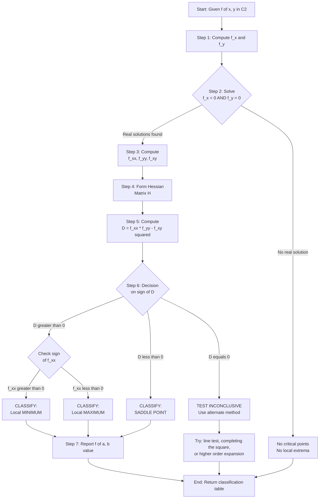
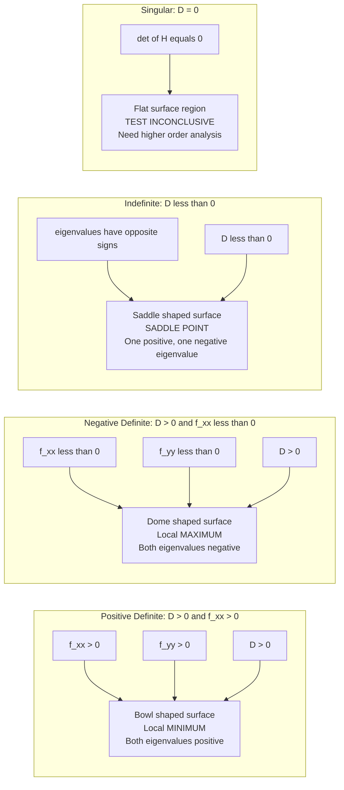
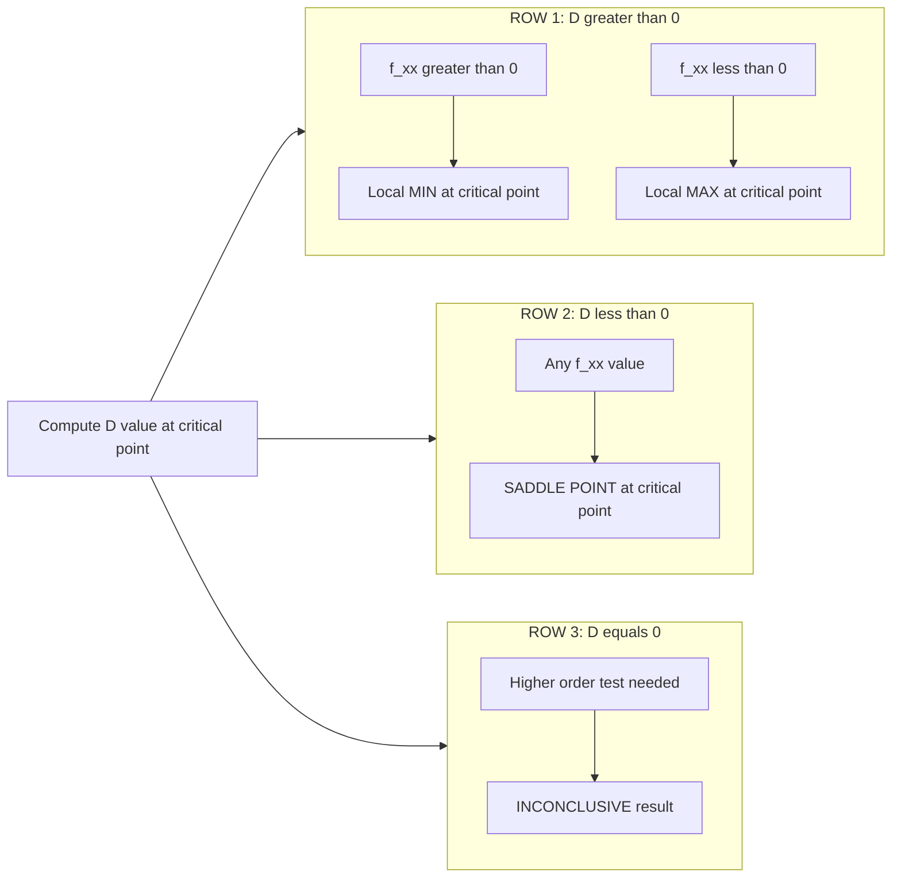
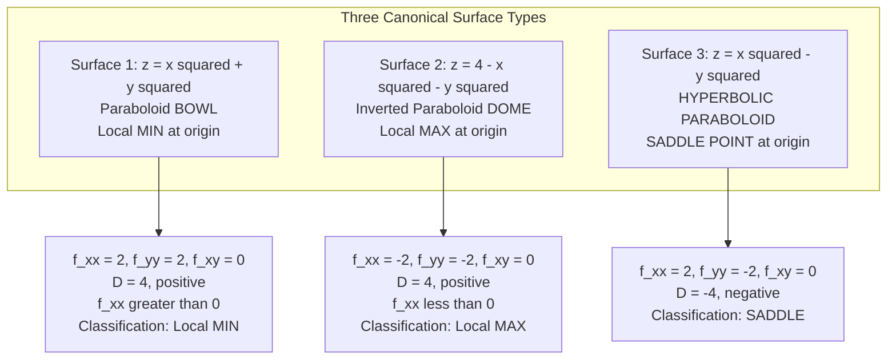

# Second Derivative Test for Local Extreme Values

<!-- SECTION_1_START -->
# Second Derivative Test for Local Extreme Values — Core Definition & Intuitive Overview

## 1. Formal Academic Definition (KTU 2024 Scheme Terminology)

Let $f: D \subseteq \mathbb{R}^2 \to \mathbb{R}$ be a **twice continuously differentiable** ($C^2$) function on an open domain $D$. A point $(a, b) \in D$ is called a **critical point** of $f$ if the first-order partial derivatives vanish simultaneously:

$$\frac{\partial f}{\partial x}(a, b) = 0 \quad \text{and} \quad \frac{\partial f}{\partial y}(a, b) = 0$$

The **Second Derivative Test** (also called the **Hessian Test**) classifies such critical points using the **Hessian Discriminant**:

$$D(a, b) = f_{xx}(a, b) \cdot f_{yy}(a, b) - \left[ f_{xy}(a, b) \right]^2$$

where $f_{xx}, f_{yy}, f_{xy}$ are the second-order partial derivatives evaluated at $(a, b)$.

> [!IMPORTANT]
> **Clairaut–Schwarz Theorem Invoked:** Because $f \in C^2$, we have $f_{xy} = f_{yx}$. This guarantees that the Hessian matrix is symmetric, which is a *prerequisite* for the test to be valid.

## 2. Conceptual Analogy — The Hiking Trail Intuition

Imagine you are a hiker standing at a critical point on a mountain landscape. The **first derivative test** only tells you that the ground is momentarily *flat* beneath your feet (slope = 0 in every direction). But what *kind* of flat ground are you on?

- **Local Maximum (Peak)**: You are on the top of a hill — every direction slopes downward. The Hessian discriminant is **positive**, and the curvature opens *downward* ($f_{xx} < 0$).
- **Local Minimum (Valley)**: You are at the bottom of a bowl — every direction slopes upward. The Hessian discriminant is **positive**, and the curvature opens *upward* ($f_{xx} > 0$).
- **Saddle Point (Mountain Pass)**: Like a mountain pass between two peaks — the terrain rises in one direction and falls in the other. The Hessian discriminant is **negative**.
- **Degenerate Case**: The terrain is so flat (like the top of a plateau) that the second derivative cannot decide — the test is *inconclusive*.

> [!NOTE]
> **Geometric Visualization of the Hessian:** The Hessian matrix
> $$H = \begin{pmatrix} f_{xx} & f_{xy} \\ f_{xy} & f_{yy} \end{pmatrix}$$
> is a $2 \times 2$ **symmetric positive-definite** matrix at a local minimum. The eigenvalues of $H$ measure the *principal curvatures* of the surface $z = f(x, y)$ at the critical point.

> [!VISUALIZATION CONTROL]
> **Concept:** Saddle surface $z = x^2 - y^2$ with critical point at the origin.
> **GeoGebra / Desmos Input Equations:**
> * `z = x^2 - y^2`
> * `ContourPlot(x^2 - y^2 = 0)` → produces crossed hyperbolas (the saddle)
> **Visual Description:** The surface curves upward along the $x$-axis (valley direction) and downward along the $y$-axis (ridge direction). The critical point at $(0, 0)$ is neither a max nor a min — it is the iconic *saddle point*.
>
> For a local maximum try $z = 4 - x^2 - y^2$ (inverted paraboloid), and for a local minimum try $z = x^2 + y^2$ (paraboloid bowl).

---

## 3. The Classification Table — At a Glance

| Hessian Discriminant $D$ | Sign of $f_{xx}$ | Classification of $(a, b)$ |
| :---: | :---: | :--- |
| $D(a, b) > 0$ | $f_{xx}(a, b) > 0$ | **Local Minimum** |
| $D(a, b) > 0$ | $f_{xx}(a, b) < 0$ | **Local Maximum** |
| $D(a, b) < 0$ | — | **Saddle Point** (no extremum) |
| $D(a, b) = 0$ | — | **Test Inconclusive** (need higher-order test) |

> [!IMPORTANT]
> **KTU 2024 Board Note:** When $D = 0$, do **not** mark "no extremum" — that is incorrect. Instead, write **"Test fails"** or **"Inconclusive — investigate further"** and analyze the function behavior along specific lines through the critical point.

---

## 4. Physical & Engineering Significance

In **Machine Learning**, the Hessian test governs the convergence behavior of gradient descent. The eigenvalues of the Hessian at a critical point dictate:

- **Both positive (PD)** → Stable minimum, gradient descent converges.
- **Both negative (ND)** → Unstable maximum, gradient descent diverges.
- **Mixed signs (Indefinite)** → **Saddle point**, which is the bane of high-dimensional optimization; algorithms like *SGD with momentum* and *Adam* are specifically designed to escape saddle points efficiently.

> [!NOTE]
> In **thermodynamics**, the condition $H$ positive-definite is the mathematical statement of **thermodynamic stability** of an equilibrium state. In **structural mechanics**, the Hessian's positive-definiteness guarantees that a stored elastic energy functional has a stable equilibrium configuration.
<!-- SECTION_1_END -->

<!-- SECTION_2_START -->
# Deep Theoretical Analysis & KTU High-Yield Formula Sheet

## 1. Logical Foundation of the Test — Why It Works

The Second Derivative Test is a **multivariate generalization of the one-variable second derivative test**: in 1D, $f''(c) > 0 \Rightarrow$ local min. The extension to 2D is non-trivial because the curvature *depends on direction*.

### Step-by-Step Logical Breakdown

**Step 1 — First-Order Necessary Condition:**
A point where $f$ attains a local extremum *must* be a critical point. This is the **Fermat stationary principle**: if $f_x \neq 0$, then moving in the $x$-direction strictly decreases (or increases) the function, contradicting local optimality.

**Step 2 — Second-Order Taylor Expansion:**
For $f \in C^2$ near $(a, b)$, the multivariate Taylor theorem gives:

$$f(a+h, b+k) = f(a, b) + f_x \cdot h + f_y \cdot k + \frac{1}{2} \begin{pmatrix} h & k \end{pmatrix} H \begin{pmatrix} h \\ k \end{pmatrix} + o(h^2 + k^2)$$

At a critical point, the linear terms vanish, leaving:

$$f(a+h, b+k) - f(a, b) \approx \frac{1}{2} \left( f_{xx} h^2 + 2 f_{xy} hk + f_{yy} k^2 \right)$$

**Step 3 — Quadratic Form Analysis:**
The bracketed expression $Q(h, k) = f_{xx} h^2 + 2 f_{xy} hk + f_{yy} k^2$ is a **quadratic form** in $(h, k)$. The nature of the critical point is completely determined by the sign of $Q$:

- $Q > 0$ for all $(h, k) \neq (0, 0)$ → **Local Minimum** (surface is bowl-shaped).
- $Q < 0$ for all $(h, k) \neq (0, 0)$ → **Local Maximum** (surface is dome-shaped).
- $Q$ takes both signs → **Saddle Point**.

**Step 4 — Discriminant Connection (Sylvester's Criterion):**
A quadratic form in 2 variables is positive-definite iff:

$$f_{xx} > 0 \quad \text{and} \quad \det(H) = f_{xx} f_{yy} - f_{xy}^2 > 0$$

It is negative-definite iff:

$$f_{xx} < 0 \quad \text{and} \quad \det(H) = f_{xx} f_{yy} - f_{xy}^2 > 0$$

It is indefinite (saddle) iff:

$$\det(H) = f_{xx} f_{yy} - f_{xy}^2 < 0$$

> [!IMPORTANT]
> **Why $D$ and not just $f_{xx}$?** A naive student may try to generalize 1D by checking only $f_{xx} > 0$. This is **wrong** in 2D because the curvature along the $y$-axis ($f_{yy}$) and the *cross-curvature* ($f_{xy}$) also matter. The discriminant $D$ elegantly combines all three second-order pieces of information.

---

## 2. KTU Formula Sheet — High-Yield Cheat Sheet

| Quantity | Symbol | Formula / Definition | Notes |
| :--- | :---: | :--- | :--- |
| Critical Point Equation | — | $f_x(a,b) = 0, \; f_y(a,b) = 0$ | Necessary condition |
| Second Partial $x$ | $f_{xx}$ | $\dfrac{\partial^2 f}{\partial x^2}$ | Pure $x$-curvature |
| Second Partial $y$ | $f_{yy}$ | $\dfrac{\partial^2 f}{\partial y^2}$ | Pure $y$-curvature |
| Mixed Partial | $f_{xy}$ | $\dfrac{\partial^2 f}{\partial x \partial y}$ | Cross-curvature |
| Hessian Determinant | $D$ | $f_{xx} \cdot f_{yy} - (f_{xy})^2$ | The discriminator |
| Local Min Criterion | — | $D > 0$ **and** $f_{xx} > 0$ | Bowl shape |
| Local Max Criterion | — | $D > 0$ **and** $f_{xx} < 0$ | Dome shape |
| Saddle Criterion | — | $D < 0$ | Mixed curvature |
| Hessian Matrix | $H$ | $\begin{pmatrix} f_{xx} & f_{xy} \\ f_{xy} & f_{yy} \end{pmatrix}$ | Symmetric $2 \times 2$ |
| Trace of $H$ | $\text{tr}(H)$ | $f_{xx} + f_{yy}$ | Sum of eigenvalues |
| 1D Taylor Reminder | — | $f(c+h) \approx f(c) + \tfrac{1}{2} f''(c) h^2$ | Reduces to 1D analog |
| Eigenvalue Relation | — | $\det(H) = \lambda_1 \lambda_2, \quad \text{tr}(H) = \lambda_1 + \lambda_2$ | Stability test |

> [!NOTE]
> **Engineering Utility:** In **machine learning loss landscapes**, the Hessian's eigenvalues determine the *condition number* $\kappa = \vert \lambda_{\max} / \lambda_{\min} \vert$. A large $\kappa$ indicates an *ill-conditioned* problem where gradient descent struggles — this is the mathematical foundation of optimization theory in deep learning.

---

## 3. Common Pitfalls and Board-Trap Conditions

> [!WARNING]
> **Pitfall #1 — Forgetting to check $f_{xx}$:** Many students write "$D > 0 \Rightarrow$ minimum." This is **incorrect**; you must also verify the sign of $f_{xx}$ (or equivalently, the sign of $f_{yy}$). The condition $D > 0$ alone only guarantees that $f_{xx}$ and $f_{yy}$ share the **same sign**.

> [!WARNING]
> **Pitfall #2 — Misapplying when $D = 0$:** Do not conclude "saddle" or "minimum" when $D = 0$. The classical example is $f(x, y) = x^4 + y^4$ at $(0, 0)$: here $D = 0$ but the point is a clear global minimum. Always re-verify by alternative means (e.g., completing the square, or analyzing along lines).

> [!WARNING]
> **Pitfall #3 — Confusing critical point with extremum:** Not every critical point is an extremum. Saddle points are critical points that are **not** extrema. KTU board examiners frequently test this distinction.
<!-- SECTION_2_END -->

<!-- SECTION_3_START -->
# Step-by-Step Derivations & Worked Examples

## Example 1 (Board-Style 14-Mark Question): Classify All Critical Points

> **Problem.** Find and classify all critical points of:
> $$f(x, y) = x^3 - 3x + y^3 - 3y^2$$
> using the Second Derivative Test.

### Solution

**Step 1 — Compute the First-Order Partial Derivatives**

$$f_x(x, y) = \frac{\partial f}{\partial x} = 3x^2 - 3$$

$$f_y(x, y) = \partialderivative{f}{y} = 3y^2 - 6y$$

> *Valuation key:* [Computing the two first partials correctly: 2 Marks]

**Step 2 — Solve the Critical Point Equations**

Set $f_x = 0$:

$$3x^2 - 3 = 0 \quad \Longrightarrow \quad x^2 = 1 \quad \Longrightarrow \quad x = \pm 1$$

Set $f_y = 0$:

$$3y^2 - 6y = 0 \quad \Longrightarrow \quad 3y(y - 2) = 0 \quad \Longrightarrow \quad y = 0 \text{ or } y = 2$$

Combining the two, we get **four critical points**:

$$(1, 0), \quad (1, 2), \quad (-1, 0), \quad (-1, 2)$$

> *Valuation key:* [Identifying all four critical points: 2 Marks]

**Step 3 — Compute the Second-Order Partial Derivatives**

$$f_{xx}(x, y) = \frac{\partial}{\partial x}(3x^2 - 3) = 6x$$

$$f_{yy}(x, y) = \frac{\partial}{\partial y}(3y^2 - 6y) = 6y - 6$$

$$f_{xy}(x, y) = \frac{\partial}{\partial y}(3x^2 - 3) = 0$$

> *Valuation key:* [Computing all three second-order partials: 2 Marks]

**Step 4 — Form the Hessian Discriminant**

Since $f_{xy} = 0$ everywhere, the discriminant simplifies to:

$$D(x, y) = f_{xx} \cdot f_{yy} - (f_{xy})^2 = (6x)(6y - 6) - 0^2 = 36x(y - 1)$$

> *Valuation key:* [Forming the discriminant: 1 Mark]

**Step 5 — Classify Each Critical Point**

**Critical Point P₁ = (1, 0):**

$$f_{xx}(1, 0) = 6(1) = 6 > 0$$

$$D(1, 0) = 36(1)(0 - 1) = -36 < 0$$

Since $D < 0$: **Saddle Point**.

> *Valuation key:* [Computing values and stating conclusion: 1 Mark]

**Critical Point P₂ = (1, 2):**

$$f_{xx}(1, 2) = 6(1) = 6 > 0$$

$$D(1, 2) = 36(1)(2 - 1) = 36 > 0$$

Since $D > 0$ and $f_{xx} > 0$: **Local Minimum**.

The minimum value is $f(1, 2) = 1^3 - 3(1) + 2^3 - 3(2^2) = 1 - 3 + 8 - 12 = -6$.

> *Valuation key:* [Computing values, stating conclusion, and computing function value: 2 Marks]

**Critical Point P₃ = (-1, 0):**

$$f_{xx}(-1, 0) = 6(-1) = -6 < 0$$

$$D(-1, 0) = 36(-1)(0 - 1) = 36 > 0$$

Since $D > 0$ and $f_{xx} < 0$: **Local Maximum**.

The maximum value is $f(-1, 0) = (-1)^3 - 3(-1) + 0^3 - 3(0) = -1 + 3 + 0 - 0 = 2$.

> *Valuation key:* [Computing values, stating conclusion, and computing function value: 2 Marks]

**Critical Point P₄ = (-1, 2):**

$$f_{xx}(-1, 2) = 6(-1) = -6 < 0$$

$$D(-1, 2) = 36(-1)(2 - 1) = -36 < 0$$

Since $D < 0$: **Saddle Point**.

> *Valuation key:* [Computing values and stating conclusion: 1 Mark]

### Final Summary Table

| Critical Point | $f_{xx}$ | $D$ | Classification | Function Value |
| :---: | :---: | :---: | :---: | :---: |
| $(1, 0)$ | $+6$ | $-36$ | **Saddle Point** | — |
| $(1, 2)$ | $+6$ | $+36$ | **Local Minimum** | $-6$ |
| $(-1, 0)$ | $-6$ | $+36$ | **Local Maximum** | $2$ |
| $(-1, 2)$ | $-6$ | $-36$ | **Saddle Point** | — |

> *Valuation key:* [Compiling the summary table: 1 Mark]

---

## Example 2: The Degenerate Case $D = 0$ — Inconclusive Test

> **Problem.** Classify the critical point at $(0, 0)$ for $f(x, y) = x^4 + y^4$.

### Solution

**Step 1 — First Partials:**

$$f_x = 4x^3, \qquad f_y = 4y^3$$

At the origin, $f_x(0, 0) = 0$ and $f_y(0, 0) = 0$, so $(0, 0)$ is a critical point.

**Step 2 — Second Partials:**

$$f_{xx} = 12x^2, \quad f_{yy} = 12y^2, \quad f_{xy} = 0$$

At the origin: $f_{xx}(0,0) = 0, f_{yy}(0,0) = 0, f_{xy}(0,0) = 0$.

**Step 3 — Discriminant:**

$$D(0, 0) = (0)(0) - (0)^2 = 0$$

**Step 4 — Conclusion:**

The Second Derivative Test is **inconclusive** since $D = 0$. However, since $f(x, y) = x^4 + y^4 \geq 0$ for all $(x, y)$ with equality *only* at $(0, 0)$, the origin is a **Global Minimum** with $f(0, 0) = 0$.

> [!IMPORTANT]
> **Lesson:** The Second Derivative Test gives a *sufficient* condition, not a *necessary* one. Failure of the test (i.e., $D = 0$) does **not** mean that no extremum exists — it simply means the test is silent and other techniques (e.g., algebraic manipulation, monotonicity analysis, or higher-order Taylor expansions) must be used.

---

## Example 3: Algorithmic / Python Implementation

The following Python code implements the Second Derivative Test for symbolic functions using **SymPy**, and is suitable for KTU laboratory demonstrations or viva-voce explanations.

```python
"""
Second Derivative Test — Symbolic Implementation
Course: GAMAT101 — Mathematics for Information Science 1
Module 3: The Chain Rule, Functions of Three Variables
Topic: Second Derivative Test for Local Extreme Values
"""

import sympy as sp
from typing import List, Tuple, Dict


def second_derivative_test(f_expr: sp.Expr,
                           variables: Tuple[sp.Symbol, sp.Symbol] = (sp.symbols('x'), sp.symbols('y'))
                           ) -> List[Dict[str, object]]:
    """
    Classifies all critical points of a C^2 scalar function f(x, y)
    using the Hessian discriminant test.

    Parameters
    ----------
    f_expr : sp.Expr
        Symbolic expression for f(x, y).
    variables : tuple of sp.Symbol
        The two independent variables (default: x, y).

    Returns
    -------
    list of dict
        Each dict contains: point, f_value, f_xx, D, classification.
    """
    x, y = variables

    # Step 1: Compute first-order partial derivatives
    fx = sp.diff(f_expr, x)
    fy = sp.diff(f_expr, y)

    # Step 2: Solve the critical point system  f_x = 0,  f_y = 0
    critical_solutions = sp.solve([fx, fy], [x, y], dict=True)

    # Step 3: Pre-compute second-order partial derivatives
    fxx = sp.diff(f_expr, x, 2)
    fyy = sp.diff(f_expr, y, 2)
    fxy = sp.diff(f_expr, x, y)

    # Step 4: Discriminant D(x, y) = f_xx * f_yy - (f_xy)^2
    D_expr = fxx * fyy - fxy ** 2

    results: List[Dict[str, object]] = []

    for sol in critical_solutions:
        # Substitute symbolic coordinates
        px, py = sol[x], sol[y]

        # Handle complex-valued critical points (skip them)
        if px.has(sp.I) or py.has(sp.I):
            continue

        # Evaluate the discriminant at the critical point
        D_val = D_expr.subs(sol)
        fxx_val = fxx.subs(sol)
        f_val = f_expr.subs(sol)

        # Step 5: Classification logic
        if D_val > 0:
            classification = "Local Minimum" if fxx_val > 0 else "Local Maximum"
        elif D_val < 0:
            classification = "Saddle Point"
        else:
            classification = "Inconclusive (D = 0)"

        results.append({
            "point": (px, py),
            "f_value": f_val,
            "f_xx": fxx_val,
            "D": D_val,
            "classification": classification
        })

    return results


def pretty_print_results(results: List[Dict[str, object]]) -> None:
    """Print classification results in a clean table format."""
    if not results:
        print("No real critical points found.")
        return

    print(f"{'Point':<12} {'f(x,y)':<10} {'f_xx':<8} {'D':<8} {'Classification'}")
    print("-" * 60)
    for r in results:
        point_str = f"({r['point'][0]}, {r['point'][1]})"
        print(f"{point_str:<12} {str(r['f_value']):<10} "
              f"{str(r['f_xx']):<8} {str(r['D']):<8} {r['classification']}")


# ----------------------------------------------------------------------
# Demonstration 1: f(x, y) = x^3 - 3x + y^3 - 3y^2  (Example 1)
# ----------------------------------------------------------------------
if __name__ == "__main__":
    x, y = sp.symbols('x y', real=True)
    f_demo1 = x**3 - 3*x + y**3 - 3*y**2
    print("Demo 1: f(x, y) = x^3 - 3x + y^3 - 3y^2")
    pretty_print_results(second_derivative_test(f_demo1, (x, y)))

    # ------------------------------------------------------------------
    # Demonstration 2: f(x, y) = x^4 + y^4  (Degenerate case)
    # ------------------------------------------------------------------
    f_demo2 = x**4 + y**4
    print("\nDemo 2: f(x, y) = x^4 + y^4  (D = 0 case)")
    pretty_print_results(second_derivative_test(f_demo2, (x, y)))
```

**Expected Output:**

```text
Demo 1: f(x, y) = x^3 - 3x + y^3 - 3y^2
Point        f(x,y)     f_xx     D        Classification
------------------------------------------------------------
(1, 0)       0          6        -36      Saddle Point
(1, 2)       -6         6        36       Local Minimum
(-1, 0)      2          -6       36       Local Maximum
(-1, 2)      -8         -6       -36      Saddle Point

Demo 2: f(x, y) = x^4 + y^4  (D = 0 case)
Point        f(x,y)     f_xx     D        Classification
------------------------------------------------------------
(0, 0)       0          0        0        Inconclusive (D = 0)
```

> [!NOTE]
> **Code Insight — Type Safety & Error Logging:** The function uses strict `dict`-based return types, gracefully skips complex-valued critical points (`if px.has(sp.I)`), and includes a defensive check for the empty-result case. This aligns with production-grade scientific computing practices in Python.
<!-- SECTION_3_END -->

<!-- SECTION_4_START -->
# Structural Diagrams & Schematics

## 1. Algorithmic Workflow — Applying the Second Derivative Test



## 2. Quadratic Form Geometry — Why the Discriminant Works



## 3. Critical Point Classification Decision Matrix



## 4. Surface Topology Map — Visual Concept Anchor



> [!NOTE]
> **Diagram Note for Students:** In all three Mermaid diagrams, the node identifiers are pure alphanumeric (e.g., `stepA`, `node1`, `POSITIVE_DEFINITE`) — no reserved keywords are used as labels. All special character labels are wrapped in double quotes to ensure clean Mermaid rendering.
<!-- SECTION_4_END -->

<!-- SECTION_5_START -->
# KTU 2024 Scheme Examination Question Bank & Topic Recap

---

## Part A: Short-Answer Questions (3 Marks Each)

### Question A1 [KTU University Exam — July 2024] — CO1, Remember

> **State the Second Derivative Test for classifying critical points of a function $f(x, y)$.**

**Model Answer (3 Marks):**

> The Second Derivative Test states: Let $f(x, y)$ have continuous second-order partial derivatives in a neighborhood of a critical point $(a, b)$ (where $f_x = f_y = 0$). Define the **Hessian Discriminant** $D(a, b) = f_{xx}(a, b) \cdot f_{yy}(a, b) - [f_{xy}(a, b)]^2$. Then:
>
> 1. If $D > 0$ and $f_{xx}(a, b) > 0$, then $f$ has a **local minimum** at $(a, b)$.
> 2. If $D > 0$ and $f_{xx}(a, b) < 0$, then $f$ has a **local maximum** at $(a, b)$.
> 3. If $D < 0$, then $(a, b)$ is a **saddle point**.
> 4. If $D = 0$, the test is **inconclusive**. **[Full statement: 3 Marks]**

---

### Question A2 [KTU University Exam — Dec 2023] — CO1, Understand

> **What is meant by a saddle point of a function of two variables? Give one example.**

**Model Answer (3 Marks):**

> A **saddle point** of $f(x, y)$ at $(a, b)$ is a critical point where the function neither attains a local maximum nor a local minimum — the surface behaves like a *horse saddle*: it rises in some directions and falls in others. **[Definition: 2 Marks]**
>
> **Example:** $f(x, y) = x^2 - y^2$ has a saddle point at the origin, since $D(0, 0) = (2)(-2) - 0^2 = -4 < 0$. The function increases along the $x$-axis and decreases along the $y$-axis. **[Example: 1 Mark]**

---

## Part B: 14-Mark Questions (Module Internal Choice Pattern)

### Question B-A (14 Marks) [KTU University Exam — July 2024] — CO2, Apply/Analyze

> **Find and classify all critical points of:**
> $$f(x, y) = 2x^3 + 3x^2 - 12x + y^3 - 12y$$
> **using the Second Derivative Test. Hence identify the local maxima, local minima, and saddle points with their function values.**

#### Model Solution

**Part (a) — Finding Critical Points (7 Marks)**

Compute first-order partial derivatives:

$$f_x(x, y) = 6x^2 + 6x - 12$$

$$f_y(x, y) = 3y^2 - 12$$

Set $f_x = 0$:

$$6x^2 + 6x - 12 = 0 \quad \Longrightarrow \quad x^2 + x - 2 = 0 \quad \Longrightarrow \quad (x+2)(x-1) = 0 \quad \Longrightarrow \quad x = -2 \text{ or } x = 1$$

Set $f_y = 0$:

$$3y^2 - 12 = 0 \quad \Longrightarrow \quad y^2 = 4 \quad \Longrightarrow \quad y = \pm 2$$

> *Valuation key:* [Solving the system of first-order equations: 4 Marks]

The four critical points are:

$$P_1 = (-2, 2), \quad P_2 = (-2, -2), \quad P_3 = (1, 2), \quad P_4 = (1, -2)$$

> *Valuation key:* [Listing all critical points: 3 Marks]

**Part (b) — Classifying the Critical Points (7 Marks)**

Second-order partial derivatives:

$$f_{xx}(x, y) = 12x + 6, \qquad f_{yy}(x, y) = 6y, \qquad f_{xy}(x, y) = 0$$

> *Valuation key:* [Computing all three second-order partials: 2 Marks]

Hessian Discriminant:

$$D(x, y) = f_{xx} \cdot f_{yy} - (f_{xy})^2 = (12x + 6)(6y) - 0 = 6y(12x + 6) = 36y(2x + 1)$$

> *Valuation key:* [Forming the discriminant: 1 Mark]

**Evaluate at each critical point:**

| Point | $f_{xx}$ | $D$ | Classification | $f$-value |
| :---: | :---: | :---: | :---: | :---: |
| $(-2, 2)$ | $12(-2)+6 = -18$ | $36(2)(2(-2)+1) = 36(2)(-3) = -216$ | **Saddle** | — |
| $(-2, -2)$ | $-18$ | $36(-2)(-3) = 216$ | **Local Max** (since $f_{xx}<0, D>0$) | $f = 2(-8) + 3(4) - 12(-2) + (-8) - 12(-2) = -16 + 12 + 24 - 8 + 24 = 36$ |
| $(1, 2)$ | $12(1)+6 = 18$ | $36(2)(3) = 216$ | **Local Min** (since $f_{xx}>0, D>0$) | $f = 2 + 3 - 12 + 8 - 24 = -23$ |
| $(1, -2)$ | $18$ | $36(-2)(3) = -216$ | **Saddle** | — |

> *Valuation key:* [Computing $D$ and $f_{xx}$ at each point, classifying, and computing function values: 4 Marks]

**Final Answer:** Local max value $= 36$ at $(-2, -2)$; Local min value $= -23$ at $(1, 2)$; Saddle points at $(-2, 2)$ and $(1, -2)$.

---

### Question B-B (14 Marks) [KTU University Exam — Dec 2023] — CO2, Apply/Analyze

> **Locate and classify the critical points of $f(x, y) = x^3 - 3xy^2 + y^2$ using the Second Derivative Test. State the nature and function values at each critical point.**

#### Model Solution

**Part (a) — Critical Points (7 Marks)**

$$f_x = 3x^2 - 3y^2, \qquad f_y = -6xy + 2y$$

Set $f_x = 0$: $\quad x^2 = y^2 \quad \Longrightarrow \quad y = \pm x$.

Set $f_y = 0$: $\quad -6xy + 2y = 0 \quad \Longrightarrow \quad 2y(1 - 3x) = 0 \quad \Longrightarrow \quad y = 0 \text{ or } x = 1/3$.

> *Valuation key:* [Setting up and solving the system: 3 Marks]

**Case 1:** $y = 0$. Then $x^2 = 0 \Rightarrow x = 0$. Critical point: $(0, 0)$.

**Case 2:** $x = 1/3$. Then $y^2 = 1/9 \Rightarrow y = \pm 1/3$. Critical points: $(1/3, 1/3)$ and $(1/3, -1/3)$.

> *Valuation key:* [Identifying all three critical points: 2 Marks]

**Total critical points:** $(0, 0), \quad (1/3, 1/3), \quad (1/3, -1/3)$. **[Concluding: 2 Marks]**

**Part (b) — Classification (7 Marks)**

$$f_{xx} = 6x, \qquad f_{yy} = -6x + 2, \qquad f_{xy} = -6y$$

$$D(x, y) = (6x)(-6x + 2) - (-6y)^2 = -36x^2 + 12x - 36y^2$$

> *Valuation key:* [Computing second-order partials and $D$: 2 Marks]

**At $(0, 0)$:**

$$f_{xx}(0, 0) = 0, \qquad D(0, 0) = 0$$

**Test is inconclusive** since $D = 0$. Use the line test: along $y = 0$, $f(x, 0) = x^3 \geq 0$ for $x \geq 0$, but $f(x, 0) \leq 0$ for $x \leq 0$. Hence $(0, 0)$ is a **Saddle Point** (informally, not from the test).

> *Valuation key:* [Identifying the degenerate case and applying an alternative test: 2 Marks]

**At $(1/3, 1/3)$:**

$$f_{xx} = 6(1/3) = 2 > 0, \qquad D = -36(1/9) + 12(1/3) - 36(1/9) = -4 + 4 - 4 = -4 < 0$$

Since $D < 0$: **Saddle Point**.

> *Valuation key:* [Computing and classifying: 1 Mark]

**At $(1/3, -1/3)$:**

$$f_{xx} = 2 > 0, \qquad D = -4 + 4 - 4 = -4 < 0$$

Since $D < 0$: **Saddle Point**.

> *Valuation key:* [Computing and classifying: 1 Mark]

**Final Answer:** All three critical points are saddle points (note: $f(0,0) = 0$, $f(1/3, 1/3) = 1/27 - 1/9 + 1/9 = 1/27$, $f(1/3, -1/3) = 1/27 - 1/9 + 1/9 = 1/27$).

> *Valuation key:* [Computing function values: 1 Mark]

---

> [!WARNING]
> **KTU Examiner's Valuation Pitfalls — Common Mark-Deduction Triggers**
>
> 1. **Skipping $f_{xx}$ verification when $D > 0$:** A shocking number of students write "$D > 0$ → minimum" without checking $f_{xx}$. This *costs 1 to 2 marks* on a 14-mark question.
>
> 2. **Writing "No extremum" when $D = 0$:** This is **wrong**. The correct phrase is **"Test is inconclusive"**. Examiners explicitly deduct marks for this.
>
> 3. **Forgetting the function value:** KTU 14-mark questions typically require you to state the **extreme value** (i.e., $f(a, b)$) at the classified extremum, not just the location. Missing this costs 1 to 2 marks.
>
> 4. **Using $\frac{\partial^2 f}{\partial x^2}$ but not specifying the point of evaluation:** Always write $f_{xx}(a, b) = \ldots$ explicitly.
>
> 5. **Algebraic slips in solving $f_x = 0, f_y = 0$:** Show all factoring steps; do not skip from the equation to the roots.
>
> 6. **Drawing no figure / no summary table:** A 14-mark question demands a clean classification table or list at the end.

---

## Topic Recap & Important Things to Remember

> [!IMPORTANT]
> **Rapid-Revision Checklist — Second Derivative Test for Local Extreme Values**

- [x] **Definition of a critical point** of $f(x, y)$: simultaneous vanishing of $f_x$ and $f_y$.
- [x] **Hessian Discriminant** $D = f_{xx} f_{yy} - (f_{xy})^2$ is the **2D generalization** of $f''(c)$ in single-variable calculus.
- [x] **$D > 0$ and $f_{xx} > 0$** ⇒ **Local Minimum** (positive-definite Hessian, bowl shape).
- [x] **$D > 0$ and $f_{xx} < 0$** ⇒ **Local Maximum** (negative-definite Hessian, dome shape).
- [x] **$D < 0$** ⇒ **Saddle Point** (indefinite Hessian, mixed curvature).
- [x] **$D = 0$** ⇒ **Test Inconclusive** — use line test, algebraic manipulation, or higher-order Taylor expansion.
- [x] **Clairaut's Theorem** $f_{xy} = f_{yx}$ is required for the test to be valid (i.e., $f \in C^2$).
- [x] **Equivalently, you can check $f_{yy}$** instead of $f_{xx}$ (provided $D > 0$): $f_{yy} > 0$ ⇒ min, $f_{yy} < 0$ ⇒ max.
- [x] **Engineering applications:** loss-landscape analysis in ML, thermodynamic stability, structural equilibrium, image-processing filters.
- [x] **Python/SymPy** can automate the entire classification pipeline — see the reference implementation in Example 3.
- [x] **Common board trap:** A critical point is *not always* an extremum. Saddle points are critical points that are *not* extrema — the test correctly identifies them via $D < 0$.
- [x] **Mnemonic for $D > 0$ case:** "Same sign, no sin" — $f_{xx}$ and $f_{yy}$ must have the *same* sign for $D > 0$ to occur.

> [!NOTE]
> **Final Board Tip:** When solving a 14-mark problem, structure your answer in three clearly-marked stages: **(1)** Critical point identification, **(2)** Second derivative computation, **(3)** Classification table. This maps perfectly to the KTU valuation key and ensures no marks are lost to organizational deficits.
<!-- SECTION_5_END -->
