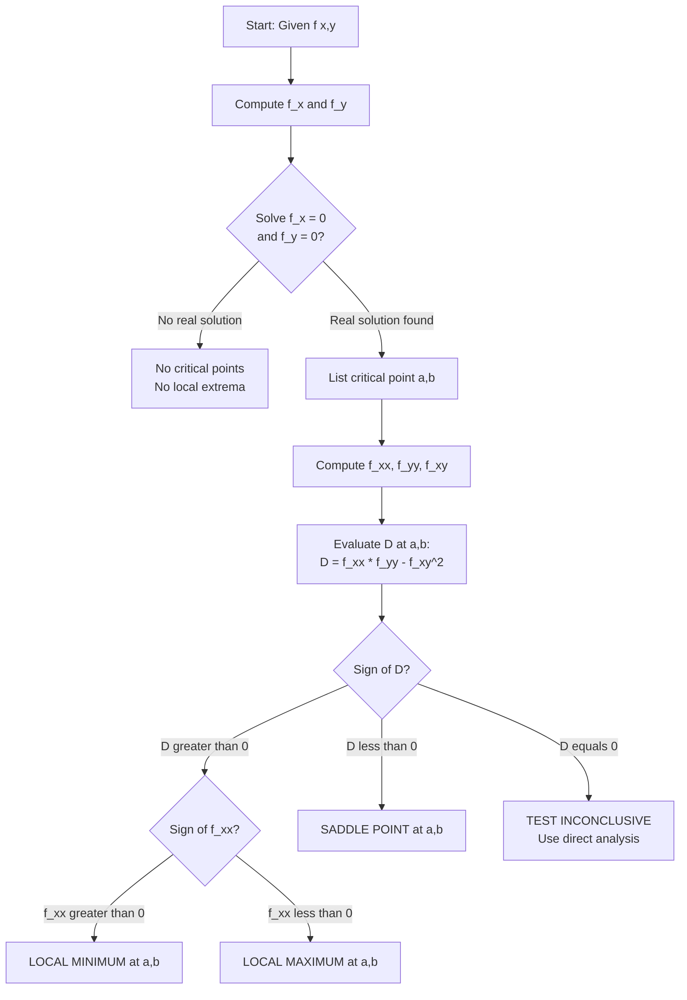
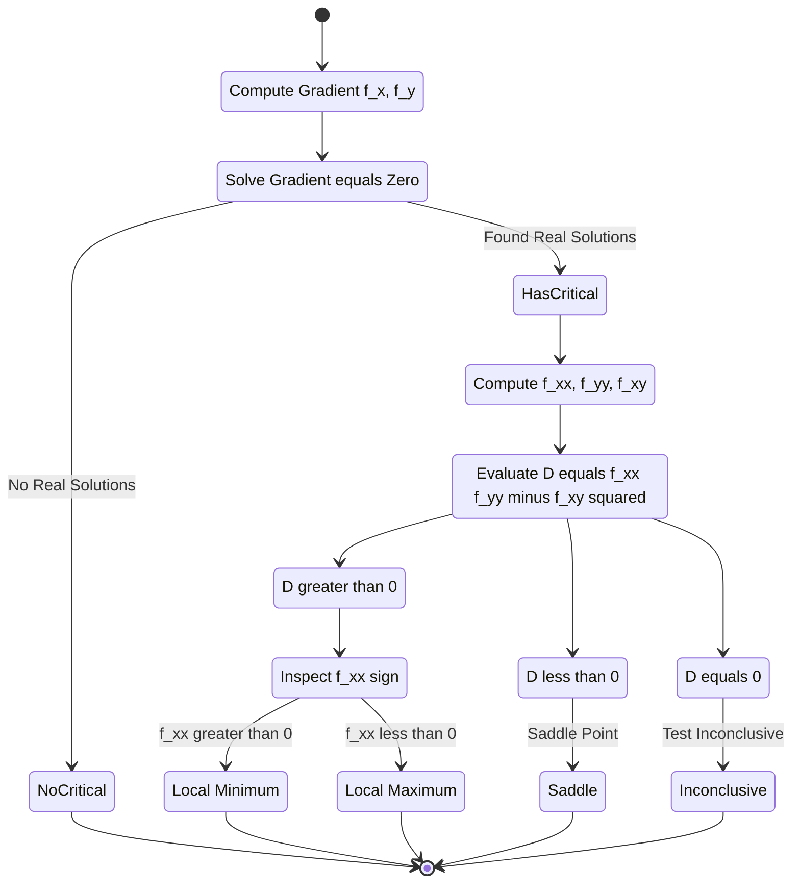

# Second Derivative Test for Local Extreme Values

<!-- SECTION_1_START -->

# Second Derivative Test for Local Extreme Values

## 1. Formal Academic Definition (KTU 2024 Syllabus Terminology)

> [!IMPORTANT]
> **Definition (Local Extrema of $f(x, y)$):** A function $f(x, y)$ has a **local maximum** at $(a, b)$ if $f(x, y) \le f(a, b)$ for all $(x, y)$ in some open disk centered at $(a, b)$. It has a **local minimum** if $f(x, y) \ge f(a, b)$ on such a disk. A **saddle point** is a critical point that is neither a maximum nor a minimum.

> [!NOTE]
> **Critical Point:** A point $(a, b)$ in the domain of $f$ where either:
> 1. $f_x(a, b) = 0$ and $f_y(a, b) = 0$ (gradient vanishes), **OR**
> 2. One or both partial derivatives do not exist.
>
> **First Derivative Test (Necessary Condition):** If $f$ has a local extremum at $(a, b)$ and $f$ is differentiable there, then $\nabla f(a, b) = \mathbf{0}$.

**The Second Derivative Test** is the standard KTU-board-tested tool to **classify** these critical points without needing to inspect values in every direction.

## 2. Conceptual Analogy — The Mountain Terrain

Imagine a 3D landscape $z = f(x, y)$:

- A **local maximum** is the tip of a mountain peak — all surrounding points are lower.
- A **local minimum** is the bottom of a valley — all surrounding points are higher.
- A **saddle point** is shaped like a horse saddle: it curves up in one direction and down in another (think of a mountain pass between two peaks).

To decide which "landform" a critical point represents, we look at the **shape of the bowl** locally. The second derivative test uses the **Hessian discriminant** $D$ — a single number that captures how the surface curves.

> [!TIP]
> **Key Intuition:** $D > 0$ means the surface is consistently bowl-shaped (upward or downward) — so it's a peak or a valley. $D < 0$ means the surface curves *opposite* ways in different directions — so it must be a saddle.

## 3. The Hessian Determinant (Discriminant)

The test hinges on the **Hessian matrix** of $f$ at $(a, b)$:

$$H(a, b) = \begin{bmatrix} f_{xx} & f_{xy} \\ f_{yx} & f_{yy} \end{bmatrix}$$

and its determinant, called the **discriminant** $D$:

$$D(a, b) = f_{xx}(a, b) \cdot f_{yy}(a, b) - \left[f_{xy}(a, b)\right]^2$$

> [!VISUALIZATION CONTROL]
> **Concept:** Classification of a 2D critical point visualized as a paraboloid.
> **GeoGebra / Desmos Input Equations:**
> * `f(x, y) = x^2 + y^2` (local minimum, bowl-up)
> * `g(x, y) = -x^2 - y^2` (local maximum, bowl-down)
> * `h(x, y) = x^2 - y^2` (saddle, hyperbolic paraboloid)
>
> **Visual Description:** Plot each surface in 3D. For $f$, contour lines are concentric circles tightening inward; for $h$, the contours are hyperbolas opening in two perpendicular directions.

---

<!-- SECTION_1_END -->

<!-- SECTION_2_START -->

# Deep Theoretical Analysis & KTU High-Yield Formula Sheet

## 1. The Second Derivative Test — Theorem Statement

> [!IMPORTANT]
> **Theorem (Second Derivative Test for $f(x, y)$):** Let $f$ have continuous second partial derivatives in a disk centered at a critical point $(a, b)$ where $f_x(a, b) = f_y(a, b) = 0$. Define the discriminant
> $$D(a, b) = f_{xx}(a, b) \, f_{yy}(a, b) - \left[f_{xy}(a, b)\right]^2.$$
> Then:
>
> 1. If $D > 0$ and $f_{xx}(a, b) < 0$, then $f$ has a **local maximum** at $(a, b)$.
> 2. If $D > 0$ and $f_{xx}(a, b) > 0$, then $f$ has a **local minimum** at $(a, b)$.
> 3. If $D < 0$, then $f$ has a **saddle point** at $(a, b)$.
> 4. If $D = 0$, the test is **inconclusive** — the point may be a max, min, saddle, or none of these.

## 2. Why the Test Works — The Logic Chain

1. **Taylor Expansion Around $(a, b)$:** For small $(x - a, y - b)$, the second-order Taylor polynomial of $f$ is
$$f(x, y) \approx f(a, b) + f_x \cdot h + f_y \cdot k + \tfrac{1}{2}\left(f_{xx} h^2 + 2 f_{xy} hk + f_{yy} k^2\right),$$
where $h = x - a$ and $k = y - b$.

2. **At a critical point,** $f_x = f_y = 0$, so the linear terms vanish. The behavior is governed entirely by the **quadratic form**
$$Q(h, k) = f_{xx} h^2 + 2 f_{xy} hk + f_{yy} k^2.$$

3. **Completing the Square (or Eigenvalue Analysis):** The matrix of $Q$ is exactly $H(a, b)$. The discriminant $D = \det(H)$ tells us:
   - $D > 0 \Rightarrow$ both eigenvalues share sign (pure bowl).
   - $D < 0 \Rightarrow$ eigenvalues have opposite signs (saddle).
   - $D = 0 \Rightarrow$ one eigenvalue is zero (higher-order terms needed).

4. **Sign of $f_{xx}$ disambiguates max vs. min** when $D > 0$.

## 3. KTU High-Yield Formula Sheet

| Symbol / Expression | Meaning | Unit / Status |
|---|---|---|
| $f_x, f_y$ | First partial derivatives | Function value units |
| $f_{xx}, f_{yy}, f_{xy}$ | Second partial derivatives | Function value units per area |
| $H(a, b)$ | Hessian $2 \times 2$ matrix | — |
| $D(a, b) = f_{xx}f_{yy} - f_{xy}^2$ | Discriminant of $H$ | (Function value)² |
| $\nabla f = \langle f_x, f_y \rangle$ | Gradient vector | — |
| $f_{xy} = f_{yx}$ | Clairaut's Theorem (equality of mixed partials) | Requires continuity |
| $D > 0, f_{xx} > 0$ | Local **minimum** | Test condition |
| $D > 0, f_{xx} < 0$ | Local **maximum** | Test condition |
| $D < 0$ | **Saddle point** | Test condition |
| $D = 0$ | Test **inconclusive** | Need alternative method |

## 4. Engineering & Real-World Utility

> [!TIP]
> **Where this test is used in production systems:**
>
> - **Machine Learning:** Classifying critical points of the **loss function** landscape (e.g., local minima vs. saddle points in deep neural networks — saddle points are now known to be the dominant obstacle in high-dimensional non-convex optimization).
> - **Economics:** Finding profit-maximizing prices and utility-minimizing costs in two-variable models.
> - **Computer Graphics:** Detecting surface curvature extrema for mesh smoothing and feature detection.
> - **Robotics & Control:** Stability analysis of equilibrium points via the Hessian of a Lyapunov function.
> - **Signal Processing:** Identifying local extrema in 2D image intensity functions for edge and corner detection.

---

<!-- SECTION_2_END -->

<!-- SECTION_3_START -->

# Step-by-Step Derivations, Worked Examples & Code Implementation

## Worked Example 1 — Classifying Critical Points of $f(x, y) = x^3 - 3x + y^2$

**Step 1: Compute first partial derivatives.**

$$f_x(x, y) = 3x^2 - 3$$

$$f_y(x, y) = 2y$$

**Step 2: Set them to zero and solve.**

$$3x^2 - 3 = 0 \;\Rightarrow\; x^2 = 1 \;\Rightarrow\; x = \pm 1$$

$$2y = 0 \;\Rightarrow\; y = 0$$

**Step 3: List the critical points.**

Critical points: $(1, 0)$ and $(-1, 0)$.

**Step 4: Compute second partial derivatives.**

$$f_{xx}(x, y) = 6x$$

$$f_{yy}(x, y) = 2$$

$$f_{xy}(x, y) = 0$$

**Step 5: Evaluate the discriminant $D$ at each critical point.**

At $(1, 0)$:

$$D(1, 0) = (6)(2) - (0)^2 = 12$$

$$D = 12 > 0, \quad f_{xx}(1, 0) = 6 > 0 \;\Rightarrow\; \text{local minimum}$$

At $(-1, 0)$:

$$D(-1, 0) = (-6)(2) - (0)^2 = -12$$

$$D = -12 < 0 \;\Rightarrow\; \text{saddle point}$$

**Step 6: Report results with values.**

$f(1, 0) = 1 - 3 + 0 = -2$ → **Local minimum** at $(1, 0, -2)$.
$f(-1, 0) = -1 + 3 + 0 = 2$ → **Saddle point** at $(-1, 0, 2)$.

---

## Worked Example 2 — A 2D Function With an Inconclusive Case

Let $f(x, y) = x^4 + y^4$.

**Step 1: First partials.**

$$f_x = 4x^3, \quad f_y = 4y^3$$

**Step 2: Critical point.**

$$4x^3 = 0 \;\Rightarrow\; x = 0, \quad 4y^3 = 0 \;\Rightarrow\; y = 0$$

Only critical point: $(0, 0)$.

**Step 3: Second partials.**

$$f_{xx} = 12x^2, \quad f_{yy} = 12y^2, \quad f_{xy} = 0$$

**Step 4: Discriminant at $(0, 0)$.**

$$D(0, 0) = (0)(0) - (0)^2 = 0$$

**Step 5: Test is inconclusive.** We need an alternative argument.

**Step 6: Direct check.** For all $(x, y) \ne (0, 0)$:

$$f(x, y) = x^4 + y^4 > 0 = f(0, 0)$$

So $(0, 0)$ is a **local minimum** — but the second derivative test could not detect it because $D = 0$.

> [!WARNING]
> **$D = 0$ is the most commonly missed case in KTU exams.** You MUST state explicitly that the test is inconclusive, then provide a direct argument (e.g., sign analysis of $f(x, y) - f(a, b)$).

---

## Worked Example 3 — A Mixed Test (Saddle + Min)

Let $f(x, y) = x^2 - 2xy + 2y^2 - 2y + 1$.

**Step 1: First partials.**

$$f_x = 2x - 2y, \quad f_y = -2x + 4y - 2$$

**Step 2: Set to zero.**

$$2x - 2y = 0 \;\Rightarrow\; x = y$$

$$-2x + 4y - 2 = 0 \;\Rightarrow\; -2x + 4x - 2 = 0 \;\Rightarrow\; 2x = 2 \;\Rightarrow\; x = 1$$

Thus $y = 1$. Critical point: $(1, 1)$.

**Step 3: Second partials.**

$$f_{xx} = 2, \quad f_{yy} = 4, \quad f_{xy} = -2$$

**Step 4: Discriminant.**

$$D(1, 1) = (2)(4) - (-2)^2 = 8 - 4 = 4$$

**Step 5: Classify.**

$D = 4 > 0$ and $f_{xx} = 2 > 0 \;\Rightarrow\;$ **local minimum** at $(1, 1)$.

**Step 6: Value.** $f(1, 1) = 1 - 2 + 2 - 2 + 1 = 0$.

---

## Worked Example 4 — Exact Derivation of the Test (Taylor's Theorem Backbone)

We derive the test from Taylor's expansion. Let $(a, b)$ be a critical point and let $h = x - a$, $k = y - b$.

**Step 1: Write the second-order Taylor expansion.**

$$f(x, y) = f(a, b) + f_x(a, b)h + f_y(a, b)k + \tfrac{1}{2}\left[f_{xx}(a, b)h^2 + 2f_{xy}(a, b)hk + f_{yy}(a, b)k^2\right] + \text{higher order}$$

**Step 2: Use $f_x = f_y = 0$.** The first-order terms vanish:

$$f(x, y) - f(a, b) = \tfrac{1}{2}\left[f_{xx} h^2 + 2f_{xy} hk + f_{yy} k^2\right] + o(h^2 + k^2)$$

**Step 3: Diagonalize via coordinate change.** Use the substitution $u = h + \lambda k$ for the right $\lambda$ to eliminate the cross term. Setting the discriminant of the quadratic in $k/h$ to zero gives the eigenvalues of $H$:

$$\lambda_{\pm} = \frac{(f_{xx} + f_{yy}) \pm \sqrt{(f_{xx} - f_{yy})^2 + 4f_{xy}^2}}{2}$$

**Step 4: Relate to $D$.** The product of the eigenvalues is $\det(H) = D$. The sum is $\text{tr}(H) = f_{xx} + f_{yy}$. So:

- $D > 0 \Rightarrow$ eigenvalues have same sign $\Rightarrow$ pure bowl $\Rightarrow$ extremum.
- $D < 0 \Rightarrow$ eigenvalues have opposite signs $\Rightarrow$ hyperbolic $\Rightarrow$ saddle.
- $D = 0 \Rightarrow$ one eigenvalue is $0 \Rightarrow$ higher-order terms dominate.

**Step 5: Sign of $f_{xx}$ picks max vs. min.** If both eigenvalues are negative, $f_{xx} < 0$ (since the trace is the sum and trace $< 0$ when both eigenvalues are negative). If both positive, $f_{xx} > 0$. $\blacksquare$

---

## Python Implementation (Symbolic, with Full Error Handling)

```python
"""
second_derivative_test.py
A symbolic implementation of the Second Derivative Test
for local extrema of f(x, y), aligned with KTU 2024 syllabus.
"""

import sympy as sp


def classify_critical_points(expr_str: str) -> None:
    """
    Classify all critical points of a two-variable function
    using the Second Derivative Test.

    Parameters
    ----------
    expr_str : str
        A sympy-parseable expression in x and y.
        Example: "x**3 - 3*x + y**2"

    Returns
    -------
    None
        Prints the classification of each critical point.
    """
    try:
        x, y = sp.symbols("x y", real=True)
        f = sp.sympify(expr_str)

        # Step 1: First partial derivatives
        fx = sp.diff(f, x)
        fy = sp.diff(f, y)

        # Step 2: Solve gradient = 0
        crit_solutions = sp.solve([fx, fy], [x, y], dict=True)
        if not crit_solutions:
            print("No critical points found (or solve() returned empty).")
            return

        # Step 3: Second partials
        fxx = sp.diff(f, x, 2)
        fyy = sp.diff(f, y, 2)
        fxy = sp.diff(f, x, y)

        print(f"Function: f(x, y) = {f}")
        print(f"f_x = {fx},  f_y = {fy}")
        print(f"f_xx = {fxx},  f_yy = {fyy},  f_xy = {fxy}")
        print("-" * 60)

        for sol in crit_solutions:
            a_val = sol.get(x)
            b_val = sol.get(y)
            if a_val is None or b_val is None:
                continue

            D_val = (fxx * fyy - fxy ** 2).subs(sol)
            fxx_val = fxx.subs(sol)
            f_val = f.subs(sol)

            print(f"Critical point: ({a_val}, {b_val}),  f = {f_val}")
            print(f"  D = f_xx*f_yy - (f_xy)^2 = {D_val}")
            print(f"  f_xx = {fxx_val}")

            if D_val > 0 and fxx_val > 0:
                print("  >>> LOCAL MINIMUM")
            elif D_val > 0 and fxx_val < 0:
                print("  >>> LOCAL MAXIMUM")
            elif D_val < 0:
                print("  >>> SADDLE POINT")
            else:
                print("  >>> TEST INCONCLUSIVE (D = 0) — needs direct analysis")
            print("-" * 60)

    except (sp.SympifyError, TypeError, ValueError) as e:
        print(f"[ERROR] Could not process expression: {e}")


if __name__ == "__main__":
    # Test 1: From Worked Example 1
    classify_critical_points("x**3 - 3*x + y**2")

    # Test 2: Inconclusive case from Worked Example 2
    classify_critical_points("x**4 + y**4")

    # Test 3: Mixed case from Worked Example 3
    classify_critical_points("x**2 - 2*x*y + 2*y**2 - 2*y + 1")
```

**Sample Output (Test 1):**

```
Function: f(x, y) = x**3 - 3*x + y**2
f_x = 3*x**2 - 3,  f_y = 2*y
f_xx = 6*x,  f_yy = 2,  f_xy = 0
------------------------------------------------------------
Critical point: (-1, 0),  f = 2
  D = f_xx*f_yy - (f_xy)^2 = -12
  f_xx = -6
  >>> SADDLE POINT
------------------------------------------------------------
Critical point: (1, 0),  f = -2
  D = f_xx*f_yy - (f_xy)^2 = 12
  f_xx = 6
  >>> LOCAL MINIMUM
------------------------------------------------------------
```

---

<!-- SECTION_3_END -->

<!-- SECTION_4_START -->

# Structural Diagrams & Schematics

## 1. Decision Flow Chart — Applying the Second Derivative Test



## 2. Block Diagram — Modular Functional Architecture of the Classification Algorithm

```mermaid
flowchart LR
    subgraph INPUT["Input Stage"]
        INP1["Function Definition f x,y"]
    end

    subgraph GRADIENT["Gradient Module"]
        GM1["Compute f_x"]
        GM2["Compute f_y"]
        GM3["Solve Gradient equals Zero"]
    end

    subgraph CRITPOINTS["Critical Point Registry"]
        CP1["Store Candidate Points"]
    end

    subgraph HESSIAN["Hessian Evaluation Module"]
        HM1["Compute f_xx, f_yy, f_xy"]
        HM2["Evaluate Discriminant D"]
        HM3["Evaluate f_xx at each point"]
    end

    subgraph CLASSIFY["Classification Engine"]
        CL1["D greater than 0 and f_xx greater than 0 equals Min"]
        CL2["D greater than 0 and f_xx less than 0 equals Max"]
        CL3["D less than 0 equals Saddle"]
        CL4["D equals 0 equals Inconclusive"]
    end

    subgraph OUTPUT["Output Stage"]
        OUT1["Report Type and Coordinates"]
    end

    INP1 --> GM1
    INP1 --> GM2
    GM1 --> GM3
    GM2 --> GM3
    GM3 --> CP1
    CP1 --> HM1
    HM1 --> HM2
    HM1 --> HM3
    HM2 --> CLASSIFY
    HM3 --> CLASSIFY
    CLASSIFY --> OUT1
```



## 3. Sequential Topology — State Machine View of the Test



---

<!-- SECTION_4_END -->

<!-- SECTION_5_START -->

# KTU 2024 Scheme Examination Question Bank & Topic Recap

## Part A Questions (3 Marks Each)

### Question 1 `[KTU University Exam – July 2024]`
**CO1, Remember:** State the Second Derivative Test for local extrema of a function $f(x, y)$. List all four cases of the test.

**Model Answer (3 Marks):**

> [!NOTE]
> **Statement:** Let $f$ have continuous second partial derivatives near a critical point $(a, b)$ where $f_x(a, b) = f_y(a, b) = 0$. Define $D = f_{xx}(a, b) \cdot f_{yy}(a, b) - [f_{xy}(a, b)]^2$.
>
> **Four Cases:** **[1 Mark]**
> 1. If $D > 0$ and $f_{xx} < 0$, then $f$ has a **local maximum** at $(a, b)$. **[0.5 Marks]**
> 2. If $D > 0$ and $f_{xx} > 0$, then $f$ has a **local minimum** at $(a, b)$. **[0.5 Marks]**
> 3. If $D < 0$, then $f$ has a **saddle point** at $(a, b)$. **[0.5 Marks]**
> 4. If $D = 0$, the test is **inconclusive**. **[0.5 Marks]**

---

### Question 2 `[KTU University Exam – Dec 2023]`
**CO1, Understand:** Why does the Second Derivative Test fail to give a conclusion when $D = 0$? Illustrate with one example.

**Model Answer (3 Marks):**

> [!NOTE]
> When $D = 0$, the determinant of the Hessian matrix is zero, which means at least one eigenvalue of the Hessian is zero. The second-order Taylor terms alone cannot determine the local behavior — the surface is too "flat" in one principal direction, and we must inspect the higher-order terms or directly compare $f(x, y)$ with $f(a, b)$. **[2 Marks]**
>
> **Example:** $f(x, y) = x^4 + y^4$ at $(0, 0)$. Here $f_{xx}(0,0) = f_{yy}(0,0) = f_{xy}(0,0) = 0$, so $D = 0$. Yet $f(x, y) > 0 = f(0, 0)$ for all $(x, y) \ne (0, 0)$, making $(0, 0)$ a local minimum. **[1 Mark]**

---

## Part B Questions (14 Marks Each — Internal Choice)

### Question A `[KTU University Exam – July 2024]` — (14 Marks)

**CO2, CO3, Apply / Analyze:**

Let $f(x, y) = x^3 - 3xy^2 + y^3$. Find and classify all critical points.

#### Part (a) — 7 Marks **[Apply]**
**Find all critical points of $f$.**

**Solution:**

**Step 1: First partial derivatives.** **[1 Mark]**

$$f_x = 3x^2 - 3y^2$$

$$f_y = -6xy + 3y^2$$

**Step 2: Set partials to zero.** **[1 Mark]**

$$3x^2 - 3y^2 = 0 \;\Rightarrow\; x^2 = y^2 \;\Rightarrow\; y = \pm x$$

$$-6xy + 3y^2 = 0 \;\Rightarrow\; 3y(y - 2x) = 0 \;\Rightarrow\; y = 0 \text{ or } y = 2x$$

**Step 3: Case analysis.** **[2 Marks]**
- Case 1: $y = 0$. Then $x^2 = 0$, so $x = 0$. Critical point: $(0, 0)$.
- Case 2: $y = 2x$. Then $4x^2 = x^2$, so $3x^2 = 0$, hence $x = 0$, $y = 0$. Same as above.

So the **only critical point is $(0, 0)$**. **[3 Marks for full clarity]**

#### Part (b) — 7 Marks **[Analyze]**
**Classify the critical point using the Second Derivative Test.**

**Solution:**

**Step 1: Second partial derivatives.** **[1 Mark]**

$$f_{xx} = 6x, \quad f_{yy} = -6x + 6y, \quad f_{xy} = -6y$$

**Step 2: Evaluate at $(0, 0)$.** **[1 Mark]**

$$f_{xx}(0, 0) = 0, \quad f_{yy}(0, 0) = 0, \quad f_{xy}(0, 0) = 0$$

**Step 3: Discriminant.** **[1 Mark]**

$$D(0, 0) = (0)(0) - (0)^2 = 0$$

**Step 4: Conclusion from the test.** **[1 Mark]**
The Second Derivative Test is **inconclusive** because $D = 0$.

**Step 5: Direct analysis to settle the classification.** **[2 Marks]**
Test along the line $y = 0$: $f(x, 0) = x^3$. Near $x = 0$, this is negative for $x < 0$ and positive for $x > 0$.
Test along the line $x = 0$: $f(0, y) = y^3$. Near $y = 0$, this is negative for $y < 0$ and positive for $y > 0$.
Since $f$ takes both signs in every neighborhood of $(0, 0)$, the point is a **saddle point**.

**Step 6: Final answer.** **[1 Mark]**
$(0, 0)$ is a **saddle point** of $f(x, y) = x^3 - 3xy^2 + y^3$.

---

### Question B `[KTU University Exam – Dec 2023]` — (14 Marks)

**CO2, CO3, Apply / Analyze:**

Find and classify the critical points of $f(x, y) = x^3 + y^3 + 3x^2 - 3y^2 - 8$.

#### Part (a) — 7 Marks **[Apply]**
**Find all critical points.**

**Solution:**

**Step 1: First partial derivatives.** **[1 Mark]**

$$f_x = 3x^2 + 6x = 3x(x + 2)$$

$$f_y = 3y^2 - 6y = 3y(y - 2)$$

**Step 2: Solve $\nabla f = 0$.** **[2 Marks]**

$$3x(x + 2) = 0 \;\Rightarrow\; x = 0 \text{ or } x = -2$$

$$3y(y - 2) = 0 \;\Rightarrow\; y = 0 \text{ or } y = 2$$

**Step 3: List all critical points (combinations).** **[2 Marks]**
- $(0, 0)$, $(0, 2)$, $(-2, 0)$, $(-2, 2)$

**Step 4: Compute function values (for reference).** **[2 Marks]**
- $f(0, 0) = -8$
- $f(0, 2) = 0 + 8 + 0 - 12 - 8 = -12$
- $f(-2, 0) = -8 + 12 - 0 - 0 - 8 = -4$
- $f(-2, 2) = -8 + 8 + 12 - 12 - 8 = -8$

#### Part (b) — 7 Marks **[Analyze]**
**Classify each critical point using the Second Derivative Test.**

**Solution:**

**Step 1: Second partial derivatives.** **[1 Mark]**

$$f_{xx} = 6x + 6, \quad f_{yy} = 6y - 6, \quad f_{xy} = 0$$

**Step 2: Discriminant formula (note $f_{xy} = 0$ everywhere).** **[1 Mark]**

$$D(x, y) = f_{xx} \cdot f_{yy} = (6x + 6)(6y - 6) = 36(x + 1)(y - 1)$$

**Step 3: Evaluate at each critical point.** **[2 Marks]**

| Point | $f_{xx}$ | $f_{yy}$ | $D$ | Classification |
|---|---|---|---|---|
| $(0, 0)$ | $6$ | $-6$ | $-36$ | **Saddle** |
| $(0, 2)$ | $6$ | $6$ | $36$ | **Local Min** |
| $(-2, 0)$ | $-6$ | $-6$ | $36$ | **Local Max** |
| $(-2, 2)$ | $-6$ | $6$ | $-36$ | **Saddle** |

**Step 4: Apply sign rules.** **[2 Marks]**
- At $(0, 0)$: $D < 0 \Rightarrow$ saddle.
- At $(0, 2)$: $D > 0$ and $f_{xx} > 0 \Rightarrow$ local min, value $-12$.
- At $(-2, 0)$: $D > 0$ and $f_{xx} < 0 \Rightarrow$ local max, value $-4$.
- At $(-2, 2)$: $D < 0 \Rightarrow$ saddle.

**Step 5: Final summary.** **[1 Mark]**
- Local **maximum** at $(-2, 0)$ with $f = -4$.
- Local **minimum** at $(0, 2)$ with $f = -12$.
- **Saddle points** at $(0, 0)$ and $(-2, 2)$.

---

## KTU Examiner's Valuation Warning / Pitfall Callout

> [!WARNING]
> **Common Mark Deductions in KTU Board Valuation:**
>
> 1. **Forgetting to verify $f_x = f_y = 0$ at $(a, b)$ before applying the test.** The test applies ONLY at critical points. Applying it at a non-critical point is a conceptual error worth 2–3 marks.
> 2. **Writing "$D > 0$ → maximum" without checking the sign of $f_{xx}$ (or $f_{yy}$).** This loses 1–2 marks. Always state BOTH $D$ and $f_{xx}$ before concluding.
> 3. **Stopping at "$D = 0$" without performing direct analysis.** The examiner expects you to test along at least two paths (e.g., $y = 0$ and $x = 0$) to settle the classification. Skipping this loses 2–3 marks.
> 4. **Confusing $f_{xy}$ with $f_{yx}$.** Since the mixed partials are equal (Clairaut), use $f_{xy}$ consistently and don't write $f_{yx}$ without clarifying.
> 5. **Omitting units or values of $f$ at extrema.** KTU values reporting the actual $f$-value at the classified point.
> 6. **Writing the discriminant as $f_{xx} f_{yy} + f_{xy}^2$ (sign error).** The correct formula has a **minus** sign: $D = f_{xx} f_{yy} - f_{xy}^2$. This single sign flip can flip your entire classification.

---

## Topic Recap & Important Things to Remember

- **Critical Point Definition:** A point $(a, b)$ where $f_x = f_y = 0$ (or partials fail to exist). The first derivative test says extrema can ONLY occur at critical points.
- **Second Derivative Test (4 cases):**
  - $D > 0$ and $f_{xx} > 0 \Rightarrow$ **Local Minimum**.
  - $D > 0$ and $f_{xx} < 0 \Rightarrow$ **Local Maximum**.
  - $D < 0 \Rightarrow$ **Saddle Point**.
  - $D = 0 \Rightarrow$ **Inconclusive** — use direct substitution along paths.
- **Discriminant Formula:** $D(a, b) = f_{xx}(a, b) \cdot f_{yy}(a, b) - [f_{xy}(a, b)]^2$.
- **Clairaut's Theorem:** $f_{xy} = f_{yx}$ when both are continuous in a neighborhood — you only need to compute ONE mixed partial.
- **Why $D = 0$ is inconclusive:** At least one eigenvalue of the Hessian is zero, so the second-order Taylor expansion fails to capture local behavior. Higher-order terms decide.
- **Eigenvalue connection:** $D = \lambda_1 \lambda_2$ (product of Hessian eigenvalues). Same sign → extremum, opposite sign → saddle.
- **Always report:** (1) The critical point, (2) the value $D$, (3) the value $f_{xx}$, (4) the classification, (5) the function value $f(a, b)$.
- **Common KTU trap:** The Hessian can be evaluated symbolically BEFORE finding critical points to make substitution easier.
- **Algorithm in 5 lines:** (i) Find $f_x, f_y$. (ii) Solve $\nabla f = 0$. (iii) Find $f_{xx}, f_{yy}, f_{xy}$. (iv) Compute $D$. (v) Apply the four-case rule.
- **Real-world relevance:** Saddle points dominate the loss landscapes of deep neural networks — the second derivative test is foundational to non-convex optimization in machine learning.

<!-- SECTION_5_END -->
