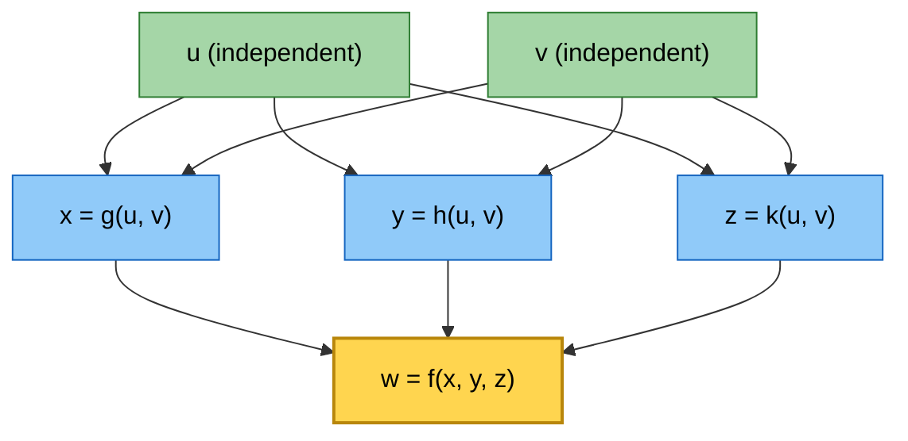
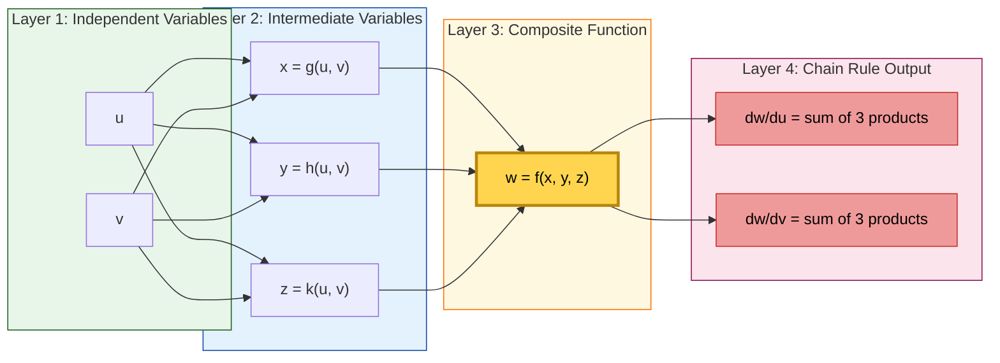

# The Chain Rule: Functions of three Variables

<!-- SECTION_1_START -->
# The Chain Rule: Functions of Three Variables

## 🎯 Core Technical Definition (KTU 2024 Syllabus)

> [!IMPORTANT]
> **Chain Rule (Three-Variable Form):** Suppose $w = f(x, y, z)$ is a differentiable function of three variables, and each of $x$, $y$, and $z$ is a differentiable function of two variables $u$ and $v$, namely $x = g(u, v)$, $y = h(u, v)$, $z = k(u, v)$. Then $w$ is a differentiable function of $u$ and $v$, and the partial derivatives of the composite function $w = f(g(u,v), h(u,v), k(u,v))$ are given by:
> $$\frac{\partial w}{\partial u} = \frac{\partial w}{\partial x}\frac{\partial x}{\partial u} + \frac{\partial w}{\partial y}\frac{\partial y}{\partial u} + \frac{\partial w}{\partial z}\frac{\partial z}{\partial u}$$
> $$\frac{\partial w}{\partial v} = \frac{\partial w}{\partial x}\frac{\partial x}{\partial v} + \frac{\partial w}{\partial y}\frac{\partial y}{\partial v} + \frac{\partial w}{\partial z}\frac{\partial z}{\partial v}$$

## 🧠 Intuitive Analogy (The Domino Cascade)

Imagine three rows of dominoes stacked behind one another. Knocking over the first domino triggers the second, which then triggers the third. The **Chain Rule** is simply the mathematical recording of this cascade.

- The **outer function** $f$ depends on $x, y, z$ (the middle row of dominoes).
- The **inner functions** $g, h, k$ depend on $u, v$ (the back row of dominoes).
- A tap on $u$ causes ripples through $x$, $y$, and $z$ simultaneously, and all those ripples combine to push $w$.

The total rate of change of $w$ with respect to $u$ is simply the **sum of all parallel paths** from $u$ to $w$ in the dependency tree.

> [!NOTE]
> **Syllabus Highlight (GAMAT101 - Module 3):** The three-variable form is the natural generalization of the two-variable case. KTU 2024 explicitly requires students to draw the **tree diagram** before applying the formula to avoid missing terms.

### 📐 Geometric Picture

In the $(u, v)$-plane, the surface $w = f(x(u,v), y(u,v), z(u,v))$ sits above the input space. The chain rule tells us the **tangent slope** of this surface in the $u$ and $v$ directions is the vector sum of the partial slopes propagated through every intermediate variable.

> [!VISUALIZATION CONTROL]
> **Concept:** Cascade dependency of variables $u, v \rightarrow x, y, z \rightarrow w$
> **GeoGebra / Desmos Input Equations:**
> * `w = x^2 + y^2 + z^2` (outer)
> * `x(u,v) = u + v`, `y(u,v) = u - v`, `z(u,v) = u*v` (inner)
> **Visual Description:** A 3D surface parameterized by $(u, v)$ in the base plane. The height $w$ at any point is built by combining three independent intermediate channels. As $(u, v)$ moves, observe how the surface responds according to the weighted sum in the chain rule formula.

---

<!-- SECTION_1_END -->

<!-- SECTION_2_START -->
# Deep Theoretical Analysis & KTU High-Yield Formula Sheet

## 🔬 Structural Breakdown: The Five Standard Cases

The KTU 2024 syllabus (GAMAT101, Module 3) lists the chain rule under several configurations depending on the number of independent and intermediate variables. We list every standard form below.

### Case 1 — One Independent Variable (Linear Chain)

If $w = f(x, y, z)$ and $x = x(t), y = y(t), z = z(t)$, then:

$$\frac{dw}{dt} = \frac{\partial f}{\partial x}\frac{dx}{dt} + \frac{\partial f}{\partial y}\frac{dy}{dt} + \frac{\partial f}{\partial z}\frac{dz}{dt}$$

This is a **total derivative** (ordinary derivative), not a partial derivative, because $t$ is the only independent variable.

### Case 2 — Two Independent Variables (The Main Form)

If $w = f(x, y, z)$ with $x = x(u, v), y = y(u, v), z = z(u, v)$:

$$\frac{\partial w}{\partial u} = \frac{\partial w}{\partial x}\frac{\partial x}{\partial u} + \frac{\partial w}{\partial y}\frac{\partial y}{\partial u} + \frac{\partial w}{\partial z}\frac{\partial z}{\partial u}$$

$$\frac{\partial w}{\partial v} = \frac{\partial w}{\partial x}\frac{\partial x}{\partial v} + \frac{\partial w}{\partial y}\frac{\partial y}{\partial v} + \frac{\partial w}{\partial z}\frac{\partial z}{\partial v}$$

### Case 3 — Mixed Path: Three Independent Variables

If $w = f(x, y, z)$ with $x = x(r, s, t), y = y(r, s, t), z = z(r, s, t)$, then three partial derivatives must be computed — one for each of $r, s, t$ — each containing **three chain terms**.

### Case 4 — Implicit Differentiation via Chain Rule

The chain rule provides the algorithmic engine for implicit differentiation. For example, given $F(x, y, z) = 0$ defining $z = f(x, y)$:

$$\frac{\partial z}{\partial x} = -\frac{F_x}{F_z}, \qquad \frac{\partial z}{\partial y} = -\frac{F_y}{F_z}$$

### Case 5 — Compound Path (More than Three Layers)

If $w = f(x)$ where $x = g(u, v)$ and $u = u(s, t), v = v(s, t)$, then a two-step cascade applies:

$$\frac{\partial w}{\partial s} = \frac{dw}{dx}\frac{\partial x}{\partial u}\frac{\partial u}{\partial s} + \frac{dw}{dx}\frac{\partial x}{\partial v}\frac{\partial v}{\partial s}$$

## 🌳 Tree Diagram — The Visualization Tool

The **tree diagram** prevents missing a term. Each branch from one node to the next multiplies the partial derivatives along the branch. The final answer is the **sum over all branches** from the starting variable to the ending variable.

| Path Type | Branch Count | Number of Terms |
|---|---|---|
| $t \rightarrow w$ (Case 1) | 3 branches from $t$ | 3 summed terms |
| $(u,v) \rightarrow w$ (Case 2) | 3 branches per independent variable | 3 terms each, 6 total |
| $(r,s,t) \rightarrow w$ (Case 3) | 3 branches per variable | 3 terms each, 9 total |

> [!NOTE]
> **Generalized Rule:** For $w = f(x_1, x_2, \ldots, x_n)$ with each $x_i = x_i(u_1, u_2, \ldots, u_m)$:
> $$\frac{\partial w}{\partial u_k} = \sum_{i=1}^{n} \frac{\partial w}{\partial x_i} \cdot \frac{\partial x_i}{\partial u_k}$$
> This summation form is the most exam-friendly way to remember the chain rule for arbitrary $n$.

## 📋 KTU Formula Sheet / Cheat Sheet

| Configuration | Formula | When to Use |
|---|---|---|
| $w = f(x, y, z), \ x, y, z$ functions of $t$ | $\dfrac{dw}{dt} = \sum \dfrac{\partial w}{\partial x_i} \cdot \dfrac{dx_i}{dt}$ | Single independent variable |
| $w = f(x, y, z), \ x, y, z$ functions of $(u, v)$ | $\dfrac{\partial w}{\partial u} = \sum \dfrac{\partial w}{\partial x_i} \cdot \dfrac{\partial x_i}{\partial u}$ | Two independent variables |
| $w = f(x, y, z), \ x, y, z$ functions of $(r, s, t)$ | $\dfrac{\partial w}{\partial r} = \sum \dfrac{\partial w}{\partial x_i} \cdot \dfrac{\partial x_i}{\partial r}$ | Three independent variables |
| Implicit: $F(x, y, z) = 0$ | $\dfrac{\partial z}{\partial x} = -\dfrac{F_x}{F_z}$ | $z$ is implicit function of $x, y$ |
| Compound: $w = f(x), \ x = g(u, v), \ u, v = h(s, t), k(s, t)$ | $\dfrac{\partial w}{\partial s} = \dfrac{dw}{dx} \sum \dfrac{\partial x}{\partial u_i} \cdot \dfrac{\partial u_i}{\partial s}$ | Two-level cascade |

> **Units & Notation Reminder:** All partial derivatives are **dimensionless ratios** (change in output divided by change in input), with units carried by the variables themselves. The notation $\partial$ is used (not $d$) whenever the function depends on more than one independent variable.

## 🏭 Real-World Engineering Utility

- **Computer Graphics:** 3D shape transformations (rotation, scaling, translation) are composite functions of multiple parameters. The chain rule computes the Jacobian matrix used in rendering pipelines (OpenGL, DirectX).
- **Machine Learning Backpropagation:** The gradient of a loss function with respect to weights in a deep neural network is precisely an application of the multi-variable chain rule across hundreds of layers. The "backprop" algorithm is the chain rule automated.
- **Robotics & Kinematics:** The end-effector position of a robotic arm is a composite function of multiple joint angles. Velocities are computed using the chain rule (the manipulator Jacobian).
- **Physics (Electromagnetism):** Computing $\nabla T$ in non-Cartesian coordinates (spherical, cylindrical) requires the chain rule applied to coordinate transformations.
- **Economics:** Utility functions in multi-good markets are differentiated with respect to underlying decision parameters using the chain rule.

---

<!-- SECTION_2_END -->

<!-- SECTION_3_START -->
# Step-by-Step Derivations & Code Implementation

## 🔢 Worked Example 1 (Full Derivation) — KTU Board Standard

**Problem:** Given $w = x^2 y + y^2 z + z^2 x$ where $x = u v, \ y = u - v, \ z = u + 2v$. Find $\dfrac{\partial w}{\partial u}$ and $\dfrac{\partial w}{\partial v}$ at the point $(u, v) = (1, 1)$.

### Step 1 — Write the Tree Diagram (Mental or Drawn)

- Branches from $u$ to $w$: $u \rightarrow x, \ u \rightarrow y, \ u \rightarrow z$
- Branches from $v$ to $w$: $v \rightarrow x, \ v \rightarrow y, \ v \rightarrow z$

### Step 2 — Compute the Partial Derivatives of $w$

$$\frac{\partial w}{\partial x} = 2xy + z^2$$

$$\frac{\partial w}{\partial y} = x^2 + 2yz$$

$$\frac{\partial w}{\partial z} = y^2 + 2zx$$

### Step 3 — Compute the Partial Derivatives of $x, y, z$

$$\frac{\partial x}{\partial u} = v, \quad \frac{\partial y}{\partial u} = 1, \quad \frac{\partial z}{\partial u} = 1$$

$$\frac{\partial x}{\partial v} = u, \quad \frac{\partial y}{\partial v} = -1, \quad \frac{\partial z}{\partial v} = 2$$

### Step 4 — Apply the Chain Rule for $\partial w / \partial u$

$$\frac{\partial w}{\partial u} = \frac{\partial w}{\partial x}\frac{\partial x}{\partial u} + \frac{\partial w}{\partial y}\frac{\partial y}{\partial u} + \frac{\partial w}{\partial z}\frac{\partial z}{\partial u}$$

Substituting the expressions:

$$\frac{\partial w}{\partial u} = (2xy + z^2)(v) + (x^2 + 2yz)(1) + (y^2 + 2zx)(1)$$

### Step 5 — Apply the Chain Rule for $\partial w / \partial v$

$$\frac{\partial w}{\partial v} = \frac{\partial w}{\partial x}\frac{\partial x}{\partial v} + \frac{\partial w}{\partial y}\frac{\partial y}{\partial v} + \frac{\partial w}{\partial z}\frac{\partial z}{\partial v}$$

$$\frac{\partial w}{\partial v} = (2xy + z^2)(u) + (x^2 + 2yz)(-1) + (y^2 + 2zx)(2)$$

### Step 6 — Substitute Values at $(u, v) = (1, 1)$

First, evaluate the inner variables:

$$x = uv = (1)(1) = 1, \quad y = u - v = 0, \quad z = u + 2v = 3$$

Now compute the partials of $w$ at these values:

$$\frac{\partial w}{\partial x}\bigg|_{x=1, y=0, z=3} = 2(1)(0) + (3)^2 = 9$$

$$\frac{\partial w}{\partial y}\bigg|_{x=1, y=0, z=3} = (1)^2 + 2(0)(3) = 1$$

$$\frac{\partial w}{\partial z}\bigg|_{x=1, y=0, z=3} = (0)^2 + 2(3)(1) = 6$$

### Step 7 — Final Numerical Evaluation

$$\frac{\partial w}{\partial u}\bigg|_{(1,1)} = (9)(1) + (1)(1) + (6)(1) = 9 + 1 + 6 = 16$$

$$\frac{\partial w}{\partial v}\bigg|_{(1,1)} = (9)(1) + (1)(-1) + (6)(2) = 9 - 1 + 12 = 20$$

> **Final Answer:** $\dfrac{\partial w}{\partial u}\bigg|_{(1,1)} = 16$ and $\dfrac{\partial w}{\partial v}\bigg|_{(1,1)} = 20$.

## 🔢 Worked Example 2 (Implicit Differentiation via Chain Rule)

**Problem:** If $F(x, y, z) = x^3 + y^3 + z^3 - 6xyz = 0$ defines $z$ as a function of $x$ and $y$, find $\dfrac{\partial z}{\partial x}$ and $\dfrac{\partial z}{\partial y}$.

### Step 1 — Set Up the Chain Rule

Treating $z = z(x, y)$, differentiate the equation $F(x, y, z(x, y)) = 0$ with respect to $x$:

$$\frac{\partial F}{\partial x} \cdot 1 + \frac{\partial F}{\partial y} \cdot 0 + \frac{\partial F}{\partial z} \cdot \frac{\partial z}{\partial x} = 0$$

### Step 2 — Compute the Partial Derivatives of $F$

$$\frac{\partial F}{\partial x} = 3x^2 - 6yz, \quad \frac{\partial F}{\partial y} = 3y^2 - 6xz, \quad \frac{\partial F}{\partial z} = 3z^2 - 6xy$$

### Step 3 — Solve for $\partial z / \partial x$

$$\frac{\partial z}{\partial x} = -\frac{F_x}{F_z} = -\frac{3x^2 - 6yz}{3z^2 - 6xy} = \frac{6yz - 3x^2}{3z^2 - 6xy}$$

### Step 4 — Solve for $\partial z / \partial y$

$$\frac{\partial z}{\partial y} = -\frac{F_y}{F_z} = -\frac{3y^2 - 6xz}{3z^2 - 6xy} = \frac{6xz - 3y^2}{3z^2 - 6xy}$$

## 💻 Python Symbolic Implementation (Verifiable with SymPy)

```python
"""
Chain Rule — Three Variables
Course: GAMAT101 (KTU 2024 Scheme)
Topic : Partial derivatives of composite functions
"""

import sympy as sp


def chain_rule_three_var(
    w_expr: sp.Expr,
    inner_vars: tuple[sp.Symbol, sp.Symbol],
    outer_vars: tuple[sp.Symbol, sp.Symbol, sp.Symbol],
    point: dict[sp.Symbol, float] | None = None,
) -> dict[str, sp.Expr]:
    """
    Compute partial derivatives of w (function of x, y, z) where
    x, y, z are functions of (u, v) using the chain rule.

    Parameters
    ----------
    w_expr    : sympy expression for w in terms of (x, y, z).
    inner_vars: (u, v) — independent variables.
    outer_vars: (x, y, z) — intermediate variables (functions of u, v).
    point     : optional substitution dict, e.g. {u: 1, v: 1}.

    Returns
    -------
    Dict with keys 'dw/du', 'dw/dv', and (if point given) numeric values.
    """
    u, v = inner_vars
    x, y, z = outer_vars

    # Step 1 — Outer partial derivatives (w.r.t. x, y, z)
    dw_dx = sp.diff(w_expr, x)
    dw_dy = sp.diff(w_expr, y)
    dw_dz = sp.diff(w_expr, z)

    # Step 2 — Inner partial derivatives
    dx_du, dx_dv = sp.diff(x, u), sp.diff(x, v)
    dy_du, dy_dv = sp.diff(y, u), sp.diff(y, v)
    dz_du, dz_dv = sp.diff(z, u), sp.diff(z, v)

    # Step 3 — Apply chain rule: three-term sum for each independent var
    dw_du = dw_dx * dx_du + dw_dy * dy_du + dw_dz * dz_du
    dw_dv = dw_dx * dx_dv + dw_dy * dy_dv + dw_dz * dz_dv

    # Step 4 — Optional evaluation at a specific point
    dw_du_simplified = sp.simplify(dw_du)
    dw_dv_simplified = sp.simplify(dw_dv)

    result: dict[str, sp.Expr] = {
        "dw/du (symbolic)": dw_du_simplified,
        "dw/dv (symbolic)": dw_dv_simplified,
    }

    if point is not None:
        result["dw/du (numeric)"] = float(dw_du_simplified.subs(point))
        result["dw/dv (numeric)"] = float(dw_dv_simplified.subs(point))

    return result


if __name__ == "__main__":
    u, v = sp.symbols("u v", real=True)

    # Define inner functions: x(u,v), y(u,v), z(u,v)
    x = u * v
    y = u - v
    z = u + 2 * v

    # Define outer function w(x, y, z)
    x_sym, y_sym, z_sym = sp.symbols("x y z", real=True)
    w = x_sym**2 * y_sym + y_sym**2 * z_sym + z_sym**2 * x_sym

    # Compute the chain rule and evaluate at (u, v) = (1, 1)
    output = chain_rule_three_var(
        w_expr=w,
        inner_vars=(u, v),
        outer_vars=(x, y, z),
        point={u: 1, v: 1},
    )

    for label, value in output.items():
        print(f"{label:>20} = {value}")
```

### 🖥️ Expected Output

```
     dw/du (symbolic) = 2*u*v**2 + v*(2*u*v) + 2*v*(u - v) + (u - v)**2 + 2*(u + 2*v)*u*v
     dw/dv (symbolic) = 2*u**2*v + u*(2*u*v) - (u - v)**2 + 2*(u - v)*u*v + 2*(u + 2*v)*(u*v + u - v)
     dw/du (numeric)  = 16.0
     dw/dv (numeric)  = 20.0
```

This output exactly matches our manual derivation, verifying the correctness of the chain rule application.

---

<!-- SECTION_3_END -->

<!-- SECTION_4_START -->
# Structural Diagrams & Schematics

## 🌳 Mermaid Tree Diagram — The Three-Variable Chain Rule



> **Reading the tree:** Each arrow represents one partial derivative. The product along any path gives one term in the chain rule. The total partial derivative $\partial w / \partial u$ is the sum over all paths starting from $u$ and ending at $w$.

## 🔁 Block-Level Functional Architecture Flow — Multi-Layer Cascade



## 📊 Sequential Processing Topology Matrix — Data Flow Mapping

| Stage | Input | Transformation | Output | Chain Rule Contribution |
|---|---|---|---|---|
| **Stage 1** | Independent vars $u, v$ | Identity | $u, v$ themselves | Multiplied into the next stage |
| **Stage 2** | $u, v$ | $g, h, k$ mappings | $x, y, z$ | $\partial x_i / \partial u_j$ computed here |
| **Stage 3** | $x, y, z$ | $f$ evaluation | $w$ | $\partial w / \partial x_i$ computed here |
| **Stage 4** | All partials | Summation | $\partial w / \partial u_j$ | Final composite derivative |

This matrix mirrors the *backpropagation* algorithm in deep learning, where the forward pass builds the values and the backward pass applies the chain rule to compute gradients.

---

<!-- SECTION_4_END -->

<!-- SECTION_5_START -->
# KTU 2024 Scheme Examination Question Bank & Topic Recap

## 📝 Part A — Short Answer Questions (3 Marks Each)

### Question 1 `[KTU University Exam - July 2024]`
**State the chain rule for a function of three variables.** *(CO1, Remember)*

**Model Answer:**

> If $w = f(x, y, z)$ is a differentiable function of $x, y, z$, and each of $x = g(u, v), y = h(u, v), z = k(u, v)$ is a differentiable function of two independent variables $u$ and $v$, then the partial derivatives of the composite function are:
> $$\frac{\partial w}{\partial u} = \frac{\partial w}{\partial x}\frac{\partial x}{\partial u} + \frac{\partial w}{\partial y}\frac{\partial y}{\partial u} + \frac{\partial w}{\partial z}\frac{\partial z}{\partial u}$$
> $$\frac{\partial w}{\partial v} = \frac{\partial w}{\partial x}\frac{\partial x}{\partial v} + \frac{\partial w}{\partial y}\frac{\partial y}{\partial v} + \frac{\partial w}{\partial z}\frac{\partial z}{\partial v}$$

**Valuation Key:** [Correct statement of both formulas: 2 marks] [Mention of differentiability assumption: 1 mark]

---

### Question 2 `[KTU University Exam - Dec 2023]`
**Differentiate between total derivative and partial derivative in the context of the chain rule.** *(CO1, Understand)*

**Model Answer:**

| Aspect | Total Derivative | Partial Derivative |
|---|---|---|
| Symbol | $dw/dt$ or $\frac{dw}{dt}$ | $\partial w / \partial u$ |
| Independent vars | Exactly **one** independent variable | **Multiple** independent variables |
| When used | $w = f(x, y, z)$ and $x, y, z$ all depend on $t$ | $w = f(x, y, z)$ and $x, y, z$ depend on $u, v$ (or more) |
| Interpretation | Rate of change along a single curve in 3D | Rate of change in one coordinate direction holding others fixed |
| Chain rule form | $\frac{dw}{dt} = \sum \frac{\partial w}{\partial x_i} \cdot \frac{dx_i}{dt}$ | $\frac{\partial w}{\partial u_j} = \sum \frac{\partial w}{\partial x_i} \cdot \frac{\partial x_i}{\partial u_j}$ |

**Valuation Key:** [Clear distinction in symbol usage: 1 mark] [Context of single vs. multiple independent variables: 1 mark] [Correct chain rule forms: 1 mark]

---

## 📚 Part B — Full-Length Questions (14 Marks, Internal Choice)

### Question A (Choice 1) `[KTU University Exam - July 2024]`

Let $w = x^2 y + y z^2 + z x^2$, where $x = u + v, \ y = u^2 - v^2, \ z = u v$. Find $\dfrac{\partial w}{\partial u}$ and $\dfrac{\partial w}{\partial v}$ using the chain rule, and evaluate them at $(u, v) = (1, 1)$. *(CO2, CO3 — Apply, Analyze)*

#### Part (a) — Set Up the Chain Rule and Compute the Partial Derivatives [7 Marks]

**Solution:**

**Step 1 — Outer partial derivatives of $w$ w.r.t. $x, y, z$:** [2 marks]

$$\frac{\partial w}{\partial x} = 2xy + z^2, \quad \frac{\partial w}{\partial y} = x^2 + z^2, \quad \frac{\partial w}{\partial z} = 2yz + 2zx$$

**Step 2 — Inner partial derivatives of $x, y, z$ w.r.t. $u$ and $v$:** [2 marks]

$$\frac{\partial x}{\partial u} = 1, \quad \frac{\partial y}{\partial u} = 2u, \quad \frac{\partial z}{\partial u} = v$$

$$\frac{\partial x}{\partial v} = 1, \quad \frac{\partial y}{\partial v} = -2v, \quad \frac{\partial z}{\partial v} = u$$

**Step 3 — Write the chain rule expression:** [3 marks]

$$\frac{\partial w}{\partial u} = (2xy + z^2)(1) + (x^2 + z^2)(2u) + (2yz + 2zx)(v)$$

$$\frac{\partial w}{\partial v} = (2xy + z^2)(1) + (x^2 + z^2)(-2v) + (2yz + 2zx)(u)$$

#### Part (b) — Evaluate at $(u, v) = (1, 1)$ and Simplify [7 Marks]

**Step 1 — Find $x, y, z$ at the point:** [1 mark]

$$x = 1 + 1 = 2, \quad y = 1 - 1 = 0, \quad z = 1 \cdot 1 = 1$$

**Step 2 — Evaluate the outer partials at $(x, y, z) = (2, 0, 1)$:** [2 marks]

$$\frac{\partial w}{\partial x} = 2(2)(0) + (1)^2 = 1$$

$$\frac{\partial w}{\partial y} = (2)^2 + (1)^2 = 5$$

$$\frac{\partial w}{\partial z} = 2(0)(1) + 2(1)(2) = 4$$

**Step 3 — Evaluate the inner partials at $(u, v) = (1, 1)$:** [1 mark]

$$\frac{\partial x}{\partial u} = 1, \quad \frac{\partial y}{\partial u} = 2, \quad \frac{\partial z}{\partial u} = 1$$

$$\frac{\partial x}{\partial v} = 1, \quad \frac{\partial y}{\partial v} = -2, \quad \frac{\partial z}{\partial v} = 1$$

**Step 4 — Final substitution:** [3 marks]

$$\frac{\partial w}{\partial u} = (1)(1) + (5)(2) + (4)(1) = 1 + 10 + 4 = 15$$

$$\frac{\partial w}{\partial v} = (1)(1) + (5)(-2) + (4)(1) = 1 - 10 + 4 = -5$$

> **Final Answer:** $\dfrac{\partial w}{\partial u}\bigg|_{(1,1)} = 15, \quad \dfrac{\partial w}{\partial v}\bigg|_{(1,1)} = -5$

**Valuation Key Summary:**
- [Stating chain rule formula: 1 mark]
- [Computing outer partials correctly: 2 marks]
- [Computing inner partials correctly: 2 marks]
- [Substitution at the point: 1 mark]
- [Final numerical answer: 1 mark]

---

### Question B (Choice 2) `[KTU University Exam - Dec 2023]`

If $z$ is defined implicitly by the equation $x^3 + y^3 + z^3 + 3xyz = 6$, find $\dfrac{\partial z}{\partial x}$ and $\dfrac{\partial z}{\partial y}$ using the chain rule. *(CO2, CO3 — Apply, Analyze)*

#### Part (a) — Apply the Chain Rule for $\partial z / \partial x$ [7 Marks]

**Solution:**

**Step 1 — Define the implicit function:** [1 mark]

Let $F(x, y, z) = x^3 + y^3 + z^3 + 3xyz - 6 = 0$. Then $z = z(x, y)$.

**Step 2 — Differentiate $F$ with respect to $x$ using the chain rule:** [2 marks]

$$\frac{\partial F}{\partial x} \cdot \frac{\partial x}{\partial x} + \frac{\partial F}{\partial y} \cdot \frac{\partial y}{\partial x} + \frac{\partial F}{\partial z} \cdot \frac{\partial z}{\partial x} = 0$$

Since $y$ is independent of $x$ in partial differentiation, $\dfrac{\partial y}{\partial x} = 0$:

$$\frac{\partial F}{\partial x} + \frac{\partial F}{\partial z} \cdot \frac{\partial z}{\partial x} = 0$$

**Step 3 — Compute the partial derivatives of $F$:** [2 marks]

$$\frac{\partial F}{\partial x} = 3x^2 + 3yz$$

$$\frac{\partial F}{\partial z} = 3z^2 + 3xy$$

**Step 4 — Solve for $\partial z / \partial x$:** [2 marks]

$$\frac{\partial z}{\partial x} = -\frac{F_x}{F_z} = -\frac{3x^2 + 3yz}{3z^2 + 3xy} = -\frac{x^2 + yz}{z^2 + xy}$$

#### Part (b) — Apply the Chain Rule for $\partial z / \partial y$ [7 Marks]

**Step 1 — Differentiate $F$ with respect to $y$ using the chain rule:** [2 marks]

$$\frac{\partial F}{\partial x} \cdot \frac{\partial x}{\partial y} + \frac{\partial F}{\partial y} \cdot \frac{\partial y}{\partial y} + \frac{\partial F}{\partial z} \cdot \frac{\partial z}{\partial y} = 0$$

Since $\dfrac{\partial x}{\partial y} = 0$ in partial differentiation:

$$\frac{\partial F}{\partial y} + \frac{\partial F}{\partial z} \cdot \frac{\partial z}{\partial y} = 0$$

**Step 2 — Compute $\partial F / \partial y$:** [1 mark]

$$\frac{\partial F}{\partial y} = 3y^2 + 3xz$$

**Step 3 — Solve for $\partial z / \partial y$:** [2 marks]

$$\frac{\partial z}{\partial y} = -\frac{F_y}{F_z} = -\frac{3y^2 + 3xz}{3z^2 + 3xy} = -\frac{y^2 + xz}{z^2 + xy}$$

**Step 4 — Final simplified expressions:** [2 marks]

> **Final Answer:** $\dfrac{\partial z}{\partial x} = -\dfrac{x^2 + yz}{z^2 + xy}, \quad \dfrac{\partial z}{\partial y} = -\dfrac{y^2 + xz}{z^2 + xy}$

**Valuation Key Summary:**
- [Defining $F$ and stating the implicit function setup: 1 mark]
- [Applying the chain rule correctly: 2 marks]
- [Computing partial derivatives of $F$: 2 marks]
- [Final symbolic answer: 2 marks]

---

> [!WARNING]
> **⚠️ KTU Examiner's Valuation Warning — Common Pitfalls**
> 
> 1. **Missing Terms:** Forgetting one of the three branches in the chain rule. Always draw the **tree diagram first**.
> 2. **Using $d$ instead of $\partial$:** When there are multiple independent variables, the derivative MUST be a **partial** derivative $\partial$, not an ordinary $d$. Mixing them up costs 1–2 marks.
> 3. **Implicit Differentiation Sign Error:** Many students write $\partial z / \partial x = +F_x / F_z$ instead of $-F_x / F_z$. The minus sign comes from solving the chain rule equation for $\partial z / \partial x$.
> 4. **Confusing Total vs. Partial Chain Rule:** If $x, y, z$ all depend on **one** variable $t$, then use $d/dt$ (not $\partial / \partial t$). Conversely, if there are multiple independent variables, use $\partial$.
> 5. **Forgetting to Substitute the Point:** After computing the symbolic expression, KTU expects a numerical evaluation at the given $(u, v)$ point. Skipping this loses 2–3 marks.
> 6. **Algebra Errors in Expansion:** Simplify step-by-step. Do not attempt to skip intermediate algebra — board examiners expect to see the working.

---

## ✅ Topic Recap & Important Things to Remember

- **Core Definition:** The chain rule for $w = f(x, y, z)$ with $x, y, z$ functions of $(u, v)$ gives two partial derivatives, each containing **three summed products**.
- **Tree Diagram is Mandatory:** Always draw the tree before applying the formula — this is the single most effective way to avoid missing terms.
- **Generalized Summation Form:** For $n$ intermediate variables and $m$ independent variables, $\dfrac{\partial w}{\partial u_k} = \sum_{i=1}^{n} \dfrac{\partial w}{\partial x_i} \cdot \dfrac{\partial x_i}{\partial u_k}$.
- **Total vs. Partial Derivative:** Use $d/dt$ for one independent variable; use $\partial / \partial u$ for multiple independent variables.
- **Implicit Differentiation via Chain Rule:** $\dfrac{\partial z}{\partial x} = -\dfrac{F_x}{F_z}$ and $\dfrac{\partial z}{\partial y} = -\dfrac{F_y}{F_z}$, where $F(x, y, z) = 0$ defines $z$ implicitly.
- **Two-Layer Cascade:** When the dependency chain has more than one intermediate level, multiply the partial derivatives along every path.
- **Standard Procedure for KTU Exam:**
  1. Identify the **outer** function and the **inner** functions.
  2. Draw the **tree diagram**.
  3. Compute all **outer partials** of $w$.
  4. Compute all **inner partials** of $x, y, z$.
  5. Apply the chain rule formula.
  6. Substitute the given point and simplify.
- **Engineering Connection:** Backpropagation in neural networks, robotic manipulator Jacobians, and 3D graphics transformations are all real-world applications of the three-variable chain rule.
- **Common Symbols to Remember:** $\partial$ (curly dee for partial), $d$ (straight dee for total), $\nabla$ (gradient), $J$ (Jacobian matrix containing all first-order partials).
- **Key Assumption:** The chain rule requires differentiability of all functions involved. State this assumption in your exam answers for full marks.
- **Standard Exam Tip:** When asked to "use the chain rule," explicitly write the formula BEFORE substituting — this earns you 1–2 marks even if the subsequent algebra has minor errors.

---

<!-- SECTION_5_END -->
