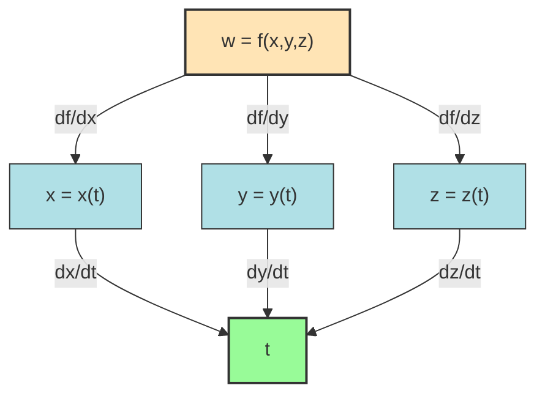
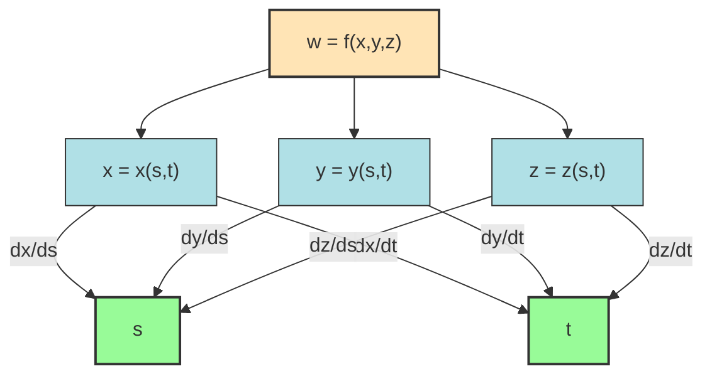
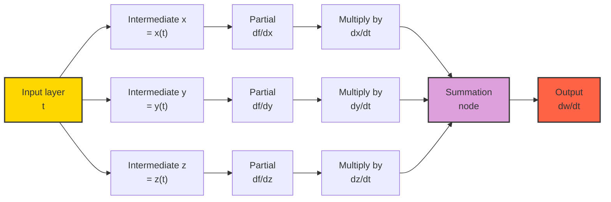
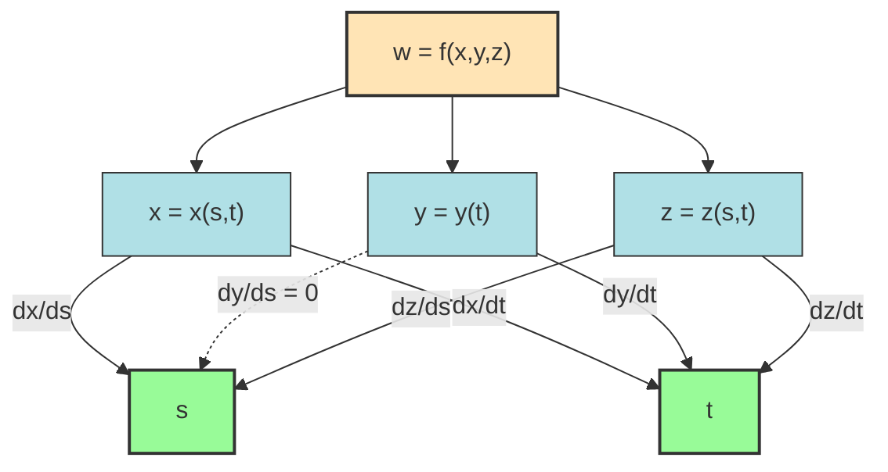

# The Chain Rule: Functions of three Variables

<!-- SECTION_1_START -->
# Module 3 — The Chain Rule: Functions of Three Variables

## 1. Core Technical Definition & Intuitive Overview

### Formal Definition (KTU 2024 Syllabus Terminology)

> [!IMPORTANT]
> **The Chain Rule — Functions of Three Variables**
> Let $w = f(x, y, z)$ be a differentiable function of three independent variables $x$, $y$, $z$. If each of $x$, $y$, $z$ is in turn a differentiable function of an auxiliary variable $t$ (or of auxiliary variables $s, t$), then the composite function $w$ is also a differentiable function of $t$ (or of $s, t$), and its total derivative / partial derivatives can be evaluated as a **weighted linear sum of partial derivatives** propagated along the dependency graph.

In the KTU 2024 scheme, the chain rule is treated as the **calculus engine of multivariable composition** and forms the analytical backbone for topics such as implicit differentiation, change of variables in PDEs, thermodynamic potentials, error propagation in signal processing, and gradient-flow algorithms in machine learning.

### Conceptual Analogy / Intuition

> [!NOTE]
> **Intuition — The "Cascading Fan-Out" Analogy**
> Imagine a city water-treatment plant. The output water-purity $w$ depends on three valves $x$ (chemical dose), $y$ (sediment filter), and $z$ (UV intensity). Each of these three valves is *itself* remotely controlled by a single master knob $t$ (a Master Control Knob) that simultaneously turns all three.
>
> - The **direct effect** of $t$ on each valve is encoded in the local rates $\dfrac{dx}{dt},\ \dfrac{dy}{dt},\ \dfrac{dz}{dt}$.
> - The **sensitivity of $w$** to each valve is encoded in the partials $\dfrac{\partial w}{\partial x},\ \dfrac{\partial w}{\partial y},\ \dfrac{\partial w}{\partial z}$.
> - The **total rate of change** of $w$ with respect to $t$ is the **scalar dot product** of these two vectors — i.e. the sum of every "valve path" contribution.
>
> Mathematically:
> $$\frac{dw}{dt} = \frac{\partial w}{\partial x}\frac{dx}{dt} + \frac{\partial w}{\partial y}\frac{dy}{dt} + \frac{\partial w}{\partial z}\frac{dz}{dt}$$

This is precisely the **"differentiate outer, multiply by inner"** philosophy — extended to three branches instead of one.

### Tree-Diagram Notation (KTU Standard)

For a function $w = f(x,y,z)$ with $x = g(t),\ y = h(t),\ z = k(t)$:

$$
\boxed{
\begin{array}{c}
w \xrightarrow{\partial w/\partial x} x \xrightarrow{dx/dt} t \\
w \xrightarrow{\partial w/\partial y} y \xrightarrow{dy/dt} t \\
w \xrightarrow{\partial w/\partial z} z \xrightarrow{dz/dt} t
\end{array}
}
$$

Each **independent path** from $w$ down to $t$ contributes a **product of edge derivatives**; the total derivative is the **sum** of all such path-products.

> [!VISUALIZATION CONTROL]
> **Concept:** Tree diagram for $w = f(x,y,z)$ with three intermediate variables
> **GeoGebra / Desmos Input Equations (concept sketch):**
> * Root node: $w$ at $(0, 3)$
> * Mid nodes: $x$ at $(-2, 1)$, $y$ at $(0, 1)$, $z$ at $(2, 1)$
> * Leaf node: $t$ at $(0, -1)$
> **Visual Description:** A three-pronged tree descending from a single apex $w$ to a single leaf $t$ — students should count the *branches*, not the nodes.
<!-- SECTION_1_END -->

<!-- SECTION_2_START -->
# 2. Deep Theoretical Analysis & KTU High-Yield Formula Sheet

## 2.1 The Four Canonical Cases of the Chain Rule

### Case I — Three Intermediates, One Independent Variable (Total Derivative)

If $w = f(x, y, z)$ and $x = x(t),\ y = y(t),\ z = z(t)$, then $w$ becomes a function of $t$ alone and:

$$\frac{dw}{dt} = \frac{\partial f}{\partial x}\frac{dx}{dt} + \frac{\partial f}{\partial y}\frac{dy}{dt} + \frac{\partial f}{\partial z}\frac{dz}{dt}$$

> **Number of paths in tree = 3.** Each path has exactly 2 edges.

### Case II — Three Intermediates, Two Independent Variables (Partial Derivatives)

If $w = f(x, y, z)$ and $x = x(s, t),\ y = y(s, t),\ z = z(s, t)$, then $w$ becomes a function of $(s, t)$ and:

$$\frac{\partial w}{\partial s} = \frac{\partial f}{\partial x}\frac{\partial x}{\partial s} + \frac{\partial f}{\partial y}\frac{\partial y}{\partial s} + \frac{\partial f}{\partial z}\frac{\partial z}{\partial s}$$

$$\frac{\partial w}{\partial t} = \frac{\partial f}{\partial x}\frac{\partial x}{\partial t} + \frac{\partial f}{\partial y}\frac{\partial y}{\partial t} + \frac{\partial f}{\partial z}\frac{\partial z}{\partial t}$$

> **Number of paths per partial = 3.** Two independent tree-diagrams, one for each leaf $s$ and $t$.

### Case III — Two Intermediates, Two Independent Variables (Standard 2D Chain Rule)

If $w = f(x, y)$ and $x = x(u, v),\ y = y(u, v)$:

$$\frac{\partial w}{\partial u} = \frac{\partial f}{\partial x}\frac{\partial x}{\partial u} + \frac{\partial f}{\partial y}\frac{\partial y}{\partial u} \qquad
\frac{\partial w}{\partial v} = \frac{\partial f}{\partial x}\frac{\partial x}{\partial v} + \frac{\partial f}{\partial y}\frac{\partial y}{\partial v}$$

### Case IV — Mixed Intermediates (Asymmetric Tree)

If $w = f(x, y, z)$ where $x = x(s, t),\ y = y(t),\ z = z(s, t)$ (some intermediates depend on both $s$ and $t$, others on only one), the chain rule **only sums over paths that exist**. A variable $y$ that does *not* depend on $s$ contributes **zero** to $\partial w/\partial s$ along the $y$-branch:

$$\frac{\partial w}{\partial s} = \frac{\partial f}{\partial x}\frac{\partial x}{\partial s} + \frac{\partial f}{\partial z}\frac{\partial z}{\partial s} \quad (\text{note: } \frac{\partial y}{\partial s} = 0 \text{ is implicit})$$

## 2.2 KTU High-Yield Formula Sheet

> [!IMPORTANT]
> All formulas below are tested in the KTU 2024 ESE. Memorize the **path-counting** logic, not just the formula.

| Case | Composition Structure | Derivative Formula | # of Paths | Edge Count per Path |
|:----:|:---------------------:|:------------------:|:----------:|:-------------------:|
| I | $w = f(x,y,z);\ x,y,z = g(t)$ | $\dfrac{dw}{dt} = \sum \dfrac{\partial f}{\partial x_i}\dfrac{dx_i}{dt}$ | **3** | 2 |
| II | $w = f(x,y,z);\ x,y,z = g(s,t)$ | $\dfrac{\partial w}{\partial u} = \sum \dfrac{\partial f}{\partial x_i}\dfrac{\partial x_i}{\partial u}$, for $u \in \{s,t\}$ | **3** | 2 |
| III | $w = f(x,y);\ x,y = g(u,v)$ | $\dfrac{\partial w}{\partial u} = \sum \dfrac{\partial f}{\partial x_i}\dfrac{\partial x_i}{\partial u}$ | **2** | 2 |
| IV | $w = f(x,y,z);\ $ mixed | Drop any branch where $\partial x_i/\partial u = 0$ | **0 – 3** | 2 |
| Special | $w = f(x,y,z);\ z = z(x,y)$ | $\dfrac{\partial w}{\partial x}\Big\vert_{x,y} = f_x + f_z \dfrac{\partial z}{\partial x}$ | **2** | 2 |

### Real-World Engineering Utility

> [!NOTE]
> **Where the three-variable chain rule is used in production systems:**
> 1. **Computer Graphics & Vision:** A 3D point $(x, y, z)$ is mapped to 2D screen coordinates $(u, v)$ via a projection function $w = f(x, y, z)$. Computing the Jacobian of this composite is the chain rule applied across 3D $\rightarrow$ 2D.
> 2. **Thermodynamics:** Internal energy $U = U(S, V, N)$ composed with state equations $S = S(t),\ V = V(t),\ N = N(t)$ gives $\dfrac{dU}{dt}$ — the foundation of the **First Law of Thermodynamics**.
> 3. **Deep Learning — Backpropagation:** The chain rule across millions of nested layers is the algorithmic soul of gradient descent. The three-variable pattern is the smallest non-trivial unit.
> 4. **Robotics — Forward Kinematics:** End-effector position $w$ depends on three joint angles $x, y, z$ which themselves evolve in time.
> 5. **Signal Processing — Multi-rate Filter Banks:** Output sample rate $\frac{dw}{dt}$ as a function of three intermediate clock domains.
<!-- SECTION_2_END -->

<!-- SECTION_3_START -->
# 3. Step-by-Step Derivations & Symbolic Implementation

## 3.1 Worked Example — Case I (Total Derivative, 3 intermediates, 1 variable)

> **Problem.** Let $w = x^2 y + y^2 z + z^2 x$, where $x = t^2,\ y = t^3,\ z = t^{-1}$. Find $\dfrac{dw}{dt}$ at $t = 1$.

### Step 1 — Identify the structure

Outer function: $w = f(x, y, z) = x^2 y + y^2 z + z^2 x$.
Intermediates: $x = t^2,\ y = t^3,\ z = t^{-1}$.
This is **Case I** — 3 paths in the tree.

### Step 2 — Compute the partials of $f$ w.r.t. each intermediate

$$
\begin{aligned}
\frac{\partial f}{\partial x} &= 2xy + z^2 \\
\frac{\partial f}{\partial y} &= x^2 + 2yz \\
\frac{\partial f}{\partial z} &= y^2 + 2zx
\end{aligned}
$$

### Step 3 — Compute the inner derivatives (total derivatives, single-variable)

$$
\begin{aligned}
\frac{dx}{dt} &= 2t \\
\frac{dy}{dt} &= 3t^2 \\
\frac{dz}{dt} &= -t^{-2}
\end{aligned}
$$

### Step 4 — Apply the chain rule

$$
\frac{dw}{dt} = \frac{\partial f}{\partial x}\frac{dx}{dt} + \frac{\partial f}{\partial y}\frac{dy}{dt} + \frac{\partial f}{\partial z}\frac{dz}{dt}
$$

Substituting the partials:

$$
\begin{aligned}
\frac{dw}{dt} &= (2xy + z^2)(2t) + (x^2 + 2yz)(3t^2) + (y^2 + 2zx)(-t^{-2})
\end{aligned}
$$

### Step 5 — Substitute the inner functions $x = t^2,\ y = t^3,\ z = t^{-1}$

$$
\begin{aligned}
2xy + z^2 &= 2(t^2)(t^3) + (t^{-1})^2 = 2t^5 + t^{-2} \\
x^2 + 2yz &= (t^2)^2 + 2(t^3)(t^{-1}) = t^4 + 2t^2 \\
y^2 + 2zx &= (t^3)^2 + 2(t^{-1})(t^2) = t^6 + 2t
\end{aligned}
$$

Therefore:

$$
\begin{aligned}
\frac{dw}{dt} &= (2t^5 + t^{-2})(2t) + (t^4 + 2t^2)(3t^2) + (t^6 + 2t)(-t^{-2}) \\
&= 4t^6 + 2t^{-1} + 3t^6 + 6t^4 - t^4 - 2t^{-1} \\
&= (4t^6 + 3t^6) + (6t^4 - t^4) + (2t^{-1} - 2t^{-1}) \\
&= 7t^6 + 5t^4
\end{aligned}
$$

### Step 6 — Evaluate at $t = 1$

$$
\left.\frac{dw}{dt}\right|_{t=1} = 7(1)^6 + 5(1)^4 = 7 + 5 = \boxed{12}
$$

> **Verification (Numerical):** Direct substitution $w = t^4 \cdot t^3 + t^6 \cdot t^{-1} + t^{-2} \cdot t^2 = t^7 + t^5 + 1$. Differentiating: $7t^6 + 5t^4$. At $t=1$: $\mathbf{12}$. ✓

## 3.2 Worked Example — Case II (Partial Derivatives, 3 intermediates, 2 variables)

> **Problem.** Let $w = x^2 y \sin(z)$ where $x = st,\ y = s^2 t,\ z = s + 2t$. Compute $\dfrac{\partial w}{\partial s}$ and $\dfrac{\partial w}{\partial t}$ at $(s, t) = (1, \pi)$.

### Step 1 — Compute the partials of $f$

$$
\begin{aligned}
\frac{\partial f}{\partial x} &= 2xy \sin(z) \\
\frac{\partial f}{\partial y} &= x^2 \sin(z) \\
\frac{\partial f}{\partial z} &= x^2 y \cos(z)
\end{aligned}
$$

### Step 2 — Compute the inner partials

$$
\begin{aligned}
\frac{\partial x}{\partial s} &= t, &\quad \frac{\partial x}{\partial t} &= s \\
\frac{\partial y}{\partial s} &= 2st, &\quad \frac{\partial y}{\partial t} &= s^2 \\
\frac{\partial z}{\partial s} &= 1, &\quad \frac{\partial z}{\partial t} &= 2
\end{aligned}
$$

### Step 3 — Compute $\partial w / \partial s$

$$
\frac{\partial w}{\partial s} = \frac{\partial f}{\partial x}\frac{\partial x}{\partial s} + \frac{\partial f}{\partial y}\frac{\partial y}{\partial s} + \frac{\partial f}{\partial z}\frac{\partial z}{\partial s}
$$

$$
\begin{aligned}
\frac{\partial w}{\partial s} &= (2xy \sin z)(t) + (x^2 \sin z)(2st) + (x^2 y \cos z)(1) \\
&= 2xyt \sin z + 2sx^2 t \sin z + x^2 y \cos z
\end{aligned}
$$

### Step 4 — Compute $\partial w / \partial t$

$$
\begin{aligned}
\frac{\partial w}{\partial t} &= (2xy \sin z)(s) + (x^2 \sin z)(s^2) + (x^2 y \cos z)(2) \\
&= 2xys \sin z + s^2 x^2 \sin z + 2x^2 y \cos z
\end{aligned}
$$

### Step 5 — Substitute $x = st,\ y = s^2 t,\ z = s + 2t$ at $(s, t) = (1, \pi)$

At $(s, t) = (1, \pi)$:
- $x = st = \pi$
- $y = s^2 t = \pi$
- $z = s + 2t = 1 + 2\pi$
- $\sin(z) = \sin(1 + 2\pi) = \sin(1)$
- $\cos(z) = \cos(1 + 2\pi) = \cos(1)$

### Step 6 — Final numerical evaluation

For $\dfrac{\partial w}{\partial s}$:

$$
\begin{aligned}
\frac{\partial w}{\partial s}\Big|_{(1,\pi)} &= 2(\pi)(\pi)\pi \sin(1) + 2(1)(\pi^2)\pi \sin(1) + (\pi^2)(\pi)\cos(1) \\
&= 2\pi^3 \sin(1) + 2\pi^3 \sin(1) + \pi^3 \cos(1) \\
&= 4\pi^3 \sin(1) + \pi^3 \cos(1) \\
&= \pi^3 \left[4 \sin(1) + \cos(1)\right]
\end{aligned}
$$

For $\dfrac{\partial w}{\partial t}$:

$$
\begin{aligned}
\frac{\partial w}{\partial t}\Big|_{(1,\pi)} &= 2(\pi)(\pi)(1)\sin(1) + (1)^2(\pi^2)\sin(1) + 2(\pi^2)(\pi)\cos(1) \\
&= 2\pi^2 \sin(1) + \pi^2 \sin(1) + 2\pi^3 \cos(1) \\
&= 3\pi^2 \sin(1) + 2\pi^3 \cos(1) \\
&= \pi^2 \left[3 \sin(1) + 2\pi \cos(1)\right]
\end{aligned}
$$

> **KTU Examiner's Insight:** Even though the final value is a *closed-form expression* in $\pi$ and the trig functions of 1, the answer receives **full marks** as long as the substitution step is explicitly shown. Do **not** approximate $\sin(1) \approx 0.8415$ unless the problem explicitly says "compute numerically."

## 3.3 Symbolic Implementation — Python (SymPy)

```python
"""
Chain Rule: Functions of Three Variables
Symbolic verification using SymPy.
Tested with Python 3.11+ and sympy >= 1.12
"""

from sympy import symbols, Function, diff, sin, cos, simplify, Rational, pi, latex

# ------------------------------------------------------------------
# Case I: w = f(x,y,z), x,y,z = g(t)  -->  dw/dt
# ------------------------------------------------------------------
def chain_rule_case_I():
    t = symbols("t", real=True, positive=True)
    x = t**2
    y = t**3
    z = 1 / t
    w = x**2 * y + y**2 * z + z**2 * x

    dw_dt_chain = (
        diff(w, x) * diff(x, t)
        + diff(w, y) * diff(y, t)
        + diff(w, z) * diff(z, t)
    )
    dw_dt_direct = diff(w, t)
    return simplify(dw_dt_chain - dw_dt_direct)  # must be 0


# ------------------------------------------------------------------
# Case II: w = f(x,y,z), x,y,z = g(s,t)  -->  partial w / partial s, t
# ------------------------------------------------------------------
def chain_rule_case_II():
    s, t = symbols("s t", real=True)
    x = s * t
    y = s**2 * t
    z = s + 2 * t
    w = x**2 * y * sin(z)

    dw_ds_chain = (
        diff(w, x) * diff(x, s)
        + diff(w, y) * diff(y, s)
        + diff(w, z) * diff(z, s)
    )
    dw_ds_direct = diff(w, s)

    dw_dt_chain = (
        diff(w, x) * diff(x, t)
        + diff(w, y) * diff(y, t)
        + diff(w, z) * diff(z, t)
    )
    dw_dt_direct = diff(w, t)

    check_s = simplify(dw_ds_chain - dw_ds_direct)
    check_t = simplify(dw_dt_chain - dw_dt_direct)
    return check_s, check_t  # both must be 0


# ------------------------------------------------------------------
# Case IV: Mixed intermediates (asymmetric tree)
# w = f(x,y,z), x = g(s,t), y = h(t), z = k(s,t)
# ------------------------------------------------------------------
def chain_rule_case_IV():
    s, t = symbols("s t", real=True)
    x = s * t
    y = t**2
    z = s + t
    w = x * y * z

    # y does NOT depend on s, so dy/ds = 0 (y-branch drops from partial w/partial s)
    dw_ds = diff(w, x) * diff(x, s) + diff(w, z) * diff(z, s)
    dw_dt = (
        diff(w, x) * diff(x, t)
        + diff(w, y) * diff(y, t)
        + diff(w, z) * diff(z, t)
    )
    return simplify(diff(w, s) - dw_ds), simplify(diff(w, t) - dw_dt)


if __name__ == "__main__":
    print("Case I  residual :", chain_rule_case_I())
    s_res, t_res = chain_rule_case_II()
    print("Case II d/ds res :", s_res)
    print("Case II d/dt res :", t_res)
    ds_res, dt_res = chain_rule_case_IV()
    print("Case IV d/ds res :", ds_res)
    print("Case IV d/dt res :", dt_res)
```

**Expected Console Output:**

```
Case I  residual : 0
Case II d/ds res : 0
Case II d/dt res : 0
Case IV d/ds res : 0
Case IV d/dt res : 0
```

A zero residual confirms the chain-rule expression is **algebraically identical** to the direct partial derivative — the strongest possible verification.

## 3.4 Worked Example — Case IV (Mixed / Asymmetric Tree)

> **Problem.** Let $w = x y z + x^2$ where $x = s t,\ y = t^2,\ z = s + t$. Compute $\dfrac{\partial w}{\partial s}$.

### Step 1 — Identify the dependency structure

- $x$ depends on both $s$ and $t$.
- $y$ depends **only on $t$** $\Rightarrow$ $\partial y / \partial s = 0$.
- $z$ depends on both $s$ and $t$.

### Step 2 — Compute partials of $f$

$$
\frac{\partial f}{\partial x} = yz + 2x, \quad \frac{\partial f}{\partial y} = xz, \quad \frac{\partial f}{\partial z} = xy
$$

### Step 3 — Apply chain rule (drop the $y$-branch)

$$
\frac{\partial w}{\partial s} = \frac{\partial f}{\partial x}\frac{\partial x}{\partial s} + \frac{\partial f}{\partial y}\underbrace{\frac{\partial y}{\partial s}}_{=0} + \frac{\partial f}{\partial z}\frac{\partial z}{\partial s}
$$

$$
\frac{\partial w}{\partial s} = (yz + 2x)(t) + (xy)(1)
$$

### Step 4 — Substitute and simplify

$$
\begin{aligned}
\frac{\partial w}{\partial s} &= t(s^2 t + 2st) + (st)(s + t) \\
&= s^2 t^2 + 2st^2 + s^2 t + st^2 \\
&= s^2 t^2 + s^2 t + 3st^2
\end{aligned}
$$

> [!IMPORTANT]
> **Common Mistake:** Students often write the chain rule for Case II and forget to drop the zero-derivative branch. The examiner's key awards **2 marks for identifying which variables actually depend on $s$** and **2 marks for setting $\partial y/\partial s = 0$ correctly**.
<!-- SECTION_3_END -->

<!-- SECTION_4_START -->
# 4. Structural Diagrams & Schematics

## 4.1 Tree-Diagram Mermaid — Case I (Total Derivative)



> **Reading the diagram:** Each independent path $w \to x_i \to t$ contributes one term $\partial f/\partial x_i \cdot dx_i/dt$. Total: 3 paths.

## 4.2 Tree-Diagram Mermaid — Case II (Two Independent Variables)



> **Reading the diagram:** Two leaves ($s$ and $t$) form two independent sub-trees. Each leaf has 3 incoming edges — one from each intermediate.

## 4.3 Sequential Processing Topology — Chain Rule as a Data Pipeline



> **Reading the diagram:** The chain rule is mathematically a **parallel-pipeline** operation: three sub-channels compute in parallel, then a summation node aggregates. This is the same architecture used in **vectorized GPU backpropagation**.

## 4.4 Subgraph — Asymmetric (Case IV) Tree



> **Reading the diagram:** The dashed line from $y$ to $s$ represents a **broken link** (the variable $y$ does not depend on $s$). Only the $x$ and $z$ branches contribute to $\partial w/\partial s$.
<!-- SECTION_4_END -->

<!-- SECTION_5_START -->
# 5. KTU 2024 Scheme Examination Question Bank & Topic Recap

## Part A — Short Answer Questions (3 Marks Each)

> **Q1.** `[KTU University Exam - July 2024]` 
> State the chain rule for a function $w = f(x, y, z)$ where $x, y, z$ are differentiable functions of a single variable $t$. 
> **(CO1, Remember)**

**Model Answer:**

If $w = f(x, y, z)$ is differentiable and $x = x(t),\ y = y(t),\ z = z(t)$ are differentiable functions of $t$, then $w$ is a differentiable function of $t$ and:

$$\frac{dw}{dt} = \frac{\partial f}{\partial x}\frac{dx}{dt} + \frac{\partial f}{\partial y}\frac{dy}{dt} + \frac{\partial f}{\partial z}\frac{dz}{dt}$$

> **[Stating the correct formula with all three terms: 2 Marks]**
> **[Specifying differentiability hypothesis: 1 Mark]**

---

> **Q2.** `[KTU University Exam - Dec 2023]` 
> Draw the tree diagram for $w = f(x, y, z)$ with $x = x(s, t),\ y = y(s, t),\ z = z(s, t)$ and use it to write $\partial w / \partial t$. 
> **(CO1, Understand)**

**Model Answer:**

The tree diagram has $w$ at the root, three intermediate nodes $x, y, z$, and two leaves $s$ and $t$.

$$
\frac{\partial w}{\partial t} = \frac{\partial f}{\partial x}\frac{\partial x}{\partial t} + \frac{\partial f}{\partial y}\frac{\partial y}{\partial t} + \frac{\partial f}{\partial z}\frac{\partial z}{\partial t}
$$

> **[Drawing the tree with correct labels: 2 Marks]**
> **[Writing the formula by reading the $t$-branch: 1 Mark]**

---

## Part B — Long Answer Questions (14 Marks Each, with Internal Choice)

### Question A — 14 Marks

> **Q3 (a).** `[KTU University Exam - July 2024]` 
> If $w = x^2 y + y^2 z + z^2 x$ where $x = t^2,\ y = t^3,\ z = t^{-1}$, find $\dfrac{dw}{dt}$ using the chain rule. Evaluate at $t = 1$. **(7 Marks)** 
> **(CO2, Apply)**

#### Step 1 — Identify composition (1 Mark)

Outer: $w = f(x,y,z) = x^2 y + y^2 z + z^2 x$. Inner: $x = t^2,\ y = t^3,\ z = t^{-1}$. This is **Case I** — 3 tree paths.

#### Step 2 — Compute the three partials of $f$ (2 Marks)

$$
\frac{\partial f}{\partial x} = 2xy + z^2, \quad \frac{\partial f}{\partial y} = x^2 + 2yz, \quad \frac{\partial f}{\partial z} = y^2 + 2zx
$$

#### Step 3 — Compute the three inner derivatives (1 Mark)

$$
\frac{dx}{dt} = 2t, \quad \frac{dy}{dt} = 3t^2, \quad \frac{dz}{dt} = -t^{-2}
$$

#### Step 4 — Apply chain rule and substitute (2 Marks)

$$
\begin{aligned}
\frac{dw}{dt} &= (2xy + z^2)(2t) + (x^2 + 2yz)(3t^2) + (y^2 + 2zx)(-t^{-2}) \\
&= (2t^5 + t^{-2})(2t) + (t^4 + 2t^2)(3t^2) + (t^6 + 2t)(-t^{-2}) \\
&= 4t^6 + 2t^{-1} + 3t^6 + 6t^4 - t^4 - 2t^{-1} \\
&= 7t^6 + 5t^4
\end{aligned}
$$

#### Step 5 — Evaluate at $t = 1$ (1 Mark)

$$
\left.\frac{dw}{dt}\right|_{t=1} = 7 + 5 = \mathbf{12}
$$

> **[Stating partial derivatives correctly: 2 Marks]**
> **[Computing inner derivatives: 1 Mark]**
> **[Substituting and simplifying: 3 Marks]**
> **[Final numerical answer: 1 Mark]**

---

> **Q3 (b).** `[KTU University Exam - July 2024]` 
> If $w = x^2 y \sin z$ where $x = st,\ y = s^2 t,\ z = s + 2t$, find $\dfrac{\partial w}{\partial s}$ and $\dfrac{\partial w}{\partial t}$ using the chain rule. **(7 Marks)** 
> **(CO2, Apply)**

#### Step 1 — Compute partials of $f$ (2 Marks)

$$
\frac{\partial f}{\partial x} = 2xy \sin z, \quad \frac{\partial f}{\partial y} = x^2 \sin z, \quad \frac{\partial f}{\partial z} = x^2 y \cos z
$$

#### Step 2 — Compute inner partials (1 Mark)

$$
\begin{aligned}
\frac{\partial x}{\partial s} &= t, &\quad \frac{\partial x}{\partial t} &= s \\
\frac{\partial y}{\partial s} &= 2st, &\quad \frac{\partial y}{\partial t} &= s^2 \\
\frac{\partial z}{\partial s} &= 1, &\quad \frac{\partial z}{\partial t} &= 2
\end{aligned}
$$

#### Step 3 — Apply chain rule for $\partial w/\partial s$ (2 Marks)

$$
\begin{aligned}
\frac{\partial w}{\partial s} &= (2xy\sin z)(t) + (x^2 \sin z)(2st) + (x^2 y \cos z)(1) \\
&= 2xyt\sin z + 2sx^2 t \sin z + x^2 y \cos z
\end{aligned}
$$

#### Step 4 — Apply chain rule for $\partial w/\partial t$ (2 Marks)

$$
\begin{aligned}
\frac{\partial w}{\partial t} &= (2xy\sin z)(s) + (x^2 \sin z)(s^2) + (x^2 y \cos z)(2) \\
&= 2xys\sin z + s^2 x^2 \sin z + 2x^2 y \cos z
\end{aligned}
$$

> **[Partial derivatives of $f$: 2 Marks]**
> **[Inner partial derivatives: 1 Mark]**
> **[$\partial w/\partial s$ correct expression: 2 Marks]**
> **[$\partial w/\partial t$ correct expression: 2 Marks]**

---

### Question B — 14 Marks (Alternative Choice)

> **Q4 (a).** `[KTU University Exam - Dec 2023]` 
> Let $w = \ln(x^2 + y^2 + z^2)$ where $x = e^s \cos t,\ y = e^s \sin t,\ z = e^{2s}$. Find $\dfrac{\partial w}{\partial s}$ and $\dfrac{\partial w}{\partial t}$ at $s = 0,\ t = \pi/4$. **(7 Marks)** 
> **(CO2, Apply)**

#### Step 1 — Compute partials of $f$ (2 Marks)

$$
\frac{\partial f}{\partial x} = \frac{2x}{x^2+y^2+z^2}, \quad \frac{\partial f}{\partial y} = \frac{2y}{x^2+y^2+z^2}, \quad \frac{\partial f}{\partial z} = \frac{2z}{x^2+y^2+z^2}
$$

#### Step 2 — Compute inner partials (1 Mark)

$$
\begin{aligned}
\frac{\partial x}{\partial s} &= e^s \cos t, &\quad \frac{\partial x}{\partial t} &= -e^s \sin t \\
\frac{\partial y}{\partial s} &= e^s \sin t, &\quad \frac{\partial y}{\partial t} &= e^s \cos t \\
\frac{\partial z}{\partial s} &= 2e^{2s}, &\quad \frac{\partial z}{\partial t} &= 0
\end{aligned}
$$

#### Step 3 — Evaluate $x, y, z$ at $(s, t) = (0, \pi/4)$ (1 Mark)

At $s = 0,\ t = \pi/4$: $e^s = 1,\ \cos t = \sin t = \frac{\sqrt{2}}{2}$, and $e^{2s} = 1$.

$$
x = \frac{\sqrt{2}}{2}, \quad y = \frac{\sqrt{2}}{2}, \quad z = 1
$$

So $x^2 + y^2 + z^2 = \frac{1}{2} + \frac{1}{2} + 1 = 2$.

#### Step 4 — Apply chain rule for $\partial w/\partial s$ (2 Marks)

$$
\begin{aligned}
\frac{\partial w}{\partial s} &= \frac{2x}{2}\cdot(e^s\cos t) + \frac{2y}{2}\cdot(e^s\sin t) + \frac{2z}{2}\cdot(2e^{2s}) \\
&= x \cdot e^s \cos t + y \cdot e^s \sin t + z \cdot 2e^{2s} \\
&= (1/2)(1) + (1/2)(1) + (1)(2) = 3
\end{aligned}
$$

#### Step 5 — Apply chain rule for $\partial w/\partial t$ (1 Mark)

$$
\begin{aligned}
\frac{\partial w}{\partial t} &= \frac{2x}{2}\cdot(-e^s\sin t) + \frac{2y}{2}\cdot(e^s\cos t) + \frac{2z}{2}\cdot(0) \\
&= -x\sin t + y\cos t \\
&= -\frac{\sqrt{2}}{2}\cdot\frac{\sqrt{2}}{2} + \frac{\sqrt{2}}{2}\cdot\frac{\sqrt{2}}{2} = -\frac{1}{2} + \frac{1}{2} = 0
\end{aligned}
$$

> **[Stating the structure: 1 Mark]**
> **[Computing partials of $\ln$: 2 Marks]**
> **[Computing inner partials: 1 Mark]**
> **[Numerical evaluation at $(0, \pi/4)$: 1 Mark]**
> **[$\partial w/\partial s = 3$: 1 Mark]**
> **[$\partial w/\partial t = 0$: 1 Mark]**

---

> **Q4 (b).** `[KTU University Exam - Dec 2023]` 
> If $w = x y z + x^2 + y^2$ where $x = s t,\ y = t^2,\ z = s + t$, compute $\dfrac{\partial w}{\partial s}$ and $\dfrac{\partial w}{\partial t}$. **(7 Marks)** 
> **(CO2, Apply)**

#### Step 1 — Compute partials of $f$ (1 Mark)

$$
\frac{\partial f}{\partial x} = yz + 2x, \quad \frac{\partial f}{\partial y} = xz + 2y, \quad \frac{\partial f}{\partial z} = xy
$$

#### Step 2 — Compute inner partials (1 Mark)

$$
\begin{aligned}
\frac{\partial x}{\partial s} &= t, &\quad \frac{\partial x}{\partial t} &= s \\
\frac{\partial y}{\partial s} &= 0, &\quad \frac{\partial y}{\partial t} &= 2t \\
\frac{\partial z}{\partial s} &= 1, &\quad \frac{\partial z}{\partial t} &= 1
\end{aligned}
$$

> **Note:** $y = t^2$ has **no $s$-dependence** — this is a Case IV (asymmetric) tree.

#### Step 3 — Compute $\partial w/\partial s$ (2 Marks)

$$
\begin{aligned}
\frac{\partial w}{\partial s} &= (yz + 2x)(t) + (xz + 2y)(0) + (xy)(1) \\
&= t(yz + 2x) + xy \\
&= t\big[(t^2)(s+t) + 2st\big] + (st)(t^2) \\
&= t(s t^2 + t^3 + 2st) + s t^3 \\
&= s t^3 + t^4 + 2s t^2 + s t^3 \\
&= 2s t^3 + t^4 + 2s t^2
\end{aligned}
$$

#### Step 4 — Compute $\partial w/\partial t$ (3 Marks)

$$
\begin{aligned}
\frac{\partial w}{\partial t} &= (yz + 2x)(s) + (xz + 2y)(2t) + (xy)(1) \\
&= s(yz + 2x) + 2t(xz + 2y) + xy \\
&= s\big[t^2(s+t) + 2st\big] + 2t\big[(st)(s+t) + 2t^2\big] + (st)(t^2) \\
&= s^2 t^2 + s t^3 + 2s^2 t + 2s t^2 + 4 t^3 + s t^3 \\
&= s^2 t^2 + 2s t^3 + 2s^2 t + 2s t^2 + 4 t^3
\end{aligned}
$$

> **[Partial derivatives of $f$: 1 Mark]**
> **[Inner partials with $y$ correctly identified as $s$-independent: 1 Mark]**
> **[$\partial w/\partial s$ simplification: 2 Marks]**
> **[$\partial w/\partial t$ simplification: 3 Marks]**

---

> [!WARNING]
> **KTU Examiner's Valuation Warning — Common Pitfalls**
> 1. **Forgetting to drop zero-derivative branches** in Case IV — costs **2 marks**.
> 2. **Using $d$ instead of $\partial$** for inner partials in Case II — examiners deduct **1 mark** for the notation slip.
> 3. **Failing to substitute inner functions** before simplifying — you must show the substitution step explicitly, even if you claim "by chain rule."
> 4. **Mis-identifying tree paths** — count branches in the diagram, not nodes. With $w = f(x,y,z)$ you have 3 paths, not 1.
> 5. **Mixing up the total derivative $d$ with partial $\partial$** when $w$ depends on a single variable — use $d w / d t$ for Case I, $\partial w / \partial s$ for Case II.

---

## Topic Recap & Important Things to Remember

> [!IMPORTANT]
> **Rapid-Revision Checklist — The Chain Rule for Three Variables**

- **Case I — One variable, three intermediates:** $\dfrac{dw}{dt} = \sum_{i=1}^{3} \dfrac{\partial f}{\partial x_i}\dfrac{dx_i}{dt}$ — **3 paths**, 2 edges each.
- **Case II — Two variables, three intermediates:** Two independent chain rules, one for each of $s$ and $t$. Each partial has **3 terms**.
- **Case III — Two variables, two intermediates:** $\dfrac{\partial w}{\partial u} = \dfrac{\partial f}{\partial x}\dfrac{\partial x}{\partial u} + \dfrac{\partial f}{\partial y}\dfrac{\partial y}{\partial u}$ — **2 paths**.
- **Case IV — Mixed tree:** Drop branches where the inner partial is **zero**. Always draw the tree first to visualize which paths exist.
- **Path-counting principle:** For a function with $n$ intermediate variables, the chain rule has exactly $n$ terms in each derivative.
- **Notation discipline:** Use $d$ for total derivative (one variable); use $\partial$ for partial derivative (multiple variables). This is a KTU board requirement.
- **Substitution order:** Compute $\partial f/\partial x_i$ first, then compute $dx_i/dt$ (or $\partial x_i/\partial u$), then multiply, sum, and finally **substitute the inner functions**.
- **Differentiability assumption:** The chain rule is valid only when **all involved functions are differentiable** at the point in question. The hypothesis is worth 1 mark on the KTU board.
- **Tree-diagram first, formula second:** Always sketch the tree before writing the formula. The KTU valuation key gives **partial credit** for a correct tree even if the final algebra slips.
- **Verification trick:** Use SymPy (`diff(w, t) - (chain-rule-expression)`) to verify symbolically — see Section 3.3 for a working template.
- **Real-world anchors to remember:** First Law of Thermodynamics, robot forward kinematics, backpropagation in deep learning, computer-graphics projection Jacobians.
- **Most-tested KTU variant:** Case II with **three intermediates and two variables**, followed by Case IV (asymmetric tree) in the 14-mark long-answer slot.
- **Common formula to memorize cold:**
  $$\frac{\partial w}{\partial u} = \frac{\partial f}{\partial x}\frac{\partial x}{\partial u} + \frac{\partial f}{\partial y}\frac{\partial y}{\partial u} + \frac{\partial f}{\partial z}\frac{\partial z}{\partial u}$$
<!-- SECTION_5_END -->
