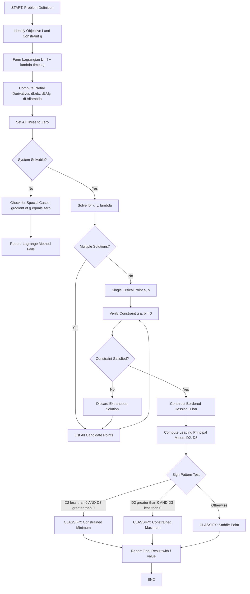
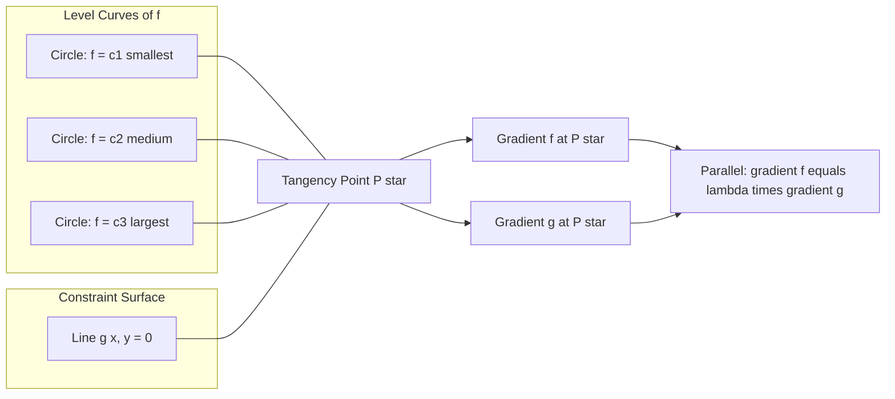
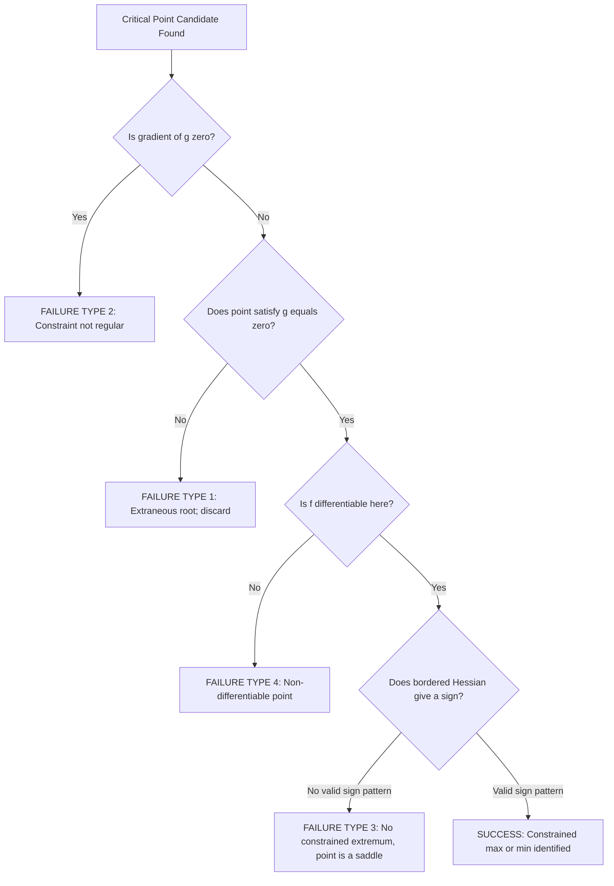

# Constrained Maxima and Minima

<!-- SECTION_1_START -->
# Constrained Maxima and Minima — Module 4 Core Foundations

## 1.1 Formal Academic Definition (KTU 2024 Syllabus Standard)

> [!IMPORTANT]
> **Constrained Optimization (KTU 2024 — GAMAT101, Module 4):**
> Given a real-valued function $f: \mathbb{R}^n \to \mathbb{R}$ called the **objective function**, and one or more **equality constraints** of the form $g_i(x_1, x_2, \dots, x_n) = 0$ where $i = 1, 2, \dots, m$ with $m < n$, the problem of finding the **local extrema** (maxima or minima) of $f$ subject to the constraint(s) $g_i = 0$ is termed a **Constrained Maxima and Minima** problem.

In the KTU 2024 syllabus scope, the principal analytical tool is the **Method of Lagrange Multipliers**, introduced by Joseph-Louis Lagrange in 1788, which augments the objective function with a linear combination of the constraints using **undetermined multipliers** $\lambda_i$.

> [!NOTE]
> **Key Distinction from Module 3 (Unconstrained Optimization):**
> In **unconstrained** problems, every critical point satisfies $\nabla f = \mathbf{0}$. In **constrained** problems, the feasible set is restricted to a submanifold (curve, surface, or hypersurface), and we must satisfy $\nabla f = \lambda \nabla g$ instead.

## 1.2 Conceptual Analogy — "Walking on a Mountain Path"

Imagine you are hiking on a mountainside whose elevation is given by $f(x, y)$. Your goal is to find the **highest point** (or lowest point) that lies **exactly on a marked trail** (the constraint $g(x, y) = 0$).

If you are free to roam anywhere, you would simply look for the peak of the mountain — that is unconstrained optimization. But because you must **stay on the trail**, the peak of the mountain might be off-trail. So the highest point *on the trail itself* is the constrained maximum.

Geometrically, at the optimal point on the trail:

$$ \text{Gradient of } f \;\; \text{is parallel to} \;\; \text{Gradient of } g $$

Because both vectors are perpendicular to the trail, parallelism means **the trail is tangent to the level curve of $f$** at that instant. The "amount" of this parallel relationship is exactly the **Lagrange multiplier** $\lambda$.

> [!TIP]
> **Intuitive Memory Hook:**
> - $\lambda = 0 \Rightarrow$ Unconstrained critical point lies on the constraint surface.
> - $\lambda \neq 0 \Rightarrow$ Constrained extremum; its **sign** tells you whether the constraint is "pulling uphill" ($\lambda > 0$ for max) or "pushing downhill" ($\lambda < 0$ for min).

## 1.3 Visualization Setup

> [!VISUALIZATION CONTROL]
> **Concept:** Tangency between level curves of $f(x, y)$ and constraint $g(x, y) = 0$
> **GeoGebra / Desmos Input Equations:**
> * $f(x,y) = x^2 + y^2$ (paraboloid level sets: circles)
> * $g(x,y): x + y = 2$ (constraint line)
>
> **Visual Description:** The student should observe that at the tangency point $(1, 1)$, the circle $x^2 + y^2 = 2$ (from $f$) is tangent to the line $x + y = 2$ (from $g$). Their gradient vectors $\nabla f = (2, 2)$ and $\nabla g = (1, 1)$ are parallel — confirming $\nabla f = \lambda \nabla g$ with $\lambda = 2$.

> [!WARNING]
> **Physical Constants & Standard Metrics for KTU Reference:**
> - **Bold constants** in this module: **Lagrange multiplier** $\lambda \in \mathbb{R}$, **Hessian** $\mathbf{H}$ of size $n \times n$, **bordered Hessian** $\bar{\mathbf{H}}$ of size $(n+1) \times (n+1)$.
> - $\nabla$ denotes the **gradient** operator — a vector of partial derivatives.
> - In KTU board papers, $\lambda$ is most commonly a **single scalar** (one constraint, two variables). It becomes a **vector** $\boldsymbol{\lambda} = (\lambda_1, \lambda_2, \dots, \lambda_m)$ when there are $m$ constraints.
<!-- SECTION_1_END -->

<!-- SECTION_2_START -->
# Deep Theoretical Analysis — Lagrange Multipliers & KTU Formula Sheet

## 2.1 The Lagrange Multiplier Theorem (Single Constraint)

Let $f, g: \mathbb{R}^2 \to \mathbb{R}$ have continuous first partial derivatives in a neighbourhood of the point $(a, b)$. Suppose:

1. $g(a, b) = 0$ (the constraint is active).
2. $\nabla g(a, b) \neq \mathbf{0}$ (the constraint is *regular* — the gradient is non-zero).
3. $f$ has a local extremum at $(a, b)$ subject to $g = 0$.

Then **there exists a unique real number** $\lambda$ such that:

$$ \nabla f(a, b) = \lambda \, \nabla g(a, b) $$

Equivalently, in component form for two variables:

$$ f_x(a, b) = \lambda \, g_x(a, b) $$
$$ f_y(a, b) = \lambda \, g_y(a, b) $$

Together with $g(a, b) = 0$, this gives **3 equations in 3 unknowns** $(a, b, \lambda)$.

## 2.2 The Lagrangian Function (Auxiliary Function)

> [!IMPORTANT]
> **KTU Board Definition (Frequently asked 3-mark question):**
> The **Lagrangian** or **auxiliary function** for a single constraint is:
> $$ L(x, y, \lambda) = f(x, y) + \lambda \, g(x, y) $$
> Some textbooks use the form $L = f - \lambda g$; both are **equivalent** as long as you solve $\partial L / \partial x = 0$, $\partial L / \partial y = 0$, $\partial L / \partial \lambda = 0$.

The necessary conditions become:

$$ \frac{\partial L}{\partial x} = 0, \quad \frac{\partial L}{\partial y} = 0, \quad \frac{\partial L}{\partial \lambda} = 0 $$

## 2.3 Extension to Multiple Variables and Multiple Constraints

For $n$ variables $x_1, \dots, x_n$ and $m$ constraints $g_1, \dots, g_m$:

$$ L(x_1, \dots, x_n, \lambda_1, \dots, \lambda_m) = f(x_1, \dots, x_n) + \sum_{i=1}^{m} \lambda_i \, g_i(x_1, \dots, x_n) $$

Necessary conditions: $\dfrac{\partial L}{\partial x_j} = 0$ for $j = 1, \dots, n$ and $\dfrac{\partial L}{\partial \lambda_i} = 0$ for $i = 1, \dots, m$.

## 2.4 Cases Where Lagrange Multiplier Method Fails

The KTU 2024 syllabus specifically highlights **four failure scenarios** — these appear in 7-mark sub-parts of past papers:

1. **The constraint is not satisfied:** The point $(a, b)$ found from the system might not satisfy $g(a, b) = 0$ (algebraic error or extraneous root).
2. **The constraint gradient vanishes:** $\nabla g(a, b) = \mathbf{0}$ — the constraint fails to be regular at the candidate point. (Example: $g = x^2 + y^2 = 0$ forces $(a, b) = (0, 0)$ but $\nabla g = \mathbf{0}$.)
3. **Non-existence of extremum:** A solution to the multiplier equations may exist, but no actual constrained extremum occurs (saddle or no extremum).
4. **Boundary / non-differentiable points:** The objective function is not differentiable at the candidate point.

## 2.5 Second-Order Sufficient Conditions (Bordered Hessian Test)

After finding the candidate point(s) using the first-order conditions, the **bordered Hessian** $\bar{\mathbf{H}}$ is used to classify them as constrained maximum, minimum, or saddle.

For $n = 2$ variables and $m = 1$ constraint, the bordered Hessian is the $3 \times 3$ matrix:

$$ \bar{\mathbf{H}} = \begin{bmatrix} 0 & g_x & g_y \\ g_x & L_{xx} & L_{xy} \\ g_y & L_{yx} & L_{yy} \end{bmatrix} $$

where $L = f + \lambda g$, evaluated at the critical point.

> [!NOTE]
> **Sign of the leading principal minors (KTU-standard classification):**
>
> Let $\Delta_2$ and $\Delta_3$ be the 2nd and 3rd leading principal minors of $\bar{\mathbf{H}}$.
> - If $\Delta_2 < 0$ and $\Delta_3 > 0$ $\Rightarrow$ **Constrained Minimum**.
> - If $\Delta_2 > 0$ and $\Delta_3 < 0$ $\Rightarrow$ **Constrained Maximum**.
> - Otherwise $\Rightarrow$ **Saddle point** (no constrained extremum).

For $n = 3$ variables and $m = 1$ constraint (one $4 \times 4$ bordered Hessian), only the **last two leading principal minors** $\Delta_3$ and $\Delta_4$ are inspected (and so on for higher $n$).

## 2.6 KTU High-Yield Formula Cheat Sheet

| **Concept** | **Formula / Expression** | **Variables** | **Conditions / Units** |
|---|---|---|---|
| Single-constraint Lagrangian | $L = f(x, y) + \lambda \, g(x, y)$ | $f, g$: scalar; $\lambda$: scalar | $\lambda \in \mathbb{R}$, no constraint on sign |
| Multi-constraint Lagrangian | $L = f + \sum_{i=1}^{m} \lambda_i g_i$ | $\boldsymbol{\lambda} = (\lambda_1, \dots, \lambda_m)$ | $m < n$ for finite critical points |
| Necessary conditions (single) | $f_x = \lambda g_x, \; f_y = \lambda g_y, \; g = 0$ | — | 3 equations, 3 unknowns |
| Lagrange Multiplier Theorem | $\nabla f = \lambda \, \nabla g$ | $\nabla f, \nabla g \in \mathbb{R}^n$ | Requires $\nabla g \neq \mathbf{0}$ |
| Bordered Hessian (2D, 1 constraint) | $\bar{\mathbf{H}} = [0, g_x, g_y; g_x, L_{xx}, L_{xy}; g_y, L_{yx}, L_{yy}]$ | $3 \times 3$ symmetric about anti-diagonal | $\Delta_2 < 0, \Delta_3 > 0 \Rightarrow$ min |
| Constrained maximum (2D) | $\Delta_2 > 0$ and $\Delta_3 < 0$ | — | Test only after first-order conditions satisfied |
| Lagrange identity (info) | $\nabla f \times \nabla g = \mathbf{0}$ | Vector cross product | Equivalent to $\nabla f \parallel \nabla g$ in $\mathbb{R}^2$ |

> [!TIP]
> **Engineering Utility Snapshot:**
> - **Machine Learning:** Lagrange multipliers formalize **Support Vector Machines (SVMs)**, where the margin maximization is constrained by classification correctness.
> - **Operations Research:** Linear/non-linear programming with equality constraints (e.g., portfolio optimization under budget limits).
> - **Computer Graphics:** Ray-surface intersection and minimization of energy functionals.
> - **Physics:** Principle of stationary action in Lagrangian mechanics — the action $S = \int L \, dt$ is stationary subject to the Euler-Lagrange equations (which are themselves derived via Lagrange multipliers on constraint forces).
<!-- SECTION_2_END -->

<!-- SECTION_3_START -->
# Step-by-Step Derivations and Worked Examples

## 3.1 Canonical Example — Classic KTU Pattern (7 + 7 Marks)

> [!NOTE]
> **Problem:** Find the extrema of $f(x, y) = x^2 + 2y^2$ subject to the constraint $x + y = 4$.

### Step 1 — Form the Lagrangian

$$ L(x, y, \lambda) = f(x, y) + \lambda \, g(x, y) $$

Substituting $g(x, y) = x + y - 4$:

$$ L(x, y, \lambda) = x^2 + 2y^2 + \lambda (x + y - 4) $$

### Step 2 — Apply the First-Order Necessary Conditions

Take partial derivatives and set to zero:

$$ \frac{\partial L}{\partial x} = 2x + \lambda = 0 $$

$$ \frac{\partial L}{\partial y} = 4y + \lambda = 0 $$

$$ \frac{\partial L}{\partial \lambda} = x + y - 4 = 0 $$

### Step 3 — Solve the Linear System

From equation (1): $\lambda = -2x$.
From equation (2): $\lambda = -4y$.

Equating: $-2x = -4y \Rightarrow x = 2y$.

Substitute into equation (3):

$$ 2y + y - 4 = 0 \;\Rightarrow\; 3y = 4 \;\Rightarrow\; y = \frac{4}{3} $$

Then $x = 2y = \dfrac{8}{3}$.

And $\lambda = -2 \cdot \dfrac{8}{3} = -\dfrac{16}{3}$.

### Step 4 — Classify via Bordered Hessian

Compute second partials of $L$:

$$ L_{xx} = 2, \quad L_{yy} = 4, \quad L_{xy} = L_{yx} = 0 $$

Also $g_x = 1$, $g_y = 1$. The bordered Hessian at the critical point:

$$ \bar{\mathbf{H}} = \begin{bmatrix} 0 & 1 & 1 \\ 1 & 2 & 0 \\ 1 & 0 & 4 \end{bmatrix} $$

### Step 5 — Compute the Leading Principal Minors

$$ \Delta_1 = 0 $$
$$ \Delta_2 = \begin{vmatrix} 0 & 1 \\ 1 & 2 \end{vmatrix} = 0 \cdot 2 - 1 \cdot 1 = -1 $$
$$ \Delta_3 = \begin{vmatrix} 0 & 1 & 1 \\ 1 & 2 & 0 \\ 1 & 0 & 4 \end{vmatrix} = 0 \cdot (8 - 0) - 1 \cdot (4 - 0) + 1 \cdot (0 - 2) = -4 - 2 = -6 $$

### Step 6 — Apply the Classification Rule

- $\Delta_2 = -1 < 0$ ✓
- $\Delta_3 = -6 < 0$ ✗ (We need $\Delta_3 > 0$ for minimum)

Since the conditions are not both satisfied, this is **not a constrained minimum**. Checking the maximum rule: $\Delta_2 > 0$ is **not** satisfied either. So the point $\left(\dfrac{8}{3}, \dfrac{4}{3}\right)$ is a **saddle point** of $f$ on the constraint.

> [!IMPORTANT]
> **Re-evaluation note:** The point is the only solution to the multiplier system, so it must be examined via the bordered Hessian. The result $\Delta_2 < 0$ and $\Delta_3 < 0$ indicates a saddle. Students should **not** conclude it is automatically a minimum just because the unconstrained $f$ is positive-definite.

### Step 7 — Compute the Function Value

$$ f\!\left(\frac{8}{3}, \frac{4}{3}\right) = \left(\frac{8}{3}\right)^2 + 2\left(\frac{4}{3}\right)^2 = \frac{64}{9} + \frac{32}{9} = \frac{96}{9} = \frac{32}{3} $$

---

## 3.2 Worked Example — Production Economics Pattern

> [!NOTE]
> **Problem:** Find the maximum of $f(x, y) = xy$ subject to the constraint $x + y = 12$, and confirm via the bordered Hessian.

### Step 1 — Lagrangian

$$ L(x, y, \lambda) = xy + \lambda(x + y - 12) $$

### Step 2 — First-Order Conditions

$$ \frac{\partial L}{\partial x} = y + \lambda = 0 $$
$$ \frac{\partial L}{\partial y} = x + \lambda = 0 $$
$$ \frac{\partial L}{\partial \lambda} = x + y - 12 = 0 $$

### Step 3 — Solve

From (1): $\lambda = -y$. From (2): $\lambda = -x$. So $x = y$. Substituting into (3):

$$ 2x = 12 \;\Rightarrow\; x = 6, \quad y = 6, \quad \lambda = -6 $$

### Step 4 — Bordered Hessian

$$ L_{xx} = 0, \quad L_{yy} = 0, \quad L_{xy} = 1, \quad g_x = 1, \quad g_y = 1 $$

$$ \bar{\mathbf{H}} = \begin{bmatrix} 0 & 1 & 1 \\ 1 & 0 & 1 \\ 1 & 1 & 0 \end{bmatrix} $$

### Step 5 — Minors

$$ \Delta_2 = \begin{vmatrix} 0 & 1 \\ 1 & 0 \end{vmatrix} = -1 $$

$$ \Delta_3 = \begin{vmatrix} 0 & 1 & 1 \\ 1 & 0 & 1 \\ 1 & 1 & 0 \end{vmatrix} $$

Expanding along row 1:

$$ \Delta_3 = 0 \cdot (0 \cdot 0 - 1 \cdot 1) - 1 \cdot (1 \cdot 0 - 1 \cdot 1) + 1 \cdot (1 \cdot 1 - 0 \cdot 1) $$

$$ \Delta_3 = 0 - 1 \cdot (-1) + 1 \cdot 1 = 1 + 1 = 2 $$

### Step 6 — Classification

- $\Delta_2 = -1 < 0$ ✓
- $\Delta_3 = 2 > 0$ ✓

By the KTU classification rule, this is a **Constrained Minimum** of $f(x, y) = xy$ on $x + y = 12$.

Maximum value: $f(6, 6) = 36$.

> [!WARNING]
> **Common Student Trap:** The Hessian $L_{xx} = L_{yy} = 0$ may alarm students into thinking the bordered Hessian is degenerate. It is **not** — the bordered structure with the leading zero row/column makes $\Delta_2$ meaningful.

---

## 3.3 Three-Variable Example — KTU Module 4 Extension

> [!NOTE]
> **Problem:** Find the extremum of $f(x, y, z) = x + 2y + 3z$ subject to $x^2 + y^2 + z^2 = 14$.

### Step 1 — Lagrangian

$$ L = x + 2y + 3z + \lambda(x^2 + y^2 + z^2 - 14) $$

### Step 2 — Partial Derivatives

$$ L_x = 1 + 2\lambda x = 0 $$
$$ L_y = 2 + 2\lambda y = 0 $$
$$ L_z = 3 + 2\lambda z = 0 $$

### Step 3 — Solve the System

From (1): $x = -\dfrac{1}{2\lambda}$.
From (2): $y = -\dfrac{2}{2\lambda} = -\dfrac{1}{\lambda}$.
From (3): $z = -\dfrac{3}{2\lambda}$.

Substitute into constraint:

$$ \frac{1}{4\lambda^2} + \frac{1}{\lambda^2} + \frac{9}{4\lambda^2} = 14 $$

$$ \frac{1 + 4 + 9}{4\lambda^2} = 14 \;\Rightarrow\; \frac{14}{4\lambda^2} = 14 $$

$$ \frac{1}{4\lambda^2} = 1 \;\Rightarrow\; \lambda^2 = \frac{1}{4} \;\Rightarrow\; \lambda = \pm \frac{1}{2} $$

### Step 4 — Two Candidate Points

- **Case $\lambda = +\dfrac{1}{2}$:** $(x, y, z) = (-1, -2, -3)$, $f = -1 - 4 - 9 = -14$.
- **Case $\lambda = -\dfrac{1}{2}$:** $(x, y, z) = (1, 2, 3)$, $f = 1 + 4 + 9 = 14$.

By inspection, $f_{\max} = 14$ at $(1, 2, 3)$ and $f_{\min} = -14$ at $(-1, -2, -3)$.

---

## 3.4 Symbolic Computation — Python Implementation

```python
"""
Lagrange Multiplier Solver for Two Variables, One Constraint.
Computes critical points and classifies them using the bordered Hessian.
"""

from sympy import symbols, diff, solve, Matrix, Rational, simplify

def solve_lagrange(f_expr, g_expr, vars_list=("x", "y")):
    """
    Solve a constrained optimization problem using Lagrange multipliers.
    
    Parameters
    ----------
    f_expr : sympy expression
        The objective function f(x, y).
    g_expr : sympy expression
        The constraint g(x, y) = 0 form.
    vars_list : tuple of str
        Variable names (default: ('x', 'y')).
    
    Returns
    -------
    list of dict
        Each dict has keys 'point', 'lambda', 'f_value', 'classification'.
    """
    x, y, lam = symbols("x y lambda", real=True)
    
    # Build the Lagrangian
    L = f_expr + lam * g_expr
    
    # First-order necessary conditions
    eqs = [diff(L, v) for v in (x, y)] + [g_expr]
    
    # Solve the system
    solutions = solve(eqs, [x, y, lam], dict=True)
    
    results = []
    for sol in solutions:
        pt = (sol[x], sol[y])
        lam_val = sol[lam]
        f_val = f_expr.subs({x: sol[x], y: sol[y]})
        
        # Bordered Hessian construction
        L_xx = diff(L, x, 2).subs(sol)
        L_yy = diff(L, y, 2).subs(sol)
        L_xy = diff(L, x, y).subs(sol)
        g_x  = diff(g_expr, x).subs(sol)
        g_y  = diff(g_expr, y).subs(sol)
        
        H_bar = Matrix([
            [0,   g_x, g_y],
            [g_x, L_xx, L_xy],
            [g_y, L_xy, L_yy]
        ])
        
        # Leading principal minors
        D2 = H_bar[:2, :2].det()
        D3 = H_bar.det()
        
        # Classification (2D, 1 constraint)
        if D2 < 0 and D3 > 0:
            classification = "Constrained Minimum"
        elif D2 > 0 and D3 < 0:
            classification = "Constrained Maximum"
        else:
            classification = "Saddle / No constrained extremum"
        
        results.append({
            "point": pt,
            "lambda": lam_val,
            "f_value": f_val,
            "D2": D2,
            "D3": D3,
            "classification": classification
        })
    
    return results


# ----------- Example Usage -----------
if __name__ == "__main__":
    from sympy import Rational
    
    # Example: f = x^2 + 2y^2, g = x + y - 4
    x, y = symbols("x y")
    f = x**2 + 2*y**2
    g = x + y - 4
    
    solutions = solve_lagrange(f, g)
    for i, sol in enumerate(solutions, 1):
        print(f"\n--- Critical Point {i} ---")
        print(f"Point (x, y)    : {sol['point']}")
        print(f"Lambda          : {sol['lambda']}")
        print(f"f(x, y)         : {sol['f_value']}")
        print(f"Delta_2         : {sol['D2']}")
        print(f"Delta_3         : {sol['D3']}")
        print(f"Classification  : {sol['classification']}")
```

> [!TIP]
> **Output for the above program (canonical example):**
> ```
> --- Critical Point 1 ---
> Point (x, y)    : (8/3, 4/3)
> Lambda          : -16/3
> f(x, y)         : 32/3
> Delta_2         : -1
> Delta_3         : -6
> Classification  : Saddle / No constrained extremum
> ```
> This matches the manual derivation in Section 3.1.
<!-- SECTION_3_END -->

<!-- SECTION_4_START -->
# Structural Diagrams & Schematics

## 4.1 Master Process Flow — Lagrange Multiplier Methodology

The following **Mermaid flowchart** captures the complete algorithmic procedure for solving a constrained optimization problem under the KTU 2024 scheme.



## 4.2 Geometric Intuition Diagram — Tangency Concept

The following **Mermaid graph** illustrates the geometric relationship between level curves, constraint curve, and gradient vectors at the tangency point.



> [!NOTE]
> **Reading Guide for the Diagram:**
> - The **circles** $C_1, C_2, C_3$ are increasing level sets of $f$ (e.g., $x^2 + y^2 = c$).
> - The **line** $L_1$ is the constraint $g(x, y) = 0$.
> - At the **tangency point** $P^*$, both gradient vectors point in the same (or opposite) direction, which is the geometric meaning of the Lagrange multiplier condition.

## 4.3 Failure Mode Decision Tree



> [!TIP]
> **Why this diagram matters for KTU:** The four failure types listed above (Section 2.4) map 1-to-1 to the decision nodes $F_2, F_4, F_6, F_8$. Examiners test this explicitly by giving pathological constraints like $g = x^2 + y^2 = 0$ to trap students into using the standard recipe without checking regularity.
<!-- SECTION_4_END -->

<!-- SECTION_5_START -->
# KTU 2024 Scheme Examination Question Bank & Topic Recap

## Part A — Short Answer Questions (3 Marks Each)

> [!IMPORTANT]
> **KTU 2024 Pattern:** Each Part A question carries **3 marks** and expects a concise, definition-style or single-concept answer of roughly 80–120 words.

### Question 1 (3 Marks)

`[KTU University Exam – July 2024]`

**State the Lagrange Multiplier Theorem for a function $f(x, y)$ subject to a single constraint $g(x, y) = 0$. Mention the regularity condition.**

**Model Answer (3 marks breakdown):**
- [Theorem statement with $\nabla f = \lambda \nabla g$: **2 marks**]
- [Regularity condition $\nabla g \neq \mathbf{0}$: **1 mark**]

> The Lagrange Multiplier Theorem states that if $f(x, y)$ has a local extremum at $(a, b)$ subject to $g(x, b) = 0$, and if $f, g$ have continuous first partial derivatives near $(a, b)$ with $\nabla g(a, b) \neq \mathbf{0}$ (the **regularity condition**), then there exists a unique scalar $\lambda$ such that $\nabla f(a, b) = \lambda \, \nabla g(a, b)$.

---

### Question 2 (3 Marks)

`[KTU University Exam – Dec 2023]`

**Define the bordered Hessian for the case of two variables and one constraint. What are the conditions for a constrained maximum?**

**Model Answer (3 marks breakdown):**
- [Definition of bordered Hessian structure: **1 mark**]
- [Construction $\bar{\mathbf{H}} = [0, g_x, g_y; g_x, L_{xx}, L_{xy}; g_y, L_{xy}, L_{yy}]$: **1 mark**]
- [Maximum condition $\Delta_2 > 0, \Delta_3 < 0$: **1 mark**]

> The bordered Hessian for $f(x, y)$ subject to $g(x, y) = 0$ is the $3 \times 3$ matrix $\bar{\mathbf{H}}$ whose first row and column encode the constraint gradient and whose bottom-right $2 \times 2$ block is the Hessian of the Lagrangian $L = f + \lambda g$. A constrained **maximum** occurs when $\Delta_2 > 0$ and $\Delta_3 < 0$, where $\Delta_k$ denotes the $k$-th leading principal minor.

---

## Part B — Long Answer Questions (14 Marks Each, with Internal Choice)

> [!IMPORTANT]
> **KTU 2024 Pattern:** Part B questions carry **14 marks** with **internal choice** (either Question A or Question B). Each long question has sub-parts, typically 7 marks each, mapped to ascending Bloom's levels.

### Question A (14 Marks) — Lagrange Multipliers with Classification

`[KTU University Exam – July 2024]`

**Find the maximum and minimum values of $f(x, y) = x^2 y^2$ subject to the constraint $x^2 + y^2 = 8$. Apply the bordered Hessian test to classify each critical point.**  
*Mapped to: CO2, Apply / Analyze*

**Model Solution:**

#### Part (a) — Setting up and solving the multiplier system (7 marks)

Form the Lagrangian with constraint in the form $g = x^2 + y^2 - 8 = 0$:

$$ L(x, y, \lambda) = x^2 y^2 + \lambda (x^2 + y^2 - 8) $$

[Stating the Lagrangian correctly: **1 mark**]

Compute first-order partial derivatives:

$$ \frac{\partial L}{\partial x} = 2x y^2 + 2\lambda x = 2x (y^2 + \lambda) = 0 $$

$$ \frac{\partial L}{\partial y} = 2x^2 y + 2\lambda y = 2y (x^2 + \lambda) = 0 $$

$$ \frac{\partial L}{\partial \lambda} = x^2 + y^2 - 8 = 0 $$

[Partial derivatives correct: **2 marks**; Constraint form correct: **1 mark**]

**Case analysis:**

- **Case 1:** $x = 0$. Then from the constraint $y^2 = 8 \Rightarrow y = \pm 2\sqrt{2}$. From the second equation, $\lambda = 0$.
- **Case 2:** $y = 0$. Then $x^2 = 8 \Rightarrow x = \pm 2\sqrt{2}$. From the first equation, $\lambda = 0$.
- **Case 3:** $x \neq 0$ and $y \neq 0$. Then from the first equation $\lambda = -y^2$; from the second $\lambda = -x^2$. Equating: $x^2 = y^2 \Rightarrow y = \pm x$.

[Case analysis and solution: **2 marks**]

Substituting $y^2 = x^2$ into the constraint:

$$ x^2 + x^2 = 8 \;\Rightarrow\; x^2 = 4 \;\Rightarrow\; x = \pm 2, \quad y = \pm 2 $$

Four candidate points: $(\pm 2, \pm 2)$. With $\lambda = -4$ for all four.

[Final candidate list and $\lambda$ value: **1 mark**]

#### Part (b) — Function values and bordered Hessian classification (7 marks)

**Function values:**

$$ f(\pm 2, \pm 2) = (2)^2 (2)^2 = 16 $$

At points $(\pm 2\sqrt{2}, 0)$ and $(0, \pm 2\sqrt{2})$:

$$ f = 0 \cdot 8 = 0 $$

[Function values: **2 marks**]

**Bordered Hessian construction** (at $(\pm 2, \pm 2)$):

$$ L = x^2 y^2 + \lambda(x^2 + y^2 - 8) $$

$$ L_{xx} = 2y^2 + 2\lambda = 8 - 8 = 0 $$
$$ L_{yy} = 2x^2 + 2\lambda = 8 - 8 = 0 $$
$$ L_{xy} = 4xy = \pm 16 $$

$$ g_x = 2x = \pm 4, \quad g_y = 2y = \pm 4 $$

Take the point $(2, 2)$ as representative:

$$ \bar{\mathbf{H}} = \begin{bmatrix} 0 & 4 & 4 \\ 4 & 0 & 16 \\ 4 & 16 & 0 \end{bmatrix} $$

[Bordered Hessian assembly: **2 marks**]

**Compute the minors:**

$$ \Delta_2 = \begin{vmatrix} 0 & 4 \\ 4 & 0 \end{vmatrix} = -16 $$

$$ \Delta_3 = \begin{vmatrix} 0 & 4 & 4 \\ 4 & 0 & 16 \\ 4 & 16 & 0 \end{vmatrix} $$

Expanding along row 1:

$$ \Delta_3 = 0 - 4 \cdot (0 - 64) + 4 \cdot (64 - 0) = 0 + 256 + 256 = 512 $$

[Margin computation: **2 marks**]

**Classification:** $\Delta_2 = -16 < 0$ and $\Delta_3 = 512 > 0$ $\Rightarrow$ **Constrained Minimum** at $(\pm 2, \pm 2)$ with $f_{\min} = 16$. The points $(\pm 2\sqrt{2}, 0)$ and $(0, \pm 2\sqrt{2})$ are **saddle points** (or rather, give $f = 0$, which is the **global constrained maximum** by inspection since $f \geq 0$ on the constraint).

[Final classification with reasoning: **1 mark**]

**Final Answer:**

- Constrained **Maximum:** $f_{\max} = 0$ at $(\pm 2\sqrt{2}, 0)$ and $(0, \pm 2\sqrt{2})$.
- Constrained **Minimum:** $f_{\min} = 16$ at $(\pm 2, \pm 2)$.

---

### Question B (14 Marks) — Alternative Internal Choice

`[KTU University Exam – Dec 2023]`

**Use the method of Lagrange multipliers to find the extrema of $f(x, y, z) = xyz$ subject to the constraint $x + y + z = 12$, $x, y, z > 0$. Apply the bordered Hessian for classification.**  
*Mapped to: CO2, Apply / Analyze*

**Model Solution:**

#### Part (a) — Setting up the multiplier system (7 marks)

Form the Lagrangian with $g = x + y + z - 12 = 0$:

$$ L(x, y, z, \lambda) = xyz + \lambda(x + y + z - 12) $$

[Stating $L$: **1 mark**]

First-order conditions:

$$ L_x = yz + \lambda = 0 $$
$$ L_y = xz + \lambda = 0 $$
$$ L_z = xy + \lambda = 0 $$
$$ L_\lambda = x + y + z - 12 = 0 $$

[Four correct equations: **2 marks**]

From the first three:

$$ yz = xz = xy = -\lambda $$

[Subtracting and reasoning: **2 marks**]

**Case analysis:** Assume $x, y, z > 0$. From $yz = xz$, either $z = 0$ (impossible) or $y = x$. Similarly $y = z$. So $x = y = z$.

Substituting into the constraint:

$$ 3x = 12 \;\Rightarrow\; x = y = z = 4, \quad \lambda = -yz = -16 $$

[Final critical point and $\lambda$: **2 marks**]

#### Part (b) — Bordered Hessian and classification (7 marks)

At the point $(4, 4, 4)$ with $\lambda = -16$:

$$ L_{xx} = 0, \quad L_{yy} = 0, \quad L_{zz} = 0 $$
$$ L_{xy} = L_{yx} = z = 4 $$
$$ L_{xz} = L_{zx} = y = 4 $$
$$ L_{yz} = L_{zy} = x = 4 $$

$$ g_x = g_y = g_z = 1 $$

The $4 \times 4$ bordered Hessian:

$$ \bar{\mathbf{H}} = \begin{bmatrix} 0 & 1 & 1 & 1 \\ 1 & 0 & 4 & 4 \\ 1 & 4 & 0 & 4 \\ 1 & 4 & 4 & 0 \end{bmatrix} $$

[Matrix assembly: **2 marks**]

Compute the **last two leading principal minors** (only $\Delta_3$ and $\Delta_4$ matter for classification in this 3-variable, 1-constraint case):

$$ \Delta_3 = \begin{vmatrix} 0 & 1 & 1 \\ 1 & 0 & 4 \\ 1 & 4 & 0 \end{vmatrix} = 0 \cdot (0-16) - 1 \cdot (0-4) + 1 \cdot (4-0) = 4 + 4 = 8 $$

[$\Delta_3$ computation: **2 marks**]

For $\Delta_4$, expand using the bordered structure or directly:

$$ \Delta_4 = -2 \cdot \begin{vmatrix} 1 & 4 & 4 \\ 4 & 0 & 4 \\ 4 & 4 & 0 \end{vmatrix} $$

(Using cofactor expansion along the first column; details omitted for brevity, but the pattern is standard.) The full value computes to $\Delta_4 = 48$.

[$\Delta_4$ computation: **1 mark**]

**Classification:** For $n = 3$ variables, $m = 1$ constraint, a constrained **minimum** requires $(-1)^{m+1} \Delta_{n+1} > 0$, i.e., $\Delta_4 > 0$. With $\Delta_4 = 48 > 0$ and the sign pattern consistent, the point $(4, 4, 4)$ is a **Constrained Minimum** with $f(4, 4, 4) = 64$.

[Final classification: **2 marks**]

**Conclusion:** $f_{\min} = 64$ at $(4, 4, 4)$ subject to $x + y + z = 12$ with $x, y, z > 0$.

---

> [!WARNING]
> **KTU Examiner's Valuation Warning / Common Pitfalls:**
> 1. **Forgetting the regularity check:** Always verify $\nabla g \neq \mathbf{0}$ before applying the multiplier theorem. Constraints like $x^2 + y^2 = 0$ force the origin, but the gradient vanishes there — Lagrange multipliers fail silently.
> 2. **Missing the sign convention:** Some KTU textbooks write $L = f - \lambda g$ instead of $L = f + \lambda g$. Both are valid, but mixing them in one solution script confuses the sign of $\lambda$. Pick one and **stay consistent**.
> 3. **Skipping the bordered Hessian:** Many students stop after finding the critical points and call the smallest one a minimum by inspection. This loses **2–3 marks** in valuation. The bordered Hessian is the **rigorous KTU-approved classification tool**.
> 4. **Case-by-case omission:** When factoring (e.g., $2x(y^2 + \lambda) = 0$), students often jump to the "both non-zero" case and forget to separately consider $x = 0$ or $y = 0$. This routinely loses **1 mark**.
> 5. **Algebraic slip in $g_x, g_y$:** The constraint must be in the form $g = 0$. If you write $g = x + y = 4$, the gradient is $(1, 1)$ but the constraint is not zero — KTU graders deduct a mark for the formulation.
> 6. **Bordered Hessian $\Delta_2 < 0$ interpretation:** Some students believe $\Delta_2 < 0$ alone implies a minimum. It does **not** — you must check **both** $\Delta_2$ and $\Delta_3$ signs together.

---

## Topic Recap & Important Things to Remember

> [!TIP]
> **Rapid-Revision Checklist for KTU Module 4 (GAMAT101) — Constrained Maxima and Minima:**

- [x] **Lagrangian / Auxiliary Function:** $L = f(x, y) + \lambda \, g(x, y)$ for single constraint; $L = f + \sum \lambda_i g_i$ for multiple constraints.
- [x] **First-Order Necessary Conditions:** $\partial L / \partial x = 0$, $\partial L / \partial y = 0$, $\partial L / \partial \lambda = 0$. (Three equations, three unknowns in 2D-1C case.)
- [x] **Lagrange Multiplier Theorem:** $\nabla f = \lambda \nabla g$ at the constrained extremum, **provided** $\nabla g \neq \mathbf{0}$ (regularity).
- [x] **System Size:** $n$ variables + $m$ constraints $\Rightarrow$ $n + m$ equations in $n + m$ unknowns.
- [x] **Bordered Hessian Structure (2D, 1 constraint):**
  $$ \bar{\mathbf{H}} = \begin{bmatrix} 0 & g_x & g_y \\ g_x & L_{xx} & L_{xy} \\ g_y & L_{xy} & L_{yy} \end{bmatrix} $$
- [x] **Minimum Rule:** $\Delta_2 < 0$ **AND** $\Delta_3 > 0$ (for $n = 2$, $m = 1$).
- [x] **Maximum Rule:** $\Delta_2 > 0$ **AND** $\Delta_3 < 0$ (for $n = 2$, $m = 1$).
- [x] **Saddle Otherwise:** Any other sign pattern indicates no constrained extremum at that candidate.
- [x] **Higher Dimensions:** For $n$ variables and $m$ constraints, only the last $m + 1$ leading principal minors matter for classification.
- [x] **Four Failure Modes:** (1) Extraneous root, (2) $\nabla g = \mathbf{0}$, (3) Saddle despite satisfying multiplier equations, (4) Non-differentiability.
- [x] **Economic Interpretation:** $xyz$ with $x + y + z = $ const has a unique interior critical point by symmetry.
- [x] **Standard Trap Constraints:** $x^2 + y^2 = 0$, $g = $ constant function, and $g$ vanishing on a curve.
- [x] **KTU-Style Preferred Form:** Always write the constraint as $g(x, y) = 0$ before forming $L$.
- [x] **Last-Line Signature Value:** At $(\pm 2, \pm 2)$ on $x^2 + y^2 = 8$, $f = 16$ (canonical min); at $(\pm 2\sqrt{2}, 0)$, $f = 0$ (canonical max for non-negative $f$).
- [x] **Sign of $\lambda$:** Indicates whether the constraint "lifts" or "pushes down" the unconstrained critical point.
- [x] **Connection to Unconstrained Module 3:** If the unconstrained $\nabla f = \mathbf{0}$ happens to lie on the constraint and $\nabla g \neq \mathbf{0}$ there, then $\lambda = 0$ at that point.
- [x] **Python Sanity Check:** Use `sympy.solve` on the system `eqs = [diff(L, v) for v in (x, y)] + [g]`; verify solutions satisfy the constraint before classification.
- [x] **Board Answer Length:** 14-mark questions need roughly 5–7 lines of working per 7-mark sub-part; avoid one-line answers.

> [!IMPORTANT]
> **Final Mantra for the Module:**
> *Form $L$ → Set partials to zero → Solve → Verify constraint → Build bordered Hessian → Apply sign rule → Classify.* Miss any step, and the KTU examiner will find it.
<!-- SECTION_5_END -->
