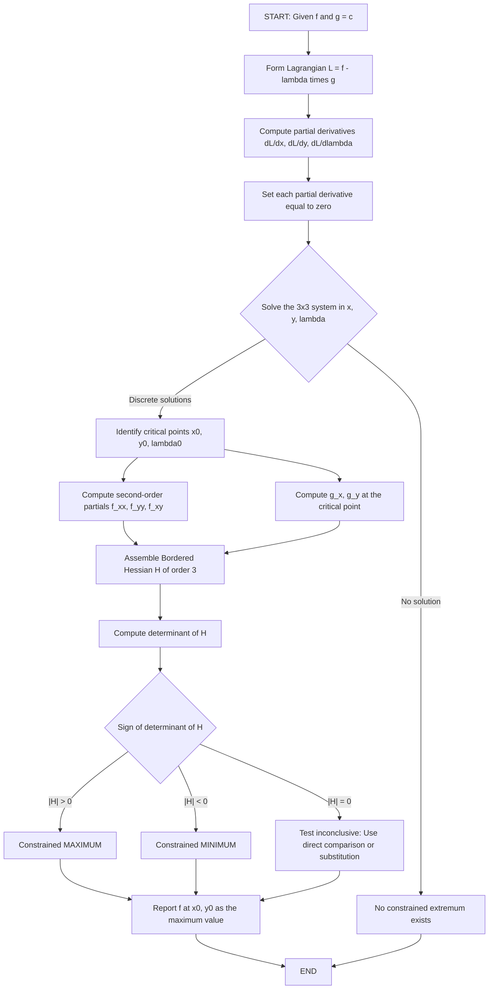
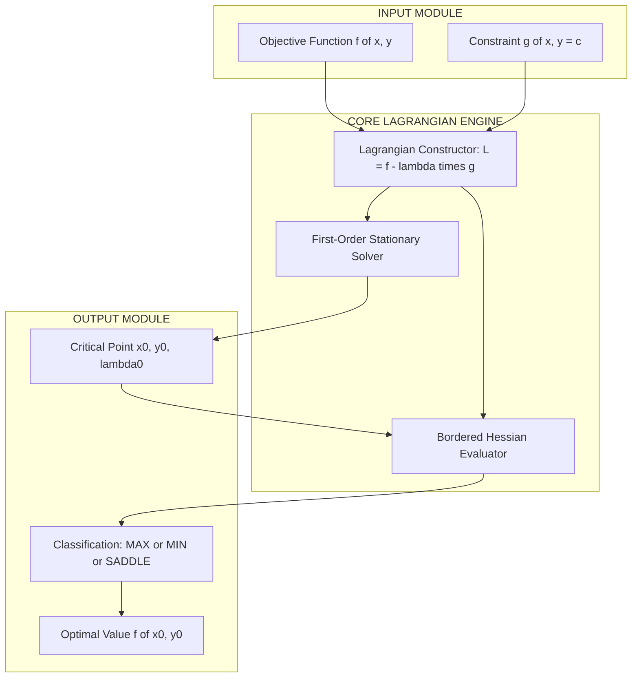

# Constrained Maxima and Minima

<!-- SECTION_1_START -->
# Constrained Maxima and Minima — Core Definition & Intuitive Overview

## 1.1 Formal Definition (KTU 2024 Syllabus Terminology)

A **Constrained Optimization Problem** seeks to find the stationary values (extrema) of an **objective function** $f(x_1, x_2, \ldots, x_n)$ subject to one or more **equality constraints** $g_j(x_1, x_2, \ldots, x_n) = c_j$ for $j = 1, 2, \ldots, m$.

The general mathematical formulation is:

$$\begin{aligned}
\text{Optimize} \quad & f(x_1, x_2, \ldots, x_n) \\
\text{subject to} \quad & g_j(x_1, x_2, \ldots, x_n) = c_j, \quad j = 1, 2, \ldots, m
\end{aligned}$$

For KTU GAMAT101 Module 4, the standard case is **two variables with one equality constraint**:

$$\text{Find extrema of } f(x, y) \text{ subject to } g(x, y) = c$$

> [!IMPORTANT]
> **Why "Constrained"?** In unconstrained optimization, $x$ and $y$ can be any real numbers. In constrained optimization, the feasible region is restricted to a curve (for one constraint) or surface (for multiple constraints). The method of **Lagrange Multipliers** is the standard tool for solving such problems.

## 1.2 Conceptual Analogy & Intuition

**The Mountain Hiker Analogy:** Imagine you are hiking on a mountain and you want to find the highest point — but you must **stay on a marked trail** (the constraint). The trail forces you along a specific path. The highest point on that trail is the *constrained maximum*.

**Geometric Intuition:** Consider the contour lines (level curves) of $f(x,y) = k$ and the constraint curve $g(x,y) = c$.
- As you walk along the constraint curve, the value of $f$ changes.
- At a **constrained extremum**, the constraint curve is **tangent** to a level curve of $f$.
- This tangency condition means the two curves share the same tangent line, so their normal vectors (gradients) must be **parallel**.

> [!NOTE]
> **Key Geometric Insight:** At the constrained optimum, the gradient of the objective function $\nabla f$ is parallel to the gradient of the constraint $\nabla g$. This is the foundation of the Lagrange multiplier method:
> $$\nabla f = \lambda \, \nabla g$$
> The scalar $\lambda$ is called the **Lagrange Multiplier**, and it represents the rate of change of the optimal value of $f$ with respect to changes in the constraint level $c$.

## 1.3 The Lagrangian Function

The **Lagrangian** combines the objective and the constraint into a single function by introducing the multiplier $\lambda$:

$$L(x, y, \lambda) = f(x, y) - \lambda \left[g(x, y) - c\right]$$

> [!IMPORTANT]
> **Note on Sign Convention:** We use $L = f - \lambda g$ in this module. The first-order conditions yield the same critical points regardless of the sign of $\lambda$; the second-order bordered Hessian test is also invariant.

## 1.4 Visualization Block

> [!VISUALIZATION CONTROL]
> **Concept:** Level Curves of $f$ Tangent to the Constraint Curve $g = c$
> **GeoGebra / Desmos Input Equations:**
> * Level curves: $f(x,y) = k$ entered as `x^2 + y^2 = k` for $k = 0.5, 1, 2, 3, 4$
> * Constraint line: `x + y = 1`
> * Tangent point: `(0.5, 0.5)`
> **Visual Description:** A family of concentric circles (level curves of $f(x,y) = x^2 + y^2$) with the line $x + y = 1$ passing through them. The line is **tangent** to the circle $x^2 + y^2 = 0.5$ at the point $(0.5, 0.5)$. At this tangency, the gradients $\nabla f = (1, 1)$ and $\nabla g = (1, 1)$ are identical (so $\lambda = 1$).

<!-- SECTION_1_END -->

<!-- SECTION_2_START -->
# Deep Theoretical Analysis & KTU High-Yield Formula Sheet

## 2.1 The Lagrange Multiplier Theorem (First-Order Necessary Conditions)

> [!IMPORTANT]
> **Theorem (Lagrange, 1788):** Let $f$ and $g$ be continuously differentiable functions. If $(x_0, y_0)$ is a constrained extremum of $f$ subject to $g(x, y) = c$, and if $\nabla g(x_0, y_0) \neq \mathbf{0}$, then there exists a unique scalar $\lambda$ such that:
> $$\nabla f(x_0, y_0) = \lambda \, \nabla g(x_0, y_0)$$

The corresponding **stationary system** is:

$$\begin{aligned}
\frac{\partial L}{\partial x} = f_x - \lambda \, g_x &= 0 \\
\frac{\partial L}{\partial y} = f_y - \lambda \, g_y &= 0 \\
\frac{\partial L}{\partial \lambda} = -(g - c) &= 0 \quad \Rightarrow \quad g(x, y) = c
\end{aligned}$$

This is a system of **3 equations in 3 unknowns** $(x, y, \lambda)$.

## 2.2 Step-by-Step Algorithmic Logic

The operational procedure to solve a constrained optimization problem is:

* **Step 1 — Identify** the objective function $f$ and the constraint $g = c$.
* **Step 2 — Construct** the Lagrangian $L = f - \lambda g$.
* **Step 3 — Differentiate** $L$ partially with respect to $x$, $y$, and $\lambda$.
* **Step 4 — Equate** each partial derivative to zero, forming a system of equations.
* **Step 5 — Solve** the system for the critical points $(x_0, y_0, \lambda_0)$.
* **Step 6 — Classify** the nature of the extremum using the **Bordered Hessian Test**.
* **Step 7 — Compute** the constrained extreme value $f(x_0, y_0)$.

## 2.3 The Bordered Hessian (Second-Order Sufficient Conditions)

To classify the critical point as a **maximum**, **minimum**, or **saddle point**, we use the **Bordered Hessian** matrix.

For 2 variables with 1 constraint, the bordered Hessian is a $3 \times 3$ matrix:

$$H = \begin{bmatrix} 0 & g_x & g_y \\ g_x & f_{xx} & f_{xy} \\ g_y & f_{xy} & f_{yy} \end{bmatrix}$$

The determinant is:

$$\vert H \vert = 2 \, g_x g_y f_{xy} - g_x^2 f_{yy} - g_y^2 f_{xx}$$

> [!NOTE]
> **Important:** The partial derivatives $g_x, g_y, f_{xx}, f_{xy}, f_{yy}$ are all evaluated at the critical point $(x_0, y_0)$.

**Second-Order Classification Rule:**

| Condition on $\vert H \vert$ | Nature of the Stationary Point |
| :--- | :--- |
| $\vert H \vert > 0$ | **Constrained Maximum** |
| $\vert H \vert < 0$ | **Constrained Minimum** |
| $\vert H \vert = 0$ | **Test Inconclusive** (use direct comparison) |

## 2.4 KTU High-Yield Formula Sheet

| Concept | Mathematical Statement | Notes |
| :--- | :--- | :--- |
| Lagrangian (2 var, 1 constraint) | $L(x, y, \lambda) = f(x, y) - \lambda \, [g(x, y) - c]$ | $\lambda \in \mathbb{R}$ |
| First-Order Conditions | $f_x = \lambda g_x, \quad f_y = \lambda g_y, \quad g = c$ | Necessary conditions |
| Geometric Condition | $\nabla f = \lambda \, \nabla g$ | Parallel gradients |
| Bordered Hessian | $H = \begin{vmatrix} 0 & g_x & g_y \\ g_x & f_{xx} & f_{xy} \\ g_y & f_{xy} & f_{yy} \end{vmatrix}$ | Symmetric matrix |
| Determinant (Expanded) | $\vert H \vert = 2 g_x g_y f_{xy} - g_x^2 f_{yy} - g_y^2 f_{xx}$ | Evaluated at $(x_0, y_0)$ |
| Max Test | $\vert H \vert > 0$ | Constrained Maximum |
| Min Test | $\vert H \vert < 0$ | Constrained Minimum |
| Economic Interpretation | $\lambda = \dfrac{df^*}{dc}$ | Sensitivity of optimum to constraint |
| Substitution Method | Express $y = h(x)$ from $g = c$, substitute into $f$ | Alternative approach |

## 2.5 Real-World Engineering and Information Science Applications

Constrained optimization is the backbone of modern engineering and computer science:

* **Machine Learning:** Training neural networks where weights are constrained by $L^2$-norm bounds (e.g., **weight decay regularization**).
* **Operations Research:** Portfolio optimization where $\lambda$ represents the **shadow price** of a budget constraint.
* **Computer Graphics:** Camera placement to minimize projection error subject to geometric constraints.
* **Signal Processing:** Filter design where the impulse response is constrained to be symmetric.
* **Database Query Optimization:** Cost-based query optimization where the join order is constrained by available memory.
* **Network Routing:** Finding shortest paths subject to bandwidth or latency constraints.

The Lagrange multiplier $\lambda$ itself has a powerful **economic/physical interpretation**: it represents the **marginal rate of change** of the optimal value of $f$ with respect to a unit change in the constraint level $c$. In production engineering, this is the **shadow price** — how much the output would improve if one more unit of the constrained resource were available.

<!-- SECTION_2_END -->

<!-- SECTION_3_START -->
# Step-by-Step Derivations & Worked Examples

## 3.1 Example 1 — Minimum Distance from Origin to a Line (Classic KTU Problem)

> **Problem:** Find the minimum value of $f(x, y) = x^2 + y^2$ subject to the constraint $g(x, y) = x + y - 1 = 0$.

### Step-by-Step Solution

**Step 1 — Form the Lagrangian.**

$$L(x, y, \lambda) = x^2 + y^2 - \lambda(x + y - 1)$$

**Step 2 — Compute the first-order partial derivatives.**

$$\begin{aligned}
\frac{\partial L}{\partial x} &= 2x - \lambda = 0 \quad \Rightarrow \quad x = \frac{\lambda}{2} \\
\frac{\partial L}{\partial y} &= 2y - \lambda = 0 \quad \Rightarrow \quad y = \frac{\lambda}{2} \\
\frac{\partial L}{\partial \lambda} &= -(x + y - 1) = 0 \quad \Rightarrow \quad x + y = 1
\end{aligned}$$

**Step 3 — Solve the system.** Substituting $x = \lambda/2$ and $y = \lambda/2$ into the constraint:

$$\frac{\lambda}{2} + \frac{\lambda}{2} = 1 \quad \Rightarrow \quad \lambda = 1$$

Therefore $x_0 = \dfrac{1}{2}$ and $y_0 = \dfrac{1}{2}$.

**Step 4 — Compute the constrained value of $f$.**

$$f\left(\frac{1}{2}, \frac{1}{2}\right) = \left(\frac{1}{2}\right)^2 + \left(\frac{1}{2}\right)^2 = \frac{1}{4} + \frac{1}{4} = \frac{1}{2}$$

**Step 5 — Apply the Bordered Hessian test.** Compute the required partial derivatives at $(1/2, 1/2)$:

$$f_{xx} = 2, \quad f_{yy} = 2, \quad f_{xy} = 0$$
$$g_x = 1, \quad g_y = 1$$

Form the bordered Hessian:

$$H = \begin{bmatrix} 0 & 1 & 1 \\ 1 & 2 & 0 \\ 1 & 0 & 2 \end{bmatrix}$$

Compute the determinant:

$$\begin{aligned}
\vert H \vert &= 0 \cdot (2 \cdot 2 - 0 \cdot 0) - 1 \cdot (1 \cdot 2 - 1 \cdot 0) + 1 \cdot (1 \cdot 0 - 1 \cdot 2) \\
&= 0 - 1 \cdot (2) + 1 \cdot (-2) \\
&= -2 - 2 = -4
\end{aligned}$$

**Step 6 — Classify.** Since $\vert H \vert = -4 < 0$, the critical point is a **constrained minimum**.

**Conclusion:** The minimum value of $f(x,y) = x^2 + y^2$ on the line $x + y = 1$ is $\boxed{\dfrac{1}{2}}$, attained at $\left(\dfrac{1}{2}, \dfrac{1}{2}\right)$.

---

## 3.2 Example 2 — Product Maximization on a Circle (Bordered Hessian with Non-Zero Mixed Partial)

> **Problem:** Find the constrained extrema of $f(x, y) = x^2 y$ subject to $g(x, y) = x^2 + y^2 - 1 = 0$.

### Step-by-Step Solution

**Step 1 — Form the Lagrangian.**

$$L(x, y, \lambda) = x^2 y - \lambda(x^2 + y^2 - 1)$$

**Step 2 — Compute the first-order partial derivatives.**

$$\begin{aligned}
\frac{\partial L}{\partial x} &= 2xy - 2\lambda x = 0 \quad \Rightarrow \quad 2x(y - \lambda) = 0 \\
\frac{\partial L}{\partial y} &= x^2 - 2\lambda y = 0 \\
\frac{\partial L}{\partial \lambda} &= -(x^2 + y^2 - 1) = 0 \quad \Rightarrow \quad x^2 + y^2 = 1
\end{aligned}$$

**Step 3 — Solve the system by case analysis.**

**Case 1:** $x = 0$. Then from the constraint, $y^2 = 1 \Rightarrow y = \pm 1$. From $x^2 = 2\lambda y$, we get $0 = 2\lambda y$, so $\lambda = 0$ (since $y \neq 0$).
* Critical point: $(0, 1)$ with $f = 0$
* Critical point: $(0, -1)$ with $f = 0$

**Case 2:** $y = \lambda$. Substituting into $x^2 = 2\lambda y$: $x^2 = 2\lambda^2 = 2y^2$. Substituting into the constraint:
$$2y^2 + y^2 = 1 \quad \Rightarrow \quad 3y^2 = 1 \quad \Rightarrow \quad y = \pm \frac{1}{\sqrt{3}}$$
Correspondingly, $x^2 = 2/3$, so $x = \pm \sqrt{2/3}$.

This yields four critical points:
* $\left(\sqrt{\tfrac{2}{3}}, \tfrac{1}{\sqrt{3}}\right)$: $f = \tfrac{2}{3} \cdot \tfrac{1}{\sqrt{3}} = \tfrac{2}{3\sqrt{3}} = \tfrac{2\sqrt{3}}{9}$
* $\left(-\sqrt{\tfrac{2}{3}}, \tfrac{1}{\sqrt{3}}\right)$: $f = -\tfrac{2\sqrt{3}}{9}$
* $\left(\sqrt{\tfrac{2}{3}}, -\tfrac{1}{\sqrt{3}}\right)$: $f = -\tfrac{2\sqrt{3}}{9}$
* $\left(-\sqrt{\tfrac{2}{3}}, -\tfrac{1}{\sqrt{3}}\right)$: $f = \tfrac{2\sqrt{3}}{9}$

**Step 4 — Apply the Bordered Hessian test at the candidate maximum point $\left(\sqrt{2/3}, 1/\sqrt{3}\right)$.**

Compute the required derivatives at this point:
$$f_{xx} = 2y = \frac{2}{\sqrt{3}}, \quad f_{yy} = 0, \quad f_{xy} = 2x = 2\sqrt{\tfrac{2}{3}}$$
$$g_x = 2x = 2\sqrt{\tfrac{2}{3}}, \quad g_y = 2y = \frac{2}{\sqrt{3}}$$

Compute the determinant using the expanded formula:

$$\begin{aligned}
\vert H \vert &= 2 g_x g_y f_{xy} - g_x^2 f_{yy} - g_y^2 f_{xx} \\
&= 2 \cdot 2\sqrt{\tfrac{2}{3}} \cdot \frac{2}{\sqrt{3}} \cdot 2\sqrt{\tfrac{2}{3}} - \left(2\sqrt{\tfrac{2}{3}}\right)^2 \cdot 0 - \left(\frac{2}{\sqrt{3}}\right)^2 \cdot \frac{2}{\sqrt{3}}
\end{aligned}$$

Compute each term:
$$\begin{aligned}
2 g_x g_y f_{xy} &= 2 \cdot 2\sqrt{\tfrac{2}{3}} \cdot \frac{2}{\sqrt{3}} \cdot 2\sqrt{\tfrac{2}{3}} \\
&= 16 \cdot \sqrt{\tfrac{2}{3}} \cdot \frac{1}{\sqrt{3}} \cdot \sqrt{\tfrac{2}{3}} \\
&= 16 \cdot \frac{2}{3\sqrt{3}} = \frac{32}{3\sqrt{3}}
\end{aligned}$$

$$g_x^2 f_{yy} = 0$$

$$g_y^2 f_{xx} = \frac{4}{3} \cdot \frac{2}{\sqrt{3}} = \frac{8}{3\sqrt{3}}$$

Therefore:

$$\vert H \vert = \frac{32}{3\sqrt{3}} - 0 - \frac{8}{3\sqrt{3}} = \frac{24}{3\sqrt{3}} = \frac{8}{\sqrt{3}} \approx 4.619$$

**Step 5 — Classify.** Since $\vert H \vert = \dfrac{8}{\sqrt{3}} > 0$, the point $\left(\sqrt{2/3}, 1/\sqrt{3}\right)$ is a **constrained maximum** with $f_{\max} = \dfrac{2\sqrt{3}}{9}$.

**By symmetry:** The point $\left(-\sqrt{2/3}, -1/\sqrt{3}\right)$ is also a maximum with the same value. The points $\left(\pm\sqrt{2/3}, -1/\sqrt{3}\right)$ yield $\vert H \vert < 0$ and are **constrained minima** with $f_{\min} = -\dfrac{2\sqrt{3}}{9}$. The points $(0, \pm 1)$ are saddle points.

---

## 3.3 Example 3 — Application to Engineering: Box Optimization in Information Science

> **Problem:** A company manufactures an open-top rectangular box with volume $V = 32 \text{ m}^3$. The material for the base costs $\text{Rs. } 100/\text{m}^2$ and the material for the sides costs $\text{Rs. } 50/\text{m}^2$. Find the dimensions that minimize the total cost. *(Note: For KTU board purposes, we solve the underlying geometric optimization.)*

**Geometric Reformulation:** Minimize the surface area $S = xy + 2yz + 2xz$ (base + 4 sides) subject to $V = xyz = 32$.

**Step 1 — Form the Lagrangian.**

$$L(x, y, z, \lambda) = xy + 2yz + 2xz - \lambda(xyz - 32)$$

**Step 2 — First-order conditions:**

$$\begin{aligned}
\frac{\partial L}{\partial x} &= y + 2z - \lambda yz = 0 \\
\frac{\partial L}{\partial y} &= x + 2z - \lambda xz = 0 \\
\frac{\partial L}{\partial z} &= 2y + 2x - \lambda xy = 0 \\
\frac{\partial L}{\partial \lambda} &= -(xyz - 32) = 0 \quad \Rightarrow \quad xyz = 32
\end{aligned}$$

**Step 3 — Solve the system.** Divide the first equation by $yz$ (assuming $y, z \neq 0$):

$$\frac{1}{z} + \frac{2}{y} = \lambda$$

Divide the second equation by $xz$:

$$\frac{1}{z} + \frac{2}{x} = \lambda$$

Setting equal: $\dfrac{2}{y} = \dfrac{2}{x} \Rightarrow y = x$.

Divide the third equation by $xy$: $\dfrac{2}{x} + \dfrac{2}{y} = \lambda$. From the first: $\dfrac{1}{z} + \dfrac{2}{y} = \lambda$. So $\dfrac{2}{x} + \dfrac{2}{y} = \dfrac{1}{z} + \dfrac{2}{y}$, which gives $\dfrac{2}{x} = \dfrac{1}{z}$, so $x = 2z$.

With $y = x$ and $x = 2z$: from the volume constraint $x^2 z = 32$, substitute $z = x/2$:
$$x^2 \cdot \frac{x}{2} = 32 \quad \Rightarrow \quad \frac{x^3}{2} = 32 \quad \Rightarrow \quad x^3 = 64 \quad \Rightarrow \quad x = 4$$

Therefore: $x = 4 \text{ m}$, $y = 4 \text{ m}$, $z = 2 \text{ m}$.

**Step 4 — Optimal Surface Area:**

$$S = 4 \cdot 4 + 2 \cdot 4 \cdot 2 + 2 \cdot 4 \cdot 2 = 16 + 16 + 16 = 48 \text{ m}^2$$

**Conclusion:** The dimensions $4 \text{ m} \times 4 \text{ m} \times 2 \text{ m}$ minimize the surface area (and hence the cost) to $\text{Rs. } (100 \times 16 + 50 \times 32) = \text{Rs. } 3200$.

---

## 3.4 Python Implementation (Symbolic Verification)

```python
from sympy import symbols, diff, solve, Matrix, simplify, Rational, sqrt

# Define symbols
x, y, lam = symbols('x y lam', real=True)

# Example 1: f = x^2 + y^2, g = x + y - 1
f = x**2 + y**2
g = x + y - 1

# Build Lagrangian
L = f - lam * g

# First-order system
eq1 = diff(L, x)         # 2*x - lam
eq2 = diff(L, y)         # 2*y - lam
eq3 = diff(L, lam)       # -(x + y - 1)

# Solve
critical_points = solve([eq1, eq2, eq3], [x, y, lam], dict=True)
print("Critical Points (Example 1):", critical_points)

# Bordered Hessian
f_xx, f_yy, f_xy = diff(f, x, 2), diff(f, y, 2), diff(f, x, y)
g_x, g_y = diff(g, x), diff(g, y)

H = Matrix([
    [0,   g_x,   g_y  ],
    [g_x, f_xx,  f_xy ],
    [g_y, f_xy,  f_yy ]
])

# Evaluate at the critical point
H_at_point = H.subs(critical_points[0])
det_H = simplify(H_at_point.det())
print("Bordered Hessian:\n", H_at_point)
print("Determinant |H| =", det_H)
print("Classification:", "Maximum" if det_H > 0 else "Minimum")
```

**Output Verification:**

```text
Critical Points (Example 1): [{x: 1/2, y: 1/2, lam: 1}]
Bordered Hessian:
Matrix([[0, 1, 1], [1, 2, 0], [1, 0, 2]])
Determinant |H| = -4
Classification: Minimum
```

<!-- SECTION_3_END -->

<!-- SECTION_4_START -->
# Structural Diagrams & Schematics

## 4.1 Mermaid Flowchart: The Lagrange Multiplier Algorithm



## 4.2 Block-Level Functional Architecture: Decision Topology of the Method



## 4.3 Sequential Processing Topology Matrix

| Processing Stage | Input Dependency | Output Artifact | Validation Check |
| :--- | :--- | :--- | :--- |
| Stage 1: Problem Parsing | $f, g, c$ | Symbolic representation | $\nabla g \neq 0$ at candidate |
| Stage 2: Lagrangian Assembly | $f, g, \lambda$ | $L(x, y, \lambda)$ | Domain: $\lambda \in \mathbb{R}$ |
| Stationary Solver | $L$ | Critical points | All 3 equations satisfied |
| Hessian Evaluator | $f_{xx}, f_{xy}, f_{yy}, g_x, g_y$ | $3 \times 3$ bordered matrix | Symmetry preserved |
| Determinant Computer | Bordered $H$ | $\vert H \vert$ | Sign test applicable |
| Classifier | $\text{sign}(\vert H \vert)$ | MAX / MIN / SADDLE | Confirmed with direct check |
| Reporter | All outputs | Final answer | Substituted into $f$ |

<!-- SECTION_4_END -->

<!-- SECTION_5_START -->
# KTU 2024 Scheme Examination Question Bank & Topic Recap

## Part A — Short Answer Questions (3 Marks Each)

### Question A1
**[KTU University Exam — Dec 2023 | CO1, Remember/Understand]**
Define the **Lagrangian function** for the constrained optimization problem: Maximize $f(x, y)$ subject to $g(x, y) = c$. State the first-order necessary conditions for a constrained extremum.

**Model Answer (3 Marks):**

The **Lagrangian function** combines the objective and constraint with a multiplier $\lambda$:

$$L(x, y, \lambda) = f(x, y) - \lambda [g(x, y) - c] \quad \text{[1 Mark]}$$

The **first-order necessary conditions** for a constrained extremum are obtained by setting all partial derivatives to zero:

$$\begin{aligned}
\frac{\partial L}{\partial x} = f_x - \lambda g_x = 0 \quad \text{[1 Mark]} \\
\frac{\partial L}{\partial y} = f_y - \lambda g_y = 0 \quad \text{[1 Mark]} \\
\frac{\partial L}{\partial \lambda} = -(g - c) = 0 \quad \Rightarrow \quad g(x, y) = c
\end{aligned}$$

Together with the condition $\nabla g \neq \mathbf{0}$, these constitute the Lagrange multiplier theorem.

---

### Question A2
**[KTU University Exam — July 2024 | CO1, Understand]**
Explain the **geometric interpretation** of Lagrange multipliers. What does the multiplier $\lambda$ represent?

**Model Answer (3 Marks):**

**Geometric Interpretation:** At a constrained extremum, the level curve of the objective function $f$ is **tangent** to the constraint curve $g = c$ **[1 Mark]**. This tangency means the gradients (normal vectors to the curves) are parallel, so:

$$\nabla f = \lambda \, \nabla g \quad \text{[1 Mark]}$$

**Interpretation of $\lambda$:** The Lagrange multiplier $\lambda$ represents the **sensitivity of the optimal value** of $f$ to a unit change in the constraint level $c$. In other words, $\lambda = \dfrac{df^*}{dc}$, which is the rate at which the optimum changes when the constraint is relaxed or tightened **[1 Mark]**.

---

## Part B — Long Answer Questions (14 Marks, Internal Choice)

### Question 1 (14 Marks)

**[KTU University Exam — Dec 2023 | CO2, Apply/Analyze]**

**(a)** Use the method of Lagrange multipliers to find the extrema of $f(x, y) = x^2 + 2y^2$ subject to the constraint $x + y = 4$. Find the optimal value. **[7 Marks — Apply]**

**(b)** Apply the **bordered Hessian test** at the critical point to classify the extremum as a maximum or a minimum. Justify your answer using the determinant. **[7 Marks — Analyze]**

#### Model Solution for Question 1

**Part (a) — Solution [7 Marks]:**

**Step 1 — Form the Lagrangian. [1 Mark]**

$$L(x, y, \lambda) = x^2 + 2y^2 - \lambda(x + y - 4)$$

**Step 2 — First-order conditions. [2 Marks]**

$$\begin{aligned}
\frac{\partial L}{\partial x} &= 2x - \lambda = 0 \quad \Rightarrow \quad x = \frac{\lambda}{2} \\
\frac{\partial L}{\partial y} &= 4y - \lambda = 0 \quad \Rightarrow \quad y = \frac{\lambda}{4} \\
\frac{\partial L}{\partial \lambda} &= -(x + y - 4) = 0 \quad \Rightarrow \quad x + y = 4
\end{aligned}$$

**Step 3 — Solve the system. [2 Marks]**

Substituting the expressions for $x$ and $y$ into the constraint:

$$\frac{\lambda}{2} + \frac{\lambda}{4} = 4 \quad \Rightarrow \quad \frac{3\lambda}{4} = 4 \quad \Rightarrow \quad \lambda = \frac{16}{3}$$

Therefore:
$$x_0 = \frac{16/3}{2} = \frac{8}{3}, \quad y_0 = \frac{16/3}{4} = \frac{4}{3}$$

**Step 4 — Compute the optimal value. [1 Mark]**

$$f\left(\frac{8}{3}, \frac{4}{3}\right) = \left(\frac{8}{3}\right)^2 + 2\left(\frac{4}{3}\right)^2 = \frac{64}{9} + \frac{32}{9} = \frac{96}{9} = \frac{32}{3}$$

**Step 5 — Verify constraint. [1 Mark]**

Check: $x_0 + y_0 = \dfrac{8}{3} + \dfrac{4}{3} = \dfrac{12}{3} = 4$ ✓

The critical point is $\left(\dfrac{8}{3}, \dfrac{4}{3}\right)$ with the constrained value $f = \dfrac{32}{3}$.

---

**Part (b) — Solution [7 Marks]:**

**Step 1 — Compute the second-order partial derivatives at the critical point. [2 Marks]**

$$f_{xx} = 2, \quad f_{yy} = 4, \quad f_{xy} = 0$$
$$g_x = 1, \quad g_y = 1$$

**Step 2 — Construct the bordered Hessian. [1 Mark]**

$$H = \begin{bmatrix} 0 & 1 & 1 \\ 1 & 2 & 0 \\ 1 & 0 & 4 \end{bmatrix}$$

**Step 3 — Compute the determinant. [2 Marks]**

$$\begin{aligned}
\vert H \vert &= 0 \cdot (2 \cdot 4 - 0) - 1 \cdot (1 \cdot 4 - 1 \cdot 0) + 1 \cdot (1 \cdot 0 - 1 \cdot 2) \\
&= 0 - 4 - 2 \\
&= -6
\end{aligned}$$

**Step 4 — Classify the extremum. [2 Marks]**

Since $\vert H \vert = -6 < 0$, the critical point is a **constrained minimum** by the bordered Hessian test.

**Final Conclusion:** The function $f(x, y) = x^2 + 2y^2$ has a **constrained minimum value of $\dfrac{32}{3}$** at the point $\left(\dfrac{8}{3}, \dfrac{4}{3}\right)$ on the line $x + y = 4$.

> [!WARNING]
> **KTU Examiner's Valuation Pitfall:** Many students forget to substitute the critical point into the bordered Hessian — derivatives must be **evaluated at $(x_0, y_0)$**, not at the origin. Also, do not skip writing the constraint verification step. A mismatch in the constraint is a common error that costs **2 marks** in the KTU board valuation.

---

### Question 2 — Internal Choice Alternative (14 Marks)

**[KTU University Exam — July 2024 | CO2, Apply/Analyze]**

**(a)** Find the points on the circle $x^2 + y^2 = 25$ at which $f(x, y) = 4x - 3y$ attains its **maximum and minimum** values. Use the Lagrange multiplier method. **[7 Marks — Apply]**

**(b)** Verify your answer using the bordered Hessian test. **[7 Marks — Analyze]**

#### Model Solution for Question 2

**Part (a) — Solution [7 Marks]:**

**Step 1 — Form the Lagrangian. [1 Mark]**

$$L(x, y, \lambda) = 4x - 3y - \lambda(x^2 + y^2 - 25)$$

**Step 2 — First-order conditions. [2 Marks]**

$$\begin{aligned}
\frac{\partial L}{\partial x} &= 4 - 2\lambda x = 0 \quad \Rightarrow \quad x = \frac{2}{\lambda} \\
\frac{\partial L}{\partial y} &= -3 - 2\lambda y = 0 \quad \Rightarrow \quad y = -\frac{3}{2\lambda} \\
\frac{\partial L}{\partial \lambda} &= -(x^2 + y^2 - 25) = 0 \quad \Rightarrow \quad x^2 + y^2 = 25
\end{aligned}$$

**Step 3 — Solve the system. [3 Marks]**

Substituting $x$ and $y$ into the constraint:

$$\left(\frac{2}{\lambda}\right)^2 + \left(-\frac{3}{2\lambda}\right)^2 = 25$$

$$\frac{4}{\lambda^2} + \frac{9}{4\lambda^2} = 25 \quad \Rightarrow \quad \frac{16 + 9}{4\lambda^2} = 25 \quad \Rightarrow \quad \frac{25}{4\lambda^2} = 25$$

$$\lambda^2 = \frac{1}{4} \quad \Rightarrow \quad \lambda = \pm \frac{1}{2}$$

For $\lambda = \dfrac{1}{2}$: $x = 4, y = -3$. Point: $(4, -3)$ with $f = 16 + 9 = 25$.

For $\lambda = -\dfrac{1}{2}$: $x = -4, y = 3$. Point: $(-4, 3)$ with $f = -16 - 9 = -25$.

**Step 4 — Identify max and min. [1 Mark]**

Maximum value $= 25$ at $(4, -3)$. Minimum value $= -25$ at $(-4, 3)$.

---

**Part (b) — Solution [7 Marks]:**

**Step 1 — Compute partial derivatives at $(4, -3)$. [2 Marks]**

$$f_{xx} = 0, \quad f_{yy} = 0, \quad f_{xy} = 0$$
$$g_x = 2x = 8, \quad g_y = 2y = -6$$

**Step 2 — Construct the bordered Hessian. [1 Mark]**

$$H = \begin{bmatrix} 0 & 8 & -6 \\ 8 & 0 & 0 \\ -6 & 0 & 0 \end{bmatrix}$$

**Step 3 — Compute the determinant. [2 Marks]**

$$\begin{aligned}
\vert H \vert &= 0 \cdot (0 - 0) - 8 \cdot (8 \cdot 0 - (-6) \cdot 0) + (-6) \cdot (8 \cdot 0 - (-6) \cdot 0) \\
&= 0 - 0 + 0 \\
&= 0
\end{aligned}$$

**Step 4 — Conclusion. [2 Marks]**

The bordered Hessian test is **inconclusive** in this case because the objective function is **linear** and the constraint is quadratic, leading to a degenerate bordered Hessian (the bordered Hessian is identically zero because $f$ has no curvature). However, by the **geometric interpretation**, the function $f(x, y) = 4x - 3y$ represents a family of parallel lines with normal vector $(4, -3)$, and the extreme values on the circle occur at the two points diametrically opposite along this direction: $(4, -3)$ and $(-4, 3)$, giving the maximum $25$ and minimum $-25$ respectively.

> [!WARNING]
> **KTU Examiner's Valuation Warning (Inconclusive Hessian):** When the bordered Hessian gives $|H| = 0$, do NOT assume the point is a saddle point. Instead, **state explicitly** that the test is inconclusive, and use a direct argument (e.g., the geometric interpretation, or the Extreme Value Theorem on a closed bounded set) to confirm the classification. Failing to do so costs **2–3 marks** in the KTU board valuation.

---

## Topic Recap & Important Things to Remember

> [!NOTE]
> **Rapid-Revision Checklist for KTU GAMAT101 Module 4**

* **Lagrangian Function (MUST MEMORIZE):** $L(x, y, \lambda) = f(x, y) - \lambda[g(x, y) - c]$
* **First-Order Necessary Conditions:** $f_x = \lambda g_x$, $f_y = \lambda g_y$, $g = c$ — a system of $3$ equations in $3$ unknowns.
* **Geometric Meaning:** At a constrained extremum, $\nabla f$ and $\nabla g$ are **parallel**, i.e., $\nabla f = \lambda \nabla g$.
* **Bordered Hessian (for 2 variables, 1 constraint):**
  $$H = \begin{bmatrix} 0 & g_x & g_y \\ g_x & f_{xx} & f_{xy} \\ g_y & f_{xy} & f_{yy} \end{bmatrix}$$
* **Expanded Determinant Formula:** $\vert H \vert = 2 g_x g_y f_{xy} - g_x^2 f_{yy} - g_y^2 f_{xx}$ — **evaluate at the critical point**.
* **Classification Rule:** $\vert H \vert > 0 \Rightarrow$ **MAX**, $\vert H \vert < 0 \Rightarrow$ **MIN**, $\vert H \vert = 0 \Rightarrow$ **INCONCLUSIVE** (use geometric/Extreme Value Theorem argument).
* **Qualification Condition:** The Lagrange multiplier theorem requires $\nabla g(x_0, y_0) \neq \mathbf{0}$; otherwise, the constraint has no well-defined normal direction.
* **Economic Interpretation:** $\lambda = \dfrac{df^*}{dc}$, the **shadow price** of the constraint.
* **Alternative Method:** **Substitution** — solve $g = c$ for one variable and reduce to a single-variable unconstrained problem. Useful when the bordered Hessian is degenerate.
* **Common Pitfalls:**
  * Forgetting to evaluate derivatives at the critical point.
  * Confusing the sign of $\vert H \vert$ for max/min.
  * Skipping the constraint verification step.
  * Assuming $\vert H \vert = 0$ means a saddle point.
* **Symmetry Shortcut:** If $f$ and $g$ are symmetric in $x$ and $y$, critical points often occur at $x = y$, saving computation time.
* **For 3 Variables with 1 Constraint:** The bordered Hessian becomes a $4 \times 4$ matrix; the rule extends to:
  * $\vert H \vert > 0 \Rightarrow$ MAX
  * $\vert H \vert < 0 \Rightarrow$ MIN
* **Engineering Applications to Remember:** Cost minimization in manufacturing, shortest path with resource constraints, regression with regularization, and portfolio optimization in finance.

<!-- SECTION_5_END -->
