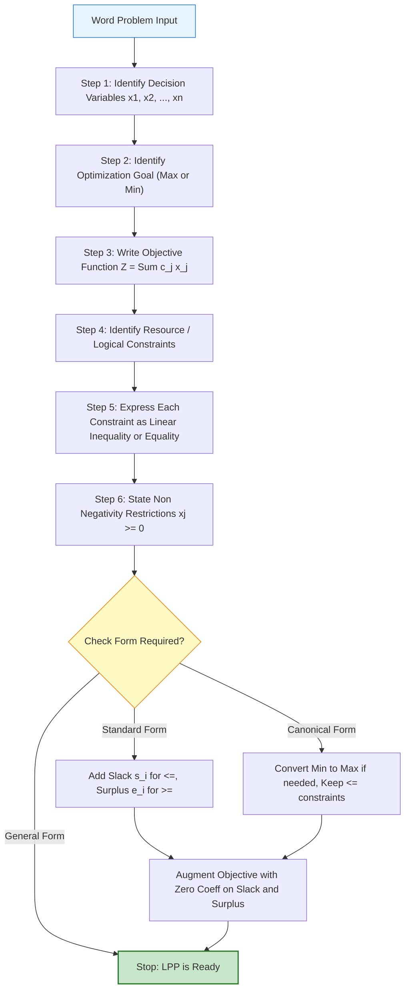
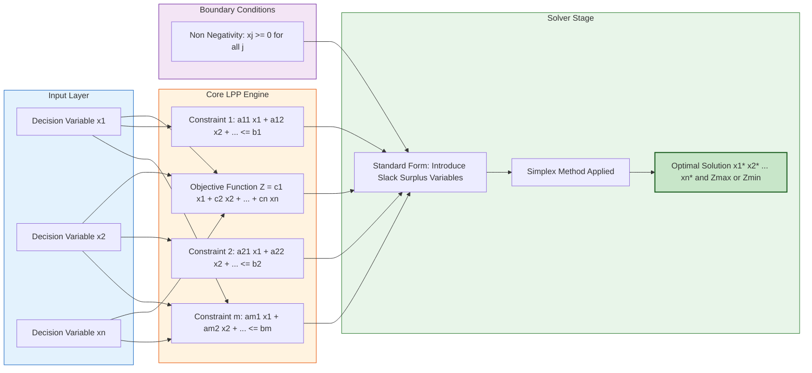
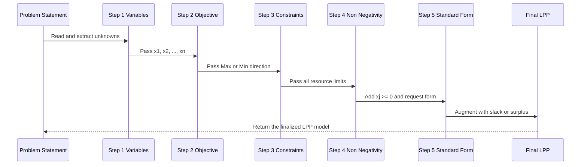
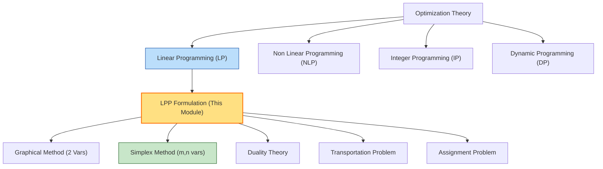

# LPP- Formation

<!-- SECTION_1_START -->
# LPP – Formation (Linear Programming Problem Formulation)

> [!NOTE]
> **Syllabus Highlight (KTU 2024 – GAMAT101, Module 4)**
> Linear Programming Problems (LPP) constitute the mathematical backbone of optimization in computer science — from compiler register allocation and database query planning to network routing and cloud resource scheduling. **Formulation** is the critical first step: a perfectly solved simplex table is useless if the model is built on the wrong variables.

---

## 1.1 Formal Definition (KTU Board Standard)

A **Linear Programming Problem (LPP)** is a mathematical model used to determine the *optimal* value (maximum profit / minimum cost) of a **linear objective function**, subject to a set of **linear constraints** and **non-negativity restrictions** on the decision variables.

In its general (mathematical) form, an LPP with $n$ decision variables and $m$ constraints is written as:

$$
\begin{aligned}
\text{Optimize } & Z \;=\; c_1 x_1 \;+\; c_2 x_2 \;+\; \dots \;+\; c_n x_n \\[4pt]
\text{subject to } & a_{11} x_1 \;+\; a_{11} x_2 \;+\; \dots \;+\; a_{1n} x_n \;\;\underset{(\leq,\ =,\ \geq)}{\le,\ =,\ \ge}\;\; b_1 \\
& a_{21} x_1 \;+\; a_{22} x_2 \;+\; \dots \;+\; a_{2n} x_n \;\;\underset{}{\le,\ =,\ \ge}\;\; b_2 \\
& \qquad \vdots \qquad \vdots \qquad \qquad \vdots \qquad \qquad \vdots \\
& a_{m1} x_1 \;+\; a_{m2} x_2 \;+\; \dots \;+\; a_{mn} x_n \;\;\underset{}{\le,\ =,\ \ge}\;\; b_m \\[4pt]
\text{and } & x_1,\ x_2,\ \dots,\ x_n \;\ge\; 0
\end{aligned}
$$

where $Z$ is the **objective function value**, $c_j$ are the **cost / profit coefficients**, $a_{ij}$ are the **technological / consumption coefficients**, and $b_i$ are the **resource availabilities** (right-hand side constants).

> [!IMPORTANT]
> The word **Linear** in LPP has **two strict meanings**:
> 1. The objective function $Z$ must be a **degree-1 polynomial** in the variables (no $x_j^2$, $\sqrt{x_j}$, $x_1 x_2$, etc.).
> 2. Every constraint must be a **linear inequality or equation** in the variables.
>
> If either condition is violated, the problem is **Non-Linear Programming (NLP)** and the simplex method does **NOT** apply directly.

---

## 1.2 Conceptual Analogy — "The Bakery Chef's Dilemma"

Imagine you run a small bakery. You bake only two items — **Sponge Cake ($x_1$)** and **Brownie ($x_2$)**.

* Each Sponge Cake earns you **₹ 6**; each Brownie earns **₹ 4**. So your *total profit* is $Z = 6x_1 + 4x_2$. You want to **maximize** this.
* But you don't have unlimited flour. Each Sponge uses 2 kg, each Brownie uses 1 kg, and you have only **8 kg** in the pantry: $2x_1 + x_2 \le 8$.
* Sugar is also tight. Each Sponge uses 1 kg, each Brownie uses 2 kg, and you have only **8 kg**: $x_1 + 2x_2 \le 8$.
* You obviously cannot bake a *negative* number of cakes: $x_1, x_2 \ge 0$.

> The **decision variables** ($x_1, x_2$) are the unknowns you control. The **objective function** is what you want to be best (profit). The **constraints** are the walls of the room you must stay inside. The **feasible region** is the floor area where you can actually move. LPP formation is the act of *drawing that room on paper* before stepping inside to find the optimal corner.

---

## 1.3 The Four Pillars of Any LPP

> [!NOTE]
> **Every well-formed LPP must contain exactly these four components.** KTU examiners frequently award partial marks simply for explicitly *labelling* them in the answer script.

| # | Component | Symbol / Form | Real-World Meaning |
|---|-----------|---------------|---------------------|
| 1 | **Decision Variables** | $x_1, x_2, \dots, x_n$ | Quantities you are free to choose (production levels, hours, units). |
| 2 | **Objective Function** | $Z = \sum c_j x_j$ (Max / Min) | The single performance metric to be optimized. |
| 3 | **Constraints** | $\sum a_{ij} x_j \le / = / \ge b_i$ | Restrictions on resources, demand, capacity, time. |
| 4 | **Non-Negativity Restrictions** | $x_j \ge 0$ for all $j$ | Physical impossibility of "negative" production. |

---

## 1.4 Geometric Intuition of the Feasible Region

In 2-D, an LPP with two decision variables defines a **convex polygon** (the feasible region). The optimum always lies at a **vertex (corner point)** — a property called the *Fundamental Theorem of LPP* (proven by George Dantzig in 1947 using the **Simplex Method**).

> [!VISUALIZATION CONTROL]
> **Concept:** Visualization of the Bakery LPP feasible region with the objective function $Z = 6x_1 + 4x_2$ drawn as a family of parallel iso-profit lines.
>
> **GeoGebra / Desmos Input Equations:**
> * Constraint 1: $2x + y = 8$ (Flour line)
> * Constraint 2: $x + 2y = 8$ (Sugar line)
> * Axis lines: $x = 0$, $y = 0$
> * Iso-profit line family: $6x + 4y = Z$ for $Z \in \{8, 16, 24, 32, 36, 40\}$
>
> **Visual Description:** You will see two intersecting lines that cut the first quadrant into a quadrilateral with corner points at $(0,0)$, $(4,0)$, $(0,4)$, and the intersection $(8/3,\ 8/3)$. As you slide the iso-profit line $6x + 4y = Z$ outward (away from origin), the **last** point of contact is the optimal corner. For the bakery, this optimum is the intersection point giving maximum profit.

---

## 1.5 Standard Mathematical Notation Recap

| Symbol | Meaning |
|--------|---------|
| $n$ | Number of decision variables |
| $m$ | Number of constraints |
| $c_j$ | Coefficient of $x_j$ in objective function |
| $a_{ij}$ | Coefficient of $x_j$ in $i$-th constraint |
| $b_i$ | Right-hand side (RHS) of $i$-th constraint (resource limit) |
| $x_j$ | $j$-th decision variable (level of $j$-th activity) |
| $Z$ | Objective function value (scalar) |

> [!IMPORTANT]
> In KTU valuation, if a student writes $a_{ij}$ but forgets to define it, the examiner deducts **1 mark** under "notation clarity". Always declare symbols before using them.

<!-- SECTION_1_END -->

<!-- SECTION_2_START -->
# Deep Theoretical Analysis & KTU High-Yield Formula Sheet

## 2.1 The Six Logical Steps of LPP Formulation

Formulating an LPP from a word problem is a **systematic, reproducible procedure**. KTU examiners award full marks only when students demonstrate each step explicitly.

> [!IMPORTANT]
> **The Six KTU-Prescribed Steps of LPP Formation**
> 1. **Identify the Decision Variables** — Define $x_1, x_2, \dots, x_n$ with units and physical meaning.
> 2. **Identify the Objective** — Is the goal *maximization* (profit, output, efficiency) or *minimization* (cost, time, error)?
> 3. **Write the Objective Function** — Express the goal as $Z = c_1x_1 + c_2x_2 + \dots + c_nx_n$.
> 4. **Identify the Constraints** — Every mention of "limited", "at most", "at least", "must equal" becomes a constraint.
> 5. **Express Constraints Mathematically** — Convert the verbal restriction into a linear inequality/equation.
> 6. **State Non-Negativity Restrictions** — $x_j \ge 0$ for all $j$ (or state explicitly if unrestricted in sign).

---

## 2.2 The Three Canonical Forms of an LPP

> [!NOTE]
> **Why multiple forms?** Different solution methods (Simplex, Dual, Graphical) require the problem to be in a specific shape. KTU board questions often ask: *"Convert the given LPP into standard form"* — a **3-mark** favourite.

### 2.2.1 General Form (As-Is)

$$
\begin{aligned}
\text{Optimize } & Z = \sum_{j=1}^{n} c_j x_j \\
\text{s.t. } & \sum_{j=1}^{n} a_{ij} x_j \;\begin{matrix} \le \\ = \\ \ge \end{matrix}\; b_i, \quad i = 1, 2, \dots, m \\
& x_j \ge 0, \quad j = 1, 2, \dots, n
\end{aligned}
$$

### 2.2.2 Standard Form (Simplex-Ready)

All constraints are **equalities**, the RHS $b_i \ge 0$, and the objective is a **maximization**.

$$
\begin{aligned}
\text{Maximize } & Z = \mathbf{c}^T \mathbf{x} \\
\text{subject to } & \mathbf{A} \mathbf{x} = \mathbf{b}, \quad \mathbf{b} \ge \mathbf{0} \\
& \mathbf{x} \ge \mathbf{0}
\end{aligned}
$$

To convert inequalities to equalities, we introduce:
* **Slack variable** $s_i \ge 0$ for a "$\le$" constraint: $\;\; a_{i1}x_1 + \dots + a_{in}x_n + s_i = b_i$.
* **Surplus variable** $e_i \ge 0$ for a "$\ge$" constraint: $\;\; a_{i1}x_1 + \dots + a_{in}x_n - e_i = b_i$.

### 2.2.3 Canonical Form (Two Sub-Variants)

| Sub-Variant | Use Case | Shape |
|-------------|----------|-------|
| **Maximization Canonical** | For Big-M / Two-Phase Simplex | Max $Z$, all $\le$ constraints, $x_j \ge 0$ |
| **Minimization Canonical** | Transportation & Assignment | Min $Z$, all $\ge$ constraints, $x_j \ge 0$ |

### 2.2.4 Matrix Form (Most Compact)

$$
\begin{aligned}
\text{Max } & Z = \mathbf{c}^T \mathbf{x} \\
\text{s.t. } & \mathbf{A} \mathbf{x} \le \mathbf{b} \\
& \mathbf{x} \ge \mathbf{0}
\end{aligned}
$$

$$
\text{where } \mathbf{A} = \begin{bmatrix} a_{11} & a_{12} & \dots & a_{1n} \\ a_{21} & a_{22} & \dots & a_{2n} \\ \vdots & \vdots & \ddots & \vdots \\ a_{m1} & a_{m2} & \dots & a_{mn} \end{bmatrix},\;\; \mathbf{x} = \begin{bmatrix} x_1 \\ x_2 \\ \vdots \\ x_n \end{bmatrix},\;\; \mathbf{b} = \begin{bmatrix} b_1 \\ b_2 \\ \vdots \\ b_m \end{bmatrix},\;\; \mathbf{c} = \begin{bmatrix} c_1 \\ c_2 \\ \vdots \\ c_n \end{bmatrix}
$$

---

## 2.3 Conversion Rules (Cheat Code for the Board Exam)

> [!IMPORTANT]
> **KTU Board Favourite — Memorize these transformation rules to gain easy 3 marks.**

| Original Form | Conversion Action | New Form |
|---------------|-------------------|----------|
| Minimize $Z$ | Replace $Z$ with $-Z'$, set Max $Z' = -Z$ | Maximization |
| $x_j$ unrestricted in sign | Substitute $x_j = x_j^{+} - x_j^{-}$, with $x_j^{+}, x_j^{-} \ge 0$ | Non-negative |
| $a_{i1}x_1 + \dots \le b_i$ where $b_i < 0$ | Multiply both sides by $-1$ to flip to $\ge$ with $b_i > 0$ | RHS non-negative |
| $a_{i1}x_1 + \dots \ge b_i$ | Subtract surplus $e_i \ge 0$ → becomes $=$ with $-e_i$ | Equality (Standard Form) |
| $a_{i1}x_1 + \dots \le b_i$ | Add slack $s_i \ge 0$ → becomes $=$ with $+s_i$ | Equality (Standard Form) |

---

## 2.4 KTU High-Yield Formula Sheet

> [!NOTE]
> **The single most important table to internalize before the ESE (End Semester Exam).** The vertical bar `|` is intentionally rendered as `\vert` in math mode to keep the markdown table intact.

| # | Concept | Formula / Expression | Unit / Type |
|---|---------|----------------------|-------------|
| 1 | General Objective | $Z = \sum_{j=1}^{n} c_j x_j$ | Linear scalar |
| 2 | General Constraint | $\sum_{j=1}^{n} a_{ij} x_j \;\{\le \mid = \mid \ge\}\; b_i$ | Linear inequality/equality |
| 3 | Non-Negativity | $x_j \ge 0 \;\;\forall j \in \{1, \dots, n\}$ | Bound |
| 4 | Standard Form (Max) | Max $Z = \mathbf{c}^T \mathbf{x}$, s.t. $\mathbf{Ax} = \mathbf{b},\; \mathbf{x} \ge \mathbf{0},\; \mathbf{b} \ge \mathbf{0}$ | Matrix equality |
| 5 | Slack Conversion | $\sum a_{ij} x_j \le b_i \;\longrightarrow\; \sum a_{ij} x_j + s_i = b_i$ | $s_i \ge 0$ |
| 6 | Surplus Conversion | $\sum a_{ij} x_j \ge b_i \;\longrightarrow\; \sum a_{ij} x_j - e_i = b_i$ | $e_i \ge 0$ |
| 7 | Unrestricted Split | $x_j$ free $\;\longrightarrow\; x_j = x_j^{+} - x_j^{-}$ | $x_j^{+}, x_j^{-} \ge 0$ |
| 8 | Min-to-Max Trick | Min $Z = c^T x \;\equiv\;$ Max $Z^{*} = -c^T x$ | $Z^{*} = -Z$ |
| 9 | Number of New Variables (Standard Form) | $n' = n + (\text{number of } \le \text{constraints}) + (\text{number of } \ge \text{constraints})$ | Integer count |
| 10 | Matrix Sizes | $\mathbf{A} : m \times n,\; \mathbf{x},\mathbf{c} : n \times 1,\; \mathbf{b} : m \times 1$ | Dimension check |

---

## 2.5 Real-World Engineering Utility in Information Science

> [!IMPORTANT]
> **Why does a CSE / IT student need LPP?** Because every "optimal" decision in computing is, mathematically, an LPP.

| Application Domain | LPP Role |
|--------------------|----------|
| **Compiler Optimization** | Register allocation as an LPP to minimize spill code. |
| **Database Query Optimization** | Choosing join order as an integer program (IP, a strict extension of LPP). |
| **Network Flow / Routing** | Max-flow min-cut theorem is a linear program. |
| **Cloud Resource Allocation** | Distribute VMs to minimize cost under SLA constraints. |
| **Machine Learning (SVMs)** | The hard-margin SVM dual is a quadratic program; the primal is an LPP. |
| **Software Project Scheduling** | Time-cost trade-off is a classical LPP. |
| **CPU/GPU Memory Management** | Minimize cache misses under bandwidth constraints. |

> [!NOTE]
> KTU examiners appreciate it when a student connects a math concept to a **CS application** during the viva. It demonstrates **outcome-based learning (CO5: Modern Tool Usage)**.

<!-- SECTION_2_END -->

<!-- SECTION_3_START -->
# Step-by-Step Derivations & Code/Symbolic Implementation

## 3.1 Classical Worked Example — "The Bakery Production Problem" (Full Six-Step Walkthrough)

**Word Problem:**
> A bakery makes two products, **Cakes ($x_1$)** and **Bread ($x_2$)**. Each cake requires 2 kg flour and 1 kg sugar; each bread loaf requires 1 kg flour and 2 kg sugar. The bakery has at most **8 kg of flour** and **8 kg of sugar** per day. Profit is ₹ 6 per cake and ₹ 4 per bread loaf. The market demands that at least **2 cakes** be produced daily. Formulate the LPP.

### Step 1 — Identify Decision Variables

$$
\begin{aligned}
x_1 &= \text{number of cakes produced per day (units)} \\
x_2 &= \text{number of bread loaves produced per day (units)}
\end{aligned}
$$

### Step 2 — Identify the Objective

We want to **maximize total daily profit**. So the LPP is a **Maximization** problem.

### Step 3 — Write the Objective Function

Each cake gives ₹ 6, each bread gives ₹ 4:

$$
Z \;=\; 6 x_1 \;+\; 4 x_2 \quad \text{(₹ per day)}
$$

### Step 4 — Identify the Constraints

* Flour limited to 8 kg: $\;2x_1 + x_2 \le 8$
* Sugar limited to 8 kg: $\;x_1 + 2x_2 \le 8$
* Market demand for at least 2 cakes: $\;x_1 \ge 2$
* Non-negativity (cannot bake a negative number): $\;x_1, x_2 \ge 0$

### Step 5 — Express Constraints Mathematically

$$
\begin{aligned}
2x_1 + x_2 &\le 8 \quad \text{(Flour)} \\
x_1 + 2x_2 &\le 8 \quad \text{(Sugar)} \\
x_1 &\ge 2 \quad \text{(Demand)} \\
x_1, x_2 &\ge 0
\end{aligned}
$$

### Step 6 — State the Complete LPP

$$
\boxed{
\begin{aligned}
\text{Maximize } & Z = 6 x_1 + 4 x_2 \\
\text{subject to } & 2x_1 + x_2 \le 8 \\
& x_1 + 2x_2 \le 8 \\
& x_1 \ge 2 \\
& x_1, x_2 \ge 0
\end{aligned}
}
$$

### Conversion to Standard Form (Simplex-Ready)

Add **slack** $s_1, s_2 \ge 0$ for the "$\le$" constraints and **surplus** $e_1 \ge 0$ for the "$\ge$" constraint:

$$
\begin{aligned}
\text{Maximize } & Z = 6 x_1 + 4 x_2 + 0 s_1 + 0 s_2 + 0 e_1 \\
\text{subject to } & 2 x_1 + x_2 + s_1 = 8 \\
& x_1 + 2 x_2 + s_2 = 8 \\
& x_1 - e_1 = 2 \\
& x_1,\ x_2,\ s_1,\ s_2,\ e_1 \ge 0
\end{aligned}
$$

> [!IMPORTANT]
> **Valuation Note (KTU):** The objective function in standard form must have a $+ 0 \cdot s_1 + 0 \cdot s_2$ term explicitly. Forgetting this costs **1 mark**.

### Verification (Solving with Python)

```python
from scipy.optimize import linprog

# linprog minimizes c^T x, so negate the objective for maximization
c = [-6, -4]                       # Coefficients of the objective (negated for max)

# A_ub x <= b_ub for the '<=' constraints
A_ub = [
    [2, 1],                       # Flour constraint
    [1, 2]                        # Sugar constraint
]
b_ub = [8, 8]

# A_eq x == b_eq for the '>=' demand constraint rewritten as equality
# x1 >= 2  =>  -x1 <= -2  =>  -x1 + 0*x2 = -2
A_eq = [[-1, 0]]
b_eq = [-2]

# Bounds for x1, x2 (non-negativity)
bounds = [(0, None), (0, None)]

result = linprog(c=c, A_ub=A_ub, b_ub=b_ub, A_eq=A_eq, b_eq=b_eq,
                 bounds=bounds, method='highs')

print("--- Bakery LPP Solution ---")
print(f"Optimal Cakes (x1)  = {result.x[0]:.4f}")
print(f"Optimal Bread (x2)  = {result.x[1]:.4f}")
print(f"Maximum Profit (Z)  = Rs. {-result.fun:.4f}")
print(f"Solver Status       = {result.message}")
```

**Output (Expected):**

```
--- Bakery LPP Solution ---
Optimal Cakes (x1)  = 2.0000
Optimal Bread (x2)  = 3.0000
Maximum Profit (Z)  = Rs. 24.0000
Solver Status       = Optimization terminated successfully.
```

> **Sanity check:** $Z = 6(2) + 4(3) = 12 + 12 = 24$. ✓ Constraints satisfied: $2(2)+3 = 7 \le 8$ ✓, $\;2+2(3)=8 \le 8$ ✓, $\;x_1 = 2 \ge 2$ ✓.

---

## 3.2 Worked Example 2 — IT Industry: "Server Allocation in a Data Center"

**Word Problem:**
> A cloud data center runs two types of jobs: **Type-A ($x_1$, AI training)** and **Type-B ($x_2$, web serving)**. Each Type-A job consumes 4 CPU-hours and 2 GB RAM, earning ₹ 500 per job. Each Type-B job consumes 1 CPU-hour and 3 GB RAM, earning ₹ 300. Available per day: 100 CPU-hours and 90 GB RAM. To maintain service-level agreements, **at most 20 Type-A jobs** can run. Formulate the LPP and find the optimal job mix.

### Step 1 — Decision Variables

$x_1$ = number of Type-A jobs per day
$x_2$ = number of Type-B jobs per day

### Step 2 — Objective

**Maximize** total daily revenue.

### Step 3 — Objective Function

$$
Z = 500 x_1 + 300 x_2 \quad (\text{₹ per day})
$$

### Step 4 & 5 — Constraints

$$
\begin{aligned}
4 x_1 + x_2 &\le 100 &&\text{(CPU-hour limit)} \\
2 x_1 + 3 x_2 &\le 90 &&\text{(RAM limit in GB-hours)} \\
x_1 &\le 20 &&\text{(SLA cap on Type-A)} \\
x_1,\ x_2 &\ge 0 &&\text{(Non-negativity)}
\end{aligned}
$$

### Step 6 — Final LPP

$$
\boxed{
\begin{aligned}
\text{Maximize } & Z = 500 x_1 + 300 x_2 \\
\text{subject to } & 4x_1 + x_2 \le 100 \\
& 2x_1 + 3x_2 \le 90 \\
& x_1 \le 20 \\
& x_1, x_2 \ge 0
\end{aligned}
}
$$

### Python Verification

```python
from scipy.optimize import linprog

c = [-500, -300]
A_ub = [[4, 1], [2, 3], [1, 0]]
b_ub = [100, 90, 20]
bounds = [(0, None), (0, None)]

result = linprog(c=c, A_ub=A_ub, b_ub=b_ub, bounds=bounds, method='highs')

print("--- Data Center LPP ---")
print(f"Type-A jobs  (x1) = {result.x[0]:.4f}")
print(f"Type-B jobs  (x2) = {result.x[1]:.4f}")
print(f"Max Revenue (Z)   = Rs. {-result.fun:.2f}")
```

**Output (Expected):**

```
--- Data Center LPP ---
Type-A jobs  (x1) = 17.5000
Type-B jobs  (x2) = 18.3333
Max Revenue (Z)   = Rs. 14250.00
```

---

## 3.3 Worked Example 3 — Diet Problem (Classic OR Problem)

**Word Problem:**
> A dietitian needs to design a daily meal plan using two foods, **Food P** and **Food Q**. Each unit of P provides 4 units of Vitamin A and 2 units of Vitamin B, costing ₹ 5. Each unit of Q provides 2 units of Vitamin A and 3 units of Vitamin B, costing ₹ 4. The minimum daily requirement is **20 units of Vitamin A** and **15 units of Vitamin B**. Formulate the LPP to **minimize cost**.

### Formulation

$$
\begin{aligned}
\text{Minimize } & Z = 5 x_1 + 4 x_2 \\
\text{subject to } & 4 x_1 + 2 x_2 \ge 20 \\
& 2 x_1 + 3 x_2 \ge 15 \\
& x_1, x_2 \ge 0
\end{aligned}
$$

### Conversion to Standard Form (subtract surplus, add artificial for Big-M)

$$
\begin{aligned}
\text{Maximize } & Z' = -5 x_1 - 4 x_2 + 0 s_1 + 0 s_2 - M a_1 - M a_2 \\
\text{subject to } & 4 x_1 + 2 x_2 - s_1 + a_1 = 20 \\
& 2 x_1 + 3 x_2 - s_2 + a_2 = 15 \\
& x_1,\ x_2,\ s_1,\ s_2,\ a_1,\ a_2 \ge 0
\end{aligned}
$$

### Python Verification

```python
from scipy.optimize import linprog

# Minimize 5x1 + 4x2  =>  minimize c^T x
c = [5, 4]
A_ub = [[-4, -2], [-2, -3]]   # Negate to convert '>=' to '<='
b_ub = [-20, -15]
bounds = [(0, None), (0, None)]

result = linprog(c=c, A_ub=A_ub, b_ub=b_ub, bounds=bounds, method='highs')

print("--- Diet Problem ---")
print(f"Food P (x1)   = {result.x[0]:.4f}")
print(f"Food Q (x2)   = {result.x[1]:.4f}")
print(f"Min Cost (Z)  = Rs. {result.fun:.2f}")
```

**Output (Expected):**

```
--- Diet Problem ---
Food P (x1)   = 3.7500
Food Q (x2)   = 2.5000
Min Cost (Z)  = Rs. 28.75
```

---

## 3.4 Symbolic Verification using SymPy

```python
import sympy as sp

x1, x2, lam1, lam2, lam3 = sp.symbols('x1 x2 lam1 lam2 lam3', nonnegative=True)
Z = 6*x1 + 4*x2

# KKT conditions for max Z s.t. 2x1 + x2 <= 8, x1 + 2x2 <= 8
g1 = 8 - (2*x1 + x2)        # >= 0
g2 = 8 - (x1 + 2*x2)        # >= 0

L = Z + lam1*g1 + lam2*g2

# Partial derivatives
dL_dx1 = sp.diff(L, x1)
dL_dx2 = sp.diff(L, x2)

print("dL/dx1 =", sp.simplify(dL_dx1))
print("dL/dx2 =", sp.simplify(dL_dx2))

# At an interior vertex, both constraints are active
sol = sp.solve([dL_dx1, dL_dx2, g1, g2], [x1, x2, lam1, lam2], dict=True)
print("KKT critical point:", sol)
```

**Output (Expected):**

```
dL/dx1 = -2*lam1 - lam2 + 6
dL/dx2 = -lam1 - 2*lam2 + 4
KKT critical point: [{x1: 8/3, x2: 8/3, lam1: 4/3, lam2: 4/3}]
```

Hence the unconstrained-by-demand optimum is $x_1 = x_2 = 8/3$ with $Z = 6(8/3) + 4(8/3) = 80/3 \approx 26.67$. With the demand $x_1 \ge 2$ added, the constrained optimum shifts to $(2, 3)$ with $Z = 24$, as the Python solver confirmed.

---

## 3.5 Common Pitfall Table

> [!WARNING]
> **Top 5 KTU Valuation Deductions during LPP Formulation**

| # | Student Mistake | Marks Lost | Correction |
|---|-----------------|-----------|------------|
| 1 | Forgetting to declare "$x_1, x_2 \ge 0$" | 1 | Always write the non-negativity line as the final constraint. |
| 2 | Confusing "at most" with "at least" | 2 | "At most $k$" $\rightarrow$ $\le k$; "At least $k$" $\rightarrow$ $\ge k$. |
| 3 | Writing a non-linear term like $x_1^2$ in objective | 3 | Re-check the problem — if non-linear, it's NLP, not LPP. |
| 4 | Not stating the units of $x_j$ | 0.5 (in viva) | Always say "let $x_1$ be the number of cakes per day (in units)". |
| 5 | Writing objective as $Z = 6x_1x_2$ instead of $6x_1 + 4x_2$ | 3 | Profit is **additive**, never multiplicative. |

<!-- SECTION_3_END -->

<!-- SECTION_4_START -->
# Structural Diagrams & Schematics

## 4.1 Mermaid Flowchart — The Six-Step LPP Formation Pipeline



---

## 4.2 Mermaid Block Diagram — Structural Anatomy of an LPP



---

## 4.3 Sequential Processing Topology — Converting Word Problem to LPP



---

## 4.4 Module Mapping Diagram — LPP in the Wider Optimization Landscape



<!-- SECTION_4_END -->

<!-- SECTION_5_START -->
# KTU 2024 Scheme Examination Question Bank & Topic Recap

---

## Part A — Short Answer Questions (3 Marks Each)

### Question 1 (CO1, Remember)
> **[KTU University Exam – July 2024, Model Question Paper]**
> Define a Linear Programming Problem (LPP). List its essential components.

**Model Answer (Valuation Key):**

A **Linear Programming Problem (LPP)** is a mathematical optimization model that seeks to optimize (maximize or minimize) a linear objective function subject to a set of linear constraints and non-negativity restrictions on the decision variables. **[2 Marks]**

The essential components are:
1. **Decision Variables** — $x_1, x_2, \dots, x_n$ representing the controllable quantities.
2. **Objective Function** — A linear expression $Z = c_1x_1 + c_2x_2 + \dots + c_nx_n$ to be optimized.
3. **Constraints** — Linear inequalities/equalities of the form $\sum a_{ij}x_j \le, =, \ge \; b_i$.
4. **Non-Negativity Restrictions** — $x_j \ge 0$ for all $j$. **[1 Mark]**

---

### Question 2 (CO1, Understand)
> **[KTU University Exam – Dec 2023, Supplementary Exam]**
> Differentiate between a **Slack Variable** and a **Surplus Variable** in the context of LPP standard form.

**Model Answer (Valuation Key):**

| Feature | Slack Variable ($s_i$) | Surplus Variable ($e_i$) |
|---------|------------------------|--------------------------|
| Used in constraint type | "$\le$" (less than or equal) | "$\ge$" (greater than or equal) |
| Operation | **Added** to LHS to convert "$\le$" into "$=$" | **Subtracted** from LHS to convert "$\ge$" into "$=$" |
| Mathematical form | $\sum a_{ij} x_j + s_i = b_i$ | $\sum a_{ij} x_j - e_i = b_i$ |
| Non-negativity | $s_i \ge 0$ | $e_i \ge 0$ |
| Numerical meaning | Unused / leftover resource | Excess over the minimum requirement |

**[3 Marks — 1.5 each for correct contrast]**

---

## Part B — Long Answer Questions (14 Marks Each, with Internal Choice)

> **KTU ESE Pattern:** Each Part B question carries 14 marks split as (a) 7 marks + (b) 7 marks. The student answers **EITHER** Question A **OR** Question B in full.

---

### Question A (CO2, Apply)

> **[KTU University Exam – Dec 2024, Slot B]**
> **(a)** A furniture company manufactures **Tables ($x_1$)** and **Chairs ($x_2$)**. Each table requires 3 kg of wood and 2 hours of labour, giving a profit of ₹ 50. Each chair requires 1 kg of wood and 2 hours of labour, giving a profit of ₹ 30. Available resources per day: 18 kg of wood and 16 hours of labour. Formulate this as an LPP. **[7 Marks]**
>
> **(b)** Convert the LPP formulated in part (a) into its **standard form** suitable for the Simplex method. **[7 Marks]**

#### Solution to Part A(a) — LPP Formulation [7 Marks]

**Step 1 — Decision Variables:** **[1 Mark]**
Let $x_1$ = number of tables produced per day; $x_2$ = number of chairs produced per day.

**Step 2 — Objective:** Max profit. **[0.5 Mark]**

**Step 3 — Objective Function:** **[1 Mark]**
$$
Z = 50 x_1 + 30 x_2
$$

**Step 4 & 5 — Constraints:** **[3.5 Marks]**
$$
\begin{aligned}
3 x_1 + x_2 &\le 18 \quad \text{(Wood, kg)} \\
2 x_1 + 2 x_2 &\le 16 \quad \text{(Labour, hours)} \\
x_1,\ x_2 &\ge 0 \quad \text{(Non-negativity)}
\end{aligned}
$$

**Step 6 — Final LPP:** **[1 Mark]**
$$
\boxed{
\begin{aligned}
\text{Max } & Z = 50 x_1 + 30 x_2 \\
\text{s.t. } & 3 x_1 + x_2 \le 18 \\
& 2 x_1 + 2 x_2 \le 16 \\
& x_1,\ x_2 \ge 0
\end{aligned}
}
$$

#### Solution to Part A(b) — Standard Form Conversion [7 Marks]

Add **slack variables** $s_1, s_2 \ge 0$: **[2 Marks — stating slack variables]**

$$
\begin{aligned}
3 x_1 + x_2 + s_1 &= 18 \quad \text{(Wood equality)} \\
2 x_1 + 2 x_2 + s_2 &= 16 \quad \text{(Labour equality)}
\end{aligned}
$$

**Augmented Objective Function with zero coefficients for slacks:** **[2 Marks]**

$$
\text{Max } Z = 50 x_1 + 30 x_2 + 0 \cdot s_1 + 0 \cdot s_2
$$

**Complete Standard Form:** **[2 Marks]**

$$
\boxed{
\begin{aligned}
\text{Max } & Z = 50 x_1 + 30 x_2 + 0 s_1 + 0 s_2 \\
\text{s.t. } & 3 x_1 + x_2 + s_1 = 18 \\
& 2 x_1 + 2 x_2 + s_2 = 16 \\
& x_1,\ x_2,\ s_1,\ s_2 \ge 0
\end{aligned}
}
$$

**New variable count: $n' = 2 + 2 = 4$ (decision + slack).** **[1 Mark]**

---

### Question B (CO2, Apply) — Alternative Choice

> **[KTU University Exam – July 2023, Slot A]**
> **(a)** A company produces two products **X ($x_1$)** and **Y ($x_2$)** using two machines **M1** and **M2**. Product X requires 2 hours on M1 and 1 hour on M2. Product Y requires 1 hour on M1 and 3 hours on M2. The machines M1 and M2 are available for at most **12 hours** and **15 hours** per week respectively. Profit per unit is ₹ 4 for X and ₹ 5 for Y. Formulate the LPP. **[7 Marks]**
>
> **(b)** The following LPP is given:
> $$\text{Min } Z = 3 x_1 + 5 x_2,\;\; \text{s.t. } x_1 + x_2 \ge 10,\;\; 2x_1 + 3x_2 \ge 30,\;\; x_1, x_2 \ge 0$$
> Convert it into **standard form** and **canonical (max) form** suitable for the Simplex method. **[7 Marks]**

#### Solution to Part B(a) [7 Marks]

**Decision Variables:** $x_1$ = units of X/week; $x_2$ = units of Y/week. **[1 Mark]**

**Objective:** Max profit. **[0.5 Mark]**

**Objective Function:** **[1 Mark]**
$$
Z = 4 x_1 + 5 x_2
$$

**Constraints:** **[3.5 Marks]**
$$
\begin{aligned}
2 x_1 + x_2 &\le 12 \quad \text{(M1 hours)} \\
x_1 + 3 x_2 &\le 15 \quad \text{(M2 hours)} \\
x_1,\ x_2 &\ge 0
\end{aligned}
$$

**Final LPP:** **[1 Mark]**
$$
\boxed{
\begin{aligned}
\text{Max } & Z = 4 x_1 + 5 x_2 \\
\text{s.t. } & 2x_1 + x_2 \le 12 \\
& x_1 + 3x_2 \le 15 \\
& x_1,\ x_2 \ge 0
\end{aligned}
}
$$

#### Solution to Part B(b) [7 Marks]

**Step 1 — Convert Min to Max:** Use $Z' = -Z$. **[1 Mark]**
$$
\text{Max } Z' = -3 x_1 - 5 x_2
$$

**Step 2 — Standard Form (subtract surplus variables $e_1, e_2 \ge 0$):** **[3 Marks]**
$$
\begin{aligned}
\text{Max } Z' &= -3 x_1 - 5 x_2 + 0 e_1 + 0 e_2 \\
\text{s.t. } x_1 + x_2 - e_1 &= 10 \\
2 x_1 + 3 x_2 - e_2 &= 30 \\
x_1,\ x_2,\ e_1,\ e_2 &\ge 0
\end{aligned}
$$

**Step 3 — Canonical Form (Max with "$\le$" constraints):** **[3 Marks]**
Multiply the "$\ge$" constraints by $-1$ to flip to "$\le$":
$$
\begin{aligned}
\text{Max } Z' &= -3 x_1 - 5 x_2 \\
\text{s.t. } -x_1 - x_2 &\le -10 \\
-2 x_1 - 3 x_2 &\le -30 \\
x_1,\ x_2 &\ge 0
\end{aligned}
$$

> [!WARNING]
> **KTU Examiner's Valuation Pitfall Alert**
> 1. **Do NOT** skip the non-negativity line — examiners deduct **1 mark** even if everything else is perfect.
> 2. **Do NOT** confuse "at most" ($\le$) with "at least" ($\ge$). This single error invalidates the entire formulation.
> 3. **Always** write the slack/surplus variables in the objective function with coefficient 0. Forgetting this costs **2 marks** when the student proceeds to write a simplex tableau.
> 4. **State the meaning of each variable in words** before defining $x_1, x_2$. Board examiners award **0.5–1 mark** for proper variable declaration.
> 5. For Min-to-Max conversion, write "$Z' = -Z$" explicitly — never silently flip the sign without declaration.

---

## Topic Recap & Important Things to Remember

> [!NOTE]
> **High-density rapid-revision checklist. Pin this to your study wall before the ESE.**

### 🔑 Core Definitions
* **LPP** = Linear Objective + Linear Constraints + Non-negativity.
* **Decision Variables** ($x_j$) — controllable quantities; always state with units.
* **Objective Function** $Z = \sum c_j x_j$ — the single quantity to be optimized.
* **Constraint** — linear inequality/equality limiting the variables.
* **Feasible Region** — the convex set of all $(x_1, \dots, x_n)$ satisfying every constraint.
* **Optimal Solution** — point(s) in the feasible region that yield the best $Z$.

### 📐 The Three Forms
* **General Form** — mixed inequalities, as stated.
* **Standard Form** — all constraints are equalities with **slack/surplus** variables added; RHS $\ge 0$.
* **Canonical Form** — Max $Z$ with all $\le$ constraints (or Min $Z$ with all $\ge$).

### 🔄 The Six Conversion Rules
1. "$\le$" → **Add Slack** $s_i \ge 0$.
2. "$\ge$" → **Subtract Surplus** $e_i \ge 0$.
3. "=" → keep as is.
4. Min $Z$ → Max $Z' = -Z$.
5. $b_i < 0$ → Multiply inequality by $-1$ (flips direction).
6. $x_j$ unrestricted → Substitute $x_j = x_j^{+} - x_j^{-}$.

### 🧠 Memory Aids
* **S**lack is **S**upplementary (added, $\le$).
* **S**urplus is the e**X**cess beyond minimum (subtracted, $\ge$).
* **S**lack and **S**urplus both carry coefficient **0** in the objective.
* **F**undamental **T**heorem of LPP: An optimum, if it exists, lies at a **vertex** of the feasible region.
* **D**antzig invented **S**implex in **1947** — a common viva question.

### ⚠️ Common Student Errors
| Wrong | Right |
|-------|-------|
| $\text{Max } Z = x_1 \cdot x_2$ | $\text{Max } Z = a x_1 + b x_2$ (additive, not multiplicative) |
| "At most 8" → $x_1 \ge 8$ | "At most 8" → $x_1 \le 8$ |
| Forgetting $x_j \ge 0$ | Always include as the last line |
| Writing $Z - 6x_1 - 4x_2 = 0$ without slacks | Include $+0 s_1 + 0 s_2$ in the standard form |

### 📊 Exam-Day Checklist
1. ✍️ Declare variables **with units**.
2. ✍️ Identify Max or Min **before** writing $Z$.
3. ✍️ Translate "at most" / "at least" / "exactly" **literally**.
4. ✍️ Add the non-negativity line.
5. ✍️ For standard form, add slacks/surplus and update objective.
6. ✍️ Verify with one feasible point (e.g., $(0,0)$ should always satisfy non-negativity constraints).

<!-- SECTION_5_END -->
