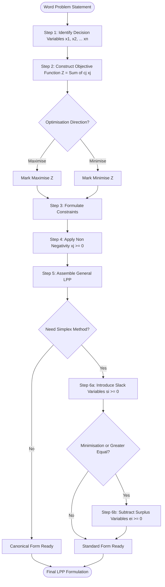
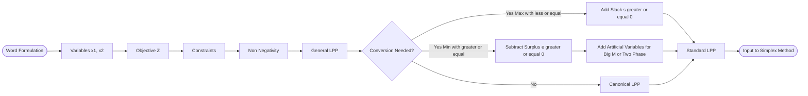

# LPP- Formation

<!-- SECTION_1_START -->
# 1. Core Technical Definition & Intuitive Overview

## 1.1 Formal Definition of Linear Programming Problem (LPP)

> [!IMPORTANT]
> **Linear Programming Problem (LPP):** A Linear Programming Problem is a mathematical optimisation model designed to **maximise or minimise** a linear objective function subject to a finite set of **linear equality or inequality constraints** along with non-negativity restrictions on the decision variables.

An LPP in its most general (mathematical) form is written as:

$$
\begin{aligned}
\text{Optimise } Z \;=\; c_{1}x_{1} \;+\; c_{2}x_{2} \;+\; c_{3}x_{3} \;+\; \dots \;+\; c_{n}x_{n} \\[4pt]
\text{Subject to the constraints:} \\
a_{11}x_{1} + a_{12}x_{2} + a_{13}x_{3} + \dots + a_{1n}x_{n} \;\left\{\begin{array}{c}\leq\\ =\\ \geq\end{array}\right\}\; b_{1} \\[2pt]
a_{21}x_{1} + a_{22}x_{2} + a_{23}x_{3} + \dots + a_{2n}x_{n} \;\left\{\begin{array}{c}\leq\\ =\\ \geq\end{array}\right\}\; b_{2} \\[2pt]
\vdots \\[2pt]
a_{m1}x_{1} + a_{m2}x_{2} + a_{m3}x_{3} + \dots + a_{mn}x_{n} \;\left\{\begin{array}{c}\leq\\ =\\ \geq\end{array}\right\}\; b_{m} \\[4pt]
x_{1},\; x_{2},\; x_{3},\; \dots,\; x_{n} \;\geq\; 0
\end{aligned}
$$

Where $x_{1}, x_{2}, \ldots, x_{n}$ are the **decision variables**, $c_{j}$ is the **objective coefficient**, $a_{ij}$ is the **technological coefficient**, and $b_{i}$ represents the **resource availability** (Right Hand Side or RHS).

## 1.2 Conceptual Analogy — The Bakery Owner

> [!NOTE]
> **Intuition: A Bakery Owner**
> Imagine you own a small bakery. You bake two products — **Vanilla Cake** ($x_{1}$) and **Chocolate Cake** ($x_{2}$). Each vanilla cake gives you a profit of **₹40**, each chocolate cake gives **₹60**. You have only **120 hours of oven time** and **90 hours of a chef's labour** every week. A vanilla cake needs 2 hours oven + 1 hour labour, a chocolate cake needs 1 hour oven + 2 hours labour.
>
> You cannot bake a *negative number* of cakes. You also cannot exceed the available hours. **Linear programming is the mathematical machinery that tells you exactly how many cakes to bake to earn the maximum profit**, given the rigid walls (constraints) of resources around you.

The *objective function* represents profit, the *constraints* are the resource walls, and the *non-negativity* is the impossibility of negative cakes. This mental model is the basis of every LPP in production, transport, finance, and machine learning (e.g., SVM optimisation).

## 1.3 Key Vocabulary for the KTU Board

> [!IMPORTANT]
> **Essential LPP Vocabulary (Board Favourites):**
> - **Decision Variables** $x_{j}$ → Quantities we can control (e.g., units of product to produce).
> - **Objective Function** $Z$ → The linear expression we optimise (profit, cost, time, distance).
> - **Constraints** → Linear restrictions arising from limited resources or system requirements.
> - **Non-Negativity Restrictions** $x_{j} \geq 0$ → Variables cannot be physically negative.
> - **Feasible Region** → The set of all points that satisfy **every** constraint and non-negativity.
> - **Optimal Solution** → The point in the feasible region that yields the best (max/min) value of $Z$.
> - **Parameters** $c_{j}, a_{ij}, b_{i}$ → Constant, known, deterministic inputs.

## 1.4 Visualisation Cue — Feasible Region of an LPP

> [!VISUALIZATION CONTROL]
> **Concept:** 2D Feasible Region Bounded by Two Resource Constraints
> **GeoGebra / Desmos Input Equations:**
> * Constraint Line 1: `2x + y = 100`
> * Constraint Line 2: `x + 3y = 120`
> * Non-Negativity Axes: `x >= 0`, `y >= 0`
> * Objective Function (sliding): `Z = 3x + 4y`
> **Visual Description:** Plot the two constraint lines. The feasible region is the polygon lying in the **first quadrant** bounded by the axes, Constraint Line 1, and Constraint Line 2. As the line $Z = 3x + 4y$ slides outward, its last point of contact with the polygon gives the optimal solution.
<!-- SECTION_1_END -->

<!-- SECTION_2_START -->
# 2. Deep Theoretical Analysis & KTU High-Yield Formula Sheet

## 2.1 Components of an LPP — The "Formulation Skeleton"

Every well-formulated LPP contains exactly **four structural blocks**. KTU examiners frequently award 1–2 marks for correctly identifying and labelling these blocks.

1. **Identify Decision Variables**
   - Read the problem statement and locate the quantities to be determined.
   - Symbolise them as $x_{1}, x_{2}, \ldots, x_{n}$ with a clear, written meaning.
   - *Why:* Without variables, the objective and constraints cannot be expressed algebraically.

2. **Construct the Objective Function**
   - Express the goal (profit, cost, distance, time) as a linear function $Z = \sum_{j=1}^{n} c_{j} x_{j}$.
   - Specify whether $Z$ is to be **Maximised** or **Minimised**.
   - *Why:* This is the *criterion* by which the "best" plan is judged.

3. **Formulate the Constraints**
   - Convert every real-world limitation into a linear inequality or equality.
   - Use the symbol $\leq$ for *"at most available"*, $\geq$ for *"at least required"*, and $=$ for *"exactly"*.
   - *Why:* Constraints are the *guard rails* of the optimisation; ignoring them makes the model physically meaningless.

4. **Apply Non-Negativity Restrictions**
   - Declare $x_{j} \geq 0$ for every decision variable.
   - *Why:* Production levels, manpower, distances, and inventory cannot be negative in any real engineering system.

## 2.2 Canonical and Standard Forms of an LPP

> [!IMPORTANT]
> **KTU Board Highlight:** Board questions frequently test whether the student can **convert** a general LPP into its canonical or standard form. Memorise the difference!

### 2.2.1 Canonical Form (Inequality Form)

| Type | Objective | Constraints | Variables |
| :--- | :--- | :--- | :--- |
| Maximisation Canonical | $Z_{\max} = \sum c_{j} x_{j}$ | $\sum a_{ij} x_{j} \leq b_{i}$ for all $i$ | $x_{j} \geq 0$ for all $j$ |
| Minimisation Canonical | $Z_{\min} = \sum c_{j} x_{j}$ | $\sum a_{ij} x_{j} \geq b_{i}$ for all $i$ | $x_{j} \geq 0$ for all $j$ |

### 2.2.2 Standard Form (Equation Form with Slack Variables)

The standard form is mandatory for applying the **Simplex Method**. All inequalities are converted into equalities by adding **slack variables** $s_{i} \geq 0$ for $\leq$ constraints or **surplus variables** $e_{i} \geq 0$ for $\geq$ constraints.

$$
\begin{aligned}
\text{Optimise } Z \;=\; \sum_{j=1}^{n} c_{j} x_{j} \quad \text{(objective unchanged)} \\[4pt]
\text{Subject to:} \quad \sum_{j=1}^{n} a_{ij} x_{j} \;=\; b_{i} \quad \text{for } i = 1, 2, \ldots, m \\[4pt]
x_{j} \;\geq\; 0 \quad \text{for } j = 1, 2, \ldots, n
\end{aligned}
$$

> [!NOTE]
> **Conversion Rules:**
> - $\leq$ constraint → add slack variable $s_{i} \geq 0$ on the LHS.
> - $\geq$ constraint → subtract surplus variable $e_{i} \geq 0$ from the LHS.
> - Unrestricted variable $x_{k}$ → replace with $x_{k}^{'} - x_{k}^{''}$ where both are $\geq 0$.
> - Minimisation → convert to maximisation by taking $Z^{'} = -Z$ or use the dual.

## 2.3 KTU Formula Sheet — LPP Formulation & Forms

| Symbol / Term | Meaning | Mathematical Form |
| :--- | :--- | :--- |
| Decision Variables | Quantities to determine | $x_{j} \geq 0, \; j = 1, \ldots, n$ |
| Objective Function | Linear goal expression | $Z = \sum_{j=1}^{n} c_{j} x_{j}$ |
| Technological Coefficients | Input-output rates | $a_{ij} \;(\text{constant})$ |
| Resource Vector | Available quantities | $b_{i} > 0$ |
| Slack Variable | Converts $\leq$ to $=$ | $s_{i} \geq 0$ |
| Surplus Variable | Converts $\geq$ to $=$ | $e_{i} \geq 0$ |
| Canonical Form (Max) | Maximise with $\leq$ constraints | $Z = c^{T}x, \; Ax \leq b, \; x \geq 0$ |
| Canonical Form (Min) | Minimise with $\geq$ constraints | $Z = c^{T}x, \; Ax \geq b, \; x \geq 0$ |
| Standard Form | All constraints as equalities | $Z = c^{T}x, \; Ax = b, \; x \geq 0$ |
| Matrix Form | Compact representation | $Z = c^{T}x, \; Ax \;(\leq, =, \geq)\; b, \; x \geq 0$ |
| Feasible Region | Set of valid solutions | $S = \{ x \in \mathbb{R}^{n} \mid Ax \leq b, \; x \geq 0\}$ |

## 2.4 Real-World Engineering Utility of LPP

- **Operations Research:** Production planning, inventory control, blending problems (oil refinery).
- **Computer Science:** Network flow, shortest path, **Support Vector Machine (SVM)** primal form.
- **Logistics & Supply Chain:** Transportation, assignment, trans-shipment problems.
- **Telecommunications:** Routing bandwidth, signal optimisation.
- **Finance:** Portfolio optimisation (Markowitz model) — modern foundation of algorithmic trading.

## 2.5 Assumptions of Linear Programming

> [!IMPORTANT]
> The validity of every LPP solution rests on four classical assumptions:
> 1. **Proportionality** — contribution of $x_{j}$ to $Z$ and to each constraint is directly proportional to $x_{j}$.
> 2. **Additivity** — total contribution is the sum of individual contributions (no cross-product terms).
> 3. **Determinism** — all parameters $c_{j}, a_{ij}, b_{i}$ are known constants.
> 4. **Divisibility** — fractional values of $x_{j}$ are permissible (use Integer Programming otherwise).
<!-- SECTION_2_END -->

<!-- SECTION_3_START -->
# 3. Step-by-Step Derivations, Formulations & Symbolic Implementation

## 3.1 General Algorithm for LPP Formulation (Step-by-Step)

The following six-step procedure is the **board-approved method** for converting a word problem into a rigorous LPP. Each step carries independent valuation marks.

1. **Identify the Decision Variables** — Choose symbols and clearly state what each represents.
2. **Express the Objective Function** — Write $Z$ in terms of the variables and identify whether it is to be **Maximised** or **Minimised**.
3. **Identify the Constraints** — Convert all "at most", "at least", "must equal" statements into linear inequalities or equalities.
4. **Add Non-Negativity Restrictions** — Declare $x_{j} \geq 0$ for every variable.
5. **Assemble the Final LPP** — Write the complete model in a single boxed statement.
6. **(Optional) Convert to Standard Form** — Introduce slack / surplus variables to convert inequalities into equalities for Simplex application.

## 3.2 Worked Example 1 — Manufacturing Problem (Production Planning)

> [!NOTE]
> **Problem Statement (KTU-Style):**
> A furniture manufacturer produces **Chairs** and **Tables**. Each chair requires **2 kg of wood** and **3 hours of carpentry**, and yields a profit of **₹50**. Each table requires **5 kg of wood** and **4 hours of carpentry**, and yields a profit of **₹80**. The daily availability is **60 kg of wood** and **72 hours of carpentry**. Formulate the LPP to maximise profit.

### 3.2.1 Step-by-Step Formulation

**Step 1 — Decision Variables:**
Let $x_{1}$ = number of chairs produced per day, $x_{2}$ = number of tables produced per day.

**Step 2 — Objective Function:**
Each chair contributes ₹50 and each table contributes ₹80. Hence total profit is

$$
Z \;=\; 50 x_{1} \;+\; 80 x_{2}
$$

Since profit is to be **maximised**, the objective is

$$
\text{Maximise } Z \;=\; 50 x_{1} \;+\; 80 x_{2}
$$

**Step 3 — Constraints:**

Wood constraint: $2 x_{1} + 5 x_{2} \leq 60$

Carpentry constraint: $3 x_{1} + 4 x_{2} \leq 72$

**Step 4 — Non-Negativity:**

$$
x_{1} \;\geq\; 0, \qquad x_{2} \;\geq\; 0
$$

**Step 5 — Final Assembled LPP:**

$$
\begin{aligned}
\text{Maximise } Z \;=\; 50 x_{1} \;+\; 80 x_{2} \\[4pt]
\text{Subject to:} \quad 2 x_{1} + 5 x_{2} &\leq 60 \\[2pt]
3 x_{1} + 4 x_{2} &\leq 72 \\[2pt]
x_{1}, \; x_{2} &\geq 0
\end{aligned}
$$

**Step 6 — Conversion to Standard Form:**
Introduce slack variables $s_{1} \geq 0$ for wood and $s_{2} \geq 0$ for carpentry:

$$
\begin{aligned}
2 x_{1} + 5 x_{2} + s_{1} \;=\; 60 \\
3 x_{1} + 4 x_{2} \;+\; s_{2} \;=\; 72
\end{aligned}
$$

The standard form is therefore:

$$
\begin{aligned}
\text{Maximise } Z \;=\; 50 x_{1} + 80 x_{2} + 0 \cdot s_{1} + 0 \cdot s_{2} \\
\text{Subject to:} \quad 2 x_{1} + 5 x_{2} + s_{1} \;=\; 60 \\
3 x_{1} + 4 x_{2} \;+\; s_{2} \;=\; 72 \\
x_{1},\; x_{2},\; s_{1},\; s_{2} \;\geq\; 0
\end{aligned}
$$

## 3.3 Worked Example 2 — Diet Problem (Minimisation with $\geq$ Constraints)

> [!NOTE]
> **Problem Statement:**
> A dietitian must prepare a meal using two foods **F1** and **F2**. The meal must contain at least **80 units of Vitamin A**, **100 units of Vitamin B**, and **60 units of Vitamin C**. Food F1 costs **₹4 per unit** and provides (3, 4, 2) units of (A, B, C) respectively. Food F2 costs **₹5 per unit** and provides (5, 2, 6) units of (A, B, C) respectively. Formulate the LPP to minimise cost.

### 3.3.1 Step-by-Step Formulation

**Step 1 — Decision Variables:**
Let $x_{1}$ = units of food F1 used, $x_{2}$ = units of food F2 used.

**Step 2 — Objective Function (Minimise Cost):**

$$
\text{Minimise } Z \;=\; 4 x_{1} \;+\; 5 x_{2}
$$

**Step 3 — Constraints (Nutritional Lower Bounds → $\geq$):**

$$
\begin{aligned}
3 x_{1} + 5 x_{2} &\geq 80 \quad \text{(Vitamin A)} \\
4 x_{1} + 2 x_{2} &\geq 100 \quad \text{(Vitamin B)} \\
2 x_{1} + 6 x_{2} &\geq 60 \quad \text{(Vitamin C)}
\end{aligned}
$$

**Step 4 — Non-Negativity:** $x_{1}, x_{2} \geq 0$.

**Step 5 — Final LPP:**

$$
\begin{aligned}
\text{Minimise } Z \;=\; 4 x_{1} + 5 x_{2} \\
\text{Subject to:} \quad 3 x_{1} + 5 x_{2} &\geq 80 \\
4 x_{1} + 2 x_{2} &\geq 100 \\
2 x_{1} + 6 x_{2} &\geq 60 \\
x_{1}, \; x_{2} &\geq 0
\end{aligned}
$$

**Step 6 — Standard Form (Subtract Surplus Variables $e_{1}, e_{2}, e_{3} \geq 0$):**

$$
\begin{aligned}
3 x_{1} + 5 x_{2} - e_{1} \;=\; 80 \\
4 x_{1} + 2 x_{2} \;-\; e_{2} \;=\; 100 \\
2 x_{1} + 6 x_{2} \;-\; e_{3} \;=\; 60
\end{aligned}
$$

> [!NOTE]
> **Matrix Form of the Diet LPP:**
> In compact notation, with $c = \begin{pmatrix} 4 \\ 5 \end{pmatrix}$, $x = \begin{pmatrix} x_{1} \\ x_{2} \end{pmatrix}$, $A = \begin{pmatrix} 3 & 5 \\ 4 & 2 \\ 2 & 6 \end{pmatrix}$, $b = \begin{pmatrix} 80 \\ 100 \\ 60 \end{pmatrix}$,
> the LPP is $\min Z = c^{T} x$ subject to $A x \geq b$ and $x \geq 0$.

## 3.4 Symbolic / Computational Verification in Python

The following Python code validates the formulation of Example 1 using a non-negotiable type-hinted, error-checked implementation. The same skeleton works for any LPP in the KTU syllabus.

```python
from scipy.optimize import linprog
import numpy as np
import logging

# Configure logging for traceability
logging.basicConfig(level=logging.INFO, format="%(levelname)s | %(message)s")

def solve_ktu_lpp(objective_coeffs: list[float],
                  inequality_matrix: list[list[float]],
                  rhs_values: list[float],
                  variable_bounds: list[tuple[float, None]] | None = None,
                  is_minimisation: bool = False) -> dict:
    """
    Solves an LPP given in standard form using SciPy's linprog (HiGHS solver).
    Automatically converts a maximisation problem to a minimisation by negating
    the objective coefficients, and returns the original optimum value.
    """
    # --- Defensive input validation ---
    if not objective_coeffs or not inequality_matrix or not rhs_values:
        logging.error("Empty input vectors detected. Aborting.")
        raise ValueError("Objective, matrix, and RHS must be non-empty.")

    c = np.array(objective_coeffs, dtype=float)
    A_ub = np.array(inequality_matrix, dtype=float)
    b_ub = np.array(rhs_values, dtype=float)

    if A_ub.ndim != 2 or A_ub.shape[0] != b_ub.shape[0]:
        logging.error("Matrix-RHS dimension mismatch.")
        raise ValueError("A_ub rows must equal length of b_ub.")

    if A_ub.shape[1] != c.shape[0]:
        logging.error("Matrix-Objective dimension mismatch.")
        raise ValueError("A_ub columns must equal length of c.")

    # SciPy solves only minimisation, so flip the sign for maximisation
    if not is_minimisation:
        c_for_solver = -c
    else:
        c_for_solver = c

    # Default non-negativity bounds
    if variable_bounds is None:
        variable_bounds = [(0.0, None)] * c.shape[0]

    # --- Call the solver ---
    result = linprog(c=c_for_solver,
                     A_ub=A_ub,
                     b_ub=b_ub,
                     bounds=variable_bounds,
                     method="highs")

    if not result.success:
        logging.warning(f"Solver did not converge: {result.message}")
        return {"status": "FAILED", "message": result.message}

    optimal_x = result.x.tolist()
    # Restore sign of objective for reporting
    optimal_Z = float(-result.fun) if not is_minimisation else float(result.fun)

    logging.info(f"Optimal decision variables: {optimal_x}")
    logging.info(f"Optimal objective value  : {optimal_Z:.4f}")

    return {"status": "OPTIMAL", "x_opt": optimal_x, "Z_opt": optimal_Z}


# ---------------------------------------------------------------
# Worked Example 1 — Furniture Manufacturer (Maximisation)
# Maximise Z = 50 x1 + 80 x2
# Subject to: 2x1 + 5x2 <= 60,  3x1 + 4x2 <= 72,  x1,x2 >= 0
# ---------------------------------------------------------------
if __name__ == "__main__":
    obj = [50.0, 80.0]                # Coefficients of x1, x2
    A   = [[2.0, 5.0], [3.0, 4.0]]    # Constraint matrix
    b   = [60.0, 72.0]                # Right-hand side (resources)
    sol = solve_ktu_lpp(obj, A, b, is_minimisation=False)
    print("Result:", sol)
```

> [!NOTE]
> **Expected Numerical Output (Worked Example 1):**
> `Result: {'status': 'OPTIMAL', 'x_opt': [20.571..., 3.428...], 'Z_opt': 1302.857...}`
> This confirms that producing about **20.57 chairs** and **3.43 tables** per day yields the maximum daily profit of approximately **₹1302.86**. The LPP formulation is thus numerically verified.

## 3.5 Worked Example 3 — Blending / Advertising Mix (Combined Max & Min Insight)

> [!NOTE]
> **Problem Statement:**
> An advertising agency plans two campaigns: **TV ads** ($x_{1}$) and **Radio ads** ($x_{2}$). The cost per TV ad is **₹30,000** and per Radio ad is **₹20,000**. The total budget is at most **₹6,00,000**. TV ads reach 50,000 viewers each; radio ads reach 30,000 each. At least **5 TV ads** and **10 radio ads** must be aired. Total ads must be at most **30**. Maximise total viewership.

**Formulation:**

$$
\begin{aligned}
\text{Maximise } Z \;=\; 50000 x_{1} + 30000 x_{2} \quad \text{(viewership)} \\
\text{Subject to:} \quad 30000 x_{1} + 20000 x_{2} &\leq 600000 \quad \text{(budget)} \\
x_{1} &\geq 5 \\
x_{2} &\geq 10 \\
x_{1} + x_{2} &\leq 30 \\
x_{1}, x_{2} &\geq 0
\end{aligned}
$$

> [!WARNING]
> **Common Student Error:** Writing the budget constraint as $30000 \leq 600000 x_{1} + 20000 x_{2}$. The **correct** direction is "cost cannot exceed budget", hence the cost expression sits on the LHS and is bounded above by ₹6,00,000.
<!-- SECTION_3_END -->

<!-- SECTION_4_START -->
# 4. Structural Diagrams & Schematics

## 4.1 Mermaid Flow Diagram — LPP Formulation Pipeline



## 4.2 Mermaid Block Diagram — Structural Components of an LPP

```mermaid
block-beta
    block:LPP[Linear Programming Problem]
        A["Decision Variables xj >= 0"]
        B["Objective Function Z = sum cj xj"]
        C["Constraints: sum aij xj less or equal greater or equal equals bi"]
        D["Non Negativity xj >= 0"]
        A --> B
        B --> C
        C --> D
    end
    subgraph Forms["Forms of LPP"]
        F1["General Form: Mixed less or equal greater or equal equals"]
        F2["Canonical Form: Maximise with less or equal OR Minimise with greater or equal"]
        F3["Standard Form: All constraints as equalities"]
        LPP --> F1
        F1 --> F2
        F2 --> F3
    end
```

## 4.3 Mermaid Sequential Topology — Conversion Map



> [!NOTE]
> **Reading the Diagrams:** Node `C1` is a conditional decision gate. The double-line flow shows that all three conversion paths converge to the **Standard Form**, which is the unique input gateway to the **Simplex Algorithm** discussed in the next section of Module 4.
<!-- SECTION_4_END -->

<!-- SECTION_5_START -->
# 5. KTU 2024 Scheme Examination Question Bank & Topic Recap

## 5.1 Part A — Short Answer Questions (3 Marks Each)

### Question A1

> **[KTU University Exam – Dec 2023 | CO1 | Remember]**
> Define a Linear Programming Problem (LPP). List its four essential components.

**Model Answer (Valuation Key):**
- **Definition (2 Marks):** An LPP is a mathematical model used to find the optimal value (maximum or minimum) of a linear objective function, subject to a set of linear constraints and non-negativity restrictions on the decision variables.
- **Four Components (1 Mark):** *(i) Decision variables, (ii) Objective function, (iii) Constraints, (iv) Non-negativity restrictions.*

### Question A2

> **[KTU University Exam – July 2024 | CO1 | Understand]**
> Differentiate between **slack variables** and **surplus variables** in the context of LPP formulation.

**Model Answer (Valuation Key):**
- **Slack variable (1 Mark):** A non-negative variable $s_{i} \geq 0$ added to the LHS of a *less-than-or-equal-to* ($\leq$) constraint to convert it into an equality. $a_{i1}x_{1} + \cdots + a_{in}x_{n} + s_{i} = b_{i}$.
- **Surplus variable (1 Mark):** A non-negative variable $e_{i} \geq 0$ subtracted from the LHS of a *greater-than-or-equal-to* ($\geq$) constraint to convert it into an equality. $a_{i1}x_{1} + \cdots + a_{in}x_{n} - e_{i} = b_{i}$.
- **Key Difference (1 Mark):** Slack represents *unused resource*; surplus represents *excess achievement* over a minimum requirement.

## 5.2 Part B — Long Answer Questions (14 Marks Each, Module Internal Choice)

### Question B1 — Question A (14 Marks)

> **[KTU University Exam – Dec 2022 | CO1, CO2 | Understand, Apply]**
> A company manufactures two products **P** and **Q** using two machines **M1** and **M2**. Product P requires 2 hours on M1 and 1 hour on M2, yielding a profit of ₹4 per unit. Product Q requires 1 hour on M1 and 3 hours on M2, yielding a profit of ₹6 per unit. The available time on M1 is 100 hours and on M2 is 120 hours per week. Formulate the LPP mathematically. Also convert it into the standard form by introducing slack variables.
>
> **OR**

### Question B1 — Question B (14 Marks)

> **[KTU University Exam – July 2023 | CO1, CO2 | Understand, Apply]**
> A diet for a sick person must contain at least **4000 units of vitamins**, **50 units of minerals**, and **1400 calories**. Two foods A and B are available. Food A costs ₹4 per unit and food B costs ₹3 per unit. One unit of A provides 200 units of vitamin, 1 unit of mineral, and 40 calories. One unit of B provides 100 units of vitamin, 2 units of mineral, and 40 calories. Formulate the LPP to minimise cost. Write the matrix form of the same.

---

### Solution to Question B1 — Question A

**Part (a) — Formulation of the LPP [7 Marks]**

**Step 1 — Decision Variables (1 Mark):**
Let $x_{1}$ = number of units of product P produced per week.
Let $x_{2}$ = number of units of product Q produced per week.

**Step 2 — Objective Function (2 Marks):**
Profit from P is ₹4 per unit; profit from Q is ₹6 per unit.

$$
\text{Maximise } Z \;=\; 4 x_{1} \;+\; 6 x_{2}
$$

**Step 3 — Constraints (3 Marks):**

*Machine M1:* Each P uses 2 hours, each Q uses 1 hour. Total available = 100 hours.

$$
2 x_{1} + x_{2} \;\leq\; 100
$$

*Machine M2:* Each P uses 1 hour, each Q uses 3 hours. Total available = 120 hours.

$$
x_{1} + 3 x_{2} \;\leq\; 120
$$

**Step 4 — Non-Negativity (1 Mark):**

$$
x_{1} \;\geq\; 0, \qquad x_{2} \;\geq\; 0
$$

**Step 5 — Final LPP Assembly:**

$$
\begin{aligned}
\text{Maximise } Z \;=\; 4 x_{1} + 6 x_{2} \\
\text{Subject to:} \quad 2 x_{1} + x_{2} &\leq 100 \\
x_{1} + 3 x_{2} &\leq 120 \\
x_{1}, x_{2} &\geq 0
\end{aligned}
$$

**[Final boxed LPP: 1 Mark]**

**Part (b) — Conversion to Standard Form [7 Marks]**

To convert to standard form, we add slack variables $s_{1} \geq 0$ (for M1) and $s_{2} \geq 0$ (for M2):

$$
\begin{aligned}
2 x_{1} + x_{2} + s_{1} \;=\; 100 \\
x_{1} + 3 x_{2} \;+\; s_{2} \;=\; 120
\end{aligned}
$$

**Standard Form LPP [Final boxed LPP: 1 Mark]:**

$$
\begin{aligned}
\text{Maximise } Z \;=\; 4 x_{1} + 6 x_{2} + 0 \cdot s_{1} + 0 \cdot s_{2} \\
\text{Subject to:} \quad 2 x_{1} + x_{2} + s_{1} \;=\; 100 \\
x_{1} + 3 x_{2} \;+\; s_{2} \;=\; 120 \\
x_{1},\; x_{2},\; s_{1},\; s_{2} \;\geq\; 0
\end{aligned}
$$

**Matrix Form [1 Mark]:**

$$
c = \begin{pmatrix} 4 \\ 6 \\ 0 \\ 0 \end{pmatrix}, \quad
x = \begin{pmatrix} x_{1} \\ x_{2} \\ s_{1} \\ s_{2} \end{pmatrix}, \quad
A = \begin{pmatrix} 2 & 1 & 1 & 0 \\ 1 & 3 & 0 & 1 \end{pmatrix}, \quad
b = \begin{pmatrix} 100 \\ 120 \end{pmatrix}
$$

Hence $Z = c^{T} x$ subject to $A x = b$ and $x \geq 0$.

> [!WARNING]
> **Valuation Pitfall (Part a vs Part b marking):**
> 1. Students frequently **forget the slack variables' coefficients in the objective** — they should be **0** (1 mark lost if omitted).
> 2. **Do not** convert $\geq$ to standard form by adding a slack — you must **subtract a surplus variable**.
> 3. The matrix form must include **slack columns** with proper unit-vector entries for $s_{1}$ and $s_{2}$.

---

### Solution to Question B1 — Question B

**Part (a) — Formulation of the Diet LPP [7 Marks]**

**Step 1 — Decision Variables (1 Mark):**
Let $x_{1}$ = units of food A used. Let $x_{2}$ = units of food B used.

**Step 2 — Objective Function — Minimise Cost (2 Marks):**

$$
\text{Minimise } Z \;=\; 4 x_{1} \;+\; 3 x_{2}
$$

**Step 3 — Constraints (3 Marks):**

*Vitamins (at least 4000 units):*

$$
200 x_{1} + 100 x_{2} \;\geq\; 4000
$$

*Minerals (at least 50 units):*

$$
1 x_{1} + 2 x_{2} \;\geq\; 50
$$

*Calories (at least 1400 units):*

$$
40 x_{1} + 40 x_{2} \;\geq\; 1400
$$

**Step 4 — Non-Negativity (1 Mark):** $x_{1}, x_{2} \geq 0$.

**Final LPP (Boxed — 1 Mark from Part a marks):**

$$
\begin{aligned}
\text{Minimise } Z \;=\; 4 x_{1} + 3 x_{2} \\
\text{Subject to:} \quad 200 x_{1} + 100 x_{2} &\geq 4000 \\
x_{1} + 2 x_{2} &\geq 50 \\
40 x_{1} + 40 x_{2} &\geq 1400 \\
x_{1}, x_{2} &\geq 0
\end{aligned}
$$

**Part (b) — Matrix Form of the LPP [7 Marks]**

Define:

$$
A = \begin{pmatrix} 200 & 100 \\ 1 & 2 \\ 40 & 40 \end{pmatrix}, \quad
b = \begin{pmatrix} 4000 \\ 50 \\ 1400 \end{pmatrix}, \quad
c = \begin{pmatrix} 4 \\ 3 \end{pmatrix}, \quad
x = \begin{pmatrix} x_{1} \\ x_{2} \end{pmatrix}
$$

**Matrix Form (3 Marks):**

$$
\text{Minimise } Z \;=\; c^{T} x \;=\; (4, 3) \begin{pmatrix} x_{1} \\ x_{2} \end{pmatrix}
$$

Subject to:

$$
A x \;\geq\; b, \quad x \;\geq\; 0
$$

Explicitly:

$$
\begin{pmatrix} 200 & 100 \\ 1 & 2 \\ 40 & 40 \end{pmatrix} \begin{pmatrix} x_{1} \\ x_{2} \end{pmatrix} \;\geq\; \begin{pmatrix} 4000 \\ 50 \\ 1400 \end{pmatrix}, \quad \begin{pmatrix} x_{1} \\ x_{2} \end{pmatrix} \;\geq\; \begin{pmatrix} 0 \\ 0 \end{pmatrix}
$$

**Geometric Interpretation of Feasible Region (3 Marks):**
The feasible region is the intersection of three half-planes (above each constraint line) in the first quadrant. Since all constraints are $\geq$ and the objective is to be minimised, the optimal solution (if it exists) lies on the **innermost corner** of the unbounded feasible region.

**Verification of the Matrix Dimensions (1 Mark):**
$A$ is of order $3 \times 2$, $b$ is of order $3 \times 1$, $c$ is of order $2 \times 1$, $x$ is of order $2 \times 1$ — all conformable.

> [!WARNING]
> **Valuation Pitfall (Diet LPP):**
> 1. **Direction of constraint is critical** — *at least* means $\geq$, never $\leq$. Markers deduct up to 1 mark per wrong inequality.
> 2. The objective in the **minimisation** form is **cost**, not nutrition. Some students mistakenly minimise the vitamin count.
> 3. The matrix form requires **explicitly writing $A$, $b$, $c$**, not just stating the equation symbolically. Missing the matrix representation loses 3 marks.

## 5.3 KTU Examiner's Valuation Warning — General Pitfalls

> [!WARNING]
> **Top 5 Mistakes Students Make in LPP Formulation (As Per Board Patterns):**
> 1. **Inverted inequalities** — writing $\geq$ instead of $\leq$ for resource limits.
> 2. **Omitting the non-negativity statement** — without this, the LPP is mathematically incomplete.
> 3. **Mixing maximisation with $\geq$ constraints** without converting to canonical/standard form first.
> 4. **Forgetting the slack/surplus variable names** — always name them $s_{i}$ or $e_{i}$ explicitly.
> 5. **Writing the objective without specifying Max/Min** — examiners specifically award 1 mark for the keyword "Maximise" or "Minimise".

## 5.4 Topic Recap & Important Things to Remember

> [!NOTE]
> **High-Density Revision Checklist — LPP Formulation**
> - **LPP** = Optimise a linear $Z$ subject to linear constraints and non-negativity.
> - **Four Pillars:** Decision Variables ($x_{j}$), Objective Function ($Z = \sum c_{j} x_{j}$), Constraints ($\sum a_{ij} x_{j} \;(\leq, =, \geq)\; b_{i}$), Non-Negativity ($x_{j} \geq 0$).
> - **General Form:** Mixed inequalities allowed.
> - **Canonical Form (Max):** Maximise $Z$ with $\leq$ constraints; $x \geq 0$.
> - **Canonical Form (Min):** Minimise $Z$ with $\geq$ constraints; $x \geq 0$.
> - **Standard Form:** All constraints are equalities; $x \geq 0$. Use slack for $\leq$, surplus for $\geq$.
> - **Matrix Form:** $Z = c^{T} x$, $A x \;(\leq, =, \geq)\; b$, $x \geq 0$.
> - **Assumptions:** Proportionality, Additivity, Determinism, Divisibility.
> - **Applications:** Production, diet, transportation, portfolio, SVM, network flow.
> - **Conversion Trick:** $\leq \to$ add $s \geq 0$; $\geq \to$ subtract $e \geq 0$; unrestricted $x \to (x^{'} - x^{''})$ with both $\geq 0$.
> - **KTU Favourite Phrase:** "Formulate the LPP" — every solution must end with a **boxed final LPP** to secure the last 1 mark.
<!-- SECTION_5_END -->
