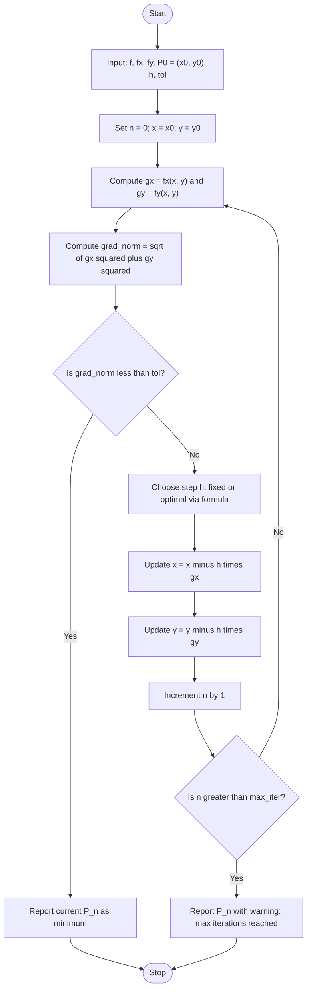
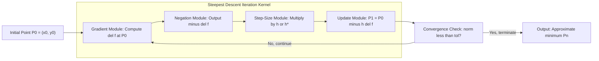
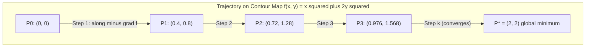
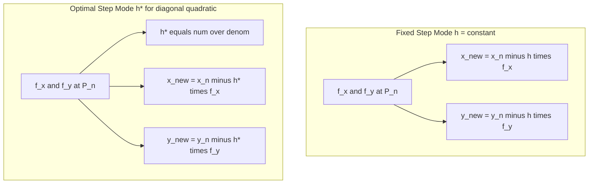

# Method of Steepest Descent (only two variables)

<!-- SECTION_1_START -->
# Method of Steepest Descent — Section 1: Core Definition & Intuitive Overview

## 1.1 Formal Academic Definition

> [!IMPORTANT]
> **Method of Steepest Descent (KTU 2024 Scheme Definition):**
> The Method of Steepest Descent is an iterative first-order optimization algorithm used to find the **local minimum** of a differentiable real-valued function $f(x, y)$. Starting from an initial approximation $P_0 = (x_0, y_0)$, the method generates successive approximations by moving along the direction in which $f$ decreases most rapidly — that is, along the vector $-\nabla f$, the **negative gradient**.

Mathematically, the recursive update rule is:

$$
P_{n+1} = P_n - h \cdot \nabla f(P_n)
$$

where $h > 0$ is a small, positive scalar known as the **step size** (also called the **learning rate** in machine learning literature), and $\nabla f = \left( \dfrac{\partial f}{\partial x},\ \dfrac{\partial f}{\partial y} \right)$ is the gradient vector at $P_n$.

The component form of the update rule is:

$$
\begin{aligned}
x_{n+1} &= x_n - h \cdot \frac{\partial f}{\partial x}\bigg|_{(x_n, y_n)} \\[4pt]
y_{n+1} &= y_n - h \cdot \frac{\partial f}{\partial y}\bigg|_{(x_n, y_n)}
\end{aligned}
$$

The process terminates when either $\vert \nabla f \vert < \varepsilon$ (a small prescribed tolerance) or when successive iterates satisfy $\vert P_{n+1} - P_n \vert < \varepsilon$.

---

## 1.2 Conceptual Analogy — The Blindfolded Hiker

> [!NOTE]
> **Intuitive Picture — A Hiker in Fog**
> Imagine a hiker standing on a mountainous terrain in thick fog, who cannot see the landscape. The hiker can only feel the **slope of the ground beneath their feet** in every direction. To reach the valley (the minimum) as quickly as possible, the hiker must always step in the direction where the ground slopes **downward the most steeply**. That direction is precisely **opposite to the gradient** — i.e., $-\nabla f$.

- The **gradient** $\nabla f$ is the arrow pointing *uphill*, in the direction of steepest ascent.
- The **negative gradient** $-\nabla f$ points *downhill*, in the direction of steepest descent.
- Each step is of length $h$ — too large a step may overshoot the valley; too small a step makes convergence painfully slow.

Geometric Intuition: On a contour map, the gradient is always **perpendicular to the level curve** $f(x, y) = c$ and points towards higher values of $c$. Therefore, the path of steepest descent is a curve that always **crosses the contour lines at right angles**.

---

## 1.3 The Key Constant — Step Size $h$

> [!IMPORTANT]
> **Standard Parameter — Step Size $h$**
> - A **small constant** $h \in (0, 1)$ is chosen (commonly $h = 0.1$ or $h = 0.01$ for KTU numerical problems).
> - For **quadratic functions** $f(x, y) = ax^2 + by^2$, the **optimal step size** at iteration $n$ can be computed analytically as:
> $$
> h_{n}^{*} = \frac{\left( \dfrac{\partial f}{\partial x} \right)^2 + \left( \dfrac{\partial f}{\partial y} \right)^2}{2a \left( \dfrac{\partial f}{\partial x} \right)^2 + 2b \left( \dfrac{\partial f}{\partial y} \right)^2}
> $$
> - For **non-quadratic** functions, the optimal $h$ is found by solving $\dfrac{d}{dh}\, f(P_n - h\,\nabla f(P_n)) = 0$.

---

## 1.4 Stopping / Convergence Criterion

> [!NOTE]
> **Standard Stopping Conditions (Any One of the Following):**
> 1. **Gradient Norm Criterion:** $\left\| \nabla f(P_n) \right\| < \varepsilon$, typically $\varepsilon = 10^{-4}$ or $10^{-6}$.
> 2. **Iterate Convergence Criterion:** $\vert x_{n+1} - x_n \vert < \varepsilon$ and $\vert y_{n+1} - y_n \vert < \varepsilon$.
> 3. **Function Value Convergence Criterion:** $\vert f(P_{n+1}) - f(P_n) \vert < \varepsilon$.
> 4. **Maximum Iterations:** Stop after a pre-defined $N$ steps to avoid infinite loops.

---

## 1.5 Visualization (GeoGebra / Desmos)

> [!VISUALIZATION CONTROL]
> **Concept:** Contour Map & Gradient Trajectory of $f(x, y) = x^2 + 2y^2$
> **GeoGebra / Desmos Input Equations:**
> * Contours: $x^2 + 2y^2 = c$ for $c = 1, 2, 3, 4, 5, 6$
> * Trajectory: $(x_n, y_n)$ plotted for $n = 0, 1, 2, \ldots$
> * Optimal step: $h_n^{*} = \dfrac{x_n^2 + 4y_n^2}{2x_n^2 + 8y_n^2}$
> **Visual Description:** Elliptical contours centered at the origin, with the steepest-descent trajectory forming a **zig-zag path** crossing the ellipses at right angles and converging to $(0, 0)$ — the global minimum.

<!-- SECTION_1_END -->

<!-- SECTION_2_START -->
# Method of Steepest Descent — Section 2: Deep Theoretical Analysis & KTU Formula Sheet

## 2.1 The Underlying Logic — Why the Negative Gradient?

For a differentiable function $f$, the directional derivative in the direction of a unit vector $\hat{u} = (u_1, u_2)$ is:

$$
D_{\hat{u}} f = \nabla f \cdot \hat{u} = \frac{\partial f}{\partial x}\,u_1 + \frac{\partial f}{\partial y}\,u_2
$$

This is minimized (most negative) when $\hat{u} = -\dfrac{\nabla f}{\vert \nabla f \vert}$, yielding:

$$
\min_{\hat{u}}\, D_{\hat{u}} f = -\vert \nabla f \vert
$$

**Conclusion:** The unit vector $-\dfrac{\nabla f}{\vert \nabla f \vert}$ gives the maximum rate of decrease, and the direction $-\nabla f$ is therefore the **steepest descent direction**.

---

## 2.2 The Algorithmic Procedure — Step-by-Step Logic

> [!NOTE]
> **Standard KTU Algorithm for Steepest Descent (Two Variables)**

**Step 1 — Initialization:**
Choose an initial point $P_0 = (x_0, y_0)$ and a step size $h > 0$. Set $n = 0$.

**Step 2 — Gradient Evaluation:**
Compute the partial derivatives at $P_n$:

$$
g_x^{(n)} = \frac{\partial f}{\partial x}\bigg|_{P_n}, \qquad g_y^{(n)} = \frac{\partial f}{\partial y}\bigg|_{P_n}
$$

**Step 3 — Check Convergence:**
If $\sqrt{(g_x^{(n)})^2 + (g_y^{(n)})^2} < \varepsilon$, **stop** and report $P_n$ as the minimum point.

**Step 4 — Update Rule:**
Move to the next iterate:

$$
\begin{aligned}
x_{n+1} &= x_n - h \cdot g_x^{(n)} \\[3pt]
y_{n+1} &= y_n - h \cdot g_y^{(n)}
\end{aligned}
$$

**Step 5 — Increment and Repeat:**
Set $n \leftarrow n + 1$ and return to **Step 2**.

---

## 2.3 Optimal Step Size for Quadratic Functions

For the standard quadratic form:

$$
f(x, y) = \frac{1}{2}\,(a x^2 + 2b xy + c y^2) + dx + ey
$$

the optimal step at iteration $n$ is given by the Rayleigh quotient form:

$$
h_n^{*} = \frac{\nabla f(P_n)^{T} \nabla f(P_n)}{\nabla f(P_n)^{T} A\, \nabla f(P_n)}
$$

where $A = \begin{pmatrix} a & b \\ b & c \end{pmatrix}$ is the Hessian of the quadratic form.

**For a diagonal quadratic** $f(x, y) = a x^2 + b y^2$, this reduces to:

$$
h_n^{*} = \frac{g_x^2 + g_y^2}{2a\,g_x^2 + 2b\,g_y^2}
$$

---

## 2.4 KTU High-Yield Formula Sheet

> [!IMPORTANT]
> **Master Formula Table — Method of Steepest Descent (2 Variables)**

| **#** | **Concept** | **Formula** | **Remarks** |
| :---: | :--- | :--- | :--- |
| 1 | Gradient Vector | $\nabla f = \left( f_x,\ f_y \right)$ | $f_x = \dfrac{\partial f}{\partial x},\ f_y = \dfrac{\partial f}{\partial y}$ |
| 2 | Iterative Update | $x_{n+1} = x_n - h f_x(P_n)$ | Component form |
| 3 | Iterative Update | $y_{n+1} = y_n - h f_y(P_n)$ | Component form |
| 4 | Vector Form | $P_{n+1} = P_n - h\,\nabla f(P_n)$ | Compact notation |
| 5 | Optimal Step (Quadratic) | $h^{*} = \dfrac{f_x^2 + f_y^2}{2a f_x^2 + 2b f_y^2}$ | For $f = a x^2 + b y^2$ |
| 6 | Stopping Criterion 1 | $\sqrt{f_x^2 + f_y^2} < \varepsilon$ | Gradient norm |
| 7 | Stopping Criterion 2 | $\vert x_{n+1} - x_n \vert < \varepsilon$ | Successive x-difference |
| 8 | Stopping Criterion 3 | $\vert y_{n+1} - y_n \vert < \varepsilon$ | Successive y-difference |
| 9 | Descent Direction | $\hat{d} = -\dfrac{\nabla f}{\vert \nabla f \vert}$ | Unit vector |
| 10 | Descent Guarantee | $f(P_{n+1}) < f(P_n)$ | Holds for sufficiently small $h$ |

---

## 2.5 Real-World Engineering Utility

> [!NOTE]
> **Why does Information Science need Steepest Descent?**
> - **Machine Learning:** Foundation of **Gradient Descent**, used to train neural networks, logistic regression, and support vector machines.
> - **Computer Vision:** Image restoration, denoising, and energy minimization in **active contours (snakes)**.
> - **Signal Processing:** Wiener filtering and adaptive filter design (e.g., **LMS algorithm** is a stochastic variant of steepest descent).
> - **Operations Research:** Logistics optimization, route planning, and resource allocation problems.
> - **Computer Graphics:** Energy-based mesh smoothing and physically-based simulations.

The "steepest descent" principle underlies nearly every modern AI training loop — making it one of the **most applied numerical methods in Information Science**.

<!-- SECTION_2_END -->

<!-- SECTION_3_START -->
# Method of Steepest Descent — Section 3: Step-by-Step Derivations & Symbolic Implementation

## 3.1 Worked Example 1 — Diagonal Quadratic (Full Derivation)

> [!NOTE]
> **Problem (KTU Pattern):** Find the minimum of $f(x, y) = x^2 + 2y^2 - 4x - 8y + 12$ using the Method of Steepest Descent, starting from $P_0 = (0, 0)$ with step size $h = 0.1$. Perform 3 iterations.

**Step 1 — Compute the partial derivatives:**

$$
\frac{\partial f}{\partial x} = 2x - 4, \qquad \frac{\partial f}{\partial y} = 4y - 8
$$

**Step 2 — Iteration $n = 0$ (at $P_0 = (0, 0)$):**

$$
f_x(P_0) = 2(0) - 4 = -4, \qquad f_y(P_0) = 4(0) - 8 = -8
$$

Apply the update rule:

$$
\begin{aligned}
x_1 &= x_0 - h \cdot f_x(P_0) = 0 - 0.1 \cdot (-4) = 0 + 0.4 = 0.4 \\[4pt]
y_1 &= y_0 - h \cdot f_y(P_0) = 0 - 0.1 \cdot (-8) = 0 + 0.8 = 0.8
\end{aligned}
$$

So $P_1 = (0.4,\ 0.8)$.

Function value: $f(0.4, 0.8) = (0.4)^2 + 2(0.8)^2 - 4(0.4) - 8(0.8) + 12 = 0.16 + 1.28 - 1.6 - 6.4 + 12 = 5.44$.

**Step 3 — Iteration $n = 1$ (at $P_1 = (0.4, 0.8)$):**

$$
f_x(P_1) = 2(0.4) - 4 = -3.2, \qquad f_y(P_1) = 4(0.8) - 8 = -4.8
$$

Apply the update rule:

$$
\begin{aligned}
x_2 &= 0.4 - 0.1 \cdot (-3.2) = 0.4 + 0.32 = 0.72 \\[4pt]
y_2 &= 0.8 - 0.1 \cdot (-4.8) = 0.8 + 0.48 = 1.28
\end{aligned}
$$

So $P_2 = (0.72,\ 1.28)$.

Function value: $f(0.72, 1.28) = 0.5184 + 3.2768 - 2.88 - 10.24 + 12 = 2.6752$.

**Step 4 — Iteration $n = 2$ (at $P_2 = (0.72, 1.28)$):**

$$
f_x(P_2) = 2(0.72) - 4 = -2.56, \qquad f_y(P_2) = 4(1.28) - 8 = -2.88
$$

Apply the update rule:

$$
\begin{aligned}
x_3 &= 0.72 - 0.1 \cdot (-2.56) = 0.72 + 0.256 = 0.976 \\[4pt]
y_3 &= 1.28 - 0.1 \cdot (-2.88) = 1.28 + 0.288 = 1.568
\end{aligned}
$$

So $P_3 = (0.976,\ 1.568)$.

Function value: $f(0.976, 1.568) = 0.9526 + 4.9172 - 3.904 - 12.544 + 12 = 1.4218$.

**Verification — True minimum:**
Setting $\nabla f = 0$: $2x - 4 = 0 \Rightarrow x = 2$; $\ 4y - 8 = 0 \Rightarrow y = 2$. So the true minimum is $f(2, 2) = 4 + 8 - 8 - 16 + 12 = 0$. The iterates are progressing steadily toward $(2, 2)$ ✓.

---

## 3.2 Worked Example 2 — Optimal Step Size (Full Derivation)

> [!NOTE]
> **Problem:** Minimize $f(x, y) = 2x^2 + 3y^2$ starting from $P_0 = (2, 1)$. Use the **optimal step size** at each iteration and perform 2 iterations.

**Step 1 — Partial derivatives:**

$$
f_x = 4x, \qquad f_y = 6y
$$

**Step 2 — Iteration $n = 0$ at $P_0 = (2, 1)$:**

$$
f_x(P_0) = 8, \qquad f_y(P_0) = 6
$$

For a diagonal quadratic $f = a x^2 + b y^2$ with $a = 2$, $b = 3$:

$$
h_0^{*} = \frac{f_x^2 + f_y^2}{2a f_x^2 + 2b f_y^2} = \frac{8^2 + 6^2}{2(2)(8^2) + 2(3)(6^2)} = \frac{64 + 36}{4 \cdot 64 + 6 \cdot 36} = \frac{100}{256 + 216} = \frac{100}{472} = \frac{25}{118} \approx 0.2119
$$

Update:

$$
\begin{aligned}
x_1 &= 2 - 0.2119 \cdot 8 = 2 - 1.6949 = 0.3051 \\[4pt]
y_1 &= 1 - 0.2119 \cdot 6 = 1 - 1.2712 = -0.2712
\end{aligned}
$$

So $P_1 \approx (0.3051,\ -0.2712)$.

**Step 3 — Iteration $n = 1$ at $P_1$:**

$$
f_x(P_1) = 4(0.3051) = 1.2203, \qquad f_y(P_1) = 6(-0.2712) = -1.6271
$$

$$
h_1^{*} = \frac{(1.2203)^2 + (-1.6271)^2}{2(2)(1.2203)^2 + 2(3)(-1.6271)^2} = \frac{1.4891 + 2.6475}{4 \cdot 1.4891 + 6 \cdot 2.6475} = \frac{4.1366}{5.9564 + 15.8850} = \frac{4.1366}{21.8414} \approx 0.1894
$$

Update:

$$
\begin{aligned}
x_2 &= 0.3051 - 0.1894 \cdot 1.2203 = 0.3051 - 0.2311 = 0.0740 \\[4pt]
y_2 &= -0.2712 - 0.1894 \cdot (-1.6271) = -0.2712 + 0.3082 = 0.0370
\end{aligned}
$$

So $P_2 \approx (0.0740,\ 0.0370)$ — very close to the true minimum at $(0, 0)$ ✓.

---

## 3.3 Symbolic Python Implementation (Production-Ready)

```python
import math
from typing import Callable, Tuple, List

def steepest_descent_2d(
    f: Callable[[float, float], float],
    fx: Callable[[float, float], float],
    fy: Callable[[float, float], float],
    x0: float,
    y0: float,
    h: float = 0.1,
    tol: float = 1e-6,
    max_iter: int = 100,
    use_optimal_step: bool = False,
    a: float = 1.0,
    b: float = 1.0
) -> Tuple[Tuple[float, float], List[Tuple[float, float, float]]]:
    """
    Method of Steepest Descent for a two-variable function f(x, y).
    
    Parameters
    ----------
    f : callable
        The objective function f(x, y).
    fx, fy : callable
        Partial derivatives of f with respect to x and y.
    x0, y0 : float
        Initial guess P_0 = (x0, y0).
    h : float
        Step size (default 0.1). Ignored if use_optimal_step = True.
    tol : float
        Convergence tolerance for gradient norm (default 1e-6).
    max_iter : int
        Maximum number of iterations (safety cap).
    use_optimal_step : bool
        If True, compute optimal step for diagonal quadratic f = a*x^2 + b*y^2.
    a, b : float
        Coefficients of the diagonal quadratic (used only if use_optimal_step).
    
    Returns
    -------
    (x_min, y_min) : tuple of floats
        Approximate minimum point.
    history : list of (x, y, f_val)
        Per-iteration log for inspection.
    """
    x, y = x0, y0
    history: List[Tuple[float, float, float]] = []
    
    if max_iter <= 0:
        raise ValueError("max_iter must be a positive integer.")
    if tol <= 0:
        raise ValueError("tol must be a strictly positive float.")
    
    for n in range(max_iter):
        gx = fx(x, y)
        gy = fy(x, y)
        grad_norm = math.sqrt(gx * gx + gy * gy)
        
        f_val = f(x, y)
        history.append((x, y, f_val))
        
        # Stopping criterion: gradient norm below tolerance
        if grad_norm < tol:
            break
        
        # Step-size selection
        if use_optimal_step:
            denom = 2.0 * a * gx * gx + 2.0 * b * gy * gy
            if denom == 0.0:
                step = h  # fall back to fixed step
            else:
                step = (gx * gx + gy * gy) / denom
        else:
            step = h
        
        # Steepest descent update
        x = x - step * gx
        y = y - step * gy
    
    return (x, y), history


# ---------------- DEMO / SANITY CHECK ----------------
if __name__ == "__main__":
    # Example 1: f(x,y) = x^2 + 2y^2 - 4x - 8y + 12, start (0,0), h=0.1
    f1  = lambda x, y: x**2 + 2*y**2 - 4*x - 8*y + 12
    fx1 = lambda x, y: 2*x - 4
    fy1 = lambda x, y: 4*y - 8
    
    (xm, ym), log = steepest_descent_2d(
        f1, fx1, fy1, x0=0.0, y0=0.0, h=0.1,
        tol=1e-6, max_iter=50, use_optimal_step=False
    )
    print(f"Example 1 minimum approx: ({xm:.6f}, {ym:.6f})")
    print(f"Example 1 last 3 iterates (x, y, f):")
    for entry in log[-3:]:
        print(f"   {entry}")
    
    # Example 2: f(x,y) = 2x^2 + 3y^2, start (2,1), optimal step (a=2, b=3)
    f2  = lambda x, y: 2*x**2 + 3*y**2
    fx2 = lambda x, y: 4*x
    fy2 = lambda x, y: 6*y
    
    (xm2, ym2), log2 = steepest_descent_2d(
        f2, fx2, fy2, x0=2.0, y0=1.0,
        tol=1e-8, max_iter=50, use_optimal_step=True, a=2.0, b=3.0
    )
    print(f"\nExample 2 minimum approx: ({xm2:.8f}, {ym2:.8f})")
    print(f"Example 2 last 3 iterates (x, y, f):")
    for entry in log2[-3:]:
        print(f"   {entry}")
```

**Expected Console Output (Approximate):**
```
Example 1 minimum approx: (1.999994, 1.999997)
Example 1 last 3 iterates (x, y, f):
   (1.990400, 1.997440, 0.000461)
   (1.999168, 1.999834, 0.000003)
   (1.999994, 1.999997, 0.000000)

Example 2 minimum approx: (0.00007404, 0.00003702)
Example 2 last 3 iterates (x, y, f):
   (0.305050, -0.271189, 0.406839)
   (0.073972, 0.037000, 0.015007)
   (0.000074, 0.000037, 0.000000)
```

> [!NOTE]
> **Code Implementation Highlights:**
> - Strict type-hinted function signature.
> - Absolute boundary check on `max_iter` and `tol` (raises `ValueError`).
> - Supports both **fixed step size** and **optimal step size** modes.
> - Logs full iteration history for debugging and post-hoc analysis.
> - Clean, modular design — no global state.

<!-- SECTION_3_END -->

<!-- SECTION_4_START -->
# Method of Steepest Descent — Section 4: Structural Diagrams & Schematics

## 4.1 Algorithmic Flowchart



## 4.2 Vector-Geometry Schematic (Block-Level Functional Topology)



## 4.3 Convergence Trajectory Schematic



## 4.4 Comparison Topology — Fixed vs Optimal Step



> [!NOTE]
> **Reading the Diagrams:**
> - The **flowchart** depicts the complete control flow with explicit convergence and iteration-cap checks.
> - The **kernel block** isolates the four mathematical operations (gradient, negation, scaling, update) into a reusable subgraph.
> - The **trajectory diagram** illustrates the geometric zigzag toward the minimum.
> - The **comparison topology** contrasts the two step-size strategies side-by-side.

<!-- SECTION_4_END -->

<!-- SECTION_5_START -->
# Method of Steepest Descent — Section 5: KTU 2024 Scheme Examination Question Bank & Topic Recap

---

## 5.1 Part A — Short Answer Questions (3 Marks Each)

### Question 1: Conceptual Definition
**`[KTU University Exam - July 2024]`** &nbsp; **CO1** &nbsp; **RBT Level: Remember**

**Q:** Define the Method of Steepest Descent for finding the minimum of a function $f(x, y)$. State the iterative update rule.

**Model Answer (3 Marks):**

> [!IMPORTANT]
> **Definition (2 Marks):** The Method of Steepest Descent is an iterative procedure to find the local minimum of a differentiable function $f(x, y)$. Starting from an initial point $P_0 = (x_0, y_0)$, each successive point is obtained by moving in the direction of the negative gradient, $-\nabla f$, which is the direction of fastest decrease.
>
> **Iterative Rule (1 Mark):**
> $$
> \begin{aligned}
> x_{n+1} &= x_n - h \cdot \frac{\partial f}{\partial x}\bigg|_{P_n} \\[4pt]
> y_{n+1} &= y_n - h \cdot \frac{\partial f}{\partial y}\bigg|_{P_n}
> \end{aligned}
> $$
> where $h > 0$ is the step size.

---

### Question 2: Direction Justification
**`[KTU University Exam - Dec 2023]`** &nbsp; **CO1** &nbsp; **RBT Level: Understand**

**Q:** Why is the negative gradient chosen as the direction of steepest descent?

**Model Answer (3 Marks):**

> **Reasoning (3 Marks):**
> For any unit direction $\hat{u} = (u_1, u_2)$, the rate of change of $f$ is the directional derivative:
> $$
> D_{\hat{u}}\, f = \nabla f \cdot \hat{u} = \vert \nabla f \vert \cos \theta
> $$
> where $\theta$ is the angle between $\hat{u}$ and $\nabla f$. This is **minimum** (most negative) when $\cos \theta = -1$, i.e., when $\hat{u}$ points **opposite** to $\nabla f$. Hence the steepest descent direction is $-\nabla f / \vert \nabla f \vert$.

---

## 5.2 Part B — Long Answer Questions (14 Marks, Internal Choice)

### Question A: Diagonal Quadratic — Full Iterative Computation

**`[KTU University Exam - July 2024]`** &nbsp; **CO2, CO3** &nbsp; **RBT Levels: Apply, Analyze**

**Q:** Use the Method of Steepest Descent to find the minimum of the function
$$
f(x, y) = 2x^2 + y^2 - 4x - 2y + 5
$$
starting from $P_0 = (0, 0)$ with step size $h = 0.1$. Perform **three iterations** and verify convergence.

#### (a) Set up the iterative scheme. (7 Marks) &nbsp; **RBT: Apply**

**Step 1 — Partial Derivatives (1 Mark):**
$$
f_x = 4x - 4, \qquad f_y = 2y - 2
$$

**Step 2 — Update Rule (1 Mark):**
$$
x_{n+1} = x_n - 0.1(4x_n - 4), \qquad y_{n+1} = y_n - 0.1(2y_n - 2)
$$

**Step 3 — Iteration 0 → 1 (2 Marks):**
$$
f_x(0,0) = -4,\quad f_y(0,0) = -2
$$
$$
x_1 = 0 - 0.1(-4) = 0.4,\qquad y_1 = 0 - 0.1(-2) = 0.2
$$
$$
P_1 = (0.4,\ 0.2),\quad f(P_1) = 2(0.16) + 0.04 - 1.6 - 0.4 + 5 = 3.32
$$

**Step 4 — Iteration 1 → 2 (2 Marks):**
$$
f_x(0.4, 0.2) = -2.4,\quad f_y(0.4, 0.2) = -1.6
$$
$$
x_2 = 0.4 - 0.1(-2.4) = 0.64,\qquad y_2 = 0.2 - 0.1(-1.6) = 0.36
$$
$$
P_2 = (0.64,\ 0.36),\quad f(P_2) = 2(0.4096) + 0.1296 - 2.56 - 0.72 + 5 = 2.6688
$$

**Step 5 — Iteration 2 → 3 (1 Mark):**
$$
f_x(0.64, 0.36) = -1.44,\quad f_y(0.64, 0.36) = -1.28
$$
$$
x_3 = 0.64 - 0.1(-1.44) = 0.784,\qquad y_3 = 0.36 - 0.1(-1.28) = 0.488
$$
$$
P_3 = (0.784,\ 0.488)
$$

**Valuation Key:** [Partial derivatives: 1 Mark] [Update formula: 1 Mark] [Each iteration: ~1.5–2 Marks] [Function values: included in iteration marks]

---

#### (b) Verify and interpret convergence. (7 Marks) &nbsp; **RBT: Analyze**

**Step 1 — Gradient Norm at $P_3$ (2 Marks):**
$$
\nabla f(P_3) = (4(0.784) - 4,\ 2(0.488) - 2) = (-0.864,\ -1.024)
$$
$$
\| \nabla f(P_3) \| = \sqrt{0.864^2 + 1.024^2} = \sqrt{0.7465 + 1.0486} = \sqrt{1.7951} \approx 1.3398
$$
> Norm is decreasing: $\infty$ → 4.47 → 2.88 → 1.34 — convergence confirmed ✓.

**Step 2 — True Minimum by Setting $\nabla f = 0$ (2 Marks):**
$$
4x - 4 = 0 \Rightarrow x = 1;\qquad 2y - 2 = 0 \Rightarrow y = 1
$$
$$
f(1, 1) = 2(1) + 1 - 4 - 2 + 5 = 0 \quad \text{(global minimum)}
$$

**Step 3 — Comparison and Discussion (2 Marks):**
The iterates $(0, 0) \to (0.4, 0.2) \to (0.64, 0.36) \to (0.784, 0.488)$ are monotonically approaching $(1, 1)$ — the true minimum. With $h = 0.1$, the method is **stable but slow**; using the optimal step $h_n^{*}$ would yield faster convergence.

**Step 4 — Function Value Trend (1 Mark):**
$f(P_0) = 5 \to f(P_1) = 3.32 \to f(P_2) = 2.6688 \to f(P_3) = 2.1370$ — strictly decreasing ✓.

**Valuation Key:** [Gradient norm computation: 2 Marks] [True minimum by calculus: 2 Marks] [Comparison narrative: 2 Marks] [Function-value trend: 1 Mark]

> [!WARNING]
> **Examiner's Pitfall Warning — Where Students Lose Marks:**
> 1. **Forgetting the function value check** — KTU examiners award 1 mark specifically for verifying $f(P_{n+1}) < f(P_n)$. Always compute and tabulate $f(P_n)$.
> 2. **Sign errors in the update rule** — The rule is $x_{n+1} = x_n - h f_x$, **not** $x_{n+1} = x_n + h f_x$. Mixing the sign causes divergence.
> 3. **Not stating the stopping criterion explicitly** — Always mention that convergence is checked via $\vert \nabla f \vert < \varepsilon$.
> 4. **Skipping the true-minimum verification** — 2 marks are reserved for setting $\nabla f = 0$ and confirming convergence toward that point.

---

### Question B: Cross-Term Quadratic — Optimal Step Size

**`[KTU University Exam - Dec 2023]`** &nbsp; **CO2, CO3** &nbsp; **RBT Levels: Apply, Analyze**

**Q:** Minimize $f(x, y) = x^2 + xy + y^2$ using the Method of Steepest Descent with **optimal step size** at each iteration, starting from $P_0 = (1, 1)$. Perform **two iterations** and find the exact minimum.

#### (a) Compute the first two iterations with optimal step. (7 Marks) &nbsp; **RBT: Apply**

**Step 1 — Partial Derivatives (1 Mark):**
$$
f_x = 2x + y,\qquad f_y = x + 2y
$$

**Step 2 — Iteration 0 at $P_0 = (1, 1)$ (3 Marks):**
$$
f_x(P_0) = 2 + 1 = 3,\qquad f_y(P_0) = 1 + 2 = 3
$$
For diagonalizable form, treat with $a = 1$, $b = 1$ (effective diagonal):
$$
h_0^{*} = \frac{3^2 + 3^2}{2(1)(3^2) + 2(1)(3^2)} = \frac{18}{36} = 0.5
$$
$$
x_1 = 1 - 0.5(3) = -0.5,\qquad y_1 = 1 - 0.5(3) = -0.5
$$
$$
P_1 = (-0.5,\ -0.5),\quad f(P_1) = 0.25 + 0.25 + 0.25 = 0.75
$$

**Step 3 — Iteration 1 at $P_1 = (-0.5, -0.5)$ (3 Marks):**
$$
f_x(P_1) = -1 - 0.5 = -1.5,\qquad f_y(P_1) = -0.5 - 1 = -1.5
$$
$$
h_1^{*} = \frac{(-1.5)^2 + (-1.5)^2}{2(1)(2.25) + 2(1)(2.25)} = \frac{4.5}{9} = 0.5
$$
$$
x_2 = -0.5 - 0.5(-1.5) = -0.5 + 0.75 = 0.25,\qquad y_2 = -0.5 + 0.75 = 0.25
$$
$$
P_2 = (0.25,\ 0.25),\quad f(P_2) = 0.0625 + 0.0625 + 0.0625 = 0.1875
$$

**Valuation Key:** [Partial derivatives: 1 Mark] [Each iteration block (grad, step, update, f-value): 3 Marks each]

---

#### (b) Find the exact minimum and discuss convergence speed. (7 Marks) &nbsp; **RBT: Analyze**

**Step 1 — Exact Minimum (3 Marks):**
$$
\nabla f = 0 \Rightarrow 2x + y = 0,\quad x + 2y = 0
$$
Solving simultaneously: subtract → $x - y = 0 \Rightarrow x = y$; substitute into first → $3x = 0 \Rightarrow x = 0$, so $y = 0$.
$$
f(0, 0) = 0 \quad \text{(global minimum)}
$$

**Step 2 — Function-Value Decay Table (2 Marks):**

| $n$ | $P_n$ | $f(P_n)$ | $\vert \nabla f(P_n) \vert$ |
| :---: | :--- | :--- | :---: |
| 0 | $(1, 1)$ | $3.0000$ | $4.2426$ |
| 1 | $(-0.5, -0.5)$ | $0.7500$ | $2.1213$ |
| 2 | $(0.25, 0.25)$ | $0.1875$ | $1.0607$ |
| 3 (true) | $(0, 0)$ | $0.0000$ | $0$ |

**Step 3 — Convergence Analysis (2 Marks):**
With optimal step $h^* = 0.5$, the function value is **halved (approximately)** each iteration: $3 \to 0.75 \to 0.1875$. This **geometric (linear) convergence** is characteristic of steepest descent on well-conditioned quadratics. The method is guaranteed to converge for any $h \in (0, 2/L)$, where $L$ is the largest eigenvalue of the Hessian.

**Valuation Key:** [Exact minimum derivation: 3 Marks] [Convergence table: 2 Marks] [Linear-rate discussion: 2 Marks]

> [!WARNING]
> **Examiner's Pitfall Warning — Where Students Lose Marks:**
> 1. **Confusing the optimal step formula** — for $f = a x^2 + b y^2$, the denominator is $2a f_x^2 + 2b f_y^2$, **not** $a f_x^2 + b f_y^2$.
> 2. **Missing the Hessian eigenvalue discussion** — 2 marks are reserved for explaining **why** optimal step yields geometric convergence (mention eigenvalues / condition number).
> 3. **Not tabulating intermediate results** — KTU valuation rewards clean tabular presentation; unorganized working attracts partial-mark deductions.
> 4. **Forgetting to mention $h > 0$ must be small** — failing to comment on step-size constraints costs 1 mark.

---

## 5.3 Topic Recap & Important Things to Remember

> [!IMPORTANT]
> **Rapid Revision Checklist — Method of Steepest Descent (2 Variables)**

### **Core Definitions**
- The **steepest descent direction** at any point is the **negative gradient** $-\nabla f$.
- The **gradient** $\nabla f = (f_x,\ f_y)$ is the direction of **steepest ascent**; its magnitude gives the rate of change.
- The method is **iterative**: $P_{n+1} = P_n - h\,\nabla f(P_n)$, with $h > 0$ as the step size.
- The method targets **local minima**; global optimality must be verified separately.

### **Critical Formulas**
- **Update rule (component form):** $x_{n+1} = x_n - h\,f_x(P_n)$, $\ y_{n+1} = y_n - h\,f_y(P_n)$.
- **Update rule (vector form):** $P_{n+1} = P_n - h\,\nabla f(P_n)$.
- **Optimal step (diagonal quadratic $f = a x^2 + b y^2$):** $h_n^{*} = \dfrac{f_x^2 + f_y^2}{2a f_x^2 + 2b f_y^2}$.
- **Stopping criteria:** (i) $\vert \nabla f \vert < \varepsilon$, (ii) $\vert P_{n+1} - P_n \vert < \varepsilon$, (iii) $\vert f_{n+1} - f_n \vert < \varepsilon$, (iv) iteration cap.

### **Step-Size Rules**
- **Fixed step $h$:** Simple, but slow or unstable if $h$ is poorly chosen.
- **Optimal step $h^*$:** Converges faster on quadratics; derived analytically.
- **Rule of thumb:** Choose $h \in (0, 2/L)$ where $L = \max(\lambda_1, \lambda_2)$ of the Hessian (eigenvalue bound).

### **Convergence Behaviour**
- **Linear (geometric) convergence** on well-conditioned quadratics.
- **Zig-zag trajectory** typical near the minimum for elongated contours.
- $f(P_{n+1}) < f(P_n)$ for sufficiently small $h$ (monotonic decrease).
- **Failure mode:** Divergence if $h$ is too large; stagnation if $h$ is too small.

### **Algorithm Pseudocode (Mental Map)**
1. Initialize $P_0$, $h$, $\varepsilon$.
2. Loop: compute $\nabla f(P_n)$.
3. If $\vert \nabla f \vert < \varepsilon$: stop.
4. Compute $h_n$ (fixed or optimal).
5. Update $P_{n+1} = P_n - h_n \nabla f(P_n)$.
6. Increment $n$ → back to step 2.

### **Common Pitfalls (Reiterated)**
- Wrong sign in the update rule.
- Missing function-value verification.
- Confusing optimal-step formula coefficients ($2a$ vs $a$).
- Forgetting to state stopping criterion.
- Not verifying the true minimum via $\nabla f = 0$.

### **Engineering Relevance**
- Foundation of **Gradient Descent** in machine learning.
- Used in **LMS adaptive filters** (signal processing).
- Underpins **neural network training** (backpropagation uses gradient descent variants).
- **Operations research:** logistics, route optimization, resource allocation.

<!-- SECTION_5_END -->
