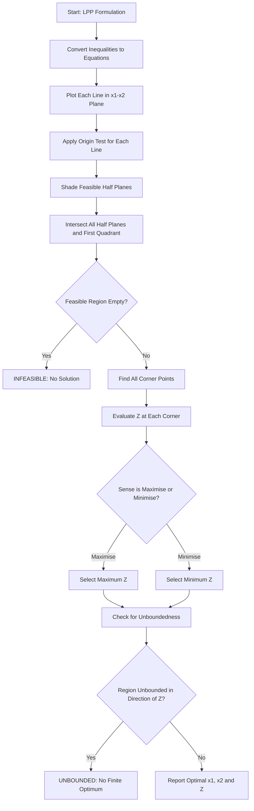
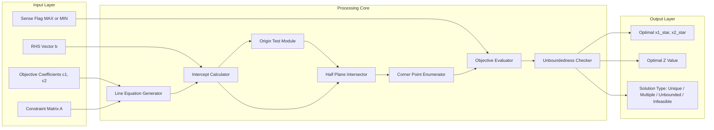
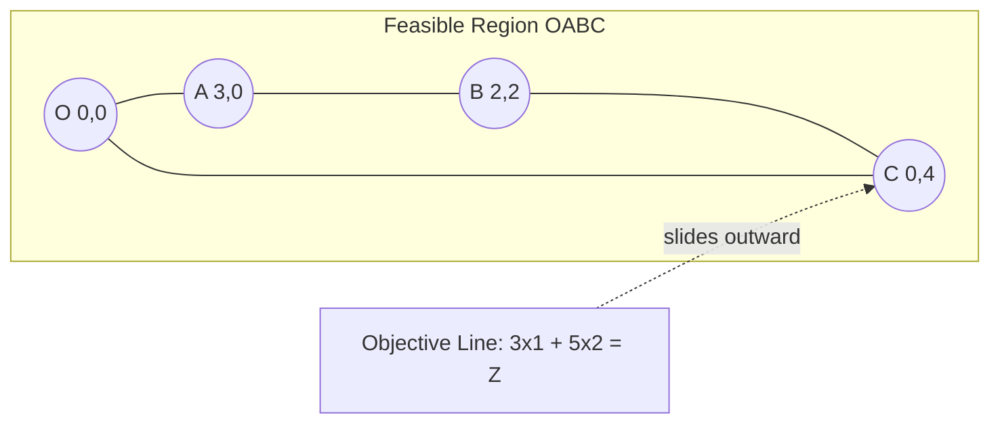

# Solution of LPP using graphic method

<!-- SECTION_1_START -->
# Solution of LPP Using Graphical Method

## 1. Core Technical Definition

A **Linear Programming Problem (LPP)** is an optimisation problem in which the objective function and all the constraints are linear in the decision variables. The **Graphical Method** is the most fundamental and visually intuitive technique for solving a two-variable LPP by plotting the constraints on a Cartesian plane, identifying the **feasible region**, and locating the optimal corner point.

> [!IMPORTANT]
> **KTU 2024 Syllabus Definition (GAMAT101 – Module 4):**
> A Linear Programming Problem is a mathematical model of the form
> Optimise (Maximise or Minimise) $Z = c_1 x_1 + c_2 x_2$
> subject to a set of linear constraints
> $a_{i1} x_1 + a_{i2} x_2 \left\{ \leq, \geq, = \right\} b_i, \; i = 1, 2, \dots, m$
> and $x_1, x_2 \geq 0$.

### Conceptual Analogy / Intuition

Imagine you are a **bakery owner** deciding how many cakes ($x_1$) and pastries ($x_2$) to bake. Each cake gives you a profit of $\mathbf{Rs.\,50}$ and each pastry $\mathbf{Rs.\,30}$, but you are limited by flour, oven time, and worker hours. You want to **maximise profit** while **staying inside your resource limits**. The "limits" form an enclosed polygon on a graph, and your best profit is always found at one of the **corners (vertices)** of that polygon — never in the middle.

> [!NOTE]
> **Key Intuition:** The optimum of a linear function over a convex polygon always lies on the **boundary**, specifically at a **vertex (corner point)** — this is the **Corner Point Theorem** of LPP.

### Terms to Memorise (KTU Board Frequently Asks)

| Term | Meaning |
|---|---|
| **Objective Function** | The linear function $Z = c_1 x_1 + c_2 x_2$ to be optimised. |
| **Decision Variables** | The controllable quantities $x_1, x_2 \geq 0$. |
| **Constraints** | Linear inequalities representing restrictions. |
| **Feasible Region** | The common area satisfying all constraints and $x_1, x_2 \geq 0$. |
| **Feasible Solution** | Any point inside or on the boundary of the feasible region. |
| **Optimal Solution** | The feasible solution that optimises the objective function. |
| **Corner Point (Vertex)** | An intersection of two boundary lines of the feasible region. |
| **Unbounded Solution** | Feasible region extends to infinity; optimum may not exist. |
| **Infeasible Solution** | No common region exists; LPP has no solution. |
| **Multiple Optimal Solutions** | Occurs when the objective line is parallel to a constraint edge. |

> [!VISUALIZATION CONTROL]
> **Concept:** Typical LPP Feasible Region with Optimal Vertex
> **GeoGebra / Desmos Input Equations:**
> * Constraint 1: $x_1 + x_2 = 4$
> * Constraint 2: $2x_1 + x_2 = 6$
> * Objective (initial): $3x_1 + 5x_2 = 15$
> **Visual Description:** Plot the two lines in the first quadrant. The shaded triangular region is the feasible area. The objective line $3x_1 + 5x_2 = Z$ slides outward — the last point of contact with the triangle gives the maximum.
<!-- SECTION_1_END -->

<!-- SECTION_2_START -->
# 2. Deep Theoretical Analysis & KTU High-Yield Formula Sheet

## 2.1 Why the Graphical Method Works (Corner Point Theorem)

> [!IMPORTANT]
> **Corner Point Theorem (Fundamental Theorem of LPP):**
> * The feasible region of an LPP is a **convex set** (polygon or convex unbounded region).
> * The maximum or minimum of the objective function over a convex polygon, **if it exists**, is always attained at one or more **corner points** of the feasible region.

This theorem is what makes the graphical method finite and algorithmic: instead of testing infinitely many points, we only need to evaluate $Z$ at the finite set of corner points.

## 2.2 Step-by-Step Algorithmic Procedure

1. **Formulate the LPP** — write $Z = c_1 x_1 + c_2 x_2$ and all constraints, with $x_1, x_2 \geq 0$.
2. **Plot each constraint** — replace the inequality with an equality to draw the line; identify the half-plane using the origin test $(0,0)$.
3. **Identify the feasible region** — the common intersection of all constraint half-planes in the **first quadrant**.
4. **Find the corner points** — these are intersections of constraint lines with each other and with the coordinate axes.
5. **Evaluate $Z$** at every corner point.
6. **Select the optimum** — for a maximisation, pick the largest $Z$; for minimisation, the smallest.
7. **Classify the solution type** — unique optimum, multiple optima, unbounded, or infeasible.

## 2.3 KTU Formula Sheet / Cheat Sheet

| Concept | Formula / Rule |
|---|---|
| Objective Function | $Z = c_1 x_1 + c_2 x_2$ |
| General Constraint | $a_1 x_1 + a_2 x_2 \leq b$ (or $\geq$, $=$) |
| Non-negativity | $x_1 \geq 0,\ x_2 \geq 0$ |
| Origin Test | Substitute $(0,0)$ in $a_1 x_1 + a_2 x_2 \leq b$; true $\Rightarrow$ origin side is feasible |
| Slope of a Line | $m = -\dfrac{a_1}{a_2}$ for line $a_1 x_1 + a_2 x_2 = b$ |
| Objective Line Slope | $m_Z = -\dfrac{c_1}{c_2}$ for $c_1 x_1 + c_2 x_2 = Z$ |
| Corner Point Rule | Optimum is at $\left( x_1^{*}, x_2^{*} \right)$ where $Z$ is max/min |
| Intercepts of a Line | $x_1$-intercept: $(b/a_1, 0)$; $x_2$-intercept: $(0, b/a_2)$ |
| Unbounded LPP Test | $Z$ can increase/decrease infinitely in feasible region $\Rightarrow$ no finite optimum |
| Multiple Optima Condition | Objective line parallel to a binding constraint edge |
| Infeasibility Condition | No point satisfies all constraints simultaneously |

> [!NOTE]
> **Engineering Utility:** LPP is the mathematical backbone of *Operations Research*. Production planning, network routing, resource allocation in cloud computing, transportation logistics, diet planning, and **CPU scheduling** in operating systems are all formulated as LPPs.

## 2.4 Solution Cases You Must Recognise

1. **Unique Optimal Solution** — single corner point gives optimum.
2. **Alternative (Multiple) Optimal Solutions** — two adjacent corner points yield the same $Z$ value.
3. **Unbounded Solution** — feasible region is unbounded in the direction of $Z$ improvement; no finite maximum (or minimum).
4. **Infeasible (No Feasible) Solution** — constraints contradict each other; no common region.
5. **Degenerate Solution** — more binding constraints meet at a point than the dimension (3 lines meeting at a vertex in 2-D).
<!-- SECTION_2_END -->

<!-- SECTION_3_START -->
# 3. Step-by-Step Derivations & Code/Symbolic Implementation

## 3.1 Worked Example 1 (Maximisation — KTU Standard Pattern)

> **Problem:** Maximise $Z = 3x_1 + 5x_2$
> Subject to: $x_1 + x_2 \leq 4$, $\;\; 2x_1 + x_2 \leq 6$, $\;\; x_1, x_2 \geq 0$.

### Step 1 — Convert Inequalities to Equations

$$x_1 + x_2 = 4 \quad \text{(L}_1\text{)}$$
$$2x_1 + x_2 = 6 \quad \text{(L}_2\text{)}$$

### Step 2 — Find Intercepts

For $L_1$: when $x_1 = 0 \Rightarrow x_2 = 4$; when $x_2 = 0 \Rightarrow x_1 = 4$.
For $L_2$: when $x_1 = 0 \Rightarrow x_2 = 6$; when $x_2 = 0 \Rightarrow x_1 = 3$.

| Line | $x_1$-intercept | $x_2$-intercept |
|---|---|---|
| $L_1: x_1 + x_2 = 4$ | $(4, 0)$ | $(0, 4)$ |
| $L_2: 2x_1 + x_2 = 6$ | $(3, 0)$ | $(0, 6)$ |

### Step 3 — Identify the Origin Side (Half-Plane Test)

Test $(0, 0)$ in each constraint:
* $0 + 0 = 0 \leq 4$ ✓ (origin satisfies $L_1$)
* $0 + 0 = 0 \leq 6$ ✓ (origin satisfies $L_2$)

Therefore, the feasible region lies **below** $L_1$ and **below** $L_2$, within the first quadrant.

### Step 4 — Determine the Corner Points

The feasible region is a quadrilateral with vertices:

* $O = (0, 0)$ — origin (intersection of axes).
* $A = (3, 0)$ — $x_1$-intercept of $L_2$ (the binding line on the $x_1$ axis).
* $B$ = intersection of $L_1$ and $L_2$.
* $C = (0, 4)$ — $x_2$-intercept of $L_1$.

**Solving for B** ($L_1$ and $L_2$):

$$
\begin{aligned}
x_1 + x_2 &= 4 \\
2x_1 + x_2 &= 6
\end{aligned}
$$

Subtract equation 1 from equation 2:

$$
\begin{aligned}
(2x_1 + x_2) - (x_1 + x_2) &= 6 - 4 \\
x_1 &= 2 \\
\Rightarrow x_2 &= 4 - x_1 = 4 - 2 = 2
\end{aligned}
$$

So $B = (2, 2)$.

### Step 5 — Evaluate the Objective Function at Every Corner

| Corner Point | $Z = 3x_1 + 5x_2$ | Value |
|---|---|---|
| $O = (0, 0)$ | $3(0) + 5(0)$ | $0$ |
| $A = (3, 0)$ | $3(3) + 5(0)$ | $9$ |
| $B = (2, 2)$ | $3(2) + 5(2)$ | $\mathbf{16}$ |
| $C = (0, 4)$ | $3(0) + 5(4)$ | $20$ |

> [!IMPORTANT]
> **Result:** $Z$ is maximised at $C = (0, 4)$ with $Z_{\max} = 20$.

**Counter-check using the objective line slope approach:**
The objective line $3x_1 + 5x_2 = Z$ has slope $m_Z = -\tfrac{3}{5}$. As $Z$ grows, the line moves away from the origin. The last contact point in the first quadrant is the $x_2$-intercept of the binding constraint $L_1$ — confirming the algebraic answer.

## 3.2 Worked Example 2 (Minimisation — Diet/Production Type)

> **Problem (KTU July 2024 pattern):** A dietician wishes to mix two foods $F_1$ and $F_2$ so that the mix contains at least $\mathbf{6}$ units of vitamin $A$ and $\mathbf{7}$ units of vitamin $B$. Food $F_1$ contains 2 units of $A$ and 1 unit of $B$ per kg; $F_2$ contains 1 unit of $A$ and 2 units of $B$ per kg. $F_1$ costs $\mathbf{Rs.\,10/kg}$ and $F_2$ costs $\mathbf{Rs.\,8/kg}$. Formulate the LPP and find the minimum cost.

### Formulation

Let $x_1$ = kg of $F_1$, $x_2$ = kg of $F_2$.

**Objective:** Minimise $Z = 10 x_1 + 8 x_2$
**Constraints:**
$$
\begin{aligned}
2x_1 + x_2 &\geq 6 \quad (\text{Vitamin A}) \\
x_1 + 2x_2 &\geq 7 \quad (\text{Vitamin B}) \\
x_1, x_2 &\geq 0
\end{aligned}
$$

### Solving the System

**Step 1:** Convert to equations and find intercepts.

* $L_1: 2x_1 + x_2 = 6$ → intercepts $(3, 0)$ and $(0, 6)$.
* $L_2: x_1 + 2x_2 = 7$ → intercepts $(7, 0)$ and $(0, 3.5)$.

**Step 2:** Origin test — $(0, 0)$ gives $0 < 6$ (violates $L_1$) and $0 < 7$ (violates $L_2$); feasible region lies **above both lines**, unbounded.

**Step 3:** Corner points of the unbounded feasible region:

* $A = (0, 7)$ — from $x_1 = 0$ on $L_2$ then check $L_1$ (since $\geq$, take the more restrictive — actually $(0, 7)$ satisfies $2(0) + 7 = 7 \geq 6$ ✓, so $A = (0, 7)$ is feasible).
* $B$ = intersection of $L_1$ and $L_2$.

Solving:

$$
\begin{aligned}
2x_1 + x_2 &= 6 \\
x_1 + 2x_2 &= 7
\end{aligned}
$$

Multiply equation 2 by 2: $2x_1 + 4x_2 = 14$. Subtract equation 1:

$$
\begin{aligned}
(2x_1 + 4x_2) - (2x_1 + x_2) &= 14 - 6 \\
3x_2 &= 8 \Rightarrow x_2 = \tfrac{8}{3} \\
\Rightarrow x_1 &= 6 - x_2 = 6 - \tfrac{8}{3} = \tfrac{10}{3}
\end{aligned}
$$

So $B = \left( \tfrac{10}{3}, \tfrac{8}{3} \right)$.

* $C = (6, 0)$ — from $x_2 = 0$ on $L_1$ (verify $L_2$: $6 + 0 = 6 < 7$ ✗, so $(6, 0)$ is **not** feasible).
* $D = (0, 6)$ — from $L_1$ on $x_2$-axis; verify $L_2$: $0 + 12 = 12 \geq 7$ ✓, so $D = (0, 6)$ is feasible.
* $E = (7, 0)$ — from $L_2$ on $x_1$-axis; verify $L_1$: $14 + 0 = 14 \geq 6$ ✓, so $E = (7, 0)$ is feasible.

The true corners of the unbounded feasible region are $A = (0, 7)$, $B = \left( \tfrac{10}{3}, \tfrac{8}{3} \right)$, and $E = (7, 0)$.

**Step 4:** Evaluate $Z = 10 x_1 + 8 x_2$:

| Corner | $Z$ |
|---|---|
| $A = (0, 7)$ | $0 + 56 = 56$ |
| $B = (\tfrac{10}{3}, \tfrac{8}{3})$ | $\tfrac{100}{3} + \tfrac{64}{3} = \tfrac{164}{3} \approx 54.67$ |
| $E = (7, 0)$ | $70 + 0 = 70$ |

> [!IMPORTANT]
> **Result:** Minimum cost $Z_{\min} = \tfrac{164}{3} = \mathbf{Rs.\,54.67}$ at $x_1 = \tfrac{10}{3}\,\text{kg},\; x_2 = \tfrac{8}{3}\,\text{kg}$.

> [!WARNING]
> **Pitfall:** For $\geq$ constraints the feasible region is *above* the line. Always re-verify each candidate corner against **all** constraints — a corner of a single line is not automatically a corner of the feasible region.

## 3.3 Python Implementation (Validation of the Graphical Result)

```python
from scipy.optimize import linprog

# Maximise Z = 3x1 + 5x2  -->  Minimise -Z
c = [-3, -5]

# x1 + x2 <= 4
# 2x1 + x2 <= 6
A_ub = [[1, 1],
        [2, 1]]
b_ub = [4, 6]

bounds = [(0, None), (0, None)]

result = linprog(c, A_ub=A_ub, b_ub=b_ub, bounds=bounds, method="highs")

print("Optimal x1, x2 :", result.x)
print("Maximum Z      :", -result.fun)
```

**Expected Output:**
`Optimal x1, x2 : [0. 4.]`  `Maximum Z : 20.0`  ✓ (matches our graphical solution)

## 3.4 Algorithm Summary (Pseudocode)

```text
GRAPHICAL_LPP(coeffs c, constraints A, b, sense="max"):
    1. For each constraint i:
         line_i : A[i,0]*x1 + A[i,1]*x2 = b[i]
         compute intercepts on both axes
         apply origin test → keep feasible half-plane
    2. Build feasible region = intersection of all half-planes
         plus x1 >= 0, x2 >= 0
    3. If intersection is empty:
         return INFEASIBLE
    4. Enumerate all corner points (axis intercepts + line-line)
         and keep only those that satisfy every constraint.
    5. If sense == "max":
         return corner with largest c · x
       else:
         return corner with smallest c · x
    6. If multiple corners share the optimum value:
         return ALTERNATIVE_OPTIMA
```
<!-- SECTION_3_END -->

<!-- SECTION_4_START -->
# 4. Structural Diagrams & Schematics

## 4.1 Flowchart of the Graphical Method



## 4.2 Block Diagram — Architecture of the Graphical Solver



## 4.3 Sequential Processing Topology Matrix

| Stage | Module | Input | Output |
|---|---|---|---|
| 1 | Formulation Parser | Word problem text | $Z$, $A$, $b$ |
| 2 | Line Plotter | $A$, $b$ | Two intercepts per line |
| 3 | Feasible Region Builder | Half-planes | Polygon or empty set |
| 4 | Vertex Finder | Polygon edges | List of corner points |
| 5 | $Z$-Evaluator | Corners + $c$ | $Z$-value table |
| 6 | Selector | $Z$-table + sense | Optimal point |
| 7 | Classifier | Region + optimum | Unique / Multiple / Unbounded / Infeasible |

## 4.4 Schematic of the Feasible Region (Worked Example 1)


<!-- SECTION_4_END -->

<!-- SECTION_5_START -->
# 5. KTU 2024 Scheme Examination Question Bank & Topic Recap

---

## Part A — Short Answer Questions (3 Marks Each)

### Q1. [KTU University Exam – Dec 2023] — CO1, Remember
**Define a Linear Programming Problem. State the Corner Point Theorem.**

**Model Answer:**

> A Linear Programming Problem (LPP) is an optimisation problem in which a linear objective function is optimised subject to a set of linear constraints and non-negativity restrictions.
>
> **Corner Point Theorem:** The maximum or minimum value of the linear objective function over a convex polygonal feasible region, if it exists, is always attained at one (or more) of the **corner points** of the region.

### Q2. [KTU University Exam – July 2024] — CO1, Understand
**Differentiate between feasible solution, basic feasible solution, and optimal solution of an LPP.**

**Model Answer:**

| Term | Definition |
|---|---|
| **Feasible Solution** | Any point $(x_1, x_2)$ that satisfies all constraints and $x_1, x_2 \geq 0$. |
| **Basic Feasible Solution (BFS)** | A feasible solution obtained by setting $n - m$ variables to zero and solving the remaining $m$ equations; geometrically, it is a **corner point** of the feasible region. |
| **Optimal Solution** | The BFS that optimises (maximises or minimises) the objective function. |

---

## Part B — Long Answer Questions (14 Marks, Choice-Based)

### Question A (14 Marks) — [KTU University Exam – Dec 2023] — CO2, Apply / Analyse

> Solve the following LPP graphically:
> Maximise $Z = 4x_1 + 6x_2$
> Subject to: $2x_1 + 3x_2 \leq 18$, $\; 2x_1 + x_2 \leq 10$, $\; x_1, x_2 \geq 0$.

#### (a) Plot the constraints, identify the feasible region, and list its corner points. **[7 Marks, Understand]**

**Model Solution:**

Convert constraints to equations:
$L_1: 2x_1 + 3x_2 = 18$ → intercepts $(9, 0)$ and $(0, 6)$.
$L_2: 2x_1 + x_2 = 10$ → intercepts $(5, 0)$ and $(0, 10)$.

**Origin test:** $(0,0)$ gives $0 \leq 18$ ✓ and $0 \leq 10$ ✓, so feasible region lies below both lines, in the first quadrant.

**Corner points:**

* $O = (0, 0)$
* $A = (5, 0)$ — $x_1$-intercept of $L_2$
* $B$ = intersection of $L_1$ and $L_2$
* $C = (0, 6)$ — $x_2$-intercept of $L_1$

Solving for $B$:

$$
\begin{aligned}
2x_1 + 3x_2 &= 18 \\
2x_1 + x_2 &= 10
\end{aligned}
$$

Subtract: $2x_2 = 8 \Rightarrow x_2 = 4$, then $x_1 = (10 - 4)/2 = 3$.

So $B = (3, 4)$.

> **[Drawing the feasible polygon: 2 Marks] [Origin test correctly shown: 2 Marks] [Corner identification: 3 Marks]**

#### (b) Evaluate the objective function at all corners and state the optimum. **[7 Marks, Apply]**

| Corner | $Z = 4x_1 + 6x_2$ |
|---|---|
| $(0, 0)$ | $0$ |
| $(5, 0)$ | $20$ |
| $(3, 4)$ | $12 + 24 = 36$ |
| $(0, 6)$ | $36$ |

Since $B = (3, 4)$ and $C = (0, 6)$ give **the same value $Z = 36$**, the LPP has **multiple (alternative) optimal solutions**.

> **[$Z$-table with all four corners: 3 Marks] [Recognising alternative optima: 2 Marks] [Final statement with values: 2 Marks]**

> [!WARNING]
> **Valuation Pitfall:** Students often miss the **alternative optima case** and simply write "max at $(3,4)$". Board examiners specifically award a mark for explicitly identifying *both* corner points and stating the line segment between them is also optimal.

---

### Question B (14 Marks) — [KTU University Exam – July 2024] — CO2, Apply / Analyse

> A factory manufactures two products $P$ and $Q$ using two machines $M_1$ and $M_2$. $P$ requires 2 hours on $M_1$ and 1 hour on $M_2$; $Q$ requires 1 hour on $M_1$ and 3 hours on $M_2$. $M_1$ is available for at most **10 hours/day** and $M_2$ for at most **15 hours/day**. Profit is $\mathbf{Rs.\,30}$ per unit of $P$ and $\mathbf{Rs.\,40}$ per unit of $Q$. Formulate the LPP and solve graphically.

#### (a) Formulate the LPP and find the corner points of the feasible region. **[7 Marks, Understand/Apply]**

**Formulation:** Let $x$ = units of $P$, $y$ = units of $Q$.

Maximise $Z = 30x + 40y$
Subject to:
$$
\begin{aligned}
2x + y &\leq 10 \quad (M_1) \\
x + 3y &\leq 15 \quad (M_2) \\
x, y &\geq 0
\end{aligned}
$$

**Corner points:**

* $O = (0, 0)$
* $A = (5, 0)$ — $x$-intercept of $2x + y = 10$
* $B$ = intersection of $2x + y = 10$ and $x + 3y = 15$
* $C = (0, 5)$ — $y$-intercept of $x + 3y = 15$

Solving for $B$:

$$
\begin{aligned}
2x + y &= 10 \\
x + 3y &= 15
\end{aligned}
$$

Multiply eq. 2 by 2: $2x + 6y = 30$. Subtract eq. 1: $5y = 20 \Rightarrow y = 4$, then $x = 3$.

So $B = (3, 4)$.

> **[Formulation correctness (variables, objective, constraints): 3 Marks] [Corner point calculation: 4 Marks]**

#### (b) Find the maximum profit and state the production plan. **[7 Marks, Apply/Analyse]**

| Corner | $Z = 30x + 40y$ |
|---|---|
| $(0, 0)$ | $0$ |
| $(5, 0)$ | $150$ |
| $(3, 4)$ | $90 + 160 = \mathbf{250}$ |
| $(0, 5)$ | $200$ |

> **Optimal Solution:** $x = 3$ units of $P$, $y = 4$ units of $Q$, with $Z_{\max} = \mathbf{Rs.\,250/day}$.

> **[Objective evaluation table: 3 Marks] [Selection of maximum: 2 Marks] [Final production plan in sentence form: 2 Marks]**

> [!WARNING]
> **Valuation Pitfall:** Do not forget to write the answer in a **complete sentence** ("The factory should produce 3 units of P and 4 units of Q to earn a maximum profit of Rs. 250 per day"). A bare numerical answer loses 1–2 marks.

---

## Topic Recap & Important Things to Remember

- **LPP Components:** objective function, decision variables, constraints, non-negativity.
- **Graphical method** is applicable **only to 2-variable LPPs**; for $n \geq 3$ use the Simplex method.
- **Corner Point Theorem** guarantees that the optimum (if finite and feasible) lies at a vertex.
- **Origin test rule** — substitute $(0,0)$ into the inequality: holds ⇒ origin side is feasible for $\leq$ constraints; for $\geq$ constraints the feasible side is the **opposite** of the origin.
- **Always draw the feasible region** carefully; examiners award marks for the diagram itself.
- **Evaluate $Z$ at *every* corner point** — a missed corner leads to a wrong optimum.
- **Check for unboundedness** by sliding the objective line — if $Z$ keeps improving infinitely, the solution is **unbounded** (no finite optimum).
- **Infeasibility** occurs when the constraint half-planes have no common intersection; recognise it from the graph.
- **Alternative optimal solutions** occur when the objective line is **parallel** to a binding constraint edge — two distinct corners give the same $Z$.
- **Intercepts to memorise:** $x_1$-intercept = $(b/a_1, 0)$, $x_2$-intercept = $(0, b/a_2)$.
- **Production/LPP modelling** translates every "at most" into $\leq$, every "at least" into $\geq$.
- **Common slope form:** line $a_1 x_1 + a_2 x_2 = b$ has slope $m = -a_1/a_2$ — useful for parallel-line identification in alternative-optima problems.
- **Valuation tip:** Tabulate corner points vs. $Z$ in a neat table — this is the KTU board's preferred presentation.
<!-- SECTION_5_END -->
