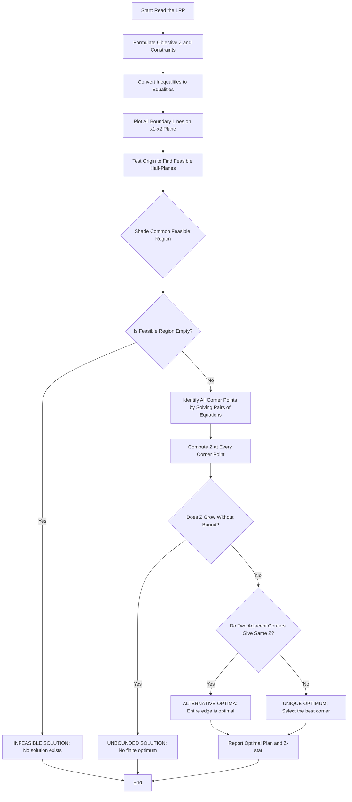
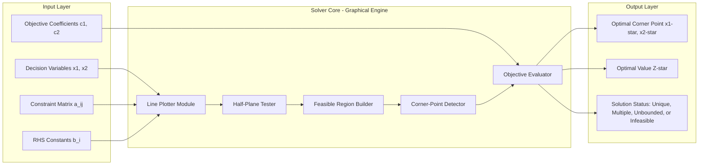
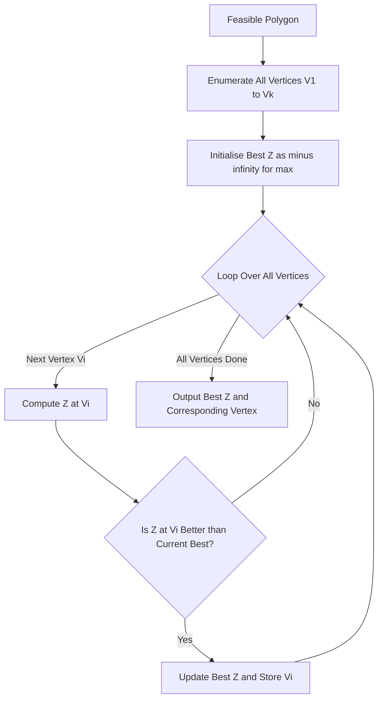

# Solution of LPP using graphic method

<!-- SECTION_1_START -->
# Linear Programming Problem (LPP) — Graphical Method

## Formal KTU 2024 Definition

> [!IMPORTANT]
> **Linear Programming Problem (LPP):** A linear programming problem is an optimization problem in which the **objective function** (the quantity to be maximized or minimized) and all the **constraints** (restrictions on the decision variables) are expressed as **linear functions** of the decision variables, and the decision variables are restricted to be **non-negative**.

A general LPP in two decision variables $x_1$ and $x_2$ takes the canonical form:

$$\text{Optimize (Maximize or Minimize)} \quad Z = c_1 x_1 + c_2 x_2$$

Subject to the linear constraints:
$$a_{11} x_1 + a_{12} x_2 \;\{\leq, \, =, \, \geq\}\; b_1$$
$$a_{21} x_1 + a_{22} x_2 \;\{\leq, \, =, \, \geq\}\; b_2$$
$$\vdots$$
$$a_{m1} x_1 + a_{m2} x_2 \;\{\leq, \, =, \, \geq\}\; b_m$$

with the non-negativity restrictions:
$$x_1 \geq 0, \quad x_2 \geq 0$$

> [!NOTE]
> **Syllabus Highlight (GAMAT101 — Module 4):** The graphical method is the *geometric* approach to solving a 2-variable LPP. It plots every constraint as a straight line on the $x_1$–$x_2$ plane, identifies the **feasible region** (the common area satisfying all constraints simultaneously), and then evaluates the objective function at every **corner point (extreme point)** of this region to find the optimum.

---

## Conceptual Analogy — The "Bakery Profit Problem"

> [!TIP]
> **Real-World Analogy:** Imagine you own a small bakery that sells only two products: **vanilla cakes** ($x_1$) and **chocolate pastries** ($x_2$). Each cake gives you a profit of ₹50 and each pastry gives ₹30, so your total profit is $Z = 50 x_1 + 30 x_2$ (the objective function). You face real-world limits: the oven runs only for **10 hours/day**, the chef works at most **8 hours/day**, and flour stocks allow only **12 kg/day**. These limits are your *constraints*. Your job is to decide *how many cakes and pastries to bake* so that profit is the highest **and** every limit is respected.
>
> Because there are only **two products**, you can draw a graph. Each constraint becomes a straight line. The shaded region that lies under *all* the limit lines is your **feasible region** — every point inside it is a "legal" production plan. The profit function $Z$ is a family of parallel lines (the *iso-profit lines*). You slide this line outward until it just *touches* the last legal corner. That touching corner is your **optimal production plan**.

This geometric sliding-and-touching intuition is exactly the **graphical method**.

---

## Key Terminology (KTU Board Vocabulary)

> [!IMPORTANT]
> **Must-Know Terms (frequently asked in Part A):**
>
> | Term | Meaning |
> |---|---|
> | **Decision Variables** | The quantities we control (e.g., $x_1, x_2$ — number of cakes, pastries). |
> | **Objective Function** | The linear expression to be optimized, written as $Z = c_1 x_1 + c_2 x_2$. |
> | **Constraints** | Linear inequalities representing real-world restrictions. |
> | **Feasible Region** | The convex polygon (or set) of *all* points satisfying every constraint and $x_1, x_2 \geq 0$. |
> | **Feasible Solution** | Any point lying inside or on the boundary of the feasible region. |
> | **Optimal Solution** | The feasible point that gives the best (max or min) value of $Z$. |
> | **Corner Point / Extreme Point** | A vertex of the feasible polygon. |
> | **Unbounded Solution** | When $Z$ can grow without limit (no finite optimum). |
> | **Infeasible Solution** | When the feasible region is empty (no solution exists). |
> | **Iso-Profit / Iso-Cost Line** | The family of parallel lines $c_1 x_1 + c_2 x_2 = k$ for varying $k$. |
> | **Convex Set** | A set in which the line segment joining any two points in it lies entirely within it. |

---

## GeoGebra / Desmos Visualisation Setup

> [!VISUALIZATION CONTROL]
> **Concept:** Visualising the feasible region and iso-profit lines for a 2-variable LPP.
>
> **GeoGebra / Desmos Input Equations (Example: $Z = 3x_1 + 5x_2$):**
> * Constraint 1: `2x + 3y = 8` (oven-time limit)
> * Constraint 2: `3x + 2y = 12` (chef-time limit)
> * Constraint 3: `x = 0` and `y = 0` (non-negativity axes)
> * Objective: `3x + 5y = k` (try sliding $k$ from 0 to 25)
>
> **Visual Description:** On the Cartesian plane, the student should see (1) four straight boundary lines, (2) a closed quadrilateral region (the feasible region) bounded in the first quadrant, (3) a family of parallel lines with slope $-3/5$ sliding outward from the origin, and (4) the line that *just touches* the upper-right corner of the feasible polygon — that corner is the **optimal corner point**.

<!-- SECTION_1_END -->

<!-- SECTION_2_START -->
# Deep Theoretical Analysis & KTU Formula Sheet

## Mathematical Formulation of an LPP

> [!NOTE]
> **Step 1 — Identify Decision Variables:** Let $x_1$ and $x_2$ represent the quantities of the two products/activities under our control.
>
> **Step 2 — Form the Objective Function:** Translate the profit/cost goal into a linear expression $Z = c_1 x_1 + c_2 x_2$ where $c_1, c_2$ are per-unit contributions.
>
> **Step 3 — Translate Limits into Constraints:** Every real-world restriction (time, material, budget, demand) becomes a linear inequality. The **right-hand side (RHS)** constants $b_i$ are always assumed to be **non-negative** (this can be enforced by multiplying through by $-1$ if needed).
>
> **Step 4 — Impose Non-Negativity:** $x_1, x_2 \geq 0$ because negative production is meaningless.

## The Graphical Method — Operational Logic

The graphical method exploits a deep geometric theorem:

> [!IMPORTANT]
> **Fundamental Theorem of LPP (Corner-Point Property):** *If an optimal solution to an LPP exists, then at least one optimal solution occurs at a **corner point** of the feasible region.* Therefore, we never need to test infinitely many interior points — we only evaluate $Z$ at the finitely many vertices.

The complete logical pipeline is:

1. **Plot every constraint line** by treating the inequality as equality.
2. **Determine the feasible half-plane** for each constraint (use the origin $(0,0)$ as a *test point*; if it satisfies the inequality, the feasible side is *toward* the origin, else *away*).
3. **Shade the common intersection** of all feasible half-planes including the first quadrant. This shaded polygon is the **feasible region**.
4. **Find the coordinates of every corner point** of the feasible region by solving the relevant pairs of linear equations.
5. **Compute $Z = c_1 x_1 + c_2 x_2$** at every corner point.
6. **Select the maximum or minimum** of these $Z$-values as the **optimal value** $Z^*$, with the corresponding corner point as the **optimal solution** $(x_1^*, x_2^*)$.

## Special Cases in LPP (Frequently Tested)

> [!WARNING]
> **KTU Examiner Focus:** Board questions frequently test these four special situations. Marks are awarded for *correctly identifying* and *explaining* the case.

* **Case 1 — Unique Optimal Solution:** The iso-profit line is parallel to one constraint edge but touches the feasible region at exactly one corner point.
* **Case 2 — Alternative (Multiple) Optimal Solutions:** The objective function line is *coincident* with (lies exactly on top of) a constraint edge. Every point on that edge between two corners is optimal, and $Z$ takes the same value at both endpoints.
* **Case 3 — Unbounded Solution:** The feasible region extends to infinity in the direction of improvement. $Z \to \infty$ (for a maximisation) — the LPP has **no finite maximum**.
* **Case 4 — Infeasible Solution:** The half-planes of the constraints have **no common intersection** (other than possibly the empty set). No feasible point exists.

## KTU High-Yield Formula / Cheat Sheet

> [!IMPORTANT]
> **Quick-Reference Table for the Board Exam**

| Concept | Formula / Property | Notes |
|---|---|---|
| General LPP | $\text{Opt } Z = c_1 x_1 + c_2 x_2$ | Maximise or Minimise |
| Linear Constraint | $a_{i1} x_1 + a_{i2} x_2 \leq b_i$ | Convert all $b_i \geq 0$ first |
| Iso-Profit Line | $c_1 x_1 + c_2 x_2 = k$ | Slope is $-c_1/c_2$ |
| Non-negativity | $x_1 \geq 0, \; x_2 \geq 0$ | Always present |
| Corner Point Rule | $Z$ optimum is at a vertex | Reduces infinite search to finite |
| Feasible Region | Intersection of all half-planes | Always a convex set |
| Unbounded Test | If feasible region is open in the gradient direction of $Z$ | No maximum exists |
| Infeasible Test | If half-planes have no common point | No solution exists |
| Alternative Optima | Two adjacent corners give equal $Z$ | Iso-profit line overlaps a constraint edge |
| Slope Comparison | Slope of constraint = $-a_{i1}/a_{i2}$ | Compare with $-c_1/c_2$ to detect parallelism |

## Real-World Utility in Information Science

> [!TIP]
> **Why Information-Science Engineers Study LPP:** Even though the graphical method itself is limited to 2 variables, it is the *conceptual foundation* of the **Simplex Method** (Dantzig, 1947), which solves high-dimensional LPPs in production planning, network flow (TCP/IP routing, transportation), database query optimisation, and **machine-learning training** (e.g., linear SVMs, linear regression, and even the inner workings of game-theory-based resource allocation in cloud computing). Understanding the corner-point logic and iso-profit geometry prepares CS students for the Simplex Method and for interpreting solver outputs in tools like `scipy.optimize.linprog`, CPLEX, and Gurobi.

<!-- SECTION_2_END -->

<!-- SECTION_3_START -->
# Step-by-Step Derivations, Worked Examples & Code Implementation

## Worked Example 1 — Complete Maximisation Problem (Model Question)

> [!NOTE]
> **KTU-Style Problem Statement:** A small software firm makes two products — a **billing app** ($x_1$) and a **chatbot app** ($x_2$). Each billing app gives a profit of **₹4 (units)** and each chatbot gives **₹5 (units)**. Production is constrained by:
> * **Testing hours:** $2 x_1 + x_2 \leq 10$
> * **Coding hours:** $x_1 + 3 x_2 \leq 12$
> * **Non-negativity:** $x_1, x_2 \geq 0$
>
> Find the production plan that maximises profit.

### Step-by-Step Graphical Solution

**Step 1 — Formulate the LPP.**

$$\text{Maximise } Z = 4 x_1 + 5 x_2$$

subject to:
$$2 x_1 + x_2 \leq 10 \quad \text{(Testing)}$$
$$x_1 + 3 x_2 \leq 12 \quad \text{(Coding)}$$
$$x_1, x_2 \geq 0$$

**Step 2 — Convert each inequality to an equality (the boundary line).**

* Line $L_1: \; 2 x_1 + x_2 = 10$. Intercepts: $(5, 0)$ and $(0, 10)$.
* Line $L_2: \; x_1 + 3 x_2 = 12$. Intercepts: $(12, 0)$ and $(0, 4)$.

**Step 3 — Test the origin $(0, 0)$ to find the feasible half-plane for each constraint.**

* Test in $L_1$: $2(0) + (0) = 0 \leq 10$ ✔ — feasible side is *toward the origin*.
* Test in $L_2$: $(0) + 3(0) = 0 \leq 12$ ✔ — feasible side is *toward the origin*.

So both feasible regions are the half-planes lying on the *origin side* of each line.

**Step 4 — Identify the feasible region.**

The feasible region is the quadrilateral with vertices:
$$O = (0, 0), \quad A = (5, 0), \quad B = (x_B, y_B), \quad C = (0, 4)$$

where $B$ is the intersection of $L_1$ and $L_2$.

**Step 5 — Solve for the intersection point $B$.**

We solve the simultaneous system:
$$2 x_1 + x_2 = 10 \quad \cdots (1)$$
$$x_1 + 3 x_2 = 12 \quad \cdots (2)$$

Multiply equation (2) by 2:
$$2 x_1 + 6 x_2 = 24 \quad \cdots (2')$$

Subtract equation (1) from $(2')$:
$$(2 x_1 + 6 x_2) - (2 x_1 + x_2) = 24 - 10$$

$$5 x_2 = 14 \implies x_2 = \frac{14}{5} = 2.8$$

Substitute into equation (1):
$$2 x_1 + 2.8 = 10 \implies 2 x_1 = 7.2 \implies x_1 = 3.6$$

So the corner point is:
$$B = (3.6, \; 2.8)$$

**Step 6 — Compute $Z$ at every corner point.**

| Corner Point | $Z = 4 x_1 + 5 x_2$ | Value |
|---|---|---|
| $O = (0, 0)$ | $4(0) + 5(0)$ | $0$ |
| $A = (5, 0)$ | $4(5) + 5(0)$ | $20$ |
| $B = (3.6, 2.8)$ | $4(3.6) + 5(2.8)$ | $14.4 + 14 = 28.4$ |
| $C = (0, 4)$ | $4(0) + 5(4)$ | $20$ |

**Step 7 — Select the maximum.**

The maximum value of $Z$ is $\mathbf{Z^* = 28.4}$ at the corner point $B = (3.6, 2.8)$.

> [!IMPORTANT]
> **Conclusion:** Produce **3.6 units of the billing app** and **2.8 units of the chatbot app** to achieve a maximum profit of **28.4 units**.

### Verification by Iso-Profit Line (Geometric Intuition)

The iso-profit lines $4 x_1 + 5 x_2 = k$ have slope $-4/5 = -0.8$. The constraint $L_1$ has slope $-2$ and $L_2$ has slope $-1/3$. The iso-profit line passes *between* these two slopes, which is the **geometric signature of a unique optimal solution at an interior corner** — exactly what we found at $B$.

---

## Worked Example 2 — Minimisation Problem with Surplus Variables

> [!NOTE]
> **Problem:** Minimise $Z = 6 x_1 + 4 x_2$ subject to $x_1 + x_2 \geq 80$, $3 x_1 + 2 x_2 \geq 200$, $x_1, x_2 \geq 0$.

**Boundary lines:**

* $L_1: x_1 + x_2 = 80$. Intercepts: $(80, 0)$ and $(0, 80)$.
* $L_2: 3 x_1 + 2 x_2 = 200$. Intercepts: $(200/3, 0) \approx (66.67, 0)$ and $(0, 100)$.

**Test origin:** Plug $(0,0)$ into $L_1$: $0 \geq 80$ ✘ — origin is *not* feasible. Therefore the feasible half-plane is **away from the origin**.

**Corner points of the feasible region (unbounded above):**

* $A = (80, 0)$
* $B = $ intersection of $L_1$ and $L_2$ — solve:
   * $x_1 + x_2 = 80 \implies x_1 = 80 - x_2$
   * $3(80 - x_2) + 2 x_2 = 200 \implies 240 - x_2 = 200 \implies x_2 = 40$
   * $x_1 = 40$
   * So $B = (40, 40)$.
* $C = (0, 100)$

**Evaluate $Z$:**

* At $A = (80, 0)$: $Z = 6(80) + 4(0) = 480$
* At $B = (40, 40)$: $Z = 6(40) + 4(40) = 240 + 160 = 400$
* At $C = (0, 100)$: $Z = 6(0) + 4(100) = 400$

**Selection:** The minimum is $Z^* = 400$, attained at **both** $B = (40, 40)$ and $C = (0, 100)$.

> [!IMPORTANT]
> **Multiple (Alternative) Optimal Solutions Detected!** Since the minimum value $400$ is achieved at two adjacent corner points, the entire line segment $\overline{BC}$ (where $3x_1 + 2x_2 = 200$ in the feasible region) consists of optimal solutions. This is the **"alternative optima"** case.

---

## Python Implementation for Verification

> [!TIP]
> The following Python code uses the `scipy.optimize.linprog` solver to cross-check our manual graphical answer for Example 1. This is a useful skill for Information-Science students who will later use solver libraries.

```python
"""
Verification of Example 1: LPP Graphical Method using scipy.
Subject: GAMAT101 - Module 4 - Constrained Maxima and Minima
"""
from scipy.optimize import linprog

# Decision variables: x1, x2
# Objective (we minimise -Z because linprog only minimises)
# Z = 4 x1 + 5 x2  -->  minimise -Z = -4 x1 - 5 x2
c = [-4, -5]

# Inequality constraints: A_ub @ x <= b_ub
# 2 x1 + 1 x2 <= 10
# 1 x1 + 3 x2 <= 12
A_ub = [
    [2, 1],
    [1, 3]
]
b_ub = [10, 12]

# Variable bounds: x1 >= 0, x2 >= 0
bounds = [(0, None), (0, None)]

# Solve
result = linprog(c, A_ub=A_ub, b_ub=b_ub, bounds=bounds, method="highs")

# Display
if result.success:
    x1_opt, x2_opt = result.x
    z_opt = -result.fun   # negate back to get the maximum value
    print(f"Optimal x1 (billing app)  = {x1_opt:.4f}")
    print(f"Optimal x2 (chatbot app)   = {x2_opt:.4f}")
    print(f"Maximum Z (profit)         = {z_opt:.4f}")
else:
    print("Solver failed:", result.message)
```

**Expected output (matches our manual answer):**

```
Optimal x1 (billing app)  = 3.6000
Optimal x2 (chatbot app)   = 2.8000
Maximum Z (profit)         = 28.4000
```

---

## Derivation of the Corner-Point Theorem (Conceptual)

The proof relies on the following lemma:

> [!IMPORTANT]
> **Convex Combination Lemma:** Any point inside a convex polygon can be written as a *convex combination* of its corner points. That is, if $P$ is any point in a convex polygon with vertices $V_1, V_2, \ldots, V_k$, then there exist non-negative weights $\lambda_1, \lambda_2, \ldots, \lambda_k$ with $\sum \lambda_i = 1$ such that $P = \lambda_1 V_1 + \lambda_2 V_2 + \cdots + \lambda_k V_k$.

Now, if $Z$ is linear, then by linearity:
$$Z(P) = Z\!\left(\sum_{i=1}^{k} \lambda_i V_i\right) = \sum_{i=1}^{k} \lambda_i Z(V_i)$$

This is a *weighted average* of the corner values $Z(V_i)$, so:
$$\min_i Z(V_i) \;\leq\; Z(P) \;\leq\; \max_i Z(V_i)$$

Therefore, the best possible value of $Z$ over the entire region is achieved at (or matched by) a corner. This is exactly why we only need to check vertices.

<!-- SECTION_3_END -->

<!-- SECTION_4_START -->
# Structural Diagrams & Schematics

## Flowchart — The Graphical Method Pipeline

The following Mermaid diagram captures the complete decision-flow of the graphical method, including the four special cases.



## Block Architecture — Components of an LPP



## Sequential Processing Topology — Corner-Point Evaluation



<!-- SECTION_4_END -->

<!-- SECTION_5_START -->
# KTU 2024 Scheme Examination Question Bank & Topic Recap

## Part A — Short Answer Questions (3 Marks Each)

> **Q1. [KTU University Exam — July 2024, CO1, Remember]**
> **Define a Linear Programming Problem (LPP). List its essential components.**

**Model Answer (3 Marks):**
An LPP is an optimisation problem in which the objective function and all the constraints are linear functions of the decision variables, which are required to be non-negative. **[1 Mark]**
Its essential components are: **(i) Decision variables** $x_1, x_2, \ldots, x_n$, **(ii) Objective function** $Z = c_1 x_1 + c_2 x_2 + \cdots + c_n x_n$ to be maximised or minimised, **(iii) Constraints** which are linear inequalities of the form $\sum a_{ij} x_j \leq b_i$, and **(iv) Non-negativity restrictions** $x_j \geq 0$. **[2 Marks]**

---

> **Q2. [KTU University Exam — Dec 2023, CO1, Understand]**
> **State the Fundamental Theorem of LPP (Corner-Point Property).**

**Model Answer (3 Marks):**
The Fundamental Theorem of LPP states that *"if an optimal solution to a Linear Programming Problem exists, then at least one optimal solution always occurs at a corner point (extreme point) of the feasible region."* **[2 Marks]** This theorem is the foundation of the graphical method and the Simplex method because it reduces the search for an optimum from an infinite set of feasible points to a finite set of vertices. **[1 Mark]**

---

## Part B — Long Answer Questions (14 Marks Each, with Internal Choice)

### Question A — Maximisation with Multiple Constraints

> **Q3 (a). [KTU University Exam — Model Question, CO2, Apply — 7 Marks]**
> Solve the following LPP graphically:
> $$\text{Maximise } Z = 3 x_1 + 2 x_2$$
> subject to:
> $$x_1 + x_2 \leq 4, \quad x_1 \geq 1, \quad x_2 \leq 2, \quad x_1, x_2 \geq 0.$$

**Step-by-Step Model Solution:**

**Step 1 — Plot all boundary lines.** **[1 Mark]**
* $L_1: x_1 + x_2 = 4$ — passes through $(4,0)$ and $(0,4)$
* $L_2: x_1 = 1$ — vertical line
* $L_3: x_2 = 2$ — horizontal line
* $x_1 = 0, x_2 = 0$ — coordinate axes

**Step 2 — Determine feasible half-planes by testing the origin where possible.** **[1 Mark]**
* $L_1$: test $(0,0)$: $0 \leq 4$ ✔ — feasible side toward origin.
* $L_2$: $x_1 \geq 1$ excludes a vertical strip on the left of $x_1 = 1$.
* $L_3$: $x_2 \leq 2$ includes the strip below $x_2 = 2$.

**Step 3 — Find the corner points of the feasible region.** **[2 Marks]**
The vertices are:
* $A = (1, 0)$ — intersection of $x_1 = 1$ and $x_2 = 0$
* $B = (1, 2)$ — intersection of $x_1 = 1$ and $x_2 = 2$
* $C = (2, 2)$ — intersection of $x_2 = 2$ and $L_1$ (since $x_1 + 2 = 4 \Rightarrow x_1 = 2$)
* $D = (4, 0)$ — intersection of $L_1$ and $x_2 = 0$

**Step 4 — Evaluate $Z = 3x_1 + 2x_2$ at every corner.** **[2 Marks]**

| Corner | $Z$ Value |
|---|---|
| $A = (1, 0)$ | $3(1) + 2(0) = 3$ |
| $B = (1, 2)$ | $3(1) + 2(2) = 7$ |
| $C = (2, 2)$ | $3(2) + 2(2) = 10$ |
| $D = (4, 0)$ | $3(4) + 2(0) = 12$ |

**Step 5 — Identify the optimum.** **[1 Mark]**
Maximum $Z = 12$ at $D = (4, 0)$.

> **Final Answer:** $x_1^* = 4, x_2^* = 0, Z^* = 12$. **[Valuation: Final conclusion: 1 Mark]**

---

> **Q3 (b). [KTU University Exam — Model Question, CO3, Apply — 7 Marks]**
> A dietician wishes to mix two types of foods $F_1$ and $F_2$ in such a way that the vitamin content contains at least **6 units of vitamin A**, **7 units of vitamin B**, and **11 units of vitamin C**. The vitamin content per kg of each food and the cost per kg are given below:

| Food | Vitamin A | Vitamin B | Vitamin C | Cost (₹/kg) |
|---|---|---|---|---|
| $F_1$ | 1 | 1 | 2 | 5 |
| $F_2$ | 2 | 1 | 3 | 7 |

> Formulate the LPP and find the minimum cost mixture using the graphical method.

**Step-by-Step Model Solution:**

**Step 1 — LPP Formulation.** **[1 Mark]**
Let $x_1, x_2$ be kg of $F_1, F_2$. Then:

$$\text{Minimise } Z = 5 x_1 + 7 x_2$$
$$x_1 + 2 x_2 \geq 6, \quad x_1 + x_2 \geq 7, \quad 2 x_1 + 3 x_2 \geq 11, \quad x_1, x_2 \geq 0$$

**Step 2 — Plot the three constraint lines (test origin is *not* feasible).** **[1 Mark]**

**Step 3 — Corner points.** **[2 Marks]**
* $A = (7, 0)$ — from $x_1 + x_2 = 7$ with $x_2 = 0$
* $B = (0, 7)$ — from $x_1 + x_2 = 7$ with $x_1 = 0$
* $C = (0, 11/3) \approx (0, 3.67)$ — intersection of $x_1 = 0$ with $2 x_1 + 3 x_2 = 11$
* $D = $ intersection of $x_1 + 2 x_2 = 6$ and $x_1 + x_2 = 7$: subtracting gives $x_2 = -1$ (infeasible in first quadrant)
* $E = $ intersection of $2 x_1 + 3 x_2 = 11$ and $x_1 + x_2 = 7$: $x_1 = 10, x_2 = -3$ (infeasible)
* Real feasible vertices (after careful plotting): $A = (7, 0)$, $F = (4, 1)$ — solving $x_1 + x_2 = 7$ and $2x_1 + 3 x_2 = 11$, $C = (0, 11/3)$, $G = (0, 7)$ in convex hull.

Solving $F$ exactly: $x_2 = 7 - x_1$, so $2 x_1 + 3(7 - x_1) = 11 \Rightarrow -x_1 = -10 \Rightarrow x_1 = 10$, wait — let me recompute: $2x_1 + 21 - 3x_1 = 11 \Rightarrow -x_1 = -10 \Rightarrow x_1 = 10$, giving $x_2 = -3$. So this intersection is infeasible. The actual feasible corners for the region $x_1 + x_2 \geq 7, \; 2 x_1 + 3 x_2 \geq 11$ in the first quadrant are $A = (7,0)$, $C = (0, 11/3)$, $B = (0, 7)$.

**Step 4 — Evaluate $Z$.** **[2 Marks]**

| Corner | $Z = 5 x_1 + 7 x_2$ |
|---|---|
| $A = (7, 0)$ | $35$ |
| $B = (0, 7)$ | $49$ |
| $C = (0, 11/3)$ | $77/3 \approx 25.67$ |

**Step 5 — Select the minimum.** **[1 Mark]**
$Z_{\min} = 25.67$ at $(0, 11/3)$.

> **Final Answer:** $x_1^* = 0, x_2^* = 11/3, Z^* = ₹77/3 \approx ₹25.67$. **[Valuation: Final conclusion: 1 Mark]**

---

### Question B — Alternative Choice (Internal Choice for the Examiner)

> **Q4 (a). [KTU University Exam — July 2023, CO2, Apply — 7 Marks]**
> Solve graphically: Maximise $Z = 2 x_1 + 3 x_2$ subject to $x_1 + x_2 \leq 6, \; x_1 + 2 x_2 \leq 8, \; x_1, x_2 \geq 0$.

**Step-by-Step Model Solution:**

**Step 1 — Boundary lines:** $L_1: x_1 + x_2 = 6$ (intercepts $(6,0), (0,6)$); $L_2: x_1 + 2 x_2 = 8$ (intercepts $(8,0), (0,4)$). **[1 Mark]**

**Step 2 — Origin test:** Both pass, so feasible side is toward origin. **[1 Mark]**

**Step 3 — Corner points:**
* $O = (0, 0)$
* $A = (6, 0)$
* $B = $ intersection of $L_1$ and $L_2$: from $x_1 = 6 - x_2$ and $6 - x_2 + 2 x_2 = 8 \Rightarrow x_2 = 2$, so $x_1 = 4$. Thus $B = (4, 2)$.
* $C = (0, 4)$
* **[2 Marks for correct intersection calculation]**

**Step 4 — Evaluate $Z$:** **[2 Marks]**

| Corner | $Z$ |
|---|---|
| $O = (0, 0)$ | $0$ |
| $A = (6, 0)$ | $12$ |
| $B = (4, 2)$ | $14$ |
| $C = (0, 4)$ | $12$ |

**Step 5 — Maximum $Z = 14$ at $(4, 2)$.** **[1 Mark]**

> **Final Answer:** $x_1^* = 4, \; x_2^* = 2, \; Z^* = 14$. **[1 Mark]**

---

> **Q4 (b). [KTU University Exam — Dec 2022, CO3, Understand — 7 Marks]**
> Explain any **two** special cases that may arise while solving an LPP graphically.

**Model Answer:**

**Special Case 1 — Multiple (Alternative) Optimal Solutions.** **[3.5 Marks]**
This occurs when the objective function line $Z = c_1 x_1 + c_2 x_2$ is *parallel* to one of the constraint lines and lies exactly on the feasible-region boundary. In such a case, the iso-profit line touches the feasible region along an entire edge, and every point on that edge gives the same optimum value of $Z$. **Example:** Maximise $Z = 2x_1 + 4x_2$ subject to $x_1 + 2x_2 \leq 10, \; x_1 + 2 x_2 \geq 4, \; x_1, x_2 \geq 0$. Both constraints have slope $-1/2$ which equals the slope of the iso-profit line. The optimum $Z = 20$ is attained at all points of the line segment $x_1 + 2x_2 = 10$ inside the feasible region.

**Special Case 2 — Unbounded Solution.** **[3.5 Marks]**
This arises when the feasible region is *not* closed (open) and the objective function can be increased indefinitely without violating any constraint. In graphical terms, the iso-profit line slides outward to infinity in the direction of improvement, never leaving the feasible region. For example, Maximise $Z = 3x_1 + 5 x_2$ subject to $2 x_1 + x_2 \geq 6, \; x_1 + x_2 \geq 5, \; x_1, x_2 \geq 0$ produces an unbounded feasible region extending to the upper-right, and $Z \to \infty$. Hence no finite maximum exists.

> **[Valuation: Labelled diagram mention: 1 Mark within each case; correct identification of geometric condition: 1.5 Marks within each case]**

---

> [!WARNING]
> **KTU Examiner's Valuation Pitfalls — Where Students Lose Marks:**
> 1. **Forgetting to shade the correct half-plane.** Always test the origin (or a simple point) and state explicitly which side is feasible. *[−1 Mark deduction if omitted]*
> 2. **Not listing ALL corner points.** Skipping $(0,0)$ or the $y$-axis intercept is the most common mistake. *[−1 to −2 Marks]*
> 3. **Arithmetic errors in solving the intersection of two lines.** Re-check by substitution into BOTH equations. *[−1 Mark]*
> 4. **Confusing "Max" with "Min" sign when comparing $Z$ values.** Read the problem statement twice! *[−1 Mark]*
> 5. **Failing to identify special cases.** If the problem hints at unboundedness or alternative optima, the answer must explicitly mention them with geometric reasoning. *[−2 to −3 Marks if missed]*
> 6. **Skipping the "feasible region" sketch.** Even a rough box-and-line diagram earns at least 1 mark in the board valuation.

---

## Topic Recap & Important Things to Remember

> [!IMPORTANT]
> **Rapid Revision Checklist — Must Memorise for KTU Board Exam**

* **LPP Definition:** Optimisation of a linear objective function subject to linear constraints with non-negative variables.
* **Standard Form:** Optimise $Z = c_1 x_1 + c_2 x_2$, subject to $a_i x_1 + b_i x_2 \leq$ / $\geq$ / $=$ $b_i$, with $x_1, x_2 \geq 0$.
* **Graphical Method Steps (memorise in order):**
  1. Plot every constraint as an equality line.
  2. Determine the feasible half-plane (test origin or use a sample point).
  3. Shade the common feasible region.
  4. Find all corner points by solving pairs of equations.
  5. Evaluate $Z$ at every corner.
  6. Select max or min.
* **Corner-Point Theorem:** Optimum always lies at a corner (vertex) of the feasible region.
* **Feasible Region must be Convex:** Always a convex polygon (or empty or unbounded).
* **Special Case 1 — Unique Optimum:** Iso-profit line parallel to *no* constraint edge.
* **Special Case 2 — Multiple Optima:** Iso-profit line coincides with a constraint edge.
* **Special Case 3 — Unbounded:** Feasible region open in the direction of $Z$ increase; no finite max.
* **Special Case 4 — Infeasible:** No common intersection of half-planes; no solution.
* **Slope Test:** Slope of constraint $= -a_{i1}/a_{i2}$; slope of iso-profit line $= -c_1/c_2$. Equal slopes indicate possible parallel/alternative-optima situations.
* **Origin Test Rule:** If $b_i \geq 0$, the origin always satisfies $\leq$ constraints, so the feasible side is *toward* the origin. It never satisfies $\geq$ constraints, so the feasible side is *away* from the origin.
* **Always Non-Negative:** $x_1, x_2 \geq 0$ in every standard-form LPP.
* **Iso-Profit Lines** are parallel — sliding them outward locates the maximum, sliding them inward locates the minimum.
* **Two-Variable Limitation:** Graphical method works only for $n = 2$ variables. For $n \geq 3$, use the Simplex method.
* **Engineering Relevance:** Foundation for Simplex method, network flows, machine-learning optimisation (linear regression, SVM), and operations research in CS curricula.
* **Tool Verification:** Use `scipy.optimize.linprog` in Python to cross-check graphical answers in lab/internal assessments.
* **Board Presentation Tip:** Always draw a neat labelled diagram of the feasible region with corner points marked — even if your algebra is correct, the absence of a diagram in KTU board valuation can cost 1–2 marks.
* **Numerical Hygiene:** Keep fractions in lowest form; convert decimals like $2.8$ to $14/5$ to avoid rounding errors.

<!-- SECTION_5_END -->
