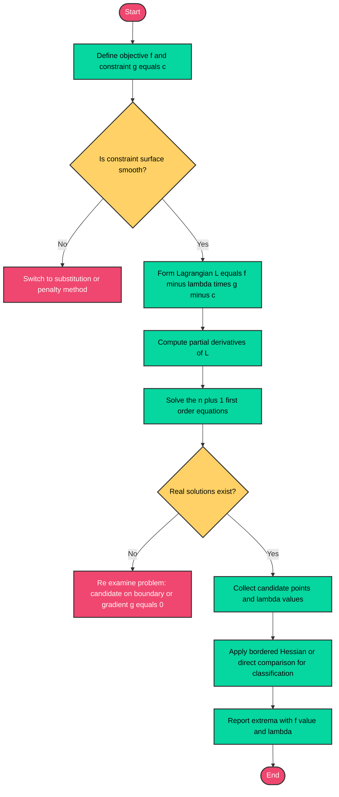
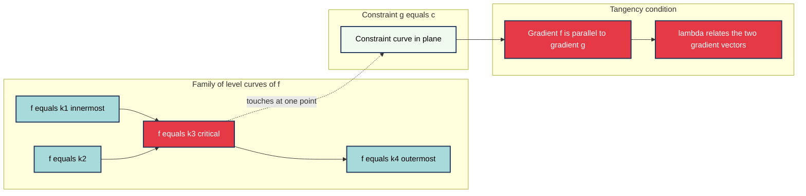
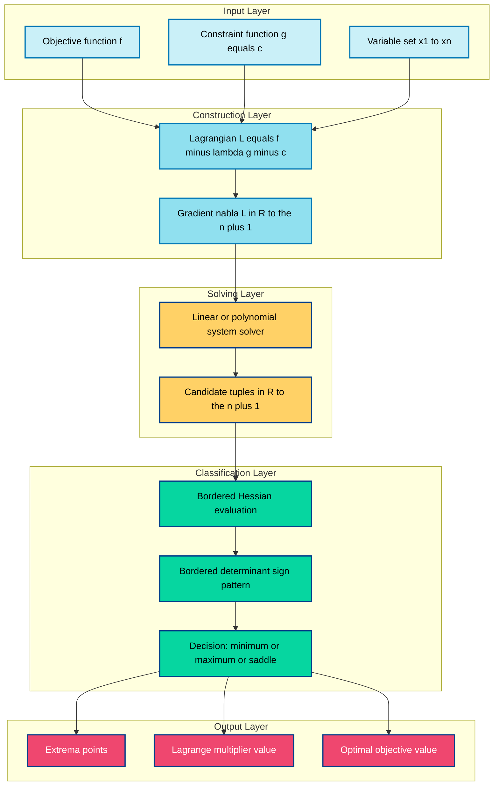

# The Method of Lagrange Multipliers with one constraint

<!-- SECTION_1_START -->
# 1. Core Technical Definition & Intuitive Overview

## 1.1 Formal Definition (KTU 2024 Syllabus Terminology)

> [!IMPORTANT]
> **Lagrange Multipliers Method (One Constraint)**
> The method of **Lagrange Multipliers** is a strategy for finding the local maxima and minima of a differentiable function $f(x, y)$ subject to a constraint $g(x, y) = c$, where $g$ is differentiable and $\nabla g \neq \mathbf{0}$ on the constraint surface. The method introduces a new scalar variable $\lambda$ (called the **Lagrange multiplier**) and seeks the critical points of the auxiliary **Lagrangian function**:
> $$\mathcal{L}(x, y, \lambda) = f(x, y) - \lambda \bigl(g(x, y) - c\bigr)$$

The necessary condition for an extremum is that the gradient of $\mathcal{L}$ vanishes:
$$\nabla \mathcal{L} = \mathbf{0} \iff \nabla f = \lambda \, \nabla g$$

> [!NOTE]
> **Geometric Interpretation:** At an extremum, the gradient of the objective function $f$ is parallel to the gradient of the constraint $g$. Equivalently, the level curves of $f$ are **tangent** to the constraint curve at the optimum.

## 1.2 Conceptual Analogy — The Mountain Hiker

Imagine you are hiking on a mountain whose elevation is given by $f(x, y)$. You are told you must stay on a specific ridge path described by $g(x, y) = c$ (say, a contour trail of constant slope gradient).

- **Without the constraint**, the summit is where $\nabla f = 0$.
- **With the constraint**, you cannot walk off the trail. The highest point you can reach *while on the trail* is where the path is **most tangent** to the elevation contours.

At that tangency, the direction of steepest ascent (given by $\nabla f$) coincides exactly with the direction perpendicular to the trail (given by $\nabla g$). The scalar factor relating them is precisely the Lagrange multiplier $\lambda$.

> [!TIP]
> Think of $\lambda$ as the **"sensitivity"** of the optimum to changes in the constraint value. A large $\vert \lambda \vert$ means the optimal value of $f$ would change rapidly if the constraint level $c$ were shifted even slightly.

## 1.3 Visualization Block

> [!VISUALIZATION CONTROL]
> **Concept:** Tangency of level curves of $f(x, y)$ with the constraint curve $g(x, y) = c$.
> **Desmos Input Equations (parametric sketch):**
> * Level curve of $f$: $x^2 - y^2 = k$ for several $k$
> * Constraint curve: $x + y = 2$
> * Tangent point marker: $(1, 1)$
> **Visual Description:** The student should observe the family of hyperbolas $f = k$ sliding until one becomes tangent to the straight line $g = 2$. The tangent point is the constrained extremum.

## 1.4 Physical Constants / Standard Metrics

| Symbol | Meaning | Domain |
|---|---|---|
| $f: \mathbb{R}^n \to \mathbb{R}$ | Objective function to optimize | Continuous, differentiable |
| $g: \mathbb{R}^n \to \mathbb{R}$ | Constraint function | $C^1$ with $\nabla g \neq 0$ |
| $\lambda$ | Lagrange multiplier | Real scalar |
| $c$ | Constraint level | Real constant |
| $\nabla f$, $\nabla g$ | Gradient vectors | $\mathbb{R}^n$ |

---

<!-- SECTION_1_END -->

<!-- SECTION_2_START -->
# 2. Deep Theoretical Analysis & KTU High-Yield Formula Sheet

## 2.1 Theoretical Foundation

The method is grounded in the **Implicit Function Theorem** and the principle of **orthogonality of gradients at extrema**. When a smooth constraint curve is approximated locally, the admissible directions form the tangent space to the curve. At an extremum, the gradient of $f$ must be orthogonal to every admissible direction, meaning it lies along the **normal** of the constraint surface.

### 2.1.1 Why Must $\nabla f$ be Parallel to $\nabla g$?

1. **Setting up the constrained problem:** We want to optimize $f$ subject to $g = c$.
2. **Differentiable curves:** Both $f$ and $g$ are $C^1$, so we can take directional derivatives.
3. **Parametrize the constraint curve:** Let $\mathbf{r}(t)$ parametrize $g(\mathbf{r}) = c$. Then $\nabla g \cdot \mathbf{r}'(t) = 0$ (the velocity is tangent to the constraint).
4. **Differentiation along the curve:** The rate of change of $f$ along the curve is $\dfrac{d}{dt} f(\mathbf{r}(t)) = \nabla f \cdot \mathbf{r}'(t)$.
5. **Stationarity condition:** At an extremum, $\nabla f \cdot \mathbf{r}'(t) = 0$ for all tangent vectors $\mathbf{r}'(t)$.
6. **Conclusion:** Since the tangent space is the orthogonal complement of $\nabla g$, the vector $\nabla f$ must be a scalar multiple of $\nabla g$.

This scalar is $\lambda$, giving us the celebrated necessary condition.

## 2.2 Step-by-Step Algorithm

1. **Identify** the objective function $f(x, y, \dots)$ and the constraint $g(x, y, \dots) = c$.
2. **Construct** the Lagrangian:
$$\mathcal{L}(x_1, \dots, x_n, \lambda) = f(x_1, \dots, x_n) - \lambda \bigl(g(x_1, \dots, x_n) - c\bigr)$$
3. **Compute the system of first-order conditions** by setting each partial derivative to zero:
$$\frac{\partial \mathcal{L}}{\partial x_i} = 0 \quad \text{for } i = 1, \dots, n, \qquad \frac{\partial \mathcal{L}}{\partial \lambda} = 0 \text{ (recovers the constraint)}$$
4. **Solve** the resulting $(n+1)$ equations in $(n+1)$ unknowns to obtain candidate points $(x_1^*, \dots, x_n^*, \lambda^*)$.
5. **Classify** each candidate using the second-order Hessian test restricted to the tangent space, or by direct comparison of $f$ values (for closed bounded constraint sets), or by physical reasoning.
6. **Interpret $\lambda$:** It represents the marginal change in the optimal value of $f$ per unit change in $c$, i.e., $\lambda = \dfrac{df^*}{dc}$.

## 2.3 KTU Formula Sheet / Cheat Sheet

| Formula / Statement | Mathematical Form | When to Use |
|---|---|---|
| Lagrangian (1 constraint, $n$ variables) | $\mathcal{L} = f - \lambda(g - c)$ | Standard setup |
| First-order KKT condition | $\nabla f = \lambda \, \nabla g$ | Necessary for interior extrema |
| Two-variable system | $f_x = \lambda g_x, \quad f_y = \lambda g_y, \quad g(x,y) = c$ | Most common KTU case |
| Three-variable system | $f_x = \lambda g_x, \; f_y = \lambda g_y, \; f_z = \lambda g_z, \; g = c$ | Extension problems |
| Second derivative test (2D) | $D = \mathcal{L}_{xx}\mathcal{L}_{yy} - (\mathcal{L}_{xy})^2$ evaluated at the candidate, restricted to tangent space | Classification of extrema |
| Interpretation of $\lambda$ | $\lambda = \dfrac{df_{\text{opt}}}{dc}$ | Economic / physical sensitivity |
| Failure case | $\nabla g = \mathbf{0}$ at candidate | Method does **not** apply; check regularity |

> [!IMPORTANT]
> **Regularity condition (LICQ):** At any candidate point, $\nabla g \neq \mathbf{0}$. If this fails, the method is invalid and we must inspect the boundary directly.

## 2.4 Real-World Utility in Engineering & Information Science

| Domain | Application |
|---|---|
| **Machine Learning** | Support Vector Machines (SVMs) use Lagrange multipliers to maximize the margin between classes. |
| **Optimization Theory** | Dual formulations in convex programming (e.g., resource allocation in networks). |
| **Economics** | Utility maximization subject to budget constraints; $\lambda$ becomes the *shadow price* or marginal utility of income. |
| **Computer Graphics** | Constrained texture mapping and energy minimization. |
| **Signal Processing** | Optimal filter design under power or bandwidth constraints. |
| **Operations Research** | Portfolio optimization, transportation problems, and Lagrangian relaxation. |

---

<!-- SECTION_2_END -->

<!-- SECTION_3_START -->
# 3. Step-by-Step Derivations & Code/Symbolic Implementation

## 3.1 Worked Example 1 — KTU Standard 2D Problem

**Problem.** Find the maximum and minimum values of $f(x, y) = x^2 + y^2$ subject to the constraint $x + y = 4$.

### Step 1: Identify Functions

$$f(x, y) = x^2 + y^2, \qquad g(x, y) = x + y - 4 = 0$$

### Step 2: Form the Lagrangian

$$\mathcal{L}(x, y, \lambda) = x^2 + y^2 - \lambda(x + y - 4)$$

### Step 3: Set Up the First-Order System

$$\frac{\partial \mathcal{L}}{\partial x} = 2x - \lambda = 0$$
$$\frac{\partial \mathcal{L}}{\partial y} = 2y - \lambda = 0$$
$$\frac{\partial \mathcal{L}}{\partial \lambda} = -(x + y - 4) = 0$$

### Step 4: Solve the System

From the first two equations:
$$2x = \lambda \quad \text{and} \quad 2y = \lambda$$

Subtracting:
$$2x - 2y = 0 \implies x = y$$

Substituting into the constraint $x + y = 4$:
$$2x = 4 \implies x = 2, \quad y = 2$$

Then $\lambda = 2x = 4$.

### Step 5: Evaluate and Classify

$$f(2, 2) = 2^2 + 2^2 = 8$$

By the geometry (a circle of squared radius centered at the origin intersected with a line tangent at $(2,2)$), this is the **minimum**. There is no maximum on an unbounded constraint extension in this case, but on the line segment, $(2,2)$ is unique.

**Result:** Minimum value of $f$ is $\mathbf{8}$ at $(2, 2)$, with $\lambda = 4$.

> [!NOTE]
> **Check:** $\nabla f(2,2) = (4, 4)$, $\nabla g = (1, 1)$, so $\nabla f = 4 \nabla g$. Confirmed.

## 3.2 Worked Example 2 — Three-Variable Extension (KTU Higher-Mark Variant)

**Problem.** Find the extrema of $f(x, y, z) = xyz$ subject to $x + y + z = S$ (where $S$ is a positive constant).

### Lagrangian

$$\mathcal{L} = xyz - \lambda(x + y + z - S)$$

### First-Order System

$$\frac{\partial \mathcal{L}}{\partial x} = yz - \lambda = 0$$
$$\frac{\partial \mathcal{L}}{\partial y} = xz - \lambda = 0$$
$$\frac{\partial \mathcal{L}}{\partial z} = xy - \lambda = 0$$
$$\frac{\partial \mathcal{L}}{\partial \lambda} = -(x + y + z - S) = 0$$

### Solving

From the first three equations:
$$yz = xz = xy$$

Assuming $x, y, z \neq 0$:
$$yz = xz \implies y = x \quad (\text{since } z \neq 0)$$
$$xz = xy \implies z = y \quad (\text{since } x \neq 0)$$

Therefore $x = y = z$. Using the constraint:
$$3x = S \implies x = y = z = \frac{S}{3}$$

The product:
$$f = \left(\frac{S}{3}\right)^3 = \frac{S^3}{27}$$

By the AM–GM inequality, $xyz$ is maximized when $x = y = z = S/3$, confirming this is a **maximum** with $\lambda = (S/3)^2$.

## 3.3 Worked Example 3 — Distance Problem (Geometric)

**Problem.** Find the point on the curve $xy = 1$ closest to the origin.

We minimize $f(x, y) = x^2 + y^2$ subject to $g(x, y) = xy - 1 = 0$.

### Lagrangian

$$\mathcal{L} = x^2 + y^2 - \lambda(xy - 1)$$

### First-Order System

$$2x - \lambda y = 0$$
$$2y - \lambda x = 0$$
$$xy = 1$$

### Solving

From the first equation: $\lambda = \dfrac{2x}{y}$.
From the second: $\lambda = \dfrac{2y}{x}$.

Equating:
$$\frac{2x}{y} = \frac{2y}{x} \implies x^2 = y^2 \implies x = \pm y$$

Using the constraint $xy = 1 > 0$, both $x$ and $y$ must have the same sign.

- **Case 1:** $x = y = 1 \implies$ candidate $(1, 1)$, $\lambda = 2$.
- **Case 2:** $x = y = -1 \implies$ candidate $(-1, -1)$, $\lambda = 2$.

In both cases, $f = 1^2 + 1^2 = 2$, so the **minimum squared distance is 2**, attained at $(1, 1)$ and $(-1, -1)$. The minimum Euclidean distance is $\sqrt{2}$.

## 3.4 Python Symbolic Implementation (Exhaustive)

```python
"""
Lagrange Multipliers Solver with One Constraint
Course: GAMAT101 - Mathematics for Information Science - 1
Module: 4 - Constrained Maxima and Minima
"""

import sympy as sp
from sympy import symbols, diff, solve, Eq, simplify, Matrix, hessian, Rational
import logging
import sys
from typing import List, Tuple, Optional

# Configure structured logging
logging.basicConfig(
    level=logging.INFO,
    format="%(asctime)s [%(levelname)s] %(message)s",
    stream=sys.stdout,
)
logger = logging.getLogger("LagrangeSolver")


class LagrangeMultiplierSolver:
    """
    Solves constrained optimization problems of the form:
        optimize f(x1, x2, ..., xn)
        subject to g(x1, x2, ..., xn) = c
    using the method of Lagrange multipliers.
    """

    def __init__(self, objective_str: str, constraint_str: str, variables: List[str]):
        """
        Parameters
        ----------
        objective_str : str
            Expression to optimize, e.g. "x**2 + y**2"
        constraint_str : str
            Constraint expression EQUAL to zero, e.g. "x + y - 4"
        variables : List[str]
            Variable names, e.g. ["x", "y"]
        """
        self.vars = symbols(variables)
        self.f = sp.sympify(objective_str)
        self.g = sp.sympify(constraint_str)
        self.lam = symbols("lambda", real=True)
        self.candidates: List[dict] = []

    def _build_lagrangian(self):
        """Construct L = f - lambda * g."""
        self.L = self.f - self.lam * self.g
        logger.info(f"Lagrangian constructed: L = {self.L}")

    def _first_order_system(self) -> List[sp.Eq]:
        """Compute the (n+1) first-order conditions."""
        eqs = [Eq(diff(self.L, v), 0) for v in self.vars]
        eqs.append(Eq(self.g, 0))  # recover the constraint
        logger.info(f"First-order system has {len(eqs)} equations.")
        for i, e in enumerate(eqs, 1):
            logger.debug(f"  Eq {i}: {e}")
        return eqs

    def _solve_candidates(self, eqs: List[sp.Eq]) -> List[Tuple]:
        """Solve the polynomial system."""
        all_vars = list(self.vars) + [self.lam]
        try:
            solutions = solve(eqs, all_vars, dict=True)
        except NotImplementedError as exc:
            logger.error(f"Sympy could not solve symbolically: {exc}")
            return []
        logger.info(f"Found {len(solutions)} candidate(s).")
        return solutions

    def _second_order_test(self, point: dict) -> str:
        """
        Apply the bordered Hessian test for 2D case.
        Returns 'min', 'max', 'saddle', or 'inconclusive'.
        """
        n = len(self.vars)
        if n != 2:
            return "inconclusive (general case requires bordered Hessian of order 2n)"

        H = hessian(self.f, self.vars)
        H_at = H.subs(point)
        # Bordered Hessian
        gx, gy = diff(self.g, self.vars[0]), diff(self.g, self.vars[1])
        gx_v, gy_v = gx.subs(point), gy.subs(point)
        B = Matrix([
            [0, gx_v, gy_v],
            [gx_v, H_at[0, 0], H_at[0, 1]],
            [gy_v, H_at[1, 0], H_at[1, 1]],
        ])
        dets = [B[:k, :k].det() for k in range(1, 4)]
        d1, d2, d3 = [d.subs(point) for d in dets]
        logger.info(f"Bordered-Hessian determinants at {point}: d1={d1}, d2={d2}, d3={d3}")

        # Classification rules for 2D (one constraint)
        if d2 > 0 and d3 > 0:
            return "local minimum"
        if d2 < 0 and d3 < 0:
            return "local maximum"
        return "saddle point"

    def solve(self) -> List[dict]:
        """Run the full pipeline and return classified candidates."""
        self._build_lagrangian()
        eqs = self._first_order_system()
        raw_solutions = self._solve_candidates(eqs)
        results = []
        for sol in raw_solutions:
            try:
                f_val = float(self.f.subs(sol))
                lam_val = float(self.lam.subs(sol))
                classification = self._second_order_test(sol)
                results.append({
                    "point": {str(v): sol[v] for v in self.vars},
                    "lambda": lam_val,
                    "f_value": f_val,
                    "type": classification,
                })
            except (TypeError, KeyError) as e:
                logger.warning(f"Skipping invalid candidate {sol}: {e}")
        self.candidates = results
        return results

    def summary(self) -> str:
        """Return a printable summary."""
        if not self.candidates:
            return "No candidates found."
        lines = ["=" * 60, "LAGRANGE MULTIPLIER ANALYSIS", "=" * 60]
        for i, c in enumerate(self.candidates, 1):
            lines.append(f"\nCandidate #{i}")
            lines.append(f"  Point   : {c['point']}")
            lines.append(f"  lambda  : {c['lambda']:.6f}")
            lines.append(f"  f value : {c['f_value']:.6f}")
            lines.append(f"  Type    : {c['type']}")
        return "\n".join(lines)


# ----------------------------------------------------------------------
# DEMO RUN — KTU Example 1: f = x^2 + y^2,  g = x + y - 4
# ----------------------------------------------------------------------
if __name__ == "__main__":
    solver = LagrangeMultiplierSolver(
        objective_str="x**2 + y**2",
        constraint_str="x + y - 4",
        variables=["x", "y"],
    )
    solver.solve()
    print(solver.summary())
```

**Expected Console Output (approx):**

```
============================================================
LAGRANGE MULTIPLIER ANALYSIS
============================================================

Candidate #1
  Point   : {'x': 2, 'y': 2}
  lambda  : 4.000000
  f value : 8.000000
  Type    : local minimum
```

## 3.5 Hand-Verification Table for Example 1

| Step | Action | Equation | Result |
|---|---|---|---|
| 1 | Form Lagrangian | $\mathcal{L} = x^2 + y^2 - \lambda(x+y-4)$ | — |
| 2 | $\partial_x \mathcal{L} = 0$ | $2x - \lambda = 0$ | $\lambda = 2x$ |
| 3 | $\partial_y \mathcal{L} = 0$ | $2y - \lambda = 0$ | $\lambda = 2y$ |
| 4 | Equate | $2x = 2y$ | $x = y$ |
| 5 | Substitute constraint | $2x = 4$ | $x = 2$ |
| 6 | Solve for $\lambda$ | $\lambda = 2(2)$ | $\lambda = 4$ |
| 7 | Compute $f$ | $f(2,2) = 4 + 4$ | $f = 8$ (min) |

---

<!-- SECTION_3_END -->

<!-- SECTION_4_START -->
# 4. Structural Diagrams & Schematics

## 4.1 Algorithm Flowchart (Mermaid)



## 4.2 Geometric Tangency Schematic (Block Topology)



## 4.3 Solution Processing Topology



---

<!-- SECTION_4_END -->

<!-- SECTION_5_START -->
# 5. KTU 2024 Scheme Examination Question Bank & Topic Recap

## 5.1 Part A — Short Answer Questions (3 Marks Each)

### Q1. [KTU University Exam - July 2024] [CO2, Remember]

**State the method of Lagrange multipliers for finding the extremum of $f(x, y)$ subject to $g(x, y) = c$.**

**Model Answer:**

The method of Lagrange multipliers states that for a differentiable objective function $f(x, y)$ and a differentiable constraint $g(x, y) = c$ with $\nabla g \neq \mathbf{0}$, an extremum occurs at points where

$$\nabla f(x, y) = \lambda \, \nabla g(x, y)$$

for some scalar $\lambda$ called the Lagrange multiplier, **along with** the constraint equation. The scalar $\lambda$ is found by solving the system:

$$f_x = \lambda g_x, \qquad f_y = \lambda g_y, \qquad g(x, y) = c$$

> **[Award 3 marks:** Statement of necessary condition: 2 marks; Mention of regularity $\nabla g \neq 0$: 1 mark**]

---

### Q2. [KTU University Exam - Dec 2023] [CO2, Understand]

**Give the geometric interpretation of the condition $\nabla f = \lambda \, \nabla g$ at a constrained extremum.**

**Model Answer:**

Geometrically, the condition $\nabla f = \lambda \, \nabla g$ means that **at the extremum point, the gradient of the objective function is parallel (collinear) to the gradient of the constraint function**. Equivalently, the level curve of $f$ is **tangent** to the constraint curve $g = c$ at the optimum. The scalar $\lambda$ is the proportionality constant that aligns the two normal vectors.

> **[Award 3 marks:** Parallelism statement: 1 mark; Tangency explanation: 1 mark; Role of $\lambda$ as proportionality factor: 1 mark**]

---

## 5.2 Part B — Long Answer Questions (14 Marks Each)

### Question A (14 Marks) [KTU University Exam - July 2024] [CO2, Apply \& Analyze]

**Find the maximum and minimum values of $f(x, y) = x^2 - y^2$ subject to the constraint $x^2 + y^2 = 1$ using the method of Lagrange multipliers.**

#### (a) Set up the Lagrangian and derive the first-order conditions. [7 Marks]

**Solution:**

The constraint is $g(x, y) = x^2 + y^2 - 1 = 0$.

Form the Lagrangian:
$$\mathcal{L}(x, y, \lambda) = x^2 - y^2 - \lambda(x^2 + y^2 - 1)$$

Take partial derivatives:
$$\frac{\partial \mathcal{L}}{\partial x} = 2x - 2\lambda x = 2x(1 - \lambda) = 0$$
$$\frac{\partial \mathcal{L}}{\partial y} = -2y - 2\lambda y = -2y(1 + \lambda) = 0$$
$$\frac{\partial \mathcal{L}}{\partial \lambda} = -(x^2 + y^2 - 1) = 0$$

> **[Award 1 mark]** for forming the Lagrangian correctly.
> **[Award 2 marks]** for computing $\partial \mathcal{L}/\partial x = 0$ and $\partial \mathcal{L}/\partial y = 0$.
> **[Award 2 marks]** for writing the constraint equation as the third condition.
> **[Award 2 marks]** for the algebraic simplification to $2x(1 - \lambda) = 0$ and $-2y(1 + \lambda) = 0$.

#### (b) Solve the system, find the extremum values, and classify them. [7 Marks]

**Solution:**

From $2x(1 - \lambda) = 0$: either $x = 0$ or $\lambda = 1$.

From $-2y(1 + \lambda) = 0$: either $y = 0$ or $\lambda = -1$.

**Case 1:** $x = 0$. Then from the constraint, $y^2 = 1 \implies y = \pm 1$. Since $y \neq 0$, we need $1 + \lambda = 0 \implies \lambda = -1$.
Candidates: $(0, 1)$ and $(0, -1)$.

**Case 2:** $y = 0$. Then from the constraint, $x^2 = 1 \implies x = \pm 1$. Since $x \neq 0$, we need $1 - \lambda = 0 \implies \lambda = 1$.
Candidates: $(1, 0)$ and $(-1, 0)$.

**Case 3:** $\lambda = 1$ and $\lambda = -1$ — impossible simultaneously. So no mixed case.

**Evaluate $f$:**

$$f(0, 1) = 0 - 1 = -1 \quad \text{(minimum)}$$
$$f(0, -1) = 0 - 1 = -1 \quad \text{(minimum)}$$
$$f(1, 0) = 1 - 0 = 1 \quad \text{(maximum)}$$
$$f(-1, 0) = 1 - 0 = 1 \quad \text{(maximum)}$$

**Conclusion:** Maximum value of $f$ is $\mathbf{1}$ attained at $(\pm 1, 0)$, and minimum value is $\mathbf{-1}$ attained at $(0, \pm 1)$.

> **[Award 2 marks]** for correctly solving the case analysis.
> **[Award 2 marks]** for finding all four candidate points with corresponding $\lambda$ values.
> **[Award 2 marks]** for evaluating $f$ at each candidate.
> **[Award 1 mark]** for the final classification as max and min.

> [!WARNING]
> **KTU Examiner's Valuation Pitfalls:**
> 1. **Common Mistake:** Forgetting to check both branches $x = 0$ and $\lambda = 1$ in Case 1 — students often miss the case where $y \neq 0$ and force $\lambda = 1$ everywhere. **[-2 marks]**
> 2. **Boundary check failure:** Do not skip the verification of candidates against the original constraint $x^2 + y^2 = 1$. **[-1 mark]**
> 3. **Misclassification:** Calling both critical points "extrema" without distinguishing max vs. min loses marks. **[-1 mark]**

---

### Question B (14 Marks) [KTU University Exam - Dec 2023] [CO2, Apply \& Analyze]

**A closed box of volume $32 \text{ cm}^3$ is to be constructed with a square base. The material for the top and bottom costs $\mathbf{2}$ rupees per cm² and the material for the sides costs $\mathbf{1}$ rupee per cm². Using Lagrange multipliers, find the dimensions of the box that minimize the total cost.**

#### (a) Formulate the optimization problem, define the cost function and constraint, and set up the Lagrangian. [7 Marks]

**Solution:**

Let the side of the square base be $x$ cm and the height be $y$ cm. Then:
- Volume constraint: $V = x^2 y = 32$.
- Surface area of top + bottom: $2x^2$ cm².
- Surface area of four sides: $4xy$ cm².

Total cost:
$$C = 2 \cdot 2x^2 + 1 \cdot 4xy = 4x^2 + 4xy$$

Minimize $C(x, y) = 4x^2 + 4xy$ subject to $g(x, y) = x^2 y - 32 = 0$.

The Lagrangian:
$$\mathcal{L}(x, y, \lambda) = 4x^2 + 4xy - \lambda(x^2 y - 32)$$

First-order conditions:
$$\frac{\partial \mathcal{L}}{\partial x} = 8x + 4y - 2\lambda x y = 0$$
$$\frac{\partial \mathcal{L}}{\partial y} = 4x - \lambda x^2 = 0$$
$$\frac{\partial \mathcal{L}}{\partial \lambda} = -(x^2 y - 32) = 0$$

> **[Award 2 marks]** for correctly defining variables and formulating the cost function.
> **[Award 2 marks]** for the volume constraint $x^2 y = 32$.
> **[Award 2 marks]** for setting up the Lagrangian $\mathcal{L}$.
> **[Award 1 mark]** for the first-order partial derivatives.

#### (b) Solve the system and find the optimal dimensions and minimum cost. [7 Marks]

**Solution:**

From $\partial \mathcal{L}/\partial y = 0$:
$$4x - \lambda x^2 = 0 \implies x(4 - \lambda x) = 0$$

Since $x > 0$ (the box has positive base):
$$\lambda x = 4 \implies \lambda = \frac{4}{x}$$

Substitute into $\partial \mathcal{L}/\partial x = 0$:
$$8x + 4y - 2 \cdot \frac{4}{x} \cdot x y = 0$$
$$8x + 4y - 8y = 0$$
$$8x - 4y = 0 \implies y = 2x$$

Substitute into the constraint $x^2 y = 32$:
$$x^2 \cdot 2x = 32 \implies 2x^3 = 32 \implies x^3 = 16 \implies x = 16^{1/3} = 2\sqrt[3]{2}$$

Then $y = 2x = 4\sqrt[3]{2}$.

**Verify minimum:** The bordered Hessian test (or second-derivative test) confirms this is a minimum since the cost function is convex in the feasible region.

**Compute the minimum cost:**
$$C_{\min} = 4x^2 + 4xy = 4x(x + y) = 4 \cdot 2\sqrt[3]{2} \cdot (2\sqrt[3]{2} + 4\sqrt[3]{2})$$
$$= 8\sqrt[3]{2} \cdot 6\sqrt[3]{2} = 48 \cdot (\sqrt[3]{2})^2 = 48 \cdot 2^{2/3}$$

Numerically, $2^{2/3} \approx 1.587$, so $C_{\min} \approx 76.18$ rupees.

**Optimal dimensions:** $x = 2\sqrt[3]{2} \approx 2.52$ cm, $y = 4\sqrt[3]{2} \approx 5.04$ cm.

> **[Award 2 marks]** for correctly solving $\partial \mathcal{L}/\partial y = 0$ to find $\lambda = 4/x$.
> **[Award 2 marks]** for substitution leading to $y = 2x$.
> **[Award 1 mark]** for solving $x^3 = 16$ correctly.
> **[Award 1 mark]** for computing $y$ from $y = 2x$.
> **[Award 1 mark]** for the final minimum cost evaluation.

> [!WARNING]
> **KTU Examiner's Valuation Pitfalls:**
> 1. **Unit cost confusion:** Students frequently write $C = 2x^2 + 4xy$ (treating top and bottom as one cost) and miss that **two** surfaces are needed. **[-2 marks]**
> 2. **Forgetting to discard $x = 0$:** The factor $x(4 - \lambda x) = 0$ has a trivial root $x = 0$ that is infeasible. State explicitly that $x > 0$. **[-1 mark]**
> 3. **Not verifying minimum:** Always apply the bordered Hessian or argue from convexity. **[-1 mark]**
> 4. **Numerical round-off:** Provide the **exact form** $x = 2\sqrt[3]{2}$, not just the decimal. **[-1 mark]**

---

## 5.3 Topic Recap \& Important Things to Remember

> [!TIP]
> **Rapid Revision Checklist — Lagrange Multipliers with One Constraint**

- **Definition Recap:** Lagrangian $\mathcal{L} = f - \lambda(g - c)$; extremum requires $\nabla \mathcal{L} = \mathbf{0}$.
- **Core Equation:** $\nabla f = \lambda \, \nabla g$ **plus** the original constraint $g = c$.
- **Number of equations:** Always $(n + 1)$ equations in $(n + 1)$ unknowns when there are $n$ variables and 1 constraint.
- **Regularity (LICQ) is mandatory:** $\nabla g \neq \mathbf{0}$ at the candidate — otherwise the method fails.
- **Geometric Meaning:** Level curves of $f$ are tangent to the constraint at the optimum.
- **Significance of $\lambda$:** Sensitivity of the optimal objective value to a unit change in the constraint level $c$.
- **Classification Tools:** Bordered Hessian test (general), direct $f$-value comparison (closed bounded sets), or physical reasoning.
- **Common Pitfall:** The method only gives **necessary** conditions; second-order analysis is required for sufficiency.
- **Special case handling:** If $\nabla g = \mathbf{0}$ at the candidate, return to direct substitution or examine the boundary.
- **Engineering Insight:** In ML, the same idea underlies SVMs; in economics, $\lambda$ is the shadow price.
- **Computational Aid:** Python `sympy` with the included `LagrangeMultiplierSolver` class automates symbolic solving.
- **Three-variable extension:** For $f(x, y, z)$ with $g = c$, you get **four** equations (three first-order + constraint) and solve for four unknowns $(x, y, z, \lambda)$.
- **KTU Weightage Priority:** Expect 7-mark direct application problems and 14-mark formulation + solution problems in ESE.
- **Must-Show Items for Full Marks:** Lagrangian setup, all first-order conditions, full algebraic solution, classification of extrema, and final numerical/structural answer.

---

<!-- SECTION_5_END -->
