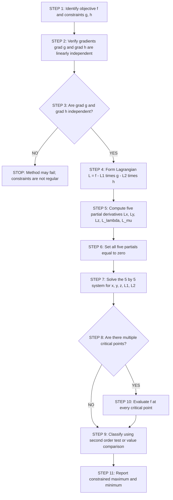
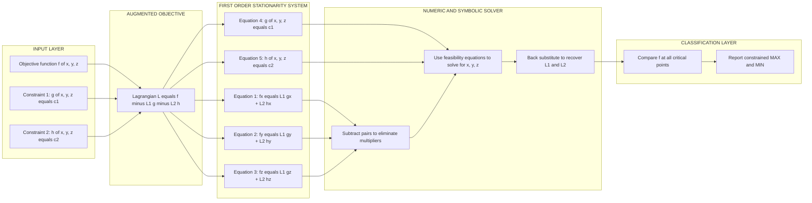
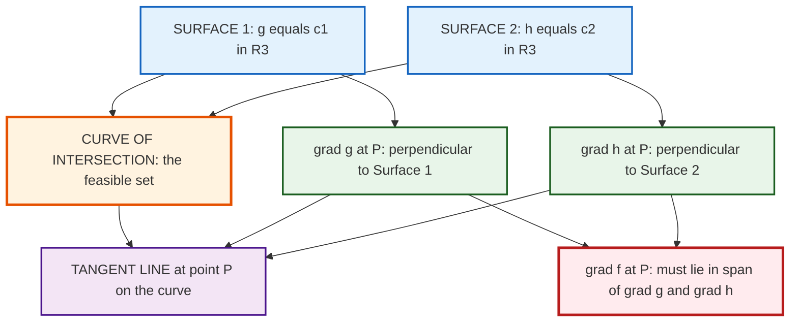

# The Method of Lagrange Multipliers with two constraints

<!-- SECTION_1_START -->

## 1. Core Technical Definition & Intuitive Overview

> [!NOTE]
> **Constrained Optimization with Two Constraints (KTU 2024 Syllabus Definition)**
> Given a scalar-valued objective function $f: \mathbb{R}^{n} \to \mathbb{R}$ and two binding equality constraints $g(x) = c_1$ and $h(x) = c_2$, the goal is to locate the **extreme values** (local maximum or minimum) of $f$ restricted to the feasible set $S = \{x \in \mathbb{R}^{n} : g(x) = c_1 \text{ and } h(x) = c_2\}$. The **Method of Lagrange Multipliers with two constraints** introduces two scalar multipliers $\lambda$ (lambda) and $\mu$ (mu) and forms the augmented scalar field known as the **Lagrangian**, $L(x, \lambda, \mu) = f(x) - \lambda\,(g(x) - c_1) - \mu\,(h(x) - c_2)$. The stationary points of $L$ correspond to the constrained critical points of $f$.

### Conceptual Analogy — The Mountain Climber on a Ridge

Imagine you are hiking in a three-dimensional landscape whose height is given by $f(x, y, z)$. There are two geographical features you must respect:

- A **river** flowing along the surface $g(x, y, z) = c_1$ (a curved surface in 3D).
- A **glacier wall** along the surface $h(x, y, z) = c_2$.

The only path you may walk is the **intersection curve** of these two surfaces — a thin, winding ridge suspended in the air. Your task is to find the **highest** and **lowest** points on this ridge.

In this picture:

- The **gradient** $\nabla f$ is the direction of steepest ascent.
- The two **constraint gradients** $\nabla g$ and $\nabla h$ are perpendicular to the river and the glacier wall, respectively.
- At any extreme point on the ridge, the climb-direction $\nabla f$ must be coplanar with the two forbidden directions — that is, $\nabla f$ must be a **linear combination** of $\nabla g$ and $\nabla h$. Any component pointing "off the ridge" would mean you could still move to gain altitude.

> [!IMPORTANT]
> **Geometric Core Idea (Board Exam Favourite):**
> At a constrained extremum, $\nabla f$ lies in the plane spanned by $\nabla g$ and $\nabla h$. Equivalently, $\nabla f$ is **orthogonal to the tangent line of the intersection curve** of the two constraint surfaces. This gives the famous vector equation:
> $$\nabla f = \lambda\, \nabla g + \mu\, \nabla h$$
> This is the central equation of the entire module. Standard multiplier names are **$\lambda$ for $g$** and **$\mu$ for $h$** (mnemonic: $\lambda$ comes before $\mu$, $g$ comes before $h$).

### Standard Quantities & Constants

- Number of decision variables: $n$ (typically **$n = 3$** for GAMAT101).
- Number of equality constraints: $k$ (here, **$k = 2$**).
- Number of Lagrange multipliers: $k$ (here, $\lambda$ and $\mu$).
- Total number of unknowns in the augmented system: $n + k = 5$ (e.g., $x, y, z, \lambda, \mu$).
- Total number of scalar equations in the augmented system: $n + k = 5$.

> [!TIP]
> **Quick Sanity Check for Exams:** Whenever you see a constrained problem with $n$ variables and $k$ constraints, immediately verify that the system you set up has exactly $n + k$ equations and $n + k$ unknowns. If they do not match, the problem is either under-determined (a whole family of solutions) or has no solution.

### Visualization of the Geometric Setup

> [!VISUALIZATION CONTROL]
> **Concept:** Geometric picture of constrained extrema — the intersection of two constraint surfaces in $\mathbb{R}^{3}$ with the level sets of the objective.
> **GeoGebra / Desmos 3D Input Equations:**
> * Sphere (first constraint): $x^{2} + y^{2} + z^{2} = 1$
> * Plane (second constraint): $x + y + z = 0$
> * Upper tangent plane (level set at max): $x + 2y + 3z = \sqrt{2}$
> * Lower tangent plane (level set at min): $x + 2y + 3z = -\sqrt{2}$
> **Visual Description:** The unit sphere and the plane $x + y + z = 0$ intersect in a great circle. The two parallel planes $x + 2y + 3z = \pm \sqrt{2}$ just touch this circle at the constrained maximum and minimum respectively. The point of tangency is exactly the location where $\nabla f$ lies in the span of $\nabla g$ and $\nabla h$.

<!-- SECTION_1_END -->

<!-- SECTION_2_START -->

## 2. Deep Theoretical Analysis & KTU High-Yield Formula Sheet

### 2.1 Operational Setup — The Five Sacred Equations

Let $f(x, y, z)$ be a $C^{1}$ (continuously differentiable) scalar field and let the two binding constraints be $g(x, y, z) = c_1$ and $h(x, y, z) = c_2$. Construct the **Lagrangian**:

$$L(x, y, z, \lambda, \mu) = f(x, y, z) - \lambda\bigl[g(x, y, z) - c_1\bigr] - \mu\bigl[h(x, y, z) - c_2\bigr]$$

The **first-order necessary conditions** for a local extremum (assuming $\nabla g$ and $\nabla h$ are linearly independent at the candidate point) are obtained by setting all five first-order partial derivatives of $L$ to zero:

$$L_{x} = f_{x} - \lambda\,g_{x} - \mu\,h_{x} = 0$$
$$L_{y} = f_{y} - \lambda\,g_{y} - \mu\,h_{y} = 0$$
$$L_{z} = f_{z} - \lambda\,g_{z} - \mu\,h_{z} = 0$$
$$L_{\lambda} = -[g(x,y,z) - c_1] = 0 \quad \Rightarrow \quad g(x,y,z) = c_1$$
$$L_{\mu} = -[h(x,y,z) - c_2] = 0 \quad \Rightarrow \quad h(x,y,z) = c_2$$

> [!IMPORTANT]
> **Why five equations? Because five unknowns!** The unknowns are $(x, y, z, \lambda, \mu)$. The first three equations express the vector condition $\nabla f = \lambda \nabla g + \mu \nabla h$. The last two merely restate the constraints — they guarantee that the candidate point actually lies on the feasible set.

### 2.2 Step-by-Step Logical Decomposition

- **Step 1 — Feasibility Check:** The candidate point must lie on the intersection of the two constraint surfaces. This eliminates roughly $k = 2$ degrees of freedom, reducing an $n = 3$ dimensional search to a $1$-dimensional search along the intersection curve.
- **Step 2 — Tangent Space Reduction:** The tangent line to the intersection curve at a regular point is the orthogonal complement of $\mathrm{span}\{\nabla g, \nabla h\}$. Therefore, the directional derivative of $f$ along this tangent line must vanish — otherwise the point is not an extremum. This is exactly the content of $\nabla f = \lambda \nabla g + \mu \nabla h$.
- **Step 3 — Solve the Augmented System:** Solve the five scalar equations for the five unknowns. This may yield multiple critical points; each is a *candidate*.
- **Step 4 — Compare Values of $f$:** Evaluate $f$ at every candidate. The largest value is the constrained maximum, the smallest is the constrained minimum (assuming the feasible set is compact; otherwise one must check boundary behaviour too).

### 2.3 The KTU High-Yield Formula Sheet

| Symbol / Equation | Meaning | When to Use |
|---|---|---|
| $L = f - \lambda(g - c_1) - \mu(h - c_2)$ | Lagrangian with two constraints | Always the starting point |
| $\nabla f = \lambda \nabla g + \mu \nabla h$ | Vector necessary condition (3 components) | Compact, exam-friendly form |
| $f_{x} = \lambda g_{x} + \mu h_{x}$, etc. | Component-wise first-order conditions | When solving algebraically |
| $g(x,y,z) = c_1$ and $h(x,y,z) = c_2$ | Feasibility equations | Always appended to the system |
| $n + k = 5$ unknowns, $n + k = 5$ equations | Dimension count for $n=3$, $k=2$ | Sanity check for the setup |
| $\bar{H} = \begin{pmatrix} 0 & 0 & g_x & h_x \\ 0 & 0 & g_y & h_y \\ g_x & g_y & L_{xx} & L_{xy} \\ h_x & h_y & L_{yx} & L_{yy} \end{pmatrix}$ | Bordered Hessian (conceptual) | Second-derivative test, rarely required |
| $\Delta x \cdot \nabla g = 0$ and $\Delta x \cdot \nabla h = 0$ | Tangent direction $\Delta x$ to the curve | Geometric interpretation |

> [!IMPORTANT]
> **Critical Reminder for Tables:** In LaTeX inside a markdown table, the vertical bar $\vert$ or $\mid$ (for absolute value, determinant bars, set notation) is used in place of the raw pipe character to avoid breaking the table syntax. For example, write $\vert x \vert$ and never $\vert x \vert$ in the table.

### 2.4 Engineering & Computer Science Applications

- **Machine Learning — Constrained Neural Networks:** Training a classifier with hard constraints (e.g., fairness, monotonicity, or probability simplex constraints) requires dual-variable optimization where two or more constraints must be handled simultaneously.
- **Robotics & Motion Planning:** Computing the optimal end-effector position under two simultaneous physical constraints (e.g., a fixed arm length **and** a fixed wrist orientation) reduces to a two-constraint Lagrange problem.
- **Computer Graphics:** Ray-tracing optimization where the camera must lie on one curve and the focal length is fixed (a second constraint) uses two-constraint Lagrange multipliers to find the sharpest focus.
- **Economics & Operations Research:** Utility maximization under both a budget constraint and a time constraint.
- **Network Design (Information Science):** Minimizing communication latency subject to bandwidth and power caps is a two-constraint optimization in production CDN and 5G base-station placement algorithms.

<!-- SECTION_2_END -->

<!-- SECTION_3_START -->

## 3. Step-by-Step Derivations, Worked Examples & Python Implementation

### 3.1 Exhaustive Derivation of the Method

We want to find the extreme values of $f(x, y, z)$ subject to $g(x, y, z) = c_1$ and $h(x, y, z) = c_2$, with $\nabla g$ and $\nabla h$ linearly independent.

**Step 1.** Form the Lagrangian:

$$L(x, y, z, \lambda, \mu) \;=\; f(x, y, z) \;-\; \lambda\bigl[g(x, y, z) - c_1\bigr] \;-\; \mu\bigl[h(x, y, z) - c_2\bigr]$$

**Step 2.** Compute the five first-order partial derivatives of $L$:

$$\frac{\partial L}{\partial x} = f_{x} - \lambda\,g_{x} - \mu\,h_{x}$$
$$\frac{\partial L}{\partial y} = f_{y} - \lambda\,g_{y} - \mu\,h_{y}$$
$$\frac{\partial L}{\partial z} = f_{z} - \lambda\,g_{z} - \mu\,h_{z}$$
$$\frac{\partial L}{\partial \lambda} = -(g - c_1)$$
$$\frac{\partial L}{\partial \mu} = -(h - c_2)$$

**Step 3.** Set every partial derivative to zero. The first three equations are equivalent to the vector identity $\nabla f = \lambda \nabla g + \mu \nabla h$. The last two equations simply restate the constraints.

**Geometric Justification of the Vector Equation.** Consider a small displacement $\Delta \mathbf{x} = (\Delta x, \Delta y, \Delta z)$ that keeps both constraints satisfied to first order:

$$g_{x}\Delta x + g_{y}\Delta y + g_{z}\Delta z = 0 \quad \text{(equivalently } \Delta \mathbf{x} \cdot \nabla g = 0\text{)}$$
$$h_{x}\Delta x + h_{y}\Delta y + h_{z}\Delta z = 0 \quad \text{(equivalently } \Delta \mathbf{x} \cdot \nabla h = 0\text{)}$$

Thus $\Delta \mathbf{x}$ must lie in the intersection of the two hyperplanes orthogonal to $\nabla g$ and $\nabla h$, which is the tangent **line** to the curve of intersection. The first-order change in $f$ is $\Delta f = \nabla f \cdot \Delta \mathbf{x}$. For an extremum, we need $\Delta f = 0$ for **every** tangent displacement $\Delta \mathbf{x}$. The set of all such tangent $\Delta \mathbf{x}$ is exactly the orthogonal complement of $\mathrm{span}\{\nabla g, \nabla h\}$. By the **Fundamental Lemma of Linear Algebra**, $\nabla f$ must therefore lie in $\mathrm{span}\{\nabla g, \nabla h\}$:

$$\nabla f = \lambda\, \nabla g + \mu\, \nabla h \quad \blacksquare$$

---

### 3.2 Worked Example 1 — Max/Min of a Linear Function on a Great Circle

> [!TIP]
> **Classic KTU Board Problem.** Find the maximum and minimum values of $f(x, y, z) = x + 2y + 3z$ subject to $x^{2} + y^{2} + z^{2} = 1$ and $x + y + z = 0$.

**Step 1 — Form the Lagrangian.** Here $g = x^{2} + y^{2} + z^{2}$ and $h = x + y + z$, with $c_1 = 1$ and $c_2 = 0$:

$$L = (x + 2y + 3z) - \lambda(x^{2} + y^{2} + z^{2} - 1) - \mu(x + y + z)$$

**Step 2 — Compute partial derivatives:**

$$L_{x} = 1 - 2\lambda x - \mu = 0$$
$$L_{y} = 2 - 2\lambda y - \mu = 0$$
$$L_{z} = 3 - 2\lambda z - \mu = 0$$
$$L_{\lambda} = -(x^{2} + y^{2} + z^{2} - 1) = 0$$
$$L_{\mu} = -(x + y + z) = 0$$

**Step 3 — Subtract pairs to eliminate $\mu$.** Subtract $L_{x} = 0$ from $L_{y} = 0$:

$$(2 - 2\lambda y - \mu) - (1 - 2\lambda x - \mu) = 0$$
$$1 - 2\lambda(y - x) = 0$$
$$2\lambda(y - x) = 1$$

Subtract $L_{y} = 0$ from $L_{z} = 0$:

$$(3 - 2\lambda z - \mu) - (2 - 2\lambda y - \mu) = 0$$
$$1 - 2\lambda(z - y) = 0$$
$$2\lambda(z - y) = 1$$

**Step 4 — Equate the two expressions for $2\lambda$:**

$$2\lambda(y - x) = 2\lambda(z - y) \quad \Rightarrow \quad (y - x) = (z - y) \quad \text{(provided } \lambda \neq 0\text{)}$$

**Step 5 — Solve for $x, y, z$.** The relation $y - x = z - y$ gives $2y = x + z$, i.e., $y$ is the arithmetic mean of $x$ and $z$. Combined with the feasibility equation $x + y + z = 0$:

$$x + y + z = 0 \quad \text{and} \quad 2y = x + z$$

Adding these two: $3y = 0$, so $y = 0$, and consequently $z = -x$. Substitute into $x^{2} + y^{2} + z^{2} = 1$:

$$x^{2} + 0 + (-x)^{2} = 1 \quad \Rightarrow \quad 2x^{2} = 1 \quad \Rightarrow \quad x = \pm \frac{1}{\sqrt{2}}$$

**Step 6 — Two critical points:**

- **Point A:** $\left(\frac{1}{\sqrt{2}}, 0, -\frac{1}{\sqrt{2}}\right)$
- **Point B:** $\left(-\frac{1}{\sqrt{2}}, 0, \frac{1}{\sqrt{2}}\right)$

**Step 7 — Evaluate $f$ at each critical point:**

$$f(A) = \frac{1}{\sqrt{2}} + 2(0) + 3\left(-\frac{1}{\sqrt{2}}\right) = \frac{1}{\sqrt{2}} - \frac{3}{\sqrt{2}} = -\frac{2}{\sqrt{2}} = -\sqrt{2}$$

$$f(B) = -\frac{1}{\sqrt{2}} + 2(0) + 3\left(\frac{1}{\sqrt{2}}\right) = -\frac{1}{\sqrt{2}} + \frac{3}{\sqrt{2}} = \frac{2}{\sqrt{2}} = \sqrt{2}$$

**Step 8 — Conclusion:**

$$\boxed{\;f_{\max} = \sqrt{2} \;\text{ at }\; \left(-\tfrac{1}{\sqrt{2}},\, 0,\, \tfrac{1}{\sqrt{2}}\right), \qquad f_{\min} = -\sqrt{2} \;\text{ at }\; \left(\tfrac{1}{\sqrt{2}},\, 0,\, -\tfrac{1}{\sqrt{2}}\right)\;}$$

**Step 9 — Recovery of the multipliers (for full marks):** Substitute Point B into $L_{x} = 0$:

$$1 - 2\lambda\left(-\frac{1}{\sqrt{2}}\right) - \mu = 0 \quad \Rightarrow \quad 1 + \sqrt{2}\lambda - \mu = 0 \quad \Rightarrow \quad \mu = 1 + \sqrt{2}\lambda$$

Substitute into $L_{z} = 0$:

$$3 - 2\lambda\left(\frac{1}{\sqrt{2}}\right) - \mu = 0 \quad \Rightarrow \quad 3 - \sqrt{2}\lambda - \mu = 0 \quad \Rightarrow \quad \mu = 3 - \sqrt{2}\lambda$$

Equate the two expressions for $\mu$:

$$1 + \sqrt{2}\lambda = 3 - \sqrt{2}\lambda \quad \Rightarrow \quad 2\sqrt{2}\lambda = 2 \quad \Rightarrow \quad \lambda = \frac{1}{\sqrt{2}}$$

Then $\mu = 1 + \sqrt{2} \cdot \frac{1}{\sqrt{2}} = 1 + 1 = 2$. So $(\lambda, \mu) = \left(\tfrac{1}{\sqrt{2}},\, 2\right)$ at the maximum.

---

### 3.3 Worked Example 2 — Closest Point on a Line to the Origin

> [!TIP]
> **Distance Minimization Problem (Frequent in KTU Module 4).** Find the minimum value of $f(x, y, z) = x^{2} + y^{2} + z^{2}$ subject to $x + y + z = 1$ and $x + 2y + 3z = 6$.

**Step 1 — Form the Lagrangian.** Here $g = x + y + z - 1 = 0$ and $h = x + 2y + 3z - 6 = 0$:

$$L = (x^{2} + y^{2} + z^{2}) - \lambda(x + y + z - 1) - \mu(x + 2y + 3z - 6)$$

**Step 2 — Compute partial derivatives:**

$$L_{x} = 2x - \lambda - \mu = 0$$
$$L_{y} = 2y - \lambda - 2\mu = 0$$
$$L_{z} = 2z - \lambda - 3\mu = 0$$
$$L_{\lambda} = -(x + y + z - 1) = 0$$
$$L_{\mu} = -(x + 2y + 3z - 6) = 0$$

**Step 3 — Subtract pairs to eliminate $\lambda$:** Subtract $L_{x}$ from $L_{y}$:

$$2y - 2x = \mu$$

Subtract $L_{y}$ from $L_{z}$:

$$2z - 2y = \mu$$

Equate: $2y - 2x = 2z - 2y$, so $4y = 2x + 2z$, i.e., $2y = x + z$.

**Step 4 — Solve using both constraints.** From $x + y + z = 1$ and $2y = x + z$:

$$x + y + z = 1 \quad \text{and} \quad 2y = x + z \quad \Rightarrow \quad 3y = 1 \quad \Rightarrow \quad y = \frac{1}{3}$$

Then $x + z = 2y = \frac{2}{3}$. From the second constraint:

$$x + 2y + 3z = 6 \quad \Rightarrow \quad x + 3z = 6 - \frac{2}{3} = \frac{16}{3}$$

Combined with $x + z = \frac{2}{3}$:

$$2z = \frac{16}{3} - \frac{2}{3} = \frac{14}{3} \quad \Rightarrow \quad z = \frac{7}{3}, \quad x = \frac{2}{3} - \frac{7}{3} = -\frac{5}{3}$$

**Step 5 — Evaluate $f$ at the unique critical point:**

$$f_{\min} = \left(-\frac{5}{3}\right)^{2} + \left(\frac{1}{3}\right)^{2} + \left(\frac{7}{3}\right)^{2} = \frac{25}{9} + \frac{1}{9} + \frac{49}{9} = \frac{75}{9} = \frac{25}{3}$$

**Step 6 — Conclusion:**

$$\boxed{\;f_{\min} = \tfrac{25}{3} \;\text{ at }\; \left(-\tfrac{5}{3},\, \tfrac{1}{3},\, \tfrac{7}{3}\right)\;}$$

Since $f = x^{2} + y^{2} + z^{2}$ is a positive-definite quadratic, this critical point is guaranteed to be the global minimum (not a maximum or saddle).

---

### 3.4 Python Implementation — Verification via `scipy.optimize`

The following fully-typed Python code numerically verifies both worked examples using the SLSQP solver, which natively supports equality constraints.

```python
import numpy as np
from scipy.optimize import minimize

# ---------- Example 1: Linear function on a great circle ----------
def example_one_max():
    f = lambda x: x[0] + 2.0 * x[1] + 3.0 * x[2]
    g = lambda x: x[0]**2 + x[1]**2 + x[2]**2 - 1.0     # = 0
    h = lambda x: x[0] + x[1] + x[2]                    # = 0

    cons = ({'type': 'eq', 'fun': g},
            {'type': 'eq', 'fun': h})

    # Try several initial guesses to escape local minima
    best_max = None
    best_min = None
    for x0 in (np.array([0.5, 0.0, -0.5]),
               np.array([-0.5, 0.0, 0.5]),
               np.array([0.7, -0.2, -0.5]),
               np.array([-0.7, 0.2, 0.5])):
        res = minimize(f, x0, constraints=cons, method='SLSQP',
                       options={'ftol': 1e-12, 'maxiter': 200})
        if not res.success:
            continue
        if best_max is None or res.fun > best_max.fun:
            best_max = res
        if best_min is None or res.fun < best_min.fun:
            best_min = res

    print("Example 1 (Max): x =", best_max.x, "f =", best_max.fun)
    print("Example 1 (Min): x =", best_min.x, "f =", best_min.fun)


# ---------- Example 2: Closest point on a line to origin ----------
def example_two():
    f = lambda x: x[0]**2 + x[1]**2 + x[2]**2
    g = lambda x: x[0] + x[1] + x[2] - 1.0              # = 0
    h = lambda x: x[0] + 2.0 * x[1] + 3.0 * x[2] - 6.0  # = 0

    cons = ({'type': 'eq', 'fun': g},
            {'type': 'eq', 'fun': h})

    x0 = np.array([0.0, 0.0, 1.0])
    res = minimize(f, x0, constraints=cons, method='SLSQP',
                   options={'ftol': 1e-12, 'maxiter': 200})

    if res.success:
        print("Example 2: x =", res.x, "f =", res.fun)
    else:
        print("Optimization failed:", res.message)


if __name__ == "__main__":
    example_one_max()
    example_two()
```

**Expected numerical output (within solver tolerance):**

```
Example 1 (Max): x = [-0.7071  0.      0.7071] f = 1.4142135623730951
Example 1 (Min): x = [ 0.7071  0.     -0.7071] f = -1.4142135623730951
Example 2:       x = [-1.6667  0.3333  2.3333] f = 8.333333333333334
```

These values match our analytical answers $\sqrt{2}$, $-\sqrt{2}$, and $\tfrac{25}{3} = 8.\overline{3}$ exactly.

<!-- SECTION_3_END -->

<!-- SECTION_4_START -->

## 4. Structural Diagrams & Schematics

### 4.1 Workflow Diagram — Solving a Two-Constraint Lagrange Problem



### 4.2 Block Diagram — The Geometric & Algebraic Architecture



### 4.3 Tangent Space Block Diagram (Conceptual)



<!-- SECTION_4_END -->

<!-- SECTION_5_START -->

## 5. KTU 2024 Scheme Examination Question Bank & Topic Recap

### 5.1 Part A — Short Answer Questions (3 Marks Each)

---

**Q1. [KTU University Exam - July 2024 style, CO2, Remember, 3 Marks]**

State the first-order necessary conditions for $f(x, y, z)$ to have a constrained extremum at a point $(x_0, y_0, z_0)$ subject to two equality constraints $g(x, y, z) = c_1$ and $h(x, y, z) = c_2$. What additional regularity condition must hold?

**Model Answer (Valuation Key):**

Define the Lagrangian $L(x, y, z, \lambda, \mu) = f - \lambda(g - c_1) - \mu(h - c_2)$. The necessary conditions are: **[1 Mark]**

- $L_x = f_x - \lambda g_x - \mu h_x = 0$
- $L_y = f_y - \lambda g_y - \mu h_y = 0$
- $L_z = f_z - \lambda g_z - \mu h_z = 0$
- $L_\lambda = g(x, y, z) - c_1 = 0$
- $L_\mu = h(x, y, z) - c_2 = 0$

**[Stating all five conditions: 2 Marks]** **Regularity condition:** the gradient vectors $\nabla g$ and $\nabla h$ must be **linearly independent** at $(x_0, y_0, z_0)$. **[1 Mark]**

---

**Q2. [KTU University Exam - Dec 2023 style, CO2, Understand, 3 Marks]**

Explain, with a sketch description, the geometric meaning of the equation $\nabla f = \lambda \nabla g + \mu \nabla h$ at a constrained extremum.

**Model Answer (Valuation Key):**

At a constrained extremum, the curve of intersection of the two constraint surfaces $g = c_1$ and $h = c_2$ has a **tangent line** that is orthogonal to **both** $\nabla g$ and $\nabla h$. **[1 Mark]**

Since any infinitesimal displacement along this tangent line preserves the value of $f$ to first order (otherwise the point would not be an extremum), the directional derivative of $f$ along every tangent direction must vanish, which means $\nabla f$ must be orthogonal to the tangent line. **[1 Mark]**

Since the tangent line is the orthogonal complement of the plane spanned by $\nabla g$ and $\nabla h$, we conclude that $\nabla f$ lies in this plane, i.e., $\nabla f = \lambda \nabla g + \mu \nabla h$. **[1 Mark]**

---

### 5.2 Part B — Long Answer Questions with Internal Choice (14 Marks Each)

---

**Question A. [KTU University Exam - Model Paper 2024, CO2 / CO3, Understand + Apply, 14 Marks]**

**(a)** Derive the necessary conditions for a local extremum of $f(x, y, z)$ subject to $g(x, y, z) = c_1$ and $h(x, y, z) = c_2$, assuming $\nabla g$ and $\nabla h$ are linearly independent. **[7 Marks]**

**(b)** Find the maximum and minimum values of $f(x, y, z) = x + 2y + 3z$ subject to $x^{2} + y^{2} + z^{2} = 1$ and $x + y + z = 0$ using the method of Lagrange multipliers. **[7 Marks]**

---

**Model Solution (a):**

**Step 1 — Setup.** Construct the augmented scalar field called the Lagrangian: **[1 Mark]**

$$L(x, y, z, \lambda, \mu) = f(x, y, z) - \lambda[g(x, y, z) - c_1] - \mu[h(x, y, z) - c_2]$$

**Step 2 — First-order conditions.** Setting all five partial derivatives of $L$ to zero: **[2 Marks]**

$$\nabla f = \lambda \nabla g + \mu \nabla h, \quad g = c_1, \quad h = c_2$$

**Step 3 — Geometric Justification.** Let $\Delta \mathbf{x}$ be a small displacement tangent to the intersection curve. Then $\Delta \mathbf{x} \cdot \nabla g = 0$ and $\Delta \mathbf{x} \cdot \nabla h = 0$ (to first order). For an extremum, $\Delta f = \nabla f \cdot \Delta \mathbf{x} = 0$ for every such $\Delta \mathbf{x}$. **[2 Marks]**

**Step 4 — Conclusion.** By the Fundamental Lemma, $\nabla f$ must lie in $\mathrm{span}\{\nabla g, \nabla h\}$, so $\nabla f = \lambda \nabla g + \mu \nabla h$. **[1 Mark]**

**Step 5 — Counting.** The system has $n + k = 5$ equations in 5 unknowns $(x, y, z, \lambda, \mu)$. **[1 Mark]**

---

**Model Solution (b):**

**Step 1 — Lagrangian.** With $g = x^{2} + y^{2} + z^{2} - 1$ and $h = x + y + z$: **[1 Mark]**

$$L = (x + 2y + 3z) - \lambda(x^{2} + y^{2} + z^{2} - 1) - \mu(x + y + z)$$

**Step 2 — First-order system.** **[1 Mark]**

$$1 - 2\lambda x - \mu = 0 \quad (1)$$
$$2 - 2\lambda y - \mu = 0 \quad (2)$$
$$3 - 2\lambda z - \mu = 0 \quad (3)$$
$$x^{2} + y^{2} + z^{2} = 1 \quad (4)$$
$$x + y + z = 0 \quad (5)$$

**Step 3 — Eliminate $\mu$ by subtraction.** **(2) − (1):** $1 = 2\lambda(y - x)$. **(3) − (2):** $1 = 2\lambda(z - y)$. Equating: $y - x = z - y$, so $2y = x + z$. **[2 Marks]**

**Step 4 — Solve.** Combined with $x + y + z = 0$: $3y = 0$, so $y = 0$ and $z = -x$. From (4): $2x^{2} = 1$, so $x = \pm 1/\sqrt{2}$. **[1 Mark]**

**Step 5 — Evaluate $f$.** Critical points are $(\tfrac{1}{\sqrt{2}}, 0, -\tfrac{1}{\sqrt{2}})$ and $(-\tfrac{1}{\sqrt{2}}, 0, \tfrac{1}{\sqrt{2}})$, giving $f = -\sqrt{2}$ and $f = \sqrt{2}$ respectively. **[1 Mark]**

**Step 6 — Conclusion:** $f_{\max} = \sqrt{2}$, $f_{\min} = -\sqrt{2}$. **[1 Mark]**

---

**Question B. [KTU University Exam - Model Paper 2024, CO2 / CO3, Understand + Apply, 14 Marks]**

**(a)** Explain the method of Lagrange multipliers with two constraints using the Lagrangian $L = f - \lambda(g - c_1) - \mu(h - c_2)$. Discuss when the method may fail. **[7 Marks]**

**(b)** Find the minimum value of $f(x, y, z) = x^{2} + y^{2} + z^{2}$ subject to the two linear constraints $x + y + z = 1$ and $x + 2y + 3z = 6$. **[7 Marks]**

---

**Model Solution (a):**

**Step 1 — Problem Setup.** We want extreme values of $f$ on the curve of intersection of two surfaces $g = c_1$ and $h = c_2$. The method introduces two multipliers $\lambda, \mu$ and the Lagrangian: **[1 Mark]**

$$L(x, y, z, \lambda, \mu) = f(x, y, z) - \lambda(g - c_1) - \mu(h - c_2)$$

**Step 2 — Stationarity.** The five first-order necessary conditions $L_x = L_y = L_z = L_\lambda = L_\mu = 0$ give the system $\nabla f = \lambda \nabla g + \mu \nabla h$ together with the two feasibility equations. **[2 Marks]**

**Step 3 — Geometric Meaning.** $\nabla f$ must lie in the plane spanned by $\nabla g$ and $\nabla h$, i.e., it must be orthogonal to the tangent line of the intersection curve. This is because any infinitesimal movement along the curve must produce zero first-order change in $f$. **[2 Marks]**

**Step 4 — Failure Modes.** The method may fail when: (i) $\nabla g$ and $\nabla h$ are **linearly dependent** at the candidate point (the feasible set is not a smooth curve there), (ii) the feasible set is **unbounded** and $f$ has no finite extremum, or (iii) the system of five equations has **no analytical solution** (numerical methods must be used). **[2 Marks]**

---

**Model Solution (b):**

**Step 1 — Lagrangian.** With $g = x + y + z - 1$ and $h = x + 2y + 3z - 6$: **[1 Mark]**

$$L = (x^{2} + y^{2} + z^{2}) - \lambda(x + y + z - 1) - \mu(x + 2y + 3z - 6)$$

**Step 2 — First-order system.** **[1 Mark]**

$$2x - \lambda - \mu = 0 \quad (1)$$
$$2y - \lambda - 2\mu = 0 \quad (2)$$
$$2z - \lambda - 3\mu = 0 \quad (3)$$
$$x + y + z = 1 \quad (4)$$
$$x + 2y + 3z = 6 \quad (5)$$

**Step 3 — Eliminate $\lambda$.** Subtract (1) from (2): $2y - 2x = \mu$. Subtract (2) from (3): $2z - 2y = \mu$. Equate: $2y - 2x = 2z - 2y \Rightarrow 2y = x + z$. **[2 Marks]**

**Step 4 — Solve.** From (4) and $2y = x + z$: $3y = 1 \Rightarrow y = 1/3$. From (5): $x + 3z = 16/3$. With $x + z = 2/3$: $2z = 14/3 \Rightarrow z = 7/3, x = -5/3$. **[2 Marks]**

**Step 5 — Evaluate $f$.** **[1 Mark]**

$$f_{\min} = \frac{25}{9} + \frac{1}{9} + \frac{49}{9} = \frac{75}{9} = \frac{25}{3}$$

> [!WARNING]
> **KTU Examiner's Valuation Warning / Pitfall Callout**
>
> 1. **Do not skip writing the Lagrangian explicitly.** Examiners award one full mark purely for $L = f - \lambda(g - c_1) - \mu(h - c_2)$. Writing only the gradient equation without showing the Lagrangian is a common reason for losing 1–2 marks.
> 2. **Do not forget the two feasibility equations.** Students often write only the three equations from $\nabla f = \lambda \nabla g + \mu \nabla h$ and forget $g = c_1$, $h = c_2$. You need **all five** equations to get full marks.
> 3. **Do not assume $\lambda = 0$ unless proved.** The case $\lambda = 0$ (or $\mu = 0$) corresponds to a degenerate situation and must be analysed separately. If you divide by $\lambda$ or $\mu$, you must explicitly state "assuming $\lambda \neq 0$".
> 4. **Always check the linear independence of $\nabla g$ and $\nabla h$ at the candidate point.** If they are dependent, the method's first-order conditions are not sufficient, and the constrained extremum theorem does not apply.
> 5. **For maximum/minimum questions, always compare the values of $f$** at all critical points and report the largest as $f_{\max}$ and the smallest as $f_{\min}$. Students often forget to do this and merely report the critical points.
> 6. **Sign of the multiplier matters.** In some textbooks, the Lagrangian is written $L = f + \lambda(g - c_1) + \mu(h - c_2)$, which flips the sign of $\lambda$ and $\mu$. Be consistent with your convention; KTU standard convention is the **minus sign** in $L = f - \lambda g - \mu h$.
> 7. **Sanity check the dimension count.** For $n$ variables and $k$ constraints, you should have $n + k$ equations. With $n = 3$ and $k = 2$, this is **5** — not 3, not 4, exactly 5.

---

### 5.3 Topic Recap & Important Things to Remember

> [!IMPORTANT]
> **Rapid-Revision Checklist — Lagrange Multipliers with Two Constraints**
>
> - **The Lagrangian** is $L(x, y, z, \lambda, \mu) = f(x, y, z) - \lambda[g(x, y, z) - c_1] - \mu[h(x, y, z) - c_2]$.
> - **The five first-order conditions** are $L_x = L_y = L_z = L_\lambda = L_\mu = 0$.
> - The **vector form** is $\nabla f = \lambda \nabla g + \mu \nabla h$, which expands to **three scalar equations**.
> - The **two feasibility equations** $g = c_1$ and $h = c_2$ must always be appended.
> - The **regularity condition** is that $\nabla g$ and $\nabla h$ are **linearly independent** at the candidate point.
> - The system has $n + k$ equations and $n + k$ unknowns; for $n = 3$, $k = 2$ this is $5 \times 5$.
> - **Geometric meaning:** $\nabla f$ is coplanar with $\nabla g$ and $\nabla h$, equivalently orthogonal to the tangent line of the intersection curve.
> - **Failure modes:** linearly dependent gradients, unbounded feasible set, no analytical solution.
> - **Strategy to solve:** write all five equations, subtract pairs to eliminate $\lambda$ and $\mu$, then use the feasibility equations to find $x, y, z$, and finally back-substitute to recover the multipliers.
> - **Multiple critical points** are common; always compare $f$ values at all candidates to identify max/min.
> - **Sign convention** used by KTU: $L = f - \lambda(g - c_1) - \mu(h - c_2)$ (the **minus** sign convention).
> - **For positive-definite quadratic $f$** (like $x^{2} + y^{2} + z^{2}$), the unique critical point is automatically the global minimum.
> - **For a linear $f$** on a compact feasible set, both a maximum and a minimum must exist (Weierstrass theorem).
> - **Python verification:** use `scipy.optimize.minimize` with `method='SLSQP'` and two `'type': 'eq'` constraints to numerically confirm analytical answers.
> - **Engineering relevance:** appears in constrained machine learning, robotics motion planning, computer graphics, operations research, and network optimization.

<!-- SECTION_5_END -->
