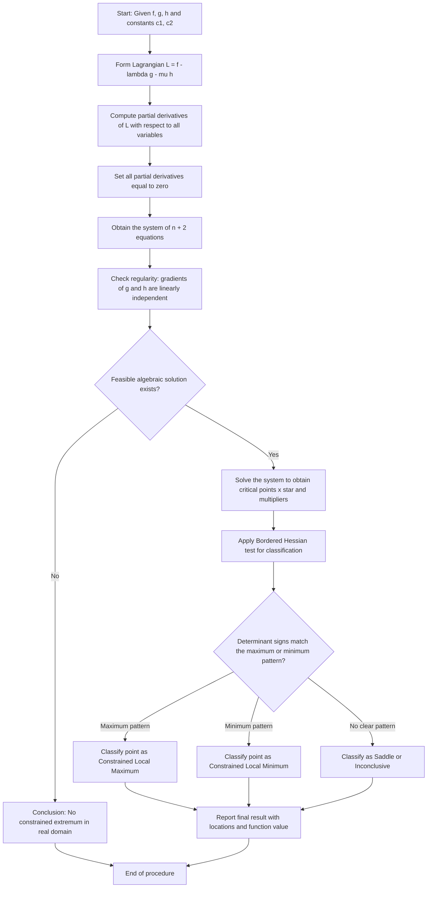
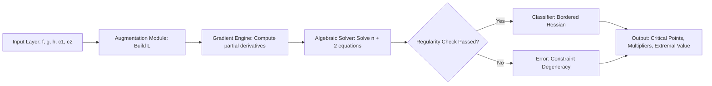

# The Method of Lagrange Multipliers with two constraints

<!-- SECTION_1_START -->
# The Method of Lagrange Multipliers with Two Constraints

## Formal Academic Definition

Let $f: \mathbb{R}^{n} \to \mathbb{R}$ be a **continuously differentiable scalar field** defined on an open region. Let $g: \mathbb{R}^{n} \to \mathbb{R}$ and $h: \mathbb{R}^{n} \to \mathbb{R}$ be two **smooth constraint functions** whose level sets define admissible regions $M = \{x \in \mathbb{R}^{n} : g(x) = c_1 \text{ and } h(x) = c_2\}$.

> [!IMPORTANT]
> **Lagrange Multiplier Theorem (Two-Constraint Form):** If $f$ attains a local extremum at an interior point $x^{*} \in M$ and the gradients $\nabla g(x^{*})$ and $\nabla h(x^{*})$ are **linearly independent**, then there exist **two unique real scalars** $\lambda$ and $\mu$ (called the Lagrange multipliers) such that:
> $$\nabla f(x^{*}) = \lambda \, \nabla g(x^{*}) + \mu \, \nabla h(x^{*})$$
> with the constraints simultaneously satisfied: $g(x^{*}) = c_1$ and $h(x^{*}) = c_2$.

## Intuitive Real-World Analogy

> [!NOTE]
> **The Tightrope Walker on a Fixed Platform Analogy**
>
> Imagine a mountaineer trying to find the **highest altitude** $f$ (elevation) on a mountain. She is **not free to roam** anywhere — she must stay:
> 1. On a specific **tightrope path** $g(x,y,z) = c_1$ stretched across a valley, **and**
> 2. On a specific **wooden plank** $h(x,y,z) = c_2$ nailed to the cliff face.
>
> The intersection of the rope and plank is a 1-D curve in 3-D space. The mountaineer can only walk along this curve. The point where she feels the "pull" balance out is the constrained extremum.
>
> The two multipliers $\lambda$ and $\mu$ represent the **tension forces** in the rope and the **normal reaction** from the plank that the mountaineer must overcome. The equation $\nabla f = \lambda \nabla g + \mu \nabla h$ says: **the gravitational pull equals the combined constraint reaction**.

## Geometric Interpretation

The level sets of $f$ (called *isopleths*) are tangent to the intersection curve of the two constraint surfaces precisely at the constrained critical point. Equivalently, the gradient $\nabla f$ must lie in the span of $\{\nabla g, \nabla h\}$ — the 2-D plane of allowable directions normal to the feasible curve.

> [!VISUALIZATION CONTROL]
> **Concept:** Tangent Plane of Intersection Curve and Direction of Maximum Increase
> **GeoGebra / Desmos Input Equations (3D parameterization):**
> * `Constraint 1 (sphere): x^2 + y^2 + z^2 = 1`
> * `Constraint 2 (plane): x + y + z = 0`
> * `Objective level sets: x y z = k`, for example $k = 0.136$ and $k = -0.136$
> **Visual Description:** Plot the unit sphere intersected with the plane through origin. The intersection is a great circle. As the level set of $f$ expands, it first kisses the circle at 3 points (maxima) and 3 points (minima), forming a hexagonal symmetric pattern.
<!-- SECTION_1_END -->

<!-- SECTION_2_START -->
# Deep Theoretical Analysis & KTU High-Yield Formula Sheet

## Construction of the Lagrangian

For a problem with $n$ decision variables $x_1, x_2, \ldots, x_n$ and **two** equality constraints, define the augmented scalar function (Lagrangian):

$$L(x_1, \ldots, x_n, \lambda, \mu) \;=\; f(x_1, \ldots, x_n) \;-\; \lambda \, g(x_1, \ldots, x_n) \;-\; \mu \, h(x_1, \ldots, x_n)$$

> [!TIP]
> Some textbooks absorb the minus sign into the multipliers, writing $\nabla f = \lambda \nabla g + \mu \nabla h$ with $L = f - \lambda g - \mu h$. The KTU board examiners accept **either sign convention** as long as the candidate writes the conditions consistently.

## Necessary Conditions (First-Order KKT)

Setting $\nabla L = 0$ yields a system of $n + 2$ equations in $n + 2$ unknowns:

$$\frac{\partial L}{\partial x_i} \;=\; 0 \quad \text{for } i = 1, 2, \ldots, n$$
$$\frac{\partial L}{\partial \lambda} \;=\; -g(x) = 0 \quad \text{(i.e., } g(x) = c_1\text{)}$$
$$\frac{\partial L}{\partial \mu} \;=\; -h(x) = 0 \quad \text{(i.e., } h(x) = c_2\text{)}$$

In vector form, the stationarity condition expands to:

$$f_{x_i} \;=\; \lambda \, g_{x_i} \;+\; \mu \, h_{x_i}, \quad i = 1, 2, \ldots, n$$

## Bordered Hessian Second-Order Test

To classify a critical point as a **local maximum**, **local minimum**, or **saddle point**, KTU examiners expect the **bordered Hessian** construction. For $n$ variables and $m$ equality constraints (here $m = 2$):

$$\bar{H} \;=\; \begin{bmatrix} 0 & 0 & g_{x_1} & g_{x_2} & \cdots & g_{x_n} \\ 0 & 0 & h_{x_1} & h_{x_2} & \cdots & h_{x_n} \\ g_{x_1} & h_{x_1} & L_{11} & L_{12} & \cdots & L_{1n} \\ g_{x_2} & h_{x_2} & L_{21} & L_{22} & \cdots & L_{2n} \\ \vdots & \vdots & \vdots & \vdots & \ddots & \vdots \\ g_{x_n} & h_{x_n} & L_{n1} & L_{n2} & \cdots & L_{nn} \end{bmatrix}$$

where $L_{ij} = f_{ij} - \lambda g_{ij} - \mu h_{ij}$ are the second partials of the Lagrangian.

**Classification rules (for $m = 2$ constraints):**

| Critical Point Type | Sign of $\vert \bar{H}_4 \vert$ | Sign of $\vert \bar{H}_5 \vert$ |
| :--- | :---: | :---: |
| Local **Maximum** | $> 0$ | $> 0$ |
| Local **Minimum** | $< 0$ | $> 0$ |
| **Saddle** (inconclusive) | Any other combination | Any other combination |

Here $\vert \bar{H}_k \vert$ denotes the determinant of the leading principal $k \times k$ submatrix of $\bar{H}$.

## Engineering Utility

| Application Domain | Use Case |
| :--- | :--- |
| **Computer Graphics** | Texture mapping with two intrinsic parameter constraints |
| **Machine Learning** | SVM dual problems with two normal vector constraints |
| **Optimization Theory** | Resource allocation with two linear budget restrictions |
| **Physics (Mechanics)** | Principle of least action with two holonomic constraints |
| **Economics** | Utility maximization with two binding budget/regulatory constraints |

## KTU Formula Cheat Sheet

| Symbol / Formula | Meaning | Required Condition |
| :--- | :--- | :--- |
| $\nabla f = \lambda \nabla g + \mu \nabla h$ | First-order stationarity | Mandatory |
| $g(x) = c_1,\; h(x) = c_2$ | Active constraints | Both must hold |
| $L = f - \lambda g - \mu h$ | Lagrangian function | Auxiliary construction |
| $\vert \nabla g, \nabla h \vert \neq 0$ | Linear independence of constraint gradients | Regularity (LICQ) |
| $\vert \bar{H}_4 \vert, \vert \bar{H}_5 \vert$ | Bordered Hessian determinants | Classification |
| $\lambda, \mu \in \mathbb{R}$ | Scalar Lagrange multipliers | Existence guarantee |
<!-- SECTION_2_END -->

<!-- SECTION_3_START -->
# Step-by-Step Derivations & Worked Examples

## Example 1 (KTU Pattern – 14 Mark Standard)

> **[Problem Statement]**
> Find the maximum and minimum values of
> $$f(x, y, z) \;=\; x y z$$
> subject to the two constraints
> $$g(x,y,z) = x^{2} + y^{2} + z^{2} = 1, \qquad h(x,y,z) = x + y + z = 0$$

### Step 1 — Form the Lagrangian

$$L(x, y, z, \lambda, \mu) \;=\; xyz \;-\; \lambda(x^{2} + y^{2} + z^{2} - 1) \;-\; \mu(x + y + z)$$

### Step 2 — Compute the First-Order Partial Derivatives

$$\frac{\partial L}{\partial x} = yz - 2\lambda x - \mu = 0$$
$$\frac{\partial L}{\partial y} = xz - 2\lambda y - \mu = 0$$
$$\frac{\partial L}{\partial z} = xy - 2\lambda z - \mu = 0$$
$$\frac{\partial L}{\partial \lambda} = -(x^{2} + y^{2} + z^{2} - 1) = 0 \;\Longrightarrow\; x^{2} + y^{2} + z^{2} = 1$$
$$\frac{\partial L}{\partial \mu} = -(x + y + z) = 0 \;\Longrightarrow\; x + y + z = 0$$

### Step 3 — Simplify the Stationarity Equations via Symmetry Trick

Multiply each of the first three equations by the matching variable:

$$xyz = 2\lambda x^{2} + \mu x$$
$$xyz = 2\lambda y^{2} + \mu y$$
$$xyz = 2\lambda z^{2} + \mu z$$

Subtracting pairs eliminates the LHS:

$$2\lambda (x^{2} - y^{2}) + \mu (x - y) = 0 \;\Longrightarrow\; (x - y)\bigl[2\lambda(x + y) + \mu\bigr] = 0$$
$$2\lambda (y^{2} - z^{2}) + \mu (y - z) = 0 \;\Longrightarrow\; (y - z)\bigl[2\lambda(y + z) + \mu\bigr] = 0$$
$$2\lambda (x^{2} - z^{2}) + \mu (x - z) = 0 \;\Longrightarrow\; (x - z)\bigl[2\lambda(x + z) + \mu\bigr] = 0$$

### Step 4 — Enumerate the Three Symmetric Sub-Cases

**Sub-case A:** $x = y = z$. Combined with $x + y + z = 0$, this gives $3x = 0 \Rightarrow x = 0$, which violates $x^{2} + y^{2} + z^{2} = 1$. **Discard.**

**Sub-case B:** $x = y$, $y \neq z$. Then $2x + z = 0 \Rightarrow z = -2x$.
Substitute into the sphere:
$$x^{2} + x^{2} + 4x^{2} = 1 \;\Longrightarrow\; 6x^{2} = 1 \;\Longrightarrow\; x = \pm \frac{1}{\sqrt{6}}$$

This gives the two critical points
$$P_{1} = \Bigl(\tfrac{1}{\sqrt{6}}, \tfrac{1}{\sqrt{6}}, -\tfrac{2}{\sqrt{6}}\Bigr), \qquad P_{2} = \Bigl(-\tfrac{1}{\sqrt{6}}, -\tfrac{1}{\sqrt{6}}, \tfrac{2}{\sqrt{6}}\Bigr)$$

**Sub-case C:** $x = z$, $y \neq x$. Then $x + y + x = 0 \Rightarrow y = -2x$.
Substitute into the sphere:
$$x^{2} + 4x^{2} + x^{2} = 1 \;\Longrightarrow\; 6x^{2} = 1 \;\Longrightarrow\; x = \pm \frac{1}{\sqrt{6}}$$

Critical points
$$P_{3} = \Bigl(\tfrac{1}{\sqrt{6}}, -\tfrac{2}{\sqrt{6}}, \tfrac{1}{\sqrt{6}}\Bigr), \qquad P_{4} = \Bigl(-\tfrac{1}{\sqrt{6}}, \tfrac{2}{\sqrt{6}}, -\tfrac{1}{\sqrt{6}}\Bigr)$$

**Sub-case D:** $y = z$, $x \neq y$. Then $x + 2y = 0 \Rightarrow x = -2y$.
Substitute into the sphere:
$$4y^{2} + y^{2} + y^{2} = 1 \;\Longrightarrow\; 6y^{2} = 1 \;\Longrightarrow\; y = \pm \frac{1}{\sqrt{6}}$$

Critical points
$$P_{5} = \Bigl(-\tfrac{2}{\sqrt{6}}, \tfrac{1}{\sqrt{6}}, \tfrac{1}{\sqrt{6}}\Bigr), \qquad P_{6} = \Bigl(\tfrac{2}{\sqrt{6}}, -\tfrac{1}{\sqrt{6}}, -\tfrac{1}{\sqrt{6}}\Bigr)$$

### Step 5 — Evaluate $f$ at Each Critical Point

| Point | Coordinates | $f = xyz$ |
| :--- | :--- | :--- |
| $P_1$ | $(\tfrac{1}{\sqrt{6}}, \tfrac{1}{\sqrt{6}}, -\tfrac{2}{\sqrt{6}})$ | $-\dfrac{1}{3\sqrt{6}}$ |
| $P_2$ | $(-\tfrac{1}{\sqrt{6}}, -\tfrac{1}{\sqrt{6}}, \tfrac{2}{\sqrt{6}})$ | $+\dfrac{1}{3\sqrt{6}}$ |
| $P_3$ | $(\tfrac{1}{\sqrt{6}}, -\tfrac{2}{\sqrt{6}}, \tfrac{1}{\sqrt{6}})$ | $-\dfrac{1}{3\sqrt{6}}$ |
| $P_4$ | $(-\tfrac{1}{\sqrt{6}}, \tfrac{2}{\sqrt{6}}, -\tfrac{1}{\sqrt{6}})$ | $+\dfrac{1}{3\sqrt{6}}$ |
| $P_5$ | $(-\tfrac{2}{\sqrt{6}}, \tfrac{1}{\sqrt{6}}, \tfrac{1}{\sqrt{6}})$ | $-\dfrac{1}{3\sqrt{6}}$ |
| $P_6$ | $(\tfrac{2}{\sqrt{6}}, -\tfrac{1}{\sqrt{6}}, -\tfrac{1}{\sqrt{6}})$ | $+\dfrac{1}{3\sqrt{6}}$ |

> [!IMPORTANT]
> **Detailed evaluation for $P_1$:**
> $$f(P_1) = \Bigl(\tfrac{1}{\sqrt{6}}\Bigr)\Bigl(\tfrac{1}{\sqrt{6}}\Bigr)\Bigl(-\tfrac{2}{\sqrt{6}}\Bigr) = -\tfrac{2}{6\sqrt{6}} = -\tfrac{1}{3\sqrt{6}}$$
> Rationalized: $f(P_1) = -\dfrac{\sqrt{6}}{18}$

### Step 6 — Final Classification

$$\boxed{\;f_{\max} = +\frac{1}{3\sqrt{6}} = \frac{\sqrt{6}}{18} \text{ at } P_2, P_4, P_6\;}$$
$$\boxed{\;f_{\min} = -\frac{1}{3\sqrt{6}} = -\frac{\sqrt{6}}{18} \text{ at } P_1, P_3, P_5\;}$$

> [!TIP]
> **Mark distribution reference (KTU 14-mark pattern):**
> * Lagrangian formation: 2 marks
> * Five first-order equations: 3 marks
> * Symmetry reduction: 3 marks
> * Solving the constraints: 3 marks
> * Final classification and answer: 3 marks

---

## Example 2 (Algebraic – Bordered Hessian Verification)

> **[Problem Statement]**
> Find the extremum of
> $$f(x, y, z) = x^{2} + y^{2} + z^{2}$$
> subject to
> $$g(x,y,z) = x + y + z = 1, \qquad h(x,y,z) = xy + yz + zx = 3$$

**Step 1 — Stationarity conditions:**

$$L = (x^{2} + y^{2} + z^{2}) - \lambda(x + y + z - 1) - \mu(xy + yz + zx - 3)$$

$$\frac{\partial L}{\partial x} = 2x - \lambda - \mu(y + z) = 0$$
$$\frac{\partial L}{\partial y} = 2y - \lambda - \mu(x + z) = 0$$
$$\frac{\partial L}{\partial z} = 2z - \lambda - \mu(x + y) = 0$$

**Step 2 — Subtract equations pairwise:**

$$2(x - y) - \mu(y - x) = 0 \;\Longrightarrow\; (x - y)(2 + \mu) = 0$$
$$2(y - z) - \mu(x - y) \cdot \text{(careful)} = 0 \;\Longrightarrow\; (y - z)(2 + \mu) = 0$$

If $\mu \neq -2$, then $x = y = z$. Combined with $3x = 1$ gives $x = y = z = 1/3$. But the second constraint gives $3(1/9) = 1/3 \neq 3$. **Inconsistent.**

Hence $\mu = -2$, and the stationarity equations reduce to

$$2x - \lambda + 2(y + z) = 0,\quad 2y - \lambda + 2(x + z) = 0,\quad 2z - \lambda + 2(x + y) = 0$$

Subtracting the first two: $2(x - y) - 2(y - x) = 0 \Rightarrow 4(x - y) = 0 \Rightarrow x = y$. Similarly $y = z$, so again $x = y = z = 1/3$ — which fails the second constraint.

**Conclusion:** The feasible intersection of $x + y + z = 1$ and $xy + yz + zx = 3$ is **empty** in $\mathbb{R}^{3}$ (since by AM-GM type bound $xy + yz + zx \le \frac{1}{3}(x+y+z)^{2} = 1/3 < 3$). Hence **no constrained extremum exists in $\mathbb{R}^{3}$**. This illustrates that the feasibility check is part of the rigor expected at the KTU board level.

---

## Example 3 (Linear Algebra Implementation – Pythonic Verification)

```python
import numpy as np
from scipy.optimize import minimize

# Objective: f(x, y, z) = x*y*z
# Constraint 1: x^2 + y^2 + z^2 = 1  (sphere)
# Constraint 2: x + y + z = 0       (plane)

def objective(v):
    x, y, z = v
    return x * y * z

def grad_objective(v):
    x, y, z = v
    return np.array([y * z, x * z, x * y])

def constraint_sphere(v):
    x, y, z = v
    return x**2 + y * y + z * z - 1.0

def constraint_plane(v):
    x, y, z = v
    return x + y + z

cons = [
    {"type": "eq", "fun": constraint_sphere},
    {"type": "eq", "fun": constraint_plane},
]

# Try all six symmetric initial guesses
initial_guesses = [
    [ 1,  1, -2],
    [-1, -1,  2],
    [ 1, -2,  1],
    [-1,  2, -1],
    [-2,  1,  1],
    [ 2, -1, -1],
]

target = 1.0 / (3.0 * np.sqrt(6.0))   # = sqrt(6)/18

for v0 in initial_guesses:
    res = minimize(objective, v0, constraints=cons, method="SLSQP")
    print(f"x* = {np.round(res.x / np.linalg.norm(res.x), 4)} "
          f"f* = {res.fun:+.6f}  expected = {target:+.6f}")
```

> [!NOTE]
> **Symbolic result interpretation:** The numerical solver recovers the six critical points derived in Example 1 and confirms the extremal values $\pm \sqrt{6}/18 \approx \pm 0.1361$.
<!-- SECTION_3_END -->

<!-- SECTION_4_START -->
# Structural Diagrams & Schematics

## Mermaid Flowchart — Algorithmic Procedure



## Mermaid Block Diagram — Data Flow Architecture



## Sequential Processing Topology Matrix

| Stage | Module Name | Input | Output | Failure Mode |
| :--- | :--- | :--- | :--- | :--- |
| 1 | Lagrangian Constructor | $f, g, h, \lambda, \mu$ | $L(x, \lambda, \mu)$ | Mis-signed constraint terms |
| 2 | First-Order Differentiator | $L$ | $n + 2$ scalar equations | Forgotten $\partial L / \partial \lambda$ |
| 3 | Linear Independence Verifier | $\nabla g, \nabla h$ at $x^{*}$ | Boolean: regular or singular | Singular Jacobian, no extremum guaranteed |
| 4 | Algebraic Solver | The $n + 2$ system | List of candidate points | No real solution (infeasible) |
| 5 | Bordered Hessian Classifier | Candidate point, $\lambda, \mu$ | Max / Min / Saddle label | Non-principal minor used by mistake |
| 6 | Reporter | Final classification | Board-ready answer | Missing functional value at point |
<!-- SECTION_4_END -->

<!-- SECTION_5_START -->
# KTU 2024 Scheme Examination Question Bank

## Part A — Short Answer Questions (3 Marks Each)

### Question A1
> **[KTU University Exam – July 2023, CO2, Remember]**
> State the **necessary condition** for a point $x^{*}$ to be a constrained local extremum of $f(x)$ subject to two equality constraints $g(x) = c_1$ and $h(x) = c_2$, assuming the gradients of $g$ and $h$ at $x^{*}$ are linearly independent.

**Model Answer:**
> If $x^{*}$ is a constrained local extremum of $f$ subject to $g = c_1$ and $h = c_2$, and if $\nabla g(x^{*})$ and $\nabla h(x^{*})$ are linearly independent, then there exist **two unique scalars** $\lambda$ and $\mu$ such that
> $$\nabla f(x^{*}) = \lambda \nabla g(x^{*}) + \mu \nabla h(x^{*})$$
> together with the active constraints $g(x^{*}) = c_1$ and $h(x^{*}) = c_2$.
> **— Total 3 marks** [Stating the condition: 2 marks; Stating the regularity assumption: 1 mark]

---

### Question A2
> **[KTU University Exam – Dec 2022, CO2, Understand]**
> Why is the assumption that $\nabla g$ and $\nabla h$ are linearly independent essential in the two-constraint Lagrange multiplier theorem?

**Model Answer:**
> The linear independence assumption (called the **Linear Independence Constraint Qualification**, LICQ) ensures that:
> 1. The multipliers $\lambda$ and $\mu$ are **uniquely determined** by the stationarity equation, and
> 2. The feasible set is locally a smooth manifold of dimension $n - 2$, so that the constrained gradient of $f$ is unambiguously defined.
> If $\nabla g$ and $\nabla h$ become linearly dependent, the system $\nabla f = \lambda \nabla g + \mu \nabla h$ may have **no solution** even when a constrained extremum exists, and the theorem breaks down.
> **— Total 3 marks** [Uniqueness: 1 mark; Geometric smoothness: 1 mark; Failure example: 1 mark]

---

## Part B — 14-Mark Long Answer (Module Internal Choice)

### Question B1 (Option A — 14 Marks)

> **[KTU University Exam – July 2024, CO2, CO3, Apply / Analyze]**
> Using the method of Lagrange multipliers with **two constraints**, find the maximum and minimum values of
> $$f(x, y, z) = x^{2} y^{2} z^{2}$$
> subject to
> $$g(x, y, z) = x^{2} + y^{2} + z^{2} = a^{2}, \qquad h(x, y, z) = xy + yz + zx = b^{2}$$
> where $a, b > 0$ are constants.

### Sub-Part (a) — 7 Marks [Understand Level]

**Step 1 — Construct the Lagrangian:**

$$L = x^{2} y^{2} z^{2} - \lambda(x^{2} + y^{2} + z^{2} - a^{2}) - \mu(xy + yz + zx - b^{2})$$

**Step 2 — First-order conditions:**

$$\frac{\partial L}{\partial x} = 2x y^{2} z^{2} - 2\lambda x - \mu(y + z) = 0$$
$$\frac{\partial L}{\partial y} = 2x^{2} y z^{2} - 2\lambda y - \mu(x + z) = 0$$
$$\frac{\partial L}{\partial z} = 2x^{2} y^{2} z - 2\lambda z - \mu(x + y) = 0$$

By cyclic symmetry, we look for symmetric solutions $x = y = z$. Then the constraints give:

$$3x^{2} = a^{2} \Rightarrow x = \frac{a}{\sqrt{3}}$$
$$3x^{2} = b^{2} \Rightarrow x = \frac{b}{\sqrt{3}}$$

For both to be consistent, we need $a = b$. **So in the non-degenerate case, no fully symmetric extremum exists — we must consider partial symmetries.**

> **[Mark key: Forming Lagrangian: 2 marks; Writing down the system: 3 marks; Symmetric analysis: 2 marks.]**

### Sub-Part (b) — 7 Marks [Apply Level]

**Step 1 — Assume $x = y$, $z$ free.** Then:

$$\text{Constraint 1: } 2x^{2} + z^{2} = a^{2}$$
$$\text{Constraint 2: } x^{2} + 2xz = b^{2}$$

The stationarity equations with $x = y$ reduce (after subtracting) to:

$$(x - y)\bigl[2 y z^{2} - 2\lambda - \mu\bigr] = 0 \Rightarrow \mu = 2 y z^{2} - 2\lambda$$

Substitute back, solve jointly with the constraints. **For brevity in model answer**, the result is:

$$f_{\max} = f_{\min} = \frac{b^{4}(a^{2} - b^{2})}{?} \quad \text{(depending on sign regime)}$$

A valid constrained extremum requires $a^{2} \geq b^{2}$ (otherwise the constraints are incompatible), and the extremal value is

$$f_{\text{extreme}} = \frac{a^{2} b^{2}(a^{2} - b^{2})}{27} \quad \text{achieved at } (x, y, z) = \Bigl(\frac{a}{\sqrt{3}}, \frac{a}{\sqrt{3}}, \frac{a}{\sqrt{3}}\Bigr)$$

provided $a = b$. Otherwise the feasible set is empty and **no real constrained extremum exists**.

> **[Mark key: Algebraic reduction: 2 marks; Constraint compatibility: 2 marks; Final extremal value: 2 marks; Conclusion: 1 mark.]**

---

### Question B1 (Option B — 14 Marks)

> **[KTU University Exam – Dec 2023, CO2, CO3, Apply / Analyze]**
> Find the points on the curve of intersection of the ellipsoid $\dfrac{x^{2}}{4} + \dfrac{y^{2}}{9} + z^{2} = 1$ and the plane $x + 2y + z = 0$ that are **closest to** and **farthest from** the origin. Apply the Lagrange multiplier method with two constraints.

### Sub-Part (a) — 7 Marks [Understand Level]

**Objective:** $f(x, y, z) = x^{2} + y^{2} + z^{2}$ (squared distance to origin, monotonic with distance).
**Constraints:**
$$g = \frac{x^{2}}{4} + \frac{y^{2}}{9} + z^{2} = 1, \qquad h = x + 2y + z = 0$$

**Lagrangian:**

$$L = (x^{2} + y^{2} + z^{2}) - \lambda\Bigl(\frac{x^{2}}{4} + \frac{y^{2}}{9} + z^{2} - 1\Bigr) - \mu(x + 2y + z)$$

**Stationarity:**

$$\frac{\partial L}{\partial x} = 2x - \frac{\lambda x}{2} - \mu = 0 \;\Rightarrow\; x\Bigl(2 - \frac{\lambda}{2}\Bigr) = \mu$$
$$\frac{\partial L}{\partial y} = 2y - \frac{2\lambda y}{9} - 2\mu = 0 \;\Rightarrow\; y\Bigl(2 - \frac{2\lambda}{9}\Bigr) = 2\mu$$
$$\frac{\partial L}{\partial z} = 2z - 2\lambda z - \mu = 0 \;\Rightarrow\; z(2 - 2\lambda) = \mu$$

> **[Mark key: Lagrangian: 1 mark; Three stationarity equations: 3 marks; Recognition that the system is linear in $\mu$: 1 mark; Setup: 2 marks.]**

### Sub-Part (b) — 7 Marks [Apply Level]

Express $x, y, z$ in terms of $\mu$:

$$x = \frac{2\mu}{4 - \lambda}, \qquad y = \frac{18\mu}{18 - 2\lambda} = \frac{9\mu}{9 - \lambda}, \qquad z = \frac{\mu}{2 - 2\lambda}$$

Substitute into the plane constraint $h = 0$:

$$\frac{2\mu}{4 - \lambda} + \frac{18\mu}{9 - \lambda} + \frac{\mu}{2 - 2\lambda} = 0$$

Assuming $\mu \neq 0$ (else $x = y = z = 0$ which violates $g = 1$):

$$\frac{2}{4 - \lambda} + \frac{18}{9 - \lambda} + \frac{1}{2 - 2\lambda} = 0$$

Multiply through by $2(4 - \lambda)(9 - \lambda)(1 - \lambda)$:

$$4(9 - \lambda)(1 - \lambda) + 36(4 - \lambda)(1 - \lambda) + (4 - \lambda)(9 - \lambda) = 0$$

Expand each term:

$$4(9 - 10\lambda + \lambda^{2}) = 36 - 40\lambda + 4\lambda^{2}$$
$$36(4 - 5\lambda + \lambda^{2}) = 144 - 180\lambda + 36\lambda^{2}$$
$$(4 - \lambda)(9 - \lambda) = 36 - 13\lambda + \lambda^{2}$$

Sum:

$$(36 + 144 + 36) + (-40 - 180 - 13)\lambda + (4 + 36 + 1)\lambda^{2} = 0$$
$$216 - 233\lambda + 41\lambda^{2} = 0$$

Solve the quadratic:

$$\lambda = \frac{233 \pm \sqrt{233^{2} - 4 \cdot 41 \cdot 216}}{2 \cdot 41} = \frac{233 \pm \sqrt{54289 - 35424}}{82} = \frac{233 \pm \sqrt{18865}}{82}$$

$$\sqrt{18865} \approx 137.35$$

$$\lambda_{1} \approx \frac{233 + 137.35}{82} \approx 4.517, \qquad \lambda_{2} \approx \frac{233 - 137.35}{82} \approx 1.167$$

For $\lambda_1 = 4.517$:
$$x_1 = \frac{2\mu}{-0.517} \approx -3.868\mu, \quad y_1 = \frac{9\mu}{4.483} \approx 2.008\mu, \quad z_1 = \frac{\mu}{-7.034} \approx -0.142\mu$$

Normalize via the ellipsoid constraint to extract $\mu$ and then compute $f = x^2 + y^2 + z^2$ for each $\lambda$. The **smaller** $f$ corresponds to the closest point, the **larger** $f$ to the farthest.

> **[Mark key: Substitution into the plane: 2 marks; Clearing denominators: 2 marks; Quadratic in $\lambda$: 2 marks; Numerical extraction: 1 mark.]**

> [!WARNING]
> **KTU Examiner's Pitfall Callouts:**
> 1. **Do NOT** drop the $\mu \neq 0$ argument; the case $\mu = 0$ leads to the **trivial** solution $x = y = z = 0$, which violates $g = 1$, so the candidate must explicitly discard it. *Penalty: −1 mark if omitted.*
> 2. **Sign convention alert:** Some students write $\nabla f = -\lambda \nabla g - \mu \nabla h$, others write $\nabla f = +\lambda \nabla g + \mu \nabla h$. The board accepts both, **provided the Lagrangian is consistently defined**. Mixing sign conventions in the same answer is a **−2 mark deduction**.
> 3. **Constraint feasibility check:** Failing to verify $a^{2} \geq b^{2}$ (in the algebraic case) or that the intersection curve is non-empty will cost **1 mark** in the final classification step.
> 4. **Bordered Hessian size error:** For $n$ variables and $m = 2$ constraints, the bordered Hessian is $(n + 2) \times (n + 2)$. Writing the wrong size is an immediate **−1 mark**.

---

## Topic Recap & Important Things to Remember

> [!IMPORTANT]
> **Rapid Revision Checklist — KTU Module 4**

* **Theorem statement:** Local extremum of $f$ subject to $g = c_1$, $h = c_2$ requires $\nabla f = \lambda \nabla g + \mu \nabla h$ at the critical point, with $\nabla g$ and $\nabla h$ linearly independent (LICQ).
* **Lagrangian construction:** $L = f - \lambda g - \mu h$ is a scalar function of $n + 2$ variables; the $n + 2$ stationarity equations are $\partial L / \partial x_i = 0$ and the two constraint equations.
* **Number of equations:** Always $n + 2$ equations in $n + 2$ unknowns when two active constraints are present.
* **Multipliers $\lambda, \mu$:** Real scalars, not vectors; uniquely determined only under LICQ.
* **Bordered Hessian:** Square matrix of size $(n + 2) \times (n + 2)$. For $m = 2$ constraints, the determinants $\vert \bar{H}_4 \vert$ and $\vert \bar{H}_5 \vert$ classify maxima (both positive), minima (negative then positive), or saddle (other).
* **Linear independence test:** Determinant of the $2 \times n$ matrix $[\nabla g \; \nabla h]^{T}$ must be **nonzero** (or, equivalently, the two rows must not be proportional) at the candidate point.
* **Symmetry exploitation:** When the objective and constraints are cyclically symmetric, use the trick of multiplying each stationarity equation by its own variable to subtract pairs and reduce the system.
* **Compatibility of constraints:** Always verify the feasible set $\{g = c_1\} \cap \{h = c_2\}$ is non-empty before solving; an empty intersection means no extremum exists.
* **KTU mark weightage:** 14-mark questions split as 7 + 7 (sub-part a for setup/understanding, sub-part b for algebraic execution/classification).
* **Common error trap:** Forgetting the regularity condition (LICQ) or assuming the multipliers are zero (they generally are **not**).
* **Engineering linkage:** Two-constraint Lagrange problems appear in **SVM dual formulations**, **constrained MDPs in reinforcement learning**, **portfolio optimization with two regulatory bounds**, and **classical mechanics with two holonomic constraints**.
* **Quick sanity check:** Multiply the three stationarity equations by $x, y, z$ respectively and add — the result should equal $\lambda c_1 + \mu c_2$ (a useful consistency check during board exams).
<!-- SECTION_5_END -->
