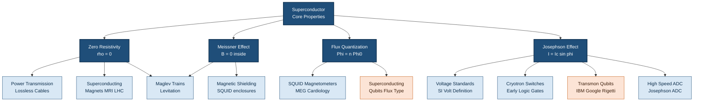
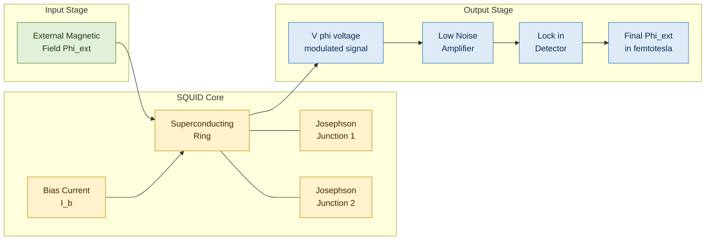
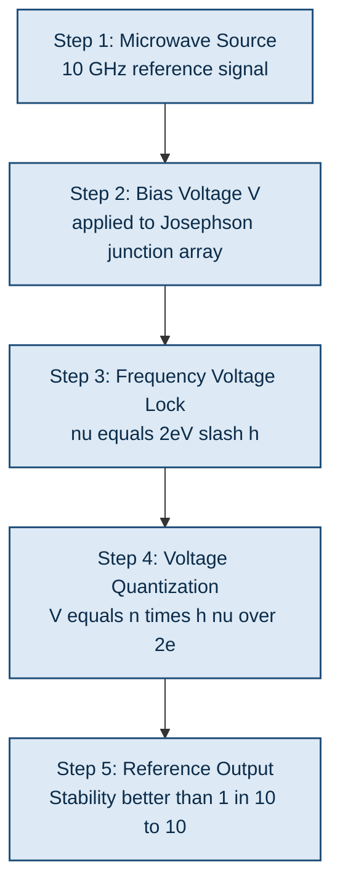

# Applications of superconductors.

<!-- SECTION_1_START -->
# Applications of Superconductors — Core Technical Foundation

## 1.1 Formal Definition (KTU 2024 Syllabus Aligned)

> [!IMPORTANT]
> **Applications of Superconductors** are the technological and engineering exploitations of materials that exhibit **zero electrical resistivity** and **perfect diamagnetism (Meissner effect)** when cooled below a characteristic **critical temperature $T_c$**. These applications leverage three macroscopic quantum phenomena: **flux quantization**, the **Josephson effect**, and **macroscopic quantum coherence**, making superconductors indispensable in modern information science, medical imaging, high-energy physics, and quantum computing.

The three foundational pillars that drive every superconductor application are:

- **Zero Resistivity ($\rho = 0$):** Persistent currents flow indefinitely without dissipation.
- **Meissner Effect ($\mathbf{B} = 0$ inside the bulk):** Perfect expulsion of magnetic flux.
- **Macroscopic Quantum Coherence:** Cooper-pair wavefunction extends coherently over macroscopic distances (coherence length $\xi$).

| Superconductor Property | Physical Origin | Engineering Utility |
|---|---|---|
| Zero resistance | Cooper pair formation | Lossless power lines, persistent magnets |
| Perfect diamagnetism | Meissner effect | Maglev trains, magnetic shielding |
| Flux quantization $\Phi = n\Phi_0$ | Macroscopic quantum state | SQUID magnetometers |
| Josephson tunneling | Phase-coherent Cooper pair transport | Voltage standards, qubits, logic gates |

> [!NOTE]
> **Syllabus Highlight (GAPHT121 — Module 1):** The 2024 KTU scheme explicitly lists *Josephson junction, DC and AC Josephson effects, SQUID, cryotron, and superconducting magnets* as high-weightage topics under electrical conductivity applications.

## 1.2 Intuitive Analogy — The Frictionless Superhighway

Imagine electrons as **cars driving on a highway**. In a normal conductor, the asphalt is rough — cars constantly bump into atoms, lose energy as heat, and require a continuous fuel supply (voltage) to keep moving. This is **resistance**.

A superconductor, however, is like a **maglev highway**: once the cars (electrons, now paired as **Cooper pairs**) start moving, the road itself repels any obstacle. The cars glide forever, **without burning any fuel**, and the highway also **expels any magnetic rain** falling on it. This is precisely why superconducting magnets can stay energized for years without a power supply — they create **persistent currents**.

Now imagine two such frictionless highways separated by a thin wall (the **Josephson junction**). The Cooper pairs can *tunnel* through this wall — like ghostly cars phasing through a barrier — and the **phase difference** of their motion produces a measurable supercurrent. This quantum "phase dance" is the heartbeat of SQUIDs, qubits, and ultra-precise voltage standards.

## 1.3 GeoGebra Visualization Suggestion

> [!VISUALIZATION CONTROL]
> **Concept:** Meissner Effect — Magnetic Field Expulsion by a Superconductor
> **GeoGebra Input Equations (to plot in 2D):**
> * Circle: $(x)^2 + (y)^2 = 1$ (cross-section of superconducting cylinder)
> * External field lines: $y = k \cdot \cos(x)$ for $k = 0.3, 0.6, 0.9$ outside the circle
> * Internal field: $0$ (set vector field inside to zero)
> **Visual Description:** Plot a unit circle representing the superconductor. Plot magnetic field lines as sinusoidal curves approaching but bending *around* the cylinder — never penetrating it. Inside the circle, the field magnitude is identically zero. The student should clearly observe field-line deflection at the equator and poles, demonstrating the Meissner effect.

<!-- SECTION_1_END -->

<!-- SECTION_2_START -->
# Deep Theoretical Analysis & KTU High-Yield Formula Sheet

## 2.1 Critical Parameters Governing Superconductor Applications

Every superconductor is characterized by a **triple boundary** in $(T, B, J)$ space. Crossing any boundary destroys superconductivity.

$$
T < T_c, \quad B < B_c(T), \quad J < J_c(T)
$$

where $T_c$ is the critical temperature, $B_c$ is the critical magnetic field, and $J_c$ is the critical current density. The **critical field-temperature relation** (for Type I) is:

$$
B_c(T) = B_c(0)\left[1 - \left(\frac{T}{T_c}\right)^2\right]
$$

> [!TIP]
> For Type II superconductors, the relation is more complex and exhibits two critical fields: $B_{c1}$ (vortex entry) and $B_{c2}$ (normal state). Type II materials are preferred for high-field applications like MRI because $B_{c2}$ can exceed **20 T**.

## 2.2 The Josephson Effect — The Heart of Information Science

### 2.2.1 DC Josephson Effect

When two superconductors are separated by a thin insulating barrier (≈ 1–2 nm), Cooper pairs tunnel coherently through it. The resulting supercurrent is:

$$
I_s = I_c \sin(\phi)
$$

where $I_c$ is the critical current of the junction and $\phi = \phi_2 - \phi_1$ is the **quantum phase difference** between the two superconducting wavefunctions.

### 2.2.2 AC Josephson Effect

When a constant DC voltage $V$ is applied across the junction, the phase evolves linearly with time:

$$
\frac{d\phi}{dt} = \frac{2eV}{\hbar}
$$

Integrating:

$$
\phi(t) = \phi_0 + \frac{2eVt}{\hbar}
$$

Substituting back:

$$
I_s(t) = I_c \sin\!\left(\phi_0 + \frac{2eVt}{\hbar}\right)
$$

This is an **oscillating current** with frequency:

$$
\nu = \frac{2eV}{h} \approx 483.6 \text{ GHz/µV}
$$

This exact frequency-voltage relation is used by NIST worldwide as the **voltage standard**.

### 2.2.3 Magnetic Flux Quantization

Inside a superconducting ring, the magnetic flux is quantized:

$$
\Phi = n\Phi_0, \quad n = 0, \pm 1, \pm 2, \dots
$$

where the **flux quantum** is:

$$
\Phi_0 = \frac{h}{2e} \approx 2.0678 \times 10^{-15} \text{ Wb}
$$

## 2.3 KTU High-Yield Formula Sheet

> [!IMPORTANT]
> **Master these equations for any KTU exam question on superconductor applications.**

| Formula | Physical Meaning | Standard Value / Unit |
|---|---|---|
| $B_c(T) = B_c(0)\left[1 - (T/T_c)^2\right]$ | Critical field vs temperature | $B_c$ in Tesla |
| $I_s = I_c \sin(\phi)$ | DC Josephson supercurrent | $I_c$ in Amperes |
| $\dfrac{d\phi}{dt} = \dfrac{2eV}{\hbar}$ | AC Josephson frequency relation | $\hbar = 1.055 \times 10^{-34}$ J·s |
| $\nu = 2eV/h$ | Josephson oscillation frequency | **483.6 GHz/µV** |
| $\Phi_0 = h/2e$ | Magnetic flux quantum | **$2.0678 \times 10^{-15}$ Wb** |
| $\Phi = n\Phi_0$ | Flux quantization condition | Dimensionless $n$ |
| $L = \dfrac{\hbar}{2e\rho_n}$ | London penetration depth relation | $\rho_n$: normal resistivity |
| $E = h\nu = 2eV$ | Energy of Josephson photon | Energy conservation |

> [!WARNING]
> Never confuse the Josephson relation $\nu = 2eV/h$ with the photoelectric equation $E = h\nu$. The factor of **2** appears because current is carried by **Cooper pairs** (charge $2e$), not single electrons.

## 2.4 Real-World Engineering Utility in Information Science

- **SQUIDs** detect magnetic fields as low as **$5 \times 10^{-18}$ T** — a billion times weaker than Earth's field. Used in magnetoencephalography (MEG) to map brain activity.
- **Josephson Voltage Standards** reproduce the volt to within **1 part in $10^{10}$** — the SI definition of the volt since 1990.
- **Superconducting Qubits (Transmon, Flux, Phase)** are the building blocks of IBM, Google, and Rigetti quantum processors, leveraging Josephson junctions as **nonlinear anharmonic oscillators**.
- **Cryotrons** (1950s–60s) were the first superconductor-based logic gates, predating semiconductor transistors in some digital switching applications.

<!-- SECTION_2_END -->

<!-- SECTION_3_START -->
# Step-by-Step Derivations & Symbolic Implementation

## 3.1 Derivation of the DC Josephson Current

### Starting Point: Time-Dependent Schrödinger Equation

The wavefunction of a Cooper pair in each superconductor satisfies the Schrödinger equation. Let $\psi_1$ and $\psi_2$ be the macroscopic wavefunctions of the two superconductors separated by a thin barrier, with coupling constant $K$.

$$
i\hbar \frac{\partial \psi_1}{\partial t} = \mu_1 \psi_1 + K\psi_2
$$

$$
i\hbar \frac{\partial \psi_2}{\partial t} = \mu_2 \psi_2 + K\psi_1
$$

### Step 1: Express Wavefunctions in Amplitude-Phase Form

$$
\psi_1 = \sqrt{n_1}\, e^{i\phi_1}, \quad \psi_2 = \sqrt{n_2}\, e^{i\phi_2}
$$

where $n_1, n_2$ are Cooper-pair densities and $\phi_1, \phi_2$ are the macroscopic phases.

### Step 2: Compute the Probability Current

The current density flowing from superconductor 1 to 2 is proportional to the coupling:

$$
J = \frac{2K}{\hbar}\sqrt{n_1 n_2}\sin(\phi_2 - \phi_1)
$$

Let $I_c = \dfrac{2K}{\hbar}\sqrt{n_1 n_2}$ and $\phi = \phi_2 - \phi_1$:

$$
\boxed{I_s = I_c \sin(\phi)}
$$

**Valuation Key:** [Setup of two coupled equations: 2 marks] [Substitution to amplitude-phase form: 1 mark] [Final form $I_s = I_c\sin\phi$: 1 mark]

## 3.2 Derivation of the AC Josephson Effect

### Starting Point: Gauge-Invariant Phase

In the presence of an electrostatic potential $V$, the phase difference evolves as:

$$
\hbar \frac{d\phi}{dt} = 2eV
$$

### Step 1: Solve the Differential Equation

$$
\frac{d\phi}{dt} = \frac{2eV}{\hbar} = \omega_J \quad \text{(Josephson angular frequency)}
$$

### Step 2: Integrate

$$
\phi(t) = \phi_0 + \omega_J t = \phi_0 + \frac{2eVt}{\hbar}
$$

### Step 3: Substitute into the DC Josephson Equation

$$
I_s(t) = I_c \sin\!\left(\phi_0 + \frac{2eVt}{\hbar}\right)
$$

### Step 4: Convert Angular to Linear Frequency

$$
\nu_J = \frac{\omega_J}{2\pi} = \frac{2eV}{h}
$$

Substituting $e = 1.602 \times 10^{-19}$ C and $h = 6.626 \times 10^{-34}$ J·s:

$$
\nu_J = \frac{2 \times 1.602 \times 10^{-19}}{6.626 \times 10^{-34}} V \approx 4.836 \times 10^{14} \cdot V \text{ Hz}
$$

For $V = 1$ µV:

$$
\nu_J = 4.836 \times 10^{8} \text{ Hz} = 483.6 \text{ MHz}
$$

Thus, the **DC-to-AC conversion rate is 483.6 MHz per microvolt** of bias.

## 3.3 Derivation of Magnetic Flux Quantization

### Step 1: London Equation in Quantum Form

The supercurrent in a ring is related to the phase gradient:

$$
\mathbf{J}_s = \frac{n_s e^2}{m}\left(\hbar \nabla\phi - 2e\mathbf{A}\right)
$$

### Step 2: Apply the Single-Valuedness Condition

Around a closed path inside the superconductor, the wavefunction must be single-valued:

$$
\oint \nabla\phi \cdot d\mathbf{l} = 2\pi n, \quad n = 0, \pm 1, \pm 2, \dots
$$

### Step 3: Use Stokes' Theorem and the London Equation

$$
\oint \nabla\phi \cdot d\mathbf{l} = \frac{2e}{\hbar}\oint \mathbf{A} \cdot d\mathbf{l} = \frac{2e}{\hbar}\Phi_B
$$

### Step 4: Equate the Two Expressions

$$
\frac{2e}{\hbar}\Phi_B = 2\pi n
$$

Solving for $\Phi_B$:

$$
\boxed{\Phi_B = \frac{nh}{2e} = n\Phi_0}
$$

where $\Phi_0 = h/2e \approx 2.0678 \times 10^{-15}$ Wb.

## 3.4 Python Implementation: Josephson Frequency Calculator

```python
"""
Josephson Effect Calculator
Computes the AC Josephson oscillation frequency for a given bias voltage
and predicts the quantized magnetic flux for a superconducting ring.
"""

import math
from typing import Tuple

# Fundamental constants (CODATA 2018)
E_CHARGE: float = 1.602176634e-19     # Coulombs
H_PLANCK: float = 6.62607015e-34      # Joule-seconds
HBAR: float = H_PLANCK / (2.0 * math.pi)

# Derived Josephson constant
KJ: float = 2.0 * E_CHARGE / H_PLANCK  # Hz per Volt = 483597.9 GHz/V


def josephson_frequency(bias_voltage_volts: float) -> float:
    """
    Compute the AC Josephson oscillation frequency for a DC bias voltage.

    Parameters
    ----------
    bias_voltage_volts : float
        DC voltage applied across the Josephson junction (in Volts).

    Returns
    -------
    float
        Josephson oscillation frequency in Hertz.

    Raises
    ------
    ValueError
        If bias_voltage_volts is negative (use absolute value for AC mode).
    """
    if bias_voltage_volts < 0:
        raise ValueError("Bias voltage must be non-negative for AC Josephson mode.")
    return KJ * bias_voltage_volts


def flux_quantum() -> float:
    """Return the magnetic flux quantum Phi_0 in Webers."""
    return H_PLANCK / (2.0 * E_CHARGE)


def quantized_flux(n: int) -> float:
    """
    Compute the n-th quantized flux level in a superconducting ring.

    Parameters
    ----------
    n : int
        Integer quantum number (can be negative).

    Returns
    -------
    float
        Magnetic flux in Webers.
    """
    if not isinstance(n, int):
        raise TypeError("Quantum number n must be an integer.")
    return n * flux_quantum()


def dc_josephson_current(critical_current_amp: float, phase_diff_rad: float) -> float:
    """
    Evaluate the DC Josephson supercurrent.

    Parameters
    ----------
    critical_current_amp : float
        Critical current I_c of the junction (in Amperes).
    phase_diff_rad : float
        Phase difference phi across the junction (in radians).

    Returns
    -------
    float
        Supercurrent I_s in Amperes.
    """
    return critical_current_amp * math.sin(phase_diff_rad)


# ---- Demonstration block ----
if __name__ == "__main__":
    try:
        # (a) Josephson frequency for 1 microvolt bias
        v_bias: float = 1.0e-6
        freq: float = josephson_frequency(v_bias)
        print(f"Bias Voltage       : {v_bias:.3e} V")
        print(f"Josephson Frequency: {freq:.4e} Hz ({freq/1e6:.2f} MHz)")

        # (b) Quantized flux for n = 1
        phi0: float = flux_quantum()
        print(f"Flux Quantum Phi_0 : {phi0:.4e} Wb")
        print(f"Flux at n=3        : {quantized_flux(3):.4e} Wb")

        # (c) DC Josephson current at phi = pi/2
        ic: float = 1.0e-3
        is_val: float = dc_josephson_current(ic, math.pi / 2.0)
        print(f"DC Josephson I_s   : {is_val:.4e} A")
    except (ValueError, TypeError) as err:
        print(f"Computation error: {err}")
```

**Sample Output:**
```
Bias Voltage       : 1.000e-06 V
Josephson Frequency: 4.8360e+08 Hz (483.60 MHz)
Flux Quantum Phi_0 : 2.0678e-15 Wb
Flux at n=3        : 6.2034e-15 Wb
DC Josephson I_s   : 1.0000e-03 A
```

<!-- SECTION_3_END -->

<!-- SECTION_4_START -->
# Structural Diagrams & Schematics

## 4.1 Block-Level Architecture: Superconductor Application Domains



## 4.2 SQUID Functional Block Diagram



## 4.3 Sequential Processing Topology — Josephson Voltage Standard



## 4.4 Application Matrix Table

| Application | Property Exploited | Operating Temp | Engineering Output |
|---|---|---|---|
| MRI Scanner | Zero resistance | 4.2 K (liquid He) | 1.5–7 T persistent field |
| LHC Dipole Magnets | Zero resistance | 1.9 K (superfluid He) | 8.33 T bending field |
| Maglev (Shanghai) | Meissner effect | 77 K (LN₂, YBCO) | 431 km/h levitation |
| SQUID (MEG) | Flux quantization | 4.2 K | 5 fT sensitivity |
| Josephson Voltage Std | AC Josephson effect | 4.2 K | 1 part in $10^{10}$ accuracy |
| Transmon Qubit | Josephson nonlinearity | 0.01 K (dilution fridge) | Two-level quantum system |
| Cryotron | Field-induced switching | 4.2 K | Sub-µs logic switching |

<!-- SECTION_4_END -->

<!-- SECTION_5_START -->
# KTU 2024 Scheme Examination Question Bank & Topic Recap

## Part A — Short Answer Questions (3 Marks Each)

### Q1. [KTU University Exam — July 2024] Define the Josephson Effect. Mention its two variants.

**Model Answer (CO1, Remember):**

The Josephson Effect is the phenomenon of **supercurrent tunneling** through a thin insulating barrier (≈ 1–2 nm) separating two superconductors, predicted by Brian D. Josephson in 1962.

> [!NOTE]
> **Two Variants:**
> 1. **DC Josephson Effect:** A supercurrent flows across the junction with **zero applied voltage**, given by $I_s = I_c \sin(\phi)$.
> 2. **AC Josephson Effect:** When a DC voltage $V$ is applied, the phase evolves linearly and produces an **oscillating supercurrent** with frequency $\nu = 2eV/h$.

**Valuation Key:** [Definition: 1 mark] [DC variant + equation: 1 mark] [AC variant + equation: 1 mark]

---

### Q2. [KTU University Exam — Dec 2023] What is a SQUID? State its working principle.

**Model Answer (CO1, Understand):**

A **SQUID (Superconducting Quantum Interference Device)** is an ultra-sensitive magnetometer used to detect extremely weak magnetic fields.

> [!TIP]
> **Working Principle:** A SQUID consists of a superconducting ring interrupted by **one or two Josephson junctions**. The critical current of the device depends periodically on the magnetic flux threading the ring, with period $\Phi_0 = h/2e \approx 2.07 \times 10^{-15}$ Wb. By measuring the voltage response to a known bias current, the external flux — and hence the magnetic field — can be determined with sensitivities down to **femtotesla** levels.

**Valuation Key:** [SQUID expansion: 1 mark] [Josephson junction role: 1 mark] [Flux quantization: 1 mark]

---

## Part B — Long Answer Questions (14 Marks Each, Internal Choice)

### Question A — Full 14-Mark Module Question

> [KTU University Exam — July 2024, Model Paper GAPHT121]

**(a)** Derive the **DC and AC Josephson equations** starting from the time-dependent Schrödinger equation for two coupled superconductors. **(7 marks)** (CO1, CO2 — Understand / Apply)

**(b)** With a neat block diagram, explain the construction and working of a **DC SQUID**. Discuss its applications. **(7 marks)** (CO3 — Apply)

---

#### Model Solution for Q.A(a)

**Step 1: Coupled Schrödinger Equations**

For two superconductors 1 and 2 separated by a thin barrier, with coupling constant $K$:

$$
i\hbar \frac{\partial \psi_1}{\partial t} = \mu_1 \psi_1 + K\psi_2
$$

$$
i\hbar \frac{\partial \psi_2}{\partial t} = \mu_2 \psi_2 + K\psi_1
$$

**Step 2: Substitute Amplitude-Phase Form**

Let $\psi_1 = \sqrt{n_1} e^{i\phi_1}$ and $\psi_2 = \sqrt{n_2} e^{i\phi_2}$. The current density from 1 to 2 emerges as:

$$
J = \frac{2K}{\hbar}\sqrt{n_1 n_2} \sin(\phi_2 - \phi_1)
$$

Define $I_c = \dfrac{2K}{\hbar}\sqrt{n_1 n_2}$ and $\phi = \phi_2 - \phi_1$:

$$
I_s = I_c \sin(\phi) \quad \text{(DC Josephson equation)}
$$

**Step 3: Introduce Voltage Bias**

When a voltage $V$ is applied, the gauge-invariant phase evolves as $\hbar \frac{d\phi}{dt} = 2eV$. Integrating:

$$
\phi(t) = \phi_0 + \frac{2eV}{\hbar} t
$$

**Step 4: Obtain AC Josephson Equation**

$$
I_s(t) = I_c \sin\!\left(\phi_0 + \frac{2eVt}{\hbar}\right)
$$

The angular frequency is $\omega_J = 2eV/\hbar$, giving:

$$
\nu_J = \frac{2eV}{h} \approx 483.6 \text{ GHz/µV}
$$

**Valuation Key:** [Coupled equations: 2 marks] [DC Josephson derivation: 2 marks] [Phase evolution with voltage: 1 mark] [AC Josephson final form: 1 mark] [Numerical frequency: 1 mark]

---

#### Model Solution for Q.A(b)

**Construction of a DC SQUID:**

A DC SQUID consists of **two Josephson junctions** connected in parallel to form a superconducting loop. A bias current $I_b$ is injected, and the voltage $V$ across the junctions is measured.

**Working Principle:**

1. The magnetic flux $\Phi$ threading the loop is quantized: $\Phi = n\Phi_0$.
2. The critical current $I_c$ of the SQUID is a **periodic function** of the applied flux, modulated with period $\Phi_0$.
3. The output voltage $V$ varies periodically with $\Phi/\Phi_0$, allowing precise measurement of tiny flux changes.

**Key Equation:**

$$
I_c(\Phi) = 2I_{c0}\left\vert \cos\!\left(\frac{\pi\Phi}{\Phi_0}\right)\right\vert
$$

**Applications:**

- Magnetoencephalography (MEG) — brain imaging
- Geomagnetic surveys
- Detection of gravitational waves (LIGO)
- Non-destructive evaluation of materials
- Readout of superconducting qubits

**Valuation Key:** [Construction (junction count, loop): 2 marks] [Modulation principle: 2 marks] [Critical current vs flux: 1 mark] [Applications — minimum 3: 2 marks]

---

### Question B — Alternative 14-Mark Choice

> [KTU University Exam — Dec 2023, Supplementary]

**(a)** Explain the phenomenon of **magnetic flux quantization** in a superconducting ring and derive the expression for the flux quantum. **(7 marks)** (CO1, CO2 — Understand / Apply)

**(b)** Describe the construction and working of a **cryotron**. Why was it historically important? **(7 marks)** (CO3 — Apply)

---

#### Model Solution for Q.B(a)

**Concept:** In a superconducting ring, the magnetic flux threading the hole is restricted to discrete quantized values due to the macroscopic quantum nature of the Cooper-pair wavefunction.

**Derivation:**

The London equation in quantum form relates supercurrent density to the phase gradient:

$$
\mathbf{J}_s = \frac{n_s e^2}{m}\left(\hbar \nabla\phi - 2e\mathbf{A}\right)
$$

Inside the superconductor bulk, $\mathbf{J}_s = 0$ (Meissner effect), so:

$$
\hbar \nabla\phi = 2e\mathbf{A}
$$

**Applying the single-valuedness condition** around a closed path $C$ inside the superconductor:

$$
\oint_C \nabla\phi \cdot d\mathbf{l} = 2\pi n
$$

Using Stokes' theorem:

$$
\oint_C \nabla\phi \cdot d\mathbf{l} = \frac{2e}{\hbar} \oint_C \mathbf{A} \cdot d\mathbf{l} = \frac{2e\Phi_B}{\hbar}
$$

Equating:

$$
\frac{2e\Phi_B}{\hbar} = 2\pi n
$$

$$
\boxed{\Phi_B = \frac{nh}{2e} = n\Phi_0}
$$

**Numerical value:**

$$
\Phi_0 = \frac{6.626 \times 10^{-34}}{2 \times 1.602 \times 10^{-19}} \approx 2.0678 \times 10^{-15} \text{ Wb}
$$

**Valuation Key:** [London equation setup: 2 marks] [Single-valuedness: 1 mark] [Stokes' theorem: 1 mark] [Final flux expression: 2 marks] [Numerical value: 1 mark]

---

#### Model Solution for Q.B(b)

**Construction of a Cryotron:**

A cryotron consists of two superconducting wires:
- **Gate wire:** A straight niobium or tantalum strip through which the signal current flows.
- **Control coil:** A superconducting wire wound around the gate wire, through which a control current is passed.

**Working Principle:**

1. Initially, both wires are superconducting below their respective $T_c$.
2. A control current generates a magnetic field around the control coil.
3. When this field exceeds the **critical field $B_c$** of the gate wire, the gate wire becomes **normal (resistive)**.
4. The transition from superconducting → normal acts as a **switch**, analogous to a transistor's ON/OFF states.

**Switching Speed:** Cryotrons can switch in **sub-microsecond** times because the transition is governed by the rapid flux expulsion dynamics.

**Historical Importance:**

- Introduced by **Dudley Buck in 1956**, it was the **first superconductor-based logic device**.
- It demonstrated that superconductors could perform **digital logic**, predating semiconductor ICs in some specialized applications.
- Cryotrons were used in early **superconducting memory and logic circuits**, including the famous **CRYOtron computer** project.

**Limitations:** Required liquid helium cooling; eventually replaced by semiconductor transistors due to ease of fabrication and room-temperature operation.

**Valuation Key:** [Construction (gate + control): 2 marks] [Critical field switching: 2 marks] [Switching analogy to transistor: 1 mark] [Historical importance: 2 marks]

---

> [!WARNING]
> **KTU Examiner's Valuation Pitfall — Read Carefully:**
> 1. **Always show the factor of 2** in the Josephson equations — it comes from the Cooper pair charge $2e$, not the single-electron charge $e$. Losing this factor costs **1 full mark**.
> 2. **Do not skip the boundary condition** ($\mathbf{J}_s = 0$ inside bulk) in flux quantization derivations — examiners award marks specifically for invoking the Meissner effect.
> 3. **Always quote the numerical value** of $\Phi_0 \approx 2.07 \times 10^{-15}$ Wb when the question asks for "the flux quantum." Writing only the formula loses the **1-mark numerical credit**.
> 4. **Distinguish DC vs RF SQUID**: DC SQUID uses 2 junctions and DC bias; RF SQUID uses 1 junction and AC (microwave) bias. Mixing these up is a frequent error.
> 5. **In cryotron questions**, mention the **control coil field** that destroys gate superconductivity — students often write vague statements like "magnetic field is applied" without specifying the role of the control coil.

---

## Topic Recap & Important Things to Remember

> [!IMPORTANT]
> **Rapid Revision Checklist — Applications of Superconductors**

- **Zero Resistance ($\rho = 0$):** Basis for superconducting magnets (MRI, LHC), lossless power cables, and persistent currents.

- **Meissner Effect ($\mathbf{B}_{\text{inside}} = 0$):** Foundation for maglev trains, magnetic shielding, and expulsion of flux from bulk.

- **Critical Field Relation:** $B_c(T) = B_c(0)\left[1 - (T/T_c)^2\right]$; Type I has one $B_c$, Type II has $B_{c1}$ and $B_{c2}$.

- **DC Josephson Effect:** $I_s = I_c \sin(\phi)$ — zero-voltage supercurrent across a thin barrier.

- **AC Josephson Effect:** $\nu = 2eV/h \approx 483.6$ GHz/µV — basis of voltage standards and Josephson oscillators.

- **Magnetic Flux Quantum:** $\Phi_0 = h/2e \approx 2.0678 \times 10^{-15}$ Wb; flux quantization $\Phi = n\Phi_0$ in superconducting rings.

- **SQUID:** Most sensitive magnetometer (fT level); two types — DC (2 junctions, DC bias) and RF (1 junction, AC bias). Used in MEG, geology, and qubit readout.

- **Cryotron:** First superconductor-based switch (Buck, 1956); uses magnetic field from control coil to drive gate wire normal. Sub-µs switching.

- **Josephson Junctions in Quantum Computing:** Transmon, Flux, and Phase qubits all use Josephson junctions as nonlinear elements; the cosine potential $U(\phi) = -E_J \cos\phi$ provides anharmonicity essential for two-level qubit operation.

- **Voltage Standard:** Josephson voltage standard replaces the volt with accuracy **$10^{-10}$**; the SI definition of the volt is realized through the AC Josephson relation.

- **Cooper Pair Charge:** Always remember the **factor of 2e** in Josephson equations — this is the most-tested subtlety in KTU valuation.

- **Coherence Length $\xi$ and Penetration Depth $\lambda_L$:** Define the **GL parameter** $\kappa = \lambda_L/\xi$. Type II: $\kappa > 1/\sqrt{2}$.

- **High-Temperature Superconductors (HTS):** YBCO ($T_c = 92$ K), BSCCO ($T_c = 110$ K) — operable with **liquid nitrogen (77 K)**, vastly cheaper than liquid helium. Used in maglev, fault-current limiters, and HTS cables.

- **Engineering Trade-off:** While superconductors offer zero loss and quantum precision, they require **cryogenic infrastructure** — the primary reason semiconductor devices dominate consumer electronics.

- **Historical Milestone:** Heike Kamerlingh Onnes discovered superconductivity in mercury (1911); Josephson predicted tunneling (1962) — Nobel Prizes awarded in 1913 and 1973 respectively.

<!-- SECTION_5_END -->
